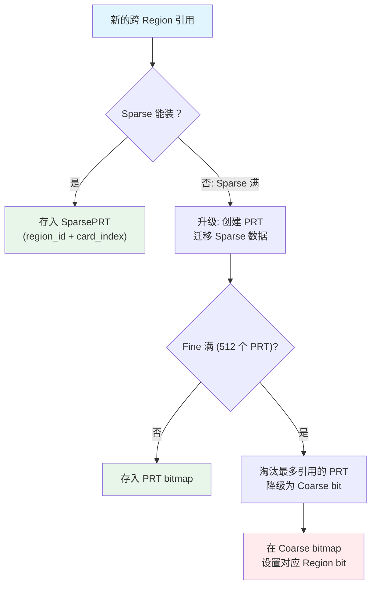
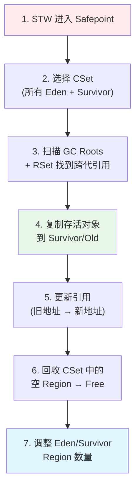
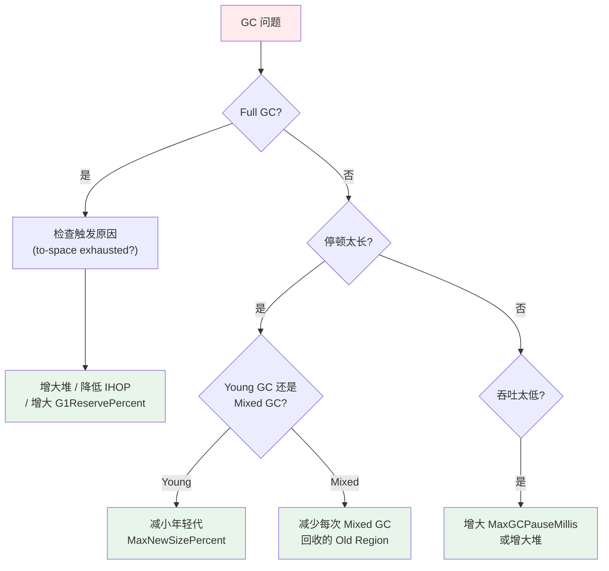

# G1 GC 面试指南

> 基于 OpenJDK 11 源码深度分析
> 面试覆盖：Region 架构、写屏障、RSet、并发标记、Young GC、Mixed GC、Full GC、GC 调优
> 标准环境：-Xms8g -Xmx8g -XX:+UseG1GC，G1 Region = 4MB，2048 个 Region

---

## 第 0 部分：核心原理 ⭐

### 0.1 本质是什么？

本文是 **G1 GC 面试指南** 的面试准备材料：提炼核心知识点，给出标准答案框架，帮助在面试中清晰、准确地表达 JVM 内部原理。

### 0.2 为什么需要？

面试中的 JVM 问题往往需要在 2-3 分钟内讲清楚复杂机制。没有提前整理，很容易在细节上迷失，无法展示对整体的把握。

### 0.3 怎么解决？

按「本质→为什么→怎么实现→关键细节」的结构组织答案，确保回答既有深度又有条理。

### 0.4 为什么这样设计？

面试答案的设计原则：先给结论，再给理由；先讲整体，再讲细节；用类比帮助面试官理解复杂概念。

---


## 0. 核心原理

### 0.1 本质是什么？

G1（Garbage-First）是一个面向大堆、低延迟的分代垃圾收集器。它将堆打散成大量等大小的 Region，每次 GC 只选择"垃圾最多"的一部分 Region 回收，从而将停顿时间控制在目标范围内（默认 200ms）。

### 0.2 为什么需要深入理解？

**面试高频**：
- Region 架构设计（必问）
- 写屏障 + RSet（高频难点）
- 并发标记 SATB（区分度极高）
- Mixed GC 触发条件与调优

**实战价值**：
- 分析 GC 日志定位性能问题
- 调优停顿时间和吞吐量
- 理解 Full GC 退化原因并避免

> **与前两篇的关系**：对象分配中的 TLAB 机制见 [Interview/1](./1-Object-Lifecycle-Interview-Guide.md)；Safepoint/VMThread 见 [Interview/2](./2-Thread-Concurrency-Interview-Guide.md)。本篇不重复这些内容。

---

## 一、Region 架构

### Q1：G1 为什么要把堆切成 Region？⭐⭐

**一句话结论**：
Region 化使 G1 能**增量回收**——每次只收一部分 Region，停顿时间可控；同时 Region 角色可动态切换，实现灵活分代。

**源码级回答**：

传统 GC（Serial、Parallel）将堆分为固定的连续 Young + Old 区域。堆越大，Full GC 扫描整个 Old 区的停顿就越不可控。

G1 的核心创新：将 8GB 堆切成 2048 个 4MB 的 Region，每次 GC 只选择一部分 Region 组成 Collection Set（CSet），停顿时间 ≈ f(CSet大小)，而非 f(堆大小)。

**Region 大小计算**：
```cpp
// src/hotspot/share/gc/g1/heapRegion.cpp
// Region 大小 = 堆大小 / 目标Region数(2048)，然后取 2 的幂，范围 [1MB, 32MB]
// 8GB / 2048 = 4MB → 刚好是 2 的幂 → RegionSize = 4MB
```

**补充**：可通过 `-XX:G1HeapRegionSize=4m` 手动指定。

---

### Q2：HeapRegion 有哪几种类型？⭐⭐

**一句话结论**：
4 种逻辑角色——**Free、Eden、Survivor、Old**，加上大对象特殊处理的 **Humongous**（分 StartsHumongous + ContinuesHumongous）。

**源码**：`src/hotspot/share/gc/g1/heapRegionType.hpp`

| 类型 | 标记值 | 含义 |
|------|--------|------|
| Free | 0 | 空闲，等待分配 |
| Eden | 8 | 年轻代 Eden |
| Survivor | 9 | 年轻代 Survivor |
| Old | 4 | 老年代 |
| StartsHumongous | 2 | 大对象起始 Region |
| ContinuesHumongous | 3 | 大对象续接 Region |

**大对象判定**：对象大小 > RegionSize / 2 = 2MB 即为 Humongous，直接分配到老年代的连续 Region 中。

---

### Q3：HeapRegion 对象本身有多大？关键字段有哪些？⭐⭐⭐

**一句话结论**：
`sizeof(HeapRegion) = 432 字节`，继承链 4 层，关键字段包括 `_bottom/_end`（边界）、`_top`（分配水位线）、`_type`（角色）、`_rem_set`（RSet）。

**继承链**：
```
CHeapObj<mtGC> → Space(56B) → CompactibleSpace(88B) → G1ContiguousSpace(296B) → HeapRegion(432B)
```

**关键字段**（源码：`heapRegion.hpp`）：

| 字段 | 类型 | 偏移 | 含义 |
|------|------|------|------|
| `_bottom` | `HeapWord*` | 0x008 | Region 起始地址（Space 层） |
| `_end` | `HeapWord*` | 0x010 | Region 结束地址（Space 层） |
| `_top` | `HeapWord*` | 0x058 | 当前分配水位线（volatile） |
| `_type` | `HeapRegionType` | 0x128 | Region 角色（Tag 枚举） |
| `_rem_set` | `HeapRegionRemSet*` | 0x138 | 指向该 Region 的 RSet |
| `_hrm_index` | `uint` | 0x130 | Region 编号（0~2047） |
| `_gc_efficiency` | `double` | 0x1A0 | GC 效率（垃圾比例），用于 CSet 选择排序 |

**GDB 验证**：
```
(gdb) p sizeof(HeapRegion)
$1 = 432
```

> 详细内存布局见 [G1GC/1-HeapRegion-Deep-Dive.md](../G1GC/1-HeapRegion-Deep-Dive.md)

---

## 二、写屏障与 CardTable

### Q4：G1 的写屏障做了什么？和 CMS 有什么区别？⭐⭐⭐

**一句话结论**：
G1 有**双屏障**——写前的 SATB Pre-Barrier（保护并发标记正确性）和写后的 Post-Barrier（记录跨 Region 引用变化）。CMS 只有 Post-Barrier。

**源码**：`src/hotspot/share/gc/g1/g1BarrierSet.inline.hpp`

**Post-Write Barrier（始终活跃）**：
```cpp
// 精简展示（完整源码见 g1BarrierSet.inline.hpp 的 write_ref_field_post()）
// 每次 obj.field = new_val 之后执行
void post_barrier(oop* field, oop new_val) {
    // 1. 同 Region 引用？跳过
    if (region_of(field) == region_of(new_val)) return;

    // 2. 计算 card 地址
    jbyte* card = card_table_base + ((uintptr_t)field >> 9);

    // 3. 已经是脏卡？跳过（减少重复入队）
    if (*card == G1CardTable::dirty_card_val()) return;

    // 4. 标脏
    *card = G1CardTable::dirty_card_val();

    // 5. 入队线程本地 DirtyCardQueue
    thread->dirty_card_queue().enqueue(card);
}
```

**Pre-Write Barrier（SATB，仅并发标记期间活跃）**：
```cpp
// 精简展示（完整源码见 g1BarrierSet.inline.hpp 的 write_ref_field_pre()）
// 每次 obj.field = new_val 之前执行
void pre_barrier(oop* field) {
    if (!marking_active) return;  // 非标记期，直接跳过

    oop old_val = *field;         // 读取旧值
    if (old_val == NULL) return;

    // 将旧值入队 SATB 队列，防止并发标记期间漏标
    thread->satb_mark_queue().enqueue(old_val);
}
```

**G1 vs CMS 写屏障对比**：

| 维度 | G1 | CMS |
|------|------|------|
| 屏障数量 | Pre + Post（双屏障） | 仅 Post |
| Post 粒度 | card 级别，同 Region 跳过 | card 级别 |
| Pre 用途 | SATB 保护并发标记正确性 | 无 |
| 并发标记算法 | SATB（Snapshot-At-The-Beginning） | Incremental Update |
| 额外开销 | 较高（双屏障 + 入队操作） | 较低 |

---

### Q5：CardTable 的结构和映射关系？⭐⭐

**一句话结论**：
CardTable 是一个字节数组，每个字节（card）映射堆中连续 512 字节。标记为 dirty 表示该 512B 区域中有引用被修改。

**映射关系**：
```
堆地址 → card 索引: card_index = (addr - heap_base) >> 9  (即 ÷ 512)

标准条件下:
  堆大小 = 8GB = 8 × 1024 × 1024 × 1024 = 8,589,934,592 bytes
  card 数量 = 8GB / 512 = 16,777,216 (16M)
  CardTable 大小 = 16MB
  每个 Region (4MB) 有 8192 个 card
```

**card 值含义**（源码：`cardTable.hpp` + `g1CardTable.hpp`）：

| 值 | 常量名 | 含义 |
|----|--------|------|
| -1 (0xFF) | clean_card | 干净卡 |
| 0 | dirty_card | 脏卡（需要 refinement） |
| 32 (0x20) | g1_young_gen | 年轻代卡（不需要处理，跳过） |

---

### Q6：脏卡从写屏障到 RSet 的完整数据流？⭐⭐⭐

**一句话结论**：
写屏障标脏 card → 入队线程本地 DirtyCardQueue → 满了提交到全局 DirtyCardQueueSet → Concurrent Refinement 线程消费 → 扫描 card 找到跨 Region 引用 → 更新目标 Region 的 RSet。

**数据流图**：


**Concurrent Refinement 线程动态扩缩**：
- 全局队列积压少 → 0 个线程工作
- 积压增加 → 逐步唤醒更多 refinement 线程（最多 `G1ConcRefinementThreads` 个，默认约 CPU 核数）
- 积压严重 → 应用线程自己做 refinement（惩罚机制）

---

## 三、RSet 三级结构

### Q7：RSet 的三级结构是什么？为什么要分级？⭐⭐⭐

**一句话结论**：
RSet 按引用密度自适应存储——**Sparse（哈希+12条记录）→ Fine（PRT，8192-bit bitmap）→ Coarse（2048-bit 全局 bitmap）**，以空间换精度：引用越密集，精度越低，空间越省。

**为什么需要三级？** 如果所有 Region 都用 Fine 级（每来源 Region 一个 ~1.1KB 的 bitmap），最坏情况 2048×2048×1.1KB ≈ 4GB，不可接受。实际大部分 Region 间只有零星引用，用 Sparse 级即可。

**三级结构详解**：

| 级别 | 数据结构 | 粒度 | 容量 | 内存开销 |
|------|---------|------|------|---------|
| **Sparse** | SparsePRT (哈希表) | 每条记录: Region ID + card offset | 默认 4 个 bucket × 每个 bucket 链表 | 很小 |
| **Fine** | PerRegionTable (PRT) | 每来源 Region 一个 8192-bit bitmap | 最多 512 个 PRT | ~1.1KB × 512 = ~560KB |
| **Coarse** | CHeapBitMap | 每 Region 一个 bit | 2048 bit = 256 字节 | 256B（固定） |

**升级触发**：



**Coarse 的代价**：退化到 Coarse 意味着只知道"某个 Region 有指向我的引用"，但不知道具体是哪个 card。GC 扫描时必须扫描该来源 Region 的全部 8192 个 card（4MB），**性能退化严重**。

---

### Q8：RSet 的内存开销有多大？如何控制？⭐⭐

**一句话结论**：
正常情况 RSet 占堆的 1%~5%，极端情况可能超过 20%。通过 `-XX:G1RSetUpdatingPauseTimePercent`（默认 10%）控制 GC 停顿中更新 RSet 的时间比例。

**内存估算**（标准 8GB 堆）：

| 场景 | 估算 |
|------|------|
| 所有 Region 都是 Sparse | 2048 × ~200B ≈ 400KB |
| 50% Region 有 Fine 级 | 1024 × 560KB ≈ 560MB |
| 大量跨 Region 引用 | 可能占堆 10%~20% |

**关键参数**：
```bash
-XX:G1RSetUpdatingPauseTimePercent=10  # STW 中花在 RSet 更新的时间占比
-XX:G1ConcRefinementThreads=N         # 并发 refinement 线程数
```

---

## 四、并发标记与 SATB

### Q9：G1 并发标记的 5 个阶段是什么？⭐⭐⭐

**一句话结论**：
**Initial Mark（STW，搭车 Young GC）→ Root Region Scan → Concurrent Mark → Remark（STW）→ Cleanup（STW + 并发）**

**源码**：`src/hotspot/share/gc/g1/g1ConcurrentMarkThread.cpp`

| 阶段 | STW? | 做什么 | 耗时 |
|------|------|--------|------|
| **Initial Mark** | STW | 标记 GC Roots 直接引用的对象；**搭车（piggyback）在 Young GC 上**，不额外 STW | 很短 |
| **Root Region Scan** | 并发 | 扫描 Survivor Region（它们是 Old 区的根） | 短 |
| **Concurrent Mark** | 并发 | 从根出发遍历所有可达对象，使用双 128MB bitmap | 较长 |
| **Remark** | STW | 处理 SATB 队列中残留的引用，完成标记 | 中等 |
| **Cleanup** | STW+并发 | 统计每个 Region 的存活比例，回收全空 Region，排序确定 CSet | 短 |

**Initial Mark 搭车原理**：

```
正常 Young GC:
  VM_G1CollectForAllocation::doit()
    → G1CollectedHeap::do_collection_pause_at_safepoint()
      → g1_policy()->decide_on_conc_mark_initiation()
        → 如果 Old 占用超过 IHOP → 设置 initiate_conc_mark = true
      → 如果 initiate_conc_mark → 在 Young GC 过程中同时完成 Initial Mark
```

不需要单独 STW，这是 G1 的关键性能优化之一。

---

### Q10：SATB 和 Incremental Update 有什么区别？G1 为什么选 SATB？⭐⭐⭐

**一句话结论**：
SATB（Snapshot-At-The-Beginning）在标记开始时拍快照，保护所有快照时刻存活的对象不被漏标；Incremental Update 跟踪标记期间新增的引用。G1 选 SATB 因为它的 Remark 阶段更快。

**核心区别**：

| 维度 | SATB (G1) | Incremental Update (CMS) |
|------|-----------|--------------------------|
| 保护时机 | 写**前**保存旧值 | 写**后**记录新引用 |
| 保护对象 | 被覆盖（断开）的引用 | 新建立的引用 |
| Remark 工作量 | 处理 SATB 队列（固定大小） | 重新扫描所有脏卡（量不确定） |
| 浮动垃圾 | 可能多一些（快照时活但标记中死的对象） | 较少 |

**G1 选 SATB 的原因**：
- CMS 的 Incremental Update 在 Remark 时需要重新扫描所有脏卡 → 堆越大 Remark 越慢
- SATB 的 Remark 只需处理 SATB 队列中的条目 → 工作量与标记期间的写入次数成正比，与堆大小无关
- G1 面向大堆（数十 GB），Remark 的可预测性更重要

**SATB Pre-Barrier 触发条件**（源码：`g1BarrierSet.inline.hpp`）：
```cpp
// 仅在并发标记激活时执行
if (G1ThreadLocalData::satb_mark_queue_active(thread)) {
    oop old_val = *field;
    if (old_val != NULL) {
        SATBMarkQueue::enqueue(old_val);  // 保护旧值
    }
}
```

---

### Q11：并发标记使用的 bitmap 有多大？⭐⭐

**一句话结论**：
两个 bitmap，各 128MB。`_next_mark_bitmap`（当前标记用）和 `_prev_mark_bitmap`（上次标记结果），每个 bit 对应堆中 8 字节（一个 HeapWord）。

**计算**：
```
8GB 堆 / 8 bytes/bit = 1G bits = 128MB/bitmap
两个 bitmap 共 256MB
```

**为什么要两个？** 上次标记的结果（prev）在当前 GC 中仍需使用（确定存活对象），同时新一轮标记写入 next。标记完成后交换。

---

## 五、Young GC 与 Mixed GC

### Q12：Young GC 的触发条件和流程？⭐⭐

**一句话结论**：
Eden Region 用完时触发。STW 下将所有 Eden + Survivor Region 作为 CSet，存活对象复制到新的 Survivor 或 Old Region。

**触发条件**：
```cpp
// 分配失败 → 尝试扩展 Eden → 仍失败 → 触发 Young GC
// 入口：G1CollectedHeap::attempt_allocation_slow()
//   → do_collection_pause_at_safepoint()
```

**7 步流程**：



**关键性能数据**：
- 年轻代默认占堆的 5%~60%（`G1NewSizePercent=5`，`G1MaxNewSizePercent=60`）
- 标准条件下初始约 100~200 个 Eden Region
- Young GC 停顿通常 10~50ms

---

### Q13：Mixed GC 和 Young GC 有什么区别？⭐⭐⭐

**一句话结论**：
Mixed GC = Young GC + 部分 Old Region。在并发标记完成后触发，每次 Mixed GC 选择若干垃圾最多的 Old Region 一起回收。

**Young GC vs Mixed GC**：

| 维度 | Young GC | Mixed GC |
|------|----------|----------|
| CSet 组成 | 所有 Eden + Survivor | 所有 Eden + Survivor + **部分 Old** |
| 触发条件 | Eden 满 | 并发标记完成后，Eden 满 |
| Old Region 选择 | 无 | 按 `_gc_efficiency` 排序，垃圾最多的优先 |
| 次数 | 持续发生 | 一轮标记后连续几次，直到 Old 回收比例达标 |

**Mixed GC 触发链路**：
```
并发标记 Cleanup 阶段
  → 统计每个 Old Region 的存活比例
  → 按 gc_efficiency 排序
  → 设置 mixed_gc_pending = true
  → 下次 Eden 满时，执行 Mixed GC 而非纯 Young GC
```

**关键参数**：
```bash
-XX:G1MixedGCCountTarget=8           # 一轮混合 GC 的目标次数
-XX:G1HeapWastePercent=5             # 可回收垃圾低于此比例时停止 Mixed GC
-XX:G1MixedGCLiveThresholdPercent=85 # 存活率超过此值的 Old Region 不回收
```

---

### Q14：什么是 IHOP？它如何控制并发标记的启动？⭐⭐

**一句话结论**：
IHOP（Initiating Heap Occupancy Percent）是触发并发标记的老年代占用阈值，默认 45%。自适应 IHOP 会根据历史数据动态调整。

**源码**：`src/hotspot/share/gc/g1/g1Policy.cpp`

**触发逻辑**：
```
每次 Young GC 结束后检查:
  if (old_gen_occupancy > IHOP × 堆大小) {
    在下次 Young GC 中 piggyback Initial Mark
    启动并发标记周期
  }
```

**自适应 IHOP**（`-XX:+G1UseAdaptiveIHOP`，默认开启）：
- 根据并发标记耗时、分配速率、老年代增长速率动态调整
- 目标：确保并发标记能在 Old 区用完之前完成
- 如果设置过高 → 并发标记来不及完成 → 退化为 Full GC
- 如果设置过低 → 频繁触发并发标记 → 浪费 CPU

---

## 六、Full GC

### Q15：G1 什么时候会触发 Full GC？怎么避免？⭐⭐⭐

**一句话结论**：
Full GC 是 G1 的兜底机制，表示"并发回收跟不上分配速度"。三种触发路径：**疏散失败（to-space exhausted）**、**并发标记来不及**、**Humongous 分配失败**。

**三种触发路径**：

| 路径 | 原因 | 日志标识 |
|------|------|---------|
| **疏散失败** | Young/Mixed GC 时找不到空 Region 存放存活对象 | `to-space exhausted` |
| **并发标记来不及** | Old 区满了但并发标记还没完成 | `concurrent-mark-abort` |
| **Humongous 分配失败** | 找不到足够连续的 Region 放大对象 | `Humongous allocation` |

**Full GC 流程**（源码：`g1FullCollector.cpp`）：

4 阶段 Mark-Compact，单线程或多线程（JDK 10+ 支持并行 Full GC）：
1. **Phase 1 - Mark**：标记所有存活对象
2. **Phase 2 - Compute Forward**：计算每个存活对象的新地址
3. **Phase 3 - Adjust Pointers**：更新所有引用指向新地址
4. **Phase 4 - Compact**：移动对象到新位置

**关键数据**：`sizeof(G1FullCollector) = 864 字节`

**如何避免 Full GC**：

```bash
# 1. 增大堆（最直接）
-Xms16g -Xmx16g

# 2. 降低 IHOP，更早启动并发标记
-XX:InitiatingHeapOccupancyPercent=35

# 3. 增大预留空间
-XX:G1ReservePercent=15  # 默认 10%，为疏散预留更多 Region

# 4. 避免大对象
# 检查是否有 > 2MB 的对象分配（Humongous）

# 5. 开启日志定位原因
-Xlog:gc*=info
```

---

### Q16：Full GC 和 Young GC 的性能差多少？⭐⭐

**一句话结论**：
Young GC 通常 10~50ms，Full GC 可能 **数百毫秒到数秒**，差距 10~100 倍。

| 维度 | Young GC | Full GC |
|------|----------|---------|
| 停顿时间 | 10~50ms | 100ms~数秒 |
| 扫描范围 | CSet (Eden+Survivor) | **整个堆** |
| 算法 | 复制（Evacuate） | Mark-Compact |
| 线程 | 多线程并行 | JDK 11 中多线程 |
| 是否可控 | MaxGCPauseMillis 可控 | **不可控** |

---

## 七、GC 策略与调优

### Q17：MaxGCPauseMillis 是怎么生效的？⭐⭐

**一句话结论**：
G1 通过**预测引擎**估算每个 Region 的回收耗时，然后在 CSet 选择时控制总耗时不超过 `MaxGCPauseMillis`（默认 200ms）。

**预测公式**（源码：`g1Policy.cpp`）：
```
predicted_time = mean + σ × stddev    (σ = 0.5, 即 G1ConfidencePercent=50)
```

使用 `TruncatedSeq`（截断序列，保留最近 N 个样本）统计 18 个维度的历史数据：
- 每个 Region 的扫描时间
- RSet 更新时间
- 对象复制时间
- 引用处理时间
- ...

**CSet 选择逻辑**：
```
累计预测时间 = 0
for region in sorted_old_regions_by_gc_efficiency:
    if 累计预测时间 + predict(region) > MaxGCPauseMillis:
        break
    add region to CSet
    累计预测时间 += predict(region)
```

---

### Q18：G1 调优的核心参数和优先级？⭐⭐

**一句话结论**：
G1 设计目标是"开箱即用"，大部分场景只需设 `-Xmx` 和 `-XX:MaxGCPauseMillis`。进阶调优按 **堆大小 → 停顿目标 → IHOP → Mixed GC 参数** 顺序。

**参数优先级**（从高到低）：

| 优先级 | 参数 | 默认值 | 说明 |
|--------|------|--------|------|
| P0 | `-Xms/-Xmx` | — | 堆大小，最关键 |
| P0 | `-XX:MaxGCPauseMillis` | 200ms | 停顿目标 |
| P1 | `-XX:InitiatingHeapOccupancyPercent` | 45% | IHOP，控制并发标记启动 |
| P1 | `-XX:G1ReservePercent` | 10% | 预留空间，防疏散失败 |
| P2 | `-XX:G1MixedGCCountTarget` | 8 | Mixed GC 轮次 |
| P2 | `-XX:G1HeapWastePercent` | 5% | 停止 Mixed GC 的垃圾阈值 |
| P3 | `-XX:G1NewSizePercent` | 5% | 年轻代最小比例 |
| P3 | `-XX:G1MaxNewSizePercent` | 60% | 年轻代最大比例 |
| P3 | `-XX:ConcGCThreads` | — | 并发 GC 线程数 |
| P3 | `-XX:ParallelGCThreads` | — | STW 并行 GC 线程数 |

**调优决策树**：



---

## 八、GC 日志分析

### Q19：G1 GC 日志怎么看？关键指标有哪些？⭐⭐

**一句话结论**：
看 GC 日志关注 3 个核心：**停顿时间**、**GC 原因**、**堆内存变化**。

**开启日志**：
```bash
# JDK 11 统一日志
-Xlog:gc*=info:file=gc.log:time,uptime,level,tags

# 更详细
-Xlog:gc+heap=debug,gc+phases=debug:file=gc.log:time,uptime
```

**Young GC 日志示例**：
```
[2025-01-15T10:30:00.123+0800][info][gc] GC(42) Pause Young (Normal) (G1 Evacuation Pause)
[2025-01-15T10:30:00.123+0800][info][gc] GC(42)   Eden: 800M(800M)->0B(800M) Survivors: 32M->32M Heap: 2048M(8192M)->1280M(8192M)
[2025-01-15T10:30:00.135+0800][info][gc] GC(42) Pause Young (Normal) 12.345ms
```

**关键指标**：

| 指标 | 含义 | 关注点 |
|------|------|--------|
| `Pause Young (Normal)` | 普通 Young GC | 频率和耗时 |
| `Pause Young (Concurrent Start)` | 带 Initial Mark 的 Young GC | 并发标记开始 |
| `Pause Young (Mixed)` | Mixed GC | Old 区回收效果 |
| `Pause Full` | Full GC | **严重告警** |
| `to-space exhausted` | 疏散失败 | 需增大预留空间 |
| `Eden: A->0B(C)` | Eden 回收前 A，回收后 0，容量 C | 分配速率 |
| `Heap: X->Y(Z)` | 堆回收前 X，回收后 Y，总容量 Z | 回收效率 |
| `12.345ms` | 停顿时间 | 是否超过 MaxGCPauseMillis |

---

### Q20：如何通过 GC 日志判断是否需要调优？⭐⭐

**一句话结论**：
出现以下任一情况需要调优：**Full GC**、**停顿超过目标值**、**Young GC 频率过高（>1次/秒）**、**堆碎片化（to-space exhausted）**。

**诊断 checklist**：

| 现象 | 原因 | 解决方案 |
|------|------|---------|
| 出现 Full GC | 并发回收跟不上分配 | 增大堆 / 降低 IHOP |
| 停顿 > 200ms | CSet 太大或 RSet 处理慢 | 减小 MaxNewSizePercent / 减少 MixedGCCountTarget |
| Young GC > 1次/秒 | Eden 太小 | 增大 G1NewSizePercent 或堆 |
| to-space exhausted | 没有空 Region 放存活对象 | 增大 G1ReservePercent / 增大堆 |
| Humongous allocation | 大对象频繁分配 | 增大 RegionSize / 检查代码 |
| Concurrent Mark Abort | 标记来不及完成 | 降低 IHOP / 增加 ConcGCThreads |

---

## 九、高级话题

### Q21：G1 的 BOT（Block Offset Table）是什么？⭐⭐

**一句话结论**：
BOT 是每个 Region 内部的辅助数据结构，快速定位"给定地址所在的对象起始位置"。每个 entry 覆盖 512 字节，整个 Region 的 BOT 占 8192 字节。

**为什么需要 BOT？**

GC 扫描脏卡时，知道的是一个 512B 的地址范围，但需要找到该范围内的所有对象。对象大小不固定，不能直接按地址定位 → BOT 提供"从卡起始地址到对象起始地址的偏移"。

**映射关系**：
```
每个 BOT entry: 1 字节 → 覆盖 512 字节堆空间
一个 4MB Region: 4MB / 512 = 8192 个 entry → BOT 大小 = 8KB/Region
全局 BOT: 2048 × 8KB = 16MB
```

---

### Q22：Evacuation Failure（疏散失败）后会怎样？⭐⭐

**一句话结论**：
疏散失败意味着 GC 过程中找不到空 Region 放存活对象。失败的对象会被**原地固定（pin）**在原 Region 中，GC 将这些对象"自引用"（forwarding pointer 指向自己），该 Region 不会被回收。如果反复失败，最终触发 Full GC。

**源码**：`src/hotspot/share/gc/g1/g1CollectedHeap.cpp` — `handle_evacuation_failure()`

**后果**：
1. 失败的 Region 无法回收 → 被保留（标记为 Old）
2. 已复制到 to-space 的对象正常处理
3. 堆碎片化加剧
4. 日志出现 `to-space exhausted`
5. 连续失败 → 退化为 Full GC

---

### Q23：G1 的 Humongous 对象如何处理？⭐⭐

**一句话结论**：
大于 Region 一半（>2MB）的对象直接分配到连续的 Old Region，标记为 StartsHumongous + ContinuesHumongous。Humongous Region 在 Cleanup 阶段可以被**急切回收（Eager Reclaim）**。

**Humongous 回收优化**（JDK 8u60+）：
```
条件：Humongous 对象无任何引用指向它
  → 在 Cleanup 阶段直接回收，不需要等 Mixed GC
  → 检查 RSet 是否为空 + 无 SATB 队列引用
```

**面试要点**：
- Humongous 对象不走 TLAB，直接走慢路径
- 可能导致堆碎片化（需要连续 Region）
- 短命的大对象最浪费（分配慢 + 占多个 Region + 不能被 Young GC 回收）
- 如果频繁出现 Humongous allocation，考虑增大 `G1HeapRegionSize`

---

## 十、GDB 验证脚本

```bash
# 文件：jvm-md/tmp-file/G1GC-Interview/gdb_g1_verify.cmd
# 用途：验证 G1 GC 关键数据结构的 sizeof 和核心字段
# 执行：gdb -x jvm-md/tmp-file/G1GC-Interview/gdb_g1_verify.cmd

set pagination off
set print pretty on
set logging file /data/workspace/openjdk-cut-new/jvm-md/tmp-file/G1GC-Interview/gdb_output.txt
set logging overwrite on
set logging on

file /data/workspace/openjdk-cut-new/build/linux-x86_64-normal-server-slowdebug/jdk/bin/java

# ========== BP1: 堆初始化完成后采集数据 ==========
break G1CollectedHeap::initialize
commands 1
  silent
  printf "\n========== BP1: G1CollectedHeap::initialize ==========\n"
  printf "sizeof(HeapRegion) = %lu\n", sizeof(HeapRegion)
  printf "sizeof(G1CollectedHeap) = %lu\n", sizeof(G1CollectedHeap)
  printf "sizeof(HeapRegionRemSet) = %lu\n", sizeof(HeapRegionRemSet)
  printf "sizeof(G1ConcurrentMark) = %lu\n", sizeof(G1ConcurrentMark)
  printf "sizeof(ThreadLocalAllocBuffer) = %lu\n", sizeof(ThreadLocalAllocBuffer)
  continue
end

# ========== BP2: Young GC 触发 ==========
break G1CollectedHeap::do_collection_pause_at_safepoint
commands 2
  silent
  printf "\n========== BP2: Young GC ==========\n"
  printf "heap used = %lu MB\n", this->used() / 1048576
  # 限制采集 3 次
  set $bp2_count = $bp2_count + 1
  if $bp2_count >= 3
    disable 2
  end
  continue
end

set $bp2_count = 0

# ========== 运行 ==========
run -Xms8g -Xmx8g -XX:+UseG1GC -Xint -cp /data/workspace/demo/src com.wjcoder.Main
```

---

## 十一、面试话术建议

### Region 架构话术

> "G1 把堆切成 2048 个 4MB 的 Region，每个 Region 可以动态充当 Eden、Survivor、Old。核心优势是增量回收——每次只选垃圾最多的 Region 放入 CSet 回收，停顿时间和 CSet 大小成正比而非堆大小。我看过 HeapRegion 源码，sizeof 是 432 字节，继承 4 层，关键字段是 _top（分配水位线）、_type（角色）、_rem_set（RSet 指针）。"

### 写屏障话术

> "G1 有双屏障。Post-Barrier 始终活跃，每次引用赋值后检查是否跨 Region，跨了就标脏 card 并入队线程本地 DirtyCardQueue，Concurrent Refinement 线程异步消费并更新 RSet。Pre-Barrier 是 SATB 机制，只在并发标记期间活跃，写前保存旧引用值到 SATB 队列，防止漏标。这就是 G1 选 SATB 而非 CMS 的 Incremental Update 的原因——Remark 阶段工作量更可控。"

### 调优话术

> "G1 调优我的经验是先看 GC 日志。出现 Full GC 是最高优先级，通常原因是 to-space exhausted 或 concurrent mark abort。前者增大 G1ReservePercent，后者降低 IHOP。停顿超标的话，区分是 Young 还是 Mixed：Young 停顿长就减小年轻代上限，Mixed 停顿长就减少每次 Mixed 回收的 Region 数。大部分场景只需要设 -Xmx 和 MaxGCPauseMillis，G1 的自适应策略能处理好。"

---

## 十二、总结

### 关键知识点速查

| 主题 | 核心要点 |
|------|---------|
| Region 架构 | 2048×4MB，灵活分代，增量回收 |
| 写屏障 | 双屏障：Pre(SATB) + Post(DirtyCard) |
| RSet 三级 | Sparse → Fine(PRT) → Coarse(bitmap)，按密度自适应 |
| 并发标记 | 5 阶段，Initial Mark 搭车 Young GC，SATB 保证正确性 |
| Young GC | Eden 满触发，CSet=Eden+Survivor，10~50ms |
| Mixed GC | 标记后触发，CSet=Young+部分Old，按 gc_efficiency 选择 |
| Full GC | 兜底机制，3 种触发路径，**必须避免** |
| 调优 | 先 -Xmx + MaxGCPauseMillis，进阶调 IHOP/Reserve |

### 交叉引用

| 主题 | 详细分析文档 |
|------|------------|
| HeapRegion 完整布局 | [G1GC/1-HeapRegion-Deep-Dive.md](../G1GC/1-HeapRegion-Deep-Dive.md) |
| 写屏障完整机制 | [G1GC/4-WriteBarrier-CardTable.md](../G1GC/4-WriteBarrier-CardTable.md) |
| RSet 三级结构 | [G1GC/5-RSet-Three-Level-Structure.md](../G1GC/5-RSet-Three-Level-Structure.md) |
| 并发标记完整流程 | [G1GC/8-Concurrent-Marking.md](../G1GC/8-Concurrent-Marking.md) |
| Young GC 完整流程 | [G1GC/11-Young-GC-Complete-STW-Flow.md](../G1GC/11-Young-GC-Complete-STW-Flow.md) |
| Full GC 完整分析 | [G1GC/10-Full-GC.md](../G1GC/10-Full-GC.md) |
| GC 调优与排查 | [G1GC/19-GC-Troubleshooting-Deep-Dive.md](../G1GC/19-GC-Troubleshooting-Deep-Dive.md) |
| TLAB 分配机制 | [Interview/1-Object-Lifecycle-Interview-Guide.md](./1-Object-Lifecycle-Interview-Guide.md) |
| Safepoint 机制 | [Interview/2-Thread-Concurrency-Interview-Guide.md](./2-Thread-Concurrency-Interview-Guide.md) |
