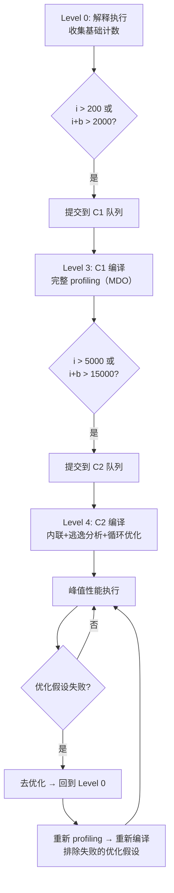

# JIT 编译器面试指南

> 基于 OpenJDK 11 源码深度分析
> 面试覆盖：分层编译、热点检测、C1/C2 管道、内联、逃逸分析、去优化、OSR、CodeCache

---

## 第 0 部分：核心原理 ⭐

### 0.1 本质是什么？

本文是 **JIT 编译器面试指南** 的面试准备材料：提炼核心知识点，给出标准答案框架，帮助在面试中清晰、准确地表达 JVM 内部原理。

### 0.2 为什么需要？

面试中的 JVM 问题往往需要在 2-3 分钟内讲清楚复杂机制。没有提前整理，很容易在细节上迷失，无法展示对整体的把握。

### 0.3 怎么解决？

按「本质→为什么→怎么实现→关键细节」的结构组织答案，确保回答既有深度又有条理。

### 0.4 为什么这样设计？

面试答案的设计原则：先给结论，再给理由；先讲整体，再讲细节；用类比帮助面试官理解复杂概念。

---


## 0. 核心原理

### 0.1 本质是什么？

JIT（Just-In-Time）编译器将频繁执行的 Java 字节码动态编译为本地机器码，用运行时 profiling 信息驱动优化，在**编译开销**和**执行速度**之间取得平衡。

### 0.2 为什么需要 JIT？

Java 字节码运行在解释器上，逐条解释执行比本地代码慢 10-100 倍。如果全部提前编译（AOT），又缺少运行时信息无法做精准优化（如类型推测、分支概率、内联决策）。JIT 在运行时收集 profiling 数据后做针对性编译，既保留了 Java "一次编译到处运行" 的可移植性，又接近甚至超过 C++ 的执行速度。

### 0.3 核心设计

分层编译 + 两个编译器协作：C1（快速编译、收集 profiling）→ C2（深度优化、最终代码）。通过 5 级编译体系、负载反馈、编译队列优先级实现自适应编译。

---

## 一、解释器 vs 编译器

### Q1：为什么 JVM 同时需要解释器和编译器？⭐

**一句话结论**：
解释器保证**启动速度**（零编译延迟），编译器保证**峰值性能**（接近 native 代码），两者互补。

**源码级回答**：

JVM 执行引擎有三种模式，由命令行参数控制：

| 模式 | 参数 | 行为 |
|------|------|------|
| 混合模式（默认） | `-Xmixed` | 解释器 + JIT 编译器协作 |
| 纯解释 | `-Xint` | 只用解释器，不编译 |
| 纯编译 | `-Xcomp` | 首次执行就编译（无 profiling，优化质量差） |

解释器的三个核心价值：
1. **零启动延迟**：字节码加载后立即执行，无需等编译
2. **收集 profiling 数据**：分支概率、类型信息、调用频率
3. **去优化回退目标**：编译代码的优化假设失败时，回退到解释器继续执行

> **源码**：`arguments.cpp` 中 `set_mode_flags(_int)` / `set_mode_flags(_comp)` / `set_mode_flags(_mixed)` 控制三种模式。

---

### Q2：`-Xint`、`-Xcomp`、`-Xmixed` 各适合什么场景？⭐

**一句话结论**：
生产用 `-Xmixed`（默认），调试用 `-Xint`（可重现、方便 GDB），`-Xcomp` 几乎不用。

| 模式 | 启动速度 | 峰值性能 | 适用场景 |
|------|---------|---------|---------|
| `-Xint` | 最快（无编译） | 最慢（10-100x） | GDB 调试、排查 JIT bug |
| `-Xcomp` | 最慢（全编译） | 中等（无 profiling） | 几乎不推荐 |
| `-Xmixed` | 中等 | 最快（有 profiling） | 生产环境默认 |

**为什么 `-Xcomp` 不如 `-Xmixed`？** 因为 `-Xcomp` 首次执行就编译，此时没有运行时 profiling 信息，编译器不知道哪些分支热、哪些类型常见，无法做精准的内联和类型特化，优化质量反而不如先解释一段时间再编译。

---

## 二、分层编译

### Q3：分层编译的 5 个级别是什么？⭐⭐

**一句话结论**：
Level 0（解释器）→ Level 1-3（C1 编译，profiling 递增）→ Level 4（C2 深度优化），典型路径是 **0→3→4**。

**源码级回答**：

```cpp
// src/hotspot/share/compiler/compilerDefinitions.hpp:54-63
enum CompLevel {
  CompLevel_none              = 0,  // 解释器执行
  CompLevel_simple            = 1,  // C1 编译，无 profiling（轻量方法直接到此）
  CompLevel_limited_profile   = 2,  // C1 编译，仅调用/回边计数器
  CompLevel_full_profile      = 3,  // C1 编译，完整 profiling（+ MDO）
  CompLevel_full_optimization = 4   // C2（或 JVMCI）深度优化
};
```

**各级别的角色**：

| Level | 编译器 | Profiling | 执行速度 | 用途 |
|-------|--------|-----------|---------|------|
| 0 | 无（解释器） | 基础计数 | 最慢 | 启动阶段 |
| 1 | C1 | 无 | 快 | 简单方法的终态（不值得 C2 编译） |
| 2 | C1 | 调用+回边计数 | 快（比 Level 3 快 ~30%） | C2 队列拥堵时的过渡态 |
| 3 | C1 | 完整（MDO） | 中等 | 为 C2 收集 profiling 数据 |
| 4 | C2 | 使用 MDO 数据 | 最快 | 峰值性能 |

**典型升级路径**：
- **正常路径**：0 → 3 → 4（解释 → C1 收集 profiling → C2 优化）
- **C2 队列拥堵**：0 → 2 → 3 → 4（先跳到 Level 2 快速执行）
- **简单方法**：0 → 3 → 1（方法太简单，C1 和 C2 生成代码一样）

> **源码**：`tieredThresholdPolicy.hpp` 第 37-83 行的大段注释详细描述了每条路径的决策逻辑。

---

### Q4：分层编译的阈值参数有哪些？⭐

**一句话结论**：
核心判定公式：`i > TierXInvocationThreshold * s || (i > TierXMinInvocationThreshold * s && i + b > TierXCompileThreshold * s)`，其中 `i` = 调用次数、`b` = 回边次数、`s` = 负载反馈缩放因子。

**源码级回答**：

```cpp
// src/hotspot/share/runtime/globals.hpp（分层编译阈值参数）
// 0 → 3 升级阈值
Tier3InvocationThreshold    = 200     // 调用次数阈值
Tier3MinInvocationThreshold = 100     // 最低调用次数
Tier3CompileThreshold       = 2000    // 调用 + 回边总阈值
Tier3BackEdgeThreshold      = 60000   // OSR 回边阈值

// 3 → 4 升级阈值
Tier4InvocationThreshold    = 5000    // 调用次数阈值
Tier4MinInvocationThreshold = 600     // 最低调用次数
Tier4CompileThreshold       = 15000   // 调用 + 回边总阈值
Tier4BackEdgeThreshold      = 40000   // OSR 回边阈值
```

**缩放因子计算**：

```
s = queue_size / (TierXLoadFeedback * compiler_count) + 1
```

当编译队列越长，缩放因子 `s` 越大，阈值被抬高，减少编译请求——这就是**负载反馈机制**，防止编译器过载。

> **源码**：`tieredThresholdPolicy.hpp` 第 95-121 行详细解释了缩放机制。

**补充（面试加分）**：

方法是否"简单"的判断：如果 C1 编译后发现方法块数少、无循环，则视为 trivial，直接走 Level 1 而不升级到 Level 4。这避免了 C2 花时间编译简单方法（如 getter/setter），C2 编译成本远高于 C1。

---

## 三、热点检测

### Q5：JVM 怎么判断一个方法是"热点"？⭐⭐

**一句话结论**：
通过**方法调用计数器**（`InvocationCounter`）和**回边计数器**（`BackedgeCounter`）两个计数器，达到阈值触发编译。

**源码级回答**：

```cpp
// src/hotspot/share/interpreter/invocationCounter.hpp:44-45
class InvocationCounter {
 private:                             // bit no: |31  3|  2  | 1 0 |
  unsigned int _counter;              // format: [count|carry|state]
};
```

**InvocationCounter 位编码**：

```
┌─────────────────────────────────────────────────────┐
│  count (29 bits)  │  carry (1 bit)  │  state (2 bits)│
│  bit 3-31         │  bit 2          │  bit 0-1       │
└─────────────────────────────────────────────────────┘
```

- **count**（29 位）：实际调用/回边次数
- **carry**（1 位）：粘性溢出标记，设置后永不清除
- **state**（2 位）：`wait_for_nothing(0)` 或 `wait_for_compile(1)`

**计数器在哪里**：

```cpp
// src/hotspot/share/oops/method.hpp
class Method : public Metadata {
  InvocationCounter _invocation_counter;  // 方法调用次数
  InvocationCounter _backedge_counter;    // 回边次数
};
```

**触发编译的判定**（分层编译模式下）：

```
// tieredThresholdPolicy.hpp:98
// 以 0→3 为例，判定公式为：
i > Tier3InvocationThreshold * s                       // 纯调用次数超标
||
(i > Tier3MinInvocationThreshold * s                   // 调用次数 >= 最低要求
 && i + b > Tier3CompileThreshold * s)                 // 调用+回边总次数超标
```

**非分层编译**（较少使用）：直接比较 `count() > CompileThreshold`（默认 10000）。

**计数器衰减（防止"历史热点"）**：

```cpp
// src/hotspot/share/interpreter/invocationCounter.hpp:147-153
inline void InvocationCounter::decay() {
  int c = count();
  int new_count = c >> 1;  // 除以 2
  if (c > 0 && new_count == 0) new_count = 1;  // 防止归零（区分"从未执行"和"曾经执行"）
  set(state(), new_count);
}
```

GC 时调用 `decay()`，让不再频繁调用的方法计数器逐渐降低，释放编译资源给真正热点。

---

### Q6：回边计数器和 OSR 是什么关系？⭐

**一句话结论**：
回边计数器记录循环回跳次数，超过 `TierXBackEdgeThreshold` 触发 **OSR 编译**（On-Stack Replacement），让正在循环中运行的解释器帧直接切换到编译后的代码继续执行。

**源码级回答**：

OSR 解决的核心问题：一个方法有热循环但方法调用次数不高（比如 `main` 方法里跑一个百万次循环），普通编译要等方法下次被调用才能用编译后的代码，但循环还在这次调用里跑——**等不到下次调用**。

OSR 做的事情：**在循环执行过程中**，把当前解释器栈帧替换为编译后的栈帧，从循环回边 bci 处继续执行编译后的代码。

```
// OSR 编译判定（tieredThresholdPolicy.hpp:110）
b > TierXBackEdgeThreshold * s

// 默认阈值
Tier3BackEdgeThreshold = 60000   // 触发 C1 OSR
Tier4BackEdgeThreshold = 40000   // 触发 C2 OSR
```

**OSR 编译 vs 普通编译的区别**：

| 维度 | 普通编译 | OSR 编译 |
|------|---------|---------|
| 触发 | 方法调用计数器 | 回边计数器 |
| 入口 bci | -1（`InvocationEntryBci`） | 回边所在 bci |
| 生效时机 | 下次方法调用 | 当前循环迭代立即生效 |
| 代码效率 | 正常 | 入口处需要额外的状态恢复代码 |

> **源码**：`compilerDefinitions.hpp:44` 定义 `InvocationEntryBci = -1`，用于区分普通编译（bci=-1）和 OSR 编译（bci>=0）。

---

## 四、CompileBroker 编译调度

### Q7：编译请求从触发到执行经过哪些步骤？⭐

**一句话结论**：
**生产者-消费者模型**：应用线程提交编译请求到 `CompileQueue`，后台编译器线程（C1/C2）从队列取任务编译，完成后安装 `nmethod` 到 `Method*`。

**源码级回答**：

完整编译流程：

```
应用线程触发 → InterpreterRuntime::frequency_counter_overflow()
           → TieredThresholdPolicy::event()           // 决定目标级别
           → CompileBroker::compile_method()           // 提交到队列
           → CompileQueue::add()                       // 入队（按事件率优先级排序）

编译器线程 → CompileQueue::get()                       // 取最高优先级任务
           → C1Compiler::compile_method() 或 C2Compiler::compile_method()
           → 生成 nmethod
           → Method::set_code(nmethod)                 // 安装编译后代码
```

**关键设计**：

1. **两个独立队列**：C1 队列和 C2 队列，各自由独立的编译器线程消费
2. **优先级排序**：按事件率（`d(i+b)/dt`，单位时间内的调用+回边增量）排序，最热的方法优先编译
3. **去重**：同一方法同一 bci 不会重复入队
4. **过期清理**：长时间没有事件的方法从队列移除（`TieredCompileTaskTimeout`）

> **源码**：`compileBroker.cpp` 中 `make_thread()` 创建后台编译器线程，线程主循环在 `compiler_thread_loop()` 中不断从队列取任务。

**面试加分**：编译器线程数由 `CICompilerCount` 控制。分层编译时，1/3 分给 C1、2/3 分给 C2（但至少各 1 个）。源码见 `tieredThresholdPolicy.cpp:245-246`：`set_c1_count(MAX2(count / 3, 1)); set_c2_count(MAX2(count - c1_count(), 1));`。

---

## 五、C1 编译管道

### Q8：C1 编译器的编译流程是什么？⭐⭐

**一句话结论**：
**字节码 → HIR（高级 IR）→ 优化 → LIR（低级 IR）→ 线性扫描寄存器分配 → 机器码发射**，整个过程追求**编译速度**而非极致优化。

**源码级回答**：

```
字节码
  ↓  GraphBuilder::iterate_all_blocks()
HIR（High-level IR）—— SSA 形式，基于值的
  ↓  Canonicalizer + ValueNumbering + NullCheckElimination
优化后 HIR
  ↓  LIRGenerator::do_*()
LIR（Low-level IR）—— 接近机器指令，有虚拟寄存器
  ↓  LinearScan::allocate_registers()
分配物理寄存器后的 LIR
  ↓  LIR_Assembler::emit_code()
机器码（nmethod）
```

**各阶段源码入口**：

| 阶段 | 源码入口 | 职责 |
|------|---------|------|
| HIR 构建 | `c1_GraphBuilder.cpp` (168KB) | 字节码 → SSA 形式的 HIR |
| HIR 优化 | `c1_Canonicalizer.cpp` + `c1_ValueMap.cpp` + `c1_Optimizer.cpp` | 代数简化、公共子表达式消除、空检查消除 |
| LIR 生成 | `c1_LIRGenerator.cpp` (128KB) | HIR → 接近机器指令的 LIR |
| 寄存器分配 | `c1_LinearScan.cpp` (251KB) | 线性扫描算法（Linear Scan Register Allocation） |
| 机器码发射 | `c1_LIRAssembler.cpp` | LIR → 最终机器码 |

**C1 优化的特点**：
- **快速编译**：线性扫描寄存器分配 O(n)，而 C2 用 Chaitin-Briggs 图着色 O(n²)
- **有限优化**：不做内联（Level 2/3），不做逃逸分析，不做循环展开
- **核心价值**：快速生成带 profiling 的代码，为 C2 提供数据

> **源码**：`c1_Compilation.cpp` 中 `Compilation::compile_method()` 是 C1 编译管道的入口。

---

## 六、C2 编译管道

### Q9：C2 编译器的架构和 C1 有什么本质区别？⭐⭐

**一句话结论**：
C2 使用 **Sea-of-Nodes IR**（控制流和数据流合一的图结构），支持 20+ 种优化 Pass，追求**极致执行速度**，编译时间远高于 C1。

**源码级回答**：

```
字节码
  ↓  Parse（parse1.cpp, parse2.cpp, parse3.cpp）
Ideal Graph（Sea-of-Nodes IR）
  ↓  多轮优化 Pass
     ├─ Iterative GVN（全局值编号）
     ├─ Inline（内联）
     ├─ Escape Analysis（逃逸分析）
     ├─ Loop Optimizations（循环优化：展开、剥离、预谓词）
     ├─ Conditional Constant Propagation
     └─ Macro Expansion（标量替换、锁消除）
优化后 Ideal Graph
  ↓  Matcher（matcher.cpp）
Machine-specific IR
  ↓  Chaitin-Briggs Register Allocation（chaitin.cpp）
寄存器分配后
  ↓  Output（output.cpp）
机器码（nmethod）
```

**C1 vs C2 核心对比**：

| 维度 | C1 | C2 |
|------|-----|-----|
| IR 形式 | HIR（线性 SSA） | Sea-of-Nodes（图结构） |
| 寄存器分配 | 线性扫描 O(n) | 图着色 O(n²) |
| 内联 | 不做（Level 2/3） | 激进内联（核心优化） |
| 逃逸分析 | 不做 | 做（标量替换、锁消除） |
| 循环优化 | 基本无 | 展开、剥离、向量化 |
| 编译速度 | 快（ms 级） | 慢（可达秒级） |
| 代码质量 | 中等 | 接近 native |

**Sea-of-Nodes 的核心思想**：

传统 IR 将控制流和数据流分开（基本块 + SSA 值），Sea-of-Nodes 将它们统一到同一个图中。每个 Node 通过边（edge）连接：

- **数据依赖边**：值的生产者 → 消费者
- **控制依赖边**：控制流约束（如 if 分支后的节点依赖分支条件）
- **内存依赖边**：保证内存操作顺序

这种设计允许编译器自由调度不相关的操作，优化空间远大于线性 IR。

> **源码**：`opto/node.hpp`（64KB）定义了 Node 基类，所有 IR 节点都继承自它。

---

### Q10：C2 的 Ideal Graph 中 Node 和 Type 系统是什么？⭐

**一句话结论**：
Node 是计算单元（加法、加载、分支等），Type 是值域描述（int 范围、null 可能性等），两者构成 C2 优化的基础数据结构。

**源码级回答**：

Node 的核心结构：

```cpp
// src/hotspot/share/opto/node.hpp
class Node {
  Node** _in;       // 输入边数组（数据/控制/内存依赖）
  Node** _out;      // 输出边数组（谁使用了这个节点的值）
  uint   _cnt;      // 输入边数量
  uint   _outcnt;   // 输出边数量
  int    _idx;      // 全局唯一 Node ID
  uint   _class_id; // 节点类型标识
  // ...
};
```

**约定**：`_in[0]` 是**控制依赖**输入（对不需要控制依赖的节点为 NULL），`_in[1]` 起是**数据依赖**输入。

Type 格系统（lattice）：

```
        Top（任何值都可能）
        / | \
     Int  Long  Ptr ...
      |         / \
   [0,100]  NotNull  Null
      \       /
     TypeNarrowOop
        |
       Bottom（矛盾 / 不可达）
```

Type 的 `meet` 操作取两个类型的最小公共上界，用于 GVN 优化中的类型推导。

> **源码**：`opto/type.hpp`（68KB）定义了完整的 Type 层次结构。

---

## 七、内联

### Q11：方法内联的决策逻辑是什么？⭐⭐

**一句话结论**：
根据方法大小、调用频率、调用类型（虚调用/接口调用）综合决策，受 `MaxInlineSize`（35 字节码）、`FreqInlineSize`（325 字节码，x86）、`MaxInlineLevel`（15 层）控制。

**源码级回答**：

**内联决策参数**（`globals.hpp`）：

| 参数 | 默认值 | 含义 |
|------|--------|------|
| `MaxInlineSize` | 35 | 非热点方法的最大字节码大小 |
| `FreqInlineSize` | 325（x86） | 热点方法的最大字节码大小 |
| `MaxInlineLevel` | 15 | 最大内联深度 |
| `InlineSmallCode` | 2000 | 已编译代码的最大大小限制 |

**内联的好处**（为什么是"优化之母"）：

1. **消除调用开销**：省去栈帧创建、参数传递、返回值处理
2. **打开优化窗口**：内联后，调用者和被调用者的代码在同一个编译单元，可以做跨方法的常量传播、死代码消除、逃逸分析
3. **消除虚调用**：如果 profiling 显示某个虚调用 99% 是同一个类型，内联后直接嵌入该类型的实现（类型推测内联）

**虚调用内联策略**：

| Profiling 结果 | 策略 |
|----------------|------|
| 单态（monomorphic）：100% 一个类型 | 直接内联 + 类型守卫 |
| 双态（bimorphic）：2 个类型 | if-else 分支各自内联 |
| 多态（megamorphic）：>2 个类型 | 不内联（走虚分派表） |

**类型守卫（Type Guard）**：内联后在入口插入类型检查，如果运行时类型不匹配，走 uncommon trap → 去优化。

> **源码**：C2 内联决策在 `opto/doCall.cpp` 和 `opto/callGenerator.cpp` 中实现。

---

### Q12：什么情况下内联会失败？⭐

**一句话结论**：
方法太大、层级太深、是 native 方法、多态无法确定类型、递归调用——都会导致内联失败。

**常见内联失败原因**：

| 原因 | 说明 |
|------|------|
| 方法体太大 | 超过 `MaxInlineSize`(35) / `FreqInlineSize`(325) |
| 内联层级太深 | 超过 `MaxInlineLevel`(15) |
| native 方法 | 无字节码可内联（除非有 Intrinsic 替代） |
| 多态调用 | profiling 显示 >2 种类型 |
| 递归调用 | 默认不内联递归（`MaxRecursiveInlineLevel` = 1） |
| 方法未加载 | 被调用者的类还没有加载 |

**诊断参数**：

```bash
# 打印内联决策
-XX:+PrintInlining

# 输出示例：
@ 15   java.util.HashMap::hash (20 bytes)   inline (hot)
@ 23   java.util.HashMap::getNode (148 bytes)   too big
@ 8    com.example.Service::process (502 bytes)   hot method too big
```

> **源码**：`opto/doCall.cpp` 中 `cg->is_inline()` 检查内联可行性，失败原因记录在 `CompileTask::print_inlining()` 中。

---

## 八、逃逸分析与标量替换

### Q13：逃逸分析是什么？能带来哪些优化？⭐⭐

**一句话结论**：
分析对象的引用是否"逃逸"出方法/线程，不逃逸的对象可以做**栈上分配**（理论上）、**标量替换**（实际实现）、**锁消除**。

**源码级回答**：

逃逸状态分三级：

| 逃逸状态 | 含义 | 可做的优化 |
|---------|------|-----------|
| NoEscape | 对象不逃出方法 | 标量替换、锁消除 |
| ArgEscape | 对象作为参数传递但不逃出线程 | 锁消除 |
| GlobalEscape | 对象可能被任意线程访问 | 无优化 |

**标量替换（Scalar Replacement）—— 最重要的优化**：

将对象的字段拆解为独立的局部变量（标量），直接放在寄存器/栈中，**彻底消除堆分配**。

```java
// 优化前
Point p = new Point(x, y);
double distance = Math.sqrt(p.x * p.x + p.y * p.y);

// 逃逸分析 + 标量替换后（等效）
double p_x = x;  // 对象的 x 字段变成局部变量
double p_y = y;  // 对象的 y 字段变成局部变量
double distance = Math.sqrt(p_x * p_x + p_y * p_y);
// 没有任何堆分配！
```

**关键澄清**：HotSpot 中**没有实现栈上分配**，逃逸分析的收益主要通过标量替换实现。面试时常说的"栈上分配"，在 HotSpot 中实际是标量替换。

> **源码**：`opto/escape.cpp`（138KB）实现 ConnectionGraph 算法分析逃逸状态，`opto/macro.cpp` 将 `AllocateNode` 展开为标量。

**锁消除（Lock Elision）**：

如果对象不逃出线程，对它的同步操作（synchronized）无意义，直接删除：

```java
// 优化前
synchronized (new Object()) {  // 锁对象不逃逸
    doSomething();
}

// 锁消除后
doSomething();  // 锁被完全移除
```

**相关 JVM 参数**：
- `-XX:+DoEscapeAnalysis`（默认开启）
- `-XX:+EliminateAllocations`（标量替换，默认开启）
- `-XX:+EliminateLocks`（锁消除，默认开启）

---

## 九、去优化

### Q14：什么是去优化（Deoptimization）？什么时候会发生？⭐⭐

**一句话结论**：
编译代码基于**推测性假设**做优化，运行时发现假设不成立时，**丢弃编译代码、回退到解释器执行**，这就是去优化。

**源码级回答**：

去优化的触发原因（`deoptimization.hpp` Reason 枚举）：

| 原因 | 场景 | 频率 |
|------|------|------|
| `Reason_class_check` | 类型守卫失败（内联的类型假设错误） | 高 |
| `Reason_null_check` | 预期非空但遇到 null | 高 |
| `Reason_range_check` | 数组越界 | 中 |
| `Reason_unloaded` | 引用的类被卸载 | 低 |
| `Reason_unreached` | 从未执行过的代码路径被执行 | 中 |
| `Reason_unstable_if` | 预测为 always-false 的分支被 taken | 中 |
| `Reason_age` | nmethod 太老，触发重新编译 | 低 |
| `Reason_tenured` | 代码年龄达到限制 | 低 |

**去优化的代价**：

1. **帧重建**：将编译帧的寄存器/栈数据**逆向映射**回解释器帧格式（通过 `OopMap` + `ScopeDesc`）
2. **性能悬崖**：从 Level 4 回到 Level 0，性能瞬间下降 10-100 倍
3. **重新 profiling**：需要重新收集数据再编译

**去优化流程**：

```
编译代码执行 → 遇到 uncommon trap
  → 调用 Deoptimization::uncommon_trap()
  → 记录去优化原因到 MethodData
  → 将编译帧转换为解释器帧
  → 在解释器中从去优化点继续执行
  → 如果同一原因去优化次数超过阈值（PerMethodTrapLimit，默认 100）
  → 标记方法为 not_entrant（不再从该 nmethod 入口执行）
  → 重新编译时排除失败的优化假设
```

> **源码**：`runtime/deoptimization.hpp` 定义了 26 种去优化原因；`runtime/deoptimization.cpp` 实现帧重建逻辑。

**诊断参数**：

```bash
# 打印去优化事件
-XX:+TraceDeoptimization

# 输出示例：
Uncommon trap: reason=class_check action=maybe_recompile
  bci=15 method=com.example.Service.process(Ljava/lang/Object;)V
```

---

### Q15：去优化和重新编译的关系是什么？⭐

**一句话结论**：
去优化后方法回到解释器，如果再次变热会**重新编译**，但新编译会参考之前的去优化记录，**避免重复犯错**。

**源码级回答**：

去优化后的 Action 决定后续行为：

```cpp
// src/hotspot/share/runtime/deoptimization.hpp
enum DeoptAction {
  Action_none,              // 什么都不做
  Action_maybe_recompile,   // 可能重新编译（最常见）
  Action_reinterpret,       // 回到解释器重新 profiling
  Action_make_not_entrant,  // 标记 nmethod 不可进入
  Action_make_not_compilable // 标记方法不可编译（放弃编译）
};
```

**重新编译的学习机制**：

每次去优化时，原因和 bci 被记录到 `MethodData`（MDO）。重新编译时 C2 会查询这些记录：

- 如果某个 bci 因为 `class_check` 去优化过 → 新编译不再对该位置做类型推测内联
- 如果某个 `if` 分支因为 `unstable_if` 去优化过 → 新编译不再假设该分支为 dead
- 如果去优化次数超过 `PerMethodTrapLimit`(100) → `Action_make_not_compilable`，放弃编译该方法

**面试关键点**：去优化不是灾难，而是自适应编译系统的**反馈机制**。少量去优化是正常的（代码预热期），持续去优化才是性能问题。

---

## 十、CodeCache

### Q16：CodeCache 的结构是什么？⭐

**一句话结论**：
分层编译模式下，CodeCache 被分为**三段**：NonNMethod（桩代码）+ Profiled（C1 编译的带 profiling 的代码）+ NonProfiled（C2 编译的优化代码），总大小默认 240MB。

**源码级回答**：

```cpp
// src/hotspot/share/compiler/compilerDefinitions.cpp:207-209
// 分层编译时 ReservedCodeCacheSize = 默认值 * 5
// x86 C2 默认 = 48M * 5 = 240M，触发 SegmentedCodeCache（>=240M 时自动启用）
```

**三段式 CodeCache**（分层编译 + 分段启用时）：

| 段 | 参数 | x86 默认大小 | 存放内容 |
|----|------|-------------|---------|
| NonNMethod | `NonNMethodCodeHeapSize` | ~5.5MB | 桩代码（Stubs）、适配器、Runtime 辅助代码 |
| Profiled | `ProfiledCodeHeapSize` | ~117MB | C1 Level 2/3 编译的带 profiling 的 nmethod |
| NonProfiled | `NonProfiledCodeHeapSize` | ~117MB | C1 Level 1 和 C2 Level 4 的 nmethod |

**为什么分段？**

Profiled 代码是**临时的**（升级到 C2 后就废弃），NonProfiled 代码是**长期的**。分段后：
1. Profiled 段的 GC/清理不影响 NonProfiled 段
2. 避免临时代码碎片化影响长期代码的连续分配
3. Sweeper 可以针对不同段采用不同策略

> **源码**：`code/codeCache.cpp` 中 `initialize_heaps()` 实现三段初始化；`compilerDefinitions.cpp:213` 判断 >= 240M 时启用分段。

**CodeCache 满了会怎样？**

1. 停止编译新方法（`CodeCache_lock` 保护的标志位）
2. 触发 `NMethodSweeper` 加速清理不再使用的 nmethod
3. JVM 打印警告：`CodeCache is full. Compiler has been disabled.`
4. 已编译的代码继续执行，但新方法只能解释执行 → 性能退化

**诊断参数**：

```bash
# 查看 CodeCache 使用情况
-XX:+PrintCodeCache

# 输出示例：
CodeCache: size=245760Kb used=12345Kb max_used=23456Kb free=232415Kb
 bounds [0x00007f0000000000, 0x00007f0017000000, 0x00007f003c000000]
 total_blobs=4567 nmethods=3456 adapters=234
 compilation: enabled
```

---

## 十一、Intrinsic

### Q17：什么是 Intrinsic 方法？举几个例子。⭐

**一句话结论**：
JVM 对特定 Java 标准库方法不走正常编译，而是直接替换为**手写的优化机器码**（或高效 IR 节点），绕过字节码编译流程获得最佳性能。

**源码级回答**：

Intrinsic 是编译器对已知方法的"特殊对待"——编译器识别出方法签名后，不编译字节码，而是直接插入预先优化好的 IR 节点或机器码。

**常见 Intrinsic 示例**：

| Java 方法 | Intrinsic 实现 |
|-----------|---------------|
| `Math.sqrt()` | 直接用 x86 `sqrtsd` 指令 |
| `Math.abs()` | 位运算清除符号位 |
| `System.arraycopy()` | 手动优化的内存拷贝（`rep movsb` 或 SIMD） |
| `String.equals()` | SIMD 向量化比较 |
| `Unsafe.compareAndSwap*()` | 直接用 `lock cmpxchg` |
| `Thread.currentThread()` | 直接读 TLS 寄存器 |
| `Object.hashCode()` | 读 markWord 中的 hashcode 字段 |

**为什么不让 C2 自己优化？** 因为 Java 字节码无法表达某些底层操作（如 CAS 原子指令、SIMD 指令、TLS 访问），编译器的通用优化也达不到手工优化的极致效果。

> **源码**：`opto/library_call.cpp`（284KB）实现了 C2 的所有 Intrinsic 方法替换。

**面试加分**：可以用 `-XX:+PrintIntrinsics`（debug build）查看哪些方法被 intrinsify。

---

## 十二、关键 JVM 参数

### Q18：JIT 编译相关的常用调优参数有哪些？⭐

**一句话结论**：
大多数场景用默认值即可，需要调优时主要关注 **CodeCache 大小**、**编译线程数**、**内联策略**。

**核心参数表**：

| 参数 | 默认值 | 说明 |
|------|--------|------|
| `-XX:+TieredCompilation` | true | 启用分层编译 |
| `-XX:TieredStopAtLevel=N` | 4 | 限制最高编译级别（设为 1 = 只用 C1） |
| `-XX:ReservedCodeCacheSize=N` | 240MB（分层） | CodeCache 最大大小 |
| `-XX:CICompilerCount=N` | 自动 | 编译器线程数 |
| `-XX:CompileThreshold=N` | 10000 | 非分层模式的编译阈值 |
| `-XX:MaxInlineSize=N` | 35 | 非热点方法内联字节码上限 |
| `-XX:FreqInlineSize=N` | 325（x86） | 热点方法内联字节码上限 |
| `-XX:MaxInlineLevel=N` | 15 | 最大内联深度 |
| `-XX:+DoEscapeAnalysis` | true | 启用逃逸分析 |
| `-XX:+EliminateAllocations` | true | 启用标量替换 |
| `-XX:+EliminateLocks` | true | 启用锁消除 |

---

### Q19：怎么查看 JIT 编译日志？⭐

**一句话结论**：
`-XX:+PrintCompilation` 查看编译事件，`-XX:+UnlockDiagnosticVMOptions -XX:+PrintInlining` 查看内联决策，`-XX:+TraceDeoptimization` 查看去优化事件。

**常用诊断参数组合**：

```bash
# 基础：查看所有编译事件
-XX:+PrintCompilation

# 输出示例：
#  时间   编译ID  级别  方法名                          大小
    123    45  %  3       com.example.Main::hotLoop @ 15 (120 bytes)
    456    78     4       java.util.HashMap::getNode (148 bytes)
#  %表示OSR编译  3/4表示编译级别

# 进阶：查看内联决策
-XX:+UnlockDiagnosticVMOptions -XX:+PrintInlining

# 进阶：查看去优化
-XX:+TraceDeoptimization

# 完整分析：输出编译日志到文件
-XX:+UnlockDiagnosticVMOptions -XX:+LogCompilation -XX:LogFile=compilation.log
# 用 JITWatch 工具分析 compilation.log
```

**PrintCompilation 输出格式解读**：

```
  时间(ms)  编译ID  属性  级别  方法签名  (字节码大小)
```

属性标记：
- `%` = OSR 编译
- `s` = synchronized 方法
- `!` = 方法有异常处理器
- `b` = 阻塞编译（应用线程等待编译完成）
- `n` = native 方法的 wrapper

---

## 十三、综合场景

### Q20：一个 Java 方法从第一次执行到达到峰值性能，经历了什么？⭐⭐

**一句话结论**：
**解释执行 → C1 编译（收集 profiling）→ C2 编译（深度优化）→ 可能去优化 → 重新编译（更保守的优化策略）**。

**完整生命周期**：



**各阶段耗时参考**（典型 Web 应用）：
- Level 0 → Level 3：通常几百毫秒到几秒（取决于方法调用频率）
- Level 3 → Level 4：通常几秒到几十秒（C2 编译耗时 + 队列等待）
- 去优化 → 重新编译：几秒到十几秒

**面试关键点**：这就是为什么 Java 应用有**预热期**（warm-up）——需要时间让热点方法经历完整的编译链路达到峰值性能。微基准测试（JMH）会专门设置预热轮数来消除这个影响。

---

### Q21：线上应用出现频繁去优化怎么排查？⭐

**一句话结论**：
`-XX:+TraceDeoptimization` 找到去优化的方法和原因，根据原因采取对应措施。

**排查步骤**：

1. **确认去优化存在**：
```bash
-XX:+TraceDeoptimization
# 或 JFR 中的 jdk.Deoptimization 事件
```

2. **根据原因定位**：

| 去优化原因 | 排查方向 | 解决方案 |
|-----------|---------|---------|
| `class_check` | 虚调用站点的类型变化 | 减少多态、使用 final |
| `null_check` | 预期非空的值出现 null | 修复 null 来源 |
| `unstable_if` | 分支预测失败 | 代码逻辑导致，一般无需处理 |
| `unloaded` | 类卸载/热部署 | 预期行为 |

3. **确认是否影响性能**：
   - 少量去优化（启动期）→ 正常
   - 持续去优化（same method, same bci）→ 需要排查
   - `made not compilable` → 严重，方法永远不会再编译

---

### Q22：什么是 Uncommon Trap？和 Deoptimization 的关系是什么？⭐

**一句话结论**：
Uncommon Trap 是编译代码中**预埋的陷阱点**，对应"预期不会执行到的代码路径"，执行到时触发 Deoptimization。

**源码级回答**：

C2 编译时，对于 profiling 显示"从未执行"或"极少执行"的代码路径，不生成完整的机器码，而是插入一个 uncommon trap：

```
// 编译后代码的概念示意（实际为机器码，此处用高级语言表达逻辑）
if (obj instanceof ExpectedType) {   // profiling 显示 99% 是 ExpectedType
    // 内联 ExpectedType 的方法 → 正常路径（优化后的快速代码）
} else {
    // uncommon trap → 去优化（不生成这个分支的代码）
}
```

**好处**：不为极少执行的路径生成代码，节省 CodeCache 空间，也让优化器可以假设"快速路径总是被执行"，做更激进的优化。

**代价**：一旦执行到 uncommon trap，去优化的开销远高于直接执行一个非优化的分支。但根据 profiling 数据，这种情况极少发生，所以总体收益是正的。

> **源码**：`runtime/deoptimization.hpp:41-97` 定义了 26 种 `DeoptReason`，每种对应不同类型的 uncommon trap。

---

### Q23：C1 和 C2 编译器各自的适用场景是什么？⭐

**一句话结论**：
短命应用/GUI 应用用 C1（`-client` / `-XX:TieredStopAtLevel=1`），长运行服务用 C1+C2（默认分层），极端性能要求可关闭分层只用 C2。

| 场景 | 推荐配置 | 原因 |
|------|---------|------|
| 长运行服务（Web、微服务） | 默认分层编译 | C2 有足够时间做深度优化 |
| 短命应用（CLI 工具） | `-XX:TieredStopAtLevel=1` | C2 编译来不及生效 |
| 需要极致启动速度 | `-XX:TieredStopAtLevel=1` | 避免 C2 编译的 CPU 开销 |
| 容器限制 CPU | 减少 `CICompilerCount` | 编译线程和应用线程争 CPU |
| 性能压测/基准测试 | 默认 + 充分预热 | 确保 C2 编译完成 |

---

## GDB 验证脚本

```bash
# 文件：jvm-md/tmp-file/JIT-Interview/gdb_jit_verify.cmd
# 用途：验证分层编译阈值、CodeCache 大小、编译器线程数

# 使用方法：
# gdb -x jvm-md/tmp-file/JIT-Interview/gdb_jit_verify.cmd \
#     /data/workspace/openjdk-cut-new/build/linux-x86_64-normal-server-slowdebug/jdk/bin/java

set pagination off
set breakpoint pending on

# BP1: 在编译策略初始化时验证阈值参数
break TieredThresholdPolicy::initialize
commands
  silent
  printf "\n===== 分层编译策略初始化 =====\n"
  printf "C1 compiler count: %d\n", _c1_count
  printf "C2 compiler count: %d\n", _c2_count
  printf "\n"
  continue
end

# BP2: 在 CodeCache 初始化时验证 CodeCache 大小
break CodeCache::initialize
commands
  silent
  printf "\n===== CodeCache 初始化 =====\n"
  printf "ReservedCodeCacheSize: %lu bytes (%lu MB)\n", ReservedCodeCacheSize, ReservedCodeCacheSize / 1048576
  printf "\n"
  continue
end

# BP3: 在编译提交时观察编译请求
break CompileBroker::compile_method
commands
  silent
  printf "编译请求: comp_level=%d, osr_bci=%d\n", comp_level, osr_bci
  # 限制输出次数
  continue
end

run -Xms8g -Xmx8g -XX:+UseG1GC -XX:+PrintCompilation -cp /data/workspace/demo/src com.wjcoder.Main
```

---

## 面试话术

### 30 秒版本

> "JVM 用分层编译实现自适应优化：C1 快速编译并收集 profiling 数据，C2 基于这些数据做深度优化（内联、逃逸分析、循环优化等）。方法从解释执行开始，经 C1 到 C2 逐步提速。如果 C2 的优化假设失败，通过去优化回到解释器重新编译。CodeCache 分三段管理编译后的代码。整个系统通过计数器阈值、负载反馈、编译队列优先级实现自动化。"

### 2 分钟版本

> "JVM 的执行引擎有三部分：解释器、C1 编译器、C2 编译器。解释器零延迟启动但慢，C1 快速编译收集 profiling（方法调用次数、分支概率、类型信息），C2 基于 profiling 做激进优化。
>
> 分层编译有 5 个级别，典型路径是 0→3→4：解释器执行到调用+回边超过 2000 次就触发 C1 编译到 Level 3，再超过 15000 次触发 C2 编译到 Level 4。阈值会根据编译队列负载动态缩放。
>
> C2 的核心优化是内联（消除虚调用、打开优化窗口）、逃逸分析+标量替换（消除堆分配）、循环优化（展开、向量化）。但这些优化基于推测性假设，假设失败时通过去优化回退到解释器。去优化记录被用于重新编译时避免重复犯错——这是整个系统的反馈闭环。
>
> 编译后的代码存放在 CodeCache 中，分层编译时分三段（NonNMethod/Profiled/NonProfiled），总大小默认 240MB。CodeCache 满了会禁用编译，导致性能退化。"

---

## 总结

| 话题 | 一句话要点 |
|------|-----------|
| 解释器 vs 编译器 | 互补：解释器保证启动速度，编译器保证峰值性能 |
| 分层编译 | 5 级，0→3→4 典型路径，负载反馈动态调整 |
| 热点检测 | InvocationCounter 位编码（29 位 count + 1 位 carry + 2 位 state） |
| C1 管道 | 字节码→HIR→LIR→线性扫描→机器码，追求编译速度 |
| C2 管道 | Sea-of-Nodes IR，20+ 种优化 Pass，追求执行速度 |
| 内联 | "优化之母"，MaxInlineSize=35/FreqInlineSize=325 |
| 逃逸分析 | NoEscape→标量替换（注意：不是栈上分配） |
| 去优化 | 26 种原因，反馈闭环，少量正常/持续才是问题 |
| CodeCache | 三段式，默认 240MB，满了会禁用编译 |

---

## 交叉引用

| 相关主题 | 文档位置 |
|---------|---------|
| 编译触发与热点检测详解 | [Compiler/1-Compilation-Trigger-Hot-Method-Detection.md](../Compiler/1-Compilation-Trigger-Hot-Method-Detection.md) |
| CompileBroker 编译调度 | [Compiler/2-CompileBroker-Compilation-Dispatch.md](../Compiler/2-CompileBroker-Compilation-Dispatch.md) |
| C1 编译管道完整分析 | [Compiler/3-C1-Compilation-Pipeline.md](../Compiler/3-C1-Compilation-Pipeline.md) |
| C2 Ideal Graph 架构 | [Compiler/4-C2-Ideal-Graph.md](../Compiler/4-C2-Ideal-Graph.md) |
| C2 核心优化（内联+逃逸） | [Compiler/5-C2-Core-Optimizations.md](../Compiler/5-C2-Core-Optimizations.md) |
| OSR 栈上替换 | [Compiler/6-OSR-On-Stack-Replacement.md](../Compiler/6-OSR-On-Stack-Replacement.md) |
| 去优化机制 | [Compiler/7-Deoptimization.md](../Compiler/7-Deoptimization.md) |
| 逃逸分析与标量替换 | [Compiler/8-Escape-Analysis-Scalar-Replacement.md](../Compiler/8-Escape-Analysis-Scalar-Replacement.md) |
| 对象生命周期面试指南 | [Interview/1-Object-Lifecycle-Interview-Guide.md](1-Object-Lifecycle-Interview-Guide.md) |
| 线程并发面试指南 | [Interview/2-Thread-Concurrency-Interview-Guide.md](2-Thread-Concurrency-Interview-Guide.md) |
| G1 GC 面试指南 | [Interview/3-GC-G1GC-Interview-Guide.md](3-GC-G1GC-Interview-Guide.md) |
