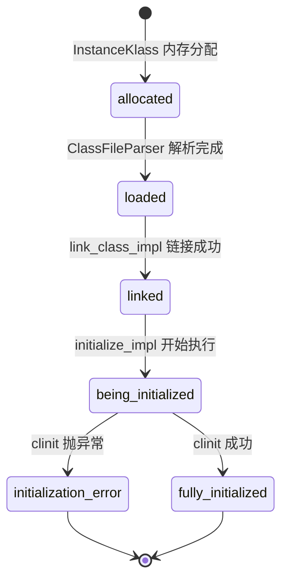
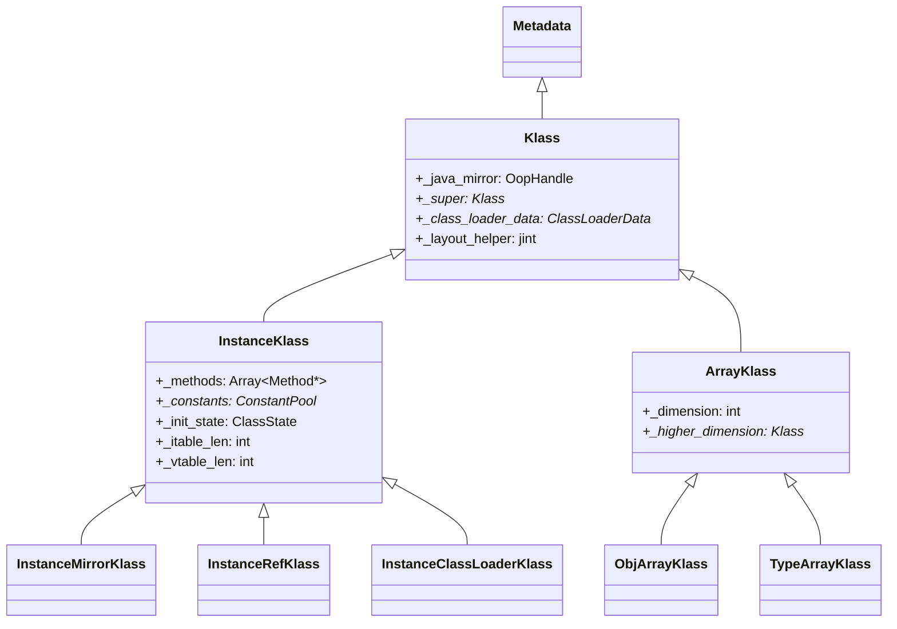
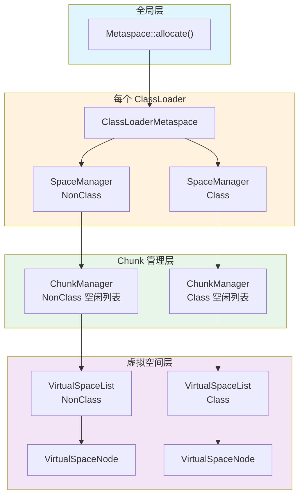
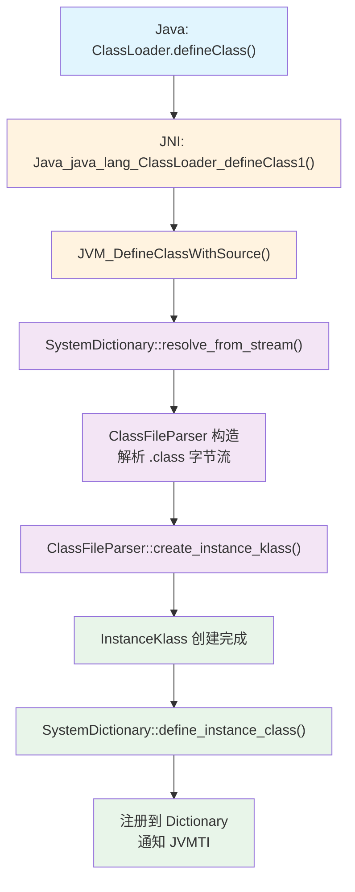

# 类加载与 Metaspace 面试指南

> 基于 OpenJDK 11 源码深度分析
> 面试覆盖：双亲委派、类加载全流程、ClassFileParser、SystemDictionary、Klass 体系、Metaspace 架构、类卸载、ConstantPool
> 与其他面试指南的关系：对象分配中的 Klass 指针→指南 1，GC 并发标记触发类卸载→指南 3，JIT 去优化与类重定义→指南 4

---

## 第 0 部分：核心原理 ⭐

### 0.1 本质是什么？

本文是 **类加载与 Metaspace 面试指南** 的面试准备材料：提炼核心知识点，给出标准答案框架，帮助在面试中清晰、准确地表达 JVM 内部原理。

### 0.2 为什么需要？

面试中的 JVM 问题往往需要在 2-3 分钟内讲清楚复杂机制。没有提前整理，很容易在细节上迷失，无法展示对整体的把握。

### 0.3 怎么解决？

按「本质→为什么→怎么实现→关键细节」的结构组织答案，确保回答既有深度又有条理。

### 0.4 为什么这样设计？

面试答案的设计原则：先给结论，再给理由；先讲整体，再讲细节；用类比帮助面试官理解复杂概念。

---


## 0. 核心原理

### 0.1 本质是什么？

类加载是把 `.class` 文件中的字节码**转换为 JVM 内部的运行时数据结构**（`InstanceKlass`）的过程。Metaspace 是这些运行时数据结构的**存储空间**——它取代了 JDK 8 之前的永久代（PermGen），使用本地内存（native memory）而非堆内存。

### 0.2 为什么需要深入理解？

类加载和 Metaspace 是面试高频主题：双亲委派是必问题、Metaspace OOM 是线上高频故障、类卸载机制影响热部署和微服务架构。不理解底层原理，遇到 `ClassNotFoundException`、`NoClassDefFoundError`、`Metaspace OOM` 就只能靠运气排查。

### 0.3 核心设计

**委派加载 + 延迟解析 + 按 ClassLoader 隔离回收**：双亲委派保证类的唯一性；符号引用延迟解析减少启动开销；Metaspace 按 ClassLoaderData 粒度整体回收，ClassLoader 死亡时其加载的所有类一起释放。

---

## 一、类加载机制总览

### Q1：类加载的完整流程是什么？⭐⭐

**一句话结论**：
**Loading → Linking（Verification + Preparation + Resolution）→ Initialization**，对应 `InstanceKlass` 的 6 个状态（`ClassState`）的状态机跃迁。

**源码级回答**：

```cpp
// src/hotspot/share/oops/instanceKlass.hpp:133-140
enum ClassState {
  allocated,            // 内存已分配（刚创建 InstanceKlass）
  loaded,               // 已加载（插入类层次结构）
  linked,               // 已链接（验证 + 准备 + 部分解析）
  being_initialized,    // 正在执行 <clinit>
  fully_initialized,    // 初始化完成（最终成功态）
  initialization_error  // 初始化出错（最终失败态）
};
```

**各阶段做了什么**：

| 阶段 | 核心操作 | 入口函数 |
|------|---------|---------|
| Loading | 找到 .class 字节流 → ClassFileParser 解析 → 创建 InstanceKlass | `SystemDictionary::resolve_or_fail()` |
| Verification | 检查字节码合法性（类型安全、栈平衡） | `Verifier::verify()` |
| Preparation | 为静态字段分配内存并赋零值 | `InstanceKlass::link_class_impl()` |
| Resolution | 符号引用 → 直接引用（延迟执行） | 各 `resolve_*` 方法 |
| Initialization | 执行 `<clinit>` 方法（静态初始化块 + 静态字段赋值） | `InstanceKlass::initialize_impl()` |

**状态跃迁流程**：



> **源码**：`instanceKlass.cpp` 中 `initialize_impl()` 实现初始化状态机；`link_class_impl()` 包含验证、准备和重写三步。

---

### Q2：什么时候会触发类加载？⭐

**一句话结论**：
**首次主动使用**时触发：`new`、访问静态字段/方法、反射、子类初始化时父类先加载。`Class.forName()` 默认触发初始化，`ClassLoader.loadClass()` 只到 Loading 阶段。

**6 种主动使用**：

| 场景 | 字节码指令 | 是否触发初始化 |
|------|-----------|:----------:|
| new 创建对象 | `new` | ✅ |
| 访问/修改静态字段 | `getstatic` / `putstatic` | ✅ |
| 调用静态方法 | `invokestatic` | ✅ |
| 反射调用 `Class.forName("X")` | — | ✅（默认） |
| 子类初始化时父类还没初始化 | — | ✅ |
| 包含 `main()` 的启动类 | — | ✅ |

**不会触发初始化的情况**：
- 访问 `static final` 的**编译期常量**（已在编译期内联到调用方）
- 创建数组（如 `new String[10]`）—— 只触发数组类加载，不触发元素类初始化
- `ClassLoader.loadClass("X")` —— 只加载不初始化

---

## 二、双亲委派

### Q3：双亲委派模型是什么？源码怎么实现的？⭐⭐

**一句话结论**：
加载类时**先委派给父加载器**，父加载器找不到再自己找。核心逻辑在 `ClassLoader.loadClass()` 的 20 行代码中。

**源码级回答**：

```java
// src/java.base/share/classes/java/lang/ClassLoader.java:566-586
protected Class<?> loadClass(String name, boolean resolve)
    throws ClassNotFoundException
{
    synchronized (getClassLoadingLock(name)) {
        // 1. 检查是否已加载
        Class<?> c = findLoadedClass(name);
        if (c == null) {
            try {
                if (parent != null) {
                    c = parent.loadClass(name, false);  // 2. 委派给父加载器
                } else {
                    c = findBootstrapClassOrNull(name);  // 3. 没有父 → 委派给 Bootstrap
                }
            } catch (ClassNotFoundException e) {
                // 父加载器找不到，不抛异常
            }
            if (c == null) {
                c = findClass(name);  // 4. 父找不到 → 自己找
            }
        }
        if (resolve) {
            resolveClass(c);
        }
        return c;
    }
}
```

**JDK 11 三级类加载器**：

| 加载器 | 实现 | 加载范围 |
|--------|------|---------|
| Bootstrap | C++ 实现（`ClassLoader::load_class()`） | `java.base` 等核心模块 |
| Platform（原 ExtClassLoader） | `PlatformClassLoader` | `java.sql`、`java.xml` 等平台模块 |
| Application | `AppClassLoader` | 用户 classpath 上的类 |

**为什么需要双亲委派？** 防止用户自定义的 `java.lang.String` 覆盖 JDK 的 `String`——安全性。同时保证同一个类只被加载一次——唯一性。

> **源码**：HotSpot 端 Bootstrap 加载器入口在 `classLoader.cpp` 中 `ClassLoader::load_class()`，通过 `ClassPathEntry` 策略模式（`ClassPathDirEntry` / `ClassPathZipEntry`）从文件系统或 JAR 加载。

---

### Q4：怎么打破双亲委派？有哪些实际案例？⭐⭐

**一句话结论**：
重写 `loadClass()` 或使用 **Thread Context ClassLoader（TCCL）** 实现"反向委派"。

**三种打破方式**：

| 方式 | 原理 | 案例 |
|------|------|------|
| 重写 `loadClass()` | 改变委派顺序 | Tomcat WebappClassLoader（先自己找，再委派父） |
| TCCL | 父加载器通过 `Thread.getContextClassLoader()` 反向委托子加载器 | JDBC SPI（Bootstrap 加载 DriverManager，但驱动 jar 在 classpath 上） |
| OSGi / 模块系统 | 根据 Bundle/Module 的依赖关系做网状委派 | Eclipse 插件系统 |

**TCCL 解决的核心问题**：SPI 框架（JDBC、JNDI、JAXP）的接口在 `java.base`（Bootstrap 加载），实现在用户 classpath（App 加载）。Bootstrap 加载器看不到 App 路径上的类，需要 TCCL "回调"到 App ClassLoader：

```java
// java.sql.DriverManager 中的 SPI 加载
ServiceLoader<Driver> loadedDrivers = ServiceLoader.load(Driver.class);
// ServiceLoader.load() 内部使用 Thread.currentThread().getContextClassLoader()
```

**面试加分**：JDK 9+ 模块系统引入了 `BuiltinClassLoader.loadClassOrNull()`，模块感知委派：先查模块归属（`findModule()`），找到模块则直接委派给该模块的加载器，而非机械地走 parent 链。

---

## 三、ClassFileParser 解析

### Q5：.class 文件是怎么被解析成 JVM 内部结构的？⭐⭐

**一句话结论**：
`ClassFileParser` 按顺序解析 .class 文件的**魔数→版本→常量池→访问标志→类/父类→接口→字段→方法→属性**共 9 个阶段，最终创建 `InstanceKlass`。

**源码级回答**：

```
// classFileParser.cpp 三阶段管线架构
ClassFileParser(stream, name, loader_data, protection_domain, ...)  // 阶段 1：构造函数解析 9 部分
  → parse_stream()                                                   // 阶段 2：验证和后处理
  → create_instance_klass(changed_by_agent)                          // 阶段 3：创建 InstanceKlass
```

**9 阶段解析**：

| 阶段 | 解析内容 | 创建的核心结构 |
|------|---------|--------------|
| 1 | Magic + Version | 验证 `0xCAFEBABE`，版本 ≤ 55（JDK 11） |
| 2 | ConstantPool | `ConstantPool` 对象（运行时常量池） |
| 3 | Access Flags | `_access_flags` |
| 4 | This/Super Class | 解析类名和父类引用 |
| 5 | Interfaces | 接口数组 |
| 6 | Fields | `FieldInfo` 数组 + 字段布局计算 |
| 7 | Methods | `Method` 对象数组 |
| 8 | Attributes | 注解、`BootstrapMethods`、`InnerClasses` 等 |
| 9 | create_instance_klass | 分配 `InstanceKlass` + 填充 vtable/itable |

> **源码**：`classfile/classFileParser.cpp`（168KB）是 HotSpot 中最大的单文件之一。解析入口 `ClassFileParser::parse_stream()`。

---

## 四、SystemDictionary

### Q6：SystemDictionary 是什么？类注册的机制是什么？⭐⭐

**一句话结论**：
`SystemDictionary` 是 JVM 的**全局类注册表**，以 `(ClassName, ClassLoader)` 为 key、`InstanceKlass*` 为 value，保证同一 ClassLoader 下类名唯一。

**源码级回答**：

类加载的核心入口是 `SystemDictionary::resolve_instance_class_or_null()`，它是一个 6 步流程：

```
1. 查 Dictionary（已加载？直接返回）
2. 查 PlaceholderTable（正在被其他线程加载？等待）
3. 插入 PlaceholderTable（占位，防重复加载）
4. 调用 Java ClassLoader.loadClass()（执行双亲委派）
5. 拿到 InstanceKlass* → 检查 LoaderConstraints
6. 注册到 Dictionary → 移除 PlaceholderTable 占位
```

**三张核心表**：

| 表 | 作用 | Key |
|------|------|-----|
| `Dictionary` | 已加载类的注册表 | (Symbol* name, ClassLoaderData*) |
| `PlaceholderTable` | 正在加载中的占位表（防并发重复加载） | (Symbol* name, ClassLoaderData*) |
| `LoaderConstraintTable` | 类型一致性约束（跨 ClassLoader 类型兼容检查） | Symbol* name |

**关键概念：Defining Loader vs Initiating Loader**

```
AppClassLoader.loadClass("java.lang.String")
  → 委派给 Bootstrap → Bootstrap 加载成功
  → Bootstrap 是 Defining Loader（实际加载者）
  → AppClassLoader 是 Initiating Loader（发起者）
```

两者都会在各自的 Dictionary 中注册，但 `InstanceKlass._class_loader_data` 只指向 Defining Loader。

> **源码**：`classfile/systemDictionary.cpp` 中 `resolve_instance_class_or_null()` 约 200 行，是类加载的核心控制中枢。

---

### Q7：类初始化是线程安全的吗？怎么保证的？⭐

**一句话结论**：
是的。通过 `ObjectLocker`（对 `init_lock` 加 Java 层级的 Monitor 锁）+ `ClassState` 状态机实现：只有一个线程执行 `<clinit>`，其他线程阻塞等待到 `fully_initialized`。

**源码级回答**：

```cpp
// instanceKlass.cpp: initialize_impl() 核心逻辑（简化）
void InstanceKlass::initialize_impl(TRAPS) {
  // 1. 获取初始化锁
  ObjectLocker ol(init_lock(), THREAD);
  
  // 2. 状态检查
  while (is_being_initialized() && !is_reentrant_initialization(THREAD)) {
    ol.waitUninterruptibly(CHECK);  // 等待其他线程完成初始化
  }
  if (is_initialized()) return;   // 已初始化，直接返回
  
  // 3. 先初始化父类
  if (super() != NULL && !super()->is_initialized()) {
    super()->initialize(THREAD);
  }
  
  // 4. 设置状态 = being_initialized，记录初始化线程
  set_init_state(being_initialized);
  set_init_thread(THREAD);
  
  // 5. 执行 <clinit>
  call_class_initializer(THREAD);
  
  // 6. 设置状态 = fully_initialized / initialization_error
  if (!HAS_PENDING_EXCEPTION) {
    set_init_state(fully_initialized);
  } else {
    set_init_state(initialization_error);
  }
  ol.notify_all(CHECK);  // 唤醒等待的线程
}
```

**递归初始化安全**：如果 A 的 `<clinit>` 中触发了 B 的初始化，B 的 `<clinit>` 又引用了 A —— 第 2 步的 `is_reentrant_initialization(THREAD)` 检测到是同一线程，跳过等待直接返回（允许重入），避免死锁。

---

## 五、Klass 体系

### Q8：oop-klass 二分模型是什么？为什么这样设计？⭐

**一句话结论**：
**oop 描述对象实例（数据），Klass 描述类元数据（类型信息）**。所有 oop 通过 `_metadata` 指针指向 Klass，获取类型信息（方法表、字段布局、父类等）。

**源码级回答**：

```
Java 对象
┌──────────────────────────┐
│ markOop  _mark           │  ← 对象头（hashcode/锁/GC 年龄）
│ Klass*   _metadata       │  ← 指向 Klass（类型指针）
│ fields...                │  ← 实例字段数据
└──────────────────────────┘
          │
          ▼
Klass（在 Metaspace 中）
┌──────────────────────────┐
│ vtable[]                 │  ← 虚方法表
│ itable[]                 │  ← 接口方法表
│ _java_mirror (oop)       │  ← 指向 java.lang.Class 对象
│ _super (Klass*)          │  ← 父类指针
│ _methods (Array<Method*>)│  ← 方法数组
│ _constants (ConstantPool)│  ← 运行时常量池
│ ...                      │
└──────────────────────────┘
```

**为什么分离？**
- **oop 在堆中**，被 GC 管理，大量创建/销毁
- **Klass 在 Metaspace 中**，不被 GC 移动，生命周期与 ClassLoader 绑定
- 分离后 GC 只需扫描堆中的 oop，不用处理元数据；元数据可以跨多个 oop 共享

**Klass 继承体系**：



> **源码**：`oops/klass.hpp` 定义 Klass 基类；`oops/instanceKlass.hpp` 定义 InstanceKlass，是类加载最终产物。

---

### Q9：InstanceKlass 有多大？包含哪些关键信息？⭐

**一句话结论**：
`InstanceKlass` 是 JVM 中描述 Java 类的**最核心数据结构**，包含方法表、常量池、字段布局、vtable/itable、类状态等。sizeof 基础部分约 **440+ 字节**（不含 vtable/itable/OopMap 的变长尾部）。

**关键字段**：

| 字段 | 类型 | 含义 |
|------|------|------|
| `_init_state` | `u1` | ClassState 状态机（6 个状态） |
| `_methods` | `Array<Method*>*` | 方法数组 |
| `_constants` | `ConstantPool*` | 运行时常量池 |
| `_class_loader_data` | `ClassLoaderData*` | 所属的 ClassLoaderData（决定类卸载） |
| `_java_mirror` | `OopHandle` | 指向 `java.lang.Class` 对象（双向引用） |
| `_super` | `Klass*` | 父类指针 |
| `_vtable_len` | `int` | 虚方法表长度 |
| `_itable_len` | `int` | 接口方法表长度 |
| `_nonstatic_field_size` | `int` | 非静态字段占用大小（words） |
| `_static_field_size` | `int` | 静态字段占用大小（words） |
| `_source_file_name_index` | `u2` | 源文件名在常量池中的索引 |

**变长尾部**（紧跟在 InstanceKlass 固定部分之后）：

```
[InstanceKlass 固定字段] [vtable entries] [itable entries] [nonstatic_oop_map_size]
```

vtable/itable 大小取决于类的方法数量和实现的接口数量，所以 InstanceKlass 的**实际大小因类而异**。

> **源码**：`oops/instanceKlass.hpp` 中有完整字段定义。`sizeof(InstanceKlass)` 只反映固定部分，完整大小由 `InstanceKlass::size()` 方法计算。

---

## 六、Metaspace 架构

### Q10：为什么 JDK 8 要用 Metaspace 替换 PermGen？⭐⭐

**一句话结论**：
PermGen 是堆的一部分，大小固定（`-XX:MaxPermSize`），容易 OOM 且难以调优。Metaspace 使用本地内存，**默认无上限**（`MaxMetaspaceSize` = max_uintx），按需增长，解决了永久代 OOM 的痛点。

**源码级回答**：

| 维度 | PermGen（JDK 7-） | Metaspace（JDK 8+） |
|------|-------------------|---------------------|
| 存储位置 | Java 堆内（GC 管理） | 本地内存（native malloc/mmap） |
| 大小限制 | `-XX:MaxPermSize`（默认 64MB/256MB） | `-XX:MaxMetaspaceSize`（默认无限） |
| GC 行为 | Full GC 才能回收 | HWM 自适应触发 GC |
| 内存碎片 | 堆内碎片化严重 | Chunk 分级管理，碎片较少 |
| 调优难度 | 需预估类数量设置 PermSize | 一般不需调优 |

**Metaspace GC 触发机制**：

MetaspaceSize（初始 GC 阈值，默认约 21MB）是一个**高水位线（HWM）**：

```
Metaspace 已用量 > 当前 HWM → 触发 GC（尝试卸载不再使用的类）
                             → GC 后重新计算 HWM（自适应调整）
```

**JVM 参数**：
- `-XX:MetaspaceSize=N`：初始 GC 阈值（非初始分配大小！）。64 位 server VM（C2）默认 `ScaleForWordSize(16*M)` ≈ 20.8MB（`c2_globals_x86.hpp:97`）；C1 模式默认 12MB（`c1_globals_x86.hpp:57`）；ZERO VM 默认 `ScaleForWordSize(4*M)` ≈ 5.2MB（`globals.hpp:97`）
- `-XX:MaxMetaspaceSize=N`：硬上限（默认无限）
- `-XX:CompressedClassSpaceSize=N`：压缩类空间大小（默认 1GB，`globals.hpp:1822`）

> **源码**：`memory/metaspace.cpp` 中 `Metaspace::global_initialize()` 完成初始化。

---

### Q11：Metaspace 的内存架构是什么？⭐

**一句话结论**：
六层架构：**VirtualSpaceNode（虚拟空间节点）→ Metachunk（内存块）→ ChunkManager（空闲块管理）→ SpaceManager（每个 CLD 的分配器）→ ClassLoaderMetaspace（每个 ClassLoader 的入口）→ Metaspace（全局入口）**。

**源码级回答**：



**双管线设计**：Metaspace 内部分为 **NonClass 管线**（存储方法、常量池等）和 **Class 管线**（存储 Klass 结构），各自独立分配。Class 管线使用 Compressed Class Space（映射在一块连续的 mmap 空间中，支持 32 位压缩指针）。

**Chunk 分级**（单位 words，1 word = 8 bytes）：

| Chunk 类型 | NonClass（words/bytes） | Class（words/bytes） |
|-----------|------------------------|---------------------|
| Specialized | 128 / 1KB | 128 / 1KB |
| Small | 512 / 4KB | 256 / 2KB |
| Medium | 8K / 64KB | 4K / 32KB |
| Humongous | > Medium | > ClassMedium |

> **源码**：`memory/metaspace/metaspaceCommon.hpp:35-42` 定义 ChunkSizes 枚举。

---

### Q12：Metaspace OOM 怎么排查？⭐

**一句话结论**：
99% 是**类加载器泄漏**——ClassLoader 对象被某个 GC Root 引用无法回收，导致其加载的所有类无法卸载，Metaspace 持续增长直到 OOM。

**排查步骤**：

1. **确认 OOM 类型**：`java.lang.OutOfMemoryError: Metaspace`
2. **查看类加载统计**：
```bash
# JVM 参数
-XX:+TraceClassLoading -XX:+TraceClassUnloading

# 输出示例：
[Loaded com.example.Foo from file:/app.jar]
[Unloading class com.example.Bar]

# 或 JMX / jcmd
jcmd <pid> VM.classloaders
jcmd <pid> GC.class_stats
```
3. **分析 ClassLoader 泄漏**：
```bash
# Arthas 查看 ClassLoader 实例数
classloader -l
# 如果看到大量 WebappClassLoader/URLClassLoader → 可能泄漏

# jmap 分析
jmap -histo <pid> | grep ClassLoader
```
4. **常见泄漏场景**：

| 场景 | 原因 | 解决 |
|------|------|------|
| 热部署/redeploy | 旧 ClassLoader 被 ThreadLocal/静态变量引用 | 清理 ThreadLocal，避免 static 引用 |
| 动态代理大量生成 | CGLib/Javassist 每次生成新类 | 缓存代理类 |
| 脚本引擎 | Groovy/JSP 每次编译生成新类 | 复用 ClassLoader |

**预防参数**：
```bash
# 设置 Metaspace 上限（生产必加）
-XX:MaxMetaspaceSize=256m

# 触发类卸载的 GC
-XX:+ClassUnloadingWithConcurrentMark  # G1 GC 默认开启
```

---

## 七、ClassLoaderData 与类卸载

### Q13：类可以被卸载吗？什么条件下会卸载？⭐⭐

**一句话结论**：
可以，但条件苛刻：**加载该类的 ClassLoader 对象不可达**时，该 ClassLoader 加载的**所有类一起卸载**。Bootstrap/Platform/App 加载器永远不会被回收，所以它们加载的类永远不会卸载。

**源码级回答**：

类卸载的单位是 **ClassLoaderData（CLD）**，不是单个类。每个 ClassLoader 对应一个 CLD，CLD 持有该 ClassLoader 加载的所有 Klass* 和 Metaspace 分配。

**卸载流程**：

```
GC 标记阶段
  → 发现某个 ClassLoader 对象不可达
  → 标记其 ClassLoaderData._unloading = true
  → GC 回收阶段
    → ClassLoaderData::~ClassLoaderData()
      → 释放所有 Klass 对象
      → 释放 ConstantPool
      → ClassLoaderMetaspace::deallocate()
        → 归还所有 Metachunk 到 ChunkManager 空闲列表
```

**关键数据结构**：

```cpp
// classLoaderData.hpp:180-245 (关键字段)
class ClassLoaderData : public CHeapObj<mtClass> {
  ClassLoaderMetaspace* volatile _metaspace;  // 该 CLD 的 Metaspace 分配入口
  Mutex* _metaspace_lock;                     // 分配锁
  bool _unloading;                            // 是否正在卸载
  OopHandle _class_loader;                    // 对应的 ClassLoader 对象
  Klass* volatile _klasses;                   // 该 CLD 加载的所有 Klass 链表头
  ClassLoaderData* _next;                     // 链表指针（所有 CLD 串成全局链表）
  // ...
};
```

**CLD 全局链表**：`ClassLoaderDataGraph::_head` 是链表头，所有活跃 CLD 通过 `_next` 链接。GC 遍历这个链表判断哪些 CLD 可以卸载。

> **源码**：`classfile/classLoaderData.cpp` 中 `ClassLoaderData::~ClassLoaderData()` 执行卸载，`ClassLoaderDataGraph::purge()` 从全局链表中移除死亡 CLD。

**面试加分**：G1 GC 的并发标记阶段会通过 `-XX:+ClassUnloadingWithConcurrentMark`（默认开启）触发类卸载，不需要等 Full GC。这是 G1 相比 CMS 的一个改进。

---

## 八、ConstantPool 与延迟解析

### Q14：运行时常量池是什么？符号引用和直接引用有什么区别？⭐

**一句话结论**：
运行时常量池（`ConstantPool`）是 .class 文件常量池的**运行时表示**。符号引用是**字符串形式的名字**（如 `"java/lang/String"`），直接引用是**内存地址**（如 `InstanceKlass*`）。首次使用时才做解析（延迟解析）。

**源码级回答**：

```
.class 文件的常量池              运行时 ConstantPool
┌─────────────────────┐     ┌──────────────────────────┐
│ #1 Utf8 "Foo"       │  →  │ _tag: JVM_CONSTANT_Utf8  │
│ #2 Class #1         │  →  │ _tag: JVM_CONSTANT_Class │ → 未解析: Symbol*
│ #3 Methodref #2.#4  │  →  │ _tag: JVM_CONSTANT_Methodref │ → 未解析: (class_index, name_and_type_index)
│ ...                 │     │ ...                      │
└─────────────────────┘     └──────────────────────────┘

首次使用 #2 时:                 解析后:
  Symbol* "Foo"              →  InstanceKlass* (直接指针)
  _tag 更新为 JVM_CONSTANT_Class (resolved)
```

**延迟解析的好处**：
1. **加速启动**：不需要在类加载时解析所有引用，只解析实际用到的
2. **允许前向引用**：A 引用 B，B 引用 A，不需要特定加载顺序
3. **节省资源**：从未使用的代码路径中的引用永远不需要解析

**解析时机**：
- `getfield/putfield` → 解析字段引用
- `invokevirtual/invokespecial/invokestatic/invokeinterface` → 解析方法引用
- `new/anewarray/checkcast/instanceof` → 解析类引用

> **源码**：`oops/constantPool.hpp` 定义 ConstantPool；`interpreter/linkResolver.cpp` 负责将符号引用解析为直接引用。

---

### Q15：ConstantPool 的三层索引架构是什么？⭐

**一句话结论**：
`ConstantPool` 使用三层索引：`_tags`（标记数组，标识每个 entry 的类型）+ 主体数组（存储值/指针）+ `_resolved_references`（存放解析后的 oop 对象），将 GC 需要扫描的 oop 集中管理。

**源码级回答**：

| 层 | 名称 | 存储内容 | 位置 |
|----|------|---------|------|
| 1 | `_tags` | `u1` 数组，每个 entry 的类型标记 | Metaspace |
| 2 | 主体数组 | `intptr_t` 数组，存 Symbol*/Klass*/int/long | Metaspace |
| 3 | `_resolved_references` | `objArrayOop`，存解析后的 String/MethodHandle 等 oop | Java 堆 |

**为什么需要第三层？** Klass* 在 Metaspace 中不需要 GC 扫描，但解析后的 String 对象在堆中需要 GC 管理。把所有 oop 引用集中到一个 `objArrayOop` 里，GC 只需扫描这一个数组，效率更高。

---

## 九、defineClass JNI 穿越

### Q16：从 Java 的 defineClass() 到 InstanceKlass 经过了什么？⭐

**一句话结论**：
`ClassLoader.defineClass()` → JNI → `JVM_DefineClassWithSource()` → `SystemDictionary::resolve_from_stream()` → `ClassFileParser` 解析 → 创建 `InstanceKlass` → 注册到 `Dictionary`。

**完整链路**：



**安全检查**（defineClass 期间）：
- **包名检查**：禁止用户代码定义 `java.*` 包下的类
- **签名验证**：如果 ClassLoader 有 `signers`，验证 .class 的签名
- **字节码验证**：`Verifier::verify()` 检查类型安全

> **源码**：`classfile/systemDictionary.cpp` 中 `resolve_from_stream()` 是 defineClass 在 JVM 端的入口。

---

## 十、实战场景

### Q17：一个 HelloWorld 程序会加载多少个类？⭐

**一句话结论**：
约 **816 个类**。绝大多数是 `java.base` 模块的核心类（`java.lang.*`、`java.util.*`、`java.io.*` 等），用户代码只有 1 个。

**GDB 验证思路**：

```bash
# 统计加载的类数量
java -verbose:class -cp . HelloWorld 2>&1 | grep "\[Loaded" | wc -l

# 输出示例（JDK 11 -Xms8g -Xmx8g -XX:+UseG1GC）：
# [Loaded java.lang.Object from jrt:/java.base]
# [Loaded java.io.Serializable from jrt:/java.base]
# ... (约 816 行)
# [Loaded HelloWorld from file:/path/]
```

**面试关键点**：这说明 JVM 启动本身就需要大量基础类支撑运行时环境（反射、异常处理、线程、GC 等都需要对应的 Java 类）。这也解释了为什么 Java 程序启动比 C/Go 程序慢。

---

### Q18：ClassNotFoundException 和 NoClassDefFoundError 有什么区别？⭐

**一句话结论**：
`ClassNotFoundException` 是**主动加载失败**（`Class.forName()` / `loadClass()` 找不到）；`NoClassDefFoundError` 是**被动加载失败**（编译时存在但运行时缺失，或类初始化失败）。

| 维度 | ClassNotFoundException | NoClassDefFoundError |
|------|----------------------|---------------------|
| 类型 | `Exception`（checked） | `Error`（unchecked） |
| 触发 | 显式调用 `Class.forName()` / `ClassLoader.loadClass()` | JVM 隐式加载（`new`、方法调用、字段访问） |
| 原因 | 类路径上找不到 .class 文件 | .class 存在但链接/初始化失败，或编译后被删除 |
| 恢复 | 可以 catch 处理 | 通常不可恢复 |

**经典陷阱**：A 类的静态初始化块抛了异常 → 第一次访问 A 得到 `ExceptionInInitializerError` → 之后每次访问 A 都得到 `NoClassDefFoundError`（因为 A 的状态是 `initialization_error`，不会重试初始化）。

---

### Q19：Tomcat 的 WebappClassLoader 为什么要打破双亲委派？⭐

**一句话结论**：
Tomcat 需要让**不同 Web 应用加载不同版本的同一个库**（如 app1 用 Spring 5，app2 用 Spring 4），双亲委派下所有应用共享父加载器的类，无法实现版本隔离。

**Tomcat 类加载器层次**：

```
Bootstrap
  └── Platform
      └── App (System)
          └── Common ClassLoader (Tomcat 共享库)
              ├── WebappClassLoader (App1)  ← 先自己找，再委派
              └── WebappClassLoader (App2)  ← 先自己找，再委派
```

**WebappClassLoader 的加载顺序**：
1. 检查本地缓存（已加载？）
2. 检查 JVM 缓存（`findLoadedClass()`）
3. **先自己的 WEB-INF/classes 和 WEB-INF/lib 中找**（打破委派！）
4. 找不到才委派给父加载器

**面试加分**：但 `java.*` 和 `javax.servlet.*` 等核心类仍然走双亲委派，不能被 Web 应用覆盖。Tomcat 通过白名单机制保证安全性。

---

### Q20：模块系统（JPMS）对类加载有什么影响？⭐

**一句话结论**：
JDK 9+ 引入模块系统后，类加载增加了**模块感知委派**：先查类属于哪个模块，直接委派给该模块对应的加载器，而非机械地沿 parent 链往上走。

**模块感知委派**（`BuiltinClassLoader.loadClassOrNull()`）：

```
1. 查找类所属的 Module（通过包名→模块名映射）
2. 如果找到 Module：
   → 直接委派给该 Module 的 ClassLoader
   → 例如：java.sql.* → PlatformClassLoader
3. 如果没找到 Module：
   → 传统双亲委派
```

**影响**：
- 强封装：未 `exports` 的包无法被其他模块访问（反射也不行，除非 `--add-opens`）
- 更精确的委派：减少不必要的 parent 链遍历
- 为 jlink 自定义运行时镜像打基础

---

## GDB 验证脚本

```bash
# 文件：jvm-md/tmp-file/ClassLoading-Interview/gdb_classloading_verify.cmd
# 用途：验证类加载流程、SystemDictionary、Metaspace 分配

# 使用方法：
# gdb -x jvm-md/tmp-file/ClassLoading-Interview/gdb_classloading_verify.cmd \
#     /data/workspace/openjdk-cut-new/build/linux-x86_64-normal-server-slowdebug/jdk/bin/java

set pagination off
set breakpoint pending on

# BP1: 类加载入口 - 观察什么类正在被加载
break SystemDictionary::resolve_instance_class_or_null
commands
  silent
  printf "resolve_class: %s, loader=%p\n", class_name->as_C_string(), class_loader.is_null() ? 0 : class_loader.obj()
  continue
end

# BP2: ClassFileParser 解析完成 - 观察 InstanceKlass 创建
break ClassFileParser::create_instance_klass
commands
  silent
  printf "create_instance_klass: parsing completed\n"
  continue
end

# BP3: 类初始化 - 观察 init_state 变化
break InstanceKlass::initialize_impl
commands
  silent
  printf "initialize: %s, state=%d\n", this->external_name(), this->_init_state
  continue
end

run -Xms8g -Xmx8g -XX:+UseG1GC -Xint -verbose:class -cp /data/workspace/demo/src com.wjcoder.Main
```

---

## 面试话术

### 30 秒版本

> "类加载分三阶段：Loading 解析 .class 为 InstanceKlass、Linking 验证+准备+解析、Initialization 执行 clinit。双亲委派保证类唯一性，但 SPI、Tomcat、模块系统都需要打破它。Metaspace 替换了 PermGen，使用本地内存按需增长，按 ClassLoaderData 粒度整体回收——ClassLoader 死亡时其加载的所有类一起释放。"

### 2 分钟版本

> "类加载的核心是 SystemDictionary，它维护以 (类名, ClassLoader) 为 key 的全局注册表。加载过程：ClassLoader.loadClass() 走双亲委派 → 找到 .class 字节流 → ClassFileParser 9 阶段解析创建 InstanceKlass → 注册到 Dictionary。初始化阶段通过 ObjectLocker + ClassState 状态机保证线程安全。
>
> oop-klass 二分模型中，oop 在堆中描述实例数据，Klass 在 Metaspace 中描述类型元数据。Metaspace 是六层架构：VirtualSpaceNode 提供虚拟内存 → Metachunk 分级管理（Specialized 1KB/Small 4KB/Medium 64KB）→ ChunkManager 维护空闲列表 → SpaceManager 按 CLD 粒度分配。
>
> 类卸载的核心机制：每个 ClassLoader 对应一个 ClassLoaderData，CLD 持有该 loader 加载的所有 Klass 和 Metaspace 分配。GC 发现 ClassLoader 不可达时，整个 CLD 回收——这就是为什么 Bootstrap/App 加载的类永远不会卸载。Metaspace OOM 99% 是 ClassLoader 泄漏导致的。"

---

## 总结

| 话题 | 一句话要点 |
|------|-----------|
| 类加载流程 | Loading→Linking→Initialization，ClassState 6 态状态机 |
| 双亲委派 | 先父后己，20 行 loadClass() 代码；TCCL/Tomcat/模块系统打破 |
| ClassFileParser | 9 阶段解析 .class → InstanceKlass，三阶段管线架构 |
| SystemDictionary | (ClassName, ClassLoader) → InstanceKlass*，三张表协作 |
| oop-klass | oop 在堆中（数据），Klass 在 Metaspace（元数据），分离管理 |
| Metaspace | 六层架构，Chunk 分级（1KB/4KB/64KB），双管线（NonClass+Class） |
| 类卸载 | 以 ClassLoaderData 为粒度整体回收，Bootstrap/App 永不卸载 |
| ConstantPool | 三层索引，延迟解析（符号引用→直接引用） |
| Metaspace OOM | 99% ClassLoader 泄漏，-XX:MaxMetaspaceSize 必加 |

---

## 交叉引用

| 相关主题 | 文档位置 |
|---------|---------|
| 类加载完整流程深度分析 | [ClassLoading/classloading_complete_flow.md](../ClassLoading/classloading_complete_flow.md) |
| 三级类加载器体系 | [ClassLoading/ch06_classloader_hierarchy.md](../ClassLoading/ch06_classloader_hierarchy.md) |
| 双亲委派 loadClass 完整链路 | [ClassLoading/ch07_parent_delegation_loadclass.md](../ClassLoading/ch07_parent_delegation_loadclass.md) |
| defineClass JNI 穿越 | [ClassLoading/ch08_defineclass_jni_bridge.md](../ClassLoading/ch08_defineclass_jni_bridge.md) |
| ClassFileParser 解析 | [ClassLoading/classfile_parser.md](../ClassLoading/classfile_parser.md) |
| 类链接与初始化 | [ClassLoading/class_linking_initialization.md](../ClassLoading/class_linking_initialization.md) |
| Klass 层次结构 | [ClassLoading/klass_hierarchy.md](../ClassLoading/klass_hierarchy.md) |
| SystemDictionary 深度剖析 | [Metaspace/4-SystemDictionary-Deep-Dive.md](../Metaspace/4-SystemDictionary-Deep-Dive.md) |
| Metaspace 六层架构 | [Metaspace/1-Metaspace-Architecture.md](../Metaspace/1-Metaspace-Architecture.md) |
| ChunkManager 与 SpaceManager | [Metaspace/2-ChunkManager-SpaceManager-Deep-Dive.md](../Metaspace/2-ChunkManager-SpaceManager-Deep-Dive.md) |
| 类卸载机制 | [Metaspace/3-Class-Unloading-Mechanism.md](../Metaspace/3-Class-Unloading-Mechanism.md) |
| ConstantPool 深度剖析 | [Metaspace/5-ConstantPool-Deep-Dive.md](../Metaspace/5-ConstantPool-Deep-Dive.md) |
| GDB 完整加载链路 | [Metaspace/7-ClassLoading-GDB-Full-Chain.md](../Metaspace/7-ClassLoading-GDB-Full-Chain.md) |
| 对象生命周期面试指南 | [Interview/1-Object-Lifecycle-Interview-Guide.md](1-Object-Lifecycle-Interview-Guide.md) |
| 线程并发面试指南 | [Interview/2-Thread-Concurrency-Interview-Guide.md](2-Thread-Concurrency-Interview-Guide.md) |
| G1 GC 面试指南 | [Interview/3-GC-G1GC-Interview-Guide.md](3-GC-G1GC-Interview-Guide.md) |
| JIT 编译器面试指南 | [Interview/4-JIT-Compiler-Interview-Guide.md](4-JIT-Compiler-Interview-Guide.md) |
