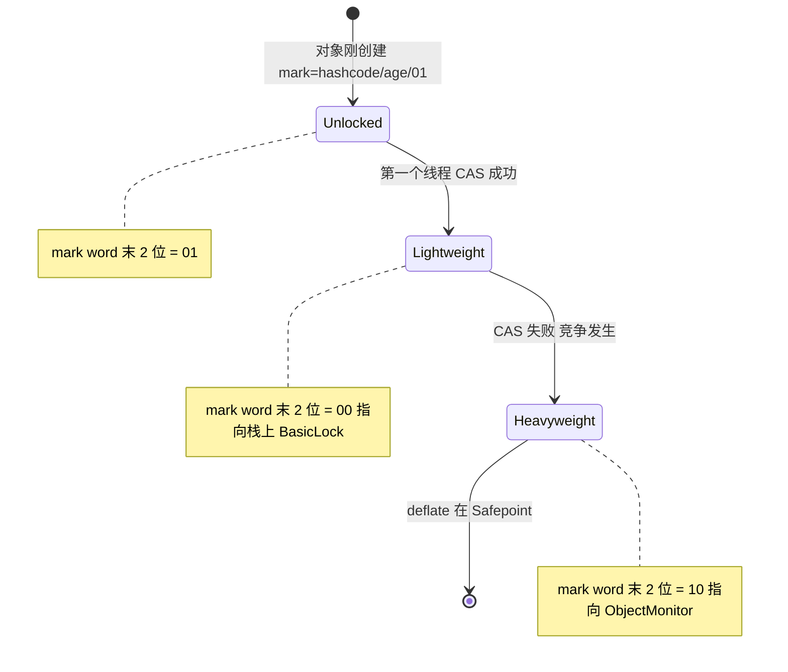
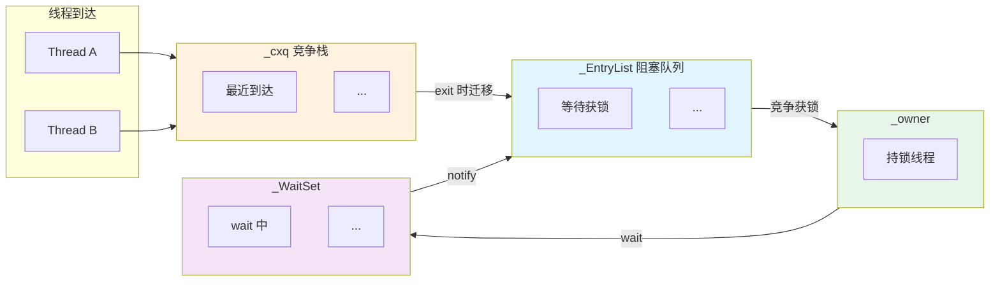

# JMM、volatile 与 synchronized 面试指南

> 基于 OpenJDK 11 源码深度分析
> 面试覆盖：Java 内存模型、happens-before、volatile 实现、synchronized 锁升级、ObjectMonitor、内存屏障、CAS、wait/notify、Safepoint
> 与其他面试指南的关系：对象头 markWord→指南 1，线程 park/unpark→指南 2，GC STW 与 Safepoint→指南 3，JIT 锁消除/锁粗化→指南 4，类初始化线程安全→指南 5

---

## 第 0 部分：核心原理 ⭐

### 0.1 本质是什么？

本文是 **JMM、volatile 与 synchronized 面试指南** 的面试准备材料：提炼核心知识点，给出标准答案框架，帮助在面试中清晰、准确地表达 JVM 内部原理。

### 0.2 为什么需要？

面试中的 JVM 问题往往需要在 2-3 分钟内讲清楚复杂机制。没有提前整理，很容易在细节上迷失，无法展示对整体的把握。

### 0.3 怎么解决？

按「本质→为什么→怎么实现→关键细节」的结构组织答案，确保回答既有深度又有条理。

### 0.4 为什么这样设计？

面试答案的设计原则：先给结论，再给理由；先讲整体，再讲细节；用类比帮助面试官理解复杂概念。

---


## 0. 核心原理

### 0.1 本质是什么？

JMM（Java Memory Model）定义了**多线程读写共享变量的可见性和有序性规则**。volatile 和 synchronized 是 JMM 在语言层面的两个核心工具：volatile 保证**可见性 + 有序性**（不保证原子性），synchronized 保证**原子性 + 可见性 + 有序性**（三者全部）。

### 0.2 为什么需要深入理解？

并发问题是线上故障的重灾区：脏读、丢失更新、指令重排导致的 DCL（Double-Checked Locking）失效。不理解 JMM 的底层实现（内存屏障、CAS、ObjectMonitor），就无法正确使用并发工具，更无法排查生产环境的竞态 Bug。

### 0.3 核心设计

**分层实现 + 硬件适配**：JMM 规范定义抽象语义（happens-before） → HotSpot 将其映射为内存屏障（OrderAccess） → x86 上大部分屏障退化为编译器屏障（TSO 模型天然保证），仅 StoreLoad 需要硬件指令（`lock addl $0,0(%rsp)`）。synchronized 从轻量级锁（栈上 CAS）逐步升级到重量级锁（ObjectMonitor），在无竞争时几乎零开销。

---

## 一、Java 内存模型基础

### Q1：JMM 是什么？解决什么问题？⭐⭐

**一句话结论**：
JMM 是 JVM 规范中定义的**多线程共享内存访问规则**，通过 happens-before 关系保证可见性和有序性，屏蔽不同 CPU 架构的内存一致性差异。

**源码级回答**：

JMM 解决的核心问题：**编译器重排序 + CPU 重排序 + Store Buffer 延迟** 导致一个线程的写操作对另一个线程不可见。

```
线程 A：x = 1; flag = true;    // 可能被重排为 flag = true; x = 1;
线程 B：if (flag) use(x);      // 可能看到 flag=true 但 x=0
```

**happens-before 6 大规则**：

| 规则 | 含义 |
|------|------|
| 程序顺序规则 | 同一线程中，前面的操作 happens-before 后面的操作 |
| Monitor 锁规则 | unlock happens-before 后续的 lock（同一把锁） |
| volatile 规则 | volatile 写 happens-before 后续的 volatile 读（同一变量） |
| 线程启动规则 | `Thread.start()` happens-before 被启动线程的任何操作 |
| 线程终止规则 | 线程的任何操作 happens-before `Thread.join()` 返回 |
| 传递性 | A hb B，B hb C → A hb C |

> **源码**：HotSpot 中 happens-before 的实现依赖 `runtime/orderAccess.hpp` 中的内存屏障原语。

---

### Q2：x86 的 TSO 模型对 JMM 实现有什么影响？⭐

**一句话结论**：
x86 使用 **TSO（Total Store Order）** 内存模型，天然保证 LoadLoad、LoadStore、StoreStore 顺序，**仅 StoreLoad 可能乱序**，所以 HotSpot 在 x86 上大幅简化了屏障实现。

**源码级回答**：

```cpp
// src/hotspot/os_cpu/linux_x86/orderAccess_linux_x86.hpp:40-56
inline void OrderAccess::loadload()   { compiler_barrier(); }  // x86 TSO 自动保证
inline void OrderAccess::storestore() { compiler_barrier(); }  // x86 TSO 自动保证
inline void OrderAccess::loadstore()  { compiler_barrier(); }  // x86 TSO 自动保证
inline void OrderAccess::storeload()  { fence();            }  // 唯一需要硬件屏障！

inline void OrderAccess::fence() {
  // 用 lock addl 代替 mfence（更快）
  __asm__ volatile ("lock; addl $0,0(%%rsp)" : : : "cc", "memory");
}
```

**为什么用 `lock addl` 而不是 `mfence`？** Intel 手册指出 `mfence` 在某些微架构上比 `lock` 前缀指令慢 2-3 倍。`lock addl $0,0(%rsp)` 对栈顶做一个无效加 0 操作，利用 `lock` 前缀的隐式全屏障效果，代价更低。

**面试加分**：在 ARM/POWER 等弱内存模型 CPU 上，所有四种屏障都需要真正的硬件指令。这就是为什么 JMM 要抽象出 OrderAccess 接口——平台无关的屏障 API。

---

## 二、volatile 实现

### Q3：volatile 在 HotSpot 中是怎么实现的？⭐⭐

**一句话结论**：
volatile 读/写最终都变成**普通 mov 指令 + 内存屏障**：volatile 写后插入 StoreLoad 屏障（`lock addl`），volatile 读后在 x86 上不需要额外屏障（TSO 保证）。

**源码级回答**：

HotSpot 有三套执行引擎，volatile 实现殊途同归：

| 引擎 | volatile 写实现 | volatile 读实现 |
|------|----------------|----------------|
| 模板解释器 | `mov` + `lock addl $0,(%rsp)` | `mov`（x86 TSO 够了） |
| C1 编译器 | `mov` + `lock addl $0,(%rsp)` | `mov` |
| C2 编译器 | `mov` + `lock addl $0,(%rsp)` | `mov` |

```cpp
// src/hotspot/cpu/x86/templateTable_x86.cpp:2715-2718
// volatile 屏障辅助函数
void TemplateTable::volatile_barrier(Assembler::Membar_mask_bits order_constraint) {
  if(!os::is_MP()) return;    // 单核不需要屏障
  __ membar(order_constraint);
}

// putfield_or_static 中 volatile store 后的屏障
// templateTable_x86.cpp:3312-3317
volatile_barrier(Assembler::StoreLoad | Assembler::StoreStore);
```

**volatile 的语义分解**：

```
volatile 写 = 普通写 + StoreLoad 屏障
             = mov [addr], value
             + lock addl $0, 0(%rsp)

volatile 读 = 普通读（+ LoadLoad + LoadStore 屏障，但 x86 TSO 自动保证）
             = mov value, [addr]
```

> **源码**：`cpu/x86/templateTable_x86.cpp:2687-2718` 有详细注释解释 JMM volatile 语义和屏障策略。

---

### Q4：volatile 能保证原子性吗？volatile++ 为什么不安全？⭐

**一句话结论**：
volatile 只保证**单次读或单次写的原子性**（对于 long/double 也保证），**不保证复合操作的原子性**。`volatile++` 是 read-modify-write 三步操作，中间可以被其他线程打断。

**源码级回答**：

```
volatile int count = 0;

// volatile++ 实际字节码：
iconst_1
iadd          // 中间步骤——没有原子性保证！
putfield count

// 两个线程同时执行 volatile++：
线程A: read count → 0
线程B: read count → 0    // A 的 write 还没发生
线程A: write count → 1
线程B: write count → 1   // 丢失更新！
```

**正确做法**：
- `AtomicInteger.incrementAndGet()` → 底层使用 `Unsafe.compareAndSetInt()` → `lock cmpxchgl`
- `synchronized { count++; }` → 互斥保证

> **源码**：`src/hotspot/share/prims/unsafe.cpp:907` 中 `Unsafe_CompareAndSetInt` 调用 `HeapAccess<>::atomic_cmpxchg_at()`，最终在 x86 上生成 `lock cmpxchgl` 指令。

---

### Q5：DCL（双重检查锁定）为什么需要 volatile？⭐

**一句话结论**：
没有 volatile 时，对象引用赋值可能在**构造函数完成之前**对其他线程可见（指令重排），导致其他线程拿到一个**半初始化的对象**。

**源码级回答**：

```java
class Singleton {
    private static volatile Singleton instance;  // 必须 volatile！
    
    static Singleton getInstance() {
        if (instance == null) {           // 第一次检查（无锁）
            synchronized (Singleton.class) {
                if (instance == null) {   // 第二次检查（持锁）
                    instance = new Singleton();  // 关键行
                }
            }
        }
        return instance;
    }
}
```

**`new Singleton()` 的三步操作**：

```
1. memory = allocate()           // 分配内存
2. ctorInstance(memory)          // 调用构造函数
3. instance = memory             // 赋值引用
```

**没有 volatile 时，步骤 2 和 3 可能被重排为 3→2**：

```
线程A: 分配内存 → instance = memory（还没调构造函数！）
线程B: 第一次检查 instance != null → return instance  // 拿到半初始化对象！
线程A: 调用构造函数（太晚了）
```

**volatile 的作用**：volatile 写的 StoreLoad 屏障禁止步骤 3 之前的操作（步骤 2）被重排到步骤 3 之后，保证其他线程看到 `instance != null` 时，对象一定已完全构造。

---

## 三、synchronized 锁升级

### Q6：synchronized 的锁升级过程是什么？⭐⭐

**一句话结论**：
**无锁 → 轻量级锁（CAS + 栈上 BasicLock）→ 重量级锁（ObjectMonitor）**，锁只能升级不能降级（单向膨胀）。偏向锁在 JDK 15 已废弃（JEP 374），此处略过。

**源码级回答**：



**mark word 编码**（64 位，`markOop.hpp:90-96`）：

```
[ptr             | 00]  locked     — 轻量级锁，ptr 指向栈上 displaced header
[header      | 0 | 01]  unlocked  — 普通对象头（hashcode + age）
[ptr             | 10]  monitor   — 膨胀为 ObjectMonitor
[ptr             | 11]  marked    — GC 标记用
```

**轻量级锁获取**（`synchronizer.cpp:339-368`）：

```cpp
void ObjectSynchronizer::slow_enter(Handle obj, BasicLock* lock, TRAPS) {
  markOop mark = obj->mark();
  
  if (mark->is_neutral()) {  // 无锁状态（末位 01）
    lock->set_displaced_header(mark);  // 把原始 mark 保存到栈上 BasicLock
    if (mark == obj()->cas_set_mark((markOop)lock, mark)) {
      return;  // CAS 成功 → 轻量级锁获取成功，mark word 指向栈上 BasicLock
    }
    // CAS 失败 → 有竞争，继续走膨胀
  } else if (mark->has_locker() && THREAD->is_lock_owned((address)mark->locker())) {
    lock->set_displaced_header(NULL);  // 重入：同一线程再次进入
    return;
  }
  
  // 膨胀为重量级锁
  ObjectSynchronizer::inflate(THREAD, obj(), inflate_cause_monitor_enter)->enter(THREAD);
}
```

**关键设计**：轻量级锁不需要操作系统介入（纯用户态 CAS），无竞争时开销极小（一次 CAS ≈ 几十纳秒）。只有 CAS 失败才膨胀为 ObjectMonitor，调用 `pthread_mutex` 等系统原语。

---

### Q7：ObjectMonitor 的核心结构是什么？⭐⭐

**一句话结论**：
ObjectMonitor 是 synchronized 重量级锁的核心数据结构，包含 **`_owner`（持锁线程）、`_cxq`（竞争队列）、`_EntryList`（阻塞队列）、`_WaitSet`（wait 等待队列）** 四个关键字段。

**源码级回答**：

```cpp
// src/hotspot/share/runtime/objectMonitor.hpp:128-173（关键字段）
class ObjectMonitor {
  volatile markOop   _header;       // 保存膨胀前的原始 mark word
  void*     volatile _object;       // 指向关联的 Java 对象
  void * volatile    _owner;        // 持锁线程（Thread* 或 BasicLock*）
  volatile intptr_t  _recursions;   // 重入计数（实际类型 intptr_t，0=首次进入）
  ObjectWaiter* volatile _EntryList; // 阻塞在锁上的线程链表
  ObjectWaiter* volatile _cxq;      // 最近到达的竞争线程栈（LIFO）
  Thread* volatile _succ;           // 继承者线程（优化唤醒）
  volatile int _SpinDuration;       // 自适应自旋持续时间
  volatile jint  _count;            // 引用计数（防 deflate 时回收）
  ObjectWaiter* volatile _WaitSet;  // wait() 等待的线程链表
  volatile int _WaitSetLock;        // WaitSet 的自旋锁保护
};
```

**三队列协作模型**：



**`_cxq` vs `_EntryList` 为什么分两个？** `_cxq` 用 CAS 入栈（无锁），高并发下减少竞争。`_EntryList` 在持锁线程 exit 时从 `_cxq` 批量迁移（持锁操作，安全），避免每次 exit 都在 `_cxq` 上竞争。

> **源码**：`runtime/objectMonitor.hpp:128-173` 定义完整字段。

---

### Q8：ObjectMonitor::enter() 的获锁流程是什么？⭐

**一句话结论**：
**CAS 抢 `_owner` → 检查重入 → 自旋 → park 阻塞**，分三层尝试，从最轻量到最重量逐级递进。

**源码级回答**：

```cpp
// src/hotspot/share/runtime/objectMonitor.cpp:265-290
void ObjectMonitor::enter(TRAPS) {
  Thread * const Self = THREAD;

  // 第 1 层：CAS 尝试（最快路径）
  void * cur = Atomic::cmpxchg(Self, &_owner, (void*)NULL);
  if (cur == NULL) {
    return;  // 无竞争，直接获锁
  }

  // 第 2 层：重入检查
  if (cur == Self) {
    _recursions++;  // 同一线程重入
    return;
  }

  // 第 3 层：从轻量级锁升级来的情况
  if (Self->is_lock_owned((address)cur)) {
    _recursions = 1;
    _owner = Self;  // 把 _owner 从 BasicLock* 转为 Thread*
    return;
  }

  // 以上全部失败 → 进入 EnterI() 阻塞等待
  // objectMonitor.cpp:442
  EnterI(THREAD);
}
```

**EnterI() 的阻塞策略**：
1. **自适应自旋**（`TrySpin()`）：先自旋 `_SpinDuration` 次（自适应调整），避免立即 park 的上下文切换开销
2. **CAS 入 `_cxq`**：自旋失败后，把自己包装为 `ObjectWaiter`，CAS 入 `_cxq` 链表头部
3. **park 阻塞**：调用 `Self->_ParkEvent->park()` → 最终到 `pthread_cond_wait()`

> **源码**：`objectMonitor.cpp:265`（enter）、`objectMonitor.cpp:442`（EnterI）。

---

### Q9：ObjectMonitor::exit() 怎么释放锁并唤醒后继线程？⭐

**一句话结论**：
递减 `_recursions` → 置空 `_owner` → 检查 `_EntryList` 和 `_cxq` → 唤醒后继线程（`unpark`）。

**源码级回答**：

```cpp
// src/hotspot/share/runtime/objectMonitor.cpp:905-936
void ObjectMonitor::exit(bool not_suspended, TRAPS) {
  Thread * const Self = THREAD;
  
  // 1. 重入检查
  if (_recursions != 0) {
    _recursions--;  // 还没退完，直接返回
    return;
  }
  
  // 2. 释放锁：置空 _owner
  // （省略了复杂的唤醒策略选择逻辑）
  
  // 3. 唤醒策略：检查 _EntryList 和 _cxq
  //    - 如果 _EntryList 非空 → unpark _EntryList 头部线程
  //    - 如果 _EntryList 为空但 _cxq 非空 → 把 _cxq 迁移到 _EntryList，再 unpark
  //    - 都为空 → 无人等待，直接返回
}
```

**唤醒策略的设计考量**：
- **为什么不直接 unpark `_cxq` 头部？** `_cxq` 是 LIFO（栈），直接唤醒会导致"饥饿"——最早等待的线程最晚被唤醒
- **迁移到 `_EntryList` 时会反转链表**（LIFO → FIFO），恢复公平性
- **`_succ`（继承者）优化**：设置 `_succ` 后，当前线程退出时如果 `_succ` 已经在运行，就不需要额外 unpark

> **源码**：`objectMonitor.cpp:905`（exit）、`objectMonitor.cpp:1282`（ExitEpilog 唤醒）。

---

## 四、CAS 与原子操作

### Q10：CAS 在 HotSpot 中是怎么实现的？⭐⭐

**一句话结论**：
`Atomic::cmpxchg()` 在 x86 上生成 **`lock cmpxchgl`** 指令：`lock` 前缀锁定缓存行，`cmpxchg` 比较并交换，整个操作原子完成。

**源码级回答**：

```cpp
// src/hotspot/os_cpu/linux_x86/atomic_linux_x86.hpp:81-86
// 4 字节 CAS
template<>
struct Atomic::PlatformCmpxchg<4> {
  int32_t operator()(int32_t xchg_val, volatile int32_t* dest,
                     int32_t cmp_val, ...) const {
    __asm__ volatile ("lock cmpxchgl %1,(%3)"
                      : "=a" (xchg_val)
                      : "r" (xchg_val), "a" (cmp_val), "r" (dest)
                      : "cc", "memory");
    return xchg_val;  // 返回 dest 的旧值
  }
};

// 8 字节 CAS（AMD64）
// atomic_linux_x86.hpp:123
// lock cmpxchgq — 同理，操作 8 字节
```

**从 Java 到硬件的完整链路**：

```
AtomicInteger.compareAndSet(expect, update)
  → Unsafe.compareAndSetInt()
    → Unsafe_CompareAndSetInt()              // unsafe.cpp:907
      → HeapAccess<>::atomic_cmpxchg_at()
        → RawAccessBarrier::atomic_cmpxchg()
          → Atomic::cmpxchg()               // atomic.hpp:693
            → PlatformCmpxchg<4>::operator() // atomic_linux_x86.hpp:81-86
              → lock cmpxchgl               // x86 汇编指令
```

**`lock` 前缀的三重效果**：
1. **原子性**：锁定缓存行（或总线锁），保证 read-compare-write 不被打断
2. **可见性**：刷新 Store Buffer，其他 CPU 立即可见
3. **有序性**：隐含全内存屏障（StoreLoad + StoreStore + LoadLoad + LoadStore）

---

### Q11：CAS 的 ABA 问题是什么？JDK 怎么解决？⭐

**一句话结论**：
CAS 只比较值，无法检测"值被改为 B 又改回 A"。JDK 用 `AtomicStampedReference`（版本号）解决：CAS 同时比较值和版本号，版本号单调递增。

**源码级回答**：

```
线程1: 读到 A
线程2: A → B → A（经历了中间状态）
线程1: CAS(A, C) 成功——但语义上可能已错（中间状态可能有副作用）
```

**解决方案**：

| 方案 | 原理 | JDK 类 |
|------|------|--------|
| 版本号 | CAS(value+stamp, newValue+stamp+1) | `AtomicStampedReference` |
| 布尔标记 | CAS(value+mark, newValue+newMark) | `AtomicMarkableReference` |

**面试加分**：在 JVM 内部，CAS 操作的对象通常是指针或单调递增计数器，ABA 问题很少发生。ABA 主要影响无锁数据结构（如无锁栈/队列），HotSpot 的 `_cxq` 栈通过在持锁线程中操作 `_EntryList` 来规避。

---

## 五、wait/notify 机制

### Q12：wait/notify 的底层实现是什么？⭐⭐

**一句话结论**：
`Object.wait()` 释放 ObjectMonitor 锁，将当前线程加入 **`_WaitSet`** 链表并 park 阻塞；`notify()` 从 `_WaitSet` 取一个线程移到 **`_EntryList`**（不是直接唤醒！），被移动的线程要重新竞争锁。

**源码级回答**：

**wait() 流程**（`objectMonitor.cpp` 中 `ObjectMonitor::wait()`）：

```
1. 检查当前线程是否持有锁（否则抛 IllegalMonitorStateException）
2. 创建 ObjectWaiter 节点，加入 _WaitSet 链表
3. 释放锁（_owner = NULL, _recursions 保存到 ObjectWaiter）
4. 唤醒 _EntryList/_cxq 中的等待线程（让出锁）
5. park() 阻塞自己
6. 被 notify/notifyAll 唤醒后：
   → 从 _WaitSet 移到 _EntryList
   → 重新竞争锁（ReenterI）
   → 获锁后恢复 _recursions
7. wait() 返回
```

**notify() 流程**（`objectMonitor.cpp` 中 `ObjectMonitor::notify()`）：

```
1. 检查当前线程是否持有锁
2. 从 _WaitSet 头部取一个 ObjectWaiter
3. 将其移到 _EntryList 或 _cxq（根据策略）
4. 返回（不立即释放锁！被通知线程要等 notify 所在的 synchronized 块结束）
```

**关键区别：notify vs notifyAll**

| 方面 | notify() | notifyAll() |
|------|----------|-------------|
| 唤醒数量 | _WaitSet 中的 1 个 | _WaitSet 中的全部 |
| 移动目标 | 移到 _EntryList | 全部移到 _cxq |
| 竞争 | 被唤醒线程与 _EntryList 竞争 | 所有被唤醒线程互相竞争 |
| 适用场景 | 确定只有一个等待者需要唤醒 | 不确定哪个等待者该被唤醒 |

> **源码**：`objectMonitor.cpp` 中 `wait()` 在第 1416 行，`notify()` 在第 1766 行。

---

### Q13：为什么 wait/notify 必须在 synchronized 块中调用？⭐

**一句话结论**：
因为 wait/notify 操作的是 **ObjectMonitor 的 `_WaitSet`**，必须持有该 monitor 的锁才能安全操作。否则会出现 **lost wakeup（丢失唤醒）** 竞态条件。

**源码级回答**：

```java
// 如果不要求在 synchronized 中——可能发生的竞态：
// 生产者                    // 消费者
                             if (queue.isEmpty()) {  // 检查条件
// 生产了一条数据
notify();                    //                       ← notify 在 wait 之前！丢失了！
                               wait();               // 永远等不到了
```

**synchronized 解决了什么？**

```java
synchronized (lock) {         synchronized (lock) {
  queue.add(item);              while (queue.isEmpty()) {
  lock.notify();                  lock.wait();  // wait 释放锁，保证 notify 能进入
}                               }
                                item = queue.poll();
                              }
```

在 synchronized 块中，**条件检查和 wait/notify 操作是原子的**（持锁），不会出现 lost wakeup。源码中 `ObjectMonitor::wait()` 第一步就检查 `THREAD == _owner`，不持锁直接抛 `IllegalMonitorStateException`。

---

## 六、内存屏障

### Q14：JVM 中有哪几种内存屏障？⭐

**一句话结论**：
四种基本屏障：**LoadLoad、StoreStore、LoadStore、StoreLoad**，加上复合屏障 **acquire（LoadLoad+LoadStore）、release（StoreStore+LoadStore）、fence（全屏障）**。x86 上只有 StoreLoad 需要硬件指令。

**源码级回答**：

```cpp
// src/hotspot/share/runtime/orderAccess.hpp:257
class OrderAccess : public AllStatic {
 public:
  static void loadload();    // 禁止 Load-Load 重排
  static void storestore();  // 禁止 Store-Store 重排
  static void loadstore();   // 禁止 Load-Store 重排
  static void storeload();   // 禁止 Store-Load 重排（最昂贵）
  static void acquire();     // Load 后的屏障（LoadLoad + LoadStore）
  static void release();     // Store 前的屏障（StoreStore + LoadStore）
  static void fence();       // 全屏障
};
```

**volatile 读/写的屏障插入**（JMM 规范）：

```
volatile 读:
  load
  [LoadLoad]    ← x86 不需要
  [LoadStore]   ← x86 不需要

volatile 写:
  [StoreStore]  ← x86 不需要
  store
  [StoreLoad]   ← x86 上 = lock addl $0, 0(%rsp)
```

**面试加分**：synchronized 的 lock 操作隐含 acquire 语义，unlock 操作隐含 release + StoreLoad 语义。这就是为什么 synchronized 块内的修改对后续获锁线程可见。

---

## 七、锁膨胀（inflate）

### Q15：锁膨胀的过程是什么？什么时候触发？⭐

**一句话结论**：
当轻量级锁 CAS 失败（有竞争）或调用 `wait()/notify()`/`hashCode()` 时，JVM 将对象的 mark word 替换为指向 **ObjectMonitor** 的指针，锁状态从 `00`（轻量级）变为 `10`（重量级）。

**源码级回答**：

**膨胀触发条件**（`synchronizer.hpp:52-61`）：

```cpp
enum InflateCause {
  inflate_cause_vm_internal = 0,
  inflate_cause_monitor_enter = 1,    // monitorenter 竞争
  inflate_cause_wait = 2,             // Object.wait()
  inflate_cause_notify = 3,           // Object.notify/notifyAll()
  inflate_cause_hash_code = 4,        // System.identityHashCode()
  inflate_cause_jvmti = 5             // JVMTI 需要
};
```

**inflate() 核心逻辑**（`synchronizer.cpp:1387`，简化）：

```
1. 读取 mark word
2. 如果已是 monitor（末位 10）→ 直接返回现有 ObjectMonitor
3. 如果是 INFLATING 标记 → 其他线程正在膨胀，自旋等待
4. 如果是轻量级锁（末位 00）：
   a. 从空闲池分配 ObjectMonitor
   b. 设 _header = displaced mark word
   c. 设 _owner = 持锁线程
   d. CAS 将 mark word 设为 ObjectMonitor* | 10
5. 如果是无锁（末位 01）：
   a. 分配 ObjectMonitor
   b. 设 _header = 原始 mark word
   c. CAS 将 mark word 设为 ObjectMonitor* | 10
```

**为什么 `hashCode()` 要触发膨胀？** 轻量级锁把原始 mark word 移到了栈上 BasicLock 中。而 `identityHashCode()` 需要一个**稳定存储位置**保存 hash 值。ObjectMonitor 的 `_header` 字段就是这个稳定位置——只要 monitor 存在，hash 值就不会丢失。

---

## 八、Safepoint 与锁的关系

### Q16：Safepoint 和 synchronized 有什么关系？⭐

**一句话结论**：
Safepoint 是 JVM 实现 STW（Stop-The-World）的机制。**持有 ObjectMonitor 锁不会阻止线程到达 Safepoint**（因为锁是 Java 层面的，Safepoint 是 VM 层面的），但 Safepoint 期间线程不会执行 Java 代码，等价于"冻结"了所有锁的状态。

**源码级回答**：

**Safepoint 检查点**（线程在以下位置检查 Safepoint 请求）：

| 检查点 | 位置 |
|--------|------|
| 解释器后向跳转 | 每次循环迭代（`dispatch_epilog()`） |
| 方法返回 | 返回调用者前 |
| JNI 返回 | native → Java 的转换点 |
| C2 长循环 | Loop Strip Mining 插入的 SafePoint（`ch03_counted_loop_safepoint.md`） |

**锁与 Safepoint 的交互**：
- 线程在 `ObjectMonitor::EnterI()` 中 park 阻塞时，状态是 `_thread_blocked`，**已经处于安全状态**——GC 可以安全扫描该线程的栈
- synchronized 块内执行 Java 代码时，会在后向跳转/方法调用处检查 Safepoint
- `ObjectMonitor::deflate_idle_monitors()` 在 **Safepoint 期间**执行，回收不再使用的重量级锁

> **源码**：`SafepointSynchronize::begin()` 在 `runtime/safepoint.cpp` 中。deflate 在 `synchronizer.cpp` 中 `ObjectSynchronizer::deflate_idle_monitors()`。

---

## 九、JUC 基础：LockSupport 与 Parker

### Q17：LockSupport.park/unpark 的底层实现是什么？⭐

**一句话结论**：
`LockSupport.park()` 底层调用 `Parker::park()`，基于 **`pthread_mutex` + `pthread_cond`** 实现。每个 JavaThread 有一个 `_parker` 字段，持有一个 `_counter` 许可（0 或 1），park 消费许可，unpark 发放许可。

**源码级回答**：

```
LockSupport.park()
  → Unsafe.park()
    → Parker::park()                // os_linux.cpp
      → if (_counter > 0) { _counter = 0; return; }  // 有许可，直接消费
      → pthread_mutex_lock(&_mutex)
      → pthread_cond_wait(&_cond, &_mutex)           // 阻塞
      → _counter = 0
      → pthread_mutex_unlock(&_mutex)

LockSupport.unpark(thread)
  → Unsafe.unpark()
    → Parker::unpark()
      → pthread_mutex_lock(&_mutex)
      → _counter = 1                                  // 发放许可
      → pthread_cond_signal(&_cond)                   // 唤醒
      → pthread_mutex_unlock(&_mutex)
```

**Parker vs ObjectMonitor 的区别**：

| 维度 | Parker | ObjectMonitor |
|------|--------|---------------|
| 用途 | `LockSupport.park/unpark`、JUC 基础设施 | synchronized 重量级锁 |
| 许可模型 | 二值许可（0/1），不累积 | 互斥锁 + 条件变量 |
| 关联对象 | 每个 JavaThread 自带一个 | 每个被 synchronized 的对象可能一个 |
| 底层实现 | pthread_mutex + pthread_cond | pthread_mutex + pthread_cond + 自旋 |
| 重入支持 | 不支持 | 支持（_recursions） |

> **源码**：Parker 定义在 `os/linux/os_linux.hpp`，实现在 `os/linux/os_linux.cpp`。详见 `ParkerLockSupport/1-Parker-LockSupport-Deep-Dive.md`。

---

## 十、实战场景

### Q18：synchronized 和 ReentrantLock 有什么区别？⭐⭐

**一句话结论**：
synchronized 是**语言级别关键字**，自动加锁/解锁，锁升级由 JVM 管理；ReentrantLock 是 **API 级别的锁**，手动加锁/解锁，提供更多特性（公平锁、可中断、超时、Condition）。

| 维度 | synchronized | ReentrantLock |
|------|-------------|---------------|
| 实现层面 | JVM 内置（monitorenter/monitorexit 字节码） | Java 类（基于 AQS + CAS + LockSupport） |
| 锁释放 | 自动（退出 synchronized 块/异常退出） | 手动（`finally { lock.unlock(); }`） |
| 可中断 | 不支持（`wait()` 可中断，但锁获取不可中断） | `lockInterruptibly()` |
| 超时 | 不支持 | `tryLock(timeout)` |
| 公平性 | 非公平（ObjectMonitor 不保证 FIFO） | 可选公平/非公平 |
| 条件变量 | `wait/notify`（只有一个等待集合） | `Condition`（可以有多个等待队列） |
| 锁升级 | 轻量级→重量级（JVM 自动优化） | 无锁升级（直接 CAS + park） |
| 性能（无竞争） | 轻量级锁 ≈ 1 次 CAS | 1 次 CAS |
| 性能（高竞争） | ObjectMonitor + 自适应自旋 | AQS CLH 队列 + park |

**面试加分**：JDK 6 以后 synchronized 性能大幅提升（锁升级、自适应自旋、锁消除、锁粗化），在大多数场景下与 ReentrantLock 性能相当。**优先使用 synchronized**，只有需要 ReentrantLock 的额外特性时才选它。

---

### Q19：JIT 编译器对锁做了哪些优化？⭐

**一句话结论**：
C2 编译器主要做三种锁优化：**锁消除（Lock Elision）、锁粗化（Lock Coarsening）、嵌套锁优化（Nested Lock Elimination）**。

**源码级回答**：

**锁消除**：通过逃逸分析发现锁对象不会逃逸出当前线程，则直接移除 monitorenter/monitorexit。

```java
// 优化前
void f() {
    Object lock = new Object();  // lock 不会逃逸
    synchronized (lock) {
        // ...
    }
}

// C2 优化后：synchronized 被移除
```

**锁粗化**：多次连续的 lock/unlock 合并为一次，减少加锁/解锁开销。

```java
// 优化前
for (int i = 0; i < 100; i++) {
    synchronized (lock) { list.add(i); }  // 100 次 lock/unlock
}

// C2 优化后
synchronized (lock) {
    for (int i = 0; i < 100; i++) { list.add(i); }  // 1 次 lock/unlock
}
```

**JVM 参数**：
```bash
-XX:+EliminateLocks          # 开启锁消除（默认开启）
-XX:+EliminateNestedLocks    # 开启嵌套锁消除（默认开启）
-XX:+DoEscapeAnalysis        # 开启逃逸分析（锁消除的前提，默认开启）
-XX:+PrintEliminateLocks     # 打印锁消除日志（调试用）

# 输出示例：
# 1    Eliminated: Lock (address, ...)
```

---

### Q20：生产环境中锁竞争问题怎么排查？⭐

**一句话结论**：
用 **async-profiler lock 模式**采集锁竞争热点 → **jstack / Arthas thread** 看线程阻塞状态 → **JFR** 采集 `JavaMonitorWait`/`JavaMonitorEnter` 事件 → 定位竞争锁对象和持锁线程。

**排查工具链**：

| 工具 | 命令 | 采集内容 |
|------|------|---------|
| async-profiler | `./profiler.sh -e lock -d 30 -o flamegraph PID` | 锁竞争火焰图 |
| jstack | `jstack PID` | 线程快照（看 BLOCKED 状态和 waiting on monitor） |
| Arthas | `thread -b` | 找出阻塞其他线程的"罪魁祸首"线程 |
| JFR | `-XX:StartFlightRecording=filename=r.jfr` | JavaMonitorWait/Enter 事件 |
| JMX | `ThreadMXBean.findMonitorDeadlockedThreads()` | 死锁检测 |

**JVM 监控参数**：
```bash
# 打印锁竞争统计
-XX:+PrintContendedMonitor

# GDB 验证
# 在 ObjectMonitor::EnterI() 设断点，观察哪些线程在竞争
break ObjectMonitor::EnterI
```

---

## GDB 验证脚本

```bash
# 文件：jvm-md/tmp-file/JMM-Interview/gdb_jmm_verify.cmd
# 用途：验证 synchronized 锁升级、ObjectMonitor enter/exit、volatile 屏障

# 使用方法：
# gdb -x jvm-md/tmp-file/JMM-Interview/gdb_jmm_verify.cmd \
#     /data/workspace/openjdk-cut-new/build/linux-x86_64-normal-server-slowdebug/jdk/bin/java

set pagination off
set breakpoint pending on

# BP1: 轻量级锁入口 - 观察 CAS 操作
break ObjectSynchronizer::slow_enter
commands
  silent
  printf "slow_enter: obj=%p, mark=0x%lx, lock_bits=%d\n", obj(), obj()->mark(), obj()->mark()->value() & 3
  continue
end

# BP2: 锁膨胀 - 观察何时从轻量级升级到重量级
break ObjectSynchronizer::inflate
commands
  silent
  printf "inflate: obj=%p, cause=%d\n", object, cause
  continue
end

# BP3: ObjectMonitor enter - 观察获锁
break ObjectMonitor::enter
commands
  silent
  printf "monitor_enter: owner=%p, recursions=%ld, thread=%p\n", _owner, _recursions, THREAD
  continue
end

# BP4: ObjectMonitor exit - 观察释放锁
break ObjectMonitor::exit
commands
  silent
  printf "monitor_exit: owner=%p, recursions=%ld, cxq=%p, EntryList=%p\n", _owner, _recursions, _cxq, _EntryList
  continue
end

run -Xms8g -Xmx8g -XX:+UseG1GC -Xint -cp /data/workspace/demo/src com.wjcoder.Main
```

---

## 面试话术

### 30 秒版本

> "JMM 通过 happens-before 规则定义多线程可见性和有序性。volatile 通过内存屏障实现——在 x86 上 volatile 写后插入 `lock addl` 指令作为 StoreLoad 屏障。synchronized 采用锁升级策略：无竞争时是轻量级锁（栈上 CAS），有竞争时膨胀为 ObjectMonitor 重量级锁，通过 `_cxq`、`_EntryList`、`_WaitSet` 三个队列管理竞争和等待线程。x86 的 TSO 模型让 JMM 实现大幅简化——四种屏障中只有 StoreLoad 需要真正的硬件指令。"

### 2 分钟版本

> "JMM 的核心是 happens-before 关系，在 HotSpot 中通过 OrderAccess 类映射为内存屏障。x86 使用 TSO 内存模型，天然保证 LoadLoad、StoreStore、LoadStore 顺序，只有 StoreLoad 需要硬件屏障——具体实现是 `lock addl $0,0(%rsp)`，比 mfence 快 2-3 倍。
>
> volatile 的三套执行引擎（解释器/C1/C2）殊途同归：volatile 写 = mov + lock addl，volatile 读 = 普通 mov。但 volatile 不保证复合操作原子性，所以 volatile++ 不安全。
>
> synchronized 采用锁升级：无锁状态 mark word 末位 01 → 第一个线程 CAS 成功变为轻量级锁末位 00（指向栈上 BasicLock）→ CAS 失败触发 inflate 膨胀为 ObjectMonitor 末位 10。ObjectMonitor 的核心是三个队列：_cxq 用 CAS 入栈接收新到达的竞争线程，exit 时迁移到 _EntryList 并 unpark；wait() 将线程移入 _WaitSet，notify 移回 _EntryList。
>
> CAS 在 x86 上是 lock cmpxchgl 指令，lock 前缀同时保证原子性、可见性和有序性。生产环境排查锁竞争可以用 async-profiler lock 模式生成火焰图，或者 Arthas thread -b 直接定位阻塞源。"

---

## 总结

| 话题 | 一句话要点 |
|------|-----------|
| JMM | happens-before 6 大规则，通过 OrderAccess 映射为内存屏障 |
| x86 TSO | 天然保证大部分顺序，只有 StoreLoad 需要 lock addl |
| volatile | 写后 StoreLoad 屏障，读无额外屏障（x86）；不保证复合操作原子性 |
| synchronized 锁升级 | 无锁 01 → 轻量级 00（CAS）→ 重量级 10（ObjectMonitor），单向膨胀 |
| ObjectMonitor | _owner + _cxq + _EntryList + _WaitSet 四核心字段 |
| CAS | lock cmpxchgl，一条指令保证原子性+可见性+有序性 |
| wait/notify | wait 释放锁入 _WaitSet，notify 移到 _EntryList 重新竞争 |
| 锁优化 | JIT 锁消除（逃逸分析）、锁粗化、嵌套锁消除 |
| LockSupport | Parker 基于 pthread_mutex + pthread_cond，二值许可模型 |

---

## 交叉引用

| 相关主题 | 文档位置 |
|---------|---------|
| JMM 总纲深度分析 | [JMM/1-Java-Memory-Model-Deep-Dive.md](../JMM/1-Java-Memory-Model-Deep-Dive.md) |
| volatile 三层实现 | [JMM/2-Volatile-Three-Layer-Implementation.md](../JMM/2-Volatile-Three-Layer-Implementation.md) |
| synchronized 解释器实现 | [JMM/3-Synchronized-Interpreter-Implementation.md](../JMM/3-Synchronized-Interpreter-Implementation.md) |
| ObjectMonitor wait/notify | [JMM/4-ObjectMonitor-Wait-Notify-Deep-Dive.md](../JMM/4-ObjectMonitor-Wait-Notify-Deep-Dive.md) |
| 锁升级完整链路 | [JMM/5-Lock-Escalation-Full-Chain.md](../JMM/5-Lock-Escalation-Full-Chain.md) |
| 同步机制总纲 | [Synchronization/1-Synchronization-Mechanism-Deep-Dive.md](../Synchronization/1-Synchronization-Mechanism-Deep-Dive.md) |
| 锁性能调优实战 | [Synchronization/2-Lock-Performance-Tuning-Real-Case.md](../Synchronization/2-Lock-Performance-Tuning-Real-Case.md) |
| ObjectMonitor Enter/Exit | [Synchronization/3-ObjectMonitor-Enter-Exit-Deep-Dive.md](../Synchronization/3-ObjectMonitor-Enter-Exit-Deep-Dive.md) |
| markWord 对象头 | [RuntimeResolve/ch01_object_header_markword.md](../RuntimeResolve/ch01_object_header_markword.md) |
| 锁优化与升级链路 | [RuntimeResolve/ch03_lock_optimization.md](../RuntimeResolve/ch03_lock_optimization.md) |
| Parker/LockSupport | [ParkerLockSupport/1-Parker-LockSupport-Deep-Dive.md](../ParkerLockSupport/1-Parker-LockSupport-Deep-Dive.md) |
| Safepoint 机制 | [Safepoint/SafepointMechanism.md](../Safepoint/SafepointMechanism.md) |
| ObjectMonitor 启动分析 | [JVM-Startup/Phase3/3.8_objectmonitor_analysis.md](../JVM-Startup/Phase3/3.8_objectmonitor_analysis.md) |
| 对象生命周期面试指南 | [Interview/1-Object-Lifecycle-Interview-Guide.md](1-Object-Lifecycle-Interview-Guide.md) |
| 线程并发面试指南 | [Interview/2-Thread-Concurrency-Interview-Guide.md](2-Thread-Concurrency-Interview-Guide.md) |
| G1 GC 面试指南 | [Interview/3-GC-G1GC-Interview-Guide.md](3-GC-G1GC-Interview-Guide.md) |
| JIT 编译器面试指南 | [Interview/4-JIT-Compiler-Interview-Guide.md](4-JIT-Compiler-Interview-Guide.md) |
| 类加载面试指南 | [Interview/5-ClassLoading-Metaspace-Interview-Guide.md](5-ClassLoading-Metaspace-Interview-Guide.md) |
