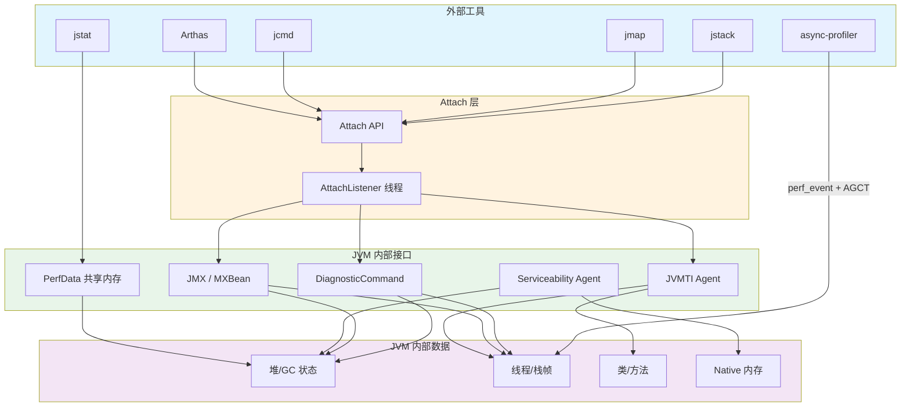
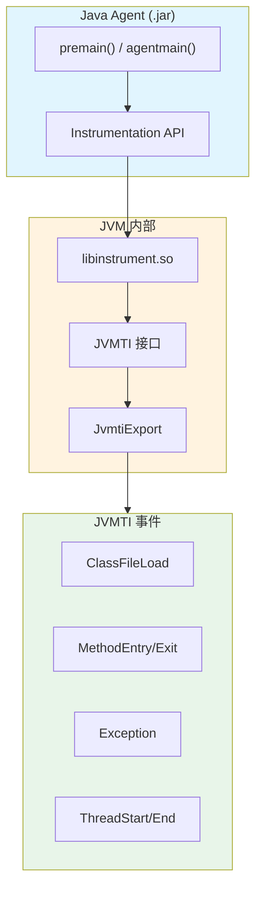

# 性能分析与故障排查面试指南

> 基于 OpenJDK 11 源码深度分析
> 面试覆盖：JVM 诊断工具链、GC 日志分析、内存泄漏排查、CPU 飙高诊断、线程死锁、async-profiler/Arthas/JFR、NMT、HeapDump、Attach 机制、JVMTI
> 与其他面试指南的关系：GC 调优细节→指南 3，JIT 去优化/CodeCache→指南 4，线程状态/Safepoint→指南 2，对象分配/TLAB→指南 1，锁竞争/ObjectMonitor→指南 6

---

## 第 0 部分：核心原理 ⭐

### 0.1 本质是什么？

本文对 **性能分析与故障排查面试指南** 进行源码级分析：追踪关键函数的执行路径，分析涉及的数据结构，解释每个设计决策的原因。

### 0.2 为什么需要？

仅靠文档和注释无法完全理解 JVM 的行为——很多关键细节只存在于源码中。源码级分析能建立对 JVM 行为的精确理解。

### 0.3 怎么解决？

从入口函数出发，自顶向下追踪调用链；对每个关键函数，分析其输入/输出/副作用；对每个数据结构，分析其字段含义和生命周期。

### 0.4 为什么这样设计？

分析过程中重点关注「为什么」：为什么选择这个数据结构？为什么这样处理边界情况？这些问题的答案往往揭示了 JVM 设计的精髓。

---


## 0. 核心原理

### 0.1 本质是什么？

JVM 性能分析与故障排查的核心能力：**通过诊断工具获取 JVM 内部运行数据（GC 日志、线程栈、堆快照、CPU 采样），定位性能瓶颈或故障根因，并基于 JVM 源码级理解做出正确优化决策**。

### 0.2 为什么需要深入理解？

生产环境不能 debug、不能随意重启。面对 OOM、CPU 100%、响应延迟突增、Full GC 频繁等问题，必须在**不停服、低侵入**的前提下采集数据、分析根因。不理解工具背后的实现原理（JVMTI 回调、信号机制、Safepoint 采样偏差），就无法选择正确的工具，更无法正确解读采集到的数据。

### 0.3 核心设计

**分层诊断体系**：JVM 暴露三层诊断接口——(1) **JMX/MXBean**：运行时统计数据（堆使用率、GC 次数、线程数）；(2) **JVMTI**：字节码级别的事件回调（方法进入/退出、类加载、异常抛出）；(3) **Serviceability Agent**：进程外直接读取 JVM 内存（无需目标 JVM 配合）。async-profiler 另辟蹊径，利用 **Linux perf_event + AsyncGetCallTrace** 绕过 Safepoint 偏差，实现低开销高精度采样。

---

## 一、诊断工具体系

### Q1：JVM 诊断工具链的整体架构是什么？⭐⭐

**一句话结论**：
JVM 提供**三层诊断接口**（JMX、JVMTI、SA），外部工具通过 **Attach API** 连接目标 JVM，执行诊断命令。

**源码级回答**：



**Attach 机制**（`services/attachListener.hpp:62`）：

```cpp
class AttachListener: AllStatic {
  static void vm_start();           // VM 启动时初始化
  static bool init_at_startup();    // 判断是否启动时创建
  static AttachOperation* dequeue(); // 出队下一个操作
};
```

**工作流程**：外部工具通过 Unix Domain Socket 发送命令 → `AttachListener` 线程（独立守护线程）接收 → 分发到对应的处理函数（`thread_dump`、`heap_dump`、`jcmd` 等） → 返回结果。

> **源码**：`services/attachListener.cpp` 实现全部诊断操作的分发。详见 `SOLibrary/4-libattach-Attach-Mechanism-Deep-Dive.md`。

---

### Q2：jstat 是怎么获取 GC 数据的？为什么开销极低？⭐

**一句话结论**：
jstat 通过**共享内存（PerfData）** 直接读取 JVM 导出的性能计数器，**不需要 Attach、不需要 Safepoint、不需要进入目标 JVM 进程**，所以开销几乎为零。

**源码级回答**：

```cpp
// runtime/perfMemory.hpp:61-72
// 共享内存头部结构
struct PerfDataPrologue {
  jint magic;              // 0xcafec0c0
  jbyte byte_order;        // 字节序
  jbyte major_version;
  jbyte minor_version;
  jbyte accessible;        // 是否可访问
  jint used;               // 已使用字节数
  jint overflow;
  jlong mod_time_stamp;    // 修改时间戳
  jint entry_offset;       // 第一个 entry 的偏移
  jint num_entries;        // entry 数量
};
```

**PerfData 机制**：
1. JVM 启动时在 `/tmp/hsperfdata_<user>/` 目录创建 `mmap` 映射文件（`perfMemory.cpp:90`）
2. 各子系统（GC、类加载、编译器）通过 `PerfCounter` / `PerfVariable` 注册性能计数器
3. jstat 直接 `mmap` 打开这个文件读取，**无需任何 JVM 交互**

**jstat 能看到的关键指标**：

| 指标 | 含义 | 对应 JVM 内部 PerfData |
|------|------|----------------------|
| S0C/S1C/EC/OC | 各区容量 | `sun.gc.generation.*.space.*.capacity` |
| S0U/S1U/EU/OU | 各区使用量 | `sun.gc.generation.*.space.*.used` |
| YGC/YGCT | Young GC 次数/时间 | `sun.gc.collector.0.invocations/time` |
| FGC/FGCT | Full GC 次数/时间 | `sun.gc.collector.1.invocations/time` |
| MC/MU | Metaspace 容量/使用量 | `sun.gc.metaspace.capacity/used` |

> **源码**：`runtime/perfData.hpp:244`（`PerfData` 基类），`runtime/perfMemory.cpp:90`（`PerfMemory::initialize()`）。

---

## 二、GC 日志分析

### Q3：怎么配置和解读 GC 日志？⭐⭐

**一句话结论**：
JDK 9+ 使用 **统一日志框架（`-Xlog:gc*`）** 替代了旧的 `-XX:+PrintGCDetails`。GC 日志的核心信息是**暂停时间、回收量、各阶段耗时**。

**源码级回答**：

**推荐配置**（生产环境）：
```bash
-Xlog:gc*,gc+phases=debug,gc+age=trace,gc+heap=debug:file=gc.log:time,uptime,level,tags:filecount=10,filesize=50m
```

**旧参数迁移**（`arguments.cpp:3798-3817`）：
```
-XX:+PrintGC          → -Xlog:gc
-XX:+PrintGCDetails   → -Xlog:gc*
-XX:+PrintGCTimeStamps → -Xlog:gc*::time
```

**GC 日志关键字段解读**（以 G1 Young GC 为例）：

```
[2026-03-01T10:30:00.000+0800] GC(15) Pause Young (G1 Evacuation Pause) 
[2026-03-01T10:30:00.015+0800] GC(15)   Pre Evacuate Collection Set: 0.1ms
[2026-03-01T10:30:00.015+0800] GC(15)   Evacuate Collection Set: 10.2ms  ← 核心耗时
[2026-03-01T10:30:00.015+0800] GC(15)   Post Evacuate Collection Set: 1.3ms
[2026-03-01T10:30:00.015+0800] GC(15)   Other: 0.5ms
[2026-03-01T10:30:00.015+0800] GC(15) Eden: 2048M(2048M)->0B(1920M) 
                                       Survivors: 128M->256M Heap: 4096M(8192M)->2176M(8192M)
[2026-03-01T10:30:00.015+0800] GC(15) Pause Young (G1 Evacuation Pause) 12.1ms ← 总暂停时间
```

**GC 暂停时间的日志记录源码**（`gcTraceTime.inline.hpp:51-73`）：

```cpp
void GCTraceTimeImpl::log_stop(uint indent, ...) {
  double duration_in_ms = TimeHelper::counter_to_millis(
      os::elapsed_counter() - _start_counter);  // 计算暂停毫秒数
  // ...
  out.print(" %.3fms", duration_in_ms);  // 输出到 GC 日志
}
```

**面试加分**：`GCTraceTime` 使用 `os::elapsed_counter()`（单调时钟），而不是 wall clock，避免了系统时间调整导致的误差。

> **源码**：`gc/shared/gcTraceTime.hpp:46`（`GCTraceTimeImpl`），`gc/shared/gcTimer.cpp:44-50`（`register_gc_pause_start/end`）。

---

### Q4：怎么判断 GC 是否有问题？有哪些关键指标？⭐

**一句话结论**：
三个核心指标：**暂停时间**（P99 < 200ms）、**GC 吞吐量**（> 95%）、**堆利用率变化趋势**（GC 后使用量不应单调递增）。

**源码级回答**：

| 指标 | 健康阈值 | 不健康信号 | 可能原因 |
|------|---------|-----------|---------|
| Young GC 暂停 | < 50ms | > 200ms | Eden 过大、存活对象过多、RSet 扫描慢 |
| Mixed GC 暂停 | < 100ms | > 500ms | 老年代碎片、CSet 选择过多 Region |
| Full GC 频率 | 极少或没有 | > 1次/小时 | 内存泄漏、Metaspace 不足、晋升失败 |
| GC 后堆使用量 | 趋势平稳 | 单调递增 | **内存泄漏**（最重要的信号！） |
| GC 吞吐量 | > 95% | < 90% | 堆过小、分配速率过高 |

**JVM 参数**：
```bash
# 设置 GC 暂停时间目标（G1）
-XX:MaxGCPauseMillis=200    # gc/shared/gc_globals.hpp:571

# GC 后自动 heap dump（排查泄漏）
-XX:+HeapDumpBeforeFullGC   # globals.hpp:651
-XX:+HeapDumpAfterFullGC    # globals.hpp:654
```

---

## 三、内存泄漏排查

### Q5：Java 内存泄漏怎么排查？完整流程是什么？⭐⭐

**一句话结论**：
**GC 日志确认泄漏（GC 后堆使用量单调递增）→ jmap/HeapDump 获取堆快照 → MAT/VisualVM 分析 Dominator Tree → 找到泄漏根引用链 → 定位代码**。

**源码级回答**：

**Step 1：确认内存泄漏**
```bash
# 观察 GC 后老年代使用量趋势
jstat -gcutil <pid> 5000
# 如果 OU（Old Used）在每次 GC 后持续增长，基本确认泄漏
```

**Step 2：获取堆快照**
```bash
# 方式1：jmap 手动触发
jmap -dump:format=b,file=heap.hprof <pid>

# 方式2：OOM 时自动触发（推荐生产环境必配！）
-XX:+HeapDumpOnOutOfMemoryError   # globals.hpp:657
-XX:HeapDumpPath=/data/dumps/     # globals.hpp:660
```

**HeapDump 的内部实现**（`heapDumper.cpp:2036-2043`）：

```cpp
void HeapDumper::dump_heap(bool oome) {
  static char base_path[JVM_MAXPATHLEN] = {'\0'};
  static uint dump_file_seq = 0;
  const char* dump_file_name = "java_pid";
  const char* dump_file_ext  = ".hprof";
  // 生成文件名：java_pid<pid>.hprof
  // ...
}
```

**Step 3：分析堆快照**
```
MAT (Eclipse Memory Analyzer) 分析要点：
1. Dominator Tree → 找到占内存最大的对象
2. Histogram → 按类统计实例数和大小
3. Leak Suspects → MAT 自动分析可疑泄漏点
4. GC Roots → 追踪泄漏对象的引用链（谁持有了不该持有的引用）
```

**常见内存泄漏模式**：

| 模式 | 根因 | 典型场景 |
|------|------|---------|
| 集合只增不删 | HashMap/List 作为缓存但没有淘汰策略 | 订单缓存、会话缓存 |
| 静态集合引用 | static Map 持有大量对象 | 全局注册表 |
| 未关闭资源 | Connection/Stream 未 close | 数据库连接池泄漏 |
| 监听器未注销 | EventListener 注册后忘记 remove | Swing/Spring 事件 |
| ThreadLocal 泄漏 | 线程池中 ThreadLocal 未 remove | Web 容器请求上下文 |
| ClassLoader 泄漏 | 自定义 ClassLoader 加载的类无法卸载 | 热部署/插件系统 |

> **源码**：`services/heapDumper.hpp:46`（`HeapDumper` 类），`services/heapDumper.cpp:2023`（`dump_heap_from_oome()`）。

---

### Q6：堆外内存泄漏怎么排查？NMT 是什么？⭐

**一句话结论**：
堆外内存泄漏用 **NMT（Native Memory Tracking）** 排查：`-XX:NativeMemoryTracking=detail` 开启后，用 `jcmd VM.native_memory` 查看各区域（Compiler/Thread/GC/Internal）的内存分配，对比 baseline 找增长异常的区域。

**源码级回答**：

**NMT 核心类**（`services/memTracker.hpp:115`）：

```cpp
class MemTracker : AllStatic {
  static inline NMT_TrackingLevel tracking_level();  // 获取追踪级别
  static inline void* record_malloc(void* mem_base, size_t size,
      MEMFLAGS flag, const NativeCallStack& stack, NMT_TrackingLevel level);
  static void report();  // 输出 NMT 报告
};
```

**使用流程**：
```bash
# 1. 启动时开启 NMT（约 5-10% 性能开销）
-XX:NativeMemoryTracking=detail    # globals.hpp:671

# 2. 建立基线
jcmd <pid> VM.native_memory baseline

# 3. 运行一段时间后对比
jcmd <pid> VM.native_memory detail.diff

# 4. 输出示例（关注增长异常的区域）：
# Total: reserved=6GB, committed=4GB  (+500MB)   ← 总增长
#   Java Heap: reserved=8GB, committed=8GB  (+0)  ← 堆没问题
#   Thread:    reserved=500MB, committed=500MB (+200MB)  ← 线程栈增长！
#   Internal:  reserved=100MB, committed=80MB  (+50MB)   ← 内部分配增长！
```

**NMT 追踪的内存类型**：

| MEMFLAGS | 含义 | 典型问题 |
|----------|------|---------|
| `mtJavaHeap` | Java 堆 | 堆内泄漏（用 MAT 分析） |
| `mtThread` | 线程栈 | 线程数过多（每个线程默认 1MB 栈） |
| `mtCompiler` | JIT 编译器 | CodeCache 过大 |
| `mtInternal` | JVM 内部数据 | Direct ByteBuffer 泄漏 |
| `mtGC` | GC 数据结构 | RSet/CardTable 过大 |
| `mtCode` | 生成代码 | 动态代理类过多 |
| `mtClassShared` | CDS 共享类 | - |
| `mtMetaspace` | Metaspace | ClassLoader 泄漏 |

**JVM 参数**：
```bash
-XX:NativeMemoryTracking=summary   # 概要模式（开销小）
-XX:NativeMemoryTracking=detail    # 详细模式（含调用栈）
-XX:+PrintNMTStatistics            # VM 退出时打印 NMT 统计（globals.hpp:674）
```

> **源码**：`services/memTracker.cpp:209`（`MemTracker::report()`），`services/nmtDCmd.cpp:79`（NMT 诊断命令实现）。

---

## 四、CPU 飙高排查

### Q7：Java 进程 CPU 100% 怎么排查？⭐⭐

**一句话结论**：
**`top -Hp <pid>` 找到高 CPU 线程 → `printf "%x" <tid>` 转十六进制 → `jstack <pid>` 搜索该线程 → 分析栈帧**。或者直接用 **async-profiler CPU 模式**一步到位生成火焰图。

**源码级回答**：

**方法一：传统手工排查**
```bash
# 1. 找到 CPU 最高的 Java 线程
top -Hp <pid>
# 假设线程 tid=12345

# 2. 转十六进制
printf "%x\n" 12345
# 输出：3039

# 3. jstack 获取线程快照
jstack <pid> > thread_dump.txt

# 4. 搜索 nid=0x3039
grep -A 30 "nid=0x3039" thread_dump.txt
```

**方法二：async-profiler（推荐！）**
```bash
# 一步到位：CPU 火焰图
./profiler.sh -e cpu -d 30 -f cpu_flamegraph.html <pid>
```

**jstack 线程转储的内部实现**（`thread.cpp:4915-4967`）：

```cpp
// Threads::print_on() 在 Safepoint 由 VM_PrintThreads 操作调用
void Threads::print_on(outputStream *st, ...) {
  st->print_cr("Full thread dump %s (%s %s):",
               Abstract_VM_Version::vm_name(), ...);
  
  ALL_JAVA_THREADS(p) {
    p->print_on(st, print_extended_info);  // 打印线程信息
    if (print_stacks) {
      p->print_stack_on(st);               // 打印栈帧
    }
  }
}
```

**CPU 飙高的常见根因**：

| 根因 | 栈帧特征 | 解决方案 |
|------|---------|---------|
| 死循环 | 同一方法反复出现在栈顶 | 检查循环退出条件 |
| 正则回溯 | `java.util.regex.Pattern$*` | 优化正则表达式 |
| 频繁 GC | `VM Thread` 占 CPU 高 | 增大堆、减少分配 |
| 锁自旋 | `ObjectMonitor::EnterI` / `TrySpin` | 减少锁竞争 |
| 序列化/反序列化 | Jackson/Fastjson 相关栈帧 | 缓存 ObjectMapper |
| 日志写入 | `Log4j` / `Logback` 同步写磁盘 | 改异步 Appender |

**面试加分**：jstack 需要 **Safepoint** 才能获取栈帧（`VM_PrintThreads` 是 VM Operation），所以在 GC 或高负载时 jstack 可能很慢甚至 hang。async-profiler 不需要 Safepoint，能在任意时刻采样。

> **源码**：`runtime/thread.cpp:4915`（`Threads::print_on()`），`runtime/vmOperations.hpp:384`（`VM_PrintThreads`）。

---

## 五、async-profiler 原理

### Q8：async-profiler 为什么比传统 Profiler 更准确？⭐⭐

**一句话结论**：
传统 Profiler（如 JVisualVM）基于 **`JVMTI GetStackTrace`**，必须在 Safepoint 采样，导致 **Safepoint Bias（安全点偏差）**——只能看到线程在 Safepoint 时的栈帧，不能反映真实热点。async-profiler 使用 **`AsyncGetCallTrace`**，可以在信号处理器中随时采样，不依赖 Safepoint。

**源码级回答**：

**Safepoint Bias 问题**：

```
线程实际执行：  A → B → A → B → A → B → A → B
Safepoint 位置：      ↑              ↑         ↑
传统采样看到的：      B              B         B   → 错误结论：B 是热点
实际热点：         A 和 B 各占 50%
```

**async-profiler 的解决方案**：

```
1. 利用 Linux perf_event_open() 设置 CPU 采样定时器
2. 内核在采样间隔到期时向目标线程发送 SIGPROF 信号
3. 信号处理器中调用 AsyncGetCallTrace()（不需要 Safepoint！）
4. AsyncGetCallTrace 直接回溯当前栈帧
```

**AsyncGetCallTrace 在 HotSpot 中的实现**（`prims/forte.cpp`）：

```
AsyncGetCallTrace(ASGCT_CallTrace *trace, int depth, void *ucontext)
  → forte_fill_call_trace_given_top()
    → vframeStreamForte::vframeStreamForte()
      → 从 ucontext 获取当前 PC/SP/FP
      → 遍历栈帧（解释器帧/编译帧/native帧）
      → 填充 trace->frames[]
```

**四种采样模式对比**：

| 模式 | 命令 | 采样机制 | 适用场景 |
|------|------|---------|---------|
| CPU | `-e cpu` | perf_event → SIGPROF → AGCT | CPU 热点分析 |
| Alloc | `-e alloc` | TLAB 末端 trap → 采样 | 对象分配热点 |
| Lock | `-e lock` | JVMTI MonitorContended 回调 | 锁竞争分析 |
| Wall Clock | `-e wall` | 定时信号 → 所有线程采样 | IO 等待/阻塞分析 |

> **源码**：`prims/forte.cpp`（`AsyncGetCallTrace`）。详见 `AsyncProfiler/01-Safepoint-Bias-Problem.md` ~ `AsyncProfiler/15-RealWorld-Verification-Report.md`（16 篇完整源码分析）。

---

### Q9：async-profiler 的火焰图怎么解读？⭐

**一句话结论**：
**X 轴是栈帧采样比例**（不是时间轴！），**Y 轴是调用深度**，**越宽的方块占 CPU 越多**。从上往下看是"谁调用了谁"，从下往上看是"时间花在哪"。

**源码级回答**：

```
火焰图解读要点：

1. 看"平顶"（plateau）：顶部宽方块 = 直接消耗 CPU 的函数
   ┌─────────────────────────────┐
   │        HashMap.get()        │  ← 平顶！大量 CPU 花在这里
   ├──────────────┬──────────────┤
   │  Service.A() │ Service.B()  │
   ├──────────────┴──────────────┤
   │      Controller.handle()    │
   └─────────────────────────────┘

2. 看"宽底"：底部宽方块 = 入口方法，所有子调用的 CPU 都算在它头上
3. 看"分叉"：分叉处 = 条件分支或多态调用
4. 颜色含义（async-profiler 默认）：
   绿色 = Java 代码
   黄色 = C++ 代码（JVM 内部）
   红色 = 系统调用/内核
   蓝色 = native 代码
```

**常用命令**：
```bash
# CPU 火焰图
./profiler.sh -e cpu -d 30 -f flame.html <pid>

# 分配火焰图（找内存分配热点）
./profiler.sh -e alloc -d 30 -f alloc.html <pid>

# 锁竞争火焰图
./profiler.sh -e lock -d 30 -f lock.html <pid>

# Wall Clock（看阻塞/等待在哪）
./profiler.sh -e wall -d 30 -t -f wall.html <pid>
```

---

## 六、Arthas 诊断

### Q10：Arthas 的核心原理是什么？⭐

**一句话结论**：
Arthas 通过 **Attach API** 连接目标 JVM，加载自己的 **Java Agent**，利用 **JVMTI + ASM 字节码增强**实现方法拦截（watch/trace/monitor），利用 **JMX** 获取运行时数据（dashboard/thread/jvm）。

**源码级回答**：

**Arthas 启动链路**：
```
java -jar arthas-boot.jar <pid>
  → VirtualMachine.attach(pid)         // Attach API
    → vm.loadAgent("arthas-agent.jar") // 加载 Agent
      → agentmain()                    // Agent 入口
        → Instrumentation.retransformClasses()  // 字节码增强
```

**关键命令的底层实现**：

| 命令 | 底层机制 | 对应 JVM 接口 |
|------|---------|--------------|
| `dashboard` | JMX MXBean 定时采集 | `MemoryMXBean`、`ThreadMXBean`、`GarbageCollectorMXBean` |
| `thread` | `ThreadMXBean.dumpAllThreads()` | JMX |
| `thread -b` | 分析线程快照中的 BLOCKED 状态 | JMX |
| `watch` | ASM 在方法前后插入字节码 | `Instrumentation.retransformClasses()` |
| `trace` | ASM 在方法入口/出口/调用点插入计时 | `Instrumentation.retransformClasses()` |
| `profiler` | 内嵌 async-profiler | `perf_event` + `AsyncGetCallTrace` |
| `vmtool` | 直接调用 JVMTI native 接口 | `JVMTI GetLoadedClasses` 等 |
| `heapdump` | 调用 `HeapDumper::dump_heap()` | DiagnosticCommand |

**面试加分**：Arthas 的 `watch`/`trace` 命令使用字节码增强，**有性能开销**（每次方法调用都会执行增强代码）。在高 QPS 场景下要谨慎使用，用完立即 `reset`。async-profiler 的 CPU/alloc 采样是基于信号的，开销低得多（< 1%）。

> **源码**：详见 `Arthas-new/` 系列文档（20+ 篇深度分析）和 `Arthas-new/27-Performance-Impact-Analysis.md`（性能影响分析）。

---

## 七、JFR（Java Flight Recorder）

### Q11：JFR 是什么？和 async-profiler 有什么区别？⭐

**一句话结论**：
JFR 是 JVM **内置的**事件记录框架，持续采集 200+ 种事件（GC、锁、IO、类加载、编译），开销极低（< 1%），适合**常驻开启**。async-profiler 专注 **CPU/内存/锁的采样分析**，适合**按需使用**。

**源码级回答**：

**JFR 在 HotSpot 中的入口**（`jfr/jfr.cpp:36-90`）：

```cpp
bool Jfr::is_enabled() { return JfrRecorder::is_enabled(); }

void Jfr::on_create_vm_1() {  // VM 启动阶段 1 初始化
  JfrRecorder::on_create_vm_1();
}

void Jfr::on_thread_start(Thread* t) {  // 线程 Hook
  JfrThreadLocal::on_start(t);
}

void Jfr::on_vm_shutdown(bool exception_handler) {  // VM 关闭时紧急 dump
  if (JfrRecorder::is_recording()) {
    JfrEmergencyDump::on_vm_shutdown(exception_handler);
  }
}
```

**JFR vs async-profiler**：

| 维度 | JFR | async-profiler |
|------|-----|---------------|
| 内置/外部 | JVM 内置（JDK 11+免费） | 外部工具 |
| 采集方式 | 事件驱动（JVM 内部 hook） | 信号采样（perf_event） |
| 事件类型 | 200+ 种（GC/IO/锁/编译/类加载等） | 4 种（CPU/alloc/lock/wall） |
| 输出格式 | `.jfr` 文件（JMC 分析） | 火焰图 HTML / JFR / collapsed |
| 开销 | < 1%（默认配置） | < 1%（CPU 采样） |
| 适用场景 | 常驻监控、事后分析 | 临时诊断、热点定位 |
| CPU 精度 | 基于 `ThreadSampler`（有 Safepoint Bias） | `AsyncGetCallTrace`（无偏差） |

**JFR 常用命令**：
```bash
# 启动时开启
-XX:StartFlightRecording=filename=recording.jfr,duration=60s,settings=profile

# 运行中开启
jcmd <pid> JFR.start filename=recording.jfr duration=60s

# 运行中 dump
jcmd <pid> JFR.dump filename=dump.jfr

# 用 JMC 分析
jmc  # 打开 .jfr 文件
```

> **源码**：`jfr/jfr.hpp:41`（`Jfr` 类），`jfr/recorder/jfrRecorder.cpp:234`（`JfrRecorder::create()`）。

---

## 八、线程死锁与阻塞

### Q12：线程死锁怎么排查？⭐

**一句话结论**：
`jstack <pid>` 输出末尾会自动检测并报告死锁（"Found one Java-level deadlock"）。或者用 `jcmd <pid> Thread.print`、`Arthas thread -b`、`JMX ThreadMXBean.findMonitorDeadlockedThreads()`。

**源码级回答**：

**jstack 死锁检测输出示例**：
```
Found one Java-level deadlock:
=============================
"Thread-1":
  waiting to lock monitor 0x00007f2a3c003828 (object 0x000000071ab00010, a java.lang.Object),
  which is held by "Thread-0"
"Thread-0":
  waiting to lock monitor 0x00007f2a3c006128 (object 0x000000071ab00020, a java.lang.Object),
  which is held by "Thread-1"

Java stack information for the threads listed above:
===================================================
"Thread-1":
        at DeadlockDemo.method2(DeadlockDemo.java:25)
        - waiting to lock <0x000000071ab00010>
        - locked <0x000000071ab00020>
"Thread-0":
        at DeadlockDemo.method1(DeadlockDemo.java:15)
        - waiting to lock <0x000000071ab00020>
        - locked <0x000000071ab00010>
```

**线程状态速查**（jstack 输出中的关键字）：

| 状态 | 含义 | 常见场景 |
|------|------|---------|
| `RUNNABLE` | 正在运行或可运行 | 正常执行 |
| `BLOCKED (on object monitor)` | 等待获取 synchronized 锁 | 锁竞争 |
| `WAITING (on object monitor)` | 调用了 `Object.wait()` | 等待条件通知 |
| `WAITING (parking)` | 调用了 `LockSupport.park()` | JUC 锁等待 |
| `TIMED_WAITING (sleeping)` | `Thread.sleep()` | 定时等待 |
| `TIMED_WAITING (parking)` | `LockSupport.parkNanos()` | JUC 超时等待 |

**面试加分**：`BLOCKED` 和 `WAITING (parking)` 的区别——`BLOCKED` 是等待 **synchronized** 的 ObjectMonitor 锁，对应 `_thread_blocked` 状态；`WAITING (parking)` 是等待 **ReentrantLock/Condition** 的 Parker，对应 `_thread_in_native`。两者底层都用 `pthread_cond_wait()`，但管理机制不同。

---

## 九、JVMTI 与 Java Agent

### Q13：JVMTI 和 Java Agent 的关系是什么？⭐

**一句话结论**：
**Java Agent** 是打包方式（`.jar` 文件 + `premain`/`agentmain` 入口），**JVMTI** 是 JVM 提供的 native 接口。Agent 通过 `Instrumentation` API（底层调用 JVMTI）实现字节码增强、类重新定义等功能。

**源码级回答**：



**两种加载方式**：

| 方式 | 入口 | 时机 | 用途 |
|------|------|------|------|
| 启动时 | `-javaagent:xxx.jar` → `premain()` | VM 启动前 | SkyWalking、Pinpoint 等 APM |
| 运行时 | Attach API → `agentmain()` | VM 运行中 | Arthas、动态诊断 |

**JvmtiExport 核心接口**（`prims/jvmtiExport.hpp:65`）：

```cpp
class JvmtiExport : public AllStatic {
  // VM 生命周期
  static void post_vm_initialized();
  static void post_vm_death();
  // 线程生命周期
  static void post_thread_start(JavaThread *thread);
  static void post_thread_end(JavaThread *thread);
  // 类加载
  static void post_class_load(JavaThread *thread, Klass* klass);
  static void post_class_file_load_hook(...);  // 字节码增强的入口！
  // 方法
  static void post_method_entry(JavaThread *thread, Method* method, frame fr);
  static void post_method_exit(JavaThread *thread, Method* method, frame fr, ...);
};
```

> **源码**：`prims/jvmtiExport.hpp:65`。详见 `SOLibrary/2-JVMTI-Complete-Mechanism-Deep-Dive.md` 和 `SOLibrary/1-libinstrument-Java-Agent-Deep-Dive.md`。

---

## 十、实战场景

### Q14：生产环境突然响应延迟增大，怎么排查？⭐⭐

**一句话结论**：
按 **GC → 线程 → CPU → IO** 的顺序排查：先看是否 GC 暂停导致，再看是否线程阻塞/死锁，然后看 CPU 是否打满，最后检查 IO 等待。

**排查流程**：

```
1. 看 GC 日志
   - 有长时间 GC 暂停？→ GC 调优
   - Full GC 频繁？→ 内存泄漏排查

2. 看线程状态
   - jstack 或 Arthas thread
   - 大量 BLOCKED？→ 锁竞争
   - 大量 WAITING？→ 线程池饱和 / 下游超时

3. 看 CPU 使用
   - top -Hp → 高 CPU 线程
   - async-profiler CPU 火焰图

4. 看 IO
   - async-profiler wall 模式（wall clock 包含 IO 等待）
   - iostat / pidstat 看磁盘/网络 IO

5. 综合分析
   - JFR 录制 60s → JMC 分析全局时间线
```

**JVM 参数（生产环境推荐配置）**：
```bash
# GC 日志（必配！）
-Xlog:gc*,gc+phases=debug:file=gc.log:time,uptime,level,tags:filecount=10,filesize=50m

# OOM 自动 Heap Dump（必配！）
-XX:+HeapDumpOnOutOfMemoryError
-XX:HeapDumpPath=/data/dumps/

# NMT（按需开启）
-XX:NativeMemoryTracking=summary

# JFR 常驻录制（推荐）
-XX:StartFlightRecording=disk=true,maxage=24h,maxsize=1g,dumponexit=true,filename=flight.jfr
```

---

### Q15：Full GC 频繁怎么排查和优化？⭐

**一句话结论**：
先确认 Full GC 的**触发原因**（GC 日志中会标注 cause），再针对性处理：Allocation Failure → 内存泄漏或堆过小；Metadata GC Threshold → Metaspace 不足；Humongous → 大对象分配优化。

**常见 Full GC 触发原因与解决方案**：

| 触发原因（GC 日志 cause） | 根因 | 解决方案 |
|--------------------------|------|---------|
| `Allocation Failure` | 老年代满（Young GC 晋升失败） | 查内存泄漏 / 增大堆 |
| `Metadata GC Threshold` | Metaspace 满 | 增大 `-XX:MetaspaceSize` / 查 ClassLoader 泄漏 |
| `G1 Humongous Allocation` | 大对象 > Region/2 直接分配老年代 | 增大 Region（`-XX:G1HeapRegionSize`） / 减小对象 |
| `System.gc()` | 代码中显式调用 | `-XX:+DisableExplicitGC` / 查是否 NIO Direct Buffer 回收 |
| `GCLocker Initiated GC` | JNI 临界区阻止 GC | 减少 JNI 临界区持有时间 |
| `G1 Evacuation Pause` 后跟 Full GC | To-space exhausted（复制空间不足） | 增大堆 / 降低 `-XX:InitiatingHeapOccupancyPercent` |

**排查步骤**：
```bash
# 1. 分析 GC 日志中的 Full GC 原因
grep "Full" gc.log | head -20

# 2. 看 GC 前后堆变化
jstat -gcutil <pid> 1000

# 3. 如果怀疑泄漏
jmap -dump:format=b,file=heap.hprof <pid>
# 用 MAT 分析

# 4. 如果是 Humongous 对象
# GC 日志中搜索 "G1 Humongous Allocation"
# async-profiler alloc 模式找到分配热点
./profiler.sh -e alloc -d 30 -f alloc.html <pid>
```

---

### Q16：容器环境下 JVM 有哪些需要注意的？⭐

**一句话结论**：
JDK 8u191+ / JDK 10+ 支持容器感知（`-XX:+UseContainerSupport`，默认开启），JVM 会自动读取 cgroup 限制。但要注意：**容器内存限制 ≠ 堆大小**，需要为堆外内存预留空间。

**关键配置**：

```bash
# 容器环境推荐 JVM 参数
-XX:+UseContainerSupport         # 默认开启（JDK 10+）
-XX:MaxRAMPercentage=75.0        # 堆最大占容器内存的 75%（预留 25% 给堆外）
-XX:InitialRAMPercentage=75.0    # 初始堆也设为 75%
-XX:+UseG1GC
-XX:MaxGCPauseMillis=200

# 容器内存分配示例（4GB 容器）：
# Java 堆：3GB（75%）
# Metaspace：~256MB
# 线程栈：~200MB（200 线程 × 1MB）
# JIT CodeCache：~240MB
# Direct Buffer：~100MB
# 其他 native：~200MB
```

**常见陷阱**：

| 陷阱 | 后果 | 解决 |
|------|------|------|
| 堆设为容器内存的 100% | OOM Killed（堆外内存无空间） | `MaxRAMPercentage=75` |
| 旧 JDK 不识别 cgroup | 看到物理机内存，堆分配过大 | 升级 JDK 或显式设 `-Xmx` |
| `-Xmx` 和 `-Xms` 不相等 | GC 后堆缩容，RSS 波动 | 设置相等 |
| 未配 GC 日志 | 出问题无法分析 | 容器内必配 GC 日志 |

---

## GDB 验证脚本

```bash
# 文件：jvm-md/tmp-file/Perf-Interview/gdb_perf_verify.cmd
# 用途：验证诊断工具链核心流程

# 使用方法：
# gdb -x jvm-md/tmp-file/Perf-Interview/gdb_perf_verify.cmd \
#     /data/workspace/openjdk-cut-new/build/linux-x86_64-normal-server-slowdebug/jdk/bin/java

set pagination off
set breakpoint pending on

# BP1: HeapDump 触发 - 观察 OOM 时的堆转储
break HeapDumper::dump_heap_from_oome
commands
  silent
  printf "HeapDump triggered by OOM!\n"
  bt 5
  continue
end

# BP2: 线程转储 - 观察 jstack 触发
break Threads::print_on
commands
  silent
  printf "Thread dump requested, print_stacks=%d\n", print_stacks
  continue
end

# BP3: Attach 操作 - 观察外部工具连接
break AttachListener::dequeue
commands
  silent
  printf "Attach operation dequeued\n"
  continue
end

# BP4: GC 暂停日志 - 观察 GC 暂停时间记录
break GCTimer::register_gc_pause_start
commands
  silent
  printf "GC pause started\n"
  continue
end

break GCTimer::register_gc_pause_end
commands
  silent
  printf "GC pause ended\n"
  continue
end

run -Xms8g -Xmx8g -XX:+UseG1GC -Xint -cp /data/workspace/demo/src com.wjcoder.Main
```

---

## 面试话术

### 30 秒版本

> "JVM 诊断体系分三层：JMX 获取运行时指标，JVMTI 实现字节码级事件回调，Serviceability Agent 进程外直读内存。外部工具通过 Attach API 连接目标 JVM。排查性能问题的核心流程是 GC 日志→线程快照→CPU 火焰图→堆快照，按 GC/线程/CPU/IO 的顺序逐层排查。async-profiler 利用 Linux perf_event + AsyncGetCallTrace 绕过 Safepoint 偏差，是目前最精确的 CPU 采样工具。生产环境必配三件套：GC 日志、OOM 自动 HeapDump、JFR 常驻录制。"

### 2 分钟版本

> "JVM 提供三层诊断接口。第一层 JMX/MXBean，通过 Management 类暴露堆使用率、GC 次数、线程数等运行时数据，jstat 更快——它直接读 PerfData 共享内存，连 Attach 都不需要。第二层 JVMTI，提供字节码级别的事件回调，Java Agent 和 Arthas 都基于此实现 watch/trace 等方法拦截。第三层 SA（Serviceability Agent），可以在目标 JVM 不配合的情况下读取其内存，用于 core dump 分析。
>
> 排查性能问题我遵循固定流程：先看 GC 日志判断是否暂停过长或 Full GC 频繁，再用 jstack/Arthas 看线程状态判断是否有锁竞争或死锁，然后用 async-profiler CPU 模式生成火焰图定位热点代码。内存泄漏的标志是 GC 后堆使用量单调递增，确认后用 HeapDump + MAT 分析 Dominator Tree 找泄漏根引用链。堆外内存泄漏用 NMT 追踪。
>
> async-profiler 之所以比传统 Profiler 准确，关键在于它使用 AsyncGetCallTrace 而非 JVMTI GetStackTrace——后者必须在 Safepoint 采样导致 Safepoint Bias，前者可以在信号处理器中随时采样，不依赖 Safepoint。它有四种模式：CPU（perf_event 采样）、alloc（TLAB 末端 trap）、lock（MonitorContended 回调）、wall（定时信号覆盖所有线程）。
>
> 生产环境我必配三件套：GC 日志（`-Xlog:gc*` 滚动 10 个 50MB 文件）、OOM 自动 HeapDump（`-XX:+HeapDumpOnOutOfMemoryError`）、JFR 常驻录制（24h 滚动 1GB）。容器环境还要注意 MaxRAMPercentage 设 75% 而不是直接设 -Xmx，给堆外内存留空间。"

---

## 总结

| 话题 | 一句话要点 |
|------|-----------|
| 诊断工具体系 | 三层接口（JMX/JVMTI/SA）+ Attach API + PerfData 共享内存 |
| GC 日志 | `-Xlog:gc*` 统一日志，核心看暂停时间、回收量、堆趋势 |
| 内存泄漏 | GC 后堆递增→HeapDump→MAT Dominator Tree→根引用链 |
| 堆外泄漏 | NMT detail + baseline diff，关注 Thread/Internal/Code 区域 |
| CPU 飙高 | top -Hp + jstack，或直接 async-profiler CPU 火焰图 |
| async-profiler | perf_event + AsyncGetCallTrace，无 Safepoint Bias |
| 火焰图 | X 轴=采样比例，看平顶=热点函数 |
| Arthas | Attach + Agent + ASM 字节码增强，有性能开销 |
| JFR | JVM 内置 200+ 事件，< 1% 开销，适合常驻 |
| 死锁 | jstack 自动检测，Arthas thread -b 找阻塞源 |
| Full GC | 看 cause（Allocation Failure/Metadata/Humongous/System.gc） |
| 容器 | MaxRAMPercentage=75%，预留堆外空间 |

---

## 交叉引用

| 相关主题 | 文档位置 |
|---------|---------|
| G1 GC 深度调优 | [G1GC/G1-Performance-Tuning-Practice.md](../G1GC/G1-Performance-Tuning-Practice.md) |
| GC 故障排查实战 | [G1GC/19-GC-Troubleshooting-Deep-Dive.md](../G1GC/19-GC-Troubleshooting-Deep-Dive.md) |
| GC 日志实战 | [G1GC/18-GC-Log-Practice.md](../G1GC/18-GC-Log-Practice.md) |
| 内存泄漏案例 | [G1GC/Troubleshooting-Series/01-Memory-Leak-Case-Study.md](../G1GC/Troubleshooting-Series/01-Memory-Leak-Case-Study.md) |
| Full GC 案例 | [G1GC/Troubleshooting-Series/03-Full-GC-Case-Study.md](../G1GC/Troubleshooting-Series/03-Full-GC-Case-Study.md) |
| G1 监控支持 | [G1GC/G1MonitoringSupport-Expert-Analysis.md](../G1GC/G1MonitoringSupport-Expert-Analysis.md) |
| async-profiler Safepoint Bias | [AsyncProfiler/01-Safepoint-Bias-Problem.md](../AsyncProfiler/01-Safepoint-Bias-Problem.md) |
| AsyncGetCallTrace 实现 | [AsyncProfiler/02-AsyncGetCallTrace-Solution.md](../AsyncProfiler/02-AsyncGetCallTrace-Solution.md) |
| CPU Profiling 机制 | [AsyncProfiler/05-CPU-Profiling-PerfEvents-Deep-Dive.md](../AsyncProfiler/05-CPU-Profiling-PerfEvents-Deep-Dive.md) |
| Lock Profiling | [AsyncProfiler/07-Lock-Profiling-Deep-Dive.md](../AsyncProfiler/07-Lock-Profiling-Deep-Dive.md) |
| Arthas 工具对比 | [Arthas-new/28-Tool-Comparison.md](../Arthas-new/28-Tool-Comparison.md) |
| Arthas 生产案例 | [Arthas-new/29-Production-Cases.md](../Arthas-new/29-Production-Cases.md) |
| Arthas 性能影响 | [Arthas-new/27-Performance-Impact-Analysis.md](../Arthas-new/27-Performance-Impact-Analysis.md) |
| JVMTI 机制 | [SOLibrary/2-JVMTI-Complete-Mechanism-Deep-Dive.md](../SOLibrary/2-JVMTI-Complete-Mechanism-Deep-Dive.md) |
| Java Agent 机制 | [SOLibrary/1-libinstrument-Java-Agent-Deep-Dive.md](../SOLibrary/1-libinstrument-Java-Agent-Deep-Dive.md) |
| Attach 机制 | [SOLibrary/4-libattach-Attach-Mechanism-Deep-Dive.md](../SOLibrary/4-libattach-Attach-Mechanism-Deep-Dive.md) |
| 锁性能调优 | [Synchronization/2-Lock-Performance-Tuning-Real-Case.md](../Synchronization/2-Lock-Performance-Tuning-Real-Case.md) |
| 诊断命令/HeapDump/NMT | [NativeLibraries/ch22_diagnostic_command_heapdumper.md](../NativeLibraries/ch22_diagnostic_command_heapdumper.md) |
| JMX 底层实现 | [NativeLibraries/ch21_jmx_management_impl.md](../NativeLibraries/ch21_jmx_management_impl.md) |
| 对象生命周期面试指南 | [Interview/1-Object-Lifecycle-Interview-Guide.md](1-Object-Lifecycle-Interview-Guide.md) |
| 线程并发面试指南 | [Interview/2-Thread-Concurrency-Interview-Guide.md](2-Thread-Concurrency-Interview-Guide.md) |
| G1 GC 面试指南 | [Interview/3-GC-G1GC-Interview-Guide.md](3-GC-G1GC-Interview-Guide.md) |
| JIT 编译器面试指南 | [Interview/4-JIT-Compiler-Interview-Guide.md](4-JIT-Compiler-Interview-Guide.md) |
| 类加载面试指南 | [Interview/5-ClassLoading-Metaspace-Interview-Guide.md](5-ClassLoading-Metaspace-Interview-Guide.md) |
| JMM/synchronized 面试指南 | [Interview/6-JMM-Volatile-Synchronized-Interview-Guide.md](6-JMM-Volatile-Synchronized-Interview-Guide.md) |
