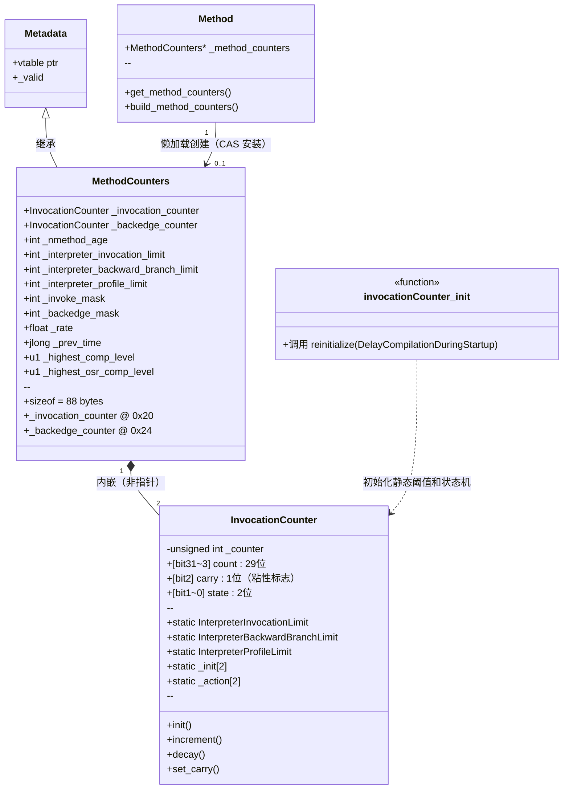

# invocationCounter_init() 详细分析

> 文档位置：`jvm-md/InvocationCounter/invocationCounter_init.md`
> 源码位置：`src/hotspot/share/interpreter/invocationCounter.cpp:169`

---

## 第 0 部分：核心原理 ⭐

### 0.1 本质是什么？

`InvocationCounter` 是 JVM 热点检测的"温度计"——用一个 32 位整数的**高 29 位**记录方法调用次数，低 3 位存储状态（2 位）和进位标志（1 位）。`invocationCounter_init()` 的职责是在 JVM 启动时，根据 `CompileThreshold` 等参数计算出三条触发阈值（编译阈值、Profiling 阈值、OSR 阈值），并初始化状态机的动作函数。

### 0.2 为什么需要？

解释器每次执行方法都必须判断"这个方法是否已经足够热，值得触发 JIT 编译"。最直接的做法是维护独立的 count、state、carry 三个字段，每次调用后读取 count 与阈值比较。但这带来两个问题：

1. **多字段读写开销**：count、state、carry 分散在不同字段，每次计数需要分别读写，增加内存访问次数。
2. **阈值比较需要额外计算**：若 count 是独立字段，阈值就是"实际调用次数"（如 10000），每次比较前需要先读 count 字段；而位域编码后，阈值预先左移 3 位存储（如 80000），可以直接用原始 `_counter` 值一次比较，无需任何额外操作。

### 0.3 怎么解决？

核心思路是**位域编码**：将 count、carry、state 压缩进同一个 `unsigned int`：

```
 bit 31                    bit 3  bit 2  bit 1  bit 0
┌──────────────────────────┬──────┬──────────────────┐
│      count（29 位）       │carry │   state（2 位）   │
└──────────────────────────┴──────┴──────────────────┘
```

每次调用计数器递增 `count_increment = 8`（即 `1 << 3`），这样 count 字段自然在高位累加，低 3 位的 state/carry 不受影响。阈值也预先左移 3 位存储（如 `InterpreterInvocationLimit = CompileThreshold << 3`），因此比较时直接用原始 `_counter` 值与阈值比较，**一次整数比较同时完成计数检查和状态感知**，无需任何移位操作。

### 0.4 为什么这样设计？

- **为什么 count 在高位而不是低位？** 低 3 位留给 state/carry，count 从 bit 3 开始累加，每次 `+8` 恰好只影响高位，state/carry 永远不会被计数操作污染。
- **为什么阈值要预先左移 3 位存储？** 避免每次比较时都做 `_counter >> 3`，直接 `_counter >= InterpreterInvocationLimit` 即可，减少一条指令。
- **为什么 carry 是"粘性标志"（一旦设置不清除）？** carry 标记"这个方法曾经达到过编译阈值"，即使计数被衰减重置，编译器仍可通过 carry 识别历史热点，优先安排编译。
- **为什么启动期间用 `do_decay` 而非立即触发编译？** 启动时大量方法被短暂调用，若立即编译会浪费资源；衰减（count 减半）让真正持续热的方法才能突破阈值，过滤掉启动噪声。

---


## 1. 功能定位

### 1.1 一句话总结

**`invocationCounter_init()` 是 JVM 的"热点检测温度计"** —— 它初始化方法调用计数器系统，设置触发 JIT 编译的各项阈值，是从"冷代码"变"热代码"的关键判断依据。

### 1.2 为什么需要调用计数器？

| 问题 | 调用计数器的作用 |
|------|------------------|
| **识别热点方法** | 频繁调用的方法值得编译优化 |
| **触发 JIT 编译** | 计数超过阈值时触发编译 |
| **触发 OSR 编译** | 循环次数超过阈值时触发栈上替换 |
| **触发 Profiling** | 计数达到阈值时开始收集方法数据 |
| **平衡启动与峰值性能** | 避免过早编译浪费资源 |

### 1.3 在启动流程中的位置

```
init_globals()
├── codeCache_init()
├── stubRoutines_init1()
├── universe_init()
├── interpreter_init()              ← 解释器代码生成
├── invocationCounter_init()        ← 【当前分析】设置编译阈值
├── SharedRuntime::generate_stubs()
├── universe2_init()
├── javaClasses_init()
├── compileBroker_init()            ← 编译器线程启动
└── ...
```

---

## 2. 源码解读

### 2.1 invocationCounter_init() 入口函数

```cpp
// src/hotspot/share/interpreter/invocationCounter.cpp:169
void invocationCounter_init() {
  InvocationCounter::reinitialize(DelayCompilationDuringStartup);
}
```

**关键点**：
- `DelayCompilationDuringStartup`：启动期间是否延迟编译（默认 true）
- 如果延迟，则使用衰减机制而非立即触发编译

### 2.2 reinitialize() 核心实现

#### 解决什么问题？

`reinitialize()` 解决两个问题：
1. **状态机初始化**：根据是否处于启动期，决定计数器溢出时执行 `do_decay`（衰减）还是 `trigger_compile`（立即编译）
2. **阈值计算**：将 `CompileThreshold` 等参数转换为解释器可直接比较的原始值（预先左移 3 位），避免每次调用时做移位运算

#### 函数签名与位置

```cpp
// src/hotspot/share/interpreter/invocationCounter.cpp:132-167
void InvocationCounter::reinitialize(bool delay_overflow)
```

#### 真实源码 + 逐行注释

```cpp
// src/hotspot/share/interpreter/invocationCounter.cpp:132
void InvocationCounter::reinitialize(bool delay_overflow) {
  // ★ 断言：状态数不能超过 state 位域能表示的最大值（2位 = 4个状态）
  guarantee((int)number_of_states <= (int)state_limit,
            "adjust number_of_state_bits");

  // ★ 状态 0：wait_for_nothing
  //    初始值 = 0，动作 = do_nothing（已编译或不需要编译的方法）
  def(wait_for_nothing, 0, do_nothing);

  // ★ 状态 1：wait_for_compile（所有新方法的初始状态）
  if (delay_overflow) {
    // ★ 启动期间（DelayCompilationDuringStartup=true）：
    //    溢出时执行 do_decay（计数减半），而非立即触发编译
    //    目的：过滤启动噪声，让真正持续热的方法才能突破阈值
    def(wait_for_compile, 0, do_decay);
  } else {
    // ★ 正常运行期：溢出时触发编译
    def(wait_for_compile, 0, dummy_invocation_counter_overflow);
  }

  // ★ 编译阈值：预先左移 3 位，解释器直接用原始 _counter 值比较
  //    InterpreterInvocationLimit = 10000 << 3 = 80000
  //    解释器比较：_counter >= 80000（等价于调用次数 >= 10000）
  InterpreterInvocationLimit =
      CompileThreshold << number_of_noncount_bits;

  // ★ Profiling 阈值：CompileThreshold 的 33%，同样预先左移 3 位
  //    InterpreterProfileLimit = (10000 * 33 / 100) << 3 = 26400
  InterpreterProfileLimit =
      ((CompileThreshold * InterpreterProfilePercentage) / 100)
      << number_of_noncount_bits;

  // ★ OSR 阈值：两种计算路径，取决于是否开启 ProfileInterpreter
  if (ProfileInterpreter) {
    // ★ 有 Profiling 时：OSR 比较的是 MethodData 计数器（非位域编码），
    //    不需要左移，直接用实际次数
    //    = CompileThreshold * (OSR% - Profile%) / 100
    //    = 10000 * (140 - 33) / 100 = 10700
    InterpreterBackwardBranchLimit =
        (CompileThreshold *
         (OnStackReplacePercentage - InterpreterProfilePercentage)) / 100;
  } else {
    // ★ 无 Profiling 时：OSR 比较的是 InvocationCounter（位域编码），
    //    需要左移 3 位
    //    = (10000 * 140 / 100) << 3 = 112000
    InterpreterBackwardBranchLimit =
        ((CompileThreshold * OnStackReplacePercentage) / 100)
        << number_of_noncount_bits;
  }

  // ★ 断言：OSR 阈值必须非负
  assert(0 <= InterpreterBackwardBranchLimit,
         "OSR threshold should be non-negative");
  // ★ 断言：Profile 阈值必须在 [0, 编译阈值] 范围内
  assert(0 <= InterpreterProfileLimit &&
         InterpreterProfileLimit <= InterpreterInvocationLimit,
         "profile threshold should be less than the compilation threshold");
}
```

#### 设计决策

- **为什么 `delay_overflow` 时用 `do_decay` 而不是直接跳过计数？** 跳过计数会让方法永远不被编译；衰减（减半）让方法在启动期间缓慢积累，只有真正持续被调用的方法才能在启动完成后突破阈值，过滤掉只在启动时短暂调用的方法。
- **为什么阈值要预先左移 3 位？** 解释器每次方法调用都要做阈值比较，这是极高频操作。预先左移后，比较时直接用 `_counter` 原始值，省去每次的 `>> 3` 移位指令，在热路径上有实际意义。
- **为什么 OSR 阈值有两条路径？** 有 Profiling 时，后向分支计数存在 MethodData 中（普通整数，无位域编码），不需要左移；无 Profiling 时，后向分支计数存在 InvocationCounter 中（位域编码），需要左移。两条路径统一了比较接口。

---

## 3. 核心数据结构

### 3.1 InvocationCounter 完整分析

#### 3.1.1 字段列表

```cpp
// src/hotspot/share/interpreter/invocationCounter.hpp
class InvocationCounter VALUE_OBJ_CLASS_SPEC {
 private:
  unsigned int _counter;  // 唯一字段：32 位位域，[count 29位][carry 1位][state 2位]

  // ── 位布局常量（enum PrivateConstants）──
  // number_of_state_bits  = 2    // state 占 2 位（bit 1~0）
  // number_of_carry_bits  = 1    // carry 占 1 位（bit 2）
  // number_of_noncount_bits = 3  // 低 3 位不计数
  // count_increment       = 8    // 每次 +8（即 1 << 3），只影响高位
  // count_mask_value      = 0xfffffff8  // 高 29 位掩码
  // carry_mask            = 0x4         // bit 2 掩码
  // state_limit           = 4    // 2 位最多 4 个状态，实际只用 2 个

  // ── 全局静态阈值（invocationCounter_init() 初始化）──
  static int InterpreterInvocationLimit;      // 编译阈值（CompileThreshold << 3）
  static int InterpreterBackwardBranchLimit;  // OSR 阈值
  static int InterpreterProfileLimit;         // Profiling 阈值

  // ── 状态机（reinitialize() 初始化）──
  static int    _init  [number_of_states];    // 各状态初始值（均为 0）
  static Action _action[number_of_states];    // 各状态溢出动作函数指针
};
```

#### 3.1.2 sizeof 与内存布局（GDB 验证）

```
【GDB 验证】sizeof(InvocationCounter) = 4 bytes

_counter 字段（32 位）位域编码：

 bit 31                              bit 3  bit 2  bit 1  bit 0
┌──────────────────────────────────┬──────┬──────────────────┐
│          count（29 位）           │carry │   state（2 位）   │
│  调用次数（每次 +1，存储时 <<3）   │ 粘性 │  00=nothing      │
│                                  │ 标志 │  01=wait_compile  │
└──────────────────────────────────┴──────┴──────────────────┘
  count_mask = 0xfffffff8            0x4     0x3

关键常量（GDB 实测）：
  count_increment     = 8       （每次递增值，= 1 << 3）
  count_mask_value    = 0xfffffff8  （高 29 位掩码）
  carry_mask          = 0x4         （bit 2）
  state_limit         = 4           （2 位最多 4 状态）
  number_of_noncount_bits = 3
```

#### 3.1.3 创建位置

`InvocationCounter` 不独立创建，它是 `MethodCounters` 的内嵌字段（非指针）：
- `MethodCounters::_invocation_counter`（偏移 0x20）
- `MethodCounters::_backedge_counter`（偏移 0x24）

随 `MethodCounters` 一起在 `MethodCounters::MethodCounters()` 构造函数中通过 `invocation_counter()->init()` 初始化。

#### 3.1.4 关键字段生命周期

| 字段 | 谁设置 | 何时设置 | 设置什么值 | 谁读取 |
|------|--------|----------|-----------|--------|
| `_counter`（count 部分） | 解释器汇编代码 | 每次方法调用 | `+= count_increment(8)` | 解释器比较阈值 |
| `_counter`（state 部分） | `InvocationCounter::init()` | MethodCounters 构造时 | `wait_for_compile(1)` | 溢出处理函数 |
| `_counter`（carry 部分） | `set_carry_flag()` | 首次达到编译阈值 | `\|= carry_mask(0x4)` | 编译决策 |
| `InterpreterInvocationLimit` | `reinitialize()` | JVM 启动时 | `CompileThreshold << 3` | 解释器每次调用 |
| `_action[wait_for_compile]` | `reinitialize()` | JVM 启动时 | `do_decay` 或 `trigger_compile` | 计数器溢出时 |

#### 3.1.5 值域图（_counter 编码）

```
_counter 原始值示例解析：

  值 = 0x00000001  →  count=0, carry=0, state=01 (wait_for_compile，初始状态)
  值 = 0x00000009  →  count=1, carry=0, state=01 (调用 1 次后)
  值 = 0x00013881  →  count=2500, carry=0, state=01 (调用 2500 次)
  值 = 0x00013885  →  count=2500, carry=1, state=01 (曾经溢出，carry 已置位)
  值 = 0x00000000  →  count=0, carry=0, state=00 (wait_for_nothing，已编译)

  实际调用次数 = (_counter & count_mask_value) >> 3
             = (_counter >> 3)  （因为低 3 位不影响高位）

  阈值比较（无需移位）：
    _counter >= InterpreterInvocationLimit(80000)  →  触发编译
    _counter >= InterpreterProfileLimit(26400)     →  触发 Profiling
```

### 3.3 状态机

```
                    状态转换图
                    
    ┌───────────────────────────────────────┐
    │                                       │
    │    ┌──────────────────┐               │
    │    │ wait_for_compile │               │
    │    │   (初始状态)      │               │
    │    └────────┬─────────┘               │
    │             │                         │
    │             │ count > threshold       │
    │             │                         │
    │             ▼                         │
    │    ┌──────────────────┐               │
    │    │ trigger_compile()│ ──────────────┤
    │    │   触发编译        │               │
    │    └────────┬─────────┘               │
    │             │                         │
    │             │ 编译完成 / 衰减          │
    │             │                         │
    │             ▼                         │
    │    ┌──────────────────┐               │
    │    │wait_for_nothing  │ ◄─────────────┘
    │    │   (最终状态)      │    set_carry()
    │    └──────────────────┘
    │
    └───────────────────────────────────────┘
```

---

## 4. MethodCounters 详解

### 4.1 类定义与字段含义

`MethodCounters` 是每个方法独有的计数器存储结构，分配在 Metaspace 中：

```cpp
// src/hotspot/share/oops/methodCounters.hpp:35
class MethodCounters : public Metadata {
  // ── 条件编译字段（INCLUDE_AOT）──
  Method*           _method;                     // 所属方法反向指针（AOT 模式才有）

  // ── 调用统计（COMPILER2_OR_JVMCI）──
  int               _interpreter_invocation_count;  // 解释执行调用次数（分层编译中复用为 prev_event_count）
  u2                _interpreter_throwout_count;    // 方法通过异常退出的次数（上限 65534）

  // ── JVMTI 断点支持 ──
  u2                _number_of_breakpoints;      // 当前方法上的断点数量

  // ── 核心计数器（内嵌，非指针）──
  InvocationCounter _invocation_counter;         // 调用计数器（4 字节，偏移 0x20）
  InvocationCounter _backedge_counter;           // 后向分支计数器（4 字节，偏移 0x24）

  // ── nmethod 老化 ──
  // 值域：(HotMethodDetectionLimit..INT_MAX] = 初始，[1..HotMethodDetectionLimit) = 温热，(INT_MIN..0] = 热
  int               _nmethod_age;                // 编译代码年龄（初始值 INT_MAX）

  // ── per-method 阈值（构造时按 CompileThresholdScaling 计算）──
  int               _interpreter_invocation_limit;       // 编译阈值（= CompileThreshold << 3）
  int               _interpreter_backward_branch_limit;  // OSR 阈值
  int               _interpreter_profile_limit;          // Profiling 阈值
  int               _invoke_mask;                        // 调用通知掩码（分层编译）
  int               _backedge_mask;                      // 后向分支通知掩码（分层编译）

  // ── 分层编译支持（TIERED）──
  float             _rate;                       // 事件率（调用+后向分支次数/毫秒）
  jlong             _prev_time;                  // 上次采样时间戳
  u1                _highest_comp_level;         // 历史最高编译级别（0~4）
  u1                _highest_osr_comp_level;     // 历史最高 OSR 编译级别（0~4）
};
```

### 4.2 sizeof 与内存布局（GDB 验证）

```
【GDB 验证】sizeof(MethodCounters) = 88 bytes

MethodCounters 对象布局（x86_64，COMPILER2_OR_JVMCI + TIERED 编译选项）：
偏移      字段名                              大小    说明
────────────────────────────────────────────────────────────────────
0x000    [Metadata vtable ptr]               8       虚函数表指针（继承自 Metadata）
0x008    [Metadata _valid]                   8       有效性标志（继承自 Metadata）
0x010    _interpreter_invocation_count       4       解释执行调用次数（COMPILER2_OR_JVMCI）
0x014    _interpreter_throwout_count         2       异常退出次数（u2）
0x016    [padding]                           2       对齐
0x018    [_number_of_breakpoints]            2       断点数（JVMTI，u2）
0x01A    [padding]                           6       对齐
0x020    _invocation_counter                 4       调用计数器（InvocationCounter）★
0x024    _backedge_counter                   4       后向分支计数器（InvocationCounter）★
0x028    _nmethod_age                        4       编译代码年龄（INT_MAX=未老化）
0x02C    _interpreter_invocation_limit       4       per-method 编译阈值
0x030    _interpreter_backward_branch_limit  4       per-method OSR 阈值
0x034    _interpreter_profile_limit          4       per-method Profiling 阈值
0x038    _invoke_mask                        4       调用通知掩码（分层编译）
0x03C    _backedge_mask                      4       后向分支通知掩码（分层编译）
0x040    _rate                               4       事件率（float，TIERED）
0x044    [padding]                           4       对齐（8 字节对齐 jlong）
0x048    _prev_time                          8       上次采样时间（jlong，TIERED）
0x050    _highest_comp_level                 1       最高编译级别（u1，TIERED）
0x051    _highest_osr_comp_level             1       最高 OSR 编译级别（u1，TIERED）
0x052    [padding]                           6       对齐
────────────────────────────────────────────────────────────────────
总大小：88 bytes（GDB 实测：sizeof(MethodCounters) = 88）

注：★ 标记的是 InvocationCounter 内嵌字段，各占 4 字节
```

> **与文档旧版差异**：旧版估算 ~80 字节，GDB 实测为 88 字节；`_invocation_counter` 偏移为 0x20（32），而非旧版的 0x18。

### 4.3 创建位置与时机

`MethodCounters` **懒加载创建**，不是在类加载时创建，而是在方法**第一次被解释执行时**按需创建：

```
解释器执行方法入口
    │
    ▼
get_method_counters()          ← method.hpp:941
    │
    ├── _method_counters != NULL → 直接返回（已创建）
    │
    └── _method_counters == NULL → build_method_counters()  ← method.cpp:452
            │
            ├── 检查 Metaspace OOM → 若 OOM 则返回 NULL（跳过计数）
            │
            ├── MethodCounters::allocate(mh, THREAD)
            │       └── new(loader_data, ...) MethodCounters(mh)
            │               └── 构造函数中初始化所有字段 + 计算 per-method 阈值
            │
            └── Atomic::replace_if_null(counters, &_method_counters)
                    └── CAS 安装，多线程并发时只有一个成功，其余释放
```

**关键设计**：用 CAS 而非加锁，避免高并发场景下方法首次调用的锁竞争。

### 4.4 关键字段生命周期

| 字段 | 谁设置 | 何时设置 | 设置什么值 | 谁读取 |
|------|--------|----------|-----------|--------|
| `_invocation_counter` | `invocation_counter()->init()` | MethodCounters 构造时 | `wait_for_compile` 初始状态 | 解释器每次方法调用 |
| `_backedge_counter` | `backedge_counter()->init()` | MethodCounters 构造时 | `wait_for_compile` 初始状态 | 解释器每次后向分支 |
| `_nmethod_age` | 构造函数 | MethodCounters 构造时 | `INT_MAX`（未老化） | CodeCache sweeper |
| `_interpreter_invocation_limit` | 构造函数 | MethodCounters 构造时 | `CompileThreshold << 3`（可按 CompileThresholdScaling 缩放） | 解释器每次方法调用 |
| `_interpreter_backward_branch_limit` | 构造函数 | MethodCounters 构造时 | `CompileThreshold * OSR% << 3` | 解释器每次后向分支 |
| `_rate` | `CompilationPolicy` | 分层编译采样时 | 事件数/毫秒 | 分层编译决策 |
| `_highest_comp_level` | `set_highest_comp_level()` | 每次编译完成后 | 0~4（编译级别） | 分层编译决策 |

---

## 5. 阈值计算详解

### 5.1 默认参数值

| 参数 | 默认值 | 说明 |
|------|--------|------|
| `CompileThreshold` | 10000 (C2) / 1500 (C1) | 编译触发阈值 |
| `OnStackReplacePercentage` | 140% | OSR 百分比 |
| `InterpreterProfilePercentage` | 33% | Profiling 百分比 |
| `number_of_noncount_bits` | 3 | 非计数位数 |

### 5.2 阈值计算公式

```
假设 CompileThreshold = 10000

┌─────────────────────────────────────────────────────────────────────────────┐
│                         阈值计算公式                                         │
├─────────────────────────────────────────────────────────────────────────────┤
│                                                                             │
│  InterpreterInvocationLimit = CompileThreshold << 3                         │
│                             = 10000 << 3                                    │
│                             = 80000                                         │
│                                                                             │
│  InterpreterProfileLimit = (CompileThreshold * 33 / 100) << 3               │
│                          = (10000 * 33 / 100) << 3                          │
│                          = 3300 << 3                                        │
│                          = 26400                                            │
│                                                                             │
│  InterpreterBackwardBranchLimit (有 Profiling):                              │
│    = CompileThreshold * (140 - 33) / 100                                    │
│    = 10000 * 107 / 100                                                      │
│    = 10700                                                                  │
│                                                                             │
│  InterpreterBackwardBranchLimit (无 Profiling):                              │
│    = (CompileThreshold * 140 / 100) << 3                                    │
│    = 14000 << 3                                                             │
│    = 112000                                                                 │
│                                                                             │
└─────────────────────────────────────────────────────────────────────────────┘
```

### 5.3 实际计数与阈值的关系

```
_counter 原始值与实际计数的关系：

原始值:       0x0001_8003  (二进制: ...000_0001_1000_0000_0000_0011)
                                       │              │  │  │
                                       │              │  └──┴─ state = 1 (wait_for_compile)
                                       │              └────────── carry = 0
                                       └─────────────────────── count = 0x3000 = 12288

实际调用次数 = _counter >> 3 = 12288 / 8 = 1536

比较时不需要移位，直接比较原始值：
  _counter (80003) vs InterpreterInvocationLimit (80000)
    如果 _counter >= InterpreterInvocationLimit，触发编译
```

---

## 6. 解释器中的计数器使用

### 6.1 方法入口处的计数器增加

```cpp
// src/hotspot/cpu/x86/templateInterpreterGenerator_x86.cpp:385-455
void TemplateInterpreterGenerator::generate_counter_incr(
        Label* overflow,           // 溢出跳转标签
        Label* profile_method,     // Profiling 跳转标签
        Label* profile_method_continue) {
        
  if (TieredCompilation) {
    // === 分层编译模式 ===
    // 增加计数器，使用掩码检查是否需要通知
    __ increment_mask_and_jump(invocation_counter, increment, mask, 
                               rcx, false, Assembler::zero, overflow);
  } else {
    // === 非分层编译模式 ===
    // 更新 invocation_counter
    __ movl(rcx, invocation_counter);
    __ incrementl(rcx, InvocationCounter::count_increment);  // +8 (count_grain)
    __ movl(invocation_counter, rcx);
    
    // 加上 backedge_counter（两者加一起比较）
    __ movl(rax, backedge_counter);
    __ andl(rax, InvocationCounter::count_mask_value);
    __ addl(rcx, rax);  // rcx = invocation + backedge
    
    // 检查是否需要 Profiling
    if (ProfileInterpreter && profile_method != NULL) {
      __ cmp32(rcx, interpreter_profile_limit);
      __ jcc(Assembler::less, *profile_method_continue);
      // 达到 profile 阈值，跳转创建 MethodData
      __ test_method_data_pointer(rax, *profile_method);
    }
    
    // 检查是否需要编译
    __ cmp32(rcx, interpreter_invocation_limit);
    __ jcc(Assembler::aboveEqual, *overflow);  // 达到阈值，跳转编译
  }
}
```

### 6.2 计数器溢出处理

```cpp
// 当计数器超过阈值时调用
void TemplateInterpreterGenerator::generate_counter_overflow(Label& do_continue) {
  // 保存状态
  __ push(rbx);  // 保存 Method*
  
  // 调用 InterpreterRuntime::frequency_counter_overflow
  __ call_VM(noreg, 
             CAST_FROM_FN_PTR(address, InterpreterRuntime::frequency_counter_overflow),
             rbx);
             
  // 恢复并继续
  __ pop(rbx);
  __ jmp(do_continue);
}
```

### 6.3 执行流程图

```
                    方法调用执行流程
                           │
                           ▼
┌──────────────────────────────────────────────────────────┐
│  generate_method_entry()                                 │
│  ┌─────────────────────────────────────────────────────┐│
│  │ 1. 获取 MethodCounters                               ││
│  │    rax = Method->method_counters                    ││
│  └─────────────────────────────────────────────────────┘│
│                          │                              │
│                          ▼                              │
│  ┌─────────────────────────────────────────────────────┐│
│  │ 2. 增加调用计数器                                    ││
│  │    _invocation_counter += count_increment (8)        ││
│  └─────────────────────────────────────────────────────┘│
│                          │                              │
│                          ▼                              │
│  ┌─────────────────────────────────────────────────────┐│
│  │ 3. 计算总计数 (invocation + backedge)                ││
│  └─────────────────────────────────────────────────────┘│
│                          │                              │
│                          ▼                              │
│  ┌─────────────────────────────────────────────────────┐│
│  │ 4. 检查 Profile 阈值                                 ││
│  │    if (count >= InterpreterProfileLimit)            ││
│  │        创建 MethodData                              ││
│  └─────────────────────────────────────────────────────┘│
│                          │                              │
│                          ▼                              │
│  ┌─────────────────────────────────────────────────────┐│
│  │ 5. 检查编译阈值                                      ││
│  │    if (count >= InterpreterInvocationLimit)         ││
│  │        ───────────────────────────────────►  编译!  ││
│  └─────────────────────────────────────────────────────┘│
│                          │                              │
│                          ▼                              │
│  ┌─────────────────────────────────────────────────────┐│
│  │ 6. 执行方法                                          ││
│  └─────────────────────────────────────────────────────┘│
│                                                         │
└──────────────────────────────────────────────────────────┘
```

---

## 7. 衰减机制

### 7.1 do_decay() 函数

```cpp
// src/hotspot/share/interpreter/invocationCounter.cpp:103-109
static address do_decay(const methodHandle& method, TRAPS) {
  // 启动期间：衰减计数器，延迟编译
  MethodCounters* mcs = method->method_counters();
  assert(mcs != NULL, "");
  mcs->invocation_counter()->decay();
  return NULL;
}
```

### 7.2 decay() 实现

```cpp
// src/hotspot/share/interpreter/invocationCounter.hpp:134-140
inline void InvocationCounter::decay() {
  int c = count();
  int new_count = c >> 1;  // 计数减半
  // 防止归零（区分从未执行的方法）
  if (c > 0 && new_count == 0) new_count = 1;
  set(state(), new_count);
}
```

### 7.3 衰减的作用

```
启动期间衰减机制的目的：

1. 避免过早编译
   - 启动时大量方法被调用少量次数
   - 如果立即编译，会浪费资源

2. 让真正的热点方法脱颖而出
   - 衰减后仍然超过阈值的方法才是真正的热点
   
3. 时间线示例：
   
   时间 │  方法 A (热点)  │  方法 B (启动)
   ─────┼────────────────┼────────────────
   T1   │  count=100     │  count=50
   T2   │  调用，count=101│  衰减，count=25
   T3   │  调用，count=102│  衰减，count=12
   T4   │  调用，count=103│  衰减，count=6
   ...  │  超过阈值，编译！│  永远不会编译
```

---

## 8. 进位标志 (Carry Flag)

### 8.1 set_carry() 函数

```cpp
// src/hotspot/share/interpreter/invocationCounter.cpp:43-53
void InvocationCounter::set_carry() {
  set_carry_flag();  // 设置 carry 位
  
  // 减少计数值，允许方法继续执行更多次
  int old_count = count();
  int new_count = MIN2(old_count, (int) (CompileThreshold / 2));
  
  // 防止归零
  if (new_count == 0) new_count = 1;
  if (old_count != new_count) set(state(), new_count);
}
```

### 8.2 Carry 标志的作用

```
Carry 标志的用途：

1. 标记"曾经很热"的方法
   - carry = 1 表示这个方法曾经达到过编译阈值
   - 即使计数被重置，carry 仍然保留

2. 用于编译决策
   - 编译器可以参考 carry 标志
   - 决定是否优先编译这个方法

3. 粘性标志
   - 一旦设置，永不清除
   - 除非方法被卸载
```

---

## 9. 分层编译下的计数器

### 9.1 分层编译简介

```
分层编译级别：

Level 0: 解释执行
Level 1: C1 编译，无 profiling
Level 2: C1 编译，有限 profiling
Level 3: C1 编译，完整 profiling
Level 4: C2 编译（最优化）

典型路径：
  L0 → L3 → L4  (收集 profile 后优化编译)
  L0 → L2 → L4  (快速编译路径)
  L0 → L1       (对不需要优化的方法)
```

### 9.2 分层编译中的阈值

```cpp
// 分层编译使用不同的通知机制
// Tier0InvokeNotifyFreqLog = 7 (默认)
// 每 2^7 = 128 次调用通知一次

// MethodCounters 中的掩码
_invoke_mask = right_n_bits(Tier0InvokeNotifyFreqLog) << count_shift;
// = 0b0111_1111 << 3 = 0x3F8

_backedge_mask = right_n_bits(Tier0BackedgeNotifyFreqLog) << count_shift;
// = 0b0001_1111 << 3 = 0xF8
```

### 9.3 分层编译计数器增加逻辑

```asm
; 分层编译中的计数器增加（x86_64 汇编）
increment_mask_and_jump:
    mov  ecx, [rax + invocation_counter_offset]  ; 读取计数器
    add  ecx, count_increment                    ; +8
    mov  [rax + invocation_counter_offset], ecx  ; 写回
    and  ecx, [rax + invoke_mask_offset]         ; 与掩码做 AND
    jz   overflow                                ; 如果为 0，跳转通知
```

---

## 10. GDB 验证

### 10.1 实际 GDB 验证结果

【GDB 验证】条件：-Xms256m -Xmx256m -XX:+UseG1GC -Xint

```
========== sizeof 验证 ==========
sizeof(InvocationCounter): 4 bytes
sizeof(MethodCounters): 88 bytes

========== InvocationCounter 位布局常量 ==========
number_of_state_bits: 2
number_of_carry_bits: 1
number_of_noncount_bits: 3
count_increment: 8
count_mask_value: 0xfffffff8
state_limit: 4
carry_mask: 0x4

========== 状态机动作函数指针 ==========
_action[wait_for_nothing]: 0x7ffff6224158
_action[wait_for_compile]: 0x7ffff6224217

========== MethodCounters 字段偏移 ==========
_invocation_counter:              0x20 (32)
_backedge_counter:                0x24 (36)
_nmethod_age:                     0x28 (40)
_interpreter_invocation_limit:    0x2c (44)
_interpreter_backward_branch_limit: 0x30 (48)
_interpreter_profile_limit:       0x34 (52)
_invoke_mask:                     0x38 (56)
_backedge_mask:                   0x3c (60)
_rate:                            0x40 (64)
_prev_time:                       0x48 (72)
_highest_comp_level:              0x50 (80)
_highest_osr_comp_level:          0x51 (81)

=== Global Thresholds ===
CompileThreshold: 10000
OnStackReplacePercentage: 140
InterpreterProfilePercentage: 33

=== Computed Limits ===
InterpreterInvocationLimit: 80000 (raw) / 10000 (actual)
InterpreterProfileLimit: 26400 (raw) / 3300 (actual)
InterpreterBackwardBranchLimit: 112000

=== State Machine ===
_init[wait_for_nothing]: 0
_init[wait_for_compile]: 0
```

### 10.2 验证分析

**关键发现**：

1. **sizeof 验证**：
   - `sizeof(InvocationCounter) = 4 bytes` ✅（只有一个 `unsigned int _counter`）
   - `sizeof(MethodCounters) = 88 bytes` ✅（旧版估算 ~80 字节有误）

2. **位布局常量验证**：
   - `carry_mask = 0x4`（bit 2）✅
   - `count_mask_value = 0xfffffff8`（高 29 位）✅
   - `count_increment = 8`（= 1 << 3）✅

3. **字段偏移验证**：
   - `_invocation_counter` 偏移 = 0x20（32）✅（旧版 0x18 有误）
   - `_backedge_counter` 偏移 = 0x24（36）✅

4. **编译阈值计算验证**：
   - `InterpreterInvocationLimit = 10000 << 3 = 80000` ✅
   - 实际计数 = 80000 >> 3 = 10000 ✅

5. **Profile 阈值验证**：
   - `InterpreterProfileLimit = (10000 * 33 / 100) << 3 = 26400` ✅
   - 实际计数 = 26400 >> 3 = 3300 ✅

6. **OSR 阈值验证**（无 ProfileInterpreter）：
   - `InterpreterBackwardBranchLimit = (10000 * 140 / 100) << 3 = 112000` ✅

7. **状态机初始值**：
   - 两个状态的初始值都是 0，新创建的计数器从 0 开始计数 ✅

### 10.3 验证脚本

```gdb
# new-jvm-md/tmp-file/InvocationCounter/verify_sizeof.gdb

set pagination off
set print pretty on
set breakpoint pending on
handle SIGSEGV nostop noprint pass
handle SIGBUS nostop noprint pass

b invocationCounter_init
run -Xms256m -Xmx256m -XX:+UseG1GC -Xint -cp /data/workspace/demo/src com.wjcoder.Main

finish

printf "\n========== sizeof 验证 ==========\n"
printf "sizeof(InvocationCounter): %d bytes\n", sizeof(InvocationCounter)
printf "sizeof(MethodCounters): %d bytes\n", sizeof(MethodCounters)

printf "\n========== InvocationCounter 位布局常量 ==========\n"
printf "number_of_state_bits: %d\n", InvocationCounter::number_of_state_bits
printf "number_of_carry_bits: %d\n", InvocationCounter::number_of_carry_bits
printf "number_of_noncount_bits: %d\n", InvocationCounter::number_of_noncount_bits
printf "count_increment: %d\n", InvocationCounter::count_increment
printf "count_mask_value: 0x%x\n", InvocationCounter::count_mask_value
printf "state_limit: %d\n", InvocationCounter::state_limit
printf "carry_mask: 0x%x\n", InvocationCounter::carry_mask

printf "\n========== 状态机动作函数指针 ==========\n"
printf "_action[wait_for_nothing]: %p\n", InvocationCounter::_action[0]
printf "_action[wait_for_compile]: %p\n", InvocationCounter::_action[1]

printf "\n========== MethodCounters 字段偏移 ==========\n"
p &((MethodCounters*)0)->_invocation_counter
p &((MethodCounters*)0)->_backedge_counter
p &((MethodCounters*)0)->_nmethod_age
p &((MethodCounters*)0)->_interpreter_invocation_limit
p &((MethodCounters*)0)->_interpreter_backward_branch_limit
p &((MethodCounters*)0)->_interpreter_profile_limit
p &((MethodCounters*)0)->_invoke_mask
p &((MethodCounters*)0)->_backedge_mask
p &((MethodCounters*)0)->_rate
p &((MethodCounters*)0)->_prev_time
p &((MethodCounters*)0)->_highest_comp_level
p &((MethodCounters*)0)->_highest_osr_comp_level

printf "\n========== Global Invocation Thresholds ==========\n"
printf "CompileThreshold: %d\n", CompileThreshold
printf "OnStackReplacePercentage: %d\n", OnStackReplacePercentage
printf "InterpreterProfilePercentage: %d\n", InterpreterProfilePercentage
printf "InterpreterInvocationLimit: %d (actual: %d)\n", InvocationCounter::InterpreterInvocationLimit, InvocationCounter::InterpreterInvocationLimit >> 3
printf "InterpreterProfileLimit: %d (actual: %d)\n", InvocationCounter::InterpreterProfileLimit, InvocationCounter::InterpreterProfileLimit >> 3
printf "InterpreterBackwardBranchLimit: %d\n", InvocationCounter::InterpreterBackwardBranchLimit

printf "\n========== State Machine ==========\n"
printf "_init[wait_for_nothing]: %d\n", InvocationCounter::_init[0]
printf "_init[wait_for_compile]: %d\n", InvocationCounter::_init[1]

quit
```

执行命令：

```bash
timeout 25 gdb -q -batch \
  -x new-jvm-md/tmp-file/InvocationCounter/verify_sizeof.gdb \
  ./build/linux-x86_64-normal-server-slowdebug/jdk/bin/java
```

---

## 11. 相关 JVM 参数

### 11.1 编译阈值参数

| 参数 | 默认值 | 说明 |
|------|--------|------|
| `-XX:CompileThreshold=N` | 10000 (C2) | 方法调用编译阈值 |
| `-XX:OnStackReplacePercentage=N` | 140 | OSR 编译百分比 |
| `-XX:InterpreterProfilePercentage=N` | 33 | Profiling 开始百分比 |
| `-XX:Tier0InvokeNotifyFreqLog=N` | 7 | 分层编译调用通知频率 |
| `-XX:Tier0BackedgeNotifyFreqLog=N` | 5 | 分层编译后向分支通知频率 |

### 11.2 调试参数

| 参数 | 说明 |
|------|------|
| `-XX:+PrintCompilation` | 打印编译事件 |
| `-XX:+CountBytecodes` | 统计字节码执行 |
| `-XX:+LogCompilation` | 记录编译日志 |
| `-XX:-TieredCompilation` | 禁用分层编译 |
| `-XX:+DelayCompilationDuringStartup` | 启动期间延迟编译（默认 true）|

### 11.3 调整示例

```bash
# 降低编译阈值，更早触发 JIT
java -XX:CompileThreshold=1000 ...

# 禁用分层编译，直接使用 C2
java -XX:-TieredCompilation ...

# 查看编译过程
java -XX:+PrintCompilation ...
```

---

## 12. 总结

### 12.1 数据结构层面

| 结构 | sizeof | 核心特征 |
|------|--------|----------|
| `InvocationCounter` | **4 bytes** | 只有一个 `unsigned int _counter`，用位域编码压缩 count/carry/state 三个语义，静态阈值全局共享 |
| `MethodCounters` | **88 bytes** | 继承自 Metadata，分配在 Metaspace；内嵌两个 InvocationCounter（偏移 0x20/0x24）；懒加载创建，CAS 安装防并发重复 |

**关键设计**：`InvocationCounter` 是值类型（内嵌），不是指针，避免了额外的堆分配和指针解引用。

### 12.2 算法层面

| 算法 | 核心设计决策 |
|------|-------------|
| **位域编码**（count/carry/state 共享一个 int） | 阈值预先左移 3 位存储，解释器每次调用直接用原始 `_counter` 值比较，无需移位，节省每次调用的指令开销 |
| **启动期衰减**（`do_decay`） | 计数减半而非清零，让真正持续热的方法仍能突破阈值，过滤启动噪声；`DelayCompilationDuringStartup` 控制开关 |
| **carry 粘性标志** | 一旦设置永不清除，即使计数被衰减重置，编译器仍可识别历史热点，优先安排编译 |
| **MethodCounters 懒加载 + CAS 安装** | 避免类加载时为所有方法预分配 MethodCounters；CAS 而非加锁，避免方法首次调用的锁竞争 |
| **OSR 阈值双路径**（有/无 ProfileInterpreter） | 有 Profiling 时 OSR 比较 MethodData 计数器（无需左移），无 Profiling 时比较 InvocationCounter（需左移），两路径统一了比较接口 |

### 12.3 核心要点

- `InvocationCounter` 本质是一个 4 字节整数，位域编码让一次整数比较同时完成计数检查和状态感知
- 阈值预先左移 3 位是关键优化：解释器每次方法调用都要做阈值比较，节省移位指令意义重大
- `MethodCounters` 懒加载 + CAS 安装是 JVM 中典型的"按需分配 + 无锁并发"模式，避免了类加载时的大量预分配和首次调用的锁竞争
- carry 粘性标志是跨越衰减周期的"历史记忆"，让编译器在计数被重置后仍能识别历史热点
- 启动期衰减（`do_decay`）是 JVM 冷热分离的关键机制，过滤启动噪声，让真正的热点方法脱颖而出

---

## 数据结构关系图



**关键关系说明：**
- `InvocationCounter` 是**值类型**（VALUE_OBJ_CLASS_SPEC），内嵌在 `MethodCounters` 中，不独立分配
- `MethodCounters` 继承自 `Metadata`，分配在 **Metaspace**（非堆）
- `Method._method_counters` 初始为 NULL，**第一次解释执行时**通过 CAS 懒加载创建
- `InvocationCounter` 的静态阈值（`InterpreterInvocationLimit` 等）由 `invocationCounter_init()` 在 JVM 启动时一次性计算，所有方法共享

---

## 13. 下一步建议

1. **compileBroker_init()**：了解编译任务如何被处理
2. **InterpreterRuntime::frequency_counter_overflow()**：计数器溢出的详细处理
3. **分层编译策略**：CompilationPolicy 如何选择编译级别
4. **OSR 编译流程**：栈上替换的详细实现

---

> 📅 分析时间：2026-02-06
> 📁 源码版本：OpenJDK 11
