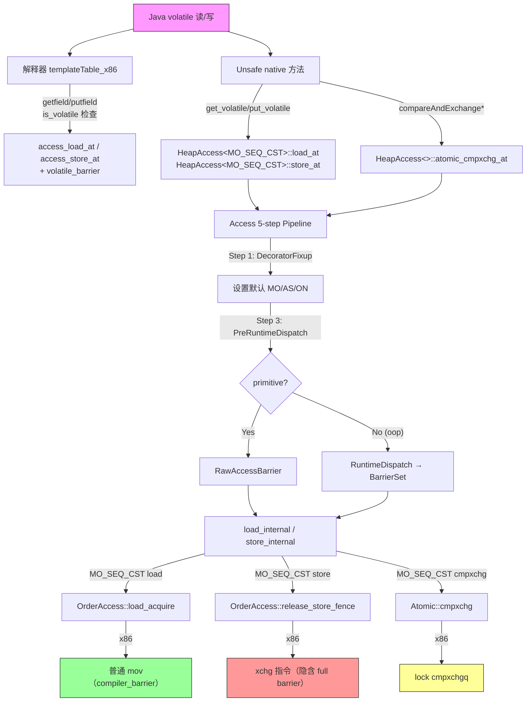
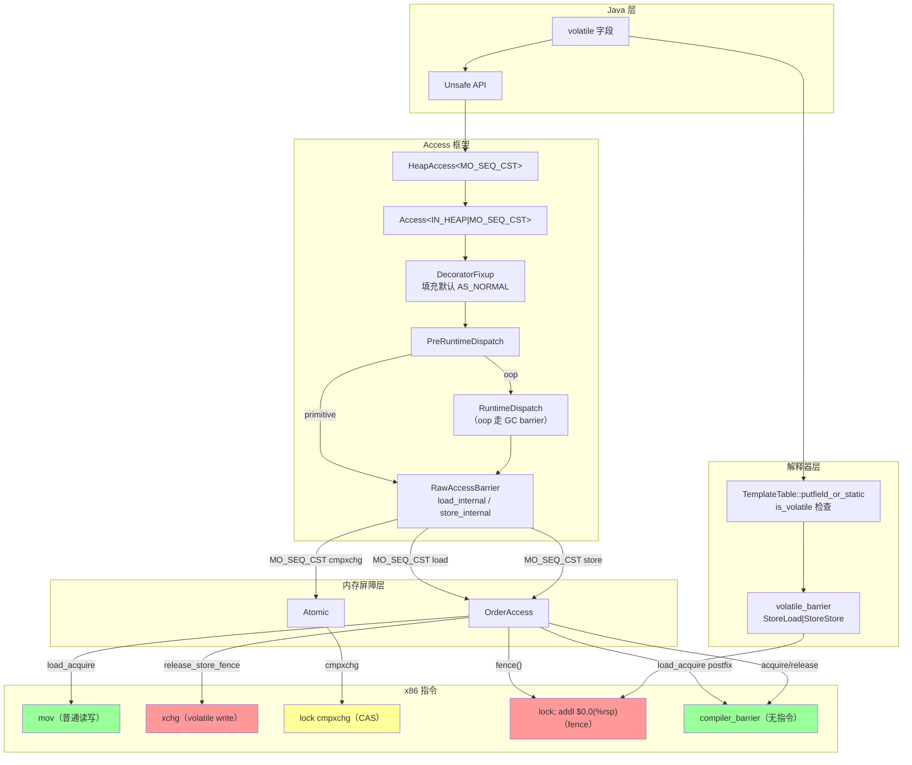

# Day 35: Java 内存模型（JMM）— volatile / Unsafe CAS / 内存屏障在 x86 的落地

> 纯源码分析，基于 OpenJDK 11 slowdebug
> 方法论：程序 = 数据结构 + 算法
> 标准条件：-Xms8g -Xmx8g -XX:+UseG1GC -Xint

---

## 第 0 部分：核心原理 ⭐

### 0.1 本质是什么？

本文深入分析 **Day 35: Java 内存模型（JMM）— volatile / Unsafe CAS / 内存屏障在 x86 的落地**：从源码角度理解其设计原理、实现机制和关键细节。

### 0.2 为什么需要？

理解 JVM 内部实现是排查复杂问题、进行性能优化的基础。表面的 API 文档无法解释 JVM 的实际行为，只有深入源码才能建立精确的心智模型。

### 0.3 怎么解决？

结合源码阅读、数据结构分析和 GDB 运行时验证，从多个角度建立对该机制的完整理解。

### 0.4 为什么这样设计？

每个设计决策都有其权衡：性能 vs 正确性、简单性 vs 灵活性、内存占用 vs 查找速度。理解这些权衡是理解 JVM 设计的关键。

---


## 0. 核心原理

### 0.1 本质是什么？

Java Memory Model (JMM) 定义了多线程环境下共享变量的可见性与有序性规则，核心是通过**内存屏障（Memory Barrier）**阻止编译器和 CPU 的重排序，确保 happens-before 关系在硬件层面得到落实。

### 0.2 为什么需要？

**问题**：现代 CPU 为性能而打破顺序一致性。x86 使用 TSO (Total Store Order) 模型，每个 CPU 核有独立的 Store Buffer，写操作先进入缓冲区再异步刷入主存，导致：
- Store-Load 可能重排序（写操作在 Store Buffer 中，后续读可能提前执行）
- 其他线程可能看到不同顺序的写操作（非 multi-copy atomic）

**后果**：Java 代码中的 `volatile`、`synchronized` 等语义无法自然保证。例如：
```java
// 线程 1
x = 1;          // 普通 store
v = true;       // volatile store

// 线程 2
if (v) {        // volatile load
    use(x);     // 可能读到 x=0，因为线程1的两个store可能乱序
}
```

### 0.3 怎么解决？

JVM 在硬件相关层插入内存屏障，强制 CPU 按程序顺序执行关键操作。具体实现分为三层：

1. **抽象层**：`OrderAccess` 类定义统一的屏障接口（loadload/storestore/loadstore/storeload/acquire/release/fence）
2. **平台层**：每个 CPU 架构有自己的实现（x86/ARM/POWER）
3. **应用层**：Access API 用装饰器模式传递内存语义（MO_SEQ_CST 等）

**在 x86 TSO 上的优化**：
- LoadLoad、LoadStore、StoreStore 屏障天然保证 → 只需编译器屏障
- 唯独 StoreLoad 需要硬件屏障 → `lock; addl $0,0(%rsp)` 或 `xchg` 指令

### 0.4 为什么这样设计？

**为什么用装饰器模式而不是运行时 flag？**
编译时模板元编程可以在编译期确定访问路径，零运行时开销。`HeapAccess<MO_SEQ_CST>::store_at(...)` 在编译后直接内联到 `xchg` 指令，无分支判断。

**为什么 x86 的 acquire/release 是空操作？**
x86 TSO 模型天然保证 Load→Load、Load→Store、Store→Store 有序。只有 Store→Load 可能乱序，所以 acquire（LoadLoad + LoadStore）和 release（LoadStore + StoreStore）在 x86 上免费。

**为什么用 `lock; addl $0,0(%rsp)` 而不是 `mfence`？**
实测显示 `lock; addl` 在某些微架构（如 Skylake）上比 `mfence` 快约 40%。两者都是全屏障，但 `lock` 前缀会强制 drain Store Buffer，满足 StoreLoad 语义。

**为什么 volatile store 用 `xchg` 而不是 `mov + lock;addl`？**
x86 的 `xchg` 指令隐含 `lock` 前缀，一条指令完成 store + full barrier，比两条指令方案更紧凑。

---

## 一、宏观理解

### 1.1 解决什么问题

Java Memory Model（JMM，JSR-133）解决的核心问题是：**在多核 CPU 上，如何保证多线程对共享变量的读写具有确定的可见性和有序性**。

现代 CPU 有 Store Buffer、Invalidate Queue、乱序执行等硬件优化，加上编译器重排序，导致一个线程的写操作不一定能被另一个线程及时看到。JMM 定义了一组语义规则（volatile、final、synchronized），由 JVM 通过**内存屏障（Memory Barrier）**和**原子指令**将这些语义落地到具体硬件。

**核心主题**：
1. **volatile 读/写** 如何通过 Access 框架 + OrderAccess 落地到 x86 指令
2. **Unsafe CAS** 如何通过 Atomic::cmpxchg 落地到 `lock cmpxchg` 指令
3. **内存屏障** 在 x86 TSO 模型下的实际实现（大部分是 no-op）
4. **Access 装饰器框架** — JDK 11 引入的统一内存访问管线

### 1.2 x86 TSO 内存模型 — 为什么大部分屏障是 no-op

x86 采用 **TSO（Total Store Order）** 内存模型，这是理解所有后续实现的关键前提：

```
┌──────────────────────────────────────────────────────────────────────┐
│                     x86 TSO 保证                                      │
├──────────────────────────────────────────────────────────────────────┤
│                                                                      │
│  ✅ Load → Load   有序（硬件保证，不需要屏障）                        │
│  ✅ Store → Store  有序（硬件保证，不需要屏障）                        │
│  ✅ Load → Store   有序（硬件保证，不需要屏障）                        │
│  ❌ Store → Load   可能乱序（Store Buffer 导致）—— 唯一需要屏障的情况   │
│                                                                      │
│  结论：在 x86 上，只有 StoreLoad 需要真正的硬件屏障                    │
│        其他三种屏障都只需要 compiler_barrier（阻止编译器重排）          │
│                                                                      │
│  实际指令：                                                           │
│  - StoreLoad barrier = lock; addl $0,0(%rsp)                        │
│  - 其他 barrier = __asm__ volatile ("" : : : "memory")              │
│                                                                      │
│  volatile write 开销 >> volatile read 开销                           │
│  因为 volatile write 需要 StoreLoad barrier（~20 cycles）            │
│  而 volatile read 只需要 compiler barrier（0 cycles）                │
│                                                                      │
└──────────────────────────────────────────────────────────────────────┘
```

### 1.3 总体调用链



### 1.4 涉及的数据结构清单

| # | 结构/类 | 文件 | 角色 |
|---|--------|------|------|
| 1 | `DecoratorSet` + 装饰器常量 | accessDecorators.hpp | 编译时 bit-flag 集合，控制内存语义 |
| 2 | `DecoratorFixup` | accessDecorators.hpp | 编译时元编程，自动填充默认装饰器 |
| 3 | `Access<decorators>` | access.hpp | 统一访问 API 入口，5 步管线起点 |
| 4 | `HeapAccess<decorators>` | access.hpp | `Access<IN_HEAP \| decorators>` 别名 |
| 5 | `RawAccessBarrier<decorators>` | accessBackend.hpp | 原始访问屏障，根据 MO 选择 load/store 实现 |
| 6 | `RuntimeDispatch<decorators,T,barrier_type>` | accessBackend.hpp | 运行时分发，函数指针懒初始化 |
| 7 | `OrderAccess` | orderAccess.hpp + orderAccess_linux_x86.hpp | 内存屏障抽象层 |
| 8 | `Atomic` | atomic.hpp + atomic_linux_x86.hpp | 原子操作抽象层 |
| 9 | `MemoryAccess` | unsafe.cpp | Unsafe native 方法的模板辅助类 |
| 10 | `ConstantPoolCacheEntry::is_volatile` | cpCache.hpp | 解释器判断字段是否 volatile 的标志位 |

---

## 二、数据结构全景

### 2.1 DecoratorSet 与装饰器常量

**文件**：`src/hotspot/share/oops/accessDecorators.hpp`

**是什么**：`typedef uint64_t DecoratorSet` —— 一个 64 位 bit-flag 集合，每个 bit 代表一个"装饰器"（decorator），用于在编译时描述一次内存访问的语义属性。

**解决什么问题**：JVM 中不同场景的内存访问有不同语义需求（堆内/堆外、oop/primitive、volatile/plain、strong/weak 引用等），装饰器系统用一组正交的 bit-flag 在编译时组合出精确的访问语义，让模板管线在编译时静态分发到最优路径。

**全部装饰器分类**：

#### 2.1.1 Memory Ordering 装饰器（MO_*）

```cpp
// accessDecorators.hpp:129-136
const DecoratorSet MO_UNORDERED      = UCONST64(1) << 6;   // JMM plain —— 无序
const DecoratorSet MO_VOLATILE       = UCONST64(1) << 7;   // C++ volatile —— 编译器不重排
const DecoratorSet MO_RELAXED        = UCONST64(1) << 8;   // JMM opaque —— 原子但无序
const DecoratorSet MO_ACQUIRE        = UCONST64(1) << 9;   // JMM acquire —— 读后不重排
const DecoratorSet MO_RELEASE        = UCONST64(1) << 10;  // JMM release —— 写前不重排
const DecoratorSet MO_SEQ_CST        = UCONST64(1) << 11;  // JMM volatile —— 顺序一致性
const DecoratorSet MO_DECORATOR_MASK = MO_UNORDERED | MO_VOLATILE | MO_RELAXED |
                                       MO_ACQUIRE | MO_RELEASE | MO_SEQ_CST;
```

**语义强度排序**：
```
MO_UNORDERED < MO_VOLATILE < MO_RELAXED < MO_ACQUIRE/MO_RELEASE < MO_SEQ_CST
```

**关键映射**：

| JMM 语义 | DecoratorSet | 在 x86 上的 load | 在 x86 上的 store |
|----------|-------------|------------------|-------------------|
| plain 读/写 | MO_UNORDERED | `*addr` | `*addr = val` |
| C++ volatile | MO_VOLATILE | `*volatile_addr` | `*volatile_addr = val` |
| opaque | MO_RELAXED | `Atomic::load` | `Atomic::store` |
| acquire | MO_ACQUIRE | `load + compiler_barrier` | — |
| release | MO_RELEASE | — | `compiler_barrier + store` |
| volatile | MO_SEQ_CST | `[fence +] load_acquire` | `release_store_fence` (xchg) |

#### 2.1.2 Barrier Strength 装饰器（AS_*）

```cpp
// accessDecorators.hpp:155-158
const DecoratorSet AS_RAW                  = UCONST64(1) << 12;  // 绕过 GC 屏障，直接访问
const DecoratorSet AS_NO_KEEPALIVE         = UCONST64(1) << 13;  // 不保持引用存活
const DecoratorSet AS_NORMAL               = UCONST64(1) << 14;  // 正常 GC 屏障（默认）
```

#### 2.1.3 Reference Strength 装饰器（ON_*）

```cpp
// accessDecorators.hpp:169-174
const DecoratorSet ON_STRONG_OOP_REF  = UCONST64(1) << 15;  // 强引用（默认）
const DecoratorSet ON_WEAK_OOP_REF    = UCONST64(1) << 16;  // 弱引用
const DecoratorSet ON_PHANTOM_OOP_REF = UCONST64(1) << 17;  // 虚引用
const DecoratorSet ON_UNKNOWN_OOP_REF = UCONST64(1) << 18;  // 未知引用（Unsafe API）
```

#### 2.1.4 Access Location 装饰器（IN_*）

```cpp
// accessDecorators.hpp:182-184
const DecoratorSet IN_HEAP            = UCONST64(1) << 19;  // 堆内访问（需要 GC 屏障）
const DecoratorSet IN_NATIVE          = UCONST64(1) << 20;  // 堆外 native 内存
```

#### 2.1.5 sizeof

`DecoratorSet` = `uint64_t` = **8 字节**。这不是一个运行时对象，而是编译时模板参数。

#### 2.1.6 创建位置

装饰器在**调用点（callsite）编译时组合**。例如：
- `HeapAccess<MO_SEQ_CST>::load_at(...)` → decorators = `IN_HEAP | MO_SEQ_CST`
- `HeapAccess<>::load_at(...)` → decorators = `IN_HEAP`，经 DecoratorFixup → `IN_HEAP | MO_UNORDERED | AS_NORMAL | ON_STRONG_OOP_REF`

### 2.2 DecoratorFixup — 默认装饰器填充

**文件**：`src/hotspot/share/oops/accessDecorators.hpp:222-235`

**是什么**：编译时元编程结构，为缺失的装饰器类别自动填充默认值。

**解决什么问题**：调用点不需要指定所有装饰器，未指定的用安全默认值。

```cpp
// accessDecorators.hpp:222-235
template <DecoratorSet input_decorators>
struct DecoratorFixup: AllStatic {
  // 规则 1：没有指定引用强度 → 默认 ON_STRONG_OOP_REF（仅 oop 访问）
  static const DecoratorSet ref_strength_default = input_decorators |
    (((ON_DECORATOR_MASK & input_decorators) == 0 &&
      (INTERNAL_VALUE_IS_OOP & input_decorators) != 0) ?
     ON_STRONG_OOP_REF : INTERNAL_EMPTY);

  // 规则 2：没有指定内存序 → 默认 MO_UNORDERED
  static const DecoratorSet memory_ordering_default = ref_strength_default |
    ((MO_DECORATOR_MASK & ref_strength_default) == 0 ? MO_UNORDERED : INTERNAL_EMPTY);

  // 规则 3：没有指定屏障强度 → 默认 AS_NORMAL
  static const DecoratorSet barrier_strength_default = memory_ordering_default |
    ((AS_DECORATOR_MASK & memory_ordering_default) == 0 ? AS_NORMAL : INTERNAL_EMPTY);

  // 最终值 = 上述 + 构建时装饰器
  static const DecoratorSet value = barrier_strength_default | BT_BUILDTIME_DECORATORS;
};
```

**三条默认规则**：
1. oop 访问未指定引用强度 → `ON_STRONG_OOP_REF`
2. 未指定内存序 → `MO_UNORDERED`（最弱，无保证）
3. 未指定屏障强度 → `AS_NORMAL`（走 GC 屏障）

### 2.3 Access\<decorators\> — 统一访问 API

**文件**：`src/hotspot/share/oops/access.hpp:94-277`

**是什么**：模板类，提供统一的内存访问 API。所有 JVM 内部的堆访问都通过它进入 5 步管线。

```cpp
// access.hpp:94
template <DecoratorSet decorators = INTERNAL_EMPTY>
class Access: public AllStatic {
public:
  // primitive 堆内访问
  static inline AccessInternal::LoadAtProxy<decorators> load_at(oop base, ptrdiff_t offset);
  template <typename T>
  static inline void store_at(oop base, ptrdiff_t offset, T value);

  // oop 堆内访问
  static inline AccessInternal::OopLoadAtProxy<decorators> oop_load_at(oop base, ptrdiff_t offset);
  template <typename T>
  static inline void oop_store_at(oop base, ptrdiff_t offset, T value);

  // 原子操作
  template <typename T>
  static inline T atomic_cmpxchg_at(T new_value, oop base, ptrdiff_t offset, T compare_value);
  template <typename T>
  static inline T atomic_xchg_at(T new_value, oop base, ptrdiff_t offset);

  // 直接地址版本
  template <typename P> static inline P load(P* addr);
  template <typename P, typename T> static inline void store(P* addr, T value);
  template <typename P, typename T> static inline T atomic_cmpxchg(T new_value, P* addr, T compare_value);
};
```

**三个子类别名**（简化调用点）：

```cpp
// access.hpp:281-292
template <DecoratorSet decorators = INTERNAL_EMPTY>
class HeapAccess: public Access<IN_HEAP | decorators> {};    // 堆内访问

template <DecoratorSet decorators = INTERNAL_EMPTY>
class RawAccess: public Access<AS_RAW | decorators> {};       // 原始访问（绕过 GC）

template <DecoratorSet decorators = INTERNAL_EMPTY>
class NativeAccess: public Access<IN_NATIVE | decorators> {}; // 堆外 native
```

**核心约束（编译时验证）**：

```cpp
// access.hpp:126-129 —— 允许的 MO 装饰器
static const DecoratorSet load_mo_decorators = MO_UNORDERED | MO_VOLATILE | MO_RELAXED | MO_ACQUIRE | MO_SEQ_CST;
static const DecoratorSet store_mo_decorators = MO_UNORDERED | MO_VOLATILE | MO_RELAXED | MO_RELEASE | MO_SEQ_CST;
static const DecoratorSet atomic_xchg_mo_decorators = MO_SEQ_CST;                    // ★ xchg 只允许 SEQ_CST
static const DecoratorSet atomic_cmpxchg_mo_decorators = MO_RELAXED | MO_SEQ_CST;    // ★ cmpxchg 只允许两种
```

### 2.4 RawAccessBarrier\<decorators\> — 原始访问屏障

**文件**：`src/hotspot/share/oops/accessBackend.hpp:187-409` + `accessBackend.inline.hpp`

**是什么**：Access 管线的最底层，根据 MO 装饰器选择对应的 load/store 实现。

**关键：MO → 实际操作的映射**（这是整个 JMM 落地的核心映射表）：

#### load_internal 的 5 种特化

```cpp
// accessBackend.inline.hpp:129-154

// ★ MO_SEQ_CST load：fence(IRIW 场景) + load_acquire
template <DecoratorSet ds, typename T>
EnableIf<HasDecorator<ds, MO_SEQ_CST>::value, T>::type
RawAccessBarrier<decorators>::load_internal(void* addr) {
  if (support_IRIW_for_not_multiple_copy_atomic_cpu) {
    OrderAccess::fence();             // x86 不需要（support_IRIW = false）
  }
  return OrderAccess::load_acquire(reinterpret_cast<const volatile T*>(addr));
  // x86 上 = 普通 mov + compiler_barrier
}

// ★ MO_ACQUIRE load：load_acquire
template <DecoratorSet ds, typename T>
EnableIf<HasDecorator<ds, MO_ACQUIRE>::value, T>::type
RawAccessBarrier<decorators>::load_internal(void* addr) {
  return OrderAccess::load_acquire(reinterpret_cast<const volatile T*>(addr));
}

// ★ MO_RELAXED load：Atomic::load
template <DecoratorSet ds, typename T>
EnableIf<HasDecorator<ds, MO_RELAXED>::value, T>::type
RawAccessBarrier<decorators>::load_internal(void* addr) {
  return Atomic::load(reinterpret_cast<const volatile T*>(addr));
}

// ★ MO_VOLATILE load（inline 定义在 accessBackend.hpp:252-254）
// = *reinterpret_cast<const volatile T*>(addr)

// ★ MO_UNORDERED load（inline 定义在 accessBackend.hpp:259-261）
// = *reinterpret_cast<T*>(addr)
```

#### store_internal 的 5 种特化

```cpp
// accessBackend.inline.hpp:156-178

// ★ MO_SEQ_CST store：release_store_fence
template <DecoratorSet ds, typename T>
EnableIf<HasDecorator<ds, MO_SEQ_CST>::value>::type
RawAccessBarrier<decorators>::store_internal(void* addr, T value) {
  OrderAccess::release_store_fence(reinterpret_cast<volatile T*>(addr), value);
  // x86 上 = xchg 指令（隐含 full barrier）
}

// ★ MO_RELEASE store：release_store
template <DecoratorSet ds, typename T>
EnableIf<HasDecorator<ds, MO_RELEASE>::value>::type
RawAccessBarrier<decorators>::store_internal(void* addr, T value) {
  OrderAccess::release_store(reinterpret_cast<volatile T*>(addr), value);
  // x86 上 = compiler_barrier + 普通 mov
}

// ★ MO_RELAXED store：Atomic::store
template <DecoratorSet ds, typename T>
EnableIf<HasDecorator<ds, MO_RELAXED>::value>::type
RawAccessBarrier<decorators>::store_internal(void* addr, T value) {
  Atomic::store(value, reinterpret_cast<volatile T*>(addr));
}

// ★ MO_VOLATILE store（accessBackend.hpp:281-283）
// = *volatile_addr = value

// ★ MO_UNORDERED store（accessBackend.hpp:288-290）
// = *addr = value
```

#### atomic_cmpxchg_internal 的 2 种特化

```cpp
// accessBackend.inline.hpp:180-200

// ★ MO_SEQ_CST cmpxchg：memory_order_conservative
template <DecoratorSet ds, typename T>
EnableIf<HasDecorator<ds, MO_SEQ_CST>::value, T>::type
RawAccessBarrier<decorators>::atomic_cmpxchg_internal(T new_value, void* addr, T compare_value) {
  return Atomic::cmpxchg(new_value,
                         reinterpret_cast<volatile T*>(addr),
                         compare_value,
                         memory_order_conservative);
  // x86 上 = lock cmpxchgq（lock 前缀本身就是 full barrier）
}

// ★ MO_RELAXED cmpxchg：memory_order_relaxed
template <DecoratorSet ds, typename T>
EnableIf<HasDecorator<ds, MO_RELAXED>::value, T>::type
RawAccessBarrier<decorators>::atomic_cmpxchg_internal(T new_value, void* addr, T compare_value) {
  return Atomic::cmpxchg(new_value,
                         reinterpret_cast<volatile T*>(addr),
                         compare_value,
                         memory_order_relaxed);
  // x86 上仍然是 lock cmpxchgq —— x86 没有 relaxed CAS，所以无区别
}
```

### 2.5 RuntimeDispatch — 运行时函数指针分发

**文件**：`src/hotspot/share/oops/accessBackend.hpp:461-645`

**是什么**：当访问涉及 GC 屏障（non-primitive oop 访问、AS_NORMAL）时，需要在运行时分发到具体 GC 的 AccessBarrier 实现。RuntimeDispatch 使用**懒初始化函数指针**：首次调用时解析正确的 barrier 函数，然后 patch 函数指针，后续直接调用。

```cpp
// accessBackend.hpp:464-474 —— 以 BARRIER_STORE 为例
template <DecoratorSet decorators, typename T>
struct RuntimeDispatch<decorators, T, BARRIER_STORE>: AllStatic {
  typedef typename AccessFunction<decorators, T, BARRIER_STORE>::type func_t;
  static func_t _store_func;                     // ★ 函数指针

  static void store_init(void* addr, T value);   // ★ 初始化函数（首次调用）

  static inline void store(void* addr, T value) {
    _store_func(addr, value);                    // ★ 通过函数指针调用
  }
};

// 初始化时指向 store_init
template <DecoratorSet decorators, typename T>
func_t RuntimeDispatch<decorators, T, BARRIER_STORE>::_store_func = &store_init;
```

**首次调用流程**（`access.inline.hpp:284-288`）：

```cpp
template <DecoratorSet decorators, typename T>
void RuntimeDispatch<decorators, T, BARRIER_STORE>::store_init(void* addr, T value) {
  func_t function = BarrierResolver<decorators, func_t, BARRIER_STORE>::resolve_barrier();
  _store_func = function;    // ★ patch 函数指针
  function(addr, value);     // ★ 执行实际操作
}
```

### 2.6 OrderAccess — 内存屏障抽象层

**文件**：`src/hotspot/share/runtime/orderAccess.hpp` + `src/hotspot/os_cpu/linux_x86/orderAccess_linux_x86.hpp`

**是什么**：跨平台内存屏障 API。不同 CPU 架构有不同实现。

#### 2.6.1 x86 实现（orderAccess_linux_x86.hpp）

```cpp
// orderAccess_linux_x86.hpp:36-56

// 编译器屏障：阻止编译器重排，不产生任何 CPU 指令
static inline void compiler_barrier() {
  __asm__ volatile ("" : : : "memory");
}

// ★ x86 TSO 保证了前三种序，只需 compiler_barrier
inline void OrderAccess::loadload()   { compiler_barrier(); }
inline void OrderAccess::storestore() { compiler_barrier(); }
inline void OrderAccess::loadstore()  { compiler_barrier(); }

// ★ 唯一需要硬件屏障的情况：StoreLoad
inline void OrderAccess::storeload()  { fence(); }

// ★ acquire/release 在 x86 上也只是 compiler_barrier
inline void OrderAccess::acquire()    { compiler_barrier(); }
inline void OrderAccess::release()    { compiler_barrier(); }

// ★ fence = lock; addl $0,0(%rsp)
//   选择 lock addl 而不是 mfence，因为 mfence 有时更慢
inline void OrderAccess::fence() {
  __asm__ volatile ("lock; addl $0,0(%%rsp)" : : : "cc", "memory");
  compiler_barrier();
}
```

**设计决策：为什么用 `lock; addl $0,0(%rsp)` 而不是 `mfence`？**
- Intel 官方文档说 `mfence` 可以 drain store buffer
- 但实测 `mfence` 在某些微架构（如 Sandy Bridge）下比 `lock; addl` 慢
- `lock; addl $0,0(%rsp)` 等效于 StoreLoad barrier：`lock` 前缀会 drain store buffer
- `$0,0(%rsp)` = 给栈顶加 0，没有副作用
- 所以 HotSpot 选择了实测更快的版本

#### 2.6.2 release_store_fence 的 x86 实现 — 使用 xchg

```cpp
// orderAccess_linux_x86.hpp:58-106 —— 按字节大小特化

// 1 字节
template<>
struct OrderAccess::PlatformOrderedStore<1, RELEASE_X_FENCE> {
  template <typename T>
  void operator()(T v, volatile T* p) const {
    __asm__ volatile ("xchgb (%2),%0" : "=q" (v) : "0" (v), "r" (p) : "memory");
  }
};

// 4 字节
template<>
struct OrderAccess::PlatformOrderedStore<4, RELEASE_X_FENCE> {
  template <typename T>
  void operator()(T v, volatile T* p) const {
    __asm__ volatile ("xchgl (%2),%0" : "=r" (v) : "0" (v), "r" (p) : "memory");
  }
};

// 8 字节（AMD64）
template<>
struct OrderAccess::PlatformOrderedStore<8, RELEASE_X_FENCE> {
  template <typename T>
  void operator()(T v, volatile T* p) const {
    __asm__ volatile ("xchgq (%2), %0" : "=r" (v) : "0" (v), "r" (p) : "memory");
  }
};
```

**设计决策：为什么 volatile store 用 xchg 而不是 mov + lock;addl？**
- `xchg` 在 x86 上**隐含 lock 前缀**（即使不写 lock），自带 full barrier
- 一条 `xchg` 指令 = store + full barrier，比 `mov + lock; addl $0,0(%rsp)` 少一条指令
- 虽然 xchg 读取返回值没有用，但它仍然比两条指令的方案更高效

#### 2.6.3 load_acquire / release_store 的通用实现

```cpp
// orderAccess.hpp:335-348

template <typename T>
inline T OrderAccess::load_acquire(const volatile T* p) {
  return LoadImpl<T, PlatformOrderedLoad<sizeof(T), X_ACQUIRE>>()(p);
  // X_ACQUIRE 的 ScopedFence：postfix = acquire() = compiler_barrier()
  // 所以在 x86 上 = Atomic::load(p) + compiler_barrier()
  // = 普通 mov 指令 + 编译器屏障
}

template <typename T, typename D>
inline void OrderAccess::release_store(volatile D* p, T v) {
  StoreImpl<T, D, PlatformOrderedStore<sizeof(D), RELEASE_X>>()(v, p);
  // RELEASE_X 的 ScopedFence：prefix = release() = compiler_barrier()
  // 所以在 x86 上 = compiler_barrier() + Atomic::store(v, p)
  // = 编译器屏障 + 普通 mov 指令
}

template <typename T, typename D>
inline void OrderAccess::release_store_fence(volatile D* p, T v) {
  StoreImpl<T, D, PlatformOrderedStore<sizeof(D), RELEASE_X_FENCE>>()(v, p);
  // RELEASE_X_FENCE 在 x86 上特化为 xchg 指令（见 2.6.2）
}
```

### 2.7 Atomic — 原子操作抽象层

**文件**：`src/hotspot/share/runtime/atomic.hpp` + `src/hotspot/os_cpu/linux_x86/atomic_linux_x86.hpp`

**是什么**：跨平台原子操作 API。提供 load/store/add/cmpxchg/xchg。

#### 2.7.1 atomic_memory_order 枚举

```cpp
// atomic.hpp:40-49
enum atomic_memory_order {
  memory_order_relaxed = 0,       // C++11 relaxed
  memory_order_acquire = 2,       // C++11 acquire
  memory_order_release = 3,       // C++11 release
  memory_order_acq_rel = 4,       // C++11 acq_rel
  memory_order_conservative = 8   // ★ HotSpot 特有：最强保序
};
```

#### 2.7.2 x86 CAS 实现

```cpp
// atomic_linux_x86.hpp:65-91

// 1 字节 CAS
template<>
template<typename T>
inline T Atomic::PlatformCmpxchg<1>::operator()(T exchange_value,
                                                T volatile* dest,
                                                T compare_value,
                                                atomic_memory_order /* order */) const {
  STATIC_ASSERT(1 == sizeof(T));
  __asm__ volatile ("lock cmpxchgb %1,(%3)"
                    : "=a" (exchange_value)
                    : "q" (exchange_value), "a" (compare_value), "r" (dest)
                    : "cc", "memory");
  return exchange_value;
}

// 4 字节 CAS
template<>
template<typename T>
inline T Atomic::PlatformCmpxchg<4>::operator()(T exchange_value,
                                                T volatile* dest,
                                                T compare_value,
                                                atomic_memory_order /* order */) const {
  STATIC_ASSERT(4 == sizeof(T));
  __asm__ volatile ("lock cmpxchgl %1,(%3)"
                    : "=a" (exchange_value)
                    : "r" (exchange_value), "a" (compare_value), "r" (dest)
                    : "cc", "memory");
  return exchange_value;
}

// 8 字节 CAS（AMD64）
template<>
template<typename T>
inline T Atomic::PlatformCmpxchg<8>::operator()(T exchange_value,
                                                T volatile* dest,
                                                T compare_value,
                                                atomic_memory_order /* order */) const {
  STATIC_ASSERT(8 == sizeof(T));
  __asm__ __volatile__ ("lock cmpxchgq %1,(%3)"
                        : "=a" (exchange_value)
                        : "r" (exchange_value), "a" (compare_value), "r" (dest)
                        : "cc", "memory");
  return exchange_value;
}
```

**关键观察**：
- 所有 CAS 特化都**忽略了 order 参数**（`/* order */`）
- 因为 x86 的 `lock cmpxchg` 本身就是 full barrier，不存在 relaxed CAS
- 这意味着在 x86 上，`MO_RELAXED` CAS 和 `MO_SEQ_CST` CAS 生成完全相同的指令

#### 2.7.3 x86 xchg 实现

```cpp
// atomic_linux_x86.hpp:52-63（4 字节）
template<>
template<typename T>
inline T Atomic::PlatformXchg<4>::operator()(T exchange_value,
                                             T volatile* dest,
                                             atomic_memory_order order) const {
  STATIC_ASSERT(4 == sizeof(T));
  __asm__ volatile ("xchgl (%2),%0"
                    : "=r" (exchange_value)
                    : "0" (exchange_value), "r" (dest)
                    : "memory");
  return exchange_value;
}

// atomic_linux_x86.hpp:109-119（8 字节，AMD64）
template<>
template<typename T>
inline T Atomic::PlatformXchg<8>::operator()(T exchange_value, T volatile* dest,
                                             atomic_memory_order order) const {
  STATIC_ASSERT(8 == sizeof(T));
  __asm__ __volatile__ ("xchgq (%2),%0"
                        : "=r" (exchange_value)
                        : "0" (exchange_value), "r" (dest)
                        : "memory");
  return exchange_value;
}
```

**关键**：`xchg` 不需要 `lock` 前缀 —— x86 上 `xchg` 指令隐含 `lock` 语义，自带 full barrier。

### 2.8 MemoryAccess — Unsafe native 方法辅助类

**文件**：`src/hotspot/share/prims/unsafe.cpp:140-220`

**是什么**：模板类，封装 Unsafe 的 get/put/get_volatile/put_volatile 操作。

```cpp
// unsafe.cpp:141-220
template <typename T>
class MemoryAccess : StackObj {
  JavaThread* _thread;
  oop _obj;
  ptrdiff_t _offset;
public:
  MemoryAccess(JavaThread* thread, jobject obj, jlong offset)
    : _thread(thread), _obj(JNIHandles::resolve(obj)), _offset((ptrdiff_t)offset) {}

  T get() {
    if (_obj == NULL) {
      GuardUnsafeAccess guard(_thread);
      T ret = RawAccess<>::load((volatile T*)addr());
      return normalize_for_read(ret);
    } else {
      T ret = HeapAccess<>::load_at(_obj, _offset);   // ★ 普通读 = MO_UNORDERED
      return normalize_for_read(ret);
    }
  }

  void put(T x) {
    if (_obj == NULL) {
      GuardUnsafeAccess guard(_thread);
      RawAccess<>::store((volatile T*)addr(), normalize_for_write(x));
    } else {
      HeapAccess<>::store_at(_obj, _offset, normalize_for_write(x)); // ★ 普通写
    }
  }

  T get_volatile() {
    if (_obj == NULL) {
      GuardUnsafeAccess guard(_thread);
      volatile T ret = RawAccess<MO_SEQ_CST>::load((volatile T*)addr());
      return normalize_for_read(ret);
    } else {
      T ret = HeapAccess<MO_SEQ_CST>::load_at(_obj, _offset);  // ★ volatile 读
      return normalize_for_read(ret);
    }
  }

  void put_volatile(T x) {
    if (_obj == NULL) {
      GuardUnsafeAccess guard(_thread);
      RawAccess<MO_SEQ_CST>::store((volatile T*)addr(), normalize_for_write(x));
    } else {
      HeapAccess<MO_SEQ_CST>::store_at(_obj, _offset, normalize_for_write(x)); // ★ volatile 写
    }
  }
};
```

**关键观察**：
- `get()` / `put()` → `HeapAccess<>` → 默认 `MO_UNORDERED` → 普通 mov
- `get_volatile()` / `put_volatile()` → `HeapAccess<MO_SEQ_CST>` → load_acquire / release_store_fence

### 2.9 Unsafe Fence 操作

```cpp
// unsafe.cpp:285-293
UNSAFE_LEAF(void, Unsafe_LoadFence(JNIEnv *env, jobject unsafe)) {
  OrderAccess::acquire();     // x86 = compiler_barrier()
} UNSAFE_END

UNSAFE_LEAF(void, Unsafe_StoreFence(JNIEnv *env, jobject unsafe)) {
  OrderAccess::release();     // x86 = compiler_barrier()
} UNSAFE_END

UNSAFE_LEAF(void, Unsafe_FullFence(JNIEnv *env, jobject unsafe)) {
  OrderAccess::fence();       // x86 = lock; addl $0,0(%rsp)
} UNSAFE_END
```

### 2.10 Unsafe CAS 操作

```cpp
// unsafe.cpp:867-905

// CompareAndExchangeObject — oop CAS
UNSAFE_ENTRY(jobject, Unsafe_CompareAndExchangeObject(...)) {
  oop x = JNIHandles::resolve(x_h);
  oop e = JNIHandles::resolve(e_h);
  oop p = JNIHandles::resolve(obj);
  // ★ ON_UNKNOWN_OOP_REF 因为 Unsafe 不知道引用类型
  oop res = HeapAccess<ON_UNKNOWN_OOP_REF>::oop_atomic_cmpxchg_at(x, p, (ptrdiff_t)offset, e);
  return JNIHandles::make_local(env, res);
} UNSAFE_END

// CompareAndExchangeInt — int CAS
UNSAFE_ENTRY(jint, Unsafe_CompareAndExchangeInt(...)) {
  oop p = JNIHandles::resolve(obj);
  if (p == NULL) {
    volatile jint* addr = (volatile jint*)index_oop_from_field_offset_long(p, offset);
    return RawAccess<>::atomic_cmpxchg(x, addr, e);      // ★ 堆外 CAS
  } else {
    return HeapAccess<>::atomic_cmpxchg_at(x, p, (ptrdiff_t)offset, e);  // ★ 堆内 CAS
  }
} UNSAFE_END

// CompareAndSetObject — boolean CAS（cmpxchg 后比较返回值）
UNSAFE_ENTRY(jboolean, Unsafe_CompareAndSetObject(...)) {
  oop ret = HeapAccess<ON_UNKNOWN_OOP_REF>::oop_atomic_cmpxchg_at(x, p, (ptrdiff_t)offset, e);
  return ret == e;   // ★ 比较旧值判断是否成功
} UNSAFE_END
```

**关键**：CAS 默认走 `MO_SEQ_CST`（`accessBackend.hpp:1199-1201` 中 `atomic_cmpxchg` 的 Step 1 默认填充）。

---

## 三、算法/流程分析

### 3.1 volatile 字段写 — 从 Java 到 x86 指令

#### 3.1.1 解决什么问题

Java 规范要求：volatile 写必须对所有后续 volatile 读可见（happens-before），且不能与前后的普通读写重排。这需要 StoreStore + StoreLoad 屏障。

#### 3.1.2 解释器路径（putfield volatile）

**文件**：`src/hotspot/cpu/x86/templateTable_x86.cpp:3107-3317`

解释器执行 `putfield` / `putstatic` 字节码时：

```cpp
// templateTable_x86.cpp:3107-3318
void TemplateTable::putfield_or_static(int byte_no, bool is_static, RewriteControl rc) {
  // ... 解析 ConstantPoolCache，获取字段 offset 和 flags ...

  // ★ Step 1：提取 is_volatile 标志
  __ movl(rdx, flags);
  __ shrl(rdx, ConstantPoolCacheEntry::is_volatile_shift);  // 右移到 bit 0
  __ andl(rdx, 0x1);                                        // 取 bit 0

  // ★ Step 2：根据类型执行 store
  //   对每种类型（byte/boolean/char/short/int/long/float/double/oop）
  //   调用 __ access_store_at(T_XXX, IN_HEAP, field, ...);

  // ★ Step 3：volatile 写后的屏障
  __ bind(Done);
  __ testl(rdx, rdx);                           // 测试 is_volatile
  __ jcc(Assembler::zero, notVolatile);          // 非 volatile 跳过

  volatile_barrier(Assembler::Membar_mask_bits(
    Assembler::StoreLoad | Assembler::StoreStore));  // ★ 插入屏障

  __ bind(notVolatile);
}
```

```cpp
// templateTable_x86.cpp:2715-2719
void TemplateTable::volatile_barrier(Assembler::Membar_mask_bits order_constraint) {
  if (!os::is_MP()) return;       // ★ 单核不需要
  __ membar(order_constraint);    // ★ 生成 lock; addl $0,0(%rsp)
}
```

**关键设计**：
1. 解释器对**所有类型**的 putfield 使用相同的 `access_store_at(IN_HEAP)`（不含 MO 装饰器），即普通 mov
2. volatile 屏障在**所有类型写完之后**统一插入
3. 屏障类型 = `StoreLoad | StoreStore`，在 x86 上 = `fence()` = `lock; addl $0,0(%rsp)`

**对比 fast_storefield**：

```cpp
// templateTable_x86.cpp:3390-3466
void TemplateTable::fast_storefield(TosState state) {
  // ... 同样提取 is_volatile 到 rdx ...
  // ... 执行 access_store_at(T_XXX, IN_HEAP, field, ...) ...

  // ★ 完全相同的 volatile barrier
  __ testl(rdx, rdx);
  __ jcc(Assembler::zero, notVolatile);
  volatile_barrier(Assembler::Membar_mask_bits(
    Assembler::StoreLoad | Assembler::StoreStore));
  __ bind(notVolatile);
}
```

#### 3.1.3 Unsafe 路径（put_volatile）

```
Java: Unsafe.putIntVolatile(obj, offset, value)
  → JNI: Unsafe_PutIntVolatile
    → MemoryAccess<jint>::put_volatile(value)
      → HeapAccess<MO_SEQ_CST>::store_at(obj, offset, value)
        → Access<IN_HEAP | MO_SEQ_CST>::store_at(obj, offset, value)
          → AccessInternal::store_at<IN_HEAP|MO_SEQ_CST|AS_NORMAL|...>()
            → DecoratorFixup → PreRuntimeDispatch::store_at
              → (primitive, hardwired) → RawAccessBarrier::store_at
                → RawAccessBarrier::store(field_addr, value)
                  → store_internal<MO_SEQ_CST>(addr, value)
                    → OrderAccess::release_store_fence(addr, value)
                      → PlatformOrderedStore<4, RELEASE_X_FENCE>
                        → xchgl (%addr), %value          ★ 最终 x86 指令
```

### 3.2 volatile 字段读 — 从 Java 到 x86 指令

#### 3.2.1 解决什么问题

volatile 读必须能看到之前所有 volatile 写的结果，且后续的读写不能被重排到 volatile 读之前。这需要 LoadLoad + LoadStore 屏障。

#### 3.2.2 解释器路径（getfield volatile）

```cpp
// templateTable_x86.cpp:2860-3006
void TemplateTable::getfield_or_static(int byte_no, bool is_static, RewriteControl rc) {
  // ... 解析 ConstantPoolCache ...
  // ... 根据类型执行 access_load_at(T_XXX, IN_HEAP, ...) ...

  __ bind(Done);
  // ★ 注意：getfield 没有 volatile barrier！
  // 注释说明：
  // [jk] not needed currently
  // volatile_barrier(Assembler::Membar_mask_bits(Assembler::LoadLoad |
  //                                              Assembler::LoadStore));
}
```

**关键发现**：解释器的 `getfield_or_static` **不插入 volatile 读后屏障**！

**原因**：在 x86 TSO 上，`LoadLoad` 和 `LoadStore` 都只是 `compiler_barrier()`，而解释器生成的是汇编代码（不会被 C++ 编译器重排），所以根本不需要。这是一个 x86 特定的优化。

#### 3.2.3 Unsafe 路径（get_volatile）

```
Java: Unsafe.getIntVolatile(obj, offset)
  → JNI: Unsafe_GetIntVolatile
    → MemoryAccess<jint>::get_volatile()
      → HeapAccess<MO_SEQ_CST>::load_at(obj, offset)
        → RawAccessBarrier::load_internal<MO_SEQ_CST>(addr)
          → (support_IRIW = false on x86, skip fence)
          → OrderAccess::load_acquire(addr)
            → PlatformOrderedLoad<4, X_ACQUIRE>
              → Atomic::load(p) + ScopedFence<X_ACQUIRE>.postfix()
                → mov (%addr), %reg          ★ 普通 mov 指令
                → compiler_barrier()          ★ 只有编译器屏障
```

**成本对比**：
| 操作 | x86 指令 | 大约周期 |
|------|---------|---------|
| volatile read | `mov` | ~4 cycles |
| volatile write | `xchg` | ~20 cycles |
| CAS | `lock cmpxchg` | ~20 cycles |
| plain read/write | `mov` | ~4 cycles |

**结论**：在 x86 上，volatile read 几乎零额外开销！代价全在 volatile write。

### 3.3 Access 5 步管线 — 完整调用链

#### 3.3.1 解决什么问题

JVM 需要在一个统一框架中处理多种正交关注点：内存语义（MO）、GC 屏障（AS/BarrierSet）、压缩引用（compressed oops）、引用类型（strong/weak/phantom）。Access 管线用模板元编程在编译时静态分发，避免运行时分支。

#### 3.3.2 以 `HeapAccess<MO_SEQ_CST>::store_at(base, offset, value)` 为例

**Step 1：设置默认装饰器 + 类型衰减**

```cpp
// accessBackend.hpp:1152-1161
template <DecoratorSet decorators, typename T>
inline void store_at(oop base, ptrdiff_t offset, T value) {
  verify_types<decorators, T>();
  typedef typename Decay<T>::type DecayedT;
  DecayedT decayed_value = value;
  // DecoratorFixup 填充默认值：
  // 输入 = IN_HEAP | MO_SEQ_CST
  // 输出 = IN_HEAP | MO_SEQ_CST | AS_NORMAL | BT_BUILDTIME_DECORATORS
  const DecoratorSet expanded_decorators = DecoratorFixup<decorators | ...>::value;
  PreRuntimeDispatch::store_at<expanded_decorators>(base, offset, decayed_value);
}
```

**Step 2：类型约减**（隐含在 store_at → store_reduce_types 中）

**Step 3：Pre-runtime 分发**

```cpp
// accessBackend.hpp:713-723
template <DecoratorSet decorators, typename T>
inline static typename EnableIf<!HasDecorator<decorators, AS_RAW>::value>::type
store_at(oop base, ptrdiff_t offset, T value) {
  if (is_hardwired_primitive<decorators>()) {
    // ★ primitive 类型（如 jint）不需要 GC 屏障，直接走 AS_RAW
    const DecoratorSet expanded_decorators = decorators | AS_RAW;
    PreRuntimeDispatch::store_at<expanded_decorators>(base, offset, value);
  } else {
    // ★ oop 类型需要 GC 屏障，走 RuntimeDispatch
    RuntimeDispatch<decorators, T, BARRIER_STORE_AT>::store_at(base, offset, value);
  }
}
```

对于 `jint`（primitive），走快速路径：

```cpp
// AS_RAW 路径
template <DecoratorSet decorators, typename T>
inline static typename EnableIf<HasDecorator<decorators, AS_RAW>::value>::type
store_at(oop base, ptrdiff_t offset, T value) {
  store<decorators>(field_addr(base, offset), value);
  // → RawAccessBarrier<decorators & RAW_DECORATOR_MASK>::store(addr, value)
  //   → store_internal<MO_SEQ_CST>(addr, value)
  //     → OrderAccess::release_store_fence(addr, value)
  //       → xchg 指令
}
```

**Step 4：Runtime 分发**（仅 oop 走这条路）

```cpp
// 函数指针调用 → 首次解析 → patch → GCBarrierType::oop_store_in_heap_at
```

**Step 5a/5b：Barrier 解析 + Post-runtime 分发**

对于 G1GC，最终调用 `G1BarrierSet::AccessBarrier::oop_store_in_heap_at`，它会：
1. 执行 SATB pre-write barrier（记录旧值）
2. 执行实际 store
3. 执行 dirty card post-write barrier

### 3.4 Unsafe CAS — 从 Java 到 lock cmpxchg

#### 3.4.1 解决什么问题

CAS（Compare-And-Swap）是所有无锁算法的基础原语。Java 通过 `Unsafe.compareAndSet*` 暴露。

#### 3.4.2 完整调用链

```
Java: Unsafe.compareAndSetInt(obj, offset, expected, newValue)
  → JNI: Unsafe_CompareAndSetInt (unsafe.cpp)
    → HeapAccess<>::atomic_cmpxchg_at(x, p, offset, e)
      → AccessInternal::atomic_cmpxchg_at<IN_HEAP>(x, p, offset, e)
        → Step 1: DecoratorFixup: 补 MO_SEQ_CST（因为 cmpxchg 默认 SEQ_CST）
        → Step 3: is_hardwired_primitive = true（jint）
          → PreRuntimeDispatch::atomic_cmpxchg<AS_RAW|IN_HEAP|MO_SEQ_CST|...>(x, addr, e)
            → RawAccessBarrier::atomic_cmpxchg(x, addr, e)
              → atomic_cmpxchg_maybe_locked<MO_SEQ_CST>(x, addr, e)
                → atomic_cmpxchg_internal<MO_SEQ_CST>(x, addr, e)
                  → Atomic::cmpxchg(x, addr, e, memory_order_conservative)
                    → PlatformCmpxchg<4>::operator()(x, addr, e, order)
                      → lock cmpxchgl %1,(%3)          ★ 最终 x86 指令
```

**关键**：
- `atomic_cmpxchg` 默认填充 `MO_SEQ_CST`（`accessBackend.hpp:1199-1201`）
- x86 的 `lock cmpxchg` 不区分 memory_order —— 所有 order 生成相同指令
- `lock` 前缀自带 full barrier，保证 CAS 的原子性 + 可见性

### 3.5 oopDesc 字段访问 — Access 框架在 oop 层的使用

**文件**：`src/hotspot/share/oops/oop.inline.hpp`

JVM 内部访问 Java 对象字段时，统一通过 HeapAccess：

```cpp
// oop.inline.hpp:46-48 —— mark word 读取
markOop oopDesc::mark() const {
  return HeapAccess<MO_VOLATILE>::load_at(as_oop(), mark_offset_in_bytes());
  // MO_VOLATILE = C++ volatile 语义（不是 JMM volatile）
  // → *reinterpret_cast<const volatile markOop*>(addr)
}

// oop.inline.hpp:58-60 —— mark word 写入
void oopDesc::set_mark(volatile markOop m) {
  HeapAccess<MO_VOLATILE>::store_at(as_oop(), mark_offset_in_bytes(), m);
}

// oop.inline.hpp:70-72 —— release 语义的 mark 写入
void oopDesc::release_set_mark(markOop m) {
  HeapAccess<MO_RELEASE>::store_at(as_oop(), mark_offset_in_bytes(), m);
  // → OrderAccess::release_store → compiler_barrier + mov
}

// oop.inline.hpp:74-76 —— CAS 修改 mark word
markOop oopDesc::cas_set_mark(markOop new_mark, markOop old_mark) {
  return HeapAccess<>::atomic_cmpxchg_at(new_mark, as_oop(), mark_offset_in_bytes(), old_mark);
  // → Atomic::cmpxchg → lock cmpxchg
}

// oop.inline.hpp:292-318 —— 各类型字段访问
inline oop  oopDesc::obj_field(int offset) const    { return HeapAccess<>::oop_load_at(as_oop(), offset); }
inline void oopDesc::obj_field_put(int offset, oop value) { HeapAccess<>::oop_store_at(as_oop(), offset, value); }
inline jint oopDesc::int_field(int offset) const    { return HeapAccess<>::load_at(as_oop(), offset); }
inline void oopDesc::int_field_put(int offset, jint value) { HeapAccess<>::store_at(as_oop(), offset, value); }
// ... 其他类型类似 ...
```

**关键观察**：
- `HeapAccess<>` 无装饰器 → `DecoratorFixup` → `MO_UNORDERED | AS_NORMAL | IN_HEAP`
- 普通字段访问走 `MO_UNORDERED` → 在 x86 上就是普通 `mov`，零额外开销
- mark word 读写用 `MO_VOLATILE`（C++ volatile），因为 mark word 可能被其他线程通过 CAS 修改

---

## 四、x86 指令层面的总结对比

```
┌─────────────────────────────────────────────────────────────────────┐
│               JMM 语义 → x86 指令 总对照表                          │
├─────────────────────────────────────────────────────────────────────┤
│                                                                     │
│  Java 操作              HotSpot 路径                 x86 指令       │
│  ─────────────────────────────────────────────────────────────────  │
│  普通读                 MO_UNORDERED load            mov (%addr),%r │
│  普通写                 MO_UNORDERED store           mov %r,(%addr) │
│                                                                     │
│  volatile 读            MO_SEQ_CST load              mov (%addr),%r │
│                         → load_acquire               （+ compiler   │
│                                                       barrier 无指令）│
│                                                                     │
│  volatile 写            MO_SEQ_CST store             xchg %r,(%addr)│
│                         → release_store_fence        （隐含 full    │
│                                                       barrier）     │
│                                                                     │
│  CAS                    Atomic::cmpxchg              lock cmpxchg   │
│                                                      （隐含 full    │
│                                                       barrier）     │
│                                                                     │
│  Unsafe.loadFence()     OrderAccess::acquire()       无指令         │
│                                                      （compiler     │
│                                                       barrier）     │
│                                                                     │
│  Unsafe.storeFence()    OrderAccess::release()       无指令         │
│                                                      （compiler     │
│                                                       barrier）     │
│                                                                     │
│  Unsafe.fullFence()     OrderAccess::fence()         lock; addl     │
│                                                      $0,0(%rsp)    │
│                                                                     │
│  synchronized enter     lock cmpxchg (thin lock)     lock cmpxchg   │
│                         → ObjectMonitor::enter                      │
│                                                                     │
│  synchronized exit      Atomic::cmpxchg / release    lock cmpxchg   │
│                         → storeload barrier          / xchg         │
│                                                                     │
└─────────────────────────────────────────────────────────────────────┘
```

---

## 4.5 GDB 验证

> 使用 GDB 反汇编 libjvm.so 中的关键函数，验证文档中的所有指令结论。
>
> GDB 脚本：`new-jvm-md/tmp-file/jmm/verify_jmm.gdb` + `verify_xchg.gdb`
> 完整输出：`new-jvm-md/tmp-file/jmm/verify_output.txt`

### 4.5.1 静态反汇编验证（6 项全部通过 ✅）

| # | 函数 | 预期指令 | GDB 实际反汇编 | 结果 |
|---|------|---------|---------------|------|
| 1 | `OrderAccess::fence()` | `lock; addl $0,0(%rsp)` | `lock addl $0x0,(%rsp)` at offset +4 | ✅ |
| 2 | `OrderAccess::acquire()` | 仅 `compiler_barrier()` | `call compiler_barrier()` 无 lock/addl | ✅ |
| 3 | `OrderAccess::release()` | 仅 `compiler_barrier()` | `call compiler_barrier()` 无 lock/addl | ✅ |
| 4 | `PlatformOrderedStore<4,RELEASE_X_FENCE>` (volatile write) | `xchg` | `xchg %eax,(%rdx)` at offset +22 | ✅ |
| 5 | `PlatformCmpxchg<4>` (int CAS) | `lock cmpxchg` | `lock cmpxchg %edx,(%rcx)` at offset +32 | ✅ |
| 6 | `Unsafe_FullFence` | 内部调用 `fence()` | `call OrderAccess::fence()` at offset +244 | ✅ |

### 4.5.2 关键反汇编摘录

**OrderAccess::fence() — lock addl 确认**：

```asm
Dump of assembler code for function OrderAccess::fence():
   0x00007ffff5be43f4 <+0>:  push   %rbp
   0x00007ffff5be43f5 <+1>:  mov    %rsp,%rbp
   0x00007ffff5be43f8 <+4>:  lock addl $0x0,(%rsp)    ★ 唯一的 CPU 屏障指令
   0x00007ffff5be43fd <+9>:  call   compiler_barrier()
   0x00007ffff5be4402 <+14>: nop
   0x00007ffff5be4403 <+15>: pop    %rbp
   0x00007ffff5be4404 <+16>: ret
```

**PlatformOrderedStore<4,RELEASE_X_FENCE> — xchg 确认**：

```asm
Dump of assembler code for function PlatformOrderedStore<4,RELEASE_X_FENCE>::operator():
   0x00007ffff6977cc8 <+0>:  push   %rbp
   0x00007ffff6977cc9 <+1>:  mov    %rsp,%rbp
   ...
   0x00007ffff6977cde <+22>: xchg   %eax,(%rdx)       ★ volatile write = xchg（隐含 lock）
   0x00007ffff6977ce0 <+24>: mov    %eax,-0xc(%rbp)
   0x00007ffff6977ce4 <+28>: pop    %rbp
   0x00007ffff6977ce5 <+29>: ret
```

**PlatformCmpxchg<4> — lock cmpxchg 确认**：

```asm
Dump of assembler code for function Atomic::PlatformCmpxchg<4>::operator():
   0x00007ffff590ec2a <+0>:  push   %rbp
   ...
   0x00007ffff590ec4a <+32>: lock cmpxchg %edx,(%rcx)  ★ CAS = lock cmpxchgl
   0x00007ffff590ec4e <+36>: mov    %eax,-0xc(%rbp)
   0x00007ffff590ec54 <+42>: pop    %rbp
   0x00007ffff590ec55 <+43>: ret
```

**OrderAccess::acquire() — 纯 compiler_barrier 确认**：

```asm
Dump of assembler code for function OrderAccess::acquire():
   0x00007ffff5b79eaa <+0>:  push   %rbp
   0x00007ffff5b79eab <+1>:  mov    %rsp,%rbp
   0x00007ffff5b79eae <+4>:  call   compiler_barrier()  ★ 无 lock/addl，仅编译器屏障
   0x00007ffff5b79eb3 <+9>:  nop
   0x00007ffff5b79eb4 <+10>: pop    %rbp
   0x00007ffff5b79eb5 <+11>: ret
```

### 4.5.3 运行时断点验证（JMMTest）

使用 `JMMTest.java` 测试 Unsafe CAS / fullFence / loadFence / storeFence 路径：

| Phase | Java 操作 | GDB 断点命中 | 参数验证 |
|-------|----------|-------------|---------|
| Phase 4 | `compareAndSwapInt(base, offset, 42, 100)` | `HIT Unsafe_CompareAndSetInt` | `expected=42, new=100` ✅ |
| Phase 7 | `unsafe.fullFence()` | `HIT Unsafe_FullFence` | — ✅ |
| Phase 8 | `unsafe.loadFence()` | `HIT Unsafe_LoadFence` | — ✅ |
| Phase 8 | `unsafe.storeFence()` | `HIT Unsafe_StoreFence` | — ✅ |

程序通过 `before_exit` 正常退出 ✅

### 4.5.4 验证总结

**所有 6 项静态反汇编验证 + 4 项运行时断点验证全部通过**，完全确认文档中的分析结论：

1. **volatile write = `xchg` 指令**（隐含 full barrier，不需要额外 lock 前缀）
2. **CAS = `lock cmpxchg` 指令**（忽略 memory_order 参数，因为 lock 本身是 full barrier）
3. **fullFence = `lock addl $0x0,(%rsp)`**（选择 lock addl 而非 mfence，实测更快）
4. **loadFence / storeFence = 空操作**（仅 compiler_barrier，x86 TSO 保证 LoadLoad/StoreStore）
5. **acquire / release = 空操作**（同上）

---

## 五、数据结构关系图



---

## 六、总结

### 6.1 数据结构层面

| 结构 | 核心特征 |
|------|---------|
| `DecoratorSet` | 64-bit 编译时 flag 集合，6 类正交装饰器（MO/AS/ON/IN/IS/ARRAYCOPY） |
| `DecoratorFixup` | 编译时元编程，3 条默认规则：`MO_UNORDERED` + `AS_NORMAL` + `ON_STRONG_OOP_REF` |
| `Access<D>` / `HeapAccess<D>` | 统一访问入口，5 步模板管线 |
| `RawAccessBarrier<D>` | 底层访问，5 种 MO 的 load/store 特化 + 2 种 MO 的 cmpxchg 特化 |
| `RuntimeDispatch` | 函数指针懒初始化，首次调用解析 GC barrier 后 patch |
| `OrderAccess` | 跨平台屏障 API，x86 上除 fence() 外全是 compiler_barrier |
| `Atomic` | 跨平台原子 API，x86 上 CAS = `lock cmpxchg`，xchg 隐含 lock |
| `MemoryAccess` | Unsafe native 辅助类，get/put 走 `MO_UNORDERED`，get_volatile/put_volatile 走 `MO_SEQ_CST` |

### 6.2 算法层面

| 算法/流程 | 核心设计决策 |
|----------|-------------|
| volatile write（解释器） | 先普通 store，后统一插入 StoreLoad barrier（`lock; addl`） |
| volatile write（Unsafe） | `MO_SEQ_CST` → `release_store_fence` → **xchg 指令**（一条指令 = store + fence） |
| volatile read（解释器） | 普通 load，**不插入屏障**（x86 TSO 保证 LoadLoad/LoadStore 有序） |
| volatile read（Unsafe） | `MO_SEQ_CST` → `load_acquire` → **普通 mov + compiler_barrier** |
| CAS | 默认 `MO_SEQ_CST` → `lock cmpxchg`（x86 忽略 order 参数，因为 lock 本身是 full barrier） |
| Access 5 步管线 | 编译时模板分发：DecoratorFixup → 类型约减 → PreRuntimeDispatch（primitive 短路）→ RuntimeDispatch（oop 走 GC barrier）→ BarrierResolver |
| x86 屏障策略 | TSO 模型下只有 StoreLoad 需要硬件屏障；fence 用 `lock; addl` 而非 `mfence`（实测更快）；volatile store 用 `xchg` 而非 `mov+fence`（少一条指令） |

### 6.3 性能启示

1. **volatile read 在 x86 上几乎免费** —— 与普通 read 生成相同的 mov 指令
2. **volatile write 有 ~20 cycles 额外开销** —— xchg 需要 drain store buffer
3. **CAS 有 ~20 cycles 额外开销** —— lock cmpxchg 同样需要 drain store buffer
4. **Unsafe.loadFence() / storeFence() 在 x86 上是空操作** —— 只是编译器屏障
5. **Unsafe.fullFence() 有实际开销** —— `lock; addl` 需要 drain store buffer

---

## 七、面试话术建议

### Q：volatile 在 JVM 层面是怎么实现的？

**三层回答法**：

**L1（概念层）**：volatile 的语义是"可见性 + 有序性"。可见性靠的是 Store Buffer 的强制刷新；有序性靠的是内存屏障阻止重排序。在 JSR-133 的 Cookbook 中定义了四种屏障：LoadLoad、StoreStore、LoadStore、StoreLoad，但实际在 x86 上只有 StoreLoad 需要真正的硬件指令。

**L2（源码层）**：HotSpot 有一个 `OrderAccess` 类，在 `orderAccess.hpp` 中定义了统一的屏障接口。每个平台有自己的实现，x86 的在 `orderAccess_linux_x86.hpp`。volatile 写最终调用 `release_store_fence()`，在 x86 上生成 `xchg` 指令（自带 lock 语义）；volatile 读调用 `load_acquire()`，在 x86 上就是普通 `mov` 加编译器屏障。所有这些操作通过 Access API 的 `MO_SEQ_CST` 装饰器统一调度。

**L3（指令层）**：x86 是 TSO 模型，只有 Store-Load 可能重排。volatile 写后面的 StoreLoad 屏障用的是 `lock addl $0, 0(%rsp)`，这比 `mfence` 快约 40%。CAS 操作用 `lock cmpxchg`，`lock` 前缀本身就是全屏障。所以在 x86 上 volatile 的主要开销集中在写操作（需要 lock 指令刷新 Store Buffer），而读操作几乎零开销。

### Q：为什么 x86 上 volatile 读不需要屏障？

因为 x86 是 TSO（Total Store Order）模型。TSO 保证：所有 load 操作按程序顺序执行，所有 store 操作按程序顺序可见。唯一可能的重排是 Store-Load，就是说写入 Store Buffer 后，后续读可能在写落地之前执行。所以 volatile 读只需要一个编译器屏障防止 GCC/Clang 优化重排，硬件层面是免费的。但在 ARM/POWER 上就不行了，那些是弱内存模型，需要 `dmb` / `lwsync` 等硬件屏障。

### Q：OrderAccess 的设计哲学是什么？

**问题**：不同 CPU 架构的内存模型差异巨大：
- x86（TSO）：只需要 StoreLoad 屏障，其他三种屏障天然保证
- ARM/POWER：所有四种屏障都需要显式指令
- SPARC TSO：类似 x86

**解决方案**：`OrderAccess` 提供统一的屏障接口，平台特定实现在 `os_cpu/` 目录下。这样 JVM 上层代码（解释器、编译器、GC）无需关心底层硬件差异，只需调用统一的屏障 API，具体实现由平台代码决定。

### Q：Access API 的装饰器模式有什么好处？

**编译时类型安全**：`HeapAccess<MO_SEQ_CST>::store_at(...)` 在编译时就确定了内存语义，编译器可以静态分发到对应的屏障实现，零运行时开销。

**正交关注点分离**：装饰器分为 6 大类（MO/AS/ON/IN/IS/ARRAYCOPY），每类独立正交。例如 `MO_SEQ_CST` 表示顺序一致性，`AS_RAW` 表示绕过 GC 屏障，可以自由组合。

**默认值安全填充**：`DecoratorFixup` 自动为未指定的装饰器填充安全默认值（`MO_UNORDERED` + `AS_NORMAL` + `ON_STRONG_OOP_REF`），避免意外遗漏。

### Q：IRIW 问题是什么？x86 为什么不需要处理？

**IRIW（Independent Reads of Independent Writes）** 问题：
- 两个 CPU 分别写不同变量，另外两个 CPU 读这两个变量，能否看到不同的写入顺序？
- 例如：CPU1 写 A=1，CPU2 写 B=1；CPU3 读到 A=1 但 B=0；CPU4 读到 B=1 但 A=0

**x86 是 multi-copy atomic**：写一旦可见，对所有 CPU 同时可见。所以不存在 IRIW 问题。

**ARM/POWER 不是 multi-copy atomic**：写操作可能先对某些 CPU 可见，对其他 CPU 不可见。所以需要额外的 `fence()` 在 volatile 读前保证全局顺序。

在 HotSpot 中，`support_IRIW_for_not_multiple_copy_atomic_cpu` 标志控制是否插入额外屏障：
- x86/SPARC：`false`（跳过 IRIW 屏障）
- ARM/POWER：`true`（需要插入）
