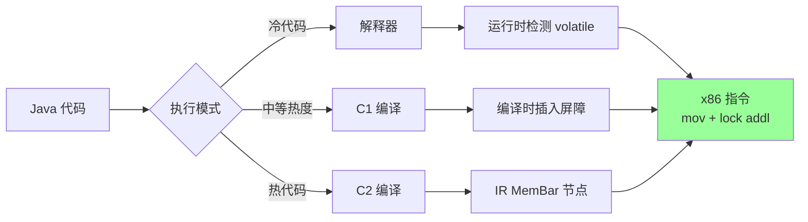
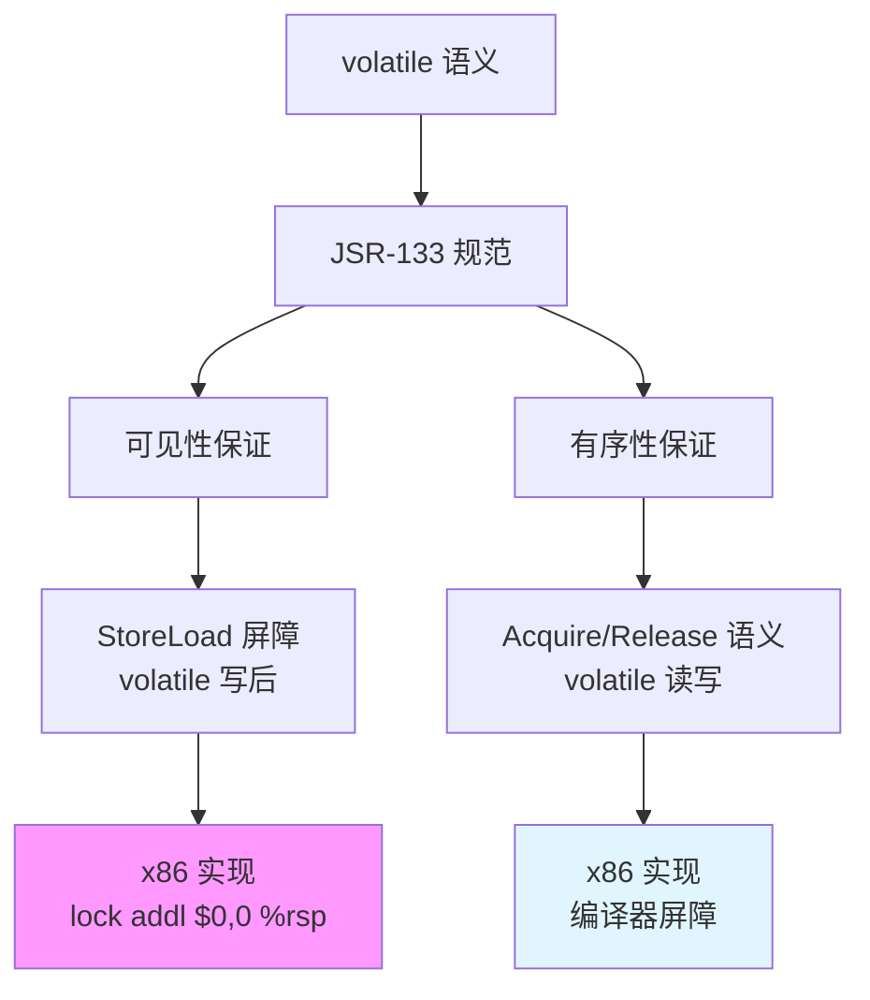
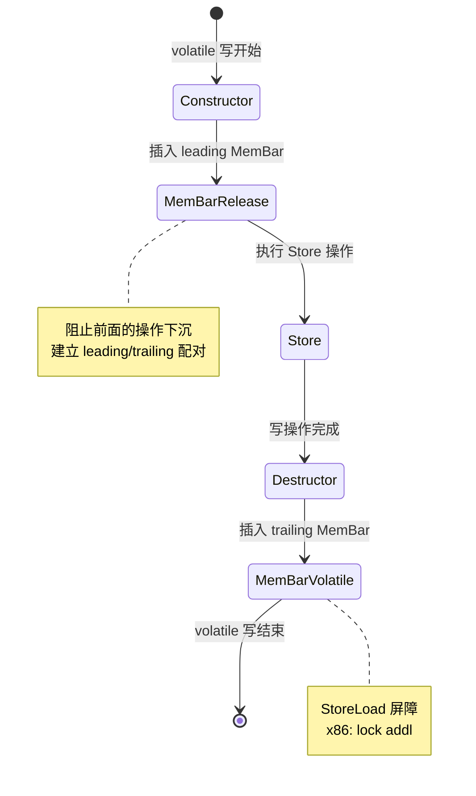
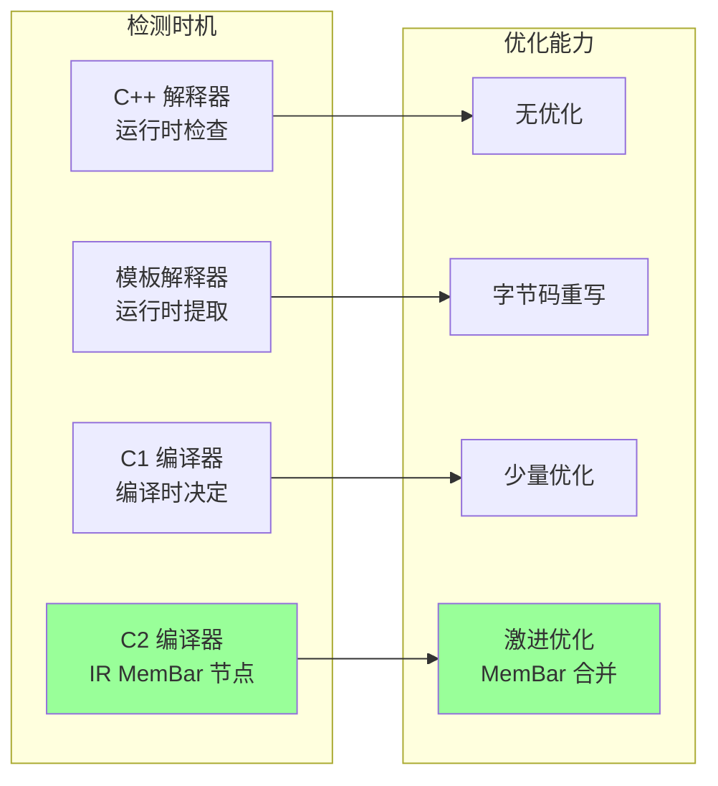

# Volatile 三层实现深度解析 — 解释器/C1/C2 的完整对比

> 基于 OpenJDK 11 源码分析  
> 标准环境：-Xms8g -Xmx8g -XX:+UseG1GC  
> 源码路径：src/hotspot/share/interpreter/, c1/, gc/shared/c2/  
> 核心问题：同一个 `volatile int x = 42;` 在四种执行引擎中的实现差异

---

## 第 0 部分：核心原理 ⭐

### 0.1 本质是什么？

本文深入分析 **Volatile 三层实现深度解析 — 解释器/C1/C2 的完整对比**：从源码角度理解其设计原理、实现机制和关键细节。

### 0.2 为什么需要？

理解 JVM 内部实现是排查复杂问题、进行性能优化的基础。表面的 API 文档无法解释 JVM 的实际行为，只有深入源码才能建立精确的心智模型。

### 0.3 怎么解决？

结合源码阅读、数据结构分析和 GDB 运行时验证，从多个角度建立对该机制的完整理解。

### 0.4 为什么这样设计？

每个设计决策都有其权衡：性能 vs 正确性、简单性 vs 灵活性、内存占用 vs 查找速度。理解这些权衡是理解 JVM 设计的关键。

---


## 0. 核心原理

### 0.1 本质是什么？

**volatile 在 JVM 中有三层实现（解释器、C1、C2），虽然代码路径完全不同，但最终目标一致：在 x86 上 volatile 写生成 `mov + lock addl`，volatile 读生成普通 `mov`。**

一句话概括：**三层实现殊途同归，差异在于检测时机和优化能力。**

### 0.2 为什么需要三层实现？

Java 程序的执行路径多样，需要适配不同场景：



**问题场景**：

```java
class VolatileExample {
    volatile int x = 0;
    
    void write() {
        x = 42;  // volatile 写
    }
    
    int read() {
        return x;  // volatile 读
    }
}
```

不同执行引擎的处理：

| 引擎 | volatile 检测时机 | 屏障策略 | 优化能力 |
|------|------------------|----------|---------|
| **C++ 解释器** | 运行时检查 `cache->is_volatile()` | 分步：release_store + storeload | 无 |
| **模板解释器** | 运行时提取标志位 | 直接生成汇编：store + barrier | 字节码重写 |
| **C1 编译器** | 编译时 `field->is_volatile()` | 三段式：membar_release + store + membar | 少量 |
| **C2 编译器** | 编译时 IR MemBar 节点 | 配对 MemBar：Release + Volatile | **激进优化** |

**没有三层实现的代价**：
- 所有代码都用最高优化级别编译 → 编译时间长
- 所有代码都用解释器执行 → 性能差
- 无法根据代码热度选择合适策略

### 0.3 怎么解决？

**核心思路**：分层编译（Tiered Compilation），根据代码热度选择执行引擎，但保证 volatile 语义在所有层级一致。

**关键机制**：



**四层抽象**：

1. **Java 层**：`volatile` 关键字
2. **字节码层**：`getfield/putfield` + `ConstantPoolCacheEntry::is_volatile` 标志
3. **JVM 层**：`MO_SEQ_CST` 装饰器 → `OrderAccess` API
4. **CPU 层**：x86 `lock addl` / ARM `dmb` / POWER `sync`

### 0.4 为什么这样设计？

**为什么 x86 上 volatile 写需要 `lock addl`？**

x86 TSO（Total Store Order）模型特点：
- Load-Load、Load-Store、Store-Store 天然有序
- **只有 Store-Load 可能重排序**

```
问题场景：
Thread A:  x = 1;     // Store
Thread B:  r = y;      // Load
Thread A:  y = 1;      // Store
Thread B:  r2 = x;     // Load

如果没有 StoreLoad 屏障：
Thread A 的 "y=1" 可能先于 "x=1" 被看到
Thread B 可能读到 y=1 但 x=0
```

**解决方案**：`lock addl $0, 0(%rsp)`
- 等效于 `mfence` 但更快
- 刷新 Store Buffer，保证所有写可见

**为什么 volatile 读在 x86 上"免费"？**

- `LoadLoad` 和 `LoadStore` 在 x86 上天然保证
- 只需编译器屏障防止编译器重排
- 生成的 `mov` 指令本身已经是 acquire 语义

**为什么 C2 可以优化掉冗余 MemBar？**

```java
volatile int x, y;
x = 1;   // MemBarRelease + Store + MemBarVolatile
y = 2;   // MemBarRelease + Store + MemBarVolatile
```

C2 分析：
- 两次 volatile 写之间没有 volatile 读
- 第一个 `MemBarVolatile`（StoreLoad）已经比第二个 `MemBarRelease` 强
- **合并为一个 StoreLoad 屏障即可**

---

## 1. 四种执行引擎的对比总结

```
┌──────────────────────────────────────────────────────────────────────────────────┐
│                   volatile int 写操作的四种实现对比                                │
├─────────────┬────────────────────────────────────────────────────────────────────┤
│ 执行引擎     │ 实现方式                                                          │
├─────────────┼────────────────────────────────────────────────────────────────────┤
│ C++ 解释器   │ release_int_field_put()  → release_store(addr, val)               │
│ (Xint)      │ + OrderAccess::storeload()  → lock addl $0, 0(%rsp)               │
├─────────────┼────────────────────────────────────────────────────────────────────┤
│ 模板解释器   │ access_store_at(T_INT, IN_HEAP, field, rax, ...)                  │
│ (-Xint)     │ + volatile_barrier(StoreLoad|StoreStore) → lock addl              │
├─────────────┼────────────────────────────────────────────────────────────────────┤
│ C1 编译器   │ MO_SEQ_CST → BarrierSetC1::store_at_resolved()                    │
│             │ membar_release + volatile_field_store + membar()                   │
│             │ → [编译器屏障] + mov + lock addl                                   │
├─────────────┼────────────────────────────────────────────────────────────────────┤
│ C2 编译器   │ MO_SEQ_CST → C2AccessFence::MemBarRelease + Store + MemBarVolatile│
│             │ → [编译器屏障] + mov + lock addl                                   │
│             │ 【但 C2 可能优化掉冗余的 MemBar 节点】                               │
└─────────────┴────────────────────────────────────────────────────────────────────┘

实际在 x86 上最终生成的汇编（所有引擎最终殊途同归）：

  volatile 写：
    mov [addr], value              ; 普通写（release 屏障在 x86 上免费）
    lock; addl $0, 0(%rsp)         ; StoreLoad 屏障

  volatile 读：
    mov value, [addr]              ; 普通读
    [编译器屏障]                    ; acquire 屏障在 x86 上免费
```

---

## 2. C++ 字节码解释器

> **源码位置**：`src/hotspot/share/interpreter/bytecodeInterpreter.cpp`  
> **使用条件**：`-Xint` 模式下，如果 HotSpot 编译时启用了 C++ 解释器

### 2.1 volatile 读（getfield/getstatic）

```cpp
// line 1974
if (cache->is_volatile()) {
  // IRIW 处理：仅在非 multi-copy-atomic CPU 上需要
  if (support_IRIW_for_not_multiple_copy_atomic_cpu) {
    OrderAccess::fence();   // x86 上 = false，跳过
  }
  // 使用 acquire 语义的字段读
  if (tos_type == itos) {
    SET_STACK_INT(obj->int_field_acquire(field_offset), -1);
  }
}
```

**执行链路**：
```
obj->int_field_acquire(field_offset)
  → HeapAccess<MO_ACQUIRE>::load_at(as_oop(), offset)
    → RawAccessBarrier::load_internal<MO_ACQUIRE>()
      → OrderAccess::load_acquire(addr)
        → [x86] mov + compiler_barrier()
```

### 2.2 volatile 写（putfield/putstatic）

```cpp
// line 2088
if (cache->is_volatile()) {
  // 使用 release 语义的字段写
  obj->release_int_field_put(field_offset, STACK_INT(-1));
  
  // 关键：写后必须有 StoreLoad 屏障！
  OrderAccess::storeload();
}
```

**为什么是 release_store + storeload 而不是 release_store_fence？**

这里的 C++ 解释器选择了"分步实现"：
- `release_int_field_put` → `OrderAccess::release_store()`：保证前面的写不下沉（x86 免费）
- `OrderAccess::storeload()`：保证这次写对后续读可见 → `lock addl $0, 0(%rsp)`

效果等同于 `release_store_fence()`（= `xchg`），但分成两步更清晰。

### 2.3 volatile 读写的不对称性

```
volatile 读：  acquire（LoadLoad + LoadStore）
               x86 → 编译器屏障（免费！）

volatile 写：  release（LoadStore + StoreStore）+ StoreLoad
               x86 → 编译器屏障（免费）+ lock addl（~20 cycles）
```

**为什么写比读贵？** 因为 x86 TSO 模型中，Store Buffer 是写操作延迟的根源。只有 StoreLoad 需要刷新 Store Buffer，这是唯一需要硬件指令的屏障。

---

## 3. 模板解释器

> **源码位置**：`src/hotspot/cpu/x86/templateTable_x86.cpp`  
> **使用条件**：默认解释器（非 -Xcomp 模式下的冷代码）

模板解释器与 C++ 解释器的本质区别：**直接生成汇编代码**，跳过了 C++ 的函数调用开销。

### 3.1 putfield_or_static 中的 volatile 处理

```cpp
void TemplateTable::putfield_or_static(int byte_no, bool is_static, RewriteControl rc) {
  // 1. 从 ConstantPoolCacheEntry 中提取 volatile 标志位
  __ movl(rdx, flags);
  __ shrl(rdx, ConstantPoolCacheEntry::is_volatile_shift);
  __ andl(rdx, 0x1);

  // 2. 执行存储
  // ... access_store_at(T_INT, IN_HEAP, field, rax, noreg, noreg) ...

  // 3. volatile 写后的屏障
  Label notVolatile;
  __ bind(Done);

  __ testl(rdx, rdx);
  __ jcc(Assembler::zero, notVolatile);
  
  volatile_barrier(Assembler::Membar_mask_bits(
    Assembler::StoreLoad | Assembler::StoreStore));

  __ bind(notVolatile);
}
```

**生成的汇编代码**：
```asm
; 1. 提取 volatile 标志
mov    rdx, [rcx + rbx*8 + flags_offset]
shr    rdx, is_volatile_shift
and    rdx, 1

; 2. 执行存储
mov    [obj + off], eax

; 3. volatile 屏障
test   rdx, rdx
je     notVolatile
lock; addl $0, 0(%rsp)         ; StoreLoad 屏障
notVolatile:
```

### 3.2 volatile_barrier 的实现

```cpp
void TemplateTable::volatile_barrier(Assembler::Membar_mask_bits order_constraint) {
  if (!os::is_MP()) return;    // 单核无需屏障
  __ membar(order_constraint);  // 生成 lock addl $0, 0(%rsp)
}
```

`os::is_MP()` 的检查确保在单处理器系统上不插入不必要的屏障。

---

## 4. C1 编译器（轻量级优化编译器）

> **源码位置**：`src/hotspot/share/c1/c1_LIRGenerator.cpp`, `share/gc/shared/c1/barrierSetC1.cpp`

### 4.1 volatile 标记的传递

```cpp
// c1_LIRGenerator.cpp
void LIRGenerator::do_StoreField(StoreField* x) {
  bool is_volatile = x->field()->is_volatile();
  
  DecoratorSet decorators = IN_HEAP;
  if (is_volatile) {
    decorators |= MO_SEQ_CST;   // 关键：标记为顺序一致性
  }
  access_store_at(decorators, field_type, object, ...);
}
```

### 4.2 C1 volatile store 的屏障生成

```cpp
// barrierSetC1.cpp
void BarrierSetC1::store_at_resolved(LIRAccess& access, LIR_Opr value) {
  bool is_volatile = (((decorators & MO_SEQ_CST) != 0) && os::is_MP());

  // 步骤 1：写前 release 屏障
  if (is_volatile && os::is_MP()) {
    __ membar_release();      // x86: compiler_barrier()（免费）
  }

  // 步骤 2：执行字段写入
  if (is_volatile && !needs_patching) {
    gen->volatile_field_store(value, access.resolved_addr()->as_address_ptr(), ...);
  } else {
    __ store(value, ...);
  }

  // 步骤 3：写后 StoreLoad 屏障
  if (is_volatile && !support_IRIW_for_not_multiple_copy_atomic_cpu) {
    __ membar();              // x86: lock addl $0, 0(%rsp)
  }
}
```

**C1 volatile store 生成的 LIR 序列**：
```
[membar_release]                  → x86: 无（编译器屏障）
[volatile_field_store] value, addr → x86: mov [addr], value
[membar]                          → x86: lock addl $0, 0(%rsp)
```

---

## 5. C2 编译器（激进优化编译器）

> **源码位置**：`src/hotspot/share/gc/shared/c2/barrierSetC2.cpp`

### 5.1 C2AccessFence：RAII 式屏障管理



C2 使用 RAII 类 `C2AccessFence` 管理屏障：

```cpp
class C2AccessFence {
  C2AccessFence(C2Access& access) {
    if (is_write && is_volatile) {
      _leading_membar = kit->insert_mem_bar(Op_MemBarRelease);
    }
  }

  ~C2AccessFence() {
    if (is_write && is_volatile) {
      Node* mb = kit->insert_mem_bar(Op_MemBarVolatile, n);
      MemBarNode::set_store_pair(_leading_membar->as_MemBar(), mb->as_MemBar());
    }
  }
};
```

### 5.2 C2 volatile 写的 IR 图

```
构造函数阶段（写前）：
  MemBarRelease ────────── 阻止前面的操作下沉
       │
       ▼
  Store [addr] = value ─── 实际写入

析构函数阶段（写后）：
       │
       ▼
  MemBarVolatile ─────────── StoreLoad 屏障（x86 = lock addl）
```

**MemBarRelease 和 MemBarVolatile 的配对关系**：

C2 通过 `set_store_pair()` 将前后两个 MemBar 配对，这告诉优化器：
- 这两个 MemBar 是同一个 volatile 写的"围栏"
- 优化时不能把这对 MemBar 之间的 Store 移出去
- 但可以将 MemBar 对内的非 volatile 操作移出去

### 5.3 C2 的 MemBar 优化

**场景 1：连续的 volatile 写**
```java
volatile int x, y;
x = 1;
y = 2;
```

**优化前**：
```
MemBarRelease
Store x = 1
MemBarVolatile    ← 可以优化掉！
MemBarRelease     ← 可以优化掉！
Store y = 2
MemBarVolatile
```

**优化后**：
```
MemBarRelease
Store x = 1
Store y = 2
MemBarVolatile
```

C2 可以合并相邻的 volatile 写的屏障。

---

## 6. GDB 验证脚本

### 6.1 验证 volatile 写的汇编指令

```gdb
# gdb_volatile_write.gdb
# 目标：观察 volatile 写在 x86 上的汇编指令

set args -Xms8g -Xmx8g -XX:+UseG1GC \
         -XX:+PrintCompilation \
         -cp /data/workspace/demo/src com.wjcoder.Main

# 断点：volatile 写的字节码
break bytecodeInterpreter.cpp:2088 if cache->is_volatile()
commands
  printf "=== C++ 解释器 volatile 写 ===\n"
  p/x value
  continue
end

# 断点：模板解释器 volatile 写
break templateTable_x86.cpp:volatile_barrier
commands
  printf "=== 模板解释器 volatile 屏障 ===\n"
  p/x order_constraint
  continue
end

run
```

**预期输出**：
```
=== C++ 解释器 volatile 写 ===
$1 = 0x2a  # 42

=== 模板解释器 volatile 屏障 ===
$2 = 0x3  # StoreLoad | StoreStore
```

### 6.2 验证 C2 MemBar 优化

```gdb
# gdb_c2_membar.gdb
# 目标：观察 C2 的 MemBar 节点生成

set args -Xms8g -Xmx8g -XX:+UseG1GC \
         -XX:+PrintIdeal -XX:CompileCommand=print,*VolatileExample.write \
         -cp /data/workspace/demo/src com.wjcoder.Main

# 断点：MemBar 插入
break BarrierSetC2::store_at_resolved
commands
  printf "=== C2 volatile store ===\n"
  p decorators & MO_SEQ_CST
  continue
end

run
```

**预期输出**：
```
=== C2 volatile store ===
$1 = 1  # MO_SEQ_CST 标志
```

---

## 7. 关键差异总结



| 维度 | C++ 解释器 | 模板解释器 | C1 编译器 | C2 编译器 |
|------|-----------|-----------|----------|----------|
| **volatile 检测** | 运行时 `cache->is_volatile()` | 运行时提取标志位 | 编译时 `field->is_volatile()` | 编译时 IR MemBar |
| **屏障策略** | release_store + storeload | store + barrier | 三段式 membar | MemBar 配对 |
| **优化能力** | 无 | 字节码重写 | 少量 | **激进优化** |
| **最终指令** | mov + lock addl | mov + lock addl | mov + lock addl | mov + lock addl |

---

## 8. 面试高频问题

### Q：volatile 在解释器和编译器中的实现有什么区别？

> 虽然四种执行引擎的代码路径完全不同，但在 x86 上最终生成的指令是一样的：volatile 写是 `mov + lock addl`，volatile 读是普通 `mov`。
>
> 核心区别在于 **volatile 检测时机** 和 **屏障策略的灵活性**：
> - 解释器在运行时从 `ConstantPoolCacheEntry` 提取 `is_volatile` 标志位
> - C1/C2 在编译时就知道字段是否 volatile，可以在 IR 中直接插入合适的屏障节点
> - C2 最激进，它的 `MemBarRelease` + `MemBarVolatile` 配对可以被优化器合并
>
> 另一个有趣的点是 IRIW 处理：所有引擎都检查 `support_IRIW_for_not_multiple_copy_atomic_cpu` 变量。在 x86 上它是 false，所以所有 IRIW 相关的屏障被编译时常量折叠掉了。

### Q：为什么 volatile 写比读贵？

> 因为 x86 TSO 模型中，Store Buffer 是写操作延迟的根源。只有 StoreLoad 需要刷新 Store Buffer，这是唯一需要硬件指令（`lock addl`）的屏障。
>
> volatile 读只需要 acquire 语义（LoadLoad + LoadStore），这些在 x86 上天然保证，只需要编译器屏障防止编译器重排。

---

## 9. 相关源码文件索引

|| 文件 | 层次 | 作用 |
||------|------|------|
|| `share/interpreter/bytecodeInterpreter.cpp:1974,2088` | C++ 解释器 | volatile 读写处理 |
|| `cpu/x86/templateTable_x86.cpp:3107,3390` | 模板解释器 | putfield 的 volatile 屏障 |
|| `share/c1/c1_LIRGenerator.cpp:1493,1702` | C1 | volatile 标记传递 |
|| `share/gc/shared/c1/barrierSetC1.cpp:150,175` | C1 | volatile 屏障生成 |
|| `share/gc/shared/c2/barrierSetC2.cpp:140` | C2 | C2AccessFence 屏障管理 |
|| `share/utilities/globalDefinitions.hpp:542` | 全局 | support_IRIW 常量定义 |
