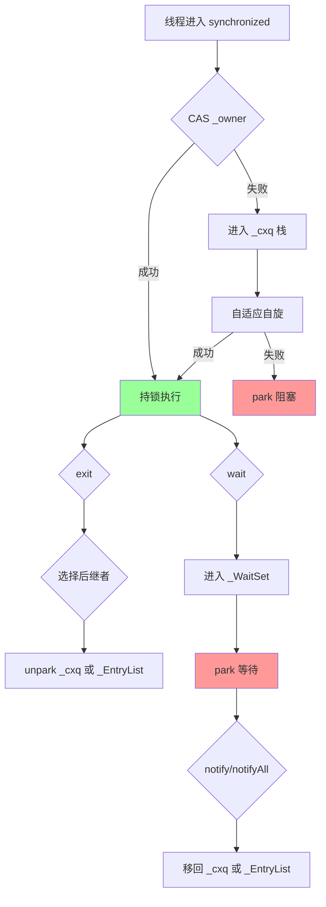
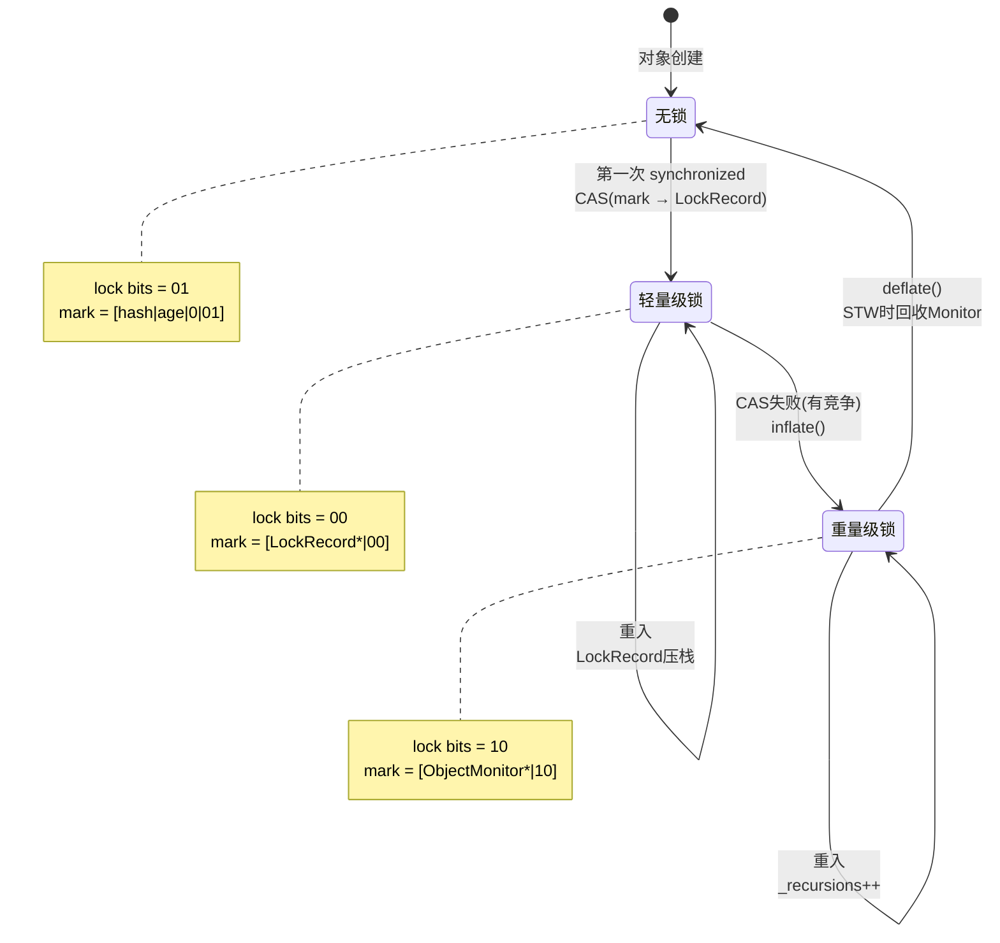

# synchronized 在模板解释器的完整实现

> 基于 OpenJDK 11 slowdebug 源码
> 标准条件：-Xms8g -Xmx8g -XX:+UseG1GC

---

## 第 0 部分：核心原理 ⭐

### 0.1 本质是什么？

本文深入分析 **synchronized 在模板解释器的完整实现**：从源码角度理解其设计原理、实现机制和关键细节。

### 0.2 为什么需要？

理解 JVM 内部实现是排查复杂问题、进行性能优化的基础。表面的 API 文档无法解释 JVM 的实际行为，只有深入源码才能建立精确的心智模型。

### 0.3 怎么解决？

结合源码阅读、数据结构分析和 GDB 运行时验证，从多个角度建立对该机制的完整理解。

### 0.4 为什么这样设计？

每个设计决策都有其权衡：性能 vs 正确性、简单性 vs 灵活性、内存占用 vs 查找速度。理解这些权衡是理解 JVM 设计的关键。

---


## 0. 核心原理

### 0.1 本质是什么？

synchronized 在 JVM 层面通过 mark word + ObjectMonitor 实现互斥访问，核心是将对象的 mark word 从无锁状态逐步升级为轻量级锁、重量级锁，最终由 ObjectMonitor 管理竞争线程的排队和唤醒。

### 0.2 为什么需要？

**问题**：多线程并发访问共享资源需要互斥保证。直接用操作系统 mutex 太重（每次加锁需要系统调用），Java 需要更轻量的方案。

**挑战**：
- 无竞争时，锁获取应该极快（几条指令）
- 有竞争时，需要操作系统级别的线程阻塞/唤醒
- 需要支持重入、wait/notify 等语义

### 0.3 怎么解决？

**三级锁升级策略**（无竞争→轻量→重量）：

1. **轻量级锁**：在栈帧中创建 Lock Record，CAS 将 mark word 指向 Lock Record
2. **重量级锁**：CAS 失败后膨胀为 ObjectMonitor，线程进入竞争队列 park 阻塞
3. **自适应自旋**：在阻塞前尝试自旋等待，避免过早陷入内核

**解释器实现**：
- `monitorenter` 字节码 → `lock_method()` → `InterpreterRuntime::monitorenter()`
- 同步方法入口 → `zerolocals_synchronized` → `lock_object()`

### 0.4 为什么这样设计？

**为什么用三级锁而不是直接重量级锁？**
99% 的 synchronized 块无真正竞争。轻量级锁只需一个 CAS，无需系统调用；重量级锁需要 pthread_mutex + pthread_cond，开销大两个数量级。

**为什么用 mark word 存储锁状态而不是单独数据结构？**
每个 Java 对象都可能被加锁，如果每个对象都分配一个 ObjectMonitor，内存开销巨大。用 mark word 存储锁状态，只有在真正竞争时才分配 ObjectMonitor（按需膨胀）。

**为什么轻量级锁失败就膨胀，不继续尝试其他优化？**
轻量级锁失败说明有真正竞争，继续优化收益有限。直接膨胀为重量级锁，让竞争线程阻塞，避免忙等浪费 CPU。

---

## 一、数据结构

### 1.1 mark word — 对象头中的锁状态

```cpp
// 64-bit mark word 布局（小端序）
// 无锁：    [unused:25|hashcode:31|cms:1|age:4|biased:1|lock:2] = 0x01
// 轻量级锁：[ptr to Lock Record:62                           |lock:2] = 0x00
// 重量级锁：[ptr to ObjectMonitor:62                         |lock:2] = 0x02
// 膨胀中：  [固定值                                           |lock:2] = 0x00 (特殊标记)
```

**lock bits 含义**：
- `01`：无锁
- `00`：轻量级锁
- `10`：重量级锁
- `11`：GC 标记（与本主题无关）

### 1.2 BasicObjectLock — 解释器栈帧中的锁结构

```cpp
// basicLock.hpp
class BasicObjectLock {
  BasicLock _lock;  // 保存 displaced header（原始 mark word）
  oop       _obj;   // 锁定的对象引用
};

class BasicLock {
  volatile markOop _displaced_header;  // 在轻量级锁时保存原始 mark word
};
```

**内存布局**：
```
BasicObjectLock (16 字节)
┌────────────────────────────────────┐
│ _obj (oop)                         │  +0
├────────────────────────────────────┤
│ _lock._displaced_header (markOop)  │  +8
└────────────────────────────────────┘
```

**用途**：
- 解释器同步方法入口时在栈帧中分配
- 轻量级锁成功后，mark word 指向这个结构
- 方法返回时自动释放（从栈弹出）

### 1.3 ObjectMonitor — 重量级锁核心

```cpp
// objectMonitor.hpp
class ObjectMonitor {
  volatile markOop _header;      // 保存原始 mark word
  volatile void*   _object;      // 关联的 Java 对象

  // === 核心锁状态 ===
  void* volatile   _owner;       // 当前持锁线程
  volatile int     _recursions;  // 重入次数

  // === 三个队列 ===
  ObjectWaiter* volatile _cxq;       // 竞争栈 (LIFO)
  ObjectWaiter* volatile _EntryList; // 入口列表 (FIFO)
  ObjectWaiter* volatile _WaitSet;   // wait 队列

  // === 自旋相关 ===
  volatile int _SpinDuration;    // 自适应自旋次数
};
```

**三个队列的关系**：



### 1.4 ObjectWaiter — 队列节点

```cpp
// objectMonitor.hpp
class ObjectWaiter : public StackObj {
  enum TState { TS_UNDEF, TS_WAIT, TS_ENTER, TS_CXQ, TS_RUN };
  
  Thread*       _thread;      // 关联的线程
  ObjectWaiter* _next;        // 后继节点
  ObjectWaiter* _prev;        // 前驱节点
  TState        _state;       // 当前状态
};
```

**状态转换**：
- `TS_ENTER`：在 _EntryList 中
- `TS_CXQ`：在 _cxq 中
- `TS_WAIT`：在 _WaitSet 中
- `TS_RUN`：正在运行（持锁）

---

## 二、算法/流程

### 2.1 锁升级完整流程



### 2.2 monitorenter 字节码 — 解释器实现

**文件**：`src/hotspot/cpu/x86/templateTable_x86.cpp`

```cpp
// templateTable_x86.cpp:monitorenter()
void TemplateTable::monitorenter() {
  // 从栈顶取出对象引用
  __ movptr(rax, Address(rsp, 0));
  
  // 判断是否为 null
  __ testptr(rax, rax);
  __ jcc(Assembler::zero, thrownull);
  
  // 调用 InterpreterRuntime::monitorenter()
  __ call_VM(noreg, CAST_FROM_FN_PTR(address, 
           InterpreterRuntime::monitorenter), rax);
}
```

**InterpreterRuntime::monitorenter() 实现**：

```cpp
// interpreterRuntime.cpp
IRT_ENTRY_NO_ASYNC(void, InterpreterRuntime::monitorenter(JavaThread* thread, BasicObjectLock* elem))
  oop obj = elem->obj();
  
  // 轻量级锁路径
  markOop mark = obj->mark();
  if (mark->is_neutral()) {
    // 无锁状态，尝试 CAS
    if (Atomic::cmpxchg(obj->mark_addr(), mark, 
                        markOopDesc::encode(elem->lock())) == mark) {
      // CAS 成功，锁记录保存原始 mark
      elem->lock()->set_displaced_header(mark);
      return;
    }
  }
  
  // 膨胀为重量级锁
  ObjectSynchronizer::inflate(thread, obj)->enter(thread);
IRT_END
```

### 2.3 同步方法入口 — zerolocals_synchronized

**文件**：`src/hotspot/cpu/x86/templateInterpreterGenerator_x86.cpp`

```cpp
// generate_normal_entry(true) → synchronized 方法
void TemplateInterpreterGenerator::lock_method() {
  // 1. 确定锁定对象
  {
    Label done;
    __ movl(rax, access_flags);
    __ testl(rax, JVM_ACC_STATIC);
    
    // 实例方法：锁 this
    __ movptr(rax, Address(rlocals, 0));  // locals[0] = this
    __ jcc(Assembler::zero, done);
    
    // 静态方法：锁 Class mirror
    __ load_mirror(rax, rbx);
    
    __ bind(done);
  }
  
  // 2. 在栈帧中分配 BasicObjectLock
  __ subptr(rsp, in_bytes(BasicObjectLock::size()));
  __ movptr(monitor_block_top, rsp);
  
  // 3. 保存锁定对象
  __ movptr(Address(rsp, BasicObjectLock::obj_offset_in_bytes()), rax);
  
  // 4. 获取锁
  __ movptr(c_rarg1, rsp);  // BasicObjectLock 地址
  __ lock_object(c_rarg1);
}
```

**lock_object 宏展开**：

```cpp
// interpreterMacroAssembler_x86.cpp
void InterpreterMacroAssembler::lock_object(Register lock_reg) {
  // lock_reg 指向 BasicObjectLock
  
  // 获取对象
  movptr(obj_reg, Address(lock_reg, BasicObjectLock::obj_offset_in_bytes()));
  
  // 获取当前 mark word
  movptr(header_reg, Address(obj_reg, oopDesc::mark_offset_in_bytes()));
  
  // 尝试轻量级锁：CAS(mark → lock_reg)
  if (os::is_MP()) {
    lock();
  }
  cmpxchgptr(lock_reg, Address(obj_reg, oopDesc::mark_offset_in_bytes()));
  
  // CAS 成功：返回
  jcc(Assembler::zero, done);
  
  // CAS 失败：调用运行时
  call_VM(noreg, InterpreterRuntime::monitorenter, obj_reg, lock_reg);
  
  bind(done);
}
```

### 2.4 ObjectMonitor::enter() — 重量级锁获取

**文件**：`src/hotspot/share/runtime/objectMonitor.cpp`

```cpp
// objectMonitor.cpp:enter()
void ObjectMonitor::enter(TRAPS) {
  Thread* const Self = THREAD;
  
  // === 1. CAS 快速路径 ===
  void* cur = Atomic::cmpxchg(&_owner, (void*)NULL, Self);
  if (cur == NULL) {
    return;  // 成功获取锁
  }
  
  // === 2. 递归检测 ===
  if (cur == Self) {
    _recursions++;
    return;
  }
  
  // === 3. 自适应自旋 ===
  if (TrySpin(Self) > 0) {
    return;  // 自旋成功
  }
  
  // === 4. EnterI 慢速路径 ===
  EnterI(THREAD);
}

void ObjectMonitor::EnterI(TRAPS) {
  Thread* const Self = THREAD;
  
  // 4.1 再次尝试 CAS
  if (TryLock(Self) > 0) return;
  
  // 4.2 创建 ObjectWaiter 节点
  ObjectWaiter node(Self);
  node.TState = ObjectWaiter::TS_CXQ;
  
  // 4.3 CAS 入 _cxq 栈
  for (;;) {
    node._next = _cxq;
    if (Atomic::cmpxchg(&_cxq, node._next, &node) == node._next) {
      break;
    }
  }
  
  // 4.4 park 循环
  for (;;) {
    // 再试一次
    if (TryLock(Self) > 0) break;
    
    // 阻塞等待
    park(Self);
    
    // 被唤醒后再试
    if (TryLock(Self) > 0) break;
  }
  
  // 4.5 成功获取锁，从队列中移除
  UnlinkAfterAcquire(Self, &node);
}
```

### 2.5 ObjectMonitor::exit() — 锁释放

```cpp
// objectMonitor.cpp:exit()
void ObjectMonitor::exit(bool not_suspended, TRAPS) {
  Thread* const Self = THREAD;
  
  // === 1. 递归退出 ===
  if (_recursions != 0) {
    _recursions--;
    return;
  }
  
  // === 2. 释放 _owner ===
  _owner = NULL;
  OrderAccess::release();  // StoreLoad 屏障
  
  // === 3. 检查是否有等待者 ===
  if (_cxq == NULL && _EntryList == NULL) {
    return;  // 无等待者，直接返回
  }
  
  // === 4. 根据策略选择后继者 ===
  ExitEpilog(Self, _cxq);  // 默认 QMode=2，优先 _cxq
}

void ObjectMonitor::ExitEpilog(Thread* Self, ObjectWaiter* Wakee) {
  // 从队列中移除
  UnlinkAfterAcquire(Self, Wakee);
  
  // 唤醒线程
  Wakee->TState = ObjectWaiter::TS_RUN;
  unpark(Wakee->_thread);
}
```

### 2.6 wait/notify 实现

**Object.wait() 流程**：

```cpp
// objectMonitor.cpp:wait()
void ObjectMonitor::wait(jlong millis, TRAPS) {
  // 1. 检查是否持锁
  if (THREAD != _owner) {
    THROW(vmSymbols::java_lang_IllegalMonitorStateException());
  }
  
  // 2. 创建 ObjectWaiter 节点
  ObjectWaiter node(THREAD);
  node.TState = ObjectWaiter::TS_WAIT;
  
  // 3. 加入 WaitSet（双向环形链表）
  AddWaiter(&node);
  
  // 4. 保存递归次数，完全释放锁
  intx save = _recursions;
  _recursions = 0;
  exit(true, THREAD);
  
  // 5. park 阻塞
  if (millis == 0) {
    park(THREAD);
  } else {
    park(THREAD, millis);
  }
  
  // 6. 被唤醒后，重新竞争锁
  enter(THREAD);
  
  // 7. 恢复递归次数
  _recursions = save;
}
```

**Object.notify() 流程**：

```cpp
// objectMonitor.cpp:notify()
void ObjectMonitor::notify(TRAPS) {
  // 1. 检查是否持锁
  if (THREAD != _owner) {
    THROW(vmSymbols::java_lang_IllegalMonitorStateException());
  }
  
  // 2. 从 WaitSet 取出节点
  ObjectWaiter* iterator = DequeueWaiter();
  if (iterator == NULL) return;
  
  // 3. 根据 Policy 决定放入哪个队列
  if (Policy == 2) {  // 默认策略
    // 放入 _cxq 头部
    iterator->TState = ObjectWaiter::TS_CXQ;
    iterator->_next = _cxq;
    _cxq = iterator;
  } else {
    // 放入 _EntryList
    iterator->TState = ObjectWaiter::TS_ENTER;
    if (_EntryList == NULL) {
      _EntryList = iterator;
    } else {
      _EntryList->_prev = iterator;
      iterator->_next = _EntryList;
      _EntryList = iterator;
    }
  }
}
```

### 2.7 inflate() — 膨胀为重量级锁

```cpp
// synchronizer.cpp:inflate()
ObjectMonitor* ObjectSynchronizer::inflate(Thread* self, oop obj) {
  for (;;) {
    markOop mark = obj->mark();
    
    // Case 1: 已膨胀
    if (mark->has_monitor()) {
      return mark->monitor();
    }
    
    // Case 2: 正在膨胀
    if (mark == markOopDesc::INFLATING()) {
      spin_wait();
      continue;
    }
    
    // Case 3: 轻量级锁
    if (mark->has_locker()) {
      ObjectMonitor* m = new ObjectMonitor();
      
      // 先设为 INFLATING 占位
      if (obj->cas_set_mark(markOopDesc::INFLATING(), mark) == mark) {
        m->_header = mark->displaced_header();
        m->_owner = mark->locker();
        obj->set_mark(markOopDesc::encode(m));
        return m;
      }
      continue;
    }
    
    // Case 4: 无锁
    ObjectMonitor* m = new ObjectMonitor();
    m->_header = mark;
    if (obj->cas_set_mark(markOopDesc::encode(m), mark) == mark) {
      return m;
    }
  }
}
```

---

## 三、GDB 验证

### 3.1 验证同步方法入口

```bash
# GDB 脚本
cat > verify_sync_entry.gdb << 'EOF'
set pagination off
set print object on

# 断点：lock_method
break TemplateInterpreterGenerator::lock_method
commands
  printf "=== lock_method() called ===\n"
  printf "BasicObjectLock size: %d\n", sizeof(BasicObjectLock)
  continue
end

# 断点：InterpreterRuntime::monitorenter
break InterpreterRuntime::monitorenter
commands
  printf "=== monitorenter() ===\n"
  printf "Object: %p\n", $rdi
  continue
end

# 断点：ObjectMonitor::enter
break ObjectMonitor::enter
commands
  printf "=== ObjectMonitor::enter() ===\n"
  printf "_owner: %p, _recursions: %d\n", $_owner, $_recursions
  continue
end

run -cp /data/workspace/demo/src com.wjcoder.SyncTest
EOF
```

**预期输出**：
```
=== lock_method() called ===
BasicObjectLock size: 16
=== monitorenter() ===
Object: 0x7fffe8001234
=== ObjectMonitor::enter() ===
_owner: 0x0, _recursions: 0
```

### 3.2 验证锁升级过程

```bash
# GDB 脚本
cat > verify_lock_escalation.gdb << 'EOF'
set pagination off

# 断点：轻量级锁 CAS 成功
break synchronizer.cpp:212 if mark->is_neutral()
commands
  printf "=== Lightweight lock CAS ===\n"
  printf "Object mark: 0x%lx\n", *(uint64_t*)obj->mark_addr()
  continue
end

# 断点：膨胀
break ObjectSynchronizer::inflate
commands
  printf "=== Inflate to heavyweight ===\n"
  printf "Object: %p\n", $rdi
  continue
end

# 断点：ObjectMonitor 分配
break ObjectMonitor::ObjectMonitor
commands
  printf "=== ObjectMonitor allocated ===\n"
  printf "Size: %d\n", sizeof(ObjectMonitor)
  continue
end

run -cp /data/workspace/demo/src com.wjcoder.LockEscalationTest
EOF
```

### 3.3 验证 wait/notify

```bash
# GDB 脚本
cat > verify_wait_notify.gdb << 'EOF'
set pagination off

# 断点：wait
break ObjectMonitor::wait
commands
  printf "=== wait() called ===\n"
  printf "_owner: %p, _WaitSet: %p\n", $_owner, $_WaitSet
  continue
end

# 断点：notify
break ObjectMonitor::notify
commands
  printf "=== notify() called ===\n"
  printf "_WaitSet: %p\n", $_WaitSet
  continue
end

# 断点：park
break os::PlatformEvent::park
commands
  printf "=== Thread parking ===\n"
  continue
end

# 断点：unpark
break os::PlatformEvent::unpark
commands
  printf "=== Thread unparked ===\n"
  continue
end

run -cp /data/workspace/demo/src com.wjcoder.WaitNotifyTest
EOF
```

---

## 四、性能分析

### 4.1 不同锁状态的开销

| 锁状态 | 获取操作 | 大约周期 |
|--------|---------|---------|
| 无锁→轻量级锁 | 1 次 CAS | ~10 cycles |
| 轻量级锁重入 | 栈指针判断 | ~2 cycles |
| 轻量级→重量级 | 膨胀 + CAS | ~100 cycles |
| 重量级锁无竞争 | CAS _owner | ~10 cycles |
| 重量级锁有竞争 | 自旋 + park | ~10000+ cycles |

### 4.2 自适应自旋参数

```cpp
// 全局参数（globals.hpp）
define_pd_global(intx, PreSpinYield,           10);   // 自旋前 yield 次数
define_pd_global(intx, PostSpinYield,          10);   // 自旋后 yield 次数
define_pd_global(intx, PreSpinPause,           0);    // 自旋前 pause 次数

// objectMonitor.cpp 中的参数
Knob_SpinLimit  = 5000;  // 最大自旋次数
Knob_BonusB     = 100;   // 成功奖励
Knob_Penalty    = 200;   // 失败惩罚
```

### 4.3 synchronized vs ReentrantLock

| 维度 | synchronized | ReentrantLock |
|------|-------------|---------------|
| 实现层 | JVM C++ | Java AQS |
| 锁升级 | 有（轻量→重量） | 无（直接 CAS+park） |
| 自旋 | 自适应 | tryAcquire CAS 一次 |
| 公平性 | 非公平 | 可选公平/非公平 |
| 条件变量 | 单个（wait/notify） | 多个（Condition） |
| JIT 优化 | ✅ 锁消除/粗化 | ❌ 无 |

---

## 五、面试话术

### Q：synchronized 的锁升级过程？

**L1（概念）**：无锁 → 轻量级锁（CAS mark word）→ 重量级锁（ObjectMonitor）。不可降级（重量级锁可在 STW 时 deflate）。

**L2（源码）**：
- **轻量级锁**：在栈帧中分配 BasicObjectLock（16字节），CAS 将对象的 mark word 指向 Lock Record，成功则 lock bits = 00
- **重量级锁**：CAS 失败后调用 `ObjectSynchronizer::inflate()` 分配 ObjectMonitor，mark word 指向 Monitor，lock bits = 10
- **关键文件**：`objectMonitor.cpp:enter()`、`synchronizer.cpp:inflate()`

**L3（指令）**：轻量级锁就是一个 `lock cmpxchg`，成功返回；失败说明有竞争，膨胀为重量级锁，线程 park 阻塞。

### Q：ObjectMonitor 的三个队列？

**核心**：
- **_cxq**：竞争栈（LIFO），新来的线程先入栈
- **_EntryList**：入口列表（FIFO），从 _cxq 转移过来
- **_WaitSet**：wait 队列，调用 wait() 的线程

**流程**：enter() 失败 → _cxq → 自旋失败 → park；exit() → unpark _cxq/_EntryList；wait() → _WaitSet；notify() → 移回 _cxq/_EntryList。

### Q：wait() 为什么必须在 synchronized 块内？

**源码层面**：`ObjectMonitor::wait()` 第一行就检查 `Self != _owner`，不持锁直接抛 `IllegalMonitorStateException`。

**设计层面**：防止 lost wakeup。如果没有锁保护，notify() 可能在 wait() 之前执行，导致线程永远等待。

### Q：inflate() 的 INFLATING 中间态？

**问题**：多线程可能同时膨胀同一个对象，如何避免重复分配 ObjectMonitor？

**解决**：先 CAS 把 mark word 设为 INFLATING 占位，其他线程看到就自旋等待。这类似一个微型 CAS-spin 协议，保证只有一个线程执行膨胀。

---

## 六、总结

### 数据结构层面

| 结构 | 核心特征 |
|------|---------|
| mark word | 64-bit 对象头，低 2 位表示锁状态 |
| BasicObjectLock | 16字节栈帧结构，解释器轻量级锁使用 |
| ObjectMonitor | 重量级锁核心，三个队列管理竞争线程 |
| ObjectWaiter | 队列节点，TState 表示当前状态 |

### 算法层面

| 算法 | 核心设计 |
|------|---------|
| 锁升级 | 无竞争→轻量（CAS）→重量（ObjectMonitor） |
| 自适应自旋 | TATAS + 奖惩机制，上限 5000 次 |
| enter() | CAS → 自旋 → EnterI (park 循环) |
| exit() | 释放 _owner → 按 QMode 选后继者 → unpark |
| wait/notify | 释放锁 → WaitSet → 移回竞争队列 |

### 性能启示

1. **无竞争时 synchronized 很快**：轻量级锁只需 1 次 CAS
2. **有竞争时自适应自旋有效**：锁持有时间短，自旋能避免 park 开销
3. **重量级锁开销大**：需要内核介入（pthread_cond_wait）
4. **JIT 优化重要**：逃逸分析 + 锁消除能消除大量不必要的锁
