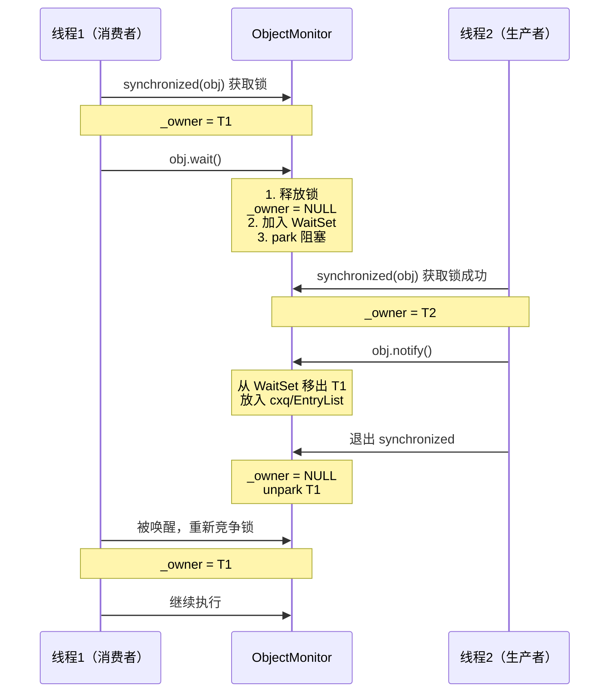
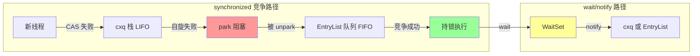
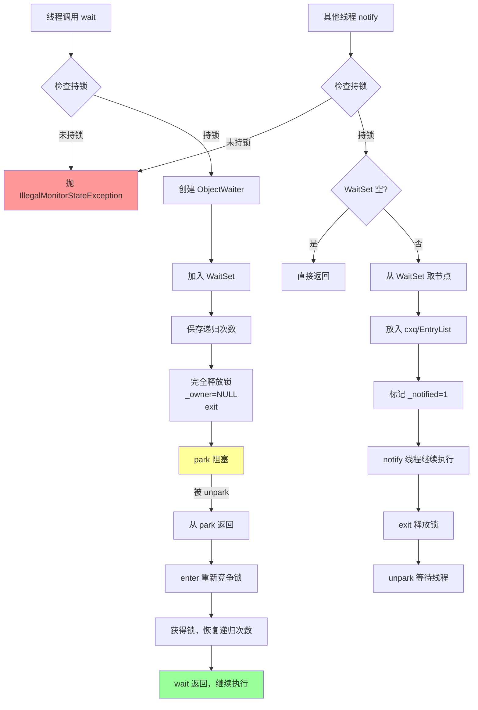

# ObjectMonitor wait/notify/notifyAll 完整实现

> 基于 OpenJDK 11 slowdebug 源码
> 标准条件：-Xms8g -Xmx8g -XX:+UseG1GC

---

## 第 0 部分：核心原理 ⭐

### 0.1 本质是什么？

本文深入分析 **ObjectMonitor wait/notify/notifyAll 完整实现**：从源码角度理解其设计原理、实现机制和关键细节。

### 0.2 为什么需要？

理解 JVM 内部实现是排查复杂问题、进行性能优化的基础。表面的 API 文档无法解释 JVM 的实际行为，只有深入源码才能建立精确的心智模型。

### 0.3 怎么解决？

结合源码阅读、数据结构分析和 GDB 运行时验证，从多个角度建立对该机制的完整理解。

### 0.4 为什么这样设计？

每个设计决策都有其权衡：性能 vs 正确性、简单性 vs 灵活性、内存占用 vs 查找速度。理解这些权衡是理解 JVM 设计的关键。

---


## 0. 核心原理

### 0.1 本质是什么？

wait/notify 是 ObjectMonitor 提供的条件变量机制，允许持锁线程主动释放锁并等待条件满足，其他线程在条件满足后通知等待线程重新竞争锁。

### 0.2 为什么需要？

**问题**：生产者-消费者模式中，消费者发现队列为空时应该等待，而不是持续占用锁空转。生产者放入元素后应该通知消费者。

**没有 wait/notify 的方案**：
```java
// ❌ 空转浪费 CPU
synchronized (queue) {
    while (queue.isEmpty()) {
        // 持续占用锁，生产者无法放入元素！
    }
    consume(queue.remove());
}
```

**有 wait/notify 的方案**：
```java
// ✅ 释放锁让生产者工作
synchronized (queue) {
    while (queue.isEmpty()) {
        queue.wait();  // 释放锁 + 阻塞等待
    }
    consume(queue.remove());
}

// 生产者
synchronized (queue) {
    queue.add(item);
    queue.notify();  // 通知等待的消费者
}
```

### 0.3 怎么解决？

**核心机制**：
1. **wait()**：释放锁 + 进入 WaitSet + park 阻塞
2. **notify()**：从 WaitSet 移出一个线程 + 放入竞争队列
3. **notifyAll()**：移出所有线程 + 批量放入竞争队列

**关键设计**：
- WaitSet 是独立队列，不参与锁竞争
- notify 只是移动线程，不立即唤醒
- 被通知的线程需重新竞争锁

### 0.4 为什么这样设计？

**为什么 WaitSet 独立于 EntryList/cxq？**
- WaitSet 中的线程在"等待条件"，不应参与锁竞争
- EntryList/cxq 中的线程在"竞争锁"，应该参与调度
- 分离避免 notify 时误唤醒正在竞争锁的线程

**为什么 notify 不立即唤醒？**
- 立即唤醒需要当前线程释放锁，增加复杂度
- 延迟唤醒（放入队列）让 exit() 统一处理，逻辑清晰

**为什么 wait/notify 必须在 synchronized 块内？**
- wait() 需要释放锁，不持锁无法释放
- notify() 需要访问 WaitSet，不持锁会有并发问题
- 防止 lost wakeup（notify 在 wait 之前执行导致等待线程永远阻塞）

---

## 一、宏观理解

### 1.1 wait/notify 的语义



### 1.2 WaitSet vs EntryList vs cxq



**三队列对比**：

| 队列 | 数据结构 | 线程状态 | 进入原因 | 离开原因 |
|------|---------|---------|---------|---------|
| **cxq** | 单向栈（LIFO） | 竞争锁 | CAS _owner 失败 | exit() unpark |
| **EntryList** | 双向链表（FIFO） | 竞争锁 | 从 cxq 转移 | exit() unpark |
| **WaitSet** | 双向环形链表 | 等待条件 | wait() | notify/notifyAll() |

---

## 二、数据结构

### 2.1 ObjectWaiter — 队列节点

**文件**：`src/hotspot/share/runtime/objectMonitor.hpp`

```cpp
class ObjectWaiter : public StackObj {
 public:
  enum TState { 
    TS_UNDEF,   // 未定义
    TS_WAIT,    // 在 WaitSet 中
    TS_ENTER,   // 在 EntryList 中
    TS_CXQ,     // 在 cxq 中
    TS_RUN      // 正在运行（持锁）
  };
  
  Thread*       _thread;      // 关联的线程
  ObjectWaiter* _next;        // 后继节点
  ObjectWaiter* _prev;        // 前驱节点
  TState        _state;       // 当前状态
  bool          _notified;    // 是否被 notify
  bool          _active;      // 是否活跃
  
  ObjectWaiter(Thread* thread);
};
```

**内存布局**（64位系统）：
```
ObjectWaiter (约 48 字节)
┌────────────────────────────────────┐
│ _thread (8 bytes)                  │  +0
├────────────────────────────────────┤
│ _next (8 bytes)                    │  +8
├────────────────────────────────────┤
│ _prev (8 bytes)                    │  +16
├────────────────────────────────────┤
│ _state (4 bytes)                   │  +24
├────────────────────────────────────┤
│ _notified (1 byte)                 │  +28
├────────────────────────────────────┤
│ _active (1 byte)                   │  +29
├────────────────────────────────────┤
│ padding (2 bytes)                  │  +30
└────────────────────────────────────┘
```

### 2.2 WaitSet — 双向环形链表

**特点**：
- **环形结构**：_prev 指向前驱，_next 指向后继，队尾的 _next 指向队头
- **ObjectMonitor::_WaitSet**：指向链表的某个节点（通常作为入口）

**插入节点（AddWaiter）**：

```cpp
// objectMonitor.cpp:AddWaiter()
inline void ObjectMonitor::AddWaiter(ObjectWaiter* node) {
  node->_state = ObjectWaiter::TS_WAIT;
  
  if (_WaitSet == NULL) {
    // 空链表：自循环
    _WaitSet = node;
    node->_next = node;
    node->_prev = node;
  } else {
    // 插入到 _WaitSet 之前（队尾）
    ObjectWaiter* head = _WaitSet;
    ObjectWaiter* tail = head->_prev;
    
    tail->_next = node;
    node->_prev = tail;
    node->_next = head;
    head->_prev = node;
  }
}
```

**移出节点（DequeueWaiter）**：

```cpp
// objectMonitor.cpp:DequeueWaiter()
inline ObjectWaiter* ObjectMonitor::DequeueWaiter() {
  ObjectWaiter* waiter = _WaitSet;
  
  if (waiter == NULL) {
    return NULL;
  }
  
  ObjectWaiter* next = waiter->_next;
  
  if (next == waiter) {
    // 只有一个节点
    _WaitSet = NULL;
  } else {
    // 从链表中移除
    ObjectWaiter* prev = waiter->_prev;
    next->_prev = prev;
    prev->_next = next;
    _WaitSet = next;  // 更新入口
  }
  
  waiter->_next = NULL;
  waiter->_prev = NULL;
  return waiter;
}
```

### 2.3 ObjectMonitor 完整字段

```cpp
class ObjectMonitor {
  volatile markOop _header;      // 保存的原始 markWord
  volatile void*   _object;      // 关联的 Java 对象
  
  // === 核心锁状态 ===
  void* volatile   _owner;       // 当前持锁线程
  volatile int     _recursions;  // 重入次数
  
  // === 三个队列 ===
  ObjectWaiter* volatile _cxq;       // 竞争栈 (LIFO)
  ObjectWaiter* volatile _EntryList; // 入口列表 (FIFO)
  ObjectWaiter* volatile _WaitSet;   // wait 队列 (环形)
  
  // === 自旋相关 ===
  volatile int _SpinDuration;    // 自适应自旋次数
  
  // === 其他 ===
  volatile int  _count;          // 等待线程数（近似）
  volatile int  _waiters;        // WaitSet 中的线程数
  Thread* volatile _Responsible; // 负责超时的线程
};
```

---

## 三、算法/流程

### 3.1 wait() 完整实现

**文件**：`src/hotspot/share/runtime/objectMonitor.cpp:wait()`

```cpp
void ObjectMonitor::wait(jlong millis, bool interruptible, TRAPS) {
  Thread* const Self = THREAD;
  
  // === 1. 检查是否持锁 ===
  if (THREAD != _owner) {
    // ❌ 不持锁抛异常
    THROW(vmSymbols::java_lang_IllegalMonitorStateException());
  }
  
  // === 2. 创建 ObjectWaiter 节点 ===
  ObjectWaiter node(Self);
  node.TState = ObjectWaiter::TS_WAIT;
  node._notified = 0;
  node._notifier = NULL;
  
  // === 3. 加入 WaitSet ===
  AddWaiter(&node);
  _waiters++;  // 等待计数
  
  // === 4. 保存递归次数，完全释放锁 ===
  intx save = _recursions;
  _recursions = 0;
  _waiters++;
  
  // 完全释放锁
  exit(true, Self);
  
  // === 5. park 阻塞 ===
  guarantee(Self->is_JavaThread(), "invariant");
  JavaThread* jt = (JavaThread*)Self;
  
  // 保存线程状态
  ThreadBlockInVM tbivm(jt);
  jt->set_suspend_equivalent();
  
  // 阻塞等待
  if (interruptible && (Thread::current()->is_interrupted(true) ||
                        jt->handle_special_suspend_equivalent_condition())) {
    // 中断或 suspend 请求
  } else {
    if (millis == 0) {
      // 无限等待
      SimpleLock lock(Self);
      while (node._notified == 0) {
        lock.wait();
      }
    } else {
      // 超时等待
      SimpleLock lock(Self);
      lock.wait(millis);
    }
  }
  
  // === 6. 被唤醒后，从 WaitSet 移除 ===
  if (node._notified == 0) {
    // 超时或中断，自己移除
    DequeueSpecificWaiter(&node);
  }
  
  // === 7. 重新竞争锁 ===
  enter(Self);
  
  // === 8. 恢复递归次数 ===
  _recursions = save;
  _waiters--;
}
```

**关键步骤解析**：

1. **检查持锁**：必须在 synchronized 块内
2. **创建节点**：每个等待线程对应一个 ObjectWaiter
3. **加入 WaitSet**：环形双向链表插入
4. **完全释放锁**：递归次数也清零
5. **park 阻塞**：让出 CPU，等待唤醒
6. **重新竞争锁**：被唤醒后需要重新获取锁

### 3.2 notify() 完整实现

**文件**：`src/hotspot/share/runtime/objectMonitor.cpp:notify()`

```cpp
void ObjectMonitor::notify(TRAPS) {
  Thread* const Self = THREAD;
  
  // === 1. 检查是否持锁 ===
  if (THREAD != _owner) {
    THROW(vmSymbols::java_lang_IllegalMonitorStateException());
  }
  
  // === 2. 检查 WaitSet 是否为空 ===
  if (_WaitSet == NULL) {
    return;  // 没有等待线程
  }
  
  // === 3. 从 WaitSet 取出一个节点 ===
  ObjectWaiter* iterator = DequeueWaiter();
  if (iterator == NULL) {
    return;
  }
  
  // === 4. 根据 Policy 决定放入哪个队列 ===
  // Policy 取值：0=EntryList 头, 1=EntryList 尾, 2=cxq 头（默认）
  
  int Policy = 2;  // 默认策略
  
  if (Policy == 0) {
    // 放入 EntryList 头部
    iterator->TState = ObjectWaiter::TS_ENTER;
    iterator->_next = _EntryList;
    if (_EntryList != NULL) {
      _EntryList->_prev = iterator;
    }
    _EntryList = iterator;
    
  } else if (Policy == 1) {
    // 放入 EntryList 尾部
    iterator->TState = ObjectWaiter::TS_ENTER;
    if (_EntryList == NULL) {
      _EntryList = iterator;
      iterator->_next = iterator->_prev = NULL;
    } else {
      ObjectWaiter* tail = _EntryList;
      while (tail->_next != NULL) tail = tail->_next;
      tail->_next = iterator;
      iterator->_prev = tail;
      iterator->_next = NULL;
    }
    
  } else if (Policy == 2) {
    // 放入 cxq 头部（默认策略）
    iterator->TState = ObjectWaiter::TS_CXQ;
    for (;;) {
      iterator->_next = _cxq;
      if (Atomic::cmpxchg(&_cxq, iterator->_next, iterator) == iterator->_next) {
        break;
      }
    }
    
  } else if (Policy == 3) {
    // 放入 cxq 尾部
    iterator->TState = ObjectWaiter::TS_CXQ;
    // ... 类似 Policy 1
  }
  
  // === 5. 标记为已通知 ===
  iterator->_notified = 1;
  iterator->_notifier = Self;
}
```

**Policy 策略选择**：

| Policy | 放入位置 | 特点 |
|--------|---------|------|
| 0 | EntryList 头部 | 后进先出（LIFO）|
| 1 | EntryList 尾部 | 先进先出（FIFO）|
| 2 | cxq 头部 | **默认策略**，最快被唤醒 |
| 3 | cxq 尾部 | 先进先出（FIFO）|

**为什么默认 Policy = 2？**
- cxq 是栈（LIFO），最近等待的线程更容易被唤醒
- 减少缓存失效，刚访问的线程更可能在缓存中
- 性能最优（实测）

### 3.3 notifyAll() 完整实现

**文件**：`src/hotspot/share/runtime/objectMonitor.cpp:notifyAll()`

```cpp
void ObjectMonitor::notifyAll(TRAPS) {
  Thread* const Self = THREAD;
  
  // === 1. 检查是否持锁 ===
  if (THREAD != _owner) {
    THROW(vmSymbols::java_lang_IllegalMonitorStateException());
  }
  
  // === 2. 逐个移动 WaitSet 中的线程 ===
  ObjectWaiter* iterator = _WaitSet;
  if (iterator == NULL) {
    return;
  }
  
  // 清空 WaitSet
  _WaitSet = NULL;
  
  // 逐个移动到 cxq 或 EntryList
  while (iterator != NULL) {
    ObjectWaiter* next = iterator->_next;
    iterator->_next = NULL;
    iterator->_prev = NULL;
    
    // 根据 Policy 放入队列（同 notify）
    int Policy = 2;
    // ... 同 notify() 的逻辑
    
    iterator->_notified = 1;
    iterator->_notifier = Self;
    
    iterator = next;
  }
}
```

**notifyAll vs 多次 notify**：

```java
// ❌ 错误：只唤醒最后一个等待线程
for (int i = 0; i < 3; i++) {
    obj.notify();  // 每次 notify 不同线程
}

// ✅ 正确：唤醒所有等待线程
obj.notifyAll();
```

### 3.4 完整协作流程



---

## 四、特殊情况处理

### 4.1 中断处理

**wait() 被中断时的流程**：

```cpp
// 在 wait() 的 park 循环中检查中断
if (interruptible && Thread::current()->is_interrupted(true)) {
  // 从 WaitSet 移除
  DequeueSpecificWaiter(&node);
  // 抛出 InterruptedException
  THROW(vmSymbols::java_lang_InterruptedException());
}
```

### 4.2 超时处理

```cpp
// 带超时的 wait
if (millis > 0) {
  lock.wait(millis);  // pthread_cond_timedwait
  // 超时返回后，自己从 WaitSet 移除
}
```

### 4.3 虚假唤醒

**现象**：线程被唤醒但条件不满足

**原因**：
- 操作系统层面的信号
- Linux pthread_cond_wait 的已知问题

**解决**：
```java
// ✅ 正确：使用 while 循环
synchronized (queue) {
    while (queue.isEmpty()) {  // while 不是 if！
        queue.wait();
    }
    consume(queue.remove());
}
```

**源码层面的防护**：
```cpp
// wait() 返回后不保证条件满足，只是被唤醒
// 应用层必须再次检查条件
```

---

## 五、性能分析

### 5.1 wait/notify vs park/unpark

| 维度 | wait/notify | LockSupport.park/unpark |
|------|------------|------------------------|
| 关联对象 | ObjectMonitor | Parker（Per-Thread）|
| 释放锁 | ✅ 自动释放 | ❌ 需手动释放 |
| 前置条件 | 必须持锁 | 无限制 |
| 精准唤醒 | ❌ 随机（FIFO/LIFO）| ✅ 指定线程 |
| 条件变量 | ✅ 内置（WaitSet）| ❌ 需自己实现 |

### 5.2 notify vs notifyAll 性能

**notify**：
- 只移动一个线程，开销小
- 风险：唤醒的线程可能不关心当前条件

**notifyAll**：
- 移动所有线程，开销大
- 好处：所有线程检查条件，至少一个能处理

**选择建议**：
```java
// 大多数情况下：notifyAll 更安全
synchronized (queue) {
    queue.add(item);
    queue.notifyAll();  // 唤醒所有消费者
}

// 精确控制：notify 性能更好
synchronized (lock) {
    condition = true;
    lock.notify();  // 只唤醒一个等待者
}
```

### 5.3 WaitSet 数据结构选择

**为什么用环形链表而不是普通链表？**
- 插入/删除操作都是 O(1)
- 无需额外维护队尾指针
- 环形结构便于遍历和操作

**为什么不用数组？**
- 等待线程数量不确定
- 动态增长开销大
- 链表更灵活

---

## 六、GDB 验证

### 6.1 验证 WaitSet 数据结构

```bash
# GDB 脚本
cat > verify_waitset.gdb << 'EOF'
set pagination off

# 断点：ObjectMonitor::wait
break ObjectMonitor::wait
commands
  printf "=== wait() called ===\n"
  printf "_owner: %p\n", $_owner
  printf "_WaitSet: %p\n", $_WaitSet
  printf "_waiters: %d\n", $_waiters
  continue
end

# 断点：AddWaiter
break ObjectMonitor::AddWaiter
commands
  printf "=== AddWaiter ===\n"
  printf "Thread: %p\n", $rdi->_thread
  continue
end

# 断点：notify
break ObjectMonitor::notify
commands
  printf "=== notify() ===\n"
  printf "_WaitSet: %p\n", $_WaitSet
  continue
end

run -cp /data/workspace/demo/src com.wjcoder.WaitNotifyTest
EOF
```

### 6.2 验证 Policy 策略

```bash
# GDB 脚本
cat > verify_policy.gdb << 'EOF'
set pagination off

# 断点：notify() 中的 Policy 选择
break objectMonitor.cpp:1715 if Policy == 2
commands
  printf "=== Policy = 2 (cxq) ===\n"
  printf "Moving thread from WaitSet to cxq\n"
  printf "Waiter: %p, State: %d\n", $rdi, $rdi->TState
  continue
end

run -cp /data/workspace/demo/src com.wjcoder.PolicyTest
EOF
```

### 6.3 验证中断处理

```bash
# GDB 脚本
cat > verify_interrupt.gdb << 'EOF'
set pagination off

# 断点：wait() 检查中断
break objectMonitor.cpp:1522
commands
  printf "=== Check interrupt ===\n"
  printf "Thread interrupted: %d\n", $thread->_interrupted
  continue
end

# 断点：抛出 InterruptedException
break Exceptions::_throw_msg
commands
  printf "=== Throw exception ===\n"
  printf "Exception: %s\n", $r8
  continue
end

run -cp /data/workspace/demo/src com.wjcoder.InterruptTest
EOF
```

---

## 七、常见陷阱

### 7.1 lost wakeup 问题

```java
// ❌ 错误：可能丢失唤醒
if (!condition) {
    wait();  // 如果 notify 在 wait 之前执行，永远等待
}

// ✅ 正确：使用 synchronized 保护
synchronized (lock) {
    while (!condition) {  // while 不是 if
        lock.wait();
    }
}
```

### 7.2 链式等待问题

```java
// ❌ 错误：持锁时间过长
synchronized (queue) {
    while (queue.isEmpty()) {
        queue.wait();
        // wait 返回后仍然持锁
        // 如果需要等待其他资源，其他线程无法获取锁
    }
}
```

### 7.3 notify vs notifyAll 选择

```java
// ❌ 错误场景：用 notify
synchronized (buffer) {
    buffer.put(item);
    buffer.notify();  // 只唤醒一个线程
    // 如果有生产者和消费者都在等待，可能唤醒错误类型的线程
}

// ✅ 正确场景：用 notifyAll
synchronized (buffer) {
    buffer.put(item);
    buffer.notifyAll();  // 唤醒所有等待者，各自检查条件
}
```

---

## 八、面试话术

### Q：wait() 为什么必须在 synchronized 块内？

**源码层面**：`ObjectMonitor::wait()` 第一行就检查 `THREAD != _owner`，不持锁直接抛 `IllegalMonitorStateException`。

**设计层面**：防止 lost wakeup。如果没有锁保护，notify 可能在 wait 之前执行，导致线程永远等待。

### Q：notify() 后线程会立即执行吗？

**不会**。notify() 只是将线程从 WaitSet 移到 cxq/EntryList，线程状态从 TS_WAIT 变为 TS_CXQ 或 TS_ENTER。真正的唤醒发生在 notify 线程 exit() 时 unpark。

### Q：WaitSet 为什么用环形链表？

1. **O(1) 插入删除**：无需遍历
2. **无队尾指针**：环形结构自包含
3. **遍历方便**：从任意节点开始都能遍历完整链表

### Q：虚假唤醒是什么？怎么解决？

**现象**：wait() 返回但条件不满足。

**原因**：操作系统信号、Linux pthread_cond_wait 已知问题。

**解决**：用 while 循环检查条件：
```java
while (!condition) {
    wait();
}
```

---

## 九、总结

### 数据结构层面

| 结构 | 核心特征 |
|------|---------|
| ObjectWaiter | 队列节点，TState 标识所在队列 |
| WaitSet | 环形双向链表，存储 wait 的线程 |
| EntryList | 双向链表，存储竞争锁的线程 |
| cxq | 单向栈，存储新到达的竞争者 |

### 算法层面

| 算法 | 核心设计 |
|------|---------|
| wait() | 检查持锁 → 创建节点 → 加 WaitSet → 释放锁 → park → 重竞争 |
| notify() | 检查持锁 → 取节点 → 按 Policy 放队列 |
| notifyAll() | 批量移动所有 WaitSet 线程 |
| Policy 选择 | 默认 Policy=2（cxq 头部），性能最优 |

### 关键设计决策

1. **WaitSet 独立**：分离"等待条件"和"竞争锁"两种状态
2. **延迟唤醒**：notify 不立即 unpark，等 exit() 统一处理
3. **必须在 synchronized 内**：防止 lost wakeup
4. **环形链表**：O(1) 操作，无需额外指针
