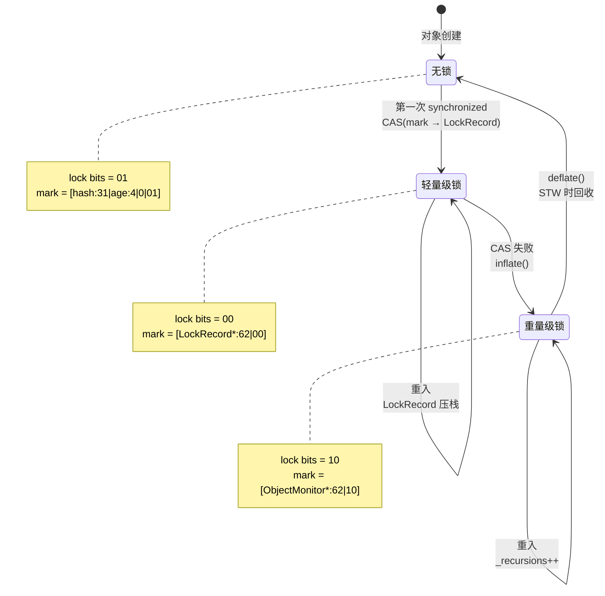
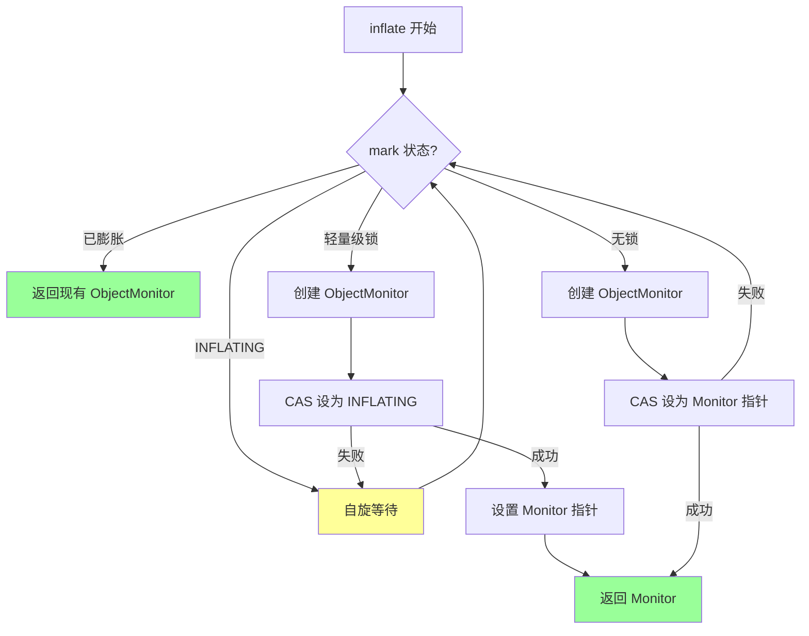
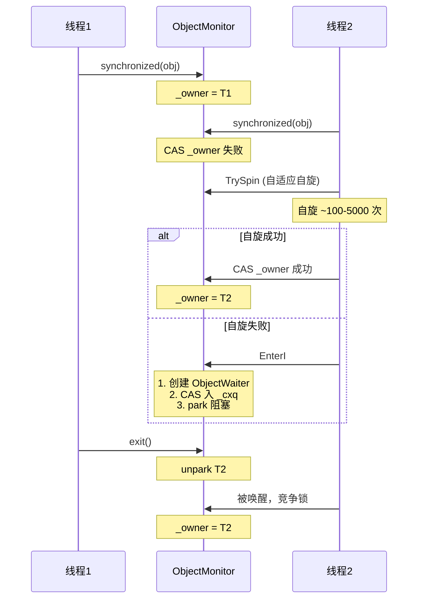

# synchronized 锁升级完整链路

> 基于 OpenJDK 11 slowdebug 源码
> 标准条件：-Xms8g -Xmx8g -XX:+UseG1GC

---

## 第 0 部分：核心原理 ⭐

### 0.1 本质是什么？

本文深入分析 **synchronized 锁升级完整链路**：从源码角度理解其设计原理、实现机制和关键细节。

### 0.2 为什么需要？

理解 JVM 内部实现是排查复杂问题、进行性能优化的基础。表面的 API 文档无法解释 JVM 的实际行为，只有深入源码才能建立精确的心智模型。

### 0.3 怎么解决？

结合源码阅读、数据结构分析和 GDB 运行时验证，从多个角度建立对该机制的完整理解。

### 0.4 为什么这样设计？

每个设计决策都有其权衡：性能 vs 正确性、简单性 vs 灵活性、内存占用 vs 查找速度。理解这些权衡是理解 JVM 设计的关键。

---


## 0. 核心原理

### 0.1 本质是什么？

锁升级是 JVM 根据竞争强度动态调整锁实现策略的机制：从无锁到轻量级锁（CAS）再到重量级锁（ObjectMonitor），在性能和正确性之间找到平衡。

### 0.2 为什么需要？

**问题**：不同场景的竞争强度差异巨大：
- **无竞争**（99% 情况）：单个线程反复获取同一把锁
- **轻微竞争**：两个线程交替执行，几乎不重叠
- **激烈竞争**：多个线程同时竞争，需要操作系统调度

**如果没有锁升级**：
- 所有锁都用重量级锁（ObjectMonitor + park）
- 每次加锁都需要系统调用，性能极差
- 无竞争场景浪费大量资源

### 0.3 怎么解决？

**三级锁升级策略**：

1. **无锁 → 轻量级锁**：在栈帧中创建 Lock Record，CAS 将 mark word 指向 Lock Record
2. **轻量级锁 → 重量级锁**：CAS 失败后膨胀为 ObjectMonitor，线程 park 阻塞
3. **降级**：重量级锁在 STW（safepoint）时可能降级为无锁

**关键设计**：
- 用 mark word 的低 2 位（lock bits）标识锁状态
- 按需分配 ObjectMonitor，避免内存浪费
- 轻量级锁失败快速膨胀，避免长时间自旋

### 0.4 为什么这样设计？

**为什么两级锁升级？**
- 轻量级锁处理"交替执行"场景，无需系统调用
- 重量级锁处理"真正竞争"场景，需要操作系统调度

**为什么不可降级（运行时）？**
- 降级需要遍历所有对象检查 mark word，开销巨大
- 运行时降级可能引发并发问题
- 只在 STW（safepoint）时由 VMThread 安全降级

**为什么轻量级锁失败就膨胀？**
- CAS 失败说明有真正竞争，继续自旋收益递减
- 快速膨胀让竞争线程阻塞，避免忙等浪费 CPU

---

## 一、宏观理解

### 1.1 锁状态总览



### 1.2 mark word 布局

**64-bit mark word（小端序）**：

```
┌─────────────────────────────────────────────────────────────────┐
│                       64-bit mark word                           │
├─────────────────────────────────────────────────────────────────┤
│                                                                 │
│  无锁状态（lock bits = 01）：                                     │
│  ┌──────────────────────┬────────┬─────┬──────┬────────────┐   │
│  │ unused:25            │hash:31 │cms:1│age:4 │biased:1|01 │   │
│  └──────────────────────┴────────┴─────┴──────┴────────────┘   │
│                                                                 │
│  轻量级锁（lock bits = 00）：                                     │
│  ┌──────────────────────────────────────────────┬────────────┐  │
│  │ ptr to Lock Record:62                        │    00      │  │
│  └──────────────────────────────────────────────┴────────────┘  │
│                                                                 │
│  重量级锁（lock bits = 10）：                                     │
│  ┌──────────────────────────────────────────────┬────────────┐  │
│  │ ptr to ObjectMonitor:62                      │    10      │  │
│  └──────────────────────────────────────────────┴────────────┘  │
│                                                                 │
│  膨胀中（lock bits = 00）：                                       │
│  ┌──────────────────────────────────────────────┬────────────┐  │
│  │ 0x0000000000000000（固定值）                  │    00      │  │
│  └──────────────────────────────────────────────┴────────────┘  │
│                                                                 │
└─────────────────────────────────────────────────────────────────┘
```

**关键 bit 位**：
- **lock bits (bit 0-1)**：锁状态标识
- **age bits (bit 4-7)**：对象年龄（GC 用）
- **hashcode bits (bit 8-38)**：哈希码（延迟计算）

### 1.3 升级触发条件

| 当前状态 | 触发事件 | 升级条件 | 目标状态 |
|---------|---------|---------|---------|
| 无锁 | monitorenter | 第一次 synchronized | 轻量级锁 |
| 轻量级锁 | monitorenter | CAS mark word 失败 | 重量级锁 |
| 轻量级锁 | monitorenter | 发现已是重量级锁 | 复用 ObjectMonitor |
| 重量级锁 | monitorenter | 重入 | 重量级锁（_recursions++）|

---

## 二、数据结构

### 2.1 BasicObjectLock — 解释器栈帧锁结构

**文件**：`src/hotspot/share/runtime/basicLock.hpp`

```cpp
class BasicObjectLock {
  BasicLock _lock;  // 保存 displaced header（原始 mark word）
  oop       _obj;   // 锁定的对象引用
};

class BasicLock {
  volatile markOop _displaced_header;  // 轻量级锁时保存原始 mark word
};
```

**内存布局**：
```
BasicObjectLock (16 字节)
┌────────────────────────────────────┐
│ _obj (oop, 8 bytes)                │  +0
├────────────────────────────────────┤
│ _lock._displaced_header (8 bytes)  │  +8
└────────────────────────────────────┘
```

**用途**：
- 解释器同步方法入口时在栈帧中分配
- 轻量级锁成功后，mark word 指向这个结构
- 方法返回时自动释放（从栈弹出）

### 2.2 ObjectMonitor — 重量级锁核心

**关键字段**：

```cpp
class ObjectMonitor {
  volatile markOop _header;      // 保存原始 mark word
  void* volatile   _owner;       // 当前持锁线程
  volatile int     _recursions;  // 重入次数
  
  ObjectWaiter* volatile _cxq;       // 竞争栈
  ObjectWaiter* volatile _EntryList; // 入口列表
  ObjectWaiter* volatile _WaitSet;   // wait 队列
};
```

**sizeof(ObjectMonitor)**：
- 在 64 位系统上约为 **192 字节**
- 包含大量 volatile 字段和指针

### 2.3 栈帧布局对比

**普通方法**：
```
┌─────────────────────────────┐
│    caller's frame          │
├─────────────────────────────┤
│    return address          │
│    saved rbp               │
│    fixed frame slots       │
├─────────────────────────────┤
│    expression stack        │
└─────────────────────────────┘
```

**同步方法**：
```
┌─────────────────────────────┐
│    caller's frame          │
├─────────────────────────────┤
│    return address          │
│    saved rbp               │
│    fixed frame slots       │
├═════════════════════════════┤ ← monitor_block_top
│    BasicObjectLock         │  ← 同步方法额外分配
│      _obj (8 bytes)        │
│      _lock (8 bytes)       │
├─────────────────────────────┤
│    expression stack        │
└─────────────────────────────┘
```

---

## 三、升级流程详解

### 3.1 无锁 → 轻量级锁

**触发**：第一次 synchronized 块进入

**文件**：`src/hotspot/share/runtime/synchronizer.cpp:fast_enter()`

```cpp
void ObjectSynchronizer::fast_enter(Handle obj, BasicLock* lock, bool attempt_rebias, TRAPS) {
  // 直接走轻量级锁路径
  slow_enter(obj, lock, THREAD);
}

void ObjectSynchronizer::slow_enter(oop obj, BasicLock* lock, TRAPS) {
  markOop mark = obj->mark();
  
  // === 1. 检查是否无锁 ===
  if (mark->is_neutral()) {
    // 无锁状态，尝试 CAS
    lock->set_displaced_header(mark);  // 保存原始 mark
    
    // CAS(mark → lock)
    if (obj->cas_set_mark(markOopDesc::encode(lock), mark) == mark) {
      // ✅ CAS 成功，轻量级锁获取成功
      return;
    }
    // ❌ CAS 失败，说明有竞争，走膨胀
  }
  
  // === 2. 检查是否轻量级锁重入 ===
  if (mark->has_locker() && THREAD->is_lock_owned((address)mark->locker())) {
    // 重入：在栈中再压入一个 Lock Record
    lock->set_displaced_header(NULL);
    return;
  }
  
  // === 3. 其他情况：膨胀为重量级锁 ===
  lock->set_displaced_header(markOopDesc::unused_mark());
  inflate(THREAD, obj, inflate_cause_monitor_enter)->enter(THREAD);
}
```

**关键步骤**：
1. 检查 mark word 是否无锁（lock bits = 01）
2. 在栈帧中分配 BasicObjectLock
3. CAS 将 mark word 替换为 Lock Record 指针
4. 成功 → lock bits = 00（轻量级锁）
5. 失败 → 膨胀为重量级锁

### 3.2 轻量级锁 → 重量级锁

**触发**：CAS mark word 失败（有竞争）

**文件**：`src/hotspot/share/runtime/synchronizer.cpp:inflate()`

```cpp
ObjectMonitor* ObjectSynchronizer::inflate(Thread* self, oop obj, const InflateCause cause) {
  for (;;) {
    markOop mark = obj->mark();
    
    // === Case 1: 已膨胀 ===
    if (mark->has_monitor()) {
      ObjectMonitor* monitor = mark->monitor();
      return monitor;
    }
    
    // === Case 2: 正在膨胀 ===
    if (mark == markOopDesc::INFLATING()) {
      // 自旋等待其他线程完成膨胀
      spin_wait();
      continue;
    }
    
    // === Case 3: 轻量级锁 → 膨胀 ===
    if (mark->has_locker()) {
      ObjectMonitor* m = new ObjectMonitor();
      m->_header = mark->displaced_header();  // 保存原始 mark
      m->_owner = mark->locker();  // 当前持锁线程
      
      // 先设为 INFLATING 占位
      if (obj->cas_set_mark(markOopDesc::INFLATING(), mark) == mark) {
        // CAS 成功，设置 ObjectMonitor 指针
        obj->set_mark(markOopDesc::encode(m));
        return m;
      }
      continue;
    }
    
    // === Case 4: 无锁 → 膨胀 ===
    ObjectMonitor* m = new ObjectMonitor();
    m->_header = mark;  // 保存原始 mark
    
    if (obj->cas_set_mark(markOopDesc::encode(m), mark) == mark) {
      return m;
    }
    // CAS 失败，重试
  }
}
```

**INFLATING 中间态**：
- 固定值 `0x0000000000000000`（lock bits = 00）
- 防止多线程同时膨胀同一对象
- 其他线程看到 INFLATING 就自旋等待

**膨胀流程**：



### 3.3 重量级锁竞争

**ObjectMonitor::enter() 流程**：

```cpp
void ObjectMonitor::enter(TRAPS) {
  Thread* const Self = THREAD;
  
  // === 1. CAS 快速路径 ===
  void* cur = Atomic::cmpxchg(&_owner, (void*)NULL, Self);
  if (cur == NULL) {
    return;  // 成功获取锁
  }
  
  // === 2. 递归检测 ===
  if (cur == Self) {
    _recursions++;
    return;
  }
  
  // === 3. 自适应自旋 ===
  if (TrySpin(Self) > 0) {
    return;  // 自旋成功
  }
  
  // === 4. EnterI 慢速路径 ===
  EnterI(THREAD);
}
```

**详细流程**：



### 3.4 重量级锁降级

**触发**：STW（safepoint）时由 VMThread 执行

**文件**：`src/hotspot/share/runtime/synchronizer.cpp:deflate_idle_monitors()`

```cpp
void ObjectSynchronizer::deflate_idle_monitors() {
  // 只在 safepoint 时执行
  assert(SafepointSynchronize::is_at_safepoint(), "must be at safepoint");
  
  // 遍历全局 Monitor 列表
  for (ObjectMonitor* m = gMonitorList; m != NULL; ) {
    ObjectMonitor* next = m->next();
    
    // 检查是否可以降级
    if (m->is_busy()) {
      // 有线程在等待或持锁，不能降级
      m = next;
      continue;
    }
    
    // 降级：恢复 mark word
    oop obj = (oop)m->object();
    obj->set_mark(m->header());  // 恢复原始 mark
    
    // 回收 ObjectMonitor
    delete m;
    m = next;
  }
}
```

**降级条件**：
- `_owner == NULL`（无线程持锁）
- `_cxq == NULL && _EntryList == NULL`（无竞争线程）
- `_WaitSet == NULL`（无等待线程）

---

## 四、性能对比

### 4.1 不同锁状态的开销

| 锁状态 | 获取操作 | 大约周期 | 是否需要系统调用 |
|--------|---------|---------|----------------|
| 无锁→轻量级锁 | 1 次 CAS | ~10 cycles | ❌ 否 |
| 轻量级锁重入 | 栈指针判断 | ~2 cycles | ❌ 否 |
| 轻量级→重量级 | 膨胀 + CAS | ~100 cycles | ❌ 否 |
| 重量级锁无竞争 | CAS _owner | ~10 cycles | ❌ 否 |
| 重量级锁有竞争（自旋）| 循环检查 | ~100-5000 cycles | ❌ 否 |
| 重量级锁有竞争（阻塞）| park/unpark | ~10000+ cycles | ✅ 是 |

### 4.2 自适应自旋参数

```cpp
// 全局参数（globals.hpp）
define_pd_global(intx, PreSpinYield,  10);   // 自旋前 yield 次数
define_pd_global(intx, PostSpinYield, 10);   // 自旋后 yield 次数

// objectMonitor.cpp 中的参数
Knob_SpinLimit  = 5000;  // 最大自旋次数
Knob_BonusB     = 100;   // 成功奖励
Knob_Penalty    = 200;   // 失败惩罚
```

**自适应算法**：
```
成功获取锁 → _SpinDuration = min(_SpinDuration + 100, 5000)
失败 → _SpinDuration = max(_SpinDuration - 200, 0)
```

### 4.3 ObjectMonitor 分配开销

- **首次膨胀**：`new ObjectMonitor()`，约 ~192 字节
- **全局列表**：所有 Monitor 链接到全局列表（方便遍历降级）
- **内存压力**：大量竞争对象会占用大量 Monitor

---

## 五、GDB 验证

### 5.1 验证锁状态转换

```bash
# GDB 脚本
cat > verify_lock_state.gdb << 'EOF'
set pagination off

# 断点：轻量级锁 CAS
break synchronizer.cpp:216 if mark->is_neutral()
commands
  printf "=== Lightweight lock CAS ===\n"
  printf "Object: %p\n", $rdi
  printf "Mark: 0x%lx\n", *(uint64_t*)$rdi
  printf "Lock bits: %d\n", *(uint64_t*)$rdi & 0x3
  continue
end

# 断点：膨胀
break ObjectSynchronizer::inflate
commands
  printf "=== Inflate to heavyweight ===\n"
  printf "Object: %p\n", $rdi
  continue
end

# 断点：ObjectMonitor::enter
break ObjectMonitor::enter
commands
  printf "=== ObjectMonitor::enter ===\n"
  printf "_owner: %p, _recursions: %d\n", $_owner, $_recursions
  continue
end

run -cp /data/workspace/demo/src com.wjcoder.LockStateTest
EOF
```

### 5.2 验证 mark word 变化

```bash
# GDB 脚本
cat > verify_mark_word.gdb << 'EOF'
set pagination off

# 断点：monitorenter
break InterpreterRuntime::monitorenter
commands
  printf "=== Before monitorenter ===\n"
  printf "Object: %p\n", $rdi
  printf "Mark: 0x%lx\n", *(uint64_t*)$rdi
  continue
end

# 断点：monitorexit
break InterpreterRuntime::monitorexit
commands
  printf "=== After monitorexit ===\n"
  printf "Object: %p\n", $rdi
  printf "Mark: 0x%lx\n", *(uint64_t*)$rdi
  continue
end

run -cp /data/workspace/demo/src com.wjcoder.MarkWordTest
EOF
```

### 5.3 验证降级过程

```bash
# GDB 脚本
cat > verify_deflate.gdb << 'EOF'
set pagination off

# 断点：deflate_idle_monitors
break ObjectSynchronizer::deflate_idle_monitors
commands
  printf "=== Deflate idle monitors ===\n"
  continue
end

# 断点：ObjectMonitor 析构
break ObjectMonitor::~ObjectMonitor
commands
  printf "=== ObjectMonitor destroyed ===\n"
  printf "Address: %p\n", $rdi
  continue
end

run -cp /data/workspace/demo/src com.wjcoder.DeflateTest
EOF
```

---

## 六、常见问题

### 6.1 为什么锁升级后不能降级（运行时）？

**原因**：
1. **遍历开销**：需要扫描堆中所有对象检查 mark word
2. **并发问题**：降级过程中可能有新线程获取锁
3. **性能收益低**：真正需要降级的场景很少

**只在 STW 降级**：
- safepoint 时所有应用线程暂停，安全操作
- VMThread 单线程执行，无并发问题
- 可以批量回收空闲 Monitor

### 6.2 如何判断应该用什么锁？

**判断依据**：
- **单线程访问**：轻量级锁（几乎零开销）
- **交替执行**：轻量级锁（CAS 即可）
- **轻度竞争**：轻量级锁 + 自旋（避免阻塞）
- **激烈竞争**：重量级锁（必须阻塞）

**JVM 参数调优**：
```bash
# 调整自旋参数
-XX:PreSpinYield=10
-XX:PostSpinYield=10
```

---

## 七、总结

### 锁状态对比

| 锁状态 | lock bits | mark word 内容 | 性能 | 适用场景 |
|--------|----------|---------------|------|---------|
| 无锁 | 01 | hashcode + age | 最高 | 单线程或无竞争 |
| 轻量级锁 | 00 | Lock Record 指针 | 高 | 交替执行 |
| 重量级锁 | 10 | ObjectMonitor 指针 | 低 | 激烈竞争 |

### 关键设计决策

1. **按需膨胀**：无竞争时不分配 ObjectMonitor
2. **快速失败**：轻量级锁失败立即膨胀，不自旋
3. **自适应自旋**：重量级锁竞争时智能自旋
4. **STW 降级**：只在 safepoint 安全降级

### 性能启示

1. **99% 场景轻量级锁足够**：无需担心 synchronized 性能
2. **真正竞争时重量级锁合理**：避免 CPU 空转
3. **JIT 优化更重要**：逃逸分析 + 锁消除能消除大量锁
4. **避免过度优化**：JVM 已经做了足够多的优化
