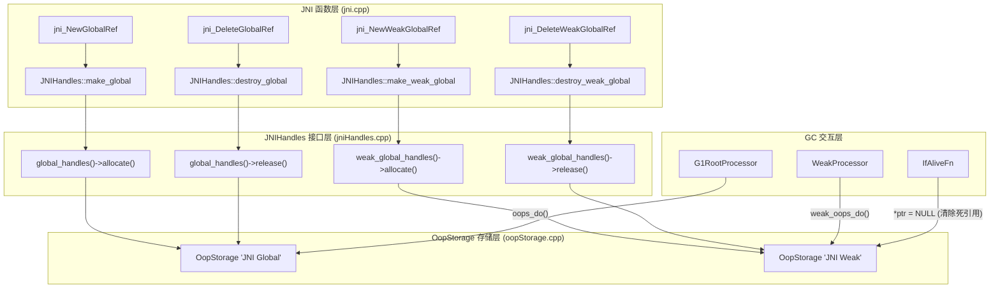
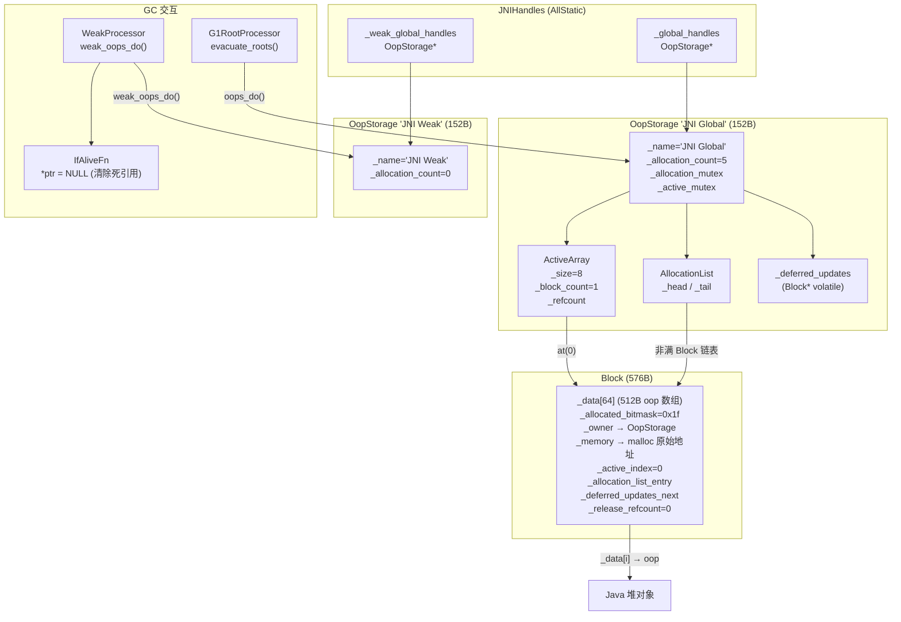

# Day 39：JNI Global/Weak Reference 管理机制深度剖析

> 纯源码分析，基于 OpenJDK 11 slowdebug
> 方法论：程序 = 数据结构 + 算法

---

## 第 0 部分：核心原理 ⭐

### 0.1 本质是什么？

本文深入分析 **Day 39：JNI Global/Weak Reference 管理机制深度剖析**：从源码角度理解其设计原理、实现机制和关键细节。

### 0.2 为什么需要？

理解 JVM 内部实现是排查复杂问题、进行性能优化的基础。表面的 API 文档无法解释 JVM 的实际行为，只有深入源码才能建立精确的心智模型。

### 0.3 怎么解决？

结合源码阅读、数据结构分析和 GDB 运行时验证，从多个角度建立对该机制的完整理解。

### 0.4 为什么这样设计？

每个设计决策都有其权衡：性能 vs 正确性、简单性 vs 灵活性、内存占用 vs 查找速度。理解这些权衡是理解 JVM 设计的关键。

---


## 一、宏观理解

### 1.1 解决什么问题

**核心问题：Native 代码（C/C++）如何安全地持有 Java 对象引用？**

Java 堆中的对象会被 GC 移动（如 G1 的 Evacuation），如果 Native 代码直接保存对象指针，GC 移动对象后指针就变成了悬挂指针。JNI Handle 机制通过**间接引用**解决这个问题：

```
Native 代码持有 jobject（指向 OopStorage 中的 oop*）
                    ↓
OopStorage 中的 oop* 存储实际对象地址（GC 会更新这里）
                    ↓
Java 堆中的对象（GC 可能移动）
```

JNI 定义了三种引用：

| 引用类型 | 生命周期 | GC 语义 | 存储位置 | 典型用途 |
|---------|---------|---------|---------|---------|
| **Local Ref** | 单次 JNI 调用内 | 强引用 | JNIHandleBlock（线程私有） | 临时使用 Java 对象 |
| **Global Ref** | 显式创建/删除 | 强引用（阻止 GC 回收） | OopStorage "JNI Global" | 缓存类引用、全局回调 |
| **Weak Global Ref** | 显式创建/删除 | 弱引用（不阻止 GC 回收） | OopStorage "JNI Weak" | 缓存可清除的引用 |

本文聚焦 **Global Ref 和 Weak Global Ref** 的管理机制——它们都构建在 **OopStorage** 这一基础设施之上。

### 1.2 总体架构（Mermaid 图）



### 1.3 涉及的数据结构清单

| # | 数据结构 | sizeof (GDB验证) | 核心职责 |
|---|---------|----------|---------|
| 1 | **OopStorage** | 152 bytes | 堆外 oop 引用的存储引擎，管理 Block 数组 |
| 2 | **OopStorage::Block** | 576 bytes | 固定大小 oop 数组（64 个 oop）+ 位掩码管理 |
| 3 | **OopStorage::ActiveArray** | 24 bytes + Block*[] | Block 指针数组，引用计数管理 |
| 4 | **OopStorage::AllocationList** | 16 bytes | 非满 Block 的双向链表，用于快速分配 |
| 5 | **OopStorage::AllocationListEntry** | 16 bytes | Block 在链表中的链接节点 |
| 6 | **JNIHandles** | 1 byte (AllStatic) | 全静态门面类，持有 2 个 OopStorage* |
| 7 | **JNIHandleBlock** | 328 bytes | Local Ref 管理（32 oop 槽位链表块） |
| 8 | **SingleWriterSynchronizer** | RCU 风格同步原语 | ActiveArray 替换时的无锁读保护 |

---

## 二、数据结构全景 ⭐

### 2.1 OopStorage（堆外 oop 引用存储引擎）

**源码位置**：`gc/shared/oopStorage.hpp:75-257`, `gc/shared/oopStorage.cpp`

**解决什么问题**：JDK 11 引入的统一堆外引用管理基础设施。在此之前，JNI Global Ref 用数组管理，JNI Weak Ref 用另一种方式——代码分散、GC 遍历接口不统一。OopStorage 提供统一的 allocate/release/iterate 接口，支持：
- 无锁 release（lock-free）
- GC 并行迭代
- 空块自动回收

**全部字段**：

```
OopStorage (sizeof = 152 bytes)
偏移      字段                        大小    说明
──────────────────────────────────────────────────
0x000    [vtable_ptr]               8      CHeapObj 虚表（实际不用）
0x008    _name                      8      名称字符串指针（如 "JNI Global"）
0x010    _active_array              8      ActiveArray* — 所有 Block 的数组
0x018    _allocation_list           16     AllocationList — 非满 Block 的双向链表
0x028    _deferred_updates          8      Block* volatile — 延迟更新链表头
0x030    _allocation_mutex          8      Mutex* — 分配操作的互斥锁
0x038    _active_mutex              8      Mutex* — ActiveArray 操作的互斥锁
0x040    _allocation_count          8      volatile size_t — 已分配条目总数
0x048    _protect_active            ?      SingleWriterSynchronizer — RCU 保护
         _concurrent_iteration_active 1     bool — 是否有并发 GC 迭代进行中
──────────────────────────────────────────────────
                                   = 152 bytes (含 padding)
```

**关键字段生命周期**：

| 字段 | 创建时 | 运行时变化 | 谁读/谁写 |
|------|-------|-----------|----------|
| `_active_array` | 构造函数中 `ActiveArray::create(8)` | 扩容时 `replace_active_array()` | allocate() 写 / iterate() 读 |
| `_allocation_list` | 空链表 | allocate 加 Block / release 触发 deferred update | allocate() 读写（持锁） |
| `_deferred_updates` | NULL | release() 无锁 push Block / allocate() 消费 | release() 写（CAS）/ allocate() 读写 |
| `_allocation_count` | 0 | allocate +1 / release -1（Atomic） | 统计查询 |
| `_concurrent_iteration_active` | false | ParState 构造 → true / 析构 → false | delete_empty_blocks 检查 |

**创建位置**：

```cpp
// jniHandles.cpp:203-210
void JNIHandles::initialize() {
    _global_handles = new OopStorage("JNI Global",
                                     JNIGlobalAlloc_lock,
                                     JNIGlobalActive_lock);
    _weak_global_handles = new OopStorage("JNI Weak",
                                          JNIWeakAlloc_lock,
                                          JNIWeakActive_lock);
}
```

在 `init_globals()` → `jni_handles_init()` 中调用，在 VM 初始化早期执行。

### 2.2 OopStorage::Block（核心存储单元）

**源码位置**：`gc/shared/oopStorage.inline.hpp:128-194`, `gc/shared/oopStorage.cpp:194-364`

**解决什么问题**：提供固定大小的 oop 存储单元。每个 Block 能存 **BitsPerWord = 64 个 oop**（LP64），使用 64 位位掩码跟踪每个槽位的分配状态，支持 CAS 无锁操作。

**全部字段**：

```
OopStorage::Block (sizeof = 576 bytes)
偏移      字段                        大小    说明
──────────────────────────────────────────────────
0x000    _data[64]                  512    oop 数组（64 × 8 = 512 bytes）— 必须在最前面
0x200    _allocated_bitmask         8      volatile uintx — 分配位掩码（1=已分配）
0x208    _owner                     8      const OopStorage* — 所属 OopStorage
0x210    _memory                    8      void* — 原始 malloc 地址（用于 free）
0x218    _active_index              8      size_t — 在 ActiveArray 中的索引
0x220    _allocation_list_entry     16     AllocationListEntry — 链表节点
0x230    _deferred_updates_next     8      Block* volatile — 延迟更新链表
0x238    _release_refcount          8      volatile uintx — release 操作引用计数
──────────────────────────────────────────────────
                                   = 576 bytes
```

**关键设计**：

1. **`_data` 必须是第一个字段**（`_data_pos = 0`）：这样对齐 Block 就等于对齐 `_data`，简化 `block_for_ptr()` 的地址计算。

2. **`_allocated_bitmask` 的位掩码编码**：

```
位掩码 (64 bit):
bit 0  → _data[0] 的分配状态
bit 1  → _data[1] 的分配状态
...
bit 63 → _data[63] 的分配状态

1 = 已分配（正在使用）
0 = 未分配（空闲）

示例：分配了 5 个条目
bitmask = 0x000000000000001f = 0b...0_0001_1111
           低 5 位为 1，表示 _data[0..4] 已分配
```

**GDB 验证**（标准条件：-Xms8g -Xmx8g -XX:+UseG1GC）：

```
Block 地址: 0x7ffff0db4d40
_allocated_bitmask = 0x1f          ← 5 个 global ref, 低 5 位为 1 ✓
_data[0] = 0x749000960             ← 非空 oop ✓
_data[5] = (nil)                   ← 第 6 个未分配 ✓
_memory = 0x7ffff0db4d30           ← 与 Block 差 16 字节(对齐填充)
_active_index = 0
_release_refcount = 0
```

3. **`_release_refcount`**：防止 Block 在 release 操作进行中被删除。release 操作开始时 +1，完成后 -1。`is_deletable()` 要求该值为 0。

4. **`_deferred_updates_next`**：延迟更新链表。当 release 导致 Block 状态变化（从满→非满，或从非空→空）时，不直接修改 `_allocation_list`（需要锁），而是将 Block 推入延迟更新链表。

**Block 分配时的对齐**：

```cpp
// oopStorage.cpp:202-204
const unsigned section_size = BitsPerByte;       // 8
const unsigned section_count = BytesPerWord;     // 8
const unsigned block_alignment = sizeof(oop) * section_size;  // 8 × 8 = 64
```

Block 按 64 字节对齐。这使得从任意 `oop*` 通过地址对齐就能找到所属 Block。

### 2.3 OopStorage::ActiveArray（Block 指针数组）

**源码位置**：`gc/shared/oopStorage.inline.hpp:40-84`, `gc/shared/oopStorage.cpp:110-192`

**解决什么问题**：维护所有活动 Block 的紧凑数组，支持按索引随机访问和引用计数的无锁替换。

**全部字段**：

```
OopStorage::ActiveArray (sizeof = 24 bytes + Block*[_size])
偏移      字段                    大小    说明
──────────────────────────────────────────────
0x000    _size                   8      数组容量（Block* 槽位数）
0x008    _block_count            8      volatile — 实际 Block 数量
0x010    _refcount               4      volatile int — 引用计数
0x014    [padding]               4      对齐填充
0x018    _blocks[0.._size-1]     8*n    Block* 指针数组（紧接在对象后面）
──────────────────────────────────────────────
```

**关键设计**：

- **引用计数**：ActiveArray 扩容时创建新数组，旧数组通过引用计数延迟释放。`obtain_active_array()` 增加计数，`relinquish_block_array()` 减少计数，减到 0 时销毁。
- **初始大小 = 8**：`initial_active_array_size = 8`。当 Block 数量超过容量时，调用 `expand_active_array()` 扩大为 2 倍。
- **`push()` 使用 `release_store`**：保证新 Block 在增加 `_block_count` 之前完全初始化，这对并发 GC 迭代至关重要。
- **`remove()` 使用交换删除**：将最后一个 Block 移到被删除位置，保持数组紧凑。

```cpp
// oopStorage.cpp:169-178 — ActiveArray::remove
void OopStorage::ActiveArray::remove(Block* block) {
    size_t index = block->active_index();
    size_t last_index = _block_count - 1;
    Block* last_block = *block_ptr(last_index);
    last_block->set_active_index(index);     // ★ 更新被移动 Block 的索引
    *block_ptr(index) = last_block;          // ★ 交换到被删除位置
    _block_count = last_index;               // ★ 数量 -1
}
```

### 2.4 OopStorage::AllocationList（非满 Block 双向链表）

**源码位置**：`gc/shared/oopStorage.hpp:179-205`, `gc/shared/oopStorage.cpp:54-108`

**解决什么问题**：`allocate()` 需要快速找到有空闲槽位的 Block。AllocationList 维护所有非满 Block 的双向链表：
- **头部**：优先从头部分配（非空 Block 优先，让空 Block 留在尾部便于回收）
- **尾部**：空 Block 被移到尾部，方便 `delete_empty_blocks` 从尾部开始删除

**全部字段**：

```
AllocationList (sizeof = 16 bytes)
偏移      字段       大小    说明
────────────────────────────
0x000    _head      8      const Block* — 链表头
0x008    _tail      8      const Block* — 链表尾
────────────────────────────
```

操作：`push_front()`, `push_back()`, `unlink()`。通过 Block 内嵌的 `AllocationListEntry` 链接。

### 2.5 JNIHandles（全静态门面类）

**源码位置**：`runtime/jniHandles.hpp:35-126`

**解决什么问题**：提供统一的 JNI Handle 管理接口，隐藏底层 OopStorage 和 JNIHandleBlock 的实现细节。

**全部字段**（全是 static）：

```
JNIHandles (AllStatic, sizeof = 1)
──────────────────────────────────────────────
static _global_handles      OopStorage*    "JNI Global" 存储
static _weak_global_handles OopStorage*    "JNI Weak" 存储
──────────────────────────────────────────────
```

**weak_tag 编码**：

```
jobject (Global Ref):
  直接 reinterpret_cast<jobject>(oop_ptr)
  低位为 0（因为 oop* 至少 8 字节对齐）

jweak (Weak Global Ref):
  reinterpret_cast<jobject>((char*)oop_ptr + 1)
  低位为 1

判断方法：is_jweak(handle) = (handle & 1) != 0
还原方法：jweak_ptr(handle) = (oop*)((char*)handle - 1)
```

这个设计利用了 `oop*` 指针至少 2 字节对齐的特性，在指针低位编码类型信息，O(1) 区分 jobject 和 jweak，无需查表。

### 2.6 JNIHandleBlock（Local Ref 管理）

> 在 Day 38 已详细分析，此处给出关键回顾。

**源码位置**：`runtime/jniHandles.hpp:132-205`, `runtime/jniHandles.cpp:346-593`

**sizeof** = 328 bytes。32 个 oop 槽位的链表块。分配策略：先 `_last` 块 bump-pointer → 再 `_free_list` → 再追加新块。线程私有（`Thread::_active_handles`），不需要全局锁。

### 2.7 SingleWriterSynchronizer（RCU 风格同步）

**源码位置**：`utilities/singleWriterSynchronizer.hpp`

**解决什么问题**：ActiveArray 替换时，需要保证正在读旧数组的线程安全完成。这是一个 RCU（Read-Copy-Update）风格的同步原语：
- **读者**（`enter()`/`exit()`）：原子递增计数器，不阻塞
- **写者**（`synchronize()`）：等待所有当前读者退出

OopStorage 的 `obtain_active_array()` 在 CriticalSection 内增加引用计数，`replace_active_array()` 调用 `synchronize()` 等待所有旧引用完成。

### 2.8 WeakProcessor（GC 弱引用处理入口）

**源码位置**：`gc/shared/weakProcessor.cpp:36-41`

**解决什么问题**：统一所有弱 OopStorage 的 GC 处理入口。

```cpp
// weakProcessor.cpp:36-41
void WeakProcessor::weak_oops_do(BoolObjectClosure* is_alive, OopClosure* keep_alive) {
    JNIHandles::weak_oops_do(is_alive, keep_alive);  // ★ JNI 弱全局引用
    JvmtiExport::weak_oops_do(is_alive, keep_alive);
    SystemDictionary::vm_weak_oop_storage()->weak_oops_do(is_alive, keep_alive);
    JFR_ONLY(Jfr::weak_oops_do(is_alive, keep_alive);)
}
```

---

## 三、算法/流程分析

### 3.1 算法一：Global Ref 的创建（make_global）

**解决什么问题**：Native 代码需要一个跨 JNI 调用持续有效的强引用。

**核心思路**：从 OopStorage "JNI Global" 中分配一个 oop 槽位，存入对象指针，返回槽位地址作为 jobject。

**JNI 入口 → JNIHandles → OopStorage 的完整调用链**：

```cpp
// jni.cpp:790-800 — JNI 函数入口
JNI_ENTRY(jobject, jni_NewGlobalRef(JNIEnv *env, jobject ref))
  Handle ref_handle(thread, JNIHandles::resolve(ref)); // ★ 先解析输入的 jobject 为 oop
  jobject ret = JNIHandles::make_global(ref_handle);   // ★ 创建全局引用
  return ret;
JNI_END
```

```cpp
// jniHandles.cpp:101-122 — JNIHandles::make_global
jobject JNIHandles::make_global(Handle obj, AllocFailType alloc_failmode) {
    assert(!Universe::heap()->is_gc_active(), "can't extend the root set during GC");
    // ★ GC 期间不允许创建新的 global ref（因为会改变 GC 根集合）
    jobject res = NULL;
    if (!obj.is_null()) {
        oop *ptr = global_handles()->allocate();  // ★ 从 OopStorage 分配一个 oop 槽位
        if (ptr != NULL) {
            NativeAccess<>::oop_store(ptr, obj()); // ★ 将 oop 写入槽位（带 GC 屏障）
            res = reinterpret_cast<jobject>(ptr);  // ★ 直接把 oop* 转为 jobject
        } else {
            report_handle_allocation_failure(alloc_failmode, "global");
        }
    }
    return res;
}
```

**OopStorage::allocate() 的详细流程**：

```cpp
// oopStorage.cpp:410-477
oop* OopStorage::allocate() {
    MutexLockerEx ml(_allocation_mutex, Mutex::_no_safepoint_check_flag);
    // ★ 步骤 1：处理延迟更新（可能使空 Block 重新可用）
    while (reduce_deferred_updates() && (_allocation_list.head() == NULL)) {}

    // ★ 步骤 2：从 _allocation_list 头部取 Block
    Block* block = _allocation_list.head();
    if (block == NULL) {
        // ★ 步骤 3：没有可用 Block，创建新的
        {
            MutexUnlockerEx mul(_allocation_mutex, ...); // 释放锁再 malloc
            block = Block::new_block(this);
        }
        // ★ 步骤 4：添加到 _active_array（可能需要扩容）
        if (!_active_array->push(block)) {
            if (expand_active_array()) {
                guarantee(_active_array->push(block), "push failed after expansion");
            }
        }
        _allocation_list.push_back(*block); // 新块加到链表尾部
        block = _allocation_list.head();
    }

    // ★ 步骤 5：从 Block 中分配一个 oop 条目
    oop* result = block->allocate(); // 内部使用 CAS 更新 bitmask
    Atomic::inc(&_allocation_count);

    // ★ 步骤 6：如果 Block 满了，从链表移除
    if (block->is_full()) {
        _allocation_list.unlink(*block);
    }
    return result;
}
```

**Block::allocate() — CAS 无锁分配**：

```cpp
// oopStorage.cpp:301-314
oop* OopStorage::Block::allocate() {
    uintx allocated = allocated_bitmask();
    while (true) {
        unsigned index = count_trailing_zeros(~allocated);    // ★ 找到第一个 0 位（空闲槽位）
        uintx new_value = allocated | bitmask_for_index(index); // ★ 将该位设为 1
        uintx fetched = Atomic::cmpxchg(new_value, &_allocated_bitmask, allocated);
        if (fetched == allocated) {
            return get_pointer(index);  // ★ CAS 成功，返回 oop*
        }
        allocated = fetched;            // ★ CAS 失败（被 release 修改），重试
    }
}
```

**设计决策**：
- **为什么 allocate 持锁但 Block::allocate 用 CAS？** allocate() 持 `_allocation_mutex` 保护链表操作，但 Block 内部的 bitmask 可能被并发的 release()（无锁）修改，所以必须用 CAS。
- **为什么先处理 deferred updates？** release() 不持锁，状态变化通过 deferred list 传递。allocate() 持锁时顺便消费这些更新，可能让空闲 Block 重新进入链表，避免不必要的新 Block 创建。

### 3.2 算法二：Global Ref 的释放（destroy_global）& release 的 lock-free 设计

**解决什么问题**：Native 代码不再需要 global ref 时必须显式释放，否则 Java 对象永远无法被 GC。

**核心思路**：先清空 oop 值（断开强引用），再通过 OopStorage::release() 无锁释放槽位。

```cpp
// jniHandles.cpp:168-175
void JNIHandles::destroy_global(jobject handle) {
    if (handle != NULL) {
        assert(!is_jweak(handle), "wrong method for destroying jweak");
        oop *oop_ptr = jobject_ptr(handle);
        NativeAccess<>::oop_store(oop_ptr, (oop) NULL);  // ★ 先置 NULL（断开引用）
        global_handles()->release(oop_ptr);               // ★ 再释放槽位
    }
}
```

**OopStorage::release() — 完全 lock-free**：

```cpp
// oopStorage.cpp:675-681
void OopStorage::release(const oop* ptr) {
    check_release_entry(ptr);              // ★ assert: *ptr == NULL（必须先清空）
    Block* block = find_block_or_null(ptr); // ★ 通过地址对齐找到所属 Block
    block->release_entries(block->bitmask_for_entry(ptr), &_deferred_updates);
    Atomic::dec(&_allocation_count);
}
```

**find_block_or_null — 无锁地址查找**：

```cpp
// oopStorage.cpp:340-364
Block* OopStorage::Block::block_for_ptr(const OopStorage* owner, const oop* ptr) {
    // ★ Block 按 64 字节对齐，_data 在 offset 0
    // ★ 从 ptr 所在的 section 向前扫描，找到 _owner 匹配的 Block
    oop* section_start = align_down(const_cast<oop*>(ptr), block_alignment);
    oop* section = section_start - (section_size * (section_count - 1));
    intptr_t owner_addr = reinterpret_cast<intptr_t>(owner);
    for (unsigned i = 0; i < section_count; ++i, section += section_size) {
        Block* candidate = reinterpret_cast<Block*>(section);
        if (SafeFetchN(&candidate->_owner, 0) == owner_addr) {
            return candidate;  // ★ 找到 owner 匹配的 Block
        }
    }
    return NULL;
}
```

**Block::release_entries — 延迟更新的精妙设计**：

```cpp
// oopStorage.cpp:575-621
void OopStorage::Block::release_entries(uintx releasing, Block* volatile* deferred_list) {
    Atomic::inc(&_release_refcount);  // ★ 防止此刻被删除

    // ★ CAS 更新 bitmask（清除对应位）
    uintx old_allocated = _allocated_bitmask;
    while (true) {
        uintx new_value = old_allocated ^ releasing;
        uintx fetched = Atomic::cmpxchg(new_value, &_allocated_bitmask, old_allocated);
        if (fetched == old_allocated) break;
        old_allocated = fetched;
    }

    // ★ 如果状态发生了重要变化（满→非满 或 非空→空），需要更新链表
    if ((releasing == old_allocated) || is_full_bitmask(old_allocated)) {
        // ★ 不直接修改链表（需要锁），而是推入 deferred updates 链表
        if (Atomic::replace_if_null(this, &_deferred_updates_next)) {
            // ★ 成功获得推入权，CAS push 到 deferred_list
            Block* head = *deferred_list;
            while (true) {
                _deferred_updates_next = (head == NULL) ? this : head; // 自循环作为结束标记
                Block* fetched = Atomic::cmpxchg(this, deferred_list, head);
                if (fetched == head) break;
                head = fetched;
            }
        }
        // ★ 如果 CAS 失败，说明已有其他 release 操作推入了 deferred update
        // ★ 那个 deferred update 处理时会看到最新的 bitmask，包含我们的修改
    }

    Atomic::dec(&_release_refcount);  // ★ 释放删除保护
}
```

**设计决策**：
- **为什么 release 是 lock-free？** release 在 JNI DeleteGlobalRef 路径上，可能在任意线程调用。如果 release 也要持 `_allocation_mutex`，会与 allocate 产生竞争。lock-free 设计让 release 只做两件事：CAS 更新 bitmask + CAS push deferred update。
- **为什么用 deferred updates？** 链表修改需要锁，但 release 不持锁。解决方案：release 把"链表需要更新"这个事实记录到无锁的 deferred list，让持锁的 allocate() 来消费。
- **`_release_refcount` 的作用？** 防止 race condition：release 正在更新 bitmask 期间，另一个线程看到空 Block 尝试删除它。refcount > 0 时 `is_deletable()` 返回 false。

### 3.3 算法三：Weak Global Ref 的创建与 GC 清除

**解决什么问题**：Native 代码需要一个可被 GC 清除的弱引用——对象被 GC 回收后，弱引用自动变为 NULL。

#### 3.3.1 Weak Global Ref 的创建

```cpp
// jniHandles.cpp:125-146
jobject JNIHandles::make_weak_global(Handle obj, AllocFailType alloc_failmode) {
    jobject res = NULL;
    if (!obj.is_null()) {
        oop *ptr = weak_global_handles()->allocate(); // ★ 从 "JNI Weak" OopStorage 分配
        if (ptr != NULL) {
            // ★ 使用 ON_PHANTOM_OOP_REF 语义写入（弱引用语义）
            NativeAccess<ON_PHANTOM_OOP_REF>::oop_store(ptr, obj());
            // ★ 关键：指针加 1 得到 jweak（低位标记为弱引用）
            char *tptr = reinterpret_cast<char *>(ptr) + weak_tag_value;
            res = reinterpret_cast<jobject>(tptr);
        }
    }
    return res;
}
```

与 make_global 的差异：
1. 使用 `weak_global_handles()`（不同的 OopStorage 实例）
2. oop_store 带 `ON_PHANTOM_OOP_REF` 装饰器
3. 返回的 jobject 低位加 1（weak tag）

#### 3.3.2 Weak Global Ref 的解析

```cpp
// jniHandles.inline.hpp:52-66
template <DecoratorSet decorators, bool external_guard>
inline oop JNIHandles::resolve_impl(jobject handle) {
    oop result;
    if (is_jweak(handle)) {       // ★ 检查低位标记
        // ★ 弱引用使用 PHANTOM 语义加载
        result = NativeAccess<ON_PHANTOM_OOP_REF|decorators>::oop_load(jweak_ptr(handle));
    } else {
        result = NativeAccess<decorators>::oop_load(jobject_ptr(handle));
    }
    return result;
}
```

**设计决策**：
- **为什么用 `ON_PHANTOM_OOP_REF`？** 这是 Access API 的装饰器，告诉 GC 这是一个弱/phantom 引用语义的访问。在不同 GC 实现中有不同行为——例如 ZGC 中 phantom 引用有特殊的 barrier 处理。
- **`resolve_no_keepalive` vs `resolve`**：`resolve` 会通过正常 barrier 保持对象活跃；`resolve_no_keepalive` 使用 `AS_NO_KEEPALIVE` 装饰器，只是偷看值但不保证对象不被回收（用于 `IsSameObject` 等比较操作）。

#### 3.3.3 GC 如何清除死弱引用

在 G1 GC 的多个阶段，通过 `WeakProcessor::weak_oops_do` 统一处理：

**Young/Mixed GC 期间**（`g1CollectedHeap.cpp:4843-4853`）：

```cpp
G1STWIsAliveClosure is_alive(this);
G1KeepAliveClosure keep_alive(this);
WeakProcessor::weak_oops_do(&is_alive, &keep_alive);
```

**并发标记结束后**（`g1ConcurrentMark.cpp:1765-1768`）：

```cpp
WeakProcessor::weak_oops_do(&g1_is_alive, &do_nothing_cl);
// ★ do_nothing_cl: 只清除死引用，不做保活（标记阶段不移动对象）
```

**Full GC Phase 1 后**（`g1FullCollector.cpp:215-219`）：

```cpp
WeakProcessor::weak_oops_do(&_is_alive, &do_nothing_cl);
```

**底层清除逻辑**（`oopStorage.inline.hpp:248-264`）：

```cpp
// OopStorage::IfAliveFn::operator()
bool operator()(oop* ptr) const {
    oop v = *ptr;
    if (v != NULL) {
        if (_is_alive->do_object_b(v)) {
            result = _f(ptr);     // ★ 存活 → 调用 keep_alive 闭包
        } else {
            *ptr = NULL;          // ★★★ 已死 → 直接设为 NULL！
        }
    }
    return result;
}
```

**这就是 JNI Weak Global Ref 被 GC 自动清除的精确位置**：当 GC 遍历 "JNI Weak" OopStorage 时，对每个 oop 条目调用 `is_alive` 判断，如果对象已死，就将 `*ptr = NULL`。之后 Native 代码通过 `resolve()` 会得到 NULL。

### 3.4 算法四：GC 如何扫描 Global Ref 作为根

**解决什么问题**：Global Ref 是强引用，GC 必须将其视为根对象来扫描，否则被 global ref 引用的对象会被错误回收。

**G1 GC 的扫描路径**：

```
G1RootProcessor::evacuate_roots()         // Young/Mixed GC 入口
  → process_vm_roots(strong_roots)        // VM 级别根
    → JNIHandles::oops_do(strong_roots)   // ★ 扫描 JNI 全局引用
      → global_handles()->oops_do(f)      // OopStorage 串行迭代
        → iterate_safepoint(oop_fn(cl))   // 遍历所有 Block
          → block->iterate(f)             // 遍历 Block 中已分配的 oop
```

```cpp
// g1RootProcessor.cpp:254-259
{
    G1GCParPhaseTimesTracker x(phase_times, G1GCPhaseTimes::JNIRoots, worker_i);
    if (!_process_strong_tasks.is_task_claimed(G1RP_PS_JNIHandles_oops_do)) {
        JNIHandles::oops_do(strong_roots);  // ★ 只有一个 worker 执行（串行）
    }
}
```

**设计决策**：
- **为什么 JNI Global 扫描是串行的？** 使用 `is_task_claimed()` 保证只有一个 GC worker 线程扫描 JNI global handles。因为 `oops_do` 使用的是 safepoint 串行迭代，不支持多线程并行。少量 global ref 的场景下串行足够快。
- **GC 日志参数**：`-Xlog:gc*=debug` 可以看到 `JNI Handles Roots (ms)` 的扫描时间。

**OopStorage 的串行迭代**：

```cpp
// oopStorage.inline.hpp:354-369
template<typename F, typename Storage>
inline bool OopStorage::iterate_impl(F f, Storage* storage) {
    assert_at_safepoint();
    ActiveArray* blocks = storage->_active_array;
    size_t limit = blocks->block_count();
    for (size_t i = 0; i < limit; ++i) {
        Block* block = blocks->at(i);
        if (!block->iterate(f)) return false;  // 遍历 Block 内有效条目
    }
    return true;
}
```

**Block 内迭代的精妙之处**：

```cpp
// oopStorage.inline.hpp:327-337
template<typename F, typename BlockPtr>
inline bool OopStorage::Block::iterate_impl(F f, BlockPtr block) {
    uintx bitmask = block->allocated_bitmask();
    while (bitmask != 0) {
        unsigned index = count_trailing_zeros(bitmask); // ★ 找到最低位的 1
        bitmask ^= block->bitmask_for_index(index);    // ★ 清除该位
        if (!f(block->get_pointer(index))) return false;// ★ 处理该条目
    }
    return true;
}
```

使用 `count_trailing_zeros`（CTZ 指令）跳过空闲槽位，只处理已分配的条目。对于稀疏的 Block（少量条目），这比遍历整个 64 元素数组高效得多。

---

## 四、GDB 验证

### 4.1 sizeof 和字段偏移验证

**GDB 验证**（标准条件：-Xms8g -Xmx8g -XX:+UseG1GC）：

```
===== sizeof 验证 =====
sizeof(OopStorage)                    = 152    ✓
sizeof(OopStorage::Block)             = 576    ✓ (512 data + 64 bookkeeping)
sizeof(OopStorage::ActiveArray)       = 24     ✓ (头部, 不含 Block* 数组)
sizeof(OopStorage::AllocationList)    = 16     ✓
sizeof(OopStorage::AllocationListEntry) = 16   ✓
sizeof(JNIHandles)                    = 1      ✓ (AllStatic)
sizeof(JNIHandleBlock)                = 328    ✓

===== OopStorage 字段偏移 =====
_name               = 8      ✓ (跳过 vtable ptr)
_active_array       = 16
_allocation_list    = 24     (16 bytes: _head + _tail)
_deferred_updates   = 40
_allocation_mutex   = 48
_active_mutex       = 56
_allocation_count   = 64

===== OopStorage::Block 字段偏移 =====
_data               = 0      ✓ (必须是第一个字段)
_allocated_bitmask  = 512    ✓ (64 × 8 = 512)
_owner              = 520
_memory             = 528
_active_index       = 536
_allocation_list_entry = 544
_deferred_updates_next = 560
_release_refcount   = 568

===== OopStorage::ActiveArray 字段偏移 =====
_size               = 0
_block_count        = 8
_refcount           = 16

===== JNI Handle 常量 =====
weak_tag_size       = 1
weak_tag_alignment  = 2
weak_tag_mask       = 1
weak_tag_value      = 1
block_size_in_oops  = 32 (JNIHandleBlock)
BitsPerWord         = 64 (OopStorage::Block._data 大小)
```

### 4.2 运行时实例验证

```
===== JNI OopStorage 实例验证 (初始化后) =====
JNIHandles::_global_handles      = 0x7ffff0d0f200
JNIHandles::_weak_global_handles  = 0x7ffff0d0f3b0

--- Global Handles OopStorage ---
name: "JNI Global"
allocation_count: 0            ← 刚初始化，还没有 global ref
active_array->_size: 8         ← 初始 ActiveArray 大小 = 8
active_array->_block_count: 0  ← 还没有 Block

--- Weak Global Handles OopStorage ---
name: "JNI Weak"
allocation_count: 0
active_array->_size: 8
active_array->_block_count: 0
```

### 4.3 程序退出前状态

```
===== JNI Reference 运行时统计 (before_exit) =====
make_global 调用次数:           5    ← JVM 内部创建的 global ref
make_weak_global 调用次数:      0    ← 纯 Java 程序不直接创建 weak global ref
destroy_global 调用次数:        0    ← JVM 内部 global ref 不会被主动销毁
destroy_weak_global 调用次数:   0

Global Handles: allocation_count=5, block_count=1
  ← 5 个 global ref 在 1 个 Block 中
  ← 1 个 Block 最多存 64 个，5 个只用了 8% 容量

Weak Handles: allocation_count=0, block_count=0
  ← 没有 weak global ref
```

### 4.4 Block 内部状态验证

```
Block 地址: 0x7ffff0db4d40
_allocated_bitmask = 0x1f      ← 0b11111, 低 5 位为 1 → 5 个条目 ✓
_data[0] = 0x749000960         ← Java 对象 oop（非空）
_data[1] = 0x749009788
_data[2] = 0x749003ae0
_data[3] = 0x749028560
_data[4] = 0x749028648
_data[5] = (nil)               ← 未分配 ✓
_owner = 0x7ffff0d0f200        ← 指向 "JNI Global" OopStorage ✓
_memory = 0x7ffff0db4d30       ← 原始 malloc 地址（与 Block 差 16 字节 = 对齐填充）
_active_index = 0              ← 是 ActiveArray 中第一个 Block
_release_refcount = 0          ← 没有 release 操作进行中
```

---

## 五、数据结构关系图



---

## 六、总结

### 6.1 数据结构层面

| 数据结构 | sizeof | 核心特征 |
|---------|--------|---------|
| **OopStorage** | 152B | 堆外 oop 引用的存储引擎。持有 ActiveArray + AllocationList + deferred updates。分配持锁，释放 lock-free |
| **OopStorage::Block** | 576B | 64 个 oop 槽位 + 64 位位掩码。CAS 分配，CTZ 迭代。按 64B 对齐便于地址查找 |
| **OopStorage::ActiveArray** | 24B+n | Block 指针数组，引用计数管理。RCU 风格替换，push 用 release_store |
| **AllocationList** | 16B | 非满 Block 双向链表。空 Block 在尾部便于回收 |
| **JNIHandles** | 1B (AllStatic) | 门面类，持有 "JNI Global" 和 "JNI Weak" 两个 OopStorage |
| **JNIHandleBlock** | 328B | Local Ref 管理，32 oop 链表块，线程私有无锁 |

### 6.2 算法层面

| 算法 | 核心设计决策 |
|------|------------|
| **Global Ref 创建** | OopStorage::allocate() 持锁分配 → Block 内 CAS 更新 bitmask → 满块从链表移除 |
| **Global Ref 释放** | 完全 lock-free：CAS 更新 bitmask → 状态变化时 CAS push deferred update → allocate 消费 |
| **Weak Global Ref** | 与 Global 共享 OopStorage 机制，区别：(1) weak_tag 低位标记 (2) PHANTOM_OOP_REF 语义 (3) GC 可清除 |
| **GC 根扫描** | G1RootProcessor 串行扫描 JNI Global → OopStorage 安全点迭代 → CTZ 跳过空槽位 |
| **GC 弱引用清除** | WeakProcessor 统一入口 → IfAliveFn 判断活性 → 死引用 `*ptr = NULL` → Native 后续 resolve 得到 NULL |
| **Block 地址查找** | 利用 64B 对齐 + section 扫描 + owner 匹配，O(1) 从 oop* 找到所属 Block |
| **ActiveArray 替换** | RCU 风格：引用计数 + SingleWriterSynchronizer 保证旧数组读者安全退出 |
| **空块回收** | delete_empty_blocks 从链表尾部删除 `is_deletable()` 的 Block（本版本未集成到 GC 周期中） |
