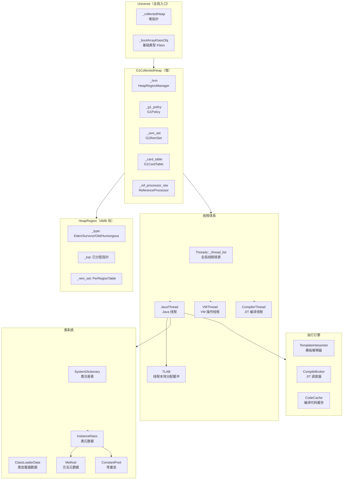

# JVM 核心数据结构与对象全景 —— 插桩验证大纲

> 基于 OpenJDK 11 源码 + 插桩验证
> 标准环境：`-Xms8g -Xmx8g -XX:+UseG1GC`，G1 Region = 4MB
> 目标：通过插桩打印 JVM 运行时所有核心对象的真实状态，建立"JVM 活地图"

---

## 总体目标

**用插桩验证回答三个核心问题：**
1. JVM 中有哪些核心数据结构/对象？它们的作用是什么？
2. 这些对象之间的关系是什么？（谁持有谁、谁依赖谁）
3. 这些对象在运行时的真实状态是什么？（大小、数量、地址、字段值）

---

## 全景知识图谱

```
JVM 核心对象体系
│
├── 🚀 启动层
│   ├── Arguments          参数解析结果
│   ├── Universe           JVM 全局单例（堆/类型系统入口）
│   └── VM_Version         CPU/JVM 版本信息
│
├── 💾 内存管理层
│   ├── G1CollectedHeap    G1 堆顶层对象
│   ├── HeapRegion         4MB 内存块（Eden/Survivor/Old/Humongous）
│   ├── G1HeapRegionTable  Region 数组
│   ├── G1Policy           GC 策略决策器
│   ├── G1RemSet           跨 Region 引用记录
│   ├── G1CardTable        卡表（写屏障基础）
│   ├── TLAB               线程本地分配缓冲区
│   ├── Metaspace          类元数据内存
│   └── ReferenceProcessor 软/弱/虚/终结引用处理器
│
├── 📦 类系统层
│   ├── SystemDictionary   类注册表（全局类缓存）
│   ├── ClassLoaderData    类加载器数据（每个 ClassLoader 一个）
│   ├── InstanceKlass      Java 类的 C++ 表示
│   ├── Method             Java 方法的 C++ 表示
│   ├── ConstantPool       运行时常量池
│   └── vtable/itable      虚方法表/接口方法表
│
├── ⚡ 执行引擎层
│   ├── TemplateInterpreter 模板解释器
│   ├── CompileBroker      JIT 编译调度器
│   ├── CodeCache          编译代码缓存
│   ├── StubRoutines       汇编桩代码集合
│   └── AdapterHandlerLibrary 调用适配器
│
├── 🧵 线程层
│   ├── Threads            线程注册表（全局线程列表）
│   ├── JavaThread         Java 线程
│   ├── VMThread           VM 操作线程
│   ├── CompilerThread     JIT 编译线程
│   ├── GCTaskThread       GC 工作线程
│   ├── WatcherThread      定时任务线程
│   └── ServiceThread      服务线程
│
├── 🔒 同步层
│   ├── ObjectMonitor      重量级锁对象
│   ├── ObjectSynchronizer 同步操作入口
│   └── Parker             park/unpark 底层实现
│
└── 🔧 运行时服务层
    ├── SafepointSynchronize SafePoint 协调器
    ├── HandshakeState     单线程握手状态
    ├── JNIHandles         JNI 全局/局部引用管理
    ├── JvmtiEnv           JVMTI 环境
    └── SignalDispatcher   信号分发线程
```

---

## 插桩验证计划（按优先级排序）

### 第一层：全局快照（最高价值，一次性打印所有核心对象）

| 编号 | 主题 | 插桩位置 | 验证目标 | 状态 |
|------|------|---------|---------|------|
| S-01 | JVM 启动全局快照 | `Threads::create_vm()` 末尾 | Universe/Heap/Thread 初始状态 | ✅ 已完成 |
| S-02 | 线程全景快照 | `Threads::add()` | 所有线程类型/数量/状态 | ✅ 已完成 |
| S-03 | G1GC 初始化快照 | `G1CollectedHeap::initialize()` | Region 数量/大小/分布 | ✅ 已完成 |
| S-04 | 类系统快照 | `SystemDictionary::initialize()` | 已加载类数量/ClassLoader 层次 | 🔲 待完成 |
| S-05 | CodeCache 快照 | `CodeCache::initialize()` | 各段大小/地址范围 | ✅ 已完成 |
| S-06 | Metaspace 快照 | `Metaspace::global_initialize()` | 初始大小/Chunk 分配 | ✅ 已完成 |

### 第二层：内存管理层（最核心，最高频）

| 编号 | 主题 | 插桩位置 | 验证目标 | 状态 |
|------|------|---------|---------|------|
| M-01 | 对象分配全链路 | `MemAllocator::allocate()` | TLAB 命中 vs 慢速路径 | 🔲 待完成 |
| M-02 | TLAB 分配详情 | `ThreadLocalAllocBuffer::allocate()` | TLAB 大小/剩余/填充 | 🔲 待完成 |
| M-03 | 大对象分配 | `G1CollectedHeap::humongous_obj_allocate()` | Humongous Region 分配 | 🔲 待完成 |
| M-04 | YoungGC 触发条件 | `G1CollectedHeap::do_collection_pause()` | Eden 满了多少触发 | ✅ 已完成 |
| M-05 | 写屏障全链路 | `G1BarrierSet::write_ref_field_post()` | 写屏障触发频率/路径 | ✅ 已完成 |
| M-06 | 引用处理 | `ReferenceProcessor::process_discovered_references()` | 软/弱/虚引用数量 | 🔲 待完成 |
| M-07 | Region 状态变化 | `HeapRegion::set_eden()` 等 | Region 类型转换时机 | 🔲 待完成 |

### 第三层：类系统层

| 编号 | 主题 | 插桩位置 | 验证目标 | 状态 |
|------|------|---------|---------|------|
| C-01 | 类加载时序 | `SystemDictionary::resolve_or_null()` | 哪些类在什么时机被加载 | 🔲 待完成 |
| C-02 | InstanceKlass 布局 | `ClassFileParser::create_instance_klass()` | sizeof/字段偏移/vtable 大小 | 🔲 待完成 |
| C-03 | 常量池解析 | `ConstantPool::resolve_constant_at_impl()` | 运行时常量池解析过程 | 🔲 待完成 |
| C-04 | vtable 构建 | `klassVtable::initialize_vtable()` | vtable 大小/方法分配 | 🔲 待完成 |
| C-05 | 方法链接 | `Method::link_method()` | 方法入口地址设置 | 🔲 待完成 |

### 第四层：执行引擎层

| 编号 | 主题 | 插桩位置 | 验证目标 | 状态 |
|------|------|---------|---------|------|
| E-01 | 方法调用全链路 | `InterpreterRuntime::resolve_invoke()` | invokevirtual 解析过程 | 🔲 待完成 |
| E-02 | JIT 编译触发 | `CompileBroker::compile_method()` | 触发条件/编译队列 | ✅ 已完成 |
| E-03 | 栈帧结构 | `frame::print_on()` | 栈帧布局/局部变量表 | 🔲 待完成 |
| E-04 | 去优化触发 | `Deoptimization::deoptimize()` | 去优化原因/频率 | ✅ 已完成 |
| E-05 | OSR 替换 | `CompileBroker::compile_method()` (OSR) | OSR 触发条件 | ✅ 已完成 |
| E-06 | 解释器字节码分发 | `TemplateTable::*` | 字节码执行路径 | ✅ 已完成 |

### 第五层：线程层

| 编号 | 主题 | 插桩位置 | 验证目标 | 状态 |
|------|------|---------|---------|------|
| T-01 | 线程创建全链路 | `JavaThread::JavaThread()` | 线程对象大小/初始状态 | ✅ 已完成 |
| T-02 | 线程状态转换 | `JavaThread::set_thread_state()` | 状态机转换序列 | ✅ 已完成 |
| T-03 | SafePoint 进入 | `SafepointSynchronize::begin()` | STW 时间/线程数量 | ✅ 已完成 |
| T-04 | Handshake 机制 | `HandshakeOperation::do_handshake()` | 单线程握手 vs SafePoint | ✅ 已完成 |
| T-05 | VMThread 操作队列 | `VMThread::execute()` | VM 操作类型/频率 | 🔲 待完成 |
| T-06 | GC 线程数量 | `G1CollectedHeap::initialize()` | GC 工作线程数 | 🔲 待完成 |

### 第六层：同步层

| 编号 | 主题 | 插桩位置 | 验证目标 | 状态 |
|------|------|---------|---------|------|
| L-01 | 锁升级路径 | `ObjectSynchronizer::slow_enter()` | 偏向→轻量→重量升级 | ✅ 已完成 |
| L-02 | ObjectMonitor 结构 | `ObjectMonitor::enter()` | sizeof/字段布局/等待队列 | 🔲 待完成 |
| L-03 | MarkWord 编码 | `markOopDesc::*` | 各状态下 MarkWord 值 | 🔲 待完成 |
| L-04 | Park/Unpark | `Parker::park()` | 底层 futex 调用 | 🔲 待完成 |

### 第七层：运行时服务层

| 编号 | 主题 | 插桩位置 | 验证目标 | 状态 |
|------|------|---------|---------|------|
| R-01 | 异常处理路径 | `InterpreterRuntime::throw_*` | 异常抛出/捕获完整路径 | 🔲 待完成 |
| R-02 | JNI 调用路径 | `JNI_CreateJavaVM` | JNI 调用约定/帧管理 | 🔲 待完成 |
| R-03 | 信号处理链 | `libjsig.so` 拦截点 | 信号注册/分发链 | ✅ 已完成 |
| R-04 | Attach 机制 | `AttachListener::init()` | Attach 监听/命令处理 | ✅ 已完成 |

---

## 核心数据结构关系图



---

## 已完成文档索引

| 文档编号 | 文件名 | 主题 | 完成度 |
|---------|--------|------|--------|
| 01 | `01-JVM-Startup-Probe-Plan.md` | JVM 启动探针计划 | ✅ |
| 02 | `02-JVM-Startup-Probe-Results.md` | JVM 启动探针结果 | ✅ |
| 03 | `03-ObjectAlloc-Probe-Results.md` | 对象分配探针结果 | ✅ |
| 04 | `04-YoungGC-Probe-Results.md` | YoungGC 探针结果 | ✅ |
| 04B | `04B-WriteBarrier-Probe-Results.md` | 写屏障探针结果 | ✅ |
| 04C | `04C-ConcMark-Probe-Results.md` | 并发标记探针结果 | ✅ |
| 04D | `04D-MixedGC-Probe-Results.md` | MixedGC 探针结果 | ✅ |
| 05 | `05-JIT-Probe-Results.md` | JIT 编译探针结果 | ✅ |
| 05B | `05B-OSR-Probe-Results.md` | OSR 探针结果 | ✅ |
| 05C | `05C-Deopt-Probe-Results.md` | 去优化探针结果 | ✅ |
| 05D | `05D-TemplateInterpreter-Probe-Results.md` | 模板解释器探针结果 | ✅ |
| 06 | `06-Safepoint-Probe-Results.md` | SafePoint 探针结果 | ✅ |
| 07 | `07-Synchronization-Deep-Dive.md` | 同步机制深度分析 | ✅ |
| 08 | `08-ThreadLifecycle-Probe.md` | 线程生命周期探针 | ✅ |
| 09 | `09-Signal-Probe-Results.md` | 信号处理探针结果 | ✅ |
| 10 | `10-Attach-Probe-Results.md` | Attach 机制探针结果 | ✅ |
| 11 | `11-Handshake-Probe.md` | Handshake 探针结果 | ✅ |
| 12 | `12-Metaspace-Probe.md` | Metaspace 探针结果 | ✅ |
| 13 | `13-CodeCache-Sweeper-Probe.md` | CodeCache Sweeper 探针 | ✅ |
| 17 | `17-JMM-Barrier-Probe.md` | JMM 内存屏障探针 | ✅ |

---

## 待完成主题（按价值密度排序）

### 🔥 最高优先级（核心缺口）

#### 1. 对象分配全链路（M-01 ~ M-03）
**为什么最重要**：对象分配是 JVM 最高频操作，TLAB/Eden/G1 都涉及，是理解内存管理的基础。

**插桩目标**：
- `MemAllocator::allocate()` — 分配入口，区分 TLAB 命中 vs 慢速路径
- `ThreadLocalAllocBuffer::allocate()` — TLAB 快速路径
- `G1CollectedHeap::mem_allocate()` — 慢速路径
- `G1CollectedHeap::humongous_obj_allocate()` — 大对象路径

**验证问题**：
- TLAB 命中率是多少？
- 慢速路径触发频率？
- 大对象（>2MB）走哪条路径？
- 分配失败时如何触发 GC？

**预期文档**：`JVM-Core-Objects/01-ObjectAlloc-Full-Chain.md`

---

#### 2. 方法调用全链路（E-01）
**为什么最重要**：`invokevirtual` 是 JVM 最核心的操作，理解它就理解了多态/JIT/内联缓存。

**插桩目标**：
- `InterpreterRuntime::resolve_invoke()` — 首次调用解析
- `LinkResolver::resolve_virtual_call()` — vtable 查找
- `klassVtable::method_at()` — vtable 索引访问
- `CompiledIC::set_to_monomorphic()` — 内联缓存设置

**验证问题**：
- 首次调用 vs 后续调用的路径差异？
- vtable 索引是如何分配的？
- 内联缓存命中率？
- 多态调用如何退化为 megamorphic？

**预期文档**：`JVM-Core-Objects/02-MethodInvocation-Full-Chain.md`

---

#### 3. 栈帧结构（E-03）
**为什么重要**：理解调试/异常/反射的基础，也是理解 JIT 去优化的前提。

**插桩目标**：
- `frame::print_on()` — 打印栈帧
- `JavaThread::last_frame()` — 获取栈顶帧
- `vframe::sender()` — 遍历调用栈

**验证问题**：
- 解释器帧 vs 编译帧的布局差异？
- 局部变量表的实际大小？
- 操作数栈的最大深度？

**预期文档**：`JVM-Core-Objects/03-StackFrame-Layout.md`

---

#### 4. MarkWord 完整编码（L-03）
**为什么重要**：MarkWord 是对象头的核心，编码了锁状态/GC 年龄/哈希值，是理解锁升级的基础。

**插桩目标**：
- `markOopDesc::print_on()` — 打印 MarkWord
- `ObjectSynchronizer::slow_enter()` — 锁升级路径
- `BiasedLocking::revoke_and_rebias()` — 偏向锁撤销

**验证问题**：
- 无锁/偏向/轻量/重量各状态下 MarkWord 的实际值？
- GC 年龄字段的范围？
- 哈希值何时计算？

**预期文档**：`JVM-Core-Objects/04-MarkWord-Encoding.md`

---

#### 5. ObjectMonitor 结构（L-02）
**为什么重要**：重量级锁的核心数据结构，理解 synchronized 的底层实现。

**插桩目标**：
- `ObjectMonitor::enter()` — 加锁
- `ObjectMonitor::exit()` — 解锁
- `ObjectMonitor::wait()` — 等待
- `ObjectMonitor::notify()` — 通知

**验证问题**：
- ObjectMonitor 的 sizeof 是多少？
- `_EntryList` 和 `_WaitSet` 的实际结构？
- 锁竞争时的等待队列长度？

**预期文档**：`JVM-Core-Objects/05-ObjectMonitor-Deep-Dive.md`

---

### 🟡 中优先级

#### 6. 类加载时序（C-01）
**预期文档**：`JVM-Core-Objects/06-ClassLoading-Timeline.md`

#### 7. InstanceKlass 完整布局（C-02）
**预期文档**：`JVM-Core-Objects/07-InstanceKlass-Layout.md`

#### 8. VMThread 操作队列（T-05）
**预期文档**：`JVM-Core-Objects/08-VMThread-Operations.md`

#### 9. 引用处理（M-06）
**预期文档**：`JVM-Core-Objects/09-ReferenceProcessing-Chain.md`

#### 10. Region 状态变化（M-07）
**预期文档**：`JVM-Core-Objects/10-HeapRegion-StateTransition.md`

---

### 🔵 低优先级（补充完善）

#### 11. 常量池解析（C-03）
**预期文档**：`JVM-Core-Objects/11-ConstantPool-Resolution.md`

#### 12. vtable 构建（C-04）
**预期文档**：`JVM-Core-Objects/12-vtable-Construction.md`

#### 13. JNI 调用路径（R-02）
**预期文档**：`JVM-Core-Objects/13-JNI-Call-Chain.md`

#### 14. Park/Unpark 底层（L-04）
**预期文档**：`JVM-Core-Objects/14-Parker-Futex-Deep-Dive.md`

---

## 进度追踪

| 主题 | 编号 | 状态 | 文档 |
|------|------|------|------|
| 对象分配全链路 | M-01~03 | ✅ 已完成 | `01-ObjectAlloc-Full-Chain.md` |
| 方法调用全链路 | E-01 | ✅ 已完成 | `02-MethodInvocation-Full-Chain.md` |
| 栈帧结构 | E-03 | ✅ 完成 | `03-StackFrame-Layout.md` |
| MarkWord 编码 | L-03 | ✅ 已完成 | `04-MarkWord-Encoding.md` |
| ObjectMonitor 结构 | L-02 | ✅ 已完成 | `05-ObjectMonitor-Deep-Dive.md` |
| 类加载时序 | C-01 | ✅ 已完成 | `06-ClassLoading-Timeline.md` |
| InstanceKlass 布局 | C-02 | 🔲 待开始 | `07-InstanceKlass-Layout.md` |
| VMThread 操作队列 | T-05 | 🔲 待开始 | `08-VMThread-Operations.md` |
| 引用处理 | M-06 | 🔲 待开始 | `09-ReferenceProcessing-Chain.md` |
| Region 状态变化 | M-07 | 🔲 待开始 | `10-HeapRegion-StateTransition.md` |
| 常量池解析 | C-03 | 🔲 待开始 | `11-ConstantPool-Resolution.md` |
| vtable 构建 | C-04 | 🔲 待开始 | `12-vtable-Construction.md` |
| JNI 调用路径 | R-02 | 🔲 待开始 | `13-JNI-Call-Chain.md` |
| Park/Unpark 底层 | L-04 | 🔲 待开始 | `14-Parker-Futex-Deep-Dive.md` |

---

## 插桩方法论

### 插桩原则
1. **最小侵入**：只在关键函数入口/出口插桩，不影响核心逻辑
2. **条件过滤**：用计数器控制打印频率，避免日志爆炸
3. **结构化输出**：打印格式统一，方便后续分析
4. **交叉验证**：同一结论用两种方法验证（插桩 + GDB）

### 标准插桩模板
```cpp
// 在目标函数入口插入
static int _probe_count = 0;
if (_probe_count++ < 5) {  // 只打印前 5 次
    tty->print_cr("[PROBE][主题] 函数名: 关键字段=%p, 值=%d",
                  (void*)关键指针, 关键值);
}
```

### 验证流程
```
1. 确定验证目标（问题 → 插桩位置）
2. 编写插桩代码（最小侵入）
3. 通知用户 build（不自动触发编译）
4. 分析输出结果
5. 交叉验证（GDB 确认）
6. 输出文档
```

---

*最后更新：2026-03-05*
*当前进度：已完成 20 个探针主题，待完成 14 个核心主题*
