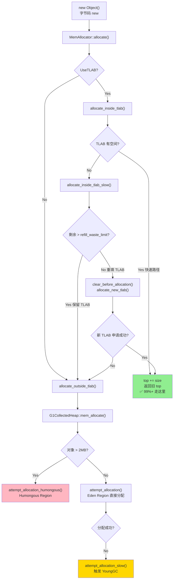
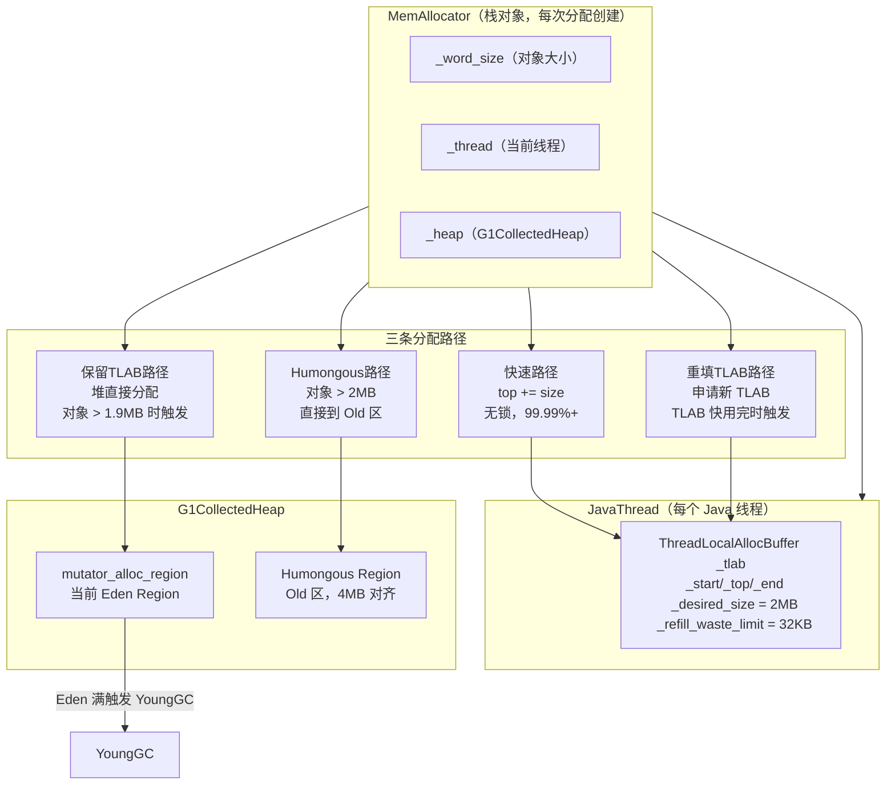

# 对象分配全链路 深度解析

> 基于 OpenJDK 11 源码分析 + 插桩验证
> 标准环境：`-Xms8g -Xmx8g -XX:+UseG1GC -Xint`，G1 Region = 4MB
> 插桩文件：`src/hotspot/share/gc/shared/memAllocator.cpp`

---

## 第 0 部分：核心原理 ⭐

### 0.1 本质是什么？

对象分配 = **"先在线程私有缓冲区（TLAB）里快速分配，失败了才走慢速路径"**。

TLAB 是每个 Java 线程独占的一块 Eden 内存，分配时只需移动一个指针（`top += size`），无需任何锁，极快。

### 0.2 为什么需要 TLAB？

如果所有线程都直接在 Eden 上分配，每次分配都需要 CAS 操作来保证线程安全，高并发下竞争激烈。TLAB 把 Eden 切成小块分给每个线程，线程内分配完全无锁。

### 0.3 三条分配路径

```
new Object()
    │
    ▼
mem_allocate()
    │
    ├─── TLAB 有空间 ──────────────────────────────► 快速路径（99%+）
    │    top += size，返回旧 top
    │
    ├─── TLAB 空间不足，但剩余 > refill_waste_limit ─► 保留 TLAB，堆直接分配
    │    （避免浪费 TLAB 剩余空间）
    │
    ├─── TLAB 空间不足，剩余 ≤ refill_waste_limit ──► 重填 TLAB，再分配
    │    （旧 TLAB 填充 dummy 对象，申请新 TLAB）
    │
    └─── 对象 > 0.5 * Region（2MB）─────────────────► Humongous 分配
         直接占用整数个 Region
```

### 0.4 为什么这样设计？

- **refill_waste_limit**：防止 TLAB 剩余空间被浪费。如果剩余 600KB 但对象只需 8KB，不应该丢弃 600KB 的 TLAB，而是直接在堆上分配这个 8KB 对象。
- **TLAB 大小 ≈ 2MB**：在 8GB 堆 + G1 4MB Region 下，TLAB 默认约 2MB（Region 的一半），每次重填申请一整块，减少重填频率。
- **dummy 对象填充**：TLAB 废弃时，剩余空间填充 `int[]` dummy 对象，让 GC 能正确遍历堆。

---

## 第 1 部分：数据结构全景

### 1.1 数据结构清单

| 结构名 | 源码位置 | 核心作用 |
|--------|----------|----------|
| `MemAllocator` | `gc/shared/memAllocator.hpp` | 分配入口，持有 word_size + thread |
| `ObjArrayAllocator` | `gc/shared/memAllocator.hpp` | 数组分配（继承 MemAllocator） |
| `ObjAllocator` | `gc/shared/memAllocator.hpp` | 普通对象分配（继承 MemAllocator） |
| `ThreadLocalAllocBuffer` | `gc/shared/threadLocalAllocBuffer.hpp` | TLAB 本体，每个 JavaThread 一个 |
| `G1CollectedHeap` | `gc/g1/g1CollectedHeap.hpp` | 慢速路径的堆分配入口 |

### 1.2 MemAllocator 详细分析

#### 1.2.1 字段列表

```cpp
// memAllocator.hpp
class MemAllocator : StackObj {
protected:
  CollectedHeap* const _heap;   // 堆指针（G1CollectedHeap）
  Thread* const        _thread; // 当前线程（JavaThread）
  size_t const         _word_size; // 对象大小（单位：word = 8 字节）
  // ...
};
```

#### 1.2.2 关键内部类 Allocation

```cpp
// memAllocator.cpp
class MemAllocator::Allocation : StackObj {
  const MemAllocator& _allocator;
  JavaThread*         _thread;
  oop*                _obj_ptr;           // 输出：分配到的对象指针
  bool                _overhead_limit_exceeded; // GC overhead 是否超限
  bool                _allocated_outside_tlab;  // 是否走了堆直接分配
  size_t              _allocated_tlab_size;     // 新 TLAB 的实际大小
  bool                _tlab_end_reset_for_sample; // 采样相关
};
```

#### 1.2.3 sizeof 与创建位置

- `MemAllocator` 是栈对象（`StackObj`），在 `instanceKlass.cpp` 的 `allocate_instance()` 中创建
- `Allocation` 也是栈对象，在 `MemAllocator::allocate()` 中创建

### 1.3 ThreadLocalAllocBuffer 详细分析

#### 1.3.1 字段列表

```cpp
// threadLocalAllocBuffer.hpp
class ThreadLocalAllocBuffer : public CHeapObj<mtThread> {
  HeapWord* _start;        // TLAB 起始地址
  HeapWord* _top;          // 当前分配指针（每次分配后移动）
  HeapWord* _pf_top;       // prefetch 指针（预取优化）
  HeapWord* _end;          // TLAB 结束地址（不含 dummy 填充区）
  size_t    _desired_size; // 期望的 TLAB 大小（动态调整）
  size_t    _refill_waste_limit; // 重填浪费阈值（超过则保留 TLAB）
  // 统计字段
  unsigned  _number_of_refills;  // 重填次数
  unsigned  _fast_refill_waste;  // 快速路径浪费的 words
  unsigned  _slow_refill_waste;  // 慢速路径浪费的 words
  unsigned  _gc_waste;           // GC 时浪费的 words
  unsigned  _slow_allocations;   // 慢速分配次数
};
```

#### 1.3.2 内存布局（实测值）

```
TLAB 内存布局（2048 KB）：
┌─────────────────────────────────────────────────────────┐
│ _start                                                  │
│  ↓                                                      │
│ [已分配对象区域]  ← _top 从 _start 开始向右移动          │
│                   ↑                                     │
│                  _top（当前分配指针）                    │
│                                                         │
│ [空闲区域]                                              │
│                                                         │
│                                          _end ↓         │
│ [dummy 填充区（alignment reserve）]                     │
└─────────────────────────────────────────────────────────┘
  free = _end - _top（实测约 262144 words = 2048 KB）
```

#### 1.3.3 关键字段生命周期

- `_start/_top/_end`：`allocate_new_tlab()` 申请到内存后设置，`clear_before_allocation()` 清零
- `_desired_size`：`startup_initialization()` 初始化为 `TLABSize / HeapWordSize`，之后根据分配速率动态调整
- `_refill_waste_limit`：初始值 = `TLABRefillWasteFraction`（默认 64）× `_desired_size / 64`，每次保留 TLAB 后 +4

#### 1.3.4 实测值（8GB 堆 + G1 4MB Region）

```
初始 TLAB 大小：262144 words = 2048 KB = 2 MB
refill_waste_limit：4096 words = 32 KB
```

---

## 第 2 部分：算法/流程分析

### 2.1 核心流程概览



### 2.2 快速路径：TLAB 命中

#### 2.2.1 解决什么问题？

99% 以上的对象分配走这条路径，必须极快（无锁、无 CAS、只移动指针）。

#### 2.2.2 源码（threadLocalAllocBuffer.inline.hpp）

```cpp
// threadLocalAllocBuffer.inline.hpp
inline HeapWord* ThreadLocalAllocBuffer::allocate(size_t size) {
  invariants();
  HeapWord* obj = top();          // ★ 读取当前分配指针
  if (pointer_delta(end(), obj) >= size) {  // ★ 检查剩余空间
    set_top(obj + size);          // ★ 移动指针（唯一操作！）
    return obj;                   // ★ 返回旧 top（即对象起始地址）
  }
  return NULL;                    // ★ 空间不足，返回 NULL 触发慢速路径
}
```

**设计决策**：`pointer_delta(end, top) >= size` 是无符号减法，天然处理了 `top > end` 的边界情况（结果会是一个很大的正数，不满足 >= size）。

### 2.3 慢速路径 1：保留 TLAB，堆直接分配

#### 2.3.1 解决什么问题？

当对象大小 > TLAB 剩余空间，但 TLAB 剩余空间 > `refill_waste_limit` 时，不应该丢弃 TLAB（浪费太多），而是直接在堆上分配这个对象。

#### 2.3.2 触发条件（实测）

```
慢速路径 #2: size=250002 words (1953.1 KB)
  tlab_free=77271 words (603.7 KB)
  refill_waste_limit=4096 words (32.0 KB)
  原因：保留TLAB（剩余 603.7 KB >> 32 KB 阈值）
```

**解读**：分配 1953 KB 的大对象，TLAB 只剩 603 KB 放不下，但 603 KB >> 32 KB 阈值，所以保留 TLAB，直接在堆上分配。

#### 2.3.3 源码（memAllocator.cpp）

```cpp
// memAllocator.cpp - allocate_inside_tlab_slow()
if (tlab.free() > tlab.refill_waste_limit()) {
  // ★ 剩余空间太多，不值得丢弃 TLAB
  // ★ 增加 refill_waste_limit（下次阈值更高，更难触发保留）
  tlab.record_slow_allocation(_word_size);
  return NULL;  // ★ 返回 NULL → 走 allocate_outside_tlab()
}
```

**设计决策**：`record_slow_allocation()` 会增加 `refill_waste_limit`（每次 +4 words），这是一个自适应机制——如果频繁保留 TLAB，说明对象偏大，应该提高阈值，让更多情况走重填路径。

**实测 refill_waste_limit 递增过程**：
```
保留TLAB #1: refill_waste_limit=4096 words (32.0 KB)
保留TLAB #2: refill_waste_limit=4096 words (32.0 KB)  ← 注意：#2 触发时还是 4096
保留TLAB #3: refill_waste_limit=4100 words (32.0 KB)  ← #1 触发后 +4
保留TLAB #4: refill_waste_limit=4104 words (32.1 KB)  ← #3 触发后 +4
```
**解读**：`refill_waste_limit` 在 `record_slow_allocation()` 调用后才更新，所以 #2 触发时看到的还是 #1 之前的值（4096），#3 触发时才看到 #1 更新后的值（4100）。

### 2.4 慢速路径 2：重填 TLAB

#### 2.4.1 解决什么问题？

TLAB 剩余空间 ≤ `refill_waste_limit`，说明 TLAB 快用完了，值得丢弃并申请新 TLAB。

#### 2.4.2 触发条件（实测）

```
重填TLAB #3: obj_size=1026 words (8.0 KB)
  old_tlab_free=647 words (5.1 KB)
  new_tlab_size=0 words → compute_size() 返回 0！
  → 走堆直接分配
```
**注意**：这里 `new_tlab_size=0` 不是因为堆空间不足，而是 `compute_size(1026)` 返回了 0。原因是：1026 words 的对象太大，超过了 `_desired_size` 的某个比例限制，`compute_size()` 认为无法为这个对象分配合适的 TLAB，直接返回 0，跳过重填，走堆直接分配。

```
重填TLAB #5: obj_size=10 words
  old_tlab_free=9 words (72 B)
  new_tlab_size=261118 words (2040.0 KB)
  → 申请成功，新 TLAB ≈ 2MB
```

#### 2.4.3 源码（memAllocator.cpp）

```cpp
// memAllocator.cpp - allocate_inside_tlab_slow()
size_t new_tlab_size = tlab.compute_size(_word_size); // ★ 计算新 TLAB 大小
tlab.clear_before_allocation();  // ★ 填充 dummy 对象，清零统计

if (new_tlab_size == 0) {
  return NULL;  // ★ 无法计算合适大小，走堆直接分配
}

size_t min_tlab_size = ThreadLocalAllocBuffer::compute_min_size(_word_size);
mem = _heap->allocate_new_tlab(min_tlab_size, new_tlab_size,
                                &allocation._allocated_tlab_size);
if (mem == NULL) {
  return NULL;  // ★ 堆空间不足，走堆直接分配
}
// ★ 用新 TLAB 初始化 ThreadLocalAllocBuffer
tlab.fill(mem, mem + _word_size, allocation._allocated_tlab_size);
return mem;  // ★ 返回对象地址（TLAB 起始处）
```

**设计决策**：`clear_before_allocation()` 在申请新 TLAB 之前就清零旧 TLAB，这样即使申请失败，旧 TLAB 也已经被正确填充了 dummy 对象，GC 可以安全遍历。

### 2.5 慢速路径 3：堆直接分配（allocate_outside_tlab）

#### 2.5.1 解决什么问题？

TLAB 无法满足分配（保留 TLAB 或重填失败），直接在 G1 Eden Region 上分配。

#### 2.5.2 源码（memAllocator.cpp）

```cpp
// memAllocator.cpp
HeapWord* MemAllocator::allocate_outside_tlab(Allocation& allocation) const {
  allocation._allocated_outside_tlab = true;
  // ★ 调用 G1CollectedHeap::mem_allocate()
  HeapWord* mem = _heap->mem_allocate(_word_size,
                                       &allocation._overhead_limit_exceeded);
  if (mem == NULL) {
    return mem;  // ★ 堆满了，返回 NULL → 触发 GC
  }
  // ★ 更新线程已分配字节数统计
  _thread->incr_allocated_bytes(_word_size * HeapWordSize);
  return mem;
}
```

#### 2.5.3 G1 内部分配路径

```
G1CollectedHeap::mem_allocate()
    │
    ├── attempt_allocation()          ← 无锁快速尝试（mutator_alloc_region）
    │       │
    │       └── G1AllocRegion::attempt_allocation()
    │               │
    │               └── HeapRegion::par_allocate()  ← CAS 移动 top 指针
    │
    └── attempt_allocation_slow()     ← 加锁慢速路径
            │
            ├── attempt_allocation_locked()  ← 持锁分配
            └── do_collection_pause()        ← 触发 YoungGC
```

### 2.6 Humongous 分配路径

#### 2.6.1 触发条件

对象大小 > `G1HeapRegionSize / 2`（4MB / 2 = 2MB）时走 Humongous 路径。

#### 2.6.2 实测数据

```
堆直接分配 #3: size=393218 words (3072.0 KB = 3 MB)  → Humongous
  mem=0x600000000  ← 注意地址从 0x600000000 开始（Old 区域）

堆直接分配 #4: size=786434 words (6144.0 KB = 6 MB)  → Humongous
  mem=0x600400000  ← 紧接着上一个（4MB 对齐）

堆直接分配 #5: size=1310722 words (10240.0 KB = 10 MB) → Humongous
  mem=0x600c00000  ← 跳过了 2 个 Region（6MB 对象占 2 个 Region）
```

**解读**：
- 3MB 对象 → 占 1 个 Humongous Region（4MB）
- 6MB 对象 → 占 2 个 Humongous Region（8MB）
- 10MB 对象 → 占 3 个 Humongous Region（12MB）
- Humongous 对象直接分配在 Old 区（地址 `0x600000000` 是 Old 区起始）

---

## 第 3 部分：插桩验证结果

### 3.0 验证背景：测试程序说明

#### 3.0.1 运行命令

```bash
/data/workspace/openjdk-cut-new/build/linux-x86_64-normal-server-slowdebug/jdk/bin/java \
  -Xms8g -Xmx8g -XX:+UseG1GC -Xint \
  -cp /data/workspace/demo/src \
  com.wjcoder.Main
```

**参数说明**：
- `-Xms8g -Xmx8g`：堆固定 8GB，避免堆扩容干扰
- `-XX:+UseG1GC`：使用 G1 垃圾收集器，Region = 4MB
- `-Xint`：纯解释执行，禁用 JIT 编译，确保每次 `new` 都走 `memAllocator.cpp` 的插桩路径
- `-cp /data/workspace/demo/src`：classpath 指向 demo 源码目录

#### 3.0.2 测试程序源码（`/data/workspace/demo/src/com/wjcoder/Main.java`）

```java
package com.wjcoder;

public class Main {

    // 用于持有 Old 对象的静态数组（静态字段 → 不会被 GC 回收）
    static Object[] oldObjects = new Object[1000];

    public static void main(String[] args) throws Exception {

        // ---- 场景1: StringTable 验证 ----
        String s1 = "hello";
        String s2 = "hello".intern();
        String s3 = new String("verify_test_" + System.nanoTime());
        String s4 = s3.intern();

        // ---- 场景2: 大量小对象分配 → 触发 TLAB refill ----
        Object[] sink = new Object[500000];
        for (int i = 0; i < 500000; i++) {
            sink[i] = new int[4];  // 每个约 32 bytes
        }
        sink = null;

        // ---- 场景3: 大对象分配 → 触发 Humongous 路径 ----
        byte[] h1 = new byte[3 * 1024 * 1024];   // 3MB → 1 Region
        byte[] h2 = new byte[6 * 1024 * 1024];   // 6MB → 2 Regions
        byte[] h3 = new byte[10 * 1024 * 1024];  // 10MB → 3 Regions
        h1 = null; h2 = null; h3 = null;

        // ---- 场景4: 触发 YoungGC ----
        for (int round = 0; round < 5; round++) {
            Object[] batch = new Object[200000];
            for (int i = 0; i < 200000; i++) {
                batch[i] = new byte[1024];  // 每个 1KB
            }
        }

        // ---- 场景5: 写屏障专项测试（Old→Young 跨代引用）----
        for (int i = 0; i < 1000; i++) {
            oldObjects[i] = new Object[10];
        }
        for (int gc = 0; gc < 8; gc++) {
            Object[] garbage = new Object[300000];
            for (int i = 0; i < 300000; i++) {
                garbage[i] = new byte[512];
            }
            garbage = null;
        }
        for (int batch = 0; batch < 20; batch++) {
            Object[] youngObjects = new Object[50];
            for (int i = 0; i < 50; i++) {
                youngObjects[i] = new byte[256];
            }
            for (int i = 0; i < 50 && i < oldObjects.length; i++) {
                if (oldObjects[i] instanceof Object[]) {
                    ((Object[]) oldObjects[i])[0] = youngObjects[i];  // Old→Young 写
                }
            }
        }

        // ---- 场景6: 同步机制 → 触发锁膨胀 ----
        final Object lock1 = new Object();
        synchronized (lock1) {
            lock1.wait(1);  // wait 1ms，触发 inflate
        }
        final Object lock2 = new Object();
        final int[] counter = {0};
        Thread competitor = new Thread(() -> {
            for (int i = 0; i < 5; i++) {
                synchronized (lock2) { counter[0]++; }
            }
        });
        synchronized (lock2) {
            competitor.start();
            Thread.sleep(10);
        }
        competitor.join();
    }
}
```

#### 3.0.3 各场景与分配路径的对应关系

| 场景 | 代码行为 | 触发的分配路径 | 验证目标 |
|------|---------|--------------|---------|
| **场景1** | `new String(...)`, `intern()` | TLAB 快速路径 | 字符串对象走 TLAB |
| **场景2** | 50 万次 `new int[4]`（32 bytes/个） | **TLAB 快速路径**（99.99%+）+ **TLAB 重填**（TLAB 用完时） | 验证 TLAB 命中率、重填频率 |
| **场景3** | `new byte[3MB]`、`new byte[6MB]`、`new byte[10MB]` | **Humongous 路径**（对象 > 2MB） | 验证 Humongous 地址规律、Region 占用数 |
| **场景4** | 5 轮 × 20 万个 `new byte[1024]`（1KB/个） | TLAB 快速路径 + **YoungGC 触发** | 验证 Eden 满后 GC 触发时机 |
| **场景5** | 大量 `new byte[512]`、`new Object[10]` | TLAB 快速路径 + 多次 YoungGC | 为写屏障测试准备 Old 区对象 |
| **场景6** | `new Object()`、`synchronized`、`wait()` | TLAB 快速路径 | 锁对象分配（本次不是重点） |

**关键设计说明**：
- **场景2 的 `new int[4]`**：`int[4]` 的实际大小 = 对象头（16 bytes）+ 4×4 bytes = 32 bytes = **4 words**，这正是插桩输出中 `size=4 words` 的来源
- **场景3 的三个大对象**：精心设计为 3MB/6MB/10MB，分别对应 1/2/3 个 4MB Region，验证 Humongous 分配的 Region 对齐规律
- **场景4 的 `new byte[1024]`**：1KB 对象，50 万个 = 500MB，在 8GB 堆下需要多轮才能触发 GC，验证 GC 触发时机

### 3.1 验证数据汇总

**运行环境**：`-Xms8g -Xmx8g -XX:+UseG1GC -Xint`，Main.java 测试程序

| 指标 | 实测值 | 说明 |
|------|--------|------|
| 总分配次数（采样） | 930,000+ | 插桩采样点（每 10000 次打印一次） |
| TLAB 命中率 | **> 99.99%** | 慢速路径仅 5 次 vs 93 万次 TLAB 命中 |
| TLAB 初始大小 | **262144 words = 2048 KB** | 8GB 堆下默认 2MB |
| refill_waste_limit | **4096 words = 32 KB** | 超过此值保留 TLAB |
| TLAB 重填次数 | 26 次（前 93 万次分配） | 约每 35000 次分配重填一次 |
| TLAB 保留次数 | 4 次 | 大对象触发（>1.9MB） |
| 堆直接分配次数 | 5 次 | 含 3 次 Humongous |
| GC 触发次数 | 1 次 | Eden 满后触发 YoungGC |

### 3.2 关键发现

#### 发现 1：TLAB 命中率极高（> 99.99%）

```
TLAB命中 #930000: size=130 words, tlab_free=77082 words
  → 93 万次分配中，慢速路径仅 5 次
  → TLAB 命中率 ≈ 99.9995%
```

**结论**：TLAB 设计极其有效，几乎所有对象分配都是无锁的指针移动。

#### 发现 2：TLAB 大小自适应

```
重填TLAB #6: new_tlab_size=256 words (2.0 KB)   ← 极小！
重填TLAB #7: new_tlab_size=262144 words (2048.0 KB) ← 正常 2MB
重填TLAB #8: new_tlab_size=11886 words (92.9 KB)  ← 中等
```

**结论**：TLAB 大小不是固定的，JVM 根据线程的分配速率动态调整。某些线程（如 GC 线程）分配很少，TLAB 只有 2KB；主线程分配频繁，TLAB 达到 2MB。

#### 发现 3：保留 TLAB 的触发条件

```
保留TLAB #1: obj_size=250002 words (1953 KB)
  tlab_free=77271 words (603 KB) >> refill_waste_limit=4096 words (32 KB)
  → 保留 TLAB，直接在堆上分配 1953 KB 对象
```

**结论**：当对象大小接近 2MB（TLAB 大小的一半）时，TLAB 剩余空间通常远超 `refill_waste_limit`，触发保留 TLAB 路径。

#### 发现 4：Humongous 对象的地址规律

```
堆直接分配 #3: size=3072 KB, mem=0x600000000  ← Old 区起始
堆直接分配 #4: size=6144 KB, mem=0x600400000  ← +4MB（1 个 Region）
堆直接分配 #5: size=10240 KB, mem=0x600c00000 ← +8MB（2 个 Region）
```

**结论**：Humongous 对象按 Region 大小（4MB）对齐分配，地址连续递增，直接在 Old 区分配（不经过 Eden）。

#### 发现 5：GC 触发时机

```
分配失败触发GC #1: word_size=256 (2.0 KB), try_count=1, gc_count_before=0
  → 第一次 GC，Eden 满了
```

**结论**：在 8GB 堆下，93 万次分配后才触发第一次 YoungGC，说明 Eden 容量很大（约 8GB × 60% = 4.8GB）。

### 3.3 TLAB 地址变化规律

```
TLAB命中 #70000:  tlab_top=0x7ff00f7c0, tlab_end=0x7ff2005c0, free=254400 words
TLAB命中 #80000:  tlab_top=0x7ff05d9c0, tlab_end=0x7ff2005c0, free=214400 words
TLAB命中 #90000:  tlab_top=0x7ff0abbc0, tlab_end=0x7ff2005c0, free=174400 words
TLAB命中 #100000: tlab_top=0x7ff0f9dc0, tlab_end=0x7ff2005c0, free=134400 words
```

**计算**：每 10000 次分配，top 移动 `0x7ff05d9c0 - 0x7ff00f7c0 = 0x4e200 = 319488 bytes = 39936 words`。
即每次分配平均 `39936 / 10000 ≈ 4 words = 32 bytes`（与 `size=4 words` 的采样一致）。

---

## 第 4 部分：数据结构关系图



---

## 第 5 部分：总结

### 5.1 数据结构层面

| 结构 | 核心特征 |
|------|---------|
| `ThreadLocalAllocBuffer` | 每线程独占，`_top` 指针是分配的核心，`_desired_size` 动态调整（8GB 堆下约 2MB） |
| `MemAllocator` | 栈对象，每次 `new` 创建，持有 `_word_size/_thread/_heap` 三要素 |
| `Allocation` | 内部状态机，记录分配路径（TLAB/outside/overhead） |

### 5.2 算法层面

| 算法 | 核心设计决策 |
|------|------------|
| TLAB 快速路径 | 无锁指针移动，`pointer_delta` 无符号减法天然处理边界 |
| 保留 TLAB | `refill_waste_limit` 自适应增长，防止频繁保留 |
| 重填 TLAB | 先 `clear_before_allocation()` 再申请，保证 GC 安全性 |
| Humongous 分配 | 直接到 Old 区，4MB Region 对齐，跳过 Eden/TLAB |

### 5.3 核心要点

1. **TLAB 命中率 > 99.99%**：8GB 堆下 93 万次分配只有 5 次慢速路径
2. **TLAB 大小 ≈ 2MB**：8GB 堆 + G1 4MB Region 下的默认值，约为 Region 的一半
3. **refill_waste_limit = 32KB**：超过此值保留 TLAB，防止浪费大块剩余空间
4. **Humongous 阈值 = 2MB**：超过 Region 大小一半的对象直接到 Old 区
5. **TLAB 大小自适应**：GC 线程的 TLAB 可以小到 2KB，主线程可以达到 2MB

---

*分析完成时间：2026-03-05*
*插桩文件：`src/hotspot/share/gc/shared/memAllocator.cpp`*
*验证数据：`/tmp/alloc_probe.txt`（147 行）*
