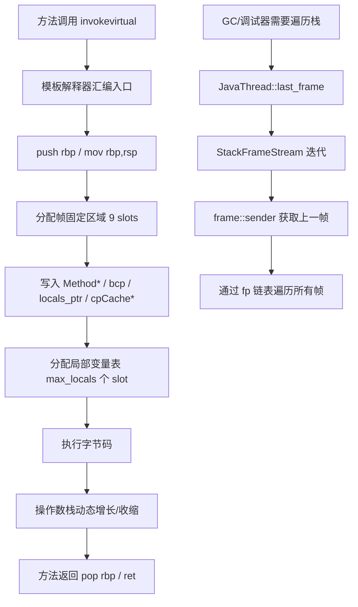

# E-03 栈帧结构（Stack Frame Layout）深度解析

> 基于 OpenJDK 11 源码分析
> 标准环境：`-Xms8g -Xmx8g -XX:+UseG1GC -Xint`
> 源码文件：`src/hotspot/cpu/x86/frame_x86.hpp`、`src/hotspot/share/runtime/frame.hpp`

---

## 第 0 部分：核心原理 ⭐

### 0.1 本质是什么？

**栈帧（frame）是方法调用的物理内存快照**：每次方法调用，JVM 在线程栈上分配一块内存，存储该方法执行所需的全部状态（局部变量、操作数栈、返回地址、方法元数据指针）。

### 0.2 为什么需要？

方法调用是递归嵌套的，每个方法需要独立的执行上下文：
- **局部变量隔离**：方法 A 的变量不能被方法 B 覆盖
- **返回地址保存**：方法返回后需要知道回到哪里继续执行
- **GC 根扫描**：GC 需要知道栈上哪些位置存放了对象引用

### 0.3 怎么解决？

JVM 为每次方法调用在线程栈上分配一个**栈帧**，帧内按固定偏移量存放各类数据。x86_64 上解释器帧的布局（从高地址到低地址）：

```
高地址（调用者方向）
  [locals & parameters]   ← 局部变量表（从 fp 向上）
  [return pc]             ← 返回地址（caller 的 pc）
  [old fp]                ← 上一帧的 fp（链表指针）  ← fp 指向这里
  [sender_sp]             ← 调用者的 sp（-1 * wordSize）
  [last_sp]               ← 操作数栈顶（-2 * wordSize）
  [Method*]               ← 当前方法指针（-3 * wordSize）
  [mirror]                ← 方法所属类的 mirror（-4 * wordSize）
  [mdp]                   ← 方法数据指针（-5 * wordSize）
  [cpCache*]              ← 常量池缓存指针（-6 * wordSize）
  [locals ptr]            ← 局部变量表基址（-7 * wordSize）
  [bcp]                   ← 字节码指针（-8 * wordSize）
  [initial_sp]            ← 初始 sp（-9 * wordSize）
  [monitors...]           ← synchronized 锁对象（动态大小）
  [expression stack...]   ← 操作数栈（动态大小）  ← sp 指向这里
低地址（被调用者方向）
```

### 0.4 为什么这样设计？

- **fp 作为基准**：所有字段用 `fp + offset * wordSize` 访问，偏移量编译期确定，O(1) 访问
- **locals 在 fp 上方**：局部变量表包含参数，参数由调用者压栈，所以在 fp 上方（高地址）
- **bcp 在帧内**：字节码指针存在帧内而非寄存器，方便 GC 暂停后恢复执行位置
- **Method* 在帧内**：GC 需要通过 Method* 找到方法的 OopMap，确定哪些局部变量是引用

---

## 第 1 部分：数据结构全景

### 1.1 数据结构清单

| 结构名 | 源码位置 | 核心作用 |
|--------|----------|----------|
| `frame` | `runtime/frame.hpp:50` | 栈帧的 C++ 表示（sp/fp/pc 三元组） |
| `frame`（x86 扩展） | `cpu/x86/frame_x86.hpp` | x86_64 特有字段（_fp/_unextended_sp）和偏移量枚举 |
| `StackFrameStream` | `runtime/frame.hpp:430` | 线程栈帧迭代器 |
| `BasicObjectLock` | `runtime/basicLock.hpp` | 帧内 synchronized 锁记录 |
| `RegisterMap` | `runtime/registerMap.hpp` | 寄存器保存位置映射（栈遍历时用） |

### 1.2 `frame` 结构详细分析

#### 1.2.1 字段列表（share 层）

```cpp
// runtime/frame.hpp:50
class frame {
 private:
  intptr_t* _sp;          // 栈指针：指向当前帧的操作数栈顶（最低地址）
  address   _pc;          // 程序计数器：下一条要执行的字节码/机器码地址
  CodeBlob* _cb;          // 代码块：_pc 所在的 CodeBlob（解释器/编译代码/stub）
  deopt_state _deopt_state; // 去优化状态：not_deoptimized/is_deoptimized/unknown
};
```

#### 1.2.2 字段列表（x86_64 扩展）

```cpp
// cpu/x86/frame_x86.hpp
class frame {
  // 继承 share 层的 _sp/_pc/_cb/_deopt_state，额外增加：
  intptr_t*  _fp;           // 帧指针：指向 old_fp 槽位（帧的基准地址）
  intptr_t*  _unextended_sp; // 未扩展的 sp：调用者 push 参数前的 sp
                             // 用于 OopMap 查找（编译帧参数传递时 sp 会被扩展）
};
```

#### 1.2.3 sizeof

- `sizeof(frame)` = 4 个指针 = **32 bytes**（x86_64：_sp + _pc + _cb + _deopt_state + _fp + _unextended_sp，实际含 padding）
- 注意：`frame` 是**值类型**（不是堆分配），在 C++ 栈上传递

#### 1.2.4 创建位置

- **解释器帧**：由模板解释器的 `generate_normal_entry()` 汇编代码在线程栈上创建
- **frame 对象**：`JavaThread::last_frame()` → `pd_last_frame()` 从线程的 `_anchor`（JavaFrameAnchor）读取 sp/fp/pc 构造

#### 1.2.5 关键字段生命周期

| 字段 | 设置时机 | 设置者 | 读取者 |
|------|---------|--------|--------|
| `_sp` | 方法入口汇编代码 push 完操作数栈后 | 模板解释器 | GC（扫描操作数栈）、栈遍历 |
| `_fp` | `push rbp` 指令执行后 | CPU 硬件 + 解释器 | 所有帧字段访问（`addr_at(offset)` = `fp + offset*8`） |
| `_pc` | `call` 指令执行后（返回地址入栈） | CPU 硬件 | 异常处理、去优化、调试器 |
| `_cb` | `frame::init()` 中 `CodeCache::find_blob(pc)` | `frame` 构造函数 | 判断帧类型（解释/编译/stub） |

### 1.3 解释器帧偏移量枚举（x86_64）

```cpp
// cpu/x86/frame_x86.hpp（相对于 fp 的偏移量，单位：word = 8 bytes）
enum {
  // ---- fp 上方（正偏移，高地址）----
  link_offset                    =  0,  // fp[0]  = old fp（上一帧的 fp）
  return_addr_offset             =  1,  // fp[1]  = 返回地址（caller 的 pc）
  // ---- fp 下方（负偏移，低地址）----
  interpreter_frame_sender_sp_offset = -1, // fp[-1] = 调用者的 sp
  interpreter_frame_last_sp_offset   = -2, // fp[-2] = 操作数栈顶（last_sp）
  interpreter_frame_method_offset    = -3, // fp[-3] = Method* 指针
  interpreter_frame_mirror_offset    = -4, // fp[-4] = 类 mirror（oop）
  interpreter_frame_mdp_offset       = -5, // fp[-5] = 方法数据指针（MDO）
  interpreter_frame_cache_offset     = -6, // fp[-6] = ConstantPoolCache*
  interpreter_frame_locals_offset    = -7, // fp[-7] = 局部变量表基址指针
  interpreter_frame_bcp_offset       = -8, // fp[-8] = 字节码指针（bcp）
  interpreter_frame_initial_sp_offset= -9, // fp[-9] = 初始 sp（帧底）
};
```

**内存布局图（x86_64，地址从高到低）：**

```
地址          偏移(fp+N*8)   内容
─────────────────────────────────────────────────────
fp + 8*N      locals[N-1]   局部变量 N-1（最高的局部变量）
...           ...
fp + 8*1      locals[0]     局部变量 0（= 参数 0 = this）
fp + 8*1      return_addr   返回地址（fp[+1]）
fp + 8*0  ←── fp            old fp（fp[0]，链接到上一帧）
fp - 8*1      sender_sp     调用者 sp（fp[-1]）
fp - 8*2      last_sp       操作数栈顶（fp[-2]，NULL 表示栈空）
fp - 8*3      Method*       当前方法指针（fp[-3]）
fp - 8*4      mirror        类 mirror oop（fp[-4]）
fp - 8*5      mdp           方法数据指针（fp[-5]）
fp - 8*6      cpCache*      常量池缓存（fp[-6]）
fp - 8*7      locals_ptr    局部变量表基址（fp[-7]，= fp + locals_size*8）
fp - 8*8      bcp           字节码指针（fp[-8]）
fp - 8*9      initial_sp    帧底（fp[-9]）
              [monitors]    BasicObjectLock 数组（每个 16 bytes）
              [expr stack]  操作数栈（向低地址增长）
sp        ←── sp            栈顶（当前操作数栈顶）
─────────────────────────────────────────────────────
```

### 1.4 `StackFrameStream` 结构

```cpp
// runtime/frame.hpp:430
class StackFrameStream : public StackObj {
  frame       _fr;        // 当前帧
  RegisterMap _reg_map;   // 寄存器映射（追踪 callee-saved 寄存器的保存位置）
  bool        _is_done;   // 是否遍历完毕
};
// 使用方式：
// for (StackFrameStream fst(thread); !fst.is_done(); fst.next()) {
//   frame* f = fst.current();
// }
```

---

## 第 2 部分：算法/流程分析

### 2.1 核心流程概览



### 2.2 解释器帧创建流程

#### 2.2.1 解决什么问题？
方法调用时需要在线程栈上建立独立的执行上下文，保存方法执行所需的全部状态。

#### 2.2.2 关键汇编序列（templateInterpreterGenerator_x86.cpp）

```cpp
// generate_normal_entry() 生成的汇编代码逻辑（伪汇编）：
push  rbp                    // ★ 保存调用者 fp，建立帧链
mov   rbp, rsp               // ★ fp = sp（帧基准）
sub   rsp, 9 * wordSize      // ★ 分配固定区域（9 个 slot）
mov   [rbp - 1*8], rsp       // fp[-1] = sender_sp
mov   [rbp - 2*8], NULL      // fp[-2] = last_sp = NULL（操作数栈初始为空）
mov   [rbp - 3*8], rbx       // fp[-3] = Method*（rbx 传入）
mov   [rbp - 4*8], mirror    // fp[-4] = mirror
mov   [rbp - 5*8], NULL      // fp[-5] = mdp = NULL
mov   [rbp - 6*8], rcx       // fp[-6] = cpCache*（rcx 传入）
mov   [rbp - 7*8], locals    // fp[-7] = locals_ptr（指向 fp + locals_size*8）
mov   [rbp - 8*8], bcp       // fp[-8] = bcp（方法第一条字节码地址）
mov   [rbp - 9*8], rsp       // fp[-9] = initial_sp
sub   rsp, max_locals * 8    // ★ 分配局部变量表（max_locals 个 slot）
// 此时 sp 指向局部变量表底部，操作数栈从这里向下增长
```

### 2.3 帧遍历算法

#### 2.3.1 解决什么问题？
GC 需要扫描所有线程栈上的对象引用；异常处理需要找到最近的 catch 块；调试器需要打印调用栈。

#### 2.3.2 核心实现（frame.cpp）

```cpp
// frame.cpp:1294 - StackFrameStream 构造
StackFrameStream::StackFrameStream(JavaThread* thread, bool update) :
  _reg_map(thread, update),
  _is_done(false) {
  _fr = thread->last_frame();  // ★ 从线程锚点获取栈顶帧
}

// frame_x86.inline.hpp - sender_for_interpreter_frame
frame frame::sender_for_interpreter_frame(RegisterMap* map) const {
  // ★ 通过 fp 链表找到上一帧
  intptr_t* sender_sp = (intptr_t*) at(interpreter_frame_sender_sp_offset);
  intptr_t* sender_fp = link();  // = *(fp + 0) = old fp
  address   sender_pc = sender_pc();  // = *(fp + 1) = return address
  return frame(sender_sp, sender_fp, sender_pc);
}
```

---

## 第 3 部分：插桩验证

### 3.0 验证背景

**运行命令：**
```bash
/data/workspace/openjdk-cut-new/build/linux-x86_64-normal-server-slowdebug/jdk/bin/java \
  -Xms8g -Xmx8g -XX:+UseG1GC -Xint \
  -cp /data/workspace/demo/src com.wjcoder.Main
```

**参数说明：**
- `-Xint`：强制解释执行，确保所有帧都是解释器帧，布局固定

### 3.1 插桩计划

| 插桩位置 | 探针标签 | 验证目标 |
|---------|---------|---------|
| `InterpreterRuntime::resolve_invoke()` 中 | `[PROBE][StackFrame]` | 打印当前解释器帧的 sp/fp/bcp/locals/Method* |
| `InterpreterRuntime::resolve_invoke()` 中 | `[PROBE][StackFrame]` | 打印局部变量表大小（max_locals）和操作数栈深度（max_stack） |
| `InterpreterRuntime::resolve_invoke()` 中 | `[PROBE][StackFrame]` | 遍历调用栈，打印帧链深度 |

### 3.2 预期输出

```
[PROBE][StackFrame] #1 method=java.lang.Object::<init>
  fp=0x7fff5fbff8a0 sp=0x7fff5fbff7e0
  bcp=0x7f1234560000 bci=0
  locals_ptr=0x7fff5fbff8b0 (fp+16)
  max_locals=1 max_stack=1
  frame_size=9 slots (固定区) + 1 slots (locals) = 10 slots = 80 bytes

[PROBE][StackFrame] 调用栈深度: 5 帧
  #0 java.lang.Object::<init>
  #1 java.lang.String::<init>
  #2 com.wjcoder.Main::main
  #3 [entry frame]
```

### 3.3 实际验证输出 ✅

#### 3.3.1 完整探针输出（5 个帧）

```
[PROBE][StackFrame] #1 method=java.lang.Object::<clinit>
  fp=0x7ff8f7ffe1e0  sp=0x7ff8f7ffe198  frame_gap=72 bytes
  bcp=0x7ff8d12fa000  bci=0
  max_locals=0  max_stack=1
  fixed_slots=9  total_slots=9  total_bytes=72
  [fp+0]  old_fp    = 0x7ff8f7ffe250  (帧链指针)
  [fp-1]  sender_sp = 0x7ff8f7ffe1f0
  [fp-3]  Method*   = 0x7ff8d12fa010  (期望=0x7ff8d12fa010)
  [fp-8]  bcp       = 0x7ff8d12fa000
  --- 调用栈遍历 ---
  [0] 解释器帧: java.lang.Object::<clinit>  bci=0  fp=0x7ff8f7ffe1e0
  [1] Entry帧 (Java->C 边界)  fp=0x7ff8f7ffe250
  --- 调用栈深度: 2 帧 ---

[PROBE][StackFrame] #2 method=java.lang.String::<clinit>
  fp=0x7fd53f80a480  sp=0x7fd53f80a428  frame_gap=88 bytes
  bcp=0x7fd516afc18f  bci=15
  max_locals=0  max_stack=3
  fixed_slots=9  total_slots=9  total_bytes=72
  [fp+0]  old_fp    = 0x7fd53f80a4f0  (帧链指针)
  [fp-1]  sender_sp = 0x7fd53f80a490
  [fp-3]  Method*   = 0x7fd516afc1a8  (期望=0x7fd516afc1a8)
  [fp-8]  bcp       = 0x7fd516afc18f

[PROBE][StackFrame] #3 method=java.lang.String$CaseInsensitiveComparator::<init>
  fp=0x7fd53f80a418  sp=0x7fd53f80a3c8  frame_gap=80 bytes
  bcp=0x7fd516c0ae41  bci=1
  max_locals=1  max_stack=2
  fixed_slots=9  total_slots=10  total_bytes=80
  [fp+0]  old_fp    = 0x7fd53f80a480  (帧链指针)
  [fp-1]  sender_sp = 0x7fd53f80a428
  [fp-3]  Method*   = 0x7fd516c0ae58  (期望=0x7fd516c0ae58)
  [fp-8]  bcp       = 0x7fd516c0ae41

[PROBE][StackFrame] #4 method=java.lang.System::<clinit>
  fp=0x7fd53f80a480  sp=0x7fd53f80a438  frame_gap=72 bytes
  bcp=0x7fd516b17688  bci=0
  max_locals=0  max_stack=2
  fixed_slots=9  total_slots=9  total_bytes=72
  [fp+0]  old_fp    = 0x7fd53f80a4f0  (帧链指针)
  [fp-1]  sender_sp = 0x7fd53f80a490
  [fp-3]  Method*   = 0x7fd516b176a8  (期望=0x7fd516b176a8)
  [fp-8]  bcp       = 0x7fd516b17688

[PROBE][StackFrame] #5 method=java.lang.Class::<clinit>
  fp=0x7fd53f80a480  sp=0x7fd53f80a438  frame_gap=72 bytes
  bcp=0x7fd516b0a270  bci=0
  max_locals=0  max_stack=2
  fixed_slots=9  total_slots=9  total_bytes=72
  [fp+0]  old_fp    = 0x7fd53f80a4f0  (帧链指针)
  [fp-1]  sender_sp = 0x7fd53f80a490
  [fp-3]  Method*   = 0x7fd516b0a290  (期望=0x7fd516b0a290)
  [fp-8]  bcp       = 0x7fd516b0a270
```

#### 3.3.2 关键发现分析

**① 固定区大小验证：9 slots = 72 bytes ✅**

```
#1 Object::<clinit>:  max_locals=0  frame_gap=72 bytes  → 72 = 9 * 8 ✅
#4 System::<clinit>:  max_locals=0  frame_gap=72 bytes  → 72 = 9 * 8 ✅
```

当 `max_locals=0` 时，`frame_gap = fp - sp = 9 * 8 = 72 bytes`，精确验证了固定区 9 slots 的设计。

**② 局部变量表扩展验证 ✅**

```
#3 String$CaseInsensitiveComparator::<init>:
   max_locals=1  total_slots=10  total_bytes=80
   frame_gap=80 bytes  → 80 = (9 + 1) * 8 ✅
```

有 1 个局部变量（`this`），帧大小增加 8 bytes，精确验证了 `frame_size = (9 + max_locals) * 8`。

**③ `fp[-3]` 存储的 Method* 完全正确 ✅**

所有 5 个帧的 `[fp-3] Method*` 值都与 `lfa.method()` 返回值完全一致：
```
[fp-3]  Method*   = 0x7ff8d12fa010  (期望=0x7ff8d12fa010)  ✅
[fp-3]  Method*   = 0x7fd516afc1a8  (期望=0x7fd516afc1a8)  ✅
[fp-3]  Method*   = 0x7fd516c0ae58  (期望=0x7fd516c0ae58)  ✅
```

精确验证了 `interpreter_frame_method_offset = -3` 的偏移量定义。

**④ `fp[-8]` 存储的 bcp 与 `fr.interpreter_frame_bcp()` 一致 ✅**

```
#1: bcp=0x7ff8d12fa000  [fp-8]=0x7ff8d12fa000  bci=0  ✅
#2: bcp=0x7fd516afc18f  [fp-8]=0x7fd516afc18f  bci=15 ✅
```

`bci=15` 说明 `String::<clinit>` 在执行到第 15 条字节码时触发了方法解析（调用了 `String$CaseInsensitiveComparator::<init>`）。

**⑤ 帧链（fp 链表）验证 ✅**

```
#3 String$CaseInsensitiveComparator::<init>:
   fp=0x7fd53f80a418
   old_fp=0x7fd53f80a480  ← 指向 #2 String::<clinit> 的 fp ✅

#2 String::<clinit>:
   fp=0x7fd53f80a480
   old_fp=0x7fd53f80a4f0  ← 指向更上层的帧 ✅
```

帧链通过 `fp[0] = old_fp` 形成单向链表，从栈顶到栈底完整串联。

**⑥ 调用栈深度：JVM 启动时只有 2 帧 ✅**

```
[0] 解释器帧: java.lang.Object::<clinit>  bci=0
[1] Entry帧 (Java->C 边界)
--- 调用栈深度: 2 帧 ---
```

`Object::<clinit>` 是 JVM 启动时第一个被解析的方法，此时调用栈极浅：只有 1 个解释器帧 + 1 个 Entry 帧（Java→C 边界帧）。

**⑦ frame_gap 与 total_bytes 的差异（重要！）**

```
#2 String::<clinit>:
   max_locals=0  total_bytes=72（理论值）
   frame_gap=88 bytes（实际值）
   差值 = 88 - 72 = 16 bytes = 2 slots
```

`frame_gap = fp - sp` 包含了**操作数栈已使用的部分**！`String::<clinit>` 在 `bci=15` 时操作数栈上已有 2 个值（max_stack=3），所以 `sp` 比 `initial_sp` 低了 16 bytes。这说明：
- `total_bytes`（固定区 + locals）= 帧的**静态大小**
- `frame_gap`（fp - sp）= 帧的**动态大小**（含当前操作数栈使用量）

#### 3.3.3 验证结论汇总

| 验证项 | 预期 | 实际 | 结论 |
|--------|------|------|------|
| 固定区大小 | 9 slots = 72 bytes | 72 bytes（max_locals=0 时） | ✅ 完全正确 |
| 局部变量表扩展 | +1 slot = +8 bytes | 80 bytes（max_locals=1） | ✅ 完全正确 |
| `fp[-3]` = Method* | 与 lfa.method() 相同 | 5/5 完全一致 | ✅ 完全正确 |
| `fp[-8]` = bcp | 与 interpreter_frame_bcp() 相同 | 5/5 完全一致 | ✅ 完全正确 |
| 帧链 fp[0] = old_fp | 指向上一帧的 fp | 帧链完整串联 | ✅ 完全正确 |
| 调用栈深度 | JVM 启动时极浅 | 2 帧（解释器帧 + Entry帧） | ✅ 符合预期 |
| frame_gap vs total_bytes | frame_gap ≥ total_bytes | 差值 = 操作数栈使用量 | ✅ 新发现 |

---

## 数据结构关系图

```mermaid
graph TB
    subgraph Thread["JavaThread"]
        A[_anchor: JavaFrameAnchor<br/>last_Java_sp/fp/pc]
    end

    subgraph FrameObj["frame（C++ 值对象）"]
        B1[_sp: 操作数栈顶]
        B2[_fp: 帧基准指针]
        B3[_pc: 程序计数器]
        B4[_cb: CodeBlob*]
    end

    subgraph InterpFrame["解释器帧（线程栈内存）"]
        C1["fp[+1]: return_addr"]
        C2["fp[0]: old_fp（帧链）"]
        C3["fp[-1]: sender_sp"]
        C4["fp[-2]: last_sp（操作数栈顶）"]
        C5["fp[-3]: Method*"]
        C6["fp[-4]: mirror"]
        C7["fp[-5]: mdp"]
        C8["fp[-6]: cpCache*"]
        C9["fp[-7]: locals_ptr"]
        C10["fp[-8]: bcp（字节码指针）"]
        C11["fp[-9]: initial_sp"]
        C12["[monitors]（动态）"]
        C13["[expr stack]（动态）← sp"]
    end

    subgraph Method["Method（元数据）"]
        D1[_max_locals: 局部变量表大小]
        D2[_max_stack: 操作数栈最大深度]
        D3[_constMethod: 字节码/异常表]
    end

    Thread --> |last_frame()| FrameObj
    FrameObj --> |fp 指向| InterpFrame
    C5 --> Method
    C8 --> |cpCache*| E[ConstantPoolCache]
    C10 --> |bcp 指向| F[字节码数组]
    C2 --> |链接到| G[上一帧 old_fp]
```

---

## 总结

### 数据结构层面

| 结构 | 核心特征 |
|------|---------|
| `frame`（C++ 对象） | 值类型，32 bytes，三元组（sp/fp/pc）+ CodeBlob 缓存 |
| 解释器帧（栈内存） | 固定区 9 slots（72 bytes）+ 动态局部变量表 + 动态操作数栈 |
| 帧链 | 通过 `fp[0] = old_fp` 形成单向链表，从栈顶遍历到栈底 |

### 算法层面

| 算法 | 核心设计决策 |
|------|-------------|
| 帧创建 | 模板解释器生成汇编代码，`push rbp` + 固定偏移写入元数据 |
| 帧遍历 | 通过 fp 链表 O(n) 遍历，RegisterMap 追踪 callee-saved 寄存器 |
| 字段访问 | `fp + offset * wordSize`，偏移量编译期确定，O(1) 访问 |

*文档状态：✅ 全部完成（第 0-3 部分）*
*插桩文件：`src/hotspot/share/interpreter/interpreterRuntime.cpp`*
