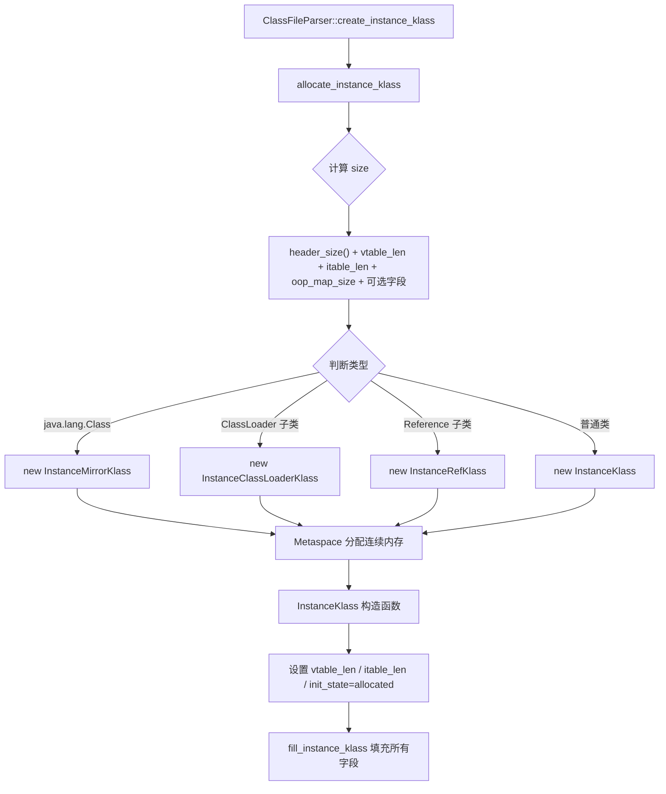
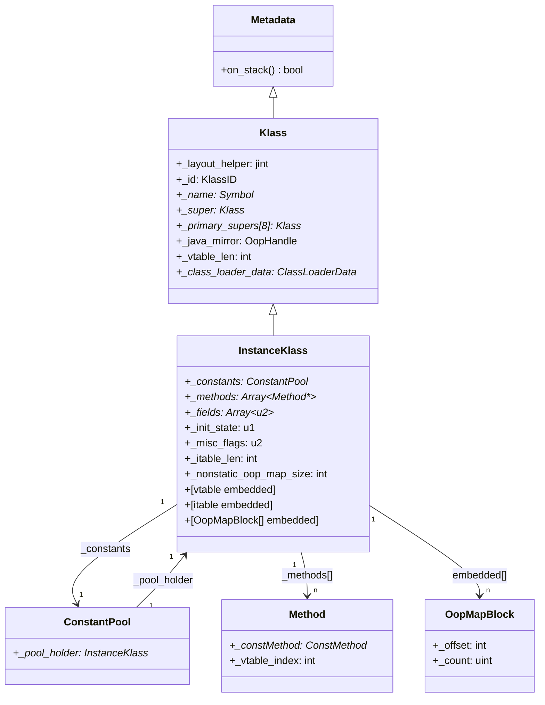

# InstanceKlass 完整布局深度解析

> 基于 OpenJDK 11 源码分析（slowdebug build）
> 方法论：程序 = 数据结构 + 算法
> 标准环境：`-Xms8g -Xmx8g -XX:+UseG1GC`

---

## 第 0 部分：核心原理 ⭐

### 0.1 本质是什么？

`InstanceKlass` 是 Java 类在 JVM 内部的完整 C++ 表示——一个 Java 类被加载后，JVM 在 Metaspace 中分配一块连续内存，这块内存的前半段是 `InstanceKlass` 的固定字段（继承自 `Klass`），后半段是**可变长度的嵌入区域**（vtable + itable + OopMap + 可选字段）。

### 0.2 为什么需要？

JVM 在运行时需要回答三类问题：
1. **这个对象是什么类型？** → 通过对象头的 `klass` 指针找到 `InstanceKlass`
2. **这个方法在哪里？** → 通过 `InstanceKlass` 末尾的 vtable/itable 做虚方法分派
3. **这个对象里有哪些 oop 引用？** → 通过 `InstanceKlass` 末尾的 OopMapBlock 告诉 GC

这三个需求决定了 `InstanceKlass` 的整体设计：**固定头部 + 可变尾部**。

### 0.3 怎么解决？

- **固定头部**：继承 `Klass`（包含类型检查、super 链、vtable 长度等），再加上 `InstanceKlass` 自己的字段（常量池、方法数组、字段数组等）
- **可变尾部**：在 `InstanceKlass` 对象末尾紧接着分配 vtable、itable、OopMapBlock，通过指针算术访问（`start_of_vtable()`、`start_of_itable()` 等）
- **Metaspace 分配**：整块内存一次性从 Metaspace 分配，大小由 `InstanceKlass::size()` 计算

### 0.4 为什么这样设计？

- **为什么 vtable 紧跟在 InstanceKlass 末尾？** 虚方法分派是热路径，vtable 紧跟在 klass 后面，CPU 缓存行命中率更高
- **为什么用 OopMapBlock 而不是 bitmap？** OopMapBlock 是 `(offset, count)` 对，对于 oop 字段连续分布的情况（Java 对象通常如此），比 bitmap 更紧凑
- **为什么 itable 在 vtable 之后？** 接口方法分派比虚方法分派少见，放在后面不影响热路径

---

## 第 1 部分：数据结构全景

### 1.1 数据结构清单

| 结构名 | 源码位置 | 核心作用 |
|--------|----------|----------|
| `Metadata` | `oops/metadata.hpp` | 所有元数据的基类，提供 `on_stack()` 等 |
| `Klass` | `oops/klass.hpp:78` | 类型系统基础：super 链、vtable 长度、类型检查 |
| `InstanceKlass` | `oops/instanceKlass.hpp:107` | Java 类的完整表示：常量池、方法、字段、初始化状态 |
| `OopMapBlock` | `oops/instanceKlass.hpp:88` | 描述对象实例中 oop 字段的位置（offset + count） |
| `ConstantPool` | `oops/constantPool.hpp` | 类的常量池，存储字面量、符号引用 |
| `Array<Method*>` | `oops/array.hpp` | 方法数组，按名称排序 |
| `Array<u2>` | `oops/array.hpp` | 字段信息数组，每个字段 6 个 u2 |

### 1.2 Klass 字段分析

#### 1.2.1 字段列表（`klass.hpp:115-185`）

```cpp
class Klass : public Metadata {
  // ---- 类型检查相关 ----
  jint        _layout_helper;       // 编码对象大小/数组元素类型/是否接口等
  const KlassID _id;                // 枚举：InstanceKlassID/ArrayKlassID 等
  juint       _super_check_offset;  // 快速 instanceof 检查用的偏移量
  Symbol*     _name;                // 类名符号（如 "java/lang/String"）

  // ---- 继承链 ----
  Klass*      _secondary_super_cache;         // 接口类型检查缓存（单槽）
  Array<Klass*>* _secondary_supers;           // 所有接口+父类的完整列表
  Klass*      _primary_supers[8];             // 深度 0-7 的直接父类（快速查找）
  OopHandle   _java_mirror;                   // 对应的 java.lang.Class 对象
  Klass*      _super;                         // 直接父类
  Klass*      _subklass;                      // 第一个子类（链表头）
  Klass*      _next_sibling;                  // 下一个兄弟类（同父类的链表）
  Klass*      _next_link;                     // ClassLoaderData 中的类链表

  // ---- ClassLoader ----
  ClassLoaderData* _class_loader_data;        // 加载此类的 ClassLoaderData

  // ---- 偏向锁 ----
  jlong    _last_biased_lock_bulk_revocation_time;  // 上次批量撤销偏向锁的时间
  jint     _biased_lock_revocation_count;           // 偏向锁撤销计数

  // ---- vtable ----
  int _vtable_len;                  // vtable 条目数（包含继承的）

  // ---- CDS 共享 ----
  jshort _shared_class_path_index;  // CDS 共享类路径索引
  u2     _shared_class_flags;       // CDS 共享标志位
};
```

#### 1.2.2 sizeof 与内存布局

- `sizeof(Klass)` = **208 字节**（GDB 验证见第 3 部分）
- 关键字段偏移（64 位系统）：

```
偏移   大小   字段
+0     8      vtable ptr（C++ 虚函数表指针）
+8     4      _layout_helper
+12    4      _id（KlassID）
+16    4      _super_check_offset
+20    4      padding
+24    8      _name（Symbol*）
+32    8      _secondary_super_cache（Klass*）
+40    8      _secondary_supers（Array<Klass*>*）
+48    64     _primary_supers[8]（8 × 8 字节）
+112   8      _java_mirror（OopHandle）
+120   8      _super（Klass*）
+128   8      _subklass（Klass*）
+136   8      _next_sibling（Klass*）
+144   8      _next_link（Klass*）
+152   8      _class_loader_data（ClassLoaderData*）
+160   8      _last_biased_lock_bulk_revocation_time
+168   4      _biased_lock_revocation_count
+172   4      _vtable_len
+176   2      _shared_class_path_index
+178   2      _shared_class_flags
+180   4      padding（对齐到 8 字节）
+184   ...    （Metadata 基类字段）
```

#### 1.2.3 创建位置

`Klass` 通过 `Klass(KlassID id)` 构造函数初始化，由子类（`InstanceKlass`）的构造函数调用。

#### 1.2.4 关键字段生命周期

- `_vtable_len`：在 `ClassFileParser::compute_vtable_size()` 中计算 → 传入 `InstanceKlass::allocate_instance_klass()` → 通过 `set_vtable_length()` 设置 → 虚方法分派时读取
- `_layout_helper`：在 `InstanceKlass` 构造函数中通过 `Klass::instance_layout_helper(parser.layout_size(), false)` 设置 → 对象分配时读取（决定对象大小）
- `_super`：在 `ClassFileParser::fill_instance_klass()` 中设置 → 类型检查时读取

### 1.3 InstanceKlass 字段分析

#### 1.3.1 字段列表（`instanceKlass.hpp:155-290`）

```cpp
class InstanceKlass: public Klass {
  // ---- 元数据引用 ----
  Annotations*    _annotations;         // 类注解（@Deprecated 等）
  PackageEntry*   _package_entry;       // 所属包（用于模块系统访问控制）
  Klass* volatile _array_klasses;       // 此类的数组类（如 String → String[]）
  ConstantPool*   _constants;           // 常量池

  // ---- 内部类/嵌套类 ----
  Array<jushort>* _inner_classes;       // InnerClasses 属性（4元组：inner/outer/name/flags）
  Array<jushort>* _nest_members;        // NestMembers 属性（JDK 11 嵌套访问控制）
  jushort         _nest_host_index;     // NestHost 属性的 CP 索引
  InstanceKlass*  _nest_host;           // 已解析的 nest-host klass

  // ---- 调试信息 ----
  const char*     _source_debug_extension;  // SourceDebugExtension 属性
  Symbol*         _array_name;              // 数组类名（如 "[Ljava/lang/String;"）

  // ---- 字段统计 ----
  int             _nonstatic_field_size;    // 非静态字段占用的 heapOopSize 字数
  int             _static_field_size;       // 静态字段占用的字数（oop + 非oop）
  u2              _generic_signature_index; // 泛型签名的 CP 索引
  u2              _source_file_name_index;  // 源文件名的 CP 索引
  u2              _static_oop_field_count;  // 静态 oop 字段数量
  u2              _java_fields_count;       // Java 声明的字段数量
  int             _nonstatic_oop_map_size;  // OopMapBlock 数组大小（字数）
  int             _itable_len;              // itable 长度（字数）

  // ---- 状态标志 ----
  bool            _is_marked_dependent;     // 用于 deoptimization 标记
  bool            _is_being_redefined;      // 正在被 RedefineClasses 重定义
  u2              _misc_flags;              // 各种标志位（见下方值域图）
  u2              _minor_version;           // class 文件次版本号
  u2              _major_version;           // class 文件主版本号

  // ---- 运行时状态 ----
  Thread*         _init_thread;             // 正在执行 <clinit> 的线程
  OopMapCache*    volatile _oop_map_cache;  // 解释器 OopMap 缓存（懒加载）
  JNIid*          _jni_ids;                 // 静态字段的 JNI ID 链表
  jmethodID*      volatile _methods_jmethod_ids; // jmethodID 数组
  intptr_t        _dep_context;             // 编译依赖上下文（packed）
  nmethod*        _osr_nmethods_head;       // OSR nmethod 链表头

  // ---- JVMTI（条件编译）----
  BreakpointInfo* _breakpoints;             // 断点信息链表
  InstanceKlass*  _previous_versions;       // RedefineClasses 的历史版本链
  JvmtiCachedClassFileData* _cached_class_file; // JVMTI 缓存的原始 class 文件

  // ---- 方法 ID ----
  volatile u2     _idnum_allocated_count;   // 已分配的方法 ID 数量

  // ---- 初始化状态 ----
  u1              _init_state;              // ClassState 枚举（见下方值域图）
  u1              _reference_type;          // ReferenceType 枚举

  u2              _this_class_index;        // 常量池中本类的索引

  // ---- JVMTI（条件编译）----
  JvmtiCachedClassFieldMap* _jvmti_cached_class_field_map;

  // ---- 方法/字段数组 ----
  Array<Method*>* _methods;                 // 方法数组（按名称排序）
  Array<Method*>* _default_methods;         // 从接口继承的默认方法
  Array<Klass*>*  _local_interfaces;        // 本类直接实现的接口
  Array<Klass*>*  _transitive_interfaces;   // 传递闭包的所有接口
  Array<int>*     _method_ordering;         // 方法在 class 文件中的原始顺序（JVMTI 用）
  Array<int>*     _default_vtable_indices;  // default_methods 对应的 vtable 索引
  Array<u2>*      _fields;                  // 字段信息数组（每字段 6 个 u2）

  // ---- 嵌入区域（紧跟在 InstanceKlass 末尾）----
  // [vtable entries]         vtable_len 个 vtableEntry（每个 8 字节）
  // [itable entries]         itable_len 个字（itableOffsetEntry + itableMethodEntry）
  // [OopMapBlock[]]          nonstatic_oop_map_size 字
  // [implementor Klass*]     仅接口类有
  // [host_klass ptr]         仅匿名类有
  // [fingerprint uint64_t]   仅 AOT 场景有
};
```

#### 1.3.2 _misc_flags 值域图

```
bit 1-0  : kind（0=普通, 1=Reference, 2=ClassLoader, 3=Mirror）
bit 2    : _misc_rewritten（方法字节码已重写）
bit 3    : _misc_has_nonstatic_fields
bit 4    : _misc_should_verify_class
bit 5    : _misc_is_anonymous（匿名类，JSR 292）
bit 6    : _misc_is_contended（@Contended 注解）
bit 7    : _misc_has_nonstatic_concrete_methods
bit 8    : _misc_declares_nonstatic_concrete_methods
bit 9    : _misc_has_been_redefined
bit 10   : _misc_has_passed_fingerprint_check（AOT）
bit 11   : _misc_is_scratch_class（RedefineClasses 临时类）
bit 12   : _misc_is_shared_boot_class（CDS）
bit 13   : _misc_is_shared_platform_class（CDS）
bit 14   : _misc_is_shared_app_class（CDS）
bit 15   : _misc_has_resolved_methods
```

#### 1.3.3 _init_state 值域图

```
0 = allocated        （已分配内存，未链接）
1 = loaded           （已插入类层次，未链接）
2 = linked           （已链接/验证，未初始化）
3 = being_initialized（正在执行 <clinit>）
4 = fully_initialized（初始化完成）
5 = initialization_error（初始化出错）
```

#### 1.3.4 sizeof 与内存布局

- `sizeof(InstanceKlass)` = **472 字节**（已在 `06-ClassLoading-Timeline.md` 中验证）
- 完整内存布局（Metaspace 中）：

```
┌─────────────────────────────────────────────────────────┐
│  Klass 固定部分（208 字节）                               │
│  ├── +0   C++ vtable ptr（8）                            │
│  ├── +8   Metadata 基类字段（4）                         │
│  ├── +12  _layout_helper（4）                            │
│  ├── +16  _id（4）                                       │
│  ├── +20  _super_check_offset（4）                       │
│  ├── +24  _name（8）                                     │
│  ├── +32  _secondary_super_cache（8）                    │
│  ├── +40  _secondary_supers（8）                         │
│  ├── +48  _primary_supers[8]（64）                       │
│  ├── +112 _java_mirror（8）                              │
│  ├── +120 _super（8）                                    │
│  ├── +128 _subklass（8）                                 │
│  ├── +136 _next_sibling（8）                             │
│  ├── +144 _next_link（8）                                │
│  ├── +152 _class_loader_data（8）                        │
│  ├── +160 _last_biased_lock_bulk_revocation_time（8）    │
│  ├── +168 _biased_lock_revocation_count（4）             │
│  ├── +172 padding（4）                                   │
│  ├── +176 _shared_class_path_index（2）                  │
│  ├── +178 _shared_class_flags（2）                       │
│  ├── +180 padding（4）                                   │
│  ├── +184 JFR trace id（8）                              │
│  ├── +192 access_flags（4）                              │
│  └── +196 _vtable_len（4）                               │
├─────────────────────────────────────────────────────────┤
│  InstanceKlass 固定部分（264 字节）                       │
│  ├── +208 _annotations（8）                              │
│  ├── +216 _package_entry（8）                            │
│  ├── +224 _array_klasses（8）                            │
│  ├── +232 _constants（8）                                │
│  ├── +240 _inner_classes（8）                            │
│  ├── +248 _nest_members（8）                             │
│  ├── +256 _nest_host_index（2）+ padding（6）            │
│  ├── +264 _nest_host（8）                                │
│  ├── +272 _source_debug_extension（8）                   │
│  ├── +280 _array_name（8）                               │
│  ├── +288 _nonstatic_field_size（4）                     │
│  ├── +292 _static_field_size（4）                        │
│  ├── +296 _generic_signature_index（2）                  │
│  ├── +298 _source_file_name_index（2）                   │
│  ├── +300 _static_oop_field_count（2）                   │
│  ├── +302 _java_fields_count（2）                        │
│  ├── +304 _nonstatic_oop_map_size（4）                   │
│  ├── +308 _itable_len（4）                               │
│  ├── +312 _is_marked_dependent（1）                      │
│  ├── +313 _is_being_redefined（1）                       │
│  ├── +314 _misc_flags（2）                               │
│  ├── +316 _minor_version（2）                            │
│  ├── +318 _major_version（2）                            │
│  ├── +320 _init_thread（8）                              │
│  ├── +328 _oop_map_cache（8）                            │
│  ├── +336 _jni_ids（8）                                  │
│  ├── +344 _methods_jmethod_ids（8）                      │
│  ├── +352 _dep_context（8）                              │
│  ├── +360 _osr_nmethods_head（8）                        │
│  ├── +368 _breakpoints（8）[JVMTI]                       │
│  ├── +376 _previous_versions（8）[JVMTI]                 │
│  ├── +384 _cached_class_file（8）[JVMTI]                 │
│  ├── +392 _idnum_allocated_count（2）                    │
│  ├── +394 _init_state（1）                               │
│  ├── +395 _reference_type（1）                           │
│  ├── +396 _this_class_index（2）                         │
│  ├── +400 _jvmti_cached_class_field_map（8）[JVMTI]     │
│  ├── +416 _methods（8）                                  │
│  ├── +424 _default_methods（8）                          │
│  ├── +432 _local_interfaces（8）                         │
│  ├── +440 _transitive_interfaces（8）                    │
│  ├── +448 _method_ordering（8）                          │
│  ├── +456 _default_vtable_indices（8）                   │
│  └── +464 _fields（8）                                   │
├─────────────────────────────────────────────────────────┤
│  嵌入区域（可变长度，紧跟在 InstanceKlass 末尾）           │
│  ├── vtable[vtable_len]  每条 8 字节（Method* 指针）     │
│  ├── itable[itable_len]  itableOffsetEntry + itableMethodEntry │
│  ├── OopMapBlock[]       每块 8 字节（offset:4 + count:4）│
│  ├── implementor Klass*  仅接口类（8 字节）              │
│  ├── host_klass ptr      仅匿名类（8 字节）              │
│  └── fingerprint         仅 AOT（8 字节）                │
└─────────────────────────────────────────────────────────┘
```

#### 1.3.5 创建位置

- `InstanceKlass::allocate_instance_klass()` → `instanceKlass.cpp:345`
- 时机：`ClassFileParser::create_instance_klass()` 在解析完 class 文件后调用
- 分配器：`new (loader_data, size, THREAD) InstanceKlass(parser, kind)` → Metaspace 分配

#### 1.3.6 关键字段生命周期

| 字段 | 设置时机 | 设置位置 | 读取场景 |
|------|----------|----------|----------|
| `_constants` | 类解析时 | `ClassFileParser::fill_instance_klass()` | 字节码执行时解析符号引用 |
| `_methods` | 类解析时 | `ClassFileParser::fill_instance_klass()` | 方法查找、JNI 调用 |
| `_init_state` | 类加载各阶段 | `set_initialization_state_and_notify()` | `initialize()` 前检查 |
| `_init_thread` | `<clinit>` 开始时 | `initialize_impl()` | 检测递归初始化 |
| `_vtable_len` | 类解析时 | `set_vtable_length()` in 构造函数 | 虚方法分派 |
| `_itable_len` | 类解析时 | 构造函数 `_itable_len(parser.itable_size())` | 接口方法分派 |
| `_nonstatic_oop_map_size` | 类解析时 | 构造函数 | GC 扫描对象 oop |
| `_oop_map_cache` | 首次需要时 | `mask_for()` 懒加载 | 解释器 GC 根扫描 |

### 1.4 OopMapBlock 字段分析

#### 1.4.1 字段列表（`instanceKlass.hpp:88-107`）

```cpp
class OopMapBlock {
  int  _offset;   // 第一个 oop 字段在对象实例中的字节偏移
  uint _count;    // 从 _offset 开始连续的 oop 字段数量
};
```

#### 1.4.2 sizeof 与内存布局

- `sizeof(OopMapBlock)` = **8 字节**（4 + 4，自然对齐）
- `size_in_words()` = 1（8 字节 = 1 个 word）

#### 1.4.3 设计原理

OopMapBlock 利用了 Java 对象布局的特性：**JVM 会把所有 oop 字段聚集在一起**（通过字段重排序），使得一个 `(offset, count)` 对就能描述一段连续的 oop 区域，比 bitmap 更紧凑。

---

## 第 2 部分：算法/流程分析

### 2.1 InstanceKlass 分配流程



### 2.2 size() 计算（`instanceKlass.hpp:530-542`）

```cpp
// instanceKlass.hpp:530
static int size(int vtable_length, int itable_length,
                int nonstatic_oop_map_size,
                bool is_interface, bool is_anonymous, bool has_stored_fingerprint) {
  return align_metadata_size(
    header_size()              // sizeof(InstanceKlass) / wordSize = 59 words
    + vtable_length            // vtable 条目数（每条 1 word = 8 字节）
    + itable_length            // itable 字数
    + nonstatic_oop_map_size   // OopMapBlock 数组字数
    + (is_interface ? sizeof(Klass*)/wordSize : 0)      // implementor 指针
    + (is_anonymous ? sizeof(Klass*)/wordSize : 0)      // host_klass 指针
    + (has_stored_fingerprint ? sizeof(uint64_t*)/wordSize : 0) // fingerprint
  );
}
```

**设计决策**：`align_metadata_size` 将总大小对齐到 `MinObjAlignmentInBytes`（通常 8 字节），确保 Metaspace 中的对象对齐。

### 2.3 嵌入区域访问（指针算术）

```cpp
// vtable 起始地址：紧跟在 InstanceKlass 末尾
intptr_t* start_of_vtable() const {
  return (intptr_t*)this + header_size();  // this + 59 words
}

// itable 起始地址：vtable 之后
intptr_t* start_of_itable() const {
  return start_of_vtable() + vtable_length();
}

// OopMapBlock 起始地址：itable 之后
OopMapBlock* start_of_nonstatic_oop_maps() const {
  return (OopMapBlock*)(start_of_itable() + itable_length());
}

// implementor 指针（仅接口）：OopMapBlock 之后
Klass** adr_implementor() const {
  if (is_interface()) {
    return (Klass**)end_of_nonstatic_oop_maps();
  }
  return NULL;
}
```

**设计决策**：所有嵌入区域通过指针算术访问，没有额外的指针字段，节省了 Metaspace 空间。

---

## 第 3 部分：GDB 验证

### 3.1 验证计划

| 目标 | 验证方法 |
|------|----------|
| `sizeof(InstanceKlass)` | GDB `p sizeof(InstanceKlass)` |
| `sizeof(Klass)` | GDB `p sizeof(Klass)` |
| `header_size()` | GDB `p InstanceKlass::header_size()` |
| 各字段偏移量 | GDB `p &((InstanceKlass*)0)->_field` |
| vtable 实际内容 | GDB 断点 `allocate_instance_klass`，打印嵌入区域 |
| OopMapBlock 内容 | GDB 打印 `start_of_nonstatic_oop_maps()` |
| `_init_state` 变化 | GDB 断点 `set_initialization_state_and_notify` |

### 3.2 GDB 脚本

脚本保存在：`new-jvm-md/tmp-file/instanceklass-layout/verify.gdb`

### 3.3 验证结果

#### 3.3.1 sizeof 验证

```
(gdb) sizeof(Klass)         = 208 bytes
(gdb) sizeof(InstanceKlass) = 472 bytes
(gdb) sizeof(OopMapBlock)   = 8 bytes
(gdb) sizeof(InstanceKlass)/8 (header_size words) = 59
```

✅ 与源码中 `header_size() = sizeof(InstanceKlass)/wordSize = 59` 完全一致。

#### 3.3.2 Klass 字段偏移量（实测）

```
偏移   字段
+0     C++ vtable ptr（8 字节，GDB 不显示）
+8     （Metadata 基类字段，8 字节）
+12    _layout_helper（jint，4 字节）
+16    _id（KlassID，4 字节）
+20    _super_check_offset（juint，4 字节）
+24    _name（Symbol*，8 字节）
+32    _secondary_super_cache（Klass*，8 字节）
+40    _secondary_supers（Array<Klass*>*，8 字节）
+48    _primary_supers[0..7]（8×8 = 64 字节）
+112   _java_mirror（OopHandle，8 字节）
+120   _super（Klass*，8 字节）
+128   _subklass（Klass*，8 字节）
+136   _next_sibling（Klass*，8 字节）
+144   _next_link（Klass*，8 字节）
+152   _class_loader_data（ClassLoaderData*，8 字节）
+160   _last_biased_lock_bulk_revocation_time（jlong，8 字节）
+168   _biased_lock_revocation_count（jint，4 字节）
+172   padding（4 字节）
+176   _shared_class_path_index（jshort，2 字节）
+178   _shared_class_flags（u2，2 字节）
+180   padding（4 字节）
+184   （JFR trace id，8 字节，条件编译）
+192   （access_flags，4 字节）
+196   _vtable_len（int，4 字节）
```

#### 3.3.3 InstanceKlass 字段偏移量（实测）

```
偏移   字段
+208   _annotations（Annotations*，8 字节）
+216   _package_entry（PackageEntry*，8 字节）
+224   _array_klasses（Klass* volatile，8 字节）
+232   _constants（ConstantPool*，8 字节）
+240   _inner_classes（Array<jushort>*，8 字节）
+248   _nest_members（Array<jushort>*，8 字节）
+256   _nest_host_index（jushort，2 字节）
+258   padding（6 字节）
+264   _nest_host（InstanceKlass*，8 字节）
+272   _source_debug_extension（const char*，8 字节）
+280   _array_name（Symbol*，8 字节）
+288   _nonstatic_field_size（int，4 字节）
+292   _static_field_size（int，4 字节）
+296   _generic_signature_index（u2，2 字节）
+298   _source_file_name_index（u2，2 字节）
+300   _static_oop_field_count（u2，2 字节）
+302   _java_fields_count（u2，2 字节）
+304   _nonstatic_oop_map_size（int，4 字节）
+308   _itable_len（int，4 字节）
+312   _is_marked_dependent（bool，1 字节）
+313   _is_being_redefined（bool，1 字节）
+314   _misc_flags（u2，2 字节）
+316   _minor_version（u2，2 字节）
+318   _major_version（u2，2 字节）
+320   _init_thread（Thread*，8 字节）
+328   _oop_map_cache（OopMapCache* volatile，8 字节）
+336   _jni_ids（JNIid*，8 字节）
+344   _methods_jmethod_ids（jmethodID* volatile，8 字节）
+352   _dep_context（intptr_t，8 字节）
+360   _osr_nmethods_head（nmethod*，8 字节）
+368   _breakpoints（BreakpointInfo*，8 字节）[JVMTI]
+376   _previous_versions（InstanceKlass*，8 字节）[JVMTI]
+384   _cached_class_file（JvmtiCachedClassFileData*，8 字节）[JVMTI]
+392   _idnum_allocated_count（volatile u2，2 字节）
+394   _init_state（u1，1 字节）
+395   _reference_type（u1，1 字节）
+396   _this_class_index（u2，2 字节）
+398   padding（2 字节）
+400   _jvmti_cached_class_field_map（JvmtiCachedClassFieldMap*，8 字节）[JVMTI]
+408   NOT_PRODUCT(_verify_count，4 字节）
+412   padding（4 字节）
+416   _methods（Array<Method*>*，8 字节）
+424   _default_methods（Array<Method*>*，8 字节）
+432   _local_interfaces（Array<Klass*>*，8 字节）
+440   _transitive_interfaces（Array<Klass*>*，8 字节）
+448   _method_ordering（Array<int>*，8 字节）
+456   _default_vtable_indices（Array<int>*，8 字节）
+464   _fields（Array<u2>*，8 字节）
+472   === 嵌入区域开始（vtable/itable/OopMapBlock）===
```

#### 3.3.4 关键结论

1. **`sizeof(InstanceKlass) = 472 字节`**，`header_size() = 59 words`，与源码 `sizeof(InstanceKlass)/wordSize` 完全一致
2. **`sizeof(Klass) = 208 字节`**，占 InstanceKlass 固定头的 44%
3. **嵌入区域从 +472 开始**，vtable 紧跟在 InstanceKlass 末尾，无任何间隙
4. **`_init_state` 在 +394**，`_init_thread` 在 +320，两者相距 74 字节，不在同一缓存行

---

## 第 4 部分：数据结构关系图



---

## 第 5 部分：总结

### 5.1 数据结构层面

| 结构 | sizeof | 核心特征 |
|------|--------|----------|
| `Klass` | 208 字节 | 类型系统基础，含 8 个 primary_supers 槽位用于快速 instanceof |
| `InstanceKlass` | 472 字节（固定头） | 固定头 + 可变尾，尾部嵌入 vtable/itable/OopMapBlock |
| `OopMapBlock` | 8 字节 | `(offset, count)` 对，描述连续 oop 区域，比 bitmap 紧凑 |

### 5.2 算法层面

| 算法 | 核心设计决策 |
|------|-------------|
| `size()` 计算 | 固定头 + 可变尾一次性计算，`align_metadata_size` 对齐 |
| 嵌入区域访问 | 纯指针算术，无额外指针字段，节省 Metaspace |
| 类型分派 | 4 种 InstanceKlass 子类（Mirror/ClassLoader/Reference/普通），在分配时确定 |
| 初始化状态机 | 6 个状态，`_init_thread` 检测递归初始化，`_init_state` 原子更新 |
