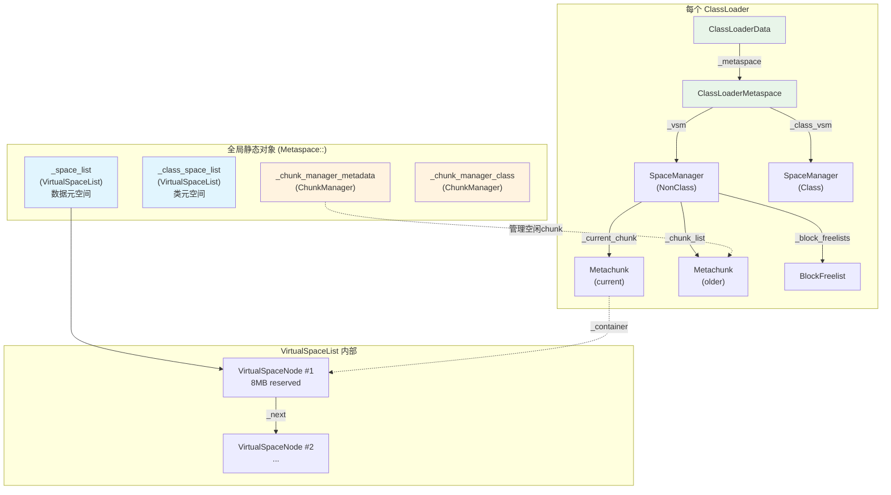
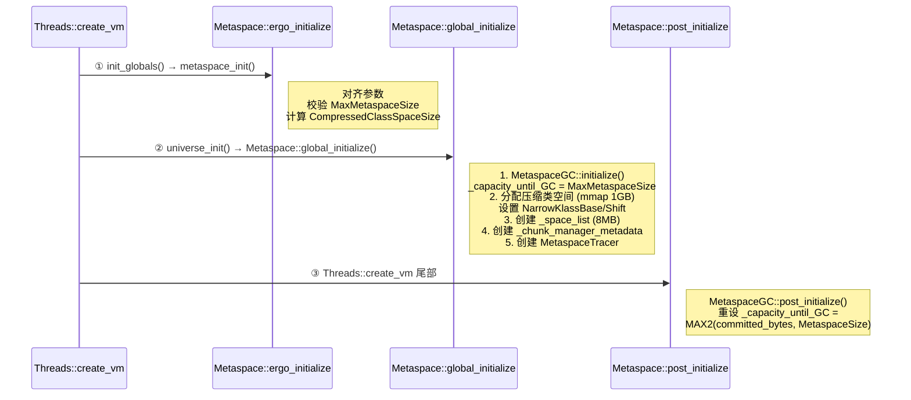

# Metaspace 整体架构（Day 22）

> **标准环境**：`-Xms8g -Xmx8g -XX:+UseG1GC`，G1 Region = 4MB  
> **源码版本**：OpenJDK 11

---

## 第 0 部分：核心原理 ⭐

### 0.1 本质是什么？

本文深入分析 **Metaspace 整体架构（Day 22）**：从源码角度理解其设计原理、实现机制和关键细节。

### 0.2 为什么需要？

理解 JVM 内部实现是排查复杂问题、进行性能优化的基础。表面的 API 文档无法解释 JVM 的实际行为，只有深入源码才能建立精确的心智模型。

### 0.3 怎么解决？

结合源码阅读、数据结构分析和 GDB 运行时验证，从多个角度建立对该机制的完整理解。

### 0.4 为什么这样设计？

每个设计决策都有其权衡：性能 vs 正确性、简单性 vs 灵活性、内存占用 vs 查找速度。理解这些权衡是理解 JVM 设计的关键。

---


## 一、Metaspace 解决了什么问题

### 1.1 场景

JVM 加载一个 Java 类时，需要在**非堆内存**中存储类的元数据：`InstanceKlass`、`Method`、`ConstantPool`、`Bytecode`、`Symbol` 等。这些数据的特点是：

- **生命周期与类加载器绑定**：一个类只有当它的类加载器被回收时才能被卸载
- **大小差异极大**：一个 `Symbol` 可能只有几十字节，一个 `InstanceKlass` 可能几 KB
- **数量巨大**：JVM 启动时要加载几千个类，大型应用可能加载数万个类

### 1.2 Java 7 及之前的 PermGen 问题

Java 7 用 PermGen（永久代）存储类元数据，它是 Java 堆的一部分，有固定上限（`-XX:MaxPermSize`，默认 64~256MB）。问题：

| 问题 | 表现 |
|------|------|
| **大小难调** | 设小了 OOM，设大了浪费。不同应用需要不同值 |
| **GC 效率低** | PermGen 参与 Full GC，但类卸载条件苛刻，大量元数据无法回收 |
| **碎片化** | 类加载/卸载频繁时（如热部署），PermGen 碎片严重 |
| **运维成本** | `-XX:MaxPermSize` 是最常见的 JVM 调参痛点 |

### 1.3 Metaspace 的核心思路

**一句话：用 native 内存取代 PermGen，按类加载器隔离管理，按需增长。**

| 维度 | PermGen | Metaspace |
|------|---------|-----------|
| 内存来源 | Java 堆的一部分 | Native 内存（mmap） |
| 大小限制 | 固定上限，需手动设置 | 默认无上限（受限于 OS），可选 `-XX:MaxMetaspaceSize` |
| GC 策略 | Full GC 时尝试卸载 | HWM 自适应 + GC 联动 |
| 隔离粒度 | 无隔离，所有类共享 | 按 ClassLoader 隔离，CL 死亡时整体回收 |
| 碎片控制 | 差 | Chunk 分级 + 合并/分裂 |

---

## 二、宏观架构

### 2.1 六层架构

Metaspace 是一个**六层的内存管理体系**，从底到顶：

```
┌─────────────────────────────────────────────────────────────────┐
│ Layer 6: Metaspace::allocate()                                  │ ← 全局入口，带 GC 重试
├─────────────────────────────────────────────────────────────────┤
│ Layer 5: ClassLoaderMetaspace                                   │ ← 每个 ClassLoader 一个
│          ├── _vsm (SpaceManager, NonClass)                      │
│          └── _class_vsm (SpaceManager, Class)                   │
├─────────────────────────────────────────────────────────────────┤
│ Layer 4: SpaceManager                                           │ ← 管理一个 CL 的所有 chunk
│          ├── _current_chunk (Metachunk)                          │
│          ├── _chunk_list (Metachunk 链表)                        │
│          └── _block_freelists (BlockFreelist, 回收小块)          │
├─────────────────────────────────────────────────────────────────┤
│ Layer 3: ChunkManager (全局，共 2 个)                           │ ← 空闲 chunk 的集散中心
│          ├── _free_chunks[3] (Specialized/Small/Medium 链表)    │
│          └── _humongous_dictionary (红黑树)                     │
├─────────────────────────────────────────────────────────────────┤
│ Layer 2: VirtualSpaceList → VirtualSpaceNode 链表               │ ← 虚拟内存池
│          每个 Node = 一块 mmap 预留的连续虚拟地址空间            │
│          内部用 bump pointer 切出 Metachunk                     │
├─────────────────────────────────────────────────────────────────┤
│ Layer 1: OS (mmap/munmap)                                       │ ← 操作系统内存管理
└─────────────────────────────────────────────────────────────────┘
```

### 2.2 全局组件关系



### 2.3 为什么分"数据元空间"和"类元空间"两套？

这是 **压缩类指针（Compressed Class Pointers）** 的要求。

在 64 位 JVM 中，每个 Java 对象头都包含一个指向 `Klass*` 的指针。原始 64 位指针太浪费，JVM 使用 32 位压缩指针表示：

```
实际地址 = NarrowKlassBase + (压缩指针 << NarrowKlassShift)
```

压缩为 32 位意味着 `Klass*` 的地址范围必须限制在 **4GB 以内**。因此 JVM 预留了一块 **固定 1GB** 的连续虚拟地址空间（紧挨 Java 堆上方），**专门**存放 `Klass` 结构。

这就是两套的原因：

| 空间 | 存储内容 | 地址约束 | 大小 |
|------|---------|---------|------|
| **类元空间（Class Space）** | `InstanceKlass`、`ArrayKlass`等 Klass 结构 | 必须在 NarrowKlassBase 起始的 4GB 内 | 默认 1GB，单个 VirtualSpaceNode |
| **数据元空间（Non-Class Space）** | `Method`、`ConstantPool`、`Bytecode`、`Symbol` 等 | 无地址约束 | 无固定上限，可多个 VirtualSpaceNode |

**GDB 验证**：

```
--- 压缩类空间 ---
_class_space_list = 0x7ffff0c8ae10
  _is_class = 1
  _reserved_words = 134217728 words = 1024 MB    ← 预留 1GB
  _committed_words = 49152 words = 384 KB         ← 实际使用 384KB
  ClassVSN.bottom = 0x800000000                   ← 紧挨 8GB Java 堆上方
  ClassVSN.high_boundary = 0x840000000            ← 0x800000000 + 1GB
  Narrow klass base: 0x800000000, shift: 0

--- 数据元空间 ---
_space_list = 0x7ffff0c8b010
  _is_class = 0
  _reserved_words = 1048576 words = 8192 KB       ← 预留 8MB
  _committed_words = 524288 words = 4096 KB        ← 实际提交 4MB
```

---

## 三、初始化流程

Metaspace 的初始化分三步，由 `Threads::create_vm()` 在不同阶段调用：



### 3.1 ergo_initialize()：参数人体工程学

```
源码：metaspace.cpp:1327-1382

核心逻辑：
1. _commit_alignment = os::vm_page_size()              → 4096（4KB 页）
2. _reserve_alignment = MAX2(page_size, allocation_granularity) → 4096
3. MaxMetaspaceSize 向下对齐到 _reserve_alignment
4. MetaspaceSize 向下对齐到 _commit_alignment
5. CompressedClassSpaceSize 向下对齐到 _reserve_alignment
6. 校验：MaxMetaspaceSize >= VIRTUALSPACEMULTIPLIER(2) * InitialBootClassLoaderMetaspaceSize(4MB) + CompressedClassSpaceSize
```

### 3.2 global_initialize()：创建全局数据结构

```
源码：metaspace.cpp:1384-1485

核心逻辑：
1. MetaspaceGC::initialize()
   → _capacity_until_GC = MaxMetaspaceSize (启动期间不触发 GC)

2. 分配压缩类空间（64 位系统 + UseCompressedClassPointers）
   → base = align_up(heap_end, _reserve_alignment) = 0x800000000
   → allocate_metaspace_compressed_klass_ptrs(base, 0)
     → ReservedSpace(CompressedClassSpaceSize=1GB, _reserve_alignment, false)
     → _class_space_list = new VirtualSpaceList(rs)
     → _chunk_manager_class = new ChunkManager(true)
     → set_narrow_klass_base_and_shift(base=0x800000000, rs.base())

3. 计算首个 chunk 大小
   → _first_chunk_word_size = InitialBootClassLoaderMetaspaceSize / BytesPerWord
     = 4MB / 8 = 524288 words
   → _first_class_chunk_word_size = MIN2(MediumChunk*6, CompressedClassSpaceSize*2/BytesPerWord)
     = MIN2(8K*6, 1GB*2/8) = 49152 words = 384KB

4. 计算初始虚拟空间大小
   → word_size = VIRTUALSPACEMULTIPLIER(2) * 524288 = 1048576 words = 8MB

5. 创建数据元空间
   → _space_list = new VirtualSpaceList(1048576 words)  // mmap 预留 8MB
   → _chunk_manager_metadata = new ChunkManager(false)

6. _tracer = new MetaspaceTracer()
7. _initialized = true
```

**为什么 Boot ClassLoader 的首个 chunk 设为 4MB？**

这是一个经过调优的值。JVM 启动时需要加载 ~1500 个核心类（`java.lang.Object`、`java.lang.String`、`java.lang.Class` 等），它们的元数据约需 3-4MB。设为 4MB 可以让启动阶段的大部分分配在一个连续 chunk 内完成，避免频繁申请新 chunk。

**为什么首个类 chunk 设为 384KB 而不是 MediumChunk (64KB)？**

源码注释说得很清楚：

> *Make the first class chunk bigger than a medium chunk so it's not put on the medium chunk list. The next chunk will be small and progress from there.*

如果首个类 chunk 只有 64KB，用完后归还时会进入 Medium 空闲链表。而 Boot ClassLoader 一直存活，这个 chunk 永远不会被归还，放在 Medium 链表只会造成混乱。设为 Humongous 大小（> Medium）可以避免这个问题。

### 3.3 post_initialize()：重设 GC 阈值

```
源码：metaspace.cpp:1487-1489

MetaspaceGC::post_initialize()
  → _capacity_until_GC = MAX2(committed_bytes(), MetaspaceSize)
```

启动期间 `_capacity_until_GC` 设为 `MaxMetaspaceSize`（几乎无限大），保证启动不被 GC 打断。启动完成后，重设为**当前已提交量**与 `MetaspaceSize`（默认 ~21MB）的较大者，从此开始正常的 GC 阈值管理。

---

## 四、分配流程（全链路）

### 4.1 分配入口：`Metaspace::allocate()`

这是 JVM 中任何需要元数据的地方（类加载、方法解析等）的统一入口：

```
源码：metaspace.cpp:1506-1554

Metaspace::allocate(loader_data, word_size, type, TRAPS)
│
├─ 1. 确定 mdtype: ClassType or NonClassType
│
├─ 2. loader_data->metaspace_non_null()->allocate(word_size, mdtype)
│     │
│     ├─ metaspace_non_null() — 延迟创建 ClassLoaderMetaspace
│     │   使用 DCL (Double-Checked Locking) + load_acquire/release_store
│     │   根据 ClassLoader 类型选择 MetaspaceType:
│     │     - null CL → BootMetaspaceType
│     │     - is_anonymous → AnonymousMetaspaceType
│     │     - DelegatingClassLoader → ReflectionMetaspaceType
│     │     - 其他 → StandardMetaspaceType
│     │
│     └─ ClassLoaderMetaspace::allocate() → SpaceManager::allocate()
│
├─ 3. 如果分配失败 → satisfy_failed_metadata_allocation()
│     触发 GC 回收 Metaspace，然后重试
│
├─ 4. 仍然失败 → report_metadata_oome()
│     抛出 java.lang.OutOfMemoryError: Metaspace
│     或 java.lang.OutOfMemoryError: Compressed class space
│
└─ 5. 成功 → Copy::fill_to_words(result, word_size, 0) // 零初始化
```

### 4.2 SpaceManager::allocate()：chunk 内部的 bump pointer 分配

```
源码：spaceManager.cpp:383-434

SpaceManager::allocate(word_size)
│
├─ 1. 对齐 word_size → raw_word_size (至少 Metablock 大小，对齐到 8 字节)
│
├─ 2. 尝试从 BlockFreelist 回收
│     if (_block_freelists != NULL && _block_freelists->total_size() > 4K words)
│       → _block_freelists->get_block(raw_word_size)
│
├─ 3. allocate_work(raw_word_size)
│     │
│     ├─ current_chunk()->allocate(word_size)  ← bump pointer
│     │   if (free_word_size() >= word_size):
│     │     result = _top; _top += word_size; return result;
│     │
│     └─ 空间不足 → grow_and_allocate(word_size)
│
└─ 4. 更新计数器 MetaspaceUtils::inc_used_words
```

### 4.3 SpaceManager::grow_and_allocate()：申请新 chunk

这是 Metaspace 最关键的增长路径：

```
源码：spaceManager.cpp:200-262

grow_and_allocate(word_size)
│
├─ 1. calc_chunk_size(word_size) → 决定新 chunk 大小
│     │
│     ├─ if word_size > MediumChunk → Humongous (对齐到 SpecializedChunk)
│     │
│     ├─ Anonymous/Reflection + NonClass:
│     │   前 4 个 chunk → SpecializedChunk (128 words = 1KB)  ← 省内存
│     │   之后 → SmallChunk (512 words = 4KB)
│     │
│     └─ 一般情况:
│         前 small_chunk_limit(4) 个 → SmallChunk (512 words = 4KB)
│         之后 → MediumChunk (8K words = 64KB)
│
├─ 2. 获取新 chunk
│     ├─ 先找 ChunkManager 空闲链表: chunk_freelist_allocate(chunk_size)
│     │   → ChunkManager::free_chunks_get(chunk_size)
│     │   → 可能触发 split（大 chunk 拆成小 chunk）
│     │
│     └─ 空闲链表没有 → VirtualSpaceList::get_new_chunk()
│         → VirtualSpaceNode::take_from_committed() (bump pointer 切 chunk)
│         → 如果需要 → VirtualSpaceNode::expand_by() (commit 更多物理内存)
│         → 如果当前节点空间不足 → retire + 创建新 VirtualSpaceNode
│
├─ 3. 退役旧 chunk（如果有，且新 chunk 不是 Humongous）
│     retire_current_chunk()
│     → 旧 chunk 剩余空间放入 BlockFreelist 回收
│
├─ 4. 设置新 chunk 为 current_chunk
│     → add_chunk(chunk, is_initializing=false)
│
└─ 5. 从新 chunk 分配: current_chunk()->allocate(word_size)
```

### 4.4 GDB 验证分配行为

```
Boot ClassLoader (type=1):
  首个 chunk: 524288 words (4MB, Humongous)
  用到 524280 words 后才 grow → 第二个 chunk (Small, 512 words)

Anonymous ClassLoader (type=2):
  首个 chunk: 128 words (1KB, Specialized) ← 因为 AnonymousMetaspaceType 限制
  128 words 中可用 = 128 - overhead(8) = 120 words
  用到 120 words 后 grow → 第二个 Specialized chunk

前 5 次 Metaspace::allocate:
  #1: loader_data=0x7ffff0c8c360, word_size=64, type=0 → 触发 Boot CLM 创建
  #2-5: 同一 loader_data, 相同参数 → 连续的 Klass 分配
```

---

## 五、核心数据结构详解

### 5.1 Chunk 大小层次

Metaspace 将内存划分为 **4 级 chunk**：

| 级别 | ChunkIndex | 非类空间 (words) | 非类空间 (bytes) | 类空间 (words) | 类空间 (bytes) |
|------|-----------|-----------------|-----------------|---------------|---------------|
| **Specialized** | 0 | 128 | 1 KB | 128 | 1 KB |
| **Small** | 1 | 512 | 4 KB | 256 | 2 KB |
| **Medium** | 2 | 8,192 | 64 KB | 4,096 | 32 KB |
| **Humongous** | 3 | > 8,192 (变长) | > 64 KB | > 4,096 (变长) | > 32 KB |

```
源码：metaspaceCommon.hpp:35-42 (ChunkSizes 枚举)

为什么类空间的 chunk 更小？
→ Klass 对象比 Method/ConstantPool 等小得多
→ 且类空间总量有限(1GB)，用更小 chunk 减少碎片
```

**设计者视角：为什么要分级？**

这是经典的 **伙伴系统(buddy system)** 思想的变体。小对象用小 chunk 避免浪费，大对象用大 chunk 避免碎片。4 级是平衡简单性和效率的结果：
- 2 级太粗，浪费严重
- 8 级太细，管理开销大
- 4 级（1KB → 4KB → 64KB → 变长）覆盖了常见的元数据大小分布

### 5.2 Metachunk 内存布局

```
源码：metachunk.hpp:42-53, 85-103

Metachunk 对象布局（对象头嵌入在 chunk 数据区域的开头）：

┌─────────────────────────────────────┐ 偏移 = bottom() = (MetaWord*)this
│ [Metabase fields]                   │
│   _word_size     : size_t   (8B)    │ chunk 总大小 (words)
│   _next          : Metachunk* (8B)  │ 空闲链表指针
│   _prev          : Metachunk* (8B)  │ 空闲链表指针
│ [Metachunk fields]                  │
│   _container     : VSNode*  (8B)    │ 所属 VirtualSpaceNode
│   _top           : MetaWord* (8B)   │ bump pointer
│   _sentinel      : uint32_t (4B)    │ 哨兵值 0x4d4554EF
│   _chunk_type    : ChunkIndex (4B)  │ 类型
│   _is_class      : bool     (1B)    │
│   _is_tagged_free: bool     (1B)    │
│   _origin        : ChunkOrigin(4B)  │
│   _use_count     : int      (4B)    │
│ [padding to alignment]              │
├─────────────────────────────────────┤ 偏移 = initial_top() = this + overhead()
│                                     │
│          可分配区域                   │  ← allocate() 从这里 bump
│       (used_word_size)              │
│                                     │
├─────────────────────────────────────┤ 偏移 = _top (当前分配指针)
│                                     │
│          空闲区域                     │  ← free_word_size()
│       (free_word_size)              │
│                                     │
└─────────────────────────────────────┘ 偏移 = end() = bottom + _word_size

关键: bottom() == (MetaWord*)this
     ↑ chunk 的地址就是 Metachunk 对象自身的地址
     overhead() = aligned sizeof(Metachunk) / BytesPerWord ≈ 8 words = 64 bytes
```

**设计者视角：为什么把 Metachunk 头嵌入 chunk 数据区开头？**

这是一个精妙的设计。通常的做法是在数据区外部维护一个元数据结构来描述 chunk（如 malloc 的 chunk header）。但 Metaspace 直接把 `Metachunk` 对象 placement new 到 chunk 数据区的起始位置，这样：
- **零额外寻址开销**：给定 chunk 地址就是 Metachunk 对象地址
- **内存紧凑**：不需要额外的映射表或指针数组
- **代价**：每个 chunk 浪费 ~64 字节（overhead），对于 Specialized chunk (1KB) 浪费约 6.25%

### 5.3 VirtualSpaceNode 地址空间布局

```
一个 VirtualSpaceNode 管理一块 mmap 预留的连续虚拟地址空间：

_low_boundary                                              _high_boundary
(rs.base)                                                  (rs.base + rs.size)
  |                                                              |
  v                                                              v
  [=========committed============|------uncommitted--------------]
  ^              ^               ^
  bottom()       _top            end()
  (_vs._low)                     (_vs._high)

  bottom() → _top:  已分配给 Metachunk 的区域（一个挨一个排列）
  _top → end():     已提交但未分配的空闲空间（等待切出新 chunk）
  end() → high_boundary(): 已预留但未提交的空间（mmap PROT_NONE）

GDB 验证（数据元空间第一个节点）：
  bottom       = 0x7fffceaf1000
  _top         = 0x7fffceef1000  (top == end，提交的全用完了)
  end          = 0x7fffceef1000
  high_boundary= 0x7fffcf2f1000
  committed    = 4194304 bytes = 4MB
  reserved     = 8388608 bytes = 8MB
  container_count = 1 (只有一个活跃 chunk：Boot CL 的 4MB chunk)
```

### 5.4 ChunkManager：空闲 chunk 的集散中心

```
ChunkManager 字段：
  _free_chunks[3]      : ChunkList[3]      → Specialized/Small/Medium 各一个双向链表
  _humongous_dictionary: ChunkTreeDictionary → 红黑树，按大小组织 Humongous chunk
  _free_chunks_total   : size_t             → 空闲 chunk 总 word 数
  _free_chunks_count   : size_t             → 空闲 chunk 总数
  _is_class            : bool               → 是否管理类空间

工作机制：
  分配: free_chunks_get(size)
    → 先从对应大小的链表取
    → 没有则尝试 split 更大的 chunk
    → 都没有则返回 NULL（由 VirtualSpaceList 提供新 chunk）

  归还: return_single_chunk(chunk)
    → 放回对应链表
    → 尝试 coalesce（合并相邻的空闲 chunk 为更大的 chunk）

合并条件：
  1. 相邻 chunk 都是空闲的
  2. 在同一个 VirtualSpaceNode 中
  3. 在已提交区域内
  4. 对齐到目标大小边界
```

### 5.5 OccupancyMap：chunk 分裂/合并的关键助手

```
源码：occupancyMap.hpp

每个 VirtualSpaceNode 拥有一个 OccupancyMap 位图。
位图中每 1 bit 对应一个 SpecializedChunk 大小(128 words = 1KB)的区域。

两层位图：
  Layer 0 (chunk_start_map): 标记"这个位置是某个 chunk 的起始"
  Layer 1 (in_use_map):      标记"这个区域属于一个正在使用(非空闲)的 chunk"

用途：
  - 分配时: 设置 chunk_start=1, in_use=1
  - 归还时: 设置 in_use=0
  - 合并时: 检查目标区域内所有 bit 的 in_use 是否都为 0（全空闲才能合并）
  - 分裂时: 在新 chunk 起始位置设置 chunk_start=1

为什么需要它？
  → 没有 OccupancyMap，合并操作需要遍历所有 chunk 链表检查相邻关系
  → 有了它，O(1) 查询任意位置的 chunk 状态
```

### 5.6 BlockFreelist：回收"暗物质"

```
源码：blockFreelist.hpp/cpp, smallBlocks.hpp/cpp

当一个 Metachunk 还有剩余空间但被退役时（SpaceManager 切换到新 chunk），
剩余的小块空间不能直接归还给 ChunkManager（因为它不是完整的 chunk），
而是放入 SpaceManager 的 BlockFreelist 中回收利用。

BlockFreelist 内部：
  _dictionary  : BlockTreeDictionary (红黑树，存较大的块 >= ~24 bytes)
  _small_blocks: SmallBlocks (数组型空闲链表，存极小的块 3~23 words)

SmallBlocks:
  _small_lists[max-min]: 每个大小精确匹配一个 FreeList
  get_block(size) → O(1) 精确匹配

get_block(word_size) 逻辑：
  1. 如果 < small_block_max_size → 从 SmallBlocks 精确匹配
  2. 如果 < min_dictionary_size → 返回 NULL（太小，是"暗物质"）
  3. 从字典找 >= word_size 的块
  4. 如果块 > 4 * word_size → 浪费太大，放回，返回 NULL
  5. 多余部分切割后放回

SpaceManager::allocate() 中：
  仅当 _block_freelists->total_size() > allocation_from_dictionary_limit(4K words)
  时才尝试从 BlockFreelist 分配
  → 避免在碎片回收上花太多时间
```

---

## 六、GC 联动：MetaspaceGC

### 6.1 HWM（高水位线）机制

Metaspace 不在每次分配时都检查是否需要 GC，而是维护一个 **_capacity_until_GC** 阈值：

```
┌──────────────────────────────────────────────────────┐
│                MaxMetaspaceSize (default: ~无限大)     │
│   ┌──────────────────────────────────┐               │
│   │      _capacity_until_GC (HWM)    │ ← GC 触发线   │
│   │   ┌──────────────────┐           │               │
│   │   │  committed_bytes  │ ← 实际用量│               │
│   │   └──────────────────┘           │               │
│   └──────────────────────────────────┘               │
└──────────────────────────────────────────────────────┘
```

- 当 `committed_bytes` 接近 `_capacity_until_GC` 时，触发 GC
- GC 后调用 `MetaspaceGC::compute_new_size()` 重新计算 HWM

### 6.2 compute_new_size()：自适应调整

```
源码：metaspace.cpp:244-359

GC 后重算策略：

1. used_after_gc = committed_bytes() (包含空闲 chunk)

2. 需要扩展？
   minimum_desired_capacity = used / (1 - MinMetaspaceFreeRatio/100)
   → MinMetaspaceFreeRatio 默认 40%
   → 即至少保留 40% 空闲空间
   如果 HWM < minimum_desired → 增加 HWM

3. 需要缩减？
   maximum_desired_capacity = used / (1 - MaxMetaspaceFreeRatio/100)
   → MaxMetaspaceFreeRatio 默认 70%
   → 空闲超过 70% 就该缩
   如果 HWM > maximum_desired → 缩减 HWM

4. 缩减阻尼（渐进式缩减）：
   第 1 次 GC: _shrink_factor = 0  → 缩减 0%（不缩）
   第 2 次 GC: _shrink_factor = 10 → 缩减 10%
   第 3 次 GC: _shrink_factor = 40 → 缩减 40%
   第 4 次 GC: _shrink_factor = 100 → 缩减 100%

   为什么渐进式？源码注释：
   "We don't want shrink all the way back to initSize if people call System.gc(),
    because some programs do that between 'phases' and then we'd just have to
    grow the heap up again for the next phase."
```

**JVM 参数**：

| 参数 | 默认值 | 含义 |
|------|-------|------|
| `-XX:MetaspaceSize` | ~21MB | 初始 GC 阈值 |
| `-XX:MaxMetaspaceSize` | ~无限大 | 最大 Metaspace |
| `-XX:MinMetaspaceFreeRatio` | 40 | GC 后最低空闲比例 |
| `-XX:MaxMetaspaceFreeRatio` | 70 | GC 后最高空闲比例 |
| `-XX:MinMetaspaceExpansion` | ~332KB | 最小扩展量 |
| `-XX:MaxMetaspaceExpansion` | ~5MB | 最大扩展量 |
| `-XX:CompressedClassSpaceSize` | 1GB | 压缩类空间大小 |
| `-XX:InitialBootClassLoaderMetaspaceSize` | 4MB | Boot CL 初始 chunk |

**日志参数**：

```bash
# 查看 Metaspace 分配和 GC 活动
-Xlog:gc+metaspace=trace

# 查看空闲链表操作
-Xlog:gc+metaspace+freelist=trace

# 查看 block freelist（暗物质回收）
-Xlog:gc+metaspace+freelist+blocks=trace
```

**日志示例**：
```
[0.062s][trace][gc,metaspace] node @0x7f61b0c8afe0: reserved=1048576.00 KB, committed=0.00 KB
[0.062s][trace][gc,metaspace]    [0x800000000, 0x800000000, 0x800000000, 0x840000000)
[0.062s][trace][gc,metaspace] Narrow klass base: 0x800000000, Narrow klass shift: 0
[0.062s][trace][gc,metaspace] Compressed class space size: 1073741824 Address: 0x800000000
[0.075s][trace][gc,metaspace,freelist] Metachunk: bottom 0x7f2459800000 top 0x7f2459800040 end 0x7f2459c00000 size 524288 (humongous)
[0.075s][trace][gc,metaspace,freelist] Expanded class virtual space list node by 393216 words.
```

---

## 七、ClassLoaderMetaspace 生命周期

### 7.1 创建（延迟）

```
ClassLoaderData::metaspace_non_null()
源码：classLoaderData.cpp:881-907

使用 DCL (Double-Checked Locking) 模式：
  1. load_acquire(&_metaspace) → 无锁快速检查
  2. if NULL → 加 _metaspace_lock
  3. 二次检查 → 仍 NULL → 创建
  4. release_store(&_metaspace, metaspace) → 对其他线程可见

根据 ClassLoader 身份选择类型：
  null_class_loader_data → BootMetaspaceType      (首chunk=4MB)
  is_anonymous()         → AnonymousMetaspaceType  (首chunk=1KB)
  DelegatingClassLoader  → ReflectionMetaspaceType (首chunk=1KB)
  其他                   → StandardMetaspaceType   (首chunk=4KB)
```

**GDB 验证**：

```
创建总数 = 71 个 ClassLoaderMetaspace:
  Boot:       1 个  (type=1)
  Anonymous: 70 个  (type=2) ← Lambda 表达式各自创建匿名类加载器
  Standard:   0 个  ← 测试程序未使用自定义类加载器
  Reflection: 0 个
```

### 7.2 分配

```
ClassLoaderMetaspace::allocate(word_size, mdtype)
  → 根据 mdtype 委托给 vsm() 或 class_vsm()
  → SpaceManager::allocate(word_size)

ClassLoaderMetaspace 字段：
  _space_type : MetaspaceType (Boot/Anon/Reflect/Standard)
  _lock       : Mutex*
  _vsm        : SpaceManager* (NonClass, 存 Method/ConstantPool 等)
  _class_vsm  : SpaceManager* (Class, 存 Klass 结构) — 仅 UseCompressedClassPointers
```

### 7.3 销毁

```
ClassLoaderData::~ClassLoaderData()
  → delete _metaspace
    → ~ClassLoaderMetaspace()
      → ~SpaceManager() × 2
        → 所有 chunk 归还给 ChunkManager
        → 全局计数器减去 capacity/overhead/used
        → 删除 _block_freelists

触发时机：
  ClassLoaderDataGraph::purge()
    → 在 SafePoint 中遍历 _unloading 链表
    → 对每个死亡的 ClassLoaderData 调用 delete
```

---

## 八、JVM 地址空间全景（标准 8GB 堆）

```
                       JVM 虚拟地址空间布局

  0x000600000000  ┌───────────────────────────────────────┐
                  │                                       │
                  │           Java 堆 (8 GB)              │
                  │      0x600000000 ~ 0x800000000        │
                  │                                       │
  0x000800000000  ├───────────────────────────────────────┤
                  │                                       │
                  │     压缩类空间 (1 GB, reserved)        │
                  │      0x800000000 ~ 0x840000000        │
                  │   存储 Klass (InstanceKlass 等)        │
                  │   committed: ~384KB (启动后)           │
                  │                                       │
  0x000840000000  └───────────────────────────────────────┘

          ...                中间地址空间                ...

  0x7fffceaf1000  ┌───────────────────────────────────────┐
                  │                                       │
                  │     数据元空间 (8 MB, reserved)        │
                  │   存储 Method/ConstantPool/Bytecode    │
                  │   committed: ~4MB (启动后)             │
                  │   第一个 chunk: Boot CL 的 4MB chunk   │
                  │                                       │
  0x7fffcf2f1000  └───────────────────────────────────────┘
```

---

## 九、源码文件清单

| 文件 | 行数 | 核心内容 |
|------|------|---------|
| `memory/metaspace.hpp` | 497 | Metaspace / ClassLoaderMetaspace / MetaspaceUtils / MetaspaceGC 类声明 |
| `memory/metaspace.cpp` | 2013 | 全局初始化 / allocate / GC 联动 / 压缩类空间分配 |
| `memory/metaspace/virtualSpaceList.hpp/cpp` | 170/471 | VirtualSpaceList：虚拟内存池链表 |
| `memory/metaspace/virtualSpaceNode.hpp/cpp` | 168/663 | VirtualSpaceNode：单个虚拟内存块 |
| `memory/metaspace/metachunk.hpp/cpp` | 174/173 | Metachunk：内存分配单元 |
| `memory/metaspace/chunkManager.hpp/cpp` | 225/725 | ChunkManager：空闲 chunk 管理器 |
| `memory/metaspace/spaceManager.hpp/cpp` | 235/523 | SpaceManager：每个 CL 的 chunk 管理器 |
| `memory/metaspace/blockFreelist.hpp/cpp` | 94/110 | BlockFreelist：小块回收 |
| `memory/metaspace/smallBlocks.hpp/cpp` | 90/63 | SmallBlocks：极小块回收 |
| `memory/metaspace/occupancyMap.hpp` | 244 | OccupancyMap：chunk 位图 |
| `memory/metaspace/metaspaceCommon.hpp` | 133 | Chunk 大小常量 / ChunkIndex 枚举 |
| `memory/metaspace/metabase.hpp` | 83 | Metachunk 基类（_word_size, _next, _prev）|
| `classfile/classLoaderData.hpp/cpp` | 457/1637 | ClassLoaderData：与 Metaspace 的关联 |

---

## 十、GDB 验证数据汇总

### 10.1 全局初始化后 (post_initialize 断点)

| 字段 | 值 | 说明 |
|------|-----|------|
| `_initialized` | 1 | 初始化完成 |
| `_commit_alignment` | 4096 B | 4KB 页对齐 |
| `_reserve_alignment` | 4096 B | 4KB 预留对齐 |
| `_first_chunk_word_size` | 524288 words | 4MB (Boot CL) |
| `_first_class_chunk_word_size` | 49152 words | 384KB |
| `_compressed_class_space_size` | 1073741824 B | 1GB |
| 数据 VSL: reserved | 1048576 words | 8MB |
| 数据 VSL: committed | 524288 words | 4MB |
| 数据 VSL: node_count | 1 | |
| 数据 VSN: top | 0x7fffceef1000 | = end，4MB 全用完 |
| 数据 CM: free_total | 0 | 无空闲 chunk |
| 类 VSL: reserved | 134217728 words | 1GB |
| 类 VSL: committed | 49152 words | 384KB |
| 类 VSN: bottom | 0x800000000 | 紧挨堆上方 |
| 类 VSN: high_boundary | 0x840000000 | + 1GB |
| MetaspaceGC HWM | ~无限大 | 启动期间 = MaxMetaspaceSize |

### 10.2 SpaceManager::grow_and_allocate 抽样

| # | SpaceManager | mdtype | space_type | word_size | capacity | used | 说明 |
|---|-------------|--------|------------|-----------|----------|------|------|
| 1 | 0x7ffff0e72fa0 | NonClass | Anon(2) | 13 | 128 | 120 | 首个 Spec chunk 用满 |
| 5 | 0x7ffff0caf800 | NonClass | Boot(1) | 3 | 524288 | 524280 | 4MB Boot chunk 用满 |
| 7 | 0x7ffff0caf800 | NonClass | Boot(1) | 15 | 524800 | 524770 | 第 2 个 Small chunk |
| 8 | 0x7ffff0caf800 | NonClass | Boot(1) | 309 | 525312 | 525059 | 第 3 个 Small chunk |

### 10.3 ClassLoaderMetaspace 创建统计

| 类型 | 数量 | 典型场景 |
|------|------|---------|
| Boot (1) | 1 | JVM 启动时唯一的 Bootstrap ClassLoader |
| Anon (2) | 70 | Lambda 表达式、MethodHandle、动态代理 |
| Standard (0) | 0 | 自定义类加载器（测试未涉及）|
| Reflect (3) | 0 | 反射生成的 DelegatingClassLoader |

---

## 十一、总结

### 核心设计理念

1. **分层解耦**：6 层架构，每层只关心自己的职责
2. **按需增长**：延迟创建 ClassLoaderMetaspace，按需提交物理内存
3. **ClassLoader 隔离**：每个 CL 有独立的 SpaceManager，CL 死亡时整体回收
4. **chunk 分级 + 合并/分裂**：平衡碎片和浪费
5. **HWM 自适应**：GC 阈值动态调整，避免频繁 GC 也避免 OOM

### 关键数字

```
标准 8GB 堆环境下：
  数据元空间初始预留：8MB，首 chunk 4MB
  类元空间初始预留：1GB，首 chunk 384KB
  Specialized chunk: 1KB
  Small chunk: 4KB (非类) / 2KB (类)
  Medium chunk: 64KB (非类) / 32KB (类)
  Metachunk overhead: ~64 bytes
  commit/reserve alignment: 4KB
```

### FAQ

**Q1: 为什么 MetaspaceGC::_capacity_until_GC 初始化时设为 MaxMetaspaceSize？**

启动阶段需要大量加载核心类，此时不希望因 Metaspace 满而触发 GC。设为最大值保证启动畅通。启动完成后 `post_initialize()` 会重设为合理值。

**Q2: 匿名类加载器为什么用 Specialized chunk (1KB)？**

匿名类加载器通常只加载一个 Lambda 类或动态代理类，元数据量很小。如果用 MediumChunk (64KB)，99% 的空间会被浪费。从 GDB 看：一个匿名 SpaceManager 只用了 120 words（960 bytes），Specialized chunk 刚好够。

**Q3: 为什么数据元空间可以有多个 VirtualSpaceNode，而类元空间只有一个？**

类元空间受压缩类指针约束，必须是**一块连续的地址空间**（在 NarrowKlassBase 起始的范围内），所以只能有一个 Node。数据元空间无此约束，可以在不同地址创建多个 Node。

**Q4: Metaspace OOM 时抛的是什么异常？**

两种：
- `java.lang.OutOfMemoryError: Metaspace` — 数据元空间满
- `java.lang.OutOfMemoryError: Compressed class space` — 类空间满（超过 CompressedClassSpaceSize）

**Q5: 如何监控 Metaspace 使用情况？**

```bash
# JMX
jcmd <pid> VM.metaspace

# GC 日志
-Xlog:gc+metaspace=trace

# JFR 事件
jcmd <pid> JFR.start
# → EventMetaspaceGCThreshold, EventMetaspaceAllocationFailure, EventMetaspaceOOM

# NMT (Native Memory Tracking)
-XX:NativeMemoryTracking=summary
jcmd <pid> VM.native_memory summary
```
