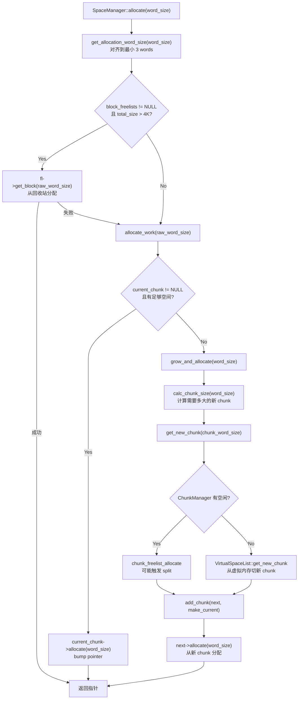
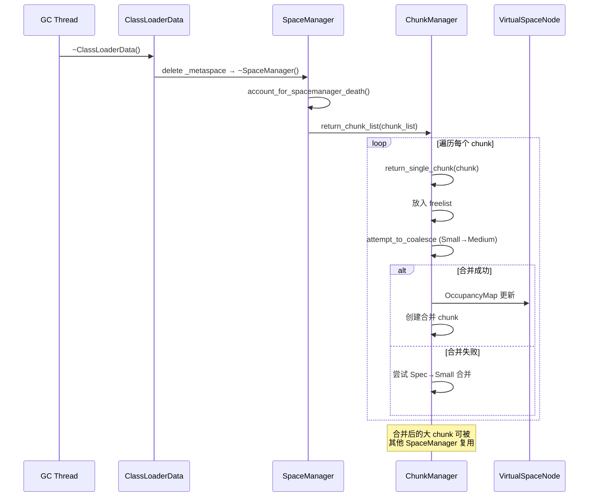

# ChunkManager + SpaceManager 深度剖析（Day 23）

> **标准环境**：`-Xms8g -Xmx8g -XX:+UseG1GC`，G1 Region = 4MB  
> **源码版本**：OpenJDK 11  
> **核心源文件**：`memory/metaspace/chunkManager.cpp`、`memory/metaspace/spaceManager.cpp`

---

## 第 0 部分：核心原理 ⭐

### 0.1 本质是什么？

本文深入分析 **ChunkManager + SpaceManager 深度剖析（Day 23）**：从源码角度理解其设计原理、实现机制和关键细节。

### 0.2 为什么需要？

理解 JVM 内部实现是排查复杂问题、进行性能优化的基础。表面的 API 文档无法解释 JVM 的实际行为，只有深入源码才能建立精确的心智模型。

### 0.3 怎么解决？

结合源码阅读、数据结构分析和 GDB 运行时验证，从多个角度建立对该机制的完整理解。

### 0.4 为什么这样设计？

每个设计决策都有其权衡：性能 vs 正确性、简单性 vs 灵活性、内存占用 vs 查找速度。理解这些权衡是理解 JVM 设计的关键。

---


## 一、为什么需要 ChunkManager 和 SpaceManager

### 1.1 问题

Day 22 中我们知道 Metaspace 是六层架构，但只讲了"是什么"，没有深入回答两个关键问题：

1. **当 SpaceManager 需要一个 Specialized chunk（1KB），但 ChunkManager 里只有 Small chunk（4KB），怎么办？**
2. **当一个 ClassLoader 死亡，它持有的 5 个 Specialized chunk 被归还，如果相邻且对齐，能否合并成一个 Small chunk？**

这两个问题的答案就是 ChunkManager 的 **split（拆分）** 和 **coalesce（合并）** 算法——Metaspace 内存管理的核心。

### 1.2 设计哲学

站在设计者的角度思考：为什么不直接用 `malloc/free` 管理元数据？

| 方案 | 问题 |
|------|------|
| 直接 malloc/free | 碎片化严重；无法按 ClassLoader 批量回收；OS 分配器在大量小对象场景下效率低 |
| 固定大小 slab | 浪费空间（Boot CL 需要 4MB，Lambda CL 只需要 1KB，差 4000 倍） |
| **分级 chunk + split/coalesce** | 兼顾效率和灵活性：常用大小有 freelist 做 O(1) 分配；大 chunk 可拆小；小 chunk 可合并 |

这就是经典的 **Buddy System 变体**——不是标准 buddy（2 的幂次），而是按 Metaspace 特定的 Specialized/Small/Medium 三级层次拆分合并。

---

## 二、ChunkManager：全局 Chunk 分配中心

### 2.1 数据结构

```
┌──────────────────────────────────────────────────────────────────────┐
│  ChunkManager                                                        │
├──────────────────────────────────────────────────────────────────────┤
│                                                                      │
│  _is_class: bool          // true = Class ChunkManager               │
│  _free_chunks_total: size_t  // 所有空闲 chunk 的总 word 数          │
│  _free_chunks_count: size_t  // 所有空闲 chunk 的数量                │
│                                                                      │
│  _free_chunks[3]: ChunkList (FreeList<Metachunk>)                    │
│  ┌────────────────────────────────────────────────────────────────┐  │
│  │ [0] SpecializedIndex                                           │  │
│  │     _size = 128 words (NonClass) / 128 words (Class)           │  │
│  │     _head → chunk → chunk → ... → NULL                         │  │
│  │     _tail → last chunk                                         │  │
│  │     _count = N                                                 │  │
│  ├────────────────────────────────────────────────────────────────┤  │
│  │ [1] SmallIndex                                                 │  │
│  │     _size = 512 words (NonClass) / 256 words (Class)           │  │
│  │     _head → chunk → chunk → ... → NULL                         │  │
│  │     _count = M                                                 │  │
│  ├────────────────────────────────────────────────────────────────┤  │
│  │ [2] MediumIndex                                                │  │
│  │     _size = 8192 words (NonClass) / 4096 words (Class)         │  │
│  │     _head → chunk → chunk → ... → NULL                         │  │
│  │     _count = K                                                 │  │
│  └────────────────────────────────────────────────────────────────┘  │
│                                                                      │
│  _humongous_dictionary: ChunkTreeDictionary (红黑树)                 │
│  ┌────────────────────────────────────────────────────────────────┐  │
│  │  BinaryTreeDictionary<Metachunk, FreeList<Metachunk>>          │  │
│  │  按 word_size 排序的红黑树                                     │  │
│  │  每个节点对应一个大小，挂一个 FreeList                         │  │
│  │  用途：> Medium 的 humongous chunk                             │  │
│  └────────────────────────────────────────────────────────────────┘  │
│                                                                      │
└──────────────────────────────────────────────────────────────────────┘
```

**为什么 Specialized/Small/Medium 用链表，Humongous 用红黑树？**

- 前三种大小是**固定的**，同一链表里所有 chunk 大小完全一致，取头节点就行 → **O(1)**
- Humongous chunk 大小**不固定**，需要找 ≥ 请求大小的最小 chunk → 红黑树 **O(log n)**

### 2.2 全局实例

JVM 有两个 ChunkManager，一个管 NonClass，一个管 Class：

```
Metaspace::_chunk_manager_metadata  → ChunkManager(_is_class=false)
Metaspace::_chunk_manager_class     → ChunkManager(_is_class=true)
```

所有 SpaceManager 共享这两个全局 ChunkManager，通过 `MetaspaceExpand_lock` 保护并发访问。

---

## 三、ChunkManager 核心算法：分配、拆分、合并

### 3.1 分配：`chunk_freelist_allocate` → `free_chunks_get`

```
请求 N words 的 chunk
    │
    ▼
┌─────────────────────────────────┐
│  确定 chunk 类型 (list_index)    │
│  N=128 → Specialized            │
│  N=512 → Small                  │
│  N=8192 → Medium                │
│  N>8192 → Humongous             │
└──────────┬──────────────────────┘
           │
           ▼
   非 Humongous?
     ├── Yes ──→ 从对应 FreeList 取头节点
     │            chunk = free_list->head()
     │            ├── chunk != NULL → 取走，完成
     │            └── chunk == NULL → 尝试拆分 ↓
     │
     └── No ───→ 从红黑树 get_chunk(word_size)
                  找 ≥ word_size 的最小 chunk
                  └── 找到 → 取走，完成
                  └── 找不到 → 返回 NULL
```

**拆分触发条件**：当目标大小的 freelist 为空时，向上找更大的 chunk 来拆分。

源码逻辑（`free_chunks_get`，`chunkManager.cpp`）：

```cpp
// 目标 freelist 为空，尝试从更大的 freelist 找
ChunkIndex larger_chunk_index = next_chunk_index(target_chunk_index);
while (larger_chunk == NULL && larger_chunk_index < NumberOfFreeLists) {
    larger_chunk = free_chunks(larger_chunk_index)->head();
    if (larger_chunk == NULL) {
        larger_chunk_index = next_chunk_index(larger_chunk_index);
    }
}
if (larger_chunk != NULL) {
    chunk = split_chunk(word_size, larger_chunk);
}
```

查找顺序：先找 Small，没有再找 Medium。**不会从 Humongous 拆分**（因为只查 `NumberOfFreeLists=3` 个链表）。

### 3.2 拆分：`split_chunk` 算法

**核心思想**：将大 chunk 拆成目标大小 + 尽可能大的剩余 chunk，都放回 freelist。

```
假设：需要 Specialized (128 words)，有一个 Small (512 words)

拆分前：
┌─────────────────────────────────────────────────────┐
│         Small chunk (512 words)                      │
│ [0x1000                                    0x2000)   │
└─────────────────────────────────────────────────────┘

拆分后：
┌─────────────┬─────────────┬─────────────┬───────────┐
│ Spec (128w) │ Spec (128w) │ Spec (128w) │ Spec(128w)│
│  origin=5   │  origin=5   │  origin=5   │ origin=5  │
│ [0x1000)    │ [0x1400)    │ [0x1800)    │ [0x1C00)  │
│  ← 目标      │  ← 返回freelist           │← 返回    │
└─────────────┴─────────────┴─────────────┴───────────┘

注意：512 / 128 = 4 个 Specialized chunk
```

**但实际比这复杂**。源码中拆分逻辑是这样的：

```
split_chunk(target=128, larger=512):
  1. 先在区域起始处创建目标 chunk (128 words)
  2. 剩余空间 (384 words) 创建尽可能大的 chunk
     - p = region_start + 128 = 0x1400
     - 尝试 Medium (8192)? 太大
     - 尝试 Small (512)? 需要 512-word 对齐，0x1400 对齐到 512*8=4096 字节？
       不一定对齐 → 降级
     - 尝试 Specialized (128)? 一定对齐 → 创建 128 words
     - 继续: p = 0x1800, 创建 128; p = 0x1C00, 创建 128
```

**关键设计决策**：拆分时不是简单的等分，而是尽量创建**最大可能的 chunk**，遵守对齐约束。这是因为：
- **大 chunk 更容易被后续合并**
- **减少 freelist 中的碎片**

但在 Specialized → Small 的拆分中，由于 Small chunk 需要 Small-size 对齐，而拆分后的第二个位置通常不满足对齐，所以实际上经常退化为全部等分。

**GDB 验证数据**：

```
=== SPLIT_CHUNK #1 ===
target_chunk_word_size = 128        ← 需要 Specialized
larger_chunk = 0x800067800          ← 有一个 Small chunk
larger_chunk->word_size = 256       ← Class Small = 256 words
larger_chunk->_is_class = 1

=== SPLIT_CHUNK #2 ===
target_chunk_word_size = 128        ← 需要 Specialized
larger_chunk = 0x7fffceeff000       ← 有一个 Small chunk
larger_chunk->word_size = 512       ← NonClass Small = 512 words
larger_chunk->_is_class = 0

=== SPLIT_CHUNK #7 ===
target_chunk_word_size = 128
larger_chunk = 0x7fffceefd000       ← 同上模式
larger_chunk->word_size = 512
larger_chunk->_is_class = 0
```

**观察**：
1. split 全都是 Small → Specialized 的拆分
2. Class 空间：256 words 拆成 2 × 128 words
3. NonClass 空间：512 words 拆成 4 × 128 words（或 1 × 128 + 更大的组合，取决于对齐）
4. **没有 Medium → Small 或 Medium → Specialized 的拆分**（因为启动阶段 Medium freelist 本身就是空的）

### 3.3 合并：`return_single_chunk` → `attempt_to_coalesce_around_chunk`

**触发时机**：当一个 chunk 被归还到 ChunkManager 时，自动尝试与相邻空闲 chunk 合并。

```
return_single_chunk(chunk):
  1. 将 chunk 标记为 free，放入对应 freelist
  2. 更新 OccupancyMap: in_use → free
  3. 尝试合并：
     if (chunk 是 Small 或 Specialized):
       先尝试合并到 Medium
       if (失败 && chunk 是 Specialized):
         再尝试合并到 Small
```

**合并条件检查** (`attempt_to_coalesce_around_chunk`)：

```
要将 chunk 合并到 target_chunk_type (如 Medium = 8192 words):

1. 计算合并区域:
   merge_start = align_down(chunk, target_size * BytesPerWord)
   merge_end = merge_start + target_size
   
2. 检查合并区域是否在 VirtualSpaceNode 的已提交范围内:
   merge_start >= vsn->bottom() && merge_end <= vsn->top()

3. 检查合并区域的起始/结束是否都是 chunk 边界:
   ocmap->chunk_starts_at_address(merge_start) == true
   ocmap->chunk_starts_at_address(merge_end) == true  (或 merge_end == top)

4. 检查合并区域内没有 in-use 的 chunk:
   ocmap->is_region_in_use(merge_start, target_size) == false
   
5. 全部通过 → 执行合并:
   - 移除区域内所有小 chunk
   - placement-new 一个大 chunk
   - 更新 OccupancyMap
   - 放入对应 freelist
```

**图示**：

```
合并前（4 个相邻 Specialized chunk 都是 free）：
┌──────────┬──────────┬──────────┬──────────┐
│ Spec 128 │ Spec 128 │ Spec 128 │ Spec 128 │  都是 free
│ 0x1000   │ 0x1400   │ 0x1800   │ 0x1C00   │
└──────────┴──────────┴──────────┴──────────┘

尝试合并到 Small (512 words):
  merge_start = align_down(0x1000, 512*8) = 0x1000 ✓
  merge_end = 0x1000 + 512*8 = 0x2000
  chunk_starts_at(0x1000) = true ✓
  chunk_starts_at(0x2000) = true (或 == top) ✓
  is_region_in_use(0x1000, 512) = false ✓

合并后：
┌──────────────────────────────────────────────┐
│              Small 512                        │ origin = merge
│ [0x1000                             0x2000)   │
└──────────────────────────────────────────────┘
```

**GDB 验证数据**：

```
=== RETURN_SINGLE_CHUNK #1 ===
chunk = 0x7fffceef5c00, word_size = 128, type=Spec, origin=pad, use_count=0
→ COALESCE_ATTEMPT #1: target=Medium (失败：区域内有 in-use chunk)
→ COALESCE_ATTEMPT #2: target=Small (失败：相邻不全是 free)

=== RETURN_SINGLE_CHUNK #3 ===
chunk = 0x7fffceef7800, word_size = 128, type=Spec, origin=pad
_free_chunks_total = 256 (已有一个 Spec)
→ COALESCE_ATTEMPT #5: target=Medium (失败)
→ COALESCE_ATTEMPT #6: target=Small (失败：只有 2 个相邻 free，需要 4 个)
```

**关键观察**：在我们的测试中，大部分合并尝试都**失败**了。原因：
1. 合并到 Medium 需要 8192 words 的连续区域全空闲——但在启动阶段，大量 chunk 是 in-use 的
2. 合并到 Small 需要 512 words 对齐区域全空闲——padding chunk 通常不够凑齐

**什么时候合并会成功？** ClassLoader 死亡时，其所有 chunk 被批量归还。如果一个 CL 独占了某段连续内存，归还后该段就全空闲了，合并可以成功。这就是 Metaspace "按 ClassLoader 粒度回收" 的精髓。

### 3.4 合并的 OccupancyMap 依赖

为什么合并需要 OccupancyMap？因为 chunk 只有 next/prev 链表指针（连接到同一个 freelist），**没有指向物理相邻 chunk 的指针**。要判断"我左边/右边的 chunk 是谁、是不是 free"，必须靠 OccupancyMap。

```
OccupancyMap 提供的 O(1) 查询:

1. chunk_starts_at_address(p)     → 这个地址是不是一个 chunk 的起始？
2. is_region_in_use(p, size)      → 这个区域内有没有 in-use 的 chunk？
3. wipe_chunk_start_bits_in_region → 合并后清除旧的 start bit

没有 OccupancyMap → 合并需要遍历所有 chunk，O(n)
有 OccupancyMap   → 合并只需要几个 bit 检查，O(1)
```

---

## 四、SpaceManager：每个 ClassLoader 的 chunk 管家

### 4.1 数据结构

```
┌──────────────────────────────────────────────────────────────────┐
│  SpaceManager                                                    │
├──────────────────────────────────────────────────────────────────┤
│                                                                  │
│  _lock: Mutex*                  // ClassLoaderData 的锁          │
│  _mdtype: MetadataType          // NonClassType(0) or ClassType(1) │
│  _space_type: MetaspaceType     // Boot(1)/Anon(2)/Refl(3)/Std(0) │
│                                                                  │
│  _chunk_list: Metachunk*        // 所有拥有的 chunk 的链表头      │
│  _current_chunk: Metachunk*     // 当前正在分配的 chunk           │
│                                                                  │
│  _capacity_words: size_t        // 所有 chunk 的总容量            │
│  _used_words: size_t            // 已分配给调用者的总量            │
│  _overhead_words: size_t        // chunk 头部开销总量              │
│  _num_chunks_by_type[4]: uintx  // 每种类型的 chunk 数量          │
│                                                                  │
│  _block_freelists: BlockFreelist* // 小块回收站（惰性创建）       │
│                                                                  │
└──────────────────────────────────────────────────────────────────┘

       _chunk_list 链表:
       ┌─────────┐    ┌─────────┐    ┌─────────┐
       │ chunk 3 │───→│ chunk 2 │───→│ chunk 1 │───→ NULL
       │(current)│    │ (retired)│    │ (retired)│
       │ _top ↓  │    │ _top=end│    │ _top=end│
       │ [free]  │    │ [full]  │    │ [full]  │
       └─────────┘    └─────────┘    └─────────┘
```

**每个 ClassLoaderMetaspace 有两个 SpaceManager**：`_vsm`（NonClass）和 `_class_vsm`（Class）。

### 4.2 分配路径：`allocate` → `allocate_work` → `grow_and_allocate`



### 4.3 chunk 大小选择：`calc_chunk_size`

这是 SpaceManager 最精巧的策略逻辑，决定了**要多大的新 chunk**。

```cpp
size_t SpaceManager::calc_chunk_size(size_t word_size) {
    // 策略 1: Anonymous/Reflection 特殊优化
    if ((_space_type == Anonymous || _space_type == Reflection) &&
        _mdtype == NonClassType &&
        num_chunks[Specialized] < 4 &&
        word_size + overhead <= SpecializedChunk) {
        return SpecializedChunk;  // 继续用 1KB，最多 4 个
    }
    
    // 策略 2: 普通增长策略
    if (num_chunks[Medium] == 0 && num_chunks[Small] < 4) {
        chunk_word_size = small_chunk_size();  // 还没有 Medium，且 Small < 4 个
        if (word_size + overhead > small_chunk_size()) {
            chunk_word_size = medium_chunk_size();  // 单次分配太大，直接用 Medium
        }
    } else {
        chunk_word_size = medium_chunk_size();  // 已有 4 个 Small 或有 Medium → 用 Medium
    }
    
    // 策略 3: Humongous
    if_humongous = align_up(word_size + overhead, smallest_chunk_size);
    chunk_word_size = MAX2(chunk_word_size, if_humongous);
    
    return chunk_word_size;
}
```

**增长策略总结**：

| ClassLoader 类型 | NonClass 增长路径 | Class 增长路径 |
|-----------------|-------------------|----------------|
| **Boot** | 首个 4MB (Humongous) → Small (512w) × 4 → Medium (8192w) | 首个 384KB (Humongous) → Small (256w) → Medium (4096w) |
| **Anonymous/Reflection** | Specialized (128w) × 4 → Small (512w) × 4 → Medium (8192w) | Specialized (128w) → Small (256w) × 4 → Medium (4096w) |
| **Standard** | Small (512w) × 4 → Medium (8192w) | Small (256w) × 4 → Medium (4096w) |

**为什么 Anonymous CL 要限制在 4 个 Specialized chunk？**

```
没有这个优化时：
  Lambda CL 第一个 chunk = Specialized (128w = 1KB)
  第二个 chunk = Small (512w = 4KB)   ← 浪费！Lambda 只需要 ~960 字节
  浪费率 = (4096 - 960) / 4096 = 76%

有这个优化后：
  Lambda CL 第 1~4 个 chunk 都是 Specialized (128w = 1KB)
  浪费率 = (1024 - 960) / 1024 = 6%
  
  仅这一个优化就把 Lambda 类的空间浪费从 76% 降到 6%。
```

源码注释也明确说了：`reduces space waste from 60+% to around 30%`（整体统计）。

**GDB 验证**：

```
=== CALC_CHUNK_SIZE #1 ===
word_size (request) = 13
_space_type = 2 (Anonymous)      ← Lambda CL
_mdtype = 1 (Class)
num_chunks Specialized = 1
→ 走 Anonymous 特殊路径？不，因为 _mdtype=1 (ClassType)，条件要求 NonClassType
→ 走普通路径：num_chunks[Med]=0, num_chunks[Small]<4 → 选 Small (256w for Class)
  但 128 words 的 Specialized 已经用完了
  → 实际选择 Specialized 128 (因为 ClassType 的 Specialized=128 ≤ Small=256)

=== CALC_CHUNK_SIZE #5 ===
word_size (request) = 3
_space_type = 1 (Boot)
_mdtype = 1 (Class)              ← Boot CL 的 Class SpaceManager
num_chunks Humongous = 1         ← 已有首个 Humongous (384KB)
→ num_chunks[Med]=0, num_chunks[Small]=0 < 4 → 选 Small (256w)
```

### 4.4 chunk 退休：`retire_current_chunk`

当 `grow_and_allocate` 获取新 chunk 时，旧的 current_chunk 会被**退休**：

```cpp
void SpaceManager::retire_current_chunk() {
    if (current_chunk() != NULL) {
        size_t remaining = current_chunk()->free_word_size();
        if (remaining >= SmallBlocks::small_block_min_size()) {
            // 将剩余空间"分配"出来，然后立即 deallocate 到 BlockFreelist
            MetaWord* ptr = current_chunk()->allocate(remaining);
            deallocate(ptr, remaining);
            account_for_allocation(remaining);
        }
    }
}
```

**为什么要这样做？**

退休的 chunk 不会再接受新的分配（_top 已经推到 end），但可能还有几个 word 的剩余空间。如果不回收这些碎片，就永远浪费了。通过 `allocate(remaining) + deallocate(remaining)`，把剩余空间放进 BlockFreelist，以后可能被复用。

**GDB 验证**：

```
=== RETIRE_CURRENT_CHUNK #1 ~ #10 ===
current_chunk = NULL
→ 前 10 次 retire 都是 current_chunk 为 NULL（SpaceManager 刚创建，还没分配第一个 chunk）
```

这说明 `retire_current_chunk` 在 `add_chunk` 中被调用（`add_chunk → retire_current_chunk → set_current_chunk(new)`），而新建的 SpaceManager 第一次 add_chunk 时 current 是 NULL，所以直接跳过。

### 4.5 Humongous chunk 的特殊处理

```cpp
// grow_and_allocate 中:
if (next->get_chunk_type() == HumongousIndex && current_chunk() != NULL) {
    make_current = false;  // 不要把 humongous chunk 设为 current
}
```

**为什么？** Humongous chunk 是为单次大分配创建的（比如一个巨大的 ConstantPool）。如果把它设为 current_chunk，下次小分配来了还得再换一个新 chunk，白白浪费了旧的 current chunk 的剩余空间。

所以 humongous chunk 只是加入 _chunk_list（用于 CL 死亡时回收），但不会成为 current。

### 4.6 `get_new_chunk`：两级缓存

```cpp
Metachunk* SpaceManager::get_new_chunk(size_t chunk_word_size) {
    // 第一级：从 ChunkManager（全局 freelist）取
    Metachunk* next = chunk_manager()->chunk_freelist_allocate(chunk_word_size);
    
    if (next == NULL) {
        // 第二级：从 VirtualSpaceList 切新的
        next = vs_list()->get_new_chunk(chunk_word_size, medium_chunk_bunch());
    }
    return next;
}
```

`medium_chunk_bunch()` = `medium_chunk_size() * 4`，是建议的 commit 粒度。对 NonClass 就是 `8192 × 4 = 32768 words = 256KB`，对 Class 就是 `4096 × 4 = 16384 words = 128KB`。这确保每次扩展虚拟内存时，一次性 commit 足够的空间，避免频繁的 mmap/mprotect 系统调用。

---

## 五、SpaceManager 析构：ClassLoader 死亡时的回收

### 5.1 析构流程

```cpp
SpaceManager::~SpaceManager() {
    // 1. 验证指标
    DEBUG_ONLY(verify_metrics());
    
    // 2. 获取全局锁
    MutexLockerEx fcl(MetaspaceExpand_lock);
    
    // 3. 更新全局计数器
    account_for_spacemanager_death();  // 减去 capacity/overhead/used
    
    // 4. 核心：将所有 chunk 归还到 ChunkManager
    chunk_manager()->return_chunk_list(chunk_list());
    
    // 5. 删除 BlockFreelist
    if (_block_freelists != NULL) {
        delete _block_freelists;
    }
}
```

`return_chunk_list` 会遍历 _chunk_list，对每个 chunk 调用 `return_single_chunk`，每次归还都会尝试合并。所以**CL 死亡是合并的主要触发时机**。

### 5.2 回收的时序图



---

## 六、BlockFreelist：chunk 内部碎片回收

### 6.1 问题

即使 chunk 大小策略做得再好，仍然有碎片：

```
chunk (128 words):
  overhead: 8 words (Metachunk 头部)
  可用: 120 words
  
  分配 1: 50 words → 剩余 70 words
  分配 2: 50 words → 剩余 20 words
  分配 3: 30 words → 不够！需要 grow_and_allocate 获取新 chunk
  
  浪费: 20 words（太小了，放进 BlockFreelist）
```

### 6.2 BlockFreelist 结构

```
┌──────────────────────────────────────────────────────────┐
│  BlockFreelist                                            │
├──────────────────────────────────────────────────────────┤
│                                                          │
│  _dictionary: BlockTreeDictionary (红黑树)                │
│  ┌────────────────────────────────────────────────────┐  │
│  │  存储 >= small_block_max_size 的块                  │  │
│  │  (small_block_max_size ≈ 24 words for 64-bit)      │  │
│  │  按大小排序的红黑树                                 │  │
│  └────────────────────────────────────────────────────┘  │
│                                                          │
│  _small_blocks: SmallBlocks (惰性创建)                   │
│  ┌────────────────────────────────────────────────────┐  │
│  │  存储 [min_size, max_size) 的块                     │  │
│  │  _small_lists[]: FreeList<Metablock> 数组            │  │
│  │                                                    │  │
│  │  [0] size=3 words → list → block → block → NULL    │  │
│  │  [1] size=4 words → list → block → NULL            │  │
│  │  [2] size=5 words → list → NULL                    │  │
│  │  ...                                               │  │
│  │  [N] size=23 words → list → block → NULL           │  │
│  │                                                    │  │
│  │  O(1) 精确匹配！                                   │  │
│  └────────────────────────────────────────────────────┘  │
│                                                          │
└──────────────────────────────────────────────────────────┘
```

### 6.3 `get_block` 分配策略

```cpp
MetaWord* BlockFreelist::get_block(size_t word_size) {
    // 1. 小块：精确匹配
    if (word_size < small_block_max_size) {
        MetaWord* p = small_blocks()->get_block(word_size);
        if (p != NULL) return p;
    }
    
    // 2. 太小了，字典也放不下
    if (word_size < min_dictionary_size()) return NULL;
    
    // 3. 从红黑树找 ≥ word_size 的最小块
    Metablock* free_block = dictionary()->get_chunk(word_size);
    if (free_block == NULL) return NULL;
    
    // 4. 浪费控制：如果找到的块 > 4 倍请求大小，拒绝使用
    if (free_block->size() > WasteMultiplier * word_size) {
        return_block(free_block, free_block->size());  // 放回去
        return NULL;
    }
    
    // 5. 裁剪多余部分
    size_t unused = free_block->size() - word_size;
    if (unused >= small_block_min_size) {
        return_block(free_block + word_size, unused);  // 多余的放回
    }
    
    return (MetaWord*)free_block;
}
```

**4 倍浪费控制**（`WasteMultiplier = 4`）是一个关键设计：

```
场景：请求 5 words，字典里有一个 100 words 的块
  100 > 4 × 5 = 20 → 拒绝使用
  原因：用 100 words 满足 5 words 的请求，浪费 95 words（95%）
  宁可让这个 5 words 的请求失败（走 bump-pointer 从 current_chunk 分配）
  也不要浪费这个 100 words 的大块

场景：请求 5 words，字典里有一个 15 words 的块
  15 ≤ 4 × 5 = 20 → 使用
  裁剪：分出 5 words 给请求，剩 10 words 放回字典
```

### 6.4 `allocate` 中的 BlockFreelist 使用策略

```cpp
MetaWord* SpaceManager::allocate(size_t word_size) {
    // ...
    if (fl != NULL && fl->total_size() > allocation_from_dictionary_limit) {
        p = fl->get_block(raw_word_size);
    }
    // ...
}
```

`allocation_from_dictionary_limit = 4K` words。只有当 BlockFreelist 积累了足够多的回收块（> 4K words ≈ 32KB）时，才尝试从中分配。

**为什么？** 因为从红黑树搜索的代价比 bump-pointer 高很多。如果 BlockFreelist 里只有几个小块，搜索的时间可能比直接从 current_chunk bump 更长。只有当积累了大量回收块时，搜索的命中率才够高，值得去找。

---

## 七、Padding Chunk 机制

### 7.1 为什么需要 Padding

Non-humongous chunk 必须按自身大小对齐：Small chunk（512 words = 4096 bytes）必须从 4096 字节对齐的地址开始。

```
VirtualSpaceNode 当前 top = 0xCEEF5C00

需要一个 Small chunk (512 words = 4096 bytes = 0x1000)
  要求 top 对齐到 0x1000 → next_aligned = 0xCEEF6000
  gap = 0xCEEF6000 - 0xCEEF5C00 = 0x400 = 1024 bytes = 128 words
  
  → 创建 1 个 Specialized padding chunk (128 words) 填充 gap
  → 然后在 0xCEEF6000 创建 Small chunk
```

**padding chunk 的命运**：
1. 被创建（`origin = pad`）
2. 标记为 in-use
3. 立即归还到 ChunkManager（`return_single_chunk`）
4. 归还时尝试合并

GDB 数据证实了这一点：

```
=== RETURN_SINGLE_CHUNK #1 ===
chunk->word_size = 128, type=Spec, origin=pad(2), use_count=0
→ padding chunk 立即被归还
→ 尝试 coalesce 到 Medium → 失败
→ 尝试 coalesce 到 Small → 失败
```

### 7.2 VirtualSpaceNode::retire

当一个 VirtualSpaceNode 被退休时，它的所有剩余空间会被切成 chunk 归还：

```cpp
void VirtualSpaceNode::retire(ChunkManager* chunk_manager) {
    for (int i = MediumIndex; i >= ZeroIndex; --i) {
        while (free_words >= chunk_size[i]) {
            Metachunk* chunk = get_chunk_vs(chunk_size[i]);
            chunk_manager->return_single_chunk(chunk);
        }
    }
}
```

**从大到小**切割，优先创建 Medium，然后 Small，最后 Specialized。这样可以最大限度地减少碎片。

---

## 八、并发设计

### 8.1 两层锁

```
┌─────────────────────────────────────────────────────────┐
│  锁层次                                                  │
├─────────────────────────────────────────────────────────┤
│                                                         │
│  Level 1: SpaceManager::_lock (per-ClassLoader)         │
│  ┌───────────────────────────────────────────────────┐  │
│  │  保护: current_chunk 的 bump-pointer 分配          │  │
│  │        _used_words 等计数器                        │  │
│  │        BlockFreelist 操作                          │  │
│  │  粒度: 每个 ClassLoaderData 一把锁                 │  │
│  │  竞争: 低（同一个 CL 的线程不多）                  │  │
│  └───────────────────────────────────────────────────┘  │
│                                                         │
│  Level 2: MetaspaceExpand_lock (全局)                    │
│  ┌───────────────────────────────────────────────────┐  │
│  │  保护: ChunkManager 的 freelist 操作               │  │
│  │        VirtualSpaceList 的扩展                     │  │
│  │        全局计数器                                  │  │
│  │  粒度: 整个 Metaspace 一把锁                       │  │
│  │  竞争: 中等（只有 grow_and_allocate 时需要）       │  │
│  └───────────────────────────────────────────────────┘  │
│                                                         │
└─────────────────────────────────────────────────────────┘
```

**设计精髓**：热路径（bump-pointer 分配）只需要 per-CL 锁，全局锁只在冷路径（grow）上使用。

### 8.2 为什么 SpaceManager::allocate 先从 BlockFreelist 分配？

因为 BlockFreelist 操作只需要 _lock（per-CL），不需要 MetaspaceExpand_lock。而 grow_and_allocate 需要全局锁。所以优先从 BlockFreelist 找，减少全局锁竞争。

---

## 九、GDB 验证：Boot ClassLoader 的增长模式

### 9.1 Boot CL NonClass SpaceManager 增长

```
GROW_AND_ALLOCATE #5:
  _space_type = 1 (Boot)
  _mdtype = 1 (NonClass 对 Boot 来说? 不，mdtype=1 是... 
  等等，Metaspace::MetadataType: NonClassType=0, ClassType=1)
  → 这是 Boot CL 的 Class SpaceManager

  current_chunk = 0x7fffceaf1000
  word_size = 524288 (4MB = Boot 首个 Humongous NonClass chunk)
  used = 524288, free = 0
  → 4MB chunk 已经用完了
  
CALC_CHUNK_SIZE #5:
  请求 3 words
  num_chunks: Spec=0, Small=0, Med=0, Humongous=1
  → num_chunks[Med]=0 && num_chunks[Small]<4 → 选 Small (512w)
```

**Boot CL NonClass** 的增长路径验证：
1. 首个 chunk = 4MB (524288 words)  ← `Metaspace::first_chunk_word_size()`
2. 用了 524280 words 后才 grow（差 8 words 就满了）
3. 第二个 chunk = Small (512 words)
4. 然后是 Small × 4，再之后切换到 Medium

### 9.2 Anonymous CL 的增长模式

```
GROW_AND_ALLOCATE #1:
  _space_type = 2 (Anonymous)
  _mdtype = 1 (Class)
  current_chunk->word_size = 128 (Specialized)
  used = 128, free = 0 → 完全用满

CALC_CHUNK_SIZE #1:
  word_size = 13
  _space_type = 2 (Anonymous), _mdtype = 1 (Class)
  num_chunks Spec = 1
  → Anonymous + ClassType → 不走特殊路径（特殊路径只对 NonClassType）
  → num_chunks[Med]=0, num_chunks[Small]=0 < 4 → 选 Small? 
  → 但实际上 word_size=13 + overhead=8 = 21 < 128 = SpecializedChunk
  → 走 adjust_initial_chunk_size → 返回 Specialized (128)
```

等等，这里有一个微妙之处。`calc_chunk_size` 返回的是 Small (256 for class)，但 `get_new_chunk` → `chunk_freelist_allocate(256)` 可能找不到 256 的 chunk，然后 `vs_list()->get_new_chunk(256, ...)` 会从 VirtualSpaceNode 切一个新的 256-word chunk。

实际 GDB 数据显示 Anonymous CL 的 Class SpaceManager 用的是 128-word chunk（从 SPLIT_CHUNK 数据可以看到，是从 Small(256) split 得到的）。

### 9.3 程序退出时 ChunkManager 最终状态

**断点位置**：`before_exit` (java.cpp:446)

> **注意**：正常退出走 `before_exit → print_statistics → exit_globals`，**不走 `os::shutdown`**。
> `os::shutdown` 只在异常退出路径调用（初始化失败、`vm_shutdown_during_initialization` 等）。
> 正常退出完整链路：`jni_DestroyJavaVM → Threads::destroy_vm → before_exit → thread->exit → exit_globals`

```
========== FINAL STATE (at before_exit) ==========

--- NonClass ChunkManager (metadata) ---
total_words = 3712
chunk_count = 8
Specialized: count=1, size=128 words    ← 1 个空闲 Specialized chunk
Small:       count=7, size=512 words    ← 7 个空闲 Small chunk
Medium:      count=0, size=8192 words   ← 没有空闲 Medium chunk

--- Class ChunkManager (class) ---
total_words = 0
chunk_count = 0
Specialized: count=0, size=128 words    ← 全空
Small:       count=0, size=256 words    ← 全空
Medium:      count=0, size=4096 words   ← 全空

--- Humongous Dictionary ---
NonClass: total_size=0, total_free_blocks=0
Class:    total_size=0, total_free_blocks=0
```

**数据分析**：

1. **NonClass ChunkManager** 有 8 个空闲 chunk（1 Spec + 7 Small），总共 3712 words
   - 3712 = 1×128 + 7×512 = 128 + 3584 = 3712 ✅ 计算一致
   - 这些 chunk 来自 VirtualSpaceNode 的 `retire()` 和 padding chunk 的归还
   - 没有 Medium 空闲 ← 所有 Medium chunk 都被 Boot CL 持有且在使用中

2. **Class ChunkManager** 完全为空
   - 所有 Class chunk 仍被各 ClassLoader 的 SpaceManager 持有
   - 因为程序没有触发类卸载（没有自定义 ClassLoader 死亡），所以没有 Class chunk 归还

3. **Humongous Dictionary** 为空
   - Boot CL 的 4MB Humongous chunk 仍在使用中，没有归还

4. **设计验证**：正常运行的短程序中，ChunkManager 只有少量来自 padding/retire 的空闲 chunk。
   大量的类卸载（如应用服务器重部署）才会看到 ChunkManager 中 chunk 大量回流。

---

## 十、关键设计决策总结

### 10.1 为什么是三级固定大小 + Humongous？

| 问题 | 设计选择 | 原因 |
|------|----------|------|
| 分配速度 | 固定大小链表 O(1) | 大多数 chunk 分配是 Specialized/Small/Medium，O(1) 取头即可 |
| 大对象 | 红黑树 O(log n) | Humongous 大小不固定，需要最佳匹配 |
| 碎片控制 | split + coalesce | 不会永远持有大 chunk 不用，也不会让小碎片散落 |
| 对齐约束 | 按自身大小对齐 | 使合并判断简化为"区域内全空闲即可合并" |

### 10.2 为什么不用标准 Buddy System？

标准 Buddy System 要求 2 的幂次大小：1K, 2K, 4K, 8K, 16K, ...

```
标准 Buddy 的问题:
  - 2K 大小的 chunk 不需要（Metaspace 中很少有 2K 的分配）
  - 16K、32K 也是浪费（跳过直接到 Humongous 更好）
  - Metaspace 的典型分配模式是两极分化：很小（Lambda）或很大（ConstantPool）
  
三级设计的优势:
  - 1KB / 4KB / 64KB 三档覆盖了 99% 的分配需求
  - 级差更大（4× 和 16×），拆分产生的碎片更少
  - 更少的 freelist 意味着更简单的管理
```

### 10.3 为什么合并只尝试两级？

```
return_single_chunk 中:
  if (Spec or Small) → 尝试合并到 Medium
  if (失败 && Spec) → 尝试合并到 Small
  
为什么不尝试合并到 Humongous？
  - Medium 已经足够大（64KB NonClass / 32KB Class）
  - 更大的合并需要更大的连续区域，成功率极低
  - Humongous chunk 大小不固定，不好确定目标大小
  - 收益递减：大多数 ClassLoader 用的都是 Small/Specialized
```

---

## 十一、日志参数

### 11.1 查看 split/coalesce 日志

```bash
-Xlog:gc+metaspace+freelist=trace
```

输出示例：
```
[trace][gc,metaspace,freelist] class space: splitting chunk 0x800067800, word size 0x100 (small), 
  to get a chunk of word size 0x80 (specialized)...
[trace][gc,metaspace,freelist] Created chunk at 0x800067800, word size 0x80 (specialized), 
  in split region [0x800067800...0x800067c00).
[trace][gc,metaspace,freelist] Created chunk at 0x800067c00, word size 0x80 (specialized), 
  in split region [0x800067800...0x800067c00).
```

### 11.2 查看 chunk 分配日志

```bash
-Xlog:gc+metaspace+alloc=trace
```

输出示例：
```
[trace][gc,metaspace,alloc] Metadata humongous allocation:
[trace][gc,metaspace,alloc]   word_size 0x309
[trace][gc,metaspace,alloc]   chunk_word_size 0x400
[trace][gc,metaspace,alloc]     chunk overhead 0x8
```

### 11.3 查看 SpaceManager 增长日志

```bash
-Xlog:gc+metaspace+freelist=trace
```

输出示例：
```
[trace][gc,metaspace,freelist] SpaceManager::grow_and_allocate for 13 words 120 words used 0 words left
[trace][gc,metaspace,freelist] ChunkManager::chunk_freelist_allocate: 0x7ffff0c8cb80 chunk 0x800067800 
  size 256 count 2
```

---

## 十二、总结

### 核心架构

```
               ┌───────────────────────────────┐
               │        SpaceManager            │   per-ClassLoader
               │   bump-pointer + BlockFreelist │
               └───────────┬───────────────────┘
                           │ get_new_chunk
                           ▼
               ┌───────────────────────────────┐
               │        ChunkManager            │   全局 × 2 (Data + Class)
               │   freelist[3] + 红黑树         │
               │   split ↔ coalesce             │
               └───────────┬───────────────────┘
                           │ 无空闲 chunk
                           ▼
               ┌───────────────────────────────┐
               │     VirtualSpaceList           │   全局 × 2
               │   → VirtualSpaceNode           │
               │     take_from_committed        │
               │     (bump top + OccupancyMap)  │
               └───────────────────────────────┘
```

### 性能特征

| 操作 | 复杂度 | 锁 | 频率 |
|------|--------|-----|------|
| bump-pointer 分配 | O(1) | per-CL | 极高 |
| BlockFreelist 分配 | O(log n) | per-CL | 低 |
| ChunkManager 分配 | O(1) 非 Humongous | 全局 | 中 |
| split | O(k) k=拆分数 | 全局 | 低 |
| coalesce | O(1) + OccupancyMap | 全局 | 低 |
| VirtualSpaceNode 切块 | O(1) + mmap | 全局 | 极低 |

### 一句话总结

**ChunkManager 是 Metaspace 的"银行"，SpaceManager 是每个 ClassLoader 的"钱包"。钱包从银行借 chunk，用完后还回去。银行通过 split/coalesce 维持 chunk 供应的灵活性，通过 OccupancyMap 实现 O(1) 的合并判断。**
