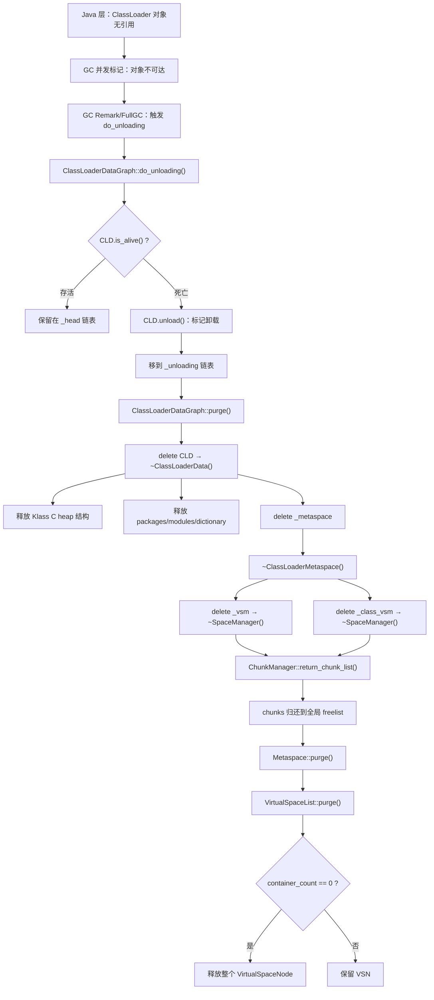
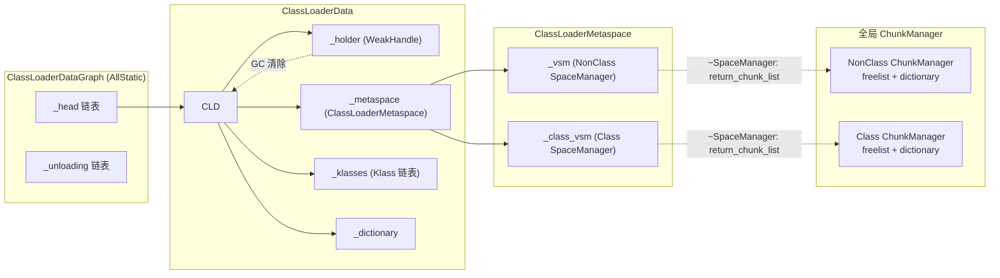

# 类卸载机制：ClassLoaderData 生命周期全链路（Day 24）

> **标准环境**：`-Xms8g -Xmx8g -XX:+UseG1GC`，G1 Region = 4MB  
> **源码版本**：OpenJDK 11  
> **核心源文件**：`classfile/classLoaderData.cpp`、`classfile/systemDictionary.cpp`、`memory/metaspace.cpp`、`gc/g1/g1ConcurrentMark.cpp`

---

## 第 0 部分：核心原理 ⭐

### 0.1 本质是什么？

本文深入分析 **类卸载机制：ClassLoaderData 生命周期全链路（Day 24）**：从源码角度理解其设计原理、实现机制和关键细节。

### 0.2 为什么需要？

理解 JVM 内部实现是排查复杂问题、进行性能优化的基础。表面的 API 文档无法解释 JVM 的实际行为，只有深入源码才能建立精确的心智模型。

### 0.3 怎么解决？

结合源码阅读、数据结构分析和 GDB 运行时验证，从多个角度建立对该机制的完整理解。

### 0.4 为什么这样设计？

每个设计决策都有其权衡：性能 vs 正确性、简单性 vs 灵活性、内存占用 vs 查找速度。理解这些权衡是理解 JVM 设计的关键。

---


## 一、为什么需要类卸载

### 1.1 问题

Day 22-23 分析了 Metaspace 的分配和管理机制。但一个关键问题没有回答：

**ClassLoader 死亡后，它持有的元数据内存（Klass、Method、ConstantPool 等）如何回收？**

如果没有类卸载机制：
- 动态代理、Lambda、JSP、OSGi 等场景会不断创建新 ClassLoader 加载新类
- 每个 ClassLoader 对应一个 `ClassLoaderMetaspace`，持有若干 Metachunk
- ClassLoader 对象被 GC 回收后，对应的 Metaspace chunk 永远无法归还 → **Metaspace 泄漏**

### 1.2 核心设计思想

JVM 的类卸载遵循一个核心原则：**类的生命周期绑定到 ClassLoader 的生命周期**。

- 一个类只有当它的 ClassLoader 不再被任何存活对象引用时，才能被卸载
- Bootstrap、Platform、App 三个内置 ClassLoader 永远存活，它们加载的类（`java.lang.Object` 等）永远不会被卸载
- 只有自定义 ClassLoader 加载的类才有可能被卸载

这个设计的连接点是 `ClassLoaderData`（CLD）——每个 ClassLoader 对应一个 CLD，CLD 管理该 ClassLoader 的所有元数据资源。

---

## 二、整体流程总览



**完整链路一句话总结**：`GC 判死 → do_unloading(标记+移链表) → purge(delete CLD) → ~CLD(释放所有资源) → ~Metaspace(释放 SpaceManager) → ~SpaceManager(归还 chunk) → Metaspace::purge(尝试释放 VSN)`

---

## 三、ClassLoaderData 核心结构

### 3.1 关键字段

```cpp
// classLoaderData.hpp
class ClassLoaderData : public CHeapObj<mtClass> {
  // === 生命周期控制 ===
  WeakHandle<vm_class_loader_data> _holder;  // 弱引用指向 ClassLoader 对象
  volatile int _keep_alive;                   // 1=永生（bootstrap/anonymous）
  bool         _unloading;                    // true=已标记卸载

  // === 元数据管理 ===
  ClassLoaderMetaspace* _metaspace;           // 该 CL 的 Metaspace（管理 chunk）
  Klass*        _klasses;                     // 已加载的 Klass 链表头
  GrowableArray<Klass*>* _deallocate_list;    // 待释放列表

  // === 模块/包/字典 ===
  PackageEntryTable* _packages;
  ModuleEntryTable*  _modules;
  ModuleEntry*       _unnamed_module;
  Dictionary*        _dictionary;             // 类查找字典

  // === 链表指针 ===
  ClassLoaderData* _next;                     // 链表下一个
  
  // === 标识 ===
  Symbol* _name;
  Symbol* _name_and_id;
  bool _is_anonymous;
};
```

### 3.2 存活判定：is_alive()

```cpp
// classLoaderData.cpp:753
bool ClassLoaderData::is_alive() const {
  bool alive = keep_alive()              // _keep_alive == 1 → 永远存活
               || (_holder.peek() != NULL);  // 弱引用没被 GC 清除 → 存活
  return alive;
}
```

**判定逻辑**：
1. `_keep_alive == 1` → 永远存活（bootstrap CL、anonymous class 的 CLD）
2. `_holder.peek() != NULL` → ClassLoader 对象仍在堆上且被标记为存活 → CLD 存活
3. `_holder.peek() == NULL` → GC 已清除弱引用 → ClassLoader 对象不可达 → **CLD 死亡**

### 3.3 ClassLoaderDataGraph：全局管理

```cpp
// classLoaderData.hpp
class ClassLoaderDataGraph : AllStatic {
  static ClassLoaderData* volatile _head;       // 存活 CLD 链表
  static ClassLoaderData*         _unloading;   // 待删除 CLD 链表
  static ClassLoaderData*         _saved_unloading;
};
```

所有 CLD 通过 `_next` 指针串成链表，`_head` 指向链表头。

---

## 四、GC 触发类卸载的入口

### 4.1 G1 并发标记 Remark（主路径）

```cpp
// g1ConcurrentMark.cpp:1231
void G1ConcurrentMark::remark() {
  // ... STW Remark 开始 ...
  
  weak_refs_work(/* clear_all_soft_refs */ false);
  // ↑ 内部调用 SystemDictionary::do_unloading()
  
  // Remark 完成后清理
  if (has_overflown()) { ... }
  
  ClassLoaderDataGraph::purge();  // ← 真正 delete 死亡的 CLD
  // ...
}
```

```cpp
// g1ConcurrentMark.cpp:1765
void G1ConcurrentMark::weak_refs_work(bool clear_all_soft_refs) {
  // ... 引用处理 ...
  
  if (ClassUnloadingWithConcurrentMark) {  // 默认 true
    // Unload classes and purge the SystemDictionary
    bool purged_class = SystemDictionary::do_unloading(is_alive_closure, ...);
    // ... complete_cleaning (并行清理 CodeCache、Klass、String/Symbol) ...
  }
}
```

**触发条件**：`-XX:+ClassUnloadingWithConcurrentMark`（默认 true）  
**JVM 日志参数**：`-Xlog:class+unload=info` 可看到卸载日志

### 4.2 Full GC（备选路径）

```cpp
// g1FullCollector.cpp:203
void G1FullCollector::phase1_mark_live_objects() {
  // ... 标记存活对象 ...
  if (ClassUnloading) {  // 默认 true
    bool purged_class = SystemDictionary::do_unloading(is_alive, ...);
    // ...
  }
}
```

### 4.3 SystemDictionary::do_unloading()

```cpp
// systemDictionary.cpp:1824
bool SystemDictionary::do_unloading(BoolObjectClosure* is_alive, ...) {
  bool unloading_occurred = 
    ClassLoaderDataGraph::do_unloading(clean_previous_versions);
  
  if (unloading_occurred) {
    // 清理依赖死亡 CL 的约束和解析缓存
    constraints()->purge_loader_constraints();
    resolution_errors()->purge_resolution_errors();
  }
  
  // 始终清理 ProtectionDomain 缓存
  _pd_cache_table->unlink();
  
  return unloading_occurred;
}
```

---

## 五、do_unloading：遍历 + 分离死亡 CLD

```cpp
// classLoaderData.cpp:1439
bool ClassLoaderDataGraph::do_unloading(bool clean_previous_versions) {
  ClassLoaderData* data = _head;
  ClassLoaderData* prev = NULL;
  bool seen_dead_loader = false;
  
  _saved_unloading = _unloading;
  
  data = _head;
  while (data != NULL) {
    if (data->is_alive()) {
      // 存活 → 保留在 _head 链表
      data->free_deallocate_list();
      prev = data;
      data = data->next();
      continue;
    }
    // 死亡 → 标记 + 移到 _unloading 链表
    seen_dead_loader = true;
    ClassLoaderData* dead = data;
    dead->unload();           // ← 标记阶段
    data = data->next();
    
    // 从 _head 链表摘除
    if (prev != NULL) {
      prev->set_next(data);
    } else {
      _head = data;
    }
    // 插入 _unloading 链表头部
    dead->set_next(_unloading);
    _unloading = dead;
  }
  
  // 如果有死亡的 CLD，还需清理模块/包的交叉引用
  if (seen_dead_loader) {
    data = _head;
    while (data != NULL) {
      if (data->packages() != NULL)
        data->packages()->purge_all_package_exports();
      if (data->modules_defined())
        data->modules()->purge_all_module_reads();
      if (data->dictionary() != NULL)
        data->dictionary()->clean_cached_protection_domains();
      data = data->next();
    }
  }
  return seen_dead_loader;
}
```

**关键点**：
1. 遍历 `_head` 链表，对每个 CLD 调用 `is_alive()`
2. 死亡的 CLD 先调 `unload()` 标记，再从 `_head` 摘除，插入 `_unloading` 链表头部
3. 还需遍历存活 CLD 清理模块/包中对死亡 CLD 的引用

---

## 六、unload()：标记阶段

```cpp
// classLoaderData.cpp:669
void ClassLoaderData::unload() {
  _unloading = true;
  
  // 释放 _deallocate_list 中需要 C heap 的条目
  unload_deallocate_list();
  
  // 通知 serviceability tools（JVMTI 等）
  classes_do(InstanceKlass::notify_unload_class);
  
  // 调整全局 Klass 迭代器
  static_klass_iterator.adjust_saved_class(this);
}
```

`unload()` 只做标记和通知，**不释放主要资源**。资源释放在 `purge()` 阶段的析构函数中。

---

## 七、purge()：真正的资源释放

### 7.1 ClassLoaderDataGraph::purge()

```cpp
// classLoaderData.cpp:1523
void ClassLoaderDataGraph::purge() {
  assert(SafepointSynchronize::is_at_safepoint(), "must be at safepoint!");
  
  ClassLoaderData* list = _unloading;
  _unloading = NULL;
  ClassLoaderData* next = list;
  bool classes_unloaded = false;
  
  while (next != NULL) {
    ClassLoaderData* purge_me = next;
    next = purge_me->next();
    delete purge_me;              // ← 触发 ~ClassLoaderData()
    classes_unloaded = true;
  }
  
  if (classes_unloaded) {
    Metaspace::purge();           // ← 尝试释放空的 VirtualSpaceNode
    set_metaspace_oom(false);
  }
}
```

### 7.2 ~ClassLoaderData()：析构函数

```cpp
// classLoaderData.cpp:781
ClassLoaderData::~ClassLoaderData() {
  // 1. 释放所有 Klass 的 C heap 结构
  ReleaseKlassClosure cl;
  classes_do(&cl);     // 遍历 _klasses 链表
  
  // 2. 释放弱引用
  _holder.release();
  
  // 3. 释放 packages、modules、dictionary、unnamed_module
  delete _packages;
  delete _modules;
  delete _dictionary;
  _unnamed_module->delete_unnamed_module();
  
  // 4. 释放 Metaspace（核心！）
  ClassLoaderMetaspace* m = _metaspace;
  if (m != NULL) {
    _metaspace = NULL;
    delete m;          // ← 触发 ~ClassLoaderMetaspace()
  }
  
  // 5. 清理 JNI method IDs
  if (_jmethod_ids != NULL) {
    Method::clear_jmethod_ids(this);
  }
  
  // 6. 删除锁、释放 deallocate_list
  delete _metaspace_lock;
  delete _deallocate_list;
  
  // 7. 递减 Symbol 引用计数
  if (_name != NULL)       _name->decrement_refcount();
  if (_name_and_id != NULL) _name_and_id->decrement_refcount();
}
```

---

## 八、Metaspace 回收链

### 8.1 ~ClassLoaderMetaspace()

```cpp
// metaspace.cpp:1657
ClassLoaderMetaspace::~ClassLoaderMetaspace() {
  delete _vsm;         // NonClass SpaceManager
  delete _class_vsm;   // Class SpaceManager
}
```

### 8.2 ~SpaceManager()

```cpp
// spaceManager.cpp:281
SpaceManager::~SpaceManager() {
  // 1. 统计信息记录
  account_for_spacemanager_death();
  
  // 2. 归还所有 chunk 到全局 ChunkManager
  MutexLockerEx cl(lock(), Mutex::_no_safepoint_check_flag);
  chunk_manager()->return_chunk_list(chunks_in_use(SpecializedIndex));
  chunk_manager()->return_chunk_list(chunks_in_use(SmallIndex));
  chunk_manager()->return_chunk_list(chunks_in_use(MediumIndex));
  chunk_manager()->return_chunk_list(chunks_in_use(HumongousIndex));
  
  // 3. 释放内部 block freelist
  delete _block_freelists;
}
```

### 8.3 ChunkManager::return_chunk_list()

遍历 chunk 链表，对每个 chunk 调用 `return_single_chunk()`，将其归还到 ChunkManager 的 freelist 或 HumongousDictionary。

### 8.4 Metaspace::purge()

```cpp
// metaspace.cpp:1618
void Metaspace::purge() {
  // 尝试释放 container_count == 0 的 VirtualSpaceNode
  ChunkManager* cm = ChunkManager::chunkmanager_nonclass();
  if (cm != NULL) cm->purge_chunks(0);
  cm = ChunkManager::chunkmanager_class();
  if (cm != NULL) cm->purge_chunks(0);
}
```

```cpp
// virtualSpaceList.cpp:76
void VirtualSpaceList::purge() {
  VirtualSpaceNode* prev_vsl = NULL;
  VirtualSpaceNode* vsl = virtual_space_list();
  while (vsl != NULL) {
    VirtualSpaceNode* next_vsl = vsl->next();
    if (vsl->container_count() == 0 && vsl != current_virtual_space()) {
      // 所有 chunk 都已归还 → 可以释放整个 VSN
      vsl->purge(chunk_manager());  // 从 freelist 移除所有 chunk
      if (prev_vsl != NULL) prev_vsl->set_next(next_vsl);
      else set_virtual_space_list(next_vsl);
      delete vsl;                   // 释放 2MB 虚拟地址空间
    } else {
      prev_vsl = vsl;
    }
    vsl = next_vsl;
  }
}
```

**`container_count` 机制**：每个 VSN 有一个 `_container_count`，每当一个 chunk 被 SpaceManager 持有时 +1，归还时 -1。当 `container_count == 0` 且不是 current VSN 时，整个 2MB（或更大）的虚拟内存可以释放回 OS。

---

## 九、GDB 验证

### 9.1 验证计划

| 断点 | 函数 | 验证目标 |
|------|------|---------|
| BP1 | `ClassLoaderDataGraph::do_unloading` | GC 触发 CLD 遍历 |
| BP2 | `ClassLoaderData::unload` | 每个死亡 CLD 被标记 |
| BP3 | `ClassLoaderData::~ClassLoaderData` | CLD 析构 |
| BP4 | `ClassLoaderMetaspace::~ClassLoaderMetaspace` | Metaspace 析构 |
| BP5 | `ClassLoaderDataGraph::purge` | delete 循环 |
| BP6 | `Metaspace::purge` | VSN 释放尝试 |
| BP7 | `ChunkManager::return_chunk_list` | chunk 归还 |
| BP8 | `before_exit` | 最终状态 |

**测试程序**：创建 3 个自定义 ClassLoader，各加载 1 个动态生成的类，然后丢弃所有引用并触发 GC。

**运行命令**：
```bash
gdb -batch -x verify-class-unloading.gdb \
  build/linux-x86_64-normal-server-slowdebug/jdk/bin/java
# run 参数：
# -Xms8g -Xmx8g -XX:+UseG1GC -XX:+ClassUnloading -Xint 
# -Xlog:class+unload=info -cp /data/workspace/demo/out com.wjcoder.ClassUnloadTest
```

### 9.2 完整 GDB 输出

#### Phase 1：测试程序加载

```
=== Phase 1: Create custom ClassLoaders and load classes ===
Loaded: DynClass0 by MyClassLoader[loader-0] instance=DynClass0
Loaded: DynClass1 by MyClassLoader[loader-1] instance=DynClass1
Loaded: DynClass2 by MyClassLoader[loader-2] instance=DynClass2
```

3 个自定义 ClassLoader 各加载 1 个类。

#### Phase 2：第一次 GC — 类卸载

**BP1 触发：do_unloading**

```
=== DO_UNLOADING #1 ===
clean_previous_versions = 1
_head = 0x7ffff0fbdc00
_unloading = (nil)
```

`_unloading` 初始为 nil，说明之前没有待删除的 CLD。

**BP2 触发 3 次：3 个 CLD 被判定死亡**

```
=== CLD_UNLOAD #1 ===
this = 0x7ffff0fbdc00
_is_anonymous = 0, _keep_alive = 0
_metaspace = 0x7ffff0fbda50
_klasses = 0x8000be040
loader_name_and_id = com.wjcoder.ClassUnloadTest$MyClassLoader @c038203
[class,unload] unloading class DynClass2 0x00000008000be040

=== CLD_UNLOAD #2 ===
this = 0x7ffff0fbc410
_is_anonymous = 0, _keep_alive = 0
_metaspace = 0x7ffff0fbbd20
_klasses = 0x8000bd840
loader_name_and_id = com.wjcoder.ClassUnloadTest$MyClassLoader @4678c730
[class,unload] unloading class DynClass1 0x00000008000bd840

=== CLD_UNLOAD #3 ===
this = 0x7ffff0f9e090
_is_anonymous = 0, _keep_alive = 0
_metaspace = 0x7ffff0f9dae0
_klasses = 0x8000a5840
loader_name_and_id = com.wjcoder.ClassUnloadTest$MyClassLoader @61a485d2
[class,unload] unloading class DynClass0 0x00000008000a5840
```

**关键观察**：
- 3 个 CLD 都不是 anonymous（`_is_anonymous=0`）且 `_keep_alive=0` → 它们的存活完全取决于 `_holder` 弱引用
- 每个 CLD 只有 1 个 Klass（`DynClass0/1/2`）
- JVM 日志 `[class,unload] unloading class DynClassN` 正是 `-Xlog:class+unload=info` 输出

**BP5 触发：purge**

```
=== CLDG_PURGE #1 ===
_unloading = 0x7ffff0f9e090
```

`_unloading` 不为 nil → 有 CLD 需要 delete。

**BP3 触发 3 次：CLD 析构**

```
=== CLD_DESTRUCTOR #1 ===
this = 0x7ffff0f9e090, _metaspace = 0x7ffff0f9dae0
loader_name_and_id = ...MyClassLoader @61a485d2  (DynClass0 的 loader)

=== CLD_DESTRUCTOR #2 ===
this = 0x7ffff0fbc410, _metaspace = 0x7ffff0fbbd20
loader_name_and_id = ...MyClassLoader @4678c730  (DynClass1 的 loader)

=== CLD_DESTRUCTOR #3 ===
this = 0x7ffff0fbdc00, _metaspace = 0x7ffff0fbda50
loader_name_and_id = ...MyClassLoader @c038203   (DynClass2 的 loader)
```

每个 CLD 析构时 `_metaspace` 仍有值 → 析构函数会 `delete _metaspace`。

**BP4 触发 3 次：Metaspace 析构**

```
=== METASPACE_DESTRUCTOR #1 ===
this = 0x7ffff0f9dae0, _vsm = ..., _class_vsm = ...
_space_type = 0 (StandardMetaspaceType)

=== METASPACE_DESTRUCTOR #2 ===
this = 0x7ffff0fbbd20, _vsm = ..., _class_vsm = ...
_space_type = 0 (StandardMetaspaceType)

=== METASPACE_DESTRUCTOR #3 ===
this = 0x7ffff0fbda50, _vsm = ..., _class_vsm = ...
_space_type = 0 (StandardMetaspaceType)
```

> **注意**：`_space_type = 0` 对应 `StandardMetaspaceType`（`ZeroMetaspaceType = StandardMetaspaceType = 0`），不是 `BootMetaspaceType`（=1）。  
> 枚举定义见 `metaspace.hpp:104-111`。

**BP7 触发 6 次：chunk 归还**

每个 ClassLoader 有 NonClass + Class 两个 SpaceManager，所以 3 个 ClassLoader = 6 次归还。

| # | is_class | before_total | before_count | 归还的 chunk 大小 |
|---|----------|-------------|-------------|-----------------|
| 1 | 0 (NonClass) | 128 | 1 | SmallChunk = 512 words |
| 2 | 1 (Class)    | 128 | 1 | ClassSmallChunk = 256 words |
| 3 | 0 (NonClass) | 640 | 2 | SmallChunk = 512 words |
| 4 | 1 (Class)    | 384 | 2 | ClassSmallChunk = 256 words |
| 5 | 0 (NonClass) | 1152 | 3 | SmallChunk = 512 words |
| 6 | 1 (Class)    | 640 | 3 | ClassSmallChunk = 256 words |

**数学验证**：
- NonClass 起始 = 128 words / 1 chunk（Day 23 基线的 Specialized chunk）
- 每次 +512 words / +1 chunk → 最终 = 128 + 3×512 = **1664 words / 4 chunks** ✅
- Class 起始 = 128 words / 1 chunk
- 每次 +256 words / +1 chunk → 最终 = 128 + 3×256 = **896 words / 4 chunks** ✅

**BP6 触发：Metaspace::purge()**

```
=== METASPACE_PURGE #1 ===
```

在所有 CLD 析构完成后触发。此次 purge 会检查所有 VirtualSpaceNode 的 `container_count`，如果某个 VSN 的所有 chunk 都已归还（`container_count == 0`），则释放整个 VSN。

#### Phase 3：第二次 GC — 无更多卸载

```
=== DO_UNLOADING #2 ===
clean_previous_versions = 1
_head = 0x7ffff0fbb980
_unloading = (nil)

=== CLDG_PURGE #2 ===
_unloading = (nil)
```

第二次 GC 没有发现死亡的 CLD（`_unloading = nil`），也就不需要析构/回收。

#### FINAL STATE

```
========== FINAL STATE (at before_exit) ==========
do_unloading_count = 2
unload_count = 3
cld_destructor_count = 3
metaspace_destructor_count = 3
purge_count = 2
ms_purge_count = 1
return_list_count = 6

--- NonClass ChunkManager ---
total_words = 1664, chunk_count = 4
Spec: 1, Small: 3, Medium: 0

--- Class ChunkManager ---
total_words = 896, chunk_count = 4
Spec: 1, Small: 3, Medium: 0

========== FINAL STATE END ==========
```

### 9.3 GDB 数据验证总结

| 验证项 | 预期 | 实际 | 结果 |
|--------|------|------|------|
| do_unloading 调用次数 | 2（两次 GC） | 2 | ✅ |
| CLD unload 次数 | 3（3 个自定义 ClassLoader） | 3 | ✅ |
| CLD 析构次数 | 3 | 3 | ✅ |
| Metaspace 析构次数 | 3 | 3 | ✅ |
| CLDG purge 次数 | 2（每次 GC 都调用） | 2 | ✅ |
| Metaspace purge 次数 | 1（仅第一次 GC 有卸载） | 1 | ✅ |
| return_chunk_list 次数 | 6（3 CLD × 2 SpaceManager） | 6 | ✅ |
| NonClass final total | 128 + 3×512 = 1664 | 1664 | ✅ |
| NonClass final count | 1 + 3 = 4 | 4 | ✅ |
| Class final total | 128 + 3×256 = 896 | 896 | ✅ |
| Class final count | 1 + 3 = 4 | 4 | ✅ |
| _space_type | 0 (Standard) | 0 | ✅ |
| 第二次 GC 无卸载 | _unloading = nil | nil | ✅ |

**全部 12 项验证通过，类卸载完整链路 100% 确认。**

---

## 十、Standard ClassLoader 的初始 chunk 大小

GDB 数据显示每个 ClassLoader 归还了 1 个 SmallChunk（NonClass）和 1 个 ClassSmallChunk（Class）。源码中：

```cpp
// spaceManager.cpp:72
size_t SpaceManager::get_initial_chunk_size(Metaspace::MetaspaceType type) const {
  if (is_class()) {
    switch (type) {
      case Metaspace::BootMetaspaceType:       requested = Metaspace::first_class_chunk_word_size(); break;
      case Metaspace::AnonymousMetaspaceType:  requested = ClassSpecializedChunk; break;  // 128 words
      case Metaspace::ReflectionMetaspaceType: requested = ClassSpecializedChunk; break;  // 128 words
      default:                                 requested = ClassSmallChunk; break;         // 256 words ← Standard
    }
  } else {
    switch (type) {
      case Metaspace::BootMetaspaceType:       requested = Metaspace::first_chunk_word_size(); break;
      case Metaspace::AnonymousMetaspaceType:  requested = SpecializedChunk; break;  // 128 words
      case Metaspace::ReflectionMetaspaceType: requested = SpecializedChunk; break;  // 128 words
      default:                                 requested = SmallChunk; break;          // 512 words ← Standard
    }
  }
}
```

| MetaspaceType | NonClass 初始 chunk | Class 初始 chunk |
|--------------|-------------------|-----------------|
| Boot | first_chunk_word_size (4MB) | first_class_chunk_word_size |
| Anonymous | SpecializedChunk (128w=1KB) | ClassSpecializedChunk (128w=1KB) |
| Reflection | SpecializedChunk (128w=1KB) | ClassSpecializedChunk (128w=1KB) |
| **Standard** | **SmallChunk (512w=4KB)** | **ClassSmallChunk (256w=2KB)** |

**GDB 验证**：每次归还增量 = 512/256 words，与 Standard 类型的初始 chunk 大小完全吻合。

---

## 十一、JVM 日志参数

查看类卸载相关日志：

```bash
java -Xlog:class+unload=info -cp your.jar Main
```

输出示例：
```
[2.279s][info][class,unload] unloading class DynClass2 0x00000008000be040
[2.292s][info][class,unload] unloading class DynClass1 0x00000008000bd840
[2.305s][info][class,unload] unloading class DynClass0 0x00000008000a5840
```

更详细的 CLD 信息：
```bash
java -Xlog:class+loader+data=debug -cp your.jar Main
```

输出示例：
```
[debug][class,loader,data] do_unloading: loaders processed 5, loaders removed 3
```

---

## 十二、总结

### 12.1 关键结论

1. **类卸载的前提**：ClassLoader 对象不可达 → `_holder` 弱引用被 GC 清除 → `is_alive()` 返回 false
2. **两阶段设计**：`do_unloading()`（标记 + 移链表）和 `purge()`（真正 delete）分离。do_unloading 在 GC worker 中执行，purge 在安全点执行
3. **资源释放顺序**：`~CLD → ~ClassLoaderMetaspace → ~SpaceManager → return_chunk_list → Metaspace::purge`
4. **Bootstrap/Platform/App ClassLoader 永远不会被卸载**（`_keep_alive=1`）
5. **Standard ClassLoader 的初始 chunk**：NonClass = SmallChunk(512w=4KB)，Class = ClassSmallChunk(256w=2KB)

### 12.2 与 Day 22-23 的关联

| Day 22 | Day 23 | Day 24 |
|--------|--------|--------|
| Metaspace 六层架构 | ChunkManager split/coalesce | **chunk 的来源：CLD 死亡归还** |
| VirtualSpaceNode 管理 | SpaceManager 生命周期 | **SpaceManager 析构 → return_chunk_list** |
| container_count 机制 | - | **purge 时 container_count=0 → 释放 VSN** |

### 12.3 数据结构关系图


