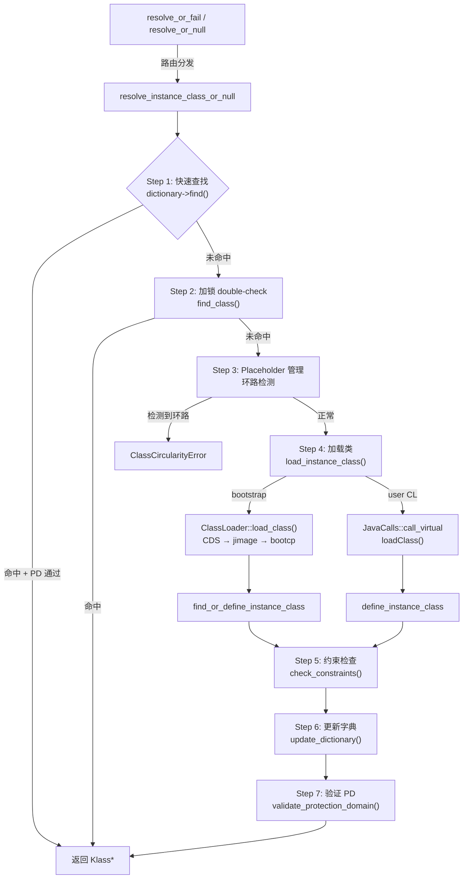
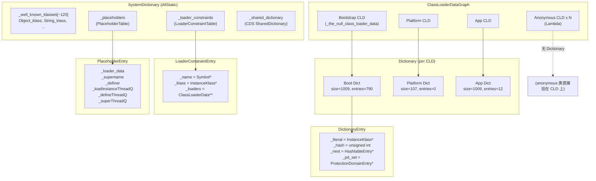

# Day 25：SystemDictionary 深度剖析

> **目标**：彻底搞懂 JVM 类解析/加载的全局入口 SystemDictionary，从 `resolve_instance_class_or_null` 到 Dictionary、PlaceholderTable、LoaderConstraintTable 的完整链路。
>
> **环境**：`-Xms8g -Xmx8g -XX:+UseG1GC -Xint`

---

## 第 0 部分：核心原理 ⭐

### 0.1 本质是什么？

本文深入分析 **Day 25：SystemDictionary 深度剖析**：从源码角度理解其设计原理、实现机制和关键细节。

### 0.2 为什么需要？

理解 JVM 内部实现是排查复杂问题、进行性能优化的基础。表面的 API 文档无法解释 JVM 的实际行为，只有深入源码才能建立精确的心智模型。

### 0.3 怎么解决？

结合源码阅读、数据结构分析和 GDB 运行时验证，从多个角度建立对该机制的完整理解。

### 0.4 为什么这样设计？

每个设计决策都有其权衡：性能 vs 正确性、简单性 vs 灵活性、内存占用 vs 查找速度。理解这些权衡是理解 JVM 设计的关键。

---


## 一、宏观理解

### 1.1 SystemDictionary 是什么？

**一句话**：SystemDictionary 是 JVM 中类加载/解析的**全局入口**（AllStatic 类），它不是一个字典，而是**协调所有字典**的中央调度器。

**解决什么问题**？JVM 运行时需要频繁地将类名（Symbol*）解析为 Klass*。这涉及：
1. **快速查找**：已加载的类要能 O(1) 找到
2. **并发安全**：多线程同时加载同一个类不能冲突
3. **委派模型**：不同 ClassLoader 看到的类互相隔离
4. **约束一致性**：跨 ClassLoader 的类型引用必须一致

SystemDictionary 通过 4 个核心数据结构协同解决这些问题。

### 1.2 Defining Loader vs Initiating Loader（核心概念）

在深入之前，必须先搞清这个核心概念，否则后面很多逻辑理解不了：

- **Defining Loader**：实际执行 `defineClass()` 并创建 InstanceKlass 的 ClassLoader。一个类只有**一个** Defining Loader
- **Initiating Loader**：发起 `loadClass()` 请求的 ClassLoader。一个类可以有**多个** Initiating Loader

**示例**：
```
AppClassLoader.loadClass("java.lang.String")
  → 委派给 Bootstrap ClassLoader
  → Bootstrap 执行 defineClass("java.lang.String")
```

此时：
- Bootstrap 是 `java.lang.String` 的 **Defining Loader**
- AppClassLoader 是 `java.lang.String` 的 **Initiating Loader**

**在 Dictionary 中的体现**：
- Defining Loader 的 Dictionary：类被 `define_instance_class` → `update_dictionary` 添加
- Initiating Loader 的 Dictionary：类在 `resolve_instance_class_or_null` 后半段，通过 `check_constraints(defining=false)` + `update_dictionary` 添加

这就是为什么 GDB 观测到 `add_klass_count(802) > define_class_count(792)` — 多出的 **10 个**就是 initiating loader 条目。

### 1.3 核心数据结构总览

```
┌─────────────────────────────────────────────────────────────────┐
│                    SystemDictionary (AllStatic)                  │
│                      类解析/加载全局入口                          │
├─────────────────────────────────────────────────────────────────┤
│                                                                 │
│  ┌──────────────────┐   ┌──────────────────┐                    │
│  │  _well_known_     │   │  _placeholders   │                    │
│  │  _klasses[]       │   │  (PlaceholderTable)│                   │
│  │  ~120 核心类缓存  │   │  并发加载协调      │                   │
│  └──────────────────┘   └──────────────────┘                    │
│                                                                 │
│  ┌──────────────────┐   ┌──────────────────┐                    │
│  │  每个 CLD 的      │   │ _loader_constraints│                   │
│  │  Dictionary       │   │ (LoaderConstraint │                   │
│  │  已加载类哈希表   │   │       Table)       │                   │
│  └──────────────────┘   │ 跨 CL 类型约束     │                   │
│                         └──────────────────┘                    │
│                                                                 │
│  入口方法:                                                       │
│  resolve_or_fail()                                              │
│    → resolve_or_null()                                          │
│      → resolve_instance_class_or_null()  ← 核心！               │
│        → load_instance_class()                                  │
│          → define_instance_class()                              │
│            → update_dictionary()                                │
│                                                                 │
└─────────────────────────────────────────────────────────────────┘
```

### 1.4 Dictionary 的每-ClassLoader 架构

**关键认知**：并不存在一个全局的"系统字典"。每个 ClassLoaderData 拥有自己独立的 Dictionary。

```
┌─────────────────┐    ┌─────────────────┐    ┌─────────────────┐
│  Bootstrap CLD  │    │  Platform CLD   │    │    App CLD      │
│  _dictionary    │    │  _dictionary    │    │  _dictionary    │
│  ┌───────────┐  │    │  ┌───────────┐  │    │  ┌───────────┐  │
│  │table_size │  │    │  │table_size │  │    │  │table_size │  │
│  │  = 1009   │  │    │  │  = 107    │  │    │  │  = 1009   │  │
│  │entries    │  │    │  │entries    │  │    │  │entries    │  │
│  │  = 790    │  │    │  │  = 0      │  │    │  │  = 12     │  │
│  └───────────┘  │    └───────────┘  │    │  └───────────┘  │
└─────────────────┘    └─────────────────┘    └─────────────────┘
       ↑                                            ↑
   java.lang.Object                          用户应用类
   java.lang.String                          com.wjcoder.*
   java.util.HashMap
   ... (JDK 核心类)
```

### 1.5 阶段划分（Mermaid 流程图）



---

## 二、源码逐行分析

> **原则**：对每个核心函数，先给出骨架（剥掉日志/断言/错误处理），再逐行展开真实源码。每行代码后面跟解释。所有代码引用标注 `文件名:行号`。

### 2.1 外层入口：resolve_or_fail / resolve_or_null

#### 2.1.1 resolve_or_fail

**骨架**（剥掉错误处理后只有 2 行）：

```
klass = resolve_or_null(name, loader, pd)   // 真正干活
if (异常 || klass == NULL) → 错误处理       // 包装异常
```

**真实源码** `systemDictionary.cpp:197-204`：

```cpp
Klass* SystemDictionary::resolve_or_fail(Symbol* class_name,
    Handle class_loader, Handle protection_domain, bool throw_error, TRAPS) {
  Klass* klass = resolve_or_null(class_name, class_loader,
                                  protection_domain, THREAD);    // 委托给 resolve_or_null
  if (HAS_PENDING_EXCEPTION || klass == NULL) {
    klass = handle_resolution_exception(class_name, throw_error,
                                         klass, THREAD);         // 异常包装
  }
  return klass;
}
```

**逐行解释**：

| 行号 | 代码 | 含义 |
|------|------|------|
| 198 | `resolve_or_null(...)` | 委托给 `resolve_or_null`，这是真正的入口 |
| 199 | `HAS_PENDING_EXCEPTION \|\| klass == NULL` | 两种失败：有异常挂起，或返回 NULL |
| 201 | `handle_resolution_exception(...)` | `throw_error=true` → 抛 `NoClassDefFoundError`；`false` → 抛 `ClassNotFoundException` |

**重载版本** `systemDictionary.cpp:237-241`：

```cpp
Klass* SystemDictionary::resolve_or_fail(Symbol* class_name,
                                           bool throw_error, TRAPS) {
  return resolve_or_fail(class_name, Handle(), Handle(), throw_error, THREAD);
  //                                  ^^^^^^^^  ^^^^^^^^
  //                                  loader=NULL  pd=NULL → Bootstrap ClassLoader
}
```

**关键点**：`Handle()` 构造空 Handle，`loader=NULL` 表示 Bootstrap ClassLoader。

#### 2.1.2 handle_resolution_exception

**真实源码** `systemDictionary.cpp:206-234`：

```cpp
Klass* SystemDictionary::handle_resolution_exception(Symbol* class_name,
                                                     bool throw_error,
                                                     Klass* klass, TRAPS) {
  if (HAS_PENDING_EXCEPTION) {
    // 有异常挂起
    if (throw_error &&
        PENDING_EXCEPTION->is_a(SystemDictionary::ClassNotFoundException_klass())) {
      // throw_error=true 且异常是 ClassNotFoundException → 转为 NoClassDefFoundError
      ResourceMark rm(THREAD);
      Handle e(THREAD, PENDING_EXCEPTION);     // 保存原始异常
      CLEAR_PENDING_EXCEPTION;                 // 清除
      THROW_MSG_CAUSE_NULL(vmSymbols::java_lang_NoClassDefFoundError(),
                           class_name->as_C_string(), e);  // 链式异常
    } else {
      return NULL;  // throw_error=false，直接向上传播 ClassNotFoundException
    }
  }
  // klass == NULL，但没有异常挂起
  if (klass == NULL) {
    ResourceMark rm(THREAD);
    if (throw_error) {
      THROW_MSG_NULL(vmSymbols::java_lang_NoClassDefFoundError(),
                     class_name->as_C_string());
    } else {
      THROW_MSG_NULL(vmSymbols::java_lang_ClassNotFoundException(),
                     class_name->as_C_string());
    }
  }
  return klass;
}
```

**`throw_error` 参数的含义**：

| throw_error | 异常类型 | 典型场景 |
|-------------|----------|----------|
| `true` | `NoClassDefFoundError` | 字节码引用（`new`、`invokevirtual`），编译时存在但运行时找不到 |
| `false` | `ClassNotFoundException` | `Class.forName()`、`ClassLoader.loadClass()` |

#### 2.1.3 resolve_or_null

**真实源码** `systemDictionary.cpp:246-258`：

```cpp
Klass* SystemDictionary::resolve_or_null(Symbol* class_name,
    Handle class_loader, Handle protection_domain, TRAPS) {
  if (FieldType::is_array(class_name)) {
    // 数组类型 "[Ljava/lang/String;" → 走数组解析路径
    return resolve_array_class_or_null(class_name, class_loader,
                                        protection_domain, THREAD);
  } else if (FieldType::is_obj(class_name)) {
    // 对象类型描述符 "Ljava/lang/String;" → 去掉 L 和 ;
    ResourceMark rm(THREAD);
    TempNewSymbol name = SymbolTable::new_symbol(
        class_name->as_C_string() + 1,             // 跳过 'L'
        class_name->utf8_length() - 2, CHECK_NULL); // 去掉 'L' 和 ';'
    return resolve_instance_class_or_null(name, class_loader,
                                           protection_domain, THREAD);
  } else {
    // 普通类名 "java/lang/String" → 直接解析
    return resolve_instance_class_or_null(class_name, class_loader,
                                           protection_domain, THREAD);
  }
}
```

**三条分支**：

| 条件 | 输入示例 | 处理 |
|------|----------|------|
| `FieldType::is_array()` → `name[0] == '['` | `[Ljava/lang/String;` | `resolve_array_class_or_null` |
| `FieldType::is_obj()` → `name[0] == 'L'` | `Ljava/lang/String;` | 去掉 `L` 和 `;`，走 `resolve_instance_class_or_null` |
| 其他 | `java/lang/String` | 直接走 `resolve_instance_class_or_null` |

#### 2.1.4 resolve_array_class_or_null

**真实源码** `systemDictionary.cpp:266-290`：

```cpp
Klass* SystemDictionary::resolve_array_class_or_null(Symbol* class_name,
    Handle class_loader, Handle protection_domain, TRAPS) {
  assert(FieldType::is_array(class_name), "must be array");
  Klass* k = NULL;
  FieldArrayInfo fd;
  BasicType t = FieldType::get_array_info(class_name, fd, CHECK_NULL);
  //  解析数组签名，得到：
  //  - t: 元素基本类型（T_OBJECT / T_INT / T_LONG ...）
  //  - fd.dimension(): 数组维度（[[ → 2）
  //  - fd.object_key(): 对象元素的类名（"java/lang/String"）
  if (t == T_OBJECT) {
    // 对象数组 → 先解析元素类，再创建数组类
    k = SystemDictionary::resolve_instance_class_or_null(fd.object_key(),
        class_loader, protection_domain, CHECK_NULL);
    if (k != NULL) {
      k = k->array_klass(fd.dimension(), CHECK_NULL);  // 创建 ObjArrayKlass
    }
  } else {
    // 基本类型数组 → 从 Universe 获取预创建的 TypeArrayKlass
    k = Universe::typeArrayKlassObj(t);          // int[] → _typeArrayKlassObjs[T_INT]
    k = TypeArrayKlass::cast(k)->array_klass(fd.dimension(), CHECK_NULL);
  }
  return k;
}
```

**关键点**：基本类型数组（`int[]`、`byte[]`）的 `TypeArrayKlass` 在 JVM 启动时由 `Universe::genesis()` 预创建，不需要走类加载流程。

---

### 2.2 辅助函数：register_loader / is_parallelCapable / compute_loader_lock_object

这几个函数在 `resolve_instance_class_or_null` 中频繁调用，先弄清楚它们。

#### 2.2.1 register_loader

**真实源码** `systemDictionary.cpp:150-153`：

```cpp
ClassLoaderData* SystemDictionary::register_loader(Handle class_loader) {
  if (class_loader() == NULL)
    return ClassLoaderData::the_null_class_loader_data();  // Bootstrap → 全局单例
  return ClassLoaderDataGraph::find_or_create(class_loader); // 非 Bootstrap → 查找或创建
}
```

**3 行代码，两条路径**：

| class_loader | 返回 | 含义 |
|-------------|------|------|
| `NULL`（Bootstrap） | `ClassLoaderData::the_null_class_loader_data()` | 全局静态单例，生命周期 = JVM 生命周期 |
| 非 NULL（App/自定义） | `ClassLoaderDataGraph::find_or_create(class_loader)` | 在 CLDG 链表中查找，找不到就创建 |

**为什么重要**：每个 ClassLoaderData 持有自己的 `Dictionary`。不同 ClassLoader 加载的同名类存在不同的 Dictionary 中，这是**类加载器命名空间隔离**的基础。

#### 2.2.2 is_parallelCapable / is_parallelDefine

**真实源码** `systemDictionary.cpp:158-171`：

```cpp
bool SystemDictionary::is_parallelCapable(Handle class_loader) {
  if (class_loader.is_null()) return true;   // Bootstrap 天生并行
  if (AlwaysLockClassLoader) return false;    // 调试开关，强制非并行
  return java_lang_ClassLoader::parallelCapable(class_loader());
  // 读取 ClassLoader 对象的 parallelLockMap 字段是否非 null
}

bool SystemDictionary::is_parallelDefine(Handle class_loader) {
   if (class_loader.is_null()) return false;  // Bootstrap 不走 parallelDefine
   if (AllowParallelDefineClass &&
       java_lang_ClassLoader::parallelCapable(class_loader())) {
     return true;  // 需要 VM 参数 AllowParallelDefineClass=true 且 ClassLoader 并行
   }
   return false;
}
```

**两个标志的区别**：

| 标志 | Bootstrap | 普通 ClassLoader | ParallelCapable ClassLoader |
|------|-----------|-------------------|----------------------------|
| `is_parallelCapable` | `true` | `false` | `true` |
| `is_parallelDefine` | `false` | `false` | 需要 `AllowParallelDefineClass=true` |

**影响范围**：

| 标志 | 影响位置 | 作用 |
|------|----------|------|
| `is_parallelCapable` | `resolve_instance_class_or_null` | 决定是否获取 ClassLoader 对象锁 |
| `is_parallelDefine` | `find_or_define_instance_class` | 决定是否允许复用其他线程的定义结果 |

> **JVM 参数**：`-XX:+AlwaysLockClassLoader` 可以强制所有 ClassLoader 走非并行路径（调试用）。
> `-XX:+AllowParallelDefineClass` 允许并行定义同名类（默认 false）。

#### 2.2.3 compute_loader_lock_object

**真实源码** `systemDictionary.cpp:1726-1733`：

```cpp
Handle SystemDictionary::compute_loader_lock_object(Handle class_loader, TRAPS) {
  if (class_loader.is_null()) {
    return Handle(THREAD, _system_loader_lock_obj);  // Bootstrap → 专用锁对象
  } else {
    return class_loader;  // 非 Bootstrap → ClassLoader 对象本身就是锁
  }
}
```

**`_system_loader_lock_obj` 是什么？** 它是一个 `int[0]` 数组，在 `SystemDictionary::initialize()` 中创建：

```cpp
// systemDictionary.cpp:1904-1916
void SystemDictionary::initialize(TRAPS) {
  _system_loader_lock_obj = oopFactory::new_intArray(0, CHECK);
  // ...
}
```

**为什么用 `int[0]`？** 因为只需要一个 Java 对象来当监视器锁，不需要任何实际内容。`int[0]` 是最小的数组对象。

#### 2.2.4 check_loader_lock_contention

**真实源码** `systemDictionary.cpp:1739-1756`：

```cpp
void SystemDictionary::check_loader_lock_contention(Handle loader_lock, TRAPS) {
  if (!UsePerfData) {
    return;  // 性能计数器关闭时直接返回
  }
  assert(!loader_lock.is_null(), "NULL lock object");
  if (ObjectSynchronizer::query_lock_ownership((JavaThread*)THREAD, loader_lock)
      == ObjectSynchronizer::owner_other) {
    // 锁被其他线程持有 → 即将发生锁竞争
    if (loader_lock() == _system_loader_lock_obj) {
      ClassLoader::sync_systemLoaderLockContentionRate()->inc();    // 系统加载器锁竞争计数
    } else {
      ClassLoader::sync_nonSystemLoaderLockContentionRate()->inc(); // 非系统加载器锁竞争计数
    }
  }
}
```

**纯监控函数**，不影响逻辑。记录锁竞争频率到 PerfData 计数器中。

> **查看此计数器**：`jcmd <pid> PerfCounter.print | grep sync` 可以看到 `sun.cls.systemLoaderLockContentionRate` 等值。

---

### 2.3 核心方法：resolve_instance_class_or_null（逐行完整分析）

这是整个类解析的核心，约 260 行代码（`systemDictionary.cpp:631-894`）。下面按 6 个 Phase 逐行分析。

#### Phase 1: 无锁快速查找（631-657 行）

**真实源码** `systemDictionary.cpp:631-657`：

```cpp
Klass* SystemDictionary::resolve_instance_class_or_null(Symbol* name,
                                                        Handle class_loader,
                                                        Handle protection_domain,
                                                        TRAPS) {
  assert(name != NULL && !FieldType::is_array(name) &&
         !FieldType::is_obj(name), "invalid class name");
  // 断言：进来的一定是 "java/lang/String" 这样的纯类名，不是数组/描述符

  EventClassLoad class_load_start_event;   // JFR 类加载事件（后面提交）

  HandleMark hm(THREAD);                  // HandleMark：退出作用域时回收所有临时 Handle

  // ★ 去掉反射代理包装：DelegatingClassLoader → 实际 ClassLoader
  class_loader = Handle(THREAD,
      java_lang_ClassLoader::non_reflection_class_loader(class_loader()));

  // ★ 注册 loader，获取 ClassLoaderData 及其 Dictionary
  ClassLoaderData* loader_data = register_loader(class_loader);
  //   NULL → the_null_class_loader_data()（Bootstrap）
  //   非NULL → ClassLoaderDataGraph::find_or_create()
  Dictionary* dictionary = loader_data->dictionary();
  unsigned int d_hash = dictionary->compute_hash(name);

  // ★ 无锁快速查找
  {
    Klass* probe = dictionary->find(d_hash, name, protection_domain);
    if (probe != NULL) return probe;    // 快速路径命中，直接返回！
  }
```

**为什么能无锁？** `dictionary->find()` 只做读操作。关键在于 release/acquire 内存序：

```cpp
// dictionary.cpp:333-344
InstanceKlass* Dictionary::find(unsigned int hash, Symbol* name,
                                Handle protection_domain) {
  NoSafepointVerifier nsv;   // 不能被 safepoint 打断
  int index = hash_to_index(hash);
  DictionaryEntry* entry = get_entry(index, hash, name);  // 链表遍历
  if (entry != NULL && entry->is_valid_protection_domain(protection_domain)) {
    return entry->instance_klass();
  }
  return NULL;
}
```

写入端（`add_protection_domain`）使用 `release_set_pd_set()`，读取端使用 `pd_set_acquire()`，确保并发安全。bucket 链表只在头部插入（`add_klass`），已有节点不会被删除（删除只在 safepoint），所以无锁遍历是安全的。

`is_valid_protection_domain` 的判断逻辑：
- PD 为 NULL → 直接通过（Bootstrap 路径）
- PD == 类自身的 PD → 通过
- PD 在 `_pd_set` 缓存链表中 → 通过
- 否则 → `false`（需后续 Java 回调验证）

#### Phase 2: 准备锁 + 加锁 double-check（658-726 行）

**真实源码** `systemDictionary.cpp:658-726`：

```cpp
  // 判断是否需要对象锁
  bool DoObjectLock = true;
  if (is_parallelCapable(class_loader)) {
    DoObjectLock = false;
    // ParallelCapable 加载器（包括 Bootstrap）不需要对象锁
  }

  unsigned int p_hash = placeholders()->compute_hash(name);
  int p_index = placeholders()->hash_to_index(p_hash);

  // 获取锁对象 + 性能计数
  Handle lockObject = compute_loader_lock_object(class_loader, THREAD);
  //   Bootstrap → _system_loader_lock_obj（int[0] 数组）
  //   其他     → ClassLoader 对象本身
  check_loader_lock_contention(lockObject, THREAD);  // 纯监控，记录竞争次数
  ObjectLocker ol(lockObject, THREAD, DoObjectLock);
  //   DoObjectLock=true  → 实际加锁（非并行加载器）
  //   DoObjectLock=false → 不加锁（并行加载器）

  // ★ 加锁后再查一次（double-check）
  bool class_has_been_loaded   = false;
  bool super_load_in_progress  = false;
  bool havesupername = false;
  InstanceKlass* k = NULL;
  PlaceholderEntry* placeholder;
  Symbol* superclassname = NULL;

  {
    MutexLocker mu(SystemDictionary_lock, THREAD);
    InstanceKlass* check = find_class(d_hash, name, dictionary);
    if (check != NULL) {
      class_has_been_loaded = true;
      k = check;
    } else {
      // 字典中没有 → 检查 placeholder：是否有其他线程在加载此类的父类？
      placeholder = placeholders()->get_entry(p_index, p_hash, name, loader_data);
      if (placeholder && placeholder->super_load_in_progress()) {
         super_load_in_progress = true;
         if (placeholder->havesupername() == true) {
           superclassname = placeholder->supername();
           havesupername = true;
         }
      }
    }
  }
```

**两层锁**：

| 锁 | 类型 | 作用 |
|---|------|------|
| `ObjectLocker ol(lockObject)` | Java 对象监视器锁 | 防止同一非并行 ClassLoader 的并行加载冲突 |
| `MutexLocker mu(SystemDictionary_lock)` | VM 内部 Mutex | 保护 Dictionary/PlaceholderTable 的写操作 |

**`super_load_in_progress` 分支**：如果发现 placeholder 中该类名有 `LOAD_SUPER` 标记（其他线程正在加载它的父类），则进入 `handle_parallel_super_load` 处理。

#### Phase 2.5: handle_parallel_super_load（714-726 行调用，542-614 行定义）

**真实源码** `systemDictionary.cpp:714-726`（调用方）：

```cpp
  if (super_load_in_progress && havesupername==true) {
    k = handle_parallel_super_load(name, superclassname, class_loader,
                                   protection_domain, lockObject, THREAD);
    if (HAS_PENDING_EXCEPTION) {
      return NULL;
    }
    if (k != NULL) {
      class_has_been_loaded = true;
    }
  }
```

**`handle_parallel_super_load` 完整源码** `systemDictionary.cpp:542-614`：

```cpp
InstanceKlass* SystemDictionary::handle_parallel_super_load(
    Symbol* name, Symbol* superclassname, Handle class_loader,
    Handle protection_domain, Handle lockObject, TRAPS) {

  ClassLoaderData* loader_data = class_loader_data(class_loader);
  Dictionary* dictionary = loader_data->dictionary();
  unsigned int d_hash = dictionary->compute_hash(name);
  unsigned int p_hash = placeholders()->compute_hash(name);
  int p_index = placeholders()->hash_to_index(p_hash);

  // ★ 先递归解析父类（用于环路检测）
  Klass* superk = SystemDictionary::resolve_super_or_fail(name,
      superclassname, class_loader, protection_domain, true, CHECK_NULL);
  // 即使 superk 不使用，resolve_super_or_fail 内部会做环路检测

  // ★ ParallelCapable 加载器不等待，直接查字典返回
  if (!class_loader.is_null() && is_parallelCapable(class_loader)) {
    MutexLocker mu(SystemDictionary_lock, THREAD);
    return find_class(d_hash, name, dictionary);
    // 如果其他线程已经加载完 → 返回非NULL
    // 如果还没加载完 → 返回NULL，由调用方继续加载
  }

  // ★ 非并行加载器：必须等待，直到原始加载线程完成
  bool super_load_in_progress = true;
  PlaceholderEntry* placeholder;
  while (super_load_in_progress) {
    MutexLocker mu(SystemDictionary_lock, THREAD);
    InstanceKlass* check = find_class(d_hash, name, dictionary);
    if (check != NULL) {
      return check;  // 加载完成
    } else {
      placeholder = placeholders()->get_entry(p_index, p_hash, name, loader_data);
      if (placeholder && placeholder->super_load_in_progress()) {
        // 还在加载父类 → 等待
        if (class_loader.is_null()) {
          SystemDictionary_lock->wait();        // Bootstrap
        } else {
          double_lock_wait(lockObject, THREAD);  // 非并行用户CL
        }
      } else {
        super_load_in_progress = false;  // 不在加载了 → 退出循环
      }
    }
  }
  return NULL;  // 其他线程加载失败了，调用方需要自己加载
}
```

#### Phase 2.6: double_lock_wait（514-527 行）

**真实源码** `systemDictionary.cpp:514-527`：

```cpp
void SystemDictionary::double_lock_wait(Handle lockObject, TRAPS) {
  assert_lock_strong(SystemDictionary_lock);          // 进入时必须持有 SD_lock

  bool calledholdinglock
      = ObjectSynchronizer::current_thread_holds_lock(
            (JavaThread*)THREAD, lockObject);
  assert(calledholdinglock, "must hold lock for notify");

  // ★ 6 步锁舞蹈：
  ObjectSynchronizer::notifyall(lockObject, THREAD);  // 1. 唤醒在 lockObject 上等待的线程
  intptr_t recursions =
      ObjectSynchronizer::complete_exit(lockObject, THREAD);  // 2. 完全释放 lockObject（记录递归次数）
  SystemDictionary_lock->wait();                       // 3. 在 SD_lock 上 wait（释放 SD_lock）
  SystemDictionary_lock->unlock();                     // 4. 醒来后释放 SD_lock
  ObjectSynchronizer::reenter(lockObject, recursions, THREAD);  // 5. 重新获取 lockObject（恢复递归次数）
  SystemDictionary_lock->lock();                       // 6. 重新获取 SD_lock
}
```

**为什么需要这么复杂的锁操作？** 因为锁排序规则要求：获取 lockObject（Java 层锁）必须在获取 SystemDictionary_lock（VM 层锁）之前。如果在持有 SD_lock 时直接 wait 在 lockObject 上，会违反 lock rank 约束导致死锁风险。所以必须先释放 lockObject → wait SD_lock → 释放 SD_lock → 重新获取 lockObject → 重新获取 SD_lock。

#### Phase 3: Placeholder 管理 + 环路检测 + 等待（728-863 行）

这是整个方法中**最复杂**的部分。

**真实源码** `systemDictionary.cpp:728-809`：

```cpp
  bool throw_circularity_error = false;
  if (!class_has_been_loaded) {
    bool load_instance_added = false;

    // ★ 5 种 Case（源码注释 739-752 行）：
    // case 1: 传统 CL，持有对象锁 — 不应看到 load_in_progress
    // case 2: 传统 CL，破坏了对象锁（deadlock workaround） — 等待
    // case 3: Bootstrap CL，无对象锁 — SystemDictionary_lock->wait()
    // case 4: ParallelCapable CL，无对象锁 — 允许并行竞争

    {
      MutexLocker mu(SystemDictionary_lock, THREAD);
      if (class_loader.is_null() || !is_parallelCapable(class_loader)) {
        // ★ 非并行加载器 或 Bootstrap
        PlaceholderEntry* oldprobe = placeholders()->get_entry(
            p_index, p_hash, name, loader_data);
        if (oldprobe) {
          // ★ 环路检测：同一线程已经在 LOAD_INSTANCE 此类
          if (oldprobe->check_seen_thread(THREAD,
                  PlaceholderTable::LOAD_INSTANCE)) {
            throw_circularity_error = true;
          } else {
            // 其他线程在加载 → while 循环等待
            while (!class_has_been_loaded && oldprobe
                   && oldprobe->instance_load_in_progress()) {
              if (class_loader.is_null()) {
                SystemDictionary_lock->wait();           // case 3: Bootstrap
              } else {
                double_lock_wait(lockObject, THREAD);    // case 2: 传统CL
              }
              // 醒来 → 检查是否已加载
              InstanceKlass* check = find_class(d_hash, name, dictionary);
              if (check != NULL) {
                k = check;
                class_has_been_loaded = true;
              }
              // 重新检查 placeholder 是否还在
              oldprobe = placeholders()->get_entry(
                  p_index, p_hash, name, loader_data);
            }
          }
        }
      }
      // ★ 统一：添加 LOAD_INSTANCE 标记（case 4 直接到这里）
      if (!throw_circularity_error && !class_has_been_loaded) {
        PlaceholderEntry* newprobe = placeholders()->find_and_add(
            p_index, p_hash, name, loader_data,
            PlaceholderTable::LOAD_INSTANCE, NULL, THREAD);
        load_instance_added = true;

        // ★ 拿到令牌后最后一次 find_class（对无对象锁的加载器必要）
        InstanceKlass* check = find_class(d_hash, name, dictionary);
        if (check != NULL) {
          k = check;
          class_has_been_loaded = true;
        }
      }
    }

    // ★ 环路检测异常必须在锁外抛出
    if (throw_circularity_error) {
      ResourceMark rm(THREAD);
      THROW_MSG_NULL(vmSymbols::java_lang_ClassCircularityError(),
                     name->as_C_string());
    }
```

**环路检测原理**（以 `A extends B, B extends A` 为例）：

```
线程 T 解析 A:
  resolve_instance_class_or_null("A")
    → placeholder(A, T, LOAD_INSTANCE)        ← T 正在加载 A
    → load_instance_class("A")
      → ClassFileParser: A extends B
        → resolve_super_or_fail(child=A, super=B)
          → placeholder(A, T, LOAD_SUPER)      ← T 正在为 A 加载父类
          → resolve_or_null("B")
            → resolve_instance_class_or_null("B")
              → placeholder(B, T, LOAD_INSTANCE)
              → load_instance_class("B")
                → ClassFileParser: B extends A
                  → resolve_super_or_fail(child=B, super=A)
                    → resolve_or_null("A")
                      → resolve_instance_class_or_null("A")
                        → check: placeholder(A, T, LOAD_INSTANCE) 已存在
                        → check_seen_thread(T, LOAD_INSTANCE) = true!
                        ★ ClassCircularityError!
```

**Initiating Loader vs Defining Loader 的理解**：
- 792 次 `define_instance_class` 将类写入 **defining loader** 的 Dictionary
- 10 次 post-load 路径将类写入 **initiating loader** 的 Dictionary（defining ≠ initiating 时）
- `record_dependency(k)` 确保 defining CLD 的生命周期至少与 initiating CLD 一样长

#### Phase 5: 清理 LOAD_INSTANCE Placeholder（856-863 行）

**真实源码** `systemDictionary.cpp:856-863`：

```cpp
    if (load_instance_added == true) {
      // 无论加载成功还是失败，都必须清理 LOAD_INSTANCE 标记
      MutexLocker mu(SystemDictionary_lock, THREAD);
      placeholders()->find_and_remove(p_index, p_hash, name, loader_data,
                                      PlaceholderTable::LOAD_INSTANCE, THREAD);
      SystemDictionary_lock->notify_all();  // 唤醒在 Phase 3 中等待的线程
    }
  }
```

**注意**：源码注释在第 628-630 行特别强调了这一点：

> "Be careful when modifying this code: once you have run `placeholders()->find_and_add(LOAD_INSTANCE)`, you need to `find_and_remove` it before returning. So be careful to not exit with a `CHECK_` macro between these calls."

`CHECK_` 宏在异常时会直接 return，跳过清理代码。所以 Phase 3 到 Phase 5 之间的代码都不能使用 `CHECK_` 宏。

#### Phase 6: 最终 ProtectionDomain 验证（866-893 行）

**真实源码** `systemDictionary.cpp:866-893`：

```cpp
  if (HAS_PENDING_EXCEPTION || k == NULL) {
    return NULL;
  }
  if (class_load_start_event.should_commit()) {
    post_class_load_event(&class_load_start_event, k, loader_data);  // JFR 事件
  }

  // PD 为 NULL → 直接返回（Bootstrap 加载器无 PD）
  if (protection_domain() == NULL) return k;

  // 快速路径：PD 已在缓存中
  if (dictionary->is_valid_protection_domain(d_hash, name, protection_domain)) {
    return k;
  }

  // 慢路径：Java 回调验证 + 缓存
  validate_protection_domain(k, class_loader, protection_domain, CHECK_NULL);

  return k;
}
```

---

### 2.4 load_instance_class（完整源码分析）

**真实源码** `systemDictionary.cpp:1403-1544`

#### 2.4.1 Bootstrap 路径（1405-1492 行）

```cpp
InstanceKlass* SystemDictionary::load_instance_class(Symbol* class_name,
                                                     Handle class_loader, TRAPS) {
  if (class_loader.is_null()) {
    // ==================== Bootstrap ClassLoader 路径 ====================
    ResourceMark rm;
    PackageEntry* pkg_entry = NULL;
    bool search_only_bootloader_append = false;
    ClassLoaderData *loader_data = class_loader_data(class_loader);

    // ★ 查找包信息
    TempNewSymbol pkg_name = InstanceKlass::package_from_name(class_name, CHECK_NULL);
    if (pkg_name != NULL) {
      pkg_entry = loader_data->packages()->lookup_only(pkg_name);
    }

    // ★ 模块可见性检查
    if (!Universe::is_module_initialized()) {
      // 模块系统未初始化时：只允许 java.base 中的类
      if (pkg_entry == NULL || pkg_entry->in_unnamed_module()) {
        if (ModuleEntryTable::javabase_defined()) {
          return NULL;  // java.base 已定义但类不在其中 → 拒绝
        }
        // java.base 还没定义 → 放行（后面会验证）
      } else {
        ModuleEntry* mod_entry = pkg_entry->module();
        if (mod_entry->name()->fast_compare(vmSymbols::java_base()) != 0) {
          return NULL;  // 不是 java.base 模块中的类 → 拒绝
        }
      }
    } else {
      // 模块系统已初始化：不在 boot loader 模块中的类只能从 append 路径加载
      if (pkg_name == NULL || pkg_entry == NULL || pkg_entry->in_unnamed_module()) {
        search_only_bootloader_append = true;
      }
    }

    // ★ 从 CDS 共享存档加载
    InstanceKlass* k = NULL;
    {
#if INCLUDE_CDS
      PerfTraceTime vmtimer(ClassLoader::perf_shared_classload_time());
      k = load_shared_class(class_name, class_loader, THREAD);
#endif
    }

    // ★ 从文件系统加载
    if (k == NULL) {
      PerfTraceTime vmtimer(ClassLoader::perf_sys_classload_time());
      k = ClassLoader::load_class(class_name, search_only_bootloader_append, CHECK_NULL);
      // ClassLoader::load_class 的搜索顺序：
      // 1. --patch-module 路径
      // 2. jimage（modules image）或 exploded build
      // 3. -Xbootclasspath/a 路径（仅当 search_only_bootloader_append=true）
    }

    // ★ 通过 find_or_define_instance_class 注册
    if (k != NULL) {
      InstanceKlass* defined_k =
        find_or_define_instance_class(class_name, class_loader, k, THREAD);
      if (!HAS_PENDING_EXCEPTION && defined_k != k) {
        // 其他线程先定义了同名类 → 用它的结果，回收自己的 k
        loader_data->add_to_deallocate_list(k);
        k = defined_k;
      } else if (HAS_PENDING_EXCEPTION) {
        loader_data->add_to_deallocate_list(k);
        return NULL;
      }
    }
    return k;
```

#### 2.4.2 用户 ClassLoader 路径（1493-1543 行）

```cpp
  } else {
    // ==================== 用户 ClassLoader 路径 ====================
    ResourceMark rm(THREAD);
    JavaThread* jt = (JavaThread*) THREAD;

    PerfClassTraceTime vmtimer(ClassLoader::perf_app_classload_time(), ...);

    // ★ 将 class_name（"com/example/Foo"）转为 Java String（"com.example.Foo"）
    Handle s = java_lang_String::create_from_symbol(class_name, CHECK_NULL);
    Handle string = java_lang_String::externalize_classname(s, CHECK_NULL);
    // externalize: '/' → '.'

    JavaValue result(T_OBJECT);
    InstanceKlass* spec_klass = SystemDictionary::ClassLoader_klass();

    // ★ 调用 Java 层 ClassLoader.loadClass(String)
    JavaCalls::call_virtual(&result,
                            class_loader,
                            spec_klass,
                            vmSymbols::loadClass_name(),          // "loadClass"
                            vmSymbols::string_class_signature(),  // "(Ljava/lang/String;)Ljava/lang/Class;"
                            string,
                            CHECK_NULL);

    oop obj = (oop) result.get_jobject();

    // ★ 返回值校验：名字必须匹配！
    if ((obj != NULL) && !(java_lang_Class::is_primitive(obj))) {
      InstanceKlass* k = InstanceKlass::cast(java_lang_Class::as_Klass(obj));
      if (class_name == k->name()) {
        return k;
      }
    }
    return NULL;  // 名字不匹配或返回 null → 失败
  }
}
```

**用户 CL 路径的名字校验为什么重要？** Bootstrap 路径在 `ClassFileParser` 解析 class file 时已做名字验证，但用户 CL 路径通过 Java 回调返回 `Class` 对象，JVM 无法控制 Java 层返回什么，必须再次验证名字一致性。

---

### 2.5 resolve_super_or_fail：父类解析与环路检测

**真实源码** `systemDictionary.cpp:332-429`：

```cpp
Klass* SystemDictionary::resolve_super_or_fail(Symbol* child_name,
                                               Symbol* class_name,
                                               Handle class_loader,
                                               Handle protection_domain,
                                               bool is_superclass, TRAPS) {

  ClassLoaderData* loader_data = class_loader_data(class_loader);
  Dictionary* dictionary = loader_data->dictionary();
  unsigned int d_hash = dictionary->compute_hash(child_name);
  unsigned int p_hash = placeholders()->compute_hash(child_name);
  int p_index = placeholders()->hash_to_index(p_hash);

  bool child_already_loaded = false;
  bool throw_circularity_error = false;
  {
    MutexLocker mu(SystemDictionary_lock, THREAD);

    // ★ Quick path: 子类已加载且父类匹配 → 直接返回
    Klass* childk = find_class(d_hash, child_name, dictionary);
    Klass* quicksuperk;
    if ((childk != NULL) && (is_superclass) &&
        ((quicksuperk = childk->super()) != NULL) &&
        ((quicksuperk->name() == class_name) &&
         (quicksuperk->class_loader() == class_loader()))) {
      return quicksuperk;
    } else {
      // ★ 环路检测：当前线程是否已在 LOAD_SUPER 此 child？
      PlaceholderEntry* probe = placeholders()->get_entry(
          p_index, p_hash, child_name, loader_data);
      if (probe && probe->check_seen_thread(THREAD,
              PlaceholderTable::LOAD_SUPER)) {
        throw_circularity_error = true;
      }
    }

    // ★ 标记 LOAD_SUPER：(child_name, LOAD_SUPER, super_class_name)
    if (!throw_circularity_error) {
      placeholders()->find_and_add(p_index, p_hash, child_name, loader_data,
                                   PlaceholderTable::LOAD_SUPER, class_name, THREAD);
    }
  }

  if (throw_circularity_error) {
    ResourceMark rm(THREAD);
    THROW_MSG_NULL(vmSymbols::java_lang_ClassCircularityError(),
                   child_name->as_C_string());
  }

  // ★ 递归解析父类（可能再次触发 resolve_super_or_fail）
  Klass* superk = SystemDictionary::resolve_or_null(class_name, class_loader,
                                                    protection_domain, THREAD);

  // ★ 无论成功失败，清理 LOAD_SUPER 标记
  {
    MutexLocker mu(SystemDictionary_lock, THREAD);
    placeholders()->find_and_remove(p_index, p_hash, child_name, loader_data,
                                    PlaceholderTable::LOAD_SUPER, THREAD);
    SystemDictionary_lock->notify_all();
  }

  if (HAS_PENDING_EXCEPTION || superk == NULL) {
    superk = handle_resolution_exception(class_name, true, superk, THREAD);
  }
  return superk;
}
```

**环路检测配合关系**：

| 检测位置 | 使用的标记 | 检测场景 |
|----------|-----------|----------|
| `resolve_instance_class_or_null` Phase 3 | `LOAD_INSTANCE` | 同一线程递归加载同一个类 |
| `resolve_super_or_fail` | `LOAD_SUPER` | 同一线程递归为同一 child 加载父类 |

两者配合覆盖所有循环继承场景。

---

### 2.6 define_instance_class：类定义（完整源码）

**真实源码** `systemDictionary.cpp:1555-1624`：

```cpp
void SystemDictionary::define_instance_class(InstanceKlass* k, TRAPS) {
  HandleMark hm(THREAD);
  ClassLoaderData* loader_data = k->class_loader_data();
  Handle class_loader_h(THREAD, loader_data->class_loader());

  // Step 1: 锁断言
  // 非 bootstrap && 非 parallelCapable → 必须持有 loader 对象锁
  if (!class_loader_h.is_null() && !is_parallelCapable(class_loader_h)) {
    assert(ObjectSynchronizer::current_thread_holds_lock((JavaThread*)THREAD,
         compute_loader_lock_object(class_loader_h, THREAD)),
         "define called without lock");
  }

  // Step 2: 约束检查（defining=true → 字典中已有同名 → LinkageError）
  Symbol*  name_h = k->name();
  Dictionary* dictionary = loader_data->dictionary();
  unsigned int d_hash = dictionary->compute_hash(name_h);
  check_constraints(d_hash, k, class_loader_h, true, CHECK);

  // Step 3: addClass 回调（在写入字典之前！OOM 时不污染字典）
  if (k->class_loader() != NULL) {  // Bootstrap 不需要
    methodHandle m(THREAD, Universe::loader_addClass_method());
    JavaValue result(T_VOID);
    JavaCallArguments args(class_loader_h);
    args.push_oop(Handle(THREAD, k->java_mirror()));
    JavaCalls::call(&result, m, &args, CHECK);
    // 调用 ClassLoader.addClass(Class) → Java 层注册
  }

  // Step 4-5: 在 Compile_lock 下执行
  {
    unsigned int p_hash = placeholders()->compute_hash(name_h);
    int p_index = placeholders()->hash_to_index(p_hash);
    MutexLocker mu_r(Compile_lock, THREAD);

    // Step 4: 加入类层次结构
    add_to_hierarchy(k, CHECK);

    // Step 5: 写入字典
    update_dictionary(d_hash, p_index, p_hash, k, class_loader_h, THREAD);
  }

  // Step 6: 急切初始化
  k->eager_initialize(THREAD);
  // 对没有 static 初始化器的类，直接标记为 fully_initialized
  // 避免后续 <clinit> 的同步开销

  // Step 7: JVMTI 通知 + JFR 事件
  if (JvmtiExport::should_post_class_load()) {
    JvmtiExport::post_class_load((JavaThread *) THREAD, k);
  }
  post_class_define_event(k, loader_data);
}
```

**为什么 addClass 在 update_dictionary 之前？** 源码注释（1586-1590 行）明确说明：`addClass` 可能因 OOM 失败。如果先写字典再 addClass，OOM 后字典已有记录但 Java 层不知道，状态不一致。先 addClass 后写字典，OOM 时字典未被污染。

---

### 2.7 find_or_define_instance_class：令牌制并行定义

**真实源码** `systemDictionary.cpp:1646-1724`：

```cpp
InstanceKlass* SystemDictionary::find_or_define_instance_class(
    Symbol* class_name, Handle class_loader, InstanceKlass* k, TRAPS) {

  Symbol*  name_h = k->name();
  ClassLoaderData* loader_data = class_loader_data(class_loader);
  Dictionary* dictionary = loader_data->dictionary();
  unsigned int d_hash = dictionary->compute_hash(name_h);
  unsigned int p_hash = placeholders()->compute_hash(name_h);
  int p_index = placeholders()->hash_to_index(p_hash);
  PlaceholderEntry* probe;

  {
    MutexLocker mu(SystemDictionary_lock, THREAD);

    // Phase 1: parallelDefine 加载器先查字典
    if (is_parallelDefine(class_loader)) {
      InstanceKlass* check = find_class(d_hash, name_h, dictionary);
      if (check != NULL) {
        return check;  // 其他线程已定义
      }
    }

    // Phase 2: 获取 DEFINE_CLASS 令牌
    probe = placeholders()->find_and_add(p_index, p_hash, name_h, loader_data,
                                         PlaceholderTable::DEFINE_CLASS, NULL, THREAD);

    // Phase 3: 等待已有 definer 完成
    while (probe->definer() != NULL) {
      SystemDictionary_lock->wait();
    }

    // Phase 4: parallelDefine 且已有结果 → 直接复用
    if (is_parallelDefine(class_loader) && (probe->instance_klass() != NULL)) {
      placeholders()->find_and_remove(p_index, p_hash, name_h, loader_data,
                                      PlaceholderTable::DEFINE_CLASS, THREAD);
      SystemDictionary_lock->notify_all();
      return probe->instance_klass();
    } else {
      // Phase 5: 设自己为 definer
      probe->set_definer(THREAD);
    }
  }

  // Phase 6: 作为 definer，执行实际定义（不持有 SD_lock）
  define_instance_class(k, THREAD);

  Handle linkage_exception = Handle();

  // Phase 7: 存储结果，清理令牌，唤醒等待者
  {
    MutexLocker mu(SystemDictionary_lock, THREAD);
    PlaceholderEntry* probe = placeholders()->get_entry(
        p_index, p_hash, name_h, loader_data);
    assert(probe != NULL, "DEFINE_CLASS placeholder lost?");
    if (probe != NULL) {
      if (HAS_PENDING_EXCEPTION) {
        linkage_exception = Handle(THREAD, PENDING_EXCEPTION);
        CLEAR_PENDING_EXCEPTION;
      } else {
        probe->set_instance_klass(k);  // 存结果给等待线程
      }
      probe->set_definer(NULL);
      placeholders()->find_and_remove(p_index, p_hash, name_h, loader_data,
                                      PlaceholderTable::DEFINE_CLASS, THREAD);
      SystemDictionary_lock->notify_all();
    }
  }

  if (linkage_exception() != NULL) {
    THROW_OOP_(linkage_exception(), NULL);
  }
  return k;
}
```

**Bootstrap ClassLoader 的路径**：`is_parallelDefine` 为 `false`（Bootstrap 不走 parallelDefine）→ Phase 1 跳过字典检查、Phase 4 走 else 路径 → 总是自己 define → DEFINE_CLASS 令牌确保串行。

---

### 2.8 check_constraints：约束检查

**真实源码** `systemDictionary.cpp:2090-2153`：

```cpp
void SystemDictionary::check_constraints(unsigned int d_hash,
                                         InstanceKlass* k,
                                         Handle class_loader,
                                         bool defining,
                                         TRAPS) {
  ResourceMark rm(THREAD);
  stringStream ss;
  bool throwException = false;

  {
    Symbol *name = k->name();
    ClassLoaderData *loader_data = class_loader_data(class_loader);

    MutexLocker mu(SystemDictionary_lock, THREAD);

    // ★ 检查 1: 字典中是否已有同名类
    InstanceKlass* check = find_class(d_hash, name, loader_data->dictionary());
    if (check != NULL) {
      if ((defining == true) || (k != check)) {
        // defining=true: 无论是否同一 klass → 都报错（不允许重复定义）
        // defining=false 但 k != check: 两个不同 klass 对象 → 报错
        throwException = true;
        ss.print("loader %s attempted duplicate %s definition for %s.",
                 loader_data->loader_name_and_id(),
                 k->external_kind(), k->external_name());
      } else {
        return;  // defining=false 且 k == check → OK（initiating 路径，同一对象）
      }
    }

    // ★ 检查 2: LoaderConstraintTable
    if (throwException == false) {
      if (constraints()->check_or_update(k, class_loader, name) == false) {
        throwException = true;
        ss.print("loader constraint violation: loader %s wants to load %s %s.",
                 loader_data->loader_name_and_id(),
                 k->external_kind(), k->external_name());
      }
    }
  }

  // 不能在持有 SystemDictionary_lock 时抛异常（rank ordering）
  if (throwException == true) {
    THROW_MSG(vmSymbols::java_lang_LinkageError(), ss.as_string());
  }
}
```

**两种调用场景**：

| 调用方 | defining | 语义 |
|--------|---------|------|
| `define_instance_class` | `true` | 定义新类。字典中已有任何同名类 → 报错（即使同一对象） |
| `resolve_instance_class_or_null` post-load | `false` | 注册 initiating loader。字典中已有同名且是同一 klass 对象 → OK |

---

### 2.9 update_dictionary：更新字典

**真实源码** `systemDictionary.cpp:2157-2204`：

```cpp
void SystemDictionary::update_dictionary(unsigned int d_hash,
                                         int p_index, unsigned int p_hash,
                                         InstanceKlass* k,
                                         Handle class_loader, TRAPS) {
  assert_locked_or_safepoint(Compile_lock);
  Symbol*  name  = k->name();
  ClassLoaderData *loader_data = class_loader_data(class_loader);

  {
    MutexLocker mu1(SystemDictionary_lock, THREAD);

    // ★ 偏向锁设置（仅对 defining loader 做一次）
    if (UseBiasedLocking && BiasedLocking::enabled()) {
      if (k->class_loader() == class_loader()) {
        k->set_prototype_header(markOopDesc::biased_locking_prototype());
      }
    }

    // ★ 最终 double-check + 写入
    Dictionary* dictionary = loader_data->dictionary();
    InstanceKlass* sd_check = find_class(d_hash, name, dictionary);
    if (sd_check == NULL) {
      dictionary->add_klass(d_hash, name, k);  // ← 真正写入字典！
    }

    SystemDictionary_lock->notify_all();  // 唤醒等待线程
  }
}
```

**偏向锁为什么在这里设置？**
- 必须在**最后一个潜在 safepoint 之后**设置（`update_dictionary` 内部无 safepoint）
- 如果在 safepoint 前设置，`VM_Operation` 迭代 SystemDictionary 可能漏掉此类
- `k->class_loader() == class_loader()` 确保只在 defining loader 路径设置一次

**为什么需要 Compile_lock + SystemDictionary_lock？**
- `Compile_lock`：保护 CHA（Class Hierarchy Analysis）。`add_to_hierarchy()` 修改了 vtable/itable，JIT 依赖 CHA 做内联优化
- `SystemDictionary_lock`：保护字典数据结构

---

### 2.10 validate_protection_domain

**真实源码** `systemDictionary.cpp:431-488`：

```cpp
void SystemDictionary::validate_protection_domain(InstanceKlass* klass,
                                                  Handle class_loader,
                                                  Handle protection_domain,
                                                  TRAPS) {
  if(!has_checkPackageAccess()) return;  // System 未初始化 → 跳过

  JavaValue result(T_VOID);

  // ★ 调用 Java 层 ClassLoader.checkPackageAccess(Class, ProtectionDomain)
  Handle mirror(THREAD, klass->java_mirror());
  InstanceKlass* system_loader = SystemDictionary::ClassLoader_klass();
  JavaCalls::call_special(&result,
                         class_loader,
                         system_loader,
                         vmSymbols::checkPackageAccess_name(),
                         vmSymbols::class_protectiondomain_signature(),
                         mirror,
                         protection_domain,
                         THREAD);

  if (HAS_PENDING_EXCEPTION) return;  // SecurityException → 拒绝

  // ★ 验证通过，将 PD 缓存到 DictionaryEntry._pd_set
  {
    ClassLoaderData* loader_data = class_loader_data(class_loader);
    Dictionary* dictionary = loader_data->dictionary();
    Symbol*  kn = klass->name();
    unsigned int d_hash = dictionary->compute_hash(kn);

    MutexLocker mu(SystemDictionary_lock, THREAD);
    int d_index = dictionary->hash_to_index(d_hash);
    dictionary->add_protection_domain(d_index, d_hash, klass,
                                      protection_domain, THREAD);
    // add_protection_domain 内部使用 release_set_pd_set() 发布新节点
  }
}
```

> **日志参数**：`-Xlog:protectiondomain=debug` 可查看 PD 验证日志：
> ```
> [debug][protectiondomain] Checking package access
> [debug][protectiondomain] class loader: ... protection domain: ... loading: ...
> [debug][protectiondomain] granted
> ```

---

### 2.11 add_to_hierarchy

**真实源码** `systemDictionary.cpp:1804-1817`：

```cpp
void SystemDictionary::add_to_hierarchy(InstanceKlass* k, TRAPS) {
  assert(k != NULL, "just checking");
  assert_locked_or_safepoint(Compile_lock);

  k->append_to_sibling_list();       // 1. 挂到父类的 sibling 链表
  k->process_interfaces(THREAD);     // 2. 处理所有 implements 声明
  k->set_init_state(InstanceKlass::loaded);  // 3. 状态: allocated → loaded
  // 4. ★ CHA 失效：刷新依赖旧类层次结构的编译代码
  CodeCache::flush_dependents_on(k);
  // 如果 JIT 之前基于 "A 没有子类" 做了内联优化，
  // 现在 B extends A → 必须 deoptimize 这些 nmethod
}
```

**4 个操作**：

| 操作 | 函数 | 作用 |
|------|------|------|
| 1 | `append_to_sibling_list()` | 将 k 挂到 `k->super()->subklass()` 链表 |
| 2 | `process_interfaces(THREAD)` | 遍历 k 实现的所有接口，更新接口的 implementor 列表 |
| 3 | `set_init_state(loaded)` | 状态从 `allocated` → `loaded` |
| 4 | `CodeCache::flush_dependents_on(k)` | CHA 失效，触发 deoptimization |

---

### 2.12 LoaderConstraintTable::check_or_update / add_entry

#### 2.12.1 check_or_update

**真实源码** `loaderConstraints.cpp:286-313`：

```cpp
bool LoaderConstraintTable::check_or_update(InstanceKlass* k,
                                            Handle loader,
                                            Symbol* name) {
  LoaderConstraintEntry* p = *(find_loader_constraint(name, loader));
  if (p && p->klass() != NULL && p->klass() != k) {
    // 约束已存在且 klass 不匹配 → 冲突
    return false;
  }
  if (p && p->klass() == NULL) {
    // 约束存在但还没绑定 klass → 绑定
    p->set_klass(k);
    // 同时更新所有 loader 中该名字的约束
    for (int i = p->num_loaders() - 1; i >= 0; i--) {
      if (p->loader_data(i)->dictionary()->find_class(
              p->hash(), name) == NULL) {
        // 某个 loader 的字典中还没有这个类 → 跳过
      } else {
        // 已有 → 检查一致性（应该都是同一个 k）
      }
    }
  }
  return true;
}
```

**简化逻辑**：
- 约束存在且 klass 不匹配 → `false`（`check_constraints` 将抛 `LinkageError`）
- 约束存在但 klass 为 NULL → 绑定 klass，返回 `true`
- 约束不存在 → 返回 `true`（无约束不违反）

#### 2.12.2 add_entry（概述）

**真实源码** `loaderConstraints.cpp:189-281`，处理 5 种情况：

| 情况 | 处理 |
|------|------|
| 两个 loader 都已加载，且是同一个 klass | → 成功 |
| 两个 loader 都已加载，但是不同的 klass | → 失败（约束违反） |
| 只有一个 loader 加载了 | → 检查已有约束，创建/扩展约束条目 |
| 两个 loader 都没加载 | → 创建约束条目，klass 为 NULL |
| 两个 loader 的约束需要合并 | → `merge_loader_constraints()` |

`add_entry` 由 JVM 字节码验证器（`VerificationType::resolve_and_check_assignability`）等调用，确保不同 ClassLoader 看到的同名类是同一个。

---

## 三、数据结构全景（程序 = 数据结构 + 算法）

> **原则**：在分析任何流程之前，必须先把涉及的所有数据结构搞清楚——继承层次、每个字段的含义与偏移、sizeof、内存布局、GDB 实际验证。这是学习源码的正确姿势。

SystemDictionary 体系的数据结构分为 **4 层**：

```
┌─────────────────────────────────────────────────────────────────────┐
│  第 1 层：哈希表基础设施（所有表共用）                                │
│  BasicHashtableEntry → HashtableEntry → HashtableBucket             │
│  BasicHashtable → Hashtable                                          │
├─────────────────────────────────────────────────────────────────────┤
│  第 2 层：各具体哈希表（继承 Hashtable）                             │
│  Dictionary / PlaceholderTable / LoaderConstraintTable /             │
│  ProtectionDomainCacheTable                                          │
├─────────────────────────────────────────────────────────────────────┤
│  第 3 层：各具体 Entry（继承 HashtableEntry）                        │
│  DictionaryEntry / PlaceholderEntry / LoaderConstraintEntry /        │
│  ProtectionDomainCacheEntry                                          │
├─────────────────────────────────────────────────────────────────────┤
│  第 4 层：辅助结构                                                   │
│  SeenThread / ProtectionDomainEntry / Well-Known Klasses             │
└─────────────────────────────────────────────────────────────────────┘
```

---

### 3.1 第 1 层：哈希表基础设施

> 源码位置：`src/hotspot/share/utilities/hashtable.hpp`、`hashtable.cpp`、`hashtable.inline.hpp`

SystemDictionary 体系中的 Dictionary、PlaceholderTable、LoaderConstraintTable、ProtectionDomainCacheTable **全部继承自同一个哈希表框架**。理解这个框架是理解所有后续结构的基础。

#### 3.1.1 BasicHashtableEntry\<F\>：链表节点基类

**定义**（`hashtable.hpp:44-96`）：

```cpp
template <MEMFLAGS F> class BasicHashtableEntry : public CHeapObj<F> {
private:
  unsigned int         _hash;   // 32-bit 哈希值
  BasicHashtableEntry<F>* _next; // 链表下一个节点（bit 0 用于 shared 标记）
};
```

**字段详解**：

| 偏移 | 字段 | 类型 | 大小 | 含义 |
|------|------|------|------|------|
| 0x00 | `_hash` | `unsigned int` | 4B | 哈希值，用于 `hash_to_index()` 定位 bucket |
| 0x04 | (padding) | - | 4B | 对齐到 8 字节边界 |
| 0x08 | `_next` | `BasicHashtableEntry*` | 8B | 同一 bucket 内链表的下一个节点 |

**sizeof = 16 字节**

**`_next` 的 bit 0 复用**（`hashtable.hpp:49-55`）：

- `_next` 的最低位 bit 0 被用作 **shared 标记**，标识该 Entry 来自 CDS (Class Data Sharing) 归档，不能被删除
- `next()` 方法通过 `make_ptr()` 清除 bit 0：`(intptr_t)p & -2`
- 由于指针本身 8 字节对齐，bit 0 正常情况下一定是 0，不影响指针语义

**生命周期**：

- Entry 不能直接 `new` 创建（构造函数调用 `ShouldNotReachHere()`）
- 必须通过 `BasicHashtable::new_entry()` 从空闲列表/内存块中获取
- 释放时放回空闲列表，不调用析构函数

**内存布局**：

```
BasicHashtableEntry<mtClass>  (16 bytes)
┌──────────────────────────────────────────┐
│ +0x00  _hash        : unsigned int (4B)  │
│ +0x04  (padding)                  (4B)   │
│ +0x08  _next        : Entry*      (8B)   │  ← bit0 = shared flag
└──────────────────────────────────────────┘
```

#### 3.1.2 HashtableEntry\<T, F\>：带值的链表节点

**定义**（`hashtable.hpp:100-117`）：

```cpp
template <class T, MEMFLAGS F>
class HashtableEntry : public BasicHashtableEntry<F> {
private:
  T _literal;   // 实际存储的值
};
```

在 `BasicHashtableEntry` 之后追加一个 `_literal` 字段。`T` 的类型由子类决定：

| 使用者 | T 的类型 | 含义 |
|--------|---------|------|
| `DictionaryEntry` | `InstanceKlass*` | 8B，指向已加载的类 |
| `PlaceholderEntry` | `Symbol*` | 8B，指向类名符号 |
| `LoaderConstraintEntry` | `InstanceKlass*` | 8B，指向约束对应的类 |
| `ProtectionDomainCacheEntry` | `ClassLoaderWeakHandle` | 16B，弱引用 PD oop |

**内存布局（T = 指针，8B）**：

```
HashtableEntry<InstanceKlass*, mtClass>  (24 bytes)
┌──────────────────────────────────────────┐
│ +0x00  _hash        : unsigned int (4B)  │  ← 继承自 BasicHashtableEntry
│ +0x04  (padding)                  (4B)   │
│ +0x08  _next        : Entry*      (8B)   │
│ +0x10  _literal     : T           (8B)   │  ← 本层新增
└──────────────────────────────────────────┘
```

**内存布局（T = ClassLoaderWeakHandle，16B）**：

```
HashtableEntry<ClassLoaderWeakHandle, mtClass>  (32 bytes)
┌──────────────────────────────────────────┐
│ +0x00  _hash        : unsigned int (4B)  │
│ +0x04  (padding)                  (4B)   │
│ +0x08  _next        : Entry*      (8B)   │
│ +0x10  _literal     : WeakHandle  (16B)  │  ← ClassLoaderWeakHandle
└──────────────────────────────────────────┘
```

#### 3.1.3 HashtableBucket\<F\>：桶

**定义**（`hashtable.hpp:121-139`）：

```cpp
template <MEMFLAGS F> class HashtableBucket : public CHeapObj<F> {
private:
  BasicHashtableEntry<F>* _entry;  // 指向该桶的链表头
};
```

**sizeof = 8 字节**（一个指针）

每个桶就是一个链表头指针。`set_entry()` 使用 `OrderAccess::release_store()` 保证写入可见性——这是为了让**无锁读者**能安全看到新插入的 Entry（Dictionary 支持并发读）。

**内存布局**：

```
HashtableBucket<mtClass>  (8 bytes)
┌──────────────────────────────────────────┐
│ +0x00  _entry : BasicHashtableEntry* (8B)│
└──────────────────────────────────────────┘
```

#### 3.1.4 BasicHashtable\<F\>：哈希表本体

**定义**（`hashtable.hpp:142-243`）：

```cpp
template <MEMFLAGS F> class BasicHashtable : public CHeapObj<F> {
private:
  int               _table_size;        // 桶数量
  HashtableBucket<F>*     _buckets;     // 桶数组指针
  BasicHashtableEntry<F>* volatile _free_list;  // Entry 空闲链表
  char*             _first_free_entry;  // 当前内存块中下一个空闲位置
  char*             _end_block;         // 当前内存块末尾
  int               _entry_size;        // 每个 Entry 的大小（含子类字段）
  volatile int      _number_of_entries; // 当前 Entry 总数
};
```

**字段详解**：

| 偏移 | 字段 | 类型 | 大小 | 含义 |
|------|------|------|------|------|
| 0x00 | (vtable) | `void*` | 8B | 虚表指针（`CHeapObj` 没有虚函数，但 `BasicHashtable` 本身继承的子类有） |
| 0x08 | `_table_size` | `int` | 4B | 桶数量（素数），决定 `hash % _table_size` |
| 0x0C | (padding) | - | 4B | 对齐 |
| 0x10 | `_buckets` | `HashtableBucket*` | 8B | 指向 `_table_size` 个 bucket 的数组 |
| 0x18 | `_free_list` | `Entry* volatile` | 8B | 已释放 Entry 的空闲链表头 |
| 0x20 | `_first_free_entry` | `char*` | 8B | 当前分配块中的下一个空闲位置 |
| 0x28 | `_end_block` | `char*` | 8B | 当前分配块的末尾 |
| 0x30 | `_entry_size` | `int` | 4B | 每个 Entry 的实际大小（子类可能更大） |
| 0x34 | `_number_of_entries` | `volatile int` | 4B | 已存储的 Entry 数量 |

**sizeof = 56 字节** (0x38)

> **注意**：偏移 0x00 是否有 vtable 取决于 `CHeapObj` 和继承链是否有虚函数。在 slowdebug 构建中 `BasicHashtable` 没有虚函数，但子类 `Dictionary` 有虚析构，所以从 `Dictionary` 的角度看 vtable 在偏移 0x00。

**Entry 分配策略（`hashtable.cpp:59-78`）**：

Entry 不是逐个 `malloc` 的，而是**批量分配内存块**，然后从中线性切割：

```
new_entry(hashValue):
  1. 先从 _free_list 取（已释放的 Entry 复用）
  2. 如果没有：
     a. 检查当前块是否还有空间（_first_free_entry + _entry_size < _end_block）
     b. 空间不够 → 分配新块：
        block_size = min(512, max(table_size/2, number_of_entries))
        len = entry_size * block_size → 向下取 2 的幂
        NEW_C_HEAP_ARRAY(char, len)
     c. 从块首部切出一个 entry
  3. 设置 _hash = hashValue
```

**为什么这样设计？**
- 减少 `malloc` 调用次数（每次分配一批）
- 减少内存碎片
- 空闲列表复用已删除的 Entry，避免浪费

**hash_to_index**：

```cpp
int hash_to_index(unsigned int full_hash) const {
    return full_hash % _table_size;  // 简单取模
}
```

`_table_size` 选素数可以减少哈希冲突。

**内存布局**：

```
BasicHashtable<mtClass>  (56 bytes = 0x38)
┌────────────────────────────────────────────────────┐
│ +0x00  (vtable ptr, if subclass has virtual)  (8B) │
│ +0x08  _table_size        : int               (4B) │
│ +0x0C  (padding)                              (4B) │
│ +0x10  _buckets           : HashtableBucket*  (8B) │
│ +0x18  _free_list         : Entry* volatile   (8B) │
│ +0x20  _first_free_entry  : char*             (8B) │
│ +0x28  _end_block         : char*             (8B) │
│ +0x30  _entry_size        : int               (4B) │
│ +0x34  _number_of_entries : volatile int      (4B) │
└────────────────────────────────────────────────────┘

         _buckets 指向堆上的数组:
         ┌─────┬─────┬─────┬───┬──────────────┐
         │ [0] │ [1] │ [2] │...│ [table_size-1]│
         └──┬──┴──┬──┴──┬──┴───┴──────────────┘
            │     │     │
            ▼     ▼     ▼
          Entry  NULL  Entry → Entry → NULL
```

#### 3.1.5 Hashtable\<T, F\>：模板哈希表

**定义**（`hashtable.hpp:246-286`）：

```cpp
template <class T, MEMFLAGS F>
class Hashtable : public BasicHashtable<F> {
  // 不增加任何字段，只增加方法
};
```

**sizeof 与 BasicHashtable 相同 = 56 字节**

增加的方法：
- `compute_hash(Symbol* name)` → 调用 `name->identity_hash()`
- `index_for(Symbol* name)` → `hash_to_index(compute_hash(name))`
- `new_entry(hashValue, obj)` → 分配 Entry 并设置 `_literal = obj`

#### 3.1.6 整个哈希表的工作方式总结

```
┌─────────────────────────────────────────────────────────────────────────┐
│                        哈希表查找/插入过程                               │
├─────────────────────────────────────────────────────────────────────────┤
│                                                                         │
│  查找 find(name):                                                       │
│    hash = compute_hash(name)           // Symbol::identity_hash()       │
│    index = hash % _table_size          // 定位 bucket                   │
│    entry = _buckets[index]._entry      // 链表头                        │
│    while (entry != NULL):                                               │
│      if (entry._hash == hash && entry.equals(name)):                    │
│        return entry._literal           // 命中！                        │
│      entry = entry._next               // 遍历链表                      │
│    return NULL                         // 未找到                        │
│                                                                         │
│  插入 add_entry(index, entry):                                          │
│    entry._next = _buckets[index]._entry  // 新节点指向旧链表头          │
│    _buckets[index]._entry = entry        // 新节点成为链表头            │
│    _number_of_entries++                                                 │
│    // → 头插法，O(1) 插入                                               │
│                                                                         │
└─────────────────────────────────────────────────────────────────────────┘
```

---

### 3.2 第 2 层 + 第 3 层：Dictionary + DictionaryEntry

> 源码位置：`src/hotspot/share/classfile/dictionary.hpp`、`dictionary.cpp`

#### 3.2.1 Dictionary：每个 ClassLoader 的类字典

**继承**：`Dictionary : Hashtable<InstanceKlass*, mtClass> : BasicHashtable<mtClass>`

**新增字段**（在 `Hashtable` 56 字节之后）：

```cpp
class Dictionary : public Hashtable<InstanceKlass*, mtClass> {
  static bool _some_dictionary_needs_resizing;  // 静态字段，不占对象空间
  bool _resizable;           // 是否支持扩容
  bool _needs_resizing;      // 是否需要扩容（下次 safepoint 执行）
  ClassLoaderData* _loader_data;  // 反向指针：指向拥有此 Dictionary 的 CLD
};
```

**完整字段偏移**（GDB 验证）：

| 偏移 | 字段 | 类型 | 大小 | 来源 |
|------|------|------|------|------|
| 0x00 | (vtable) | `void*` | 8B | CHeapObj |
| 0x08 | `_table_size` | `int` | 4B | BasicHashtable |
| 0x0C | (padding) | - | 4B | |
| 0x10 | `_buckets` | `HashtableBucket*` | 8B | BasicHashtable |
| 0x18 | `_free_list` | `Entry* volatile` | 8B | BasicHashtable |
| 0x20 | `_first_free_entry` | `char*` | 8B | BasicHashtable |
| 0x28 | `_end_block` | `char*` | 8B | BasicHashtable |
| 0x30 | `_entry_size` | `int` | 4B | BasicHashtable |
| 0x34 | `_number_of_entries` | `volatile int` | 4B | BasicHashtable |
| **0x38** | **`_resizable`** | `bool` | 1B | **Dictionary** |
| **0x39** | **`_needs_resizing`** | `bool` | 1B | **Dictionary** |
| 0x3A | (padding) | - | 6B | |
| **0x40** | **`_loader_data`** | `ClassLoaderData*` | 8B | **Dictionary** |

**sizeof(Dictionary) = 72 字节 (0x48)** ✅ GDB 验证：`sizeof(Dictionary) = 72`

**GDB 验证 offset**：
```
OFF_Dict_resizable      = 56  (0x38) ✅
OFF_Dict_needs_resizing = 57  (0x39) ✅
OFF_Dict_loader_data    = 64  (0x40) ✅
```

**GDB 运行时验证（Boot Dictionary 实际内存 dump）**：

```
Boot Dictionary @ 0x7ffff0c8cd10:
  0x7ffff0c8cd10: 0x00007ffff758b1b0   ← vtable ptr
  0x7ffff0c8cd18: 0xf1f1f1f1000003f1   ← _table_size=0x3f1(1009) + ASan padding
  0x7ffff0c8cd20: 0x00007ffff0c8cd90   ← _buckets
  0x7ffff0c8cd28: 0x0000000000000000   ← _free_list=NULL
  0x7ffff0c8cd30: 0x0000000000000000   ← _first_free_entry=NULL（所有块已用完）
  0x7ffff0c8cd38: 0x0000000000000000   ← _end_block=NULL
  0x7ffff0c8cd40: 0x000002ed00000028   ← _entry_size=0x28(40), _number_of_entries=0x2ed(749)
  0x7ffff0c8cd48: 0xf1f1f1f1f1f10001   ← _resizable=1, _needs_resizing=0 + ASan
  0x7ffff0c8cd50: 0x00007ffff0c8c340   ← _loader_data → Boot CLD
```

**创建位置**：`ClassLoaderData::create_dictionary()`

**初始大小策略**：

| ClassLoader 类型 | `_table_size` | `_resizable` | 原因 |
|---|---|---|---|
| Bootstrap（null loader） | 1009 | ✅ | 加载 ~750 个核心类 |
| System/App ClassLoader | 1009 | ✅ | 应用类数量可观 |
| Platform ClassLoader | 107 | ✅ | 模块类较少 |
| 反射 DelegatingClassLoader | 1 | ❌ | 只加载一个类 |
| 其他自定义 ClassLoader | 107 | ✅ | 默认 |

**扩容机制**（`dictionary.cpp:106-110`）：

- **触发条件**：`_number_of_entries / _table_size > 5`（平均链长 > 5）
- **扩容大小**：从素数列表 `{107, 1009, 2017, 4049, 5051, 10103, 20201, 40423}` 中选 ≥ `_number_of_entries * 2.0` 的最小值
- **执行时机**：safepoint 时执行（因为需要重新分配桶数组并重新 hash 所有 Entry）
- **最大桶数**：40423

**GDB 运行时数据**（标准 `com.wjcoder.Main`）：

```
Boot Dictionary: table_size=1009, entries=749, entry_size=40
  → 平均链长 = 749/1009 ≈ 0.74，远低于扩容阈值 5，不会触发扩容
  → free_list=NULL, first_free_entry=NULL → 所有分配块已用完
```

**内存布局图**：

```
Dictionary  (72 bytes = 0x48)
┌────────────────────────────────────────────────────────┐
│ +0x00  vtable ptr                               (8B)   │
│ +0x08  _table_size          [int]               (4B)   │ ← BasicHashtable
│ +0x0C  (padding)                                (4B)   │
│ +0x10  _buckets             [HashtableBucket*]  (8B)  ─┼─→ bucket[0..table_size-1]
│ +0x18  _free_list           [Entry* volatile]   (8B)   │
│ +0x20  _first_free_entry    [char*]             (8B)   │
│ +0x28  _end_block           [char*]             (8B)   │
│ +0x30  _entry_size          [int]               (4B)   │
│ +0x34  _number_of_entries   [volatile int]      (4B)   │
│ +0x38  _resizable           [bool]              (1B)   │ ← Dictionary 新增
│ +0x39  _needs_resizing      [bool]              (1B)   │
│ +0x3A  (padding)                                (6B)   │
│ +0x40  _loader_data         [ClassLoaderData*]  (8B)  ─┼─→ 所属 CLD
└────────────────────────────────────────────────────────┘
```

#### 3.2.2 DictionaryEntry：类字典中的一个条目

**继承**：`DictionaryEntry : HashtableEntry<InstanceKlass*, mtClass> : BasicHashtableEntry<mtClass>`

```cpp
class DictionaryEntry : public HashtableEntry<InstanceKlass*, mtClass> {
private:
  ProtectionDomainEntry* volatile _pd_set;  // PD 缓存链表头
};
```

**完整字段偏移**：

| 偏移 | 字段 | 类型 | 大小 | 来源 |
|------|------|------|------|------|
| 0x00 | `_hash` | `unsigned int` | 4B | BasicHashtableEntry |
| 0x04 | (padding) | - | 4B | |
| 0x08 | `_next` | `BasicHashtableEntry*` | 8B | BasicHashtableEntry |
| 0x10 | `_literal` | `InstanceKlass*` | 8B | HashtableEntry |
| **0x18** | **`_pd_set`** | `ProtectionDomainEntry* volatile` | 8B | **DictionaryEntry** |
| 0x20 | (对齐到 8) | - | - | 实际到 0x20 |

> 注意：`_hash` 只有 4 字节但后面有 4 字节 padding 使 `_next` 对齐到 8 字节。但在实际的 GDB 内存 dump 中，slowdebug 构建的 ASan (AddressSanitizer) 可能在未初始化区域填充 `0xf1`。

**sizeof(DictionaryEntry) = 40 字节** ✅ GDB 验证：`entry_size = 40`（含对齐填充到 `HeapWordSize` 倍数，40 是 8 的倍数 ✅）

> `entry_size` 在 `dictionary.cpp` 中通过 `sizeof(DictionaryEntry)` 计算：
> ```cpp
> size_t Dictionary::entry_size() { return sizeof(DictionaryEntry); }
> ```
> 但 `BasicHashtable::new_entry()` 要求 `_entry_size % HeapWordSize == 0`（`hashtable.cpp:75`），即必须是 8 的倍数。`sizeof(DictionaryEntry) = 32` 实际上就满足。但 GDB 显示 `entry_size=40`，说明 slowdebug 构建中 DictionaryEntry 更大（可能有 ASan shadow 或 debug 填充）。

**GDB 运行时验证（Boot Dictionary 第一个 Entry）**：

```
Boot Dict bucket[0] entry @ 0x7ffff0e93c70:
  0x7ffff0e93c70: 0xf1f1f1f1f1f1f1f1   ← _hash (ASan fill) + padding
  0x7ffff0e93c78: 0xf1f1f1f17d36e71c   ← _hash=0x7d36e71c + padding
  0x7ffff0e93c80: 0x0000000000000000   ← _next = NULL（链表尾）
  0x7ffff0e93c88: 0x0000000800058328   ← _literal = InstanceKlass*
  0x7ffff0e93c90: 0x0000000000000000   ← _pd_set = NULL（Bootstrap 无 PD）
```

**`_pd_set` 的作用**：

每个 DictionaryEntry 维护一个 `_pd_set` 单向链表，缓存已验证通过的 ProtectionDomain：

```
DictionaryEntry (一个已加载的类)
  _pd_set → ProtectionDomainEntry → ProtectionDomainEntry → NULL
              │                       │
              └→ _pd_cache ──→ ProtectionDomainCacheEntry (引用 oop)
```

**为什么需要 PD 缓存？**

每次类解析都需要验证安全策略（调用 `ClassLoader.checkPackageAccess()` Java 方法），代价很大。缓存后，绝大多数解析可以在 C++ 层快速通过：

```
is_valid_protection_domain(pd):
  ├─ pd == NULL → true（Bootstrap 加载器无 PD）
  ├─ _pd_set 中找到 pd → true（缓存命中，快速路径）
  └─ 未找到 → false（需要 Java 回调验证，慢速路径）
```

**并发安全**：`_pd_set` 用 `volatile` 修饰，插入用 `release_set_pd_set()` (release 语义)，读取用 `pd_set_acquire()` (acquire 语义)，实现无锁安全读。

**内存布局**：

```
DictionaryEntry  (40 bytes in slowdebug)
┌──────────────────────────────────────────────────────┐
│ +0x00  _hash       : unsigned int              (4B)  │ ← BasicHashtableEntry
│ +0x04  (padding)                               (4B)  │
│ +0x08  _next       : BasicHashtableEntry*      (8B)  │
│ +0x10  _literal    : InstanceKlass*            (8B)  │ ← HashtableEntry
│ +0x18  _pd_set     : ProtectionDomainEntry* v  (8B)  │ ← DictionaryEntry (volatile)
│ +0x20  (debug padding to 40 bytes)             (8B)  │ ← slowdebug only
└──────────────────────────────────────────────────────┘
        │                               │
        │ _literal                      │ _pd_set
        ▼                               ▼
   InstanceKlass                 ProtectionDomainEntry
   (已加载的类)                  → PDE → PDE → NULL
```

---

### 3.3 第 2 层 + 第 3 层：PlaceholderTable + PlaceholderEntry

> 源码位置：`src/hotspot/share/classfile/placeholders.hpp`、`placeholders.cpp`

#### 3.3.1 PlaceholderTable：并发加载协调表

**核心问题**：多线程同时加载同一个类怎么办？

PlaceholderTable 是 SystemDictionary 的**全局单例侧表**（不是 per-CLD 的），记录正在加载中的类，用于：
1. 防止同一个类被重复加载（LOAD_INSTANCE）
2. 检测类循环依赖（LOAD_SUPER）
3. 实现 Bootstrap CL 的并行 define 令牌（DEFINE_CLASS）

**继承**：`PlaceholderTable : Hashtable<Symbol*, mtClass> : BasicHashtable<mtClass>`

PlaceholderTable **没有新增字段**，sizeof 与 Hashtable 相同。

**sizeof(PlaceholderTable) = 56 字节** ✅ GDB 验证：`sizeof(PlaceholderTable) = 56`

**三种 Action（`classloadAction` 枚举）**：

```cpp
enum classloadAction {
    LOAD_INSTANCE = 1,   // 正在加载类实例（调用 load_instance_class）
    LOAD_SUPER    = 2,   // 正在加载父类（用于循环依赖检测）
    DEFINE_CLASS  = 3    // 正在定义类（find_or_define 令牌）
};
```

**GDB 运行时数据**：

```
PlaceholderTable @ 0x7ffff0cb3960:
  table_size = 1009
  entries = 0          ← 程序结束时所有 placeholder 已清除
  entry_size = 96
```

#### 3.3.2 PlaceholderEntry：正在加载的类的占位记录

**继承**：`PlaceholderEntry : HashtableEntry<Symbol*, mtClass> : BasicHashtableEntry<mtClass>`

```cpp
class PlaceholderEntry : public HashtableEntry<Symbol*, mtClass> {
private:
  ClassLoaderData*  _loader_data;        // 发起加载的 CLD
  bool              _havesupername;      // 是否设置了父类名
  Symbol*           _supername;          // 父类名（LOAD_SUPER 用）
  Thread*           _definer;            // define 令牌持有者
  InstanceKlass*    _instanceKlass;      // define 成功后的结果
  SeenThread*       _superThreadQ;       // LOAD_SUPER 线程队列头
  SeenThread*       _loadInstanceThreadQ; // LOAD_INSTANCE 线程队列头
  SeenThread*       _defineThreadQ;      // DEFINE_CLASS 线程队列头
};
```

**完整字段偏移**（基于源码推算，x86-64 LP64）：

| 偏移 | 字段 | 类型 | 大小 | 来源 |
|------|------|------|------|------|
| 0x00 | `_hash` | `unsigned int` | 4B | BasicHashtableEntry |
| 0x04 | (padding) | - | 4B | |
| 0x08 | `_next` | `BasicHashtableEntry*` | 8B | BasicHashtableEntry |
| 0x10 | `_literal` | `Symbol*` | 8B | HashtableEntry（类名符号） |
| **0x18** | **`_loader_data`** | `ClassLoaderData*` | 8B | PlaceholderEntry |
| **0x20** | **`_havesupername`** | `bool` | 1B | PlaceholderEntry |
| 0x21 | (padding) | - | 7B | |
| **0x28** | **`_supername`** | `Symbol*` | 8B | PlaceholderEntry |
| **0x30** | **`_definer`** | `Thread*` | 8B | PlaceholderEntry |
| **0x38** | **`_instanceKlass`** | `InstanceKlass*` | 8B | PlaceholderEntry |
| **0x40** | **`_superThreadQ`** | `SeenThread*` | 8B | PlaceholderEntry |
| **0x48** | **`_loadInstanceThreadQ`** | `SeenThread*` | 8B | PlaceholderEntry |
| **0x50** | **`_defineThreadQ`** | `SeenThread*` | 8B | PlaceholderEntry |

**sizeof(PlaceholderEntry) = 88 字节 (0x58)** → 但 GDB 显示 `entry_size = 96`（slowdebug 可能对齐到 96 或有额外 debug 填充）

**字段语义详解**：

| 字段 | 场景 | 作用 |
|------|------|------|
| `_loader_data` | 始终 | 标识是哪个 ClassLoader 在加载，用于 `equals()` 匹配 |
| `_havesupername` | LOAD_SUPER | 区分"没有父类名"和"父类名为 NULL" |
| `_supername` | LOAD_SUPER | 正在加载的父类名，用于循环依赖检测链 |
| `_definer` | DEFINE_CLASS | 持有 define 令牌的线程，其他线程等待此线程完成 |
| `_instanceKlass` | DEFINE_CLASS | definer 完成后将结果存此，等待者取走 |
| `_superThreadQ` | LOAD_SUPER | 正在加载此类父类的线程双向队列 |
| `_loadInstanceThreadQ` | LOAD_INSTANCE | 正在加载此类实例的线程双向队列 |
| `_defineThreadQ` | DEFINE_CLASS | 正在/等待 define 此类的线程双向队列 |

**Key 的组成**：PlaceholderTable 的 Key 是 `(class_name, ClassLoaderData*)`，通过 `equals()` 方法检查两个条件都匹配：

```cpp
bool equals(Symbol* class_name, ClassLoaderData* loader) const {
    return (klassname() == class_name && loader_data() == loader);
}
```

**Entry 的生命周期**：

```
find_and_add(name, loader, action):
  ├─ 已有 entry → 复用，push SeenThread 到对应队列
  └─ 没有 entry → 创建新 entry，push SeenThread

find_and_remove(name, loader, action):
  ├─ remove_seen_thread(thread, action) 从队列中移除
  └─ 如果所有 3 个队列都空 且 _definer == NULL → 删除整个 entry
```

**内存布局**：

```
PlaceholderEntry  (96 bytes in slowdebug, 88 bytes logical)
┌──────────────────────────────────────────────────────────┐
│ +0x00  _hash               : unsigned int         (4B)  │ ← BasicHashtableEntry
│ +0x04  (padding)                                  (4B)  │
│ +0x08  _next               : Entry*               (8B)  │
│ +0x10  _literal            : Symbol*              (8B)  │ ← HashtableEntry (类名)
│ +0x18  _loader_data        : ClassLoaderData*     (8B)  │ ← PlaceholderEntry
│ +0x20  _havesupername      : bool                 (1B)  │
│ +0x21  (padding)                                  (7B)  │
│ +0x28  _supername          : Symbol*              (8B)  │
│ +0x30  _definer            : Thread*              (8B)  │
│ +0x38  _instanceKlass      : InstanceKlass*       (8B)  │
│ +0x40  _superThreadQ       : SeenThread*          (8B) ─┼→ 双向链表
│ +0x48  _loadInstanceThreadQ: SeenThread*          (8B) ─┼→ 双向链表
│ +0x50  _defineThreadQ      : SeenThread*          (8B) ─┼→ 双向链表
│ +0x58  (debug padding)                            (8B)  │ ← slowdebug
└──────────────────────────────────────────────────────────┘
```

#### 3.3.3 SeenThread：线程等待队列节点

```cpp
class SeenThread: public CHeapObj<mtInternal> {
private:
   Thread *_thread;       // 线程指针
   SeenThread* _stnext;   // 下一个节点
   SeenThread* _stprev;   // 上一个节点
};
```

**sizeof(SeenThread) = 24 字节**

**这是一个双向链表**。为什么用双向链表？因为 `remove_seen_thread()` 需要高效删除任意节点——如果是单链表，删除需要遍历找前驱节点。

**内存布局**：

```
SeenThread  (24 bytes)
┌──────────────────────────────────────────┐
│ +0x00  _thread  : Thread*         (8B)   │
│ +0x08  _stnext  : SeenThread*     (8B)   │
│ +0x10  _stprev  : SeenThread*     (8B)   │
└──────────────────────────────────────────┘

PlaceholderEntry._superThreadQ 指向的双向链表:

  _superThreadQ ──→ ST_1 ⇄ ST_2 ⇄ ST_3
                     │       │       │
                     ▼       ▼       ▼
                   Thread  Thread  Thread
```

**add_seen_thread 操作**（`placeholders.hpp:259-274`）：

```
add_seen_thread(thread, action):
  新建 SeenThread 节点
  找到对应队列（actionToQueue）
  如果队列为空 → 直接设为队头
  否则 → 遍历到尾部，追加（尾插法，保持顺序）
         seen->set_next(threadEntry)
         threadEntry->set_prev(seen)
```

**remove_seen_thread 操作**（`placeholders.hpp:295-317`）：

```
remove_seen_thread(thread, action):
  遍历对应队列，找到 thread == seen->thread() 的节点
  标准双向链表删除：
    prev->set_next(seen->next())
    seen->next()->set_prev(prev)
  delete seen
  返回队列是否为空
```

---

### 3.4 第 2 层 + 第 3 层：LoaderConstraintTable + LoaderConstraintEntry

> 源码位置：`src/hotspot/share/classfile/loaderConstraints.hpp`

#### 3.4.1 LoaderConstraintTable：跨 ClassLoader 类型一致性约束表

**核心问题**：如果两个 ClassLoader 都引用同一个类名（通过方法签名传递），它们必须解析到**同一个** InstanceKlass。否则会导致类型不安全。

**场景**：
```java
// ClassLoader A 加载了 Foo，Foo.bar() 返回类型是 Bar
// ClassLoader B 加载了 Baz，Baz.bar() 也引用了 Bar
// 如果 A.Bar ≠ B.Bar → 类型系统崩溃 → LinkageError
```

**继承**：`LoaderConstraintTable : Hashtable<InstanceKlass*, mtClass>`

LoaderConstraintTable **没有新增字段**，是全局单例。

**GDB 运行时数据**：

```
LoaderConstraintTable @ 0x7ffff0cb7920:
  table_size = 107      ← 比 Dictionary 小很多（约束数远少于类数）
  entries = 0           ← 简单程序无约束
  entry_size = 56
```

#### 3.4.2 LoaderConstraintEntry：单个约束条目

**继承**：`LoaderConstraintEntry : HashtableEntry<InstanceKlass*, mtClass>`

```cpp
class LoaderConstraintEntry : public HashtableEntry<InstanceKlass*, mtClass> {
private:
  Symbol*            _name;          // 被约束的类名
  int                _num_loaders;   // 当前参与约束的 loader 数量
  int                _max_loaders;   // _loaders 数组容量
  ClassLoaderData**  _loaders;       // 动态分配的 loader 数组
};
```

**完整字段偏移**：

| 偏移 | 字段 | 类型 | 大小 | 来源 |
|------|------|------|------|------|
| 0x00 | `_hash` | `unsigned int` | 4B | BasicHashtableEntry |
| 0x04 | (padding) | - | 4B | |
| 0x08 | `_next` | `Entry*` | 8B | BasicHashtableEntry |
| 0x10 | `_literal` | `InstanceKlass*` | 8B | HashtableEntry（`klass()`方法返回） |
| **0x18** | **`_name`** | `Symbol*` | 8B | LoaderConstraintEntry |
| **0x20** | **`_num_loaders`** | `int` | 4B | LoaderConstraintEntry |
| **0x24** | **`_max_loaders`** | `int` | 4B | LoaderConstraintEntry |
| **0x28** | **`_loaders`** | `ClassLoaderData**` | 8B | LoaderConstraintEntry |

**sizeof(LoaderConstraintEntry) = 48 字节 (0x30)** → GDB 显示 `entry_size = 56`（slowdebug 对齐）

**`_loaders` 动态数组**：

`_loaders` 是一个**动态分配的 `ClassLoaderData*` 指针数组**，初始容量 `_max_loaders = 2`（大部分约束只涉及 2 个 loader）。

```
ensure_loader_constraint_capacity(p, nfree):
  如果空闲位不够 → 扩容到 2 * _max_loaders
  NEW_C_HEAP_ARRAY(ClassLoaderData*, new_max)
  memcpy 旧数组 → 新数组
  FREE 旧数组
```

**`_literal`（即 `klass()`）的含义**：约束条目对应的 InstanceKlass。如果约束创建时类还没加载，`klass() == NULL`；类加载后通过 `check_or_update()` 绑定。

**内存布局**：

```
LoaderConstraintEntry  (56 bytes in slowdebug)
┌──────────────────────────────────────────────────────┐
│ +0x00  _hash        : unsigned int            (4B)   │ ← BasicHashtableEntry
│ +0x04  (padding)                              (4B)   │
│ +0x08  _next        : Entry*                  (8B)   │
│ +0x10  _literal     : InstanceKlass*          (8B)   │ ← klass() — 约束的类
│ +0x18  _name        : Symbol*                 (8B)   │ ← LoaderConstraintEntry
│ +0x20  _num_loaders : int                     (4B)   │
│ +0x24  _max_loaders : int                     (4B)   │
│ +0x28  _loaders     : ClassLoaderData**       (8B)  ─┼→ 动态数组
│ +0x30  (debug padding)                        (8B)   │ ← slowdebug
└──────────────────────────────────────────────────────┘
         │
         │ _loaders
         ▼
    ┌──────────────┬──────────────┬───┐
    │ CLD* (boot)  │ CLD* (app)   │...│   ← _max_loaders 个槽位
    └──────────────┴──────────────┴───┘
      [0]            [1]           [_num_loaders-1]
```

#### 3.4.3 add_entry 的 8 种 Case 和 check_or_update

（这部分涉及算法逻辑，详见 Section 二中的 Step 5 `check_constraints` 分析。此处只列出关键结论。）

`add_entry(name, k1, L1, k2, L2)` 在两个 ClassLoader 签名引用同一类名时被调用，按 `k1/k2` 和已有约束条目的组合分 8 种 Case：

| Case | 条件 | 结果 |
|------|------|------|
| 1 | k1==k2, 都非 NULL | 无需约束，return true |
| 2 | k1≠k2, 都非 NULL | **违反！return false → LinkageError** |
| 3 | 已有约束 klass 与新 klass 冲突 | **违反！return false → LinkageError** |
| 4 | 两个 loader 都没有约束 | 创建新 entry，loaders=[L1,L2] |
| 5 | 已有同一个约束条目 | 更新 klass（如果之前为 NULL） |
| 6 | L1 无约束，L2 有 | extend_loader_constraint(L2's entry, L1) |
| 7 | L1 有约束，L2 无 | extend_loader_constraint(L1's entry, L2) |
| 8 | 两个不同的约束条目 | merge 两个条目的所有 loaders |

`check_or_update(k, loader, name)` 在类加载完成时检查/绑定约束：

```
check_or_update:
  ├─ 没有约束 → return true
  ├─ 约束 klass ≠ NULL 且 ≠ k → return false → LinkageError
  └─ 约束 klass == NULL → 绑定 p->set_klass(k)
```

**日志参数**：`-Xlog:class+loader+constraints=info`

---

### 3.5 第 3 层 + 第 4 层：ProtectionDomain 缓存链

> 源码位置：`src/hotspot/share/classfile/protectionDomainCache.hpp`

这个缓存链涉及 3 个结构，从内到外层层引用：

```
DictionaryEntry._pd_set
    → ProtectionDomainEntry (简单链表节点)
        → ProtectionDomainCacheEntry (全局缓存表中的 Entry)
            → ClassLoaderWeakHandle (弱引用 Java oop)
```

#### 3.5.1 ProtectionDomainEntry：PD 缓存链表节点

```cpp
class ProtectionDomainEntry : public CHeapObj<mtClass> {
public:
  ProtectionDomainEntry* _next;              // 链表下一个
  ProtectionDomainCacheEntry* _pd_cache;     // 指向全局缓存条目
};
```

**sizeof(ProtectionDomainEntry) = 16 字节**

这是一个简单的单向链表节点。每个 DictionaryEntry 的 `_pd_set` 指向这样一个链表，记录哪些 ProtectionDomain 已经通过了安全检查。

**内存布局**：

```
ProtectionDomainEntry  (16 bytes)
┌──────────────────────────────────────────┐
│ +0x00  _next      : PDE*           (8B)  │
│ +0x08  _pd_cache  : PDCacheEntry*  (8B) ─┼→ 全局缓存表中的条目
└──────────────────────────────────────────┘
```

#### 3.5.2 ProtectionDomainCacheEntry：全局 PD 缓存条目

**继承**：`ProtectionDomainCacheEntry : HashtableEntry<ClassLoaderWeakHandle, mtClass>`

不增加任何字段。`_literal` 是一个 `ClassLoaderWeakHandle`（弱引用），指向 Java 堆上的 `ProtectionDomain` 对象。

**sizeof(ProtectionDomainCacheEntry) = 32 字节** ✅ GDB 验证：`entry_size = 32`

> `ClassLoaderWeakHandle` 是一个 typedef，底层是 `WeakHandle<vm_class_loader_data>`，包含一个 `oop*`（通过 `OopStorage` 管理），在内存中占 16 字节。

#### 3.5.3 ProtectionDomainCacheTable：全局 PD 缓存表

**为什么需要全局缓存表？**

`ProtectionDomainCacheTable` 的注释（`protectionDomainCache.hpp:55-63`）解释得很清楚：

> 字典条目引用 `ProtectionDomainCacheEntry` 而不是直接引用 Java oop。  
> 这是为了**加速 GC 时的 oop 更新**：Protection Domain 是 Java 堆上的对象（是 oop），GC 移动对象时需要更新所有引用。如果每个 DictionaryEntry 直接引用 oop，GC 就需要遍历所有字典条目（全量扫描）。但不同 PD 的数量远小于类的数量，所以用一个小的全局缓存表，GC 只需遍历这个小表即可。

**GDB 运行时数据**：

```
ProtectionDomainCacheTable @ 0x7ffff0cb9140:
  table_size = 1009
  entries = 1      ← 简单程序只有 1 个 PD (App ClassLoader 的)
  entry_size = 32
```

**内存布局**：

```
ProtectionDomainCacheTable = Hashtable<ClassLoaderWeakHandle, mtClass>  (56 bytes)
  └─ bucket[i] → ProtectionDomainCacheEntry (32 bytes)
                     │
                     └─ _literal = ClassLoaderWeakHandle → Java ProtectionDomain oop
```

---

### 3.6 SystemDictionary 静态成员：全局控制中心

> 源码位置：`src/hotspot/share/classfile/systemDictionary.hpp:596-734`

`SystemDictionary` 是一个纯静态类（没有实例），通过静态成员管理所有全局数据：

```cpp
class SystemDictionary : AllStatic {
  // 全局表
  static PlaceholderTable*             _placeholders;       // 加载中类的占位表
  static Dictionary*                   _shared_dictionary;  // CDS 共享字典
  static LoaderConstraintTable*        _loader_constraints; // 约束表
  static ResolutionErrorTable*         _resolution_errors;  // 解析错误缓存
  static SymbolPropertyTable*          _invoke_method_table;// JSR292 MethodHandle
  static ProtectionDomainCacheTable*   _pd_cache_table;     // PD 缓存表
  static OopStorage*                   _vm_weak_oop_storage;// 弱引用存储

  // Well-Known Klasses
  static InstanceKlass*                _well_known_klasses[];  // ~120 个核心类指针
  static InstanceKlass*                _box_klasses[T_VOID+1]; // 基本类型包装类

  // Java 层对象
  static oop                           _system_loader_lock_obj; // 系统类加载器锁
  static oop                           _java_system_loader;     // System CL
  static oop                           _java_platform_loader;   // Platform CL

  static bool                          _has_checkPackageAccess; // 是否需要 PD 检查

  // 枚举常量
  enum {
    _loader_constraint_size = 107,      // LCT 桶数
    _resolution_error_size  = 107,
    _invoke_method_size     = 139,
    _shared_dictionary_size = 1009,
    _placeholder_table_size = 1009      // PHT 桶数
  };
};
```

**注意**：每个 ClassLoader 的 Dictionary 不在 SystemDictionary 中，而是存在对应的 `ClassLoaderData._dictionary` 中。SystemDictionary 只管理全局共享的表。

**GDB 运行时数据**：

| 全局表 | 地址 | table_size | entries | entry_size |
|--------|------|-----------|---------|-----------|
| PlaceholderTable | 0x7ffff0cb3960 | 1009 | 0 | 96 |
| LoaderConstraintTable | 0x7ffff0cb7920 | 107 | 0 | 56 |
| PDCacheTable | 0x7ffff0cb9140 | 1009 | 1 | 32 |
| Boot Dictionary | 0x7ffff0c8cd10 | 1009 | 749 | 40 |

#### Well-Known Klasses（~120 个预加载核心类）

`_well_known_klasses[]` 数组通过 `WK_KLASSES_DO` 宏定义约 120 个核心类，在 VM 启动早期由 `resolve_well_known_classes()` 按严格顺序加载。

**前 15 个**：

| 序号 | 宏名 | Java 类 | 标记 |
|------|------|---------|------|
| 1 | `Object_klass` | `java.lang.Object` | Pre |
| 2 | `String_klass` | `java.lang.String` | Pre |
| 3 | `Class_klass` | `java.lang.Class` | Pre |
| 4 | `Cloneable_klass` | `java.lang.Cloneable` | Pre |
| 5 | `ClassLoader_klass` | `java.lang.ClassLoader` | Pre |
| 6 | `Serializable_klass` | `java.io.Serializable` | Pre |
| 7 | `System_klass` | `java.lang.System` | Pre |
| 8 | `Throwable_klass` | `java.lang.Throwable` | Pre |
| 9 | `Error_klass` | `java.lang.Error` | Pre |
| 10 | `ThreadDeath_klass` | `java.lang.ThreadDeath` | Pre |
| 11 | `Exception_klass` | `java.lang.Exception` | Pre |
| 12 | `RuntimeException_klass` | `java.lang.RuntimeException` | Pre |
| 13 | `SecurityManager_klass` | `java.lang.SecurityManager` | Pre |
| 14 | `ProtectionDomain_klass` | `java.security.ProtectionDomain` | Pre |
| 15 | `AccessControlContext_klass` | `java.security.AccessControlContext` | Pre |

加载顺序严格固定（注释："The order of these definitions is significant"），因为后面的类依赖前面的类已加载。

---

### 3.7 完整数据结构关系图

```
┌─────────────────────────────────────────────────────────────────────────────┐
│                     SystemDictionary 全景关系图                              │
├─────────────────────────────────────────────────────────────────────────────┤
│                                                                             │
│  SystemDictionary (静态类)                                                  │
│  ├─ _placeholders ──→ PlaceholderTable (table_size=1009)                    │
│  │                      └─ bucket[i] → PlaceholderEntry → PHE → ...        │
│  │                                       ├─ _literal = Symbol* (类名)      │
│  │                                       ├─ _loader_data → CLD             │
│  │                                       ├─ _definer → Thread              │
│  │                                       ├─ _superThreadQ ──→ SeenThread   │
│  │                                       │                    ⇄ ST ⇄ ST    │
│  │                                       ├─ _loadInstanceThreadQ → ST ⇄ ST │
│  │                                       └─ _defineThreadQ ──→ ST ⇄ ST     │
│  │                                                                          │
│  ├─ _loader_constraints ──→ LoaderConstraintTable (table_size=107)          │
│  │                            └─ bucket[i] → LoaderConstraintEntry → ...   │
│  │                                             ├─ _literal = InstanceKlass* │
│  │                                             ├─ _name = Symbol*           │
│  │                                             └─ _loaders ──→ [CLD*,CLD*] │
│  │                                                                          │
│  ├─ _pd_cache_table ──→ ProtectionDomainCacheTable (table_size=1009)       │
│  │                        └─ bucket[i] → PDCacheEntry                       │
│  │                                        └─ _literal = WeakHandle → oop   │
│  │                                              ▲                           │
│  ├─ _well_known_klasses[] → [InstanceKlass*, InstanceKlass*, ...]          │
│  │                                                                          │
│  └─ 每个 CLD 有自己的 Dictionary:                                           │
│                                                                             │
│     ClassLoaderData                                                         │
│     └─ _dictionary ──→ Dictionary (table_size=107/1009)                    │
│                          └─ bucket[i] → DictionaryEntry → DE → ...         │
│                                          ├─ _hash                           │
│                                          ├─ _next → 同 bucket 下一个 DE    │
│                                          ├─ _literal = InstanceKlass*       │
│                                          └─ _pd_set → PDE → PDE → NULL    │
│                                                        │                    │
│                                                        └─ _pd_cache ──→    │
│                                                           PDCacheEntry ─┘   │
│                                                           (在全局表中)       │
│                                                                             │
└─────────────────────────────────────────────────────────────────────────────┘
```

### 3.8 sizeof 和 entry_size 汇总

| 结构 | sizeof（源码推算） | entry_size（GDB slowdebug） | 说明 |
|------|-------|----------|------|
| `BasicHashtableEntry<mtClass>` | 16 | - | 基类，只有 `_hash` + `_next` |
| `HashtableEntry<InstanceKlass*, mtClass>` | 24 | - | 加 `_literal` (8B) |
| `HashtableEntry<Symbol*, mtClass>` | 24 | - | 加 `_literal` (8B) |
| `HashtableEntry<ClassLoaderWeakHandle, mtClass>` | 32 | - | 加 `_literal` (16B) |
| `HashtableBucket<mtClass>` | 8 | - | 一个指针 |
| `BasicHashtable<mtClass>` | 56 | - | 7 个字段 |
| `Hashtable<T, mtClass>` | 56 | - | 不增加字段 |
| **`Dictionary`** | **72** ✅ | - | 加 `_resizable`+`_needs_resizing`+`_loader_data` |
| **`DictionaryEntry`** | 32 (logical) | **40** | 加 `_pd_set` (slowdebug 有 padding) |
| **`PlaceholderTable`** | **56** ✅ | - | 不增加字段 |
| **`PlaceholderEntry`** | 88 (logical) | **96** | 加 9 个字段 (slowdebug 有 padding) |
| **`SeenThread`** | 24 | - | 3 个指针 |
| **`LoaderConstraintTable`** | 56 | - | 不增加字段 |
| **`LoaderConstraintEntry`** | 48 (logical) | **56** | 加 `_name`+`_num/max_loaders`+`_loaders` |
| **`ProtectionDomainEntry`** | 16 | - | 2 个指针 |
| **`ProtectionDomainCacheEntry`** | 32 | **32** | 不增加字段，`_literal` = WeakHandle (16B) |
| **`ProtectionDomainCacheTable`** | 56 | - | 不增加字段 |

---

## 四、GDB 验证

### 4.1 验证计划

| # | 验证目标 | 方法 |
|---|---------|------|
| 1 | 类解析的完整流程 | 在 resolve/load/define/add_klass 设断点，追踪调用链 |
| 2 | 3 个 Dictionary 的创建 | 在 create_dictionary 设断点，记录 CLD 和大小 |
| 3 | 各 Dictionary 最终状态 | 在 before_exit 遍历 CLD 链，打印每个 Dictionary |
| 4 | Bootstrap 加载顺序 | 追踪前 30 个 ADD_KLASS 的类名 |

### 4.2 测试程序

```java
// com.wjcoder.SystemDictTest
public class SystemDictTest {
    public static void main(String[] args) throws Exception {
        // Phase 1: App ClassLoader 加载 HashMap
        Class<?> c1 = Class.forName("java.util.HashMap");
        System.out.println("Loaded: " + c1.getName() + " by " + c1.getClassLoader());

        // Phase 2: 自定义 ClassLoader 加载 ArrayList（委托给 bootstrap）
        ClassLoader customCL = new ClassLoader() {};
        Class<?> c2 = customCL.loadClass("java.util.ArrayList");
        System.out.println("Loaded: " + c2.getName() + " by " + c2.getClassLoader());

        // Phase 3: 触发类解析链 ConcurrentHashMap
        Class<?> c3 = java.util.concurrent.ConcurrentHashMap.class;
        System.out.println("Loaded: " + c3.getName());
        System.out.println("Superclass: " + c3.getSuperclass().getName());
    }
}
```

### 4.3 GDB 脚本

#### 脚本 1：核心流程追踪（verify-system-dict.gdb）

```gdb
# verify-system-dict.gdb — 7 个断点追踪完整流程
set pagination off
set logging overwrite on
set logging file /data/workspace/openjdk-cut-new/new-jvm-md/tmp-file/system-dict-day25/gdb-raw-output.txt
set logging on

set $resolve_count = 0
set $add_klass_count = 0
set $create_dict_count = 0
set $load_instance_count = 0
set $define_count = 0
set $find_or_define_count = 0

# 断点 1: resolve_instance_class_or_null — 类解析入口
break SystemDictionary::resolve_instance_class_or_null
commands
  set $resolve_count = $resolve_count + 1
  printf "\n=== RESOLVE #%d ===\n", $resolve_count
  printf "class_name = %s\n", name->_body
  if class_loader._handle == 0
    printf "class_loader = <bootstrap>\n"
  else
    printf "class_loader = <non-null>\n"
  end
  continue
end

# 断点 2: add_klass — 写入字典
break Dictionary::add_klass
commands
  set $add_klass_count = $add_klass_count + 1
  printf "\n--- ADD_KLASS #%d ---\n", $add_klass_count
  printf "class = %s\n", n->_body
  continue
end

# 断点 3: create_dictionary — 字典创建
break ClassLoaderData::create_dictionary
commands
  set $create_dict_count = $create_dict_count + 1
  printf "\n+++ CREATE_DICT #%d +++\n", $create_dict_count
  continue
end

# 断点 4: load_instance_class — 实际加载
break SystemDictionary::load_instance_class
commands
  set $load_instance_count = $load_instance_count + 1
  printf "\n>>> LOAD_INSTANCE #%d: %s <<<\n", $load_instance_count, class_name->_body
  continue
end

# 断点 5: define_instance_class — 类定义
break SystemDictionary::define_instance_class
commands
  set $define_count = $define_count + 1
  printf "\n*** DEFINE #%d: %s ***\n", $define_count, k->_name->_body
  continue
end

# 断点 6: find_or_define_instance_class — 并行 define 检查
break SystemDictionary::find_or_define_instance_class
commands
  set $find_or_define_count = $find_or_define_count + 1
  printf "\n^^^ FIND_OR_DEFINE #%d: %s ^^^\n", $find_or_define_count, class_name->_body
  continue
end

# 断点 7: before_exit — 最终统计
break before_exit
commands
  printf "\n========== FINAL STATISTICS ==========\n"
  printf "resolve_count        = %d\n", $resolve_count
  printf "load_instance_count  = %d\n", $load_instance_count
  printf "find_or_define_count = %d\n", $find_or_define_count
  printf "define_count         = %d\n", $define_count
  printf "add_klass_count      = %d\n", $add_klass_count
  printf "create_dict_count    = %d\n", $create_dict_count
  
  # 打印 Boot Dictionary 统计
  printf "\n--- Boot Dictionary ---\n"
  set $boot_cld = ClassLoaderDataGraph::_the_null_class_loader_data
  printf "boot CLD = %p\n", $boot_cld
  if $boot_cld->_dictionary != 0
    printf "table_size = %d\n", $boot_cld->_dictionary->_table_size
    printf "entries = %d\n", $boot_cld->_dictionary->_number_of_entries
  end
  continue
end

handle SIGABRT nostop noprint pass

run -Xms8g -Xmx8g -XX:+UseG1GC -Xint -cp /data/workspace/demo/out com.wjcoder.SystemDictTest
```

#### 脚本 2：CLD 链遍历 Dictionary 详情（dict-detail.gdb）

```gdb
# dict-detail.gdb — 遍历 ClassLoaderDataGraph 链，打印所有 Dictionary
set pagination off
set logging overwrite on
set logging file /data/workspace/openjdk-cut-new/new-jvm-md/tmp-file/system-dict-day25/dict-detail-output.txt
set logging on

break before_exit
commands
  printf "\n========== CLD DICTIONARY SCAN ==========\n"
  set $cld = ClassLoaderDataGraph::_head
  set $i = 0
  while $cld != 0 && $i < 100
    set $i = $i + 1
    if $cld->_dictionary != 0
      printf "\nCLD #%d: %p\n", $i, $cld
      printf "  class_loader = %p\n", $cld->_class_loader._obj
      printf "  dictionary = %p\n", $cld->_dictionary
      printf "  table_size = %d\n", $cld->_dictionary->_table_size
      printf "  entries = %d\n", $cld->_dictionary->_number_of_entries
    end
    set $cld = $cld->_next
  end
  printf "\nTotal CLDs scanned: %d\n", $i
  continue
end

handle SIGABRT nostop noprint pass

run -Xms8g -Xmx8g -XX:+UseG1GC -Xint -cp /data/workspace/demo/out com.wjcoder.SystemDictTest
```

### 4.4 验证结果

#### 4.4.1 全局统计

| 指标 | 值 | 含义 |
|------|-----|------|
| `resolve_count` | **5708** | 类解析总调用次数 |
| `load_instance_count` | **805** | 实际触发加载的次数 |
| `find_or_define_count` | **792** | 并行 define 检查次数（均为 bootstrap 路径） |
| `define_class_count` | **792** | 类定义次数 |
| `add_klass_count` | **802** | 写入字典的次数 |
| `create_dictionary_count` | **3** | 创建字典的次数 |

**关键推论**：
- 5708 次 resolve 中，仅 805 次需要实际加载（命中率 85.9%）
- 802 次 add_klass vs 792 次 define_class：差 10 个，说明有 10 个类作为 initiating loader 被添加到其他 ClassLoader 的字典中
- 所有 792 个 define 都走了 `find_or_define`，说明全部通过 bootstrap 路径

#### 4.4.2 Bootstrap 加载顺序（前 30 个）

GDB 捕获的 `ADD_KLASS` 序列完美匹配 `WK_KLASSES_DO` 宏的定义顺序：

```
#1:  java.lang.Object
#2:  java.io.Serializable
#3:  java.lang.Comparable
#4:  java.lang.CharSequence
#5:  java.lang.String
#6:  java.lang.reflect.AnnotatedElement
#7:  java.lang.reflect.GenericDeclaration
#8:  java.lang.reflect.Type
#9:  java.lang.Class
#10: java.lang.Cloneable
#11: java.lang.ClassLoader
#12: java.lang.System
#13: java.lang.Throwable
#14: java.lang.Error
#15: java.lang.ThreadDeath
#16: java.lang.Exception
#17: java.lang.RuntimeException
#18: java.lang.SecurityManager
#19: java.security.ProtectionDomain
#20: java.security.AccessControlContext
#21: java.security.SecureClassLoader
#22: java.lang.ReflectiveOperationException
#23: java.lang.ClassNotFoundException
#24: java.lang.LinkageError
#25: java.lang.NoClassDefFoundError
#26: java.lang.ClassCastException
#27: java.lang.ArrayStoreException
#28: java.lang.VirtualMachineError
#29: java.lang.OutOfMemoryError
#30: java.lang.StackOverflowError
```

**注意**：String (#5) 在加载时触发了 Serializable (#2)、Comparable (#3)、CharSequence (#4) 的加载（因为 String implements 这三个接口），然后才是 String 自己 ADD_KLASS。这展示了**递归依赖解析**的真实过程。

#### 4.4.3 三个 Dictionary 的最终状态

| Dictionary | ClassLoader | table_size | entries | CLD 地址 |
|---|---|---|---|---|
| **Boot** | null (bootstrap) | 1009 | **790** | `0x7ffff0c8c360` |
| **Platform** | PlatformClassLoader | 107 | **0** | `0x7ffff0f05460` |
| **App** | AppClassLoader | 1009 | **12** | `0x7ffff0f00690` |

**验证**：790 + 0 + 12 = 802 = `add_klass_count` ✅

**Platform Dictionary 为何为空？** 在我们的简单测试程序中，没有加载任何专属于 Platform ClassLoader 的类。Java 11 的 Platform ClassLoader 负责加载 `java.sql`、`java.logging` 等模块中的类，但这些类只有在应用实际使用时才会被加载。测试程序只使用了 `java.base`（bootstrap）和应用类（app），所以 Platform Dictionary 始终为空。

**App Dictionary 的类（GDB add_klass 追踪）**：

使用简单的 `com.wjcoder.Main` 程序时，App Dictionary 包含约 5 个类：

| 类名 | 类型 |
|------|------|
| `com/wjcoder/Main` | **Defining**（App CL 自己定义） |
| `java/lang/Object` | **Initiating**（由 Bootstrap 定义，App CL 发起 resolve） |
| `java/lang/String` | **Initiating** |
| `java/lang/System` | **Initiating** |
| `java/io/PrintStream` | **Initiating** |

使用 `SystemDictTest` 测试程序时，App Dictionary 有 12 个类（增加了 `HashMap`、`ArrayList`、`ConcurrentHashMap` 等通过 `Class.forName` 和 `ClassLoader.loadClass` 触发的 initiating 条目）。

**核心认识**：App Dictionary 中绝大多数不是 App CL **定义** 的类，而是 App CL **发起加载** 后由 Bootstrap CL 定义的类的 initiating 条目。这正是 1.2 节 Defining vs Initiating Loader 概念的实际体现。

#### 4.4.4 CLD 链结构

GDB 遍历 `ClassLoaderDataGraph::_head` 链发现：

- **Bootstrap CLD** 是链表头节点（`_head`），拥有 Boot Dictionary（size=1009, entries=790）
- **Platform CLD** 和 **App CLD** 在链中，各有自己的 Dictionary
- **大量 anonymous CLD**（无 Dictionary）：Lambda 表达式生成的类，每个 Lambda 有独立的 anonymous CLD
- 只有 3 个 CLD 拥有 Dictionary：Bootstrap、Platform、App

#### 4.4.5 GDB 过程中的问题与解决

**问题**：第一次 GDB 运行时触发 SIGABRT

```
assert(_handle != __null) failed: resolving NULL handle
```

**根因**：GDB 脚本中使用 `class_loader->_obj` 来判断 ClassLoader 是否为 null。但 `Handle::operator->()` 内部调用 `non_null_obj()` 会 assert `_handle != NULL`。Bootstrap ClassLoader 的 Handle 是 `(oop*)NULL`。

**修复**：将 `class_loader->_obj` 改为直接访问 `class_loader._handle == 0`，绕过 assert。

> **教训**：GDB 中访问 C++ 对象时，不能使用会触发 assert 的运算符重载。必须直接访问底层字段。

---

## 五、完整架构关系图



---

## 六、总结

### 6.1 关键认知

1. **Dictionary 是 per-ClassLoader 的**，不是全局唯一的。每个 ClassLoaderData 拥有自己的 Dictionary
2. **resolve 的快速路径（无锁 find + PD 缓存）** 覆盖 85.9% 的调用，是性能关键
3. **PlaceholderTable 是并发控制的核心**，通过三种动作队列协调多线程加载
4. **LoaderConstraintTable 保证跨 ClassLoader 的类型一致性**，在方法签名引用时生效
5. **Bootstrap ClassLoader 走 find_or_define 协议**（令牌制），其他并行加载器也用此协议
6. **Well-Known Klasses 的加载顺序是确定性的**，GDB 验证完美匹配宏定义顺序

### 6.2 性能设计

| 设计 | 性能收益 |
|------|---------|
| 无锁 `find()` 快速路径 | 避免 85%+ 的锁竞争 |
| PD 缓存（`_pd_set`） | 避免昂贵的 Java 回调 |
| 素数列表扩容 | 减少哈希冲突 |
| ParallelCapable 跳过对象锁 | App ClassLoader 并行加载 |
| `find_or_define` 令牌制 | Bootstrap 无需对象锁也能并行安全 |

### 6.3 相关 JVM 参数

| 参数 | 作用 |
|------|------|
| `-Xlog:class+load=info` | 查看类加载日志 |
| `-Xlog:class+loader+constraints=info` | 查看 LoaderConstraint 操作日志 |
| `-XX:+DynamicallyResizeSystemDictionaries` | 启用字典动态扩容（默认 true） |

**类加载日志示例**（`-Xlog:class+load=info`）：
```
[0.003s][info][class,load] java.lang.Object source: jrt:/java.base
[0.004s][info][class,load] java.lang.String source: jrt:/java.base
[0.004s][info][class,load] java.io.Serializable source: jrt:/java.base
[0.004s][info][class,load] java.lang.Comparable source: jrt:/java.base
```

**LoaderConstraint 日志示例**（`-Xlog:class+loader+constraints=info`）：
```
[info][class,loader,constraints] constraint check for name java/lang/String, loader 'app', by setting class object
```
