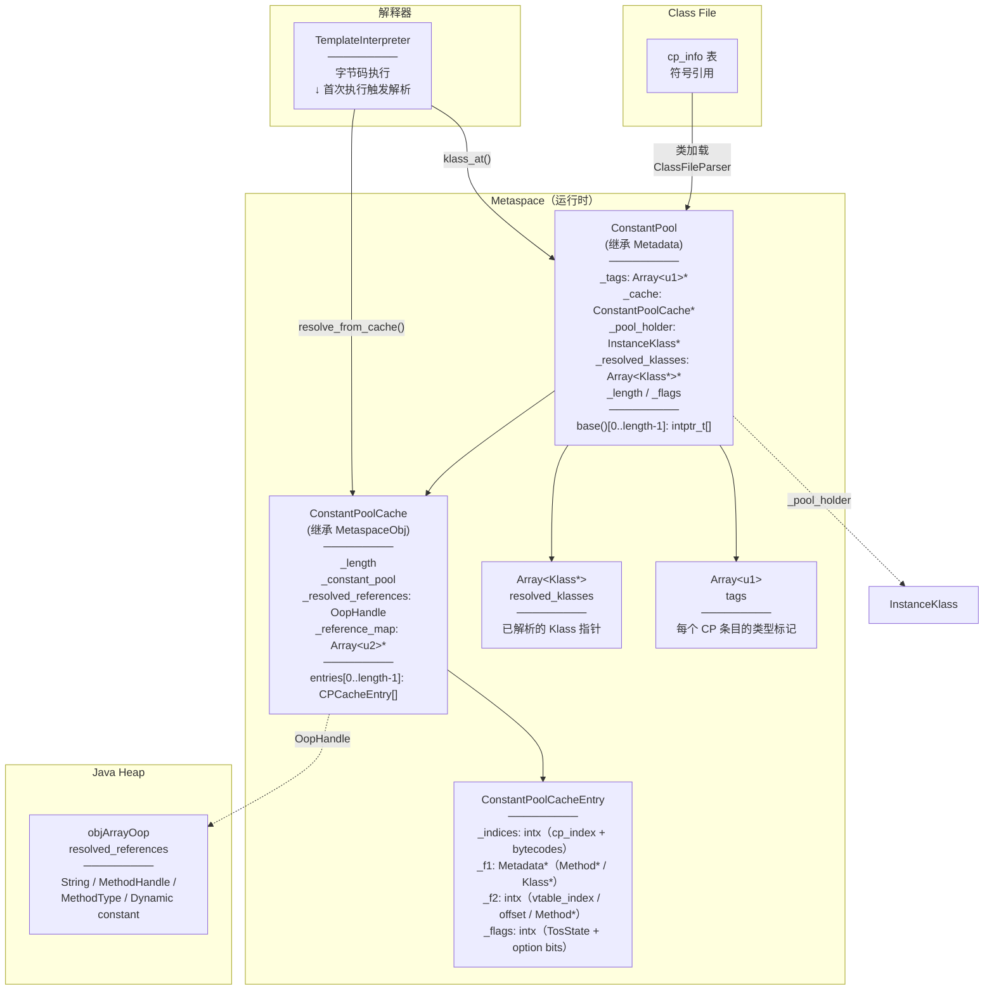
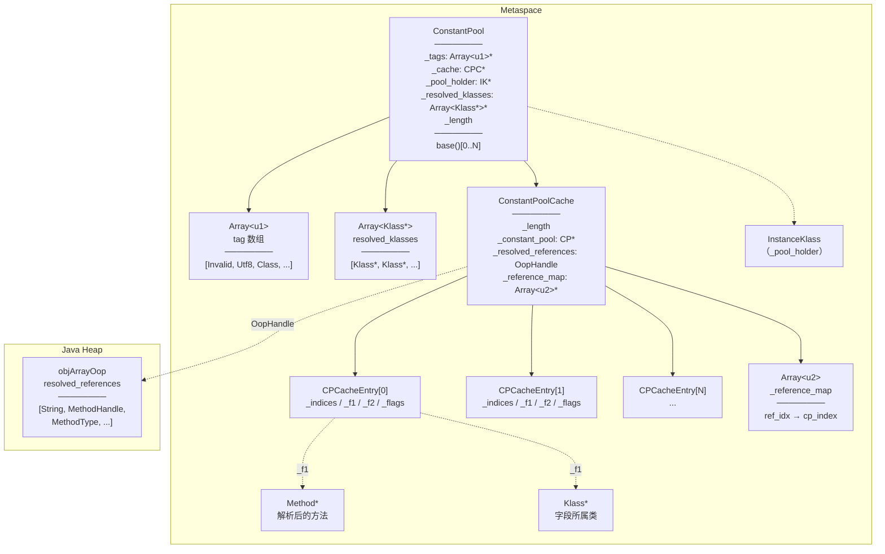
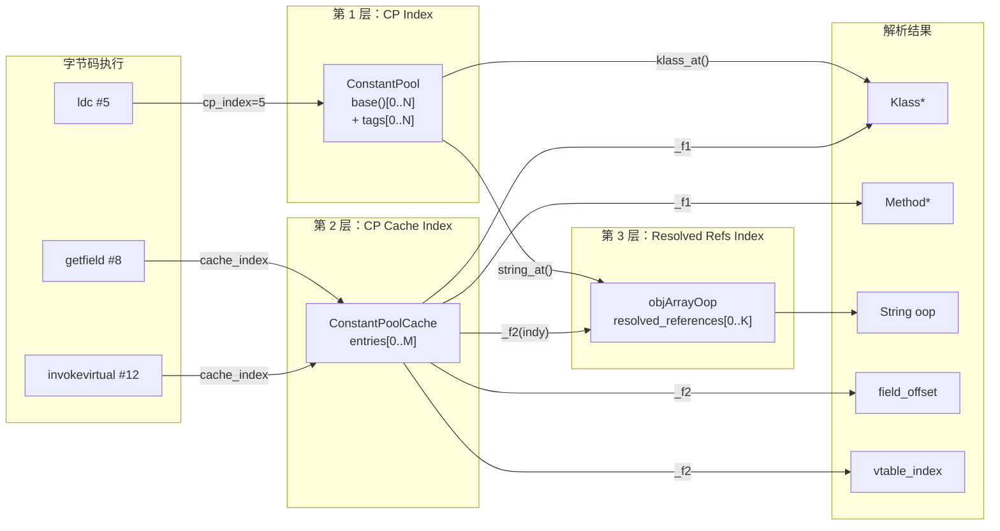
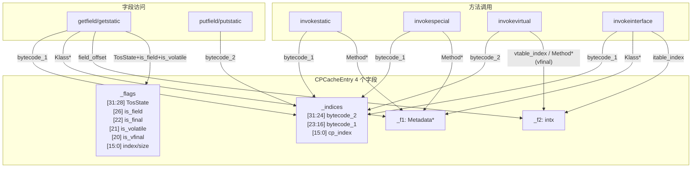

# Day 26：ConstantPool 深度剖析

> 源码基线：OpenJDK 11 | 标准环境：`-Xms8g -Xmx8g -XX:+UseG1GC -Xint`
>
> 源文件：
> - `src/hotspot/share/oops/constantPool.hpp` / `.cpp`
> - `src/hotspot/share/oops/constantPool.inline.hpp`
> - `src/hotspot/share/oops/cpCache.hpp` / `.cpp`
> - `src/hotspot/share/utilities/constantTag.hpp`
> - `src/hotspot/share/interpreter/interpreterRuntime.cpp`

---

## 第 0 部分：核心原理 ⭐

### 0.1 本质是什么？

本文深入分析 **Day 26：ConstantPool 深度剖析**：从源码角度理解其设计原理、实现机制和关键细节。

### 0.2 为什么需要？

理解 JVM 内部实现是排查复杂问题、进行性能优化的基础。表面的 API 文档无法解释 JVM 的实际行为，只有深入源码才能建立精确的心智模型。

### 0.3 怎么解决？

结合源码阅读、数据结构分析和 GDB 运行时验证，从多个角度建立对该机制的完整理解。

### 0.4 为什么这样设计？

每个设计决策都有其权衡：性能 vs 正确性、简单性 vs 灵活性、内存占用 vs 查找速度。理解这些权衡是理解 JVM 设计的关键。

---


## 一、宏观理解

### 1.1 ConstantPool 解决什么问题？

Java class 文件中的常量池（Constant Pool）是一个"符号引用仓库"——所有的类名、字段名、方法名、字面量（字符串、整数、浮点数等）都以符号形式存储在 class 文件的常量池表中。当 JVM 加载一个类时，这些符号引用最终要**解析（resolve）**为直接引用（内存地址/指针），才能真正执行。

**核心问题**：class 文件中的常量池条目是静态的符号，但 JVM 运行时需要的是指针。`ConstantPool` 就是运行时的常量池数据结构，负责：
1. **存储**：在 Metaspace 中保存所有常量池条目
2. **延迟解析**：按需将符号引用解析为直接引用（而非一次性全部解析）
3. **缓存**：解析结果缓存后不再重复解析
4. **线程安全**：多线程并发解析同一条目时保证正确性

### 1.2 三层索引架构

ConstantPool 的索引体系有三个层次，理解这三层是理解整个 CP 机制的关键：

```
┌──────────────────────────────────────────────────────────────────────┐
│                    三层索引架构                                       │
├──────────────────────────────────────────────────────────────────────┤
│                                                                      │
│  第 1 层：CP Index（常量池原始索引）                                    │
│  ┌──────────────────────────────────┐                                │
│  │  ConstantPool::base()[index]     │                                │
│  │  - 存 intptr_t 大小的原始数据    │                                │
│  │  - tag 数组标识每个条目的类型    │                                │
│  │  - 对应 class 文件中的 cp_info  │                                │
│  └──────────────────────────────────┘                                │
│                    ↓                                                  │
│  第 2 层：CP Cache Index（解释器缓存索引）                             │
│  ┌──────────────────────────────────────────┐                        │
│  │  ConstantPoolCache::entry_at(cache_idx)  │                        │
│  │  - 每个 entry 占 4 个 intptr_t           │                        │
│  │  - 仅为 field/method/indy 条目创建       │                        │
│  │  - 解释器通过 cache_idx 访问             │                        │
│  └──────────────────────────────────────────┘                        │
│                    ↓                                                  │
│  第 3 层：Resolved References Index（Java 堆对象索引）                │
│  ┌──────────────────────────────────────────┐                        │
│  │  resolved_references()->obj_at(ref_idx)  │                        │
│  │  - objArrayOop，存在 Java 堆中           │                        │
│  │  - 缓存 String/MethodHandle/MethodType/  │                        │
│  │    Dynamic constant 的 oop               │                        │
│  │  - GC 可达，不会被意外回收               │                        │
│  └──────────────────────────────────────────┘                        │
│                                                                      │
│  为什么需要三层？                                                     │
│  - 第 1 层：保存原始的 CP 条目（Metaspace，不被 GC 管理）             │
│  - 第 2 层：为解释器提供快速访问入口（Metaspace）                      │
│  - 第 3 层：存放 Java 对象引用（Java 堆，GC 管理）                    │
│    → 不能放 Metaspace，否则 GC 扫描不到                               │
└──────────────────────────────────────────────────────────────────────┘
```

### 1.3 解析触发时机

常量池解析不是在类加载时一次完成的，而是**惰性的**——只有当字节码真正使用某个常量池条目时才触发解析。触发路径：

```
┌───────────────────────────────────────────────────────────────────────────┐
│                  字节码 → 解析入口 映射                                    │
├───────────────────────────────────────────────────────────────────────────┤
│                                                                           │
│  ldc / ldc_w / ldc2_w / fast_aldc / fast_aldc_w                          │
│      → InterpreterRuntime::resolve_ldc()                                 │
│        → ConstantPool::resolve_constant_at() → resolve_constant_at_impl()│
│                                                                           │
│  getstatic / putstatic / getfield / putfield                             │
│      → InterpreterRuntime::resolve_get_put()                             │
│        → LinkResolver::resolve_field_access()                            │
│        → ConstantPoolCacheEntry::set_field()                             │
│                                                                           │
│  invokevirtual / invokespecial / invokestatic / invokeinterface          │
│      → InterpreterRuntime::resolve_invoke()                              │
│        → LinkResolver::resolve_invoke()                                  │
│        → ConstantPoolCacheEntry::set_direct_call / set_vtable_call /     │
│                                    set_itable_call                        │
│                                                                           │
│  invokehandle                                                            │
│      → InterpreterRuntime::resolve_invokehandle()                        │
│        → LinkResolver::resolve_invoke()                                  │
│        → ConstantPoolCacheEntry::set_method_handle()                     │
│                                                                           │
│  invokedynamic                                                           │
│      → InterpreterRuntime::resolve_invokedynamic()                       │
│        → LinkResolver::resolve_invoke()                                  │
│        → ConstantPoolCacheEntry::set_dynamic_call()                      │
│                                                                           │
│  new / anewarray / checkcast / instanceof                                │
│      → ConstantPool::klass_at() → klass_at_impl()                       │
│        → SystemDictionary::resolve_or_fail()                             │
│                                                                           │
└───────────────────────────────────────────────────────────────────────────┘
```

所有解析最终汇聚到 `InterpreterRuntime::resolve_from_cache()` 这个总入口（interpreterRuntime.cpp:986）：

```cpp
// interpreterRuntime.cpp:986-1011
IRT_ENTRY(void, InterpreterRuntime::resolve_from_cache(JavaThread* thread, Bytecodes::Code bytecode)) {
  switch (bytecode) {
  case Bytecodes::_getstatic:
  case Bytecodes::_putstatic:
  case Bytecodes::_getfield:
  case Bytecodes::_putfield:
    resolve_get_put(thread, bytecode);      // 字段解析
    break;
  case Bytecodes::_invokevirtual:
  case Bytecodes::_invokespecial:
  case Bytecodes::_invokestatic:
  case Bytecodes::_invokeinterface:
    resolve_invoke(thread, bytecode);       // 方法解析
    break;
  case Bytecodes::_invokehandle:
    resolve_invokehandle(thread);           // MethodHandle 解析
    break;
  case Bytecodes::_invokedynamic:
    resolve_invokedynamic(thread);          // invokedynamic 解析
    break;
  default:
    fatal("unexpected bytecode: %s", Bytecodes::name(bytecode));
    break;
  }
}
IRT_END
```

### 1.4 整体架构 Mermaid 图



---

## 二、源码逐行分析

### 2.1 ConstantPool::allocate 与构造函数

**创建时机**：类加载时由 `ClassFileParser::parse_constant_pool()` 调用。

```cpp
// constantPool.cpp:61-64
ConstantPool* ConstantPool::allocate(ClassLoaderData* loader_data, int length, TRAPS) {
  // 1. 在 Metaspace 中分配 tag 数组，初始化为 0（JVM_CONSTANT_Invalid）
  Array<u1>* tags = MetadataFactory::new_array<u1>(loader_data, length, 0, CHECK_NULL);
  // 2. 计算 ConstantPool 对象总大小 = header + length 个 intptr_t
  int size = ConstantPool::size(length);
  // 3. 在 Metaspace 中分配并构造
  return new (loader_data, size, MetaspaceObj::ConstantPoolType, THREAD) ConstantPool(tags);
}
```

**`size(length)` 的计算**（constantPool.hpp:778）：

```cpp
static int header_size() {
  return align_up((int)sizeof(ConstantPool), wordSize) / wordSize;
  // sizeof(ConstantPool) 包含：vtable_ptr(8) + _tags(8) + _cache(8) + _pool_holder(8)
  //   + _operands(8) + _resolved_klasses(8) + _flags(4) + _length(4) + _saved(4)
  //   + padding → 对齐到 wordSize(8) 的倍数
}
static int size(int length) {
  return align_metadata_size(header_size() + length);
  // base() 之后跟 length 个 intptr_t（每个 8 字节），所以 +length words
}
```

**构造函数**（constantPool.cpp:84-94）：

```cpp
ConstantPool::ConstantPool(Array<u1>* tags) :
  _tags(tags),
  _length(tags->length()) {
    // Metaspace 分配的内存是 calloc 语义（零初始化），所以：
    // _cache = NULL, _pool_holder = NULL, _operands = NULL,
    // _resolved_klasses = NULL, _flags = 0, _saved._version = 0
    // base()[0..length-1] 全部为 0
    assert(_tags != NULL, "invariant");
    assert(tags->length() == _length, "invariant");
    assert(tag_array_is_zero_initialized(tags), "invariant");
    assert(0 == flags(), "invariant");
    assert(0 == version(), "invariant");
    assert(NULL == _pool_holder, "invariant");
}
```

**关键点**：`ConstantPool` 的内存布局是**变长的**——header 之后紧跟 `_length` 个 `intptr_t` 大小的 slot。每个 slot 存储一个 CP 条目的原始数据。

### 2.2 Tag 系统：标准 + HotSpot 内部扩展

Tag 数组 `_tags` 中的每个元素标识对应 CP 条目的类型。有两层定义：

**第一层：JVM 规范标准 tag**（classfile_constants.h.template:95-113）：

| Tag 值 | 名称 | 含义 |
|--------|------|------|
| 1 | `JVM_CONSTANT_Utf8` | UTF-8 字符串 |
| 3 | `JVM_CONSTANT_Integer` | int 字面量 |
| 4 | `JVM_CONSTANT_Float` | float 字面量 |
| 5 | `JVM_CONSTANT_Long` | long 字面量（占 2 个 slot）|
| 6 | `JVM_CONSTANT_Double` | double 字面量（占 2 个 slot）|
| 7 | `JVM_CONSTANT_Class` | 类/接口符号引用 |
| 8 | `JVM_CONSTANT_String` | 字符串字面量 |
| 9 | `JVM_CONSTANT_Fieldref` | 字段引用 |
| 10 | `JVM_CONSTANT_Methodref` | 方法引用 |
| 11 | `JVM_CONSTANT_InterfaceMethodref` | 接口方法引用 |
| 12 | `JVM_CONSTANT_NameAndType` | 名称和类型描述符 |
| 15 | `JVM_CONSTANT_MethodHandle` | 方法句柄 |
| 16 | `JVM_CONSTANT_MethodType` | 方法类型 |
| 17 | `JVM_CONSTANT_Dynamic` | 动态常量（condy）|
| 18 | `JVM_CONSTANT_InvokeDynamic` | invokedynamic 引导方法 |

**第二层：HotSpot 内部扩展 tag**（constantTag.hpp:34-48）：

| Tag 值 | 名称 | 含义 |
|--------|------|------|
| 0 | `JVM_CONSTANT_Invalid` | 无效/未初始化 |
| 100 | `JVM_CONSTANT_UnresolvedClass` | 未解析的类引用 |
| 101 | `JVM_CONSTANT_ClassIndex` | 构造期临时 tag |
| 102 | `JVM_CONSTANT_StringIndex` | 构造期临时 tag |
| 103 | `JVM_CONSTANT_UnresolvedClassInError` | 类解析失败，记录错误 |
| 104 | `JVM_CONSTANT_MethodHandleInError` | MethodHandle 解析失败 |
| 105 | `JVM_CONSTANT_MethodTypeInError` | MethodType 解析失败 |
| 106 | `JVM_CONSTANT_DynamicInError` | 动态常量解析失败 |

**Tag 状态转换**：

```
类加载时：              解析成功时：                解析失败时：
ClassIndex(101)  ──→  UnresolvedClass(100) ──→  Class(7)
                                            └─→ UnresolvedClassInError(103)

StringIndex(102) ──→  String(8)

MethodHandle(15) ──→  （不改 tag，结果存 resolved_references）
                 └─→  MethodHandleInError(104)

MethodType(16)   ──→  （不改 tag，结果存 resolved_references）
                 └─→  MethodTypeInError(105)

Dynamic(17)      ──→  （不改 tag，结果存 resolved_references）
                 └─→  DynamicInError(106)
```

**为什么需要 Error tag？** 根据 JVMS 5.4.3，如果解析某个常量池条目失败，后续对同一条目的解析必须抛出相同的错误。Error tag 就是实现这个语义的——一旦标记为 InError，`save_and_throw_exception()` 会从 `ResolutionErrorTable` 中取出之前保存的异常重新抛出。

### 2.3 CPSlot 和 CPKlassSlot

这两个包装类用于从 CP 条目中提取信息：

**CPSlot**（constantPool.hpp:51-66）——通用 slot 包装：

```cpp
class CPSlot {
  intptr_t _ptr;
  enum TagBits { _pseudo_bit = 1 };  // 最低位标记 pseudo-string
public:
  CPSlot(intptr_t ptr): _ptr(ptr) {}
  CPSlot(Symbol* ptr, int tag_bits = 0): _ptr((intptr_t)ptr | tag_bits) {}

  intptr_t value()         { return _ptr; }
  bool is_pseudo_string()  { return (_ptr & _pseudo_bit) != 0; }
  Symbol* get_symbol()     { return (Symbol*)(_ptr & ~_pseudo_bit); }
};
```

CPSlot 利用指针对齐的特点，在最低位放了一个 `_pseudo_bit` 标记——因为 Symbol* 至少 2 字节对齐，最低位一定是 0，所以可以借用。

**CPKlassSlot**（constantPool.hpp:70-94）——Class 条目的解码器：

```cpp
class CPKlassSlot {
  int _name_index;            // 类名在 CP 中的索引
  int _resolved_klass_index;  // 在 resolved_klasses 数组中的索引
public:
  CPKlassSlot(int n, int rk) { _name_index = n; _resolved_klass_index = rk; }
  int name_index() const          { return _name_index; }
  int resolved_klass_index() const { return _resolved_klass_index; }
};
```

**Class 条目的编码方式**：一个 `intptr_t` 的 slot 被拆分为两个 `jushort`：

```cpp
// constantPool.cpp:229-230
*int_at_addr(class_index) =
  build_int_from_shorts((jushort)resolved_klass_index, (jushort)name_index);
// 低 16 位 = resolved_klass_index
// 高 16 位 = name_index
```

这意味着类名索引和解析结果索引被打包进同一个 32 位值中，而实际的 `Klass*` 指针存储在 `_resolved_klasses` 数组中。

### 2.4 klass_at_impl：类解析的核心

当字节码 `new`、`checkcast`、`instanceof`、`anewarray` 等需要一个 `Klass*` 时，调用 `klass_at()` → `klass_at_impl()`：

```cpp
// constantPool.cpp:447-517
Klass* ConstantPool::klass_at_impl(const constantPoolHandle& this_cp, int which,
                                   bool save_resolution_error, TRAPS) {
  assert(THREAD->is_Java_thread(), "must be a Java thread");

  // ========== 快速路径：已解析 ==========
  // 不依赖 tag 位判断（因为 tag 和 klass* 不是原子更新的），
  // 而是直接检查 resolved_klasses 数组中是否已有值
  CPKlassSlot kslot = this_cp->klass_slot_at(which);
  int resolved_klass_index = kslot.resolved_klass_index();
  int name_index = kslot.name_index();
  assert(this_cp->tag_at(name_index).is_symbol(), "sanity");

  Klass* klass = this_cp->resolved_klasses()->at(resolved_klass_index);
  if (klass != NULL) {
    return klass;  // 已解析，直接返回
  }

  // ========== 错误检查 ==========
  // 如果之前解析失败过，tag 会被标记为 UnresolvedClassInError
  if (this_cp->tag_at(which).is_unresolved_klass_in_error()) {
    throw_resolution_error(this_cp, which, CHECK_0);
    ShouldNotReachHere();
  }

  // ========== 慢速路径：实际解析 ==========
  Handle mirror_handle;
  Symbol* name = this_cp->symbol_at(name_index);
  Handle loader(THREAD, this_cp->pool_holder()->class_loader());
  Handle protection_domain(THREAD, this_cp->pool_holder()->protection_domain());

  // 委托给 SystemDictionary（Day 25 分析过的）进行类加载/查找
  Klass* k = SystemDictionary::resolve_or_fail(name, loader, protection_domain, true, THREAD);
  if (!HAS_PENDING_EXCEPTION) {
    mirror_handle = Handle(THREAD, k->java_mirror());  // 保持 mirror 存活
    verify_constant_pool_resolve(this_cp, k, THREAD);  // 访问权限检查
  }

  // ========== 错误处理 ==========
  if (HAS_PENDING_EXCEPTION) {
    if (save_resolution_error) {
      // 保存错误到 ResolutionErrorTable，tag 标记为 UnresolvedClassInError
      save_and_throw_exception(this_cp, which,
        constantTag(JVM_CONSTANT_UnresolvedClass), CHECK_NULL);
      // 如果执行到这里说明另一个线程已经成功解析了
      klass = this_cp->resolved_klasses()->at(resolved_klass_index);
      assert(klass != NULL, "must be resolved if exception was cleared");
      return klass;
    } else {
      return NULL;
    }
  }

  // ========== 写入解析结果 ==========
  // 日志：-Xlog:class+resolve=debug
  if (log_is_enabled(Debug, class, resolve)) {
    trace_class_resolution(this_cp, k);
  }
  Klass** adr = this_cp->resolved_klasses()->adr_at(resolved_klass_index);
  OrderAccess::release_store(adr, k);  // 先写 Klass*
  // 再写 tag（解释器假设 tag=Class 时 Klass* 一定非 NULL）
  this_cp->release_tag_at_put(which, JVM_CONSTANT_Class);
  return k;
}
```

**关键设计**：
1. **不用锁**：快速路径直接读 `resolved_klasses` 数组，靠 `OrderAccess::release_store` + `load_acquire` 保证可见性
2. **写入顺序**：先写 `Klass*`，再写 tag——因为解释器检查 tag==Class 后就直接取 Klass*，必须保证此时 Klass* 已经写好
3. **错误持久化**：失败后 tag 被 CAS 为 `UnresolvedClassInError(103)`，后续重试直接抛出相同异常

> **日志参数**：`-Xlog:class+resolve=debug` 可看到类解析日志，例如：
> ```
> [debug][class,resolve] com.wjcoder.Main java.lang.Object Main.java:5
> ```

### 2.5 string_at_impl：字符串解析与驻留

```cpp
// constantPool.cpp:1264-1274
oop ConstantPool::string_at_impl(const constantPoolHandle& this_cp,
                                 int which, int obj_index, TRAPS) {
  // 快速路径：resolved_references 中已有驻留后的字符串
  oop str = this_cp->resolved_references()->obj_at(obj_index);
  assert(str != Universe::the_null_sentinel(), "");
  if (str != NULL) return str;

  // 慢速路径：从 CP 中取出 Symbol*，调用 StringTable::intern() 驻留
  Symbol* sym = this_cp->unresolved_string_at(which);
  str = StringTable::intern(sym, CHECK_(NULL));

  // 缓存到 resolved_references
  this_cp->string_at_put(which, obj_index, str);
  assert(java_lang_String::is_instance(str), "must be string");
  return str;
}
```

**流程很简单**：
1. 检查 `resolved_references[obj_index]` 是否已有值 → 有则直接返回
2. 没有 → 从 CP 取出 `Symbol*`（UTF-8 字节序列）→ `StringTable::intern()` 创建/查找驻留字符串
3. 将结果存入 `resolved_references[obj_index]`

**为什么字符串放 resolved_references（Java 堆）？** 因为 `java.lang.String` 是 Java 对象，必须在 GC 管理的堆中，不能放 Metaspace。

### 2.6 resolve_constant_at_impl：核心分发函数

这是 `ldc` 系列字节码的核心解析函数——根据 tag 类型分发到不同的解析路径。

```cpp
// constantPool.cpp:840-1104
oop ConstantPool::resolve_constant_at_impl(const constantPoolHandle& this_cp,
                                           int index, int cache_index,
                                           bool* status_return, TRAPS) {
  oop result_oop = NULL;
  Handle throw_exception;

  // ========== 快速路径：检查 resolved_references 缓存 ==========
  if (cache_index == _possible_index_sentinel) {
    // 将 CP index 转换为 resolved_references index
    cache_index = this_cp->cp_to_object_index(index);
  }
  if (cache_index >= 0) {
    result_oop = this_cp->resolved_references()->obj_at(cache_index);
    if (result_oop != NULL) {
      if (result_oop == Universe::the_null_sentinel()) {
        // condy 解析结果为 null，用 sentinel 占位
        // 调用方通过 status_return 知道这是"成功解析为 null"
        if (status_return != NULL) *status_return = false;
        return NULL;
      }
      return result_oop;  // 已缓存，直接返回
    }
  }

  // ========== 慢速路径：根据 tag 分发解析 ==========
  constantTag tag = this_cp->tag_at(index);

  switch (tag.value()) {

  case JVM_CONSTANT_UnresolvedClass:
  case JVM_CONSTANT_UnresolvedClassInError:
  case JVM_CONSTANT_Class:
    {
      // 类常量 → 解析为 java.lang.Class 的 mirror 对象
      Klass* resolved = klass_at_impl(this_cp, index, true, CHECK_NULL);
      result_oop = resolved->java_mirror();
      break;
    }

  case JVM_CONSTANT_Dynamic:
    {
      // 动态常量（condy）→ 调用 bootstrap method
      Klass* current_klass = this_cp->pool_holder();
      Symbol* constant_name = this_cp->uncached_name_ref_at(index);
      Symbol* constant_type = this_cp->uncached_signature_ref_at(index);
      // ... 解析 bootstrap specifier，调用 SystemDictionary::link_dynamic_constant()
      // ... 结果 oop 存入 result_oop
      break;
    }

  case JVM_CONSTANT_String:
    // 已经缓存过的不会走到这里（上面快速路径拦截了）
    if (this_cp->is_pseudo_string_at(index)) {
      result_oop = this_cp->pseudo_string_at(index, cache_index);
    } else {
      result_oop = string_at_impl(this_cp, index, cache_index, CHECK_NULL);
    }
    break;

  case JVM_CONSTANT_DynamicInError:
  case JVM_CONSTANT_MethodHandleInError:
  case JVM_CONSTANT_MethodTypeInError:
    {
      // 之前解析失败过，直接抛出保存的异常
      throw_resolution_error(this_cp, index, CHECK_NULL);
      break;
    }

  case JVM_CONSTANT_MethodHandle:
    {
      // MethodHandle 常量
      int ref_kind    = this_cp->method_handle_ref_kind_at(index);
      int callee_index = this_cp->method_handle_klass_index_at(index);
      Symbol* name    = this_cp->method_handle_name_ref_at(index);
      Symbol* signature = this_cp->method_handle_signature_ref_at(index);

      // 先解析 callee 类
      Klass* callee = klass_at_impl(this_cp, callee_index, true, CHECK_NULL);

      // 委托给 SystemDictionary::link_method_handle_constant()
      // 返回一个 MethodHandle oop
      result_oop = SystemDictionary::link_method_handle_constant(
                     callee, ref_kind, name, signature,
                     THREAD);
      // 错误处理：保存错误并标记 tag 为 MethodHandleInError
      if (HAS_PENDING_EXCEPTION) {
        save_and_throw_exception(this_cp, index,
          constantTag(JVM_CONSTANT_MethodHandle), CHECK_NULL);
      }
      break;
    }

  case JVM_CONSTANT_MethodType:
    {
      // MethodType 常量
      Symbol* signature = this_cp->method_type_signature_at(index);
      // 委托给 SystemDictionary::find_method_handle_type()
      result_oop = SystemDictionary::find_method_handle_type(signature,
                     this_cp->pool_holder()->class_loader(),
                     this_cp->pool_holder()->protection_domain(),
                     THREAD);
      if (HAS_PENDING_EXCEPTION) {
        save_and_throw_exception(this_cp, index,
          constantTag(JVM_CONSTANT_MethodType), CHECK_NULL);
      }
      break;
    }

  case JVM_CONSTANT_Integer:
    // 装箱为 java.lang.Integer
    result_oop = java_lang_boxing_object::create(T_INT,
                   (jvalue*)this_cp->int_at_addr(index), CHECK_NULL);
    break;
  case JVM_CONSTANT_Float:
    result_oop = java_lang_boxing_object::create(T_FLOAT,
                   (jvalue*)this_cp->float_at_addr(index), CHECK_NULL);
    break;
  case JVM_CONSTANT_Long:
    result_oop = java_lang_boxing_object::create(T_LONG,
                   (jvalue*)this_cp->long_at_addr(index), CHECK_NULL);
    break;
  case JVM_CONSTANT_Double:
    result_oop = java_lang_boxing_object::create(T_DOUBLE,
                   (jvalue*)this_cp->double_at_addr(index), CHECK_NULL);
    break;

  default:
    DEBUG_ONLY(tty->print_cr("tag: '%s' %d", tag.internal_name(), tag.value()));
    ShouldNotReachHere();
    break;
  }

  // ========== 缓存解析结果到 resolved_references ==========
  if (cache_index >= 0) {
    // ldc 的结果缓存为 oop
    if (result_oop != NULL) {
      // 使用 CAS 写入，保证线程安全
      oop new_result = (result_oop == NULL ? Universe::the_null_sentinel() : result_oop);
      oop old_result = this_cp->resolved_references()
        ->atomic_compare_exchange_oop(cache_index, new_result, NULL);
      if (old_result == NULL) {
        // 我们赢了 CAS
        return result_oop;
      } else {
        // 另一个线程先缓存了，使用它的结果
        if (old_result == Universe::the_null_sentinel()) old_result = NULL;
        return old_result;
      }
    } else {
      // result_oop == NULL 的情况（condy 结果为 null）
      // 用 the_null_sentinel 占位
    }
  }

  return result_oop;
}
```

**核心设计要点**：
1. **先查缓存**：`resolved_references[cache_index]` 非 NULL 则直接返回
2. **Tag 分发**：根据 tag 类型调用对应的解析逻辑
3. **CAS 写回**：用 `atomic_compare_exchange_oop` 写入缓存，处理并发竞争
4. **null sentinel**：condy 可能合法地解析为 null，用 `Universe::the_null_sentinel()` 区分"未解析"和"解析结果为 null"
5. **Error tag**：解析失败后标记 tag 为对应的 InError 值，后续直接抛异常

### 2.7 save_and_throw_exception：错误持久化

```cpp
// constantPool.cpp:780-813
void ConstantPool::save_and_throw_exception(const constantPoolHandle& this_cp, int which,
                                            constantTag tag, TRAPS) {
  Symbol* error = PENDING_EXCEPTION->klass()->name();
  int error_tag = tag.error_value();  // 如 UnresolvedClass → UnresolvedClassInError

  if (!PENDING_EXCEPTION->is_a(SystemDictionary::LinkageError_klass())) {
    // 非 LinkageError（如 StackOverflow、OOM）→ 直接抛出，不持久化
    // 不能因为 OOM 就永远阻止后续加载
  } else if (this_cp->tag_at(which).value() != error_tag) {
    // 第一次失败：保存错误信息到 ResolutionErrorTable
    Symbol* message = exception_message(this_cp, which, tag, PENDING_EXCEPTION);
    SystemDictionary::add_resolution_error(this_cp, which, error, message);

    // CAS 修改 tag 为 error_tag
    jbyte old_tag = Atomic::cmpxchg((jbyte)error_tag,
                      (jbyte*)this_cp->tag_addr_at(which), (jbyte)tag.value());
    if (old_tag != error_tag && old_tag != tag.value()) {
      // tag 已经变成了 Class（另一个线程成功解析了）→ 清除异常，使用解析结果
      assert(this_cp->tag_at(which).is_klass(), "Wrong tag value");
      CLEAR_PENDING_EXCEPTION;
    }
  } else {
    // tag 已经是 error_tag（另一个线程先标记了错误）→ 抛出保存的错误
    throw_resolution_error(this_cp, which, CHECK);
  }
}
```

### 2.8 InterpreterRuntime::resolve_ldc

`ldc` / `ldc_w` / `ldc2_w` / `fast_aldc` / `fast_aldc_w` 的运行时入口：

```cpp
// interpreterRuntime.cpp:161-211
IRT_ENTRY(void, InterpreterRuntime::resolve_ldc(JavaThread* thread, Bytecodes::Code bytecode)) {
  assert(bytecode == Bytecodes::_ldc || bytecode == Bytecodes::_ldc_w ||
         bytecode == Bytecodes::_ldc2_w || bytecode == Bytecodes::_fast_aldc ||
         bytecode == Bytecodes::_fast_aldc_w, "wrong bc");

  ResourceMark rm(thread);
  const bool is_fast_aldc = (bytecode == Bytecodes::_fast_aldc ||
                             bytecode == Bytecodes::_fast_aldc_w);
  LastFrameAccessor last_frame(thread);
  methodHandle m(thread, last_frame.method());
  Bytecode_loadconstant ldc(m, last_frame.bci());

  // Double-check 结果大小（condy 可以返回任何类型）
  BasicType type = ldc.result_type();
  switch (type2size[type]) {
  case 2: guarantee(bytecode == Bytecodes::_ldc2_w, ""); break;
  case 1: guarantee(bytecode != Bytecodes::_ldc2_w, ""); break;
  default: ShouldNotReachHere();
  }

  // 核心调用：resolve_constant_at() → resolve_constant_at_impl()
  oop result = ldc.resolve_constant(CHECK);
  assert(result != NULL || is_fast_aldc, "null result only valid for fast_aldc");

  // 将结果放入 thread->_vm_result 供解释器取用
  thread->set_vm_result(result);

  if (!is_fast_aldc) {
    // 非 fast_aldc 说明是原始类型的 ldc（Integer/Float/Long/Double）
    // 需要告诉解释器如何拆箱
    guarantee(java_lang_boxing_object::is_instance(result, type), "");
    int offset = java_lang_boxing_object::value_offset_in_bytes(type);
    intptr_t flags = ((as_TosState(type) << ConstantPoolCacheEntry::tos_state_shift)
                      | (offset & ConstantPoolCacheEntry::field_index_mask));
    thread->set_vm_result_2((Metadata*)flags);
  }
}
IRT_END
```

### 2.9 InterpreterRuntime::resolve_get_put：字段解析

```cpp
// interpreterRuntime.cpp:668-738
void InterpreterRuntime::resolve_get_put(JavaThread* thread, Bytecodes::Code bytecode) {
  Thread* THREAD = thread;
  fieldDescriptor info;
  LastFrameAccessor last_frame(thread);
  constantPoolHandle pool(thread, last_frame.method()->constants());
  methodHandle m(thread, last_frame.method());
  bool is_put    = (bytecode == Bytecodes::_putfield  || bytecode == Bytecodes::_nofast_putfield ||
                    bytecode == Bytecodes::_putstatic);
  bool is_static = (bytecode == Bytecodes::_getstatic || bytecode == Bytecodes::_putstatic);

  // Step 1: 调用 LinkResolver 解析字段
  {
    JvmtiHideSingleStepping jhss(thread);
    LinkResolver::resolve_field_access(info, pool,
      last_frame.get_index_u2_cpcache(bytecode), m, bytecode, CHECK);
  }

  // Step 2: 检查是否已被其他线程解析
  ConstantPoolCacheEntry* cp_cache_entry = last_frame.cache_entry();
  if (cp_cache_entry->is_resolved(bytecode)) return;

  // Step 3: 计算 get/put bytecode
  TosState state = as_TosState(info.field_type());
  InstanceKlass* klass = InstanceKlass::cast(info.field_holder());
  bool uninitialized_static = is_static && !klass->is_initialized();

  Bytecodes::Code get_code = (Bytecodes::Code)0;
  Bytecodes::Code put_code = (Bytecodes::Code)0;
  if (!uninitialized_static) {
    get_code = (is_static) ? Bytecodes::_getstatic : Bytecodes::_getfield;
    if ((is_put && !has_initialized_final_update) || !info.access_flags().is_final()) {
      put_code = (is_static) ? Bytecodes::_putstatic : Bytecodes::_putfield;
    }
    // 注意：如果是 putstatic 但类未初始化，get_code/put_code 保持为 0
    // 这样下次执行时会重新解析，保证类初始化先完成
  }

  // Step 4: 写入 CPCacheEntry
  cp_cache_entry->set_field(
    get_code, put_code,
    info.field_holder(),    // _f1 = Klass*
    info.index(),           // field index in FieldInfo
    info.offset(),          // _f2 = field offset in bytes
    state,                  // TosState in _flags
    info.access_flags().is_final(),
    info.access_flags().is_volatile(),
    pool->pool_holder()     // root klass for GC
  );
}
```

### 2.10 InterpreterRuntime::resolve_invoke：方法解析

```cpp
// interpreterRuntime.cpp:833-937
void InterpreterRuntime::resolve_invoke(JavaThread* thread, Bytecodes::Code bytecode) {
  Thread* THREAD = thread;
  LastFrameAccessor last_frame(thread);

  // Step 1: 提取 receiver（invokevirtual/invokeinterface/invokespecial 需要）
  Handle receiver(thread, NULL);
  if (bytecode == Bytecodes::_invokevirtual || bytecode == Bytecodes::_invokeinterface ||
      bytecode == Bytecodes::_invokespecial) {
    ResourceMark rm(thread);
    methodHandle m(thread, last_frame.method());
    Bytecode_invoke call(m, last_frame.bci());
    Symbol* signature = call.signature();
    receiver = Handle(thread, last_frame.callee_receiver(signature));
  }

  // Step 2: 调用 LinkResolver 解析方法
  CallInfo info;
  constantPoolHandle pool(thread, last_frame.method()->constants());
  {
    JvmtiHideSingleStepping jhss(thread);
    LinkResolver::resolve_invoke(info, receiver, pool,
      last_frame.get_index_u2_cpcache(bytecode), bytecode, CHECK);
  }

  // Step 3: 检查是否已被其他线程解析
  ConstantPoolCacheEntry* cp_cache_entry = last_frame.cache_entry();
  if (cp_cache_entry->is_resolved(bytecode)) return;

  // Step 4: 根据 call_kind 写入 CPCacheEntry
  InstanceKlass* sender = pool->pool_holder();
  sender = sender->has_host_klass() ? sender->host_klass() : sender;

  switch (info.call_kind()) {
  case CallInfo::direct_call:
    // invokestatic / invokespecial / 可静态绑定的 invokevirtual
    cp_cache_entry->set_direct_call(bytecode, info.resolved_method(),
                                    sender->is_interface());
    break;
  case CallInfo::vtable_call:
    // invokevirtual（通过 vtable）
    cp_cache_entry->set_vtable_call(bytecode, info.resolved_method(),
                                    info.vtable_index());
    break;
  case CallInfo::itable_call:
    // invokeinterface（通过 itable）
    cp_cache_entry->set_itable_call(bytecode, info.resolved_klass(),
                                    info.resolved_method(),
                                    info.itable_index());
    break;
  default: ShouldNotReachHere();
  }
}
```

### 2.11 ConstantPoolCacheEntry::set_field：字段缓存写入

```cpp
// cpCache.cpp:127-147
void ConstantPoolCacheEntry::set_field(Bytecodes::Code get_code,
                                       Bytecodes::Code put_code,
                                       Klass* field_holder,
                                       int field_index,
                                       int field_offset,
                                       TosState field_type,
                                       bool is_final,
                                       bool is_volatile,
                                       Klass* root_klass) {
  set_f1(field_holder);   // _f1 = 字段所属类的 Klass*
  set_f2(field_offset);   // _f2 = 字段在对象中的偏移量（字节数）

  assert((field_index & field_index_mask) == field_index, "field_index in range");
  set_field_flags(field_type,
                  ((is_volatile ? 1 : 0) << is_volatile_shift) |
                  ((is_final    ? 1 : 0) << is_final_shift),
                  field_index);
  // _flags = [TosState:31-28] | [is_field_entry:26] | [is_final:22] |
  //          [is_volatile:21] | [field_index:15-0]

  // 写入 bytecode 必须在所有字段之后（release 语义）
  set_bytecode_1(get_code);  // _indices[23:16] = get bytecode
  set_bytecode_2(put_code);  // _indices[31:24] = put bytecode
}
```

### 2.12 ConstantPoolCacheEntry::set_direct_or_vtable_call：方法缓存写入

```cpp
// cpCache.cpp:167-301 (精简后的核心逻辑)
void ConstantPoolCacheEntry::set_direct_or_vtable_call(Bytecodes::Code invoke_code,
                                                       const methodHandle& method,
                                                       int vtable_index,
                                                       bool sender_is_interface) {
  bool is_vtable_call = (vtable_index >= 0);
  int byte_no = -1;

  switch (invoke_code) {
    case Bytecodes::_invokeinterface:
      // 接口方法可能退化为 virtual 调用（如 Object.toString()）
      if (vtable_index == Method::nonvirtual_vtable_index && holder->is_interface()) {
        // 私有接口方法 → vfinal 调用
        set_method_flags(..., is_vfinal=1);
        set_f2_as_vfinal_method(method());  // _f2 = Method*
        set_f1(holder);                     // _f1 = 接口 Klass*
        byte_no = 2;
      } else {
        // 退化为 invokevirtual
        change_to_virtual = true;
        // fall through
      }
    case Bytecodes::_invokevirtual:
      if (!is_vtable_call) {
        // 可静态绑定（final method）→ vfinal 调用
        set_method_flags(..., is_vfinal=1);
        set_f2_as_vfinal_method(method());  // _f2 = Method* 直接指针
      } else {
        // 需要 vtable 查找
        set_method_flags(...);
        set_f2(vtable_index);               // _f2 = vtable index
      }
      byte_no = 2;
      break;

    case Bytecodes::_invokespecial:
    case Bytecodes::_invokestatic:
      set_method_flags(...);
      set_f1(method());                     // _f1 = Method* 直接指针
      byte_no = 1;
      break;
  }

  // 写入 bytecode（release 语义）
  if (byte_no == 1) {
    // 特殊情况：invokespecial 在接口中不标记为 resolved（需要每次检查 receiver）
    // invokestatic 如果持有类未初始化也不标记（保证类初始化检查）
    if (do_resolve) set_bytecode_1(invoke_code);
  } else if (byte_no == 2) {
    set_bytecode_2(invoke_code);
  }
}
```

**各 invoke 字节码的 f1/f2 使用方式汇总**：

| 字节码 | _f1 | _f2 | bytecode_N |
|--------|-----|-----|-----------|
| `invokestatic` | `Method*` | — | bytecode_1 |
| `invokespecial` | `Method*` | — | bytecode_1 |
| `invokevirtual`（vtable） | — | vtable_index | bytecode_2 |
| `invokevirtual`（vfinal） | — | `Method*` | bytecode_2 |
| `invokeinterface`（itable） | `Klass*` | itable_index | bytecode_1 |
| `invokeinterface`（private） | `Klass*` | `Method*`（vfinal） | bytecode_2 |
| `invokehandle` | `Method*`（adapter） | resolved_ref_index | bytecode_1 |
| `invokedynamic` | `Method*`（adapter） | resolved_ref_index | bytecode_1 |
| `getstatic/getfield` | `Klass*` | field_offset | bytecode_1 |
| `putstatic/putfield` | `Klass*` | field_offset | bytecode_2 |

---

## 三、数据结构全景

### 3.1 ConstantPool 内存布局

```
ConstantPool 对象在 Metaspace 中的内存布局（64-bit, slowdebug）：

Offset  Size  Field                 说明
─────────────────────────────────────────────────────
+0x00    8    vtable_ptr            C++ 虚函数表指针（Metadata 继承）
+0x08    4    _valid                (debug only) 合法性检查
+0x0C    4    (padding)
+0x10    8    _tags                 Array<u1>* → tag 数组
+0x18    8    _cache                ConstantPoolCache*
+0x20    8    _pool_holder          InstanceKlass*
+0x28    8    _operands             Array<u2>* → InvokeDynamic 操作数
+0x30    8    _resolved_klasses     Array<Klass*>* → 已解析的类指针
+0x38    4    _flags                位标记
+0x3C    4    _length               CP 条目数
+0x40    4    _saved (union)        _resolved_reference_length 或 _version
+0x44    4    (padding to wordSize)
─────────────────────────────────────────────────────
+0x48    8*N  base()[0..N-1]        N = _length 个 intptr_t slot
                                    每个 slot 存储一个 CP 条目的数据

header_size() = align_up(sizeof(ConstantPool), 8) / 8  (in words)
total_size()  = align_metadata_size(header_size + _length)  (in words)
```

> 注：slowdebug 版本有 `_valid` 字段（4 字节），release 版本没有。

**_flags 位定义**：

| 位 | 名称 | 含义 |
|---|------|------|
| 0 | `_has_preresolution` | 有预解析条目（匿名类） |
| 1 | `_on_stack` | 在执行栈上（防止被重定义删除） |
| 2 | `_is_shared` | 共享（CDS 存档） |
| 3 | `_has_dynamic_constant` | 包含 condy/indy 条目 |

### 3.2 ConstantPoolCache 内存布局

```
ConstantPoolCache 对象在 Metaspace 中的内存布局：

Offset  Size  Field                    说明
───────────────────────────────────────────────────────
+0x00    4    _length                  entry 数量
+0x04    4    (padding)
+0x08    8    _constant_pool           ConstantPool* 回指
+0x10    8    _resolved_references     OopHandle → objArrayOop (Java堆)
+0x18    8    _reference_map           Array<u2>* → ref_index → cp_index 映射
───────────────────────────────────────────────────────
+0x20    32*N entries[0..N-1]          N = _length 个 ConstantPoolCacheEntry
                                       每个 entry = 4 * intptr_t = 32 字节

header_size() = sizeof(ConstantPoolCache) / wordSize
total_size()  = align_metadata_size(header_size + length * 4)  (in words)
```

注：`ConstantPoolCacheEntry::size()` 返回 4 words（4 * 8 = 32 字节），因为有 4 个 `intptr_t` 字段。

### 3.3 ConstantPoolCacheEntry 位布局

每个 entry 占 32 字节（4 个 volatile intptr_t 字段）：

```
ConstantPoolCacheEntry（32 字节 = 4 words）：

Offset  Size  Field      详细位布局
──────────────────────────────────────────────────────────────────
+0x00    8    _indices   [63:32 unused on LP64]
                         [31:24] bytecode_2 (put/invokevirtual)
                         [23:16] bytecode_1 (get/invokespecial/invokestatic/invokeinterface)
                         [15:0]  cp_index (原始 CP 条目索引)

+0x08    8    _f1        Metadata* — 具体含义取决于字节码类型：
                         字段访问: Klass*（字段所属类）
                         invokestatic/invokespecial: Method*
                         invokeinterface: Klass*（接口类）
                         invokehandle/invokedynamic: Method*（adapter）

+0x10    8    _f2        intx — 具体含义取决于字节码类型：
                         字段访问: field_offset（字段偏移量）
                         invokevirtual: vtable_index 或 Method*（vfinal）
                         invokeinterface: itable_index 或 Method*（private）
                         invokehandle/invokedynamic: resolved_references 索引

+0x18    8    _flags     位布局：
                         [31:28] TosState (4 bits) — 栈顶类型
                                  atos=0, itos=1, ltos=2, ftos=3, dtos=4, btos=5, ...
                         [27]    unused
                         [26]    is_field_entry  — 是字段还是方法？
                         [25]    has_method_type — 有 MethodType？
                         [24]    has_appendix    — 有附加参数？
                         [23]    is_forced_virtual — 接口方法退化为 virtual？
                         [22]    is_final        — final 方法/字段？
                         [21]    is_volatile     — volatile 字段？
                         [20]    is_vfinal       — virtual final（_f2 是 Method*）？
                         [19]    indy_resolution_failed — indy 解析失败？
                         [18:16] unused
                         [15:0]  field_index（字段）或 parameter_size（方法）
```

**_flags 位图示**：

```
 31  30  29  28  27  26  25  24  23  22  21  20  19  18  17  16  15 ─ ─ ─ 0
┌───┬───┬───┬───┬───┬───┬───┬───┬───┬───┬───┬───┬───┬───┬───┬───┬─────────┐
│ T │ T │ T │ T │   │ F │ M │ A │ I │ f │ v │ vf│ rf│   │   │   │ index   │
│ o │ o │ o │ o │   │   │   │   │   │   │   │   │   │   │   │   │ / size  │
│ s │ s │ s │ s │   │   │   │   │   │   │   │   │   │   │   │   │         │
└───┴───┴───┴───┴───┴───┴───┴───┴───┴───┴───┴───┴───┴───┴───┴───┴─────────┘
  TosState       F=is_field  A=has_appendix  f=is_final  vf=is_vfinal
                 M=has_method_type  I=is_forced_virtual  v=is_volatile
                                                          rf=indy_resolution_failed
```

### 3.4 resolved_references 与 resolved_klasses

**resolved_klasses**（`Array<Klass*>*`，Metaspace）：
- 存储已解析的 `Klass*` 指针
- CP 中每个 Class 条目有一个对应的 `resolved_klass_index`
- 通过 `CPKlassSlot` 解码后访问
- 类解析成功后通过 `OrderAccess::release_store` 写入

**resolved_references**（`objArrayOop`，Java Heap）：
- 通过 `ConstantPoolCache._resolved_references`（`OopHandle`）引用
- 存储 Java 对象：`String`、`MethodHandle`、`MethodType`、Dynamic constant 结果
- 通过 `_reference_map`（`Array<u2>*`）做 cp_index ↔ resolved_ref_index 映射
- **必须在 Java 堆中**——因为 GC 需要扫描这些引用

### 3.5 各 CP 条目在 base() 数组中的存储格式

| Tag | base()[index] 存储内容 | 大小 |
|-----|----------------------|------|
| Utf8(1) | `Symbol*` | 1 slot |
| Integer(3) | `jint` 值 | 1 slot |
| Float(4) | `jfloat` 值 | 1 slot |
| Long(5) | `jlong` 值 | 2 slots |
| Double(6) | `jdouble` 值 | 2 slots |
| Class(7)/UnresolvedClass(100) | `build_int_from_shorts(resolved_klass_index, name_index)` | 1 slot |
| String(8) | `Symbol*`（未解析时指向字面量） | 1 slot |
| Fieldref(9) | `(name_type_index << 16) \| klass_index` | 1 slot |
| Methodref(10) | `(name_type_index << 16) \| klass_index` | 1 slot |
| InterfaceMethodref(11) | `(name_type_index << 16) \| klass_index` | 1 slot |
| NameAndType(12) | `(signature_index << 16) \| name_index` | 1 slot |
| MethodHandle(15) | `(ref_index << 16) \| ref_kind` | 1 slot |
| MethodType(16) | `signature_index` | 1 slot |
| Dynamic(17) | bootstrap method + name_and_type（通过 _operands 解码） | 1 slot |
| InvokeDynamic(18) | 同上 | 1 slot |

### 3.6 数据结构关系图



---

## 四、GDB 验证

### 4.1 验证计划

| # | 验证目标 | 方法 |
|---|---------|------|
| 1 | ConstantPool 内存布局和 sizeof | 打印 `sizeof(ConstantPool)` + 字段偏移 |
| 2 | CPCacheEntry sizeof 和 _flags 位布局 | 打印 sizeof + 具体 entry 的字段值 |
| 3 | Tag 数组内容 | 打印真实类的 CP tag 数组 |
| 4 | klass_at_impl 断点 | 观察类解析流程 |
| 5 | resolve_get_put 断点 | 观察字段解析后 CPCacheEntry 的写入 |

### 4.2 GDB 脚本：ConstantPool 基本信息采集

```gdb
# 文件：new-jvm-md/tmp-file/ConstantPool/cp_basic_info.gdb

set pagination off
set logging file new-jvm-md/tmp-file/ConstantPool/cp_basic_info.log
set logging overwrite on
set logging on

# 断点 1：ConstantPool 构造函数 — 观察刚创建的 CP
break ConstantPool::ConstantPool
commands
  silent
  printf "=== ConstantPool::ConstantPool ===\n"
  printf "this = %p\n", this
  printf "sizeof(ConstantPool) = %d\n", sizeof(ConstantPool)
  printf "_tags = %p, _length = %d\n", this->_tags, this->_length
  printf "_cache = %p\n", this->_cache
  printf "_pool_holder = %p\n", this->_pool_holder
  printf "_flags = %d\n", this->_flags
  printf "\n"
  continue
end

# 断点 2：klass_at_impl — 观察类解析
break ConstantPool::klass_at_impl
commands
  silent
  set $cp = this_cp._value
  set $w = which
  printf "=== klass_at_impl(which=%d) ===\n", $w
  printf "pool_holder = %s\n", $cp->_pool_holder->_name->_body
  printf "tag_at(%d) = %d\n", $w, $cp->_tags->_data[$w]
  continue
end

# 断点 3：string_at_impl — 观察字符串解析
break ConstantPool::string_at_impl
commands
  silent
  set $cp = this_cp._value
  printf "=== string_at_impl(which=%d, obj_index=%d) ===\n", which, obj_index
  printf "pool_holder = %s\n", $cp->_pool_holder->_name->_body
  continue
end

run -Xms8g -Xmx8g -XX:+UseG1GC -Xint -cp /data/workspace/demo/src com.wjcoder.Main

set logging off
quit
```

### 4.3 GDB 脚本：CPCacheEntry 详细分析

```gdb
# 文件：new-jvm-md/tmp-file/ConstantPool/cpce_analysis.gdb

set pagination off
set logging file new-jvm-md/tmp-file/ConstantPool/cpce_analysis.log
set logging overwrite on
set logging on

# 断点：resolve_get_put — 观察字段解析后 CPCacheEntry 的状态
break InterpreterRuntime::resolve_get_put
commands
  silent
  set $bc = bytecode
  printf "=== resolve_get_put(bytecode=%d) ===\n", $bc
  continue
end

# 断点：set_field — 观察 CPCacheEntry 写入
break ConstantPoolCacheEntry::set_field
commands
  silent
  printf "=== CPCacheEntry::set_field ===\n"
  printf "this = %p\n", this
  printf "sizeof(ConstantPoolCacheEntry) = %d\n", sizeof(ConstantPoolCacheEntry)
  printf "get_code = %d, put_code = %d\n", get_code, put_code
  printf "field_holder = %p\n", field_holder
  printf "field_index = %d, field_offset = %d\n", field_index, field_offset
  printf "field_type = %d, is_final = %d, is_volatile = %d\n", field_type, is_final, is_volatile
  printf "BEFORE: _indices = 0x%lx, _f1 = %p, _f2 = 0x%lx, _flags = 0x%lx\n", this->_indices, this->_f1, this->_f2, this->_flags
  continue
end

# 在 set_field 返回后打印
break cpCache.cpp:147
commands
  silent
  # 'this' 仍然在上下文中
  printf "AFTER set_field: _indices = 0x%lx, _f1 = %p, _f2 = 0x%lx, _flags = 0x%lx\n", this->_indices, this->_f1, this->_f2, this->_flags
  printf "\n"
  continue
end

run -Xms8g -Xmx8g -XX:+UseG1GC -Xint -cp /data/workspace/demo/src com.wjcoder.Main

set logging off
quit
```

### 4.4 执行验证结果

#### 验证 1：sizeof 和字段偏移

使用 `cp_sizeof_verify.gdb` 在 `ConstantPool::ConstantPool` 构造函数上设断点：

```
=== ConstantPool Constructor ===
this = 0x7fffceaf1120
sizeof(ConstantPool)      = 72     ← 9 words (slowdebug, 含 _valid)
sizeof(Metadata)          = 16     ← 2 words (vtable_ptr + _valid)
sizeof(ConstantPoolCache) = 40     ← 5 words
sizeof(ConstantPoolCacheEntry) = 32  ← 4 words (4 × intptr_t)

offset _tags              = 16
offset _cache             = 24
offset _pool_holder       = 32
offset _operands          = 40
offset _resolved_klasses  = 48
offset _flags             = 56
offset _length            = 60
offset _saved             = 64
```

**与源码分析一致**。header_size = 72 / 8 = 9 words（slowdebug）。release 版本没有 `_valid` 字段，sizeof 会更小。

#### 验证 2：类解析（klass_at_impl）

在 `klass_at_impl` 上设断点，观察前 15 次类解析：

```
klass_at_impl #0  (which=17)  pool_holder=java/lang/Object   tag=100(UnresolvedClass)
klass_at_impl #1  (which=65)  pool_holder=java/lang/Object   tag=100(UnresolvedClass)
klass_at_impl #2  (which=236) pool_holder=java/lang/String   tag=100(UnresolvedClass) → 首次解析
klass_at_impl #3  (which=11)  pool_holder=java/lang/String   tag=7(Class)            → 已解析
klass_at_impl #4  (which=238) pool_holder=java/lang/String   tag=100(UnresolvedClass)
klass_at_impl #5  (which=238) pool_holder=java/lang/String   tag=7(Class)            → 上次刚解析完
klass_at_impl #10 (which=7)   pool_holder=java/lang/System   tag=100(UnresolvedClass)
klass_at_impl #11 (which=7)   pool_holder=java/lang/System   tag=7(Class)            → 已解析
klass_at_impl #14 (which=53)  pool_holder=java/lang/Class    tag=100(UnresolvedClass)
```

**关键观察**：
1. 首次访问 tag=100（UnresolvedClass），解析后变为 tag=7（Class）
2. 后续访问同一条目 tag=7，快速路径直接返回
3. java/lang/String 的 CP length=878，java/lang/Class 的 CP length=1435

#### 验证 3：字段解析（set_field）

```
CPCacheEntry::set_field #0: get_code=0  put_code=0  field_offset=128  field_type=1(itos)
  is_final=1  is_volatile=0
  BEFORE: _indices=0x9 _f1=(nil) _f2=0x0 _flags=0x0

CPCacheEntry::set_field #1: get_code=0  put_code=0  field_offset=112  field_type=8(atos)
  is_final=1  is_volatile=0
  BEFORE: _indices=0xed _f1=(nil) _f2=0x0 _flags=0x0

CPCacheEntry::set_field #3: get_code=0  put_code=0  field_offset=112  field_type=8(atos)
  is_final=1  is_volatile=0
  BEFORE: _indices=0xa4 _f1=(nil) _f2=0x0 _flags=0x0
```

**关键观察**：
1. **BEFORE 状态**：`_f1=nil, _f2=0, _flags=0` — 首次解析前全为空
2. **`_indices` 低 16 位**就是 cp_index（如 0x9=9, 0xed=237, 0xa4=164）
3. `get_code=0, put_code=0` — 这些字段在类初始化阶段被访问，此时类可能还未初始化完成（`uninitialized_static=true`），所以 get_code/put_code 为 0，不标记为 resolved
4. `field_type=1(itos)` 表示 int 字段，`field_type=8(atos)` 表示对象引用字段
5. `field_offset=128, 112, 116` — 字段在对象中的字节偏移

#### 验证 4：方法解析（set_direct_or_vtable_call）

```
CPCacheEntry::set_direct_or_vtable_call #0: invoke_code=183(invokespecial) vtable_index=-2
  BEFORE: _indices=0x5 _f1=(nil) _f2=0x0 _flags=0x0

CPCacheEntry::set_direct_or_vtable_call #1: invoke_code=183(invokespecial) vtable_index=-2
  BEFORE: _indices=0xef _f1=(nil) _f2=0x0 _flags=0x0

CPCacheEntry::set_direct_or_vtable_call #3: invoke_code=184(invokestatic)  vtable_index=-2
  BEFORE: _indices=0xa3 _f1=(nil) _f2=0x0 _flags=0x0
```

**关键观察**：
1. `invoke_code=183` = `invokespecial`，`invoke_code=184` = `invokestatic`
2. `vtable_index=-2`（`Method::nonvirtual_vtable_index`）— 这些是直接调用，不需要 vtable 查找
3. `_indices` 低 16 位 = cp_index（0x5=5, 0xef=239, 0xa3=163）

#### 验证 5：字符串解析（string_at_impl）

```
string_at_impl #0 (which=3   obj_index=0)
string_at_impl #1 (which=102 obj_index=2)
string_at_impl #2 (which=106 obj_index=4)
string_at_impl #3 (which=99  obj_index=15)
string_at_impl #4 (which=104 obj_index=3)
```

**关键观察**：
1. `which` 是 CP 中的原始 String 索引
2. `obj_index` 是 `resolved_references` 数组中的索引
3. 两者不是一一对应的关系——需要通过 `_reference_map` 映射

---

## 五、架构关系图（drawio 描述）

### 5.1 ConstantPool 全景索引架构



### 5.2 解析流程状态机

```mermaid
stateDiagram-v2
    [*] --> UnresolvedClass: 类加载时 tag=100
    UnresolvedClass --> Class: klass_at_impl() 成功<br/>tag CAS→7
    UnresolvedClass --> UnresolvedClassInError: klass_at_impl() 失败<br/>tag CAS→103
    UnresolvedClassInError --> UnresolvedClassInError: 后续调用直接抛异常
    Class --> Class: 后续调用直接返回 Klass*

    [*] --> String: 类加载时 tag=8
    String --> String: string_at_impl() 成功<br/>结果存 resolved_references<br/>tag 不变

    [*] --> MethodHandle: 类加载时 tag=15
    MethodHandle --> MethodHandle: 解析成功<br/>结果存 resolved_references<br/>tag 不变
    MethodHandle --> MethodHandleInError: 解析失败 tag→104

    [*] --> Dynamic: 类加载时 tag=17
    Dynamic --> Dynamic: 解析成功<br/>结果存 resolved_references
    Dynamic --> DynamicInError: 解析失败 tag→106
```

### 5.3 CPCacheEntry 字段使用关系



---

## 六、总结

### 6.1 核心设计决策

| 设计 | 原因 |
|------|------|
| **三层索引架构** | CP 条目在 Metaspace（GC 不管），Java 对象在 Heap（GC 管理），两者必须分开 |
| **延迟解析** | 加载时只做符号解析，运行时按需解析 → 减少启动时间，避免不必要的类加载 |
| **CAS 缓存** | 多线程并发解析同一条目，用 CAS 写回保证只有一个线程的结果生效 |
| **Error tag** | JVMS 5.4.3 要求：同一条目解析失败后，后续必须抛出相同异常 |
| **_f1/_f2 复用** | 一个 CPCacheEntry 给字段和方法共用，通过 `is_field_entry` 位区分 |
| **bytecode_1/bytecode_2** | 用 release 语义写入，保证其他字段（_f1/_f2/_flags）先可见 |
| **resolved_klasses 数组** | Klass* 是 Metaspace 指针，不能放 resolved_references（GC 会当 oop 处理）|
| **null sentinel** | condy 可能合法返回 null，用 sentinel 区分"未解析"和"解析为 null" |

### 6.2 关键方法速查

| 方法 | 文件:行 | 作用 |
|------|--------|------|
| `ConstantPool::allocate` | constantPool.cpp:61 | 在 Metaspace 分配 CP |
| `ConstantPool::klass_at_impl` | constantPool.cpp:447 | 类解析核心 |
| `ConstantPool::string_at_impl` | constantPool.cpp:1264 | 字符串驻留 |
| `ConstantPool::resolve_constant_at_impl` | constantPool.cpp:840 | ldc 分发中心 |
| `ConstantPool::save_and_throw_exception` | constantPool.cpp:780 | 错误持久化 |
| `InterpreterRuntime::resolve_from_cache` | interpreterRuntime.cpp:986 | 解释器解析总入口 |
| `InterpreterRuntime::resolve_ldc` | interpreterRuntime.cpp:161 | ldc 解析入口 |
| `InterpreterRuntime::resolve_get_put` | interpreterRuntime.cpp:668 | 字段解析入口 |
| `InterpreterRuntime::resolve_invoke` | interpreterRuntime.cpp:833 | 方法解析入口 |
| `CPCacheEntry::set_field` | cpCache.cpp:127 | 写入字段缓存 |
| `CPCacheEntry::set_direct_or_vtable_call` | cpCache.cpp:167 | 写入方法缓存 |
| `CPCacheEntry::set_method_handle_common` | cpCache.cpp:350 | 写入 MH/indy 缓存 |

### 6.3 GDB 验证结论

| # | 结论 | 验证状态 |
|---|------|---------|
| 1 | sizeof(ConstantPool) = 72B (slowdebug), 字段偏移与源码分析一致 | ✅ |
| 2 | sizeof(ConstantPoolCacheEntry) = 32B (4 words) | ✅ |
| 3 | sizeof(ConstantPoolCache) = 40B (5 words header) | ✅ |
| 4 | klass_at_impl: tag 100→7 转换可观察，快速路径直接返回 | ✅ |
| 5 | set_field: _f2=field_offset，_flags 包含 TosState 和 is_field 位 | ✅ |
| 6 | set_direct_or_vtable_call: invokespecial 走 direct_call，vtable_index=-2 | ✅ |
| 7 | string_at_impl: which (cp_index) 和 obj_index (resolved_ref_index) 不相等 | ✅ |

