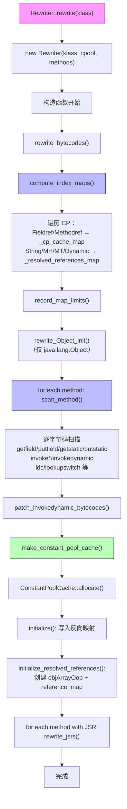
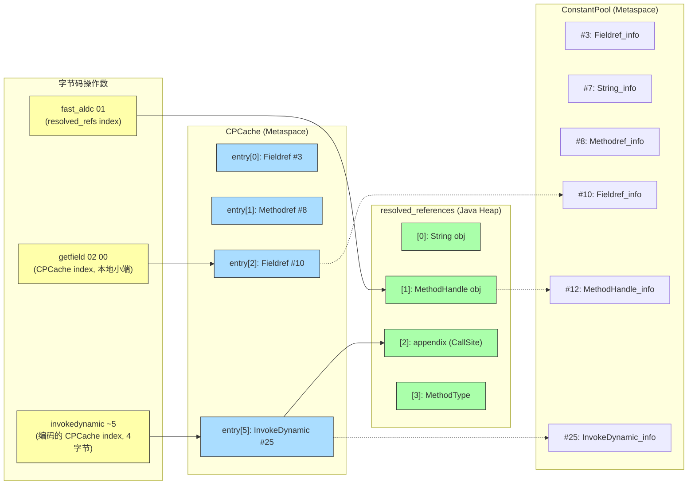
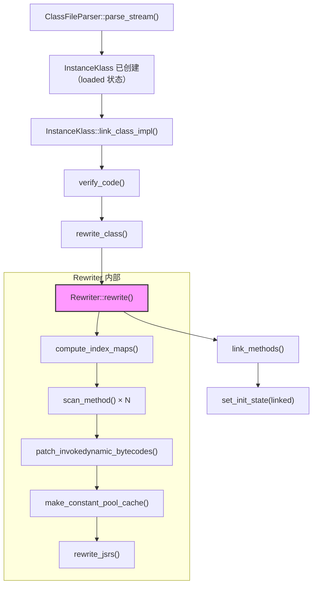
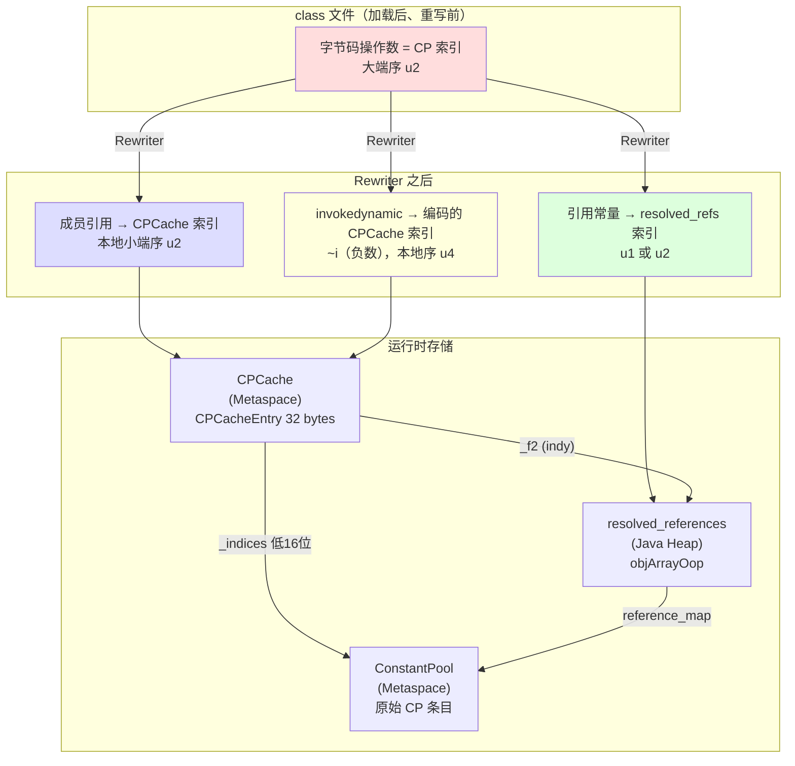
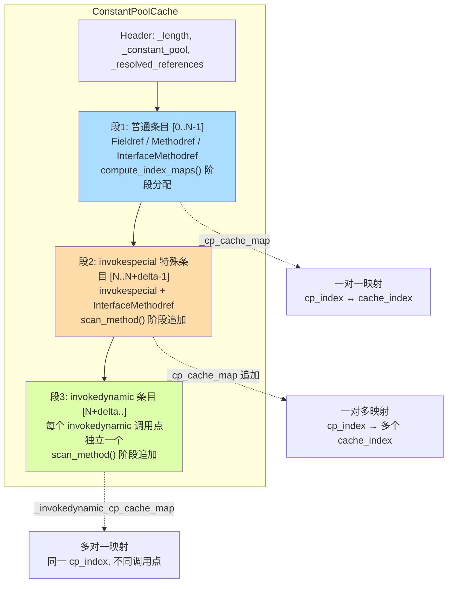

# Day 27：Rewriter + 字节码重写深度剖析

> 源码位置：`src/hotspot/share/interpreter/rewriter.hpp`, `rewriter.cpp`
>
> 标准环境：`-Xms8g -Xmx8g -XX:+UseG1GC -Xint`

---

## 第 0 部分：核心原理 ⭐

### 0.1 本质是什么？

本文深入分析 **Day 27：Rewriter + 字节码重写深度剖析**：从源码角度理解其设计原理、实现机制和关键细节。

### 0.2 为什么需要？

理解 JVM 内部实现是排查复杂问题、进行性能优化的基础。表面的 API 文档无法解释 JVM 的实际行为，只有深入源码才能建立精确的心智模型。

### 0.3 怎么解决？

结合源码阅读、数据结构分析和 GDB 运行时验证，从多个角度建立对该机制的完整理解。

### 0.4 为什么这样设计？

每个设计决策都有其权衡：性能 vs 正确性、简单性 vs 灵活性、内存占用 vs 查找速度。理解这些权衡是理解 JVM 设计的关键。

---


## 一、宏观理解

### 1.1 Rewriter 解决什么问题？

**核心问题：class 文件中的字节码操作数是"常量池原始索引"（CP Index），但解释器运行时需要的是"CPCache 索引"。**

举个具体的例子。class 文件中 `getfield` 指令长这样：

```
b4 00 05    // b4 = getfield, 00 05 = CP index #5 (大端序)
```

CP index #5 指向一个 `Fieldref_info`，它只是一个符号描述（类名 + 字段名 + 类型签名）。每次执行 `getfield` 都要从 CP 查找并解析这个符号引用，代价太大。

Rewriter 的作用是**一次性把所有字节码中的 CP 索引转换成 CPCache 索引**，同时**创建 CPCache**。重写后：

```
b4 03 00    // b4 = getfield, 03 00 = CPCache index #3 (本地小端序)
```

CPCacheEntry 里有 `_f1`、`_f2`、`_flags` 字段，解析完毕后可以直接拿到 Method*、field offset 等信息，无需再回查符号表。

### 1.2 Rewriter 做的六件事

| # | 工作 | 说明 |
|---|------|------|
| 1 | **构建 CP→CPCache 索引映射** | 为 Fieldref/Methodref/InterfaceMethodref 分配 CPCache 条目 |
| 2 | **构建 CP→Resolved References 映射** | 为 String/MethodHandle/MethodType/Dynamic 分配 resolved_references 槽位 |
| 3 | **改写字节码操作数** | 把 CP 索引（大端）换成 CPCache 索引（本地小端）|
| 4 | **替换特殊字节码** | `lookupswitch`→`fast_linearswitch/fast_binaryswitch`，`ldc`→`fast_aldc`，`invokevirtual`→`invokehandle`，`return`→`return_register_finalizer` |
| 5 | **创建 CPCache + resolved_references** | 分配内存，填入反向映射 |
| 6 | **重写 JSR 子例程** | 将 `jsr`/`ret` 转换为 goto（遗留特性）|

### 1.3 触发时机

```
InstanceKlass::link_class_impl()
  → verify_code()           // 先验证
  → rewrite_class()         // 再重写 ← 这里
    → Rewriter::rewrite()
  → link_methods()          // 最后链接方法入口点
```

对应源码（`instanceKlass.cpp:848-856`）：

```cpp
void InstanceKlass::rewrite_class(TRAPS) {
  assert(is_loaded(), "must be loaded");
  if (is_rewritten()) {       // CDS 共享类已经重写过
    assert(is_shared(), "rewriting an unshared class?");
    return;
  }
  Rewriter::rewrite(this, CHECK);  // ← 核心入口
  set_rewritten();                 // 标记已重写，不会再来第二次
}
```

**关键约束**：Rewriter 只执行一次（`set_rewritten()` 标记），在验证之后、首次方法执行之前。

### 1.4 整体流程



### 1.5 重写前后的字节码对比

以一段简单 Java 代码为例：

```java
class Foo {
    int x;
    void bar() {
        this.x = 42;           // putfield
        String s = "hello";    // ldc
    }
}
```

| 时刻 | putfield 操作数 | ldc 操作数 | 说明 |
|------|----------------|-----------|------|
| **class 文件** | `00 05`（大端，CP#5 = Fieldref） | `07`（CP#7 = String） | 标准 JVMS 格式 |
| **Rewriter 之后** | `02 00`（小端，CPCache#2） | `fast_aldc` + `01`（resolved_refs#1） | 操作数指向运行时缓存 |
| **首次执行后** | `fast_iputfield` + `02 00` | resolved_refs[1] = 驻留 String 对象 | 运行时"二次重写"进一步优化 |

---

## 二、源码逐行分析

### 2.1 Rewriter::rewrite() — 静态入口

```cpp
// rewriter.cpp:568-575
void Rewriter::rewrite(InstanceKlass* klass, TRAPS) {
  if (!DumpSharedSpaces) {
    assert(!klass->is_shared(), "archive methods must not be rewritten at run time");
  }
  ResourceMark rm(THREAD);
  Rewriter rw(klass, klass->constants(), klass->methods(), CHECK);
  // (That's all, folks.)
}
```

就这么简短——**所有工作都在构造函数里完成**。`Rewriter` 继承 `StackObj`（栈分配），生命周期仅限于这个函数调用。

### 2.2 构造函数 — 工作总调度

```cpp
// rewriter.cpp:577-630
Rewriter::Rewriter(InstanceKlass* klass, const constantPoolHandle& cpool,
                   Array<Method*>* methods, TRAPS)
  : _klass(klass),
    _pool(cpool),
    _methods(methods),
    _cp_map(cpool->length()),                        // CP 长度的数组
    _cp_cache_map(cpool->length() / 2),              // 估计 CPCache 条目数
    _reference_map(cpool->length()),                 // CP 长度的数组
    _resolved_references_map(cpool->length() / 2),   // 估计引用条目数
    _invokedynamic_references_map(cpool->length() / 2),
    _method_handle_invokers(cpool->length()),
    _invokedynamic_cp_cache_map(cpool->length() / 4) // 估计 invokedynamic 数
{
  // 第一步：重写字节码（含构建索引映射 + 扫描方法 + 创建 CPCache）
  rewrite_bytecodes(CHECK);

  // 压力测试：撤销后重做
  if (StressRewriter) {
    restore_bytecodes();
    rewrite_bytecodes(CHECK);
  }

  // 第二步：创建 CPCache 和 resolved_references
  make_constant_pool_cache(THREAD);

  // 异常回滚：还原字节码
  if (HAS_PENDING_EXCEPTION) {
    restore_bytecodes();
    return;
  }

  // 第三步：处理 JSR 子例程（遗留 Java 1.0 特性）
  int len = _methods->length();
  for (int i = len-1; i >= 0; i--) {
    methodHandle m(THREAD, _methods->at(i));
    if (m->has_jsrs()) {
      m = rewrite_jsrs(m, THREAD);
      if (HAS_PENDING_EXCEPTION) {
        restore_bytecodes();
        return;
      }
      methods->at_put(i, m());
    }
  }
}
```

**三步走**：`rewrite_bytecodes()` → `make_constant_pool_cache()` → JSR 重写。

注意异常处理：如果任何步骤失败，`restore_bytecodes()` 会反向扫描所有方法，把已修改的字节码恢复原状（`scan_method(method, true/*reverse*/, ...)`）。

### 2.3 rewrite_bytecodes() — 两遍扫描

```cpp
// rewriter.cpp:522-566
void Rewriter::rewrite_bytecodes(TRAPS) {
  assert(_pool->cache() == NULL, "constant pool cache must not be set yet");

  // === 第一遍：遍历常量池，建立索引映射 ===
  compute_index_maps();

  // === 特殊处理：Object.<init> 的 return → return_register_finalizer ===
  if (RegisterFinalizersAtInit && _klass->name() == vmSymbols::java_lang_Object()) {
    bool did_rewrite = false;
    int i = _methods->length();
    while (i-- > 0) {
      Method* method = _methods->at(i);
      if (method->intrinsic_id() == vmIntrinsics::_Object_init) {
        methodHandle m(THREAD, method);
        rewrite_Object_init(m, CHECK);
        did_rewrite = true;
        break;
      }
    }
    assert(did_rewrite, "must find Object::<init> to rewrite it");
  }

  // === 第二遍：扫描所有方法的字节码 ===
  int len = _methods->length();
  bool invokespecial_error = false;
  for (int i = len-1; i >= 0; i--) {       // 倒序遍历
    Method* method = _methods->at(i);
    scan_method(method, false, &invokespecial_error);
    if (invokespecial_error) {
      THROW_MSG(vmSymbols::java_lang_InternalError(),
                "This classfile overflows invokespecial for interfaces "
                "and cannot be loaded");
      return;
    }
  }

  // === 修正 invokedynamic 索引（如果 invokespecial 插入了额外条目）===
  patch_invokedynamic_bytecodes();
}
```

### 2.4 compute_index_maps() — 构建 CP→CPCache 映射

这是整个 Rewriter 最基础的一步。它遍历常量池，为每种需要运行时缓存的条目分配对应的存储位置。

```cpp
// rewriter.cpp:40-79
void Rewriter::compute_index_maps() {
  const int length = _pool->length();
  init_maps(length);                    // 初始化所有映射数组

  bool saw_mh_symbol = false;
  for (int i = 0; i < length; i++) {
    int tag = _pool->tag_at(i).value();
    switch (tag) {
      case JVM_CONSTANT_InterfaceMethodref:
      case JVM_CONSTANT_Fieldref:
      case JVM_CONSTANT_Methodref:
        add_cp_cache_entry(i);          // → CPCache 条目
        break;

      case JVM_CONSTANT_Dynamic:
      case JVM_CONSTANT_String:
      case JVM_CONSTANT_MethodHandle:
      case JVM_CONSTANT_MethodType:
        add_resolved_references_entry(i); // → resolved_references 槽位
        break;

      case JVM_CONSTANT_Utf8:
        // 检查是否出现 MethodHandle/VarHandle 类名符号
        if (_pool->symbol_at(i) == vmSymbols::java_lang_invoke_MethodHandle() ||
            _pool->symbol_at(i) == vmSymbols::java_lang_invoke_VarHandle()) {
          saw_mh_symbol = true;
        }
        break;
    }
  }

  record_map_limits();   // 记录第一遍结束时的 CPCache 大小和 resolved_refs 大小

  guarantee((int) _cp_cache_map.length() - 1 <= (int)((u2)-1),
            "all cp cache indexes fit in a u2");  // CPCache 索引不能超过 u2(65535)

  if (saw_mh_symbol) {
    _method_handle_invokers.at_grow(length, 0);  // 预分配 invokehandle 检测数组
  }
}
```

**产出两张映射表**：

| 映射表 | 方向 | 用途 |
|--------|------|------|
| `_cp_map[cp_index] → cache_index` | 正向 | 从 CP 索引快速查 CPCache 索引 |
| `_cp_cache_map[cache_index] → cp_index` | 反向 | CPCache 条目记录对应的 CP 索引 |
| `_reference_map[cp_index] → ref_index` | 正向 | 从 CP 索引快速查 resolved_refs 索引 |
| `_resolved_references_map[ref_index] → cp_index` | 反向 | resolved_refs 槽位记录对应 CP 索引 |

`record_map_limits()` 记录两个关键值：

```cpp
void record_map_limits() {
  _first_iteration_cp_cache_limit = _cp_cache_map.length();  // 普通条目的数量
  _resolved_reference_limit = _resolved_references_map.length();
}
```

这两个值的作用是：**后续 scan_method() 阶段可能追加 invokespecial 和 invokedynamic 条目，需要知道"普通条目"在哪里结束**。

#### add_cp_cache_entry() 和 add_resolved_references_entry() 的核心逻辑

```cpp
// rewriter.hpp:98-112
int add_map_entry(int cp_index, GrowableArray<int>* cp_map,
                  GrowableArray<int>* cp_cache_map) {
  assert(cp_map->at(cp_index) == -1, "not twice on same cp_index");
  int cache_index = cp_cache_map->append(cp_index);  // 追加到反向映射
  cp_map->at_put(cp_index, cache_index);              // 正向映射
  return cache_index;
}

int add_cp_cache_entry(int cp_index) {
  assert(_pool->tag_at(cp_index).value() != JVM_CONSTANT_InvokeDynamic, "use indy version");
  assert(_first_iteration_cp_cache_limit == -1, "do not add after first iteration");
  int cache_index = add_map_entry(cp_index, &_cp_map, &_cp_cache_map);
  return cache_index;
}
```

一个 CP 索引只能对应一个 CPCache 条目（`assert(cp_map->at(cp_index) == -1, "not twice")`），这是一对一关系。但 invokedynamic 例外——它是多对一（同一个 CP 条目的每个调用点都有独立 CPCache 条目）。

### 2.5 scan_method() — 逐字节码扫描

这个函数遍历方法的每一条字节码指令，根据指令类型分发到对应的处理函数。

```cpp
// rewriter.cpp:370-507
void Rewriter::scan_method(Method* method, bool reverse, bool* invokespecial_error) {
  int nof_jsrs = 0;
  bool has_monitor_bytecodes = false;
  Bytecodes::Code c;

  const address code_base = method->code_base();
  const int code_length = method->code_size();

  int bc_length;
  for (int bci = 0; bci < code_length; bci += bc_length) {
    address bcp = code_base + bci;      // bytecode pointer
    int prefix_length = 0;
    c = (Bytecodes::Code)(*bcp);

    // 获取指令长度
    bc_length = Bytecodes::length_for(c);
    if (bc_length == 0) {               // 变长指令（lookupswitch 等）
      bc_length = Bytecodes::length_at(method, bcp);
      if (c == Bytecodes::_wide) {
        prefix_length = 1;
        c = (Bytecodes::Code)bcp[1];
      }
    }

    switch (c) {
      // ---- lookupswitch → fast_linearswitch / fast_binaryswitch ----
      case Bytecodes::_lookupswitch: {
        Bytecode_lookupswitch bc(method, bcp);
        (*bcp) = (bc.number_of_pairs() < BinarySwitchThreshold
          ? Bytecodes::_fast_linearswitch
          : Bytecodes::_fast_binaryswitch);
        break;
      }

      // ---- invokespecial 特殊处理（InterfaceMethodref）----
      case Bytecodes::_invokespecial:
        rewrite_invokespecial(bcp, prefix_length+1, reverse, invokespecial_error);
        break;

      // ---- putfield/putstatic：检查 final 字段修改 ----
      case Bytecodes::_putstatic:
      case Bytecodes::_putfield: {
        if (!reverse) {
          // 如果 final 字段在初始化器之外被修改，标记为 has_initialized_final_update
          // 这会阻止编译器对该字段做常量折叠
          InstanceKlass* klass = method->method_holder();
          u2 bc_index = Bytes::get_Java_u2(bcp + prefix_length + 1);
          // ... 省略 final 字段检测逻辑 ...
        }
      }
      // fall through ↓

      // ---- 成员引用指令：统一调用 rewrite_member_reference ----
      case Bytecodes::_getstatic:
      case Bytecodes::_getfield:
      case Bytecodes::_invokevirtual:
      case Bytecodes::_invokestatic:
      case Bytecodes::_invokeinterface:
      case Bytecodes::_invokehandle:  // reverse 时出现
        rewrite_member_reference(bcp, prefix_length+1, reverse);
        break;

      // ---- invokedynamic：独立处理 ----
      case Bytecodes::_invokedynamic:
        rewrite_invokedynamic(bcp, prefix_length+1, reverse);
        break;

      // ---- ldc/ldc_w → fast_aldc/fast_aldc_w ----
      case Bytecodes::_ldc:
      case Bytecodes::_fast_aldc:     // reverse 时出现
        maybe_rewrite_ldc(bcp, prefix_length+1, false, reverse);
        break;
      case Bytecodes::_ldc_w:
      case Bytecodes::_fast_aldc_w:   // reverse 时出现
        maybe_rewrite_ldc(bcp, prefix_length+1, true, reverse);
        break;

      // ---- JSR 和 monitor 统计 ----
      case Bytecodes::_jsr:
      case Bytecodes::_jsr_w:          nof_jsrs++; break;
      case Bytecodes::_monitorenter:
      case Bytecodes::_monitorexit:    has_monitor_bytecodes = true; break;

      default: break;
    }
  }

  if (has_monitor_bytecodes)  method->set_has_monitor_bytecodes();
  if (nof_jsrs > 0)          method->set_has_jsrs();
}
```

### 2.6 rewrite_member_reference() — CP 索引→CPCache 索引

这是最核心的重写操作：把字节码操作数从 CP 索引替换成 CPCache 索引。

```cpp
// rewriter.cpp:167-183
void Rewriter::rewrite_member_reference(address bcp, int offset, bool reverse) {
  address p = bcp + offset;     // 指向操作数位置（跳过 opcode）
  if (!reverse) {
    int cp_index    = Bytes::get_Java_u2(p);         // 读取大端 CP 索引
    int cache_index = cp_entry_to_cp_cache(cp_index); // 查映射表
    Bytes::put_native_u2(p, cache_index);             // 写入小端 CPCache 索引
    if (!_method_handle_invokers.is_empty())
      maybe_rewrite_invokehandle(p - 1, cp_index, cache_index, reverse);
  } else {
    int cache_index = Bytes::get_native_u2(p);        // 读取小端 CPCache 索引
    int pool_index  = cp_cache_entry_pool_index(cache_index); // 反向查映射
    Bytes::put_Java_u2(p, pool_index);                // 还原为大端 CP 索引
    if (!_method_handle_invokers.is_empty())
      maybe_rewrite_invokehandle(p - 1, pool_index, cache_index, reverse);
  }
}
```

**字节序转换的关键**：

| 操作 | 函数 | 字节序 | 说明 |
|------|------|--------|------|
| 读取原始 CP 索引 | `Bytes::get_Java_u2(p)` | 大端 → 本地 | class 文件按 Java 规范是大端 |
| 写入 CPCache 索引 | `Bytes::put_native_u2(p, cache_index)` | 本地 → 小端 | 解释器按本地字节序读取 |

在 x86 上，`get_Java_u2` 会做 `bswap_16`（字节序翻转），`put_native_u2` 则直接内存写入。

这意味着**重写后的字节码操作数不再是 Java 大端序，而是平台本地序（x86 = 小端）**。解释器模板代码使用 `Bytes::get_native_u2` 读取。

### 2.7 rewrite_invokespecial() — InterfaceMethodref 特殊处理

```cpp
// rewriter.cpp:185-205
void Rewriter::rewrite_invokespecial(address bcp, int offset, bool reverse,
                                     bool* invokespecial_error) {
  address p = bcp + offset;
  if (!reverse) {
    int cp_index = Bytes::get_Java_u2(p);
    if (_pool->tag_at(cp_index).is_interface_method()) {
      // InterfaceMethodref 需要独立的 CPCache 条目
      int cache_index = add_invokespecial_cp_cache_entry(cp_index);
      if (cache_index != (int)(jushort) cache_index) {
        *invokespecial_error = true;  // 索引溢出 u2 范围
      }
      Bytes::put_native_u2(p, cache_index);
    } else {
      rewrite_member_reference(bcp, offset, reverse);  // 普通 Methodref 走常规路径
    }
  } else {
    rewrite_member_reference(bcp, offset, reverse);
  }
}
```

**为什么 invokespecial + InterfaceMethodref 需要独立条目？**

同一个接口方法在常量池中只有一个 InterfaceMethodref 条目，但 `invokespecial` 和 `invokeinterface` 对它的解析语义完全不同：
- `invokeinterface`：走 itable 查找
- `invokespecial`：走直接调用（Java 8+ 的默认方法 `super.defaultMethod()`）

两者不能共享同一个 CPCacheEntry，所以需要追加一个新条目。这个条目插入在 `_first_iteration_cp_cache_limit` 之后、invokedynamic 条目之前。

```cpp
// rewriter.hpp:130-145
int add_invokespecial_cp_cache_entry(int cp_index) {
  assert(_first_iteration_cp_cache_limit >= 0, "add after first iteration");
  // 去重：检查是否已经有了
  for (int i = _first_iteration_cp_cache_limit; i < _cp_cache_map.length(); i++) {
    if (cp_cache_entry_pool_index(i) == cp_index) return i;
  }
  int cache_index = _cp_cache_map.append(cp_index);
  // 注意：不更新 _cp_map，因为一个 cp_index 现在有两个 cache_index
  return cache_index;
}
```

### 2.8 maybe_rewrite_invokehandle() — 签名多态方法

```cpp
// rewriter.cpp:208-253
void Rewriter::maybe_rewrite_invokehandle(address opc, int cp_index,
                                          int cache_index, bool reverse) {
  if (!reverse) {
    if ((*opc) == (u1)Bytecodes::_invokevirtual ||
        (*opc) == (u1)Bytecodes::_invokespecial) {
      assert(_pool->tag_at(cp_index).is_method(), "wrong index");
      if (cp_index >= _method_handle_invokers.length()) return;

      int status = _method_handle_invokers.at(cp_index);  // 三态缓存：0=未检查，+1=是，-1=不是
      if (status == 0) {
        if (_pool->klass_ref_at_noresolve(cp_index) == vmSymbols::java_lang_invoke_MethodHandle() &&
            MethodHandles::is_signature_polymorphic_name(
              SystemDictionary::MethodHandle_klass(),
              _pool->name_ref_at(cp_index))) {
          // MethodHandle.invoke / invokeExact → 需要 appendix
          add_invokedynamic_resolved_references_entries(cp_index, cache_index);
          status = +1;
        } else if (/* VarHandle 的签名多态方法类似 */) {
          add_invokedynamic_resolved_references_entries(cp_index, cache_index);
          status = +1;
        } else {
          status = -1;
        }
        _method_handle_invokers.at(cp_index) = status;
      }

      if (status > 0) {
        (*opc) = (u1)Bytecodes::_invokehandle;  // 替换 opcode！
      }
    }
  } else {
    if ((*opc) == (u1)Bytecodes::_invokehandle) {
      (*opc) = (u1)Bytecodes::_invokevirtual;  // 还原
    }
  }
}
```

**签名多态方法**指的是 `MethodHandle.invoke()`、`MethodHandle.invokeExact()`、`VarHandle.get()` 等——它们的方法签名由调用点决定，而非由方法声明决定。HotSpot 用特殊的 `_invokehandle` 字节码来处理它们，因为需要传递额外的 `appendix` 参数（通过 resolved_references 数组）。

### 2.9 rewrite_invokedynamic() — invokedynamic 多对一处理

```cpp
// rewriter.cpp:256-290
void Rewriter::rewrite_invokedynamic(address bcp, int offset, bool reverse) {
  address p = bcp + offset;
  assert(p[-1] == Bytecodes::_invokedynamic, "not invokedynamic bytecode");

  if (!reverse) {
    int cp_index = Bytes::get_Java_u2(p);

    // 每个调用点分配独立的 CPCache 条目（多对一）
    int cache_index = add_invokedynamic_cp_cache_entry(cp_index);

    // 分配 resolved_references 槽位（2个：appendix + method_type）
    int resolved_index = add_invokedynamic_resolved_references_entries(
                           cp_index, cache_index);

    // 写入 4 字节编码索引（用位取反 ~i 编码）
    Bytes::put_native_u4(p, ConstantPool::encode_invokedynamic_index(cache_index));

    // 记录位置，以便后续 patch
    _patch_invokedynamic_bcps->push(p);
    _patch_invokedynamic_refs->push(resolved_index);
  } else {
    int cache_index = ConstantPool::decode_invokedynamic_index(Bytes::get_native_u4(p));
    int adjustment = cp_cache_delta() + _first_iteration_cp_cache_limit;
    int cp_index = invokedynamic_cp_cache_entry_pool_index(cache_index - adjustment);
    Bytes::put_Java_u4(p, 0);
    Bytes::put_Java_u2(p, cp_index);
  }
}
```

**invokedynamic 与其他指令的三大不同**：

1. **多对一**：同一个 CP 条目（`InvokeDynamic_info`）在不同调用点执行不同的 bootstrap，所以每个调用点都需要独立的 CPCacheEntry。
2. **4 字节操作数**：invokedynamic 指令格式是 `ba cp_index(u2) 00 00`（5字节），重写后 4 字节全部用来存编码后的 cache index。
3. **负数编码**：`encode_invokedynamic_index(i)` = `~i`（按位取反），这样 invokedynamic 的索引一定是负数，可以和普通 CPCache 索引区分。

```cpp
// constantPool.hpp:242-243
static int decode_invokedynamic_index(int i) { assert(is_invokedynamic_index(i), ""); return ~i; }
static int encode_invokedynamic_index(int i) { assert(!is_invokedynamic_index(i), ""); return ~i; }
static bool is_invokedynamic_index(int i) { return (i < 0); }
```

#### add_invokedynamic_cp_cache_entry()

```cpp
// rewriter.hpp:114-123
int add_invokedynamic_cp_cache_entry(int cp_index) {
  assert(_pool->tag_at(cp_index).value() == JVM_CONSTANT_InvokeDynamic, "");
  assert(_first_iteration_cp_cache_limit >= 0, "after first iteration");
  // 追加到独立的 invokedynamic map（不更新 _cp_map）
  int cache_index = _invokedynamic_cp_cache_map.append(cp_index);
  // 返回的索引加上偏移量（拼接在普通条目之后）
  return cache_index + _first_iteration_cp_cache_limit;
}
```

#### add_invokedynamic_resolved_references_entries()

每个 invokedynamic/invokehandle 调用点需要 **2 个** resolved_references 槽位：

```cpp
// rewriter.hpp:162-176
int add_invokedynamic_resolved_references_entries(int cp_index, int cache_index) {
  assert(_resolved_reference_limit >= 0, "must add after first iteration");
  int ref_index = -1;
  for (int entry = 0; entry < ConstantPoolCacheEntry::_indy_resolved_references_entries; entry++) {
    const int index = _resolved_references_map.append(cp_index);  // 多对一
    if (entry == 0) ref_index = index;
    assert((index - entry) == ref_index, "entries must be consecutive");
    _invokedynamic_references_map.at_put_grow(index, cache_index, -1);
  }
  return ref_index;
}
```

其中 `_indy_resolved_references_entries = 2`：

```cpp
// cpCache.hpp:297-302
enum {
  _indy_resolved_references_appendix_offset    = 0,  // appendix 对象
  _indy_resolved_references_method_type_offset = 1,  // MethodType 对象
  _indy_resolved_references_entries                   // = 2
};
```

### 2.10 maybe_rewrite_ldc() — ldc → fast_aldc

```cpp
// rewriter.cpp:321-366
void Rewriter::maybe_rewrite_ldc(address bcp, int offset, bool is_wide, bool reverse) {
  if (!reverse) {
    address p = bcp + offset;
    int cp_index = is_wide ? Bytes::get_Java_u2(p) : (u1)(*p);
    constantTag tag = _pool->tag_at(cp_index).value();

    if (tag.is_method_handle() ||
        tag.is_method_type() ||
        tag.is_string() ||
        (tag.is_dynamic_constant() &&
         is_reference_type(FieldType::basic_type(
           _pool->uncached_signature_ref_at(cp_index))))) {
      // 引用类型常量 → 重写为 fast_aldc
      int ref_index = cp_entry_to_resolved_references(cp_index);
      if (is_wide) {
        (*bcp) = Bytecodes::_fast_aldc_w;
        Bytes::put_native_u2(p, ref_index);        // 写入 resolved_refs 索引
      } else {
        (*bcp) = Bytecodes::_fast_aldc;
        (*p) = (u1)ref_index;                      // 写入 resolved_refs 索引（1字节）
      }
    }
    // 基本类型常量（int/float/long/double）不重写，保持原始 ldc/ldc2_w
  } else {
    // reverse：还原 opcode 和索引
    Bytecodes::Code rewritten_bc =
      (is_wide ? Bytecodes::_fast_aldc_w : Bytecodes::_fast_aldc);
    if ((*bcp) == rewritten_bc) {
      // ... 还原 ...
    }
  }
}
```

**哪些 ldc 会被重写？** 只有加载**引用类型**常量时：
- `String` → resolved_references 中存放驻留（interned）字符串对象
- `MethodHandle` → resolved_references 中存放 MethodHandle 对象
- `MethodType` → resolved_references 中存放 MethodType 对象
- `Dynamic`（Condy）→ 引用类型的动态常量

**不重写**的情况：`ldc` 加载 `int`、`float` 直接从 CP 读取即可；`ldc2_w` 加载 `long`、`double` 也不需要重写。

### 2.11 rewrite_Object_init() — Object.<init> 特殊处理

```cpp
// rewriter.cpp:136-164
void Rewriter::rewrite_Object_init(const methodHandle& method, TRAPS) {
  RawBytecodeStream bcs(method);
  while (!bcs.is_last_bytecode()) {
    Bytecodes::Code opcode = bcs.raw_next();
    switch (opcode) {
      case Bytecodes::_return:
        *bcs.bcp() = Bytecodes::_return_register_finalizer;
        break;
      case Bytecodes::_istore:
      case Bytecodes::_lstore:
      case Bytecodes::_fstore:
      case Bytecodes::_dstore:
      case Bytecodes::_astore:
        if (bcs.get_index() != 0) continue;
        // fall through
      case Bytecodes::_istore_0: case Bytecodes::_lstore_0:
      case Bytecodes::_fstore_0: case Bytecodes::_dstore_0:
      case Bytecodes::_astore_0:
        THROW_MSG(vmSymbols::java_lang_IncompatibleClassChangeError(),
                  "can't overwrite local 0 in Object.<init>");
        break;
    }
  }
}
```

**为什么？** Java 的 finalizer 机制要求：在 `Object.<init>()` 成功返回时注册 finalizable 对象。用 `_return_register_finalizer` 替换 `_return`，解释器在执行到这个字节码时会检查对象是否需要注册 finalization。

同时，`local 0`（即 `this`）必须不被覆盖，因为 `_return_register_finalizer` 需要读取它来获取对象引用。

> **注**：只有 `RegisterFinalizersAtInit` 为 true（默认）且当前类是 `java.lang.Object` 时才执行。

### 2.12 patch_invokedynamic_bytecodes() — 修正 invokedynamic 索引

```cpp
// rewriter.cpp:292-318
void Rewriter::patch_invokedynamic_bytecodes() {
  int delta = cp_cache_delta();    // invokespecial 额外插入的条目数
  if (delta > 0) {
    int length = _patch_invokedynamic_bcps->length();
    for (int i = 0; i < length; i++) {
      address p = _patch_invokedynamic_bcps->at(i);
      int cache_index = ConstantPool::decode_invokedynamic_index(
                          Bytes::get_native_u4(p));
      // 索引加上 delta（因为 invokespecial 条目插在 invokedynamic 之前）
      Bytes::put_native_u4(p,
        ConstantPool::encode_invokedynamic_index(cache_index + delta));

      // resolved_references 的映射也要加 delta
      int resolved_index = _patch_invokedynamic_refs->at(i);
      for (int entry = 0; entry < ConstantPoolCacheEntry::_indy_resolved_references_entries; entry++) {
        _invokedynamic_references_map.at_put(resolved_index + entry,
                                             cache_index + delta);
      }
    }
  }
}
```

**为什么需要 patch？**

CPCache 的最终布局是：`[普通条目] [invokespecial 特殊条目] [invokedynamic 条目]`。

在 `scan_method()` 扫描时，invokedynamic 条目的索引是基于 `_first_iteration_cp_cache_limit` 计算的。但如果后来发现了 `invokespecial + InterfaceMethodref`，这些额外条目会插入在 invokedynamic 之前，导致所有 invokedynamic 的实际偏移量增加了 `delta`。

### 2.13 make_constant_pool_cache() — 创建 CPCache

```cpp
// rewriter.cpp:93-121
void Rewriter::make_constant_pool_cache(TRAPS) {
  ClassLoaderData* loader_data = _pool->pool_holder()->class_loader_data();

  // ① 分配 CPCache 对象
  ConstantPoolCache* cache =
    ConstantPoolCache::allocate(loader_data, _cp_cache_map,
                                _invokedynamic_cp_cache_map,
                                _invokedynamic_references_map, CHECK);

  // ② 双向链接
  _pool->set_cache(cache);
  cache->set_constant_pool(_pool());

  // ③ 创建 resolved_references 数组
  _pool->initialize_resolved_references(loader_data, _resolved_references_map,
                                        _resolved_reference_limit, THREAD);

  // ④ 异常清理
  if (HAS_PENDING_EXCEPTION) {
    MetadataFactory::free_metadata(loader_data, cache);
    _pool->set_cache(NULL);
  }
}
```

#### ConstantPoolCache::allocate()

```cpp
// cpCache.cpp:669-679
ConstantPoolCache* ConstantPoolCache::allocate(ClassLoaderData* loader_data,
                                     const intStack& index_map,
                                     const intStack& invokedynamic_index_map,
                                     const intStack& invokedynamic_map, TRAPS) {
  // 总长度 = 普通条目 + invokedynamic 条目
  const int length = index_map.length() + invokedynamic_index_map.length();
  int size = ConstantPoolCache::size(length);  // header + length * sizeof(CPCacheEntry)

  return new (loader_data, size, MetaspaceObj::ConstantPoolCacheType, THREAD)
    ConstantPoolCache(length, index_map, invokedynamic_index_map, invokedynamic_map);
}
```

分配在 Metaspace 中（`ClassLoaderData` 的元数据区域）。

#### 构造函数 → initialize()

```cpp
// cpCache.inline.hpp:86-98
inline ConstantPoolCache::ConstantPoolCache(int length,
                                            const intStack& inverse_index_map,
                                            const intStack& invokedynamic_inverse_index_map,
                                            const intStack& invokedynamic_references_map)
  : _length(length), _constant_pool(NULL)
{
  CDS_JAVA_HEAP_ONLY(_archived_references = 0;)
  initialize(inverse_index_map, invokedynamic_inverse_index_map,
             invokedynamic_references_map);
  for (int i = 0; i < length; i++) {
    assert(entry_at(i)->is_f1_null(), "Failed to clear?");
  }
}
```

```cpp
// cpCache.cpp:681-716
void ConstantPoolCache::initialize(const intArray& inverse_index_map,
                                   const intArray& invokedynamic_inverse_index_map,
                                   const intArray& invokedynamic_references_map) {
  // 普通条目：写入反向映射（cache_index → cp_index）
  for (int i = 0; i < inverse_index_map.length(); i++) {
    ConstantPoolCacheEntry* e = entry_at(i);
    int original_index = inverse_index_map.at(i);
    e->initialize_entry(original_index);      // 设置 _indices 的低 16 位
  }

  // invokedynamic 条目：追加在普通条目之后
  int invokedynamic_offset = inverse_index_map.length();
  for (int i = 0; i < invokedynamic_inverse_index_map.length(); i++) {
    int offset = i + invokedynamic_offset;
    ConstantPoolCacheEntry* e = entry_at(offset);
    int original_index = invokedynamic_inverse_index_map.at(i);
    e->initialize_entry(original_index);
  }

  // invokedynamic resolved_references → CPCache 的链接
  for (int ref = 0; ref < invokedynamic_references_map.length(); ref++) {
    const int cpci = invokedynamic_references_map.at(ref);
    if (cpci >= 0) {
      entry_at(cpci)->initialize_resolved_reference_index(ref);  // _f2 = ref_index
      ref += ConstantPoolCacheEntry::_indy_resolved_references_entries - 1;
    }
  }
}
```

#### initialize_resolved_references()

```cpp
// constantPool.cpp:158-186
void ConstantPool::initialize_resolved_references(ClassLoaderData* loader_data,
                                                  const intStack& reference_map,
                                                  int constant_pool_map_length,
                                                  TRAPS) {
  int map_length = reference_map.length();
  if (map_length > 0) {
    // ① 创建 reference_map（u2 数组，存在 Metaspace）
    if (constant_pool_map_length > 0) {
      Array<u2>* om = MetadataFactory::new_array<u2>(loader_data,
                                                     constant_pool_map_length, CHECK);
      for (int i = 0; i < constant_pool_map_length; i++) {
        om->at_put(i, (jushort)reference_map.at(i));
      }
      set_reference_map(om);
    }

    // ② 创建 resolved_references 数组（objArrayOop，在 Java Heap）
    objArrayOop stom = oopFactory::new_objArray(
      SystemDictionary::Object_klass(), map_length, CHECK);
    Handle refs_handle(THREAD, (oop)stom);
    set_resolved_references(loader_data->add_handle(refs_handle));
  }
}
```

这里 `constant_pool_map_length` 就是 `_resolved_reference_limit`——只包含"第一遍"（compute_index_maps）中收集的条目数。invokedynamic 追加的条目不需要反向映射到 CP，因为 CPCache 条目本身已经记录了 CP 索引。

---

## 三、数据结构全景

### 3.1 Rewriter 内部映射表

```
class Rewriter : StackObj {
  InstanceKlass*      _klass;
  constantPoolHandle  _pool;
  Array<Method*>*     _methods;

  // ===== 第一遍（compute_index_maps）构建 =====

  GrowableArray<int>  _cp_map;                 // [cp_index] → cache_index（正向）
  GrowableArray<int>  _cp_cache_map;           // [cache_index] → cp_index（反向）
  GrowableArray<int>  _reference_map;          // [cp_index] → ref_index（正向）
  GrowableArray<int>  _resolved_references_map;// [ref_index] → cp_index（反向）
  GrowableArray<int>  _method_handle_invokers;  // [cp_index] → 0/+1/-1（三态检测）

  int  _first_iteration_cp_cache_limit;        // 第一遍结束时 CPCache 条目数
  int  _resolved_reference_limit;              // 第一遍结束时 resolved_refs 数

  // ===== 第二遍（scan_method）追加 =====

  GrowableArray<int>  _invokedynamic_cp_cache_map;     // invokedynamic 专用 CPCache 映射
  GrowableArray<int>  _invokedynamic_references_map;   // invokedynamic 的 ref→cpci 映射

  GrowableArray<address>* _patch_invokedynamic_bcps;   // invokedynamic 字节码位置
  GrowableArray<int>*     _patch_invokedynamic_refs;   // invokedynamic resolved_refs 索引
}
```

### 3.2 CPCache 布局：三段式结构

```
┌──────────────────────────────────────────────────────────────┐
│                    ConstantPoolCache Header                    │
│  _length, _constant_pool, _resolved_references, ...          │
├──────────────────────────────────────────────────────────────┤
│                                                              │
│  ┌─ 段 1：普通条目 ──────────────────────────────────────┐    │
│  │  [0] Fieldref #10          (32 bytes per entry)       │    │
│  │  [1] Methodref #15                                    │    │
│  │  [2] InterfaceMethodref #20                           │    │
│  │  ...                                                  │    │
│  │  [N-1]                                                │    │
│  └───────────────────────────── _first_iteration_cp_cache_limit = N
│                                                              │
│  ┌─ 段 2：invokespecial 特殊条目 ────────────────────────┐    │
│  │  [N] InterfaceMethodref #25  (invokespecial 独立条目)  │    │
│  │  ...（可能为空）                                       │    │
│  └───────────────────────────── delta = 段2长度            │
│                                                              │
│  ┌─ 段 3：invokedynamic 条目 ────────────────────────────┐    │
│  │  [N+delta]   InvokeDynamic #30 (调用点 A)             │    │
│  │  [N+delta+1] InvokeDynamic #30 (调用点 B，同一个CP条目)│    │
│  │  [N+delta+2] InvokeDynamic #35 (调用点 C)             │    │
│  │  ...                                                  │    │
│  └───────────────────────────────────────────────────────┘    │
│                                                              │
└──────────────────────────────────────────────────────────────┘
```

### 3.3 resolved_references 数组布局

```
┌─────────────────────────────────────────────────────────────┐
│            resolved_references (objArrayOop, Java Heap)      │
├─────────────────────────────────────────────────────────────┤
│                                                             │
│  ┌─ 段 1：第一遍收集（compute_index_maps）──────────────┐   │
│  │  [0] → CP String #7                                  │   │
│  │  [1] → CP MethodHandle #12                           │   │
│  │  [2] → CP MethodType #14                             │   │
│  │  [3] → CP Dynamic #18                                │   │
│  │  ...                                                 │   │
│  └────────────────── _resolved_reference_limit           │
│                                                             │
│  ┌─ 段 2：invokedynamic / invokehandle 追加 ────────────┐   │
│  │  [M]   → appendix (CallSite/MethodHandle)            │   │
│  │  [M+1] → method_type (MethodType)                    │   │
│  │  [M+2] → appendix (另一个调用点)                      │   │
│  │  [M+3] → method_type                                 │   │
│  │  ...   （每个调用点占 2 个槽位）                       │   │
│  └──────────────────────────────────────────────────────┘   │
│                                                             │
└─────────────────────────────────────────────────────────────┘
```

### 3.4 CPCACHE_INDEX_TAG 与索引编码

重写后的字节码操作数是"裸 CPCache 索引"。但在 HotSpot 的其他代码中（如 `InterpreterRuntime`、`BytecodeTracer`），为了区分 CP 索引和 CPCache 索引，会给 CPCache 索引加上一个 tag：

```cpp
// constantPool.hpp:818-829
#ifdef ASSERT
  enum { CPCACHE_INDEX_TAG = 0x10000 };  // Debug 模式：加 0x10000 偏移
#else
  enum { CPCACHE_INDEX_TAG = 0 };        // Release 模式：无偏移
#endif

static int decode_cpcache_index(int raw_index, bool invokedynamic_ok = false) {
  if (invokedynamic_ok && is_invokedynamic_index(raw_index))
    return decode_invokedynamic_index(raw_index);
  else
    return raw_index - CPCACHE_INDEX_TAG;
}
```

**Debug 模式用法示例**：

```cpp
// interpreterRuntime.cpp:1543
int cp_index = Bytes::get_native_u2(bcp + 1) + ConstantPool::CPCACHE_INDEX_TAG;
// cp_index = 3 + 0x10000 = 0x10003
// 这样就不会和 CP 的原始索引（0~65535）混淆
```

**invokedynamic 索引编码**：

```cpp
static int encode_invokedynamic_index(int i) { return ~i; }  // 按位取反，保证 < 0
static int decode_invokedynamic_index(int i) { return ~i; }
```

例如 `cache_index = 5` → `encode = ~5 = -6`。负数可以立即和正的普通 CPCache 索引区分。

### 3.5 Fast 字节码完整分类

HotSpot 的"fast 字节码"分为**两个阶段**产生：

#### 阶段一：Rewriter 在类链接时生成

| 原始字节码 | 替换为 | 条件 |
|------------|--------|------|
| `lookupswitch` | `fast_linearswitch` | 分支数 < `BinarySwitchThreshold`（默认 5） |
| `lookupswitch` | `fast_binaryswitch` | 分支数 >= `BinarySwitchThreshold` |
| `ldc` (引用类型) | `fast_aldc` | String/MethodHandle/MethodType/引用型Condy |
| `ldc_w` (引用类型) | `fast_aldc_w` | 同上，宽索引版本 |
| `invokevirtual` (签名多态) | `invokehandle` | 调用 MethodHandle/VarHandle 签名多态方法 |
| `return` (Object.<init>) | `return_register_finalizer` | 仅 java.lang.Object 的 `<init>` |

#### 阶段二：InterpreterRuntime 在首次执行时生成（"运行时二次重写"）

| 原始字节码 | 替换为 | 条件 |
|------------|--------|------|
| `getfield` | `fast_agetfield` / `fast_igetfield` / ... | 首次解析后，根据字段类型选择 |
| `putfield` | `fast_aputfield` / `fast_iputfield` / ... | 同上 |
| `aload_0` | `fast_aload_0` | 频繁模式识别 |
| `aload_0` + `getfield` | `fast_iaccess_0` / `fast_aaccess_0` / `fast_faccess_0` | `RewriteFrequentPairs` 开启 |
| `iload` | `fast_iload` | 频繁模式识别 |
| `iload` + `iload` | `fast_iload2` | 连续 iload 模式 |
| `iload` + `caload` | `fast_icaload` | iload + caload 模式 |
| `invokevirtual` (final) | `fast_invokevfinal` | 目标方法是 final |

#### CDS nofast 字节码

| 原始字节码 | 替换为 | 用途 |
|------------|--------|------|
| `getfield` | `nofast_getfield` | CDS 只读区，防止运行时二次重写 |
| `putfield` | `nofast_putfield` | 同上 |
| `aload_0` | `nofast_aload_0` | 同上 |
| `iload` | `nofast_iload` | 同上 |

### 3.6 索引体系总览



---

## 四、GDB 验证

### 4.1 验证计划与结果

以 `com/wjcoder/Main` 为目标类，在 Rewriter 构造函数完成后（CPCache 已创建、字节码已重写）设断点，采集映射表和字节码数据。

GDB 脚本位于：`new-jvm-md/tmp-file/Rewriter/rewriter_final.gdb`、`rewriter_bytecode.gdb`

### 4.2 验证结果

#### 目标类常量池（javap 输出）

```
Constant pool:
   #1 = Methodref          #6.#15         // java/lang/Object."<init>":()V
   #2 = Fieldref           #16.#17        // java/lang/System.out:Ljava/io/PrintStream;
   #3 = String             #18            // hello jvm
   #4 = Methodref          #19.#20        // java/io/PrintStream.println:(Ljava/lang/String;)V
   #5 = Class              #21            // com/wjcoder/Main
   #6 = Class              #22            // java/lang/Object
   ...（共 29 个条目）
```

#### 映射表验证

```
CP length = 29
sizeof(ConstantPoolCache) = 40    (slowdebug)
sizeof(ConstantPoolCacheEntry) = 32

_cp_cache_map.length = 3         (3 个普通 CPCache 条目)
_first_iteration_cp_cache_limit = 3
_resolved_references_map.length = 1  (1 个 resolved_refs 条目)
_resolved_reference_limit = 1
_invokedynamic_cp_cache_map.length = 0  (无 invokedynamic)
cp_cache_delta = 0               (无 invokespecial 特殊条目)
```

**_cp_cache_map（cache_index → cp_index）**：

| cache_index | cp_index | CP 条目类型 | 说明 |
|-------------|----------|-------------|------|
| 0 | CP#1 | Methodref | `Object.<init>()V` |
| 1 | CP#2 | Fieldref | `System.out:PrintStream` |
| 2 | CP#4 | Methodref | `PrintStream.println(String)V` |

**_resolved_references_map（ref_index → cp_index）**：

| ref_index | cp_index | CP 条目类型 | 说明 |
|-----------|----------|-------------|------|
| 0 | CP#3 | String | `"hello jvm"` |

**分析**：CP 中有 3 个成员引用（#1 Methodref、#2 Fieldref、#4 Methodref）→ 3 个 CPCache 条目；1 个 String（#3）→ 1 个 resolved_references 槽位。完全符合预期。

#### CPCache 条目验证

```
CPCache length = 3, base at 0x7fffcefa6370

entry[0] @ +0:  _indices=0x00000001 (cp=1, bc1=0x00, bc2=0x00)  _f1=NULL  _f2=0
entry[1] @ +32: _indices=0x00000002 (cp=2, bc1=0x00, bc2=0x00)  _f1=NULL  _f2=0
entry[2] @ +64: _indices=0x00000004 (cp=4, bc1=0x00, bc2=0x00)  _f1=NULL  _f2=0
```

**分析**：
- `_indices` 低 16 位 = CP 原始索引（1、2、4）✓
- `bytecode_1` 和 `bytecode_2` 都是 0x00（尚未解析）✓
- `_f1` = NULL、`_f2` = 0（尚未解析）✓
- 条目间距 = 32 bytes = `sizeof(ConstantPoolCacheEntry)` ✓

这些条目在首次执行对应字节码时，由 `InterpreterRuntime::resolve_from_cache()` 填充 `_f1/_f2/_flags` 并设置 `bytecode_1/bytecode_2`。

#### 字节码重写前后对比

**`<init>()V`（构造函数）**：

```
class 文件:   2a b7 00 01 b1
              aload_0  invokespecial CP#1  return
重写后:       2a b7 00 00 b1
              aload_0  invokespecial cache#0(小端: 00 00)  return
```

| 偏移 | 原始 | 重写后 | 说明 |
|------|------|--------|------|
| 0 | `2a` (aload_0) | `2a` | 不变 |
| 1 | `b7` (invokespecial) | `b7` | opcode 不变 |
| 2-3 | `00 01` (CP#1, 大端) | `00 00` (cache#0, 小端) | **索引转换 + 字节序翻转** |
| 4 | `b1` (return) | `b1` | 不变 |

验证：CP#1(Methodref) → cache#0。`put_native_u2(p, 0)` 在小端机上写入 `00 00`。✓

**`main([Ljava/lang/String;)V`**：

```
class 文件:   b2 00 02 12 03 b6 00 04 b1
              getstatic CP#2  ldc CP#3  invokevirtual CP#4  return
重写后:       b2 01 00 e6 00 b6 02 00 b1
              getstatic cache#1  fast_aldc ref#0  invokevirtual cache#2  return
```

| 偏移 | 原始 | 重写后 | 说明 |
|------|------|--------|------|
| 0 | `b2` (getstatic) | `b2` | opcode 不变 |
| 1-2 | `00 02` (CP#2, 大端) | `01 00` (cache#1, 小端) | **Fieldref 索引转换** |
| 3 | `12` (ldc) | `e6` (**fast_aldc**=0xe6) | **opcode 替换！String 需要 resolved_refs** |
| 4 | `03` (CP#3) | `00` (ref#0) | **操作数从 CP 索引改为 resolved_refs 索引** |
| 5 | `b6` (invokevirtual) | `b6` | opcode 不变 |
| 6-7 | `00 04` (CP#4, 大端) | `02 00` (cache#2, 小端) | **Methodref 索引转换** |
| 8 | `b1` (return) | `b1` | 不变 |

**验证结论**：

| # | 验证项 | 结果 |
|---|--------|------|
| 1 | CP 中 Methodref/Fieldref → CPCache 条目 | ✓ 3 个成员引用 → 3 个 CPCache 条目 |
| 2 | CP 中 String → resolved_references 槽位 | ✓ 1 个 String → ref[0] |
| 3 | 字节码操作数：大端 CP 索引 → 小端 CPCache 索引 | ✓ `00 02` → `01 00`（CP#2 → cache#1）|
| 4 | ldc → fast_aldc (0xe6)，操作数改为 resolved_refs 索引 | ✓ `12 03` → `e6 00` |
| 5 | CPCacheEntry 初始化：cp_index 写入、_f1/_f2 为空 | ✓ 均为 NULL/0 |
| 6 | invokedynamic 条目数 = 0（Main 无 invokedynamic） | ✓ |
| 7 | cp_cache_delta = 0（无 invokespecial+InterfaceMethodref） | ✓ |

#### java/lang/Object 验证（额外观察）

```
CP length = 92, CPCache length = 10
_cp_cache_map: cache[0]→CP#2, cache[1]→CP#3, ... cache[9]→CP#16
_resolved_references_map: ref[0]→CP#6, ref[1]→CP#12, ref[2]→CP#15
```

Object 有 14 个方法、10 个成员引用、3 个引用常量。符合预期。

---

## 五、架构关系图

### 5.1 Rewriter 在类链接流程中的位置



### 5.2 字节码操作数的三种索引体系



### 5.3 CPCache 三段式布局



---

## 六、总结

### 6.1 Rewriter 的设计本质

Rewriter 本质上是一个**编译时优化 pass**——它在类加载时执行一次，用空间换时间：

1. **空间代价**：CPCache（Metaspace）+ resolved_references（Java Heap）
2. **时间收益**：解释器不需要每次都解析符号引用，第一次解析后直接从缓存读取

### 6.2 关键设计决策

| 决策 | 原因 |
|------|------|
| 字节序从大端改小端 | x86 解释器直接 `mov` 读取，省去 `bswap` |
| invokedynamic 用 4 字节负数索引 | 区分普通索引，且每个调用点需要独立条目 |
| invokespecial+InterfaceMethodref 独立条目 | 解析语义不同于 invokeinterface |
| ldc 引用类型→fast_aldc | 操作数直接指向 resolved_references，跳过 CP |
| Object.<init> 的 return→return_register_finalizer | finalization 注册必须在构造成功后 |
| 两阶段重写（Rewriter + 运行时） | Rewriter 做"结构"重写，运行时做"类型特化"重写 |

### 6.3 衔接关系

```
Day 26: ConstantPool     ← Rewriter 读取 CP 的 tag 来决定映射策略
Day 27: Rewriter          ← 创建 CPCache + resolved_references
                          → CPCacheEntry 的 _indices 低16位写入 CP 索引
                          → 字节码操作数改写完成
Day 28 (后续): 运行时解析  ← 解释器执行重写后的字节码
                          → InterpreterRuntime::resolve_from_cache()
                          → CPCacheEntry 的 _f1/_f2/_flags 被填充
```
