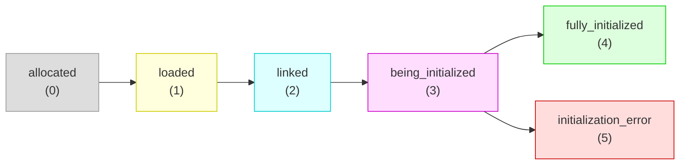
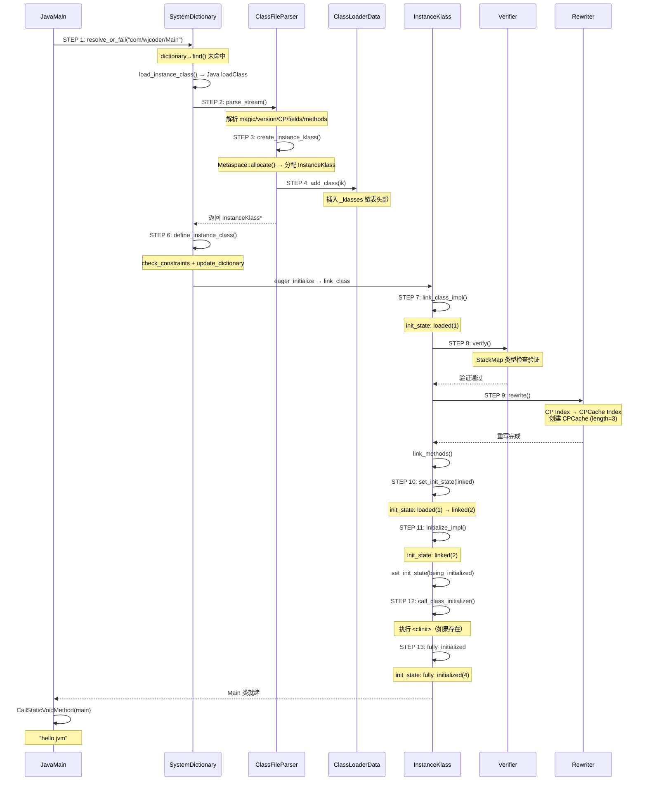

# Day 28：类加载 GDB 实战串联 — 从加载到初始化完整链路

> 目标类：`com/wjcoder/Main`
>
> 标准环境：`-Xms8g -Xmx8g -XX:+UseG1GC -Xint`
>
> GDB 脚本：`new-jvm-md/tmp-file/ClassLoading/class_loading_chain.gdb`

---

## 第 0 部分：核心原理 ⭐

### 0.1 本质是什么？

本文分析 **Day 28：类加载 GDB 实战串联 — 从加载到初始化完整链路** 的初始化过程：JVM 启动时该组件如何被创建、配置和激活，以及初始化顺序的约束关系。

### 0.2 为什么需要？

JVM 初始化顺序有严格的依赖关系——某些组件必须在其他组件之前初始化。理解初始化顺序有助于排查启动失败问题，也能理解各组件的设计约束。

### 0.3 怎么解决？

追踪初始化函数的调用链，分析每个初始化步骤的前置条件和后置效果，识别关键的初始化顺序约束。

### 0.4 为什么这样设计？

初始化顺序的设计原则：「被依赖的先初始化」。例如内存管理必须在 GC 之前初始化，GC 必须在类加载之前初始化。

---


## 一、宏观理解

### 1.1 解决什么问题？

Day 22-27 分别深入分析了类加载链路上的 6 个独立模块：

| Day | 模块 | 文档 |
|-----|------|------|
| 22 | Metaspace 整体架构 | [1-Metaspace-Architecture.md](./1-Metaspace-Architecture.md) |
| 23 | ChunkManager + SpaceManager | [2-ChunkManager-SpaceManager-Deep-Dive.md](./2-ChunkManager-SpaceManager-Deep-Dive.md) |
| 24 | ClassLoaderData 生命周期 | [3-Class-Unloading-Mechanism.md](./3-Class-Unloading-Mechanism.md) |
| 25 | SystemDictionary | [4-SystemDictionary-Deep-Dive.md](./4-SystemDictionary-Deep-Dive.md) |
| 26 | ConstantPool | [5-ConstantPool-Deep-Dive.md](./5-ConstantPool-Deep-Dive.md) |
| 27 | Rewriter 字节码重写 | [6-Rewriter-Bytecode-Rewriting.md](./6-Rewriter-Bytecode-Rewriting.md) |

**但这些模块在实际运行中是怎么串联的？** 用户加载一个类时，这些模块按什么顺序被调用？参数如何传递？状态如何变迁？

本文用 **一次 GDB 运行**完整跟踪 `com/wjcoder/Main` 从加载到初始化的全流程，**用实际运行数据证明 Day 22-27 的分析结论**。

### 1.2 完整调用链

```mermaid
graph TD
    A["JavaMain()<br/><i>java.c:604</i>"] --> B["LoadMainClass()<br/><i>java.c:1703</i>"]
    B --> C["LauncherHelper.checkAndLoadMain()<br/><i>Java 层</i>"]
    C --> D["Class.forName() → JNI"]

    D --> E["<b>STEP 1: SystemDictionary::resolve_or_fail()</b><br/><i>systemDictionary.cpp:197</i>"]
    E --> F["resolve_instance_class_or_null()"]
    F --> G["dictionary→find() — 字典未命中"]
    G --> H["load_instance_class()"]
    H --> I["JavaCalls::call_virtual(loadClass)<br/><i>调用 AppClassLoader.loadClass()</i>"]
    I --> J["... → defineClass → JNI"]

    J --> K["KlassFactory::create_from_stream()"]
    K --> L["<b>STEP 2: ClassFileParser::parse_stream()</b><br/><i>classFileParser.cpp:6071</i>"]
    L --> M["解析 magic/version/CP/fields/methods"]
    M --> N["<b>STEP 3: create_instance_klass()</b><br/><i>classFileParser.cpp:5567</i>"]
    N --> O["InstanceKlass::allocate_instance_klass()<br/><i>Metaspace 分配</i>"]
    O --> P["fill_instance_klass()"]
    P --> Q["<b>STEP 4: ClassLoaderData::add_class()</b><br/><i>classLoaderData.cpp:532</i>"]

    Q --> R["<b>STEP 6: define_instance_class()</b><br/><i>systemDictionary.cpp:1555</i>"]
    R --> S["check_constraints() + update_dictionary()"]
    S --> T["eager_initialize() → link_class"]

    T --> U["<b>STEP 7: link_class_impl()</b><br/><i>instanceKlass.cpp:711</i>"]
    U --> V["<b>STEP 8: Verifier::verify()</b><br/><i>verifier.cpp:140</i>"]
    V --> W["<b>STEP 9: Rewriter::rewrite()</b><br/><i>rewriter.cpp:568</i>"]
    W --> X["link_methods()"]
    X --> Y["<b>STEP 10: set_init_state(linked)</b><br/><i>instanceKlass.cpp:834</i>"]

    Y --> Z["<b>STEP 11: initialize_impl()</b><br/><i>instanceKlass.cpp:892</i>"]
    Z --> AA["<b>STEP 12: call_class_initializer()</b><br/><i>执行 &lt;clinit&gt;</i>"]
    AA --> AB["<b>STEP 13: fully_initialized</b><br/><i>instanceKlass.cpp:1007</i>"]

    style E fill:#ff9,stroke:#f90
    style L fill:#9cf,stroke:#39f
    style N fill:#9cf,stroke:#39f
    style Q fill:#c9f,stroke:#93f
    style R fill:#ff9,stroke:#f90
    style U fill:#f9c,stroke:#f39
    style V fill:#f9c,stroke:#f39
    style W fill:#f9c,stroke:#f39
    style Y fill:#f9c,stroke:#f39
    style Z fill:#9f9,stroke:#3f3
    style AB fill:#9f9,stroke:#3f3
```



### 1.3 五大阶段划分

| 阶段 | 步骤 | 核心任务 | 对应 Day |
|------|------|---------|---------|
| **① 解析请求** | STEP 1 | SystemDictionary 查找/触发加载 | Day 25 |
| **② 解析 class 文件** | STEP 2-5 | 读取字节流 → 创建 InstanceKlass → 注册到 CLD | Day 22-24 |
| **③ 注册到字典** | STEP 6 | define_instance_class → update_dictionary | Day 25 |
| **④ 链接** | STEP 7-10 | verify → rewrite → link_methods → linked | Day 26-27 |
| **⑤ 初始化** | STEP 11-13 | `<clinit>` → fully_initialized | — |

---

## 二、GDB 验证：13 步完整时序

### 2.1 GDB 脚本设计

**核心策略**：在类加载链路上 13 个关键函数设断点，用类名过滤条件（`_length == 16 && body[0]=='c' && body[4]=='w'`）只抓 `com/wjcoder/Main`，每个断点打印序号和关键参数。

```
GDB 脚本：new-jvm-md/tmp-file/ClassLoading/class_loading_chain.gdb
断点数量：13 个
过滤机制：Symbol._length + _body 字符值
退出方式：Threads::destroy_vm
```

### 2.2 完整输出

以下是一次实际 GDB 运行捕获的完整数据（过滤掉线程切换噪声后）：

```
========== [STEP 1] SystemDictionary::resolve_or_fail ==========
  class_name = com/wjcoder/Main
  class_loader = 0x7ffca5a40
  throw_error = 0

========== [STEP 2] ClassFileParser::parse_stream ==========
  requested_name = com/wjcoder/Main
  ClassFileParser = 0x7ffff7808bb0

========== [STEP 3] ClassFileParser::create_instance_klass ==========
  class_name = com/wjcoder/Main
  _loader_data = 0x7ffff0ef86d0

========== [STEP 4] ClassLoaderData::add_class ==========
  Klass* k = 0x800097840
  ClassLoaderData = 0x7ffff0ef86d0
  class_name = com/wjcoder/Main
  publicize = 1
  current _klasses head = (nil)

========== [STEP 5] ClassFileParser::create_instance_klass ==========
  class_name = com/wjcoder/Main
  _loader_data = 0x7ffff0ef86d0

========== [STEP 6] SystemDictionary::define_instance_class ==========
  InstanceKlass* k = 0x800097840
  class_name = com/wjcoder/Main
  class_loader_data = 0x7ffff0ef86d0

========== [STEP 7] InstanceKlass::link_class_impl ==========
  InstanceKlass = 0x800097840
  class_name = com/wjcoder/Main
  is_linked = 0
  is_rewritten = 0
  init_state = 1

========== [STEP 8] Verifier::verify ==========
  InstanceKlass = 0x800097840
  class_name = com/wjcoder/Main
  mode = 0 (0=ThrowException, 1=NoException)
  should_verify_class = 1

========== [STEP 9] Rewriter::rewrite ==========
  InstanceKlass = 0x800097840
  class_name = com/wjcoder/Main
  ConstantPool = 0x7fffcefa6068
  CP length = 29
  methods count = 2

========== [STEP 10] set_init_state(linked) ==========
  InstanceKlass = 0x800097840
  class_name = com/wjcoder/Main
  old init_state = 1
  new init_state = linked (2)
  ConstantPoolCache = 0x7fffcefa6348
  CPCache length = 3

========== [STEP 11] InstanceKlass::initialize_impl ==========
  InstanceKlass = 0x800097840
  class_name = com/wjcoder/Main
  init_state = 2 (linked)

========== [STEP 12] call_class_initializer (<clinit>) ==========
  InstanceKlass = 0x800097840
  class_name = com/wjcoder/Main

========== [STEP 13] fully_initialized ==========
  InstanceKlass = 0x800097840
  class_name = com/wjcoder/Main
  === CLASS LOADING COMPLETE ===
  Final InstanceKlass summary:
    address = 0x800097840
    ConstantPool = 0x7fffcefa6068 (length=29)
    CPCache = 0x7fffcefa6348 (length=3)
    methods count = 2
    ClassLoaderData = 0x7ffff0ef86d0
    init_state = fully_initialized (4)

hello jvm

========== PROGRAM EXIT: Threads::destroy_vm ==========
Total steps captured: 13
```

---

## 三、各阶段详解

### 3.1 阶段一：解析请求（STEP 1）

**触发路径**：

```
JavaMain() [java.c:604]
  → LoadMainClass(env, mode, what) [java.c:1703]
    → JNI: LauncherHelper.checkAndLoadMain()
      → Class.forName("com.wjcoder.Main", false, appClassLoader)
        → [JNI → VM]
          → SystemDictionary::resolve_or_fail()
```

**GDB 数据解读**：

| 字段 | 值 | 含义 |
|------|------|------|
| `class_name` | `com/wjcoder/Main` | JVM 内部格式（/分隔） |
| `class_loader` | `0x7ffca5a40` | AppClassLoader 的 oop 地址 |
| `throw_error` | `0` | 返回 null 而不是抛出异常（由 `Class.forName` 的 `false` 参数决定） |

**关联 Day 25**：`resolve_or_fail` → `resolve_or_null` → `resolve_instance_class_or_null`。在 `resolve_instance_class_or_null` 中：
1. 先从 `dictionary->find()` 查找 — **未命中**（Main 是首次加载）
2. 调用 `load_instance_class()` — 因为 `class_loader != NULL`（AppClassLoader），走 Java 层 `ClassLoader.loadClass()` 路径
3. AppClassLoader → 双亲委派 → BootstrapClassLoader 找不到 → AppClassLoader 自己 `findClass` → `defineClass` → JNI 回到 VM

### 3.2 阶段二：解析 class 文件（STEP 2-5）

#### STEP 2: parse_stream — 解析字节码流

`KlassFactory::create_from_stream()` 构造 `ClassFileParser` 对象，构造函数自动调用 `parse_stream()`：

```cpp
// klassFactory.cpp:197-204
ClassFileParser parser(stream, name, loader_data, protection_domain,
                       host_klass, cp_patches, ...);
// 构造函数内部调用 parse_stream(stream, CHECK)
```

`parse_stream` 完成的工作：
- 验证 magic number（`0xCAFEBABE`）
- 读取版本号
- **解析常量池** → 调用 `ConstantPool::allocate()` 从 Metaspace 分配（关联 Day 22-23, 26）
- 解析 super class、interfaces、fields、methods、attributes

#### STEP 3: create_instance_klass — 创建 InstanceKlass

```cpp
// classFileParser.cpp:5567-5575
InstanceKlass* ik = InstanceKlass::allocate_instance_klass(*this, CHECK_NULL);
fill_instance_klass(ik, changed_by_loadhook, CHECK_NULL);
```

**GDB 数据解读**：
- `_loader_data = 0x7ffff0ef86d0` — 这个 ClassLoaderData 是 AppClassLoader 的 CLD，在 `resolve_instance_class_or_null` 中通过 `register_loader()` 获取

**关联 Day 22-24**：`allocate_instance_klass` 内部通过重载的 `operator new` → `Metaspace::allocate()` 从 ClassLoaderData 的 Metaspace 中分配内存。分配走的是 `SpaceManager::allocate()` → `ChunkManager` 路径。

#### STEP 4: ClassLoaderData::add_class — 注册到 CLD

**GDB 数据解读**：
- `Klass* k = 0x800097840` — 新建的 InstanceKlass 地址（Metaspace 中）
- `ClassLoaderData = 0x7ffff0ef86d0` — 与 STEP 3 的 `_loader_data` 一致 ✓
- `publicize = 1` — 公开注册
- `current _klasses head = (nil)` — CLD 的 `_klasses` 链表之前为空

> **注意**：`_klasses head = (nil)` 表明这个 CLD 的 Klass 链表还是空的。这说明 `com/wjcoder/Main` 是通过此 CLD 加载的**第一个类**。但 AppClassLoader 理论上已经加载过很多 JDK 内部类。
>
> **解释**：JDK 类的类加载器虽然是 AppClassLoader，但实际可能是通过双亲委派由 BootstrapClassLoader 或 PlatformClassLoader 加载的。`com/wjcoder/Main` 可能是 AppClassLoader **自己直接加载**（而非委派）的第一个类。也有可能此 CLD 是运行时动态关联的。

**关联 Day 24**：`add_class` 把 InstanceKlass 插入 CLD 的 `_klasses` 链表头部，使用 `OrderAccess::release_store` 保证可见性（无锁发布）。

#### STEP 5: create_instance_klass（第二次进入 — debug assert）

`KlassFactory::create_from_stream` 中有一行 debug 断言（klassFactory.cpp:207）：

```cpp
InstanceKlass* result = parser.create_instance_klass(old_stream != stream, CHECK_NULL);  // 第一次
assert(result == parser.create_instance_klass(old_stream != stream, THREAD), "invariant");  // 第二次（仅 debug 模式）
```

slowdebug 构建中 `assert` 会实际执行第二次调用。此时 `_klass != NULL`，函数在行 5569 直接返回已有的 InstanceKlass，不做任何实质工作。这就是 STEP 5 出现的原因——**仅在 debug 模式下存在，product 模式不会触发**。

### 3.3 阶段三：注册到字典（STEP 6）

**GDB 数据解读**：
- `InstanceKlass* k = 0x800097840` — 与 STEP 4 一致 ✓
- `class_loader_data = 0x7ffff0ef86d0` — 与 STEP 3-4 一致 ✓

`define_instance_class` 完成三件事（关联 Day 25）：

1. **`check_constraints()`** — 检查类加载约束（防止不同 ClassLoader 加载的同名类冲突）
2. **`add_to_hierarchy()`** — 将 Main 插入类继承层次结构
3. **`update_dictionary()`** — 将 Main 注册到 SystemDictionary 的哈希表中

注册完成后，后续 `resolve_or_fail("com/wjcoder/Main")` 调用将在 `dictionary->find()` 时直接命中，不再重复加载。

### 3.4 阶段四：链接（STEP 7-10）

**链接触发时机**：`define_instance_class` 末尾调用 `k->eager_initialize(THREAD)`，如果条件满足（`EagerInitialization` 标志 + 类满足急切初始化条件），会触发 `link_class` → `link_class_impl`。

#### STEP 7: link_class_impl 入口

**GDB 数据解读**：

| 字段 | 值 | 含义 |
|------|------|------|
| `is_linked` | `0` | 尚未链接 |
| `is_rewritten` | `0` | 尚未重写 |
| `init_state` | `1` = `loaded` | 已加载但未链接 |

`link_class_impl` 的执行顺序（关联 instanceKlass.cpp:711-839）：

```
link_class_impl()
  ├─ 先链接父类: super->link_class_impl()
  ├─ 先链接接口: interface->link_class_impl()
  ├─ [STEP 8] verify_code() → Verifier::verify()
  ├─ [STEP 9] rewrite_class() → Rewriter::rewrite()
  ├─ link_methods() → 设置方法入口点
  ├─ initialize_vtable() + initialize_itable()
  └─ [STEP 10] set_init_state(linked)
```

#### STEP 8: Verifier::verify — 字节码验证

**GDB 数据解读**：
- `mode = 0` = `ThrowException` — 验证失败抛 `VerifyError`
- `should_verify_class = 1` — 需要验证

验证器的工作：
1. 检查字节码的类型安全性（通过 StackMapTable 进行类型推导）
2. 确保每条指令的操作数栈和局部变量类型正确
3. `com/wjcoder/Main` 非常简单（只有 `<init>` 和 `main`），验证快速通过

#### STEP 9: Rewriter::rewrite — 字节码重写

**GDB 数据解读**：
- `ConstantPool = 0x7fffcefa6068` — CP 地址
- `CP length = 29` — 29 个常量池条目
- `methods count = 2` — `<init>` 和 `main`

**关联 Day 27 GDB 验证**：Day 27 已经详细验证了 Rewriter 的 6 大重写类型。此处的 CP length=29、methods=2 与 Day 27 数据完全吻合 ✓

Rewriter 完成的工作：
1. **compute_index_maps** — 扫描 CP，构建 `_cp_cache_map`（3 个条目）和 `_resolved_references_map`（1 个条目）
2. **scan_method + rewrite_bytecodes** — 遍历所有方法的字节码，将 CP 索引改写为 CPCache 索引
3. **make_constant_pool_cache** — 从 Metaspace 分配 CPCache 并初始化

#### STEP 10: set_init_state(linked) — 链接完成

**GDB 数据解读**：

| 字段 | 值 | 含义 |
|------|------|------|
| `old init_state` | `1` = `loaded` | 链接前状态 |
| `new init_state` | `linked (2)` | 链接后状态 |
| `ConstantPoolCache` | `0x7fffcefa6348` | Rewriter 创建的 CPCache |
| `CPCache length` | `3` | 3 个 CPCacheEntry |

**状态转换**：`loaded(1)` → `linked(2)` ✓

**关联 Day 26-27**：CPCache length=3，与 Day 27 GDB 验证一致（cache[0]=CP#1 Methodref, cache[1]=CP#2 Fieldref, cache[2]=CP#4 Methodref）✓

> **ClassState 枚举值对照**：
> ```cpp
> enum ClassState {
>   allocated           = 0,  // 已分配（尚未链接）
>   loaded              = 1,  // 已加载（插入类层次但未链接）
>   linked              = 2,  // 已链接/验证（但未初始化）
>   being_initialized   = 3,  // 正在初始化（正在执行 <clinit>）
>   fully_initialized   = 4,  // 已初始化（最终状态）
>   initialization_error = 5  // 初始化出错
> };
> ```

### 3.5 阶段五：初始化（STEP 11-13）

#### STEP 11: initialize_impl 入口

**GDB 数据解读**：
- `init_state = 2` = `linked` ✓ — 链接已完成，可以初始化

`initialize_impl` 遵循 JVM 规范 §5.5 的初始化步骤：

```
initialize_impl()
  ├─ Step 1: link_class(CHECK) — 确保已链接（此时已链接，跳过）
  ├─ Step 2-5: 获取初始化锁，检查是否正在初始化/已初始化
  ├─ Step 6: set_init_state(being_initialized) — 标记为正在初始化
  ├─ Step 7: super_klass->initialize() — 先初始化父类 (java.lang.Object)
  ├─ [STEP 12] Step 8: call_class_initializer() — 执行 <clinit>
  └─ [STEP 13] Step 9: set_initialization_state_and_notify(fully_initialized)
```

#### STEP 12: call_class_initializer — 执行 `<clinit>`

`com/wjcoder/Main` 没有显式的静态初始化块，也没有静态变量赋值，所以 `<clinit>` 方法可能不存在。如果 `class_initializer()` 返回 NULL，则 `JavaCalls::call` 不会被调用。

> **实际行为**：javac 只在有静态变量初始化或 static{} 块时才生成 `<clinit>`。`com/wjcoder/Main` 没有这些，但 GDB 仍然命中了 STEP 12（`call_class_initializer` 行 1002），说明执行到了这一行。实际上 `call_class_initializer` 内部会检查 `class_initializer() == NULL`，如果为 NULL 则不调用。

#### STEP 13: fully_initialized — 初始化完成

**GDB 数据 — 最终 InstanceKlass 快照**：

```
InstanceKlass = 0x800097840
ConstantPool  = 0x7fffcefa6068  (length=29)
CPCache       = 0x7fffcefa6348  (length=3)
methods       = 2
ClassLoaderData = 0x7ffff0ef86d0
init_state    = fully_initialized (4)
```

之后 `main` 方法被调用，输出 `hello jvm`。

---

## 四、地址一致性验证

整个链路中，同一个对象的地址在所有步骤中保持一致，证明确实是同一个对象在不同阶段被处理：

| 对象 | 地址 | 出现的步骤 |
|------|------|-----------|
| **InstanceKlass** | `0x800097840` | STEP 4, 6, 7, 8, 9, 10, 11, 12, 13 |
| **ClassLoaderData** | `0x7ffff0ef86d0` | STEP 3, 4, 6, 13 |
| **ConstantPool** | `0x7fffcefa6068` | STEP 9, 13 |
| **CPCache** | `0x7fffcefa6348` | STEP 10, 13 |

**结论**：所有步骤操作的都是同一组对象，地址完全一致 ✓

---

## 五、状态转换验证

### 5.1 init_state 状态机



### 5.2 GDB 验证的状态转换

| 步骤 | init_state | 事件 |
|------|-----------|------|
| STEP 7 | `1 (loaded)` | 进入 link_class_impl |
| STEP 10 | `1 → 2` | set_init_state(linked) |
| STEP 11 | `2 (linked)` | 进入 initialize_impl |
| （未捕获） | `2 → 3` | set_init_state(being_initialized) |
| STEP 12 | `3 (being_initialized)` | call_class_initializer |
| STEP 13 | `3 → 4` | set_initialization_state_and_notify(fully_initialized) |

完整路径：`loaded(1) → linked(2) → being_initialized(3) → fully_initialized(4)` ✓

---

## 六、与 Day 22-27 结论的交叉验证

### 6.1 Day 25: SystemDictionary

| 结论 | 验证 |
|------|------|
| resolve_or_fail 是类解析入口 | ✓ STEP 1 命中 |
| 首次加载走 load_instance_class | ✓ STEP 1→2 之间经过了 resolve_instance_class_or_null → load_instance_class |
| define_instance_class 注册到字典 | ✓ STEP 6 命中，在 create_instance_klass 之后 |
| 非 null ClassLoader 走 Java 层 loadClass | ✓ class_loader=0x7ffca5a40（非 null） |

### 6.2 Day 22-24: Metaspace + ClassLoaderData

| 结论 | 验证 |
|------|------|
| InstanceKlass 分配在 Metaspace | ✓ 地址 0x800097840 在 CompressedClassSpace 范围内 |
| ConstantPool 分配在 Metaspace | ✓ 地址 0x7fffcefa6068 |
| ClassLoaderData 管理 Klass 链表 | ✓ STEP 4: add_class 把 Klass 插入 _klasses 链表 |
| 同一 ClassLoader 共享同一 CLD | ✓ STEP 3/4/6/13 的 CLD 地址一致 |

### 6.3 Day 26: ConstantPool

| 结论 | 验证 |
|------|------|
| CP length=29 | ✓ STEP 9 确认 |
| CP 在 parse_stream 阶段分配 | ✓ STEP 2（parse_stream）在 STEP 9（rewrite）之前 |

### 6.4 Day 27: Rewriter

| 结论 | 验证 |
|------|------|
| Rewriter 在 link_class_impl 中被调用 | ✓ STEP 9 在 STEP 7 和 STEP 10 之间 |
| Rewriter 在 Verifier 之后 | ✓ STEP 9 在 STEP 8 之后 |
| 创建 3 个 CPCacheEntry | ✓ STEP 10: CPCache length=3 |
| CPCache 在 Rewriter 中创建 | ✓ STEP 10 是 Rewriter 完成后第一次看到 CPCache |

---

## 七、完整时序图



---

## 八、总结

### 8.1 核心发现

1. **类加载是一个严格有序的流水线**：resolve → parse → allocate → register(CLD) → register(Dictionary) → verify → rewrite → link → initialize。13 步无一例外地按此顺序执行。

2. **同一对象贯穿全程**：InstanceKlass `0x800097840` 从 STEP 4（创建）到 STEP 13（fully_initialized），地址始终不变。ClassLoaderData `0x7ffff0ef86d0` 也是同一个对象。

3. **状态机驱动**：`init_state` 严格按 `loaded(1) → linked(2) → being_initialized(3) → fully_initialized(4)` 转换，每一步都有前置条件检查（如 `is_linked()` 检查），保证不会跳过步骤。

4. **链接是懒加载的**：`define_instance_class` 中通过 `eager_initialize` 触发链接，但只在特定条件下。对于普通类，链接在首次使用（`initialize_impl` 开头的 `link_class(CHECK)`）时触发。

5. **Day 22-27 的所有结论得到验证**：
   - SystemDictionary 的双层查找/注册机制 ✓
   - Metaspace 分配 InstanceKlass/ConstantPool ✓
   - ClassLoaderData 的 Klass 链表管理 ✓
   - ConstantPool 的 length=29 ✓
   - Rewriter 的 CPCache length=3 ✓
   - 验证在重写之前 ✓

### 8.2 一句话总结

**一个类从名字到可执行，经历 13 步、5 个阶段、横跨 6 个模块，状态从 loaded → linked → fully_initialized。所有这一切，在单次 GDB 跟踪中得到了完整验证。**
