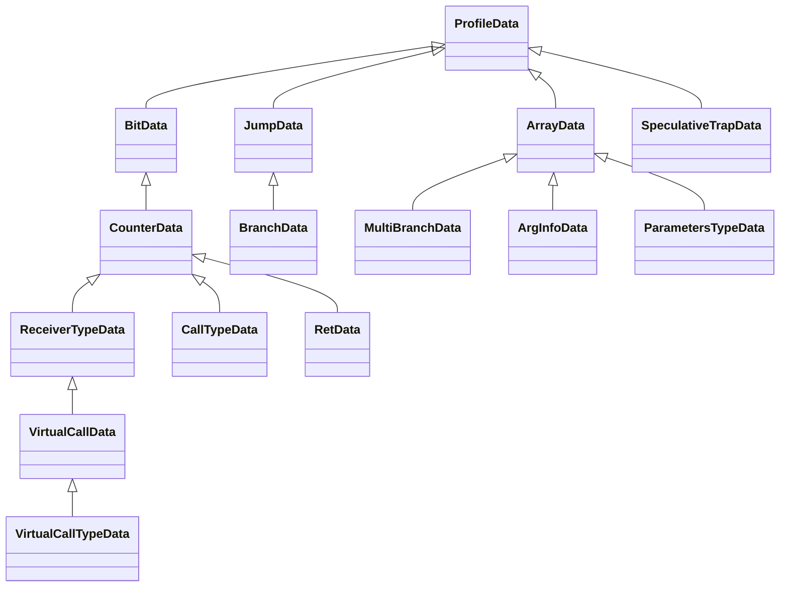
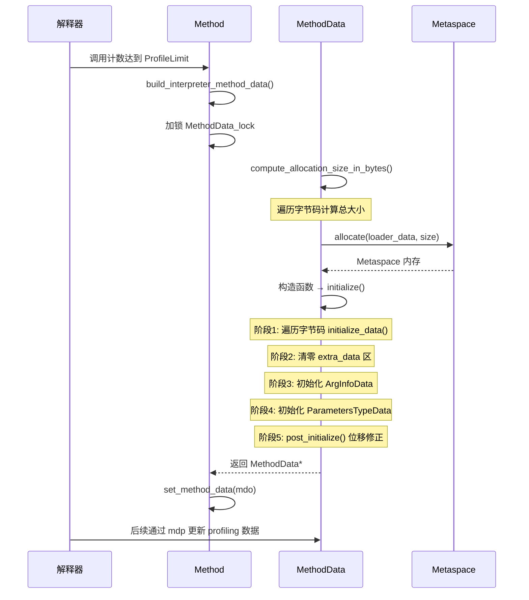
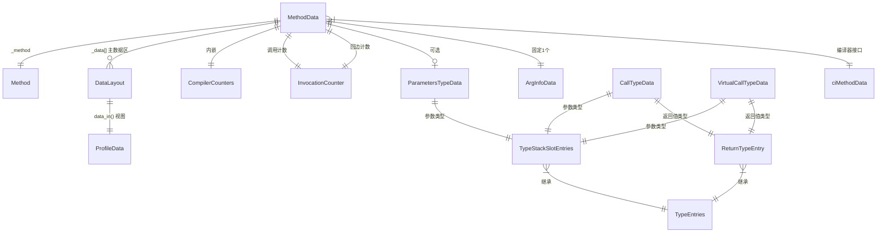

# MethodData：JVM 方法 Profiling 数据

## 0. 核心原理

### 0.1 本质是什么？
MethodData（MDO）是 JVM 为每个方法收集运行时 Profiling 信息的容器——它记录分支走向、调用目标类型、循环次数等统计数据，供 JIT 编译器做激进优化决策。

### 0.2 为什么需要？
JIT 编译器在编译一个方法时，面临大量不确定性：`if` 语句走哪个分支更多？虚方法调用的实际类型是什么？某个类型转换是否总是成功？如果没有运行时数据，编译器只能保守生成代码，无法做去虚化（devirtualization）、分支预测、类型推测等激进优化。

解释器在执行字节码的过程中，天然地经过每个分支、每次调用、每次类型检查。如果在这些位置埋入计数器和类型记录点，就能以极低的额外开销收集到真实的运行时行为数据。

### 0.3 怎么解决？
**核心思路**：为方法中每个"值得 profiling 的字节码"分配一段固定格式的数据空间，解释器在执行时顺便更新这些数据，JIT 编译时读取这些数据做优化决策。

**关键设计**：
1. **DataLayout 统一存储格式**：8 字节头部（tag + flags + bci + traps）+ 变长 cell 数组，tag 决定数据含义
2. **ProfileData 类型体系**：14 种 ProfileData 子类，覆盖所有需要 profiling 的字节码场景
3. **MDO 内存布局**：header + 主数据区（按 BCI 排序的 DataLayout 数组）+ extra_data 区（trap 追踪）+ ArgInfoData + ParametersTypeData

### 0.4 为什么这样设计？

**为什么用 DataLayout 统一格式而不是为每种 profiling 数据定义独立结构？**
- 统一格式允许解释器用简单的指针算术遍历所有 profiling 数据，不需要 switch-case
- DataLayout 的 header 是固定 8 字节，解释器可以用 mdp（method data pointer）直接索引
- 不同 ProfileData 子类只是对同一段内存的不同视图（wrapper），不增加额外内存开销

**为什么主数据区按 BCI 排序？**
- 解释器执行字节码是顺序的，按 BCI 排序意味着 mdp 几乎总是向前移动
- 支持 `hint_di` 缓存优化：记住上次查找位置，下次从该位置开始，避免从头遍历

**为什么需要 extra_data 区？**
- 主数据区只为"常规 profiling 字节码"分配空间（调用、分支、类型检查等）
- 但任何字节码都可能触发 deoptimization trap，trap 信息需要存储在 extra_data 区
- extra_data 区支持运行时动态分配（带锁的 CAS），主数据区在初始化时就固定

---

## 第 0 部分：核心原理 ⭐

### 0.1 本质是什么？

本文深入分析 **MethodData：JVM 方法 Profiling 数据**：从源码角度理解其设计原理、实现机制和关键细节。

### 0.2 为什么需要？

理解 JVM 内部实现是排查复杂问题、进行性能优化的基础。表面的 API 文档无法解释 JVM 的实际行为，只有深入源码才能建立精确的心智模型。

### 0.3 怎么解决？

结合源码阅读、数据结构分析和 GDB 运行时验证，从多个角度建立对该机制的完整理解。

### 0.4 为什么这样设计？

每个设计决策都有其权衡：性能 vs 正确性、简单性 vs 灵活性、内存占用 vs 查找速度。理解这些权衡是理解 JVM 设计的关键。

---


## 1. 数据结构

### 1.1 DataLayout：Profiling 数据的最小存储单元

**源码文件**：`/data/workspace/openjdk-cut-new/src/hotspot/share/oops/methodData.hpp:81`

DataLayout 是所有 profiling 数据的底层存储格式。每个 DataLayout 由一个固定大小的头部和变长的 cell 数组组成。

```cpp
// methodData.hpp:81-104
class DataLayout {
private:
  union {
    u8 _bits;                // 整体作为 8 字节访问
    struct {
      u1 _tag;              // [字节0] 类型标签，标识这段数据的含义
      u1 _flags;            // [字节1] 标志位（如 null_seen）
      u2 _bci;              // [字节2-3] 关联的字节码索引
      u4 _traps;            // [字节4-7] trap 历史（deoptimization 原因）
    } _struct;
  } _header;                // header: 8 字节联合体

  intptr_t _cells[1];       // 变长 cell 数组，每个 cell = sizeof(intptr_t) = 8 字节(LP64)
};
```

**关键常量**（LP64）：

| 常量 | 值 | 含义 |
|------|---|------|
| `cell_size` | 8 字节 | 每个 cell 的大小 |
| `header_size_in_cells()` | 1 | header 占 1 个 cell |
| `header_size_in_bytes()` | 8 字节 | header 总大小 |
| `compute_size_in_bytes(n)` | 8 + 8n | 含 n 个 cell 的 DataLayout 总大小 |

**header 内存布局**（LP64，小端序）：

```
偏移:  0      1      2    3    4    5    6    7
      ┌──────┬──────┬─────────┬───────────────────┐
      │ tag  │flags │   bci   │      traps         │
      │ (u1) │ (u1) │  (u2)   │      (u4)          │
      └──────┴──────┴─────────┴───────────────────┘
```

**tag 枚举值**（`methodData.hpp:119-134`）：

| tag 值 | 名称 | 对应 ProfileData |
|--------|------|-----------------|
| 0 | no_tag | 空/未初始化 |
| 1 | bit_data_tag | BitData |
| 2 | counter_data_tag | CounterData |
| 3 | jump_data_tag | JumpData |
| 4 | receiver_type_data_tag | ReceiverTypeData |
| 5 | virtual_call_data_tag | VirtualCallData |
| 6 | ret_data_tag | RetData |
| 7 | branch_data_tag | BranchData |
| 8 | multi_branch_data_tag | MultiBranchData |
| 9 | arg_info_data_tag | ArgInfoData |
| 10 | call_type_data_tag | CallTypeData |
| 11 | virtual_call_type_data_tag | VirtualCallTypeData |
| 12 | parameters_type_data_tag | ParametersTypeData |
| 13 | speculative_trap_data_tag | SpeculativeTrapData |

**trap_state 编码**：`_traps` 字段（4 字节）= `[recompile:1 | reason:31]`。通过 `set_trap_state()` 设置，采用 OR 语义（只增不减），一个 BCI 可累积多个 trap 原因。

---

### 1.2 ProfileData 类体系

**源码文件**：`/data/workspace/openjdk-cut-new/src/hotspot/share/oops/methodData.hpp:276`

ProfileData 是所有 profiling 数据类型的基类。它不拥有数据，只是 DataLayout 的包装器。

```cpp
// methodData.hpp:276-288
class ProfileData : public ResourceObj {
private:
  DataLayout* _data;       // 指向底层 DataLayout
};
```

**继承层次**：



**DataLayout::data_in() 工厂方法**（`methodData.cpp:1076-1109`）：根据 tag 值创建对应的 ProfileData 子类实例。ProfileData 对象本身是临时的（ResourceObj），底层数据始终在 DataLayout 中。

---

### 1.3 各 ProfileData 子类详解

#### 1.3.1 BitData（tag=1）：类型检查的 null 标记

**源码**：`methodData.hpp:489`。用于 `checkcast`/`instanceof`/`aastore`（当 `TypeProfileCasts=false`）。

**cell 布局**（0 cell，仅 header = 8 字节）。通过 `flags.bit0` 记录 `null_seen`。

编译器用途：如果从未见过 null，可省略 null 检查代码。

#### 1.3.2 CounterData（tag=2）：调用计数

**源码**：`methodData.hpp:545`。用于 `invokestatic`/`invokespecial`/`invokedynamic`。

**cell 布局**（1 cell = 16 字节）：`cell[0]` = 调用次数。

编译器用途：根据调用计数决定是否内联。

#### 1.3.3 JumpData（tag=3）：无条件跳转

**源码**：`methodData.hpp:592`。用于 `goto`/`goto_w`/`jsr`/`jsr_w`。

**cell 布局**（2 cell = 24 字节）：`cell[0]` = 跳转次数，`cell[1]` = displacement（MDO 数据偏移，在 `post_initialize()` 中设置）。

#### 1.3.4 ReceiverTypeData（tag=4）：类型检查的接收者类型

**源码**：`methodData.hpp:1083`。用于 `checkcast`/`instanceof`/`aastore`（当 `TypeProfileCasts=true`）。

**cell 布局**（1 + TypeProfileWidth*2 cell）：

```
cell[0]: count（总检查次数/溢出次数）
cell[1]: receiver0 (Klass*)    cell[2]: count0
cell[3]: receiver1 (Klass*)    cell[4]: count1
...
cell[2W-1]: receiverW-1        cell[2W]: countW-1
```

标准配置 TypeProfileWidth=8：17 cell = 144 字节。

```cpp
// methodData.hpp:1116-1117
static int static_cell_count() {
  return counter_cell_count + (uint)TypeProfileWidth * receiver_type_row_cell_count;
  // = 1 + 8 * 2 = 17
}
```

**TypeProfileWidth 参数**：默认 2，Server 模式设为 8（`compilerDefinitions.cpp`）。含义：每个调用点/类型检查点最多记录几种不同的接收者类型。超出后 count 递增但不记录具体类型（表示"多态溢出"）。

#### 1.3.5 VirtualCallData（tag=5）：虚调用的接收者类型

**源码**：`methodData.hpp:1221`。用于 `invokevirtual`/`invokeinterface`。

cell 布局与 ReceiverTypeData 完全相同。区别在于 count 含义：ReceiverTypeData 的 count 递减（检查失败），VirtualCallData 的 count 递增（类型溢出）。

编译器用途：单态调用点可做去虚化（devirtualization）。

#### 1.3.6 BranchData（tag=7）：条件分支

**源码**：`methodData.hpp:1533`。用于 16 种条件分支指令。

**cell 布局**（3 cell = 32 字节）：`cell[0]` = taken 次数，`cell[1]` = displacement，`cell[2]` = not_taken 次数。

编译器用途：计算分支概率 `taken/(taken+not_taken)`，用于代码布局和分支预测。

#### 1.3.7 MultiBranchData（tag=8）：switch 语句

**源码**：`methodData.hpp:1662`。用于 `tableswitch`/`lookupswitch`。变长。

**cell 布局**：`cell[0]` = array_len，`cell[1]` = default_count，`cell[2]` = default_displacement，之后每 case 占 2 cell（count + displacement）。

#### 1.3.8 CallTypeData（tag=10）：非虚调用 + 参数/返回值类型

**源码**：`methodData.hpp:951`。当 `TypeProfileLevel > 0` 时用于 `invokestatic`/`invokespecial`/`invokedynamic`。

内嵌 `TypeStackSlotEntries _args`（参数类型）和 `ReturnTypeEntry _ret`（返回值类型）。参数每个占 2 cell（栈槽号 + 类型），返回值占 1 cell。

判断逻辑：`has_arguments()` = `cell_count_no_header >= 2`，`has_return()` = `cell_count_no_header % 2 != 0`。

#### 1.3.9 RetData（tag=6）：ret 指令

**源码**：`methodData.hpp:1443`。用于 `ret` 指令（jsr/ret 对，已基本废弃但仍支持）。

**cell 布局**（1 + BciProfileWidth*3 cell，BciProfileWidth 默认 2）：

```
cell[0]: count
cell[1]: bci0     cell[2]: count0    cell[3]: displacement0
cell[4]: bci1     cell[5]: count1    cell[6]: displacement1
...
```

```cpp
// methodData.hpp:1443-1526
class RetData : public CounterData {
  enum {
    bci0_offset = counter_cell_count,  // = 1
    count0_offset,                      // = 2
    displacement0_offset,               // = 3
    ret_row_cell_count = 3              // 每行 3 cell
  };
  static int static_cell_count() {
    return counter_cell_count + (uint)BciProfileWidth * ret_row_cell_count;
    // = 1 + 2 * 3 = 7（BciProfileWidth=2）
  }
};
```

#### 1.3.10 VirtualCallTypeData（tag=11）

**源码**：`methodData.hpp:1309`。同 CallTypeData，但基类是 VirtualCallData。

#### 1.3.11 ArgInfoData（tag=9）

**源码**：`methodData.hpp:1751`。记录参数是否被修改，用于逃逸分析。每个 MDO 固定 1 个。

#### 1.3.12 ParametersTypeData（tag=12）

**源码**：`methodData.hpp:1780`。当 `TypeProfileLevel` 百位 > 0 时，记录方法入口处参数的实际类型。

#### 1.3.13 SpeculativeTrapData（tag=13）

**源码**：`methodData.hpp:1856`。记录类型推测失败的编译根方法。从 extra_data 区动态分配，1 cell = 16 字节。

---

### 1.4 TypeEntries：类型编码机制

**源码**：`methodData.hpp:664`

在一个 `intptr_t` cell 中同时编码 Klass* 指针和状态位：

```cpp
enum {
  null_seen = 1,               // bit 0: 见过 null
  type_unknown = 2,            // bit 1: 类型冲突
  status_bits = null_seen | type_unknown,  // 低 2 位
  type_klass_mask = ~status_bits           // 高位 = Klass*
};
```

Klass* 天然至少 4 字节对齐（低 2 位为 0），所以可安全复用低 2 位。

状态组合：`0b00`=无数据，`0b01`=见过null，`0b10`=类型冲突，`Klass*|0b01`=单类型+见过null。

### 1.5 TypeProfileLevel 编码

**源码**：`methodData.cpp:1538-1614`

三位十进制数 **XYZ**：百位X=参数类型，十位Y=返回值类型，个位Z=调用参数类型。每位：0=不profiling，1=仅JSR292，2=全部。

---

### 1.6 ProfileData 大小汇总表

LP64, TypeProfileWidth=8:

| ProfileData | tag | cell数 | 总字节 | 对应字节码 |
|------------|-----|-------|--------|-----------|
| BitData | 1 | 0 | 8 | checkcast等(无类型) |
| CounterData | 2 | 1 | 16 | invokestatic等 |
| JumpData | 3 | 2 | 24 | goto/jsr |
| ReceiverTypeData | 4 | 17 | 144 | checkcast等(有类型) |
| VirtualCallData | 5 | 17 | 144 | invokevirtual等 |
| RetData | 6 | 7 | 64 | ret (BciProfileWidth=2) |
| BranchData | 7 | 3 | 32 | ifeq/ifne等(16种) |
| MultiBranchData | 8 | 变长 | 变长 | switch |
| CallTypeData | 10 | 变长 | 变长 | invokestatic+类型 |
| VirtualCallTypeData | 11 | 变长 | 变长 | invokevirtual+类型 |
| SpeculativeTrapData | 13 | 1 | 16 | extra_data动态分配 |

---

### 1.7 MethodData 类本体

**源码文件**：`/data/workspace/openjdk-cut-new/src/hotspot/share/oops/methodData.hpp:1956`

#### 概览

| 属性 | 值 |
|------|---|
| 类名 | `MethodData` |
| 所属子系统 | oops（对象表示层） |
| 继承链 | `MetaspaceObj` → `Metadata`（引入 vtable） → `MethodData` |
| 源文件 | `methodData.hpp` / `methodData.cpp` |
| sizeof | **360 字节**（slowdebug，不含 `_data[]` 变长部分）（GDB 验证） |
| 生命周期 | 与 Method 绑定，ClassLoaderData 管理，类卸载时释放 |
| 创建位置 | `Method::build_interpreter_method_data()` @ `method.cpp:421` |
| 分配方式 | `Metaspace` 中分配（`MetaspaceObj::MethodDataType`） |

**关联类大小**（GDB 验证）：

| 类 | sizeof |
|----|--------|
| `Metadata` | 16 字节（vptr 8B + `_valid` 4B + padding 4B，slowdebug） |
| `Mutex` | 152 字节 |
| `InvocationCounter` | 4 字节 |

```cpp
// methodData.hpp:1956-2494（关键字段）
class MethodData : public Metadata {
private:
  Method* _method;                     // 关联的 Method 对象
  int _size;                           // MDO 总大小（字节）
  int _hint_di;                        // BCI 查找缓存（上次查找的 data index）
  Mutex _extra_data_lock;              // extra_data 区的互斥锁（leaf 级）

  CompilerCounters _compiler_counters; // 编译器计数器（trap 历史等）

  intx _eflags;                        // 逃逸标志
  intx _arg_local;                     // 不逃逸的参数位集
  intx _arg_stack;                     // 可栈分配的参数位集
  intx _arg_returned;                  // 被返回的参数位集

  InvocationCounter _invocation_counter;  // 调用计数器
  InvocationCounter _backedge_counter;    // 回边计数器
  int _invocation_counter_start;          // profiling 开始时的调用计数快照
  int _backedge_counter_start;            // profiling 开始时的回边计数快照
  uint _tenure_traps;                     // tenure trap 计数
  int _invoke_mask;                       // 调用通知频率掩码
  int _backedge_mask;                     // 回边通知频率掩码

  short _num_loops;                    // 循环数（C1 编译时设置）
  short _num_blocks;                   // 基本块数
  WouldProfile _would_profile;         // 是否值得 profiling

  int _data_size;                      // 主数据区大小（字节）
  int _parameters_type_data_di;        // 参数类型数据的 data index（-2=无参数）
  intptr_t _data[1];                   // 主数据区起始（柔性数组）
};
```

#### 完整字段列表（GDB 验证偏移）

以下所有偏移量均通过 GDB `(size_t)&((MethodData*)0)->_fieldName` 实测获得：

| 偏移 | 字段名 | 类型 | 大小 | 含义 |
|------|--------|------|------|------|
| 0x000 | [vtable ptr] | ptr | 8B | Metadata 虚函数表指针 |
| 0x008 | [_valid] | int | 4B+4B pad | slowdebug 专用校验字段 |
| 0x010 | `_method` | Method* | 8B | 关联的 Method 对象 |
| 0x018 | `_size` | int | 4B | MDO 总大小（字节） |
| 0x01C | `_hint_di` | int | 4B | BCI 查找缓存 |
| 0x020 | `_extra_data_lock` | Mutex | 152B | extra_data 区互斥锁 |
| 0x0B8 | `_compiler_counters` | CompilerCounters | 80B | 编译器计数器+trap直方图 |
| 0x108 | `_eflags` | intx | 8B | 逃逸标志 |
| 0x110 | `_arg_local` | intx | 8B | 不逃逸参数位集 |
| 0x118 | `_arg_stack` | intx | 8B | 可栈分配参数位集 |
| 0x120 | `_arg_returned` | intx | 8B | 被返回参数位集 |
| 0x128 | `_invocation_counter` | InvocationCounter | 4B | 调用计数器 |
| 0x12C | `_backedge_counter` | InvocationCounter | 4B | 回边计数器 |
| 0x130 | `_invocation_counter_start` | int | 4B | profiling 开始调用快照 |
| 0x134 | `_backedge_counter_start` | int | 4B | profiling 开始回边快照 |
| 0x138 | `_tenure_traps` | uint | 4B | tenure trap 计数 |
| 0x13C | `_invoke_mask` | int | 4B | 调用通知频率掩码 |
| 0x140 | `_backedge_mask` | int | 4B | 回边通知频率掩码 |
| | [padding] | | 4B | 对齐填充 |
| 0x148 | `_num_loops` | short | 2B | 循环数 |
| 0x14A | `_num_blocks` | short | 2B | 基本块数 |
| 0x14C | `_would_profile` | int(enum) | 4B | 是否值得 profiling |
| | [padding] | | 4B | 对齐填充 |
| 0x154 | `_data_size` | int | 4B | 主数据区大小（字节） |
| 0x158 | `_parameters_type_data_di` | int | 4B | 参数类型 data index |
| | [padding] | | 4B | 对齐到 8 字节 |
| **0x160** | **`_data[0]`** | intptr_t[] | 变长 | **主数据区起始** |

> 注：0x160 = 352（十进制），header 到 `_data` 的固定偏移。sizeof(MethodData)=360 包含了 `_data[1]` 的 8 字节。

#### 1.7.1 CompilerCounters

**源码**：`methodData.hpp:1993-2063`

```cpp
class CompilerCounters {
  int  _creation_mileage;              // MDO 创建时的 method mileage
  uint _nof_decompiles;                // nmethod 被移除的总次数
  uint _nof_overflow_recompiles;       // 溢出重编译次数
  uint _nof_overflow_traps;            // 溢出 trap 次数
  union {
    intptr_t _align;
    u1 _array[_trap_hist_limit];       // trap 历史直方图（每 reason 一个 u1 计数器）
  } _trap_hist;
};
```

trap 直方图为每种 deoptimization reason 维护 u1 计数器（最大 255），溢出后转入 `_nof_overflow_traps`。当某 reason 的 trap 超过阈值，编译器放弃对应推测性优化。当 `_nof_decompiles > PerMethodRecompilationCutoff` 时，方法被标记为不可编译。

---

## 2. MethodData 内存布局

### 2.1 完整内存布局（GDB 验证偏移）

```
MethodData 对象内存布局 (sizeof header = 360B, 总大小 = _size)

偏移(hex)  偏移(dec)
┌──────────────────────────────────────────────┐ 0x000 (0)   ← this
│  [vtable ptr]              (8B)               │
│  [_valid + padding]        (8B, slowdebug)    │
├──────────────────────────────────────────────┤ 0x010 (16)
│  _method (Method*)         (8B)               │
│  _size (int)               (4B)               │
│  _hint_di (int)            (4B)               │
├──────────────────────────────────────────────┤ 0x020 (32)
│  _extra_data_lock (Mutex)  (152B)             │
├──────────────────────────────────────────────┤ 0x0B8 (184)
│  _compiler_counters        (80B)              │
│    _creation_mileage(4B) + _nof_decompiles(4B)│
│    _nof_overflow_recompiles(4B)               │
│    _nof_overflow_traps(4B)                    │
│    _trap_hist(含padding)(64B)                 │
├──────────────────────────────────────────────┤ 0x108 (264)
│  _eflags (8B)                                 │
│  _arg_local (8B)                              │
│  _arg_stack (8B)                              │
│  _arg_returned (8B)                           │
├──────────────────────────────────────────────┤ 0x128 (296)
│  _invocation_counter (4B)                     │
│  _backedge_counter (4B)                       │
│  _invocation_counter_start (4B)               │
│  _backedge_counter_start (4B)                 │
│  _tenure_traps (4B)                           │
│  _invoke_mask (4B)                            │
│  _backedge_mask (4B)                          │
│  [padding] (4B)                               │
├──────────────────────────────────────────────┤ 0x148 (328)
│  _num_loops (2B) + _num_blocks (2B)           │
│  _would_profile (4B)                          │
│  [padding] (4B)                               │
│  _data_size (4B)                              │
│  _parameters_type_data_di (4B)                │
│  [padding] (4B)                               │
╠══════════════════════════════════════════════╣ 0x160 (352)  ← data_base() = &_data[0]
│  DataLayout #0 (tag+bci+cells...)             │
│  DataLayout #1                                │
│  ...                                          │
│  DataLayout #N                                │
├──────────────────────────────────────────────┤ data_base + _data_size
│  extra_data slots (trap 追踪，动态分配)         │
│  BitData / SpeculativeTrapData / 空闲(tag=0)  │
├──────────────────────────────────────────────┤ args_data_limit()
│  ArgInfoData (参数修改信息)                     │
├──────────────────────────────────────────────┤
│  ParametersTypeData (可选，TypeProfileLevel)    │
└──────────────────────────────────────────────┘ this + _size
```

> **GDB 验证实例**：某 MDO 对象 `_data_size=136`, `_size=568`, `_parameters_type_data_di=-2`（无参数类型数据）。MDO 总大小 568 字节 = header 352B + 主数据区 136B + extra_data + ArgInfoData。

### 2.2 地址计算

```cpp
address data_base()           = (address)_data;
DataLayout* extra_data_base() = data_layout_at(_data_size);
DataLayout* args_data_limit() = (address)this + _size - parameters_size_in_bytes();
DataLayout* extra_data_limit()= (address)this + _size;
```

---

## 3. 初始化流程

### 3.0 调用链全景图

```
Method::build_interpreter_method_data(method, TRAPS)    ← 入口，解释器触发
├── 双重检查 method->method_data() == NULL
├── MutexLocker(MethodData_lock)                         ← 全局锁防并发创建
└── MethodData::allocate(loader_data, method, CHECK)
    ├── compute_allocation_size_in_words(method)
    │   └── compute_allocation_size_in_bytes(method)
    │       ├── compute_data_size(&stream) × N            ★ 逐字节码计算 ProfileData 大小
    │       │   └── bytecode_cell_count(code)             ← 字节码→cell数映射
    │       ├── compute_extra_data_count(...)              ← extra_data 槽数
    │       ├── DataLayout::compute_size_in_bytes(arg+1)  ← ArgInfoData
    │       └── ParametersTypeData::compute_cell_count()  ← 可选参数类型
    └── new (Metaspace) MethodData(method)                ← Metaspace 分配 + 构造
        └── initialize()                                   ★ 核心初始化
            ├── init()                                     ← 计数器/掩码初始化
            ├── initialize_data(&stream, data_size) × N    ★ 逐字节码初始化 DataLayout
            │   └── DataLayout::initialize(tag, bci, cells)
            ├── Copy::zero_to_bytes(extra_data)            ← 清零 extra_data 区
            ├── DataLayout::initialize(arg_info_tag)       ← ArgInfoData
            ├── DataLayout::initialize(parameters_tag)     ← ParametersTypeData（可选）
            └── post_initialize(&stream)                   ★ 位移修正
                ├── JumpData::post_initialize()            ← BCI→data_index 偏移
                ├── BranchData::post_initialize()
                ├── MultiBranchData::post_initialize()
                └── CallTypeData/VirtualCallTypeData::post_initialize() ← 栈槽映射
```

### 3.1 创建入口

**源码**：`/data/workspace/openjdk-cut-new/src/hotspot/share/oops/method.cpp:421`

```cpp
// method.cpp:421-449
void Method::build_interpreter_method_data(const methodHandle& method, TRAPS) {
  if (method->method_data() != NULL) return;  // 双重检查
  {
    MutexLocker ml(MethodData_lock, THREAD);   // 加锁
    if (method->method_data() == NULL) {
      ClassLoaderData* loader_data = method->method_holder()->class_loader_data();
      MethodData* method_data = MethodData::allocate(loader_data, method, CHECK);
      method->set_method_data(method_data);
    }
  }
}
```

触发时机：解释器调用计数达到 `InterpreterProfileLimit` 时。

### 3.2 分配和构造

**源码**：`methodData.cpp:709-714`

```cpp
MethodData* MethodData::allocate(ClassLoaderData* loader_data,
                                 const methodHandle& method, TRAPS) {
  int size = MethodData::compute_allocation_size_in_words(method);
  return new (loader_data, size, MetaspaceObj::MethodDataType, THREAD)
    MethodData(method());  // Metaspace 中分配
}
```

### 3.3 大小计算

**源码**：`methodData.cpp:901-930`

```cpp
int MethodData::compute_allocation_size_in_bytes(const methodHandle& method) {
  int data_size = 0;
  int empty_bc_count = 0;
  BytecodeStream stream(method);
  Bytecodes::Code c;
  // 1. 遍历字节码，累加 profiling 数据大小
  while ((c = stream.next()) >= 0) {
    int size_in_bytes = compute_data_size(&stream);
    data_size += size_in_bytes;
    if (size_in_bytes == 0) empty_bc_count += 1;
  }
  int object_size = in_bytes(data_offset()) + data_size;
  // 2. extra_data 区（约 3% 的空 BCI）
  int extra_data_count = compute_extra_data_count(data_size, empty_bc_count, ...);
  object_size += extra_data_count * DataLayout::compute_size_in_bytes(0);
  // 3. ArgInfoData
  int arg_size = method->size_of_parameters();
  object_size += DataLayout::compute_size_in_bytes(arg_size + 1);
  // 4. ParametersTypeData（可选）
  int args_cell = ParametersTypeData::compute_cell_count(method());
  if (args_cell > 0)
    object_size += DataLayout::compute_size_in_bytes(args_cell);
  return object_size;
}
```

### 3.4 initialize()：核心初始化

**源码**：`methodData.cpp:1143-1211`

```cpp
void MethodData::initialize() {
  NoSafepointVerifier no_safepoint;  // 初始化期间不允许 safepoint
  init();                             // 初始化计数器和掩码

  // === 阶段1：遍历字节码，初始化主数据区 ===
  int data_size = 0;
  BytecodeStream stream(method());
  while ((c = stream.next()) >= 0) {
    int size_in_bytes = initialize_data(&stream, data_size);
    data_size += size_in_bytes;
  }
  _data_size = data_size;

  // === 阶段2：清零 extra_data 区 ===
  Copy::zero_to_bytes(((address)_data) + data_size, extra_size);

  // === 阶段3：初始化 ArgInfoData ===
  DataLayout *dp = data_layout_at(data_size + extra_size);
  dp->initialize(DataLayout::arg_info_data_tag, 0, arg_size + 1);

  // === 阶段4：初始化 ParametersTypeData（可选） ===
  if (parms_cell > 0) {
    _parameters_type_data_di = data_size + extra_size + arg_data_size;
    dp->initialize(DataLayout::parameters_type_data_tag, 0, parms_cell);
  }

  // === 阶段5：post_initialize()（位移修正） ===
  post_initialize(&stream);
  set_size(object_size);
}
```

### 3.5 字节码→ProfileData 映射

**源码**：`methodData.cpp:716-779`

| 字节码 | ProfileData 类型 | cell数 | 条件 |
|--------|-----------------|--------|------|
| checkcast/instanceof/aastore | ReceiverTypeData | 17 | TypeProfileCasts=true |
| checkcast/instanceof/aastore | BitData | 0 | TypeProfileCasts=false |
| invokestatic/invokespecial | CallTypeData/CounterData | 变长/1 | TypeProfileLevel |
| goto/goto_w/jsr/jsr_w | JumpData | 2 | — |
| invokevirtual/invokeinterface | VirtualCallTypeData/VirtualCallData | 变长/17 | TypeProfileLevel |
| invokedynamic | CallTypeData/CounterData | 变长/1 | TypeProfileLevel |
| 16种条件分支 | BranchData | 3 | — |
| lookupswitch/tableswitch | MultiBranchData | 变长 | — |
| 其他 | 无 | — | 不做 profiling |

### 3.6 post_initialize()：位移修正

**源码**：`methodData.cpp:1121-1132`

遍历所有 DataLayout，将字节码跳转目标 BCI 转换为 MDO 数据数组内的偏移量：

```cpp
// JumpData 的位移修正（methodData.cpp:179-192）
void JumpData::post_initialize(BytecodeStream* stream, MethodData* mdo) {
  int target = stream->dest();           // 跳转目标 BCI
  int my_di = mdo->dp_to_di(dp());      // 当前 data index
  int target_di = mdo->bci_to_di(target); // 目标 data index
  set_displacement(target_di - my_di);   // 存储相对偏移
}
```

BranchData、MultiBranchData 做类似修正。CallTypeData/VirtualCallTypeData 初始化参数栈槽映射。

---

## 4. 运行时 Profiling

### 4.1 mdp（Method Data Pointer）

解释器维护 `mdp` 寄存器，指向当前字节码对应的 DataLayout。执行完有 profiling 的字节码后，mdp 前移到下一个 DataLayout。分支跳转时，mdp 通过 displacement 直接定位目标 DataLayout。

### 4.2 extra_data 并发分配

**源码**：`methodData.cpp:1369-1422`

当没有主数据区条目的 BCI 发生 trap 时，在 extra_data 区动态分配：
1. **无锁快速路径**：先遍历查找已有条目（只追加不删除，已有条目始终有效）
2. **加锁慢速路径**：加 `_extra_data_lock`，双重检查后分配
3. **原子头部写入**：`set_header()` 写入 8 字节 header，其他线程通过 `tag != no_tag` 判断

---

## 5. JIT 编译器如何使用 MethodData

### 5.1 ciMethodData：编译器接口

**源码**：`/data/workspace/openjdk-cut-new/src/hotspot/share/ci/ciMethodData.hpp:380`

编译器通过 `ciMethodData` 读取 profiling 数据。`load_data()` 将 MethodData 的内容原子拷贝到编译器线程的 arena 中，并将 `Klass*` 翻译为编译器安全的 `ciKlass*`。

### 5.2 编译器优化决策

| profiling 数据 | 编译器优化 | 原理 |
|---------------|-----------|------|
| VirtualCallData(单态) | 去虚化 + 类型守卫 | 虚调用→直接调用，失败时 uncommon_trap |
| BranchData(taken/not_taken) | 分支预测 + 代码布局 | 热路径 fall-through，冷路径 uncommon |
| ReceiverTypeData(单类型) | 消除类型检查 | checkcast 直接内联成功路径 |
| CallTypeData(参数类型) | 参数类型推测 | 避免类型检查开销 |
| CompilerCounters(trap历史) | 放弃推测性优化 | trap 太多 → 保守编译 |
| CounterData(调用计数) | 内联决策 | 高频调用优先内联 |

---

## 6. InvocationCounter 与编译触发

### 6.1 计数器编码

**源码**：`invocationCounter.hpp:40`

```
bit 31                                bit 3  bit 2  bit 1  bit 0
┌──────────────────────────────────────┬──────┬──────┬──────┐
│          count（29 位）               │carry │    state    │
└──────────────────────────────────────┴──────┴──────┴──────┘
```

### 6.2 通知掩码

**源码**：`methodData.cpp:1213-1223`

```cpp
_invoke_mask = right_n_bits(scaled_freq_log(Tier0InvokeNotifyFreqLog, scale))
               << InvocationCounter::count_shift;
```

解释器通过 `(counter & mask) == 0` 快速检查是否通知编译器，避免每次调用都做完整检查。

### 6.3 成熟度

`invocation_count_delta() + backedge_count_delta()` 表示 MDO 创建后的样本量。由 `ProfileMaturityPercentage` 控制成熟阈值。不成熟的 MDO 数据不被编译器使用。

---

## 7. JVM 参数

| 参数 | 默认值 | 含义 |
|------|--------|------|
| `-XX:+ProfileInterpreter` | true | 启用解释器 profiling |
| `-XX:+ProfileTraps` | true(server) | 跟踪 deoptimization trap |
| `-XX:TypeProfileWidth=N` | 2(server→8) | 最大记录类型数 |
| `-XX:TypeProfileLevel=XYZ` | 111 | 类型 profiling 级别 |
| `-XX:+TypeProfileCasts` | true | 类型检查做类型 profiling |
| `-XX:+UnlockDiagnosticVMOptions -XX:+PrintMethodData` | false | 打印 profiling 数据 |
| `-XX:CompileThreshold=N` | 10000 | 基础编译阈值 |
| `-XX:PerMethodRecompilationCutoff=N` | 400 | 最大重编译次数 |

---

## 8. GDB 验证

### 8.1 sizeof 和字段偏移（GDB 实测输出）

```
========== MethodData Layout Info ==========
sizeof(MethodData) = 360
sizeof(Metadata) = 16
sizeof(Mutex) = 152
sizeof(InvocationCounter) = 4

--- Field Offsets ---
offset _method = 16
offset _size = 24
offset _hint_di = 28
offset _extra_data_lock = 32
offset _compiler_counters = 184
offset _eflags = 264
offset _arg_local = 272
offset _arg_stack = 280
offset _arg_returned = 288
offset _invocation_counter = 296
offset _backedge_counter = 300
offset _invocation_counter_start = 304
offset _backedge_counter_start = 308
offset _tenure_traps = 312
offset _invoke_mask = 316
offset _backedge_mask = 320
offset _num_loops = 328
offset _num_blocks = 330
offset _would_profile = 332
offset _data_size = 340
offset _parameters_type_data_di = 344
offset _data = 352
```

> 断点：`methodData.cpp:1143`（`MethodData::initialize()` 入口），由 C1 CompilerThread 命中。

### 8.2 MDO 数据区遍历（GDB 实测输出）

```
========== MDO Data Traversal ==========
_data_size = 136
_size = 568
_parameters_type_data_di = -2
[0] off=0 tag=11 bci=15 VirtualCallTypeData (variable-length)
```

> 第一个被创建的 MDO 其主数据区 136 字节，首条 DataLayout 是 VirtualCallTypeData（tag=11）对应 bci=15 处的虚调用。`_parameters_type_data_di=-2` 表示无参数类型 profiling。

### 8.3 GDB 验证脚本

**脚本 1：获取 sizeof 和字段偏移**

```gdb
# 文件：gdb_sizeof.cmd
# 执行：gdb -batch -x gdb_sizeof.cmd
set pagination off
set confirm off
set breakpoint pending on
file /data/workspace/openjdk-cut-new/build/linux-x86_64-normal-server-slowdebug/jdk/bin/java
handle SIGSEGV nostop noprint pass

break methodData.cpp:1143
commands
  printf "sizeof(MethodData) = %lu\n", sizeof(MethodData)
  printf "offset _method = %lu\n", (size_t)&((MethodData*)0)->_method
  printf "offset _data = %lu\n", (size_t)&((MethodData*)0)->_data
  # ... 其余字段类推
  detach
end

run -Xms8g -Xmx8g -XX:+UseG1GC -cp /data/workspace/demo/src com.wjcoder.Main
quit
```

**脚本 2：遍历 MDO 主数据区**

关键技巧：通过原始内存指针访问 DataLayout header（绕过 private 限制），根据 tag 查表确定大小后正确跳转：

```gdb
# 用 char* 指针遍历，根据 tag 确定每个 DataLayout 的完整大小
set $base = (char*)&_data[0]
set $dp = $base
set $end = $dp + _data_size
set $count = 0
while $dp < $end && $count < 20
  set $tag = *(unsigned char*)$dp
  set $bci = *(unsigned short*)($dp + 2)
  printf "[%d] off=%d tag=%d bci=%d", $count, (int)($dp - $base), $tag, $bci

  # 根据 tag 查表确定大小（header 8B + cell数 * 8B）
  # BitData=1:       0 cell  =  8B
  # CounterData=2:   1 cell  = 16B
  # JumpData=3:      2 cells = 24B
  # ReceiverTypeData=4: 17 cells = 144B (TypeProfileWidth=8)
  # VirtualCallData=5:  17 cells = 144B
  # RetData=6:       7 cells = 64B (BciProfileWidth=2)
  # BranchData=7:    3 cells = 32B
  # MultiBranchData=8: 变长，cell[0]=array_len，总大小=8+8*array_len
  # CallTypeData=10/VirtualCallTypeData=11: 变长，需读 cell 数计算

  if $tag == 1
    printf " BitData\n"
    set $dp = $dp + 8
  end
  if $tag == 2
    set $cnt = *(long*)($dp + 8)
    printf " CounterData cnt=%ld\n", $cnt
    set $dp = $dp + 16
  end
  if $tag == 3
    printf " JumpData\n"
    set $dp = $dp + 24
  end
  if $tag == 4
    printf " ReceiverTypeData\n"
    set $dp = $dp + 144
  end
  if $tag == 5
    set $cell1 = *(long*)($dp + 16)
    printf " VirtualCallData recv0=%p\n", $cell1
    set $dp = $dp + 144
  end
  if $tag == 6
    printf " RetData\n"
    set $dp = $dp + 64
  end
  if $tag == 7
    set $taken = *(long*)($dp + 8)
    set $not_taken = *(long*)($dp + 24)
    printf " BranchData taken=%ld not_taken=%ld\n", $taken, $not_taken
    set $dp = $dp + 32
  end
  if $tag == 8
    set $alen = *(long*)($dp + 8)
    set $sz = 8 + 8 * (int)$alen
    printf " MultiBranchData len=%d sz=%d\n", (int)$alen, $sz
    set $dp = $dp + $sz
  end
  if $tag == 13
    printf " SpeculativeTrapData\n"
    set $dp = $dp + 16
  end
  if $tag == 0
    printf " (end marker)\n"
    set $dp = $end
  end
  # CallTypeData/VirtualCallTypeData 变长，需要额外计算
  if $tag == 10 || $tag == 11
    printf " CallTypeData/VirtualCallTypeData (variable-length, manual inspection needed)\n"
    set $dp = $end
  end

  set $count = $count + 1
end
```

> **注意**：CallTypeData（tag=10）和 VirtualCallTypeData（tag=11）是变长的，其大小取决于参数个数和 TypeProfileLevel 配置。遍历时遇到这两种类型需要根据 `compute_data_size()` 的逻辑计算，或在断点处调用 `data_in()->size_in_bytes()` 获取。

### 8.4 交互式 GDB 查看 MDO

```gdb
# 在 MethodData::initialize 断点命中后：
# 查看基本信息
p this->_method->_name->as_C_string()
p this->_size
p this->_data_size
p this->_parameters_type_data_di
p this->_compiler_counters._creation_mileage
p this->_compiler_counters._nof_decompiles

# 查看 raw memory（前 8 个 qword）
x/8gx &this->_data[0]
```

---

## 9. 初始化流程时序图



---

## 10. 数据结构关系图



---

## 11. Q&A

**Q1: 为什么 MDO 分配在 Metaspace 而不是堆上？**
MDO 生命周期与 Method 绑定，类卸载时一起释放。Metaspace 由 ClassLoaderData 管理，天然支持这种生命周期。

**Q2: TypeProfileWidth=8 会不会浪费内存？**
每个 VirtualCallData = 144 字节。但 TypeProfileWidth=8 能覆盖绝大多数多态场景，使编译器做更精确的类型推测，收益远大于内存开销。

**Q3: extra_data 区为什么用加锁动态分配？**
大多数 BCI 不会触发 trap，预分配浪费空间。trap 是低频事件，锁竞争极少。

**Q4: mdp 如何在 deoptimization 后恢复？**
deoptimization 将编译后的栈帧转换回解释器栈帧时，通过 `bci_to_dp()` 从 BCI 查找对应的 mdp 位置。
