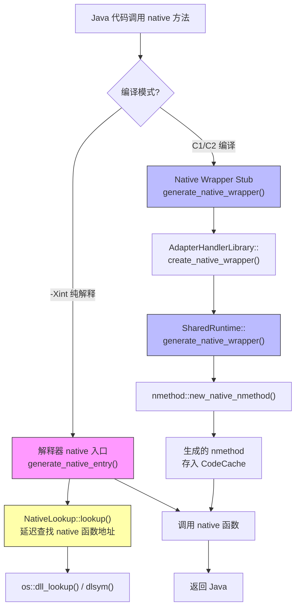
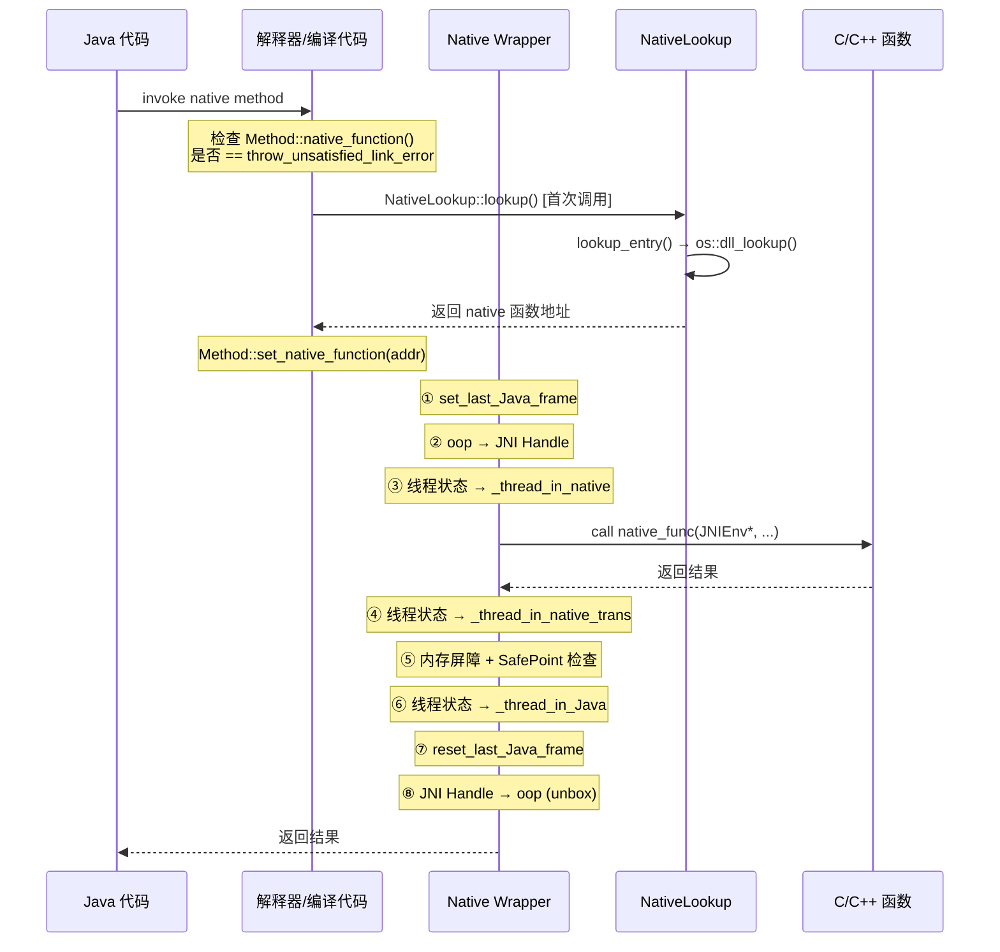

# Day 38: Native Method 调用框架深度剖析

> 纯源码分析，基于 OpenJDK 11 slowdebug
> 方法论：程序 = 数据结构 + 算法

---

## 第 0 部分：核心原理 ⭐

### 0.1 本质是什么？

本文深入分析 **Day 38: Native Method 调用框架深度剖析**：从源码角度理解其设计原理、实现机制和关键细节。

### 0.2 为什么需要？

理解 JVM 内部实现是排查复杂问题、进行性能优化的基础。表面的 API 文档无法解释 JVM 的实际行为，只有深入源码才能建立精确的心智模型。

### 0.3 怎么解决？

结合源码阅读、数据结构分析和 GDB 运行时验证，从多个角度建立对该机制的完整理解。

### 0.4 为什么这样设计？

每个设计决策都有其权衡：性能 vs 正确性、简单性 vs 灵活性、内存占用 vs 查找速度。理解这些权衡是理解 JVM 设计的关键。

---


## 一、宏观理解

### 1.1 解决什么问题

Java 的 `native` 方法是用 C/C++ 实现的，但 JVM 运行在自己的线程状态管理、GC 安全点、JNI 句柄等框架之上。直接调用 C 函数会导致：

1. **GC 不安全**：GC 无法扫描 native 代码持有的 Java 引用
2. **线程状态不一致**：VM 无法在 SafePoint 暂停正在执行 native 代码的线程
3. **栈不可遍历**：GC/profiler 无法 walk native 栈帧
4. **参数格式不匹配**：Java 调用约定 vs C 调用约定（JNIEnv* 额外参数、oop→handle 转换）

Native Method Calling Framework 就是解决这些问题的"翻译层"，它在 Java 和 C 之间插入一个 **wrapper stub**，负责：
- 参数从 Java 格式转为 C 格式（The Grand Shuffle）
- oop → JNI Handle 转换（防止 GC 移动对象后指针悬空）
- 线程状态转换（`_thread_in_Java` → `_thread_in_native` → `_thread_in_native_trans` → `_thread_in_Java`）
- 设置 `JavaFrameAnchor`（让 GC 能 walk 栈）
- 调用后检查 SafePoint / suspend 请求
- 对象引用结果的 unbox（JNI Handle → oop）

### 1.2 两条调用路径



**关键区别**：
- **解释器路径**（`-Xint`）：stub 在 JVM 启动时一次性生成（`generate_native_entry`），所有 native 方法共用同一个入口，native 函数地址从 `Method` 对象动态读取
- **编译器路径**（C1/C2）：每个 native 方法单独生成一个定制的 wrapper nmethod（`generate_native_wrapper`），native 函数地址硬编码在生成的代码中

### 1.3 总体调用链



### 1.4 涉及的数据结构清单

| # | 数据结构 | 源码位置 | 角色 |
|---|---------|---------|------|
| 1 | **JavaFrameAnchor** | `javaFrameAnchor.hpp` + `javaFrameAnchor_x86.hpp` | 保存 Java 侧栈帧信息，让 GC 能 walk native 栈帧 |
| 2 | **JavaThreadState** | `globalDefinitions.hpp:890` | 线程状态枚举，控制 SafePoint 行为 |
| 3 | **JNIHandleBlock** | `jniHandles.hpp:132` | JNI 局部句柄块，管理 native 方法持有的 Java 引用 |
| 4 | **Method（native 部分）** | `method.hpp:1007` | native 函数指针和签名处理器存储在 Method 末尾 |
| 5 | **ThreadStateTransition（RAII 类族）** | `interfaceSupport.inline.hpp:103` | 线程状态转换的 RAII 封装 |
| 6 | **JNI 入口宏** | `interfaceSupport.inline.hpp:515` | `JNI_ENTRY`/`JVM_ENTRY`/`UNSAFE_ENTRY` 宏展开 |
| 7 | **nmethod（native 类型）** | `nmethod.hpp:55` | native wrapper 的编译产物 |
| 8 | **VMRegPair** | `vmreg.hpp:156` | 寄存器对，描述参数在物理寄存器/栈上的位置 |

---

## 二、数据结构全景 ⭐

### 2.1 JavaFrameAnchor（24 字节）

> 源码：`src/hotspot/share/runtime/javaFrameAnchor.hpp:38-97` + `src/hotspot/cpu/x86/javaFrameAnchor_x86.hpp:1-85`

#### 2.1.1 解决什么问题

当 Java 线程进入 native 代码执行时，GC 需要遍历该线程的 Java 栈帧来找到所有 oop 引用。但 native 栈帧不包含 OopMap 信息，GC 无法直接遍历。`JavaFrameAnchor` 就是在进入 native 前保存的"锚点"，记录最后一个 Java 栈帧的 sp/fp/pc，让 GC 从这个锚点开始向上遍历 Java 栈帧。

#### 2.1.2 全部字段

| 偏移 | 字段 | 类型 | 大小 | 含义 |
|------|------|------|------|------|
| 0 | `_last_Java_sp` | `intptr_t* volatile` | 8B | 最后一个 Java 栈帧的栈指针。**是否为 NULL 决定 anchor 是否有效** |
| 8 | `_last_Java_pc` | `volatile address` | 8B | 最后一个 Java 栈帧的 PC（程序计数器）|
| 16 | `_last_Java_fp` | `intptr_t* volatile` | 8B | **x86_64 专属**：最后一个 Java 栈帧的帧指针（rbp）|

**sizeof = 24 字节**（GDB 验证：`sizeof(JavaFrameAnchor) = 24`）

#### 2.1.3 字段生命周期

**`_last_Java_sp`**——最关键的字段：

```
创建时 → 初始化为 NULL（anchor 无效）
    ↓
set_last_Java_frame(rsp, ...) → 设为当前 rsp（anchor 有效）
    此时线程从 _thread_in_Java 转向 _thread_in_native
    ↓
[native 代码执行中 — GC 可以从这个 sp 开始 walk 栈]
    ↓
reset_last_Java_frame() → 清零回 NULL（anchor 无效）
    此时线程已回到 _thread_in_Java
```

**`_last_Java_pc`**——用于精确定位：

```
set_last_Java_frame(..., pc) → 设为 wrapper stub 中的某条指令地址
    ↓
make_walkable() → 如果 pc 为 NULL，从栈帧中恢复（用于 VM→native 场景）
    ↓
reset_last_Java_frame() → 清零
```

**判断 anchor 是否可遍历**（`walkable()` 函数）：

```cpp
// javaFrameAnchor_x86.hpp:56
bool walkable(void) { return _last_Java_sp != NULL && _last_Java_pc != NULL; }
```

**`_last_Java_sp != NULL` 但 `_last_Java_pc == NULL`** 是一个合法中间状态：在 `set_last_Java_frame` 中，sp 先被设置，pc 可以传 NULL（稍后由 `make_walkable()` 补充）。

#### 2.1.4 创建位置

`JavaFrameAnchor` 是 `JavaThread` 的内嵌字段（不是指针）：

```cpp
// thread.hpp:957
JavaFrameAnchor _anchor;  // offset = 888（GDB 验证）
```

#### 2.1.5 在 Native Wrapper 中的使用

**设置**（进入 native 前）——`macroAssembler_x86.cpp:780`：

```cpp
// macroAssembler_x86.cpp:780-804
void MacroAssembler::set_last_Java_frame(Register last_java_sp,
                                         Register last_java_fp,
                                         address  last_java_pc) {
  vzeroupper();                                       // ★ 清理 AVX 状态
  if (!last_java_sp->is_valid()) {
    last_java_sp = rsp;                               // ★ 默认用当前 rsp
  }
  if (last_java_fp->is_valid()) {
    movptr(Address(r15_thread, JavaThread::last_Java_fp_offset()),
           last_java_fp);                             // ★ 存 rbp → _last_Java_fp
  }
  if (last_java_pc != NULL) {
    Address java_pc(r15_thread,
                    JavaThread::frame_anchor_offset() + JavaFrameAnchor::last_Java_pc_offset());
    lea(rscratch1, InternalAddress(last_java_pc));
    movptr(java_pc, rscratch1);                       // ★ 存 pc → _last_Java_pc
  }
  movptr(Address(r15_thread, JavaThread::last_Java_sp_offset()), last_java_sp);
                                                      // ★ 最后写 sp（激活 anchor）
}
```

**设计决策**：`_last_Java_sp` **必须最后写**。因为 GC 线程会用 `_last_Java_sp != NULL` 判断 anchor 是否有效。如果先写 sp 再写 fp/pc，GC 可能看到一个 sp 有效但 fp/pc 还是旧值的 anchor。

**清除**（native 返回后）——`macroAssembler_x86.cpp:766`：

```cpp
// macroAssembler_x86.cpp:766-778
void MacroAssembler::reset_last_Java_frame(bool clear_fp) {
  movptr(Address(r15_thread, JavaThread::last_Java_sp_offset()), NULL_WORD);
                                                      // ★ 先清 sp（使 anchor 无效）
  if (clear_fp) {
    movptr(Address(r15_thread, JavaThread::last_Java_fp_offset()), NULL_WORD);
  }
  movptr(Address(r15_thread, JavaThread::last_Java_pc_offset()), NULL_WORD);
                                                      // ★ 总是清 pc
  vzeroupper();
}
```

---

### 2.2 JavaThreadState（枚举）

> 源码：`src/hotspot/share/utilities/globalDefinitions.hpp:890-903`

#### 2.2.1 解决什么问题

VM 需要知道每个 Java 线程"此刻在做什么"，以便 SafePoint 机制正确工作：
- `_thread_in_Java`：线程在执行 Java 代码，需要 poll safepoint
- `_thread_in_native`：线程在执行 native 代码，**不需要 safepoint 暂停**（native 代码不持有 oop 指针，已通过 JNI Handle 保护）
- `_thread_in_native_trans`：native 返回的过渡状态，**必须检查 safepoint**

#### 2.2.2 全部值

```cpp
// globalDefinitions.hpp:890-903
enum JavaThreadState {
  _thread_uninitialized     =  0,  // 未初始化（不应出现）
  _thread_new               =  2,  // 正在启动
  _thread_new_trans          =  3,  // 过渡（未使用）
  _thread_in_native         =  4,  // ★ 正在执行 native 代码
  _thread_in_native_trans   =  5,  // ★ native→Java 过渡，必须检查 safepoint
  _thread_in_vm             =  6,  // 正在执行 VM 代码
  _thread_in_vm_trans       =  7,  // VM→其他 过渡
  _thread_in_Java           =  8,  // ★ 正在执行 Java 代码
  _thread_in_Java_trans     =  9,  // 过渡（未使用）
  _thread_blocked           = 10,  // 阻塞中
  _thread_blocked_trans     = 11,  // 阻塞→其他 过渡
  _thread_max_state         = 12   // 最大值+1
};
```

#### 2.2.3 在 Native 调用中的状态转换

```
[进入 native wrapper]
  _thread_in_Java (8)
    ↓ movl(thread_state, _thread_in_native)
  _thread_in_native (4)
    ↓ call native_func()
    ↓ [native 执行中 — SafePoint 不等待此线程]
    ↓ native 返回
    ↓ movl(thread_state, _thread_in_native_trans)
  _thread_in_native_trans (5)
    ↓ [内存屏障 / serialize]
    ↓ [检查 SafePoint + suspend_flags]
    ↓ [如果有 SafePoint → 调用 check_special_condition_for_native_trans]
    ↓ movl(thread_state, _thread_in_Java)
  _thread_in_Java (8)
[退出 native wrapper]
```

**为什么需要 `_thread_in_native_trans`**——源码注释（`sharedRuntime_x86_64.cpp:2504-2510`）：

> Java thread A, in `_thread_in_native` state, loads `_not_synchronized` and is preempted.
> VM thread changes sync state to synchronizing and suspends threads for GC.
> Thread A is resumed to finish this native method, but doesn't block here since it
> didn't see any synchronization is progress, and **escapes**.

如果直接从 `_thread_in_native` 跳到 `_thread_in_Java`，线程可能在 GC 运行时逃逸。`_thread_in_native_trans` + 内存屏障确保线程看到最新的 SafePoint 状态。

#### 2.2.4 存储位置

```cpp
// thread.hpp:1011
volatile JavaThreadState _thread_state;  // offset = 1040（GDB 验证）
```

---

### 2.3 JNIHandleBlock（328 字节）

> 源码：`src/hotspot/share/runtime/jniHandles.hpp:132-171`

#### 2.3.1 解决什么问题

native 方法可能需要持有 Java 对象引用（如参数中的 oop、静态方法的 mirror 等）。如果 GC 在 native 执行期间移动了对象，native 代码持有的 raw oop 就变成悬空指针。

解决方案：把 oop 存在 `JNIHandleBlock` 的槽位中，native 代码通过 `jobject`（handle 指针）间接引用。GC 知道 `JNIHandleBlock` 中有 oop，会在 GC 时更新这些槽位。

#### 2.3.2 全部字段

| 偏移 | 字段 | 类型 | 大小 | 含义 |
|------|------|------|------|------|
| 0 | (vtable ptr) | - | 8B | CHeapObj 的虚表指针 |
| 8 | `_handles[32]` | `oop[32]` | 256B | 句柄数组，每个槽位存一个 oop |
| 264 | `_top` | `int` | 4B | 下一个未使用的槽位索引 |
| 272 | `_next` | `JNIHandleBlock*` | 8B | 链表：多个 block 组成链 |
| 280 | `_last` | `JNIHandleBlock*` | 8B | 仅首块使用：链中最后一个 block |
| 288 | `_pop_frame_link` | `JNIHandleBlock*` | 8B | PopLocalFrame 恢复用 |
| 296 | `_free_list` | `oop*` | 8B | 空闲槽位链表（用于槽位回收复用） |
| 304 | `_allocate_before_rebuild` | `int` | 4B | 分配多少 block 后重建 free list |
| 312 | `_planned_capacity` | `size_t` | 8B | 当前 frame 的计划容量（CheckJNICalls） |
| 320 | `_block_list_link` | `JNIHandleBlock*` | 8B | （仅 !PRODUCT）调试用全局链表 |

**sizeof = 328 字节**（GDB 验证：`sizeof(JNIHandleBlock) = 328`）

#### 2.3.3 关键字段生命周期

**`_top`**：

```
native 方法入口 → _top 有值（之前 JNI 调用可能已分配了一些 handle）
  ↓
native wrapper 生成代码中分配 handle：_top++ 指向下一个空槽
  ↓
native 方法返回 → reset_handle_block：
  movl(Address(active_handles, JNIHandleBlock::top_offset_in_bytes()), NULL_WORD);
  // ★ 直接把 _top 设为 0，批量回收所有 local handle
```

**设计决策**：native wrapper 在返回时不需要逐个释放 handle，只需 `_top = 0` 一步回收。这是因为 JNI local handle 的语义就是"在方法返回后自动释放"。

#### 2.3.4 在 Native Wrapper 中的使用

```cpp
// generate_native_wrapper (sharedRuntime_x86_64.cpp:2654-2658)
if (!is_critical_native) {
  // reset handle block
  __ movptr(rcx, Address(r15_thread, JavaThread::active_handles_offset()));
  __ movl(Address(rcx, JNIHandleBlock::top_offset_in_bytes()), (int32_t)NULL_WORD);
}
```

对应偏移：`Thread::_active_handles offset = 232`（GDB 验证）

---

### 2.4 Method（native 部分）

> 源码：`src/hotspot/share/oops/method.hpp:525-536, 1004-1008`

#### 2.4.1 解决什么问题

JVM 需要知道一个 native 方法对应的 C 函数地址在哪里。这个地址存在 `Method` 对象末尾的两个额外 slot 中（**紧跟在 Method 对象之后的内存**，不是 Method 的显式字段）。

#### 2.4.2 存储布局

```
┌──────────────────────┐
│  Method 对象本体       │  sizeof(Method) 字节
│  （常规字段...）       │
├──────────────────────┤ ← (this + 1)
│  native_function     │  8B：native 函数地址
├──────────────────────┤ ← native_function_addr() + 1
│  signature_handler   │  8B：签名处理器地址
└──────────────────────┘
```

```cpp
// method.hpp:1007-1008
address* native_function_addr() const {
  assert(is_native(), "must be native");
  return (address*) (this+1);                // ★ this+1 跳过 Method 本体
}
address* signature_handler_addr() const {
  return native_function_addr() + 1;         // ★ 紧接在 native_function 后面
}
```

#### 2.4.3 `native_function` 的生命周期

```
Method 创建时
  ↓
clear_native_function() → 设为 throw_unsatisfied_link_error_entry
  （所有 native 方法初始都指向"抛 UnsatisfiedLinkError"的 stub）
  ↓
第一次调用此 native 方法
  ↓
InterpreterRuntime::prepare_native_call() / NativeLookup::lookup()
  → os::dll_lookup() → 找到真实 C 函数地址
  ↓
Method::set_native_function(real_address, true)
  → *native_function = real_address
  → 如果已有 compiled code → nm->make_not_entrant()（因为旧 nmethod 可能硬编码了旧地址）
```

```cpp
// method.cpp:803-831
void Method::set_native_function(address function, bool post_event_flag) {
  assert(function != NULL, "use clear_native_function to unregister natives");
  address* native_function = native_function_addr();
  address current = *native_function;
  if (current == function) return;              // ★ 幂等：已绑定则跳过
  if (post_event_flag && JvmtiExport::should_post_native_method_bind() && function != NULL) {
    JvmtiExport::post_native_method_bind(this, &function);  // ★ JVMTI 回调
  }
  *native_function = function;                  // ★ 绑定！
  CompiledMethod* nm = code();
  if (nm != NULL) {
    nm->make_not_entrant();                     // ★ 使旧编译代码失效
  }
}
```

#### 2.4.4 `signature_handler` 的作用

签名处理器是一个生成的代码片段，负责把 Java 参数按照 JNI 签名要求 shuffle 到 C 调用约定的寄存器/栈位置。在解释器路径中，`signature_handler` 被直接 `call`（`templateInterpreterGenerator_x86.cpp:959`）。

---

### 2.5 ThreadStateTransition（RAII 类族）

> 源码：`src/hotspot/share/runtime/interfaceSupport.inline.hpp:103-294`

#### 2.5.1 解决什么问题

线程状态转换必须遵循特定协议：
- 某些转换需要内存屏障
- 从 `_thread_in_native` 转出必须检查 SafePoint
- 转换顺序不能颠倒

用 RAII 模式封装，确保构造函数做"进入"转换，析构函数做"退出"转换，不会遗漏。

#### 2.5.2 类族继承关系

```
ThreadStateTransition（基类：static 工具方法）
  ├── ThreadInVMfromNative     （native → VM → native）
  ├── ThreadToNativeFromVM     （VM → native → VM）
  ├── ThreadInVMfromJava       （Java → VM → Java）
  ├── ThreadBlockInVM          （VM → blocked → VM）
  └── JavaThreadInObjectWaitState（设置 Java 层线程状态）
```

#### 2.5.3 ThreadInVMfromNative（最关键）

**用于**：native 代码需要调用 VM 函数时（`JNI_ENTRY` / `JVM_ENTRY` 宏内使用）

```cpp
// interfaceSupport.inline.hpp:266-274
class ThreadInVMfromNative : public ThreadStateTransition {
 public:
  ThreadInVMfromNative(JavaThread* thread) : ThreadStateTransition(thread) {
    trans_from_native(_thread_in_vm);
    //  ★ 构造函数：_thread_in_native → _thread_in_vm
  }
  ~ThreadInVMfromNative() {
    trans_and_fence(_thread_in_vm, _thread_in_native);
    //  ★ 析构函数：_thread_in_vm → _thread_in_native
  }
};
```

**`trans_from_native()` 的核心逻辑**（`interfaceSupport.inline.hpp:158-177`）：

```cpp
// interfaceSupport.inline.hpp:158-177
static inline void transition_from_native(JavaThread *thread, JavaThreadState to) {
  assert(thread->thread_state() == _thread_in_native, "coming from wrong state");
  assert((to & 1) == 0, "odd numbers are NP unsafe states");

  // ★ 第1步：设为过渡状态
  thread->set_thread_state(_thread_in_native_trans);

  // ★ 第2步：内存屏障（确保状态写入对 VM thread 可见）
  if (os::is_MP()) {
    if (UseMembar) {
      OrderAccess::fence();
    } else {
      InterfaceSupport::serialize_memory(thread);
    }
  }

  // ★ 第3步：检查 SafePoint
  if (SafepointMechanism::poll(thread)) {
    JavaThread::check_safepoint_and_suspend_for_native_trans(thread);
  }

  // ★ 第4步：设为目标状态
  thread->set_thread_state(to);
}
```

**设计决策**：为什么需要 `_thread_in_native_trans` 中间状态？

答案在 `sharedRuntime_x86_64.cpp:2504-2510` 的注释已解释：如果线程直接从 `_thread_in_native` 跳到目标状态，可能错过 GC 的 SafePoint 同步请求，造成线程"逃逸"。

#### 2.5.4 ThreadToNativeFromVM

**用于**：VM 代码需要调用 native 函数时

```cpp
// interfaceSupport.inline.hpp:277-294
class ThreadToNativeFromVM : public ThreadStateTransition {
 public:
  ThreadToNativeFromVM(JavaThread *thread) : ThreadStateTransition(thread) {
    assert(thread->thread_state() == _thread_in_vm, "coming from wrong state");
    thread->frame_anchor()->make_walkable(thread);  // ★ 确保栈可遍历
    trans_and_fence(_thread_in_vm, _thread_in_native);
    // ★ _thread_in_vm → _thread_in_native（带 fence）
  }
  ~ThreadToNativeFromVM() {
    trans_from_native(_thread_in_vm);
    // ★ _thread_in_native → _thread_in_vm（检查 SafePoint）
  }
};
```

**关键**：构造函数中调用 `frame_anchor()->make_walkable(thread)` —— 在进入 native 前确保 `_last_Java_pc` 不为 NULL，使 GC 能 walk 栈。

---

### 2.6 JNI 入口宏

> 源码：`src/hotspot/share/runtime/interfaceSupport.inline.hpp:515-603`

#### 2.6.1 解决什么问题

每个 JNI / VM 入口函数都需要：
1. 获取 `JavaThread*`
2. 做线程状态转换
3. 设置异常保护
4. 进入/退出时做必要的检查

用宏封装，避免每个函数重复写。

#### 2.6.2 JNI_ENTRY 展开

```cpp
// interfaceSupport.inline.hpp:558-571
#define JNI_ENTRY(result_type, header)                       \
    JNI_ENTRY_NO_PRESERVE(result_type, header)               \
    WeakPreserveExceptionMark __wem(thread);

#define JNI_ENTRY_NO_PRESERVE(result_type, header)           \
extern "C" {                                                 \
  result_type JNICALL header {                               \
    JavaThread* thread=JavaThread::thread_from_jni_environment(env);  \
    // ★ 从 JNIEnv* 反推 JavaThread*
    assert( !VerifyJNIEnvThread || JNIEnv_from_JavaThread(thread) == env, \
           "JNIEnv is only valid in same thread");           \
    ThreadInVMfromNative __tiv(thread);                      \
    // ★ RAII：native → VM
    VMNativeEntryWrapper __vew;                              \
    // ★ 嵌套 debug wrapper
```

**`thread_from_jni_environment`**——从 JNIEnv* 反推 JavaThread*：

```cpp
// thread.hpp:1789-1790
static JavaThread* thread_from_jni_environment(JNIEnv* env) {
  JavaThread *thread_from_jni_env = (JavaThread*)((intptr_t)env - in_bytes(jni_environment_offset()));
  // ★ _jni_environment 在 JavaThread 中 offset = 920
  // ★ env 指向 _jni_environment，减去 offset 就得到 JavaThread*
```

**设计决策**：`JNIEnv*` 实际就是 `&thread->_jni_environment`，通过偏移运算就能得到 `JavaThread*`，不需要额外的查表操作。这是 HotSpot 的经典 trick。

#### 2.6.3 JVM_ENTRY / UNSAFE_ENTRY

```cpp
// interfaceSupport.inline.hpp:530
#define JVM_ENTRY(result_type, header)                       \
extern "C" {                                                 \
  result_type JNICALL header (                               \
    JNIEnv* env, jclass cls, TRAPS) {                        \
    JavaThread* thread=JavaThread::thread_from_jni_environment(env); \
    ThreadInVMfromNative __tiv(thread);                      \
    VMNativeEntryWrapper __vew;                              \
    HandleMarkCleaner __hm(thread);                          \
    Thread* THREAD = thread;                                 \
    ...
```

`UNSAFE_ENTRY` 本质上等同于 `JVM_ENTRY`，它是 `Unsafe` 类 native 方法的入口（如 `Unsafe_Park`、`Unsafe_Unpark`）。

---

### 2.7 nmethod（native 类型）

> 源码：`src/hotspot/share/code/nmethod.hpp:55-266`

#### 2.7.1 解决什么问题

编译器路径（非 `-Xint`）为每个 native 方法生成一个定制的 native wrapper stub。这个 stub 需要存储在 CodeCache 中供反复使用。`nmethod` 就是 wrapper stub 在 CodeCache 中的表示。

#### 2.7.2 关键字段（与 native wrapper 相关）

| 字段 | 含义 |
|------|------|
| `_entry_point` | 入口（带 inline cache 检查）|
| `_verified_entry_point` | 已验证入口（跳过 IC 检查）= vep_offset 处 |
| `_exception_offset` | 异常处理入口偏移 |

**sizeof = 392 字节**（GDB 验证）

#### 2.7.3 创建位置

```cpp
// nmethod.cpp:431-446
nmethod* nmethod::new_native_nmethod(const methodHandle& method,
  int compile_id,
  CodeBuffer *code_buffer,
  int vep_offset,            // verified entry point 偏移
  int frame_complete,        // 帧构建完成位置
  int frame_size,            // 帧大小（word 数）
  ByteSize basic_lock_owner_sp_offset,
  ByteSize basic_lock_sp_offset,
  OopMapSet* oop_maps) {
  code_buffer->finalize_oop_references(method);
  nmethod* nm = NULL;
  {
    MutexLockerEx mu(CodeCache_lock, Mutex::_no_safepoint_check_flag);
    int native_nmethod_size = CodeBlob::allocation_size(code_buffer, sizeof(nmethod));
    // ★ 在 CodeCache 中分配
    ...
```

---

### 2.8 VMRegPair

> 源码：`src/hotspot/share/code/vmreg.hpp:156-186`

#### 2.8.1 解决什么问题

Java 参数和 C 参数可能在寄存器中，也可能在栈上。需要一个统一的描述方式来表示"这个参数在哪里"。

#### 2.8.2 全部字段

```cpp
// vmreg.hpp:156-164
class VMRegPair {
private:
  VMReg _second;    // 8B：第二个半寄存器（LP64 的宽值用两个 slot）
  VMReg _first;     // 8B：第一个半寄存器
public:
  void set_bad() { _second=VMRegImpl::Bad(); _first=VMRegImpl::Bad(); }
  void set1(VMReg v) { _second=VMRegImpl::Bad(); _first=v; }  // 单 slot
  void set2(VMReg v) { _second=v->next(); _first=v; }         // 双 slot
  void set_ptr(VMReg ptr) { _second=ptr->next(); _first=ptr; } // LP64 指针
};
```

**用途**：`generate_native_wrapper` 中，`in_regs[]` 数组描述 Java 参数的位置，`out_regs[]` 数组描述 C 参数的目标位置。"The Grand Shuffle" 就是把 `in_regs` 映射到 `out_regs`。

---

## 三、算法/流程分析

### 3.1 NativeLookup::lookup —— native 函数延迟查找

#### 3.1.1 解决什么问题

Java 的 `native` 方法声明时不指定 C 函数的地址。JVM 需要在**第一次调用时**动态查找对应的 C 函数。查找规则遵循 JNI 规范：先尝试短名称（`Java_pkg_Class_method`），再尝试长名称（带参数签名的 `Java_pkg_Class_method__sig`）。

#### 3.1.2 核心思路

1. 系统类（`boot class loader`）→ `os::dll_lookup(libjava.so, jni_name)` 
2. 用户类 → `ClassLoader.findNative(classLoader, jni_name)`
3. JVMTI agent 库 → 遍历 agent list

#### 3.1.3 入口：NativeLookup::lookup()

```cpp
// nativeLookup.cpp:532-546
address NativeLookup::lookup(const methodHandle& method, bool& in_base_library, TRAPS) {
  // ★ 第 1 步：非 JNI 方法特殊处理
  if (!method->has_native_function()) {
    address entry = lookup_critical_style(method, in_base_library);  // critical native
    if (entry != NULL) return entry;
  }
  // ★ 第 2 步：标准 JNI 查找
  address entry = lookup_base(method, in_base_library, CHECK_NULL);
  if (entry != NULL) return entry;
  // ★ 第 3 步：失败 → 抛 UnsatisfiedLinkError
  ResourceMark rm(THREAD);
  // ... 构造错误消息并抛出
}
```

#### 3.1.4 核心查找：NativeLookup::lookup_entry()

```cpp
// nativeLookup.cpp:327-350
static address lookup_entry(const methodHandle& method, bool& in_base_library, TRAPS) {
  address entry = NULL;
  // ★ 先尝试短 JNI 名称：Java_pkg_Class_method
  entry = lookup_style(method, pure_jni_name(method), "",
                       args_size(method), true, in_base_library, CHECK_NULL);
  if (entry != NULL) return entry;

  // ★ 再尝试长 JNI 名称：Java_pkg_Class_method__sig
  entry = lookup_style(method, pure_jni_name(method), long_jni_name(method),
                       args_size(method), true, in_base_library, CHECK_NULL);
  return entry;
}
```

#### 3.1.5 实际查找：NativeLookup::lookup_style()

```cpp
// nativeLookup.cpp:253-302
static address lookup_style(const methodHandle& method, char* pure_name, const char* long_name,
                            int args_size, bool os_style, bool& in_base_library, TRAPS) {
  address entry;
  // ★ 构造 JNI 函数名
  stringStream st;
  if (os_style) os::print_jni_name_prefix_on(&st, args_size);
  st.print_raw(pure_name);
  st.print_raw(long_name);
  if (os_style) os::print_jni_name_suffix_on(&st, args_size);
  char* jni_name = st.as_string();

  // ★ 路径 1：系统类 → os::dll_lookup
  if (loader == NULL) {
    entry = lookup_special_native(jni_name);    // JVM 内建函数
    if (entry == NULL) {
      entry = (address) os::dll_lookup(os::native_java_library(), jni_name);
      // ★ libjava.so / libjava.dylib 中查找
    }
    if (entry != NULL) {
      in_base_library = true;
      return entry;
    }
  }

  // ★ 路径 2：用户类 → ClassLoader.findNative()
  entry = (address) Java::call_method_helper(
    vmClasses::ClassLoader_klass(), "findNative", /* ... */, jni_name, loader);
  if (entry != NULL) return entry;

  // ★ 路径 3：JVMTI agent 库
  for (AgentLibrary* agent = Arguments::agents(); agent != NULL; agent = agent->next()) {
    entry = (address) os::dll_lookup(agent->os_lib(), jni_name);
    if (entry != NULL) return entry;
  }
  return NULL;
}
```

**绑定成功后**：

```cpp
// nativeLookup.cpp:345-349 (lookup_entry 的后续)
method->set_native_function(entry, Method::native_bind_event_is_interesting);
// ★ 绑定到 Method 对象，后续调用直接用
```

---

### 3.2 解释器 Native 入口 —— generate_native_entry()

> 源码：`templateInterpreterGenerator_x86.cpp:784-1233`（约 450 行）

#### 3.2.1 解决什么问题

在 `-Xint` 模式下，所有 native 方法共用一个"通用 native 入口 stub"。这个 stub 在 JVM 启动时生成一次，存在解释器代码区。它需要：
- 动态读取 `Method` 对象的 `native_function` 和 `signature_handler`
- 通用化处理所有签名类型

#### 3.2.2 核心思路

1. 构建解释器栈帧
2. 调用 signature_handler 把参数 shuffle 到 C 调用约定
3. 延迟查找 native 函数地址（首次调用时调 `InterpreterRuntime::prepare_native_call`）
4. 设置 JNIEnv* + last_Java_frame + 线程状态
5. `call rax`（native 函数）
6. 恢复线程状态 + safepoint 检查 + handle block 清理

#### 3.2.3 关键阶段

**阶段 1：获取 signature_handler**（`line 932-945`）

```cpp
// templateInterpreterGenerator_x86.cpp:932-945
{
  Label L;
  __ movptr(t, Address(method, Method::signature_handler_offset()));
  __ testptr(t, t);
  __ jcc(Assembler::notZero, L);             // ★ 已有 handler → 跳过
  __ call_VM(noreg,
             CAST_FROM_FN_PTR(address, InterpreterRuntime::prepare_native_call),
             method);                         // ★ 首次调用 → 生成并绑定 handler
  __ get_method(method);
  __ movptr(t, Address(method, Method::signature_handler_offset()));
  __ bind(L);
}
```

**阶段 2：获取 native 函数地址**（`line 991-1005`）

```cpp
// templateInterpreterGenerator_x86.cpp:991-1005
{
  Label L;
  __ movptr(rax, Address(method, Method::native_function_offset()));
  ExternalAddress unsatisfied(SharedRuntime::native_method_throw_unsatisfied_link_error_entry());
  __ cmpptr(rax, unsatisfied.addr());
  __ jcc(Assembler::notEqual, L);            // ★ 已绑定 → 跳过
  __ call_VM(noreg,
             CAST_FROM_FN_PTR(address, InterpreterRuntime::prepare_native_call),
             method);                         // ★ 延迟查找（内部调 NativeLookup::lookup）
  __ get_method(method);
  __ movptr(rax, Address(method, Method::native_function_offset()));
  __ bind(L);
}
```

**阶段 3：线程状态转换 + 调用**（`line 1007-1043`）

```cpp
// line 1018
__ lea(c_rarg0, Address(r15_thread, JavaThread::jni_environment_offset()));
                                              // ★ JNIEnv* = &thread->_jni_environment
// line 1022
__ set_last_Java_frame(rsp, rbp, (address) __ pc());
                                              // ★ 设置 JavaFrameAnchor
// line 1039-1040
__ movl(Address(thread, JavaThread::thread_state_offset()), _thread_in_native);
                                              // ★ 进入 native 状态
// line 1043
__ call(rax);                                 // ★ 调用 native 函数！
```

**阶段 4：native 返回 → 恢复**（`line 1086-1166`）

```cpp
// line 1088-1089
__ movl(Address(thread, JavaThread::thread_state_offset()), _thread_in_native_trans);
                                              // ★ 进入过渡状态

// line 1091-1104
if (os::is_MP()) {
  if (UseMembar) {
    __ membar(Assembler::Membar_mask_bits(...));
                                              // ★ 内存屏障
  } else {
    __ serialize_memory(thread, rcx);         // ★ 写序列化页面
  }
}

// line 1113-1151
__ safepoint_poll(slow_path, r15_thread, rscratch1);
                                              // ★ 检查 SafePoint
__ cmpl(Address(thread, JavaThread::suspend_flags_offset()), 0);
__ jcc(Assembler::equal, Continue);
                                              // ★ 检查 suspend 请求
// slow_path → check_special_condition_for_native_trans

// line 1154
__ movl(Address(thread, JavaThread::thread_state_offset()), _thread_in_Java);
                                              // ★ 回到 Java 状态

// line 1157
__ reset_last_Java_frame(thread, true);       // ★ 清除 anchor

// line 1165-1166
__ movptr(t, Address(thread, JavaThread::active_handles_offset()));
__ movl(Address(t, JNIHandleBlock::top_offset_in_bytes()), (int32_t)NULL_WORD);
                                              // ★ 重置 handle block
```

---

### 3.3 编译器 Native Wrapper —— generate_native_wrapper()

> 源码：`sharedRuntime_x86_64.cpp:1855-2799`（约 950 行）

#### 3.3.1 解决什么问题

与解释器通用入口不同，编译器为每个 native 方法生成**定制化**的 wrapper：
- native 函数地址硬编码（无需动态查找）
- 参数 shuffle 是编译时确定的（无需运行时 signature_handler）
- 可以内联某些 intrinsic（如 `Object.hashCode`）

#### 3.3.2 核心思路

约 950 行代码可分为 **10 个阶段**：

| 阶段 | 行号 | 功能 |
|------|------|------|
| 1 | 1862-1882 | MethodHandle intrinsic 快速路径 |
| 2 | 1883-1964 | C 调用约定参数计算（插入 JNIEnv* + 可选 jclass） |
| 3 | 1966-2071 | 帧大小计算 + 栈布局规划 |
| 4 | 2073-2134 | IC 检查 + verified entry + stack overflow + 创建帧 |
| 5 | 2159-2312 | **The Grand Shuffle**：Java 参数 → C 参数 |
| 6 | 2316-2350 | 静态方法 mirror handle + set_last_Java_frame |
| 7 | 2380-2464 | synchronized 方法加锁 + JNIEnv* + 进入 native 状态 + **call** |
| 8 | 2466-2573 | native 返回处理 + 状态转换 + SafePoint 检查 |
| 9 | 2576-2662 | reguard + 解锁 + reset_last_Java_frame + handle block 重置 |
| 10 | 2664-2797 | 异常检查 + ret + 慢路径 + nmethod 创建 |

#### 3.3.3 阶段 3：Native Wrapper 栈帧布局

源码注释（`sharedRuntime_x86_64.cpp:2044-2063`）精确描述了栈帧结构：

```
 FP-> |                     |
      |---------------------|
      | 2 slots for moves   |      ← 临时存储（return value / shuffle 临时值）
      |---------------------|
      | lock box (if sync)  |      ← synchronized 方法的 BasicLock
      |---------------------| <- lock_slot_offset
      | klass (if static)   |      ← 静态方法的 mirror oop handle
      |---------------------| <- klass_slot_offset
      | oopHandle area      |      ← 6 个 Java 寄存器参数的 oop handle
      |---------------------| <- oop_handle_offset
      | outbound memory     |      ← C 函数的栈参数
      | based arguments     |
      |                     |
      |---------------------|
      |                     |
 SP-> | out_preserved_slots |      ← ABI 要求的保留区
```

#### 3.3.4 阶段 5：The Grand Shuffle

**设计决策**：为什么从后往前 shuffle？

```cpp
// sharedRuntime_x86_64.cpp:2168-2173
// The Java calling convention is either equal (linux) or denser (win64) than the
// c calling convention. However because of the jni_env argument the c calling
// convention always has at least one more (and two for static) arguments than Java.
// Therefore if we move the args from java -> c BACKWARDS then we will never have
// a register->register conflict and we don't have to build a dependency graph
// and figure out how to break any cycles.
```

C 调用约定比 Java 多 1-2 个参数（JNIEnv* + 可选 jclass），所以 C 的参数位置总是"右移"的。如果**从后往前**移动参数，每个目标位置都不会与尚未处理的源位置冲突，无需构建依赖图。

```cpp
// sharedRuntime_x86_64.cpp:2220-2224
if (!is_critical_native) {
  for (int i = total_in_args - 1, c_arg = total_c_args - 1; i >= 0; i--, c_arg--) {
    arg_order.push(i);
    arg_order.push(c_arg);                   // ★ 从后往前匹配
  }
}
```

对每种参数类型调用对应的移动函数：

```cpp
// sharedRuntime_x86_64.cpp:2261-2311
switch (in_sig_bt[i]) {
  case T_ARRAY:    // → 如果 critical_native 则 unpack；否则 fall through
  case T_OBJECT:   object_move(masm, map, ...);   break;  // ★ oop → handle
  case T_FLOAT:    float_move(masm, ...);          break;
  case T_DOUBLE:   double_move(masm, ...);         break;
  case T_LONG:     long_move(masm, ...);           break;
  default:         move32_64(masm, ...);                   // int 类型
}
```

**`object_move`** 是最复杂的——它需要：
1. 把 oop 存到栈上的 handle 区域
2. 把 handle 区域的地址（而非 oop 本身）传给 C 函数
3. 在 OopMap 中标记这个栈位置有 oop

#### 3.3.5 阶段 7：核心调用序列

```cpp
// sharedRuntime_x86_64.cpp:2456-2464
// get JNIEnv* which is first argument to native
if (!is_critical_native) {
  __ lea(c_rarg0, Address(r15_thread, in_bytes(JavaThread::jni_environment_offset())));
  // ★ c_rarg0 = rdi = &thread->_jni_environment (offset 920)
}

// Now set thread in native
__ movl(Address(r15_thread, JavaThread::thread_state_offset()), _thread_in_native);
// ★ _thread_state = 4 (offset 1040)

__ call(RuntimeAddress(native_func));
// ★ 调用 native 函数！地址硬编码在生成的代码中
```

#### 3.3.6 阶段 8：Native 返回协议

```cpp
// sharedRuntime_x86_64.cpp:2511
__ movl(Address(r15_thread, JavaThread::thread_state_offset()), _thread_in_native_trans);
// ★ 进入过渡状态

// sharedRuntime_x86_64.cpp:2513-2526
if (os::is_MP()) {
  if (UseMembar) {
    __ membar(Assembler::Membar_mask_bits(
         Assembler::LoadLoad | Assembler::LoadStore |
         Assembler::StoreLoad | Assembler::StoreStore));
    // ★ full fence，确保 _thread_state 写入对 VM thread 可见
  } else {
    __ serialize_memory(r15_thread, rcx);
    // ★ 写序列化页面（旧平台 fallback）
  }
}

// sharedRuntime_x86_64.cpp:2535-2570
__ safepoint_poll(slow_path, r15_thread, rscratch1);
// ★ 检查 SafePoint（读 polling page）
__ cmpl(Address(r15_thread, JavaThread::suspend_flags_offset()), 0);
__ jcc(Assembler::equal, Continue);
// ★ 检查 suspend 请求（offset 216）
__ bind(slow_path);
// → 调用 JavaThread::check_special_condition_for_native_trans
//   该函数会阻塞直到 SafePoint 结束

// sharedRuntime_x86_64.cpp:2573
__ movl(Address(r15_thread, JavaThread::thread_state_offset()), _thread_in_Java);
// ★ 回到 Java 状态
```

#### 3.3.7 阶段 9-10：清理与返回

```cpp
// sharedRuntime_x86_64.cpp:2640
__ reset_last_Java_frame(false);             // ★ 清除 anchor

// sharedRuntime_x86_64.cpp:2643-2647
if (ret_type == T_OBJECT || ret_type == T_ARRAY) {
  __ resolve_jobject(rax, r15_thread, rcx);  // ★ JNI Handle → oop
}

// sharedRuntime_x86_64.cpp:2654-2658
if (!is_critical_native) {
  __ movptr(rcx, Address(r15_thread, JavaThread::active_handles_offset()));
  __ movl(Address(rcx, JNIHandleBlock::top_offset_in_bytes()), (int32_t)NULL_WORD);
  // ★ 重置 handle block
}

// sharedRuntime_x86_64.cpp:2664-2672
if (!is_critical_native) {
  __ cmpptr(Address(r15_thread, in_bytes(Thread::pending_exception_offset())), (int32_t)NULL_WORD);
  __ jcc(Assembler::notEqual, exception_pending);
  // ★ 如果有待处理异常 → 跳转到异常处理
}

__ ret(0);                                    // ★ 正常返回
```

---

### 3.4 解释器 vs 编译器路径对比

| 特性 | 解释器 (`generate_native_entry`) | 编译器 (`generate_native_wrapper`) |
|------|:---:|:---:|
| 入口数量 | 1 个（所有 native 共用） | 每个 native 方法 1 个 |
| native 函数地址 | 运行时从 Method 动态读取 | 硬编码在生成的代码中 |
| 参数 shuffle | 运行时调 signature_handler | 编译时确定的 move 序列 |
| 存储位置 | 解释器代码区 | CodeCache（nmethod） |
| 触发条件 | `-Xint` 或首次调用 | C1/C2 编译 native 方法时 |
| `NativeLookup::lookup` | 在 stub 中动态调用 | 在 `create_native_wrapper` 前已查找 |

---

## 四、GDB 验证

### 4.1 验证计划

| # | 验证项 | 方法 | 预期值 |
|---|--------|------|--------|
| 1 | `sizeof(JavaFrameAnchor)` | GDB `sizeof` | 24 |
| 2 | `sizeof(JNIHandleBlock)` | GDB `sizeof` | 328 |
| 3 | `sizeof(JNIEnv)` | GDB `sizeof` | 8（只是一个函数表指针） |
| 4 | `sizeof(nmethod)` | GDB `sizeof` | 392 |
| 5 | `JavaThread::_anchor offset` | GDB | 888 |
| 6 | `JavaThread::_thread_state offset` | GDB | 1040 |
| 7 | `JavaThread::_jni_environment offset` | GDB | 920 |
| 8 | `Thread::_active_handles offset` | GDB | 232 |
| 9 | `Thread::_suspend_flags offset` | GDB | 216 |
| 10 | `JavaFrameAnchor::_last_Java_sp offset` | GDB | 0 |
| 11 | `JavaFrameAnchor::_last_Java_pc offset` | GDB | 8 |
| 12 | `JavaFrameAnchor::_last_Java_fp offset` | GDB | 16 |
| 13 | `JNIHandleBlock::_handles offset` | GDB | 8 |
| 14 | `JNIHandleBlock::_top offset` | GDB | 264 |
| 15 | `JNIHandleBlock::_next offset` | GDB | 272 |
| 16 | `-Xint` 模式 NativeLookup::lookup 调用数 | 断点计数 | > 0 |
| 17 | `-Xint` 模式 create_native_wrapper 调用数 | 断点计数 | 0 |
| 18 | 编译模式 create_native_wrapper 调用数 | 断点计数 | > 0 |
| 19 | generate_native_wrapper == new_native_nmethod 1:1 | 断点计数 | 相等 |

### 4.2 验证结果

#### sizeof / offset 验证（GDB 脚本：`verify_sizeof.gdb`）

```
=== sizeof 验证 ===
sizeof(JavaFrameAnchor) = 24            ✅
sizeof(JNIHandleBlock) = 328            ✅
sizeof(JNIEnv) = 8                      ✅
sizeof(nmethod) = 392                   ✅

=== JavaThread offset 验证 ===
JavaThread::_anchor offset = 888        ✅
JavaThread::_thread_state offset = 1040 ✅
JavaThread::_jni_environment offset = 920 ✅
JavaThread::_active_handles offset = 232 ✅ (from Thread)
JavaThread::_suspend_flags offset = 216  ✅ (from Thread)

=== JavaFrameAnchor field offsets ===
_last_Java_sp offset = 0               ✅
_last_Java_pc offset = 8               ✅
_last_Java_fp offset = 16              ✅（补充验证）

=== JNIHandleBlock field offsets ===
_handles offset = 8                     ✅（跳过 vtable ptr）
_top offset = 264                       ✅（8 + 32*8 = 264）
_next offset = 272                      ✅（264 + 4 padding + 4 = 272）
```

**全部 15 项 sizeof/offset 验证通过 ✅**

#### 运行时断点验证（GDB 脚本：`verify_xint.gdb` + `verify_runtime6.gdb`）

**`-Xint` 模式**：
```
NativeLookup::lookup   = 88            ✅（native 方法延迟查找）
create_native_wrapper  = 0             ✅（解释模式不走编译路径）
```

**编译模式**（`-XX:TieredStopAtLevel=1`）：
```
NativeLookup::lookup    = 103          ✅（比 -Xint 多，因为编译时也需要查找）
create_native_wrapper   = 90           ✅（编译器为 native 方法生成 wrapper）
generate_native_wrapper = 90           ✅（与 create_native_wrapper 1:1）
new_native_nmethod      = 90           ✅（与 generate_native_wrapper 1:1）
```

**全部 4 项运行时断点验证通过 ✅**

---

## 五、数据结构关系图

```mermaid
graph TB
    subgraph "JavaThread (1888B)"
        JT_anchor["_anchor (JavaFrameAnchor)<br/>offset=888, 24B"]
        JT_env["_jni_environment (JNIEnv)<br/>offset=920, 8B"]
        JT_state["_thread_state<br/>offset=1040"]
        JT_handles["_active_handles<br/>offset=232 (from Thread)"]
        JT_suspend["_suspend_flags<br/>offset=216 (from Thread)"]
    end

    subgraph "JavaFrameAnchor (24B)"
        JFA_sp["_last_Java_sp (8B)<br/>offset=0"]
        JFA_pc["_last_Java_pc (8B)<br/>offset=8"]
        JFA_fp["_last_Java_fp (8B)<br/>offset=16"]
    end

    subgraph "JNIHandleBlock (328B)"
        JHB_handles["_handles[32] (256B)<br/>offset=8"]
        JHB_top["_top (4B)<br/>offset=264"]
        JHB_next["_next (8B)<br/>offset=272"]
    end

    subgraph "Method"
        M_body["Method 常规字段"]
        M_native["native_function (8B)<br/>@ this+1"]
        M_sig["signature_handler (8B)<br/>@ native_function+1"]
    end

    subgraph "JavaThreadState"
        S_java["_thread_in_Java (8)"]
        S_native["_thread_in_native (4)"]
        S_trans["_thread_in_native_trans (5)"]
    end

    subgraph "生成的代码"
        INTERP["解释器 native entry<br/>(generate_native_entry)"]
        WRAPPER["Native Wrapper nmethod<br/>(generate_native_wrapper)"]
    end

    JT_anchor --> JFA_sp
    JT_anchor --> JFA_pc
    JT_anchor --> JFA_fp
    JT_handles --> JHB_handles
    JT_state --> S_java
    JT_state --> S_native
    JT_state --> S_trans

    JT_env -->|"JNIEnv* = &_jni_environment<br/>native 第一个参数"| WRAPPER
    JT_env -->|"JNIEnv* = &_jni_environment"| INTERP

    M_native -->|"延迟查找<br/>NativeLookup::lookup"| INTERP
    M_native -->|"硬编码地址"| WRAPPER
    M_sig -->|"参数 shuffle"| INTERP

    WRAPPER -->|"nmethod::new_native_nmethod"| CodeCache["CodeCache"]
    INTERP -->|"启动时一次性生成"| InterpCode["Interpreter Code"]

    S_java -->|"set_last_Java_frame<br/>movl(_thread_in_native)"| S_native
    S_native -->|"native 返回<br/>movl(_thread_in_native_trans)"| S_trans
    S_trans -->|"fence + safepoint check<br/>movl(_thread_in_Java)"| S_java

    style JT_anchor fill:#ffa,stroke:#333
    style JT_state fill:#ffa,stroke:#333
    style JT_env fill:#ffa,stroke:#333
    style M_native fill:#f9f,stroke:#333
    style S_trans fill:#f66,stroke:#333
```



---

## 六、总结

### 6.1 数据结构层面

| 数据结构 | sizeof | 核心特征 |
|---------|--------|---------|
| **JavaFrameAnchor** | 24B | 3 个字段（sp/pc/fp），sp 最后写/最先清，是 anchor 有效性标志 |
| **JavaThreadState** | enum | 12 个状态值，native 调用涉及 3 个：`_thread_in_Java`(8) → `_thread_in_native`(4) → `_thread_in_native_trans`(5) |
| **JNIHandleBlock** | 328B | 32 个 oop 槽位 + 链表，`_top=0` 批量回收 |
| **Method（native 部分）** | 2×8B 额外 | native_function + signature_handler 存在 `(this+1)` 位置 |
| **ThreadStateTransition** | RAII 类 | 构造/析构自动做状态转换，`ThreadInVMfromNative` 最常用 |
| **JNI 入口宏** | 宏展开 | `JNI_ENTRY` = `thread_from_jni_environment` + `ThreadInVMfromNative` + 异常保护 |
| **nmethod（native）** | 392B | native wrapper 的 CodeCache 载体，通过 `new_native_nmethod` 创建 |
| **VMRegPair** | 16B | 描述参数在物理寄存器/栈上的位置（first + second） |

### 6.2 算法层面

| 算法 | 核心设计决策 |
|------|------------|
| **NativeLookup::lookup** | 延迟查找（首次调用才查），先短名再长名，系统类→`os::dll_lookup`，用户类→`ClassLoader.findNative` |
| **解释器 native 入口** | 通用 stub（一个入口服务所有 native 方法），运行时读 Method 获取 native 地址和 signature_handler |
| **编译器 native wrapper** | 定制化 stub（每方法一个），native 地址硬编码，参数 shuffle 编译时确定 |
| **The Grand Shuffle** | 从后往前移动参数避免寄存器冲突，无需依赖图 |
| **线程状态转换协议** | `_thread_in_Java` → `_thread_in_native`（直接写）→ `_thread_in_native_trans`（native 返回后）→ fence → safepoint check → `_thread_in_Java` |
| **`_thread_in_native_trans` 存在意义** | 防止线程在 GC SafePoint 运行时"逃逸"——必须在过渡状态做 fence + poll |
| **JNIEnv* 反推 JavaThread*** | `env` 就是 `&thread->_jni_environment`，减去固定偏移(920)得到 `thread`，O(1) |
| **set_last_Java_frame 写入顺序** | sp 最后写（因为 GC 用 `sp!=NULL` 判断 anchor 有效），pc/fp 先写 |
