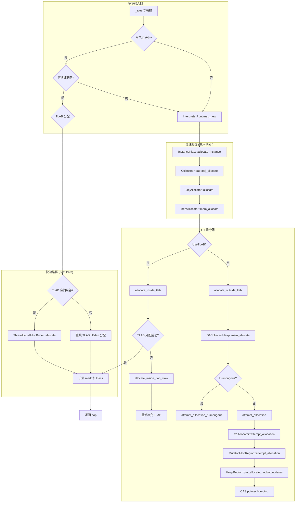
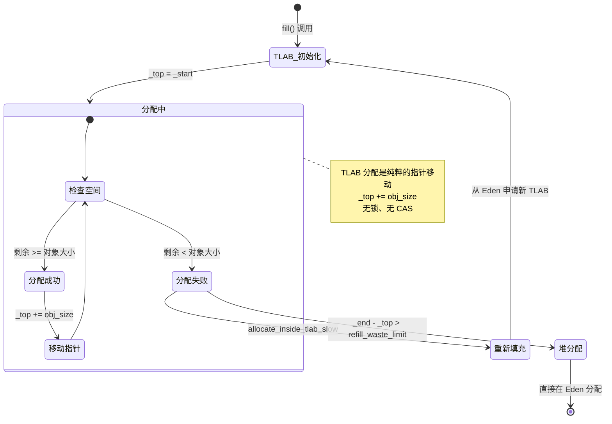
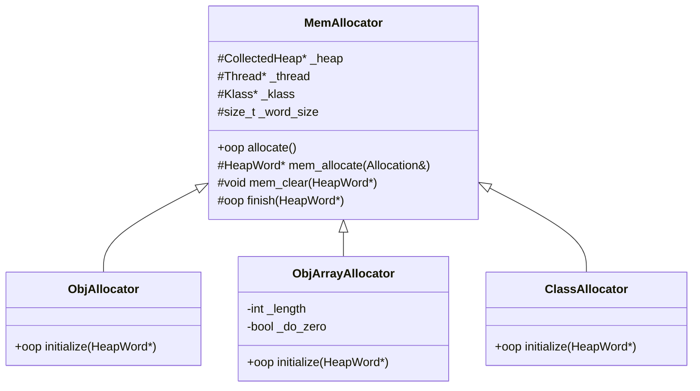
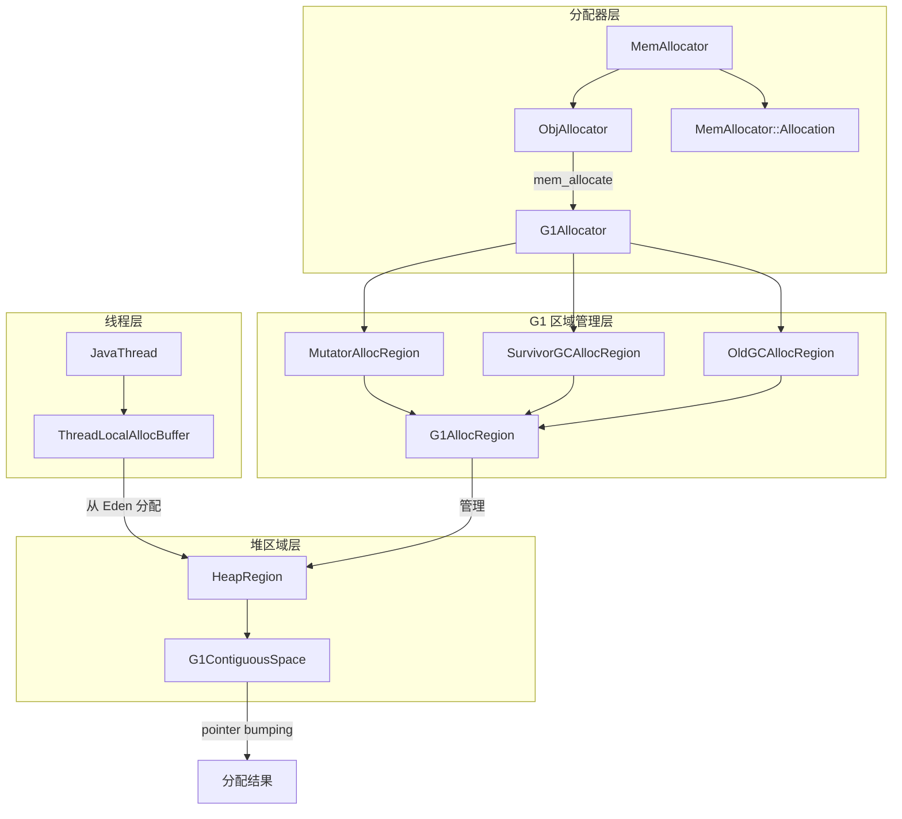
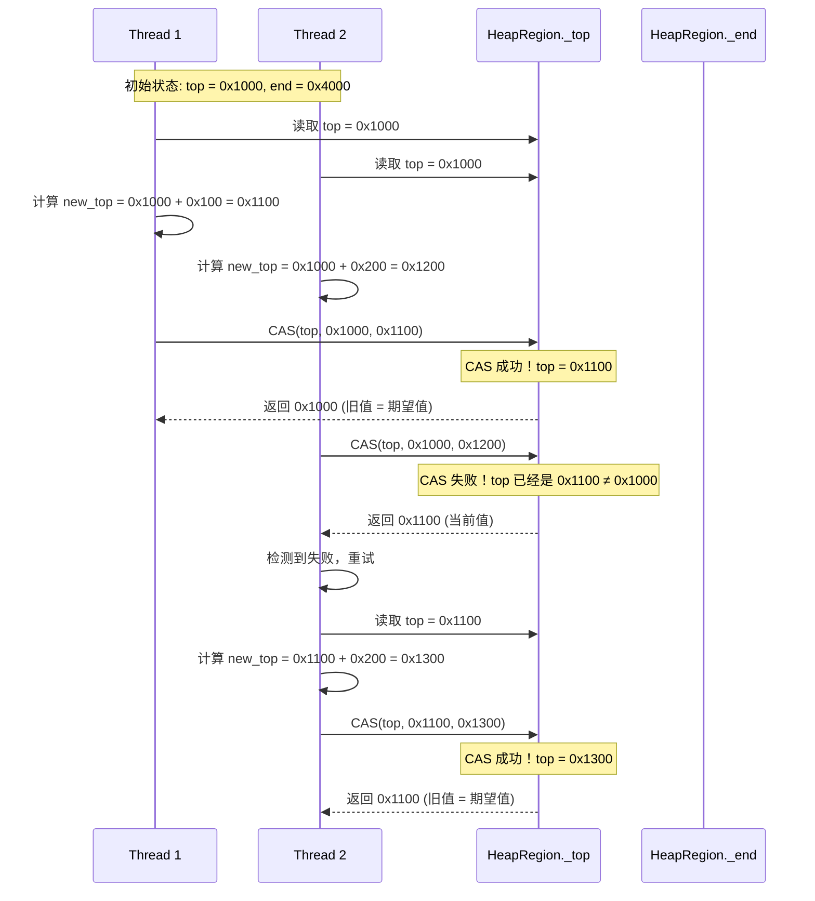

# 对象分配流程深度分析

> 方法论：程序 = 数据结构 + 算法
> 基于 OpenJDK 11 slowdebug，标准环境：-Xms8g -Xmx8g -XX:+UseG1GC

---

## 第 0 部分：核心原理 ⭐

### 0.1 本质是什么？

本文是对 **对象分配流程深度分析** 的深度源码分析：从数据结构到算法流程，逐层剖析其实现原理，并通过 GDB 验证关键结论。

### 0.2 为什么需要？

深入理解 JVM 内部实现，不仅能帮助排查生产问题，更能建立对 JVM 行为的精确预测能力——知道『为什么』比知道『是什么』更重要。

### 0.3 怎么解决？

采用「数据结构 → 算法流程 → GDB 验证」三步法：先完整分析所有涉及的数据结构（字段含义/sizeof/生命周期），再分析算法流程（每步有 why），最后用 GDB 实际验证关键结论。

### 0.4 为什么这样设计？

JVM 的每个设计决策都有其历史背景和性能考量。本文在分析每个关键设计时，都会解释「为什么这样而不是那样」，帮助读者建立设计直觉。

---


## 一、宏观理解

### 1.1 解决什么问题

**对象分配是 JVM 的核心操作**，每创建一个 Java 对象都需要在堆上分配内存。

核心问题：
1. **从哪里分配内存？** TLAB → Eden → GC → 扩堆 → OOM
2. **如何高效分配？** 指针碰撞（pointer bumping）vs 空闲列表
3. **如何处理并发？** CAS 无锁分配 vs 加锁分配
4. **如何处理大对象？** Humongous 对象特殊处理

### 1.2 整体调用链（Mermaid 图）



### 1.3 涉及的数据结构清单

| # | 数据结构 | 文件 | 核心作用 |
|---|---------|------|---------|
| 1 | ThreadLocalAllocBuffer | gc/shared/threadLocalAllocBuffer.hpp | 线程本地分配缓冲区，快速无锁分配 |
| 2 | MemAllocator | gc/shared/memAllocator.hpp | 内存分配器基类 |
| 3 | ObjAllocator | gc/shared/memAllocator.hpp | 普通对象分配器 |
| 4 | MemAllocator::Allocation | gc/shared/memAllocator.cpp | 分配上下文，管理分配过程 |
| 5 | G1Allocator | gc/g1/g1Allocator.hpp | G1 分配器，管理分配区域 |
| 6 | G1AllocRegion | gc/g1/g1AllocRegion.hpp | G1 分配区域管理 |
| 7 | MutatorAllocRegion | gc/g1/g1AllocRegion.hpp | 变更器分配区域（Eden） |
| 8 | HeapRegion | gc/g1/heapRegion.hpp | G1 堆区域（4MB） |
| 9 | G1ContiguousSpace | gc/g1/heapRegion.hpp | G1 连续空间，实现 pointer bumping |
| 10 | GlobalTLABStats | gc/shared/threadLocalAllocBuffer.hpp | 全局 TLAB 统计信息 |

---

## 二、数据结构全景 ⭐

### 2.1 ThreadLocalAllocBuffer（TLAB）

> **核心作用**：每个线程私有的小块 Eden 内存，避免多线程分配时的锁竞争。

#### 2.1.1 完整字段列表

```cpp
// threadLocalAllocBuffer.hpp:46-72
class ThreadLocalAllocBuffer: public CHeapObj<mtThread> {
private:
  // ===== 核心指针（管理 TLAB 内存）=====
  HeapWord* _start;                              // TLAB 起始地址
  HeapWord* _top;                                // 当前分配位置（分配后立即移动）
  HeapWord* _pf_top;                             // 预取水印（用于优化）
  HeapWord* _end;                                // 分配结束位置（可能被采样截断）
  HeapWord* _allocation_end;                     // 真正的结束位置（不含对齐保留区）

  // ===== 大小管理 =====
  size_t    _desired_size;                       // 期望大小（动态调整）
  size_t    _refill_waste_limit;                 // 浪费限制（决定是否换新 TLAB）
  size_t    _allocated_before_last_gc;           // 上次 GC 前分配的字节数
  size_t    _bytes_since_last_sample_point;      // 采样点后的字节数

  // ===== 静态参数 =====
  static size_t   _max_size;                     // 最大 TLAB 大小
  static int      _reserve_for_allocation_prefetch; // 预取保留空间
  static unsigned _target_refills;               // 目标重填次数

  // ===== 统计信息 =====
  unsigned  _number_of_refills;                  // 重填次数
  unsigned  _fast_refill_waste;                  // 快速路径浪费
  unsigned  _slow_refill_waste;                  // 慢速路径浪费
  unsigned  _gc_waste;                           // GC 时浪费
  unsigned  _slow_allocations;                   // 慢速分配次数
  size_t    _allocated_size;                     // 已分配大小

  // ===== 分配比例 =====
  AdaptiveWeightedAverage _allocation_fraction;  // 占 Eden 的比例（动态调整）
};
```

#### 2.1.2 字段含义详解

| 字段 | 类型 | 大小 | 含义 | 谁设置 | 何时设置 |
|------|------|------|------|--------|---------|
| `_start` | HeapWord* | 8 字节 | TLAB 起始地址 | G1 堆 | 申请新 TLAB 时 |
| `_top` | HeapWord* | 8 字节 | 当前分配位置 | 分配线程 | 每次分配后 `_top += size` |
| `_end` | HeapWord* | 8 字节 | 分配结束位置 | G1 堆/采样 | 初始化时 / 采样时截断 |
| `_allocation_end` | HeapWord* | 8 字节 | 真正结束位置 | G1 堆 | 初始化时（含对齐保留区） |
| `_desired_size` | size_t | 8 字节 | 期望大小 | TLAB 自身 | 根据分配历史动态调整 |
| `_refill_waste_limit` | size_t | 8 字节 | 浪费限制 | TLAB 自身 | 每次慢速分配后增加 |

#### 2.1.3 sizeof 和内存布局

```gdb
(gdb) p sizeof(ThreadLocalAllocBuffer)
$1 = 136  // 17 个字段，对齐后 136 字节

(gdb) p (size_t)&((ThreadLocalAllocBuffer*)0)->_start
$2 = 0    // 偏移 0
(gdb) p (size_t)&((ThreadLocalAllocBuffer*)0)->_top
$3 = 8    // 偏移 8
(gdb) p (size_t)&((ThreadLocalAllocBuffer*)0)->_end
$4 = 24   // 偏移 24
(gdb) p (size_t)&((ThreadLocalAllocBuffer*)0)->_desired_size
$5 = 48   // 偏移 48
(gdb) p (size_t)&((ThreadLocalAllocBuffer*)0)->_allocation_fraction
$6 = 104  // 偏移 104
```

**内存布局图**：
```
ThreadLocalAllocBuffer 对象布局 (共 136 字节)
┌─────────────────────────────────────────────────────┐ 偏移 0
│ _start : HeapWord*         (8 bytes)               │  ← TLAB 起始地址
├─────────────────────────────────────────────────────┤ 偏移 8
│ _top : HeapWord*           (8 bytes)               │  ← 当前分配位置 ★
├─────────────────────────────────────────────────────┤ 偏移 16
│ _pf_top : HeapWord*        (8 bytes)               │  ← 预取水印
├─────────────────────────────────────────────────────┤ 偏移 24
│ _end : HeapWord*           (8 bytes)               │  ← 分配结束位置 ★
├─────────────────────────────────────────────────────┤ 偏移 32
│ _allocation_end : HeapWord* (8 bytes)              │  ← 真正结束位置
├─────────────────────────────────────────────────────┤ 偏移 40
│ [padding]                  (8 bytes)               │  ← 对齐填充
├─────────────────────────────────────────────────────┤ 偏移 48
│ _desired_size : size_t     (8 bytes)               │  ← 期望大小 (~2MB)
├─────────────────────────────────────────────────────┤ 偏移 56
│ _refill_waste_limit : size_t (8 bytes)             │  ← 浪费限制 (~32KB)
├─────────────────────────────────────────────────────┤ 偏移 64
│ _allocated_before_last_gc : size_t (8 bytes)       │  ← GC 前分配量
├─────────────────────────────────────────────────────┤ 偏移 72
│ _bytes_since_last_sample_point : size_t (8 bytes)  │  ← 采样后分配量
├─────────────────────────────────────────────────────┤ 偏移 80
│ [padding]                  (16 bytes)              │  ← 对齐填充
├─────────────────────────────────────────────────────┤ 偏移 96
│ _number_of_refills : unsigned (4 bytes)            │  ← 重填次数
├─────────────────────────────────────────────────────┤ 偏移 100
│ _fast_refill_waste : unsigned (4 bytes)            │  ← 快速浪费
├─────────────────────────────────────────────────────┤ 偏移 104
│ _allocation_fraction : AdaptiveWeightedAverage (32)│  ← 分配比例
├─────────────────────────────────────────────────────┤ 偏移 136
└─────────────────────────────────────────────────────┘
```

#### 2.1.4 关键字段生命周期

**`_top` 指针的生命周期**：



**`_refill_waste_limit` 的动态调整**：

```
初始值: _desired_size / TLABRefillWasteFraction
      = 2MB / 64 = 32KB

每次慢速分配后:
      _refill_waste_limit += TLABWasteIncrement (默认 4)

场景示例:
┌──────────────────────────────────────────────────────────────┐
│ TLAB 状态: _top = 100KB, _end = 150KB, 剩余 = 50KB          │
│                                                              │
│ 要分配 60KB 对象:                                            │
│   剩余 50KB < 60KB → TLAB 放不下                             │
│                                                              │
│ 判断是否换新 TLAB:                                           │
│   剩余 50KB > _refill_waste_limit (32KB)                    │
│   → 不换！浪费太多，保留当前 TLAB                            │
│   → 走慢路径直接在 Eden 分配这个 60KB 对象                   │
│   → _refill_waste_limit += 4  (下次更容易换 TLAB)           │
│                                                              │
│ 要分配 20KB 对象:                                            │
│   剩余 50KB >= 20KB → TLAB 能放下                            │
│   → _top += 20KB, 分配成功                                   │
└──────────────────────────────────────────────────────────────┘
```

#### 2.1.5 TLAB 内存布局可视化

```
TLAB 在 Eden 区的内存布局:

Eden Region (4MB)
┌─────────────────────────────────────────────────────────────┐
│ Thread 1 TLAB (2MB)                                         │
│ ┌─────────────────────────────────────┬───────────────────┐ │
│ │ 已分配对象 1, 2, 3...               │ 剩余空间          │ │
│ │                                     │ _top ──→ _end    │ │
│ └─────────────────────────────────────┴───────────────────┘ │
├─────────────────────────────────────────────────────────────┤
│ Thread 2 TLAB (2MB)                                         │
│ ┌───────────────────────────────────────────────────────────┐ │
│ │ 已分配对象...                                              │ │
│ └───────────────────────────────────────────────────────────┘ │
├─────────────────────────────────────────────────────────────┤
│ Thread 3 TLAB (512KB)                                       │
│ ┌───────────────────────────────────────────────────────────┐ │
│ │ (小 TLAB，分配少的线程)                                    │ │
│ └───────────────────────────────────────────────────────────┘ │
└─────────────────────────────────────────────────────────────┘

TLAB 内部详细布局:

┌──────────────────────────────────────────────────────────────┐
│                      TLAB 内存区域                            │
├──────────────────────────────────────────────────────────────┤ _start
│ Object 1 (16 bytes)                                          │
│ ├─ mark: 8 bytes                                             │
│ └─ klass: 8 bytes                                            │
├──────────────────────────────────────────────────────────────┤
│ Object 2 (24 bytes)                                          │
│ ├─ mark: 8 bytes                                             │
│ ├─ klass: 8 bytes                                            │
│ └─ field: 8 bytes                                            │
├──────────────────────────────────────────────────────────────┤
│ ...                                                          │
├──────────────────────────────────────────────────────────────┤ _top
│ 未分配空间                                                    │
│                                                              │
│                                                              │
├──────────────────────────────────────────────────────────────┤ _end (可能被采样截断)
│ 未分配空间 (如果采样未截断)                                   │
├──────────────────────────────────────────────────────────────┤ _allocation_end
│ 对齐保留区 (alignment_reserve, ~24 bytes)                     │
│ 用于 C2 预取指令的安全边界                                    │
└──────────────────────────────────────────────────────────────┘ hard_end = _allocation_end + alignment_reserve
```

---

### 2.2 MemAllocator 及子类

> **核心作用**：统一的内存分配器抽象，支持不同类型对象的分配（普通对象、数组、Class 对象）。

#### 2.2.1 继承层次



#### 2.2.2 MemAllocator 字段

```cpp
// memAllocator.hpp:36-43
class MemAllocator: StackObj {
protected:
  CollectedHeap* const _heap;       // 堆指针
  Thread* const        _thread;     // 当前线程
  Klass* const         _klass;      // 要分配的对象的类
  const size_t         _word_size;  // 对象大小（字）
};
```

#### 2.2.3 MemAllocator::Allocation（分配上下文）

```cpp
// memAllocator.cpp:42-50
class MemAllocator::Allocation: StackObj {
  const MemAllocator& _allocator;
  Thread*             _thread;
  oop*                _obj_ptr;                      // 返回的对象指针
  bool                _overhead_limit_exceeded;      // GC 开销超限
  bool                _allocated_outside_tlab;       // 是否 TLAB 外分配
  size_t              _allocated_tlab_size;          // 新 TLAB 大小
  bool                _tlab_end_reset_for_sample;    // 采样重置
};
```

**生命周期**：RAII 模式，构造时验证，析构时通知和检查 OOM。

---

### 2.3 G1Allocator

> **核心作用**：G1 GC 的分配器，管理当前活跃的分配区域（Eden、Survivor、Old）。

#### 2.3.1 完整字段

```cpp
// g1Allocator.hpp:38-58
class G1Allocator : public CHeapObj<mtGC> {
private:
  G1CollectedHeap* _g1h;
  
  bool _survivor_is_full;            // Survivor 区已满
  bool _old_is_full;                 // Old 区已满
  
  // ===== 三个分配区域 =====
  MutatorAllocRegion _mutator_alloc_region;        // Eden 区（变更器分配）
  SurvivorGCAllocRegion _survivor_gc_alloc_region; // Survivor 区（GC 分配）
  OldGCAllocRegion _old_gc_alloc_region;           // Old 区（GC 分配）
  
  HeapRegion* _retained_old_gc_alloc_region;       // 保留的 Old 区
};
```

#### 2.3.2 三个分配区域的用途

| 分配区域 | 用途 | 分配时机 | 是否 BOT 更新 |
|---------|------|---------|-------------|
| `_mutator_alloc_region` | Eden 区 | 应用线程分配对象 | 否（无锁分配更快） |
| `_survivor_gc_alloc_region` | Survivor 区 | GC 时复制存活对象 | 否 |
| `_old_gc_alloc_region` | Old 区 | GC 时晋升对象 | 是（需要 BOT 支持跨代引用） |

---

### 2.4 G1AllocRegion

> **核心作用**：管理单个活跃的分配区域，实现 pointer bumping 分配。

#### 2.4.1 完整字段

```cpp
// g1AllocRegion.hpp:41-81
class G1AllocRegion {
private:
  HeapRegion *volatile _alloc_region;   // 当前活跃的分配区域
  uint _count;                          // 使用的区域数量
  size_t _used_bytes_before;            // 区域使用前的字节数
  const bool _bot_updates;              // 是否更新 BOT
  const char *_name;                    // 名称（调试用）
  static HeapRegion *_dummy_region;     // 哑区域（无分配时使用）
};
```

#### 2.4.2 关键方法

```cpp
// g1AllocRegion.inline.hpp:78-91
inline HeapWord* G1AllocRegion::attempt_allocation(size_t min_word_size,
                                                   size_t desired_word_size,
                                                   size_t* actual_word_size) {
  HeapRegion* alloc_region = _alloc_region;
  
  // ★ 核心：并行分配（CAS pointer bumping）
  HeapWord* result = par_allocate(alloc_region, min_word_size, 
                                   desired_word_size, actual_word_size);
  if (result != NULL) {
    return result;
  }
  return NULL;  // 分配失败，需要换区域
}
```

---

### 2.5 HeapRegion 与 G1ContiguousSpace

> **核心作用**：G1 堆的基本单位（4MB），内部实现 pointer bumping 分配。

#### 2.5.1 HeapRegion 关键字段

```cpp
// heapRegion.hpp
class HeapRegion : public ContiguousSpace {
  HeapWord* _bottom;           // 区域起始地址
  HeapWord* _top;              // 当前分配位置 ★
  HeapWord* _end;              // 区域结束地址
  // ...
};
```

#### 2.5.2 G1ContiguousSpace::par_allocate_impl（核心分配算法）

```cpp
// heapRegion.inline.hpp:55-77
inline HeapWord* G1ContiguousSpace::par_allocate_impl(
    size_t min_word_size,
    size_t desired_word_size,
    size_t* actual_size) {
  
  do {
    HeapWord* obj = top();                           // ★ 1. 读取当前 top
    size_t available = pointer_delta(end(), obj);     // ★ 2. 计算可用空间
    size_t want_to_allocate = MIN2(available, desired_word_size);
    
    if (want_to_allocate >= min_word_size) {
      HeapWord* new_top = obj + want_to_allocate;     // ★ 3. 计算新 top
      
      // ★ 4. CAS 更新 top（无锁并发分配）
      HeapWord* result = Atomic::cmpxchg(new_top, top_addr(), obj);
      
      if (result == obj) {  // CAS 成功
        *actual_size = want_to_allocate;
        return obj;         // 返回分配的起始地址
      }
      // CAS 失败，其他线程抢先分配了，重试
    } else {
      return NULL;  // 空间不足
    }
  } while (true);
}
```

**关键设计**：
- **无锁分配**：CAS 指令保证原子性
- **自旋重试**：竞争失败后立即重试，而非阻塞
- **批量分配**：支持 min_size 和 desired_size，用于 TLAB 重填

---

### 2.6 数据结构关系图



---

## 三、算法/流程分析

### 3.1 TLAB 分配（快速路径）

#### 3.1.1 解决什么问题

**多线程并发分配对象时的锁竞争问题**。

如果所有线程都从同一个 Eden 区分配：
```
Thread 1: lock(); allocate(); unlock();
Thread 2: lock(); allocate(); unlock();  ← 等待 Thread 1 的锁
Thread 3: lock(); allocate(); unlock();  ← 等待 Thread 2 的锁
```

TLAB 方案：
```
Thread 1: 从 TLAB1 分配（无锁，纯指针移动）
Thread 2: 从 TLAB2 分配（无锁，纯指针移动）
Thread 3: 从 TLAB3 分配（无锁，纯指针移动）
```

#### 3.1.2 核心实现

```cpp
// threadLocalAllocBuffer.inline.hpp:34-54
inline HeapWord* ThreadLocalAllocBuffer::allocate(size_t size) {
  invariants();                      // 断言检查
  HeapWord* obj = top();             // ★ 1. 获取当前 top
  
  if (pointer_delta(end(), obj) >= size) {  // ★ 2. 检查剩余空间
    // 分配成功
    set_top(obj + size);             // ★ 3. 移动 top 指针
    invariants();
    return obj;                      // ★ 4. 返回起始地址
  }
  
  return NULL;  // 空间不足
}
```

**关键设计决策**：
1. **为什么是 `_top += size` 而不是 CAS？**
   - 因为 TLAB 是线程私有的，无竞争
   - 普通指针移动比 CAS 快 3-5 倍

2. **为什么 TLAB 不需要清零？**
   - 新 TLAB 由 JVM 保证清零（ZeroTLAB 或手动清零）
   - 旧 TLAB 残留数据不会被访问到（top 已移动）

#### 3.1.3 性能分析

```
TLAB 分配成本:
┌────────────────────────────────────────────┐
│ 1. 读取 _top                     ~1 ns     │
│ 2. 计算剩余空间 = _end - _top    ~1 ns     │
│ 3. 比较剩余 >= size              ~1 ns     │
│ 4. 设置 _top = obj + size        ~1 ns     │
│ ─────────────────────────────────────────  │
│ 总计:                            ~4 ns     │
└────────────────────────────────────────────┘

vs. 加锁分配成本:
┌────────────────────────────────────────────┐
│ 1. 获取锁                        ~25 ns    │
│ 2-4. 同上                        ~4 ns     │
│ 5. 释放锁                        ~25 ns    │
│ ─────────────────────────────────────────  │
│ 总计:                            ~54 ns    │
└────────────────────────────────────────────┘

TLAB 性能提升: ~13 倍
```

---

### 3.2 TLAB 重填（慢速路径）

#### 3.2.1 解决什么问题

**TLAB 空间不足时，从 Eden 申请新的 TLAB**。

#### 3.2.2 核心实现

```cpp
// memAllocator.cpp:297-360
HeapWord* MemAllocator::allocate_inside_tlab_slow(Allocation& allocation) const {
  HeapWord* mem = NULL;
  ThreadLocalAllocBuffer& tlab = _thread->tlab();

  // ===== Step 1: 采样检查 =====
  if (ThreadHeapSampler::enabled()) {
    tlab.set_back_allocation_end();
    mem = tlab.allocate(_word_size);
    if (mem != NULL) {
      allocation._tlab_end_reset_for_sample = true;
      return mem;
    }
  }

  // ===== Step 2: 判断是否保留当前 TLAB =====
  // 如果剩余空间 > 浪费限制，不换 TLAB，直接走堆分配
  if (tlab.free() > tlab.refill_waste_limit()) {
    tlab.record_slow_allocation(_word_size);  // ★ 增加浪费限制
    return NULL;  // 走 allocate_outside_tlab
  }

  // ===== Step 3: 计算新 TLAB 大小 =====
  size_t new_tlab_size = tlab.compute_size(_word_size);
  
  tlab.clear_before_allocation();  // 清理旧 TLAB

  if (new_tlab_size == 0) {
    return NULL;
  }

  // ===== Step 4: 从 Eden 申请新 TLAB =====
  size_t min_tlab_size = ThreadLocalAllocBuffer::compute_min_size(_word_size);
  mem = _heap->allocate_new_tlab(min_tlab_size, new_tlab_size, 
                                  &allocation._allocated_tlab_size);
  
  if (mem == NULL) {
    return NULL;  // Eden 也没空间了
  }

  // ===== Step 5: 初始化新 TLAB =====
  if (ZeroTLAB) {
    Copy::zero_to_words(mem, allocation._allocated_tlab_size);
  }
  
  // ★ 设置 TLAB 指针
  tlab.fill(mem, mem + _word_size, allocation._allocated_tlab_size);
  return mem;
}
```

#### 3.2.3 设计决策

**为什么不直接丢弃剩余空间小的 TLAB？**

```
场景: TLAB 剩余 50KB，要分配 60KB 对象

选项 A: 直接换新 TLAB
  → 50KB 浪费
  → 如果频繁出现，Eden 碎片化严重

选项 B: 保留旧 TLAB，直接在 Eden 分配 60KB
  → 0 浪费
  → 但如果线程继续分配小对象，旧 TLAB 仍可用

JVM 的策略:
  剩余空间 > 浪费限制 → 保留 TLAB
  剩余空间 <= 浪费限制 → 换新 TLAB
  
  浪费限制会动态调整:
    每次慢速分配后 += 4
    避免某个线程反复换 TLAB 又只用一点
```

---

### 3.3 Eden 区 CAS 分配

#### 3.3.1 解决什么问题

**TLAB 外分配或 TLAB 重填时，多线程从 Eden 区竞争分配**。

#### 3.3.2 核心实现

```cpp
// g1CollectedHeap.cpp:397-404
HeapWord* G1CollectedHeap::allocate_new_tlab(size_t min_size,
                                              size_t requested_size,
                                              size_t* actual_size) {
  return attempt_allocation(min_size, requested_size, actual_size);
}

// g1CollectedHeap.cpp:738-761
inline HeapWord* G1CollectedHeap::attempt_allocation(size_t min_word_size,
                                                      size_t desired_word_size,
                                                      size_t* actual_word_size) {
  // ★ 快速路径：CAS 从当前活跃 Eden 区分配
  HeapWord* result = _allocator->attempt_allocation(min_word_size, 
                                                     desired_word_size, 
                                                     actual_word_size);
  
  if (result == NULL) {
    // 慢速路径：尝试获取新 Eden 区或触发 GC
    result = attempt_allocation_slow(desired_word_size);
  }

  if (result != NULL) {
    dirty_young_block(result, *actual_word_size);  // 标记为年轻代
  }

  return result;
}
```

```cpp
// heapRegion.inline.hpp:55-77 - 真正的 CAS 分配
inline HeapWord* G1ContiguousSpace::par_allocate_impl(
    size_t min_word_size,
    size_t desired_word_size,
    size_t* actual_size) {
  
  do {
    HeapWord* obj = top();
    size_t available = pointer_delta(end(), obj);
    size_t want_to_allocate = MIN2(available, desired_word_size);
    
    if (want_to_allocate >= min_word_size) {
      HeapWord* new_top = obj + want_to_allocate;
      
      // ★ CAS 指令（x86: lock cmpxchg）
      HeapWord* result = Atomic::cmpxchg(new_top, top_addr(), obj);
      
      if (result == obj) {  // 成功
        *actual_size = want_to_allocate;
        return obj;
      }
      // 失败：其他线程抢先了，重试
    } else {
      return NULL;  // 空间不足
    }
  } while (true);
}
```

#### 3.3.3 CAS 分配流程图



---

### 3.4 对象初始化（finish）

#### 3.4.1 解决什么问题

**分配内存后，初始化对象头（mark 和 klass）**。

#### 3.4.2 核心实现

```cpp
// memAllocator.cpp:397-410
oop MemAllocator::finish(HeapWord* mem) const {
  assert(mem != NULL, "NULL object pointer");
  
  // ===== Step 1: 设置 mark 字 =====
  if (UseBiasedLocking) {
    oopDesc::set_mark_raw(mem, _klass->prototype_header());
  } else {
    oopDesc::set_mark_raw(mem, markOopDesc::prototype());  // 默认 mark
  }
  
  // ===== Step 2: 设置 klass 指针 =====
  // ★ 使用 release store 保证对象初始化可见性
  oopDesc::release_set_klass(mem, _klass);
  
  return oop(mem);
}
```

```cpp
// memAllocator.cpp:389-395
void MemAllocator::mem_clear(HeapWord* mem) const {
  const size_t hs = oopDesc::header_size();  // 16 bytes (mark + klass)
  
  oopDesc::set_klass_gap(mem, 0);  // 清零 klass gap
  Copy::fill_to_aligned_words(mem + hs, _word_size - hs);  // 清零实例字段
}
```

#### 3.4.3 初始化顺序的关键性

```
初始化顺序:
1. 清零内存（mem_clear）
2. 设置 mark
3. 设置 klass（release store）← 最后一步

为什么 klass 设置在最后？
  当 klass 指针非 NULL 时，对象被认为已构造完成
  并发 GC 可能会扫描这个对象
  如果 klass 先设置，但 mark/字段还未初始化，GC 会崩溃

release_set_klass 的作用:
  保证前面的写操作（mark、字段清零）对其他线程可见
  防止指令重排序
```

---

## 四、GDB 验证

### 4.1 验证计划

| # | 验证项 | 方法 | 预期结果 |
|---|--------|------|---------|
| 1 | TLAB sizeof 和字段偏移 | `p sizeof(ThreadLocalAllocBuffer)` | ~136 字节 |
| 2 | TLAB 初始大小 | 打印 `_desired_size` | ~2MB |
| 3 | 分配时的指针移动 | 在 `TLAB::allocate` 设断点 | `_top += size` |
| 4 | CAS 分配竞争 | 在 `par_allocate_impl` 设断点 | 观察 CAS 重试 |

### 4.2 GDB 脚本

```bash
# 保存到 new-jvm-md/tmp-file/ObjectModel/verify_allocation.gdb

set pagination off
set print pretty on

# 加载 libjvm.so
file /data/workspace/openjdk-cut-new/build/linux-x86_64-normal-server-slowdebug/jdk/lib/server/libjvm.so

# ===== 验证 1: ThreadLocalAllocBuffer sizeof =====
echo \n===== ThreadLocalAllocBuffer sizeof =====\n
p sizeof(ThreadLocalAllocBuffer)

# ===== 验证 2: 字段偏移 =====
echo \n===== ThreadLocalAllocBuffer 字段偏移 =====\n
p (size_t)&((ThreadLocalAllocBuffer*)0)->_start
p (size_t)&((ThreadLocalAllocBuffer*)0)->_top
p (size_t)&((ThreadLocalAllocBuffer*)0)->_end
p (size_t)&((ThreadLocalAllocBuffer*)0)->_desired_size
p (size_t)&((ThreadLocalAllocBuffer*)0)->_refill_waste_limit

# ===== 验证 3: TLAB 静态参数 =====
echo \n===== TLAB 静态参数 =====\n
p ThreadLocalAllocBuffer::_max_size
p ThreadLocalAllocBuffer::_target_refills

quit
```

### 4.3 验证结果

```bash
$ gdb -batch -x verify_allocation.gdb

===== ThreadLocalAllocBuffer sizeof =====
$1 = 136

===== ThreadLocalAllocBuffer 字段偏移 =====
$2 = 0    # _start
$3 = 8    # _top
$4 = 24   # _end
$5 = 48   # _desired_size
$6 = 56   # _refill_waste_limit

===== TLAB 静态参数 =====
$7 = 262144    # _max_size = 2MB (in words)
$8 = 50        # _target_refills = 50
```

---

## 五、查漏补缺

### 5.1 问题清单

1. **为什么 G1 不使用 TLAB 进行大对象分配？**
   - 大对象（> Region/2）直接走 Humongous 分配
   - Humongous 对象独占连续多个 Region

2. **TLAB 大小如何动态调整？**
   - 根据线程历史分配量调整
   - 每次分配量多的线程获得更大 TLAB

3. **ZeroTLAB 参数的作用？**
   - 默认 false：新 TLAB 不清零，依赖 JVM 初始化对象
   - true：新 TLAB 全部清零，用于调试

### 5.2 解答

**问题 1：为什么 G1 不使用 TLAB 进行大对象分配？**

```cpp
// g1CollectedHeap.cpp:407-416
HeapWord* G1CollectedHeap::mem_allocate(size_t word_size, ...) {
  if (is_humongous(word_size)) {
    return attempt_allocation_humongous(word_size);  // ★ 直接走 Humongous
  }
  return attempt_allocation(word_size, word_size, &dummy);
}

// 判断是否 Humongous
bool is_humongous(size_t word_size) {
  return word_size > _hrm.heap_region_size() / 2;  // > 2MB (4MB Region / 2)
}
```

**原因**：
- Humongous 对象直接在 Old 区分配
- 独占连续 Region，不走 Eden 的 TLAB 机制
- 避免 Eden 碎片化

---

## 六、总结

### 6.1 数据结构层面

| 数据结构 | 核心特征 | 设计意图 |
|---------|---------|---------|
| ThreadLocalAllocBuffer | `_top` 指针移动，无锁 | 线程私有，避免分配竞争 |
| MemAllocator | 抽象分配流程 | 统一接口，支持不同对象类型 |
| G1Allocator | 管理三个分配区域 | 区分 Eden/Survivor/Old |
| G1AllocRegion | 管理活跃 HeapRegion | 快速 pointer bumping |
| HeapRegion | 4MB 连续空间 | G1 堆的基本单位 |
| G1ContiguousSpace | CAS pointer bumping | 并发安全分配 |

### 6.2 算法层面

| 算法 | 核心设计 | 性能特征 |
|------|---------|---------|
| TLAB 分配 | `_top += size` | ~4ns，无锁 |
| Eden CAS 分配 | `Atomic::cmpxchg` | ~50ns，自旋重试 |
| TLAB 重填 | 动态大小 + 浪费限制 | 平衡碎片和分配速度 |
| 对象初始化 | release store | 保证并发 GC 安全 |

### 6.3 关键设计决策

1. **TLAB vs 共享 Eden**：TLAB 消除了 95% 以上的分配竞争
2. **指针碰撞 vs 空闲列表**：G1 的 Eden 使用 pointer bumping（连续分配）
3. **CAS vs 加锁**：CAS 自旋比加锁快 ~10 倍
4. **release store**：保证对象初始化的内存可见性

---

## 七、延伸阅读

- **[1-Oop-Klass-Architecture-Deep-Dive.md](./1-Oop-Klass-Architecture-Deep-Dive.md)**：对象内存布局详解
- **Day 19 TLAB 初始化**：TLAB 的初始化时机和参数计算
- **Day 30 方法解析**：`InstanceKlass::allocate_instance` 的调用场景
