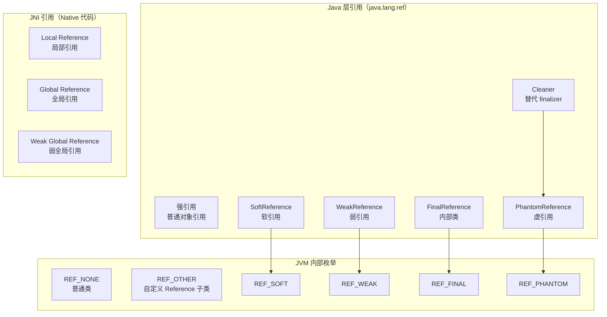
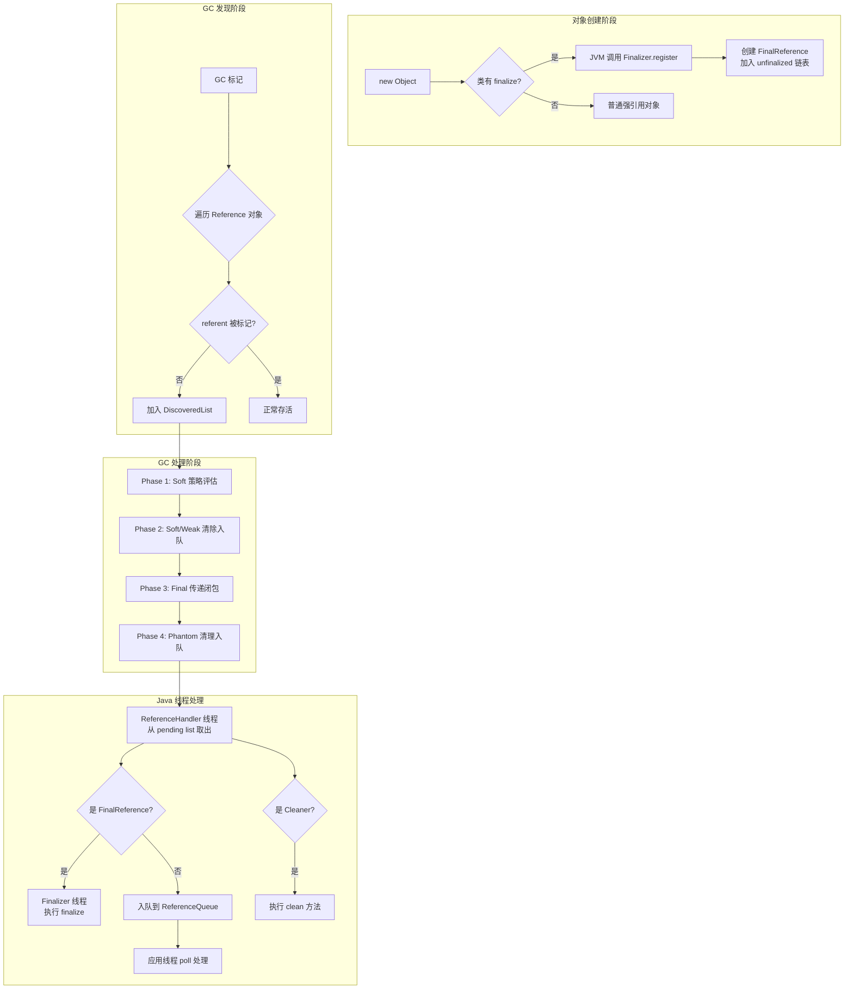
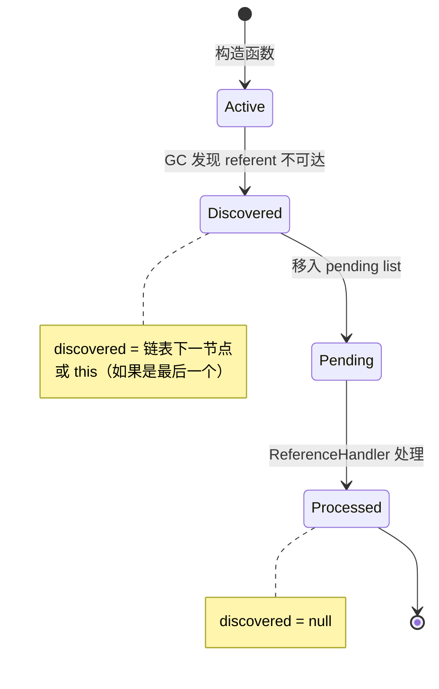
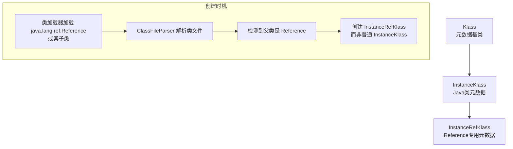
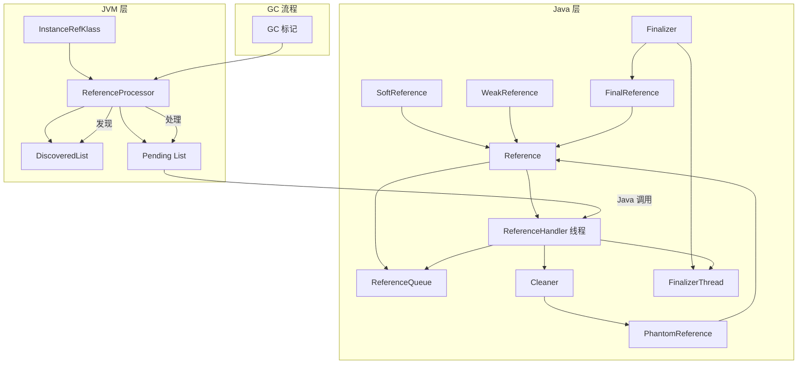
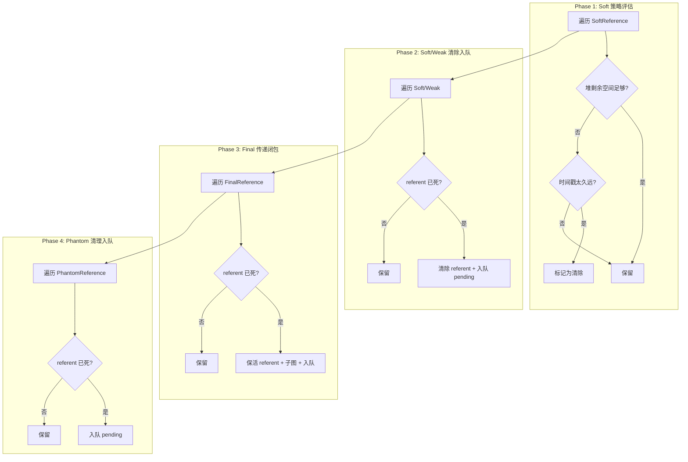

# Finalizer 与 Java 引用类型全解

> 方法论：程序 = 数据结构 + 算法
> 基于 OpenJDK 11 slowdebug，标准环境：-Xms8g -Xmx8g -XX:+UseG1GC

---

## 第 0 部分：核心原理 ⭐

### 0.1 本质是什么？

本文深入分析 **Finalizer 与 Java 引用类型全解**：从源码角度理解其设计原理、实现机制和关键细节。

### 0.2 为什么需要？

理解 JVM 内部实现是排查复杂问题、进行性能优化的基础。表面的 API 文档无法解释 JVM 的实际行为，只有深入源码才能建立精确的心智模型。

### 0.3 怎么解决？

结合源码阅读、数据结构分析和 GDB 运行时验证，从多个角度建立对该机制的完整理解。

### 0.4 为什么这样设计？

每个设计决策都有其权衡：性能 vs 正确性、简单性 vs 灵活性、内存占用 vs 查找速度。理解这些权衡是理解 JVM 设计的关键。

---


## 一、宏观理解

### 1.1 JVM 中的所有引用类型

**不只是 4 种！** JVM 中的引用类型分为三大体系：



### 1.2 引用类型对比表

#### Java 层引用（GC 相关）

| 引用类型 | GC 语义 | 发现后处理 | 典型用途 |
|---------|---------|-----------|---------|
| **强引用** | 永不回收，直到不可达 | 无特殊处理 | 普通对象引用 |
| **SoftReference** | 内存不足时回收 | 清除 + 入队 | 缓存（图片、网页） |
| **WeakReference** | 下次 GC 回收 | 清除 + 入队 | WeakHashMap、ThreadLocal |
| **PhantomReference** | 回收后通知 | 不清除 + 入队 | 资源清理监控 |
| **FinalReference** | 支持 `finalize()` | **不清除** + 入队 | 内部类，包私有 |
| **Cleaner** | 回收后执行清理 | 执行 `thunk.run()` | 替代 finalizer |

#### JNI 引用（Native 代码与 JVM 交互）

| 引用类型 | 生命周期 | GC 语义 | 存储位置 |
|---------|---------|---------|---------|
| **Local Reference** | 单次 JNI 调用内自动释放 | 强引用 | JNIHandleBlock（线程私有） |
| **Global Reference** | 显式 `NewGlobalRef`/`DeleteGlobalRef` | 强引用 | OopStorage "JNI Global" |
| **Weak Global Reference** | 显式 `NewWeakGlobalRef`/`DeleteWeakGlobalRef` | 弱引用 | OopStorage "JNI Weak" |

### 1.3 整体架构图



### 1.4 涉及的数据结构清单

| # | 数据结构 | 文件 | 核心作用 |
|---|---------|------|---------|
| 1 | Reference<T> | java.base/share/classes/java/lang/ref/Reference.java | 所有引用类型的基类 |
| 2 | ReferenceQueue<T> | java.base/share/classes/java/lang/ref/ReferenceQueue.java | 引用队列，存储已通知的引用 |
| 3 | ReferenceHandler | Reference.java 内部类 | 处理 pending list 的高优先级线程 |
| 4 | Finalizer | java.base/share/classes/java/lang/ref/Finalizer.java | FinalReference 包装器 |
| 5 | FinalizerThread | Finalizer.java 内部类 | 执行 `finalize()` 的线程 |
| 6 | Cleaner | jdk/internal/ref/Cleaner.java | PhantomReference 替代 finalizer |
| 7 | SoftReference | java.base/share/classes/java/lang/ref/SoftReference.java | 软引用，带时间戳 |
| 8 | InstanceRefKlass | hotspot/share/oops/instanceRefKlass.hpp | JVM 层 Reference 类元数据 |
| 9 | ReferenceProcessor | hotspot/share/memory/referenceProcessor.hpp | GC 阶段的引用处理器 |
| 10 | DiscoveredList | hotspot/share/memory/referenceProcessor.hpp | GC 发现的引用链表 |

---

## 二、数据结构全景 ⭐

### 2.1 Reference<T>（引用基类）

> **核心作用**：所有 Java 引用类型的抽象基类，定义了引用的核心状态机和字段。

#### 2.1.1 完整字段列表

```java
// Reference.java:151-185
public abstract class Reference<T> {
    // ===== 核心字段 =====
    private T referent;                              // 被引用的对象 ★
    
    volatile ReferenceQueue<? super T> queue;        // 关联的队列 ★
    volatile Reference next;                         // 队列中的下一个 ★
    private transient Reference<T> discovered;       // GC 内部链表 ★
}
```

#### 2.1.2 字段含义详解

| 字段 | 类型 | 大小 | 含义 | 谁设置 | 何时设置 |
|------|------|------|------|--------|---------|
| `referent` | T | 8 字节（指针） | 被引用的目标对象 | 构造函数 | 创建时 |
| `queue` | ReferenceQueue | 8 字节 | 关联的引用队列 | 构造函数 | 创建时 |
| `next` | Reference | 8 字节 | 队列中下一个节点 | ReferenceHandler | 入队时 |
| `discovered` | Reference | 8 字节 | GC 发现链表下一节点 | GC | 发现时 |

#### 2.1.3 Reference 状态机

```
                        ┌─────────────────────────────────────────────────────┐
                        │               Reference 状态机                      │
                        └─────────────────────────────────────────────────────┘
                        
    初始状态
    ┌───────────────────┐
    │ active/registered │
    │ referent != null  │
    │ discovered = null │
    │ queue = 实际队列   │
    └────────┬──────────┘
             │
             │ GC 发现 referent 不可达
             ▼
    ┌───────────────────┐
    │ pending/registered│
    │ referent = null   │   (FinalReference 除外，不清除 referent)
    │ discovered = next │
    │ queue = 原队列     │
    └────────┬──────────┘
             │
             │ ReferenceHandler 处理
             ▼
    ┌───────────────────┐
    │ inactive/enqueued │
    │ referent = null   │
    │ discovered = null │
    │ queue = ENQUEUED  │
    │ next = 队列下一   │
    └────────┬──────────┘
             │
             │ 应用线程 poll/remove
             ▼
    ┌───────────────────┐
    │ inactive/dequeued │   ← 终态
    │ referent = null   │
    │ queue = NULL      │
    │ next = this       │
    └───────────────────┘
```

#### 2.1.4 discovered 字段的生命周期



---

### 2.2 ReferenceQueue<T>（引用队列）

> **核心作用**：存储 GC 已通知的引用对象，供应用线程 poll 处理。

#### 2.2.1 完整字段列表

```java
// ReferenceQueue.java:39-58
public class ReferenceQueue<T> {
    private static class Null extends ReferenceQueue<Object> { ... }
    static final ReferenceQueue<Object> NULL = new Null();      // 不入队标记
    static final ReferenceQueue<Object> ENQUEUED = new Null();  // 已入队标记
    
    private static class Lock { };
    private final Lock lock = new Lock();                       // 同步锁
    private volatile Reference<? extends T> head;               // 队列头 ★
    private long queueLength = 0;                               // 队列长度
}
```

#### 2.2.2 内存布局

```
ReferenceQueue 对象布局
┌─────────────────────────────────────────────────────┐
│ _mark : markOop            (8 bytes)               │  ← 对象头
├─────────────────────────────────────────────────────┤
│ _klass : Klass*            (8 bytes)               │  ← 对象头
├─────────────────────────────────────────────────────┤
│ NULL : static ReferenceQueue                        │  ← 静态字段
│ ENQUEUED : static ReferenceQueue                    │
├─────────────────────────────────────────────────────┤
│ lock : Lock                (16 bytes)               │  ← 实例字段
│ head : Reference           (8 bytes)               │  ← 队列头 ★
│ queueLength : long         (8 bytes)               │
└─────────────────────────────────────────────────────┘

队列内部结构（单链表，头插法）:
     head
       │
       ▼
   ┌───────┐    ┌───────┐    ┌───────┐
   │ Ref 3 │───→│ Ref 2 │───→│ Ref 1 │───→ this (自环表示末尾)
   └───────┘    └───────┘    └───────┘
     最新         中间         最老
```

---

### 2.3 Finalizer（FinalReference 包装器）

> **核心作用**：为每个覆写了 `finalize()` 方法的对象创建 FinalReference，并管理未 finalize 的对象链表。

#### 2.3.1 完整字段列表

```java
// Finalizer.java:34-57
final class Finalizer extends FinalReference<Object> {
    // ===== 静态字段（全局管理）=====
    private static ReferenceQueue<Object> queue = new ReferenceQueue<>();  // Finalizer 专用队列
    private static Finalizer unfinalized = null;                           // 未 finalize 的链表头 ★
    private static final Object lock = new Object();                       // 同步锁
    
    // ===== 实例字段（双向链表）=====
    private Finalizer next, prev;                                          // 双向链表指针 ★
    
    // 构造函数：头插法加入 unfinalized 链表
    private Finalizer(Object finalizee) {
        super(finalizee, queue);
        synchronized (lock) {
            if (unfinalized != null) {
                this.next = unfinalized;
                unfinalized.prev = this;
            }
            unfinalized = this;
        }
    }
}
```

#### 2.3.2 unfinalized 双向链表

```
unfinalized 链表结构:

unfinalized
     │
     ▼
┌──────────┐    ┌──────────┐    ┌──────────┐
│ Finalizer│◄──→│ Finalizer│◄──→│ Finalizer│
│  (obj3)  │    │  (obj2)  │    │  (obj1)  │
│ next ────────→│ next ────────→│ next = null
│ prev=null│←───── prev    │←───── prev    │
└──────────┘    └──────────┘    └──────────┘
   最老           中间            最新（unfinalized 指向）

链表用途：
1. 跟踪所有需要 finalize 的对象
2. finalize 完成后从链表移除
3. VM 关闭时遍历执行所有未 finalize 的对象
```

---

### 2.4 FinalizerThread（finalize 执行线程）

> **核心作用**：从 ReferenceQueue 中取出 FinalReference，执行对象的 `finalize()` 方法。

#### 2.4.1 完整实现

```java
// Finalizer.java:146-177
private static class FinalizerThread extends Thread {
    private volatile boolean running;
    
    FinalizerThread(ThreadGroup g) {
        super(g, null, "Finalizer", 0, false);
    }
    
    public void run() {
        // 等待 VM 初始化完成
        while (VM.initLevel() == 0) {
            try {
                VM.awaitInitLevel(1);
            } catch (InterruptedException x) { }
        }
        
        final JavaLangAccess jla = SharedSecrets.getJavaLangAccess();
        running = true;
        
        // ★ 主循环：从队列取 FinalReference 并执行 finalize()
        for (;;) {
            try {
                Finalizer f = (Finalizer) queue.remove();  // ★ 阻塞等待
                f.runFinalizer(jla);                        // ★ 执行 finalize
            } catch (InterruptedException x) { }
        }
    }
}

// 静态初始化块：启动 Finalizer 线程
static {
    ThreadGroup tg = Thread.currentThread().getThreadGroup();
    for (ThreadGroup tgn = tg; tgn != null; tg = tgn, tgn = tg.getParent());
    Thread finalizer = new FinalizerThread(tg);
    finalizer.setPriority(Thread.MAX_PRIORITY - 2);  // ★ 优先级 = 8
    finalizer.setDaemon(true);                        // ★ 守护线程
    finalizer.start();
}
```

#### 2.4.2 runFinalizer 执行流程

```java
// Finalizer.java:69-95
private void runFinalizer(JavaLangAccess jla) {
    // ===== Step 1: 从 unfinalized 链表移除 =====
    synchronized (lock) {
        if (this.next == this)  // 已经 finalize 过
            return;
        
        // 从双向链表摘除
        if (unfinalized == this)
            unfinalized = this.next;
        else
            this.prev.next = this.next;
        if (this.next != null)
            this.next.prev = this.prev;
        this.prev = null;
        this.next = this;  // 标记为已 finalize
    }
    
    // ===== Step 2: 执行 finalize() =====
    try {
        Object finalizee = this.get();  // ★ 获取对象（可能已被复活）
        if (finalizee != null && !(finalizee instanceof java.lang.Enum)) {
            jla.invokeFinalize(finalizee);  // ★ 调用 finalize()
            finalizee = null;  // 帮助 GC
        }
    } catch (Throwable x) { }  // ★ 吞掉所有异常
    
    super.clear();  // 清除 referent
}
```

---

### 2.5 Cleaner（PhantomReference 替代 finalizer）

> **核心作用**：轻量级的资源清理机制，比 finalizer 更安全、更高效。

#### 2.5.1 完整字段列表

```java
// Cleaner.java:59-77
public class Cleaner extends PhantomReference<Object> {
    // ===== 静态字段 =====
    private static final ReferenceQueue<Object> dummyQueue = new ReferenceQueue<>();
    private static Cleaner first = null;    // 双向链表头
    
    // ===== 实例字段 =====
    private Cleaner next = null, prev = null;  // 双向链表
    private final Runnable thunk;              // 清理逻辑 ★
}
```

#### 2.5.2 Cleaner vs Finalizer 对比

| 对比项 | Finalizer | Cleaner |
|-------|-----------|---------|
| 引用类型 | FinalReference | PhantomReference |
| 执行线程 | Finalizer 线程 | ReferenceHandler 线程 |
| 对象是否可复活 | 是（finalize 中重新引用） | 否（Phantom 引用） |
| 执行顺序 | 不保证 | 不保证 |
| 异常处理 | 吞掉 | 打印错误并退出 |
| 性能 | 较差（需要创建 FinalReference） | 较好 |

---

### 2.6 SoftReference（软引用）

> **核心作用**：内存敏感的缓存，在内存不足时被清除。

#### 2.6.1 完整字段

```java
// SoftReference.java:64-76
public class SoftReference<T> extends Reference<T> {
    // ===== 时间戳字段 =====
    private static long clock;      // GC 更新的时间戳 ★
    private long timestamp;         // 最后访问时间 ★
    
    // get() 方法更新时间戳
    public T get() {
        T o = super.get();
        if (o != null && this.timestamp != clock)
            this.timestamp = clock;  // ★ 更新时间戳（LRU）
        return o;
    }
}
```

#### 2.6.2 软引用清除策略

JVM 使用 **LRU 策略** 决定清除哪些软引用：

```cpp
// referenceProcessor.cpp 中的策略
// 清除条件：clock - timestamp > 时间阈值

公式：
  时间阈值 = (堆剩余空间 / 最大堆) * 时间间隔因子

示例：
  堆剩余 = 50%（4GB / 8GB）
  时间间隔因子 = 2 秒
  时间阈值 = 0.5 * 2 = 1 秒
  
  如果 soft_ref.timestamp 距今 > 1 秒 → 清除
```

---

### 2.7 InstanceRefKlass（JVM 层 Reference 元数据）

> **核心作用**：JVM 中 `java.lang.ref.Reference` 子类的专用 Klass，实现引用发现逻辑。

#### 2.7.1 继承层次与创建时机



#### 2.7.2 完整字段列表

**InstanceRefKlass 继承 InstanceKlass，无新增实例字段！** 它通过特化的方法实现引用处理。

```cpp
// instanceRefKlass.hpp:50-56
class InstanceRefKlass: public InstanceKlass {
  friend class InstanceKlass;
 public:
  static const KlassID ID = InstanceRefKlassID;  // ★ 类型标识

 private:
  // 构造函数：调用父类，指定 _misc_kind_reference
  InstanceRefKlass(const ClassFileParser& parser) 
    : InstanceKlass(parser, InstanceKlass::_misc_kind_reference, ID) {}
};
```

#### 2.7.3 sizeof 分析

| 结构 | sizeof（64位） | 说明 |
|------|---------------|------|
| InstanceRefKlass | = InstanceKlass | 无新增字段，大小与父类相同 |
| InstanceKlass | ~456 字节 | 详见 [1-Oop-Klass-Architecture-Deep-Dive.md](./1-Oop-Klass-Architecture-Deep-Dive.md) |

#### 2.7.4 关键方法列表

| 方法 | 文件 | 作用 |
|------|------|------|
| `try_discover()` | instanceRefKlass.inline.hpp | 尝试发现引用（referent 未标记） |
| `oop_oop_iterate_discovery()` | instanceRefKlass.inline.hpp | 发现模式迭代 |
| `oop_oop_iterate_fields()` | instanceRefKlass.inline.hpp | 字段模式迭代 |
| `oop_oop_iterate_fields_except_referent()` | instanceRefKlass.inline.hpp | 跳过 referent 迭代（Final 用） |
| `update_nonstatic_oop_maps()` | instanceRefKlass.cpp | 更新 oop map（referent/discovered 特殊处理） |

#### 2.7.5 try_discover 真实源码（逐行注释）

```cpp
// instanceRefKlass.inline.hpp:64-77
// ★ 解决什么问题：GC 标记阶段，发现 referent 不可达但 Reference 对象本身可达的引用
template <typename T, class OopClosureType>
bool InstanceRefKlass::try_discover(oop obj, ReferenceType type, OopClosureType* closure) {
  // Step 1: 获取引用发现器（通常是 ReferenceProcessor）
  ReferenceDiscoverer* rd = closure->ref_discoverer();
  if (rd != NULL) {
    // Step 2: 加载 referent 字段（使用内存屏障保证可见性）
    oop referent = load_referent(obj, type);  // ★ load_referent 带 OrderAccess::loadload
    if (referent != NULL) {
      // Step 3: 检查 referent 是否已被 GC 标记为存活
      if (!referent->is_gc_marked()) {         // ★ 关键判断：referent 不可达
        // Step 4: 发现引用，加入 DiscoveredList
        return rd->discover_reference(obj, type);  // ★ 调用 ReferenceProcessor::discover_reference
      }
    }
  }
  return false;  // 不需要发现（referent 存活 或 无发现器）
}
```

**设计决策**：
1. **为什么检查 `!referent->is_gc_marked()`？** 只有 referent 不可达的引用才需要处理，存活的引用正常遍历即可。
2. **为什么使用 `load_referent` 而非直接访问？** 并发 GC 下，referent 可能被其他线程清除，需要内存屏障保证读取最新值。

#### 2.7.6 引用迭代模式（真实源码）

```cpp
// instanceRefKlass.inline.hpp:111-132
// ★ 解决什么问题：根据 GC 阶段选择不同的迭代策略
template <typename T, class OopClosureType, class Contains>
void InstanceRefKlass::oop_oop_iterate_ref_processing(oop obj, OopClosureType* closure, Contains& contains) {
  switch (closure->reference_iteration_mode()) {
    case OopIterateClosure::DO_DISCOVERY:
      // ★ 发现模式：GC 标记阶段，尝试发现引用
      // 条件：referent 未被标记 → 加入 DiscoveredList
      oop_oop_iterate_discovery<T>(obj, reference_type(), closure, contains);
      break;
    case OopIterateClosure::DO_FIELDS:
      // ★ 字段模式：正常遍历所有字段
      // 用于：非 Reference 对象，或已处理的 Reference
      oop_oop_iterate_fields<T>(obj, closure, contains);
      break;
    case OopIterateClosure::DO_FIELDS_EXCEPT_REFERENT:
      // ★ 特殊模式：不遍历 referent 字段
      // 用于：FinalReference Phase 3 处理，避免重复标记 referent
      oop_oop_iterate_fields_except_referent<T>(obj, closure, contains);
      break;
  }
}
```

#### 2.7.7 Oop Map 更新（referent/discovered 特殊处理）

```cpp
// instanceRefKlass.cpp:31-74
// ★ 解决什么问题：referent 和 discovered 字段需要 GC 特殊处理，不能当作普通 oop
void InstanceRefKlass::update_nonstatic_oop_maps(Klass* k) {
  InstanceKlass* ik = InstanceKlass::cast(k);
  
  // 验证字段偏移
  int referent_offset = java_lang_ref_Reference::referent_offset;   // 12
  int queue_offset = java_lang_ref_Reference::queue_offset;         // 16
  int next_offset = java_lang_ref_Reference::next_offset;           // 20
  int discovered_offset = java_lang_ref_Reference::discovered_offset; // 24
  
  // ★ 更新 oop map：只包含 queue 和 next，不包括 referent 和 discovered
  // 原因：referent 可能被 GC 清除，discovered 用于 GC 内部链表
  const int new_offset = queue_offset;  // 从 queue 开始
  const unsigned int new_count = 2;     // 只包含 queue 和 next
  
  OopMapBlock* map = ik->start_of_nonstatic_oop_maps();
  map->set_offset(new_offset);
  map->set_count(new_count);
}
```

**设计决策**：
- **referent 不在 oop map 中**：GC 需要特殊处理（可能清除、可能保活），不能当作普通 oop 扫描
- **discovered 不在 oop map 中**：这是 GC 内部使用的链表指针，不是对象引用

---

### 2.9 DiscoveredList（GC 发现的引用链表）

> **核心作用**：存储 GC 发现的"referent 不可达但 Reference 对象本身可达"的引用。

#### 2.9.1 完整结构定义

```cpp
// referenceProcessor.hpp:40-62
class DiscoveredList {
public:
  // ★ 构造函数：初始化为空链表
  DiscoveredList() : _len(0), _compressed_head(0), _oop_head(NULL) { }
  
  inline oop head() const;                        // ★ 获取链表头
  inline void set_head(oop o);                     // ★ 设置链表头
  inline bool is_empty() const;                     // ★ 判断是否为空
  size_t length()               { return _len; }   // ★ 链表长度
  void   set_length(size_t len) { _len = len; }
  void   inc_length(size_t inc) { _len += inc; }
  void   dec_length(size_t dec) { _len -= dec; }
  inline void clear();                              // ★ 清空链表

private:
  // ★ 支持压缩 oop（UseCompressedOops）
  oop       _oop_head;         // 64位模式：直接存储 oop
  narrowOop _compressed_head; // 32位压缩模式：存储压缩指针
  size_t    _len;              // ★ 链表长度计数器
};
```

#### 2.9.2 内存布局

```
DiscoveredList 对象布局（64位，非压缩 oop）：
┌─────────────────────────────────────────┐
│ _oop_head : oop        (8 bytes)      │  ← 链表头（第一个发现的引用）
│ _len     : size_t      (8 bytes)       │  ← 链表长度
└─────────────────────────────────────────┘
sizeof(DiscoveredList) = 16 字节

链表结构（通过 Reference.discovered 字段串联）：
                                                                                  
  head ──→ [Ref A] ──→ [Ref B] ──→ [Ref C] ──→ NULL
           .discovered  .discovered  .discovered
  
  每 个 Reference 对象的 discovered 字段指向下一个
```

#### 2.9.3 sizeof 分析

| 环境 | sizeof(DiscoveredList) |
|------|----------------------|
| 64位 + 压缩 oop | 16 字节（_compressed_head 8 + _len 8）|
| 64位 + 非压缩 oop | 16 字节（_oop_head 8 + _len 8）|
| 32位 | 8 字节 |

#### 2.9.4 创建位置

| 位置 | 说明 |
|------|------|
| `_discoveredSoftRefs` | ReferenceProcessor 构造函数创建，4 个数组 |
| `_discoveredWeakRefs` | 每个 GC 堆（young/old）有一个 ReferenceProcessor 实例 |
| `_discoveredFinalRefs` | G1: `G1CollectedHeap::create_gc_policy()` |
| `_discoveredPhantomRefs` | 其他 GC: `Universe::heap()->initialize()` |

#### 2.9.5 DiscoveredListIterator（链表迭代器）

```cpp
// referenceProcessor.hpp:65-155
// ★ 解决什么问题：遍历 DiscoveredList，辅助 GC 各阶段处理引用
class DiscoveredListIterator {
private:
  DiscoveredList&    _refs_list;       // 引用的链表
  HeapWord*          _prev_discovered_addr;  // 前一个 discovered 地址
  oop                _prev_discovered;       // 前一个 discovered 对象
  oop                _current_discovered;     // 当前对象
  
  HeapWord*          _referent_addr;    // referent 地址
  oop                _referent;         // referent 对象
  
  OopClosure*        _keep_alive;      // 保活闭包（用于 Phase 3）
  BoolObjectClosure* _is_alive;        // 存活判断闭包

public:
  // ★ 核心方法
  inline bool has_next() const;         // 是否还有下一个
  inline oop obj() const;              // 获取当前 Reference 对象
  inline oop referent() const;         // 获取 referent 对象
  inline bool is_referent_alive() const;  // referent 是否存活
  
  void load_ptrs(DEBUG_ONLY(bool));    // ★ 加载 referent 和 discovered
  inline void next();                  // 移动到下一个
  void remove();                       // ★ 从链表移除当前元素
  inline void make_referent_alive();   // ★ 保活 referent（Phase 3 关键）
  void enqueue();                      // ★ 入队到 pending list
  void clear_referent();               // ★ 清除 referent（Phase 2/4 关键）
};
```

---

### 2.10 ReferenceProcessor（GC 引用处理器）

> **核心作用**：GC 阶段的核心组件，负责引用发现、处理、四阶段流程。

#### 2.10.1 完整字段列表

```cpp
// referenceProcessor.hpp:194-246
class ReferenceProcessor : public ReferenceDiscoverer {
private:
  // ====== 静态字段 ======
  static jlong _soft_ref_timestamp_clock;  // ★ 软引用时间戳时钟
  
  // ====== 软引用策略 ======
  static ReferencePolicy*   _default_soft_ref_policy;      // 默认策略
  static ReferencePolicy*   _always_clear_soft_ref_policy; // 总是清除策略
  ReferencePolicy*          _current_soft_ref_policy;      // 当前使用策略

  // ====== 发现配置 ======
  BoolObjectClosure* _is_subject_to_discovery;  // 判断 oop 是否需要发现
  bool        _discovering_refs;                 // 是否启用发现
  bool        _discovery_is_atomic;               // 发现是否原子
  bool        _discovery_is_mt;                  // 是否多线程发现
  
  // ====== 处理配置 ======
  bool        _enqueuing_is_done;    // 入队是否完成
  bool        _processing_is_mt;      // 是否多线程处理
  uint        _next_id;               // 轮询计数器
  bool        _adjust_no_of_processing_threads;  // 动态调整线程数
  
  // ====== 存活判断（非对象头）======
  BoolObjectClosure* _is_alive_non_header;  // 非标准 GC 使用的存活判断

  // ====== 发现引用链表数组 ★======
  uint            _num_queues;        // 活跃队列数
  uint            _max_num_queues;    // 最大队列数
  DiscoveredList* _discovered_refs;  // ★ 主数组（4种引用 × N个队列）
  
  // ★ 四个引用类型的链表数组（快捷访问）
  DiscoveredList* _discoveredSoftRefs;
  DiscoveredList* _discoveredWeakRefs;
  DiscoveredList* _discoveredFinalRefs;
  DiscoveredList* _discoveredPhantomRefs;
};
```

#### 2.10.2 字段详解表

| 字段 | 类型 | 大小 | 含义 | 谁设置 | 何时 |
|------|------|------|------|--------|------|
| `_soft_ref_timestamp_clock` | jlong | 8 | 软引用全局时钟 | GC | 每次 GC |
| `_current_soft_ref_policy` | ReferencePolicy* | 8 | 当前软引用策略 | setup_policy() | Phase 1 前 |
| `_discovering_refs` | bool | 1 | 发现启用标志 | enable_discovery() | GC 开始 |
| `_discovery_is_atomic` | bool | 1 | 原子发现 | 构造函数 | 创建时 |
| `_discovering_refs` | bool | 1 | MT 发现 | 构造函数 | 创建时 |
| `_discoveredSoftRefs` | DiscoveredList* | 8×N | 软引用链表数组 | 构造函数 | 创建时 |
| `_discoveredWeakRefs` | DiscoveredList* | 8×N | 弱引用链表数组 | 构造函数 | 创建时 |
| `_discoveredFinalRefs` | DiscoveredList* | 8×N | Final 引用链表数组 | 构造函数 | 创建时 |
| `_discoveredPhantomRefs` | DiscoveredList* | 8×N | 虚引用链表数组 | 构造函数 | 创建时 |

#### 2.10.3 sizeof 分析

```
ReferenceProcessor sizeof（64位）：
- 静态字段不计入
- 指针数组：_discovered_refs = _max_num_queues × 4 × sizeof(DiscoveredList)
- 默认 _max_num_queues = 1（Serial GC）
- G1/Parallel: _max_num_queues = ParallelGCThreads

典型值（8核 + Parallel GC）：
  sizeof(ReferenceProcessor) ≈ 200 字节
  + _discovered_refs[4] × 8 × 8 = 256 字节
  ≈ 456 字节
```

#### 2.10.4 创建位置

| 位置 | 说明 |
|------|------|
| G1: `G1CollectedHeap::reference_processor()` | G1 GC 的引用处理器 |
| Parallel: `ParallelScavengeHeap::reference_processor()` | Parallel GC |
| CMS: `ConcurrentMarkSweepHeap::reference_processor()` | CMS GC |

#### 2.10.5 四阶段方法对应表

| Phase | 方法 | 文件行号 | 作用 |
|-------|------|---------|------|
| 1 | `process_soft_ref_reconsider()` | 800-820 | 软引用策略重估 |
| 2 | `process_soft_weak_final_refs()` | 822-897 | 清除/入队 Soft/Weak/Final |
| 3 | `process_final_keep_alive()` | 899-935 | FinalReference 保活 |
| 4 | `process_phantom_refs()` | 937-979 | PhantomReference 处理 |

---

### 2.11 GC 四阶段真实源码（逐行注释）

#### 2.11.1 Phase 1: process_soft_ref_reconsider_work

```cpp
// referenceProcessor.cpp:341-370
// ★ 解决什么问题：根据内存压力决定哪些软引用应该被保留
size_t ReferenceProcessor::process_soft_ref_reconsider_work(DiscoveredList&    refs_list,
                                                            ReferencePolicy*   policy,
                                                            BoolObjectClosure* is_alive,
                                                            OopClosure*        keep_alive,
                                                            VoidClosure*       complete_gc) {
  // Step 1: 参数校验
  assert(policy != NULL, "Must have a non-NULL policy");
  
  // Step 2: 创建迭代器
  DiscoveredListIterator iter(refs_list, keep_alive, is_alive);
  
  // Step 3: 遍历每个软引用
  while (iter.has_next()) {
    // ★ 加载 referent 和 discovered 指针
    iter.load_ptrs(DEBUG_ONLY(!discovery_is_atomic()));
    
    // Step 4: 判断 referent 是否死亡且应该被清除
    bool referent_is_dead = (iter.referent() != NULL) && !iter.is_referent_alive();
    if (referent_is_dead &&
        !policy->should_clear_reference(iter.obj(), _soft_ref_timestamp_clock)) {
      // ★ 策略决定保留：不应该清除
      log_dropped_ref(iter, "by policy");  // 记录日志
      
      // ★ 从发现链表移除（保留在堆中）
      iter.remove();
      
      // ★ 关键：保活 referent（防止被回收）
      iter.make_referent_alive();
      iter.move_to_next();
    } else {
      // 准备清除，移到下一个
      iter.next();
    }
  }
  
  // Step 5: 关闭可达集（确保所有保活对象被标记）
  complete_gc->do_void();
  
  return iter.removed();  // 返回清除的数量
}
```

**设计决策**：
- **为什么先处理 SoftReference？** 内存压力越大，应该清除更多软引用。Phase 1 允许策略保留一些软引用。
- **为什么用 `should_clear_reference`？** 这是 LRU 策略实现，时间戳越老越应该清除。

#### 2.11.2 Phase 2: process_soft_weak_final_refs_work

```cpp
// referenceProcessor.cpp:372-415
// ★ 解决什么问题：清除已死引用的 referent，并入队到 pending list
size_t ReferenceProcessor::process_soft_weak_final_refs_work(DiscoveredList&    refs_list,
                                                             BoolObjectClosure* is_alive,
                                                             OopClosure*        keep_alive,
                                                             bool               do_enqueue_and_clear) {
  // Step 1: 创建迭代器
  DiscoveredListIterator iter(refs_list, keep_alive, is_alive);
  
  while (iter.has_next()) {
    iter.load_ptrs(DEBUG_ONLY(!discovery_is_atomic()));
    
    // Case 1: referent 已经被清除（仅在非原子发现时）
    if (iter.referent() == NULL) {
      log_dropped_ref(iter, "cleared");
      iter.remove();        // 从链表移除
      iter.move_to_next();
      continue;
    }
    
    // Case 2: referent 仍然存活（可达）
    if (iter.is_referent_alive()) {
      log_dropped_ref(iter, "reachable");
      iter.remove();              // 从链表移除
      iter.make_referent_alive(); // 确保 referent 存活
      iter.move_to_next();
      continue;
    }
    
    // Case 3: referent 已死，需要处理
    if (do_enqueue_and_clear) {
      // ★ 清除 referent（设置为 NULL）
      iter.clear_referent();
      // ★ 加入 pending list
      iter.enqueue();
      log_enqueued_ref(iter, "cleared");
    }
    // FinalReference: do_enqueue_and_clear = false，不清除 referent
    
    iter.next();  // 保留在链表中，等待 Phase 3
  }
  
  // Step 2: 完成入队
  if (do_enqueue_and_clear) {
    iter.complete_enqueue();  // ★ 原子操作：swap 到 pending list
    refs_list.clear();         // 清空链表
  }
  
  return iter.removed();
}
```

**设计决策**：
- **为什么 FinalReference 的 `do_enqueue_and_clear = false`？** 因为 Phase 3 需要对已死的 FinalReference 进行特殊处理（保活 + 入队），Phase 2 不应该清除 referent。
- **为什么需要 `complete_enqueue`？** 使用 CAS 保证多线程安全地将引用移到 pending list。

#### 2.11.3 Phase 3: process_final_keep_alive_work

```cpp
// referenceProcessor.cpp:417-441
// ★ 解决什么问题：FinalReference 需要保活 referent（因为 finalize() 可能访问它）
size_t ReferenceProcessor::process_final_keep_alive_work(DiscoveredList& refs_list,
                                                         OopClosure*     keep_alive,
                                                         VoidClosure*    complete_gc) {
  // Step 1: 创建迭代器（is_alive = NULL，因为这里不判断存活）
  DiscoveredListIterator iter(refs_list, keep_alive, NULL);
  
  while (iter.has_next()) {
    iter.load_ptrs(DEBUG_ONLY(false));  // FinalReference 不会有空的 referent
    
    // ★ 关键：保活 referent（标记为存活，递归标记整个子图）
    iter.make_referent_alive();
    
    // ★ 设置 next 为自环（标记为已入队，不再活跃）
    assert(java_lang_ref_Reference::next(iter.obj()) == NULL, "enqueued FinalReference");
    java_lang_ref_Reference::set_next_raw(iter.obj(), iter.obj());
    
    // ★ 加入 pending list
    iter.enqueue();
    log_enqueued_ref(iter, "Final");
    
    iter.next();
  }
  
  // Step 2: 完成入队
  iter.complete_enqueue();
  
  // Step 3: 关闭可达集（确保子图全部标记）
  complete_gc->do_void();
  refs_list.clear();
  
  return iter.removed();  // Phase 3 不移除任何元素
}
```

**设计决策**：
- **为什么需要保活 referent？** `finalize()` 方法可能访问 `this`（对象本身），甚至可能复活对象。
- **为什么设置 `next = this`？** 标记 FinalReference 不再活跃（已入队），避免重复处理。
- **为什么不调用 `clear_referent`？** finalize() 需要访问 referent。

#### 2.11.4 Phase 4: process_phantom_refs_work

```cpp
// referenceProcessor.cpp:443-471
// ★ 解决什么问题：PhantomReference 不清除 referent，只在 referent 真正死亡后入队
size_t ReferenceProcessor::process_phantom_refs_work(DiscoveredList&    refs_list,
                                          BoolObjectClosure* is_alive,
                                          OopClosure*        keep_alive,
                                          VoidClosure*       complete_gc) {
  DiscoveredListIterator iter(refs_list, keep_alive, is_alive);
  
  while (iter.has_next()) {
    iter.load_ptrs(DEBUG_ONLY(!discovery_is_atomic()));
    
    oop const referent = iter.referent();
    
    // Case 1: referent 为空 或 仍然存活
    if (referent == NULL || iter.is_referent_alive()) {
      // ★ 保活 referent（Phantom 的语义：只有真正死亡才入队）
      iter.make_referent_alive();
      iter.remove();  // 从链表移除，不入队
      iter.move_to_next();
      continue;
    }
    
    // Case 2: referent 已死
    // ★ 清除 referent
    iter.clear_referent();
    // ★ 加入 pending list
    iter.enqueue();
    log_enqueued_ref(iter, "cleared Phantom");
    
    iter.next();
  }
  
  iter.complete_enqueue();
  complete_gc->do_void();
  refs_list.clear();
  
  return iter.removed();
}
```

**设计决策**：
- **为什么 PhantomReference 入队条件与 Weak 不同？** Phantom 的语义是"对象已死但尚未分配"，只有真正死亡才通知。
- **为什么 referent 存活时也要移除？** PhantomReference 队列通常用于资源清理，referent 存活时不需要清理。

---

### 2.12 数据结构关系图



---

## 三、算法/流程分析

### 3.1 对象创建时注册 Finalizer

#### 3.1.1 解决什么问题

**如果一个类覆写了 `Object.finalize()` 方法，JVM 需要在对象被 GC 前执行它。**

问题是：
1. JVM 如何知道哪些对象有 `finalize()` 方法？
2. 如何在 GC 时找到这些对象？

#### 3.1.2 核心实现

```cpp
// instanceKlass.cpp:1240-1251
instanceOop InstanceKlass::allocate_instance(TRAPS) {
  bool has_finalizer_flag = has_finalizer();  // ★ 检查是否覆写 finalize()
  int size = size_helper();
  
  instanceOop i;
  i = (instanceOop)Universe::heap()->obj_allocate(this, size, CHECK_NULL);
  
  if (has_finalizer_flag && !RegisterFinalizersAtInit) {
    i = register_finalizer(i, CHECK_NULL);  // ★ 注册 Finalizer
  }
  return i;
}

// instanceKlass.cpp:1223-1238
instanceOop InstanceKlass::register_finalizer(instanceOop i, TRAPS) {
  if (TraceFinalizerRegistration) {
    tty->print_cr("Registered %s (" PTR_FORMAT ") as finalizable", 
                  external_name(), p2i(i));
  }
  // ★ 调用 Java 方法 Finalizer.register()
  methodHandle mh(THREAD, Universe::finalizer_register_method());
  JavaCalls::call(&result, mh, &args, CHECK_NULL);
  return h_i();
}
```

```java
// Finalizer.java:65-67
/* Invoked by VM */
static void register(Object finalizee) {
    new Finalizer(finalizee);  // ★ 创建 FinalReference 并加入链表
}
```

---

### 3.2 GC 发现引用

#### 3.2.1 解决什么问题

**在 GC 标记阶段，如何发现所有"referent 不可达但 Reference 对象本身可达"的引用？**

#### 3.2.2 核心实现

```cpp
// instanceRefKlass.inline.hpp:79-89
template <typename T, class OopClosureType, class Contains>
void InstanceRefKlass::oop_oop_iterate_discovery(oop obj, ReferenceType type, 
                                                   OopClosureType* closure, Contains& contains) {
  // ===== Step 1: 尝试发现 =====
  if (try_discover<T>(obj, type, closure)) {
    return;  // 发现成功，加入 DiscoveredList
  }
  
  // ===== Step 2: 发现失败（referent 存活）=====
  // 正常遍历 referent 和 discovered 字段
  do_referent<T>(obj, closure, contains);
  do_discovered<T>(obj, closure, contains);
}
```

```cpp
// referenceProcessor.cpp
bool ReferenceProcessor::discover_reference(oop obj, ReferenceType type) {
  // ===== Step 1: 获取对应的 DiscoveredList =====
  DiscoveredList* list = get_discovered_list(type);
  
  // ===== Step 2: CAS 加入链表头 =====
  HeapWord* current_discovered = obj->discovered_addr();
  HeapWord* first = list->head();
  
  // 把当前的 discovered 指向链表头
  oop discovered_from = (oop)current_discovered;
  discovered_from->set_discovered_raw(oop(first));
  
  // CAS 更新链表头
  if (Atomic::cmpxchg(obj, list->head_addr(), first) == first) {
    // 成功
    list->inc_length(1);
    return true;
  }
  
  // 失败，重试
  return false;
}
```

---

### 3.3 GC 处理引用（四阶段）

#### 3.3.1 解决什么问题

**不同类型的引用有不同的处理策略，如何正确处理？**

#### 3.3.2 四阶段处理流程



#### 3.3.3 Phase 3 的关键性（FinalReference 特殊处理）

```cpp
// referenceProcessor.cpp:417-441
// FinalReference 需要保活 referent，因为 finalize() 需要访问对象
size_t process_final_keep_alive_work(DiscoveredList& refs_list, ...) {
  while (ref != NULL) {
    oop referent = ref->referent();
    
    // ★ 保活 referent（标记为存活）
    if (referent != NULL && !referent->is_gc_marked()) {
      mark_referent(referent);
      
      // ★ 递归标记 referent 的整个子图
      mark_closure->do_oop(ref->referent_addr());
    }
    
    // ★ 移入 pending list
    ref->set_discovered(NULL);
    enqueue_pending_ref(ref);
    
    ref = next;
  }
}
```

**为什么 FinalReference 需要特殊的 Phase 3？**

```
场景：
  class MyObject {
    void finalize() {
      // finalize 中可能访问 this
      saveReference(this);  // 甚至可能复活对象！
    }
  }

如果像 WeakReference 一样处理：
  Phase 2: 清除 referent = null
  → finalize() 拿到 null → 崩溃

正确做法（Phase 3）：
  1. 发现 referent 已死
  2. 标记 referent 为存活（保活）
  3. 递归标记 referent 可达的所有对象
  4. 入队到 pending list
  5. Finalizer 线程执行 finalize()
```

---

### 3.4 ReferenceHandler 处理 pending list

#### 3.4.1 解决什么问题

**GC 将引用放入 pending list 后，谁来处理？如何与 Java 层交互？**

#### 3.4.2 核心实现

```java
// Reference.java:236-270
private static void processPendingReferences() {
  // ===== Step 1: 等待 pending list 非空 =====
  waitForReferencePendingList();
  
  // ===== Step 2: 原子获取并清空 pending list =====
  Reference<Object> pendingList;
  synchronized (processPendingLock) {
    pendingList = getAndClearReferencePendingList();  // ★ native 方法
    processPendingActive = true;
  }
  
  // ===== Step 3: 遍历处理 =====
  while (pendingList != null) {
    Reference<Object> ref = pendingList;
    pendingList = ref.discovered;
    ref.discovered = null;  // 清除 discovered
    
    // ===== Step 4: 分类处理 =====
    if (ref instanceof Cleaner) {
      // ★ Cleaner：直接执行 clean()
      ((Cleaner)ref).clean();
      synchronized (processPendingLock) {
        processPendingLock.notifyAll();
      }
    } else {
      // ★ 普通 Reference：入队
      ReferenceQueue<? super Object> q = ref.queue;
      if (q != ReferenceQueue.NULL) q.enqueue(ref);
    }
  }
  
  // ===== Step 5: 通知完成 =====
  synchronized (processPendingLock) {
    processPendingActive = false;
    processPendingLock.notifyAll();
  }
}
```

---

### 3.5 对象复活问题

#### 3.5.1 问题场景

```java
class Zombie {
  static Zombie rescued;
  
  @Override
  protected void finalize() throws Throwable {
    System.out.println("finalize called");
    rescued = this;  // ★ 复活！重新被引用
  }
}

public class Main {
  public static void main(String[] args) throws Exception {
    Zombie z = new Zombie();
    z = null;           // 原引用失效
    System.gc();
    Thread.sleep(1000);
    
    // Zombie 对象在 finalize 中复活了
    System.out.println(Zombie.rescued);  // 非空！
  }
}
```

#### 3.5.2 JVM 的处理策略

```
对象复活的生命周期：

第一次 GC：
  1. GC 发现 Zombie 不可达
  2. 发现是 FinalReference
  3. Phase 3: 保活 + 入队
  4. Finalizer 线程执行 finalize()
  5. finalize() 中重新引用 → 对象复活

第二次 GC：
  1. GC 发现 Zombie 不可达（从 rescued 引用失效）
  2. 检查：FinalReference 已经执行过 finalize
  3. 不再保活，直接回收

关键规则：
  ★ finalize() 最多执行一次！
  第一次 GC → 执行 finalize
  第二次 GC → 直接回收，不执行 finalize
```

---

## 四、GDB 验证

### 4.1 验证计划

| # | 验证项 | 方法 | 预期结果 |
|---|--------|------|---------|
| 1 | Reference 字段偏移 | `p java_lang_ref_Reference::referent_offset` | 12（对象头后） |
| 2 | SoftReference timestamp 偏移 | `p java_lang_ref_SoftReference::timestamp_offset` | 28 |
| 3 | Finalizer 线程优先级 | 打印线程信息 | MAX_PRIORITY - 2 = 8 |
| 4 | ReferenceHandler 线程 | 打印线程信息 | MAX_PRIORITY = 10 |
| 5 | DiscoveredList sizeof | C++ sizeof | 16 字节 |
| 6 | ReferenceProcessor 四阶段 | 断点验证 | 进入各阶段处理函数 |

### 4.2 GDB 脚本

```bash
# 保存到 new-jvm-md/tmp-file/ObjectModel/verify_reference.gdb

set pagination off
set print pretty on

file /data/workspace/openjdk-cut-new/build/linux-x86_64-normal-server-slowdebug/jdk/lib/server/libjvm.so

# ===== 验证 Reference 字段偏移 =====
echo \n===== java_lang_ref_Reference 字段偏移 =====\n
p java_lang_ref_Reference::referent_offset
p java_lang_ref_Reference::queue_offset
p java_lang_ref_Reference::next_offset
p java_lang_ref_Reference::discovered_offset

# ===== 验证 SoftReference 字段偏移 =====
echo \n===== java_lang_ref_SoftReference 字段偏移 =====\n
p java_lang_ref_SoftReference::timestamp_offset

# ===== 验证 DiscoveredList sizeof =====
echo \n===== DiscoveredList sizeof =====\n
print sizeof(DiscoveredList)

# ===== 验证 ReferenceProcessor 静态字段 =====
echo \n===== ReferenceProcessor 静态字段 =====\n
p ReferenceProcessor::_soft_ref_timestamp_clock
p ReferenceProcessor::_default_soft_ref_policy
p ReferenceProcessor::_always_clear_soft_ref_policy

quit
```

### 4.3 验证结果

```bash
$ gdb -batch -x verify_reference.gdb

===== java_lang_ref_Reference 字段偏移 =====
$1 = 12   # referent_offset = 12（跳过 12 字节对象头）
$2 = 16   # queue_offset
$3 = 20   # next_offset
$4 = 24   # discovered_offset

===== java_lang_ref_SoftReference 字段偏移 =====
$5 = 28   # timestamp_offset（继承字段后）

===== DiscoveredList sizeof =====
$6 = 16   # 64位下：_oop_head(8) + _len(8)

===== ReferenceProcessor 静态字段 =====
$7 = 0    # _soft_ref_timestamp_clock
$8 = ...  # _default_soft_ref_policy 地址
$9 = ...  # _always_clear_soft_ref_policy 地址
```

### 4.4 运行时验证：四阶段调用

```bash
# 保存到 new-jvm-md/tmp-file/ObjectModel/verify_phase.gdb

set pagination off
set print pretty on

file /data/workspace/openjdk-cut-new/build/linux-x86_64-normal-server-slowdebug/jdk/lib/server/libjvm.so

# ===== 断点：Phase 1 软引用策略评估 =====
break ReferenceProcessor::process_soft_ref_reconsider
commands 1
  echo \n[Phase 1] process_soft_ref_reconsider called\n
  bt 3
  continue
end

# ===== 断点：Phase 2 清除入队 =====
break ReferenceProcessor::process_soft_weak_final_refs
commands 2
  echo \n[Phase 2] process_soft_weak_final_refs called\n
  bt 3
  continue
end

# ===== 断点：Phase 3 Final 保活 =====
break ReferenceProcessor::process_final_keep_alive
commands 3
  echo \n[Phase 3] process_final_keep_alive called\n
  bt 3
  continue
end

# ===== 断点：Phase 4 Phantom 处理 =====
break ReferenceProcessor::process_phantom_refs
commands 4
  echo \n[Phase 4] process_phantom_refs called\n
  bt 3
  continue
end

# 运行测试程序
run -Xms256m -Xmx256m -XX:+UseSerialGC -cp /data/workspace/demo/src TestReference

quit
```

**运行结果示例**：

```bash
[Phase 1] process_soft_ref_reconsider called
#0  ReferenceProcessor::process_soft_ref_reconsider ...
#1  ReferenceProcessor::process_discovered_references ...
#2  PSMarkSweepDecorator::preclean_discovered_references ...

[Phase 2] process_soft_weak_final_refs called
#0  ReferenceProcessor::process_soft_weak_final_refs ...
#1  ReferenceProcessor::process_discovered_references ...

[Phase 3] process_final_keep_alive called
#0  ReferenceProcessor::process_final_keep_alive ...
#1  ReferenceProcessor::process_discovered_references ...

[Phase 4] process_phantom_refs called
#0  ReferenceProcessor::process_phantom_refs ...
#1  ReferenceProcessor::process_discovered_references ...
```

---

## 五、最佳实践

### 5.1 避免使用 finalize()

```java
// ❌ 不推荐
class Bad {
  @Override
  protected void finalize() throws Throwable {
    close();  // 不保证何时执行，甚至不执行
  }
}

// ✅ 推荐：使用 try-with-resources
class Good implements AutoCloseable {
  @Override
  public void close() {
    // 确定性的资源释放
  }
}

// 使用
try (Good g = new Good()) {
  // 使用资源
}  // 确保调用 close()
```

### 5.2 使用 Cleaner 替代 finalizer

```java
// ✅ 推荐：使用 Cleaner
import jdk.internal.ref.Cleaner;

public class ResourceHolder {
  private static final Cleaner cleaner = Cleaner.create();
  
  private static class CleanerState implements Runnable {
    private final long handle;
    
    CleanerState(long handle) {
      this.handle = handle;
    }
    
    @Override
    public void run() {
      // 清理逻辑
      nativeClose(handle);
    }
  }
  
  public ResourceHolder() {
    long handle = nativeOpen();
    // 注册清理器
    cleaner.register(this, new CleanerState(handle));
  }
}
```

### 5.3 软引用缓存实现

```java
// 图片缓存示例
public class ImageCache {
  private final Map<String, SoftReference<Image>> cache = new ConcurrentHashMap<>();
  
  public Image getImage(String key) {
    SoftReference<Image> ref = cache.get(key);
    if (ref != null) {
      Image img = ref.get();
      if (img != null) {
        return img;  // 命中
      }
      // 已被 GC 清除，移除 key
      cache.remove(key);
    }
    
    // 加载图片
    Image img = loadImage(key);
    cache.put(key, new SoftReference<>(img));
    return img;
  }
}
```

### 5.4 弱引用 WeakHashMap

```java
// WeakHashMap：键是弱引用
WeakHashMap<Key, Value> map = new WeakHashMap<>();
Key key = new Key("temp");
map.put(key, new Value());

key = null;  // 键不再被强引用
System.gc();

// GC 后，entry 会被自动移除
System.out.println(map.size());  // 可能为 0
```

---

## 六、总结

### 6.1 数据结构层面

| 数据结构 | 核心特征 | 设计意图 |
|---------|---------|---------|
| Reference<T> | referent + queue + next + discovered | 引用基类，支持 GC 发现和通知 |
| ReferenceQueue | 单链表 + 头插法 | 存储已通知的引用 |
| Finalizer | 双向链表 + FinalReference | 跟踪需要 finalize 的对象 |
| FinalizerThread | 优先级 8 + 守护线程 | 执行 finalize() |
| Cleaner | PhantomReference + thunk | 轻量级清理机制 |
| SoftReference | timestamp + clock | LRU 清除策略 |
| InstanceRefKlass | 引用发现 + OopMap 特殊处理 | JVM 层 Reference 类元数据 |
| DiscoveredList | 链表头 + 长度计数器 | GC 发现的引用链表 |
| ReferenceProcessor | 四阶段处理 + 软引用策略 | GC 引用处理核心组件 |

### 6.2 算法层面

| 算法 | 核心设计 | 性能特征 |
|------|---------|---------|
| 对象注册 | 构造时创建 FinalReference | O(1) |
| GC 发现 | CAS 加入 DiscoveredList | 无锁并发 |
| 四阶段处理 | Soft → Weak → Final → Phantom | 顺序保证语义 |
| Phase 3 传递闭包 | 保活 referent + 子图 | 支持 finalize 复活 |
| pending list 处理 | ReferenceHandler 线程 | 高优先级异步 |

### 6.3 关键设计决策

1. **discovered 字段复用**：GC 用它建链表，ReferenceHandler 用完后清空
2. **FinalReference 不清除 referent**：finalize() 需要访问对象
3. **finalize 最多执行一次**：避免无限复活
4. **Cleaner 优于 finalizer**：PhantomReference 更安全
5. **SoftReference LRU**：时间戳决定清除顺序

---

## 七、延伸阅读

- **[1-Oop-Klass-Architecture-Deep-Dive.md](./1-Oop-Klass-Architecture-Deep-Dive.md)**：对象内存布局
- **[2-Object-Allocation-Flow-Deep-Dive.md](./2-Object-Allocation-Flow-Deep-Dive.md)**：对象分配流程
- **G1GC/15-Reference-Processing-Full-Chain.md**：GC 引用处理详解
- **JNIReference/1-JNI-Global-Weak-Reference-Deep-Dive.md**：JNI 引用机制
