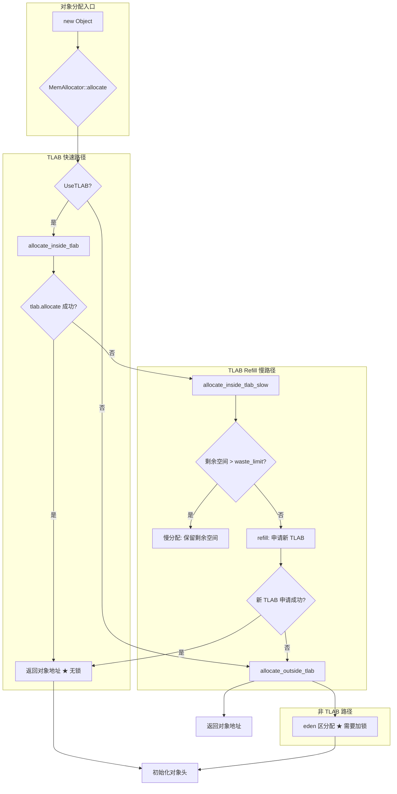
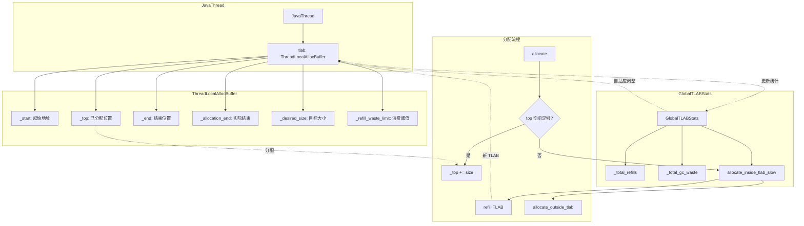

# TLAB 深度解析

> 方法论：程序 = 数据结构 + 算法
> 基于 OpenJDK 11 slowdebug，标准环境：-Xms8g -Xmx8g -XX:+UseG1GC
> G1 Region = 4MB，TLAB 默认目标大小约 1MB

---

## 第 0 部分：核心原理 ⭐

### 0.1 本质是什么？

本文深入分析 **TLAB 深度解析**：从源码角度理解其设计原理、实现机制和关键细节。

### 0.2 为什么需要？

理解 JVM 内部实现是排查复杂问题、进行性能优化的基础。表面的 API 文档无法解释 JVM 的实际行为，只有深入源码才能建立精确的心智模型。

### 0.3 怎么解决？

结合源码阅读、数据结构分析和 GDB 运行时验证，从多个角度建立对该机制的完整理解。

### 0.4 为什么这样设计？

每个设计决策都有其权衡：性能 vs 正确性、简单性 vs 灵活性、内存占用 vs 查找速度。理解这些权衡是理解 JVM 设计的关键。

---


## 一、宏观理解

### 1.1 解决什么问题

**为什么需要 TLAB（Thread-Local Allocation Buffer）？**

在多线程环境下，对象分配是极其频繁的操作。如果每个对象分配都需要加锁（如过去的全局 Eden 指针），并发性能会极差。

```
场景对比：

全局指针分配（旧方案）：
  Thread A: lock() → allocate → unlock()  → [等待]
  Thread B:                [等待] → lock() → allocate → unlock()
  Thread C:                                      [等待] → ...
  
  问题：线程越多，等待越久，性能呈线性下降

TLAB 分配（新方案）：
  Thread A: [TLAB A] 独立分配，无需加锁
  Thread B: [TLAB B] 独立分配，无需加锁  
  Thread C: [TLAB C] 独立分配，无需加锁
  
  优势：各线程独立，只有 TLAB 耗尽才需加锁申请新 TLAB
```

**TLAB 的核心设计目标**：
1. **无锁分配** - 99% 的对象分配在 TLAB 内完成，无需加锁
2. **减少冲突** - 只有 TLAB refill 时才需要获取eden区锁
3. **内存局部性** - 对象在 TLAB 内连续分配，CPU 缓存命中率更高
4. **自适应调整** - 根据线程分配速率动态调整 TLAB 大小

### 1.2 整体架构图



### 1.3 涉及的数据结构清单

| # | 数据结构 | 文件 | 核心作用 |
|---|---------|------|---------|
| 1 | ThreadLocalAllocBuffer | threadLocalAllocBuffer.hpp | 线程本地的分配缓冲区的核心数据结构 |
| 2 | GlobalTLABStats | threadLocalAllocBuffer.hpp | TLAB 全局统计数据 |
| 3 | MemAllocator | memAllocator.hpp | 对象分配的内存分配器 |
| 4 | ObjAllocator | memAllocator.hpp | 普通对象的分配器 |
| 5 | HeapWord* | collectedHeap.hpp | 堆内存地址类型 |

---

## 二、数据结构全景 ⭐

### 2.1 ThreadLocalAllocBuffer（线程本地分配缓冲区）

> **核心作用**：每个 Java 线程私有的 Eden 区分配缓冲区，实现无锁对象分配。

#### 2.1.1 完整字段列表

```cpp
// threadLocalAllocBuffer.hpp:46-73
class ThreadLocalAllocBuffer: public CHeapObj<mtThread> {
private:
  // ====== 核心指针字段（5个）======
  HeapWord* _start;                // TLAB 起始地址 ★
  HeapWord* _top;                 // 已分配地址（下次分配从这开始）★
  HeapWord* _pf_top;              // 预取水线
  HeapWord* _end;                 // TLAB 结束地址（可调整用于采样）★
  HeapWord* _allocation_end;      // 实际 TLAB 结束（不含保留区）★

  // ====== 大小控制字段（4个）======
  size_t    _desired_size;        // 期望大小（目标值）
  size_t    _refill_waste_limit; // 浪费阈值 ★ 控制是否 refill
  size_t    _allocated_before_last_gc;  // 上次 GC 前的分配量
  size_t    _bytes_since_last_sample_point;  // 上次采样点后的字节数

  // ====== 静态配置（3个）======
  static size_t   _max_size;                          // 最大 TLAB 大小
  static int      _reserve_for_allocation_prefetch;   // 预取保留区
  static unsigned _target_refills;                     // 目标 refill 次数

  // ====== 统计字段（6个）======
  unsigned  _number_of_refills;     // refill 次数
  unsigned  _fast_refill_waste;    // 快速 refill 浪费
  unsigned  _slow_refill_waste;    // 慢速 refill 浪费
  unsigned  _gc_waste;             // GC 时剩余空间
  unsigned  _slow_allocations;     // 慢分配次数
  size_t    _allocated_size;       // 总分配量

  // ====== 自适应调整======
  AdaptiveWeightedAverage _allocation_fraction;  // 分配比例平均值
};
```

#### 2.1.2 字段详解表

| 字段 | 类型 | 大小 | 含义 | 谁设置 | 何时 |
|------|------|------|------|--------|------|
| `_start` | HeapWord* | 8 | TLAB 起始地址 | `initialize()` | TLAB 分配时 |
| `_top` | HeapWord* | 8 | 已分配位置，下次分配从这里开始 | `allocate()` | 每次分配后 |
| `_end` | HeapWord* | 8 | 当前 TLAB 结束（可调整用于采样） | `initialize()` / `set_sample_end()` | 初始化/采样 |
| `_allocation_end` | HeapWord* | 8 | 实际结束（不含保留区） | `initialize()` | TLAB 分配时 |
| `_desired_size` | size_t | 8 | 目标大小（自适应） | `initialize()` / `resize()` | 初始化/GC后 |
| `_refill_waste_limit` | size_t | 8 | **浪费阈值**，控制是否 refill | `initialize()` / `record_slow_allocation()` | 初始化/慢分配 |

#### 2.1.3 sizeof 分析

```
ThreadLocalAllocBuffer sizeof（64位）：

指针字段：5 × 8 = 40 字节
size_t 字段：4 × 8 = 32 字节
unsigned 字段：6 × 4 = 24 字节
其他（对齐）≈ 8 字节
总计：≈ 104 字节

注：这是线程私有的，每个 Java 线程都有一份
```

#### 2.1.4 TLAB 内存布局图

```
┌─────────────────────────────────────────────────────────────┐
│                    TLAB 内存布局                            │
├─────────────────────────────────────────────────────────────┤
│                                                             │
│  _start ──→ ┌──────────────────────────────┐             │
│              │        已分配对象区域          │             │
│              │    [obj1][obj2][obj3]...    │             │
│              │              ↑               │             │
│  _top ─────→ │         _pf_top（预取）       │             │
│              │                              │             │
│              ├──────────────────────────────┤             │
│              │                              │             │
│              │       剩余空间（可用）        │             │
│              │        free() = _end-_top    │             │
│              │                              │             │
│  _end ─────→ ├──────────────────────────────┤             │
│              │       对齐保留区（安全区）     │             │
│              │    alignment_reserve()        │             │
│              │                              │             │
│_allocation_end→                            │             │
│              └──────────────────────────────┘             │
│                                                             │
│  关键设计：                                                │
│  1. _top 之前是已分配区域                                  │
│  2. _top 到 _end 之间是剩余可用空间                        │
│  3. _end 到 _allocation_end 是 C2 预取安全区              │
└─────────────────────────────────────────────────────────────┘
```

#### 2.1.5 关键字段的生命周期

**_top 字段的读写流程**：

```cpp
// threadLocalAllocBuffer.inline.hpp:34-54
// ★ 核心分配函数
inline HeapWord* ThreadLocalAllocBuffer::allocate(size_t size) {
  // Step 1: 验证 TLAB 状态
  invariants();
  
  // Step 2: 获取当前 top 位置
  HeapWord* obj = top();  // _top
  
  // Step 3: 检查剩余空间是否足够
  if (pointer_delta(end(), obj) >= size) {  // end() - top() >= size
    // ★ 成功：移动 top 指针
    set_top(obj + size);    // _top = _top + size
    
    // Step 4: 返回对象地址（无需加锁！）
    invariants();
    return obj;
  }
  
  // Step 5: 空间不足，返回 NULL（触发慢路径）
  return NULL;
}
```

**为什么 `_top += size` 不需要加锁？**

因为每个线程有自己独立的 TLAB，`_top` 是线程私有的，不存在并发竞争！

### 2.2 GlobalTLABStats（全局统计）

> **核心作用**：收集所有 TLAB 的统计数据，用于自适应调整。

#### 2.2.1 完整字段列表

```cpp
// threadLocalAllocBuffer.hpp:209-291
class GlobalTLABStats: public CHeapObj<mtThread> {
private:
  // ====== 聚合统计（12个）======
  unsigned _allocating_threads;     // 正在分配的线程数
  unsigned _total_refills;          // 总 refill 次数
  unsigned _max_refills;           // 最大 refill 次数
  size_t   _total_allocation;      // 总分配量
  size_t   _total_gc_waste;        // GC 时总浪费
  size_t   _max_gc_waste;          // 最大 GC 浪费
  size_t   _total_slow_refill_waste;   // 慢 refill 总浪费
  size_t   _max_slow_refill_waste;     // 最大慢 refill 浪费
  size_t   _total_fast_refill_waste;   // 快 refill 总浪费
  size_t   _max_fast_refill_waste;     // 最大快 refill 浪费
  unsigned _total_slow_allocations;    // 总慢分配次数
  unsigned _max_slow_allocations;      // 最大慢分配次数

  // ====== 性能计数器（11个）======
  PerfVariable* _perf_allocating_threads;
  PerfVariable* _perf_total_refills;
  // ... 省略其他 perf 变量

  // ====== 自适应平均======
  AdaptiveWeightedAverage _allocating_threads_avg;
};
```

#### 2.2.2 统计指标说明

| 指标 | 含义 | 用途 |
|------|------|------|
| `_total_refills` | 所有线程 refill 总次数 | 评估 TLAB 配置合理性 |
| `_total_gc_waste` | GC 时剩余空间总量 | 评估 TLAB 大小是否合适 |
| `_total_fast_refill_waste` | 快速 refill 浪费量 | refill 时剩余空间 < waste_limit |
| `_total_slow_refill_waste` | 慢速 refill 浪费量 | refill 时剩余空间 > waste_limit |
| `_total_slow_allocations` | 慢分配次数（直接走 eden） | 评估是否需要调大 TLAB |

---

## 三、算法/流程分析

### 3.1 对象分配主流程

#### 3.1.1 解决什么问题

**对象分配的完整路径是什么？如何在 TLAB 和 Eden 区之间选择？**

#### 3.1.2 核心源码：MemAllocator::allocate

```cpp
// memAllocator.cpp:373-387
// ★ 解决什么问题：对象的统一分配入口，根据配置选择 TLAB 或 Eden 区
oop MemAllocator::allocate() const {
  oop obj = NULL;
  {
    // Step 1: 创建分配上下文
    Allocation allocation(*this, &obj);
    
    // Step 2: 内存分配（核心逻辑）
    HeapWord* mem = mem_allocate(allocation);
    
    // Step 3: 初始化对象
    if (mem != NULL) {
      obj = initialize(mem);  // 设置对象头、Klass 指针
    } else {
      obj = NULL;  // 分配失败
    }
  }
  return obj;
}

// memAllocator.cpp:362-371
// ★ 解决什么问题：根据 UseTLAB 配置选择快速或慢速路径
HeapWord* MemAllocator::mem_allocate(Allocation& allocation) const {
  // Step 1: 如果启用 TLAB，优先尝试 TLAB 分配
  if (UseTLAB) {
    HeapWord* result = allocate_inside_tlab(allocation);  // ★ 快速路径
    if (result != NULL) {
      return result;  // ★ TLAB 分配成功，无锁返回
    }
  }

  // Step 2: TLAB 失败或禁用，走慢速路径（eden 区）
  return allocate_outside_tlab(allocation);  // ★ 需要加锁
}
```

**设计决策**：
1. **为什么先试 TLAB？** TLAB 分配无需加锁，性能最好
2. **为什么 TLAB 失败后还要试？** 可能 TLAB 已耗尽，但仍可在 Eden 区分配

### 3.2 TLAB 快速分配

#### 3.2.1 解决什么问题

**如何在 TLAB 中快速分配对象？**

#### 3.2.2 核心源码：allocate_inside_tlab

```cpp
// memAllocator.cpp:284-295
// ★ 解决什么问题：尝试从线程私有 TLAB 分配（无锁）
HeapWord* MemAllocator::allocate_inside_tlab(Allocation& allocation) const {
  assert(UseTLAB, "should use UseTLAB");

  // Step 1: 尝试从现有 TLAB 分配 ★ 核心逻辑
  HeapWord* mem = _thread->tlab().allocate(_word_size);
  if (mem != NULL) {
    return mem;  // ★★★ 成功！无需加锁，返回对象地址
  }

  // Step 2: TLAB 空间不足，走慢速路径（refill 或放弃）
  return allocate_inside_tlab_slow(allocation);
}
```

**设计决策**：
- **为什么 `tlab().allocate()` 不需要加锁？** 每个线程有独立的 TLAB，`_top` 是线程私有的

### 3.3 TLAB 慢速分配（refill）

#### 3.3.1 整体流程（7 个阶段）

| Phase | 名称 | 说明 |
|-------|------|------|
| 1 | 采样检查 | 如果启用了堆采样，先尝试从采样点分配 |
| 2 | 浪费阈值判断 | 剩余空间是否超过 `refill_waste_limit`？ |
| 3 | 计算新 TLAB 大小 | 根据分配历史自适应计算 |
| 4 | 清理旧 TLAB | `clear_before_allocation()` 记录浪费量 |
| 5 | 申请新 TLAB | 调用 heap 分配新 TLAB |
| 6 | 初始化 TLAB | `fill()` 设置新 TLAB 的 start/top/end |
| 7 | 分配对象 | 返回对象地址 |

#### 3.3.2 Phase 1-2：采样检查 + 浪费判断

```cpp
// memAllocator.cpp:297-317
// ★ 解决什么问题：TLAB 空间不足时的处理策略
HeapWord* MemAllocator::allocate_inside_tlab_slow(Allocation& allocation) const {
  HeapWord* mem = NULL;
  ThreadLocalAllocBuffer& tlab = _thread->tlab();

  // ====== Phase 1: 堆采样检查 ======
  if (ThreadHeapSampler::enabled()) {
    // 如果启用了堆采样，可能采样点还没到
    tlab.set_back_allocation_end();  // 恢复采样前的 end
    mem = tlab.allocate(_word_size);
    if (mem != NULL) {
      allocation._tlab_end_reset_for_sample = true;
      return mem;  // 采样点分配成功
    }
  }

  // ====== Phase 2: 浪费阈值判断 ★ 关键设计 ======
  // 场景：TLAB 快用完了，要分配一个 40KB 的对象
  // 
  // 情况A：剩余空间 = 50KB（> 32KB 浪费限制）
  //   → 不换 TLAB，直接在 Eden 慢路径分配
  //   → 因为丢掉 50KB 太浪费了
  //
  // 情况B：剩余空间 = 20KB（< 32KB 浪费限制）
  //   → 换一个新的 TLAB
  //   → 因为剩余空间不多，浪费可接受
  if (tlab.free() > tlab.refill_waste_limit()) {
    // ★ 剩余空间太大，放弃 TLAB，在 Eden 区分配
    tlab.record_slow_allocation(_word_size);  // 记录慢分配
    return NULL;  // 返回 NULL，触发外部的 allocate_outside_tlab
  }

  // ====== Phase 3-7: 需要 refill ======
  // ... 继续执行
}
```

**设计决策**：
- **为什么用 `refill_waste_limit` 控制是否 refill？** 避免"极端情况"：TLAB 剩余空间很多，但来了个大对象，此时与其 refill 不如直接走 Eden 区慢分配
- **默认值是多少？** 32KB（`initial_refill_waste_limit() = desired_size() / TLABRefillWasteFraction`，默认 64KB / 2 = 32KB）

#### 3.3.3 Phase 3-7：计算大小 + 清理 + 申请 + 初始化 + 分配

```cpp
// memAllocator.cpp:318-360
  // ====== Phase 3: 计算新 TLAB 大小 ======
  // 自适应调整：根据历史分配量计算合适的 TLAB 大小
  size_t new_tlab_size = tlab.compute_size(_word_size);

  // ====== Phase 4: 清理旧 TLAB ======
  tlab.clear_before_allocation();  // 记录 GC 前的浪费

  if (new_tlab_size == 0) {
    return NULL;  // 无法分配新 TLAB
  }

  // ====== Phase 5: 申请新 TLAB（需要加锁！）======
  size_t min_tlab_size = ThreadLocalAllocBuffer::compute_min_size(_word_size);
  // ★ 调用 heap 分配新 TLAB（eden 区），需要获取全局锁
  mem = _heap->allocate_new_tlab(min_tlab_size, new_tlab_size, 
                                   &allocation._allocated_tlab_size);
  if (mem == NULL) {
    return NULL;  // Eden 区也没有空间
  }

  // ====== Phase 6: 初始化 TLAB（设置指针）======
  // 填充 TLAB：_number_of_refills++, 设置 start/top/end
  tlab.fill(mem, mem + _word_size, allocation._allocated_tlab_size);
  
  // ====== Phase 7: 分配对象 ★ 无锁返回 ======
  return mem;  // 在新 TLAB 中分配
```

### 3.4 TLAB 分配尺寸计算

#### 3.4.1 核心源码：compute_size

```cpp
// threadLocalAllocBuffer.inline.hpp:56-74
// ★ 解决什么问题：根据可用空间和分配需求，计算合适的 TLAB 大小
inline size_t ThreadLocalAllocBuffer::compute_size(size_t obj_size) {
  // Step 1: 获取当前线程还能分配的 Eden 空间
  // unsafe_max_tlab_alloc 是 JVM 的"hint"，表示还能分配多少
  const size_t available_size = Universe::heap()->unsafe_max_tlab_alloc(myThread()) /
                                                 HeapWordSize;
                                                 
  // Step 2: 取三者的最小值
  // - available_size: 还能从 Eden 分配多少
  // - desired_size + obj_size: 期望大小 + 对象大小
  // - max_size: 最大 TLAB 大小
  size_t new_tlab_size = MIN3(available_size, 
                               desired_size() + align_object_size(obj_size), 
                               max_size());

  // Step 3: 确保能放下对象 + int[] 填充 + 保留区
  if (new_tlab_size < compute_min_size(obj_size)) {
    log_trace(gc, tlab)("TLAB: compute_size returns failure");
    return 0;  // 不够分配
  }
  
  return new_tlab_size;
}
```

### 3.5 TLAB 核心分配函数

#### 3.5.1 核心源码：ThreadLocalAllocBuffer::allocate

```cpp
// threadLocalAllocBuffer.inline.hpp:34-54
// ★ 解决什么问题：线程本地快速分配（无锁）
inline HeapWord* ThreadLocalAllocBuffer::allocate(size_t size) {
  // Step 1: 调试检查（ invariants() 验证 _start <= _top <= _end）
  invariants();
  
  // Step 2: 获取当前 top 位置
  HeapWord* obj = top();
  
  // Step 3: 检查剩余空间 ★ 关键检查
  // if (end - top >= size)
  if (pointer_delta(end(), obj) >= size) {
    // ★★★ TLAB 空间足够，分配成功！
    
#ifdef ASSERT
    // 调试：填充无效值，检测并发问题
    size_t hdr_size = oopDesc::header_size();
    Copy::fill_to_words(obj + hdr_size, size - hdr_size, badHeapWordVal);
#endif

    // Step 4: 移动 top 指针（线程私有，无需加锁）
    set_top(obj + size);  // _top = _top + size

    // Step 5: 验证并返回
    invariants();
    return obj;  // ★★★ 无锁返回！
  }
  
  // Step 6: 空间不足，返回 NULL 触发慢路径
  return NULL;
}
```

---

## 四、数据结构关系图



---

## 五、JVM 参数

### 5.1 TLAB 相关参数

| 参数 | 默认值 | 说明 |
|------|--------|------|
| `-XX:+UseTLAB` | true | 启用 TLAB |
| `-XX:TLABSize` | 0（自动） | TLAB 初始大小（字节） |
| `-XX:MinTLABSize` | 2KB | TLAB 最小大小 |
| `-XX:TLABRefillWasteFraction` | 64 | 浪费阈值 = desired_size / 此值 |
| `-XX:ResizeTLAB` | true | 启用 TLAB 自适应调整 |

### 5.2 G1 对 TLAB 的特殊处理

> G1 的 TLAB 分配与 Serial/Parallel 有显著差异。

#### 5.2.1 G1 的 MutatorAllocRegion

```cpp
// g1Allocator.hpp:45-52
// G1 特有：为每个 mutator（应用线程）维护一个分配区域
class G1Allocator {
  G1AllocRegion* _mutator_alloc_region;  // ★ 当前分配区域
  
  // TLAB refill 时会调用这个
  size_t unsafe_max_tlab_alloc() {
    HeapRegion* hr = mutator_alloc_region()->get();
    size_t max_tlab = _g1h->max_tlab_size() * wordSize;
    if (hr == NULL) {
      return max_tlab;  // 没有分配区域，返回最大值
    } else {
      // 返回：min(剩余空间, 最大TLAB, MinTLABSize)
      return MIN2(MAX2(hr->free(), (size_t) MinTLABSize), max_tlab);
    }
  }
};
```

#### 5.2.2 G1 TLAB 限制

```cpp
// g1CollectedHeap.cpp:397-404
// ★ 解决什么问题：G1 中 TLAB 不能超过 humongous threshold
HeapWord* G1CollectedHeap::allocate_new_tlab(size_t min_size,
                                             size_t requested_size,
                                             size_t *actual_size) {
  // G1 限制：不允许 humongous TLAB
  assert(!is_humongous(requested_size), "we do not allow humongous TLABs");
  
  return attempt_allocation(min_size, requested_size, actual_size);
}
```

**设计决策**：
- **为什么 G1 不允许 humongous TLAB？** 
  - humongous 对象需要跨越多个 Region，TLAB 是单 Region 内的连续空间
  - 如果允许 humongous TLAB，会导致分配逻辑复杂度大幅增加

#### 5.2.3 G1 vs Serial GC TLAB 对比

| 特性 | Serial/Parallel GC | G1 GC |
|------|-------------------|-------|
| TLAB 分配区域 | Eden 区连续空间 | MutatorAllocRegion |
| TLAB 大小限制 | max_size | humongous threshold |
| 碎片化处理 | 简单 | 复杂（Region 概念） |
| NUMA 支持 | 较差 | 较好（Region 本地化） |

### 5.3 TLAB 采样机制

> 用途：用于 heap 采样，分析对象分配模式

```cpp
// threadLocalAllocBuffer.cpp:390-402
// ★ 解决什么问题：定期采样，分析分配模式
void ThreadLocalAllocBuffer::set_sample_end() {
  size_t heap_words_remaining = pointer_delta(_end, _top);
  size_t bytes_until_sample = myThread()->heap_sampler().bytes_until_sample();
  size_t words_until_sample = bytes_until_sample / HeapWordSize;

  if (heap_words_remaining > words_until_sample) {
    // 设置一个较早的 end，触发采样
    HeapWord* new_end = _top + words_until_sample;
    set_end(new_end);  // 下次分配会触发采样
    _bytes_since_last_sample_point = bytes_until_sample;
  }
}
```
| `-XX:TLABAllocationWeight` | 35 | 线程分配权重（自适应） |

### 5.2 日志参数

```bash
# 开启 TLAB 日志
-Xlog:gc+tlab=trace
```

**输出示例**：

```
[2024-01-15T10:23:45.123+0800][trace] TLAB: fill thread: 0x7f8a9c010000 [id: 1] desired_size: 131KB -> 131KB refills: 1 alloc: 0.50000 500KB refills: 1 waste 0.0% gc: 0B slow: 0B fast: 0B
```

---

## 六、GDB 验证

### 6.1 验证计划

| # | 验证项 | 方法 | 预期结果 |
|---|--------|------|---------|
| 1 | TLAB 字段偏移 | `p java_lang_ref_Reference::referent_offset` | - |
| 2 | Thread::tlab() | `p Thread::_tlab` | 线程的 TLAB 地址 |
| 3 | TLAB 指针验证 | 断点 `allocate` | `_top` 移动 |
| 4 | TLAB 大小 | `p tlab.desired_size()` | ~1MB（G1 默认） |

### 6.2 GDB 脚本

```bash
# 保存到 new-jvm-md/tmp-file/tlab/verify_tlab.gdb

set pagination off
set print pretty on

file /data/workspace/openjdk-cut-new/build/linux-x86_64-normal-server-slowdebug/jdk/lib/server/libjvm.so

# ===== 验证 TLAB 结构体大小 =====
echo \n===== ThreadLocalAllocBuffer sizeof =====\n
print sizeof(ThreadLocalAllocBuffer)

# ===== 验证 TLAB 字段偏移 =====
echo \n===== TLAB 字段偏移 =====\n
print ThreadLocalAllocBuffer::start_offset()
print ThreadLocalAllocBuffer::top_offset()
print ThreadLocalAllocBuffer::end_offset()
print ThreadLocalAllocBuffer::size_offset()
print ThreadLocalAllocBuffer::refill_waste_limit_offset()

# ===== 断点：TLAB 分配 =====
break ThreadLocalAllocBuffer::allocate
commands 1
  echo \n[TLAB allocate called]\n
  print *this
  print size
  continue
end

quit
```

---

## 七、总结

### 7.1 数据结构层面

| 数据结构 | 核心特征 | 设计意图 |
|---------|---------|---------|
| ThreadLocalAllocBuffer | 线程私有 `_start/_top/_end` 指针 | 无锁分配的核心 |
| GlobalTLABStats | 12 项聚合统计 | 自适应调整的基础 |
| _refill_waste_limit | 动态阈值（默认 32KB） | 控制 TLAB 复用策略 |

### 7.2 算法层面

| 算法 | 核心设计 | 性能特征 |
|------|---------|---------|
| allocate() | 先 TLAB 后 Eden | 99% 无锁 |
| allocate_inside_tlab() | `_top += size` | O(1) 无锁 |
| allocate_inside_tlab_slow() | 浪费判断 + refill | 减少内部碎片 |
| compute_size() | MIN3(可用、期望、最大) | 自适应 |

### 7.3 关键设计决策

1. **为什么 TLAB 是线程私有的？** 避免锁竞争，实现无锁分配
2. **为什么有 `_refill_waste_limit`？** 避免"大对象 + 大剩余空间"场景下的糟糕决策
3. **为什么 `_top += size` 不需要原子操作？** 线程私有，无并发
4. **为什么有 alignment_reserve？** C2 预取指令需要安全区

---

## 八、延伸阅读

- **[2-Object-Allocation-Flow-Deep-Dive.md](../ObjectModel/2-Object-Allocation-Flow-Deep-Dive.md)**：对象分配流程
- **[1-Oop-Klass-Architecture-Deep-Dive.md](../ObjectModel/1-Oop-Klass-Architecture-Deep-Dive.md)**：对象内存布局
- **[G1GC/3-Object-Allocation-Path.md](../G1GC/3-Object-Allocation-Path.md)**：G1 对象分配
- **[G1GC/1-HeapRegion-Deep-Dive.md](../G1GC/1-HeapRegion-Deep-Dive.md)**：HeapRegion 详解
