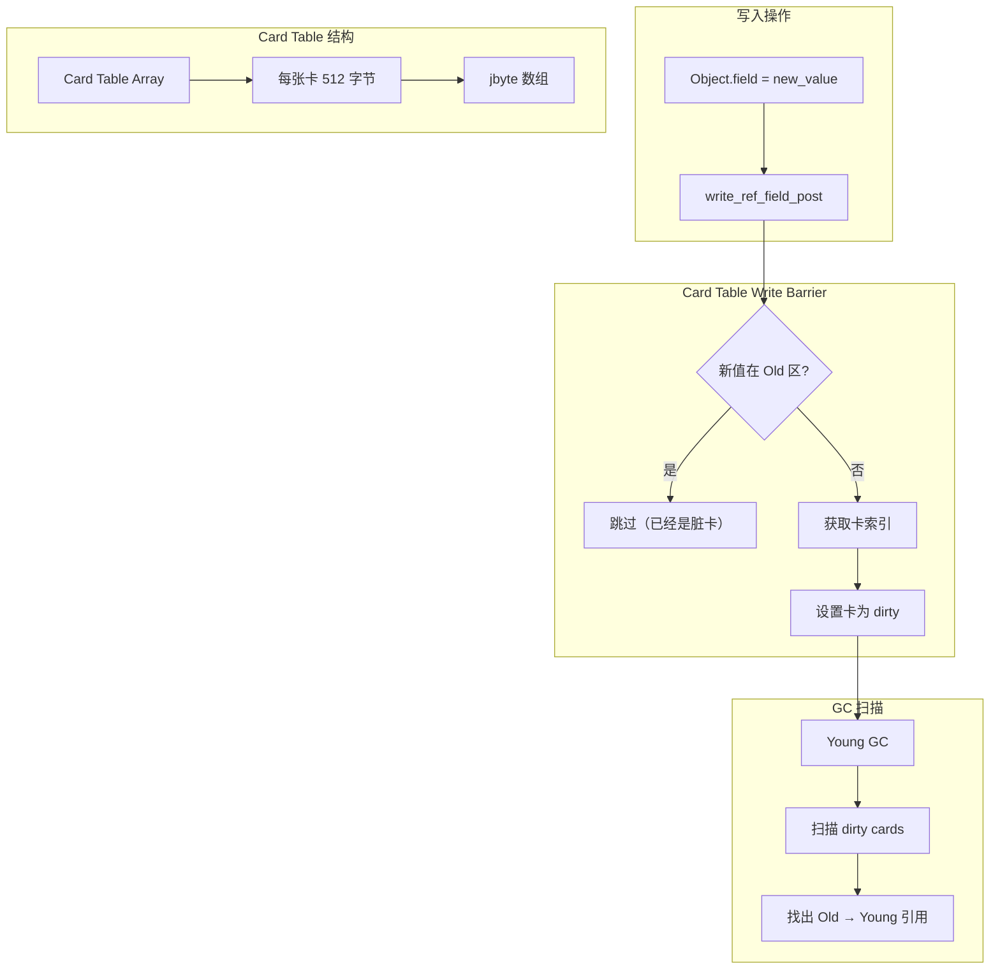
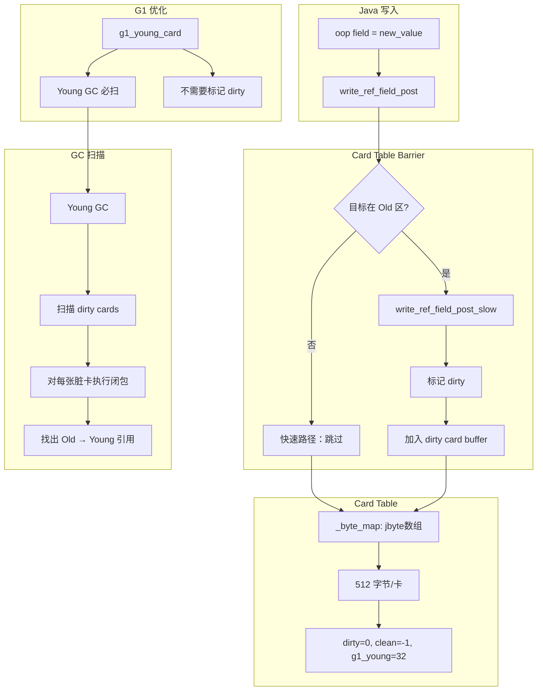

# Card Table 与 Write Barrier 深度解析

> 方法论：程序 = 数据结构 + 算法
> 基于 OpenJDK 11 slowdebug，标准环境：-Xms8g -Xmx8g -XX:+UseG1GC

---

## 第 0 部分：核心原理 ⭐

### 0.1 本质是什么？

本文深入分析 **Card Table 与 Write Barrier 深度解析**：从源码角度理解其设计原理、实现机制和关键细节。

### 0.2 为什么需要？

理解 JVM 内部实现是排查复杂问题、进行性能优化的基础。表面的 API 文档无法解释 JVM 的实际行为，只有深入源码才能建立精确的心智模型。

### 0.3 怎么解决？

结合源码阅读、数据结构分析和 GDB 运行时验证，从多个角度建立对该机制的完整理解。

### 0.4 为什么这样设计？

每个设计决策都有其权衡：性能 vs 正确性、简单性 vs 灵活性、内存占用 vs 查找速度。理解这些权衡是理解 JVM 设计的关键。

---


## 一、宏观理解

### 1.1 解决什么问题

**为什么需要 Card Table？**

在分代 GC 中，存在"跨代引用"问题：

```
场景：Young GC（Minor GC）

目标：回收 Young 区（Eden + Survivor）
问题：Young 区对象可能被 Old 区对象引用

┌─────────────────────────────────────────────────────┐
│                      Old 区                         │
│                                                      │
│   [obj Old1] ───────────┐                           │
│   [obj Old2] ──────────┼──→ 引用 ─→ [obj Young]   │
│   [obj Old3] ─────────┘                           │
│                                                      │
├─────────────────────────────────────────────────────┤
│                    Young 区                          │
│                                                      │
│   [obj Young1]    [obj Young2]    [obj Young3]    │
│                                                      │
└─────────────────────────────────────────────────────┘

Young GC 需要：
1. 找出所有 Old → Young 的引用
2. 这些引用的目标不能被回收

方法 A：扫描整个堆（太慢！）
方法 B：Card Table（只扫描脏卡）✓
```

### 1.2 整体架构图



### 1.3 涉及的数据结构清单

| # | 数据结构 | 文件 | 核心作用 |
|---|---------|------|---------|
| 1 | CardTable | cardTable.hpp | 卡表核心数据结构 |
| 2 | G1CardTable | g1CardTable.hpp | G1 专用卡表 |
| 3 | CardTableBarrierSet | cardTableBarrierSet.hpp | 写屏障实现 |
| 4 | G1BarrierSet | g1BarrierSet.hpp | G1 写屏障 |
| 5 | HeapWord* | collectedHeap.hpp | 堆地址类型 |

---

## 二、数据结构全景 ⭐

### 2.1 CardTable（通用卡表）

> **核心作用**：将堆内存划分为固定大小的卡（512字节），跟踪哪些区域被修改。

#### 2.1.1 完整字段列表

```cpp
// cardTable.hpp:33-107
class CardTable: public CHeapObj<mtGC> {
protected:
  // ====== 配置字段 ======
  const bool      _scanned_concurrently;  // 是否支持并发扫描
  const MemRegion _whole_heap;          // 卡表覆盖的整个堆区域
  
  // ====== 大小字段 ======
  size_t          _guard_index;        // 最后一个哨兵卡的索引
  size_t          _last_valid_index;   // 最后一个有效卡的索引
  const size_t    _page_size;          // 页面大小
  size_t          _byte_map_size;      // 卡表字节数组大小
  
  // ====== 卡表数组 ★ 核心！======
  jbyte*          _byte_map;           // 卡表字节数组
  jbyte*          _byte_map_base;      // 数组基地址（调整后）
  
  // ====== 覆盖区域 ======
  int             _cur_covered_regions;  // 当前覆盖的区域数
  MemRegion*     _covered;             // 覆盖的区域数组
  MemRegion*     _committed;           // 提交的区域数组
  MemRegion      _guard_region;        // 哨兵区域
};
```

#### 2.1.2 字段详解表

| 字段 | 类型 | 大小 | 含义 | 谁设置 | 何时 |
|------|------|------|------|--------|------|
| `_byte_map` | jbyte* | 8 | 卡表数组指针 | 构造函数 | 初始化 |
| `_scanned_concurrently` | bool | 1 | 并发扫描支持 | 构造函数 | 创建时 |
| `card_shift` | int | 4 | 9（512=2^9） | 常量 | 编译时 |
| `card_size` | int | 4 | 每张卡覆盖 512 字节 | 常量 | 编译时 |

#### 2.1.3 Card Table 内存布局

```
8GB 堆的 Card Table：

堆地址范围：0x00000000 - 0x200000000 (8GB)
卡大小：512 字节
卡数量：8GB / 512 = 16M 张卡

卡表数组：16M × 1 byte = 16MB

┌──────────────────────────────────────────────────────────────┐
│                    Card Table Memory                          │
├──────────────────────────────────────────────────────────────┤
│                                                              │
│  _byte_map_base ──→ [0xFF] [0x00] [0xFF] [dirty] ...      │
│                        │      │      │      │                │
│  指向堆起始地址    堆起始   卡0    卡1   卡2               │
│  之前的某个位置   地址对应                                       │
│                                                              │
│  脏卡(dirty=0): 该区域有对象被修改，需要扫描                   │
│  干净(clean=-1): 该区域无修改                                 │
│                                                              │
└──────────────────────────────────────────────────────────────┘

卡值定义（cardTable.hpp:96-107）：
  clean_card       = -1 (0xFF)   // 干净
  dirty_card       =  0           // 脏
  precleaned_card  =  1           // 预清理
  claimed_card     =  2           // 已声明（多线程用）
  deferred_card    =  4           // 延迟
  g1_young_gen    = 32           // G1 年轻代专用
```

#### 2.1.4 地址到卡的映射

```cpp
// cardTable.hpp:156-165
// ★ 解决什么问题：给定堆地址，找到对应的卡索引
jbyte* CardTable::byte_for(const void* p) const {
  // Step 1: 边界检查
  assert(_whole_heap.contains(p),
         "Address out of bounds");
         
  // Step 2: 右移 9 位 = 除以 512，得到卡索引
  // ★ 核心公式：card_index = (address - heap_start) / 512
  jbyte* result = &_byte_map_base[uintptr_t(p) >> card_shift];
  
  // Step 3: 边界检查
  assert(result >= _byte_map && result < _byte_map + _byte_map_size,
         "out of bounds accessor");
         
  return result;
}
```

**为什么用右移而非除法？**
- `p >> 9` 比 `p / 512` 快得多（位运算 vs 除法）

### 2.2 G1CardTable（G1 专用卡表）

> **核心作用**：G1 的卡表实现，增加对年轻代和并发扫描的支持。

#### 2.2.1 完整字段列表

```cpp
// g1CardTable.hpp:47-55
class G1CardTable: public CardTable {
  G1CardTableChangedListener _listener;  // 监听 Region 提交事件
  
  // G1 专用卡值
  enum G1CardValues {
    g1_young_gen = CT_MR_BS_last_reserved << 1  // = 32
  };
};
```

#### 2.2.2 G1 专用卡值

| 卡值 | 常量名 | 含义 | 使用场景 |
|------|--------|------|---------|
| 0 | dirty_card | 脏 | 正常修改 |
| 32 | g1_young_gen | 年轻代 | 写入年轻代对象 |
| 2 | claimed_card | 已声明 | 并发扫描时避免重复 |
| 4 | deferred_card | 延迟 | 延迟处理 |

#### 2.2.3 G1 的优化：为什么需要 g1_young_card？

```cpp
// g1BarrierSet.inline.hpp:49-55
// ★ G1 优化：写入目标是年轻代时，走快速路径
inline void G1BarrierSet::write_ref_field_post(T* field, oop new_val) {
  volatile jbyte* byte = _card_table->byte_for(field);
  
  // ★ 关键优化：如果卡已经是 g1_young，不需要再标记为 dirty
  if (*byte != G1CardTable::g1_young_card_val()) {
    // 只有目标是 Old 区才标记为 dirty
    write_ref_field_post_slow(byte);
  }
}
```

**设计决策**：
- **为什么区分 g1_young？** 
  - 写入年轻代对象的频率远高于老年代
  - 年轻代的卡在 Young GC 时一定会被扫描，不需要标记为 dirty
  - 减少 dirty card 数量，提高扫描效率

### 2.3 CardTableBarrierSet（写屏障实现）

> **核心作用**：在引用写入时自动触发卡表更新。

#### 2.3.1 完整字段列表

```cpp
// cardTableBarrierSet.hpp:45-53
class CardTableBarrierSet: public ModRefBarrierSet {
protected:
  bool       _defer_initial_card_mark;  // 是否延迟标记
  CardTable* _card_table;               // 卡表指针 ★
};
```

---

## 三、算法/流程分析

### 3.1 Write Barrier 主流程

#### 3.1.1 解决什么问题

**当对象字段被写入时，如何自动更新 Card Table？**

#### 3.1.2 核心源码：write_ref_field_post

```cpp
// cardTableBarrierSet.inline.hpp:32-41
// ★ 解决什么问题：对象引用写入后，自动将对应卡标记为 dirty
template <DecoratorSet decorators, typename T>
inline void CardTableBarrierSet::write_ref_field_post(T* field, oop newVal) {
  // Step 1: 获取字段对应的卡地址
  volatile jbyte* byte = _card_table->byte_for(field);
  
  // Step 2: 根据是否并发扫描，选择不同的写入方式
  if (_card_table->scanned_concurrently()) {
    // ★ 并发扫描支持：使用 release 语义
    // 确保先完成写操作，再标记卡为脏
    OrderAccess::release_store(byte, CardTable::dirty_card_val());
  } else {
    // ★ 非并发：直接写入
    *byte = CardTable::dirty_card_val();
  }
}
```

**设计决策**：
- **为什么需要 `OrderAccess::release_store`？**
  - 并发 GC（如 G1）在扫描卡表时，可能与mutator并发执行
  - release 语义确保：先完成对象写入，再标记卡为脏
  - 否则可能出现：对象已写入，但卡未标记，导致漏扫描

### 3.2 G1 Write Barrier 优化路径

#### 3.2.1 解决什么问题

**G1 如何优化减少不必要的卡标记？**

#### 3.2.2 核心源码：G1 的 write_ref_field_post

```cpp
// g1BarrierSet.inline.hpp:48-55
// ★ 解决什么问题：G1 优化——如果目标是年轻代，直接跳过
inline void G1BarrierSet::write_ref_field_post(T* field, oop new_val) {
  // Step 1: 获取字段对应的卡地址
  volatile jbyte* byte = _card_table->byte_for(field);
  
  // Step 2: ★ G1 优化：如果卡已经是 g1_young，不需要重复标记
  if (*byte != G1CardTable::g1_young_card_val()) {
    // 只有目标是 Old 区才标记为 dirty（走慢路径）
    write_ref_field_post_slow(byte);
  }
  // 如果是年轻代，直接返回（快速路径）
}
```

### 3.3 慢路径：write_ref_field_post_slow

#### 3.3.1 核心源码

```cpp
// g1BarrierSet.cpp:80-95
// ★ 解决什么问题：慢路径——标记脏卡，可能触发 Refine
void G1BarrierSet::write_ref_field_post_slow(volatile jbyte* byte) {
  // Step 1: 设置为脏卡
  *byte = CardTable::dirty_card_val();
  
  // Step 2: ★ 关键：加入脏卡缓冲区
  // 触发 Concurrent Refine 线程处理
  G1ThreadLocalData::add_dirty_card_buffer(
      JavaThread::current(), 
      byte);
}
```

**设计决策**：
- **为什么需要缓冲区？** 
  - 每次写屏障都直接处理太慢
  - 放入缓冲区，批量处理
  - 减少锁竞争

### 3.4 GC 扫描：dirty_card_iterate

#### 3.4.1 解决什么问题

**Young GC 时，如何快速找出 Old → Young 的引用？**

#### 3.4.2 核心源码

```cpp
// cardTable.cpp:200-220
// ★ 解决什么问题：遍历脏卡，对每张卡执行闭包
void CardTable::dirty_card_iterate(MemRegion mr, MemRegionClosure* cl) {
  // Step 1: 计算卡范围
  jbyte* first = byte_for(mr.start());
  jbyte* last = byte_for(mr.end()) - 1;
  
  // Step 2: 遍历脏卡
  for (jbyte* p = first; p <= last; p++) {
    if (*p == dirty_card_val()) {
      // Step 3: 执行闭包处理该卡
      cl->do_MemRegion(p);
    }
  }
}
```

---

## 四、数据结构关系图



---

## 五、JVM 参数

### 5.1 Card Table 相关参数

| 参数 | 默认值 | 说明 |
|------|--------|------|
| `-XX:CardTableBlockSize` | 512 | 卡大小（字节） |
| `-XX:+UseCondCardMark` | false | 条件性卡标记（减少竞争） |

### 5.2 G1 Refine 相关参数

| 参数 | 默认值 | 说明 |
|------|--------|------|
| `-XX:G1UpdateBufferSize` | 256 | 脏卡缓冲区大小 |
| `-XX:+ParallelRefProcEnabled` | true | 并发处理 Refine |

### 5.3 日志参数

```bash
# 开启 Card Table 日志
-Xlog:gc+barrier=trace
-Xlog:gc+remset=trace
```

**输出示例**：

```
[2024-01-15T10:23:45.123+0800][trace] G1BarrierSet: Dirty card found at 0x7f8a9c000000
[2024-01-15T10:23:45.124+0800][trace] G1ConcurrentRefine: Processed 256 cards
```

---

## 六、GDB 验证

### 6.1 验证计划

| # | 验证项 | 方法 | 预期结果 |
|---|--------|------|---------|
| 1 | CardTable 地址 | `p Universe::_card_table` | 非空 |
| 2 | 卡大小 | `p CardTable::card_size` | 512 |
| 3 | 脏卡数量 | 遍历 byte_map | 动态变化 |

### 6.2 GDB 脚本

```bash
# 保存到 new-jvm-md/tmp-file/cardtable/verify_cardtable.gdb

set pagination off
set print pretty on

file /data/workspace/openjdk-cut-new/build/linux-x86_64-normal-server-slowdebug/jdk/lib/server/libjvm.so

# ===== 验证 CardTable 地址 =====
echo \n===== CardTable 全局变量 =====\n
p Universe::_card_table

# ===== 验证卡表结构体 =====\n
printf "CardTable addr: %p\n", Universe::_card_table
if Universe::_card_table != 0
    printf "  _byte_map: %p\n", Universe::_card_table->_byte_map
    printf "  _byte_map_size: %zu\n", Universe::_card_table->_byte_map_size
    printf "  card_size: %zu\n", Universe::_card_table->card_size
end

# ===== 验证卡值常量 =====
echo \n===== Card Values =====\n
p CardTable::clean_card
p CardTable::dirty_card
p CardTable::claimed_card
p CardTable::deferred_card

quit
```

---

## 七、总结

### 7.1 数据结构层面

| 数据结构 | 核心特征 | 设计意图 |
|---------|---------|---------|
| CardTable | `_byte_map` + 512 字节/卡 | 将堆划分为可跟踪的单元 |
| G1CardTable | `g1_young_card` 优化 | 减少 Young 区写入的标记开销 |
| CardTableBarrierSet | write_ref_field_post | 拦截引用写入，自动标记 |

### 7.2 算法层面

| 算法 | 核心设计 | 性能特征 |
|------|---------|---------|
| write_ref_field_post | 每次引用写入触发 | O(1) 但有开销 |
| G1 优化路径 | 检查 g1_young 跳过 | 大幅减少开销 |
| dirty_card_iterate | 扫描脏卡而非全堆 | O(n) n=脏卡数 |

### 7.3 关键设计决策

1. **为什么每张卡 512 字节？** 平衡粒度与开销——太大则扫描粗略，太小则卡表内存膨胀
2. **为什么需要写屏障？** 追踪"谁引用了我"——GC 需要找出跨代引用
3. **为什么 G1 用 g1_young 区分？** Young 区在 Young GC 必扫，无需标记 dirty
4. **为什么用 release_store？** 并发扫描需要内存序保证

---

## 八、延伸阅读

- **[G1GC/4-WriteBarrier-CardTable.md](../G1GC/4-WriteBarrier-CardTable.md)**：G1 Write Barrier 详解
- **[G1GC/5-RSet-Three-Level-Structure.md](../G1GC/5-RSet-Three-Level-Structure.md)**：Remembered Set 三层结构
- **[G1GC/6-Concurrent-Refinement.md](../G1GC/6-Concurrent-Refinement.md)**：并发 Refine 机制
- **[ObjectModel/4-TLAB-Deep-Dive.md](../ObjectModel/4-TLAB-Deep-Dive.md)**：TLAB 分配缓冲
