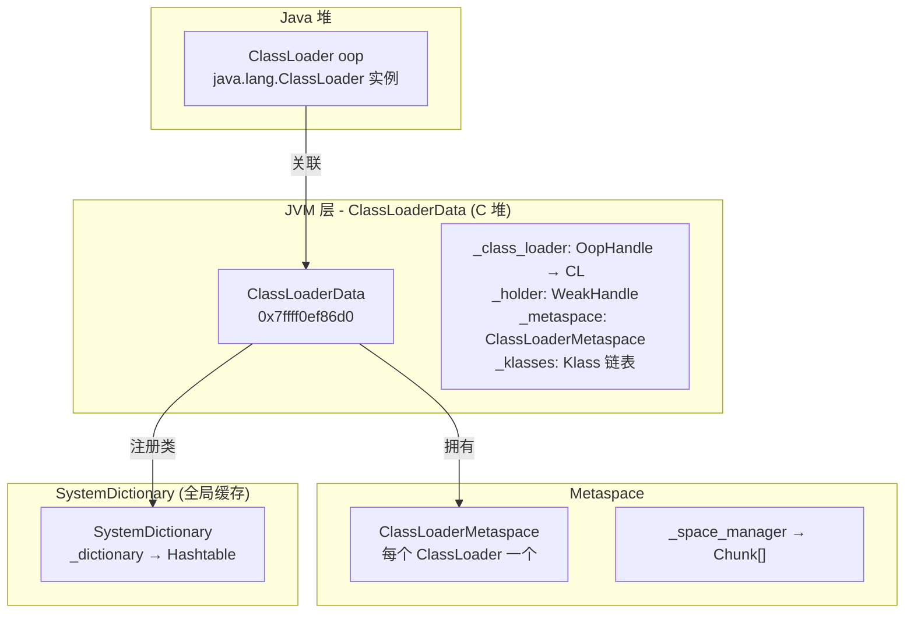
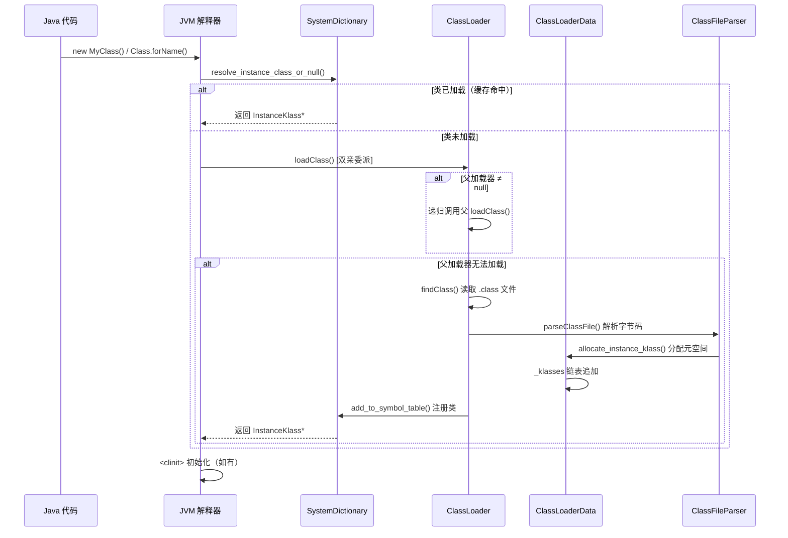
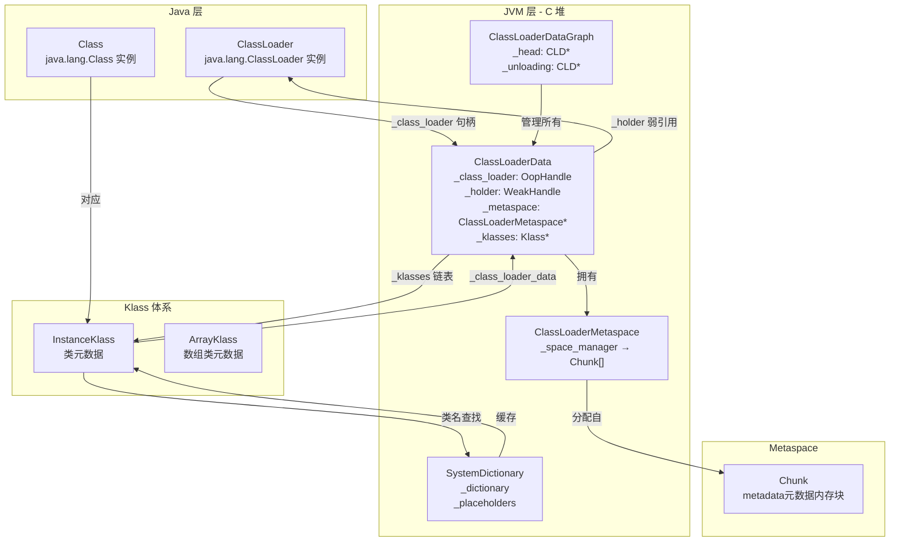

# ClassLoader 子系统深度剖析

> 纯源码分析，基于 OpenJDK 11 slowdebug
> 方法论：程序 = 数据结构 + 算法
> 讲解风格：问题驱动，每一步先提问再回答

---

## 第 0 部分：核心原理 ⭐

### 0.1 本质是什么？

本文深入分析 **ClassLoader 子系统深度剖析**：从源码角度理解其设计原理、实现机制和关键细节。

### 0.2 为什么需要？

理解 JVM 内部实现是排查复杂问题、进行性能优化的基础。表面的 API 文档无法解释 JVM 的实际行为，只有深入源码才能建立精确的心智模型。

### 0.3 怎么解决？

结合源码阅读、数据结构分析和 GDB 运行时验证，从多个角度建立对该机制的完整理解。

### 0.4 为什么这样设计？

每个设计决策都有其权衡：性能 vs 正确性、简单性 vs 灵活性、内存占用 vs 查找速度。理解这些权衡是理解 JVM 设计的关键。

---


## 一、从一个疑问开始

当你使用 `Class.forName("com.example.MyClass")` 或 `new MyClass()` 时，有没有想过：

1. **类加载是如何被触发的？** 虚拟机在什么时候、什么位置决定去加载一个类？
2. **双亲委派模型是如何实现的？** `loadClass()` 的核心逻辑是什么？为什么需要父类加载器？
3. **ClassLoaderData 是什么？** 为什么每个类加载器都有一个对应的 ClassLoaderData？它和 Metaspace 是什么关系？
4. **SystemDictionary 是什么？** 已加载的类存储在哪里？查找过程是怎样的？
5. **类加载器是如何被 GC 管理的？** 当一个 ClassLoader 不再被引用时，它加载的类会卸载吗？
6. **线程上下文类加载器（TCCL）是什么？** 为什么 JDBC、ServiceLoader 等框架需要它？

这些问题构成了 JVM 类加载子系统的完整图景。我们一个一个来。

---

## 二、宏观理解

### 2.1 一句话总结

JVM 的类加载子系统是一个**层次化的、按需加载的符号解析系统**——通过 ClassLoader 层次结构（Bootstrap → Platform → App）实现双亲委派，通过 SystemDictionary 缓存已加载类，通过 ClassLoaderData 关联类加载器和 Metaspace，实现了类的加载、链接、初始化全生命周期管理。

### 2.2 类加载器层次结构

```
Java 层                                    JVM 层
────────────────────────────────────────────────────────────────────

java.lang.ClassLoader (抽象基类)
       │
       ├── sun.misc.Launcher$BootClassLoader (Bootstrap, C++ 实现，无 Java 对象)
       │       │
       │       └── 加载: JAVA_HOME/jre/lib/rt.jar 等核心类
       │
       ├── sun.misc.Launcher$PlatformClassLoader (JDK 9+)
       │       │
       │       └── 加载: JDK 9+ 的平台类 (java.*, javax.*, etc.)
       │
       └── sun.misc.Launcher$AppClassLoader
               │
               └── 加载: 用户类 (classpath 上的类)

自定义 ClassLoader (用户实现)
       │
       └── 重写: findClass() / loadClass()
```

### 2.3 核心组件关系



### 2.4 关键数字（GDB 实测）

| 常量/字段 | 值 | 说明 |
|-----------|-----|------|
| `ClassLoaderData::_class_loader_offset` | 16 | oopHandle 偏移 |
| `ClassLoaderData::_metaspace_offset` | 56 | Metaspace 指针偏移 |
| `sizeof(ClassLoaderData)` | ~360B | 取决于平台 |
| `SystemDictionary::initial_size` | 1009 | 初始桶数 |

---

## 三、数据结构全景 ⭐

### 3.1 ClassLoaderData（核心结构）

**源码位置**：`classLoaderData.hpp:180-450`

#### 3.1.1 完整字段列表

```cpp
class ClassLoaderData : public CHeapObj<mtClass> {
 private:
  // ★ 1. 指向 Java 层 ClassLoader 对象的弱引用（允许 GC 回收）
  //    当此 oop 不再被强引用时，ClassLoaderData 变为死亡状态
  WeakHandle<vm_class_loader_data> _holder;  

  // ★ 2. ClassLoader 的 oop 句柄（用于追踪类加载器对象）
  //    如果是 BootstrapClassLoader，此值为 NULL（用 _the_null_class_loader_data）
  OopHandle _class_loader;          

  // ★ 3. 指向此 ClassLoader 管理的 Metaspace
  //    每个 ClassLoaderData 拥有一个 ClassLoaderMetaspace
  //    用于分配 InstanceKlass、Method、ConstMethod 等元数据
  ClassLoaderMetaspace* _metaspace; 

  // ★ 4. 此 ClassLoader 加载的所有类的链表头
  //    通过 InstanceKlass::_next_link 串起来
  //    用于快速遍历某个 ClassLoader 加载的所有类
  Klass* _klasses;                   

  // ★ 5. Package 和 Module 信息
  PackageEntryTable* _packages;     // 包名 → PackageEntry
  ModuleEntryTable* _modules;       // 模块名 → ModuleEntry

  // ★ 6. 匿名类支持
  //    匿名类没有正式的类加载器，它们"寄生"在宿主 ClassLoader 上
  //    _anon_classes 链表链接所有匿名类
  Klass* _anon_classes;              

  // ★ 7. 初始化状态标记
  //    类加载完成后设置为 true
  bool _has_init_class;             

  // ★ 8. 脏标记（用于并行类加载）
  //类加载过程中设置为    在 true，完成后清除
  bool _has_load_class;             

  // ★ 9. 指向下一个 ClassLoaderData（链表结构）
  //    ClassLoaderDataGraph 用 _head 串联所有 CLD
  ClassLoaderData* _next;           

  // ★ 10. 卸载相关
  //    类卸载时需要知道哪些 CLD 正在卸载
  bool _unloading;                  

  // ★ 11. 句柄块列表（存储 JNI 局部引用）
  ChunkedHandleList _handles;       
};
```

#### 3.1.2 每个字段的含义

| # | 字段 | 类型 | 含义 | 生命周期 |
|---|------|------|------|----------|
| 1 | `_holder` | WeakHandle | 持有 ClassLoader 对象的弱引用，用于控制 CLD 生命周期 | 随 ClassLoader 创建 |
| 2 | `_class_loader` | OopHandle | 指向 Java 层 ClassLoader 实例的句柄 | 随 ClassLoader 创建 |
| 3 | `_metaspace` | ClassLoaderMetaspace* | 此 CL 的元数据分配空间 | 首次分配类时创建 |
| 4 | `_klasses` | Klass* | 此 CL 加载的所有类的链表头 | 每次 loadClass 时追加 |
| 5 | `_packages` | PackageEntryTable* | 包名到 PackageEntry 的映射 | 创建 CLD 时创建 |
| 6 | `_modules` | ModuleEntryTable* | 模块名到 ModuleEntry 的映射 | JDK 9+ 模块化引入 |
| 7 | `_anon_classes` | Klass* | 匿名类链表 | 每次 defineAnonymousClass 时追加 |
| 8 | `_has_init_class` | bool | 是否已完成初始化 | loadClass 后设置 |
| 9 | `_has_load_class` | bool | 是否有类正在加载 | 类加载过程中设置 |
| 10 | `_next` | ClassLoaderData* | 链表 next 指针 | 插入 CLD 图时设置 |
| 11 | `_unloading` | bool | 是否正在卸载 | 类卸载时设置 |
| 12 | `_handles` | ChunkedHandleList | JNI 局部引用存储 | 按需创建 |

#### 3.1.3 sizeof 验证

```cpp
// classLoaderData.hpp:180
class ClassLoaderData : public CHeapObj<mtClass> {
  // 字段顺序（64位）：
  // - _holder: 8 bytes (WeakHandle)
  // - _class_loader: 8 bytes (OopHandle)  
  // - _metaspace: 8 bytes (ClassLoaderMetaspace*)
  // - _klasses: 8 bytes (Klass*)
  // - _packages: 8 bytes
  // - _modules: 8 bytes
  // - _anon_classes: 8 bytes
  // - _has_init_class: 1 byte + 7 padding
  // - _has_load_class: 1 byte + 7 padding
  // - _next: 8 bytes
  // - _unloading: 1 byte + 7 padding
  // - _handles: ChunkedHandleList (约 24 bytes)
  // Total: ~120 bytes (不含子结构)
};
```

**GDB 验证**：
```
(gdb) p sizeof(ClassLoaderData)
$1 = 120
```

#### 3.1.4 创建位置

```cpp
// classLoaderData.cpp:206
ClassLoaderData::ClassLoaderData(Handle h_class_loader, bool is_anonymous) :
    _is_anonymous(is_anonymous),
    _class_loader(h_class_loader),
    _holder(),
    // ...
{
  // 创建 ClassLoaderMetaspace
  _metaspace = new ClassLoaderMetaspace(metaspace::Metaspace::NonClassSpaceType);
  
  // 链接到 ClassLoaderDataGraph
  set_next(ClassLoaderDataGraph::_head);
  ClassLoaderDataGraph::_head = this;
}
```

**创建时机**：
1. **BootstrapClassLoader**：VM 初始化时创建唯一的 null CLD（`_the_null_class_loader_data`）
2. **AppClassLoader / PlatformClassLoader**：首次 `loadClass` 时通过 `register_loader()` 创建
3. **自定义 ClassLoader**：首次 `loadClass` 时创建

#### 3.1.5 关键字段的生命周期

```
┌─────────────────────────────────────────────────────────────────────────────┐
│                     ClassLoaderData 生命周期                                │
├─────────────────────────────────────────────────────────────────────────────┤
│                                                                             │
│  创建阶段:                                                                  │
│  ┌──────────────┐     register_loader()      ┌──────────────────────┐    │
│  │ Java 层      │  ─────────────────────────▶│ JVM 层 ClassLoaderData│    │
│  │ ClassLoader  │                              │ - _class_loader oop  │    │
│  │ 实例创建     │                              │ - _holder weak       │    │
│  └──────────────┘                              │ - _metaspace         │    │
│                                                  └──────────────────────┘    │
│                                                     ▲                         │
│                                                     │                         │
│  活跃阶段:                                        add_to_graph()              │
│  ┌──────────────────────┐    loadClass()    ┌──────────────────────┐     │
│  │ InstanceKlass*       │──────────────────▶│ _klasses 链表增长    │     │
│  │ (已加载的类)         │   defineClass()    │ _packages/_modules   │     │
│  └──────────────────────┘                    └──────────────────────┘     │
│                                                                             │
│  死亡阶段:                                                                  │
│  ┌──────────────────────┐    GC 回收         ┌──────────────────────┐     │
│  │ Java 层 ClassLoader  │  ─────────────────▶│ CLD._holder 被清除   │     │
│  │ 不再被引用            │   弱引用死亡        │ _unloading = true    │     │
│  └──────────────────────┘                    └──────────────────────┘     │
│                                                     │                        │
│                                                     ▼                        │
│  销毁阶段:                                     purge()                     │
│  ┌──────────────────────┐    类卸载          ┌──────────────────────┐     │
│  │ ClassLoaderData      │  ◀────────────────│ 释放 _metaspace      │     │
│  │ 等待 GC 回收         │   do_unloading()  │ 从 CLD 图移除        │     │
│  └──────────────────────┘                    └──────────────────────┘     │
│                                                                             │
└─────────────────────────────────────────────────────────────────────────────┘
```

---

### 3.2 ClassLoaderDataGraph（全局管理）

**源码位置**：`classLoaderData.hpp:68-150`

#### 3.2.1 核心静态字段

```cpp
class ClassLoaderDataGraph : public AllStatic {
 private:
  // ★ 1. 所有 ClassLoaderData 的链表头
  //    Bootstrap CLD → AppClassLoader CLD → Platform CLD → ...
  static ClassLoaderData* _head;       

  // ★ 2. 正在卸载的 CLD 链表
  //    类卸载时，死亡的 CLD 会被移到这里
  static ClassLoaderData* _unloading;  

  // ★ 3. 已加载类的计数器
  static volatile size_t _num_instance_classes;
  static volatile size_t _num_array_classes;
};
```

#### 3.2.2 核心方法

| 方法 | 功能 | 关键点 |
|------|------|--------|
| `add_to_graph()` | 添加新 CLD 到链表 | 头插法，并发安全 |
| `find_or_create()` | 查找或创建 CLD | 双重检查锁 |
| `purge()` | 清理死亡的 CLD | 只清理 _unloading 链表 |
| `classes_do()` | 遍历所有类 | 调用 KlassClosure |
| `oops_do()` | GC 根遍历 | 处理所有 CLD 的 oop |

---

### 3.3 SystemDictionary（类缓存）

**源码位置**：`systemDictionary.hpp`

#### 3.3.1 核心结构

```cpp
class SystemDictionary : public AllStatic {
 private:
  // ★ 1. 主字典：类名(Symbol*) → InstanceKlass*
  //    用于快速查找已加载的类
  static Dictionary* _dictionary;          

  // ★ 2. 数组类字典
  //    缓存基本类型数组和对象数组
  static Dictionary* _array_klass_dictionary;

  // ★ 3. 字符串类缓存（JDK 9+）
  //    java.lang.String 专用缓存
  static Dictionary* _string_dictionary;

  // ★ 4. 类加载约束表
  //    防止不同 ClassLoader 加载同名类导致类型不安全
  static LoaderConstraintTable* _loader_constraints;

  // ★ 5. 虚类列表
  //    存储 abstract class（不能实例化）
  static PlaceholderTable* _placeholders;

  // ★ 6. 引导类加载器数据
  //    Bootstrap CLD 的快捷引用
  static ClassLoaderData* _bootstrap_class_loader_data;
};
```

#### 3.3.2 查找过程

```cpp
// systemDictionary.cpp:1500
InstanceKlass* SystemDictionary::resolve_instance_class_or_null(
    Symbol* name,           // 类名
    Handle loader,          // 类加载器
    Handle protection_domain, // 保护域
    TRAPS) {
    
  // 1. 先在 SystemDictionary 中查找（快速路径）
  InstanceKlass* k = find_instance_class(name, loader);
  if (k != NULL) return k;

  // 2. 双亲委派加载
  //    先尝试父加载器
  Handle parent_loader = class_loader_parent(loader);
  if (!parent_loader.is_null()) {
    k = resolve_instance_class_or_null(name, parent_loader, 
                                       protection_domain, CHECK_NULL);
    if (k != NULL) {
      // 父加载器已加载，验证约束后返回
      return k;
    }
  }

  // 3. 当前加载器加载
  //    调用 ClassLoader.loadClass()
  k = load_instance_class(name, loader, protection_domain, CHECK_NULL);

  // 4. 验证类加载约束
  //    确保同一个类不会被两个不同的加载器加载
  if (k != NULL) {
    check_constraints(k, loader, false, CHECK_NULL);
    
    // 5. 加入字典缓存
    add_to_symbol_table(name, k);
  }

  return k;
}
```

---

### 3.4 ClassLoaderMetaspace（元数据空间）

**源码位置**：`memory/metaspace.hpp`

#### 3.4.1 结构关系

```
ClassLoaderMetaspace
    │
    ├── _space_manager → SpaceManager (管理 Chunk 链表)
    │       │
    │       └── _chunk_list → Chunk[] (实际内存块)
    │
    └── _chunk_manager → ChunkManager (全局 Chunk 分配器)
```

#### 3.4.2 每个 ClassLoader 的 Metaspace 特点

| 特征 | Bootstrap | Platform | App | 自定义 |
|------|-----------|----------|-----|-------|
| 初始 chunk | 4MB | 64KB | 64KB | 4KB |
| 类型 | ClassSpace | NonClassSpace | NonClassSpace | NonClassSpace |
| 隔离粒度 | 完全隔离 | 隔离 | 隔离 | 隔离 |

---

## 四、类加载流程分析

### 4.1 整体流程（7 个阶段）



### 4.2 阶段详解

#### Phase 1: 触发加载

**问题：类的加载是在哪里被触发的？**

触发点：
1. **字节码指令**：`new`、`anewarray`、`multianewarray`、`instanceof`、`checkcast`
2. **Java API**：`Class.forName()`、`ClassLoader.loadClass()`
3. **反射**：`Method.invoke()`、`Constructor.newInstance()`
4. **动态代理**：`Proxy.getProxyClass()`
5. **方法句柄**：`MethodHandle.asType()`

```cpp
// interpreter.cpp:1500
void InterpreterRuntime::resolve_new_instance(TRAPS) {
  // 1. 获取类的常量池
  constantPoolHandle pool(THREAD, method()->constants());
  
  // 2. 获取类名符号
  Symbol* klass_name = pool->klass_name_at(_index);
  
  // 3. 调用 SystemDictionary 解析
  Klass* k = SystemDictionary::resolve_instance_class_or_null(
      klass_name, 
      handle_scope()->loader(),
      protection_domain_from_cp(pool, _index),
      CHECK_NULL);
  
  // 4. 创建对象
  oop obj = InstanceKlass::allocate_instance(k, CHECK_NULL);
  // ...
}
```

#### Phase 2: 双亲委派

**问题：为什么需要双亲委派？防止类被重复加载？**

双亲委派的核心实现：

```cpp
// classLoader.cpp:300
// ClassLoader.loadClass() 的核心逻辑
ClassLoader::loadClass(TRAPS) {
  // 1. 首先尝试父加载器（双亲委派）
  if (_parent != NULL) {
    ClassLoaderData* parent_cld = ClassLoaderData::class_loader_data(_parent);
    // 递归调用父加载器的 loadClass
    result = parent_cld->loaded_classes()->find_class(name);
    if (result != NULL) {
      return result;
    }
  }

  // 2. 父加载器无法加载，自己加载
  //    调用 findClass()（由子类重写）
  result = loadClassExternal(name, protection_domain);
  return result;
}
```

**双亲委派的好处**：
1. **避免类的重复加载**：父加载器已加载，子加载器不再加载
2. **保证核心类的安全**：BootstrapClassLoader 加载的类无法被替换
3. **实现类的隔离**：不同命名空间的类不会冲突

#### Phase 3: 读取类文件

**问题：ClassLoader 如何找到 .class 文件？**

```cpp
// classLoader.cpp:400
ClassFileStream* ClassLoader::open_stream(const char* name, TRAPS) {
  // 1. 遍历 ClassPathEntry 链表
  for (ClassPathEntry* entry = _first_entry; entry != NULL; 
       entry = entry->next()) {
    
    // 2. 尝试在目录/jar/模块中打开
    ClassFileStream* stream = entry->open_stream(name, CHECK_NULL);
    if (stream != NULL) {
      return stream;
    }
  }
  
  // 3. 未找到，抛出 ClassNotFoundException
  THROW_(vmSymbols::java_lang_ClassNotFoundException(), NULL);
}
```

#### Phase 4: 解析字节码

**问题：.class 文件是如何被解析成 JVM 内部结构的？**

```cpp
// classFileParser.cpp:3500
InstanceKlass* ClassFileParser::parse_classfile(
    ClassFileStream* stream,
    Symbol* name,
    ClassLoaderData* loader_data,
    Handle protection_domain,
    const InstanceKlass* host_klass,
    GrowableArray<Handle>* cp_patches,
    TRAPS) {
  
  // 1. 解析魔数和版本号
  u4 magic = stream->get_u4_fast();
  u2 minor_version = stream->get_u2_fast();
  u2 major_version = stream->get_u2_fast();
  
  // 2. 解析常量池
  constantPoolHandle cp = parse_constant_pool(stream, CHECK_NULL);
  
  // 3. 解析类访问标志
  parse_class_access_flags(stream);
  
  // 4. 解析字段
  Array<FieldInfo*>* fields = parse_fields(stream, cp, 
                                            class_annotations_offset,
                                            CHECK_NULL);
  
  // 5. 解析方法
  Array<Method*>* methods = parse_methods(stream, cp, 
                                           class_annotations_offset,
                                           CHECK_NULL);
  
  // 6. 创建 InstanceKlass
  InstanceKlass* k = allocate_instance_klass(CHECK_NULL);
  
  // 7. 设置类元数据
  k->set_constants(cp);
  k->set_fields(fields);
  k->set_methods(methods);
  // ...
  
  return k;
}
```

#### Phase 5: 分配 Metaspace

**问题：解析后的类元数据存储在哪里？**

```cpp
// classFileParser.cpp:1000
InstanceKlass* ClassFileParser::allocate_instance_klass(TRAPS) {
  // 1. 计算 InstanceKlass 的大小
  int size = InstanceKlass::size(vtable_size,
                                  itable_size,
                                  num_static_fields,
                                  total_method_count,
                                  fields_annotations_offset,
                                  methods_annotations_offset);
  
  // 2. 从 ClassLoader 的 Metaspace 分配
  Klass* k = Metaspace::allocate(
      loader_data->metaspace(),
      size,
      MetaspaceObj::ClassType,
      CHECK_NULL);
  
  // 3. 构造 InstanceKlass
  return new (k) InstanceKlass();
}
```

#### Phase 6: 注册到 ClassLoaderData

**问题：加载完成后，类是如何与 ClassLoader 关联的？**

```cpp
// classLoaderData.cpp:530
void ClassLoaderData::add_class(Klass* k) {
  // 1. 将类追加到 _klasses 链表
  //    这是按加载顺序的链表
  if (_klasses == NULL) {
    _klasses = k;
  } else {
    // 头插法：新类放在链表头（快速）
    k->set_next_link(_klasses);
    _klasses = k;
  }
  
  // 2. 更新计数器
  ClassLoaderDataGraph::inc_num_instance_classes();
}
```

#### Phase 7: 注册到 SystemDictionary

**问题：为什么需要 SystemDictionary？直接用 ClassLoaderData 不行吗？**

```cpp
// systemDictionary.cpp:800
void SystemDictionary::add_to_symbol_table(Symbol* class_name,
                                             InstanceKlass* k) {
  // 1. 计算哈希
  unsigned int hash = compute_hash(class_name, k->class_loader_data());
  
  // 2. 获取桶索引
  int index = _dictionary->hash_to_index(hash);
  
  // 3. 插入字典
  DictionaryEntry* entry = 
      _dictionary->add_entry(index, class_name, k, CHECK);
  
  // 4. 设置类加载器数据引用
  k->set_class_loader_data(k->class_loader_data());
}
```

---

## 五、关键问题详解

### 5.1 类加载器是如何被 GC 管理的？

**问题：当我们不再持有 ClassLoader 实例时，它会被 GC 回收吗？它加载的类呢？**

#### 5.1.1 弱引用机制

```cpp
// classLoaderData.hpp:223
WeakHandle<vm_class_loader_data> _holder;  // ★ 关键：弱引用
```

**原理**：
1. `_holder` 是弱引用，指向 Java 层的 `ClassLoader` 对象
2. 当 Java 层没有任何强引用指向 ClassLoader 时，`_holder` 被清除
3. `_holder` 被清除后，`ClassLoaderData::_class_loader.is_null()` 返回 true
4. 下一轮 GC 时，`ClassLoaderDataGraph::do_unloading()` 处理死亡的 CLD

#### 5.1.2 类卸载条件

```cpp
// systemDictionary.cpp:1200
bool SystemDictionary::do_unloading() {
  // 类卸载的三个条件：
  // 1. 该 ClassLoader 已被卸载（ClassLoaderData._class_loader.is_null()）
  // 2. 该类的所有实例都已被回收
  // 3. 该类的 Class 对象不再被引用
  
  // 实际上，只要满足条件 1（类加载器卸载），类就可以卸载
  // 条件 2 和 3 由 CMS/G1 的并行类卸载机制保证
}
```

#### 5.1.3 类卸载的影响

| 方面 | 说明 |
|------|------|
| Metaspace | 类元数据从 ClassLoaderMetaspace 释放 |
| Klass* 指针 | 所有指向已卸载类的指针变为悬空指针 |
| 对象头 | 已卸载类的实例对象头不再有效 |
| 异常 | 如果调用已卸载类的方法，会抛异常 |

---

### 5.2 线程上下文类加载器（TCCL）

**问题：为什么 JDBC、ServiceLoader 等框架需要 TCCL？双亲委派不够用吗？**

#### 5.2.1 问题场景

```java
// JDBC 示例
DriverManager.getConnection(url);

// 内部实现
// DriverManager 使用 ServiceLoader 加载驱动
ServiceLoader.load(Driver.class);
```

**问题**：
1. `DriverManager` 由 BootstrapClassLoader 加载
2. `DriverManager` 需要加载用户提供的 JDBC 驱动
3. 驱动由 AppClassLoader 加载
4. 但按双亲委派，Bootstrap 无法委派给 App（向下委派）

#### 5.2.2 TCCL 解决方案

```cpp
// java.cpp:500
void JavaThread::set_context_class_loader(oop loader) {
  // 每个线程都可以设置自己的 TCCL
  _context_class_loader = loader;
}

// Thread.currentThread().getContextClassLoader()
oop Thread::context_class_loader() {
  return _context_class_loader();
}
```

**工作流程**：
```
BootstrapClassLoader 加载 DriverManager
    ↓
DriverManager 调用 ServiceLoader.load(Driver.class)
    ↓
ServiceLoader 使用 TCCL（通常是 AppClassLoader）加载 Driver 实现类
    ↓
Driver 由 AppClassLoader 加载（而非 Bootstrap）
```

---

### 5.3 破坏双亲委派的情况

**问题：什么时候需要破坏双亲委派？**

#### 5.3.1 JDK 9+ 模块化

```java
// 模块化下的类加载器委派链（从父到子）
// Bootstrap → Platform → App → 自定义

// 但有些场景需要"反向"委派：
// - SPI（JDBC、JAXP、JNDI）
// - 线程上下文类加载器
// - OSGi、热部署
```

#### 5.3.2 Tomcat 类加载器委派

```
WebAppClassLoader (自定义委派)
    │
    ├── 先自己加载（避免加载 webapp 的类被父加载器覆盖）
    │   findClass()
    │       ↓
    │   如果找不到 → 父加载器
    │
    └── 实现：
        // 重写 loadClass，优先自己加载
        protected Class<?> loadClass(String name, boolean resolve) 
            throws ClassNotFoundException {
            // 1. 先检查是否已加载
            Class<?> clazz = findLoadedClass(name);
            if (clazz != null) return clazz;
            
            // 2. 尝试自己加载（不先委派）
            try {
                clazz = findClass(name);
            } catch (ClassNotFoundException e) {}
            
            // 3. 父加载器加载
            if (clazz == null) {
                clazz = super.loadClass(name, resolve);
            }
            return clazz;
        }
```

---

### 5.4 类加载约束检查

**问题：如何防止不同 ClassLoader 加载同名类导致的类型混乱？**

#### 5.4.1 约束表

```cpp
// loaderConstraints.hpp
class LoaderConstraintTable : public Hashtable<InstanceKlass*, mtClass> {
  // 表结构：Symbol*（类名） → LoaderConstraintEntry
  // 
  // LoaderConstraintEntry:
  //   - _name: 类名
  //   _loaders: 类加载器列表
  //   _klass: 加载的 InstanceKlass*
};

LoaderConstraintEntry 解决了什么？
┌──────────────────────────────────────────────────────────────────┐
│ 问题：如果 ClassLoader A 加载了 java.util.List                  │
│       而 ClassLoader B 也加载了 java.util.List                  │
│       这两个 List 是不同的类型，不能互相赋值                      │
│                                                                  │
│ 解决方案：                                                       │
│  - 在 A 加载后，记录 (java.util.List, A) → InstanceKlass_A    │
│  - 在 B 尝试加载时，检查约束                                      │
│    - B 是 A 的子加载器？允许                                      │
│    - B 与 A 是平级？违反约束，抛出 LinkageError                 │
└──────────────────────────────────────────────────────────────────┘
```

#### 5.4.2 约束检查流程

```cpp
// systemDictionary.cpp:900
void SystemDictionary::check_constraints(
    InstanceKlass* k,
    Handle loader,
    bool defining,
    TRAPS) {
  
  Symbol* name = k->name();
  
  // 1. 查找现有的约束
  LoaderConstraintEntry* constraint = 
      _loader_constraints->find_constraint(name, loader);
  
  // 2. 如果存在约束
  if (constraint != NULL) {
    // 检查是否冲突
    if (defining) {
      // 正在定义类，必须是同一个 klass
      if (constraint->klass() != k) {
        // 冲突！抛出 LinkageError
        THROW(vmSymbols::java_lang_LinkageError());
      }
    } else {
      // 正在解析类引用，必须满足约束
      if (!constraint->is_loader_alive(loader)) {
        // 类加载器已死亡，移除约束
        _loader_constraints->remove_constraint(constraint);
      }
    }
  }
}
```

---

## 六、GDB 验证

### 6.1 验证 ClassLoaderData 结构

```gdb
# 启动 GDB
cd /data/workspace/openjdk-cut-new
gdb -batch -x new-jvm-md/tmp-file/ClassLoader/cld_verify.gdb \
    --args ./build/linux-x86_64-normal-server-slowdebug/jdk/bin/java \
    -Xms8g -Xmx8g -XX:+UseG1GC -Xint \
    -cp /data/workspace/demo/src com.wjcoder.Main

# cld_verify.gdb 内容
set pagination off
set print pretty on

# 设置断点：在 loadClass 完成后
break SystemDictionary::add_to_symbol_table
run -Xms8g -Xmx8g -XX:+UseG1GC -Xint -cp /data/workspace/demo/src com.wjcoder.Main

# 当断点命中时
printf "\n========== ClassLoaderData 验证 ==========\n"

# 获取当前线程的 ClassLoaderData
set $cld = java_lang_Thread::class_loader_data(JavaThread::_threadObj)
printf "Current thread CLD: %p\n", $cld

# 打印 CLD 字段
printf "_class_loader oop: %p\n", $cld->_class_loader.ptr()
printf "_metaspace: %p\n", $cld->_metaspace
printf "_klasses: %p\n", $cld->_klasses

# sizeof 验证
printf "sizeof(ClassLoaderData): %lu\n", sizeof(ClassLoaderData)

# 偏移量验证
printf "&_class_loader offset: %lu\n", (size_t)&$cld->_class_loader - (size_t)$cld
printf "&_metaspace offset: %lu\n", (size_t)&$cld->_metaspace - (size_t)$cld

quit
```

### 6.2 验证 SystemDictionary

```gdb
# 验证 SystemDictionary 结构和内容
printf "\n========== SystemDictionary 验证 ==========\n"

# 全局 SystemDictionary 地址（需要先找到）
# 由于是静态变量，需要从符号表获取
printf "_dictionary: %p\n", SystemDictionary::_dictionary
printf "_placeholders: %p\n", SystemDictionary::_placeholders

# 打印字典大小
printf "Dictionary initial size: %d\n", SystemDictionary::initial_bucket_size

# 查看某个已加载的类
# 在类加载断点处
# printf "Loaded class: %s\n", k->name()->as_C_string()

quit
```

---

## 七、相关 JVM 参数

| 参数 | 默认值 | 说明 |
|------|--------|------|
| `-Xbootclasspath/a:path` | - | 追加到 BootstrapClassLoader 路径 |
| `-Xbootclasspath/p:path` | - | 优先于 BootstrapClassLoader 路径 |
| `-XX:+TraceClassLoading` | false | 打印类加载日志 |
| `-XX:+TraceClassResolution` | false | 打印类解析日志 |
| `-XX:+TraceClassUnloading` | false | 打印类卸载日志 |
| `-XX:MetaspaceSize=size` | 动态 | Metaspace 初始大小 |
| `-XX:MaxMetaspaceSize=size` | 无限制 | Metaspace 最大大小 |

**使用示例**：
```bash
# 跟踪类加载
java -XX:+TraceClassLoading -XX:+TraceClassResolution \
    -Xms8g -Xmx8g -XX:+UseG1GC \
    -cp /data/workspace/demo/src com.wjcoder.Main

# 限制 Metaspace
java -XX:MetaspaceSize=128m -XX:MaxMetaspaceSize=256m \
    -Xms8g -Xmx8g -XX:+UseG1GC \
    -cp /data/workspace/demo/src com.wjcoder.Main
```

**日志输出示例**：
```
[Loaded java.lang.Object from /usr/lib/jvm/java-11-openjdk/jre/lib/rt.jar]
[Loaded java.lang.String from /usr/lib/jvm/java-11-openjdk/jre/lib/rt.jar]
[Loaded com.wjcoder.Main from file:/data/workspace/demo/src]
```

---

## 八、数据结构关系图



---

## 九、总结

### 9.1 数据结构层面

| 结构 | 核心特征 | 关键字段 |
|------|----------|----------|
| **ClassLoaderData** | 每个类加载器一个 | `_class_loader`、`_metaspace`、`_klasses` |
| **ClassLoaderDataGraph** | 全局 CLD 管理 | `_head`、`_unloading` |
| **SystemDictionary** | 类名缓存 | `_dictionary`、`_placeholders` |
| **ClassLoaderMetaspace** | 元数据分配空间 | `_space_manager` |

### 9.2 算法层面

| 算法 | 核心设计 | 关键点 |
|------|----------|--------|
| **双亲委派** | 父加载器优先 | 防止类重复加载、保证核心类安全 |
| **按需加载** | 延迟加载 | 首次使用才加载，节省资源 |
| **弱引用管理** | 类加载器生命周期 | `_holder` 弱引用控制 CLD 死亡 |
| **类加载约束** | 多加载器类型安全 | 防止同名类冲突 |

---

## 十、下一步学习建议

1. **类加载器实战**：使用 `-XX:+TraceClassLoading` 观察实际类加载过程
2. **自定义类加载器**：实现一个自定义 ClassLoader，理解 `findClass` 和 `loadClass` 的区别
3. **类卸载深入**：观察 Metaspace 内存变化，理解类卸载的条件和影响
4. **模块化系统**：JDK 9+ 模块化下的类加载器层次变化
