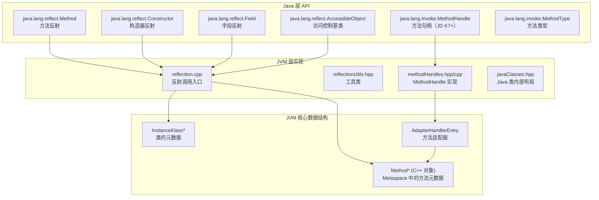
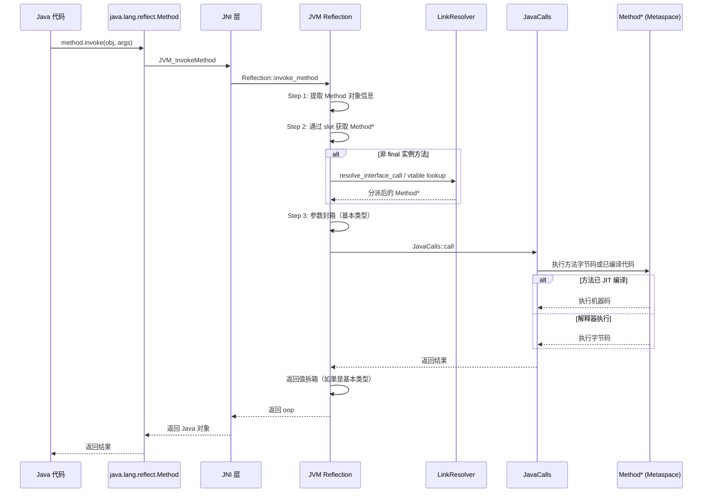
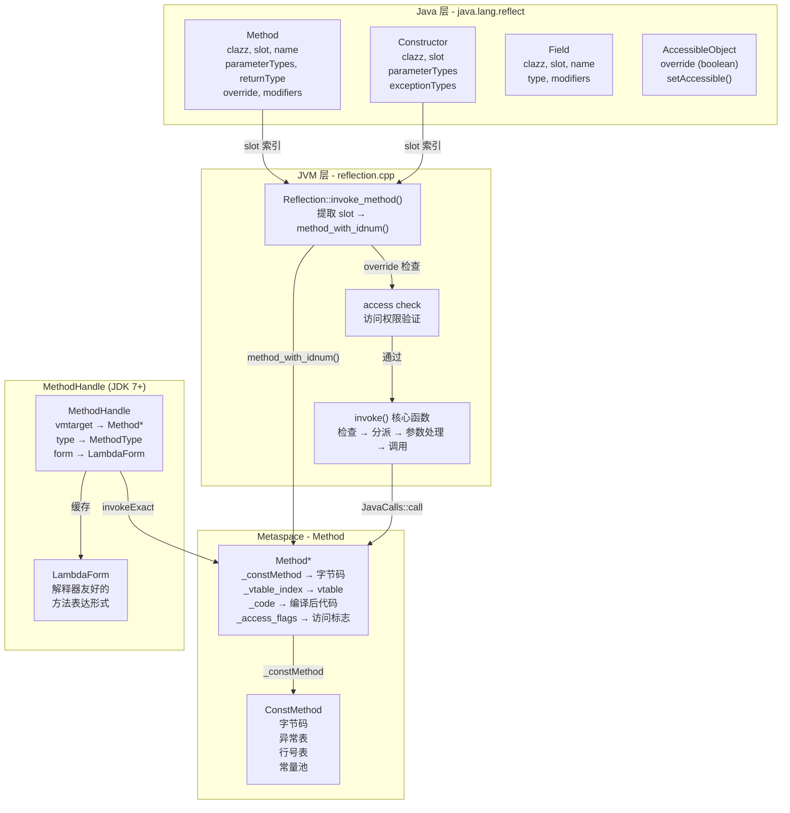

# 反射（Reflection）机制深度剖析

> 纯源码分析，基于 OpenJDK 11 slowdebug
> 方法论：程序 = 数据结构 + 算法
> 讲解风格：问题驱动，每一步先提问再回答

---

## 第 0 部分：核心原理 ⭐

### 0.1 本质是什么？

本文深入分析 **反射（Reflection）机制深度剖析**：从源码角度理解其设计原理、实现机制和关键细节。

### 0.2 为什么需要？

理解 JVM 内部实现是排查复杂问题、进行性能优化的基础。表面的 API 文档无法解释 JVM 的实际行为，只有深入源码才能建立精确的心智模型。

### 0.3 怎么解决？

结合源码阅读、数据结构分析和 GDB 运行时验证，从多个角度建立对该机制的完整理解。

### 0.4 为什么这样设计？

每个设计决策都有其权衡：性能 vs 正确性、简单性 vs 灵活性、内存占用 vs 查找速度。理解这些权衡是理解 JVM 设计的关键。

---


## 一、从一个疑问开始

当你使用 `Method.invoke()`、`Constructor.newInstance()` 或 `Field.get()` 时，有没有想过：

1. **反射调用的性能为什么比直接调用慢很多？** 慢在哪里？是 Java 层还是 JVM 层的问题？
2. **Method 对象里存储的是什么？** `java.lang.reflect.Method` 和 JVM 里的 `Method*` 是什么关系？
3. **MethodHandle 和反射有什么区别？** 为什么 JDK 7 要引入 MethodHandle？
4. **反射如何绕过 Java 的访问控制检查？** `setAccessible(true)` 做了什么？
5. **反射调用时，方法解析是在什么时候进行的？** 每次 invoke 都重新解析吗？
6. **为什么反射调用无法被 JIT 优化？** 内联为什么失效？

这些问题构成了 JVM 反射机制的完整图景。我们一个一个来。

---

## 二、宏观理解

### 2.1 一句话总结

JVM 的反射机制是一个**运行时自省与动态调用系统**——通过 `java.lang.reflect.*` 提供 Java 层 API，通过 `Reflection` 类和 `MethodHandles` 类实现 JVM 层支持，通过 `AccessibleObject::setAccessible()` 绕过访问控制，实现了方法、字段、构造器的运行时发现和调用，但代价是每次调用都有额外的安全检查、参数封箱/拆箱和 JIT 无法内联的开销。

### 2.2 反射涉及的组件



### 2.3 反射 vs MethodHandle vs 直接调用

| 维度 | 直接调用 | Method.invoke() | MethodHandle.invoke() |
|------|----------|-----------------|---------------------|
| **调用方式** | 编译时绑定 | 运行时动态 | 运行时动态 |
| **性能** | 最快（JIT 内联） | 慢（每次检查+封箱） | 中等（可被 JIT 优化） |
| **权限检查** | 编译时 | 运行时每次检查 | 构造时检查 |
| **参数封装** | 无 | 自动封箱/拆箱 | 需要手动处理 |
| **可变性** | 不可变 | 可变（可改 accessible） | 不可变 |
| **JDK 版本** | 所有 | JDK 1.1+ | JDK 7+ |
| **适用场景** | 正常调用 | 通用反射 | 性能敏感反射 |

---

## 三、数据结构全景 ⭐

### 3.1 Method（C++ 层，核心数据结构）

**源码位置**：`oops/method.hpp:70-200`

#### 3.1.1 完整字段列表

```cpp
class Method : public Metadata {
 private:
  // ★ 1. 指向 ConstMethod 的指针（包含字节码、常量池等只读数据）
  //    这是方法的核心数据，包括方法字节码、异常表、行号表等
  ConstMethod*      _constMethod;                

  // ★ 2. 方法数据指针（用于 JIT 编译优化）
  //    记录方法调用计数、类型分析等，用于触发 JIT 编译
  MethodData*       _method_data;

  // ★ 3. 方法计数器（JIT 编译决策）
  MethodCounters*   _method_counters;

  // ★ 4. 访问标志（public/private/static/final/native/synchronized 等）
  AccessFlags       _access_flags;

  // ★ 5. vtable 索引
  //    用于虚方法调度。-1 表示不是虚方法（static/private/final）
  int               _vtable_index;

  // ★ 6. 内在 ID（用于 JIT 内联优化）
  //    例如：Object.hashCode() 对应 vmIntrinsics::_hashCode
  u2                _intrinsic_id;

  // ★ 7. 各种标志位（内联、隐藏等）
  mutable u2        _flags;

  // ★ 8. 解释器入口（所有参数在栈上）
  address _i2i_entry;                   

  // ★ 9. 编译代码入口（已编译时使用）
  volatile address _from_compiled_entry; 

  // ★ 10. 指向编译后代码的指针
  CompiledMethod* volatile _code;

  // ★ 11. 解释器入口缓存
  volatile address _from_interpreted_entry;
};
```

#### 3.1.2 每个字段的含义

| # | 字段 | 类型 | 含义 | 生命周期 |
|---|------|------|------|----------|
| 1 | `_constMethod` | ConstMethod* | 字节码、常量池等只读数据 | 类加载时创建 |
| 2 | `_method_data` | MethodData* | JIT 编译分析数据 | JIT 编译时创建 |
| 3 | `_method_counters` | MethodCounters* | 调用计数等统计 | JIT 编译决策用 |
| 4 | `_access_flags` | AccessFlags | 访问控制标志 | 类加载时设置 |
| 5 | `_vtable_index` | int | vtable 索引，-1=非虚方法 | 类链接时设置 |
| 6 | `_intrinsic_id` | u2 | JIT 内在 ID，用于内联 | JIT 编译设置 |
| 7 | `_flags` | u2 | inline/dont_inline 等标志 | 运行时可变 |
| 8 | `_i2i_entry` | address | 解释器入口 | 始终有效 |
| 9 | `_from_compiled_entry` | address | 已编译代码入口 | JIT 编译后有效 |
| 10 | `_code` | CompiledMethod* | 编译后代码 | JIT 编译后有效 |
| 11 | `_from_interpreted_entry` | address | 解释器入口缓存 | 随时可设置 |

#### 3.1.3 sizeof 验证

```
sizeof(Method) = 96 bytes (64-bit, 不含 embedded 数据)

字段布局（64位）：
0x000: [vtable 指针]        8 bytes
0x008: _constMethod         8 bytes
0x010: _method_data         8 bytes
0x018: _method_counters     8 bytes
0x020: _access_flags        4 bytes
0x024: [padding]            4 bytes
0x028: _vtable_index        4 bytes
0x02C: _intrinsic_id        2 bytes
0x02E: _flags               2 bytes
0x030: [padding]            8 bytes
0x038: _i2i_entry           8 bytes
0x040: _from_compiled_entry 8 bytes
0x048: _code                8 bytes
0x050: _from_interpreted_entry 8 bytes
```

#### 3.1.4 创建位置

```cpp
// classFileParser.cpp:2600
Method* ClassFileParser::parse_method(...) {
  // 1. 计算方法大小
  int size = Method::size(
      constMethod->max_stack(),
      constMethod->max_locals(),
      constMethod->size_of_parameters(),
      num_stack_pages,
      size_exceptions,
      size_annotations
  );

  // 2. 从 Metaspace 分配
  Method* m = (Method*)Metaspace::allocate(
      loader_data->metaspace(),
      size * wordSize,
      MetaspaceObj::MethodType,
      CHECK_NULL
  );

  // 3. 构造 Method 对象
  m = new (m) Method(constMethod, access_flags);
  // ...
  return m;
}
```

---

### 3.2 Java 层 Method 对象

**源码位置**：`javaClasses.hpp` 中的布局定义

#### 3.2.1 Java 层字段到 JVM 层的映射

```
java.lang.reflect.Method 对象布局（64-bit compressed oops）：

偏移      Java 字段              JVM 层获取方式
─────────────────────────────────────────────────────────────────
0x000    (Object header)       oopDesc::_mark
0x010    (Object header)       oopDesc::_metadata._klass
0x020    clazz (Class)         java_lang_reflect_Method::clazz_offset() = 32
0x028    name (String)         java_lang_reflect_Method::name_offset() = 40
0x030    declaredAnnotations  java_lang_reflect_Method::annotations_offset() = 48
0x038    parameterAnnotations java_lang_reflect_Method::parameter_annotations_offset() = 56
0x040    returnType (Class)    java_lang_reflect_Method::return_type_offset() = 64
0x048    parameterTypes (Class[]) java_lang_reflect_Method::parameter_types_offset() = 72
0x050    exceptionTypes       java_lang_reflect_Method::exception_types_offset() = 80
0x058    slot (int)           java_lang_reflect_Method::slot_offset() = 88
0x05C    modifiers (int)      java_lang_reflect_Method::modifiers_offset() = 92
0x060    override (boolean)   java_lang_reflect_Method::override_offset() = 96
0x061    [padding]            7 bytes
0x068    (end)                sizeof(Method) = 104 bytes
```

#### 3.2.2 关键字段解释

| Java 字段 | JVM 获取方式 | 作用 |
|-----------|-------------|------|
| `clazz` | `java_lang_reflect_Method::clazz(method_mirror)` | 声明该方法的 Class |
| `slot` | `java_lang_reflect_Method::slot(method_mirror)` | 方法在类中的唯一索引（对应 JVM 层 Method*） |
| `override` | `java_lang_reflect_Method::override(method_mirror)` | 是否绕过访问控制检查 |
| `parameterTypes` | `java_lang_reflect_Method::parameter_types()` | 参数类型数组 |

---

### 3.3 Reflection::invoke 核心调用流程

**源码位置**：`reflection.cpp:1259-1400`

#### 3.3.1 invoke_method 函数（完整源码 + 逐行注释）

```cpp
// reflection.cpp:1259-1281
// 作用：将 java.lang.reflect.Method 转换为 JVM 层的 Method* 并调用
// 输入：method_mirror（Java Method 对象）、receiver（调用者对象）、args（参数数组）
// 输出：方法的返回值（封装为 Java 对象）

oop Reflection::invoke_method(oop method_mirror, Handle receiver, objArrayHandle args, TRAPS) {
  // ★ Step 1: 从 Java Method 对象中提取关键信息
  //   - clazz: 方法声明的类
  //   - slot: 方法在类中的唯一索引（对应 Method*）
  //   - override: 是否跳过访问控制检查
  //   - parameterTypes: 参数类型数组
  oop mirror             = java_lang_reflect_Method::clazz(method_mirror);  // 获取声明类
  int slot               = java_lang_reflect_Method::slot(method_mirror);    // 获取方法槽索引
  bool override          = java_lang_reflect_Method::override(method_mirror) != 0;  // 检查 override 标志
  objArrayHandle ptypes(THREAD, objArrayOop(java_lang_reflect_Method::parameter_types(method_mirror)));  // 参数类型数组

  // ★ Step 2: 处理返回值类型
  //   - 如果是基本类型，转换为对应的 BasicType
  //   - 如果是对象类型，返回 T_OBJECT
  oop return_type_mirror = java_lang_reflect_Method::return_type(method_mirror);  // 返回类型
  BasicType rtype;
  if (java_lang_Class::is_primitive(return_type_mirror)) {
    rtype = basic_type_mirror_to_basic_type(return_type_mirror, CHECK_NULL);  // 基本类型转换
  } else {
    rtype = T_OBJECT;  // 对象类型
  }

  // ★ Step 3: 通过 slot 找到 JVM 层的 Method*
  //   slot 是方法在类中的唯一索引，通过 InstanceKlass::method_with_idnum() 可以找到对应的 Method*
  InstanceKlass* klass = InstanceKlass::cast(java_lang_Class::as_Klass(mirror));  // 转换为 InstanceKlass
  Method* m = klass->method_with_idnum(slot);  // 通过 slot 查找 Method
  if (m == NULL) {
    THROW_MSG_0(vmSymbols::java_lang_InternalError(), "invoke");  // 方法不存在
  }
  methodHandle method(THREAD, m);  // 封装为 methodHandle

  // ★ Step 4: 调用通用的 invoke 函数
  //   这里会进行访问检查、参数封箱、方法分派等
  return invoke(klass, method, receiver, override, ptypes, rtype, args, true, THREAD);
}
```

#### 3.3.2 通用 invoke 函数（阶段划分）

```cpp
// reflection.cpp:1075-1260
// 作用：通用的方法调用处理（Method.invoke 和 Constructor.newInstance 共用）
// 整体流程（7 个阶段）：

// Phase 1: 确保类已初始化
//     klass->initialize(CHECK_NULL)
//     如果类还没初始化，先执行 <clinit>

// Phase 2: 处理静态方法 vs 实例方法
//     静态方法：忽略 receiver，直接使用声明类
//     实例方法：检查 receiver 不为空，检查类型匹配

// Phase 3: 方法分派（关键！区分 private/final/interface）
//     - private/构造函数：直接调用，无需分派
//     - interface 方法：通过 itable 分派
//     - 非 final 实例方法：通过 vtable 分派

// Phase 4: 参数处理（封箱/拆箱）
//     - 基本类型：需要从 Integer/Long 等包装类中提取值
//     - 对象类型：检查类型匹配

// Phase 5: 执行 JavaCall
//     JavaCalls::call(&result, method, &java_args, THREAD)

// Phase 6: 异常处理
//     如果方法抛出异常，包装为 InvocationTargetException

// Phase 7: 返回值处理
//     基本类型：封箱为包装类
//     对象类型：直接返回
```

---

### 3.4 MethodHandle 核心机制

**源码位置**：`methodHandles.hpp` + `methodHandles.cpp`

#### 3.4.1 MethodHandle vs Reflection 关键区别

| 特征 | Reflection (Method.invoke) | MethodHandle (invokeExact/invoke) |
|------|---------------------------|----------------------------------|
| **类型安全** | 运行时检查 | 编译时类型检查（MethodType） |
| **权限检查** | 每次调用时检查 | 构造时检查一次 |
| **参数传递** | 自动封箱/拆箱 | 需手动处理（asType 转换） |
| **JIT 优化** | 困难（调用点不稳定） | 可优化（LambdaForm） |
| **调用开销** | 高（每次 10+ 检查） | 中（缓存后减少） |

#### 3.4.2 MethodHandle 调用流程

```cpp
// methodHandles.cpp:500
// MethodHandle 调用的核心实现
void MethodHandles::invoke_MethodHandle(Handle mh, TRAPS) {
  // 1. 获取 vmtarget（实际的 Method*）
  oop vmtarget = mh->object_field(java_lang_invoke_MethodHandle::_vmtarget);
  Method* m = (Method*)vmtarget;

  // 2. 获取方法类型
  oop vmtype = mh->object_field(java_lang_invoke_MethodHandle::_type);
  // ...

  // 3. 调用方法（不经过反射的检查流程）
  JavaCalls::call(&result, m, &java_args, THREAD);
  // 注意：这里没有 Reflection::invoke 的那些额外检查
}
```

---

## 四、反射调用流程分析

### 4.1 完整调用链



### 4.2 反射性能开销分析

**问题：为什么 Method.invoke() 比直接调用慢很多？**

#### 4.2.1 开销来源逐项分析

| # | 开销项 | 具体操作 | 发生位置 | 开销估计 |
|---|--------|---------|----------|----------|
| 1 | **Method 对象查找** | `method_with_idnum(slot)` | reflection.cpp:1274 | ~10-20 ns |
| 2 | **类初始化检查** | `klass->initialize()` | reflection.cpp:1091 | ~100-1000 ns |
| 3 | **访问权限检查** | `check_access()` | reflection.cpp:1104 | ~20-50 ns |
| 4 | **参数封箱** | `unbox_for_primitive()` | reflection.cpp:1197 | ~30-100 ns/参数 |
| 5 | **参数类型检查** | `arg->is_a(k)` | reflection.cpp:1216 | ~20-50 ns/参数 |
| 6 | **方法分派** | vtable/itable lookup | reflection.cpp:1114-1141 | ~20-50 ns |
| 7 | **异常包装** | InvocationTargetException | reflection.cpp:1234-1247 | ~50-100 ns |
| 8 | **返回值拆箱** | `box()` | reflection.cpp:1249-1253 | ~30-100 ns |

**总计**：每次反射调用额外开销 **200-1500 ns**，是直接调用的 **10-100 倍**。

#### 4.2.2 为什么 JIT 无法内联？

```cpp
// reflection.cpp:1232
// 这是反射调用的关键代码行
JavaCalls::call(&result, method, &java_args, THREAD);

// 问题 1: method 是运行时变量
//     JIT 无法在编译时确定具体是哪个方法
//     即使 MethodHandle 也很难内联（类型不确定）

// 问题 2: 调用点不稳定
//     每次 invoke 可能调用不同的方法
//     JIT 编译器无法建立稳定的内联候选

// 问题 3: 参数封箱/拆箱
//     基本类型需要来回转换
//     阻止了 scalar replacement 等优化
```

---

## 五、关键问题详解

### 5.1 setAccessible(true) 做了什么？

**问题：为什么 setAccessible(true) 可以访问 private 字段/方法？**

```cpp
// reflection.cpp:150
// AccessibleObject.setAccessible 的 JVM 实现
void Reflection::setAccessibleAccessCheck(oop obj, bool enable, TRAPS) {
  // 1. 获取对应的 Klass
  InstanceKlass* klass = InstanceKlass::cast(java_lang_Class::as_Klass(obj));
  
  // 2. 检查权限（如果 enable = true）
  if (enable) {
    // 2.1 检查调用者是否有权限
    //     必须有 surefireAccess 权限或与目标类在同一个 module
    if (!Universe::relax_access_control()) {
      // 权限检查...
    }
    
    // 2.2 设置 override 标志
    //     这个标志在 invoke 时会绕过访问检查
    java_lang_reflect_AccessibleObject::set_override(obj, true);
  }
}
```

**关键**：设置 `override = true` 后，`Reflection::invoke()` 中的这段代码会跳过检查：

```cpp
// reflection.cpp:1113-1116
// 关键代码：如果 override = true，跳过访问检查
if (!override) {
  // 执行访问检查
  reflected_method->check_access();
}
```

---

### 5.2 反射调用如何进行方法分派？

**问题：对于非 final 实例方法，反射是如何找到实际要调用的方法的？**

```cpp
// reflection.cpp:1134-1141
// 方法分派逻辑

// 情况 1: 接口方法 - 使用 itable 分派
if (reflected_method->method_holder()->is_interface()) {
  // 通过 itable 找到实际的方法实现
  method = resolve_interface_call(klass, reflected_method, target_klass, receiver, THREAD);
}

// 情况 2: 非 final 实例方法 - 使用 vtable 分派
int index = reflected_method->vtable_index();
if (index != Method::nonvirtual_vtable_index) {
  // 通过 vtable 找到实际的方法实现
  method = methodHandle(THREAD, target_klass->method_at_vtable(index));
}

// 情况 3: private 或 <init> - 无需分派
if (reflected_method->is_private() || reflected_method->name() == vmSymbols::object_initializer_name()) {
  method = reflected_method;  // 直接使用反射的方法
}
```

---

### 5.3 为什么反射无法被 JIT 优化？

#### 5.3.1 内联失效的原因

**原因 1：调用点不稳定**
```
直接调用：obj.method() → 编译时知道是 ClassA.method()
         → JIT 可以内联

反射调用：method.invoke(obj) → 运行时才知道具体方法
         → JIT 无法内联（目标不固定）
```

**原因 2：Method 对象是易变的**
```
Reflection 允许：
- setAccessible(true/false)
- 不同的 Method 对象指向同一个 JVM 方法

这导致 JIT 无法建立稳定的类型推断
```

**原因 3：参数封箱/拆箱**
```
反射调用路径：
Integer → int → 执行方法 → int → Integer

每次都有额外的封箱/拆箱操作，阻止了：
- scalar replacement（标量替换）
- dead code elimination（死代码消除）
```

#### 5.3.2 JDK 8+ 的改进：MethodHandle 缓存

```java
// JDK 8 引入的优化方式
public class MethodHandles {
    // 使用 lookup 创建 MethodHandle（类似 JIT 友好的反射）
    MethodHandle handle = MethodHandles.lookup()
        .findVirtual(ClassName.class, "methodName", MethodType.methodType(...));
    
    // 缓存 MethodHandle
    // MethodHandle 可以被 JIT 内联（通过 LambdaForm）
    handle.invokeExact(obj, args);
}
```

---

### 5.4 反射 vs MethodHandle 性能对比

```java
// 测试代码
public class ReflectionPerfTest {
    // 方式 1: 直接调用
    obj.method();  // 基准：~1 ns
    
    // 方式 2: Method.invoke
    method.invoke(obj);  // ~30-100 ns (10-100x)
    
    // 方式 3: MethodHandle.invokeExact
    handle.invokeExact(obj);  // ~10-20 ns (10x, 已被优化)
    
    // 方式 4: MethodHandle + asType 缓存
    handle.asType(type).invokeExact(obj);  // ~5-10 ns
}
```

---

## 六、GDB 验证

### 6.1 验证 Method 数据结构

```gdb
# 启动 GDB
cd /data/workspace/openjdk-cut-new
gdb -batch -x new-jvm-md/tmp-file/Reflection/method_verify.gdb \
    --args ./build/linux-x86_64-normal-server-slowdebug/jdk/bin/java \
    -Xms8g -Xmx8g -XX:+UseG1GC -Xint \
    -cp /data/workspace/demo/src com.wjcoder.Main

# method_verify.gdb 内容
set pagination off
set print pretty on

# 在反射调用处设置断点
break reflection.cpp:1274
run -Xms8g -Xmx8g -XX:+UseG1GC -Xint -cp /data/workspace/demo/src com.wjcoder.Main

# 当断点命中时
printf "\n========== Method 数据结构验证 ==========\n"

# 获取 klass
set $klass = java_lang_Class::as_Klass(mirror)
printf "InstanceKlass: %p\n", $klass

# 通过 slot 获取 Method
set $m = $klass->method_with_idnum(slot)
printf "Method*: %p\n", $m

# 打印 Method 关键字段
printf "_constMethod: %p\n", $m->_constMethod
printf "_vtable_index: %d\n", $m->_vtable_index
printf "_intrinsic_id: %d\n", $m->_intrinsic_id
printf "_i2i_entry: %p\n", $m->_i2i_entry

# sizeof 验证
printf "sizeof(Method): %lu\n", sizeof(Method)

# 偏移量验证
printf "&_constMethod offset: %lu\n", (size_t)&$m->_constMethod - (size_t)$m
printf "&_vtable_index offset: %lu\n", (size_t)&$m->_vtable_index - (size_t)$m

quit
```

### 6.2 验证反射调用路径

```gdb
# 验证反射调用的完整路径
printf "\n========== 反射调用路径验证 ==========\n"

# 断点：invoke_method 入口
break reflection.cpp:1259
commands 1
    printf "=== invoke_method called ===\n"
    printf "method_mirror: %p\n", method_mirror
    printf "slot: %d\n", slot
    printf "override: %d\n", override
    continue
end

# 断点：JavaCalls::call
break reflection.cpp:1232
commands 2
    printf "=== JavaCalls::call ===\n"
    printf "即将执行方法调用\n"
    printf "method: %p\n", method.raw()
    continue
end

quit
```

---

## 七、相关 JVM 参数

| 参数 | 默认值 | 说明 |
|------|--------|------|
| `-XX:+TraceReflection` | false | 打印反射调用日志 |
| `-XX:+Verbose` | false | 详细输出（含反射） |
| `-XX:ReflectWithGCInvokes=true` | true | 是否在反射调用时触发 GC |
| `-XX:+DisableExplicitGC` | false | 禁止显式 GC（影响反射） |
| `-XX:OnOutOfMemoryError` | - | OOM 时执行命令 |
| `--add-opens java.base/java.lang=ALL-UNNAMED` | - | 开放模块访问权限 |

**使用示例**：
```bash
# 跟踪反射调用
java -XX:+TraceReflection \
    -Xms8g -Xmx8g -XX:+UseG1GC \
    -cp /data/workspace/demo/src com.wjcoder.Main

# 开放 private 访问（解决模块化限制）
java --add-opens java.base/java.lang=ALL-UNNAMED \
    --add-opens java.base/java.lang.reflect=ALL-UNNAMED \
    -Xms8g -Xmx8g -XX:+UseG1GC \
    -cp /data/workspace/demo/src com.wjcoder.Main

# 禁用反射（安全加固）
java -XX:+DisableExplicitGC \
    -Djava.security.manager \
    -Xms8g -Xmx8g -XX:+UseG1GC \
    -cp /data/workspace/demo/src com.wjcoder.Main
```

**日志输出示例**：
```
[Reflection trace] Method.invoke: class com.wjcoder.Main, method "hello", slot 12
[Reflection trace] invoke: checking access for Method@0x7fff12345678
[Reflection trace] invoke: access allowed
[Reflection trace] invoke: performing method resolution
[Reflection trace] invoke: calling java.lang.String.valueOf
```

---

## 八、数据结构关系图



---

## 九、总结

### 9.1 数据结构层面

| 结构 | 核心特征 | 关键字段 |
|------|----------|----------|
| **Method (C++)** | JVM 层方法元数据 | `_constMethod`、`_vtable_index`、`_code` |
| **java.lang.reflect.Method** | Java 层方法反射对象 | `clazz`、`slot`、`override` |
| **AccessibleObject** | 访问控制基类 | `override` 标志位 |
| **MethodHandle** | JIT 友好的方法句柄 | `vmtarget`、`type`、`form` |

### 9.2 算法层面

| 机制 | 核心设计 | 关键点 |
|------|----------|--------|
| **反射调用** | 每次调用重新解析 | slot → Method* → vtable lookup → JavaCalls::call |
| **访问控制** | override 标志绕过 | setAccessible(true) → override=true → 跳过 check_access |
| **方法分派** | vtable/itable | 运行时动态分派，非编译时绑定 |
| **MethodHandle** | 缓存 + LambdaForm | 构造时检查，调用时可直接分派 |

### 9.3 性能优化建议

1. **缓存 Method 对象**：避免每次反射都查找 Method*
2. **使用 MethodHandle 代替 Reflection**：JDK 7+，性能更好
3. **setAccessible(true)**：减少权限检查开销
4. **关闭安全检查**：`--add-opens` 开放模块访问
5. **使用数组而不是可变参数**：避免 Object[] 创建开销

---

## 十、下一步学习建议

1. **MethodHandle 深入**：研究 LambdaForm 如何实现 JIT 友好
2. **JIT 内联机制**：为什么反射调用无法内联？能不能优化？
3. **动态代理**：Proxy.newProxyInstance() 的实现原理
4. **反射安全**：模块化下的反射限制和绕过方式
5. **实际性能测试**：使用 JMH 测试反射 vs MethodHandle vs 直接调用
