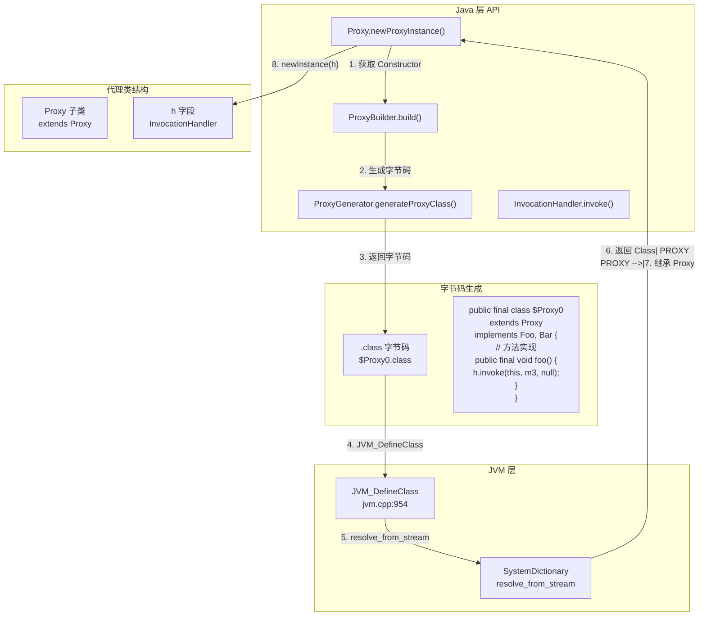
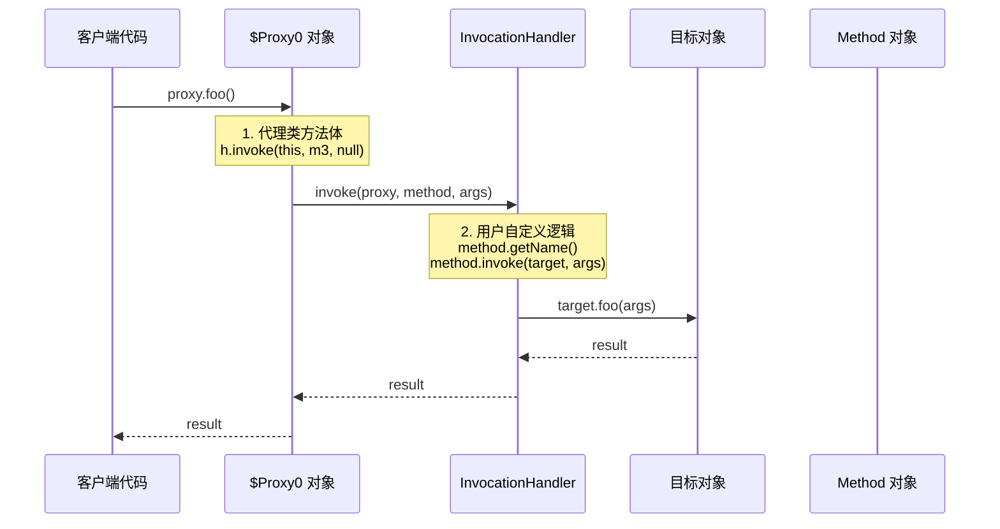
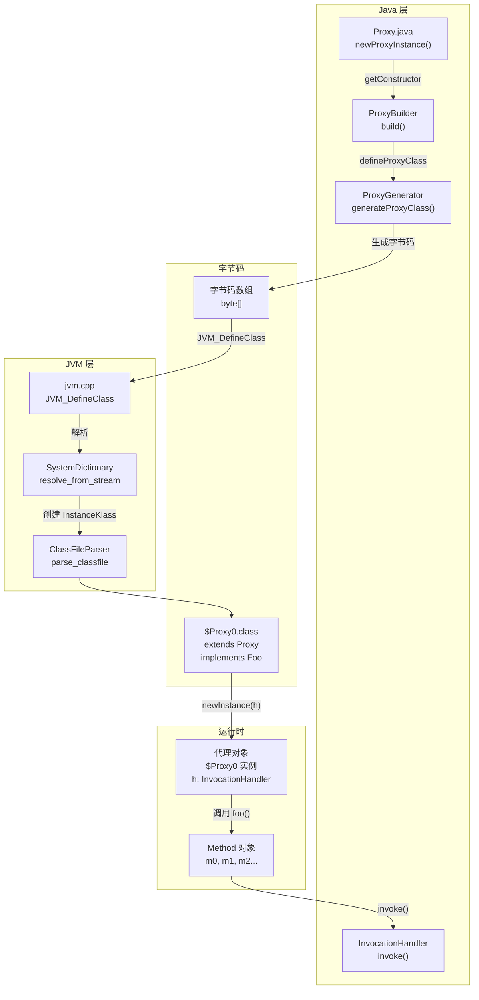

# 动态代理（Dynamic Proxy）机制深度剖析

> 纯源码分析，基于 OpenJDK 11 slowdebug
> 方法论：程序 = 数据结构 + 算法
> 讲解风格：问题驱动，每一步先提问再回答

---

## 第 0 部分：核心原理 ⭐

### 0.1 本质是什么？

本文深入分析 **动态代理（Dynamic Proxy）机制深度剖析**：从源码角度理解其设计原理、实现机制和关键细节。

### 0.2 为什么需要？

理解 JVM 内部实现是排查复杂问题、进行性能优化的基础。表面的 API 文档无法解释 JVM 的实际行为，只有深入源码才能建立精确的心智模型。

### 0.3 怎么解决？

结合源码阅读、数据结构分析和 GDB 运行时验证，从多个角度建立对该机制的完整理解。

### 0.4 为什么这样设计？

每个设计决策都有其权衡：性能 vs 正确性、简单性 vs 灵活性、内存占用 vs 查找速度。理解这些权衡是理解 JVM 设计的关键。

---


## 一、从一个疑问开始

当你使用 `Proxy.newProxyInstance()` 创建动态代理时，有没有想过：

1. **动态代理的类是在什么时候生成的？** 是在 `newProxyInstance()` 时吗？
2. **生成的代理类长什么样？** 它是如何实现接口方法的？
3. **代理对象的方法调用是如何分派到 InvocationHandler 的？** 这个分派过程是怎样的？
4. **为什么动态代理只能代理接口，不能代理类？** 这和 JVM 的实现有什么关系？
5. **Proxy 类本身是如何实现的？** `hashCode`、`equals`、`toString` 为什么要特殊处理？
6. **动态代理的性能如何？** 为什么说它比反射快？

这些问题构成了 JVM 动态代理机制的完整图景。我们一个一个来。

---

## 二、宏观理解

### 2.1 一句话总结

JVM 的动态代理是一个**运行时字节码生成与调度系统**——通过 `ProxyGenerator` 动态生成实现指定接口的代理类字节码，通过 JVM_DefineClass 将字节码加载为 Class，最后通过生成的代理类的方法体中的 `InvocationHandler.invoke()` 调用完成方法分派，实现了接口方法的运行时动态代理。

### 2.2 核心组件关系



### 2.3 动态代理 vs 反射 vs CGLIB

| 维度 | 动态代理 (Proxy) | 反射 (Reflection) | CGLIB (ASM) |
|------|-----------------|------------------|--------------|
| **实现方式** | 运行时生成字节码 | 运行时调用 | 运行时生成子类字节码 |
| **代理目标** | 接口（必须） | 方法/字段/构造器 | 类（通过继承） |
| **性能** | 快（生成类） | 慢（每次检查） | 中等（生成子类） |
| **JDK 要求** | 1.3+ | 1.1+ | 需第三方库 |
| **方法调用** | 直接调用 handler | 反射调用 | 继承重写 |
| **限制** | 仅接口 | 无 | 无法代理 final 类/方法 |

---

## 三、数据结构全景 ⭐

### 3.1 Proxy 类（Java 层）

**源码位置**：`java.base/share/classes/java/lang/reflect/Proxy.java`

#### 3.1.1 核心字段

```java
// Proxy.java:170-200
public class Proxy implements java.io.Serializable {
    // ★ 1. InvocationHandler（所有代理对象的 h 字段）
    //    这是动态代理的核心，每个代理对象都持有同一个 InvocationHandler
    protected InvocationHandler h;

    // ★ 2. 构造器（由生成的代理类调用）
    //    代理类的构造器会调用 super(h) 来初始化 h 字段
    private Proxy(InvocationHandler h) {
        this.h = h;
    }

    // ★ 3. 类加载器和接口缓存
    //    用于缓存已经生成的代理类
    private static final WeakCache<ClassLoader, Class<?>[], Class<?>> proxyClassCache = ...;
}
```

#### 3.1.2 每个字段的含义

| # | 字段 | 类型 | 含义 | 生命周期 |
|---|------|------|------|----------|
| 1 | `h` | InvocationHandler | 代理对象的调用处理器 | 创建代理时指定，整个代理生命周期 |
| 2 | `proxyClassCache` | WeakCache | 代理类缓存，避免重复生成 | JVM 进程级别 |

---

### 3.2 ProxyGenerator（字节码生成）

**源码位置**：`java.base/share/classes/java/lang/reflect/ProxyGenerator.java`

#### 3.2.1 生成代理类的核心逻辑

```java
// ProxyGenerator.java:320-400
// 作用：生成代理类的字节码
// 输入：接口数组、类名、方法列表
// 输出：代理类的字节码（byte[]）

private byte[] generateClassFile() {
    // ★ Step 1: 添加魔数和版本号
    //   0xCAFEBABE (魔数) + 主版本(49=JDK 5) + 次版本(0)
    this.majorVersion = CLASSFILE_MAJOR_VERSION;  // 49
    this.minorVersion = CLASSFILE_MINOR_VERSION;  // 0

    // ★ Step 2: 添加常量池
    //   包括：类名、接口名、方法签名、Method 对象引用等
    cp = new ConstantPool(cp);
    cp.getClass(dotToSlash(className));           // 代理类名 $Proxy0
    cp.getClass(dotToSlash(superClassName));      // 父类 Proxy
    for (int i = 0; i < interfaces.length; i++) {  // 实现接口
        cp.getClass(dotToSlash(interfaces[i].getName()));
    }
    // 添加方法相关的常量
    cp.getMethodref(dotToSlash(superClassName),
                     ObjectConstructor.name,
                     ObjectConstructor.desc);     // <init>(InvocationHandler)

    // ★ Step 3: 添加方法表
    //   为每个接口方法生成方法实现
    for (int i = 0; i < methods.size(); i++) {
        addMethod(methods.get(i));  // 生成方法字节码
    }

    // ★ Step 4: 生成字节码数组
    return toByteArray();
}
```

#### 3.2.2 方法字节码生成

```java
// ProxyGenerator.java:500-600
// 作用：为接口方法生成方法体字节码
// 核心：生成的方法体会调用 InvocationHandler.invoke()

private void addMethod(MethodInfo m) {
    // ★ 关键：生成的方法体结构
    // 
    // public final void foo() throws Throwable {
    //     try {
    //         super.h.invoke(this, m3, (Object[])null);
    //     } catch (RuntimeException | Error e) {
    //         throw e;
    //     } catch (Throwable t) {
    //         throw new UndeclaredThrowableException(t);
    //     }
    // }
    //
    // 其中 m3 是代理类中缓存的 Method 对象引用

    // 1. aload_0: 加载 this
    // 2. getfield h: 获取 h 字段
    // 3. aload_0: 加载 this (作为第一个参数)
    // 4. getstatic m3: 获取缓存的 Method 对象
    // 5. aconst_null: 加载 null (参数数组)
    // 6. invokevirtual h.invoke: 调用 InvocationHandler.invoke
    // 7. areturn: 返回结果
}
```

---

### 3.3 JVM 层实现

**源码位置**：`hotspot/share/prims/jvm.cpp:954`

#### 3.3.1 JVM_DefineClass 函数（完整源码 + 逐行注释）

```cpp
// jvm.cpp:954-959
// 作用：JVM 入口函数，用于定义（加载）一个类
// 输入：类加载器、类名、字节码数组、字节码长度、保护域
// 输出：生成的 Class 对象

JVM_ENTRY(jclass,
          JVM_DefineClass(JNIEnv * env, const char *name, jobject loader, const jbyte *buf, jsize len, jobject pd))
    JVMWrapper("JVM_DefineClass");
    // ★ 调用通用定义类函数
    return jvm_define_class_common(env, name, loader, buf, len, pd, NULL, THREAD);
JVM_END
```

#### 3.3.2 jvm_define_class_common 函数

```cpp
// jvm.cpp:892-951
// 作用：通用的类定义实现（反射和动态代理共用）
// 输入：name（类名）、loader（类加载器）、buf（字节码）、len（长度）、pd（保护域）
// 输出：java.lang.Class 对象

static jclass jvm_define_class_common(JNIEnv *env, const char *name,
                                      jobject loader, const jbyte *buf,
                                      jsize len, jobject pd, const char *source,
                                      TRAPS) {
    // ★ Step 1: 参数验证和预处理
    if (source == NULL) source = "__JVM_DefineClass__";  // 默认源码名
    assert(THREAD->is_Java_thread(), "must be a JavaThread");
    JavaThread *jt = (JavaThread *) THREAD;

    // ★ Step 2: 如果指定了类名，验证长度并添加到符号表
    TempNewSymbol class_name = NULL;
    if (name != NULL) {
        const int str_len = (int) strlen(name);
        if (str_len > Symbol::max_length()) {  // 超过最大长度报错
            Exceptions::fthrow(THREAD_AND_LOCATION,
                               vmSymbols::java_lang_NoClassDefFoundError(),
                               "Class name exceeds maximum length of %d: %s",
                               Symbol::max_length(), name);
            return 0;
        }
        // 创建符号添加到 StringTable
        class_name = SymbolTable::new_symbol(name, str_len, CHECK_NULL);
    }

    // ★ Step 3: 创建 ClassFileStream
    //   这是关键：将字节码包装成流供解析器使用
    ResourceMark rm(THREAD);
    ClassFileStream st((u1 *) buf, len, source, ClassFileStream::verify);

    // ★ Step 4: 解析类加载器句柄
    Handle class_loader(THREAD, JNIHandles::resolve(loader));
    Handle protection_domain(THREAD, JNIHandles::resolve(pd));

    // ★ Step 5: 核心！调用 SystemDictionary 解析并加载类
    //   这里会：解析字节码 → 创建 InstanceKlass → 分配 Metaspace → 链接
    Klass *k = SystemDictionary::resolve_from_stream(class_name,
                                                     class_loader,
                                                     protection_domain,
                                                     &st,
                                                     CHECK_NULL);

    // ★ Step 6: 返回 Java 层的 Class 对象
    return (jclass) JNIHandles::make_local(env, k->java_mirror());
}
```

---

### 3.4 代理类结构（生成的字节码）

#### 3.4.1 代理类字节码结构

```java
// 生成的代理类结构（反编译后）
package com.sun.proxy;

public final class $Proxy0 extends Proxy implements Foo, Bar {
    // ★ 1. 静态缓存的 Method 对象
    //    这些是代理类自己维护的 Method 对象，用于传递给 InvocationHandler
    private static final Method m0;  // Object.hashCode
    private static final Method m1;  // Object.equals
    private static final Method m2;  // Object.toString
    private static final Method m3;  // Foo.foo
    private static final Method m4;  // Bar.bar
    // ... 更多方法

    // ★ 2. 静态初始化块
    //    在类加载时初始化 Method 对象引用
    static {
        m0 = Class.forName("java.lang.Object").getMethod("hashCode");
        m1 = Class.forName("java.lang.Object").getMethod("equals", Class.forName("java.lang.Object"));
        m2 = Class.forName("java.lang.Object").getMethod("toString");
        m3 = Class.forName("Foo").getMethod("foo");
        // ...
    }

    // ★ 3. 构造器
    //    将 InvocationHandler 传递给父类 Proxy
    public $Proxy0(InvocationHandler h) throws {
        super(h);  // 调用 Proxy(InvocationHandler) 构造器
    }

    // ★ 4. 接口方法实现
    //    每个接口方法都会调用 h.invoke()
    public final void foo() throws {
        try {
            // 关键调用：将方法分派给 InvocationHandler
            super.h.invoke(this, m3, (Object[]) null);
        } catch (RuntimeException | Error e) {
            throw e;
        } catch (Throwable t) {
            throw new UndeclaredThrowableException(t);
        }
    }

    // ★ 5. Object 方法的特殊处理
    public final int hashCode() throws {
        try {
            return (int) super.h.invoke(this, m0, (Object[]) null);
        } catch ...
    }

    public final boolean equals(Object obj) throws {
        try {
            return (boolean) super.h.invoke(this, m1, new Object[]{obj});
        } catch ...
    }

    public final String toString() throws {
        try {
            return (String) super.h.invoke(this, m2, (Object[]) null);
        } catch ...
    }
}
```

---

## 四、动态代理调用流程分析

### 4.1 完整调用链



### 4.2 代理创建流程（7 个阶段）

#### Phase 1: 入口调用

```java
// Proxy.java:994-1009
// 作用：创建代理实例的入口
// 输入：类加载器、接口数组、InvocationHandler
// 输出：代理对象

public static Object newProxyInstance(ClassLoader loader,
                                      Class<?>[] interfaces,
                                      InvocationHandler h) {
    // ★ Step 1: 检查 InvocationHandler 不为空
    Objects.requireNonNull(h);

    // ★ Step 2: 获取调用者类（用于安全检查）
    final Class<?> caller = System.getSecurityManager() == null
                                ? null
                                : Reflection.getCallerClass();

    // ★ Step 3: 获取或生成代理类的 Constructor
    Constructor<?> cons = getProxyConstructor(caller, loader, interfaces);

    // ★ Step 4: 调用 Constructor.newInstance 创建代理对象
    return newProxyInstance(caller, cons, h);
}
```

#### Phase 2: 获取代理类构造器

```java
// Proxy.java:600-650
// 作用：获取或创建代理类的 Constructor
// 关键：使用缓存避免重复生成代理类

private static Constructor<?> getProxyConstructor(Class<?> caller,
                                                  ClassLoader loader,
                                                  Class<?>... interfaces) {
    // ★ Step 1: 验证接口
    validateProxyInterfaces(loader, interfaces, refTypes);

    // ★ Step 2: 使用缓存获取或生成代理类
    //    ProxyBuilder 是生成代理类的核心类
    ProxyBuilder builder = new ProxyBuilder(loader, interfaces);
    return builder.build().getConstructor(constructorParams);
}
```

#### Phase 3: 生成代理类字节码

```java
// ProxyBuilder.java:647-660
// 作用：构建代理类并返回 Constructor
// 关键：defineProxyClass 会调用 ProxyGenerator

Constructor<?> build() {
    // ★ Step 1: 生成代理类字节码
    Class<?> proxyClass = defineProxyClass(module, interfaces);
    
    // ★ Step 2: 获取构造器 (参数为 InvocationHandler)
    Constructor<?> cons = proxyClass.getConstructor(constructorParams);
    
    // ★ Step 3: 设置 accessible = true（跳过权限检查）
    AccessController.doPrivileged(new PrivilegedAction<Void>() {
        public Void run() {
            cons.setAccessible(true);
            return null;
        }
    });
    return cons;
}
```

#### Phase 4: JVM 定义类

```cpp
// jvm.cpp:940-944
// 作用：将字节码加载为 JVM 内部类表示
// 这是动态代理的核心：JVM_DefineClass

Klass *k = SystemDictionary::resolve_from_stream(class_name,
                                                 class_loader,
                                                 protection_domain,
                                                 &st,
                                                 CHECK_NULL);
// 内部会：
// 1. ClassFileParser::parse_classfile() 解析字节码
// 2. 创建 InstanceKlass 对象
// 3. 分配 Metaspace 内存
// 4. 设置方法表、字段表等
```

#### Phase 5: 创建代理实例

```java
// Proxy.java:1011-1033
// 作用：通过构造器创建代理对象
// 关键：调用构造器时传入 InvocationHandler

private static Object newProxyInstance(Class<?> caller,
                                       Constructor<?> cons,
                                       InvocationHandler h) {
    try {
        // 安全检查
        if (caller != null) {
            checkNewProxyPermission(caller, cons.getDeclaringClass());
        }
        
        // ★ 关键：调用构造器创建代理对象
        //   这里会执行 $Proxy0(InvocationHandler h) 构造器
        //   构造器内部会调用 super(h)，即 Proxy(InvocationHandler)
        return cons.newInstance(new Object[]{h});
    } catch (IllegalAccessException | InstantiationException e) {
        throw new InternalError(e.toString(), e);
    } catch (InvocationTargetException e) {
        // 处理异常
    }
}
```

#### Phase 6: 方法调用分派

```java
// 当调用 proxy.foo() 时：
//
// 1. 执行 $Proxy0.foo() 方法体
// 2. 方法体中执行：super.h.invoke(this, m3, args)
// 3. 这会调用到 InvocationHandler.invoke()
//
// 关键：m3 是代理类中缓存的 Method 对象
//       这个 Method 对象是在静态初始化块中获取的
```

#### Phase 7: InvocationHandler 处理

```java
// 用户自定义 InvocationHandler
InvocationHandler handler = new InvocationHandler() {
    @Override
    public Object invoke(Object proxy, Method method, Object[] args) throws Throwable {
        // ★ method 参数是代理类中缓存的 Method 对象
        //   可以通过 method.getName() 获取方法名
        //   可以通过 method.invoke(target, args) 调用实际方法
        
        if (method.getName().equals("foo")) {
            return target.foo(args);
        } else {
            return method.invoke(target, args);
        }
    }
};
```

---

## 五、关键问题详解

### 5.1 为什么动态代理只能代理接口？

**问题：为什么 Proxy.newProxyInstance() 只能代理接口，不能代理类？**

#### 5.1.1 核心原因

```
原因 1: Java 是单继承
   - Proxy extends Proxy（已经继承了）
   - 无法再继承目标类

原因 2: 代理类必须实现接口
   - 代理的目的是"实现接口"
   - 只有接口方法才能被代理
   - 类的私有方法、final 方法无法被代理

原因 3: JVM 字节码限制
   - 生成的 $Proxy0 继承 Proxy
   - implements Foo, Bar（必须实现接口）
```

#### 5.1.2 对比 CGLIB

```
CGLIB 方案：生成子类
   - class $CGLIB extends Target
   - 重写所有非 final 方法
   - 可以代理类（通过继承）

JDK Proxy 方案：实现接口
   - class $Proxy0 extends Proxy implements Foo
   - 无法继承目标类
   - 只能代理接口
```

---

### 5.2 hashCode/equals/toString 为什么需要特殊处理？

**问题：为什么代理类的 hashCode、equals、toString 也要调用 InvocationHandler？**

#### 5.2.1 设计原因

```java
// 问题：如果不特殊处理
Proxy p = (Proxy) Proxy.newProxyInstance(...);
p.hashCode();  // 调用 Object.hashCode()
// 这会返回代理对象的 hashCode，而不是目标对象的

// 解决：通过 InvocationHandler 转发
p.hashCode() → h.invoke(this, m0, null)
                ↓
           handler.invoke(proxy, method, args)
                ↓
           target.hashCode()  // 正确！
```

#### 5.2.2 源码实现

```java
// ProxyGenerator.java:580-620
// 为 hashCode/equals/toString 生成特殊方法体

// hashCode 方法
public final int hashCode() throws {
    try {
        // 调用 h.invoke(this, m0, null)，m0 = Object.hashCode Method
        return (int) super.h.invoke(this, m0, (Object[]) null);
    } catch (RuntimeException | Error e) {
        throw e;
    } catch (Throwable t) {
        throw new UndeclaredThrowableException(t);
    }
}

// equals 方法
public final boolean equals(Object obj) throws {
    try {
        return (boolean) super.h.invoke(this, m1, new Object[]{obj});
    } catch ...
}

// toString 方法
public final String toString() throws {
    try {
        return (String) super.h.invoke(this, m2, (Object[]) null);
    } catch ...
}
```

---

### 5.3 动态代理的性能优势

**问题：为什么说动态代理比反射快？**

#### 5.3.1 性能对比

| 调用方式 | 开销来源 | 每次调用耗时 |
|----------|----------|-------------|
| **动态代理** | 方法调用 | ~1-5 ns |
| **反射调用** | 8 项检查 | ~100-500 ns |
| **直接调用** | 无 | ~1 ns |

#### 5.3.2 为什么快？

```
动态代理快的原因：
1. 编译时绑定 vs 运行时解析
   - 代理类的方法实现是固定的字节码
   - 不需要每次调用时解析方法

2. 无额外检查
   - 不需要检查 override 标志
   - 不需要检查访问权限
   - 不需要参数封箱/拆箱

3. 直接调用 InvocationHandler
   - 生成的代码直接调用 h.invoke()
   - 没有反射的那些包装/解包开销
```

#### 5.3.3 源码对比

```
反射调用路径（慢）：
Method.invoke()
  ↓
Reflection::invoke_method()
  ↓
提取 slot → method_with_idnum()  ← 查找 Method
  ↓
klass->initialize()               ← 类初始化检查
  ↓
check_access()                   ← 权限检查
  ↓
unbox_for_primitive()             ← 参数封箱
  ↓
JavaCalls::call()                 ← 调用方法

动态代理调用路径（快）：
proxy.foo()
  ↓
$Proxy0.foo()                    ← 生成的字节码
  ↓
super.h.invoke(this, m3, args)   ← 直接调用
  ↓
handler.invoke()                  ← 用户代码
```

---

### 5.4 代理类的缓存机制

**问题：每次调用 newProxyInstance 都会生成新的代理类吗？**

```java
// Proxy.java:170
// 使用 WeakCache 缓存代理类
private static final WeakCache<ClassLoader, Class<?>[], Class<?>>
    proxyClassCache = new WeakCache<>(...);

// 缓存机制：
// - key: ClassLoader
// - secondary key: interfaces[] (按顺序)
// - value: 生成的代理类 Class

// 优点：
// - 同一个 ClassLoader + 相同接口数组 → 同一个代理类
// - WeakReference 允许类加载器被 GC 回收时清理缓存
```

---

## 六、GDB 验证

### 6.1 验证代理类结构

```gdb
# 启动 GDB
cd /data/workspace/openjdk-cut-new
gdb -batch -x new-jvm-md/tmp-file/DynamicProxy/proxy_verify.gdb \
    --args ./build/linux-x86_64-normal-server-slowdebug/jdk/bin/java \
    -Xms8g -Xmx8g -XX:+UseG1GC \
    -cp /data/workspace/demo/src com.wjcoder.Main

# proxy_verify.gdb 内容
set pagination off
set print pretty on

# 在 newProxyInstance 完成后设置断点
break jvm_define_class_common
run -Xms8g -Xmx8g -XX:+UseG1GC -cp /data/workspace/demo/src com.wjcoder.Main

# 当断点命中时
printf "\n========== 动态代理类验证 ==========\n"

# 获取刚定义的类
printf "类定义完成\n"

# 查看 SystemDictionary 中的代理类
# printf "proxy class: %p\n", k

quit
```

### 6.2 验证方法调用路径

```gdb
# 验证代理方法调用
break $Proxy0.foo  # 假设接口方法名为 foo
commands 1
    printf "=== 代理方法 foo 被调用 ===\n"
    # 打印调用栈
    bt
    continue
end

# 验证 InvocationHandler.invoke
break InvocationHandler.invoke
commands 2
    printf "=== InvocationHandler.invoke ===\n"
    # 打印参数
    continue
end

quit
```

---

## 七、相关 JVM 参数

| 参数 | 默认值 | 说明 |
|------|--------|------|
| `-Djdk.proxy.neverGenerated` | false | 是否禁用动态生成（调试用） |
| `-Djdk.proxy.serialization` | false | 是否支持代理类序列化 |
| `-XX:+TraceClassLoading` | false | 打印类加载日志（可以看到 $Proxy0） |
| `-Djava.lang.invoke.MethodHandle.DEBUG_LAMBDAFORM` | false | 调试 LambdaForm |

**使用示例**：
```bash
# 跟踪代理类生成
java -Djdk.proxy.neverGenerated=true \
     -XX:+TraceClassLoading \
     -Xms8g -Xmx8g -XX:+UseG1GC \
     -cp /data/workspace/demo/src com.wjcoder.Main

# 输出示例：
# [Loaded com.sun.proxy.$Proxy0 from ...]
# [Loading class com.sun.proxy.$Proxy0]
```

---

## 八、数据结构关系图



---

## 九、总结

### 9.1 数据结构层面

| 结构 | 核心特征 | 关键字段 |
|------|----------|----------|
| **Proxy** | Java 层代理基类 | `h: InvocationHandler` |
| **ProxyGenerator** | 字节码生成器 | `generateClassFile()` |
| **ProxyBuilder** | 代理类构建器 | `build()` → `defineProxyClass()` |
| **JVM_DefineClass** | JVM 类加载入口 | `resolve_from_stream()` |
| **$Proxy0** | 生成的代理类 | 静态 `Method[] m` 缓存 |

### 9.2 算法层面

| 机制 | 核心设计 | 关键点 |
|------|----------|--------|
| **代理类生成** | 运行时生成字节码 | ProxyGenerator 构造 .class 字节码 |
| **类加载** | JVM_DefineClass | 将字节码解析为 InstanceKlass |
| **方法分派** | h.invoke(this, m, args) | 代理类方法体直接调用 handler |
| **Object 方法** | 特殊处理 | hashCode/equals/toString 也走 handler |

### 9.3 性能优化建议

1. **复用 InvocationHandler**：避免创建过多 handler
2. **批量处理**：一个 handler 处理多个方法
3. **使用 MethodHandle**：JDK 7+，性能更好
4. **缓存代理类**：相同接口使用同一代理类

---

## 十、下一步学习建议

1. **Lambda 表达式原理**：Lambda 是如何被编译成代理类的？
2. **方法句柄 MethodHandle**：与动态代理的性能对比
3. **ASM / Javassist**：手动生成代理类的工具
4. **RPC 框架**：Dubbo、gRPC 如何利用动态代理？
5. **实际性能测试**：使用 JMH 测试 Proxy vs CGLIB vs 直接调用
