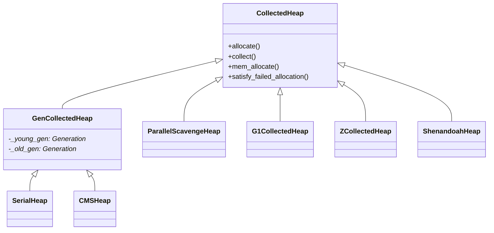
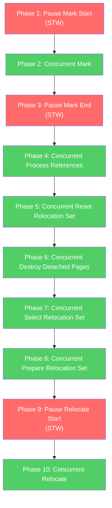
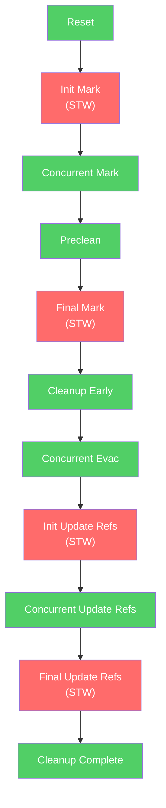
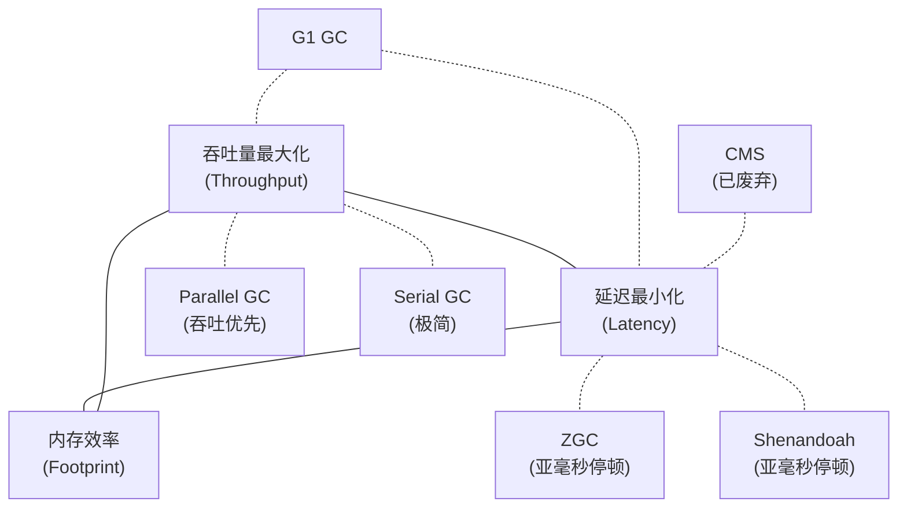
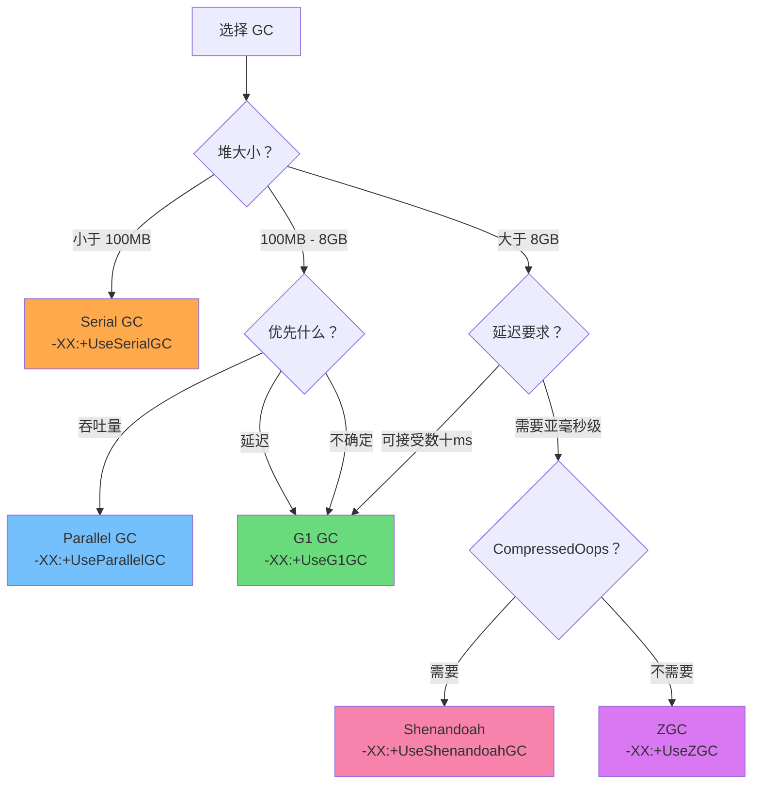

# HotSpot 垃圾收集器全面对比：从源码看六大 GC 的设计哲学

> 基于 OpenJDK 11 源码分析
> 标准环境：-Xms8g -Xmx8g -XX:+UseG1GC, G1 Region = 4MB
> 源码路径：src/hotspot/share/gc/
> 分析方法：Read-Diff（对比阅读法）+ JVM-Problem-Driven（问题驱动）+ JVM-Doc-Tutorial（教学文档）

---

## 第 0 部分：核心原理 ⭐

### 0.1 本质是什么？

本文深入分析 **HotSpot 垃圾收集器全面对比：从源码看六大 GC 的设计哲学**：从源码角度理解其设计原理、实现机制和关键细节。

### 0.2 为什么需要？

理解 JVM 内部实现是排查复杂问题、进行性能优化的基础。表面的 API 文档无法解释 JVM 的实际行为，只有深入源码才能建立精确的心智模型。

### 0.3 怎么解决？

结合源码阅读、数据结构分析和 GDB 运行时验证，从多个角度建立对该机制的完整理解。

### 0.4 为什么这样设计？

每个设计决策都有其权衡：性能 vs 正确性、简单性 vs 灵活性、内存占用 vs 查找速度。理解这些权衡是理解 JVM 设计的关键。

---


## 0. 问题引入

### 0.1 本质是什么？

GC 是自动内存管理的核心——它要在**不停止程序太久**的前提下**回收不再使用的内存**。但这两个目标天然矛盾：回收越彻底越需要停顿，停顿越短回收越不彻底。六种 GC 本质上是在"吞吐量 vs 延迟 vs 内存占用"三角中选择不同的平衡点。

### 0.2 为什么需要六种 GC？

最朴素的做法：STW（Stop The World）+ 单线程遍历整个堆做标记-清除-压缩。这在小堆（几百 MB）上可以接受，但当堆增长到几 GB 甚至几十 GB 时：

- **STW 时间线性增长**：8GB 堆的 Full GC 可能需要数秒
- **单线程无法利用多核**：16 核机器只有 1 核在做 GC
- **不同业务的需求截然不同**：批处理要吞吐量最大化，交易系统要毫秒级延迟

没有一种 GC 能同时满足所有场景，所以 HotSpot 提供了从简单到复杂的梯度选择。

### 0.3 核心思路：一句话概括

**六种 GC 沿着"STW 减少 → 并发增加 → 复杂性上升"的光谱排列，每一种都是前一种的问题驱动下的演进。**

---

## 1. GC 选择机制：从命令行到收集器实例

JVM 启动时，`GCConfig::select_gc()` 负责将命令行参数映射到具体的 GC 实现。

**源码**：`gc/shared/gcConfig.cpp:152`

```cpp
GCArguments* GCConfig::select_gc() {
  fail_if_unsupported_gc_is_selected();  // 检查是否选了未编译的 GC
  if (is_no_gc_selected()) {
    select_gc_ergonomically();           // 用户没指定，自动选择
    // ...
  }
  // ...
}
```

**自动选择逻辑**（`gcConfig.cpp:108`）：

```cpp
void GCConfig::select_gc_ergonomically() {
  if (os::is_server_class_machine()) {   // 2+ CPU && 2GB+ 内存
    FLAG_SET_ERGO_IF_DEFAULT(bool, UseG1GC, true);    // 服务器：G1
  } else {
    FLAG_SET_ERGO_IF_DEFAULT(bool, UseSerialGC, true); // 客户端：Serial
  }
}
```

**GC 注册表**（`gcConfig.cpp:73-82`）：

```cpp
static const SupportedGC SupportedGCs[] = {
  SupportedGC(UseConcMarkSweepGC, CollectedHeap::CMS,        ...),
  SupportedGC(UseG1GC,            CollectedHeap::G1,         ...),
  SupportedGC(UseParallelGC,      CollectedHeap::Parallel,   ...),
  SupportedGC(UseSerialGC,        CollectedHeap::Serial,     ...),
  SupportedGC(UseShenandoahGC,    CollectedHeap::Shenandoah, ...),
  SupportedGC(UseZGC,             CollectedHeap::Z,          ...),
};
```

> **JVM 参数**：`-XX:+PrintFlagsFinal | grep -i "Use.*GC"` 可查看当前选用的 GC。

---

## 2. 继承体系：共同骨架

六种 GC 都继承自 `CollectedHeap`（`gc/shared/collectedHeap.hpp:104`）：



**关键观察**：
- **Serial 和 CMS** 共享 `GenCollectedHeap` 框架（分代：Young + Old）
- **Parallel** 独立实现 `ParallelScavengeHeap`（虽然也分代，但不走 GenCollectedHeap 体系）
- **G1、ZGC、Shenandoah** 各自直接继承 `CollectedHeap`，设计理念差异大

---

## 3. 六大 GC 逐个击破

### 3.1 Serial GC：最简单的基线

**一句话**：单线程 STW，Young 用复制算法，Old 用标记-压缩。

**解决的问题**：在资源极少（单核、小内存）的环境下提供最低开销的 GC。

**启用参数**：`-XX:+UseSerialGC`

#### 堆结构

`SerialHeap`（`gc/serial/serialHeap.hpp:38`）继承 `GenCollectedHeap`，经典两代：
- **Young**（`DefNewGeneration`）：Eden + From Survivor + To Survivor
- **Old**（`TenuredGeneration`）：连续老年代空间

#### Young GC 入口

`DefNewGeneration::collect()` — `defNewGeneration.cpp:548`

```cpp
void DefNewGeneration::collect(bool full, bool clear_all_soft_refs,
                               size_t size, bool is_tlab) {
  SerialHeap* heap = SerialHeap::heap();
  // ... 单线程复制 Eden + From → To，年龄超阈值晋升 Old
}
```

核心流程：
1. STW（整个 GC 期间应用完全暂停）
2. 单线程扫描 GC Roots
3. 复制 Eden + From 中的存活对象到 To（或晋升到 Old）
4. 清空 Eden 和 From
5. From 和 To 角色互换

#### Full GC 入口

`GenMarkSweep::invoke_at_safepoint()` — `genMarkSweep.cpp:59`

经典四阶段 Mark-Sweep-Compact：

| 阶段 | 函数 | 行号 | 做什么 |
|------|------|------|--------|
| Phase 1 | `mark_sweep_phase1()` | `genMarkSweep.cpp:180` | 从 GC Roots 递归标记所有存活对象 |
| Phase 2 | `mark_sweep_phase2()` | `genMarkSweep.cpp:257` | 计算每个存活对象的新地址（压缩后的位置） |
| Phase 3 | `mark_sweep_phase3()` | `genMarkSweep.cpp:285` | 更新所有指针指向新地址 |
| Phase 4 | `mark_sweep_phase4()` | `genMarkSweep.cpp:325` | 移动对象到新位置 |

**全程 STW，单线程执行。**

#### 适用场景

- 嵌入式/客户端（堆 < 100MB）
- 单核环境
- 追求最小的 GC 代码复杂度和内存占用

---

### 3.2 Parallel GC：Serial 的多线程版

**一句话**：多线程 STW，目标是最大化吞吐量。

**解决的问题**：Serial 在多核机器上浪费了 CPU。Parallel 用多个 GC 线程并行工作，缩短 STW 时间。

**启用参数**：`-XX:+UseParallelGC`（JDK 8 默认）

#### 堆结构

`ParallelScavengeHeap`（`gc/parallel/parallelScavengeHeap.hpp:55`）独立继承 `CollectedHeap`：
- **Young**（`PSYoungGen`）：Eden + From + To
- **Old**（`PSOldGen`）：连续老年代

GC 线程池在初始化时创建（`parallelScavengeHeap.cpp:117`）：

```cpp
_gc_task_manager = GCTaskManager::create(ParallelGCThreads);
```

#### Young GC 入口

`PSScavenge::invoke_no_policy()` — `psScavenge.cpp:236`

与 Serial Young GC 的区别：
- **多线程并行**复制（通过 `GCTaskManager` 分发任务）
- 每个 GC 线程有独立的 PLAB（Promotion Local Allocation Buffer）减少竞争

#### Full GC 入口

`PSParallelCompact::invoke_no_policy()` — `psParallelCompact.cpp:1719`

| 阶段 | 行号 | 做什么 |
|------|------|--------|
| Marking Phase | `psParallelCompact.cpp:2068` | 多线程并行标记 |
| Summary Phase | `psParallelCompact.cpp:1582` | 计算每个 Region 的密度和目标地址 |
| Compact Phase | `psParallelCompact.cpp:2427` | 多线程并行压缩 |

**关键特性：`PSAdaptiveSizePolicy`**

Parallel GC 独有的自适应策略，根据 GC 历史数据自动调整 Eden/Survivor/Old 的比例：

- `-XX:GCTimeRatio=99`：期望 GC 时间占比不超过 1%
- `-XX:MaxGCPauseMillis=N`：期望最大停顿时间

两个目标冲突时，优先满足停顿时间目标。

#### 适用场景

- 批处理、离线计算、科学计算
- 堆 2GB-8GB，对延迟不敏感
- 追求最大吞吐量（CPU 利用率）

---

### 3.3 CMS GC：第一个并发收集器

> **注意**：CMS 在 JDK 9 中被标记为 deprecated（JEP 291），JDK 14 移除。此处分析是为了理解 GC 演进历史。

**一句话**：Old GC 大部分阶段与应用并发执行，只有 Initial Mark 和 Final Remark 需要 STW。

**解决的问题**：Serial/Parallel 的 Full GC 停顿与堆大小成正比。CMS 用并发标记 + 并发清除大幅缩短 STW 时间。

**启用参数**：`-XX:+UseConcMarkSweepGC`

#### 堆结构

`CMSHeap`（`gc/cms/cmsHeap.hpp:46`）继承 `GenCollectedHeap`：
- **Young**（`ParNewGeneration`）：并行版的 DefNewGeneration，入口在 `parNewGeneration.cpp:856`
- **Old**（`ConcurrentMarkSweepGeneration`）：使用 `CompactibleFreeListSpace`（空闲链表）

#### Old GC：六阶段并发流程

`CMSCollector::collect_in_background()` — `concurrentMarkSweepGeneration.cpp:1715`


| 阶段 | 函数 | 行号 | STW? | 做什么 |
|------|------|------|------|--------|
| Initial Mark | `checkpointRootsInitial()` | `concurrentMarkSweepGeneration.cpp:2809` | **是** | 标记 GC Roots 直接引用的对象 |
| Concurrent Mark | `markFromRoots()` | `concurrentMarkSweepGeneration.cpp:2931` | 否 | 从初始标记的对象出发遍历整个对象图 |
| Preclean | `preclean()` | `concurrentMarkSweepGeneration.cpp:3607` | 否 | 处理并发标记期间被修改的引用 |
| Final Remark | `checkpointRootsFinal()` | `concurrentMarkSweepGeneration.cpp:4103` | **是** | 修正并发标记遗漏，处理所有 dirty card |
| Concurrent Sweep | `sweep()` | `concurrentMarkSweepGeneration.cpp:5281` | 否 | 清除未标记对象，回收内存到空闲链表 |
| Concurrent Reset | (内部) | - | 否 | 重置 CMS 内部数据结构 |

#### CMS 的致命缺陷

1. **内存碎片**：只 Sweep 不 Compact，老年代使用空闲链表。长时间运行后碎片严重，可能触发 Concurrent Mode Failure 退化为 Serial Full GC（`do_compaction_work()` at line 1534）
2. **浮动垃圾**：并发标记期间新产生的垃圾无法在本次回收，需预留空间（`-XX:CMSInitiatingOccupancyFraction`）
3. **CPU 竞争**：并发阶段的 CMS 线程与应用线程共享 CPU

**这些缺陷正是 G1 诞生的动力。**

---

### 3.4 G1 GC：区域化 + 预测模型

**一句话**：将堆划分为等大的 Region，基于停顿时间预测模型选择性回收高收益 Region。

**解决的问题**：CMS 无法压缩导致碎片，且停顿时间不可预测。G1 通过 Region 化实现增量压缩，通过预测模型实现可控停顿。

**启用参数**：`-XX:+UseG1GC`（JDK 9+ 默认）

#### 堆结构

`G1CollectedHeap`（`gc/g1/g1CollectedHeap.hpp`）：
- 堆被划分为 **2048 个** Region（标准配置：8GB / 4MB = 2048）
- 每个 Region 动态充当 Eden / Survivor / Old / Humongous
- 逻辑分代，物理不连续

#### GC 模式

| 模式 | 入口 | 行号 | STW? | 触发条件 |
|------|------|------|------|---------|
| Young GC | `do_collection_pause_at_safepoint()` | `g1CollectedHeap.cpp:3542` | 全程 STW | Eden 满 |
| Mixed GC | 同上（CSet 包含 Old Region） | 同上 | 全程 STW | 并发标记完成后 |
| Full GC | `do_full_collection()` | `g1CollectedHeap.cpp:1132` | 全程 STW | Evacuation 失败等 |
| Concurrent Mark | `G1ConcurrentMarkThread::run_service()` | - | 仅 Initial/Final Mark STW | IHOP 阈值 |

**G1 的核心创新**：
1. **Region 化**：回收以 Region 为单位，可以只回收一部分 Region
2. **RSet（Remembered Set）**：每个 Region 记录"谁引用了我"，避免全堆扫描
3. **预测模型**：基于历史数据预测每个 Region 的回收耗时，选择性价比最高的 Region 集合
4. **`MaxGCPauseMillis`**：默认 200ms（`g1Arguments.cpp:140`），GC 会尽力控制在此范围内

> G1 的深度分析已有完整文档体系，详见 [G1GC 系列文档](../G1GC/)。

---

### 3.5 ZGC：并发一切

> **注意**：ZGC 在 JDK 11 中为实验性功能，需要 `-XX:+UnlockExperimentalVMOptions -XX:+UseZGC`。

**一句话**：几乎完全并发的收集器，通过染色指针（Colored Pointers）+ 读屏障实现亚毫秒级停顿。

**解决的问题**：G1 的 Young GC 和 Mixed GC 仍然全程 STW。堆越大（10GB+），停顿越明显。ZGC 目标是**停顿时间不随堆大小增长**。

**启用参数**：`-XX:+UnlockExperimentalVMOptions -XX:+UseZGC`

#### 堆结构

`ZCollectedHeap`（`gc/z/zCollectedHeap.hpp:38`）：
- **无分代**（JDK 11 版本不支持分代）
- 基于 **Page**（类比 G1 的 Region，但大小不固定）

三种 Page 类型（`os_cpu/linux_x86/gc/z/zGlobals_linux_x86.hpp:31-36`）：

| Page 类型 | 大小 | 对象大小上限 | 对象对齐 |
|-----------|------|-------------|---------|
| Small | 2MB | ≤ 265KB | MinObjAlignment |
| Medium | 32MB | ≤ 4MB | 4KB |
| Large | N × 2MB | > 4MB | 2MB |

#### GC 周期：10 个阶段只有 3 个 STW

`ZDriver::run_gc_cycle()` — `zDriver.cpp:327`



源码中的 10 个阶段：

```cpp
// zDriver.cpp:327-393
void ZDriver::run_gc_cycle(GCCause::Cause cause) {
  // Phase 1: Pause Mark Start (STW) — line 331
  { ZMarkStartClosure cl; vm_operation(&cl); }

  // Phase 2: Concurrent Mark — line 337
  { ZHeap::heap()->mark(); }

  // Phase 3: Pause Mark End (STW) — line 343
  { ZMarkEndClosure cl;
    while (!vm_operation(&cl)) {
      ZHeap::heap()->mark();  // Phase 3.5: 如果未完成，继续并发标记
    }
  }

  // Phase 4-8: 全部并发（处理引用、选择/准备重分配集）

  // Phase 9: Pause Relocate Start (STW) — line 382
  { ZRelocateStartClosure cl; vm_operation(&cl); }

  // Phase 10: Concurrent Relocate — line 388
  { ZHeap::heap()->relocate(); }
}
```

**3 个 STW 只做轻量操作**（设置/清除标记状态、切换 GC 阶段），工作量与 GC Roots 数量相关而与堆大小无关。

#### 核心技术：染色指针（Colored Pointers）

ZGC 最核心的创新：将 GC 元数据编码到对象指针本身。

**指针布局**（`os_cpu/linux_x86/gc/z/zGlobals_linux_x86.hpp:59-74`）：

```
  63                 47 46 45  42 41                                             0
  +-------------------+-+----+-----------------------------------------------+
  |00000000 00000000 0|0|1111|11 11111111 11111111 11111111 11111111 11111111|
  +-------------------+-+----+-----------------------------------------------+
  |                   | |    |
  |                   | |    * 41-0  Object Offset (42 bits, 4TB 地址空间)
  |                   | |
  |                   | * 45-42  Metadata Bits (4 bits):
  |                   |          0001 = Marked0
  |                   |          0010 = Marked1
  |                   |          0100 = Remapped
  |                   |          1000 = Finalizable
  |                   |
  |                   * 46  Unused
  |
  * 63-47  Fixed (always zero)
```

元数据常量定义（`gc/z/zGlobals.hpp:79-87`）：

```cpp
const uintptr_t ZAddressMetadataMarked0     = (uintptr_t)1 << (ZAddressMetadataShift + 0);
const uintptr_t ZAddressMetadataMarked1     = (uintptr_t)1 << (ZAddressMetadataShift + 1);
const uintptr_t ZAddressMetadataRemapped    = (uintptr_t)1 << (ZAddressMetadataShift + 2);
const uintptr_t ZAddressMetadataFinalizable = (uintptr_t)1 << (ZAddressMetadataShift + 3);
```

Good/Bad Mask 状态表（`zGlobals.hpp:103-109`）：

| 阶段 | GoodMask | BadMask | 含义 |
|------|----------|---------|------|
| Marked0 | 001 | 110 | 当前标记阶段使用 Marked0 |
| Marked1 | 010 | 101 | 下一轮标记使用 Marked1（交替使用） |
| Remapped | 100 | 011 | 已重映射，指向新位置 |

#### 核心技术：读屏障 + 自愈

每次从堆中加载引用时，ZGC 的读屏障（Load Barrier）检查指针的元数据位：

`zBarrier.inline.hpp:33-59`：

```cpp
template <ZBarrierFastPath fast_path, ZBarrierSlowPath slow_path>
inline oop ZBarrier::barrier(volatile oop* p, oop o) {
  uintptr_t addr = ZOop::to_address(o);

retry:
  if (fast_path(addr)) {         // 快速路径：检查 GoodMask
    return ZOop::to_oop(addr);   // 指针状态正确，直接返回
  }

  const uintptr_t good_addr = slow_path(addr);  // 慢速路径：修正指针

  // 自愈：CAS 把修正后的指针写回原位置
  if (p != NULL && good_addr != addr) {
    const uintptr_t prev_addr = Atomic::cmpxchg(good_addr, (volatile uintptr_t*)p, addr);
    if (prev_addr != addr) {
      addr = prev_addr;
      goto retry;  // 被其他线程抢先修改，重试
    }
  }

  return ZOop::to_oop(good_addr);
}
```

**自愈机制**的关键价值：同一个引用只会触发一次慢速路径，后续访问都走快速路径。

#### 转发表（Forwarding Table）

ZGC 使用每个 Page 独立的 `ZForwardingTable`（`gc/z/zForwardingTable.hpp:32`），存储搬迁映射：

`ZForwardingTableEntry`（`gc/z/zForwardingTableEntry.hpp:33-44`）：
- **22 bits**：from-index（源对象在 Page 内的索引）
- **42 bits**：to-offset（目标地址偏移）

#### 多重映射（Multi-Mapping）

ZGC 将同一块物理内存映射到 3 个虚拟地址区间（Marked0 View / Marked1 View / Remapped View），每个区间对应一个元数据位。这样通过切换 GoodMask 就能批量切换所有指针的状态，无需逐个修改。

**代价**：虚拟地址空间占用 3 倍，但物理内存不增加。Linux x86_64 下虚拟地址空间 4TB × 3 = 12TB。

#### 局限性（JDK 11）

- **不支持 CompressedOops**：指针必须 64 位，无法压缩到 32 位
- **不支持分代**：每次 GC 都扫描整个堆（JDK 21 才引入分代 ZGC）
- **仅支持 Linux/x86_64**（JDK 11 版本）

---

### 3.6 Shenandoah GC：另一条并发之路

> **注意**：Shenandoah 在 JDK 11 中为实验性功能，由 Red Hat 贡献。

**一句话**：通过标记字转发 + 读屏障实现并发压缩，不依赖染色指针也不需要多重映射。

**解决的问题**：与 ZGC 目标相同——将 GC 停顿控制在毫秒级以下。但 Shenandoah 选择了不同的技术路线：不修改指针格式，因此可以支持 CompressedOops。

**启用参数**：`-XX:+UnlockExperimentalVMOptions -XX:+UseShenandoahGC`

#### 堆结构

`ShenandoahHeap`（`gc/shenandoah/shenandoahHeap.hpp:113`）：
- **无分代**，等大 Region（类似 G1）
- Region 状态丰富（`shenandoahHeapRegion.hpp:111-122`）：

```cpp
enum RegionState {
  _empty_uncommitted,       // 空闲，未提交物理内存
  _empty_committed,         // 空闲，已提交
  _regular,                 // 正常分配中
  _humongous_start,         // 大对象起始
  _humongous_cont,          // 大对象续接
  _cset,                    // 在回收集合中
  _pinned,                  // 被钉住（JNI 引用等）
  _trash,                   // 仅含垃圾
  // ...
};
```

#### GC 周期：11 个阶段，4 个 STW

`ShenandoahControlThread::service_concurrent_normal_cycle()` — `shenandoahControlThread.cpp:346`



源码中的关键步骤：

```cpp
// shenandoahControlThread.cpp:392-433
heap->entry_reset();                    // 重置
heap->vmop_entry_init_mark();           // STW: 初始标记 (line 395)
heap->entry_mark();                     // 并发标记 (line 398)
heap->entry_preclean();                 // 预清理 (line 402)
heap->vmop_entry_final_mark();          // STW: 最终标记 (line 405)
heap->entry_cleanup_early();            // 早期清理 (line 409)

if (heap->is_evacuation_in_progress()) {
  heap->entry_evac();                   // 并发转移 (line 421)
  heap->vmop_entry_init_updaterefs();   // STW: 初始化引用更新 (line 425)
  heap->entry_updaterefs();             // 并发更新引用 (line 426)
  heap->vmop_entry_final_updaterefs();  // STW: 最终引用更新 (line 429)
  heap->entry_cleanup_complete();       // 完成清理 (line 432)
}
```

#### 核心技术：标记字转发（Mark Word Forwarding）

Shenandoah 不修改指针格式，而是利用对象头的 mark word 存储转发地址：

`shenandoahForwarding.inline.hpp:37-49`：

```cpp
inline HeapWord* ShenandoahForwarding::get_forwardee_raw_unchecked(oop obj) {
  markOop mark = obj->mark_raw();
  if (mark->is_marked()) {                          // mark word 最低两位是 11 = "已转发"
    HeapWord* fwdptr = (HeapWord*) mark->clear_lock_bits();  // 清除标志位，得到转发地址
    if (fwdptr != NULL) {
      return fwdptr;
    }
  }
  return (HeapWord*)obj;  // 未转发，返回自身
}
```

**CAS 转发**（`shenandoahForwarding.inline.hpp:76-89`）：

```cpp
inline oop ShenandoahForwarding::try_update_forwardee(oop obj, oop update) {
  markOop old_mark = obj->mark_raw();
  if (old_mark->is_marked()) {
    return (oop) old_mark->clear_lock_bits();  // 已被其他线程转发
  }
  markOop new_mark = markOopDesc::encode_pointer_as_mark(update);
  markOop prev_mark = obj->cas_set_mark_raw(new_mark, old_mark);
  if (prev_mark == old_mark) {
    return update;    // CAS 成功，本线程完成转发
  } else {
    return (oop) prev_mark->clear_lock_bits();  // CAS 失败，用其他线程的结果
  }
}
```

#### 核心技术：读屏障（Load Reference Barrier）

`shenandoahBarrierSet.cpp:72-122`：

```cpp
oop ShenandoahBarrierSet::load_reference_barrier_not_null(oop obj) {
  if (ShenandoahLoadRefBarrier && _heap->has_forwarded_objects()) {
    return load_reference_barrier_impl(obj);  // 需要检查转发
  }
  return obj;
}

oop ShenandoahBarrierSet::load_reference_barrier_impl(oop obj) {
  if (!CompressedOops::is_null(obj)) {
    bool evac_in_progress = _heap->is_evacuation_in_progress();
    oop fwd = resolve_forwarded_not_null(obj);       // 查看是否已转发
    if (evac_in_progress &&
        _heap->in_collection_set(obj) &&
        obj == fwd) {                                 // 在回收集合中但尚未转发
      return _heap->evacuate_object(obj, Thread::current());  // 当前线程帮忙转移
    }
    return fwd;
  }
  return obj;
}
```

#### GC 状态位

`shenandoahHeap.hpp:240-259` 定义了 GC 状态机，屏障行为依赖当前状态：

| 状态位 | 值 | 含义 | 屏障行为 |
|--------|-----|------|---------|
| `STABLE` | 0 | GC 空闲 | 无屏障 |
| `HAS_FORWARDED` | 1 | 存在已转发对象 | Load Reference Barrier 激活 |
| `MARKING` | 2 | 标记阶段 | SATB Write Barrier 激活 |
| `EVACUATION` | 4 | 转移阶段 | LRB 可能触发转移 |
| `UPDATEREFS` | 8 | 更新引用阶段 | 无额外屏障 |

#### 退化路径

Shenandoah 在并发阶段遇到分配失败时有三级退化（`shenandoahControlThread.cpp:105-216`）：

```
Concurrent GC → Degenerated GC (STW 完成剩余工作) → Full GC (STW Mark-Compact)
```

#### 与 ZGC 的核心区别

| 维度 | ZGC | Shenandoah | 为什么不同 |
|------|-----|-----------|-----------|
| 转发机制 | 外部转发表（ZForwardingTable/Page） | Mark Word 编码转发地址 | ZGC 不想修改对象头，Shenandoah 不想增加额外数据结构 |
| 指针格式 | 染色指针（4-bit 元数据） | 标准指针 | ZGC 用多重映射换取批量状态切换，Shenandoah 保持兼容性 |
| CompressedOops | 不支持（JDK 11） | 支持 | 染色指针占用了高位，无法压缩到 32 位 |
| Update Refs 阶段 | 不需要（自愈修正） | 需要独立的 Update References 阶段 | ZGC 的自愈机制更彻底但需要多重映射 |
| 虚拟内存 | 3 倍映射（12TB 虚拟地址） | 1 倍（正常映射） | 多重映射是染色指针的代价 |
| STW 次数 | 3 次 | 4 次 | Shenandoah 多一次 Init/Final Update Refs |

---

## 4. 六大 GC 全维度对比

### 4.1 核心对比表

| 维度 | Serial | Parallel | CMS | G1 | ZGC | Shenandoah | 为什么不同 |
|------|--------|----------|-----|-----|-----|-----------|-----------|
| **堆模型** | Young + Old（连续） | Young + Old（连续） | Young + Old（连续） | 等大 Region（动态角色） | 不等大 Page（无分代） | 等大 Region（无分代） | Region 化是增量回收的基础 |
| **GC 线程** | 单线程 | 多线程并行 | 并发（CMS 线程） | STW 阶段多线程并行 + 并发标记线程 | 几乎全并发 | 几乎全并发 | 并行度越高，设计复杂度越高 |
| **Young GC** | DefNewGeneration（复制） | PSScavenge（并行复制） | ParNew（并行复制） | Evacuation（并行复制到新 Region） | 无分代，统一处理 | 无分代，统一处理 | 分代假说在大堆下收益递减 |
| **Old GC 算法** | Mark-Sweep-Compact | Parallel Mark-Compact | Concurrent Mark-Sweep | Concurrent Mark + Evacuation | Concurrent Mark-Relocate | Concurrent Mark-Evacuate-Update | 是否压缩 × 是否并发 |
| **碎片处理** | 压缩（无碎片） | 压缩（无碎片） | **不压缩（有碎片）** | 复制到新 Region（无碎片） | 复制到新 Page（无碎片） | 复制到新 Region（无碎片） | CMS 不压缩是其被废弃的主因 |
| **Full GC STW 最坏情况** | O(堆大小) | O(堆大小)/线程数 | O(堆大小) 退化时 | O(堆大小)/线程数 | O(堆大小)/线程数 | O(堆大小)/线程数 | Full GC 是所有 GC 的最后防线 |
| **正常 GC STW** | O(堆大小) | O(堆大小)/线程数 | O(GC Roots) | O(CSet 大小) | O(GC Roots) | O(GC Roots) | 并发 GC 将 O(堆大小) 工作移到并发阶段 |
| **屏障类型** | 无 | 无 | Write Barrier（增量更新） | Write Barrier（SATB + 卡表） | **Read Barrier**（Load Barrier） | Read Barrier + Write Barrier（SATB） | 并发回收需要屏障追踪引用变化 |
| **转发机制** | 对象头 forwarding | 对象头 forwarding | 不转发（不移动） | 对象头 forwarding | 外部 ZForwardingTable | Mark Word 编码 | 并发搬迁需要转发旧地址到新地址 |
| **CompressedOops** | 支持 | 支持 | 支持 | 支持 | **不支持** | 支持 | ZGC 染色指针占用高位 |
| **目标堆大小** | < 100MB | 1-8 GB | 1-8 GB | 4-64 GB | 8GB-16TB | 8GB-数百 GB | 技术复杂度换取大堆可控停顿 |
| **状态** | 活跃 | 活跃（JDK 8 默认） | **JDK 9 废弃，JDK 14 移除** | 活跃（JDK 9+ 默认） | 实验性（JDK 11） | 实验性（JDK 11） | 技术成熟度不同 |

### 4.2 设计权衡三角



**各 GC 在三角中的位置**：

| GC | 吞吐量 | 延迟 | 内存占用 | 取舍逻辑 |
|----|--------|------|---------|---------|
| Serial | 低（单线程） | 高（全程 STW） | **最低** | 牺牲一切换最小开销 |
| Parallel | **最高** | 高（全程 STW） | 低 | 多线程最大化 CPU 利用率 |
| CMS | 中（并发线程消耗 CPU） | 中（2 次短 STW） | 中（碎片浪费） | 第一次尝试并发，有碎片代价 |
| G1 | 中高 | 中低（可控 STW） | 中（RSet 开销 ~5-10%） | Region 化实现增量回收 + 可预测 |
| ZGC | 中 | **极低**（< 1ms 目标） | 高（多重映射 + 无分代） | 极致并发，牺牲内存效率和吞吐 |
| Shenandoah | 中 | **极低**（< 1ms 目标） | 中高（转发表 + 无分代） | 与 ZGC 同一目标，不同技术路线 |

---

## 5. GC 选择指南

### 5.1 决策树



### 5.2 场景推荐

| 场景 | 推荐 GC | 理由 |
|------|---------|------|
| 微服务（堆 256MB-2GB） | G1 | JDK 9+ 默认，无需调优即可获得良好表现 |
| 大数据批处理（Spark/Flink） | Parallel | 最大化吞吐，停顿在批处理间隙可接受 |
| 交易系统（低延迟要求） | ZGC / Shenandoah | 亚毫秒级停顿，堆大小不影响延迟 |
| 超大堆（数百 GB） | ZGC | 专为超大堆设计，停顿时间恒定 |
| 容器环境（资源受限） | Serial / G1 | Serial 占用最少资源；G1 适应性强 |
| JDK 8 遗留系统 | Parallel（默认）→ G1 | 升级 JDK 后自动切换到 G1 |

---

## 6. GDB 验证计划

### 6.1 验证 GC 选择

```bash
# 断点：GC 选择入口
break gcConfig.cpp:152
# 观察：最终选择了哪个 GC
break gcConfig.cpp:108
commands
  print "is_server_class_machine = "
  call os::is_server_class_machine()
end
```

### 6.2 验证各 GC 入口

| 断点 | 源文件:行号 | 观察内容 |
|------|-----------|---------|
| Serial Young GC | `defNewGeneration.cpp:548` | collect() 参数 |
| Serial Full GC | `genMarkSweep.cpp:59` | invoke_at_safepoint() 触发 |
| Parallel Young GC | `psScavenge.cpp:236` | invoke_no_policy() |
| Parallel Full GC | `psParallelCompact.cpp:1719` | invoke_no_policy() |
| CMS Background | `concurrentMarkSweepGeneration.cpp:1715` | collect_in_background() |
| G1 Young GC | `g1CollectedHeap.cpp:3542` | do_collection_pause_at_safepoint() |
| ZGC Cycle | `zDriver.cpp:327` | run_gc_cycle() 10 个阶段 |
| Shenandoah Cycle | `shenandoahControlThread.cpp:346` | service_concurrent_normal_cycle() |

---

## 7. JVM 参数速查

| 参数 | 含义 | 适用 GC |
|------|------|---------|
| `-XX:+UseSerialGC` | 启用 Serial GC | Serial |
| `-XX:+UseParallelGC` | 启用 Parallel GC | Parallel |
| `-XX:+UseConcMarkSweepGC` | 启用 CMS（已废弃） | CMS |
| `-XX:+UseG1GC` | 启用 G1 GC | G1 |
| `-XX:+UseZGC` | 启用 ZGC（需 UnlockExperimental） | ZGC |
| `-XX:+UseShenandoahGC` | 启用 Shenandoah（需 UnlockExperimental） | Shenandoah |
| `-XX:ParallelGCThreads=N` | STW 阶段并行 GC 线程数 | 除 Serial 外 |
| `-XX:ConcGCThreads=N` | 并发 GC 线程数 | CMS / G1 / ZGC / Shenandoah |
| `-XX:MaxGCPauseMillis=200` | 最大 GC 停顿目标 | G1 / Parallel |
| `-XX:GCTimeRatio=99` | GC 时间占比目标 | Parallel |
| `-Xlog:gc*` | GC 日志（JDK 9+统一日志） | 所有 |
| `-XX:+PrintGCDetails` | GC 详细日志（JDK 8） | 所有 |

---

## 8. 总结

### 8.1 核心要点

1. **六种 GC 是一条演进光谱**：Serial（单线程 STW）→ Parallel（多线程 STW）→ CMS（并发标记-清除）→ G1（Region 化增量回收）→ ZGC/Shenandoah（几乎全并发）
2. **复杂性是有代价的**：并发 GC 需要屏障（读/写）、转发机制、额外的数据结构（RSet / 染色指针 / 转发表），这些都消耗内存和 CPU
3. **没有银弹**：每种 GC 都在吞吐量、延迟、内存占用之间做了不同的取舍
4. **G1 是 JDK 11 的最佳默认选择**：大多数场景下无需手动选择 GC
5. **ZGC 和 Shenandoah 代表未来方向**：它们证明了亚毫秒级停顿在大堆上是可行的

### 8.2 常见误解

| 误解 | 事实 |
|------|------|
| "G1 是并发 GC" | G1 的 Young GC 和 Mixed GC **全程 STW**，只有标记阶段是并发的 |
| "ZGC 没有 STW" | ZGC 仍有 3 次短暂 STW（通常 < 1ms），但工作量与堆大小无关 |
| "Parallel 就是 ParNew" | Parallel 是独立的堆体系（ParallelScavengeHeap），ParNew 是 CMS 配套的 Young GC |
| "CMS 只影响 Old GC" | CMS 退化时会做 Serial Full GC，影响整个堆 |
| "堆越大越该用 ZGC" | ZGC 无分代，小堆下可能因频繁全堆扫描反而不如 G1 |

### 8.3 延伸阅读

| 文档 | 路径 | 相关主题 |
|------|------|---------|
| G1 数据结构全景图 | [G1GC/0-G1-DataStructure-Map.md](../G1GC/0-G1-DataStructure-Map.md) | G1 内部数据结构 |
| G1 Young GC 完整流程 | [G1GC/11-Young-GC-Complete-STW-Flow.md](../G1GC/11-Young-GC-Complete-STW-Flow.md) | Young GC 细节 |
| G1 并发标记 | [G1GC/8-Concurrent-Marking.md](../G1GC/8-Concurrent-Marking.md) | 并发标记流程 |
| G1 策略与预测模型 | [G1GC/7-G1Policy-Prediction-Model.md](../G1GC/7-G1Policy-Prediction-Model.md) | 停顿预测 |
| Young GC 全栈视角 | [Integration/3-Young-GC-Full-Stack-View.md](../Integration/3-Young-GC-Full-Stack-View.md) | 从 Safepoint 到回收 |
| GC 面试指南 | [Interview/3-GC-G1GC-Interview-Guide.md](../Interview/3-GC-G1GC-Interview-Guide.md) | GC 面试题集 |
| GC 排障案例 | [RealWorld-Cases/04-GC-Troubleshooting-Case-Study.md](../RealWorld-Cases/04-GC-Troubleshooting-Case-Study.md) | GC 问题实战 |
| G1 调优实践 | [G1GC/G1-Performance-Tuning-Practice.md](../G1GC/G1-Performance-Tuning-Practice.md) | 调优方法论 |

---

> **源码版本**：OpenJDK 11（`/data/workspace/openjdk-cut-new/`）
> **自检报告**：所有源码行号经 read_file 验证，Mermaid 图表经语法检查
