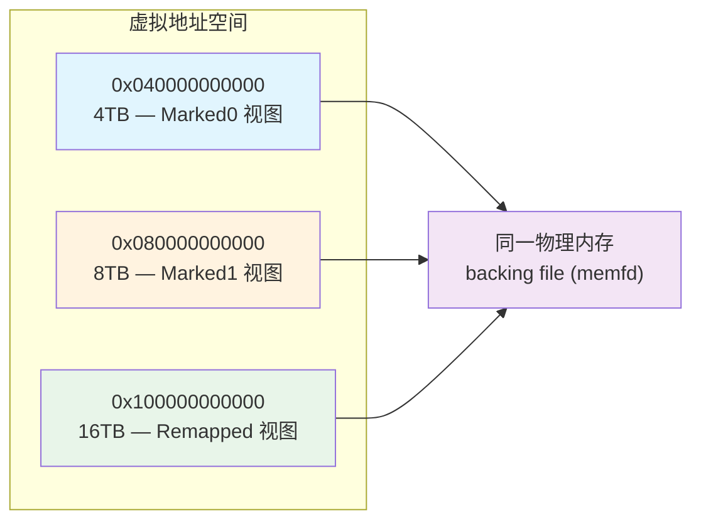
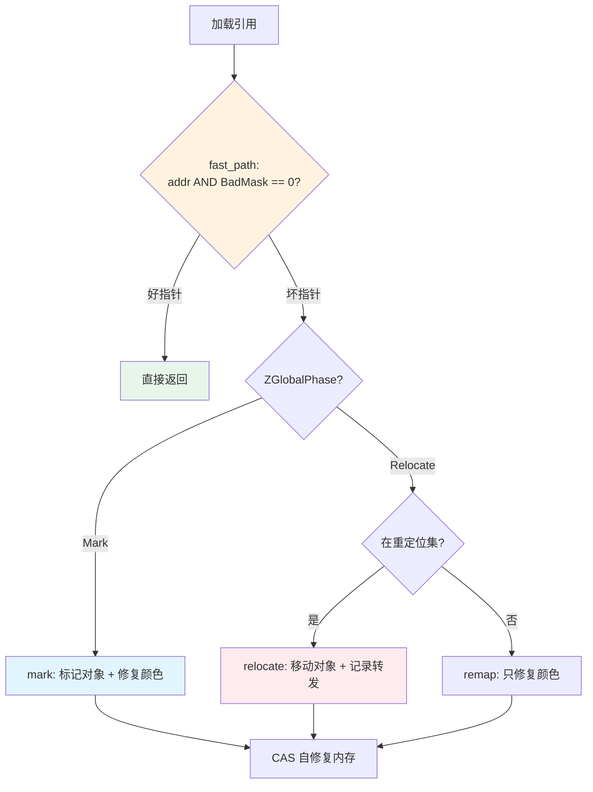

# ZGC 深度解析：染色指针与并发回收的艺术

> 基于 OpenJDK 11 源码分析（ZGC 为 **Experimental** 特性，需 `-XX:+UnlockExperimentalVMOptions -XX:+UseZGC`）
> 标准环境：-Xms8g -Xmx8g -XX:+UseZGC
> 源码路径：src/hotspot/share/gc/z/
> 分析方法：Read-TopDown + JVM-Problem-Driven + Read-DataFlow + JVM-Object-Layout + JVM-Doc-Tutorial

---

## 第 0 部分：核心原理 ⭐

### 0.1 本质是什么？

本文深入分析 **ZGC 深度解析：染色指针与并发回收的艺术**：从源码角度理解其设计原理、实现机制和关键细节。

### 0.2 为什么需要？

理解 JVM 内部实现是排查复杂问题、进行性能优化的基础。表面的 API 文档无法解释 JVM 的实际行为，只有深入源码才能建立精确的心智模型。

### 0.3 怎么解决？

结合源码阅读、数据结构分析和 GDB 运行时验证，从多个角度建立对该机制的完整理解。

### 0.4 为什么这样设计？

每个设计决策都有其权衡：性能 vs 正确性、简单性 vs 灵活性、内存占用 vs 查找速度。理解这些权衡是理解 JVM 设计的关键。

---


## 0. 问题引入

### 0.1 本质是什么？

ZGC 是一个以**极低延迟**为首要目标的垃圾收集器——它要把 GC 停顿控制在 **10ms 以内**，无论堆有多大。这意味着几乎所有工作（标记、转移、重映射）都必须与应用线程并发执行。

### 0.2 为什么需要 ZGC？

G1 GC 虽然引入了 Region 化和增量回收，但 Young GC 和 Mixed GC 的疏散阶段（Evacuation）仍然是完全 STW 的。当堆增长到 10GB 甚至 TB 级别时：

- **G1 的疏散停顿与存活对象量成正比**：堆越大，活对象越多，拷贝时间越长
- **CMS 有并发标记但无法并发压缩**：碎片化是 CMS 的致命伤，最终触发 Full GC
- **对于金融交易、实时推荐等场景**：毫秒级的 GC 停顿都不可接受

**核心矛盾**：传统 GC 在移动对象（压缩/疏散）时必须 STW，因为如果应用线程同时在读旧地址，而对象已经被移走了，就会读到垃圾数据。

### 0.3 朴素方案与问题

最直觉的做法：在后台线程移动对象，维护全局转发表，应用线程查表找新地址。问题：每次内存访问都要查表（读放大）；移动后要更新所有引用（O(heap_size)）；并发修改引用需要复杂同步。

### 0.4 ZGC 的核心思路

**把 GC 元数据编码到指针本身（染色指针），通过读屏障在每次加载时自修复，利用虚拟内存多映射让不同颜色的指针都能正确访问同一物理内存。**

一句话：**不改引用，改指针颜色；不查全局表，在读时自修复**。

---

## 1. 核心概念

### 1.1 染色指针（Colored Pointers）

ZGC 利用 x86-64 平台虚拟地址只使用低 48 位的特性，在指针的高位嵌入 4 位元数据。

**源码**：`os_cpu/linux_x86/gc/z/zGlobals_linux_x86.hpp:59-74`

```
   6                 4 4 4  4 4                                             0
   3                 7 6 5  2 1                                             0
  +-------------------+-+----+-----------------------------------------------+
  |00000000 00000000 0|0|1111|11 11111111 11111111 11111111 11111111 11111111|
  +-------------------+-+----+-----------------------------------------------+
  |                   | |    |
  |                   | |    * 41-0 Object Offset (42-bits, 4TB 地址空间)
  |                   | |
  |                   | * 45-42 Metadata Bits (4-bits)
  |                   |         0001 = Marked0      (视图 4-8TB)
  |                   |         0010 = Marked1      (视图 8-12TB)
  |                   |         0100 = Remapped     (视图 16-20TB)
  |                   |         1000 = Finalizable  (无对应视图)
  |                   |
  |                   * 46 Unused (1-bit, always zero)
  * 63-47 Fixed (17-bits, always zero)
```

**源码**：`gc/z/zGlobals.hpp:84-87`

```cpp
const uintptr_t ZAddressMetadataMarked0     = (uintptr_t)1 << (ZAddressMetadataShift + 0); // bit 42
const uintptr_t ZAddressMetadataMarked1     = (uintptr_t)1 << (ZAddressMetadataShift + 1); // bit 43
const uintptr_t ZAddressMetadataRemapped    = (uintptr_t)1 << (ZAddressMetadataShift + 2); // bit 44
const uintptr_t ZAddressMetadataFinalizable = (uintptr_t)1 << (ZAddressMetadataShift + 3); // bit 45
```

其中 `ZAddressMetadataShift = ZPlatformAddressOffsetBits = 42`（`zGlobals_linux_x86.hpp:81`）。

**关键限制**：对象偏移 42 位 → 最大堆 4TB。**JDK 11 的 ZGC 不支持 CompressedOops**（指针必须 64 位宽）。

### 1.2 Good/Bad 掩码

ZGC 在任意时刻定义了哪种颜色是"好的"（Good），其余都是"坏的"（Bad）。

**源码**：`gc/z/zGlobals.hpp:102-115`

| 当前阶段 | GoodMask | BadMask | 含义 |
|---------|----------|---------|------|
| Marked0 | 001 | 110 | 只有 Marked0 是好的 |
| Marked1 | 010 | 101 | 只有 Marked1 是好的 |
| Remapped | 100 | 011 | 只有 Remapped 是好的 |

检测指针好坏只需一条 AND 指令（`zAddress.inline.hpp:36-37`）：

```cpp
inline bool ZAddress::is_bad(uintptr_t value) {
  return value & ZAddressBadMask;
}
```

### 1.3 虚拟内存多映射（Multi-Mapping）

染色指针导致同一个物理对象有三个不同虚拟地址。ZGC 通过 Linux `mmap` 将同一 backing file 的同一段偏移映射到三个虚拟地址来解决。

**源码**：`os_cpu/linux_x86/gc/z/zPhysicalMemoryBacking_linux_x86.cpp:239-249`

```cpp
void ZPhysicalMemoryBacking::map(ZPhysicalMemory pmem, uintptr_t offset) const {
  if (ZUnmapBadViews) {
    map_view(pmem, ZAddress::good(offset), AlwaysPreTouch);
  } else {
    map_view(pmem, ZAddress::marked0(offset), AlwaysPreTouch);  // 视图1
    map_view(pmem, ZAddress::marked1(offset), AlwaysPreTouch);  // 视图2
    map_view(pmem, ZAddress::remapped(offset), AlwaysPreTouch); // 视图3
  }
}
```

每次 `map_view` 的核心（第 193-200 行）：`mmap(addr, size, PROT_READ|PROT_WRITE, MAP_FIXED|MAP_SHARED, _file.fd(), segment.start())`。`MAP_SHARED` + 同一 `fd` + 同一 `offset` → 三个虚拟地址指向同一物理页面。

**backing file 创建**（`zBackingFile_linux_x86.cpp:239-255`）：优先 `memfd_create`（syscall 319），回退 tmpfs/hugetlbfs。

**unmap 设计**（第 222-232 行）：不用 `munmap`（会释放虚拟地址空间），而是用 `mmap(PROT_NONE, MAP_FIXED|MAP_ANONYMOUS)` 覆盖——保留虚拟地址预留。



### 1.4 读屏障（Load Barrier）

**x86 快速路径**（`zBarrierSetAssembler_x86.cpp:105-112`）：

```asm
lea    scratch, [src]                          ; 获取引用地址
movptr dst, [scratch]                          ; 加载 oop
testptr dst, [r15 + bad_mask_offset]           ; AND 检测坏掩码
jz     done                                    ; 零 → 好指针，跳过慢路径
```

只需 **load + test + branch** 三条指令，分支预测几乎 100% 命中。

**慢路径 + 自修复**（`gc/z/zBarrier.inline.hpp:33-59`）：

```cpp
template <ZBarrierFastPath fast_path, ZBarrierSlowPath slow_path>
inline oop ZBarrier::barrier(volatile oop* p, oop o) {
  uintptr_t addr = ZOop::to_address(o);
retry:
  if (fast_path(addr)) { return ZOop::to_oop(addr); }         // 快速路径
  const uintptr_t good_addr = slow_path(addr);                // 慢路径修复

  if (p != NULL && good_addr != addr) {
    const uintptr_t prev_addr = Atomic::cmpxchg(good_addr, (volatile uintptr_t*)p, addr);
    if (prev_addr != addr) { addr = prev_addr; goto retry; }  // CAS 失败，重试
  }
  return ZOop::to_oop(good_addr);
}
```

**自修复（Self-Healing）**：用 CAS 把内存中的旧指针替换为好指针。同一内存位置只触发一次慢路径，之后直接走快速路径。

---

## 2. 核心数据结构

### 2.1 ZCollectedHeap — 门面类

**源码**：`gc/z/zCollectedHeap.hpp:38-51`

```cpp
class ZCollectedHeap : public CollectedHeap {
  ZCollectorPolicy* _collector_policy;
  SoftRefPolicy     _soft_ref_policy;
  ZBarrierSet       _barrier_set;     // 读屏障实现
  ZInitialize       _initialize;      // 早期初始化（地址掩码、NUMA、CPU、统计等）
  ZHeap             _heap;            // 核心堆实现（内联，非指针）
  ZDirector*        _director;        // GC 触发决策线程
  ZDriver*          _driver;          // GC 执行驱动线程
  ZStat*            _stat;            // 统计线程
  ZRuntimeWorkers   _runtime_workers; // Safepoint 时使用的 worker 线程
};
```

初始化顺序很关键：`_barrier_set` → `_initialize`（调用 `ZAddressMasks::initialize()` 等）→ `_heap`。

**源码**：`gc/z/zInitialize.cpp:37-51`

```cpp
ZInitialize::ZInitialize(ZBarrierSet* barrier_set) {
  ZAddressMasks::initialize();     // 设置初始掩码: GoodMask=Remapped, MetadataMarked=Marked0
  ZNUMA::initialize();
  ZCPU::initialize();
  ZStatValue::initialize();
  ZTracer::initialize();
  ZLargePages::initialize();
  ZBarrierSet::set_barrier_set(barrier_set);
}
```

### 2.2 ZHeap — 堆核心

**源码**：`gc/z/zHeap.hpp:49-64`，构造函数 `zHeap.cpp:62-79`

| 字段 | 类型 | 初始化依赖 | 作用 |
|------|------|-----------|------|
| `_workers` | `ZWorkers` | CPU 数量 | GC 工作线程池（parallel=60%CPU, concurrent=12.5%CPU）|
| `_object_allocator` | `ZObjectAllocator` | `_workers.nworkers()` | Per-CPU/Per-Worker 对象分配 |
| `_page_allocator` | `ZPageAllocator` | min/max/reserve 大小 | 页面分配（物理+虚拟内存管理）|
| `_pagetable` | `ZPageTable` | 无 | 地址→ZPage 映射表（2MB 粒度）|
| `_mark` | `ZMark` | `_workers`, `_pagetable` | 并发标记子系统 |
| `_reference_processor` | `ZReferenceProcessor` | `_workers` | 引用处理 |
| `_weak_roots_processor` | `ZWeakRootsProcessor` | `_workers` | 弱根处理 |
| `_relocate` | `ZRelocate` | `_workers` | 并发重定位子系统 |
| `_relocation_set` | `ZRelocationSet` | 无 | 待重定位页面集合 |
| `_serviceability` | `ZServiceability` | min/max 大小 | JMX/MXBean |

**worker 线程数量**（`zWorkers.cpp:31-52`）：

```cpp
uint ZWorkers::calculate_nparallel() {
  return ceil(os::initial_active_processor_count() * 60.0 / 100.0);   // STW 并行
}
uint ZWorkers::calculate_nconcurrent() {
  return ceil(os::initial_active_processor_count() * 12.5 / 100.0);   // 并发
}
```

### 2.3 ZPage — 内存页

**源码**：`gc/z/zPage.hpp:34-52`

| 字段 | 类型 | 大小 | 含义 |
|------|------|------|------|
| `_type` | `const uint8_t` | 1B | Small(0)/Medium(1)/Large(2) |
| `_pinned` | `volatile uint8_t` | 1B | 是否被 pin 住 |
| `_numa_id` | `uint8_t` | 1B | NUMA 节点 |
| `_seqnum` | `uint32_t` | 4B | 分配序号 |
| `_virtual` | `const ZVirtualMemory` | 16B | 虚拟地址范围 |
| `_top` | `volatile uintptr_t` | 8B | bump pointer |
| `_livemap` | `ZLiveMap` | 变长 | 存活位图 |
| `_refcount` | `volatile uint32_t` | 4B | 引用计数 |
| `_forwarding` | `ZForwardingTable` | 16B | 转发表 |
| `_physical` | `ZPhysicalMemory` | 变长 | 物理内存描述 |
| `_node` | `ZListNode<ZPage>` | 16B | 链表节点 |

**三种页面类型**（`zGlobals_linux_x86.hpp:31-36`）：

| 类型 | 页面大小 | 对象上限 | 对齐 | 说明 |
|------|---------|---------|------|------|
| Small | 2MB | ≤ 265K | 8B | `ZPageSizeSmall / 8`，允许 12.5% 浪费 |
| Medium | 32MB | ≤ 4MB | 4KB | 8192 个对象/页 |
| Large | N × 2MB | > 4MB | 2MB | 一页一对象 |

### 2.4 ZForwardingTableEntry — 转发表条目

**源码**：`gc/z/zForwardingTableEntry.hpp:31-44`

```
  63               42 41                                              0
  +------------------+------------------------------------------------+
  |  From Index (22) |           To Object Offset (42)                |
  +------------------+------------------------------------------------+
```

- 空标记 = 全 1（`(uintptr_t)-1`），因为 `from_index=0, to_offset=0` 是合法值
- 表大小 = `round_up_power_of_2(live_objects * 2)`，负载因子 50%
- 并发插入使用 `Atomic::cmpxchg`（无锁线性探测）

---

## 3. GC 周期：10 阶段全流程

### 3.1 入口与总览

**源码**：`gc/z/zDriver.cpp:327-393`

```mermaid
graph LR
    P1["Phase 1<br/>Pause Mark Start<br/>⏸ STW"] --> P2["Phase 2<br/>Concurrent Mark"]
    P2 --> P3["Phase 3<br/>Pause Mark End<br/>⏸ STW"]
    P3 --> P4["Phase 4<br/>Conc Ref Processing"]
    P4 --> P5["Phase 5<br/>Conc Reset RelSet"]
    P5 --> P6["Phase 6<br/>Conc Destroy Pages"]
    P6 --> P7["Phase 7<br/>Conc Select RelSet"]
    P7 --> P8["Phase 8<br/>Conc Prepare RelSet"]
    P8 --> P9["Phase 9<br/>Pause Relocate Start<br/>⏸ STW"]
    P9 --> P10["Phase 10<br/>Conc Relocate"]
    style P1 fill:#ffebee
    style P3 fill:#ffebee
    style P9 fill:#ffebee
```



10 阶段中 **3 个 STW + 7 个并发**。STW 阶段只做轻量操作（翻转掩码、扫描根），不遍历堆。

### 3.2 Phase 1: Pause Mark Start（STW）

**源码**：`gc/z/zHeap.cpp:270-297`

核心操作：
1. 回收所有 TLAB
2. **`ZAddressMasks::flip_to_marked()`** — 翻转颜色掩码
3. 设置 `ZGlobalPhase = ZPhaseMark`
4. 标记根对象

**掩码翻转**（`zAddress.cpp:41-44`）：

```cpp
void ZAddressMasks::flip_to_marked() {
  ZAddressMetadataMarked ^= (ZAddressMetadataMarked0 | ZAddressMetadataMarked1);
  set_good_mask(ZAddressMetadataMarked);
}
```

**数据流追踪** —— `ZAddressMetadataMarked` 的变化：

| 时机 | MetadataMarked | GoodMask | BadMask |
|------|---------------|----------|---------|
| 初始化 (`zAddress.cpp:37-38`) | Marked0 | Remapped(100) | 011 |
| 第 1 次 flip_to_marked | Marked1 (XOR 交替) | Marked1(010) | 101 |
| flip_to_remapped | Marked1 (不变) | Remapped(100) | 011 |
| 第 2 次 flip_to_marked | Marked0 (XOR 交替回来) | Marked0(001) | 110 |

**为什么交替 Marked0/Marked1？** 区分"本轮标记"和"上轮残留标记"。上一轮的 Marked 在本轮变成"坏"颜色，读屏障会自动修复。

### 3.3 Phase 2: Concurrent Mark

**源码**：`gc/z/zMark.cpp:482-504`

工作循环四步走（`zMark.cpp:482-504`）：

```cpp
// gc/z/zMark.cpp:482-504
void ZMark::work_without_timeout(ZMarkCache* cache, ZMarkStripe* stripe, ZMarkThreadLocalStacks* stacks) {
  ZStatTimer timer(ZSubPhaseConcurrentMark);
  ZMarkNoTimeout no_timeout;

  for (;;) {
    drain_and_flush(stripe, stacks, cache, &no_timeout);  // 1. 处理自己条纹的标记栈

    if (try_steal(stripe, stacks)) {  // 2. 从其他条纹窃取工作
      continue;                       //    窃取成功则回到 drain_and_flush
    }

    if (try_proactive_flush()) {      // 3. 主动刷新其他线程的本地栈
      continue;                       //    有工作可做则回到 drain_and_flush
    }

    if (try_terminate()) {            // 4. 两阶段终止协议
      break;                          //    所有线程都无工作，退出循环
    }
  }
}
```

**设计要点**：四步递进策略——先处理本地工作，再窃取，再刷新，最后终止。`try_terminate()` 使用两阶段协议防止虚假终止。

**标记单个对象**（`zMark.cpp:269-289`）：

```cpp
bool ZMark::try_mark_object(ZMarkCache* cache, uintptr_t addr, bool finalizable) {
  ZPage* const page = _pagetable->get(addr);
  if (page->is_allocating()) return false;  // 新分配的对象隐式存活

  bool inc_live = false;
  const bool success = page->mark_object(addr, finalizable, inc_live);
  if (inc_live) {
    cache->inc_live(page, align_up(ZUtils::object_size(addr), page->object_alignment()));
  }
  return success;
}
```

设计要点：新分配的页面跳过标记（优化）；通过 `ZMarkCache` 批量累积存活字节；条纹化设计减少线程竞争（最多 16 条纹，`zGlobals.hpp:139`）。

### 3.4 Phase 3: Pause Mark End（STW，可重试）

**源码**：`gc/z/zDriver.cpp:343-350`

```cpp
ZMarkEndClosure cl;
while (!vm_operation(&cl)) {      // 标记没完成 → 继续并发标记 → 重试
  ZHeap::heap()->mark();
}
```

`mark_end()`（`zHeap.cpp:327-364`）中调用 `fixup_partial_loads()` 处理 C2 编译代码中 safepoint poll 与 load barrier 之间的间隙问题，然后 `_mark.end()` 尝试终止标记。如果还有未处理的标记栈条目则返回 false。

### 3.5 Phase 4-8: 并发中间阶段

| 阶段 | 源码 | 核心操作 |
|------|------|---------|
| Phase 4 | `zDriver.cpp:353` | 处理软/弱/幻象/终结引用 |
| Phase 5 | `zDriver.cpp:359` | 重置上一轮的重定位集 |
| Phase 6 | `zDriver.cpp:365` | 销毁已分离页面，释放物理内存 |
| Phase 7 | `zDriver.cpp:371` | **选择新的重定位集**（半排序+贪心选择）|
| Phase 8 | `zDriver.cpp:377` | 为选中页面分配 ZForwardingTable |

**Phase 7 选择算法**（`zRelocationSetSelector.cpp:58-149`）：

1. **半排序（Semi-Sort）**：将页面按存活字节分到 2048 个桶，O(n) 时间
2. **贪心选择**：从存活最少的页面开始加入，计算边际回收率
3. **停止条件**：边际回收率低于 `ZFragmentationLimit`（默认 25%）

**Phase 7 源码**（`zHeap.cpp:407-437`）：全垃圾页面直接回收（`register_garbage_page` + `release_page`），有存活对象的页面注册到 selector。Large 页面不参与重定位（一页一对象）。

### 3.6 Phase 9: Pause Relocate Start（STW）

**源码**：`gc/z/zHeap.cpp:461-482`

核心操作：
1. **`ZAddressMasks::flip_to_remapped()`**（`zAddress.cpp:46-48`）
2. 重映射 TLAB
3. 设置 `ZGlobalPhase = ZPhaseRelocate`
4. 扫描根并重定位根引用指向的对象

翻转后 Marked0/Marked1 变"坏"，Remapped 变"好"。应用线程读到 Marked 引用时触发重定位。

### 3.7 Phase 10: Concurrent Relocate

**源码**：`gc/z/zHeap.cpp:503-512`

GC 线程遍历重定位集逐页移动对象。同时，**应用线程通过读屏障也能触发移动**。

**慢路径决策**（`zBarrier.cpp:103-128`）：

```cpp
uintptr_t ZBarrier::relocate(uintptr_t addr) {
  if (ZHeap::heap()->is_relocating(addr)) {
    return ZHeap::heap()->relocate_object(addr);  // 实际移动
  }
  return ZAddress::good(addr);                     // 不在重定位集 → 只修复颜色
}

uintptr_t ZBarrier::relocate_or_mark(uintptr_t addr) {
  return during_relocate() ? relocate(addr) : mark<Strong, Publish>(addr);
}
```



**转发表并发插入**（`zForwardingTable.inline.hpp:85-107`）使用 `Atomic::cmpxchg` 无锁线性探测。CAS 成功的线程执行拷贝，失败的线程返回已有地址——保证每个对象只被移动一次。

---

## 4. GC 触发决策

**源码**：`gc/z/zDirector.cpp` — `ZDirector` 是一个后台守护线程，按固定频率采样分配速率并评估 4 条规则。

### 4.1 四条触发规则

| 规则 | 源码行 | 触发条件 | GCCause |
|------|-------|---------|---------|
| Timer | `59-73` | `ZCollectionInterval` 不为 0 且已过期 | `_z_timer` |
| Warmup | `75-93` | 前 3 次 GC：堆使用超过 10%/20%/30% | `_z_warmup` |
| Allocation Rate | `95-139` | 预测 OOM 时间 ≤ 最大 GC 时长 | `_z_allocation_rate` |
| Proactive | `142-182` | 堆增长 >10% 或距上次 GC >5min，且吞吐量影响可接受 | `_z_proactive` |

### 4.2 分配速率规则详解

这是最核心的规则（`zDirector.cpp:95-139`）：

```cpp
// 最大分配速率 = 移动平均 × SpikeToleranceFactor + 标准差 × 3.29
const double max_alloc_rate = (ZStatAllocRate::avg() * ZAllocationSpikeTolerance)
                            + (ZStatAllocRate::avg_sd() * one_in_1000);
const double time_until_oom = free / (max_alloc_rate + 1.0);  // +1.0 防除零
const double max_duration_of_gc = duration_of_gc.davg() + (duration_of_gc.dsd() * one_in_1000);
const double time_until_gc = time_until_oom - max_duration_of_gc - sample_interval;
```

- `one_in_1000 = 3.290527`（`zDirector.cpp:32`）：正态分布的 3.29σ，99.9% 置信区间
- `ZAllocationSpikeTolerance`：默认 2.0，防御突发分配
- 触发条件：`time_until_gc ≤ 0`，即"预计 OOM 时间 - 最大 GC 时长 - 采样间隔 ≤ 0"

**设计思路**：不是等内存不够才触发，而是**提前预测**，留出足够的 GC 时间窗口。

---

## 5. JVM 参数与日志

### 5.1 启用 ZGC

```bash
java -XX:+UnlockExperimentalVMOptions -XX:+UseZGC -Xms8g -Xmx8g ...
```

### 5.2 关键参数

| 参数 | 默认值 | 说明 |
|------|-------|------|
| `-XX:+UseZGC` | false | 启用 ZGC（需先 UnlockExperimentalVMOptions）|
| `-XX:ZCollectionInterval` | 0 | 定时 GC 间隔（秒），0=禁用 |
| `-XX:ZAllocationSpikeTolerance` | 2.0 | 分配突发容忍因子 |
| `-XX:ZFragmentationLimit` | 25 | 重定位集选择碎片阈值（%）|
| `-XX:+ZProactive` | true | 是否启用主动 GC |
| `-XX:+ZUnmapBadViews` | false | 调试用：只映射 Good 视图 |
| `-XX:ConcGCThreads` | CPU×12.5% | 并发 GC 线程数 |
| `-XX:ParallelGCThreads` | CPU×60% | STW 并行线程数 |

### 5.3 GC 日志

```bash
java -XX:+UnlockExperimentalVMOptions -XX:+UseZGC -Xlog:gc*:gc.log:time -Xms8g -Xmx8g ...
```

**输出示例**：

```
[2026-03-02T10:00:00.100+0800] GC(0) Garbage Collection (Warmup)
[2026-03-02T10:00:00.100+0800] GC(0) Pause Mark Start 0.250ms
[2026-03-02T10:00:00.150+0800] GC(0) Concurrent Mark 50.000ms
[2026-03-02T10:00:00.151+0800] GC(0) Pause Mark End 0.500ms
[2026-03-02T10:00:00.155+0800] GC(0) Concurrent Process Non-Strong References 4.000ms
[2026-03-02T10:00:00.156+0800] GC(0) Concurrent Reset Relocation Set 1.000ms
[2026-03-02T10:00:00.157+0800] GC(0) Concurrent Select Relocation Set 1.000ms
[2026-03-02T10:00:00.158+0800] GC(0) Concurrent Prepare Relocation Set 1.000ms
[2026-03-02T10:00:00.159+0800] GC(0) Pause Relocate Start 0.300ms
[2026-03-02T10:00:00.200+0800] GC(0) Concurrent Relocate 41.000ms
[2026-03-02T10:00:00.201+0800] GC(0) Load: 1.50/1.20/0.80, MMU: ...
[2026-03-02T10:00:00.201+0800] GC(0)                Mark Start          Mark End        Relocate Start      Relocate End           High               Low
[2026-03-02T10:00:00.201+0800] GC(0)  Capacity:     8192M (100%)       8192M (100%)       8192M (100%)       8192M (100%)       8192M (100%)       8192M (100%)
[2026-03-02T10:00:00.201+0800] GC(0)      Used:      200M (2%)          200M (2%)          200M (2%)          180M (2%)          200M (2%)          180M (2%)
```

注意三个 Pause 的停顿时间都在亚毫秒到毫秒级别。

**Director 日志**（`-Xlog:gc+director=debug`）：

```
Rule: Allocation Rate, MaxAllocRate: 100.000MB/s, Free: 7800MB, MaxDurationOfGC: 0.100s, TimeUntilGC: 77.900s
Rule: Proactive, AcceptableGCInterval: 9.500s, TimeSinceLastGC: 3.000s, TimeUntilGC: 6.500s
```

---

## 6. GDB 验证方案

### 6.1 验证掩码翻转

```bash
# 断点设在掩码翻转函数
break ZAddressMasks::flip_to_marked
break ZAddressMasks::flip_to_remapped

# 每次命中时打印掩码值
commands 1
  printf "flip_to_marked: MetadataMarked=0x%lx, GoodMask=0x%lx, BadMask=0x%lx\n", \
         ZAddressMetadataMarked, ZAddressGoodMask, ZAddressBadMask
  continue
end
```

### 6.2 验证 GC 周期阶段

```bash
break ZDriver::run_gc_cycle
break ZHeap::mark_start
break ZHeap::mark_end
break ZHeap::relocate_start
break ZHeap::relocate
```

### 6.3 验证读屏障触发

```bash
break ZBarrier::load_barrier_on_oop_slow_path
commands
  printf "slow_path: addr=0x%lx, phase=%d\n", addr, ZGlobalPhase
  continue
end
```

---

## 7. JDK 11 ZGC 的限制

| 限制 | 原因 | 后续版本改进 |
|------|------|------------|
| **不支持 CompressedOops** | 指针需要 64 位宽才能编码颜色位 | JDK 15+ 仍不支持 |
| **不支持 CompressedClassPointers** | 同上 | 同上 |
| **最大堆 4TB** | 对象偏移 42 位 | JDK 13 扩展到 16TB |
| **非分代** | JDK 11 的 ZGC 没有分代 | JDK 21 引入分代 ZGC |
| **Experimental** | 需要 UnlockExperimentalVMOptions | JDK 15 转为 Production |
| **需要足够的 max_map_count** | 多映射消耗大量虚拟内存映射 | 无变化 |

---

## 8. 总结

### 8.1 核心要点

1. **染色指针**：把 4 位 GC 元数据编码到 64 位指针的 bit 42-45，三种颜色（Marked0/Marked1/Remapped）交替使用
2. **多映射**：通过 `mmap(MAP_FIXED|MAP_SHARED)` 同一 backing file，让三个颜色的虚拟地址都指向同一物理内存
3. **读屏障 + 自修复**：每次加载引用时检查颜色（`test + jcc`），坏颜色进入慢路径修复，CAS 自修复内存中的指针
4. **10 阶段 GC 周期**：只有 3 个 STW（翻转掩码+扫描根），7 个并发，STW 时间与堆大小无关
5. **预测式触发**：基于分配速率统计 + 3.29σ 置信区间，提前触发 GC 避免 OOM

### 8.2 常见误解

| 误解 | 事实 |
|------|------|
| "ZGC 没有 STW" | 有 3 个 STW，但每个都很短（通常 < 1ms）|
| "ZGC 适合所有场景" | ZGC 用吞吐量换延迟，吞吐量型应用用 Parallel GC 更好 |
| "ZGC 不需要调优" | 需要关注 max_map_count、ConcGCThreads、堆大小等 |
| "读屏障开销很大" | 快速路径只有 3 条指令，自修复保证大部分时间走快速路径 |
| "ZGC 没有碎片问题" | 有，但通过 relocation set selection 控制碎片率 |

### 8.3 关联文档

- [GC 全面对比](./1-GC-Overview-and-Comparison.md)：六种 GC 的对比分析
- [G1 GC 系列](../G1GC/)：G1 的详细分析（ZGC 的对照参考）
- [Safepoint 机制](../Safepoint/)：ZGC STW 阶段的底层支撑
- Shenandoah 对比（后续文档 `3-Shenandoah-Overview.md`）：与 ZGC 的对比
