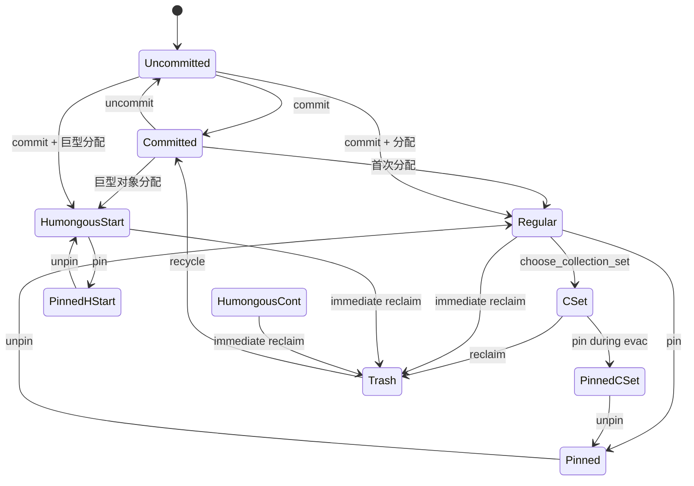
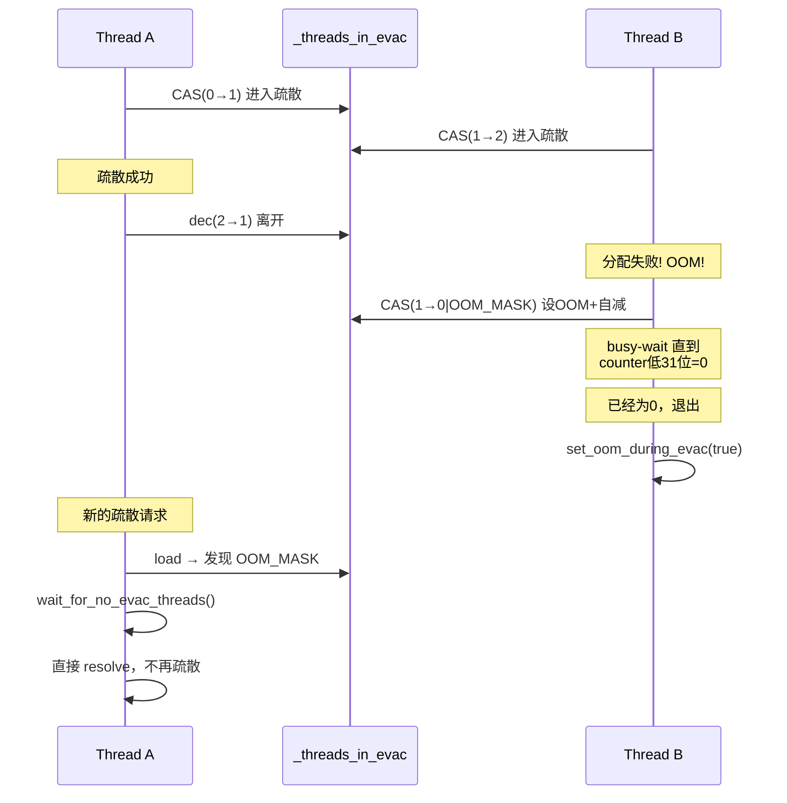
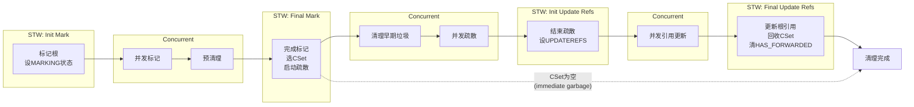
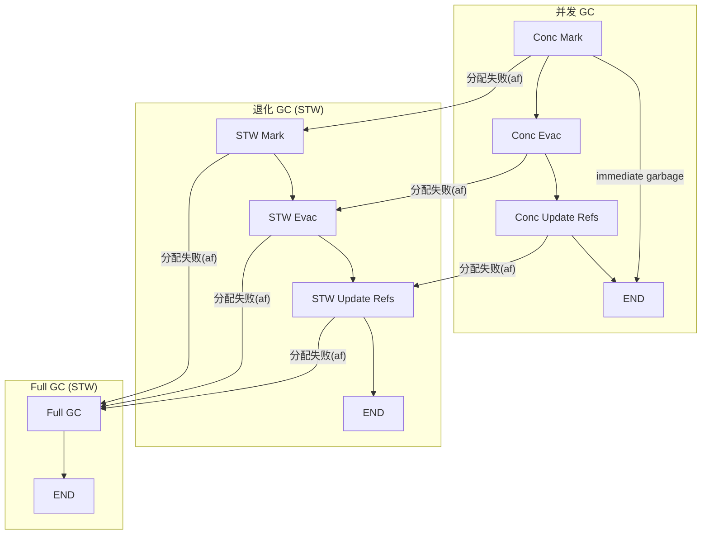

# Shenandoah GC 深度解析：Mark Word 转发与并发疏散的设计艺术

> 基于 OpenJDK 11 源码分析（Shenandoah 为 **Experimental** 特性，需 `-XX:+UnlockExperimentalVMOptions -XX:+UseShenandoahGC`）
> 标准环境：-Xms8g -Xmx8g -XX:+UseShenandoahGC
> 源码路径：src/hotspot/share/gc/shenandoah/
> 分析方法：Read-TopDown + JVM-Problem-Driven + Read-DataFlow + JVM-Object-Layout + JVM-Doc-Tutorial

---

## 第 0 部分：核心原理 ⭐

### 0.1 本质是什么？

本文深入分析 **Shenandoah GC 深度解析：Mark Word 转发与并发疏散的设计艺术**：从源码角度理解其设计原理、实现机制和关键细节。

### 0.2 为什么需要？

理解 JVM 内部实现是排查复杂问题、进行性能优化的基础。表面的 API 文档无法解释 JVM 的实际行为，只有深入源码才能建立精确的心智模型。

### 0.3 怎么解决？

结合源码阅读、数据结构分析和 GDB 运行时验证，从多个角度建立对该机制的完整理解。

### 0.4 为什么这样设计？

每个设计决策都有其权衡：性能 vs 正确性、简单性 vs 灵活性、内存占用 vs 查找速度。理解这些权衡是理解 JVM 设计的关键。

---


## 0. 问题引入

### 0.1 本质是什么？

Shenandoah 是一个以**低延迟**为目标的并发垃圾收集器——它的核心突破是**并发疏散（Concurrent Evacuation）**：在应用线程运行的同时拷贝存活对象。与 ZGC 不同，Shenandoah 不需要 64 位染色指针，**兼容 CompressedOops**，可运行在 32 位指针环境下，对小堆同样友好。

### 0.2 为什么需要 Shenandoah？

G1 GC 的疏散（Evacuation）阶段是完全 STW 的：活对象越多，拷贝时间越长，停顿与 CSet 中的存活数据量成正比。对于实时性要求高的业务（如交易系统、在线游戏），这种不可预测的停顿是不可接受的。

CMS 有并发标记但没有并发压缩，碎片化是其致命伤；ZGC 通过染色指针解决了并发疏散，但要求 64 位无压缩指针（`-XX:-UseCompressedOops`），内存开销大且不支持 32 位 JVM。

**核心矛盾**：传统 GC 在移动对象时必须 STW，因为应用线程如果读到被移走的对象的旧地址，就会得到垃圾数据。要实现并发移动，必须有机制让应用线程在读到旧地址时能**自动找到新地址**。

### 0.3 朴素方案与问题

最初的 Shenandoah（2014 年论文）使用 **Brooks Forwarding Pointer**：在每个对象头部额外加一个指针字（indirection pointer），平时指向自身，转发后指向新副本。这解决了并发疏散问题，但代价很大：

- **每个对象额外占用 8 字节**（64 位系统），内存开销约 5-10%
- **分配路径变慢**：每次分配都要初始化额外的指针字
- **所有内存访问多一次间接寻址**

### 0.4 Shenandoah 的核心思路

在 OpenJDK 11 的实现中，Shenandoah **抛弃了 Brooks Pointer**，改为**在对象的 Mark Word 中编码转发指针**。当对象被疏散后，原对象的 Mark Word 被 CAS 替换为带标记位的新地址。通过 **Load Reference Barrier（LRB）** 在加载引用时检查并修正指向，配合 **SATB 标记屏障** 维护并发标记的正确性。

> **重要发现**：尽管 `shenandoahHeap.hpp:109` 的注释仍提到 "Brooks forwarding pointers"，但实际实现（`shenandoahForwarding.inline.hpp`）已经演进为 **Mark Word 编码方案**，消除了 per-object 额外字的开销。这是代码与注释不一致的真实案例。

---

## 1. 核心机制：转发指针与屏障

本节先分析 Shenandoah 的两个核心机制——转发指针编码和读写屏障，它们是理解整个 GC 流程的基础。

### 1.1 转发指针：Mark Word 编码方案

**解决什么问题**：并发疏散时，对象被拷贝到新位置后，需要一种方式标记"此对象已转发"并记录新地址，让所有线程都能找到新副本。

**源码**：`shenandoahForwarding.inline.hpp:37-49`

```cpp
inline HeapWord* ShenandoahForwarding::get_forwardee_raw_unchecked(oop obj) {
  // JVMTI and JFR code use mark words for marking objects for their needs.
  // On this path, we can encounter the "marked" object, but with NULL
  // fwdptr. That object is still not forwarded, and we need to return
  // the object itself.
  markOop mark = obj->mark_raw();           // 读取对象的 Mark Word
  if (mark->is_marked()) {                  // 检查 Mark Word 的标记位（最低 2 位 = 11）
    HeapWord* fwdptr = (HeapWord*) mark->clear_lock_bits();  // 清除低 2 位，得到转发地址
    if (fwdptr != NULL) {                   // JVMTI/JFR 可能设 marked 但地址为 NULL
      return fwdptr;
    }
  }
  return (HeapWord*)obj;                    // 未转发，返回对象本身
}
```

**设计解释**：

- **复用 Mark Word**：不新增字段，零额外内存开销。`markOopDesc::is_marked()` 检查最低两个 lock bits 是否为 `11`（marked 状态），这与 Java 对象的正常锁状态（unlocked `01`、lightweight locked `00`、heavyweight `10`）完全区分
- **`clear_lock_bits()`**：将低 2 位清零，剩余位就是转发目标地址。因为 Java 对象按 8 字节对齐，地址的低 3 位本来就是 0，所以 2 位标记不会导致信息丢失
- **JVMTI/JFR 兼容**：这两个工具也会在 Mark Word 上设置标记位（但 fwdptr 为 NULL），代码通过 NULL 检查避免误判

**CAS 安装转发指针**：`shenandoahForwarding.inline.hpp:76-89`

```cpp
inline oop ShenandoahForwarding::try_update_forwardee(oop obj, oop update) {
  markOop old_mark = obj->mark_raw();
  if (old_mark->is_marked()) {
    return (oop) old_mark->clear_lock_bits();  // 已有转发，返回赢家的目标地址
  }

  markOop new_mark = markOopDesc::encode_pointer_as_mark(update);  // 新地址 | 0b11
  markOop prev_mark = obj->cas_set_mark_raw(new_mark, old_mark);   // CAS 替换 Mark Word
  if (prev_mark == old_mark) {
    return update;                              // CAS 成功，本线程是赢家
  } else {
    return (oop) prev_mark->clear_lock_bits();  // CAS 失败，返回赢家的目标地址
  }
}
```

**设计解释**：

- **原子性**：多个线程可能同时拷贝同一个对象，CAS 保证只有一个赢家。输家可以直接丢弃自己的副本（浪费的空间会在下次 GC 回收），然后使用赢家的地址
- **幂等性**：`is_marked()` 快速检查避免重复 CAS。如果已经有转发指针，直接返回目标地址
- **`encode_pointer_as_mark(update)`**：将目标地址的低 2 位设为 `11`，编码为 marked 状态的 Mark Word

**转发状态判断**：`shenandoahForwarding.inline.hpp:72-74`

```cpp
inline bool ShenandoahForwarding::is_forwarded(oop obj) {
  return obj->mark_raw()->is_marked();  // Mark Word 低 2 位 == 11？
}
```

### 1.2 Load Reference Barrier（LRB）

**解决什么问题**：并发疏散期间，应用线程加载引用时可能拿到 from-space 的旧地址。LRB 拦截这种加载，如果对象在 CSet 中且未转发，就地疏散它并返回 to-space 的新地址。

**源码**：`shenandoahBarrierSet.inline.hpp:55-73`

```cpp
template <class T>
inline oop ShenandoahBarrierSet::load_reference_barrier_mutator(oop obj, T* load_addr) {
  assert(ShenandoahLoadRefBarrier, "should be enabled");
  shenandoah_assert_in_cset(load_addr, obj);

  oop fwd = resolve_forwarded_not_null_mutator(obj);  // 步骤1: 检查是否已转发
  if (obj == fwd) {
    // 未转发 = 还没人疏散这个对象
    assert(_heap->is_evacuation_in_progress(), "evac should be in progress");
    ShenandoahEvacOOMScope scope;                       // 步骤2: 进入疏散OOM保护域
    fwd = _heap->evacuate_object(obj, Thread::current()); // 步骤3: 拷贝对象到 to-space
  }

  if (load_addr != NULL && fwd != obj) {
    // Since we are here and we know the load address, update the reference.
    ShenandoahHeap::cas_oop(fwd, load_addr, obj);       // 步骤4: 自修复——CAS更新引用
  }

  return fwd;  // 返回 to-space 副本
}
```

**设计解释**：

- **自修复（Self-Fixing）**：步骤 4 的 `cas_oop` 将引用从旧地址 CAS 更新为新地址。下次加载同一引用时，LRB 发现对象不在 CSet 中，直接跳过，避免了重复疏散。这是一个渐进式的引用更新机制——每个引用在第一次被加载时就被修正。由参数 `ShenandoahSelfFixing`（默认 `true`）控制
- **ShenandoahEvacOOMScope**：RAII 守卫，构造时调用 `enter_evacuation()`，析构时调用 `leave_evacuation()`，确保即使发生 OOM 也能正确退出疏散路径
- **只拦截 CSet 中的对象**：不在 CSet 中的对象（包括已经在 to-space 的）直接放行，LRB 的开销是 O(1) 的

### 1.3 SATB 写屏障

**解决什么问题**：并发标记期间，应用线程可能覆写引用，导致标记线程漏标。SATB（Snapshot-At-The-Beginning）策略要求：覆写前把旧引用记录到 SATB 队列，保证标记开始时刻的所有可达对象都会被标记。

**源码**：`shenandoahBarrierSet.inline.hpp:93-105`

```cpp
template <DecoratorSet decorators, typename T>
inline void ShenandoahBarrierSet::satb_barrier(T *field) {
  if (HasDecorator<decorators, IS_DEST_UNINITIALIZED>::value ||
      HasDecorator<decorators, AS_NO_KEEPALIVE>::value) {
    return;   // 新对象初始化写入 / WeakReference 不需要 SATB
  }
  if (ShenandoahSATBBarrier && _heap->is_concurrent_mark_in_progress()) {
    T heap_oop = RawAccess<>::oop_load(field);   // 加载被覆写的旧值
    if (!CompressedOops::is_null(heap_oop)) {
      enqueue(CompressedOops::decode(heap_oop)); // 将旧值入队 SATB 队列
    }
  }
}
```

**SATB 入队过滤**：`shenandoahBarrierSet.inline.hpp:75-91`

```cpp
inline void ShenandoahBarrierSet::enqueue(oop obj) {
  assert(obj != NULL, "checked by caller");
  assert(_satb_mark_queue_set.is_active(), "only get here when SATB active");

  // Filter marked objects before hitting the SATB queues. The same predicate would
  // be used by SATBMQ::filter to eliminate already marked objects downstream, but
  // filtering here helps to avoid wasteful SATB queueing work to begin with.
  if (!_heap->requires_marking(obj)) return;  // 已标记的对象不入队

  Thread* thr = Thread::current();
  if (thr->is_Java_thread()) {
    ShenandoahThreadLocalData::satb_mark_queue(thr).enqueue_known_active(obj);  // 线程本地队列
  } else {
    MutexLockerEx x(Shared_SATB_Q_lock, Mutex::_no_safepoint_check_flag);
    _satb_mark_queue_set.shared_satb_queue()->enqueue_known_active(obj);        // 共享队列（加锁）
  }
}
```

**设计解释**：

- **前置过滤**：`requires_marking()` 判断对象是否已在标记位图中标记。已标记对象不入队，减少 SATB 队列的压力
- **双路径队列**：Java 线程使用线程本地 SATB 队列（无锁、高性能）；GC 工作线程/VM 线程使用共享 SATB 队列（需加锁 `Shared_SATB_Q_lock`）
- **`IS_DEST_UNINITIALIZED`**：新对象字段的首次写入不需要 SATB（因为旧值是 NULL 或未定义值）
- **`AS_NO_KEEPALIVE`**：用于 `WeakReference.get()` 等操作，语义上不应阻止 GC 回收弱引用对象

### 1.4 IU 屏障（可选）

**源码**：`shenandoahBarrierSet.inline.hpp:114-118`

```cpp
inline void ShenandoahBarrierSet::iu_barrier(oop obj) {
  if (ShenandoahIUBarrier && obj != NULL && _heap->is_concurrent_mark_in_progress()) {
    enqueue(obj);  // 将新值入队
  }
}
```

**设计解释**：

IU（Incremental Update）屏障记录的是**新值**（而非旧值），与 SATB 互补。`ShenandoahIUBarrier` 默认 `false`，需通过 `-XX:ShenandoahGCMode=iu` 启用。SATB 模式（默认）在标记开始时拍摄快照，可能保留一些已死对象（浮动垃圾），但实现更简单；IU 模式更精确但屏障开销更大。

---

## 2. GC 状态机：屏障的控制中枢

### 2.1 为什么需要状态机？

Shenandoah 有多种屏障（LRB、SATB、IU），不同阶段需要激活不同屏障组合。状态机用一个字节的位图统一管理，JIT 编译的屏障代码通过读取这个字节来决定是否执行。

### 2.2 GCState 位域定义

**源码**：`shenandoahHeap.hpp:240-260`

```cpp
enum GCStateBitPos {
  // Heap has forwarded objects: needs LRB barriers.
  HAS_FORWARDED_BITPOS   = 0,

  // Heap is under marking: needs SATB barriers.
  MARKING_BITPOS    = 1,

  // Heap is under evacuation: needs LRB barriers. (Set together with HAS_FORWARDED)
  EVACUATION_BITPOS = 2,

  // Heap is under updating: needs no additional barriers.
  UPDATEREFS_BITPOS = 3,
};

enum GCState {
  STABLE        = 0,       // 0b0000 — 无GC活动，所有屏障关闭
  HAS_FORWARDED = 1 << 0,  // 0b0001 — 堆中有转发对象，LRB 激活
  MARKING       = 1 << 1,  // 0b0010 — 并发标记中，SATB 激活
  EVACUATION    = 1 << 2,  // 0b0100 — 并发疏散中，LRB 激活
  UPDATEREFS    = 1 << 3,  // 0b1000 — 并发引用更新中
};
```

**状态字段**：`shenandoahHeap.hpp:263`

```cpp
ShenandoahSharedBitmap _gc_state;  // 单字节位图，所有线程可见
```

### 2.3 各阶段的状态组合

| 阶段 | _gc_state | 激活的屏障 |
|------|-----------|-----------|
| 空闲（Idle） | `STABLE = 0` | 无 |
| 并发标记 | `MARKING = 0b0010` | SATB |
| 并发疏散 | `HAS_FORWARDED | EVACUATION = 0b0101` | LRB（含疏散逻辑） |
| 并发引用更新 | `HAS_FORWARDED | UPDATEREFS = 0b1001` | LRB（仅转发解析） |
| 完成 | `STABLE = 0` | 无 |

**关键不变式**（`shenandoahHeap.hpp:236-237`）：**当 `_gc_state == 0` 时，堆是稳定的，不需要任何屏障**。这使得 JIT 编译的屏障代码可以用一条 `test` 指令快速短路。

### 2.4 退化点定义

**源码**：`shenandoahHeap.hpp:300-307`

```cpp
enum ShenandoahDegenPoint {
  _degenerated_unset,            // 未设置
  _degenerated_outside_cycle,    // 周期外退化
  _degenerated_mark,             // 并发标记阶段退化
  _degenerated_evac,             // 并发疏散阶段退化
  _degenerated_updaterefs,       // 并发引用更新阶段退化
  _DEGENERATED_LIMIT
};
```

每个退化点对应并发阶段中可能发生分配失败的位置。退化后，该阶段及后续阶段在 STW 下完成。

---

## 3. 核心数据结构

### 3.1 ShenandoahHeapRegion：10 状态状态机

**解决什么问题**：Shenandoah 将堆划分为等大的 Region。每个 Region 需要跟踪其状态（空闲/活跃/回收中/垃圾），且状态转换必须严格受控，防止逻辑 bug（如未回收的 Region 被当作空闲分配）。

**源码**：`shenandoahHeapRegion.hpp:111-122`

```cpp
enum RegionState {
  _empty_uncommitted,       // Region 为空，物理内存未提交
  _empty_committed,         // Region 为空，物理内存已提交
  _regular,                 // 用于常规分配
  _humongous_start,         // 巨型对象的起始 Region
  _humongous_cont,          // 巨型对象的后续 Region
  _pinned_humongous_start,  // 巨型起始 + 被钉住
  _cset,                    // 在回收集合中（即将被疏散）
  _pinned,                  // 被钉住（JNI 临界区等）
  _pinned_cset,             // 在回收集合中 + 被钉住（疏散失败路径）
  _trash,                   // 仅包含垃圾
};
```

**状态转换规则**（源码注释 `shenandoahHeapRegion.hpp:43-109`）：



**关键转换约束**：

| 规则 | 说明 |
|------|------|
| a) 只有经过回收/回收再利用才能变 Empty | 防止内存泄漏 |
| c) 只有 Regular 可以进 CSet | Humongous 和 Pinned 不可移动 |
| d) Pinned 不能进 Trash | 被 JNI 引用的 Region 不可回收 |
| e) Pinned 不能进 CSet | 被钉住的 Region 不可疏散 |
| g) Humongous 不能进 CSet | 巨型对象不通过 CSet 回收，走即时回收路径 |

**Region 大小计算**：由 `ShenandoahHeapRegion::setup_sizes()` 根据堆大小计算，目标为 `ShenandoahTargetNumRegions`（默认 2048）个 Region，大小范围 `[256K, 32M]`。8GB 堆 → 2048 个 Region → 每个 4MB。

### 3.2 ShenandoahCollectionSet：有偏字节映射

**解决什么问题**：疏散和引用更新期间，需要高频判断"某个对象是否在 CSet 中"。传统的集合查找太慢，需要 O(1) 查找。

**源码**：`shenandoahCollectionSet.cpp:35-79`

```cpp
ShenandoahCollectionSet::ShenandoahCollectionSet(ShenandoahHeap* heap, ReservedSpace space, char* heap_base) :
  _map_size(heap->num_regions()),
  _region_size_bytes_shift(ShenandoahHeapRegion::region_size_bytes_shift()),
  _map_space(space),
  _cset_map(_map_space.base() + ((uintx)heap_base >> _region_size_bytes_shift)),  // 有偏指针：heap_base 对齐
  _biased_cset_map(_map_space.base()),                                             // 无偏指针：覆盖 NULL
  _heap(heap),
  _garbage(0), _used(0), _region_count(0), _current_index(0) {

  // The collection set map is reserved to cover the entire heap *and* zero addresses.
  // This is needed to accept in-cset checks for both heap oops and NULLs, freeing
  // high-performance code from checking for NULL first.
  // ...
  // 只提交两段内存：堆映射区 + 零页
}
```

**设计解释**：

- **有偏字节映射**：`_cset_map` 指针被偏移，使得 `_cset_map[oop >> region_size_shift]` 直接返回该对象所在 Region 是否在 CSet 中，O(1) 查找
- **零页技巧**：为 NULL 地址也保留了映射（`_biased_cset_map`），使得 `is_in(NULL)` 返回 false 而不会 SIGSEGV。这让 LRB 的快速路径可以跳过 NULL 检查
- **只提交必要页面**：映射覆盖整个地址空间，但只 commit 堆对应的页面和零页，避免浪费物理内存

**无锁并发 Region 认领**：`shenandoahCollectionSet.cpp:111-136`

```cpp
ShenandoahHeapRegion* ShenandoahCollectionSet::claim_next() {
  size_t num_regions = _heap->num_regions();
  if (_current_index >= (jint)num_regions) {
    return NULL;
  }

  jint saved_current = _current_index;
  size_t index = (size_t)saved_current;

  while(index < num_regions) {
    if (is_in(index)) {
      jint cur = Atomic::cmpxchg((jint)(index + 1), &_current_index, saved_current);
      assert(cur >= (jint)saved_current, "Must move forward");
      if (cur == saved_current) {
        return _heap->get_region(index);  // CAS 成功，认领此 Region
      } else {
        index = (size_t)cur;              // CAS 失败，从赢家的位置继续
        saved_current = cur;
      }
    } else {
      index ++;
    }
  }
  return NULL;
}
```

**设计解释**：多个 GC 工作线程并发疏散时，通过 CAS 推进 `_current_index` 来无锁认领 CSet 中的下一个 Region。`_current_index` 只增不减（`Must move forward`），保证每个 Region 只被一个线程处理。

### 3.3 ShenandoahFreeSet：双视图位图

**解决什么问题**：应用线程和 GC 线程都需要分配内存，但如果共用同一个空闲区间，GC 疏散的目标空间可能被应用抢占，导致疏散 OOM。

**源码**：`shenandoahFreeSet.cpp:61-137`

```cpp
HeapWord* ShenandoahFreeSet::allocate_single(ShenandoahAllocRequest& req, bool& in_new_region) {
  // Allocations are biased: new application allocs go to beginning of the heap,
  // and GC allocs go to the end.

  switch (req.type()) {
    case ShenandoahAllocRequest::_alloc_tlab:
    case ShenandoahAllocRequest::_alloc_shared: {
      // 应用分配：从左向右扫描 mutator 视图
      for (size_t idx = _mutator_leftmost; idx <= _mutator_rightmost; idx++) {
        if (is_mutator_free(idx)) {
          HeapWord* result = try_allocate_in(_heap->get_region(idx), req, in_new_region);
          if (result != NULL) return result;
        }
      }
      break;  // 应用线程不能偷 GC 视图
    }
    case ShenandoahAllocRequest::_alloc_gclab:
    case ShenandoahAllocRequest::_alloc_shared_gc: {
      // GC 分配：从右向左扫描 collector 视图
      for (size_t c = _collector_rightmost + 1; c > _collector_leftmost; c--) {
        size_t idx = c - 1;
        if (is_collector_free(idx)) {
          HeapWord* result = try_allocate_in(_heap->get_region(idx), req, in_new_region);
          if (result != NULL) return result;
        }
      }
      // GC 可以偷 mutator 的空 Region（如果 ShenandoahEvacReserveOverflow=true）
      if (!ShenandoahEvacReserveOverflow) return NULL;
      for (size_t c = _mutator_rightmost + 1; c > _mutator_leftmost; c--) {
        // ... flip_to_gc(r) 将 Region 从 mutator 转移到 collector 视图
      }
      break;
    }
  }
  return NULL;
}
```

**rebuild() 构建双视图**：`shenandoahFreeSet.cpp:397-436`

```cpp
void ShenandoahFreeSet::rebuild() {
  shenandoah_assert_heaplocked();
  clear();

  // 第一遍：所有可分配 Region 加入 mutator 视图
  for (size_t idx = 0; idx < _heap->num_regions(); idx++) {
    ShenandoahHeapRegion* region = _heap->get_region(idx);
    if (region->is_alloc_allowed() || region->is_trash()) {
      if (has_no_alloc_capacity(region)) continue;
      _capacity += alloc_capacity(region);
      _mutator_free_bitmap.set_bit(idx);
    }
  }

  // 第二遍：从堆尾部保留 ShenandoahEvacReserve% 给 collector 视图
  size_t to_reserve = _heap->max_capacity() / 100 * ShenandoahEvacReserve;  // 默认 5% = 409.6MB
  size_t reserved = 0;

  for (size_t idx = _heap->num_regions() - 1; idx > 0; idx--) {
    if (reserved >= to_reserve) break;
    ShenandoahHeapRegion* region = _heap->get_region(idx);
    if (_mutator_free_bitmap.at(idx) && is_empty_or_trash(region)) {
      _mutator_free_bitmap.clear_bit(idx);   // 从 mutator 移除
      _collector_free_bitmap.set_bit(idx);   // 加入 collector
      size_t ac = alloc_capacity(region);
      _capacity -= ac;
      reserved += ac;
    }
  }
  recompute_bounds();
}
```

**设计解释**：

- **空间隔离**：应用从堆头分配（左→右），GC 从堆尾分配（右→左），两者朝相反方向增长，最大化减少冲突
- **预留保证**：`ShenandoahEvacReserve`（默认 5%）从堆尾保留空 Region 给 GC。8GB 堆 = 保留约 410MB = 约 102 个 4MB Region
- **单向偷取**：GC 可以偷应用的空 Region（`flip_to_gc`），但应用**不能**偷 GC 的。这保证了疏散空间的最低保障
- **不能混用**：GC 分配不能在应用 Region 的已使用部分追加，因为 Update-Refs 阶段的水位线（URWM）会因 GC 分配而移动，导致应用分配的对象不可解析

### 3.4 ShenandoahEvacOOMHandler：疏散 OOM 协议

**解决什么问题**：并发疏散时如果内存耗尽（OOM），直接返回 from-space 副本会违反 to-space 不变式。需要一个协议：OOM 发生后，等待所有正在疏散的线程完成，然后安全地结束疏散阶段。

**源码**：`shenandoahEvacOOMHandler.hpp:80-86` + `shenandoahEvacOOMHandler.cpp:34-118`

```cpp
class ShenandoahEvacOOMHandler {
private:
  static const jint OOM_MARKER_MASK;       // = 0x80000000
  shenandoah_padding(0);
  volatile jint _threads_in_evac;          // 原子计数器 + OOM 标志位
  shenandoah_padding(1);
  // ...
};
```

**核心协议**：

```cpp
// 进入疏散路径
void ShenandoahEvacOOMHandler::enter_evacuation() {
  jint threads_in_evac = OrderAccess::load_acquire(&_threads_in_evac);
  if ((threads_in_evac & OOM_MARKER_MASK) != 0) {
    wait_for_no_evac_threads();  // OOM 已发生，等待其他线程退出
    return;
  }
  while (true) {
    jint other = Atomic::cmpxchg(threads_in_evac + 1, &_threads_in_evac, threads_in_evac);
    if (other == threads_in_evac) {
      return;  // CAS 成功，计数器 +1，可以疏散
    } else {
      if ((other & OOM_MARKER_MASK) != 0) {
        wait_for_no_evac_threads();  // 别人设了 OOM
        return;
      }
      threads_in_evac = other;  // CAS 失败但非 OOM，重试
    }
  }
}

// OOM 处理
void ShenandoahEvacOOMHandler::handle_out_of_memory_during_evacuation() {
  jint threads_in_evac = OrderAccess::load_acquire(&_threads_in_evac);
  while (true) {
    jint other = Atomic::cmpxchg((threads_in_evac - 1) | OOM_MARKER_MASK,
                                  &_threads_in_evac, threads_in_evac);
    if (other == threads_in_evac) {
      wait_for_no_evac_threads();  // CAS 成功：设 OOM 标志 + 自减 + 等待
      return;
    } else {
      threads_in_evac = other;     // 重试
    }
  }
}

// 离开疏散路径
void ShenandoahEvacOOMHandler::leave_evacuation() {
  if (!ShenandoahThreadLocalData::is_oom_during_evac(Thread::current())) {
    Atomic::dec(&_threads_in_evac);  // 正常路径：计数器 -1
  } else {
    // OOM 路径：不需要 dec（在 handle_oom 中已减），只需清标志
    ShenandoahThreadLocalData::set_oom_during_evac(Thread::current(), false);
  }
}
```

**设计解释**：

- **单字复合编码**：`_threads_in_evac` 的高位（bit 31）作为 OOM 标志，低 31 位作为疏散中的线程计数。一次 CAS 同时设置 OOM 标志和减少计数
- **`shenandoah_padding`**：在计数器前后各加 64 字节填充，防止伪共享（false sharing）
- **等待协议**：OOM 发生后，当前线程 busy-wait（`naked_short_sleep(1)`）直到所有疏散线程退出。退出后设置线程本地 `oom_during_evac` 标志，后续的 resolve 操作会直接返回转发后的地址而不再尝试疏散



---

## 4. GC 周期：10 阶段并发回收

### 4.1 总体流程

Shenandoah 的并发 GC 周期由 `ShenandoahControlThread::service_concurrent_normal_cycle()` 驱动（`shenandoahControlThread.cpp:346-438`），包含 **4 个 STW 停顿** + **6 个并发阶段**。



### 4.2 控制线程主循环

**源码**：`shenandoahControlThread.cpp:346-438`

```cpp
void ShenandoahControlThread::service_concurrent_normal_cycle(GCCause::Cause cause) {
  ShenandoahHeap* heap = ShenandoahHeap::heap();

  if (check_cancellation_or_degen(ShenandoahHeap::_degenerated_outside_cycle)) return;

  GCIdMark gc_id_mark;
  ShenandoahGCSession session(cause);
  TraceCollectorStats tcs(heap->monitoring_support()->concurrent_collection_counters());

  // ① Reset: 为即将到来的标记做准备
  heap->entry_reset();

  // ② STW Init Mark: 标记根
  heap->vmop_entry_init_mark();

  // ③ Concurrent Mark: 并发追踪
  heap->entry_mark();
  if (check_cancellation_or_degen(ShenandoahHeap::_degenerated_mark)) return;

  // ④ Preclean: 并发预清理（减少 Final Mark 的工作量）
  heap->entry_preclean();

  // ⑤ STW Final Mark: 完成标记 + 选CSet + 启动疏散
  heap->vmop_entry_final_mark();

  // ⑥ Cleanup Early: 回收纯垃圾 Region
  heap->entry_cleanup_early();

  // ⑦-⑩: 疏散 + 引用更新（可能被跳过）
  if (heap->is_evacuation_in_progress()) {
    // ⑦ Concurrent Evac: 并发疏散
    heap->entry_evac();
    if (check_cancellation_or_degen(ShenandoahHeap::_degenerated_evac)) return;

    // ⑧ STW Init Update Refs
    heap->vmop_entry_init_updaterefs();

    // ⑨ Concurrent Update Refs: 并发引用更新
    heap->entry_updaterefs();
    if (check_cancellation_or_degen(ShenandoahHeap::_degenerated_updaterefs)) return;

    // ⑩ STW Final Update Refs
    heap->vmop_entry_final_updaterefs();

    // Cleanup Complete: 回收CSet Region
    heap->entry_cleanup_complete();
  }

  heap->heuristics()->record_success_concurrent();
  heap->shenandoah_policy()->record_success_concurrent();
}
```

**设计解释**：

- **即时垃圾捷径**（`is_evacuation_in_progress()` 检查）：如果 `op_final_mark()` 发现所有垃圾 Region 都是纯垃圾（无存活对象），不需要疏散，直接通过 `entry_cleanup_early()` 回收，跳过整个疏散和引用更新阶段。这显著减少了低垃圾场景下的 GC 开销
- **每个并发阶段后检查取消**：`check_cancellation_or_degen()` 检查是否因分配失败而需要退化。如果退化，当前方法返回，控制线程进入退化 GC 流程

### 4.3 各阶段详解

#### Phase ①：Init Mark（STW）

**源码**：`shenandoahHeap.cpp:1412-1459`

```cpp
void ShenandoahHeap::op_init_mark() {
  assert(ShenandoahSafepoint::is_at_shenandoah_safepoint(), "Should be at safepoint");

  assert(marking_context()->is_bitmap_clear(), "need clear marking bitmap");
  assert(!has_forwarded_objects(), "No forwarded objects on this path");

  // 设置并发标记状态 → SATB 屏障激活
  set_concurrent_mark_in_progress(true);

  // 回收所有 TLAB → 使堆可解析
  {
    ShenandoahGCSubPhase phase(ShenandoahPhaseTimings::make_parsable);
    make_parsable(true);
  }

  // 更新 Region 状态
  {
    ShenandoahGCSubPhase phase(ShenandoahPhaseTimings::init_update_region_states);
    ShenandoahInitMarkUpdateRegionStateClosure cl;
    parallel_heap_region_iterate(&cl);
  }

  // 内存屏障：确保状态变更对工作线程可见
  OrderAccess::fence();

  // 扫描根集合（GC Roots），将根引用对象标记
  concurrent_mark()->mark_roots(ShenandoahPhaseTimings::scan_roots);

  // 设置 Pacer 的标记阶段预算
  if (ShenandoahPacing) {
    pacer()->setup_for_mark();
  }
}
```

**要点**：这是一个短停顿，只做两件事——激活 SATB 屏障和扫描 GC Roots。根集合较小（线程栈、类加载器、JNI 句柄等），停顿通常在亚毫秒级。

#### Phase ②-④：Concurrent Mark + Preclean

**源码**：`shenandoahHeap.cpp:1461-1463`

```cpp
void ShenandoahHeap::op_mark() {
  concurrent_mark()->mark_from_roots();
}
```

并发标记的核心在 `ShenandoahConcurrentMark::mark_from_roots()`，使用多线程从根集合出发，沿引用链追踪所有存活对象，同时 SATB 屏障保证标记期间被覆写的引用不会丢失。

#### Phase ⑤：Final Mark（STW）—— 最关键的停顿

**源码**：`shenandoahHeap.cpp:1512-1613`

```cpp
void ShenandoahHeap::op_final_mark() {
  assert(ShenandoahSafepoint::is_at_shenandoah_safepoint(), "Should be at safepoint");

  if (!cancelled_gc()) {
    // 1. 完成标记（处理 SATB 队列中的残留项）
    concurrent_mark()->finish_mark_from_roots(/* full_gc = */ false);

    // 2. 关闭 SATB 屏障
    set_concurrent_mark_in_progress(false);
    mark_complete_marking_context();

    // 3. 清理弱引用、卸载类等
    parallel_cleaning(false);

    // 4. 更新 Region 活跃数据统计 + 处理 pin 状态
    {
      ShenandoahFinalMarkUpdateRegionStateClosure cl;
      parallel_heap_region_iterate(&cl);
    }

    // 5. 回收 TLAB（新分配走新 freeset）
    make_parsable(true);

    // 6. 选择回收集合（CSet）
    {
      ShenandoahHeapLocker locker(lock());
      _collection_set->clear();
      heuristics()->choose_collection_set(_collection_set);
    }

    // 7. 重建 FreeSet
    {
      ShenandoahHeapLocker locker(lock());
      _free_set->rebuild();
    }

    // 8. 如果 CSet 非空，启动疏散
    if (!collection_set()->is_empty()) {
      set_evacuation_in_progress(true);      // _gc_state |= EVACUATION
      set_has_forwarded_objects(true);        // _gc_state |= HAS_FORWARDED

      if (!is_degenerated_gc_in_progress()) {
        evacuate_and_update_roots();          // 疏散根集合引用的对象
      }

      if (ShenandoahPacing) {
        pacer()->setup_for_evac();
      }
    }
    // 如果 CSet 为空 → 跳过疏散和引用更新
  } else {
    // GC 被取消 → 清理标记状态
    concurrent_mark()->cancel();
    set_concurrent_mark_in_progress(false);
  }
}
```

**设计解释**：

- **步骤 6 选择 CSet**：委托给 `heuristics()->choose_collection_set()`，默认的 Adaptive 策略按垃圾比例降序选择 Region（见 §5）
- **步骤 7 重建 FreeSet**：`_free_set->rebuild()` 将非 CSet 的空闲 Region 重新分为 mutator 和 collector 两个视图
- **步骤 8 疏散根引用对象**：这是 STW 下做的唯一疏散操作。只疏散从 GC Roots 直接引用的 CSet 中的对象，确保后续并发疏散时根引用已经指向 to-space
- **`set_has_forwarded_objects(true)`**：激活 LRB 的转发解析逻辑。从这一刻起，应用线程加载任何引用都会经过 LRB 检查

#### Phase ⑦：Concurrent Evacuation

**源码**：`shenandoahHeap.cpp:954-999` + `shenandoahHeap.cpp:1615-1618`

```cpp
void ShenandoahHeap::op_conc_evac() {
  ShenandoahEvacuationTask task(this, _collection_set, true);
  workers()->run_task(&task);
}

// 疏散任务的核心
void ShenandoahEvacuationTask::do_work() {
  ShenandoahConcurrentEvacuateRegionObjectClosure cl(_sh);
  ShenandoahHeapRegion* r;
  while ((r = _cs->claim_next()) != NULL) {       // 无锁认领 CSet 中的下一个 Region
    assert(r->has_live(), "should have been reclaimed early");
    _sh->marked_object_iterate(r, &cl);            // 遍历 Region 中所有标记存活的对象

    if (ShenandoahPacing) {
      _sh->pacer()->report_evac(r->used() >> LogHeapWordSize);  // 报告疏散进度
    }

    if (_sh->check_cancelled_gc_and_yield(_concurrent)) {
      break;  // 检查取消 + 让出 CPU（如果是并发模式）
    }
  }
}
```

**设计解释**：

- **并发执行**：多个 GC 工作线程并行疏散，通过 `claim_next()` 的 CAS 机制无锁分配任务
- **与应用并行**：`ShenandoahConcurrentWorkerSession` + `ShenandoahSuspendibleThreadSetJoiner` 使工作线程可以在 safepoint 时让出
- **ShenandoahEvacOOMScope**：每个工作线程在疏散前进入 OOM 保护域。如果分配失败，触发 OOM 协议（见 §3.4）
- **逐 Region 疏散**：对每个 Region 中的存活对象调用 `evacuate_object()`，内部会拷贝对象到 to-space 并通过 CAS 安装转发指针

**同时**，应用线程通过 LRB 也在"协助疏散"——当应用线程加载一个 CSet 中的引用时，LRB 会原地疏散该对象。这使得疏散工作在 GC 线程和应用线程之间自然分摊。

#### Phase ⑧-⑨：Init/Concurrent Update Refs

**源码**：`shenandoahHeap.cpp:2208-2232`

```cpp
void ShenandoahHeap::op_init_updaterefs() {
  assert(ShenandoahSafepoint::is_at_shenandoah_safepoint(), "must be at safepoint");

  set_evacuation_in_progress(false);       // 关闭疏散状态

  // 回收 GC LAB
  retire_and_reset_gclabs();

  set_update_refs_in_progress(true);       // 设置引用更新状态

  _update_refs_iterator.reset();

  if (ShenandoahPacing) {
    pacer()->setup_for_updaterefs();
  }
}
```

```cpp
void ShenandoahHeap::op_updaterefs() {
  update_heap_references(true);  // 线性扫描堆，将所有旧引用更新为新地址
}
```

**设计解释**：

- **为什么需要引用更新？** LRB 的自修复只在引用被加载时触发。未被加载的引用（冷数据）仍指向 from-space。如果不更新，下次 GC 时 CSet Region 无法回收
- **线性扫描**：`update_heap_references()` 按 Region 顺序扫描堆中的每个引用字段，如果指向已转发对象，更新为新地址

#### Phase ⑩：Final Update Refs（STW）

**源码**：`shenandoahHeap.cpp:2263-2326`

```cpp
void ShenandoahHeap::op_final_updaterefs() {
  // 1. 如果并发引用更新未完成，在 STW 下完成剩余部分
  if (_update_refs_iterator.has_next()) {
    clear_cancelled_gc();
    update_heap_references(false);
  }

  // 2. 更新根引用（线程栈中的引用）
  if (is_degenerated_gc_in_progress()) {
    concurrent_mark()->update_roots(ShenandoahPhaseTimings::degen_gc_update_roots);
  } else {
    concurrent_mark()->update_thread_roots(ShenandoahPhaseTimings::final_update_refs_roots);
  }

  // 3. 更新 Region pin 状态
  {
    ShenandoahFinalUpdateRefsUpdateRegionStateClosure cl;
    parallel_heap_region_iterate(&cl);
  }

  // 4. 将 CSet Region 转为 Trash 状态
  trash_cset_regions();

  // 5. 清除状态标志
  set_has_forwarded_objects(false);     // 所有引用已更新，无转发对象
  set_update_refs_in_progress(false);   // _gc_state → STABLE = 0

  // 6. 重建 FreeSet（回收的 Region 可供分配）
  {
    ShenandoahHeapLocker locker(lock());
    _free_set->rebuild();
  }
}
```

**设计解释**：

- **步骤 4 trash CSet**：CSet 中的 Region 所有存活对象都已疏散走，旧副本不再需要。将状态设为 `_trash`，后续异步回收
- **步骤 5 清除 HAS_FORWARDED**：标志着所有引用都已指向 to-space，屏障可以完全关闭
- **步骤 6 重建 FreeSet**：Trash Region 经过回收后成为空闲 Region，加入 mutator 视图供应用分配

---

## 5. 自适应启发式与 Pacer

### 5.1 CSet 选择策略

**解决什么问题**：选太多 Region 进 CSet → 疏散时间长、可能 OOM；选太少 → 回收不够、碎片化。

**源码**：`shenandoahAdaptiveHeuristics.cpp:40-96`

```cpp
void ShenandoahAdaptiveHeuristics::choose_collection_set_from_regiondata(
    ShenandoahCollectionSet* cset, RegionData* data, size_t size, size_t actual_free) {

  size_t garbage_threshold = ShenandoahHeapRegion::region_size_bytes() * ShenandoahGarbageThreshold / 100;
  // 4MB * 25% = 1MB → 垃圾低于 1MB 的 Region 不值得疏散

  size_t capacity    = ShenandoahHeap::heap()->soft_max_capacity();
  size_t max_cset    = (size_t)((1.0 * capacity / 100 * ShenandoahEvacReserve) / ShenandoahEvacWaste);
  // max_cset = 8GB * 5% / 1.X ≈ 340MB → CSet 存活数据上限（疏散需要拷贝空间）

  size_t free_target = (capacity / 100 * ShenandoahMinFreeThreshold) + max_cset;
  // free_target = 8GB * 10% + 340MB ≈ 1.14GB → 期望回收后的空闲空间

  size_t min_garbage = (free_target > actual_free ? (free_target - actual_free) : 0);
  // 如果当前空闲已经超过目标，min_garbage = 0，只选高垃圾 Region

  // 按垃圾量降序排序
  QuickSort::sort<RegionData>(data, (int)size, compare_by_garbage, false);

  size_t cur_cset = 0;
  size_t cur_garbage = 0;

  for (size_t idx = 0; idx < size; idx++) {
    ShenandoahHeapRegion* r = data[idx]._region;
    size_t new_cset    = cur_cset + r->get_live_data_bytes();
    size_t new_garbage = cur_garbage + r->garbage();

    if (new_cset > max_cset) break;  // CSet 已满，停止选择

    // 两个条件满足其一即入选：
    // (1) 累计垃圾未达 min_garbage → 必须选（不论垃圾比例）
    // (2) Region 垃圾超过阈值（默认 25%）→ 值得选
    if ((new_garbage < min_garbage) || (r->garbage() > garbage_threshold)) {
      cset->add_region(r);
      cur_cset = new_cset;
      cur_garbage = new_garbage;
    }
  }
}
```

**设计解释**：

- **Garbage-First 排序**：与 G1 GC 类似，优先选择垃圾最多的 Region，最大化回收效率
- **双约束**：`max_cset` 限制上限（避免 OOM），`min_garbage` 保证下限（避免碎片化）
- **动态适应**：当堆空闲充足时，`min_garbage = 0`，只选高垃圾 Region；当堆紧张时，即使低垃圾 Region 也会被选入

### 5.2 GC 触发决策

**源码**：`shenandoahAdaptiveHeuristics.cpp:102-167`

三级触发机制：

```cpp
bool ShenandoahAdaptiveHeuristics::should_start_gc() const {
  size_t available = heap->free_set()->available();

  // 第一级：紧急触发 — 空闲低于最低阈值
  size_t min_threshold = capacity / 100 * ShenandoahMinFreeThreshold;  // 默认 10% = 819MB
  if (available < min_threshold) {
    log_info(gc)("Trigger: Free (%s) is below minimum threshold (%s)", ...);
    return true;
  }

  // 第二级：学习期触发 — 前 N 次 GC 使用更保守的阈值
  if (_gc_times_learned < ShenandoahLearningSteps) {
    size_t init_threshold = capacity / 100 * ShenandoahInitFreeThreshold;  // 默认 70% = 5.7GB
    if (available < init_threshold) {
      log_info(gc)("Trigger: Learning %d of %d. Free is below initial threshold", ...);
      return true;
    }
  }

  // 第三级：自适应触发 — 预测 GC 时间 vs 分配速率
  double average_gc = _gc_time_history->avg();
  double allocation_rate = heap->bytes_allocated_since_gc_start() / time_since_last;
  if (average_gc > allocation_headroom / allocation_rate) {
    log_info(gc)("Trigger: Average GC time (%.2f ms) is above the time for "
                 "allocation rate to deplete free headroom", ...);
    return true;
  }

  return ShenandoahHeuristics::should_start_gc();  // 兜底：GuaranteedGCInterval
}
```

**设计解释**：

- **第一级（紧急）**：空闲 < 10%，立即触发，不考虑其他因素
- **第二级（学习期）**：JVM 刚启动时不了解应用行为，使用保守的 70% 阈值。经过 `ShenandoahLearningSteps`（默认 5）次 GC 后毕业
- **第三级（自适应）**：核心公式 `avg_gc_time > headroom / alloc_rate`——如果按当前分配速率，剩余空间会在一次 GC 完成之前耗尽，就提前触发。`allocation_headroom` 还会扣除尖峰预留（`ShenandoahAllocSpikeFactor`）和退化/Full GC 惩罚值
- **兜底**：`ShenandoahGuaranteedGCInterval`（默认 300 秒）保证即使应用不分配内存也会定期触发 GC

### 5.3 Pacer：分配节流器

**解决什么问题**：并发 GC 期间，如果应用分配速度远超 GC 回收速度，会导致 OOM 退化。Pacer 通过对每次分配收"税"来限制分配速率，给 GC 留出追赶的空间。

**核心思想**：每分配 N 字节，需要等待 GC 处理 N×tax_rate 字节。

**各阶段 tax 设置**：

| 阶段 | 基础 tax | 系数 | 说明 | 源码 |
|------|---------|------|------|------|
| Mark | live/taxable | ×1 | 标记可能遇到即时垃圾，不需要太保守 | `shenandoahPacer.cpp:56-77` |
| Evac | cset_used/taxable | ×2 | 疏散后还有引用更新，只用一半预算 | `shenandoahPacer.cpp:79-101` |
| Update Refs | heap_used/taxable | ×1 | 最后阶段，用完剩余预算 | `shenandoahPacer.cpp:103-125` |

**`pace_for_alloc()` 分配路径**：`shenandoahPacer.cpp:232-278`

```cpp
void ShenandoahPacer::pace_for_alloc(size_t words) {
  // 快速路径：尝试从预算中 CAS 扣除
  bool claimed = claim_for_alloc(words, false);
  if (claimed) return;  // 预算充足，直接通过

  // 慢速路径：强制扣除（预算可能变负）
  claimed = claim_for_alloc(words, true);

  double start = os::elapsedTime();
  size_t max_ms = ShenandoahPacingMaxDelay;  // 默认 10ms
  size_t total_ms = 0;

  while (true) {
    size_t cur_ms = (max_ms > total_ms) ? (max_ms - total_ms) : 1;
    wait(cur_ms);  // 等待 GC 进度补充预算

    total_ms = (size_t)((os::elapsedTime() - start) * 1000);
    if (total_ms > max_ms || Atomic::load(&_budget) >= 0) {
      break;  // 超时或预算已恢复
    }
  }
}
```

**设计解释**：

- **快速路径**：CAS 扣减预算，如果成功直接返回，无等待
- **慢速路径**：预算不足时，强制扣减使预算变负，然后 sleep 等待 GC 工作线程通过 `add_budget()` 补充。最多等待 `ShenandoahPacingMaxDelay`（默认 10ms），超时后强行分配
- **不阻塞新线程**：正在通过 JNI 附着的线程（`is_attaching_via_jni()`）跳过 pacing，因为它们还没完全初始化

---

## 6. 三级退化机制

**源码**中的 ASCII 图（`shenandoahControlThread.cpp:357-381`）完整描述了退化路径：



| 级别 | 触发条件 | 行为 |
|------|---------|------|
| Concurrent | 正常情况 | 所有阶段并发执行 |
| Degenerated | 并发阶段中分配失败 | **从失败点开始**，剩余阶段在 STW 下完成 |
| Full GC | 退化 GC 中再次分配失败 | 完整的 STW 标记-压缩 |

**`check_cancellation_or_degen()`**：`shenandoahControlThread.cpp:440-452`

```cpp
bool ShenandoahControlThread::check_cancellation_or_degen(ShenandoahHeap::ShenandoahDegenPoint point) {
  ShenandoahHeap* heap = ShenandoahHeap::heap();
  if (heap->cancelled_gc()) {
    assert(is_alloc_failure_gc() || in_graceful_shutdown(), "...");
    if (!in_graceful_shutdown()) {
      perform_gc(heap->shenandoah_policy()->degen_point()); // 进入退化 GC
    }
    return true;
  }
  return false;
}
```

**设计解释**：

退化 GC 的关键优势是**复用已完成的并发工作**。例如，如果在并发疏散期间发生分配失败：
- 并发标记的结果仍然有效（不需要重新标记）
- CSet 已选好
- 只需要在 STW 下完成疏散和引用更新

这比直接触发 Full GC 开销小得多。

---

## 7. 关键 JVM 参数

### 7.1 核心参数

| 参数 | 默认值 | 说明 | 源码位置 |
|------|--------|------|---------|
| `-XX:+UseShenandoahGC` | false | 启用 Shenandoah | `shenandoah_globals.hpp` |
| `-XX:ShenandoahGCMode` | `satb` | GC 模式：satb/iu/passive | `shenandoah_globals.hpp` |
| `-XX:ShenandoahGCHeuristics` | `adaptive` | 启发式：adaptive/static/aggressive/compact | `shenandoah_globals.hpp` |
| `-XX:ShenandoahGarbageThreshold` | `25` | Region 垃圾%阈值，低于此不入 CSet | `shenandoah_globals.hpp` |
| `-XX:ShenandoahEvacReserve` | `5` | 为 GC 疏散保留的堆空间% | `shenandoah_globals.hpp` |
| `-XX:ShenandoahMinFreeThreshold` | `10` | 空闲低于此%立即触发 GC | `shenandoah_globals.hpp` |
| `-XX:ShenandoahInitFreeThreshold` | `70` | 学习期的空闲阈值% | `shenandoah_globals.hpp` |
| `-XX:ShenandoahPacing` | `true` | 启用分配节流 | `shenandoah_globals.hpp` |
| `-XX:ShenandoahPacingMaxDelay` | `10` | Pacer 最大等待 ms | `shenandoah_globals.hpp` |
| `-XX:ShenandoahGuaranteedGCInterval` | `300000` | GC 保证间隔 ms（5 分钟） | `shenandoah_globals.hpp` |
| `-XX:ShenandoahTargetNumRegions` | `2048` | 目标 Region 数量 | `shenandoah_globals.hpp` |
| `-XX:ShenandoahMinRegionSize` | `256K` | Region 最小大小 | `shenandoah_globals.hpp` |
| `-XX:ShenandoahMaxRegionSize` | `32M` | Region 最大大小 | `shenandoah_globals.hpp` |

### 7.2 屏障开关

| 参数 | 默认值 | 说明 |
|------|--------|------|
| `-XX:+ShenandoahSATBBarrier` | `true` | 启用 SATB 写屏障 |
| `-XX:-ShenandoahIUBarrier` | `false` | 启用 IU 写屏障 |
| `-XX:+ShenandoahLoadRefBarrier` | `true` | 启用加载引用屏障 |
| `-XX:+ShenandoahSelfFixing` | `true` | LRB 自修复（CAS 更新引用） |

### 7.3 日志参数

查看 Shenandoah GC 日志：

```bash
# 基本日志
java -XX:+UnlockExperimentalVMOptions -XX:+UseShenandoahGC \
     -Xlog:gc -Xms8g -Xmx8g -cp demo com.wjcoder.Main

# 详细日志（含启发式决策）
java -XX:+UnlockExperimentalVMOptions -XX:+UseShenandoahGC \
     -Xlog:gc*=info -Xms8g -Xmx8g -cp demo com.wjcoder.Main

# GC 日志输出示例
[0.814s][info][gc] Trigger: Learning 1 of 5. Free (5734M) is below initial threshold (5734M)
[0.814s][info][gc] GC(0) Concurrent reset
[0.815s][info][gc] GC(0) Pause Init Mark 0.215ms
[0.853s][info][gc] GC(0) Concurrent marking 37.983ms
[0.854s][info][gc] GC(0) Pause Final Mark 0.674ms
[0.854s][info][gc] GC(0) Concurrent cleanup 57M->32M(8192M)
[0.870s][info][gc] GC(0) Concurrent evacuation 15.870ms
[0.870s][info][gc] GC(0) Pause Init Update Refs 0.012ms
[0.876s][info][gc] GC(0) Concurrent update references 6.178ms
[0.877s][info][gc] GC(0) Pause Final Update Refs 0.243ms
[0.877s][info][gc] GC(0) Concurrent cleanup 34M->18M(8192M)

# 启发式详细日志
[0.854s][info][gc,ergo] Adaptive CSet Selection. Target Free: 1144M, Actual Free: 7980M, Max CSet: 340M, Min Garbage: 0M
[0.815s][info][gc,ergo] Pacer for Mark. Expected Live: 50M, Free: 7980M, Non-Taxable: 798M, Alloc Tax Rate: 0.0x
```

---

## 8. 与 ZGC 的对比

| 维度 | Shenandoah | ZGC |
|------|-----------|-----|
| **转发指针** | Mark Word 编码（零额外内存） | 染色指针（64 位指针中 4 bit） |
| **屏障类型** | Load Reference Barrier + SATB | Load Barrier（含染色检查） |
| **CompressedOops** | **支持** | 不支持（需 64 位指针） |
| **堆大小要求** | 无特殊要求 | 建议 ≥4GB（小堆不划算） |
| **引用更新方式** | 显式并发引用更新阶段 | 惰性自愈（下次加载时自动修正） |
| **STW 停顿数** | 4 个（Init/Final Mark, Init/Final UpdateRefs） | 3 个（Mark Start, Mark End, Relocate Start） |
| **实现复杂度** | 相对简单（屏障在 C++/JIT 层） | 较复杂（需操作系统多映射支持） |
| **OS 要求** | 无特殊要求 | 需要 mmap 多映射 / 页表支持 |
| **退化机制** | 三级（Concurrent → Degenerated → Full） | 两级（Concurrent → Full） |
| **论文** | Red Hat, 2014（原 Brooks Pointer） | Oracle, 2017 |
| **状态（JDK 11）** | Experimental | Experimental |

**选型建议**：
- **堆 < 4GB 或需要 CompressedOops**：选 Shenandoah
- **堆 ≥ 8GB 且追求极致低延迟**：选 ZGC（无显式引用更新阶段，停顿数更少）
- **需要可预测的最大停顿**：两者都能做到亚毫秒到个位数毫秒

---

## 9. 总结

### 9.1 核心设计决策回顾

| 设计选择 | 为什么这样设计？ |
|---------|--------------|
| Mark Word 编码（非 Brooks Pointer） | 零额外内存开销，且兼容 CompressedOops |
| LRB（非传统读屏障） | 只在 CSet 对象被加载时触发，非 CSet 对象零开销 |
| 自修复 CAS | 每个引用最多被 LRB 拦截一次，渐进式更新分摊开销 |
| 双视图 FreeSet | 空间隔离保证 GC 有疏散空间，避免与应用争抢 |
| 有偏字节映射 CSet | O(1) 查找 + NULL 安全，LRB 快速路径最优 |
| EvacOOM 协议 | 原子计数器 + OOM 标志位一次 CAS 完成，保护 to-space 不变式 |
| 三级退化 | 复用已完成的并发工作，渐进式降级而非直接 Full GC |
| Pacer 节流 | 预算制限速，快路径 CAS 无等待，慢路径最多等 10ms |

### 9.2 关联文档

- [GC 概览与对比](1-GC-Overview-and-Comparison.md)：六大 GC 的设计哲学对比
- [ZGC 深度解析](2-ZGC-Overview.md)：染色指针方案的详细分析

### 9.3 源码引用索引

| 源码文件 | 关键内容 | 引用章节 |
|---------|---------|---------|
| `shenandoahForwarding.inline.hpp:37-89` | 转发指针编码/安装/检查 | §1.1 |
| `shenandoahBarrierSet.inline.hpp:55-118` | LRB/SATB/IU 屏障实现 | §1.2-1.4 |
| `shenandoahHeap.hpp:240-260` | GCState 枚举定义 | §2.2 |
| `shenandoahHeap.hpp:300-307` | 退化点枚举 | §2.4 |
| `shenandoahHeapRegion.hpp:43-122` | Region 状态机 | §3.1 |
| `shenandoahCollectionSet.cpp:35-136` | 有偏字节映射 + 无锁认领 | §3.2 |
| `shenandoahFreeSet.cpp:61-436` | 双视图位图 + rebuild | §3.3 |
| `shenandoahEvacOOMHandler.cpp:34-118` | OOM 协议 | §3.4 |
| `shenandoahControlThread.cpp:346-452` | GC 周期主循环 + 退化检查 | §4.2, §6 |
| `shenandoahHeap.cpp:1412-1618` | Init/Final Mark + Evac | §4.3 |
| `shenandoahHeap.cpp:2208-2326` | Init/Final Update Refs | §4.3 |
| `shenandoahAdaptiveHeuristics.cpp:40-167` | CSet 选择 + GC 触发 | §5.1-5.2 |
| `shenandoahPacer.cpp:56-278` | 分配节流器 | §5.3 |
| `shenandoah_globals.hpp` | 所有 GC 参数定义 | §7 |
