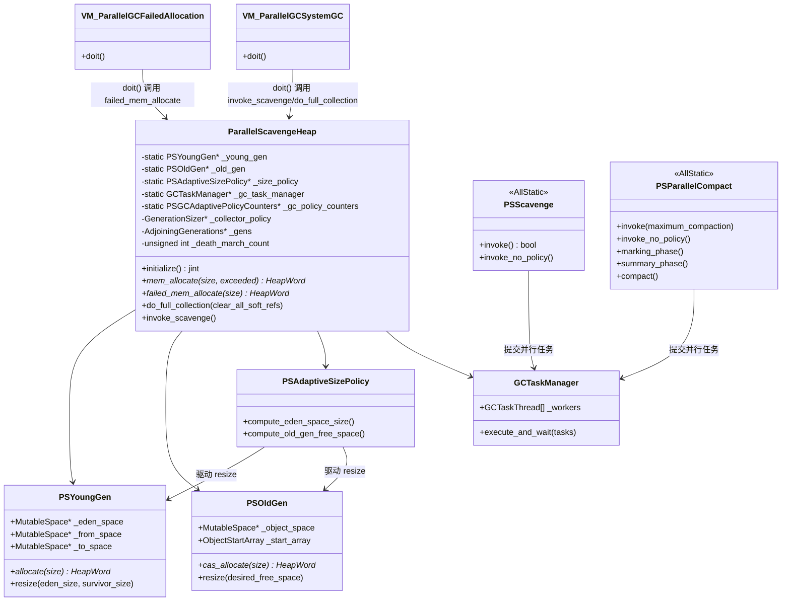
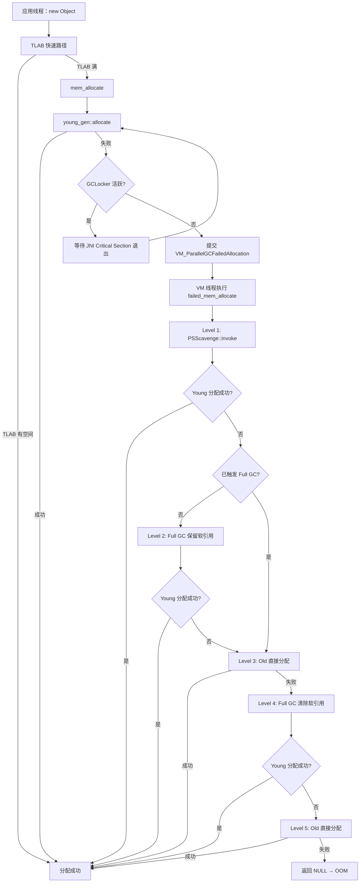

# Parallel GC 整体架构与设计哲学

> 基于 OpenJDK 11 源码分析  
> 源码路径：`src/hotspot/share/gc/parallel/`  
> 启用参数：`-XX:+UseParallelGC`（JDK 8 默认，JDK 9+ 需显式指定）

---

## 第 0 部分：核心原理 ⭐

### 0.1 本质是什么？

**Parallel GC 的本质**：用多线程并行执行 GC，最大化吞吐量（Throughput），代价是 STW 停顿时间不可预测。

一句话：**吞吐量优先的多线程分代 GC**。

### 0.2 为什么需要？

**Serial GC 的瓶颈**：Serial GC 用单线程执行所有 GC 工作。在多核 CPU 上，GC 时只有 1 个核在工作，其余核全部空闲。堆越大，GC 时间越长，CPU 利用率越低。

**具体问题**：
- 4GB 堆 + 8 核 CPU，Serial GC 做 Full GC 时：1 个核工作，7 个核空转
- GC 时间 = 单线程扫描/复制/压缩所有存活对象的时间，随堆增大线性增长
- 对于批处理任务（Hadoop、Spark），GC 时间直接影响总吞吐量

**Parallel GC 的回答**：把 GC 工作拆分成多个任务，用 N 个 GC 线程并行执行，理论上 GC 时间缩短为 1/N。

### 0.3 怎么解决？

**核心思路**：任务分解 + 并行执行 + 自适应调整

1. **任务分解**：把根扫描、对象复制、标记、压缩等工作拆成独立任务（`GCTask`）
2. **并行执行**：`GCTaskManager` 管理一个线程池（`GCTaskThread`），多线程并发执行任务
3. **自适应策略**：`PSAdaptiveSizePolicy` 根据历史 GC 数据，自动调整 Eden/Survivor/Old 大小，让 GC 时间比例保持在目标范围内（默认 `GCTimeRatio=99`，即 GC 时间 ≤ 1%）

**两种 GC**：
- **Young GC（PSScavenge）**：复制算法，Eden + From → To + Old，多线程并行复制
- **Full GC（PSParallelCompact）**：标记-压缩算法，三阶段（Marking → Summary → Compact），多线程并行压缩

### 0.4 为什么这样设计？

**为什么用复制算法做 Young GC？**  
年轻代对象存活率低（大部分对象朝生夕死），复制算法只需复制少量存活对象，效率高。复制后 Eden 和 From 直接清空，无碎片。

**为什么 Full GC 用压缩而不是复制？**  
老年代对象存活率高，复制算法需要 2 倍空间，不现实。压缩算法原地移动对象，消除碎片，但需要更新所有引用，代价更高。

**为什么 Full GC 分三个阶段（而不是像 Serial 一样两个阶段）？**  
Serial GC 的 Mark-Compact 是单线程的，可以边标记边计算目标地址。Parallel GC 要多线程并行压缩，必须先在 Summary Phase 全局计算好每个对象的目标地址，才能让多个线程独立压缩不同区域而不冲突。

**为什么要自适应策略？**  
手动调优堆大小需要专业知识，且不同负载下最优参数不同。自适应策略让 JVM 自己根据运行数据调整，降低调优门槛。

---

## 第 1 部分：整体架构

### 1.1 堆结构总览

```
ParallelScavengeHeap（顶层堆对象）
│
├── AdjoiningGenerations（年轻代/老年代共享虚拟空间管理）
│   ├── PSYoungGen（年轻代）
│   │   ├── MutableSpace* _eden_space     ← 新对象分配区
│   │   │   └── [可选] MutableNUMASpace   ← NUMA 感知分配（-XX:+UseNUMA）
│   │   ├── MutableSpace* _from_space     ← Survivor From
│   │   └── MutableSpace* _to_space       ← Survivor To（GC 时为空）
│   │
│   └── PSOldGen（老年代）
│       ├── MutableSpace* _object_space   ← 老年代对象区
│       └── ObjectStartArray _start_array ← 对象起始位置索引（Full GC 用）
│
├── PSAdaptiveSizePolicy（自适应策略）
│   ├── 记录 Young GC / Full GC 时间
│   ├── 计算 Eden/Survivor/Old 目标大小
│   └── 驱动 resize_young_gen() / resize_old_gen()
│
├── GCTaskManager（并行任务调度）
│   ├── GCTaskThread[N]               ← N = ParallelGCThreads
│   └── GCTaskQueue                   ← 任务队列
│
└── PSCardTable（卡表）
    └── 记录 Old→Young 跨代引用
```

### 1.2 两种 Full GC 实现（重要！）

Parallel GC 有**两套 Full GC 实现**，通过 `PSMarkSweepProxy` 命名空间选择：

| 实现 | 启用条件 | 算法 | 线程数 |
|------|---------|------|-------|
| **PSParallelCompact** | `-XX:+UseParallelOldGC`（JDK 7+ 默认） | 三阶段并行压缩 | 多线程 |
| **PSMarkSweep** | `-XX:-UseParallelOldGC` | 四阶段串行 Mark-Sweep-Compact | 单线程 |

⚠️ **关键发现**：`PSMarkSweepProxy` 不是一个类，而是一个 **C++ namespace**，且依赖 `INCLUDE_SERIALGC` 编译宏：

```cpp
// psMarkSweepProxy.hpp:33
#if INCLUDE_SERIALGC
namespace PSMarkSweepProxy {
  inline void invoke(bool maximum_heap_compaction) { PSMarkSweep::invoke(maximum_heap_compaction); }
  // ...
};
#else
namespace PSMarkSweepProxy {
  inline void invoke(bool) { fatal("Serial GC excluded from build"); }  // ← 直接 fatal！
  // ...
};
#endif
```

**含义**：如果 JVM 编译时排除了 Serial GC（`-DINCLUDE_SERIALGC=0`），则 `PSMarkSweep` 路径完全不可用，调用会直接崩溃。这说明 PSMarkSweep 是 Serial GC 的一部分，不是 Parallel GC 独立实现的。

### 1.3 核心类关系图



---

## 第 2 部分：关键流程源码分析

### 2.1 参数初始化：`ParallelArguments::initialize()`

**解决什么问题**：在 JVM 启动时，根据用户指定的参数（或默认值）设置 Parallel GC 的所有运行参数，确保参数之间的一致性。

**源码位置**：`parallelArguments.cpp:42-93`

```cpp
// parallelArguments.cpp:42
void ParallelArguments::initialize() {
  GCArguments::initialize();  // 调用父类初始化（通用 GC 参数）
  assert(UseParallelGC || UseParallelOldGC, "Error");

  // ★ 关键：强制开启 UseParallelOldGC（除非用户显式禁用）
  // 这意味着：只要你用 -XX:+UseParallelGC，PSParallelCompact 就是默认 Full GC
  if (FLAG_IS_DEFAULT(UseParallelOldGC)) {
    FLAG_SET_DEFAULT(UseParallelOldGC, true);
  }
  FLAG_SET_DEFAULT(UseParallelGC, true);  // 确保 UseParallelGC 也为 true

  // ★ 设置 GC 线程数（默认 = CPU 核数的函数，见下方公式）
  FLAG_SET_DEFAULT(ParallelGCThreads,
                   Abstract_VM_Version::parallel_worker_threads());
  if (ParallelGCThreads == 0) {
    // ParallelGCThreads=0 是非法的，直接退出 JVM
    jio_fprintf(defaultStream::error_stream(),
        "The Parallel GC can not be combined with -XX:ParallelGCThreads=0\n");
    vm_exit(1);
  }

  // ★ 自适应策略开启时，放开堆大小调整的自由度
  // 默认 MinHeapFreeRatio=40, MaxHeapFreeRatio=70，会限制堆的收缩/扩张
  // 改为 0/100 后，自适应策略可以自由调整堆大小，不受这两个参数约束
  if (UseAdaptiveSizePolicy) {
    if (FLAG_IS_DEFAULT(MinHeapFreeRatio)) {
      FLAG_SET_DEFAULT(MinHeapFreeRatio, 0);    // ← 允许堆完全收缩
    }
    if (FLAG_IS_DEFAULT(MaxHeapFreeRatio)) {
      FLAG_SET_DEFAULT(MaxHeapFreeRatio, 100);  // ← 允许堆完全扩张
    }
  }

  // ★ SurvivorRatio 联动：如果用户设置了 SurvivorRatio，
  // 同步更新 InitialSurvivorRatio 和 MinSurvivorRatio
  // 原因：SurvivorRatio 是 Eden:Survivor 比例，而 InitialSurvivorRatio 是
  // (Eden+2*Survivor):Survivor 比例，所以 InitialSurvivorRatio = SurvivorRatio + 2
  if (!FLAG_IS_DEFAULT(SurvivorRatio)) {
    if (FLAG_IS_DEFAULT(InitialSurvivorRatio)) {
       FLAG_SET_DEFAULT(InitialSurvivorRatio, SurvivorRatio + 2);
    }
    if (FLAG_IS_DEFAULT(MinSurvivorRatio)) {
      FLAG_SET_DEFAULT(MinSurvivorRatio, SurvivorRatio + 2);
    }
  }

  // ★ PSParallelCompact 使用更低的 MarkSweepDeadRatio 默认值（1 vs 5）
  // 原因：PSParallelCompact 把 MarkSweepDeadRatio 当作"最小值"而非"目标值"
  // 设为 1 意味着：只要一个 Region 有 1% 以上的死对象，就值得压缩
  if (UseParallelOldGC) {
    if (FLAG_IS_DEFAULT(MarkSweepDeadRatio)) {
      FLAG_SET_DEFAULT(MarkSweepDeadRatio, 1);  // ← 比 Serial GC 的默认值 5 更激进
    }
  }
}
```

**设计决策**：
- **为什么 `MinHeapFreeRatio=0, MaxHeapFreeRatio=100`？** 这两个参数是 Serial/CMS GC 时代的遗留参数，用于控制 GC 后堆的空闲比例。Parallel GC 有自己的自适应策略（`PSAdaptiveSizePolicy`），不需要这两个参数来约束，所以放开到极值，让自适应策略完全接管。
- **为什么 `MarkSweepDeadRatio=1`？** PSParallelCompact 的 Summary Phase 用这个值决定哪些 Region 值得压缩（"dense prefix"计算）。设为 1 比 Serial GC 的 5 更激进，意味着更多 Region 会被压缩，碎片更少，但压缩时间更长。

---

### 2.2 堆初始化：`ParallelScavengeHeap::initialize()`

**解决什么问题**：创建并初始化 Parallel GC 的所有核心组件：堆内存、卡表、年轻代/老年代、自适应策略、GC 线程池。

**源码位置**：`parallelScavengeHeap.cpp:57-123`

```cpp
// parallelScavengeHeap.cpp:57
jint ParallelScavengeHeap::initialize() {
  // ★ Step 1：向 OS 申请虚拟地址空间（仅 reserve，不 commit）
  const size_t heap_size = _collector_policy->max_heap_byte_size();
  ReservedSpace heap_rs = Universe::reserve_heap(heap_size,
                              _collector_policy->heap_alignment());
  // 注意：这里申请的是 max_heap_byte_size，不是初始大小
  // 原因：年轻代和老年代共享一块连续虚拟空间，必须一次性 reserve 最大值

  // ★ 记录 page size 信息（用于 GC 日志诊断）
  os::trace_page_sizes("Heap",
                       _collector_policy->min_heap_byte_size(),
                       heap_size,
                       generation_alignment(),
                       heap_rs.base(),
                       heap_rs.size());

  initialize_reserved_region((HeapWord*)heap_rs.base(),
                             (HeapWord*)(heap_rs.base() + heap_rs.size()));

  // ★ Step 2：创建卡表（PSCardTable）和写屏障（CardTableBarrierSet）
  // 卡表用于记录 Old→Young 的跨代引用，Young GC 时扫描脏卡
  PSCardTable* card_table = new PSCardTable(reserved_region());
  card_table->initialize();
  CardTableBarrierSet* const barrier_set = new CardTableBarrierSet(card_table);
  barrier_set->initialize();
  BarrierSet::set_barrier_set(barrier_set);  // 全局注册写屏障

  double max_gc_pause_sec = ((double) MaxGCPauseMillis)/1000.0;
  double max_gc_minor_pause_sec = ((double) MaxGCMinorPauseMillis)/1000.0;

  // ★ Step 3：创建 AdjoiningGenerations（年轻代+老年代共享虚拟空间）
  // AdjoiningGenerations 负责管理年轻代和老年代在同一块 ReservedSpace 中的边界
  _gens = new AdjoiningGenerations(heap_rs, _collector_policy, generation_alignment());
  _old_gen = _gens->old_gen();    // 从 AdjoiningGenerations 取出老年代引用
  _young_gen = _gens->young_gen(); // 从 AdjoiningGenerations 取出年轻代引用

  // ★ Step 4：创建自适应大小策略（PSAdaptiveSizePolicy）
  // 初始化时传入当前 Eden/Old/To 的容量，作为策略的初始参考值
  const size_t eden_capacity = _young_gen->eden_space()->capacity_in_bytes();
  const size_t old_capacity = _old_gen->capacity_in_bytes();
  const size_t initial_promo_size = MIN2(eden_capacity, old_capacity);
  _size_policy = new PSAdaptiveSizePolicy(
      eden_capacity,                                    // 初始 Eden 容量
      initial_promo_size,                               // 初始晋升大小（min(Eden, Old)）
      young_gen()->to_space()->capacity_in_bytes(),     // 初始 To 空间容量
      _collector_policy->gen_alignment(),               // 代对齐大小
      max_gc_pause_sec,                                 // MaxGCPauseMillis 转换为秒
      max_gc_minor_pause_sec,                           // MaxGCMinorPauseMillis 转换为秒
      GCTimeRatio                                       // 吞吐量目标（默认 99）
  );

  // ★ 关键不变量断言：Old 的高边界必须等于 Young 的低边界（UseAdaptiveGCBoundary 时）
  // 这验证了 AdjoiningGenerations 的核心设计：Old 和 Young 在虚拟地址空间中紧邻
  assert(!UseAdaptiveGCBoundary ||
    (old_gen()->virtual_space()->high_boundary() ==
     young_gen()->virtual_space()->low_boundary()),
    "Boundaries must meet");

  // ★ Step 5：创建性能计数器（用于 JMX/PerfData 监控）
  // "ParScav:MSC" = Parallel Scavenge + Mark-Sweep-Compact，2 个收集器，2 个代
  _gc_policy_counters =
    new PSGCAdaptivePolicyCounters("ParScav:MSC", 2, 2, _size_policy);

  // ★ Step 6：创建 GC 线程池（GCTaskManager）
  // ParallelGCThreads 在 ParallelArguments::initialize() 中已设置
  _gc_task_manager = GCTaskManager::create(ParallelGCThreads);

  // ★ Step 7：初始化 PSParallelCompact（如果启用）
  // PSParallelCompact::initialize() 会分配 ParMarkBitMap 等大型数据结构
  if (UseParallelOldGC && !PSParallelCompact::initialize()) {
    return JNI_ENOMEM;  // 内存不足，初始化失败
  }

  return JNI_OK;
}
```

**设计决策**：
- **为什么 `_young_gen` 和 `_old_gen` 是 static 字段？** 因为 `PSScavenge` 和 `PSParallelCompact` 都是 AllStatic 类，它们需要访问年轻代和老年代，但没有 `ParallelScavengeHeap` 的实例引用。用 static 字段可以让这些 AllStatic 类直接通过 `ParallelScavengeHeap::young_gen()` 访问，避免传递指针。
- **为什么 `initial_promo_size = MIN2(eden_capacity, old_capacity)`？** 晋升大小的初始估计取两者的最小值，是一个保守估计，避免自适应策略一开始就过于激进地调整老年代大小。
- **为什么 `_gc_policy_counters` 用 `"ParScav:MSC"` 命名？** 这是 JMX/PerfData 中的 GC 名称标识，`ParScav` = Parallel Scavenge（Young GC），`MSC` = Mark-Sweep-Compact（Full GC）。`2, 2` 表示 2 个收集器（Young/Old）、2 个代（Young/Old）。

### 2.2.1 `post_initialize()`：初始化的第二阶段

**解决什么问题**：`initialize()` 完成堆内存分配后，`post_initialize()` 完成各 GC 组件的逻辑初始化（如 tenuring threshold、PSMarkSweep 的初始化）。两阶段分离的原因是：某些初始化需要堆已经存在，但又不能在 `initialize()` 中完成（如 `PSScavenge::initialize()` 需要读取 Young Gen 的大小）。

**源码位置**：`parallelScavengeHeap.cpp:125-136`

```cpp
// parallelScavengeHeap.cpp:125
void ParallelScavengeHeap::post_initialize() {
  CollectedHeap::post_initialize();
  // ★ 初始化 tenuring threshold（对象晋升年龄阈值）
  PSScavenge::initialize();
  if (UseParallelOldGC) {
    PSParallelCompact::post_initialize();
  } else {
    // ★ 关键：PSMarkSweep 的初始化在这里，不在 initialize() 中！
    // 这意味着 PSMarkSweep 路径的初始化比 PSParallelCompact 晚一步
    PSMarkSweepProxy::initialize();
  }
  PSPromotionManager::initialize();
}
```

**设计决策**：为什么 `PSMarkSweepProxy::initialize()` 在 `post_initialize()` 而不是 `initialize()` 中？因为 `PSMarkSweep` 的初始化需要读取堆的大小信息（用于分配内部数据结构），而这些信息在 `initialize()` 完成后才稳定。

---

### 2.3 分配路径：`mem_allocate()` 与 `failed_mem_allocate()`

#### 2.3.1 基本分配路径：`mem_allocate()`

**解决什么问题**：应用线程的对象分配入口。先尝试快速路径（Eden 分配），失败后触发 GC。

**源码位置**：`parallelScavengeHeap.cpp:196-290`

```cpp
// parallelScavengeHeap.cpp:196
HeapWord* ParallelScavengeHeap::mem_allocate(
                                     size_t size,
                                     bool* gc_overhead_limit_was_exceeded) {
  // 前置断言：不能在 safepoint 或 VM 线程中调用
  assert(!SafepointSynchronize::is_at_safepoint(), "should not be at safepoint");
  assert(Thread::current() != (Thread*)VMThread::vm_thread(), "should not be in vm thread");

  *gc_overhead_limit_was_exceeded = false;

  // ★ 快速路径：直接尝试 Eden 分配（无锁，bump-pointer）
  HeapWord* result = young_gen()->allocate(size);

  uint loop_count = 0;
  uint gc_count = 0;
  uint gclocker_stalled_count = 0;

  while (result == NULL) {
    {
      MutexLocker ml(Heap_lock);
      gc_count = total_collections();  // ★ 在持锁时读取 GC 计数，防止重复 GC

      result = young_gen()->allocate(size);  // 再次尝试（可能其他线程已触发 GC）
      if (result != NULL) return result;

      // ★ 尝试直接分配到老年代（大对象或 death march 状态）
      result = mem_allocate_old_gen(size);
      if (result != NULL) return result;

      // ★ GCLocker 重试次数超限：直接返回 NULL，不再等待
      // GCLockerRetryAllocationCount 默认为 2
      if (gclocker_stalled_count > GCLockerRetryAllocationCount) {
        return NULL;
      }

      // GCLocker 活跃时（JNI Critical Section），等待 GC 锁释放
      if (GCLocker::is_active_and_needs_gc()) {
        JavaThread* jthr = JavaThread::current();
        if (!jthr->in_critical()) {
          MutexUnlocker mul(Heap_lock);
          GCLocker::stall_until_clear();  // 等待 JNI Critical Section 退出
          gclocker_stalled_count += 1;
          continue;
        } else {
          // ★ 在 JNI Critical Section 中且开启了 CheckJNICalls：直接 fatal！
          // 这是一个潜在死锁场景：持有 JNI Critical Section 的线程在分配内存
          if (CheckJNICalls) {
            fatal("Possible deadlock due to allocating while in jni critical section");
          }
          return NULL;
        }
      }
    }

    if (result == NULL) {
      // ★ 触发 VM 操作：在 VM 线程中执行 GC（STW）
      VM_ParallelGCFailedAllocation op(size, gc_count);
      VMThread::execute(&op);  // 提交 VM 操作，当前线程阻塞等待

      if (op.prologue_succeeded()) {
        // ★ VM 操作期间 GC 被锁定：重试分配
        if (op.gc_locked()) {
          assert(op.result() == NULL, "must be NULL if gc_locked() is true");
          continue;  // 重试整个循环
        }

        // ★ GC 开销超限检查：如果 GC 时间占比过高，返回 NULL（触发 OOM）
        const bool limit_exceeded = size_policy()->gc_overhead_limit_exceeded();
        const bool softrefs_clear = soft_ref_policy()->all_soft_refs_clear();
        if (limit_exceeded && softrefs_clear) {
          *gc_overhead_limit_was_exceeded = true;
          size_policy()->set_gc_overhead_limit_exceeded(false);
          if (op.result() != NULL) {
            CollectedHeap::fill_with_object(op.result(), size);  // 填充为哑对象，保持堆可解析
          }
          return NULL;  // 触发 OOM
        }
        return op.result();
      }
    }

    // ★ 循环重试警告日志（QueuedAllocationWarningCount 次后打印）
    loop_count++;
    if ((result == NULL) && (QueuedAllocationWarningCount > 0) &&
        (loop_count % QueuedAllocationWarningCount == 0)) {
      log_warning(gc)("ParallelScavengeHeap::mem_allocate retries %d times", loop_count);
    }
  }
  return result;
}
```

#### 2.3.2 Death March 机制

**解决什么问题**：检测"死亡行军"状态——每次 Full GC 后 Young Gen 仍然无法分配，陷入无限 Full GC 循环。

```cpp
// parallelScavengeHeap.cpp:302
void ParallelScavengeHeap::death_march_check(HeapWord* const addr, size_t size) {
  if (addr != NULL) {
    _death_march_count = 0;  // 分配成功，死亡行军结束
  } else if (_death_march_count == 0) {
    if (should_alloc_in_eden(size)) {
      _death_march_count = 1;  // 应该在 Eden 分配但失败了，死亡行军开始
    }
  }
}

// parallelScavengeHeap.cpp:312
HeapWord* ParallelScavengeHeap::mem_allocate_old_gen(size_t size) {
  if (!should_alloc_in_eden(size) || GCLocker::is_active_and_needs_gc()) {
    return old_gen()->allocate(size);  // 大对象直接进 Old
  }

  // ★ Death March 保护：在死亡行军状态下，允许最多 64 次直接分配到 Old
  // 超过 64 次后，重置计数，强制触发 GC（而不是无限分配到 Old）
  if (_death_march_count > 0) {
    if (_death_march_count < 64) {
      ++_death_march_count;
      return old_gen()->allocate(size);  // 临时分配到 Old，避免频繁 Full GC
    } else {
      _death_march_count = 0;  // 超过 64 次，重置，下次触发 GC
    }
  }
  return NULL;
}
```

**设计决策**：为什么是 64 次？这是一个经验值，在"避免频繁 Full GC"和"防止 Old 被耗尽"之间取得平衡。64 次直接分配到 Old 后，如果还是无法在 Young 分配，说明真的需要 Full GC 了。

#### 2.3.3 五级分配失败策略：`failed_mem_allocate()`

**解决什么问题**：当基本分配路径失败后，在 VM 线程（safepoint）中执行的最后手段分配策略。这是 Parallel GC 最重要的分配兜底机制。

**源码位置**：`parallelScavengeHeap.cpp:330-370`

```cpp
// parallelScavengeHeap.cpp:330
// ★ 注意：此方法只能在 VM 线程的 safepoint 中调用！
HeapWord* ParallelScavengeHeap::failed_mem_allocate(size_t size) {
  assert(SafepointSynchronize::is_at_safepoint(), "should be at safepoint");
  assert(Thread::current() == (Thread*)VMThread::vm_thread(), "should be in vm thread");
  assert(!is_gc_active(), "not reentrant");  // 防止 GC 重入
  assert(!Heap_lock->owned_by_self(), "this thread should not own the Heap_lock");

  GCCauseSetter gccs(this, GCCause::_allocation_failure);

  // ★ 第一级：Young GC（PSScavenge）
  // 最轻量的 GC，只回收年轻代
  const bool invoked_full_gc = PSScavenge::invoke();
  HeapWord* result = young_gen()->allocate(size);

  // ★ 第二级：如果 Young GC 没有触发 Full GC，且 Young 分配仍失败，执行 Full GC
  // 注意：PSScavenge::invoke() 内部可能已经触发了 Full GC（晋升失败时）
  // invoked_full_gc=true 说明已经做过 Full GC，不需要再做
  if (result == NULL && !invoked_full_gc) {
    do_full_collection(false);  // clear_all_soft_refs=false，保留软引用
    result = young_gen()->allocate(size);
  }

  death_march_check(result, size);  // 更新 death march 状态

  // ★ 第三级：Young 分配失败，尝试直接分配到 Old
  if (result == NULL) {
    result = old_gen()->allocate(size);
  }

  // ★ 第四级：更激进的 Full GC（清除所有软引用）
  // clear_all_soft_refs=true 会清除所有 SoftReference，释放更多内存
  if (result == NULL) {
    do_full_collection(true);  // ← 比第二级更激进！
    result = young_gen()->allocate(size);
  }

  // ★ 第五级：最后尝试分配到 Old
  if (result == NULL) {
    result = old_gen()->allocate(size);
  }

  // 如果 result 仍为 NULL，调用方会抛出 OutOfMemoryError
  return result;
}
```

**五级策略总结**：

```
Level 1: Young GC（PSScavenge）→ 尝试 Young 分配
    ↓ 失败且未触发 Full GC
Level 2: Full GC（保留软引用）→ 尝试 Young 分配
    ↓ 失败
Level 3: 直接分配到 Old
    ↓ 失败
Level 4: Full GC（清除所有软引用）→ 尝试 Young 分配
    ↓ 失败
Level 5: 直接分配到 Old
    ↓ 失败
→ 返回 NULL → 调用方抛出 OutOfMemoryError
```

**设计决策**：
- **为什么 Level 2 和 Level 4 都做 Full GC，但参数不同？** Level 2 保留软引用（`clear_all_soft_refs=false`），给软引用缓存一次机会。Level 4 清除所有软引用（`clear_all_soft_refs=true`），是最后手段，彻底释放内存。
- **为什么 Level 3 在 Level 4 之前？** 先尝试直接分配到 Old，避免不必要的 Full GC。如果 Old 有足够空间，就不需要再做 Full GC。
- **为什么 Level 1 的 `invoked_full_gc` 很重要？** `PSScavenge::invoke()` 在晋升失败时会自动触发 Full GC，如果已经触发了，Level 2 就不需要再做一次 Full GC，避免重复 GC。

---

### 2.4 GC 触发的 VM 操作封装

**解决什么问题**：GC 必须在 safepoint 执行，应用线程不能直接触发 GC，必须通过 VM 操作（`VM_Operation`）委托给 VM 线程执行。

#### 2.4.1 `VM_ParallelGCFailedAllocation`（分配失败触发）

**源码位置**：`vmPSOperations.cpp:33-50`

```cpp
// vmPSOperations.cpp:33
VM_ParallelGCFailedAllocation::VM_ParallelGCFailedAllocation(size_t word_size,
                                                             uint gc_count) :
    VM_CollectForAllocation(word_size, gc_count, GCCause::_allocation_failure) {
  assert(word_size != 0, "An allocation should always be requested with this operation.");
  // ★ gc_count 是创建时的 total_collections() 快照
  // VM 线程执行时会检查：如果 gc_count 已经变化（其他线程已触发 GC），
  // 则跳过本次 GC，直接重试分配
}

void VM_ParallelGCFailedAllocation::doit() {
  SvcGCMarker sgcm(SvcGCMarker::MINOR);  // 标记为 Minor GC（用于 JMX 监控）

  ParallelScavengeHeap* heap = ParallelScavengeHeap::heap();

  // ★ 注意：GCCauseSetter 在 failed_mem_allocate() 内部设置，不在这里
  GCCauseSetter gccs(heap, _gc_cause);

  // ★ 调用 failed_mem_allocate()，执行五级分配失败策略
  _result = heap->failed_mem_allocate(_word_size);

  if (_result == NULL && GCLocker::is_active_and_needs_gc()) {
    set_gc_locked();  // 通知调用方：GC 被锁定，需要重试
  }
}
```

#### 2.4.2 `VM_ParallelGCSystemGC`（System.gc() 触发）

**源码位置**：`vmPSOperations.cpp:52-78`

```cpp
// vmPSOperations.cpp:52
// ★ is_cause_full() 决定 System.gc() 是触发 Young GC 还是 Full GC
static bool is_cause_full(GCCause::Cause cause) {
  return (cause != GCCause::_gc_locker) && (cause != GCCause::_wb_young_gc)
         DEBUG_ONLY(&& (cause != GCCause::_scavenge_alot));
  // 大多数情况下（包括 System.gc()）返回 true，即触发 Full GC
}

void VM_ParallelGCSystemGC::doit() {
  SvcGCMarker sgcm(SvcGCMarker::FULL);  // 标记为 Full GC

  ParallelScavengeHeap* heap = ParallelScavengeHeap::heap();
  GCCauseSetter gccs(heap, _gc_cause);

  if (!_full) {
    // ★ 只有 _gc_locker 和 _wb_young_gc 原因才走 Young GC
    heap->invoke_scavenge();
  } else {
    // ★ System.gc() 走这里：Full GC，clear_all_soft_refs=false
    heap->do_full_collection(false);
  }
}
```

**设计决策**：为什么 `System.gc()` 不清除软引用（`clear_all_soft_refs=false`）？因为 `System.gc()` 是用户主动调用的，通常是为了释放内存，但不应该破坏软引用缓存（如 `SoftReference` 实现的缓存）。只有在 OOM 路径（`failed_mem_allocate` 的 Level 4）才会清除所有软引用。

### 2.4.3 `do_full_collection()`：Full GC 的语义差异

**解决什么问题**：统一 Full GC 的调用入口，根据 `UseParallelOldGC` 分发到不同实现，并处理参数语义的差异。

**源码位置**：`parallelScavengeHeap.cpp:310-318`

```cpp
// parallelScavengeHeap.cpp:310
void ParallelScavengeHeap::do_full_collection(bool clear_all_soft_refs) {
  if (UseParallelOldGC) {
    // ★ 关键语义差异：clear_all_soft_refs 在 PSParallelCompact 路径下
    // 被重命名为 maximum_compaction！
    // 这意味着 clear_all_soft_refs=true 不只是清除软引用，
    // 而是触发「最大压缩」模式——压缩所有 Region，不跳过任何 dense prefix
    bool maximum_compaction = clear_all_soft_refs;
    PSParallelCompact::invoke(maximum_compaction);
  } else {
    // PSMarkSweep 路径：clear_all_soft_refs 就是字面意思
    PSMarkSweepProxy::invoke(clear_all_soft_refs);
  }
}
```

**⚠️ 重要发现**：`clear_all_soft_refs=true` 在 PSParallelCompact 路径下触发的是 **maximum compaction**，而不仅仅是清除软引用！这意味着：
- `failed_mem_allocate` 的 Level 4（`do_full_collection(true)`）会触发最大压缩模式
- 最大压缩模式会压缩所有 Region，包括那些通常被 dense prefix 优化跳过的 Region
- 代价是 Full GC 时间更长，但碎片消除更彻底
- 软引用的清除是 `maximum_compaction=true` 的副作用，不是直接原因

---

### 2.5 GC 触发完整流程图



---

## 第 3 部分：GDB 验证

### 3.1 验证计划

| 验证目标 | 验证方法 |
|---------|---------|
| `ParallelScavengeHeap` 的 static 字段地址 | GDB `p &ParallelScavengeHeap::_young_gen` |
| `ParallelGCThreads` 实际值 | GDB `p ParallelGCThreads` |
| `UseParallelOldGC` 被强制设为 true | GDB `p UseParallelOldGC` |
| `MinHeapFreeRatio/MaxHeapFreeRatio` 被修改 | GDB `p MinHeapFreeRatio, MaxHeapFreeRatio` |
| `MarkSweepDeadRatio` 被设为 1 | GDB `p MarkSweepDeadRatio` |
| `sizeof(ParallelScavengeHeap)` | GDB `p sizeof(ParallelScavengeHeap)` |

### 3.2 GDB 脚本

```bash
# 创建验证脚本目录
mkdir -p /data/workspace/openjdk-cut-new/new-jvm-md/ParallelGC/tmp-file
```

脚本保存到 `tmp-file/verify-01-overview.gdb`：

```gdb
set pagination off
set print pretty on

# 在 ParallelArguments::initialize() 结束后验证参数
b ParallelArguments::initialize
commands
  silent
  printf "\n========== ParallelArguments::initialize() 入口 ==========\n"
  printf "UseParallelGC = %d\n", UseParallelGC
  printf "UseParallelOldGC = %d\n", UseParallelOldGC
  finish
  printf "\n========== ParallelArguments::initialize() 结束后 ==========\n"
  printf "UseParallelGC = %d (应为 1)\n", UseParallelGC
  printf "UseParallelOldGC = %d (应为 1，被强制设置)\n", UseParallelOldGC
  printf "ParallelGCThreads = %u\n", ParallelGCThreads
  printf "MinHeapFreeRatio = %u (应为 0，被自适应策略放开)\n", MinHeapFreeRatio
  printf "MaxHeapFreeRatio = %u (应为 100，被自适应策略放开)\n", MaxHeapFreeRatio
  printf "MarkSweepDeadRatio = %u (应为 1，PSParallelCompact 使用更激进的值)\n", MarkSweepDeadRatio
  continue
end

# 在 ParallelScavengeHeap::initialize() 结束后验证堆结构
b ParallelScavengeHeap::initialize
commands
  silent
  finish
  printf "\n========== ParallelScavengeHeap::initialize() 结束后 ==========\n"
  printf "sizeof(ParallelScavengeHeap) = %lu bytes\n", sizeof(ParallelScavengeHeap)
  set $heap = ParallelScavengeHeap::heap()
  printf "heap 地址 = %p\n", $heap
  printf "_young_gen 地址 = %p\n", ParallelScavengeHeap::_young_gen
  printf "_old_gen 地址 = %p\n", ParallelScavengeHeap::_old_gen
  printf "_size_policy 地址 = %p\n", ParallelScavengeHeap::_size_policy
  printf "_gc_task_manager 地址 = %p\n", ParallelScavengeHeap::_gc_task_manager
  printf "_death_march_count = %u\n", $heap->_death_march_count
  continue
end

run -XX:+UseParallelGC -Xms512m -Xmx512m -version
quit
```

### 3.3 验证结果

**执行命令**：
```bash
cd /data/workspace/openjdk-cut-new
gdb -batch -x new-jvm-md/ParallelGC/tmp-file/verify-01-overview.gdb \
    --args ./build/linux-x86_64-normal-server-slowdebug/jdk/bin/java \
    -XX:+UseParallelGC -Xms512m -Xmx512m -version
```

**GDB 输出**：
```
【GDB 验证】标准条件：-XX:+UseParallelGC -Xms512m -Xmx512m
┌─────────────────────────────────────────────────────────────────────┐
│ [AFTER] ParallelArguments::initialize()                             │
├─────────────────────────────────────────────────────────────────────┤
│ UseParallelGC        = 1  ✓                                         │
│ UseParallelOldGC     = 1  ✓（被强制设置，即使用户没有指定）          │
│ ParallelGCThreads    = 13 （本机 CPU 核数）                          │
│ MinHeapFreeRatio     = 0  ✓（自适应策略放开，默认值 40 被覆盖）      │
│ MaxHeapFreeRatio     = 100 ✓（自适应策略放开，默认值 70 被覆盖）     │
│ MarkSweepDeadRatio   = 1  ✓（PSParallelCompact 更激进，默认值 5）   │
│ UseAdaptiveSizePolicy = 1 ✓                                         │
├─────────────────────────────────────────────────────────────────────┤
│ [AFTER] ParallelScavengeHeap::initialize()                          │
├─────────────────────────────────────────────────────────────────────┤
│ sizeof(ParallelScavengeHeap) = 168 bytes                            │
│ _young_gen    = 0x7ffff0037150  ✓（已初始化）                       │
│ _old_gen      = 0x7ffff0037210  ✓（已初始化）                       │
│ _size_policy  = 0x7ffff0039970  ✓（已初始化）                       │
│ _gc_task_manager = 0x7ffff003e130 ✓（已初始化）                     │
├─────────────────────────────────────────────────────────────────────┤
│ Young Gen（Eden）：                                                  │
│   bottom = 0xf5580000                                               │
│   end    = 0xfd600000                                               │
│   top    = 0xf5580000（= bottom，初始为空）                          │
│   大小   = 0xfd600000 - 0xf5580000 = 134,742,016 bytes ≈ 128MB     │
├─────────────────────────────────────────────────────────────────────┤
│ Old Gen：                                                            │
│   bottom = 0xe0000000                                               │
│   end    = 0xf5580000（= Young.bottom！）                            │
│   大小   = 0xf5580000 - 0xe0000000 = 360,710,144 bytes ≈ 344MB     │
└─────────────────────────────────────────────────────────────────────┘
```

**关键发现**：

1. **Old.end == Young.bottom**（`0xf5580000`）：验证了 `AdjoiningGenerations` 的核心设计——年轻代和老年代在虚拟地址空间中**紧邻**，Old 在低地址，Young 在高地址，两者共享一块连续的 `ReservedSpace`。

2. **Eden 初始大小 ≈ 128MB，Old 初始大小 ≈ 344MB**：在 512MB 堆中，Eden ≈ 25%，Old ≈ 67%。这符合 `NewRatio=2`（年轻代:老年代 = 1:2）的默认配置，年轻代总大小 ≈ 170MB（Eden 128MB + 2×Survivor 21MB）。

3. **`sizeof(ParallelScavengeHeap) = 168 bytes`**：这个大小包含了 `CollectedHeap` 基类的字段 + `_collector_policy`、`_gens`、`_death_march_count`、`_soft_ref_policy` 等字段。注意 `_young_gen`、`_old_gen`、`_size_policy`、`_gc_task_manager` 是 **static** 字段，不计入 `sizeof`。

---

## 第 4 部分：与其他 GC 的定位对比

### 4.1 GC 演进史

```
Serial GC（JDK 1.3）
    问题：单线程 GC，多核 CPU 下浪费资源
    ↓
Parallel GC（JDK 1.4）← 本专题
    解决：多线程并行 GC，最大化吞吐量
    问题：STW 时间随堆增大而增大，无法控制停顿
    ↓
CMS GC（JDK 1.5）
    解决：并发标记，减少 Old GC 的 STW 时间
    问题：并发标记导致碎片，最终需要 Full GC；复杂度高
    ↓
G1 GC（JDK 7，JDK 9 默认）
    解决：Region 化堆 + 可预测停顿目标，兼顾吞吐量和延迟
    问题：内存开销大（RemSet），小堆下不如 Parallel
    ↓
ZGC / Shenandoah（JDK 11+）
    解决：几乎全并发，停顿时间 < 10ms
    问题：吞吐量略低于 Parallel/G1
```

### 4.2 四大 GC 对比表

| 维度 | Serial GC | **Parallel GC** | G1 GC | ZGC |
|------|-----------|-----------------|-------|-----|
| **GC 线程数** | 1 | N（默认 ≈ CPU 核数） | N | N |
| **Young GC 算法** | 复制 | 复制（并行） | 复制（并行） | 复制（并发） |
| **Old GC 算法** | Mark-Compact | Mark-Compact（并行） | 增量 Mark-Compact | 并发 Mark-Compact |
| **STW 时间** | 长（单线程） | 中（多线程，但不可控） | 可控（`MaxGCPauseMillis`） | 极短（< 10ms） |
| **吞吐量** | 低 | **最高** | 高 | 略低 |
| **内存开销** | 最低 | 低 | 中（RemSet） | 高（颜色指针） |
| **适用场景** | 单核/小堆 | **批处理/大数据** | 通用服务 | 低延迟服务 |
| **JDK 8 默认** | 客户端模式 | **服务器模式** | 否 | 否 |
| **JDK 9+ 默认** | 否 | 否 | **是** | 否 |

---

## 第 5 部分：关键 JVM 参数速查

### 5.1 启用与线程数

```bash
# 启用 Parallel GC（JDK 8 服务器模式默认，JDK 9+ 需显式指定）
-XX:+UseParallelGC

# GC 线程数（默认公式：min(CPU核数, 8) + (CPU核数 - 8) * 5/8）
-XX:ParallelGCThreads=8

# 同时启用 Parallel Old GC（JDK 7+ 默认开启，强烈建议保持默认）
-XX:+UseParallelOldGC
```

### 5.2 自适应策略

```bash
# 开启自适应大小策略（默认开启）
-XX:+UseAdaptiveSizePolicy

# 吞吐量目标：GC 时间 / 总时间 ≤ 1/(1+GCTimeRatio)
# 默认 99，即 GC 时间 ≤ 1%
-XX:GCTimeRatio=99

# 最大 GC 停顿时间目标（毫秒，默认无限制）
-XX:MaxGCPauseMillis=200

# PSParallelCompact 的 Region 压缩阈值（默认 1，即 1% 死对象就压缩）
-XX:MarkSweepDeadRatio=1
```

### 5.3 堆大小

```bash
-Xms4g -Xmx8g          # 初始/最大堆大小
-Xmn2g                  # 年轻代大小（指定后自适应策略不再调整年轻代）
-XX:NewRatio=2          # 年轻代与老年代比例（默认 2，即年轻代 = 堆的 1/3）
-XX:SurvivorRatio=8     # Survivor 比例（默认 8，即 Eden:From:To = 8:1:1）
```

### 5.4 GC 日志

```bash
# JDK 9+ 统一日志格式（推荐）
-Xlog:gc*:file=gc.log:time,uptime,level,tags

# JDK 8 格式
-XX:+PrintGCDetails -XX:+PrintGCDateStamps -Xloggc:gc.log
```

---

## 总结

### 数据结构层面

| 结构 | 核心特征 |
|------|---------|
| `ParallelScavengeHeap` | 顶层堆对象，`_young_gen`/`_old_gen`/`_size_policy`/`_gc_task_manager` 均为 **static** 字段，供 AllStatic 的 GC 类访问 |
| `AdjoiningGenerations` | 年轻代和老年代共享一块连续 `ReservedSpace`，通过边界管理实现动态调整 |
| `PSMarkSweepProxy` | 不是类，是 **namespace**，依赖 `INCLUDE_SERIALGC` 编译宏，排除 Serial GC 时调用会 fatal |

### 算法层面

| 算法 | 核心设计决策 |
|------|------------|
| `ParallelArguments::initialize()` | 强制 `UseParallelOldGC=true`；自适应策略开启时放开 `MinHeapFreeRatio/MaxHeapFreeRatio`；`MarkSweepDeadRatio=1`（比 Serial GC 更激进） |
| `mem_allocate()` | 快速路径（Eden bump-pointer）→ 失败后提交 VM 操作；`_death_march_count` 检测无限 Full GC 循环；`gclocker_stalled_count > GCLockerRetryAllocationCount` 防止无限等待；`CheckJNICalls` 开启时 JNI Critical Section 中分配会 `fatal()` |
| `failed_mem_allocate()` | **五级分配失败策略**：Young GC → Full GC（保留软引用）→ Old 直接分配 → Full GC（清除软引用/最大压缩）→ Old 直接分配 → OOM |
| `do_full_collection(true)` | **⚠️ 语义差异**：在 PSParallelCompact 路径下，`clear_all_soft_refs=true` 被解释为 `maximum_compaction=true`，触发最大压缩模式（压缩所有 Region），而不仅仅是清除软引用 |
| `VM_ParallelGCSystemGC` | `System.gc()` 触发 Full GC 但不清除软引用；只有 `_gc_locker` 等特殊原因才触发 Young GC |
| `post_initialize()` | `PSMarkSweepProxy::initialize()` 在这里调用（不在 `initialize()` 中），比 PSParallelCompact 的初始化晚一步 |

---

**下一篇**：[02 - 堆初始化](./02-Heap-Initialization.md) — 深入分析 `AdjoiningGenerations` 如何管理年轻代与老年代共享的虚拟地址空间，以及 `GenerationSizer` 如何根据参数计算各代大小。
