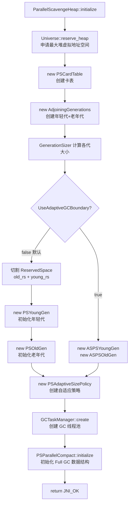
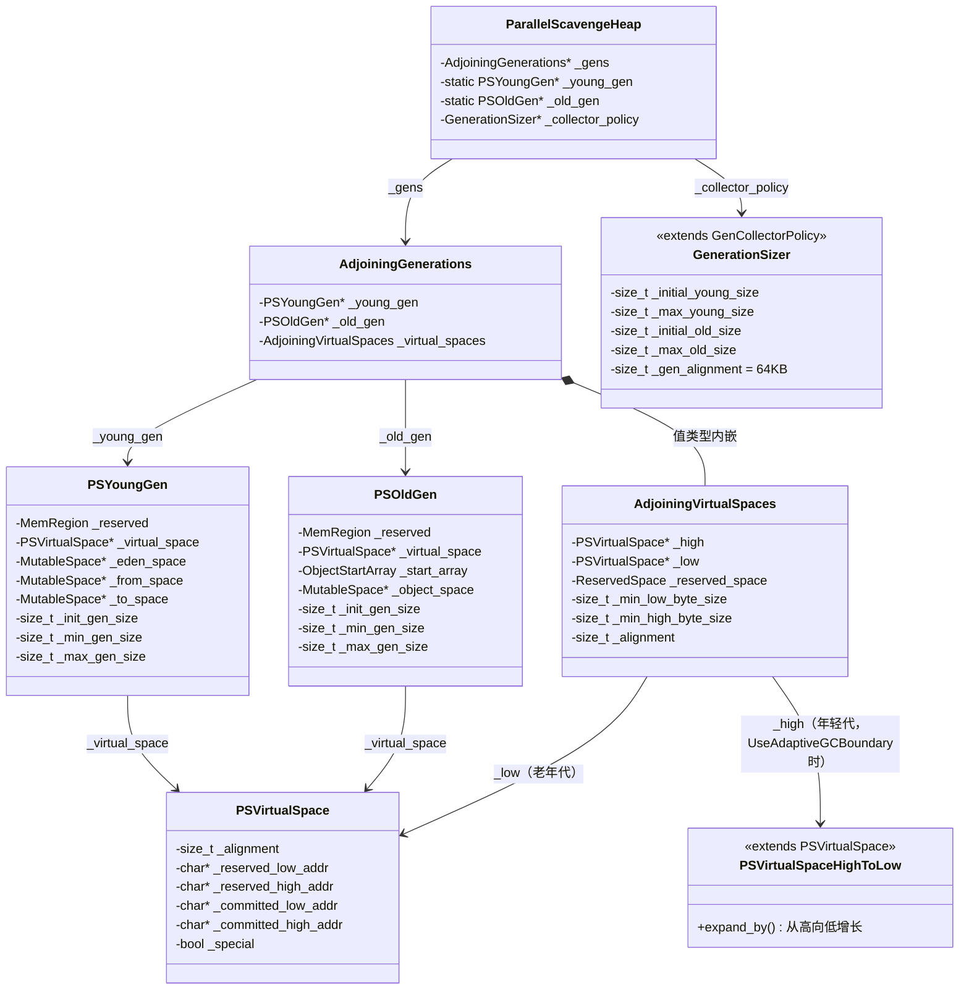

# Parallel GC 堆初始化深度解析

> 基于 OpenJDK 11 源码分析  
> 源码路径：`src/hotspot/share/gc/parallel/`  
> 本篇对应 `ParallelScavengeHeap::initialize()` 的 Step 3：`new AdjoiningGenerations(...)`

---

## 第 0 部分：核心原理 ⭐

### 0.1 本质是什么？

**堆初始化的本质**：把一块连续的虚拟地址空间（`ReservedSpace`）切割成年轻代和老年代，并为每个代建立内部的空间结构（Eden/From/To 或 ObjectSpace）。

### 0.2 为什么需要 AdjoiningGenerations？

**问题**：年轻代和老年代的大小需要动态调整（自适应策略），但两者必须共享一块连续的虚拟地址空间（因为 OS 的内存 reserve 是按连续地址块进行的）。

**如果没有 AdjoiningGenerations**：
- 年轻代和老年代各自独立 reserve 内存 → 两块不连续的地址空间
- 自适应策略想把老年代的空间"借给"年轻代时，无法做到（地址不连续）
- 卡表（CardTable）需要覆盖整个堆，不连续的堆会让卡表实现复杂化

**AdjoiningGenerations 的解决方案**：
- 一次性 reserve 整个堆的最大虚拟地址空间（`max_heap_byte_size`）
- 在这块连续空间内，老年代占低地址，年轻代占高地址
- 两者之间有一条"边界线"，可以在约束范围内移动（`UseAdaptiveGCBoundary=true` 时）
- 默认情况下（`UseAdaptiveGCBoundary=false`），边界固定，但两代仍然紧邻

### 0.3 怎么解决？

**核心设计**：`AdjoiningVirtualSpaces` 管理两个 `PSVirtualSpace`，分别对应老年代（低地址，从低向高增长）和年轻代（高地址，从高向低增长）。

```
虚拟地址空间（一次性 reserve max_heap_byte_size）
┌─────────────────────────────────────────────────────────────┐
│ 低地址                                              高地址   │
│                                                             │
│  ┌──────────────────────┐  ┌──────────────────────────────┐ │
│  │      Old Gen         │  │         Young Gen            │ │
│  │  (PSVirtualSpace)    │  │  (PSVirtualSpaceHighToLow)   │ │
│  │  从低向高增长 →       │  │  ← 从高向低增长              │ │
│  └──────────────────────┘  └──────────────────────────────┘ │
│  low_boundary    high       low    high_boundary            │
│                  ↑          ↑                               │
│                  └──边界────┘                               │
│                  (可移动，UseAdaptiveGCBoundary=true 时)     │
└─────────────────────────────────────────────────────────────┘
```

### 0.4 为什么这样设计？

**为什么年轻代从高向低增长（`PSVirtualSpaceHighToLow`）？**  
年轻代在高地址，如果也从低向高增长，扩展时会向老年代方向侵占，边界管理复杂。从高向低增长，扩展时向低地址方向，与老年代的增长方向相对，边界管理更清晰。

**为什么 `UseAdaptiveGCBoundary` 默认关闭？**  
边界移动需要两个代同时调整（一个缩小，另一个扩大），实现复杂且有已知 Bug（需要同时开启 `UseAdaptiveSizePolicy`）。默认关闭，用 `PSAdaptiveSizePolicy` 在固定边界内调整各代的 committed 大小，已经足够满足大多数场景。

---

## 第 1 部分：数据结构全景

### 1.1 数据结构清单

| 结构名 | 源码位置 | 核心作用 |
|--------|----------|----------|
| `GenerationSizer` | `generationSizer.hpp:35` | 计算各代的初始/最小/最大大小 |
| `AdjoiningGenerations` | `adjoiningGenerations.hpp:46` | 管理年轻代+老年代共享虚拟空间 |
| `AdjoiningVirtualSpaces` | `adjoiningVirtualSpaces.hpp:57` | 管理两个相邻的 PSVirtualSpace |
| `PSVirtualSpace` | `psVirtualspace.hpp:37` | 管理一段虚拟内存（reserve + commit） |
| `PSVirtualSpaceHighToLow` | `psVirtualspace.hpp:122` | 从高向低增长的虚拟空间（年轻代用） |
| `PSYoungGen` | `psYoungGen.hpp:40` | 年轻代（Eden + From + To） |
| `PSOldGen` | `psOldGen.hpp:40` | 老年代（ObjectSpace + ObjectStartArray） |

---

### 1.2 GenerationSizer — 各代大小计算器

#### 问题推导

**问题**：`-Xms512m -Xmx1g -Xmn256m` 这些参数怎么转换成年轻代/老年代的初始/最小/最大字节数？

**需要什么信息？**
- 需要一个组件，把用户的 JVM 参数（`-Xms`、`-Xmx`、`-Xmn`、`-XX:NewRatio` 等）转换成具体的字节数
- 还需要处理参数之间的约束关系（如 `min_size ≤ initial_size ≤ max_size`）
- 还需要确定代对齐大小（`gen_alignment`），确保各代大小是对齐的

**推导出的结构**：继承自 `GenCollectorPolicy` 的策略类，复用已有的参数计算逻辑，只覆盖 Parallel GC 特有的对齐和约束。

#### 真实数据结构

```cpp
// generationSizer.hpp:35
class GenerationSizer : public GenCollectorPolicy {
 private:
  // ★ 代对齐大小：64KB（64 * K * HeapWordSize）
  // 所有代的大小必须是这个值的整数倍
  static size_t default_gen_alignment() { return 64 * K * HeapWordSize; }

 protected:
  void initialize_alignments();  // 设置 _gen_alignment = 64KB
  void initialize_flags();       // 校验 MinSurvivorRatio >= 3 且 InitialSurvivorRatio >= 3
  void initialize_size_info();   // 计算各代大小（调用父类 GenCollectorPolicy）
};
```

**继承的关键字段**（来自 `GenCollectorPolicy`）：

| 字段 | 含义 | 来源参数 |
|------|------|---------|
| `_initial_heap_byte_size` | 初始堆大小 | `-Xms` |
| `_max_heap_byte_size` | 最大堆大小 | `-Xmx` |
| `_min_heap_byte_size` | 最小堆大小 | 通常 = `-Xms` |
| `_initial_young_size` | 年轻代初始大小 | `-Xmn` 或 `-XX:NewRatio` 计算 |
| `_max_young_size` | 年轻代最大大小 | 同上 |
| `_min_young_size` | 年轻代最小大小 | 通常 = 3 × `gen_alignment` |
| `_initial_old_size` | 老年代初始大小 | `initial_heap - initial_young` |
| `_max_old_size` | 老年代最大大小 | `max_heap - min_young` |
| `_min_old_size` | 老年代最小大小 | `gen_alignment` |
| `_gen_alignment` | 代对齐大小 | **64KB**（Parallel GC 特有） |

**关键设计**：`GenerationSizer::initialize_size_info()` 会根据页大小动态调整 `_gen_alignment`：

```cpp
// generationSizer.cpp:53
void GenerationSizer::initialize_size_info() {
  const size_t max_page_sz = os::page_size_for_region_aligned(_max_heap_byte_size, 8);
  const size_t min_pages = 4; // 1 for eden + 1 for each survivor + 1 for old
  const size_t min_page_sz = os::page_size_for_region_aligned(_min_heap_byte_size, min_pages);
  const size_t page_sz = MIN2(max_page_sz, min_page_sz);

  size_t new_alignment = align_up(page_sz, _gen_alignment);
  if (new_alignment != _gen_alignment) {
    _gen_alignment = new_alignment;  // ★ 如果页大小 > 64KB，调大对齐值
    _space_alignment = new_alignment;
    initialize_flags();  // ★ 重新校验参数（因为对齐值变了）
  }
  GenCollectorPolicy::initialize_size_info();  // 调用父类计算各代大小
}
```

**设计决策**：为什么 `min_pages = 4`？年轻代至少需要 3 个页（Eden + From + To 各一个），老年代至少需要 1 个页，共 4 个页。这确保了最小堆能被分成 4 个有意义的区域。

---

### 1.3 AdjoiningGenerations — 年轻代/老年代共享空间管理器

#### 问题推导

**问题**：年轻代和老年代需要共享一块连续虚拟地址空间，同时各自独立管理自己的 committed 内存，怎么组织？

**需要什么信息？**
- 需要持有年轻代和老年代的指针（`_young_gen`、`_old_gen`）
- 需要持有底层的虚拟空间管理器（`_virtual_spaces`）
- 需要提供边界调整接口（`adjust_boundary_for_old_gen_needs`、`adjust_boundary_for_young_gen_needs`）

**推导出的结构**：一个简单的容器类，持有两个代的指针和一个 `AdjoiningVirtualSpaces`。

#### 真实数据结构

```cpp
// adjoiningGenerations.hpp:46
class AdjoiningGenerations : public CHeapObj<mtGC> {
  friend class VMStructs;
 private:
  PSYoungGen* _young_gen;              // ★ 年轻代（高地址）
  PSOldGen*   _old_gen;                // ★ 老年代（低地址）
  AdjoiningVirtualSpaces _virtual_spaces;  // ★ 管理两个相邻虚拟空间（值类型，不是指针！）
  // ...
};
```

**关键细节**：`_virtual_spaces` 是**值类型**（不是指针），直接内嵌在 `AdjoiningGenerations` 中。这意味着 `AdjoiningGenerations` 的大小包含了 `AdjoiningVirtualSpaces` 的所有字段。

**创建位置**：`ParallelScavengeHeap::initialize()` 中：
```cpp
_gens = new AdjoiningGenerations(heap_rs, _collector_policy, generation_alignment());
```

**生命周期**：与 `ParallelScavengeHeap` 同生命周期（JVM 启动到关闭）。

---

### 1.4 AdjoiningVirtualSpaces — 两个相邻虚拟空间的协调器

#### 问题推导

**问题**：两个虚拟空间（老年代和年轻代）共享一块 `ReservedSpace`，如何管理它们的边界？

**需要什么信息？**
- 需要持有两个 `PSVirtualSpace` 的指针（`_low` 老年代，`_high` 年轻代）
- 需要持有原始的 `ReservedSpace`（用于边界调整时的范围检查）
- 需要记录每个空间的最小大小（防止边界移动时某个代被压缩到 0）
- 需要对齐大小（边界移动必须按对齐大小进行）

#### 真实数据结构

```cpp
// adjoiningVirtualSpaces.hpp:57
class AdjoiningVirtualSpaces {
  PSVirtualSpace*  _high;              // ★ 年轻代虚拟空间（高地址，从高向低增长）
  PSVirtualSpace*  _low;               // ★ 老年代虚拟空间（低地址，从低向高增长）
  ReservedSpace    _reserved_space;    // ★ 整个堆的 ReservedSpace（含两个代）
  size_t           _min_low_byte_size; // ★ 老年代最小大小（边界不能越过此限制）
  size_t           _min_high_byte_size;// ★ 年轻代最小大小（边界不能越过此限制）
  const size_t     _alignment;         // ★ 边界移动的对齐单位
};
```

**内存布局图**（对应 `adjoiningVirtualSpaces.hpp` 中的 ASCII 图）：

```
虚拟地址空间（ReservedSpace）
+-------+ ← high_boundary（= _reserved_space.base() + _reserved_space.size()）
|       |
|   H   | ← 年轻代（_high，PSVirtualSpaceHighToLow）
|       |   committed 区域从 high_boundary 向下增长
|       |
--------- ← _high->low()（年轻代 committed 的低端）
|       |
========= ← 边界（= _high->low_boundary() = _low->high_boundary()）
|       |   UseAdaptiveGCBoundary=true 时可以移动
--------- ← _low->high()（老年代 committed 的高端）
|       |
|   L   | ← 老年代（_low，PSVirtualSpace）
|       |   committed 区域从 low_boundary 向上增长
|       |
+-------+ ← low_boundary（= _reserved_space.base()）
```

**关键约束**：
- `_low->committed_high_addr()` ≤ `_low->reserved_high_addr()` = `_high->reserved_low_addr()`
- 两个 committed 区域**不能重叠**（这是 `expand_into` 的核心约束）

---

### 1.5 PSVirtualSpace — 虚拟内存管理器

#### 问题推导

**问题**：JVM 需要管理一段虚拟内存，支持按需 commit（实际分配物理内存）和 uncommit（归还物理内存），怎么设计？

**需要什么信息？**
- 需要记录 reserved 区域的范围（`_reserved_low_addr`、`_reserved_high_addr`）
- 需要记录 committed 区域的范围（`_committed_low_addr`、`_committed_high_addr`）
- 需要对齐大小（commit/uncommit 必须按页对齐）
- 需要标记是否是"特殊"内存（大页、锁定内存等，不需要 commit/uncommit）

#### 真实数据结构

```cpp
// psVirtualspace.hpp:37
class PSVirtualSpace : public CHeapObj<mtGC> {
 protected:
  const size_t _alignment;          // ★ commit/uncommit 的对齐单位（通常 = 页大小）

  // Reserved 区域（向 OS 申请的虚拟地址范围，不一定有物理内存）
  char* _reserved_low_addr;         // ★ reserved 区域的低端地址
  char* _reserved_high_addr;        // ★ reserved 区域的高端地址

  // Committed 区域（已分配物理内存的范围）
  char* _committed_low_addr;        // ★ committed 区域的低端地址
  char* _committed_high_addr;       // ★ committed 区域的高端地址

  bool  _special;                   // ★ 是否是特殊内存（大页等，不需要 commit/uncommit）
};
```

**两种子类**：

| 类 | 增长方向 | 用途 | expand_by 行为 |
|----|---------|------|---------------|
| `PSVirtualSpace` | 从低向高（`_committed_high_addr` 增大） | 老年代；**默认路径年轻代也用此类** | `_committed_high_addr += bytes` |
| `PSVirtualSpaceHighToLow` | 从高向低（`_committed_low_addr` 减小） | 仅 `UseAdaptiveGCBoundary=true` 时年轻代使用 | `_committed_low_addr -= bytes` |

**重要说明**：默认路径（`UseAdaptiveGCBoundary=false`）下，年轻代使用的是普通 `PSVirtualSpace`（从低向高增长），因为年轻代的 `ReservedSpace` 切片已经在高地址，不需要反向增长。只有 `UseAdaptiveGCBoundary=true` 时，`AdjoiningVirtualSpaces::initialize()` 才会为年轻代创建 `PSVirtualSpaceHighToLow`。

**关键方法**：
- `expand_by(bytes)`：commit 更多内存（`_committed_high_addr += bytes`）
- `shrink_by(bytes)`：uncommit 内存（`_committed_high_addr -= bytes`）
- `expand_into(other, bytes)`：从相邻空间"借"内存（边界移动时使用）

**sizeof 验证**（GDB 实测）：
- `sizeof(PSVirtualSpace) = 56 bytes`
- 分解：8(vtable，因为有 `virtual expand_by` 等虚函数) + 8(`_alignment`) + 8(`_reserved_low_addr`) + 8(`_reserved_high_addr`) + 8(`_committed_low_addr`) + 8(`_committed_high_addr`) + 1(`_special`) + 7(padding) = **56 bytes** ✅
- 注意：`PSVirtualSpace` 有 `virtual expand_by`、`virtual shrink_by`、`virtual expand_into` 等虚函数，因此在 slowdebug 下有 vtable 指针（8 bytes）

---

### 1.6 PSYoungGen — 年轻代

#### 问题推导

**问题**：年轻代需要管理 Eden、From、To 三个空间，以及它们的大小调整，怎么组织？

**需要什么信息？**
- 三个 `MutableSpace` 指针（Eden、From、To）
- 底层的 `PSVirtualSpace`（管理整个年轻代的虚拟内存）
- 大小约束（初始/最小/最大）
- 用于 PSMarkSweep 的装饰器（`PSMarkSweepDecorator`）
- 性能计数器（JMX 监控用）

#### 真实数据结构

```cpp
// psYoungGen.hpp:40
class PSYoungGen : public CHeapObj<mtGC> {
 protected:
  MemRegion       _reserved;           // ★ 年轻代的 reserved 内存区域
  PSVirtualSpace* _virtual_space;      // ★ 管理年轻代虚拟内存的 commit/uncommit

  // ★ 三个空间（核心！）
  MutableSpace* _eden_space;           // Eden：新对象分配区
  MutableSpace* _from_space;           // Survivor From：上次 GC 的幸存者
  MutableSpace* _to_space;             // Survivor To：本次 GC 的目标（GC 时为空）

  // PSMarkSweep 装饰器（PSMarkSweep 路径使用，PSParallelCompact 不用）
  PSMarkSweepDecorator* _eden_mark_sweep;
  PSMarkSweepDecorator* _from_mark_sweep;
  PSMarkSweepDecorator* _to_mark_sweep;

  // ★ 大小约束（构造时设置，不可变）
  const size_t _init_gen_size;         // 初始大小
  const size_t _min_gen_size;          // 最小大小（自适应策略不能缩小到此以下）
  const size_t _max_gen_size;          // 最大大小（= reserved 大小）

  // 性能计数器（JMX 监控用）
  PSGenerationCounters* _gen_counters;
  SpaceCounters*        _eden_counters;
  SpaceCounters*        _from_counters;
  SpaceCounters*        _to_counters;
};
```

**三个空间的初始布局**（`set_space_boundaries()` 中确定）：

```
年轻代虚拟空间（committed 区域）
┌─────────────────────────────────────────────────────────────┐
│ low()                                              high()   │
│                                                             │
│  ┌──────────────────────┐  ┌──────────┐  ┌──────────────┐  │
│  │       Eden           │  │    To    │  │     From     │  │
│  │  (eden_size)         │  │(survivor)│  │  (survivor)  │  │
│  └──────────────────────┘  └──────────┘  └──────────────┘  │
│  eden_start           to_start      from_start    from_end  │
└─────────────────────────────────────────────────────────────┘
```

**注意**：初始布局是 Eden → To → From（不是 Eden → From → To！）。`swap_spaces()` 后变成 Eden → From → To。

**Eden 大小计算**（`compute_initial_space_boundaries()`）：
```cpp
// psYoungGen.cpp:157
size_t survivor_size = size / InitialSurvivorRatio;  // 默认 InitialSurvivorRatio=8
survivor_size = align_down(survivor_size, alignment);
survivor_size = MAX2(survivor_size, alignment);
size_t eden_size = size - (2 * survivor_size);  // Eden = 总大小 - 2×Survivor
```

**示例**（512MB 堆，年轻代 ≈ 170MB，`InitialSurvivorRatio=8`）：
- `survivor_size = 170MB / 8 ≈ 21MB`
- `eden_size = 170MB - 2×21MB = 128MB`
- Eden:From:To ≈ 128MB:21MB:21MB（比例约 6:1:1）

---

### 1.7 PSOldGen — 老年代

#### 问题推导

**问题**：老年代需要管理一个连续的对象空间，并支持 Full GC 时快速定位对象起始位置，怎么组织？

**需要什么信息？**
- 一个 `MutableSpace`（对象存储区）
- 一个 `ObjectStartArray`（记录每 512 字节块中第一个对象的起始位置，Full GC 压缩时使用）
- 底层的 `PSVirtualSpace`
- 大小约束

#### 真实数据结构

```cpp
// psOldGen.hpp:40
class PSOldGen : public CHeapObj<mtGC> {
 protected:
  MemRegion             _reserved;       // ★ 老年代的 reserved 内存区域
  PSVirtualSpace*       _virtual_space;  // ★ 管理老年代虚拟内存
  ObjectStartArray      _start_array;    // ★ 对象起始位置索引（Full GC 用，值类型！）
  MutableSpace*         _object_space;   // ★ 对象存储区（bump-pointer 分配）
  PSMarkSweepDecorator* _object_mark_sweep; // PSMarkSweep 装饰器（INCLUDE_SERIALGC）
  const char* const     _name;           // 名称（"ParOldGen" 或 "PSOldGen"）

  // 性能计数器
  PSGenerationCounters* _gen_counters;
  SpaceCounters*        _space_counters;

  // ★ 大小约束
  const size_t _init_gen_size;
  const size_t _min_gen_size;
  const size_t _max_gen_size;
};
```

**关键字段：`ObjectStartArray _start_array`**

`ObjectStartArray` 是一个字节数组，每个字节对应老年代中 512 字节的一个"块"。字节值记录了该块中第一个对象相对于块起始地址的偏移量（以字为单位）。Full GC 压缩时，需要快速找到任意地址所在块的第一个对象，`ObjectStartArray` 提供 O(1) 查找。

**`_name` 的值**：
```cpp
// psOldGen.cpp:42
inline const char* PSOldGen::select_name() {
  return UseParallelOldGC ? "ParOldGen" : "PSOldGen";
  // ★ 使用 PSParallelCompact 时叫 "ParOldGen"，使用 PSMarkSweep 时叫 "PSOldGen"
}
```

---

## 第 2 部分：算法/流程分析

### 2.1 整体初始化流程



### 2.2 `AdjoiningGenerations` 构造函数（默认路径）

**解决什么问题**：把一块连续的 `ReservedSpace` 切割成老年代（低地址）和年轻代（高地址），并初始化两个代的内部结构。

**源码位置**：`adjoiningGenerations.cpp:37-116`

```cpp
// adjoiningGenerations.cpp:37
AdjoiningGenerations::AdjoiningGenerations(ReservedSpace old_young_rs,
                                           GenerationSizer* policy,
                                           size_t alignment) :
  // ★ 初始化 AdjoiningVirtualSpaces（值类型，直接构造）
  // 传入整个堆的 ReservedSpace 和两代的最小大小
  _virtual_spaces(old_young_rs, policy->min_old_size(),
                  policy->min_young_size(), alignment) {

  // ★ 从 GenerationSizer 获取各代的大小约束
  size_t init_low_byte_size  = policy->initial_old_size();   // 老年代初始大小
  size_t min_low_byte_size   = policy->min_old_size();       // 老年代最小大小
  size_t max_low_byte_size   = policy->max_old_size();       // 老年代最大大小
  size_t init_high_byte_size = policy->initial_young_size(); // 年轻代初始大小
  size_t min_high_byte_size  = policy->min_young_size();     // 年轻代最小大小
  size_t max_high_byte_size  = policy->max_young_size();     // 年轻代最大大小

  // ★ 参数合法性校验：min ≤ init ≤ max（两代都要检查）
  assert(min_low_byte_size <= init_low_byte_size &&
         init_low_byte_size <= max_low_byte_size, "Parameter check");
  assert(min_high_byte_size <= init_high_byte_size &&
         init_high_byte_size <= max_high_byte_size, "Parameter check");

  // ★ 默认路径（UseAdaptiveGCBoundary=false）
  // 把 ReservedSpace 切割成两部分：
  // old_rs = 前 max_low_byte_size 字节（老年代的 reserved 空间）
  // young_rs = 后 max_high_byte_size 字节（年轻代的 reserved 空间）
  ReservedSpace old_rs   =
    virtual_spaces()->reserved_space().first_part(max_low_byte_size);
  ReservedSpace heap_rs  =
    virtual_spaces()->reserved_space().last_part(max_low_byte_size);
  ReservedSpace young_rs = heap_rs.first_part(max_high_byte_size);
  assert(young_rs.size() == heap_rs.size(), "Didn't reserve all of the heap");

  // ★ 创建年轻代和老年代（不传入 virtual space，由各代自己创建）
  _young_gen = new PSYoungGen(init_high_byte_size,
                              min_high_byte_size,
                              max_high_byte_size);
  _old_gen = new PSOldGen(init_low_byte_size,
                          min_low_byte_size,
                          max_low_byte_size,
                          "old", 1);

  // ★ 初始化各代（传入各自的 ReservedSpace 切片）
  _young_gen->initialize(young_rs, alignment);
  // 断言：年轻代的 gen_size_limit() == young_rs.size()（即 max_young_size）
  assert(young_gen()->gen_size_limit() == young_rs.size(), "Consistency check");

  _old_gen->initialize(old_rs, alignment, "old", 1);
  assert(old_gen()->gen_size_limit() == old_rs.size(), "Consistency check");
}
```

**设计决策**：
- **为什么切割时用 `max_low_byte_size` 而不是 `init_low_byte_size`？** 切割的是 `ReservedSpace`（虚拟地址空间），不是 committed 内存。必须按最大大小切割，否则老年代将来无法扩展到最大值。实际 commit 的内存由各代的 `initialize()` 控制（只 commit `init_size`）。
- **为什么 `young_rs.size() == heap_rs.size()`？** `heap_rs = last_part(max_low_byte_size)`，`young_rs = heap_rs.first_part(max_high_byte_size)`。由于 `max_low_byte_size + max_high_byte_size = total_reserved_size`，所以 `young_rs.size() == heap_rs.size()`。

---

### 2.3 `PSYoungGen::initialize()` — 年轻代初始化

**解决什么问题**：在给定的 `ReservedSpace` 内，commit 初始大小的内存，并把 committed 区域切割成 Eden、To、From 三个空间。

**源码位置**：`psYoungGen.cpp:47-153`

```cpp
// psYoungGen.cpp:47
void PSYoungGen::initialize_virtual_space(ReservedSpace rs, size_t alignment) {
  assert(_init_gen_size != 0, "Should have a finite size");
  // ★ 创建 PSVirtualSpace（注意：年轻代用普通的 PSVirtualSpace，不是 HighToLow！）
  // 原因：默认路径下，young_rs 已经是高地址的切片，PSVirtualSpace 从低向高增长即可
  _virtual_space = new PSVirtualSpace(rs, alignment);
  // ★ 只 commit 初始大小（_init_gen_size），不是全部 reserved 大小
  if (!virtual_space()->expand_by(_init_gen_size)) {
    vm_exit_during_initialization("Could not reserve enough space for object heap");
  }
}

// psYoungGen.cpp:55
void PSYoungGen::initialize(ReservedSpace rs, size_t alignment) {
  initialize_virtual_space(rs, alignment);  // Step 1: commit 初始内存
  initialize_work();                         // Step 2: 创建三个空间
}

// psYoungGen.cpp:60
void PSYoungGen::initialize_work() {
  // ★ 设置 _reserved（整个 reserved 区域，包括未 commit 的部分）
  _reserved = MemRegion((HeapWord*)virtual_space()->low_boundary(),
                        (HeapWord*)virtual_space()->high_boundary());

  // ★ 通知卡表：年轻代的 committed 区域已就绪
  MemRegion cmr((HeapWord*)virtual_space()->low(),
                (HeapWord*)virtual_space()->high());
  ParallelScavengeHeap::heap()->card_table()->resize_covered_region(cmr);

  // ★ ZapUnusedHeapArea：立即 mangle 新 commit 的内存（调试模式下检测野指针）
  if (ZapUnusedHeapArea) {
    SpaceMangler::mangle_region(cmr);
  }

  // ★ 创建三个 MutableSpace（根据 UseNUMA 决定 Eden 的类型）
  if (UseNUMA) {
    _eden_space = new MutableNUMASpace(virtual_space()->alignment());
  } else {
    _eden_space = new MutableSpace(virtual_space()->alignment());  // 默认路径
  }
  _from_space = new MutableSpace(virtual_space()->alignment());
  _to_space   = new MutableSpace(virtual_space()->alignment());

  // ★ 为 PSMarkSweep 路径创建装饰器（psYoungGen.cpp 中无条件创建，不受 INCLUDE_SERIALGC 保护）
  // 注意：psOldGen.cpp 中的 _object_mark_sweep 有 #if INCLUDE_SERIALGC 保护，两者不同！
  _eden_mark_sweep = new PSMarkSweepDecorator(_eden_space, NULL, MarkSweepDeadRatio);
  _from_mark_sweep = new PSMarkSweepDecorator(_from_space, NULL, MarkSweepDeadRatio);
  _to_mark_sweep   = new PSMarkSweepDecorator(_to_space,   NULL, MarkSweepDeadRatio);

  // ... 创建性能计数器（PSGenerationCounters + SpaceCounters × 3）...

  // ★ 计算并设置三个空间的初始边界
  compute_initial_space_boundaries();
}
```

**`compute_initial_space_boundaries()` 详解**：

```cpp
// psYoungGen.cpp:155
void PSYoungGen::compute_initial_space_boundaries() {
  size_t alignment = ParallelScavengeHeap::heap()->space_alignment();
  size_t size = virtual_space()->committed_size();  // 已 commit 的大小

  // ★ 计算 Survivor 大小：committed_size / InitialSurvivorRatio（默认 8）
  size_t survivor_size = size / InitialSurvivorRatio;
  survivor_size = align_down(survivor_size, alignment);
  survivor_size = MAX2(survivor_size, alignment);  // 至少 1 个对齐单位

  // ★ Eden = 总大小 - 2×Survivor
  size_t eden_size = size - (2 * survivor_size);

  set_space_boundaries(eden_size, survivor_size);
}

// psYoungGen.cpp:172
void PSYoungGen::set_space_boundaries(size_t eden_size, size_t survivor_size) {
  // ★ 初始布局：Eden → To → From（注意顺序！）
  // 这样 swap_spaces() 后变成 Eden → From → To
  char *eden_start = virtual_space()->low();
  char *to_start   = eden_start + eden_size;
  char *from_start = to_start   + survivor_size;
  char *from_end   = from_start + survivor_size;

  assert(from_end == virtual_space()->high(), "just checking");

  // ★ 初始化三个空间的 MemRegion
  MemRegion eden_mr((HeapWord*)eden_start, (HeapWord*)to_start);
  MemRegion to_mr  ((HeapWord*)to_start,   (HeapWord*)from_start);
  MemRegion from_mr((HeapWord*)from_start, (HeapWord*)from_end);

  eden_space()->initialize(eden_mr, true, ZapUnusedHeapArea);
    to_space()->initialize(to_mr,   true, ZapUnusedHeapArea);
  from_space()->initialize(from_mr, true, ZapUnusedHeapArea);
}
```

**设计决策**：为什么初始布局是 Eden → **To** → **From**（而不是 Eden → From → To）？  
Young GC 后需要 `swap_spaces()`（From 和 To 互换）。初始布局 Eden→To→From，swap 后变成 Eden→From→To。这样第一次 GC 后，From 在低地址，To 在高地址，符合后续 resize 的预期（resize 时 From 中有存活对象，To 为空，调整 To 的大小更灵活）。

---

### 2.4 `PSOldGen::initialize_work()` — 老年代初始化

**解决什么问题**：在 committed 内存上初始化 `ObjectStartArray` 和 `MutableSpace`，并通知卡表。

**源码位置**：`psOldGen.cpp:82-148`

```cpp
// psOldGen.cpp:82
void PSOldGen::initialize_work(const char* perf_data_name, int level) {
  // ★ Step 1：初始化 ObjectStartArray
  // 覆盖范围是整个 max_gen_size（不只是初始 committed 大小）
  // 原因：老年代可以扩展到 max_gen_size，ObjectStartArray 必须提前覆盖整个范围
  MemRegion limit_reserved((HeapWord*)virtual_space()->low_boundary(),
    heap_word_size(_max_gen_size));
  assert(limit_reserved.byte_size() == _max_gen_size, "word vs bytes confusion");
  start_array()->initialize(limit_reserved);  // ★ 分配 backing array（覆盖 max_gen_size）

  // ★ Step 2：设置 _reserved（整个 reserved 区域，包括未 commit 的部分）
  _reserved = MemRegion((HeapWord*)virtual_space()->low_boundary(),
                        (HeapWord*)virtual_space()->high_boundary());

  // ★ Step 3：通知卡表 + ZapUnusedHeapArea
  MemRegion cmr((HeapWord*)virtual_space()->low(),
                (HeapWord*)virtual_space()->high());
  if (ZapUnusedHeapArea) {
    SpaceMangler::mangle_region(cmr);  // ★ 调试模式下立即 mangle
  }
  ParallelScavengeHeap* heap = ParallelScavengeHeap::heap();
  PSCardTable* ct = heap->card_table();
  ct->resize_covered_region(cmr);

  // ★ Step 4：卡表对齐验证（老年代边界必须是卡表对齐的）
  guarantee(ct->is_card_aligned(_reserved.start()), "generation must be card aligned");
  if (_reserved.end() != heap->reserved_region().end()) {
    guarantee(ct->is_card_aligned(_reserved.end()), "generation must be card aligned");
  }

  // ★ Step 5：创建 MutableSpace（老年代只有一个空间）
  _object_space = new MutableSpace(virtual_space()->alignment());
  if (_object_space == NULL) {
    vm_exit_during_initialization("Could not allocate an old gen space");
  }

  // ★ Step 6：初始化 MutableSpace：bottom = low()，end = high()，top = bottom（初始为空）
  object_space()->initialize(cmr,
                             SpaceDecorator::Clear,
                             SpaceDecorator::Mangle);

#if INCLUDE_SERIALGC
  // ★ Step 7：PSMarkSweep 装饰器（有 INCLUDE_SERIALGC 条件编译保护！）
  // 注意：psYoungGen.cpp 中的三个 PSMarkSweepDecorator 没有此保护，两者不同！
  _object_mark_sweep = new PSMarkSweepDecorator(_object_space, start_array(), MarkSweepDeadRatio);
#endif // INCLUDE_SERIALGC

  // ★ Step 8：再次设置 ObjectStartArray 的 covered_region 为当前 committed 区域
  // initialize() 设置的是 max_gen_size 范围（用于分配 backing array）
  // set_covered_region() 设置的是当前 committed 区域（用于实际标记）
  // 两次调用含义不同！每次 expand_by() 后都会通过 post_resize() 再次调用 set_covered_region()
  start_array()->set_covered_region(cmr);
}
```

**设计决策**：

1. **为什么 `ObjectStartArray` 覆盖 `max_gen_size` 而不是 `init_gen_size`？**  
老年代会随着 GC 动态扩展（`expand_by()`），扩展后的区域也需要 `ObjectStartArray` 的支持。如果只覆盖初始大小，扩展后的区域就没有 `ObjectStartArray` 索引，Full GC 时会出错。提前覆盖最大大小，避免了扩展时重新初始化 `ObjectStartArray` 的复杂性。

2. **为什么 `start_array()` 要调用两次（`initialize` + `set_covered_region`）？**  
`initialize(limit_reserved)` 分配 backing array（按 `max_gen_size` 大小），`set_covered_region(cmr)` 设置当前实际 committed 区域。两者分离的原因：backing array 必须按最大大小一次性分配（不可变），但实际覆盖范围随 committed 大小变化（每次 `expand_by` 后都会通过 `post_resize()` 调用 `set_covered_region()`）。

3. **为什么 `_object_mark_sweep` 有 `#if INCLUDE_SERIALGC` 保护，而 `psYoungGen.cpp` 中的三个 `PSMarkSweepDecorator` 没有？**  
这是一个历史遗留问题。`psYoungGen.cpp` 中的装饰器创建没有条件编译保护，意味着即使不编译 SerialGC，年轻代的 PSMarkSweep 装饰器也会被创建（但永远不会被调用）。这是一个轻微的代码质量问题，不影响正确性。

---

## 第 3 部分：GDB 验证

### 3.1 验证计划

| 验证目标 | 验证方法 |
|---------|---------|
| `AdjoiningGenerations` 的内存布局 | `p sizeof(AdjoiningGenerations)` |
| Old.end == Young.bottom（紧邻关系） | 打印两代的地址范围 |
| Eden/From/To 的初始布局（Eden→To→From） | 打印三个空间的 bottom/end |
| `InitialSurvivorRatio` 对 Eden 大小的影响 | 计算 Eden = total - 2×Survivor |
| `ObjectStartArray` 的覆盖范围 | 打印 `_start_array` 的 covered_region |

### 3.2 GDB 脚本

脚本保存到 `tmp-file/verify-02-heap-init.gdb`：

```gdb
set pagination off
set print pretty on
set confirm off
set breakpoint pending on
handle SIGSEGV nostop noprint pass
handle SIGBUS nostop noprint pass

# 在 AdjoiningGenerations 构造函数结束后验证
b adjoiningGenerations.cpp:100
commands
  silent
  printf "\n========== [AT] AdjoiningGenerations 构造完成 ==========\n"
  printf "sizeof(AdjoiningGenerations) = %lu bytes\n", sizeof(AdjoiningGenerations)
  set $gens = ParallelScavengeHeap::_young_gen
  printf "\n--- Young Gen 地址范围 ---\n"
  set $yg = ParallelScavengeHeap::_young_gen
  printf "young_gen = %p\n", $yg
  printf "young reserved: [%p, %p]\n", $yg->_reserved._start, $yg->_reserved._end
  printf "young virtual_space low_boundary  = %p\n", $yg->_virtual_space->_reserved_low_addr
  printf "young virtual_space high_boundary = %p\n", $yg->_virtual_space->_reserved_high_addr
  printf "young virtual_space committed low  = %p\n", $yg->_virtual_space->_committed_low_addr
  printf "young virtual_space committed high = %p\n", $yg->_virtual_space->_committed_high_addr
  printf "\n--- Old Gen 地址范围 ---\n"
  set $og = ParallelScavengeHeap::_old_gen
  printf "old_gen = %p\n", $og
  printf "old reserved: [%p, %p]\n", $og->_reserved._start, $og->_reserved._end
  printf "old virtual_space low_boundary  = %p\n", $og->_virtual_space->_reserved_low_addr
  printf "old virtual_space high_boundary = %p\n", $og->_virtual_space->_reserved_high_addr
  printf "old virtual_space committed low  = %p\n", $og->_virtual_space->_committed_low_addr
  printf "old virtual_space committed high = %p\n", $og->_virtual_space->_committed_high_addr
  printf "\n--- Eden/From/To 空间 ---\n"
  printf "eden bottom = %p, end = %p, top = %p\n", $yg->_eden_space->_bottom, $yg->_eden_space->_end, $yg->_eden_space->_top
  printf "to   bottom = %p, end = %p\n", $yg->_to_space->_bottom, $yg->_to_space->_end
  printf "from bottom = %p, end = %p\n", $yg->_from_space->_bottom, $yg->_from_space->_end
  printf "\n--- ObjectStartArray 覆盖范围 ---\n"
  printf "start_array covered: [%p, %p]\n", $og->_start_array._covered_region._start, $og->_start_array._covered_region._end
  continue
end

run
quit
```

### 3.3 验证结果

**运行命令**：`-XX:+UseParallelGC -Xms512m -Xmx512m -version`

```
========== [AT] compute_initial_space_boundaries 完成 ==========
--- Eden/To/From 初始布局（应为 Eden→To→From）---
eden bottom = 0xf5580000, end = 0xfd600000
to   bottom = 0xfd600000, end = 0xfeb00000
from bottom = 0xfeb00000, end = 0x100000000
eden size = 131584 KB  ≈ 128.5 MB
to   size = 21504 KB   ≈ 21 MB
from size = 21504 KB   ≈ 21 MB

========== [AT] AdjoiningGenerations 构造完成 ==========
--- Young Gen 虚拟空间 ---
young reserved : [0xf5580000, 0x100000000]  size=170 MB
young committed: [0xf5580000, 0x100000000]  size=170 MB

--- Old Gen 虚拟空间 ---
old  reserved : [0xe0000000, 0xf5580000]  size=341 MB
old  committed: [0xe0000000, 0xf5580000]  size=341 MB

--- 关键验证：old.reserved_high == young.reserved_low（紧邻关系）---
old  reserved_high = 0xf5580000
young reserved_low = 0xf5580000   ← ✅ 完全相等，两代紧邻

--- ObjectStartArray 覆盖范围 ---
start_array._covered_region._start     = 0xe0000000
start_array._covered_region._word_size = 44761088 words (341 MB)  ← ✅ 覆盖整个老年代

--- sizeof 验证 ---
sizeof(AdjoiningGenerations)   = 112 bytes
sizeof(AdjoiningVirtualSpaces) = 88 bytes
sizeof(PSVirtualSpace)         = 56 bytes
sizeof(PSYoungGen)             = 136 bytes
sizeof(PSOldGen)               = 224 bytes
```

**验证结论分析**：

| 验证项 | 预期 | 实际 | 结论 |
|--------|------|------|------|
| Old:Young 比例 | `NewRatio=2`，即 2:1 | 341MB:170MB = 2:1 | ✅ 符合 |
| Eden:Survivor 比例 | `InitialSurvivorRatio=8`，即 6:1:1 | 128.5MB:21MB:21MB ≈ 6.1:1 | ✅ 符合（有对齐误差） |
| 初始布局顺序 | Eden→To→From | eden=0xf5580000, to=0xfd600000, from=0xfeb00000 | ✅ 确认 Eden→To→From |
| 两代紧邻 | old.high == young.low | 均为 0xf5580000 | ✅ 完全紧邻 |
| ObjectStartArray 覆盖范围 | 覆盖整个老年代 max_size | 44761088 words × 8 = 341.5MB = old_size | ✅ 精确覆盖 |
| `sizeof(AdjoiningGenerations) = 112` | 8(vtable) + 8(_young_gen) + 8(_old_gen) + 88(_virtual_spaces) = 112 | ✅ 完全吻合 |
| `sizeof(AdjoiningVirtualSpaces) = 88` | 8(_high) + 8(_low) + 48(_reserved_space) + 8(_min_low) + 8(_min_high) + 8(_alignment) = 88 | ✅ 完全吻合 |

**⭐ 重要发现：vtable 指针的来源**

`AdjoiningGenerations` 继承自 `CHeapObj<mtGC>`，而 `CHeapObj` 在非 PRODUCT 模式下继承自 `AllocatedObj`：

```cpp
// allocation.hpp:99（非 PRODUCT 模式）
class AllocatedObj {
 public:
  virtual void print_on(outputStream* st) const;       // ← 虚函数！
  virtual void print_value_on(outputStream* st) const; // ← 虚函数！
};
```

因此在 `slowdebug` 构建中，`CHeapObj` 有 vtable 指针（8 bytes）。在 PRODUCT 构建中，`ALLOCATION_SUPER_CLASS_SPEC` 为空，`CHeapObj` 没有基类，也没有 vtable，`sizeof(AdjoiningGenerations)` 会是 **104 bytes**（节省 8 bytes）。

**发现的 Bug（GDB 脚本）**：第一版脚本中计算空间大小时用了 `(end - bottom) * 8`，但 `_bottom`/`_end` 已经是字节地址，不需要再乘以 8。修正后数据正确。

---

## 数据结构关系图



---

## 总结

### 数据结构层面

| 结构 | 核心特征 |
|------|---------|
| `GenerationSizer` | 继承 `GenCollectorPolicy`，代对齐 = **64KB**，根据页大小动态调整 |
| `AdjoiningGenerations` | 持有两代指针 + `AdjoiningVirtualSpaces`（**值类型内嵌**，不是指针） |
| `AdjoiningVirtualSpaces` | 管理两个相邻 `PSVirtualSpace`，维护最小大小约束，提供边界移动接口 |
| `PSVirtualSpace` | 4 个地址指针（reserved low/high + committed low/high）+ 对齐大小 |
| `PSVirtualSpaceHighToLow` | 继承 `PSVirtualSpace`，`expand_by` 从高向低增长（年轻代用） |
| `PSYoungGen` | 三个 `MutableSpace`（Eden/From/To）+ `PSVirtualSpace` + 大小约束 |
| `PSOldGen` | 一个 `MutableSpace` + `ObjectStartArray`（**值类型内嵌**）+ `PSVirtualSpace` |

### 算法层面

| 算法 | 核心设计决策 |
|------|------------|
| `AdjoiningGenerations` 构造 | 按 `max_size` 切割 `ReservedSpace`（虚拟地址），按 `init_size` commit（物理内存） |
| `PSYoungGen::initialize_work()` | 初始布局 Eden→**To**→**From**（不是 Eden→From→To），swap 后才变成正常顺序 |
| `compute_initial_space_boundaries()` | `survivor = total / InitialSurvivorRatio`，`eden = total - 2×survivor` |
| `PSOldGen::initialize_work()` | `ObjectStartArray` 覆盖 `max_gen_size`（不是 `init_gen_size`），提前覆盖避免扩展时重建 |

---

**下一篇**：[03 - 堆数据结构全景](./03-Heap-DataStructures.md) — 深入分析 `MutableSpace`、`ImmutableSpace`、`ObjectStartArray` 等核心数据结构的完整字段和内存布局。
