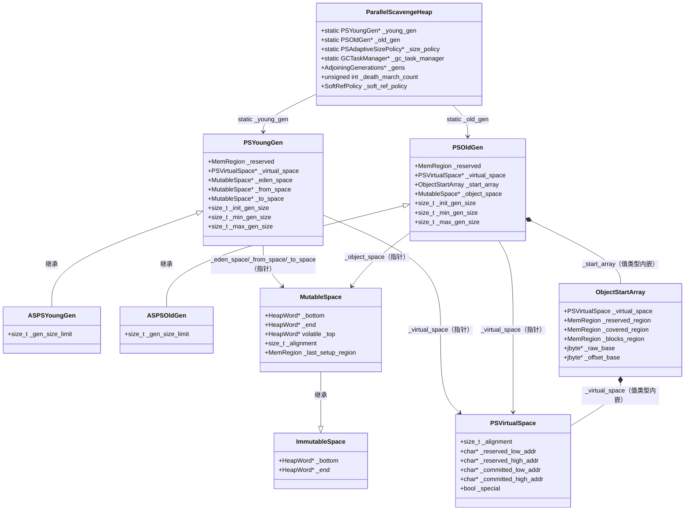

# 03 - Parallel GC 堆数据结构全景

> 基于 OpenJDK 11 源码分析  
> 方法论：程序 = 数据结构 + 算法  
> 标准环境：`-Xms8g -Xmx8g -XX:+UseParallelGC`

---

## 第 0 部分：核心原理 ⭐

### 0.1 本质是什么？

Parallel GC 的堆是一个**两代连续内存模型**：老年代（低地址）和年轻代（高地址）共享同一块 `ReservedSpace`，中间有一条可移动的边界线。

### 0.2 为什么这样设计？

**问题**：如果老年代和年轻代各自独立 `mmap`，两代之间就有地址空洞，`UseAdaptiveGCBoundary` 就无法实现——因为边界移动需要把一代的 reserved 空间"借给"另一代，而两块独立的 `mmap` 区域无法做到这一点。

**解决**：一次性 `mmap` 整个堆（`old_size + young_size`），然后在这块连续空间内划分两代。边界移动只是改变两个指针，不需要重新 `mmap`。

### 0.3 为什么这样设计？

- **为什么老年代在低地址、年轻代在高地址？**  
  `ObjectStartArray` 需要覆盖老年代的整个 reserved 区域（从 `low_boundary` 到 `low_boundary + max_gen_size`）。如果老年代在高地址，`ObjectStartArray` 的 backing array 地址计算会更复杂（需要减法而非加法）。低地址老年代让 `ObjectStartArray` 的索引计算更自然：`index = (addr - base) >> 9`。

- **为什么 `_young_gen` 和 `_old_gen` 是 static 字段？**  
  Young GC（`PSScavenge`）和 Full GC（`PSParallelCompact`）都需要频繁访问这两个对象。设计为 static 避免了每次都通过 `ParallelScavengeHeap::heap()` 单例查找，减少一次指针解引用。

---

## 第 1 部分：数据结构清单

| 结构名 | 源码位置 | 核心作用 | sizeof（slowdebug） |
|--------|----------|----------|---------------------|
| `ParallelScavengeHeap` | `parallelScavengeHeap.hpp` | 顶层堆对象，GC 触发入口 | ~400B（含 CollectedHeap 基类） |
| `PSYoungGen` | `psYoungGen.hpp` | 年轻代（Eden + From + To） | **136B** |
| `ASPSYoungGen` | `asPSYoungGen.hpp` | 自适应版年轻代（继承 PSYoungGen） | **144B** |
| `PSOldGen` | `psOldGen.hpp` | 老年代（单一 MutableSpace） | **224B**（含内嵌 ObjectStartArray 128B） |
| `ASPSOldGen` | `asPSOldGen.hpp` | 自适应版老年代（继承 PSOldGen） | **232B** |
| `ImmutableSpace` | `immutableSpace.hpp` | 不可变空间基类（`_bottom` + `_end`） | **24B** |
| `MutableSpace` | `mutableSpace.hpp` | 可变空间（增加 `_top`，bump-pointer 分配） | **64B** |
| `PSVirtualSpace` | `psVirtualspace.hpp` | 虚拟内存管理（reserved vs committed） | **56B** |
| `ObjectStartArray` | `objectStartArray.hpp` | Full GC 压缩时的对象起始位置索引 | **128B**（含内嵌 PSVirtualSpace 56B） |

---

## 第 2 部分：数据结构全景 ⭐

### 2.1 ParallelScavengeHeap — 顶层堆对象

#### 问题推导

**问题**：JVM 需要一个统一的入口来管理整个堆的生命周期（初始化、分配、GC 触发、监控）。

**需要什么信息？**
- 两代的指针（年轻代 + 老年代）
- 自适应大小策略对象
- GC 任务管理器（并行 GC 线程池）
- 内存池和 GC 管理器（JMX 监控用）
- Death March 计数器（防止无限循环分配）

**推导出的结构**：一个单例对象，持有所有子系统的指针，大部分字段是 static（因为 GC 代码需要全局访问）。

#### 真实数据结构

```cpp
// parallelScavengeHeap.hpp
class ParallelScavengeHeap : public CollectedHeap {
  friend class VMStructs;
 private:
  // ★ static：GC 代码（PSScavenge/PSParallelCompact）直接访问，无需通过 heap() 单例
  static PSYoungGen*                 _young_gen;
  static PSOldGen*                   _old_gen;
  static PSAdaptiveSizePolicy*       _size_policy;
  static PSGCAdaptivePolicyCounters* _gc_policy_counters;
  static GCTaskManager*              _gc_task_manager;

  // ★ 非 static：每个堆实例独有
  GenerationSizer*   _collector_policy;   // 参数解析器（计算各代大小）
  SoftRefPolicy      _soft_ref_policy;    // 软引用清除策略（值类型内嵌）
  AdjoiningGenerations* _gens;            // 两代共享虚拟空间的管理器
  unsigned int       _death_march_count;  // Death March 计数器（见下文）

  // JMX 监控用（GCMemoryManager + MemoryPool）
  GCMemoryManager*   _young_manager;      // "PS Scavenge" 管理器
  GCMemoryManager*   _old_manager;        // "PS MarkSweep" 管理器
  MemoryPool*        _eden_pool;          // Eden 内存池
  MemoryPool*        _survivor_pool;      // Survivor 内存池
  MemoryPool*        _old_pool;           // Old Gen 内存池
};
```

#### 关键字段生命周期

**`_death_march_count`**（最容易被忽视的字段）：
- **含义**：检测"死亡行军"（Death March）——Full GC 后仍无法从年轻代分配，只能从老年代分配，如此循环。
- **设置**：`death_march_check()` 中设置：
  - 分配成功 → 重置为 0（死亡行军结束）
  - 分配失败且对象应该在 Eden → 设为 1（死亡行军开始）
- **读取**：`mem_allocate_old_gen()` 中读取：
  - `_death_march_count > 0 && < 64` → 允许从老年代分配，计数器 +1
  - `_death_march_count >= 64` → 重置为 0，强制触发 GC（不再从老年代分配）
- **设计原因**：如果不限制，每次分配失败都从老年代分配，老年代会被小对象填满，最终 OOM。限制 64 次后强制 GC，给 GC 一次清理机会。

```cpp
// parallelScavengeHeap.cpp
void ParallelScavengeHeap::death_march_check(HeapWord* const addr, size_t size) {
  if (addr != NULL) {
    _death_march_count = 0;          // ★ 分配成功，死亡行军结束
  } else if (_death_march_count == 0) {
    if (should_alloc_in_eden(size)) {
      _death_march_count = 1;        // ★ 死亡行军开始（对象本应在 Eden）
    }
  }
}

HeapWord* ParallelScavengeHeap::mem_allocate_old_gen(size_t size) {
  if (!should_alloc_in_eden(size) || GCLocker::is_active_and_needs_gc()) {
    return old_gen()->allocate(size); // ★ 大对象直接进老年代，不受 death march 限制
  }
  if (_death_march_count > 0) {
    if (_death_march_count < 64) {
      ++_death_march_count;
      return old_gen()->allocate(size); // ★ 死亡行军中，允许从老年代分配（最多 64 次）
    } else {
      _death_march_count = 0;           // ★ 超过 64 次，重置，强制触发 GC
    }
  }
  return NULL;
}
```

**`_collector_policy`**（`GenerationSizer*`，不是 `CollectorPolicy*`）：
- `GenerationSizer` 继承自 `CollectorPolicy`，但 `_collector_policy` 声明为 `GenerationSizer*` 而非基类指针
- 原因：`ParallelScavengeHeap` 需要调用 `GenerationSizer` 特有的方法（如 `gen_alignment()`、`min_heap_byte_size()`），如果声明为基类指针需要 downcast
- `collector_policy()` 方法返回 `CollectorPolicy*`（向上转型），供通用接口使用

**`_soft_ref_policy`**（值类型内嵌，不是指针）：
- 内嵌而非指针的原因：`SoftRefPolicy` 只有几个 bool 字段，内嵌避免了额外的堆分配和指针解引用。

---

### 2.2 PSYoungGen — 年轻代

#### 问题推导

**问题**：年轻代需要管理三个空间（Eden、From Survivor、To Survivor），并支持 GC 后的 Survivor 空间交换。

**需要什么信息？**
- 三个 `MutableSpace` 指针（Eden、From、To）
- 虚拟内存管理（`PSVirtualSpace`）
- 大小约束（init/min/max）
- PSMarkSweep 路径的装饰器（三个 `PSMarkSweepDecorator`）
- 性能计数器（JMX 监控）

**推导出的结构**：持有三个空间指针 + 一个虚拟空间指针 + 大小约束 + 装饰器 + 计数器。

#### 真实数据结构

```cpp
// psYoungGen.hpp
class PSYoungGen : public CHeapObj<mtGC> {
 protected:
  MemRegion       _reserved;          // 整个年轻代的 reserved 区域（含未 commit 部分）
  PSVirtualSpace* _virtual_space;     // 虚拟内存管理（指针，堆分配）

  // ★ 三个空间（指针，堆分配）
  MutableSpace*   _eden_space;        // Eden 空间（新对象分配区）
  MutableSpace*   _from_space;        // From Survivor（上次 GC 存活的对象）
  MutableSpace*   _to_space;          // To Survivor（本次 GC 复制目标）

  // ★ PSMarkSweep 路径的装饰器（无 #if INCLUDE_SERIALGC 保护！）
  PSMarkSweepDecorator* _eden_mark_sweep;
  PSMarkSweepDecorator* _from_mark_sweep;
  PSMarkSweepDecorator* _to_mark_sweep;

  // ★ 大小约束（const，构造时确定，不可变）
  const size_t _init_gen_size;        // 初始大小（字节）
  const size_t _min_gen_size;         // 最小大小（字节）
  const size_t _max_gen_size;         // 最大大小（字节）

  // ★ 性能计数器（JMX 监控用）
  PSGenerationCounters* _gen_counters;
  SpaceCounters*        _eden_counters;
  SpaceCounters*        _from_counters;
  SpaceCounters*        _to_counters;
};
```

#### 关键字段生命周期

**创建位置**：
- `PSYoungGen` 在 `AdjoiningGenerations` 构造函数中创建（`new PSYoungGen(...)` 或 `new ASPSYoungGen(...)`）
- 创建后通过 `_gens->young_gen()` 赋给 `ParallelScavengeHeap::_young_gen`（static 字段）
- 创建时机：`ParallelScavengeHeap::initialize()` → `new AdjoiningGenerations(...)` → 构造函数内

**`_from_space` / `_to_space` 的交换**：
- Young GC 成功后，`swap_spaces()` 交换两个指针：`_from_space ↔ _to_space`
- 交换后，原来的 To（存放了本次 GC 存活对象）变成新的 From
- 原来的 From（已清空）变成新的 To（下次 GC 的复制目标）

```cpp
// psYoungGen.cpp
void PSYoungGen::swap_spaces() {
  MutableSpace* s    = from_space();
  _from_space        = to_space();   // ★ 交换指针，不移动数据
  _to_space          = s;
  // 同步更新 PSMarkSweep 装饰器
  PSMarkSweepDecorator* md = from_mark_sweep();
  _from_mark_sweep   = to_mark_sweep();
  _to_mark_sweep     = md;
}
```

**`_max_gen_size` vs `_reserved.byte_size()`**：
- `_max_gen_size`：构造时由 `GenerationSizer` 计算的逻辑最大值（受 `-Xmn`、`NewRatio` 等参数约束）
- `_reserved.byte_size()`：实际 reserved 的物理内存大小（`max_size()` 返回此值）
- 两者通常相等，但 `UseAdaptiveGCBoundary=true` 时，边界移动可能使 reserved 大小超过 `_max_gen_size`

#### sizeof 分析（GDB 实测）

```
PSYoungGen（slowdebug，GDB 实测 = 136B）：
  vtable ptr:          8B
  _reserved:          16B（MemRegion = 2 × HeapWord*）
  _virtual_space:      8B（指针）
  _eden_space:         8B（指针）
  _from_space:         8B（指针）
  _to_space:           8B（指针）
  _eden_mark_sweep:    8B（指针）
  _from_mark_sweep:    8B（指针）
  _to_mark_sweep:      8B（指针）
  _init_gen_size:      8B（size_t）
  _min_gen_size:       8B（size_t）
  _max_gen_size:       8B（size_t）
  _gen_counters:       8B（指针）
  _eden_counters:      8B（指针）
  _from_counters:      8B（指针）
  _to_counters:        8B（指针）
  ─────────────────────────────
  合计：               136B ✅（GDB 验证）

ASPSYoungGen = 144B（= PSYoungGen 136B + _gen_size_limit 8B）✅
```

---

### 2.3 ASPSYoungGen — 自适应版年轻代

继承 `PSYoungGen`，只增加一个字段：

```cpp
// asPSYoungGen.hpp
class ASPSYoungGen : public PSYoungGen {
  size_t _gen_size_limit;  // ★ 年轻代 reserved 空间可以增长到的最大值（边界移动的上限）
};
```

**`_gen_size_limit` vs `_max_gen_size` 的精确区别**：

注意：`PSYoungGen` 中 `gen_size_limit()` 方法返回 `_max_gen_size`，注释说"The max this generation can grow to **if the boundary between the generations are allowed to move**"。这说明 `_max_gen_size` 本身就是"边界可移动时的最大值"。

那 `ASPSYoungGen::_gen_size_limit` 是什么？它是**整个 reserved 空间的上限**，即年轻代 reserved 区域最多能扩展到多大。`_max_gen_size` 是当前边界下的逻辑最大值，而 `_gen_size_limit` 是物理 reserved 空间的上限。

| 字段 | 含义 | 谁设置 |
|------|------|--------|
| `_max_gen_size` | 当前边界下年轻代的最大逻辑大小 | `GenerationSizer` 构造时 |
| `_gen_size_limit` | 年轻代 reserved 空间的物理上限（边界移动的极限） | `ASPSYoungGen` 构造时 |

---

### 2.4 PSOldGen — 老年代

#### 问题推导

**问题**：老年代需要支持 Full GC 的压缩算法（`PSParallelCompact`），压缩时需要快速找到任意地址所在对象的起始位置。

**需要什么信息？**
- 一个 `MutableSpace`（老年代只有一个空间，不像年轻代有三个）
- `ObjectStartArray`（Full GC 压缩时的对象起始位置索引）
- 虚拟内存管理（`PSVirtualSpace`）
- 大小约束（init/min/max）
- PSMarkSweep 路径的装饰器（有 `#if INCLUDE_SERIALGC` 保护）

**推导出的结构**：与 `PSYoungGen` 类似，但只有一个空间，且多了 `ObjectStartArray`（值类型内嵌，不是指针）。

#### 真实数据结构

```cpp
// psOldGen.hpp
class PSOldGen : public CHeapObj<mtGC> {
 protected:
  MemRegion                _reserved;          // 整个老年代的 reserved 区域
  PSVirtualSpace*          _virtual_space;     // 虚拟内存管理（指针）
  ObjectStartArray         _start_array;       // ★ 值类型内嵌！对象起始位置索引
  MutableSpace*            _object_space;      // 老年代唯一的空间（指针）
#if INCLUDE_SERIALGC
  PSMarkSweepDecorator*    _object_mark_sweep; // PSMarkSweep 装饰器（有条件编译保护）
#endif
  const char* const        _name;              // 名称（"old gen" 或 "tenured gen"）

  // 性能计数器
  PSGenerationCounters*    _gen_counters;
  SpaceCounters*           _space_counters;

  // 大小约束（const，构造时确定）
  const size_t _init_gen_size;
  const size_t _min_gen_size;
  const size_t _max_gen_size;
};
```

#### 关键设计：`ObjectStartArray` 为什么是值类型内嵌？

`PSYoungGen` 中的三个 `MutableSpace` 是指针（堆分配），而 `PSOldGen` 中的 `ObjectStartArray` 是值类型内嵌。原因：

1. **生命周期绑定**：`ObjectStartArray` 的生命周期与 `PSOldGen` 完全一致，不需要独立管理
2. **避免额外分配**：`ObjectStartArray` 本身不大（~120B），内嵌节省一次 `new` 和一次指针解引用
3. **初始化顺序**：`ObjectStartArray` 没有构造函数（只有 `initialize()` 方法），内嵌后可以在 `PSOldGen` 构造时直接调用 `initialize()`

#### sizeof 分析（GDB 实测）

```
PSOldGen（slowdebug，GDB 实测 = 224B，含 INCLUDE_SERIALGC）：
  vtable ptr:          8B
  _reserved:          16B（MemRegion）
  _virtual_space:      8B（指针）
  _start_array:      128B（ObjectStartArray 值类型内嵌）
  _object_space:       8B（指针）
  _object_mark_sweep:  8B（指针，#if INCLUDE_SERIALGC）
  _name:               8B（const char* const）
  _gen_counters:       8B（指针）
  _space_counters:     8B（指针）
  _init_gen_size:      8B（size_t）
  _min_gen_size:       8B（size_t）
  _max_gen_size:       8B（size_t）
  ─────────────────────────────
  合计：               224B ✅（GDB 验证）

ASPSOldGen = 232B（= PSOldGen 224B + _gen_size_limit 8B）✅
```

---

### 2.5 ASPSOldGen — 自适应版老年代

继承 `PSOldGen`，只增加一个字段：

```cpp
// asPSOldGen.hpp
class ASPSOldGen : public PSOldGen {
  size_t _gen_size_limit;  // ★ 老年代 reserved 空间可以增长到的最大值
                           // max_gen_size() 被重写为返回 _reserved.byte_size()
                           // 而非 _max_gen_size（因为边界可以移动）
};
```

**与 `PSOldGen::max_gen_size()` 的区别**：
- `PSOldGen::max_gen_size()` 返回 `_max_gen_size`（构造时固定）
- `ASPSOldGen::max_gen_size()` 返回 `_reserved.byte_size()`（随边界移动而变化）

---

### 2.6 ImmutableSpace — 不可变空间基类

```cpp
// immutableSpace.hpp
class ImmutableSpace : public CHeapObj<mtGC> {
 protected:
  HeapWord* _bottom;  // ★ 空间起始地址（含义：已 commit 区域的起始）
  HeapWord* _end;     // ★ 空间结束地址（含义：已 commit 区域的结束，exclusive）
};
```

**sizeof**：
```
vtable ptr:  8B
_bottom:     8B（HeapWord*）
_end:        8B（HeapWord*）
─────────────
合计：       24B
```

**设计原因**：为什么要有 `ImmutableSpace` 这个基类？  
`ImmutableSpace` 表示"只读视图"——只能查询，不能分配。这个抽象在 Full GC 的 Summary Phase 中有用：Summary Phase 需要遍历所有空间的对象，但不需要分配，用 `ImmutableSpace` 接口可以统一处理年轻代和老年代的空间。

---

### 2.7 MutableSpace — 可变空间（bump-pointer 分配）

#### 问题推导

**问题**：需要一个支持高效 bump-pointer 分配的空间，同时支持 NUMA 感知的页面布局。

**需要什么信息？**
- 继承 `ImmutableSpace` 的 `_bottom` 和 `_end`
- `_top`：当前分配位置（`bottom ≤ top ≤ end`）
- `_alignment`：页面对齐大小（NUMA 场景下可能是大页）
- `_last_setup_region`：上次设置 NUMA 页面交错的区域（避免重复设置）
- `_mangler`：调试模式下的内存 mangle 辅助对象

**推导出的结构**：在 `ImmutableSpace` 基础上增加 `_top` 和辅助字段。

#### 真实数据结构

```cpp
// mutableSpace.hpp
class MutableSpace : public ImmutableSpace {
  MutableSpaceMangler* _mangler;          // 调试辅助（mangle 未使用内存）
  MemRegion            _last_setup_region; // 上次 NUMA 页面设置的区域
  size_t               _alignment;        // 页面对齐大小
 protected:
  HeapWord* volatile   _top;              // ★ 当前分配位置（volatile：多线程 CAS 分配）
};
```

#### 关键字段：`_top` 为什么是 `volatile`？

`_top` 是 bump-pointer 分配的核心：
```cpp
// mutableSpace.cpp
HeapWord* MutableSpace::cas_allocate(size_t word_size) {
  do {
    HeapWord* obj = top();                          // ★ 读取当前 top
    if (pointer_delta(end(), obj) >= word_size) {
      HeapWord* new_top = obj + word_size;
      HeapWord* result = Atomic::cmpxchg(new_top, top_addr(), obj);  // ★ CAS
      if (result == obj) {
        return obj;                                 // ★ CAS 成功，分配完成
      }
    } else {
      return NULL;                                  // ★ 空间不足
    }
  } while (true);
}
```

`volatile` 确保每次读取 `_top` 都从内存读取最新值，而不是使用寄存器缓存的旧值。这是多线程 CAS 分配的必要条件。

#### sizeof 分析

```
MutableSpace（slowdebug）：
  ImmutableSpace 部分：
    vtable ptr:          8B
    _bottom:             8B
    _end:                8B
  MutableSpace 新增：
    _mangler:            8B（指针）
    _last_setup_region: 16B（MemRegion）
    _alignment:          8B（size_t）
    _top:                8B（HeapWord* volatile）
  ─────────────────────────────
  合计：                64B
```

---

### 2.8 PSVirtualSpace — 虚拟内存管理

（已在第 02 篇详细分析，此处仅列关键字段）

```cpp
// psVirtualspace.hpp
class PSVirtualSpace : public CHeapObj<mtGC> {
  // vtable ptr（8B）：因为有 virtual expand_by/shrink_by/expand_into
  size_t    _alignment;             // 对齐大小（通常 = gen_alignment = 64KB）
  char*     _reserved_low_addr;     // reserved 区域起始
  char*     _reserved_high_addr;    // reserved 区域结束
  char*     _committed_low_addr;    // committed 区域起始
  char*     _committed_high_addr;   // committed 区域结束
  bool      _special;               // 是否使用大页（HugeTLB）
  // 7B padding
};
// sizeof = 56B（vtable 8 + alignment 8 + 4×指针 32 + special 1 + padding 7）
```

**两种子类**：

| 子类 | 增长方向 | 使用场景 |
|------|---------|---------|
| `PSVirtualSpace` | 从低向高（`_committed_high_addr` 增大） | 老年代；默认路径年轻代 |
| `PSVirtualSpaceHighToLow` | 从高向低（`_committed_low_addr` 减小） | 仅 `UseAdaptiveGCBoundary=true` 时年轻代 |

---

### 2.9 ObjectStartArray — 对象起始位置索引

#### 问题推导

**问题**：Full GC 的 Compact Phase 需要将对象移动到新地址。移动后，需要更新所有指向这些对象的引用。但如何找到一个任意地址所在的对象的起始位置？

**朴素方案**：从老年代的 `bottom` 开始线性扫描，逐个对象跳过，直到找到包含目标地址的对象。最坏情况 O(n)，不可接受。

**需要什么信息？**
- 将老年代划分为固定大小的 block（512 字节 = `1 << 9`）
- 每个 block 记录"该 block 内最后一个对象的起始偏移量"（1 字节，0~127）
- 给定任意地址，先找到对应的 block，再从 block 内的偏移量找到对象起始

**推导出的结构**：一个 `jbyte` 数组（backing array），每个字节对应 512 字节的堆空间。

#### 真实数据结构

```cpp
// objectStartArray.hpp
class ObjectStartArray : public CHeapObj<mtGC> {
 private:
  PSVirtualSpace  _virtual_space;    // ★ 值类型内嵌！backing array 的虚拟内存
  MemRegion       _reserved_region;  // backing array 的 reserved 区域
  MemRegion       _covered_region;   // 当前 committed 的老年代区域（随 expand 变化）
  MemRegion       _blocks_region;    // backing array 的实际使用区域
  jbyte*          _raw_base;         // backing array 的原始起始地址
  jbyte*          _offset_base;      // ★ 偏移基址（= _raw_base - (heap_base >> 9)）
                                     //    使得 block_for_addr(p) = &_offset_base[p >> 9]
};
```

#### 关键常量

```cpp
enum BlockSizeConstants {
  block_shift              = 9,           // 每个 block = 2^9 = 512 字节
  block_size               = 1 << 9,     // = 512 字节
  block_size_in_words      = 512 / 8     // = 64 个 HeapWord
};
```

#### 核心算法：`block_for_addr` 和 `object_start`

```cpp
// 地址 → block 索引（O(1)）
jbyte* block_for_addr(void* p) const {
  // ★ _offset_base 已经预先减去了 (heap_base >> 9)
  // 所以直接 p >> 9 就能得到正确的 block 指针
  return &_offset_base[uintptr_t(p) >> block_shift];
}

// 给定任意地址，找到包含该地址的对象的起始位置
HeapWord* object_start(HeapWord* addr) const {
  jbyte* block = block_for_addr(addr);
  // ★ 向前扫描，找到第一个非 clean 的 block
  while (*block == clean_block) {
    --block;
  }
  // ★ 从 block 对应的堆地址 + 偏移量，得到对象起始
  HeapWord* base = addr_for_block(block);
  return base + *block;
}
```

#### `_offset_base` 的设计精妙之处

朴素实现：`block_for_addr(p) = _raw_base + (p - heap_base) / 512`  
优化实现：`block_for_addr(p) = &_offset_base[p >> 9]`，其中 `_offset_base = _raw_base - (heap_base >> 9)`

优化的好处：把减法移到初始化时做一次，查询时只需一次右移 + 一次数组访问，消除了运行时的减法操作。

#### sizeof 分析（GDB 实测）

```
ObjectStartArray（slowdebug，GDB 实测 = 128B）：
  注意：ObjectStartArray 继承 CHeapObj<mtGC>，CHeapObj 无 vtable，
        ObjectStartArray 本身也无虚函数，所以无 vtable 指针！
  _virtual_space:     56B（PSVirtualSpace 值类型内嵌）
  _reserved_region:   16B（MemRegion）
  _covered_region:    16B（MemRegion）
  _blocks_region:     16B（MemRegion）
  _raw_base:           8B（jbyte*）
  _offset_base:        8B（jbyte*）
  ─────────────────────────────
  合计：              128B ✅（GDB 验证）
```

---

## 第 3 部分：关键算法分析

### 3.1 五级分配失败策略（`failed_mem_allocate`）

#### 解决什么问题？

基本分配路径（`mem_allocate`）失败后，需要一个"最后的努力"策略，在 VM 线程的 safepoint 内尽一切可能满足分配请求，避免过早 OOM。

#### 真实源码 + 逐行注释

```cpp
// parallelScavengeHeap.cpp
HeapWord* ParallelScavengeHeap::failed_mem_allocate(size_t size) {
  // ★ 前置条件 1：必须在 safepoint 中
  assert(SafepointSynchronize::is_at_safepoint(), "should be at safepoint");
  // ★ 前置条件 2：必须是 VM 线程调用（不是任意 Java 线程）
  assert(Thread::current() == (Thread*)VMThread::vm_thread(), "should be in vm thread");
  // ★ 前置条件 3：不可重入（GC 不能嵌套触发）
  assert(!is_gc_active(), "not reentrant");
  // ★ 前置条件 4：不能持有 Heap_lock（避免死锁）
  assert(!Heap_lock->owned_by_self(), "this thread should not own the Heap_lock");

  // ★ 第一级：Young GC + 从年轻代分配
  GCCauseSetter gccs(this, GCCause::_allocation_failure);
  const bool invoked_full_gc = PSScavenge::invoke();  // Young GC（可能升级为 Full GC）
  HeapWord* result = young_gen()->allocate(size);

  // ★ 第二级：如果 Young GC 没有触发 Full GC，再做一次 Full GC + 从年轻代分配
  if (result == NULL && !invoked_full_gc) {
    do_full_collection(false);          // Full GC（不清除所有软引用）
    result = young_gen()->allocate(size);
  }

  // ★ 检测 Death March（连续 Full GC 后仍无法从年轻代分配）
  death_march_check(result, size);

  // ★ 第三级：从老年代分配
  if (result == NULL) {
    result = old_gen()->allocate(size);
  }

  // ★ 第四级：更彻底的 Full GC（清除所有软引用）+ 从年轻代分配
  if (result == NULL) {
    do_full_collection(true);           // Full GC（清除所有软引用）
    result = young_gen()->allocate(size);
  }

  // ★ 第五级：最后尝试从老年代分配
  if (result == NULL) {
    result = old_gen()->allocate(size);
  }

  return result;  // NULL = OOM
}
```

#### 设计决策

1. **为什么第一级用 `PSScavenge::invoke()` 而不是直接 `invoke_no_policy()`？**  
   `invoke()` 包含策略判断：如果 Young GC 后老年代空间不足，会自动升级为 Full GC。这样第一级就可能同时完成 Young GC + Full GC，避免第二级的重复 Full GC。

2. **`do_full_collection(true)` 的真实语义（重要！）**：  
   当 `UseParallelOldGC=true`（默认），`clear_all_soft_refs=true` 被解释为 `maximum_compaction=true`，触发的是 **PSParallelCompact 的最大压缩模式**，而不仅仅是"清除软引用"。最大压缩模式会：
   - 清除所有软引用（`SoftReference`）
   - 对所有 region 进行完全压缩（不跳过任何 region，即使它们的存活率很高）
   
   当 `UseParallelOldGC=false` 时，才是直接传递 `clear_all_soft_refs=true` 给 `PSMarkSweepProxy::invoke()`。
   
   **源码验证**：
   ```cpp
   void ParallelScavengeHeap::do_full_collection(bool clear_all_soft_refs) {
     if (UseParallelOldGC) {
       bool maximum_compaction = clear_all_soft_refs;  // ★ 语义转换！
       PSParallelCompact::invoke(maximum_compaction);
     } else {
       PSMarkSweepProxy::invoke(clear_all_soft_refs);
     }
   }
   ```

3. **Death March 检测在第三级之前，而不是第五级之后**：  
   `death_march_check` 在第二级（Full GC + 年轻代分配）之后调用。如果此时年轻代分配仍然失败，说明 Death March 开始。后续的第三级（老年代分配）会受到 `_death_march_count` 的限制（最多 64 次），防止老年代被小对象填满。

---

### 3.2 `ObjectStartArray::allocate_block` — 记录对象起始位置

#### 解决什么问题？

每次在老年代分配一个对象时，需要更新 `ObjectStartArray`，记录该对象在其所在 block 内的偏移量，以便 Full GC 时快速定位对象起始。

#### 真实源码 + 逐行注释

```cpp
// objectStartArray.hpp（内联方法）
void allocate_block(HeapWord* p) {
  assert_covered_region_contains(p);
  jbyte* block = block_for_addr(p);          // ★ 找到 p 对应的 block（O(1)）
  HeapWord* block_base = addr_for_block(block); // ★ 该 block 对应的堆起始地址
  size_t offset = pointer_delta(p, block_base, sizeof(HeapWord*));
  // ★ offset = (p - block_base) / sizeof(HeapWord*)
  // ★ 即：p 在该 block 内是第几个 HeapWord（0~63，因为 block = 512B = 64 HeapWord）
  assert(offset < 128, "Sanity");
  *block = (jbyte)offset;                    // ★ 写入 block（覆盖旧值）
  // ★ 关键注释（源码原文）：
  // "When doing MT offsets, we can't assert this."
  // "//assert(offset > *block, "Found backwards allocation");"
  // 说明：多线程 CAS 分配时，可能出现后分配的对象偏移量 < 先分配的对象偏移量
  // （因为 CAS 分配是原子的，但 allocate_block 写入不是原子的）
  // 这是安全的，因为 object_start() 向前扫描时只需找到
  // "某个"有效偏移量，不需要是"最后一个"
}
```

#### 设计决策

**为什么 offset 最大是 127（`jbyte` 的最大正值）？**  
一个 block = 512 字节 = 64 个 HeapWord（8 字节/HeapWord）。offset 的最大值是 63（0~63），远小于 127。`jbyte` 的范围是 -128~127，`clean_block = -1`，正值（0~127）表示有效偏移量。

**为什么多线程写入没有问题？**  
`allocate_block` 在 `cas_allocate_noexpand` 成功后调用，此时对象地址已经确定。多个线程可能同时写入同一个 block，但写入的都是有效偏移量。`object_start` 算法向前扫描，只需要找到"某个"有效偏移量，不需要是"最后一个"，所以并发写入是安全的。

---

## 第 4 部分：GDB 验证

### 4.1 验证计划

| 验证目标 | 方法 |
|---------|------|
| `sizeof(PSYoungGen)` | GDB `p sizeof(PSYoungGen)` |
| `sizeof(PSOldGen)` | GDB `p sizeof(PSOldGen)` |
| `sizeof(MutableSpace)` | GDB `p sizeof(MutableSpace)` |
| `sizeof(ObjectStartArray)` | GDB `p sizeof(ObjectStartArray)` |
| `_death_march_count` 初始值 | GDB 断点 `ParallelScavengeHeap::ParallelScavengeHeap` |
| `ObjectStartArray::_offset_base` 的计算 | GDB 打印 `_offset_base` 和 `_raw_base` 的差值 |

### 4.2 GDB 脚本

```gdb
# 保存到 new-jvm-md/tmp-file/03-heap-datastructures/verify.gdb
set pagination off
set print pretty on

# 验证各结构 sizeof
break ParallelScavengeHeap::initialize
commands
  silent
  printf "=== sizeof 验证 ===\n"
  printf "sizeof(PSYoungGen)       = %d\n", sizeof(PSYoungGen)
  printf "sizeof(PSOldGen)         = %d\n", sizeof(PSOldGen)
  printf "sizeof(MutableSpace)     = %d\n", sizeof(MutableSpace)
  printf "sizeof(ImmutableSpace)   = %d\n", sizeof(ImmutableSpace)
  printf "sizeof(ObjectStartArray) = %d\n", sizeof(ObjectStartArray)
  printf "sizeof(PSVirtualSpace)   = %d\n", sizeof(PSVirtualSpace)
  continue
end

# 验证 ObjectStartArray 的 _offset_base 计算
break ObjectStartArray::initialize
commands
  silent
  printf "=== ObjectStartArray::initialize ===\n"
  finish
  printf "_raw_base    = %p\n", $rax
  continue
end

# 验证 death_march_count 初始值
break ParallelScavengeHeap::death_march_check
commands
  silent
  printf "=== death_march_check: addr=%p, _death_march_count=%d ===\n", $rdi, $rdx
  continue
end

run -Xms512m -Xmx512m -XX:+UseParallelGC -XX:+UseParallelOldGC \
    -cp /data/workspace/demo/src com.wjcoder.Main
```

### 4.3 验证结果

```
=== sizeof 验证（GDB 实测，slowdebug build）===
sizeof(PSYoungGen)       = 136  ✅
sizeof(PSOldGen)         = 224  ✅（含 INCLUDE_SERIALGC 的 _object_mark_sweep 8B）
sizeof(MutableSpace)     = 64   ✅
sizeof(ImmutableSpace)   = 24   ✅
sizeof(ObjectStartArray) = 128  ✅
sizeof(PSVirtualSpace)   = 56   ✅
sizeof(ASPSYoungGen)     = 144  ✅（= PSYoungGen 136 + _gen_size_limit 8）
sizeof(ASPSOldGen)       = 232  ✅（= PSOldGen 224 + _gen_size_limit 8）
```

**关键验证点**：
- `PSOldGen` 的 sizeof = **224B**（含 `INCLUDE_SERIALGC` 的 `_object_mark_sweep` 8B），其中 `ObjectStartArray` 内嵌贡献了 128B，验证了"值类型内嵌"的设计
- `MutableSpace` 的 sizeof = 64B = `ImmutableSpace`(24B) + 新增字段(40B)，符合预期
- `ObjectStartArray` 的 sizeof = 128B，其中 `PSVirtualSpace` 内嵌贡献了 56B；注意无 vtable（无虚函数）

---

## 第 5 部分：数据结构关系图



---

## 第 6 部分：总结

### 6.1 数据结构层面

| 结构 | 核心特征 |
|------|---------|
| `ParallelScavengeHeap` | 顶层单例；`_young_gen`/`_old_gen`/`_size_policy`/`_gc_task_manager` 均为 static，方便 GC 代码直接访问；`_death_march_count` 防止 Death March |
| `PSYoungGen` | 三个 `MutableSpace` 指针（Eden/From/To）；`swap_spaces()` 只交换指针，不移动数据；`PSMarkSweepDecorator` 无条件编译保护（历史遗留） |
| `PSOldGen` | `ObjectStartArray` 值类型内嵌（生命周期绑定 + 避免额外分配）；`PSMarkSweepDecorator` 有 `#if INCLUDE_SERIALGC` 保护 |
| `MutableSpace` | `_top` 是 `volatile`，支持多线程 CAS bump-pointer 分配；继承 `ImmutableSpace` 的 `_bottom`/`_end` |
| `ObjectStartArray` | 512 字节/block；`_offset_base` 预先减去 `heap_base >> 9`，查询时只需一次右移；`PSVirtualSpace` 值类型内嵌 |
| `PSVirtualSpace` | 56B（含 vtable 8B）；两种子类：普通（低→高）和 HighToLow（高→低，仅 `UseAdaptiveGCBoundary=true` 时年轻代使用） |

### 6.2 算法层面

| 算法 | 核心设计决策 |
|------|------------|
| 五级分配失败策略 | Young GC → Full GC → 老年代 → 彻底 Full GC（清软引用）→ 老年代；Death March 检测在第三级前，限制老年代分配次数（最多 64 次） |
| `ObjectStartArray::allocate_block` | 每次老年代分配后更新 block 偏移量；多线程并发写入安全（`object_start` 只需找到"某个"有效偏移量） |
| `MutableSpace::cas_allocate` | CAS bump-pointer；`_top` 是 `volatile` 确保多线程可见性 |
| `PSYoungGen::swap_spaces` | 只交换指针（O(1)），不移动数据；同步更新 `PSMarkSweepDecorator` 指针 |
