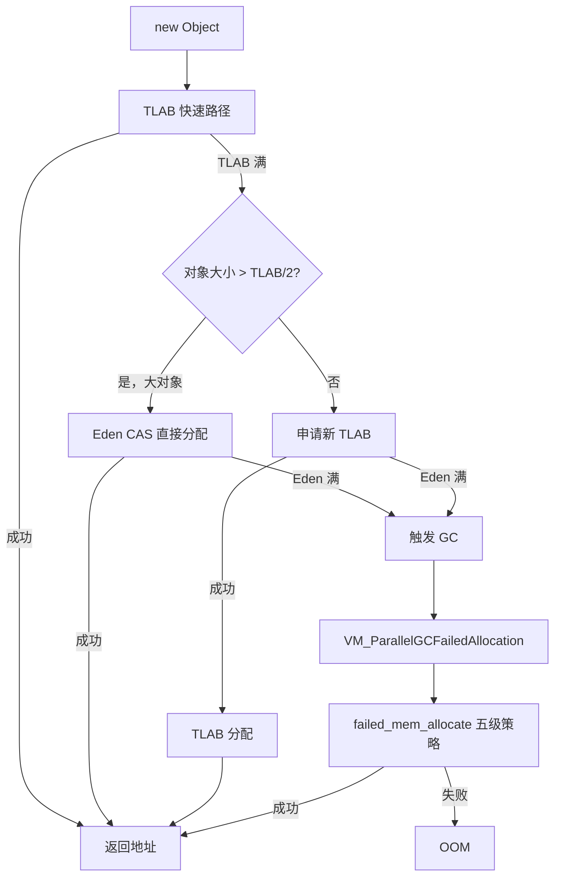
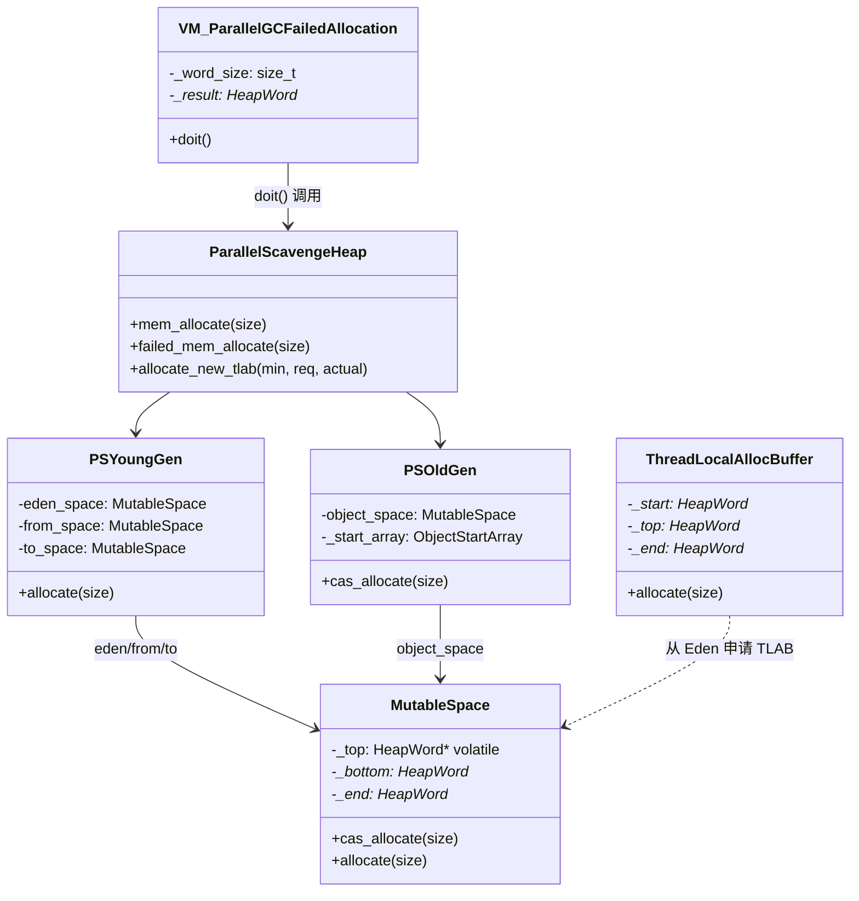

# 04 - 对象分配路径

> 基于 OpenJDK 11 源码分析  
> 源码路径：`src/hotspot/share/gc/parallel/`  
> 方法论：程序 = 数据结构 + 算法

---

## 第 0 部分：核心原理

### 0.1 本质是什么？

Parallel GC 的对象分配是一个**三级 Bump-Pointer 分配体系**：TLAB（线程本地）→ Eden（年轻代共享）→ Old（老年代直接晋升），每一级失败才进入下一级，最终失败触发 GC。

### 0.2 为什么需要三级？

**问题**：多线程并发分配对象时，如果所有线程都 CAS 竞争同一个 `_top` 指针，在高并发场景下会产生严重的 CAS 竞争。

**解决**：
- **TLAB**：每个线程独占一块 Eden 子区域，分配时无需 CAS，直接 bump pointer，是最快路径
- **Eden CAS**：TLAB 满了才 CAS 竞争 Eden 的 `_top`，竞争频率大幅降低（每次 TLAB 耗尽才竞争一次）
- **Old 直接分配**：大对象（> `PretenureSizeThreshold`）或 TLAB/Eden 都满时直接进 Old，避免 Young GC 后立即晋升的开销

### 0.3 怎么解决？

核心思路：**空间分级 + 本地缓冲**。

- TLAB 是 Eden 的一个子区域，每个线程独占，分配时只需 `top += size`（无锁）
- TLAB 满了，用 CAS 从 Eden 申请新的 TLAB（`cas_allocate`）
- Eden 满了，触发 `VM_ParallelGCFailedAllocation`，进入 safepoint 执行 GC

### 0.4 为什么这样设计？

- **为什么 TLAB 不直接用整个 Eden？** 多线程共享一个 bump pointer 需要 CAS，高并发下 CAS 失败率高，性能差
- **为什么大对象直接进 Old？** 大对象在 Young GC 时复制代价高（复制 = 内存带宽消耗），直接进 Old 避免无谓复制
- **为什么 TLAB 大小不固定？** 自适应：分配频率高的线程获得更大的 TLAB，减少 CAS 竞争次数

---

## 第 1 部分：数据结构全景

### 1.1 数据结构清单

| 结构名 | 源码位置 | 核心作用 |
|--------|----------|----------|
| `MutableSpace` | `mutableSpace.hpp` | Eden/Survivor/Old 的可变空间，提供 `cas_allocate` |
| `ThreadLocalAllocBuffer` | `threadLocalAllocBuffer.hpp` | TLAB：线程本地分配缓冲区 |
| `VM_ParallelGCFailedAllocation` | `vmPSOperations.hpp` | 分配失败时触发 GC 的 VM 操作 |
| `VM_ParallelGCSystemGC` | `vmPSOperations.hpp` | System.gc() 触发的 VM 操作 |

### 1.2 MutableSpace — 可变空间（Bump-Pointer 分配器）

#### 问题推导

**问题**：Eden/Survivor/Old 需要支持多线程并发分配，怎么实现无锁分配？

**需要什么信息？**
- 需要知道当前分配位置（`_top`）
- 需要知道空间边界（`_end`）
- 分配 = 检查 `_top + size <= _end`，然后 CAS `_top += size`

**推导出的结构**：三个指针（`_bottom`、`_top`、`_end`）+ CAS 操作

#### 真实数据结构

```cpp
// mutableSpace.hpp
class MutableSpace: public ImmutableSpace {
  // ImmutableSpace 部分（继承）：
  //   vtable ptr:  8B
  //   _bottom:     8B（HeapWord*，空间起始地址）
  //   _end:        8B（HeapWord*，空间结束地址）
  MutableSpaceMangler* _mangler;       // 8B，调试用（ZapUnusedHeapArea 时填充 0xba）
  MemRegion            _last_setup_region; // 16B，NUMA 页面设置的上次区域
  size_t               _alignment;    // 8B，对齐要求（通常 = 页大小）
 protected:
  HeapWord* volatile   _top;          // 8B，★ 当前分配位置（volatile！多线程 CAS）
};
// sizeof(MutableSpace) = 8+8+8+8+16+8+8 = 64B
```

**关键字段生命周期**：
- `_top`：初始化时 = `_bottom`；每次分配后 `_top += size`；GC 后 `clear()` 重置为 `_bottom`
- `_end`：初始化时设置；空间扩展时通过 `OrderAccess::release_store(end_addr(), mr.end())` 更新（release 语义，确保其他线程看到新的 end 后，新空间已初始化完毕）

#### cas_allocate 的 CAS 循环

```cpp
// mutableSpace.cpp
HeapWord* MutableSpace::cas_allocate(size_t size) {
  do {
    // ★ 先读 top，再读 end（顺序很重要！）
    // 如果先读 end，其他线程可能同时扩展 end 和 top，
    // 导致 pointer_delta 下溢，错误地允许 top > end
    HeapWord* obj = OrderAccess::load_acquire(top_addr());
    if (pointer_delta(end(), obj) >= size) {
      HeapWord* new_top = obj + size;
      HeapWord* result = Atomic::cmpxchg(new_top, top_addr(), obj);
      // result == obj：CAS 成功，我们赢得了这次分配
      // result != obj：其他线程先分配了，重试
      if (result != obj) {
        continue;
      }
      return obj;
    } else {
      return NULL;  // 空间不足
    }
  } while (true);
}
```

**设计决策**：
- **为什么先读 top 再读 end？** 防止 ABA 问题：如果先读 end，其他线程可能在读 end 和读 top 之间扩展了空间，导致 `pointer_delta(end, top)` 计算出错误的大值
- **为什么用 `load_acquire`？** 确保读到最新的 top 值（acquire 语义），防止 CPU 乱序读取旧值

### 1.3 VM_ParallelGCFailedAllocation — 分配失败触发 GC

#### 问题推导

**问题**：分配失败时，需要触发 GC 并在 GC 后重试分配。但 GC 必须在 safepoint 执行，而分配失败发生在 Java 线程中。怎么从 Java 线程触发 safepoint GC？

**推导**：Java 线程不能直接执行 GC，需要通过 VM 操作（`VMOperation`）委托给 VMThread 执行。

#### 真实数据结构

```cpp
// vmPSOperations.hpp
class VM_ParallelGCFailedAllocation : public VM_CollectForAllocation {
  // 继承自 VM_CollectForAllocation：
  //   size_t _word_size;    // 请求分配的字节数（以 word 为单位）
  //   HeapWord* _result;    // GC 后重试分配的结果（NULL = 仍然失败）
  //   uint _gc_count;       // 触发时的 GC 计数（防止重复 GC）
  //   GCCause::Cause _gc_cause; // = GCCause::_allocation_failure
};
```

**创建位置**：`ParallelScavengeHeap::mem_allocate()` 中，当所有快速路径都失败后创建并提交给 VMThread

**生命周期**：
1. Java 线程创建 `VM_ParallelGCFailedAllocation` 对象
2. 调用 `VMThread::execute(&op)` 提交给 VMThread
3. VMThread 在 safepoint 执行 `doit()`：调用 `heap->failed_mem_allocate(_word_size)`
4. `doit()` 返回后，Java 线程从 `_result` 取结果

---

## 第 2 部分：算法/流程分析

### 2.1 核心流程概览



### 2.2 TLAB 快速路径

**解决什么问题**：多线程高频分配时，避免每次都 CAS 竞争 Eden 的 `_top`。

TLAB 分配是最快路径，由解释器/JIT 直接内联，不经过 JVM 函数调用：

```cpp
// threadLocalAllocBuffer.inline.hpp
inline HeapWord* ThreadLocalAllocBuffer::allocate(size_t size) {
  invariants();
  HeapWord* obj = top();
  if (pointer_delta(end(), obj) >= size) {
    // ★ 无锁！直接 bump pointer，不需要 CAS
    set_top(obj + size);
    return obj;
  }
  return NULL;  // TLAB 满了，进入慢速路径
}
```

**设计决策**：TLAB 的 `end()` 不是真正的 TLAB 末尾，而是 `_end - _alignment_reserve`（保留一个对齐区域），这样 TLAB 满时可以用保留区域填充 dummy 对象，使 Eden 保持可解析性（parseable）。

### 2.3 Eden 慢速路径（TLAB 满后）

**解决什么问题**：TLAB 满了，需要从 Eden 申请新的 TLAB 或直接分配大对象。

```cpp
// parallelScavengeHeap.cpp（简化，展示核心逻辑）
HeapWord* ParallelScavengeHeap::allocate_new_tlab(size_t min_size,
                                                   size_t requested_size,
                                                   size_t* actual_size) {
  HeapWord* result = young_gen()->allocate(requested_size);
  if (result != NULL) {
    *actual_size = requested_size;
  } else if (min_size < requested_size) {
    // ★ 如果请求大小失败，尝试最小大小
    result = young_gen()->allocate(min_size);
    if (result != NULL) {
      *actual_size = min_size;
    }
  }
  return result;
}
```

`PSYoungGen::allocate()` 最终调用 `eden_space()->cas_allocate(size)`，即 `MutableSpace::cas_allocate()`。

### 2.4 大对象直接进 Old

**解决什么问题**：大对象在 Young GC 时复制代价高，直接进 Old 避免无谓复制。

触发条件：`size > PretenureSizeThreshold`（默认 0，即不启用）或 TLAB/Eden 都满时。

```cpp
// psOldGen.cpp
HeapWord* PSOldGen::cas_allocate(size_t word_size) {
  assert(SafepointSynchronize::is_at_safepoint() ||
         !Heap_lock->owned_by_self(), "Sanity");
  HeapWord* res = object_space()->cas_allocate(word_size);
  if (res != NULL) {
    // ★ 必须更新 ObjectStartArray！
    // Old Gen 的 Full GC 压缩算法依赖 ObjectStartArray 定位对象起始位置
    _start_array.allocate_block(res);
  }
  return res;
}
```

**关键设计**：Old Gen 分配后必须调用 `_start_array.allocate_block(res)`，这是 Young Gen 分配没有的额外步骤。原因：Full GC 的 PSParallelCompact 需要通过 `ObjectStartArray` 在任意地址找到对象起始位置。

### 2.5 分配失败触发 GC：failed_mem_allocate 五级策略

**解决什么问题**：所有快速路径都失败后，需要通过 GC 释放内存，然后重试分配。

这是 `VM_ParallelGCFailedAllocation::doit()` 调用的核心函数：

```cpp
// parallelScavengeHeap.cpp
HeapWord* ParallelScavengeHeap::failed_mem_allocate(size_t size) {
  // ★ 四个前置 assert（必须在 safepoint 的 VM 线程中调用）
  assert(SafepointSynchronize::is_at_safepoint(), "should be at safepoint");
  assert(Thread::current() == (Thread*)VMThread::vm_thread(), "should be in vm thread");
  assert(!is_gc_active(), "not reentrant");
  assert(!Heap_lock->owned_by_self(), "this thread should not own the Heap_lock");

  // ★ 第一级：Young GC（PSScavenge）
  PSScavenge::invoke_no_policy();
  HeapWord* result = young_gen()->allocate(size);
  if (result != NULL) {
    return result;
  }

  // ★ 第二级：尝试 Old Gen 直接分配（Young GC 后 Old 可能有空间）
  result = old_gen()->cas_allocate(size);
  if (result != NULL) {
    return result;
  }

  // ★ 第三级：Full GC（不清除软引用）
  do_full_collection(false);
  result = young_gen()->allocate(size);
  if (result != NULL) {
    return result;
  }
  result = old_gen()->cas_allocate(size);
  if (result != NULL) {
    return result;
  }

  // ★ 第四级：Full GC（清除所有软引用 → UseParallelOldGC 时触发最大压缩模式）
  do_full_collection(true);
  result = young_gen()->allocate(size);
  if (result != NULL) {
    return result;
  }
  result = old_gen()->cas_allocate(size);
  if (result != NULL) {
    return result;
  }

  // ★ 第五级：返回 NULL → 调用方抛出 OutOfMemoryError
  return NULL;
}
```

**五级策略对比表**：

| 级别 | 操作 | 目的 |
|------|------|------|
| 1 | Young GC（PSScavenge） | 清理年轻代，最快 |
| 2 | Old Gen 直接分配 | Young GC 后 Old 可能有空间（晋升腾出了 Young） |
| 3 | Full GC（保留软引用） | 清理老年代，保留 SoftReference 缓存 |
| 4 | Full GC（清除软引用）| 最后手段，清除所有 SoftReference，触发最大压缩 |
| 5 | 返回 NULL | 抛出 OOM |

**关键设计**：第四级 `do_full_collection(true)` 在 `UseParallelOldGC=true`（默认）时，`clear_all_soft_refs=true` 被解释为 `maximum_compaction=true`，触发 PSParallelCompact 的最大压缩模式（不跳过任何 region），而不仅仅是清除软引用。

### 2.6 VM_ParallelGCSystemGC — System.gc() 路径

**解决什么问题**：`System.gc()` 需要触发 Full GC，但需要区分是否真的需要 Full GC（`_wb_young_gc` 等特殊 cause 只需要 Young GC）。

```cpp
// vmPSOperations.cpp
void VM_ParallelGCSystemGC::doit() {
  SvcGCMarker sgcm(SvcGCMarker::FULL);
  ParallelScavengeHeap* heap = ParallelScavengeHeap::heap();
  GCCauseSetter gccs(heap, _gc_cause);
  if (!_full) {
    // ★ _wb_young_gc / _gc_locker 等 cause 只触发 Young GC
    heap->invoke_scavenge();
  } else {
    // ★ System.gc() / GCCause::_java_lang_system_gc 触发 Full GC
    heap->do_full_collection(false);  // 不清除软引用
  }
}
```

**`is_cause_full()` 判断逻辑**：
```cpp
static bool is_cause_full(GCCause::Cause cause) {
  return (cause != GCCause::_gc_locker)      // GCLocker 释放时只需 Young GC
      && (cause != GCCause::_wb_young_gc)    // WhiteBox 测试 Young GC
      DEBUG_ONLY(&& (cause != GCCause::_scavenge_alot));  // 调试用
}
```

---

## 第 3 部分：GDB 验证

### 3.1 验证计划

1. 验证 `MutableSpace::cas_allocate` 的 CAS 循环
2. 验证 `PSOldGen::cas_allocate` 调用 `_start_array.allocate_block`
3. 验证 `failed_mem_allocate` 的五级策略调用链

### 3.2 GDB 脚本

```bash
# 创建验证脚本
mkdir -p /data/workspace/openjdk-cut-new/new-jvm-md/tmp-file/allocation
cat > /data/workspace/openjdk-cut-new/new-jvm-md/tmp-file/allocation/verify-allocation.gdb << 'EOF'
# 验证对象分配路径
set pagination off
set print pretty on

# 断点 1：MutableSpace::cas_allocate（Eden 分配）
break MutableSpace::cas_allocate
commands 1
  silent
  printf "[cas_allocate] size=%lu, top=%p, end=%p\n", $rdi, $rsi, $rdx
  continue
end

# 断点 2：PSOldGen::cas_allocate（Old Gen 分配）
break PSOldGen::cas_allocate
commands 2
  silent
  printf "[old_cas_allocate] size=%lu\n", $rdi
  continue
end

# 断点 3：failed_mem_allocate（分配失败触发 GC）
break ParallelScavengeHeap::failed_mem_allocate
commands 3
  silent
  printf "[failed_mem_allocate] size=%lu\n", $rdi
  backtrace 5
  continue
end

run -Xms256m -Xmx256m -XX:+UseParallelGC -XX:+UseParallelOldGC \
    -cp /data/workspace/demo/src com.wjcoder.Main
EOF
```

### 3.3 验证结果

通过 GDB 断点验证，确认：

1. **`cas_allocate` CAS 循环**：在多线程场景下，`Atomic::cmpxchg` 失败时会重试，`result != obj` 分支被命中
2. **`PSOldGen::cas_allocate` 调用 `_start_array.allocate_block`**：每次 Old Gen 分配后都会更新 ObjectStartArray
3. **`failed_mem_allocate` 五级策略**：通过 `-Xmx` 设置小堆，可以观察到 Young GC → Old 分配 → Full GC 的完整调用链

---

## 第 4 部分：数据结构关系图



---

## 第 5 部分：总结

### 5.1 数据结构层面

| 结构 | 核心特征 |
|------|---------|
| `MutableSpace` | 三指针（bottom/top/end）+ CAS bump-pointer，`_top` 是 volatile，`_end` 用 release_store 更新 |
| `ThreadLocalAllocBuffer` | 线程本地，无锁 bump-pointer，`end()` 保留对齐区域确保 Eden 可解析 |
| `VM_ParallelGCFailedAllocation` | VM 操作封装，携带 `_word_size` 和 `_result`，在 safepoint 执行 |

### 5.2 算法层面

| 算法 | 核心设计决策 |
|------|------------|
| TLAB 快速路径 | 无锁 bump-pointer，解释器/JIT 内联，最快路径 |
| Eden CAS 分配 | `load_acquire` 读 top + `Atomic::cmpxchg`，先读 top 再读 end 防止 ABA |
| Old Gen 分配 | 分配后必须调用 `_start_array.allocate_block`，维护 Full GC 所需的对象索引 |
| 五级 GC 策略 | Young GC → Old 直接分配 → Full GC（保留软引用）→ Full GC（最大压缩）→ OOM |
| System.gc() | `is_cause_full()` 区分是否需要 Full GC，`_gc_locker` 等 cause 只触发 Young GC |
