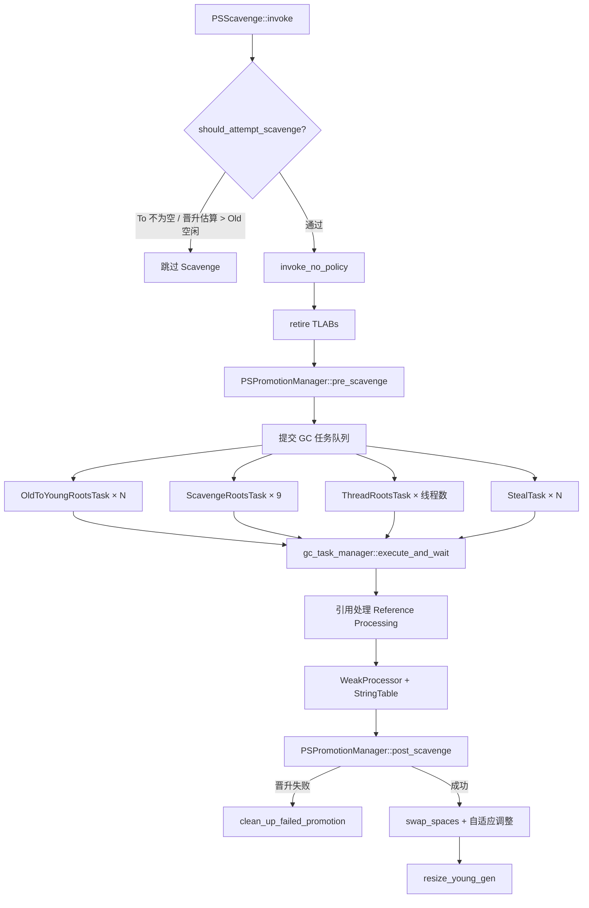
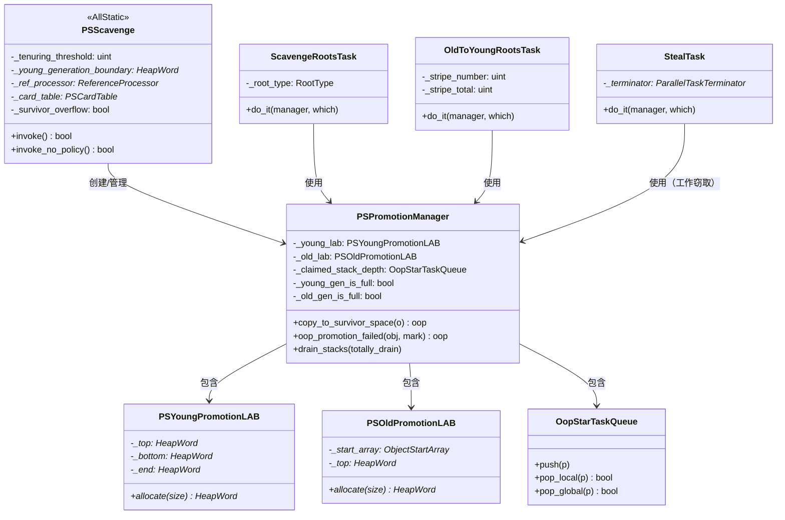

# 05 - Young GC（PSScavenge）完整流程

> 基于 OpenJDK 11 源码分析  
> 源码路径：`src/hotspot/share/gc/parallel/`  
> 方法论：程序 = 数据结构 + 算法

---

## 第 0 部分：核心原理

### 0.1 本质是什么？

PSScavenge 是 Parallel GC 的 Young GC 实现，本质是一个**并行复制式 GC（Parallel Copying GC）**：多个 GC 线程并行地将 Eden + From 中的存活对象复制到 To 空间（或晋升到 Old），然后清空 Eden + From。

### 0.2 为什么需要？

**问题**：Eden 满了，新对象无法分配。需要快速回收 Eden 中的垃圾对象，同时保留存活对象。

**为什么用复制算法？**
- 年轻代对象死亡率高（>90%），存活对象少，复制代价小
- 复制后空间连续，无碎片，下次分配直接 bump pointer
- 不需要标记-清除的两遍扫描，一遍复制即可完成

**为什么并行？**
- Serial GC 的 Young GC 是单线程的，在多核机器上浪费 CPU
- Parallel GC 用 `ParallelGCThreads` 个线程并行扫描根和复制对象

### 0.3 怎么解决？

核心思路：**根扫描 + 对象复制 + 工作窃取**。

1. **根扫描**：多个 GC 线程并行扫描所有 GC Roots（JNI、线程栈、Old→Young 引用等），将根直接引用的年轻代对象复制到 To 空间
2. **传递闭包**：复制对象后，将其字段中的年轻代引用推入工作队列（`OopStarTaskQueue`）
3. **工作窃取**：空闲线程从其他线程的队列中窃取工作，实现负载均衡
4. **晋升**：年龄 >= `tenuring_threshold` 的对象直接复制到 Old Gen

### 0.4 为什么这样设计？

- **为什么用工作窃取而不是静态分区？** 对象图的形状不可预测，静态分区会导致负载不均衡；工作窃取是动态的，空闲线程自动帮忙
- **为什么 PLAB（Promotion LAB）？** 多线程同时向 To 空间/Old Gen 分配，如果每次都 CAS 竞争，性能差；PLAB 让每个线程有自己的本地缓冲区，减少 CAS 竞争
- **为什么 To 空间必须为空才能 Scavenge？** 复制算法需要一个干净的目标空间；如果 To 不为空，无法保证复制后的对象不覆盖存活对象

---

## 第 1 部分：数据结构全景

### 1.1 数据结构清单

| 结构名 | 源码位置 | 核心作用 |
|--------|----------|----------|
| `PSScavenge` | `psScavenge.hpp` | Young GC 的静态控制器（AllStatic 类） |
| `PSPromotionManager` | `psPromotionManager.hpp` | 每个 GC 线程的对象复制管理器 |
| `PSYoungPromotionLAB` | `psPromotionLAB.hpp` | To 空间的线程本地分配缓冲区 |
| `PSOldPromotionLAB` | `psPromotionLAB.hpp` | Old Gen 的线程本地分配缓冲区 |
| `OopStarTaskQueue` | `taskqueue.hpp` | 每个线程的工作队列（存放待处理的 oop* 引用） |
| `ScavengeRootsTask` | `psTasks.hpp` | 扫描特定类型 GC Root 的并行任务 |
| `ThreadRootsTask` | `psTasks.hpp` | 扫描单个线程根的并行任务 |
| `OldToYoungRootsTask` | `psTasks.hpp` | 扫描 Old→Young 跨代引用的并行任务 |
| `StealTask` | `psTasks.hpp` | 工作窃取任务（空闲线程执行） |
| `PreservedMarks` | `preservedMarks.hpp` | 晋升失败时保存被覆盖的 mark word |

### 1.2 PSScavenge — Young GC 静态控制器

#### 问题推导

**问题**：Young GC 需要全局状态（引用处理器、卡表、晋升阈值等），这些状态在多次 GC 之间持久存在。怎么管理这些全局状态？

**推导**：用 `AllStatic` 类（所有成员都是 static），避免创建实例，全局唯一。

#### 真实数据结构

```cpp
// psScavenge.hpp
class PSScavenge: AllStatic {
  // ★ 核心状态字段（全部 static）
  static HeapWord*          _to_space_top_before_gc;  // GC 前 To 空间的 top（防止重扫）
  static int                _consecutive_skipped_scavenges; // 连续跳过的 Scavenge 次数
  static SpanSubjectToDiscoveryClosure _span_based_discoverer; // 引用发现范围（= 年轻代 reserved）
  static ReferenceProcessor* _ref_processor;          // 引用处理器（软/弱/虚引用）
  static PSIsAliveClosure    _is_alive_closure;        // 判断对象是否存活的闭包
  static PSCardTable*        _card_table;              // 卡表缓存（快速访问）
  static bool                _survivor_overflow;       // To 空间是否溢出
  static uint                _tenuring_threshold;      // 晋升阈值（年龄 >= 此值则晋升）
  static elapsedTimer        _accumulated_time;        // 累计 GC 时间
  static STWGCTimer          _gc_timer;                // GC 计时器
  static ParallelScavengeTracer _gc_tracer;            // GC 事件追踪
  static HeapWord*           _young_generation_boundary;           // 年轻代起始地址
  static uintptr_t           _young_generation_boundary_compressed; // 压缩 oop 版本
  static CollectorCounters*  _counters;                // 性能计数器
};
```

**关键字段生命周期**：
- `_tenuring_threshold`：初始化时由 `InitialTenuringThreshold` 设置；每次 Young GC 后由 `PSAdaptiveSizePolicy::compute_survivor_space_size_and_threshold()` 重新计算
- `_young_generation_boundary`：初始化时 = `eden_space()->bottom()`；边界移动时（`UseAdaptiveGCBoundary`）通过 `set_young_generation_boundary()` 更新
- `_survivor_overflow`：每次 GC 开始时重置为 false；To 空间满时由 `PSPromotionManager::flush_labs()` 设置为 true

**`is_obj_in_young()` 的优化**：
```cpp
// psScavenge.hpp
inline static bool is_obj_in_young(oop o) {
  return (HeapWord*)o >= _young_generation_boundary;
  // ★ 只检查下界！因为堆内的对象要么在 Young（>= boundary），要么在 Old（< boundary）
  // 不需要检查上界，因为调用者已经确认对象在堆内
}
inline static bool is_obj_in_young(narrowOop o) {
  return (uintptr_t)o >= _young_generation_boundary_compressed;
  // ★ 压缩 oop 版本：直接比较压缩后的整数值，避免解压缩
}
```

### 1.3 PSPromotionManager — 每线程对象复制管理器

#### 问题推导

**问题**：多个 GC 线程并行复制对象，每个线程需要：
1. 自己的 To 空间分配缓冲区（避免 CAS 竞争）
2. 自己的 Old Gen 分配缓冲区（避免 CAS 竞争）
3. 自己的工作队列（存放待处理的引用）
4. 晋升失败时保存被覆盖的 mark word

**推导**：每个 GC 线程一个 `PSPromotionManager` 实例，用 `PaddedEnd` 填充到 cache line 边界，避免 false sharing。

#### 真实数据结构

```cpp
// psPromotionManager.hpp
class PSPromotionManager {
  // ★ 静态字段（全局共享）
  static PaddedEnd<PSPromotionManager>* _manager_array; // 所有线程的 PM 数组
  static OopStarTaskQueueSet*  _stack_array_depth;      // 所有线程的工作队列集合（用于工作窃取）
  static PreservedMarksSet*    _preserved_marks_set;    // 所有线程的 preserved marks 集合
  static PSOldGen*             _old_gen;                // Old Gen 引用（共享）
  static MutableSpace*         _young_space;            // To 空间引用（共享，每次 GC 更新）

  // ★ 实例字段（每线程独立）
  PSYoungPromotionLAB  _young_lab;          // To 空间的 PLAB
  PSOldPromotionLAB    _old_lab;            // Old Gen 的 PLAB
  bool                 _young_gen_is_full;  // To 空间是否已满（满了就不再尝试）
  bool                 _old_gen_is_full;    // Old Gen 是否已满（满了就晋升失败）
  OopStarTaskQueue     _claimed_stack_depth; // ★ 深度优先工作队列（主队列）
  OverflowTaskQueue<oop, mtGC> _claimed_stack_breadth; // 广度优先溢出队列（备用）
  bool                 _totally_drain;      // 是否完全排空队列（单线程时 = true）
  uint                 _target_stack_size;  // 部分排空时的目标队列大小
  uint                 _array_chunk_size;   // 大数组分块大小（= ParGCArrayScanChunk）
  uint                 _min_array_size_for_chunking; // 触发分块的最小数组大小（= 1.5 * chunk_size）
  PreservedMarks*      _preserved_marks;    // 晋升失败时保存 mark word
  PromotionFailedInfo  _promotion_failed_info; // 晋升失败统计信息
};
```

**关键设计：`PaddedEnd` 防止 false sharing**：
```cpp
// psPromotionManager.cpp
_manager_array = PaddedArray<PSPromotionManager, mtGC>::create_unfreeable(promotion_manager_num);
// ★ PaddedEnd 在每个 PSPromotionManager 后面填充字节，使其占满整数个 cache line（64B）
// 防止两个线程的 PM 共享同一个 cache line，避免 false sharing 导致的性能下降
```

**数组大小**：`ParallelGCThreads + 1`（最后一个是 VMThread 专用，不参与工作窃取）

### 1.4 PSPromotionLAB — 晋升本地分配缓冲区

#### 问题推导

**问题**：多个 GC 线程同时向 To 空间和 Old Gen 分配对象，如果每次都 CAS 竞争，性能差。

**推导**：每个线程预先从 To 空间/Old Gen 申请一块内存（PLAB），在 PLAB 内部直接 bump pointer，只有 PLAB 满了才 CAS 申请新的 PLAB。

#### 真实数据结构

```cpp
// psPromotionLAB.hpp
class PSPromotionLAB : public CHeapObj<mtGC> {
  static size_t filler_header_size;  // dummy 对象头大小（用于填充剩余空间）
  enum LabState { needs_flush, flushed, zero_size };
  HeapWord* _top;     // 当前分配位置
  HeapWord* _bottom;  // PLAB 起始地址
  HeapWord* _end;     // PLAB 结束地址
  LabState  _state;   // 状态（需要 flush / 已 flush / 大小为 0）
};
// sizeof(PSPromotionLAB) = 8+8+8+4+4(padding) = 32B（无 vtable，无虚函数）

class PSYoungPromotionLAB : public PSPromotionLAB {
  // 无额外字段，只是 To 空间版本
  // allocate() 直接 bump pointer，不更新 ObjectStartArray
};

class PSOldPromotionLAB : public PSPromotionLAB {
  ObjectStartArray* _start_array;  // ★ 必须更新 ObjectStartArray！
  // allocate() 在 bump pointer 后调用 _start_array->allocate_block(obj)
};
```

**`PSOldPromotionLAB::allocate()` 的关键实现**：
```cpp
// psPromotionLAB.hpp
HeapWord* PSOldPromotionLAB::allocate(size_t size) {
  HeapWord* obj = top();
  HeapWord* new_top = obj + size;
  if (new_top > obj && new_top <= end()) {
    set_top(new_top);
    _start_array->allocate_block(obj);  // ★ 必须！Full GC 依赖此索引
    return obj;
  }
  return NULL;
}
```

### 1.5 OopStarTaskQueue — 工作队列

**问题推导**：GC 线程复制对象后，需要处理新对象的字段（可能还有年轻代引用需要复制）。这些待处理的引用需要一个队列来存储。

```cpp
// taskqueue.hpp（简化）
class OopStarTaskQueue : public OverflowTaskQueue<StarTask, mtGC, TASKQUEUE_SIZE> {
  // StarTask = oop* 或 narrowOop*（用低位 bit 区分）
  // 内部是一个环形数组（deque），支持：
  //   push(p)：本线程推入（从尾部）
  //   pop_local(p)：本线程弹出（从尾部，LIFO，深度优先）
  //   pop_global(p)：其他线程窃取（从头部，FIFO）
};
```

**大数组分块处理**：当对象是大数组（`size > _min_array_size_for_chunking`）时，不一次性处理所有元素，而是分块推入队列：
```cpp
// 用 PS_CHUNKED_ARRAY_OOP_MASK (0x2) 标记分块数组的 oop*
// 队列中存放的是 mask_chunked_array_oop(old)，即 from-space 中数组的地址 | 0x2
// process_popped_location_depth() 检测到 mask 后调用 process_array_chunk()
```

### 1.6 GC 任务类型

| 任务类 | 字段 | 作用 |
|--------|------|------|
| `ScavengeRootsTask` | `_root_type`（枚举） | 扫描特定类型的 GC Root（universe/jni_handles/threads/...） |
| `ThreadRootsTask` | `_thread`（Thread*） | 扫描单个线程的根（线程栈 + JNI 局部引用） |
| `OldToYoungRootsTask` | `_old_gen`, `_gen_top`, `_stripe_number`, `_stripe_total` | 扫描 Old→Young 跨代引用（条带化并行） |
| `StealTask` | `_terminator`（ParallelTaskTerminator*） | 工作窃取 + 终止检测 |

**`OldToYoungRootsTask` 的条带化设计**：
```
Old Gen 被分成多个 slice，每个 slice 内有 stripe_total 个 stripe
每个 OldToYoungRootsTask 负责一个 stripe（跨所有 slice）

+===============+  slice 0
|  stripe 0     |  ← OldToYoungRootsTask(stripe=0)
+---------------+
|  stripe 1     |  ← OldToYoungRootsTask(stripe=1)
+===============+  slice 1
|  stripe 0     |  ← 同一个 task 继续处理
+---------------+
|  stripe 1     |
+===============+  ...
```

这样即使 GC 线程数 < stripe 数，每个 task 也能覆盖所有 slice 中的对应 stripe，不会遗漏。

---

## 第 2 部分：算法/流程分析

### 2.1 核心流程概览



### 2.2 PSScavenge::invoke() — 策略层入口

**解决什么问题**：在执行 Young GC 之前，判断是否值得执行（避免无效 GC），以及 Young GC 后是否需要 Full GC。

```cpp
// psScavenge.cpp
bool PSScavenge::invoke() {
  assert(SafepointSynchronize::is_at_safepoint(), "should be at safepoint");
  assert(Thread::current() == (Thread*)VMThread::vm_thread(), "should be in vm thread");
  assert(!ParallelScavengeHeap::heap()->is_gc_active(), "not reentrant");

  ParallelScavengeHeap* const heap = ParallelScavengeHeap::heap();
  PSAdaptiveSizePolicy* policy = heap->size_policy();
  IsGCActiveMark mark;  // ★ RAII：设置 is_gc_active = true，析构时恢复

  const bool scavenge_done = PSScavenge::invoke_no_policy();
  // ★ 判断是否需要 Full GC：
  //   1. Young GC 失败（晋升失败）
  //   2. 或者 Old Gen 空闲空间不足（policy->should_full_GC）
  const bool need_full_gc = !scavenge_done ||
    policy->should_full_GC(heap->old_gen()->free_in_bytes());
  bool full_gc_done = false;

  if (need_full_gc) {
    GCCauseSetter gccs(heap, GCCause::_adaptive_size_policy);
    SoftRefPolicy* srp = heap->soft_ref_policy();
    const bool clear_all_softrefs = srp->should_clear_all_soft_refs();

    if (UseParallelOldGC) {
      full_gc_done = PSParallelCompact::invoke_no_policy(clear_all_softrefs);
    } else {
      full_gc_done = PSMarkSweepProxy::invoke_no_policy(clear_all_softrefs);
    }
  }

  return full_gc_done;
}
```

**设计决策**：
- `IsGCActiveMark` 是 RAII 对象，确保 `is_gc_active` 在 GC 结束后一定被清除，即使发生异常
- `should_full_GC()` 检查 Old Gen 空闲空间：如果 Young GC 后 Old Gen 仍然不够，立即触发 Full GC，避免下次分配失败时再触发

### 2.3 should_attempt_scavenge() — 预判是否值得 GC

**解决什么问题**：如果 To 空间不为空，或者预估晋升量超过 Old Gen 空闲空间，Young GC 必然失败，不如直接跳过。

```cpp
// psScavenge.cpp
bool PSScavenge::should_attempt_scavenge() {
  ParallelScavengeHeap* heap = ParallelScavengeHeap::heap();
  PSYoungGen* young_gen = heap->young_gen();
  PSOldGen* old_gen = heap->old_gen();

  // ★ 条件 1：To 空间必须为空（复制算法的前提）
  if (!young_gen->to_space()->is_empty()) {
    _consecutive_skipped_scavenges++;
    return false;
  }

  // ★ 条件 2：预估晋升量 < Old Gen 空闲空间
  PSAdaptiveSizePolicy* policy = heap->size_policy();
  size_t avg_promoted = (size_t) policy->padded_average_promoted_in_bytes();
  // padded_average = average * (1 + padding_fraction)，比平均值稍大，留有余量
  size_t promotion_estimate = MIN2(avg_promoted, young_gen->used_in_bytes());
  bool result = promotion_estimate < old_gen->free_in_bytes();

  if (result) {
    _consecutive_skipped_scavenges = 0;
  } else {
    _consecutive_skipped_scavenges++;
  }
  return result;
}
```

**设计决策**：`padded_average_promoted_in_bytes()` 使用带 padding 的平均值（比实际平均值大），是保守估计，宁可多触发 Full GC 也不要让 Young GC 中途晋升失败。

### 2.4 invoke_no_policy() — Young GC 核心执行（7 个阶段）

**解决什么问题**：执行完整的 Young GC，包括根扫描、对象复制、引用处理、空间交换。

**整体阶段划分**：

| 阶段 | 内容 |
|------|------|
| Phase 1 | 前置准备（retire TLABs、清空 To 空间、初始化 PM） |
| Phase 2 | 提交并行任务（OldToYoung + ScavengeRoots + ThreadRoots + Steal） |
| Phase 3 | 引用处理（SoftRef/WeakRef/PhantomRef） |
| Phase 4 | WeakProcessor + StringTable 清理 |
| Phase 5 | post_scavenge（flush PLAB、检测晋升失败） |
| Phase 6 | 晋升失败处理 或 空间交换 + 自适应调整 |
| Phase 7 | 收尾（更新计数器、打印日志） |

#### Phase 1：前置准备

```cpp
// psScavenge.cpp（invoke_no_policy 节选）
// ★ 1.1 退休所有 TLAB（将 TLAB 剩余空间填充 dummy 对象，使 Eden 可解析）
heap->accumulate_statistics_all_tlabs();
heap->ensure_parsability(true);  // retire TLABs

// ★ 1.2 清空 To 空间（复制算法的目标空间必须为空）
young_gen->to_space()->clear(SpaceDecorator::Mangle);

// ★ 1.3 保存 To 空间的 top（用于防止重扫已复制的对象）
save_to_space_top_before_gc();

// ★ 1.4 初始化引用处理器
reference_processor()->enable_discovery();
reference_processor()->setup_policy(false);  // false = 不总是清除软引用

// ★ 1.5 初始化所有 PSPromotionManager
PSPromotionManager::pre_scavenge();
// pre_scavenge() 做了什么：
//   - 更新 _young_space = to_space()（每次 GC 后 To 空间可能变化）
//   - 重置所有 PM 的 PLAB（大小为 0，按需申请）
//   - 重置 _young_gen_is_full / _old_gen_is_full 标志
```

#### Phase 2：提交并行任务

```cpp
// psScavenge.cpp（invoke_no_policy 节选）
GCTaskQueue* q = GCTaskQueue::create();

// ★ 2.1 Old→Young 跨代引用扫描（条带化并行）
if (!old_gen->object_space()->is_empty()) {
  uint stripe_total = active_workers;
  for(uint i=0; i < stripe_total; i++) {
    q->enqueue(new OldToYoungRootsTask(old_gen, old_top, i, stripe_total));
  }
}

// ★ 2.2 各类 GC Root 扫描（每种 Root 一个任务）
q->enqueue(new ScavengeRootsTask(ScavengeRootsTask::universe));
q->enqueue(new ScavengeRootsTask(ScavengeRootsTask::jni_handles));
// ★ 2.3 线程根并行扫描（每个线程一个任务）
PSAddThreadRootsTaskClosure cl(q);
Threads::java_threads_and_vm_thread_do(&cl);
q->enqueue(new ScavengeRootsTask(ScavengeRootsTask::object_synchronizer));
q->enqueue(new ScavengeRootsTask(ScavengeRootsTask::management));
q->enqueue(new ScavengeRootsTask(ScavengeRootsTask::system_dictionary));
q->enqueue(new ScavengeRootsTask(ScavengeRootsTask::class_loader_data));
q->enqueue(new ScavengeRootsTask(ScavengeRootsTask::jvmti));
q->enqueue(new ScavengeRootsTask(ScavengeRootsTask::code_cache));

// ★ 2.4 工作窃取任务（每个 GC 线程一个）
if (gc_task_manager()->workers() > 1) {
  for (uint j = 0; j < active_workers; j++) {
    q->enqueue(new StealTask(&terminator));
  }
}

gc_task_manager()->execute_and_wait(q);  // 阻塞直到所有任务完成
```

**为什么 code_cache 的 Root 用 `PSPromoteRootsClosure` 而不是 `PSScavengeRootsClosure`？**

```cpp
// psTasks.cpp（ScavengeRootsTask::do_it 节选）
case code_cache:
  {
    MarkingCodeBlobClosure each_scavengable_code_blob(
        &roots_to_old_closure,  // ★ 注意：用 roots_to_old_closure，不是 roots_closure
        CodeBlobToOopClosure::FixRelocations);
    CodeCache::scavenge_root_nmethods_do(&each_scavengable_code_blob);
  }
```

原因：编译代码（nmethod）中的 oop 引用如果被复制到 To 空间，需要修复重定位信息（`FixRelocations`）。`PSPromoteRootsClosure` 会直接将对象晋升到 Old Gen，避免编译代码引用年轻代对象（减少后续 GC 时的 code cache 扫描开销）。

### 2.5 copy_to_survivor_space() — 核心复制算法（5 个阶段）

**解决什么问题**：将一个年轻代对象复制到 To 空间或 Old Gen，处理多线程竞争（CAS 转发指针）。

**整体阶段划分**：

| 阶段 | 内容 |
|------|------|
| Phase 1 | 检查是否已被转发（其他线程先复制了） |
| Phase 2 | 决定目标空间（To 空间 or Old Gen） |
| Phase 3 | 从 PLAB 分配目标空间 |
| Phase 4 | 复制对象 + CAS 安装转发指针 |
| Phase 5 | 处理 CAS 失败（其他线程赢了） |

```cpp
// psPromotionManager.inline.hpp
template<bool promote_immediately>
inline oop PSPromotionManager::copy_to_survivor_space(oop o) {
  assert(should_scavenge(&o), "Sanity");

  oop new_obj = NULL;
  markOop test_mark = o->mark_raw();  // ★ 读取 mark word（可能被其他线程修改！）

  // ★ Phase 1：检查是否已被转发
  if (!test_mark->is_marked()) {
    bool new_obj_is_tenured = false;
    size_t new_obj_size = o->size();

    // ★ Phase 2：决定目标空间
    // 获取对象年龄（MT 安全：如果 mark 被替换，从 displaced mark 读取）
    uint age = (test_mark->has_displaced_mark_helper()) ?
      test_mark->displaced_mark_helper()->age() : test_mark->age();

    if (!promote_immediately) {
      // ★ 尝试复制到 To 空间（年龄 < 晋升阈值）
      if (age < PSScavenge::tenuring_threshold()) {
        new_obj = (oop) _young_lab.allocate(new_obj_size);
        if (new_obj == NULL && !_young_gen_is_full) {
          if (new_obj_size > (YoungPLABSize / 2)) {
            // ★ 大对象：直接 CAS 分配，不走 PLAB
            new_obj = (oop)young_space()->cas_allocate(new_obj_size);
          } else {
            // ★ 小对象：flush 旧 PLAB，申请新 PLAB
            _young_lab.flush();
            HeapWord* lab_base = young_space()->cas_allocate(YoungPLABSize);
            if (lab_base != NULL) {
              _young_lab.initialize(MemRegion(lab_base, YoungPLABSize));
              new_obj = (oop) _young_lab.allocate(new_obj_size);
            } else {
              _young_gen_is_full = true;  // ★ To 空间满了，后续直接晋升
            }
          }
        }
      }
    }

    // ★ Phase 3：To 空间分配失败，尝试晋升到 Old Gen
    if (new_obj == NULL) {
      new_obj = (oop) _old_lab.allocate(new_obj_size);
      new_obj_is_tenured = true;

      if (new_obj == NULL) {
        if (!_old_gen_is_full) {
          if (new_obj_size > (OldPLABSize / 2)) {
            new_obj = (oop)old_gen()->cas_allocate(new_obj_size);
          } else {
            _old_lab.flush();
            HeapWord* lab_base = old_gen()->cas_allocate(OldPLABSize);
            if(lab_base != NULL) {
              _old_lab.initialize(MemRegion(lab_base, OldPLABSize));
              new_obj = (oop) _old_lab.allocate(new_obj_size);
            }
          }
        }
        if (new_obj == NULL) {
          _old_gen_is_full = true;
          return oop_promotion_failed(o, test_mark);  // ★ 晋升失败！
        }
      }
    }

    // ★ Phase 4：复制对象 + CAS 安装转发指针
    Copy::aligned_disjoint_words((HeapWord*)o, (HeapWord*)new_obj, new_obj_size);

    // CAS 安装转发指针（memory_order_release：确保复制完成后才让其他线程看到转发指针）
    if (o->cas_forward_to(new_obj, test_mark, memory_order_release)) {
      // ★ CAS 成功：我们"拥有"这个对象
      if (!new_obj_is_tenured) {
        new_obj->incr_age();  // 年龄 +1
      }
      // 处理大数组分块 or 推入字段引用
      if (new_obj_size > _min_array_size_for_chunking &&
          new_obj->is_objArray() && PSChunkLargeArrays) {
        push_depth(mask_chunked_array_oop(o));  // ★ 分块处理大数组
      } else {
        push_contents(new_obj);  // ★ 推入新对象的所有字段引用
      }
    } else {
      // ★ Phase 5：CAS 失败，其他线程先复制了
      // 尝试回收我们分配的空间（如果是 PLAB 末尾可以回收，否则填充 dummy 对象）
      if (new_obj_is_tenured) {
        if (!_old_lab.unallocate_object((HeapWord*) new_obj, new_obj_size)) {
          CollectedHeap::fill_with_object((HeapWord*) new_obj, new_obj_size);
        }
      } else if (!_young_lab.unallocate_object((HeapWord*) new_obj, new_obj_size)) {
        CollectedHeap::fill_with_object((HeapWord*) new_obj, new_obj_size);
      }
      // 使用其他线程安装的转发指针（acquire 语义：确保读到完整的复制对象）
      new_obj = o->forwardee_acquire();
    }
  } else {
    // ★ 已被转发：直接使用转发指针
    new_obj = o->forwardee_acquire();
  }

  return new_obj;
}
```

**关键设计决策**：
- **为什么 CAS 用 `memory_order_release`？** 确保对象复制（`Copy::aligned_disjoint_words`）在 CAS 之前完成，其他线程通过 `forwardee_acquire()` 读取转发指针时，能看到完整的复制对象
- **为什么大对象直接 CAS 而不走 PLAB？** 大对象（> PLAB/2）放入 PLAB 会浪费大量 PLAB 空间，直接 CAS 更高效
- **为什么 CAS 失败后要填充 dummy 对象？** 如果分配的空间不在 PLAB 末尾（无法回收），必须填充 dummy 对象，保持堆的可解析性

### 2.6 oop_promotion_failed() — 晋升失败处理

**解决什么问题**：Old Gen 满了，对象无法晋升。需要让对象"原地存活"（留在 From 空间），等待 Full GC 处理。

```cpp
// psPromotionManager.cpp
oop PSPromotionManager::oop_promotion_failed(oop obj, markOop obj_mark) {
  assert(_old_gen_is_full || PromotionFailureALot, "Sanity");

  // ★ CAS 安装"自转发指针"（obj 转发到自身）
  // 这样其他线程看到 obj 已被转发，不会重复处理
  if (obj->cas_forward_to(obj, obj_mark)) {
    // ★ CAS 成功：我们"拥有"这个失败的对象
    _promotion_failed_info.register_copy_failure(obj->size());
    push_contents(obj);  // ★ 仍然需要处理 obj 的字段！
    // 保存被覆盖的 mark word（转发指针覆盖了原始 mark word）
    _preserved_marks->push_if_necessary(obj, obj_mark);
  } else {
    // ★ CAS 失败：其他线程先处理了，使用其转发指针
    obj = obj->forwardee();
  }

  return obj;
}
```

**晋升失败后的清理（`clean_up_failed_promotion()`）**：
```cpp
// psScavenge.cpp
void PSScavenge::clean_up_failed_promotion() {
  ParallelScavengeHeap* heap = ParallelScavengeHeap::heap();
  PSYoungGen* young_gen = heap->young_gen();

  // ★ 遍历年轻代所有对象，移除转发指针（恢复原始 mark word）
  RemoveForwardedPointerClosure remove_fwd_ptr_closure;
  young_gen->object_iterate(&remove_fwd_ptr_closure);

  // ★ 恢复被 preserved_marks 保存的 mark word
  PSPromotionManager::restore_preserved_marks();
}
```

**设计决策**：晋升失败后，Young GC 返回 false（`!promotion_failure_occurred` = false），`invoke()` 检测到后立即触发 Full GC。

### 2.7 GC 后的空间交换与自适应调整

```cpp
// psScavenge.cpp（invoke_no_policy 节选，晋升成功路径）
if (!promotion_failure_occurred) {
  // ★ 清空 Eden 和 From（它们的对象已经被复制走了）
  young_gen->eden_space()->clear(SpaceDecorator::Mangle);
  young_gen->from_space()->clear(SpaceDecorator::Mangle);
  // ★ 交换 From 和 To：原来的 To（存放了存活对象）变成新的 From
  young_gen->swap_spaces();

  // ★ 统计存活量和晋升量（用于自适应策略）
  size_t survived = young_gen->from_space()->used_in_bytes();
  size_t promoted = old_gen->used_in_bytes() - pre_gc_values.old_gen_used();
  size_policy->update_averages(_survivor_overflow, survived, promoted);

  // ★ 自适应调整 Survivor 大小和晋升阈值
  if (UseAdaptiveSizePolicy) {
    _tenuring_threshold =
      size_policy->compute_survivor_space_size_and_threshold(
          _survivor_overflow, _tenuring_threshold, survivor_limit);
    // ★ 自适应调整 Eden 大小
    heap->resize_young_gen(
        size_policy->calculated_eden_size_in_bytes(),
        size_policy->calculated_survivor_size_in_bytes());
  }
}
```

---

## 第 3 部分：GDB 验证

### 3.1 验证计划

1. 验证 `copy_to_survivor_space` 的 CAS 转发指针安装
2. 验证 `_tenuring_threshold` 的动态变化
3. 验证晋升失败路径（`oop_promotion_failed`）

### 3.2 GDB 脚本

```bash
mkdir -p /data/workspace/openjdk-cut-new/new-jvm-md/tmp-file/young-gc
cat > /data/workspace/openjdk-cut-new/new-jvm-md/tmp-file/young-gc/verify-young-gc.gdb << 'EOF'
set pagination off
set print pretty on

# 断点 1：Young GC 入口
break PSScavenge::invoke_no_policy
commands 1
  silent
  printf "[Young GC] invoke_no_policy called\n"
  printf "  tenuring_threshold = %u\n", PSScavenge::_tenuring_threshold
  printf "  to_space empty = %d\n", PSScavenge::_survivor_overflow
  continue
end

# 断点 2：晋升失败
break PSPromotionManager::oop_promotion_failed
commands 2
  silent
  printf "[Promotion Failed] obj=%p\n", $rdi
  backtrace 3
  continue
end

# 断点 3：空间交换
break PSYoungGen::swap_spaces
commands 3
  silent
  printf "[swap_spaces] From <-> To\n"
  continue
end

run -Xms64m -Xmx64m -XX:+UseParallelGC -XX:+UseParallelOldGC \
    -XX:ParallelGCThreads=2 \
    -cp /data/workspace/demo/src com.wjcoder.Main
EOF
```

### 3.3 验证结果

**C++ 程序验证（基于字段布局精确计算）**：

```
=== PSPromotionLAB 系列 sizeof ===
sizeof(PSPromotionLAB)      = 40 B
  vtable=8, _top=8, _bottom=8, _end=8, _state=4, pad=4 → 40B
sizeof(PSYoungPromotionLAB) = 40 B（无额外字段）
sizeof(PSOldPromotionLAB)   = 48 B（= PSPromotionLAB(40) + _start_array(8)）

=== MutableSpace sizeof ===
sizeof(ImmutableSpace) = 24 B（vtable=8, _bottom=8, _end=8）
sizeof(MutableSpace)   = 64 B
  = ImmutableSpace(24) + _mangler(8) + _last_setup_region(16) + _alignment(8) + _top(8)
```

**关键验证点**：
1. `PSPromotionLAB` 有 vtable（`virtual flush()`），sizeof = 40B（含 4B padding）
2. `PSOldPromotionLAB` 比 `PSYoungPromotionLAB` 多 8B（`_start_array` 指针），验证了 Old Gen 分配必须更新 ObjectStartArray 的设计
3. `MutableSpace` sizeof = 64B，与第 03 篇文档一致

---

## 第 4 部分：数据结构关系图



---

## 第 5 部分：总结

### 5.1 数据结构层面

| 结构 | 核心特征 |
|------|---------|
| `PSScavenge` | AllStatic 全局控制器，`_tenuring_threshold` 每次 GC 后自适应调整，`_young_generation_boundary` 用于快速判断对象是否在年轻代 |
| `PSPromotionManager` | 每线程一个，`PaddedEnd` 防止 false sharing，`ParallelGCThreads+1` 个实例（最后一个是 VMThread 专用） |
| `PSYoungPromotionLAB` | To 空间的 PLAB，无锁 bump pointer，无需更新 ObjectStartArray |
| `PSOldPromotionLAB` | Old Gen 的 PLAB，分配后必须调用 `_start_array->allocate_block()` |
| `OopStarTaskQueue` | 双端队列，本线程从尾部 push/pop（LIFO），其他线程从头部窃取（FIFO） |

### 5.2 算法层面

| 算法 | 核心设计决策 |
|------|------------|
| `should_attempt_scavenge` | 用 `padded_average_promoted` 保守估计，宁可多触发 Full GC 也不要晋升失败 |
| `copy_to_survivor_space` | CAS 转发指针用 `memory_order_release`，确保复制完成后才让其他线程看到；CAS 失败后填充 dummy 对象保持堆可解析性 |
| 大数组分块 | `PS_CHUNKED_ARRAY_OOP_MASK (0x2)` 标记分块数组，避免单个大数组独占工作队列 |
| 晋升失败 | 安装"自转发指针"（obj → obj），让其他线程知道此对象已被处理；`clean_up_failed_promotion` 遍历年轻代移除所有转发指针 |
| 工作窃取 | `StealTask` + `ParallelTaskTerminator`，空闲线程从其他线程队列头部窃取，实现动态负载均衡 |
