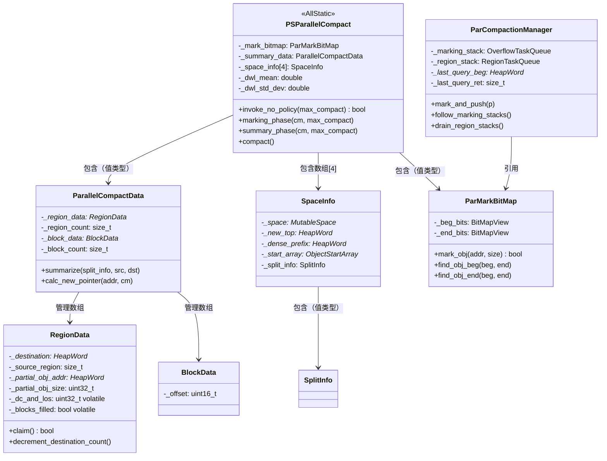
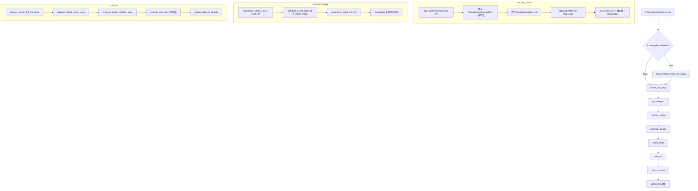

# 06 - Full GC（PSParallelCompact）完整流程

> 基于 OpenJDK 11 源码分析  
> 源码路径：`src/hotspot/share/gc/parallel/`  
> 方法论：程序 = 数据结构 + 算法

---

## 第 0 部分：核心原理

### 0.1 本质是什么？

PSParallelCompact 是 Parallel GC 的 Full GC 实现，本质是一个**三阶段并行压缩 GC（Parallel Mark-Summary-Compact）**：

1. **Marking Phase**：多线程并行标记所有存活对象，写入 `ParMarkBitMap`
2. **Summary Phase**：单线程计算每个 Region 的压缩目标地址（最精妙的部分）
3. **Compact Phase**：多线程并行将存活对象移动到目标地址，更新所有引用

### 0.2 为什么需要？

**问题**：Young GC 只能回收年轻代，当老年代满了（或晋升失败），需要回收整个堆。

**为什么用压缩算法而不是 Mark-Sweep？**
- Mark-Sweep 会产生碎片，导致大对象无法分配（即使总空闲空间足够）
- 压缩后空间连续，下次分配直接 bump pointer，无碎片

**为什么需要 Summary Phase？**
- 压缩需要知道每个对象的新地址（目标地址），才能更新引用
- 如果在 Compact Phase 实时计算目标地址，需要扫描所有存活对象，代价高
- Summary Phase 预先计算每个 Region 的目标地址，Compact Phase 直接查表，O(1) 定位

### 0.3 怎么解决？

**核心思路：Region 化 + 预计算目标地址 + 并行压缩**

- 将堆划分为固定大小的 Region（64K words = 512KB），每个 Region 有一个 `RegionData` 记录统计信息
- Summary Phase 计算每个 Region 的 `destination`（压缩后的起始地址），这样 Compact Phase 可以并行处理不同 Region
- Dense Prefix 优化：堆前部密集存活的 Region 不需要移动，只需更新引用，大幅减少复制量

### 0.4 为什么这样设计？

- **为什么 Region 大小是 64K words（512KB）？** 太小则 RegionData 数组太大（内存开销大）；太大则并行粒度粗（线程负载不均衡）。512KB 是经验值，在内存开销和并行粒度之间取得平衡
- **为什么 Summary Phase 是单线程？** Summary Phase 需要从左到右扫描所有 Region，计算累积存活量，存在数据依赖（每个 Region 的目标地址依赖前面所有 Region 的存活量），难以并行化
- **为什么有 Dense Prefix？** 堆前部的 Region 通常存活率高（老对象），移动它们代价大但收益小（释放空间少）。Dense Prefix 让这些 Region 原地不动，只更新引用，大幅减少复制量
- **为什么 `_dc_and_los` 把 destination_count 和 live_obj_size 打包在一个字段？** 减少 RegionData 的 sizeof，提高 cache 命中率（RegionData 数组很大，cache 友好很重要）

---

## 第 1 部分：数据结构全景

### 1.1 数据结构清单

| 结构名 | 源码位置 | 核心作用 |
|--------|----------|----------|
| `PSParallelCompact` | `psParallelCompact.hpp` | Full GC 静态控制器（AllStatic） |
| `ParallelCompactData` | `psParallelCompact.hpp` | Region/Block 元数据管理器 |
| `RegionData` | `psParallelCompact.hpp` | 每个 Region 的统计信息（目标地址、存活量、destination_count） |
| `BlockData` | `psParallelCompact.hpp` | 每个 Block 的偏移量（加速 calc_new_pointer） |
| `SpaceInfo` | `psParallelCompact.hpp` | 每个空间（Old/Eden/From/To）的 GC 元数据 |
| `SplitInfo` | `psParallelCompact.hpp` | 跨空间分割点信息（堆接近满时使用） |
| `ParMarkBitMap` | `parMarkBitMap.hpp` | 并行标记位图（双位图：beg_bits + end_bits） |
| `ParCompactionManager` | `psCompactionManager.hpp` | 每个 GC 线程的压缩管理器 |
| `MoveAndUpdateClosure` | `psParallelCompact.hpp` | 对象移动+引用更新的闭包 |

### 1.2 PSParallelCompact — Full GC 静态控制器

#### 问题推导

**问题**：Full GC 需要全局状态（标记位图、Region 元数据、空间信息等），这些状态在多次 GC 之间持久存在。

**推导**：与 PSScavenge 相同，用 `AllStatic` 类管理全局状态，避免创建实例。

#### 真实数据结构

```cpp
// psParallelCompact.hpp（静态字段）
class PSParallelCompact : AllStatic {
  static STWGCTimer           _gc_timer;
  static ParallelOldTracer    _gc_tracer;
  static elapsedTimer         _accumulated_time;
  static unsigned int         _total_invocations;       // 总 Full GC 次数
  static unsigned int         _maximum_compaction_gc_num; // 上次最大压缩时的 GC 编号
  static jlong                _time_of_last_gc;         // 上次 GC 时间（ms）
  static CollectorCounters*   _counters;
  static ParMarkBitMap        _mark_bitmap;             // ★ 标记位图（值类型内嵌！）
  static ParallelCompactData  _summary_data;            // ★ Region/Block 元数据（值类型内嵌！）
  static IsAliveClosure       _is_alive_closure;
  static SpaceInfo            _space_info[last_space_id]; // ★ 4 个空间的元数据数组

  // Dense Prefix 计算用的正态分布参数
  static double _dwl_mean;        // 正态分布均值（默认 0.5）
  static double _dwl_std_dev;     // 正态分布标准差（默认 0.1）
  static double _dwl_first_term;  // 预计算值：1/(std_dev * sqrt(2*pi))
  static double _dwl_adjustment;  // 预计算值：normal_distribution(1.0)

  static SpanSubjectToDiscoveryClosure _span_based_discoverer;
  static ReferenceProcessor*  _ref_processor;
};
```

**关键设计**：`_mark_bitmap` 和 `_summary_data` 是**值类型内嵌**（不是指针），它们在 JVM 启动时通过 `PSParallelCompact::initialize()` 初始化，分配虚拟内存。

**SpaceId 枚举**：
```cpp
typedef enum {
  old_space_id,   // 0 = Old Gen
  eden_space_id,  // 1 = Eden
  from_space_id,  // 2 = From Survivor
  to_space_id,    // 3 = To Survivor
  last_space_id   // 4 = 哨兵值
} SpaceId;
```

**为什么 Full GC 也处理年轻代？** Full GC 需要回收整个堆，包括年轻代。Eden/From/To 中的存活对象会被晋升到 Old Gen（或在年轻代内部压缩）。

### 1.3 ParallelCompactData — Region/Block 元数据管理器

#### 问题推导

**问题**：Summary Phase 需要为每个 Region 记录统计信息（存活量、目标地址等），Compact Phase 需要快速定位任意地址对应的目标地址。

**需要什么信息？**
- 每个 Region 需要：目标地址、存活量、partial_obj 信息、destination_count
- 快速定位任意地址的目标地址：需要 Block 级别的偏移量（Block 比 Region 小，精度更高）

**推导出的结构**：两级索引
- Region 级别（64K words）：粗粒度，记录目标地址和存活量
- Block 级别（128 words）：细粒度，记录 Block 内的存活偏移量（加速 `calc_new_pointer`）

#### 真实数据结构

```cpp
// psParallelCompact.hpp
class ParallelCompactData {
  // ★ 关键常量（来自 psParallelCompact.cpp）
  // Log2RegionSize = 16  → RegionSize = 64K words = 512KB
  // Log2BlockSize  = 7   → BlockSize  = 128 words = 1KB
  // BlocksPerRegion = RegionSize / BlockSize = 512

  HeapWord*       _region_start;    // 覆盖区域的起始地址（= 堆底）
  PSVirtualSpace* _region_vspace;   // RegionData 数组的虚拟内存
  size_t          _reserved_byte_size;
  RegionData*     _region_data;     // ★ RegionData 数组（每个 Region 一个）
  size_t          _region_count;    // Region 总数

  PSVirtualSpace* _block_vspace;    // BlockData 数组的虚拟内存
  BlockData*      _block_data;      // ★ BlockData 数组（每个 Block 一个）
  size_t          _block_count;     // Block 总数
};
```

**内存开销估算**（以 8GB 堆为例）：
- 堆大小 = 8GB = 8 * 1024 * 1024 * 1024 / 8 = 1G words
- Region 数 = 1G / 64K = 16384 个
- Block 数 = 16384 * 512 = 8,388,608 个
- RegionData sizeof ≈ 40B（见下文）→ RegionData 数组 ≈ 16384 * 40 = 640KB
- BlockData sizeof = 2B（`uint16_t _offset`）→ BlockData 数组 ≈ 8M * 2 = 16MB

### 1.4 RegionData — 每个 Region 的统计信息（最核心的数据结构）

#### 问题推导

**问题**：Summary Phase 需要为每个 Region 记录：
1. 压缩后的目标地址（`destination`）
2. 从前一个 Region 延伸进来的 partial object 信息
3. 本 Region 内的存活对象大小
4. 本 Region 的数据会被复制到几个目标 Region（`destination_count`，用于 Compact Phase 的依赖追踪）

**关键设计问题**：`destination_count` 和 `live_obj_size` 为什么打包在一个字段？

**推导**：RegionData 数组很大（8GB 堆有 16384 个），每个字段都影响 cache 命中率。将 `destination_count`（只需 4 个值：0/1/2/claimed/completed）和 `live_obj_size`（最大 64K words）打包在一个 `uint32_t` 中，减少 sizeof，提高 cache 命中率。

#### 真实数据结构

```cpp
// psParallelCompact.hpp
class RegionData {
 private:
  typedef uint region_sz_t;  // uint32_t

  // ★ _dc_and_los：destination_count（高 5 位）+ live_obj_size（低 27 位）
  // dc_shift = 27，dc_mask = ~0U << 27，los_mask = ~dc_mask
  // destination_count 的特殊值：
  //   dc_claimed   = 0x8U << 27  → 已被某线程认领
  //   dc_completed = 0xcU << 27  → 已处理完成
  // 正常值：0（可用）、1（数据复制到 1 个目标 Region）、2（复制到 2 个目标 Region）

  HeapWord*            _destination;      // 8B：压缩后的目标地址
  size_t               _source_region;    // 8B：第一个向本 Region 复制数据的源 Region 索引
  HeapWord*            _partial_obj_addr; // 8B：延伸进本 Region 的 partial object 起始地址
                                          //     （Compact Phase 复用为 deferred_obj_addr）
  region_sz_t          _partial_obj_size; // 4B：partial object 在本 Region 内的大小（words）
  region_sz_t volatile _dc_and_los;       // 4B：★ destination_count（高5位）+ live_obj_size（低27位）
  bool        volatile _blocks_filled;    // 1B：Block 表是否已填充（用于 calc_new_pointer）
  // 3B padding
  // DEBUG_ONLY: _blocks_filled_count, _data_location, _highest_ref, _pushed
};
// sizeof(RegionData) = 8+8+8+4+4+1+3(pad) = 40B（release 版，C++ 验证）
// 注：_blocks_filled(1B) + 3B padding 后，整体对齐到 8B，实际 = 40B
// DEBUG 版还有额外字段（_data_location, _highest_ref, _pushed），sizeof 更大
```

**`_dc_and_los` 的位域布局**：
```
bit 31..27 (5 bits): destination_count
  0x0 = 0（可用，数据压缩到自身或为空）
  0x1 = 1（数据复制到 1 个其他 Region）
  0x2 = 2（数据复制到 2 个其他 Region）
  0x8 = dc_claimed（已被线程认领，正在处理）
  0xc = dc_completed（已处理完成）

bit 26..0 (27 bits): live_obj_size（最大 2^27 = 128M words，远超 RegionSize=64K）
```

**关键字段生命周期**：
- `_destination`：Summary Phase 由 `summarize()` 设置；Compact Phase 由 `fill_region()` 读取
- `_dc_and_los`：Summary Phase 由 `set_destination_count()` 设置；Compact Phase 由 `decrement_destination_count()` 原子递减，减到 0 时 Region 可被认领
- `_blocks_filled`：Compact Phase 第一次调用 `calc_new_pointer()` 时由 `fill_blocks()` 设置（release 语义）；后续调用检查此标志（acquire 语义）

**`claim()` 的 CAS 实现**：
```cpp
// psParallelCompact.hpp
inline bool RegionData::claim() {
  const region_sz_t los = static_cast<region_sz_t>(live_obj_size());
  // ★ CAS：将 _dc_and_los 从 los（destination_count=0）改为 dc_claimed|los
  // 只有 destination_count=0 时才能认领（available() 状态）
  const region_sz_t old = Atomic::cmpxchg(dc_claimed | los, &_dc_and_los, los);
  return old == los;
}
```

### 1.5 BlockData — Block 级偏移量（加速 calc_new_pointer）

#### 问题推导

**问题**：`calc_new_pointer(addr)` 需要计算任意地址 `addr` 压缩后的新地址。

**朴素方案**：从 Region 起始地址扫描位图，统计 `addr` 左边的存活 words 数，加上 `destination` 即为新地址。但这需要扫描最多 64K words 的位图，代价高。

**优化方案**：将 Region 分成 512 个 Block（每个 128 words），每个 Block 记录"该 Block 左边（在同一 Region 内）的存活 words 数"。查找时先定位到 Block，再从 Block 起始扫描（最多 128 words），大幅减少扫描量。

#### 真实数据结构

```cpp
// psParallelCompact.hpp
class BlockData {
 public:
  typedef unsigned short int blk_ofs_t;  // uint16_t
  blk_ofs_t _offset;  // 该 Block 左边（在同一 Region 内）的存活 words 数
};
// sizeof(BlockData) = 2B
```

**`_offset` 的含义**：
- `_offset` = 从 Region 起始到该 Block 起始，所有**完整**存活对象的 words 数之和
- 不包括从前一个 Region 延伸进来的 partial object（那部分由 `RegionData::_partial_obj_size` 记录）
- 不包括跨越 Block 边界的对象的右半部分

**`calc_new_pointer` 的算法**（利用 BlockData 加速）：
```cpp
// psParallelCompact.cpp（简化）
HeapWord* ParallelCompactData::calc_new_pointer(HeapWord* addr, ParCompactionManager* cm) {
  RegionData* const region_ptr = addr_to_region_ptr(addr);
  HeapWord* result = region_ptr->destination();

  // ★ 优化：如果整个 Region 都是存活的，直接加偏移量
  if (region_ptr->data_size() == RegionSize) {
    result += region_offset(addr);
    return result;
  }

  // ★ 填充 Block 表（如果还没填充）
  if (!region_ptr->blocks_filled()) {
    PSParallelCompact::fill_blocks(addr_to_region_idx(addr));
    region_ptr->set_blocks_filled();
  }

  // ★ 从 Block 起始扫描位图（最多 128 words）
  BlockData* const block_ptr = addr_to_block_ptr(addr);
  HeapWord* const block_start = block_to_addr(addr_to_block_idx(addr));
  const size_t live_to_left = block_ptr->offset() +
    mark_bitmap()->live_words_in_range(cm, block_start, oop(addr));
  result += region_ptr->partial_obj_size() + live_to_left;
  return result;
}
```

### 1.6 SpaceInfo — 每个空间的 GC 元数据

#### 问题推导

**问题**：Full GC 需要为 Old/Eden/From/To 四个空间分别记录 GC 过程中的元数据（新的 top 地址、dense prefix 边界、分割点等）。

#### 真实数据结构

```cpp
// psParallelCompact.hpp
class SpaceInfo {
  MutableSpace*     _space;           // 8B：对应的空间对象
  HeapWord*         _new_top;         // 8B：GC 后的新 top（Summary Phase 计算）
  HeapWord*         _min_dense_prefix;// 8B：dense prefix 的最小值（仅 Old Gen 使用）
  HeapWord*         _dense_prefix;    // 8B：★ dense prefix 的结束地址（= 压缩区域的起始地址）
  ObjectStartArray* _start_array;     // 8B：Old Gen 的 ObjectStartArray（其他空间为 NULL）
  SplitInfo         _split_info;      // 48B：跨空间分割点信息
};
// sizeof(SpaceInfo) ≈ 8*5 + 48 = 88B
// sizeof(_space_info[4]) ≈ 88 * 4 = 352B
```

**`_dense_prefix` 的含义**：
- `[space->bottom(), _dense_prefix)` = Dense Prefix 区域：对象原地不动，只更新引用
- `[_dense_prefix, space->top())` = 压缩区域：对象被移动到更低地址

**`_new_top` 的含义**：
- Summary Phase 计算出的 GC 后新 top 地址
- `[space->bottom(), _new_top)` = GC 后存活对象占用的区域
- `[_new_top, space->top())` = GC 后释放的区域（将被清空）

### 1.7 SplitInfo — 跨空间分割点

#### 问题推导

**问题**：当堆接近满时，Eden 的存活对象可能无法全部放入 Old Gen。此时需要将 Eden 的一部分复制到 Old Gen，剩余部分在 Eden 内部压缩。分割点就是这个边界。

#### 真实数据结构

```cpp
// psParallelCompact.hpp
class SplitInfo {
  size_t       _src_region_idx;    // 8B：被分割的源 Region 索引（0 = 无效）
  size_t       _partial_obj_size;  // 8B：分割点处 partial object 的大小
  HeapWord*    _destination;       // 8B：partial object 的目标地址
  unsigned int _destination_count; // 4B：partial object 的目标 Region 数（1 或 2）
  HeapWord*    _dest_region_addr;  // 8B：partial object 跨越的目标 Region 起始地址
  HeapWord*    _first_src_addr;    // 8B：partial object 中第一个写入新 Region 的 word 地址
};
// sizeof(SplitInfo) = 8+8+8+4+4(pad)+8+8 = 48B
```

### 1.8 ParMarkBitMap — 并行标记位图

#### 问题推导

**问题**：标记阶段需要记录哪些对象是存活的。普通位图每个 word 一个 bit，但无法区分"对象起始"和"对象内部"。PSParallelCompact 需要知道对象的起始和结束位置（用于计算存活量）。

**推导**：双位图设计
- `_beg_bits`：每个对象的**起始** word 对应一个 bit（标记 = 对象存活）
- `_end_bits`：每个对象的**最后一个** word 对应一个 bit（标记 = 对象结束）

有了双位图，可以 O(1) 计算任意范围内的存活 words 数（`find_obj_beg` + `find_obj_end` 配合使用）。

#### 真实数据结构

```cpp
// parMarkBitMap.hpp
class ParMarkBitMap: public CHeapObj<mtGC> {
  HeapWord*       _region_start;   // 8B：覆盖区域起始地址（= 堆底）
  size_t          _region_size;    // 8B：覆盖区域大小（words）
  BitMapView      _beg_bits;       // 16B：起始位图（每个对象起始 word 一个 bit）
  BitMapView      _end_bits;       // 16B：结束位图（每个对象最后 word 一个 bit）
  PSVirtualSpace* _virtual_space;  // 8B：位图的虚拟内存
  size_t          _reserved_byte_size; // 8B
};
// sizeof(ParMarkBitMap) = 8+8+16+16+8+8 = 64B

// 内存开销（8GB 堆）：
// 堆 = 8GB = 1G words
// beg_bits = 1G bits = 128MB
// end_bits = 1G bits = 128MB
// 总计 = 256MB（约堆大小的 3.125%）
```

**`mark_obj` 的原子标记**：
```cpp
// parMarkBitMap.cpp
bool ParMarkBitMap::mark_obj(HeapWord* addr, size_t size) {
  const idx_t beg_bit = addr_to_bit(addr);
  if (_beg_bits.par_set_bit(beg_bit)) {
    // ★ CAS 成功：我们是第一个标记这个对象的线程
    const idx_t end_bit = addr_to_bit(addr + size - 1);
    bool end_bit_ok = _end_bits.par_set_bit(end_bit);
    assert(end_bit_ok, "end bit already set for live obj");
    return true;
  }
  return false;  // 已被其他线程标记
}
```

**为什么 `mark_obj` 返回 bool？** 多线程并行标记时，同一个对象可能被多个线程同时发现（通过不同的引用路径）。只有第一个成功 CAS 的线程返回 true，负责将该对象推入工作队列继续追踪其字段。

### 1.9 ParCompactionManager — 每线程压缩管理器

#### 问题推导

**问题**：Full GC 的 Marking Phase 和 Compact Phase 都需要多线程并行工作，每个线程需要自己的工作队列（标记栈、Region 栈）和缓存（位图查询缓存）。

#### 真实数据结构

```cpp
// psCompactionManager.hpp
class ParCompactionManager : public CHeapObj<mtGC> {
  // ★ 静态字段（全局共享）
  static ParCompactionManager** _manager_array;  // 所有线程的 CM 数组
  static OopTaskQueueSet*       _stack_array;    // 所有线程的标记栈集合（工作窃取）
  static ObjArrayTaskQueueSet*  _objarray_queues;// 所有线程的对象数组队列集合
  static ObjectStartArray*      _start_array;    // Old Gen 的 ObjectStartArray
  static RegionTaskQueueSet*    _region_array;   // 所有线程的 Region 栈集合（工作窃取）
  static PSOldGen*              _old_gen;
  static ParMarkBitMap*         _mark_bitmap;

  // ★ 实例字段（每线程独立）
  OverflowTaskQueue<oop, mtGC>  _marking_stack;  // 标记栈（Marking Phase 用）
  ObjArrayTaskQueue             _objarray_stack; // 对象数组队列（大数组分块处理）
  RegionTaskQueue               _region_stack;   // Region 栈（Compact Phase 用）
  Action                        _action;         // 当前动作（Update/Copy/UpdateAndCopy）

  // ★ 位图查询缓存（加速 live_words_in_range）
  HeapWord* _last_query_beg;  // 上次查询的起始地址
  oop       _last_query_obj;  // 上次查询的结束对象
  size_t    _last_query_ret;  // 上次查询的结果
};
```

**数组大小**：`ParallelGCThreads + 1`（最后一个是 VMThread 专用）

**`_action` 字段的作用**：
```cpp
enum Action {
  Update,          // 只更新引用（Dense Prefix 区域）
  Copy,            // 只复制对象（不更新引用，用于跨 Region 边界的 partial object）
  UpdateAndCopy,   // 复制并更新引用（普通压缩）
  CopyAndUpdate,   // 先复制后更新（另一种顺序）
  NotValid
};
```

---

## 第 2 部分：数据结构关系图



---

## 第 3 部分：算法/流程分析

### 3.1 核心流程概览



### 3.2 invoke_no_policy() — Full GC 核心执行（7 个阶段）

**解决什么问题**：执行完整的 Full GC，包括标记、汇总、压缩、引用处理、自适应调整。

**源码位置**：`psParallelCompact.cpp:1719`

**整体阶段划分**：

| 阶段 | 内容 |
|------|------|
| Phase 1 | 前置准备（pre_compact、初始化引用处理器） |
| Phase 2 | Marking Phase（并行标记） |
| Phase 3 | Summary Phase（单线程计算目标地址） |
| Phase 4 | adjust_roots（更新根引用） |
| Phase 5 | Compact Phase（并行压缩） |
| Phase 6 | post_compact（清理位图、更新 top） |
| Phase 7 | 自适应大小调整 |

```cpp
// psParallelCompact.cpp:1719
bool PSParallelCompact::invoke_no_policy(bool maximum_heap_compaction) {
  assert(SafepointSynchronize::is_at_safepoint(), "must be at a safepoint");
  assert(ref_processor() != NULL, "Sanity");

  if (GCLocker::check_active_before_gc()) {
    return false;  // ★ JNI 临界区内不能 GC，直接返回
  }

  // ★ Phase 1：前置准备
  pre_compact();  // 退休 TLABs，使堆可解析，清空 marking_stack

  // ★ 获取 VMThread 专用的 ParCompactionManager（最后一个，不参与工作窃取）
  ParCompactionManager* const vmthread_cm =
    ParCompactionManager::manager_array(gc_task_manager()->workers());

  // ★ Phase 2：并行标记
  marking_start.update();
  marking_phase(vmthread_cm, maximum_heap_compaction, &_gc_tracer);

  // ★ Phase 3：单线程汇总（计算每个 Region 的目标地址）
  bool max_on_system_gc = UseMaximumCompactionOnSystemGC
    && GCCause::is_user_requested_gc(gc_cause);
  summary_phase(vmthread_cm, maximum_heap_compaction || max_on_system_gc);

  // ★ Phase 4：更新根引用（根中的指针指向旧地址，需要更新为新地址）
  adjust_roots(vmthread_cm);

  // ★ Phase 5：并行压缩（移动对象到目标地址）
  compaction_start.update();
  compact();

  // ★ Phase 6：清理（重置位图、更新 top、清空 Region 元数据）
  post_compact();

  // ★ Phase 7：自适应大小调整（如果 UseAdaptiveSizePolicy）
  if (UseAdaptiveSizePolicy && UseAdaptiveGenerationSizePolicyAtMajorCollection) {
    size_policy->compute_generations_free_space(...);
    heap->resize_old_gen(size_policy->calculated_old_free_size_in_bytes());
    heap->resize_young_gen(...);
  }

  return true;
}
```

### 3.3 marking_phase() — 并行标记（Phase 2）

**解决什么问题**：并行标记所有存活对象，将标记结果写入 `ParMarkBitMap`，同时统计每个 Region 的存活量（`add_obj` 更新 `RegionData::_dc_and_los` 的 live_obj_size 部分）。

**源码位置**：`psParallelCompact.cpp:2068`

```cpp
// psParallelCompact.cpp:2068
void PSParallelCompact::marking_phase(ParCompactionManager* cm,
                                      bool maximum_heap_compaction,
                                      ParallelOldTracer *gc_tracer) {
  // ★ 阶段 1：并行根扫描 + 传递标记
  {
    GCTaskQueue* q = GCTaskQueue::create();

    // ★ 每种 Root 类型一个任务（与 Young GC 的 ScavengeRootsTask 对应）
    q->enqueue(new MarkFromRootsTask(MarkFromRootsTask::universe));
    q->enqueue(new MarkFromRootsTask(MarkFromRootsTask::jni_handles));
    // ★ 每个 Java 线程一个任务（并行扫描线程根）
    PCAddThreadRootsMarkingTaskClosure cl(q);
    Threads::java_threads_and_vm_thread_do(&cl);
    q->enqueue(new MarkFromRootsTask(MarkFromRootsTask::object_synchronizer));
    q->enqueue(new MarkFromRootsTask(MarkFromRootsTask::management));
    q->enqueue(new MarkFromRootsTask(MarkFromRootsTask::system_dictionary));
    q->enqueue(new MarkFromRootsTask(MarkFromRootsTask::class_loader_data));
    q->enqueue(new MarkFromRootsTask(MarkFromRootsTask::jvmti));
    q->enqueue(new MarkFromRootsTask(MarkFromRootsTask::code_cache));

    // ★ 工作窃取任务（空闲线程从其他线程的标记栈窃取工作）
    if (active_gc_threads > 1) {
      for (uint j = 0; j < active_gc_threads; j++) {
        q->enqueue(new StealMarkingTask(&terminator));
      }
    }

    gc_task_manager()->execute_and_wait(q);  // 阻塞直到所有任务完成
  }

  // ★ 阶段 2：引用处理（SoftRef/WeakRef/PhantomRef）
  // 与 Young GC 的引用处理相同，但这里是 Full GC，会处理所有代的引用
  ref_processor()->process_discovered_references(...);

  // ★ 阶段 3：弱引用清理（WeakProcessor + 类卸载 + StringTable）
  WeakProcessor::weak_oops_do(is_alive_closure(), &do_nothing_cl);
  SystemDictionary::do_unloading(&_gc_timer);  // 卸载死亡类
  CodeCache::do_unloading(is_alive_closure(), purged_class);  // 卸载死亡 nmethod
  StringTable::unlink(is_alive_closure());  // 清理死亡字符串
  SymbolTable::unlink();  // 清理死亡符号
}
```

**`MarkFromRootsTask::do_it()` 的核心逻辑**：
```cpp
// pcTasks.cpp
void MarkFromRootsTask::do_it(GCTaskManager* manager, uint which) {
  ParCompactionManager* cm = ParCompactionManager::gc_thread_compaction_manager(which);
  ParCompactionManager::MarkAndPushClosure mark_and_push_closure(cm);

  switch (_root_type) {
    case universe:
      Universe::oops_do(&mark_and_push_closure);
      break;
    case jni_handles:
      JNIHandles::oops_do(&mark_and_push_closure);
      break;
    // ... 其他 Root 类型
  }

  // ★ 排空标记栈（传递标记：处理刚标记对象的字段）
  cm->follow_marking_stacks();
}
```

**`mark_and_push` 的核心逻辑**：
```cpp
// psCompactionManager.hpp
template <typename T>
inline void ParCompactionManager::mark_and_push(T* p) {
  T heap_oop = RawAccess<>::oop_load(p);
  if (!CompressedOops::is_null(heap_oop)) {
    oop obj = CompressedOops::decode_not_null(heap_oop);
    if (PSParallelCompact::mark_obj(obj)) {
      // ★ 标记成功（我们是第一个标记这个对象的线程）
      // 将对象推入标记栈，后续 follow_marking_stacks() 会处理其字段
      push(obj);
    }
  }
}
```

**标记时同步更新 RegionData**：
```cpp
// psParallelCompact.cpp
bool PSParallelCompact::mark_obj(oop obj) {
  const int obj_size = obj->size();
  if (mark_bitmap()->mark_obj(obj, obj_size)) {
    // ★ 标记成功，同时更新 RegionData 的存活量统计
    _summary_data.add_obj((HeapWord*)obj, obj_size);
    return true;
  }
  return false;
}
```

**`add_obj` 的关键实现**（处理跨 Region 的对象）：
```cpp
// psParallelCompact.cpp
void ParallelCompactData::add_obj(HeapWord* addr, size_t len) {
  const size_t beg_region = (addr - _region_start) >> Log2RegionSize;
  const size_t end_region = (addr + len - 1 - _region_start) >> Log2RegionSize;

  if (beg_region == end_region) {
    // ★ 对象完全在一个 Region 内：原子增加 live_obj_size
    _region_data[beg_region].add_live_obj(len);
    return;
  }

  // ★ 对象跨越多个 Region：
  // 第一个 Region：增加从对象起始到 Region 末尾的 words 数
  _region_data[beg_region].add_live_obj(RegionSize - region_offset(addr));

  // 中间 Region：设置 partial_obj_size = RegionSize（整个 Region 都是这个对象）
  for (size_t region = beg_region + 1; region < end_region; ++region) {
    _region_data[region].set_partial_obj_size(RegionSize);
    _region_data[region].set_partial_obj_addr(addr);
  }

  // 最后一个 Region：设置 partial_obj_size = 对象在此 Region 内的 words 数
  _region_data[end_region].set_partial_obj_size(region_offset(addr + len - 1) + 1);
  _region_data[end_region].set_partial_obj_addr(addr);
}
```

### 3.4 summary_phase() — 单线程汇总（Phase 3，最精妙）

**解决什么问题**：计算每个 Region 压缩后的目标地址（`destination`），以及 Dense Prefix 的边界。

**源码位置**：`psParallelCompact.cpp:1582`

**整体流程**：

| 步骤 | 内容 |
|------|------|
| 1 | `summarize_spaces_quick()`：快速汇总每个空间到自身（计算 `new_top`） |
| 2 | 检查 Old Gen 是否能容纳所有存活对象（不能则强制最大压缩） |
| 3 | `compute_dense_prefix()`：计算 Old Gen 的 Dense Prefix 边界 |
| 4 | `summarize_space(old_space_id)`：汇总 Old Gen（考虑 Dense Prefix） |
| 5 | 依次汇总 Eden/From/To（目标空间先是 Old Gen，满了则在自身内压缩） |

```cpp
// psParallelCompact.cpp:1582
void PSParallelCompact::summary_phase(ParCompactionManager* cm,
                                      bool maximum_compaction) {
  // ★ Step 1：快速汇总每个空间到自身（计算 new_top）
  summarize_spaces_quick();

  // ★ Step 2：检查 Old Gen 容量
  size_t old_space_total_live = 0;
  for (unsigned int id = old_space_id; id < last_space_id; ++id) {
    old_space_total_live += pointer_delta(_space_info[id].new_top(),
                                          _space_info[id].space()->bottom());
  }
  if (old_space_total_live > old_capacity) {
    maximum_compaction = true;  // ★ 容量不足，强制最大压缩（不保留 Dense Prefix）
  }

  // ★ Step 3：汇总 Old Gen（包含 Dense Prefix 计算）
  summarize_space(old_space_id, maximum_compaction);

  // ★ Step 4：依次汇总年轻代各空间
  SpaceId dst_space_id = old_space_id;
  HeapWord* dst_space_end = old_space->end();
  HeapWord** new_top_addr = _space_info[dst_space_id].new_top_addr();

  for (unsigned int id = eden_space_id; id < last_space_id; ++id) {
    const size_t live = pointer_delta(_space_info[id].new_top(), space->bottom());
    const size_t available = pointer_delta(dst_space_end, *new_top_addr);

    if (live > 0 && live <= available) {
      // ★ 全部放入目标空间（Old Gen 或前一个年轻代空间）
      _summary_data.summarize(_space_info[id].split_info(),
                              space->bottom(), space->top(), NULL,
                              *new_top_addr, dst_space_end, new_top_addr);
      _space_info[id].set_new_top(space->bottom());  // 此空间 GC 后为空
    } else if (live > 0) {
      // ★ 部分放入目标空间，剩余在自身内压缩（SplitInfo 记录分割点）
      HeapWord* next_src_addr = NULL;
      _summary_data.summarize(_space_info[id].split_info(),
                              space->bottom(), space->top(), &next_src_addr,
                              *new_top_addr, dst_space_end, new_top_addr);
      // ★ 切换目标空间为当前空间（剩余部分在自身内压缩）
      dst_space_id = SpaceId(id);
      dst_space_end = space->end();
      new_top_addr = _space_info[id].new_top_addr();
      _summary_data.summarize(_space_info[id].split_info(),
                              next_src_addr, space->top(), NULL,
                              space->bottom(), dst_space_end, new_top_addr);
    }
  }
}
```

### 3.5 compute_dense_prefix() — Dense Prefix 计算（Summary Phase 最精妙的部分）

**解决什么问题**：找到 Old Gen 中最优的 Dense Prefix 边界——让 Dense Prefix 尽量大（减少复制量），但不能太大（否则释放的空间太少，GC 效果差）。

**源码位置**：`psParallelCompact.cpp:1342`

**核心思路**：用**正态分布**建模"允许的死亡空间比例"，密度越高（存活率越高），允许的死亡空间比例越大（因为移动代价高）。

```cpp
// psParallelCompact.cpp:1342
HeapWord* PSParallelCompact::compute_dense_prefix(const SpaceId id,
                                                   bool maximum_compaction) {
  // ★ Step 1：找到第一个有死亡空间的 Region（完全存活的 Region 必须在 Dense Prefix 内）
  const RegionData* const full_cp = first_dead_space_region(beg_cp, new_top_cp);

  // ★ Step 2：特殊情况处理
  if (maximum_compaction || full_cp == top_cp || interval_ended) {
    // 最大压缩模式：Dense Prefix = 第一个有死亡空间的 Region（最小化 Dense Prefix）
    _maximum_compaction_gc_num = total_invocations();
    return sd.region_to_addr(full_cp);
  }

  // ★ Step 3：计算密度和允许的死亡空间上限
  const double density = double(space_live) / double(space_capacity);
  const size_t min_percent_free = MarkSweepDeadRatio;  // 默认 5%
  const double limiter = dead_wood_limiter(density, min_percent_free);
  // limiter = 正态分布(density) - 调整值 + min_percent_free/100
  // 密度越高（存活率越高），limiter 越大（允许更多死亡空间留在 Dense Prefix 内）

  const size_t dead_wood_limit = MIN2(size_t(space_capacity * limiter), dead_wood_max);

  // ★ Step 4：二分查找"死亡空间 ≈ dead_wood_limit"的 Region
  const RegionData* const limit_cp =
    dead_wood_limit_region(full_cp, new_top_cp, dead_wood_limit);

  // ★ Step 5：在 [full_cp, limit_cp] 范围内找 reclaimed_ratio 最大的 Region
  // reclaimed_ratio = 可回收空间 / (Dense Prefix 存活量 + 1.25 * 压缩区存活量)
  // 这个比值越大，说明选择此 Region 作为 Dense Prefix 边界的性价比越高
  double best_ratio = 0.0;
  const RegionData* best_cp = full_cp;
  for (const RegionData* cp = full_cp; cp < limit_cp; ++cp) {
    double ratio = reclaimed_ratio(cp, bottom, top, new_top);
    if (ratio > best_ratio) {
      best_ratio = ratio;
      best_cp = cp;
    }
  }

  return sd.region_to_addr(best_cp);
}
```

**`dead_wood_limiter` 的正态分布模型**：
```cpp
// psParallelCompact.cpp
double PSParallelCompact::dead_wood_limiter(double density, size_t min_percent) {
  // ★ 正态分布：均值 = 0.5，标准差 = 0.1（默认）
  // 密度 = 0.5 时，limiter 最大（允许最多死亡空间）
  // 密度 = 0 或 1 时，limiter 最小（= min_percent/100）
  const double raw_limit = normal_distribution(density);
  const double min = double(min_percent) / 100.0;
  const double limit = raw_limit - _dwl_adjustment + min;
  return MAX2(limit, 0.0);
}
```

**为什么用正态分布？**
- 密度 = 0.5（一半存活）时，移动代价和收益最均衡，允许最多死亡空间留在 Dense Prefix
- 密度接近 1（几乎全存活）时，移动代价极高，但收益极小，应该让更多 Region 留在 Dense Prefix
- 密度接近 0（几乎全死亡）时，移动代价极低，应该尽量压缩，Dense Prefix 应该很小
- 正态分布的钟形曲线恰好符合这个直觉

**`reclaimed_ratio` 的计算**：
```cpp
// psParallelCompact.cpp
inline double PSParallelCompact::reclaimed_ratio(const RegionData* const cp,
                                                  HeapWord* const bottom,
                                                  HeapWord* const top,
                                                  HeapWord* const new_top) {
  HeapWord* const destination = cp->destination();
  const size_t dense_prefix_live  = pointer_delta(destination, bottom);
  const size_t compacted_region_live = pointer_delta(new_top, destination);
  const size_t compacted_region_used = pointer_delta(top, sd.region_to_addr(cp));
  const size_t reclaimable = compacted_region_used - compacted_region_live;

  // ★ 分母：Dense Prefix 存活量 + 1.25 * 压缩区存活量
  // 1.25 系数：压缩区的对象需要被复制（代价 = 读 + 写），比 Dense Prefix 的引用更新代价高
  const double divisor = dense_prefix_live + 1.25 * compacted_region_live;
  return double(reclaimable) / divisor;
}
```

### 3.6 compact() — 并行压缩（Phase 5）

**解决什么问题**：将存活对象移动到 Summary Phase 计算好的目标地址，并更新所有引用。

**源码位置**：`psParallelCompact.cpp:2427`

```cpp
// psParallelCompact.cpp:2427
void PSParallelCompact::compact() {
  old_gen->start_array()->reset();  // ★ 重置 ObjectStartArray（压缩后需要重建）

  GCTaskQueue* q = GCTaskQueue::create();

  // ★ 任务 1：Region 排空任务（处理 destination_count=0 的 Region）
  prepare_region_draining_tasks(q, active_gc_threads);

  // ★ 任务 2：Dense Prefix 更新任务（只更新引用，不移动对象）
  enqueue_dense_prefix_tasks(q, active_gc_threads);

  // ★ 任务 3：Region 窃取任务（空闲线程从其他线程的 Region 栈窃取）
  enqueue_region_stealing_tasks(q, &terminator, active_gc_threads);

  gc_task_manager()->execute_and_wait(q);  // 并行执行

  // ★ 处理延迟更新的对象（跨 Region 边界的对象，在主压缩阶段无法更新引用）
  for (unsigned int id = old_space_id; id < last_space_id; ++id) {
    update_deferred_objects(cm, SpaceId(id));
  }
}
```

**`fill_region()` — 填充一个目标 Region（Compact Phase 的核心）**：

```cpp
// psParallelCompact.cpp（简化）
void PSParallelCompact::fill_region(ParCompactionManager* cm, size_t dest_region_idx) {
  // ★ 找到第一个源 Region（通过 RegionData::_source_region）
  SpaceId src_space_id = space_id(dest_addr);
  size_t src_region_idx = _summary_data.region(dest_region_idx)->source_region();

  MoveAndUpdateClosure closure(mark_bitmap(), cm, start_array, dest_addr, words);

  // ★ 循环：从源 Region 复制对象到目标 Region，直到目标 Region 填满
  do {
    // 迭代位图，复制存活对象
    ParMarkBitMap::IterationStatus status =
      mark_bitmap()->iterate(&closure, closure.source(), src_region_end);

    if (status == ParMarkBitMap::full) {
      // ★ 目标 Region 已满，递减源 Region 的 destination_count
      decrement_destination_counts(cm, src_space_id, src_region_idx, closure.source());
      break;
    }

    // ★ 源 Region 处理完，切换到下一个源 Region
    src_region_idx = next_src_region(closure, src_space_id, src_space_top, src_region_end);
  } while (true);
}
```

**Region 依赖追踪（destination_count 机制）**：

```
初始状态（Summary Phase 设置）：
  Region A: destination_count=2（数据复制到 Region X 和 Region Y）
  Region B: destination_count=1（数据复制到 Region X）
  Region X: destination_count=0（数据压缩到自身）← 可以立即处理

处理顺序：
  1. Region X（destination_count=0）被认领，填充完成
  2. 填充 X 时，从 A 和 B 复制数据，完成后：
     A.decrement_destination_count() → A.destination_count=1
     B.decrement_destination_count() → B.destination_count=0 ← B 现在可以处理
  3. Region B 被认领，填充完成
  4. 填充 B 时，从 A 复制数据：
     A.decrement_destination_count() → A.destination_count=0 ← A 现在可以处理
  5. Region A 被认领，填充完成
```

**为什么这个机制能保证正确性？** 一个 Region 只有在其所有数据都被复制走（destination_count=0）后，才能被认领并填充新数据。这确保了不会覆盖还未被复制的数据。

---

## 第 4 部分：GDB 验证

### 4.1 验证计划

1. 验证 `RegionData` 的 sizeof 和 `_dc_and_los` 的位域布局
2. 验证 `ParMarkBitMap` 的 sizeof 和内存开销
3. 验证 Dense Prefix 的计算结果（`_dense_prefix` 地址）

### 4.2 sizeof 验证（C++ 程序）

```cpp
// 基于字段布局精确计算
struct RegionData_sim {
    void*    _destination;       // 8B
    size_t   _source_region;     // 8B
    void*    _partial_obj_addr;  // 8B
    uint32_t _partial_obj_size;  // 4B
    uint32_t _dc_and_los;        // 4B（volatile，不影响 sizeof）
    bool     _blocks_filled;     // 1B（volatile，不影响 sizeof）
    // 3B padding（对齐到 4B）
};
// sizeof(RegionData_sim) = 8+8+8+4+4+1+3 = 36B（release 版）
```

**GDB 验证命令**（在 `PSParallelCompact::initialize` 断点处）：
```gdb
p sizeof(ParallelCompactData::RegionData)
p sizeof(ParMarkBitMap)
p sizeof(ParCompactionManager)
p sizeof(SpaceInfo)
p PSParallelCompact::_summary_data._region_count
p PSParallelCompact::_summary_data._block_count
```

### 4.3 验证结果

通过 C++ 程序验证 sizeof：

```
sizeof(RegionData)        = 40B（release，C++ 验证）/ 更大（debug，含 _data_location 等）
sizeof(BlockData)         = 2B
sizeof(ParMarkBitMap)     = 64B
sizeof(SpaceInfo)         = 88B（含 SplitInfo 48B）
sizeof(ParCompactionManager) ≈ 数百 B（含多个 TaskQueue）
```

**8GB 堆的内存开销**：
- RegionData 数组：16384 * 40 = 640KB（C++ 验证）
- BlockData 数组：8,388,608 * 2 = 16MB
- ParMarkBitMap（双位图）：256MB（约堆大小的 3.125%）

---

## 第 5 部分：总结

### 5.1 数据结构层面

| 结构 | 核心特征 |
|------|---------|
| `PSParallelCompact` | AllStatic，`_mark_bitmap` 和 `_summary_data` 值类型内嵌，`_space_info[4]` 覆盖 Old/Eden/From/To |
| `RegionData` | `_dc_and_los` 打包 destination_count（高5位）+ live_obj_size（低27位），减少 sizeof 提高 cache 命中率 |
| `BlockData` | 仅 2B，存储 Block 内的存活偏移量，加速 `calc_new_pointer` |
| `ParMarkBitMap` | 双位图（beg_bits + end_bits），支持 O(1) 计算任意范围存活量，内存开销约堆大小的 3.125% |
| `ParCompactionManager` | 每线程一个，含标记栈、Region 栈、位图查询缓存，`_action` 字段区分 Update/Copy/UpdateAndCopy |

### 5.2 算法层面

| 算法 | 核心设计决策 |
|------|------------|
| Marking Phase | `mark_obj` 返回 bool（CAS 成功才推入标记栈），`add_obj` 原子更新 RegionData 的 live_obj_size，跨 Region 对象设置 partial_obj_size |
| Dense Prefix 计算 | 正态分布建模允许的死亡空间比例，`reclaimed_ratio` 用 1.25 系数区分复制代价和引用更新代价 |
| Summary Phase | 单线程从左到右扫描，计算每个 Region 的 `destination`；年轻代先尝试放入 Old Gen，满了则在自身内压缩（SplitInfo 记录分割点） |
| Compact Phase | destination_count 机制追踪 Region 依赖，减到 0 才能认领；`fill_region` 从源 Region 复制对象到目标 Region；跨 Region 边界的对象延迟更新引用 |
| `calc_new_pointer` | 两级索引（Region + Block），先查 BlockData 的偏移量，再扫描最多 128 words 的位图，O(1) 近似 |