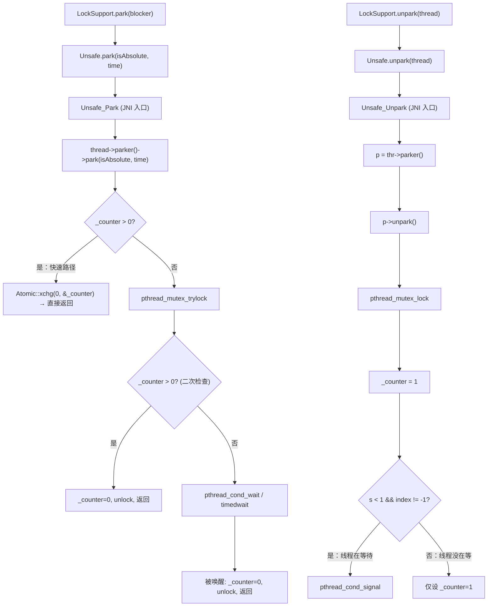
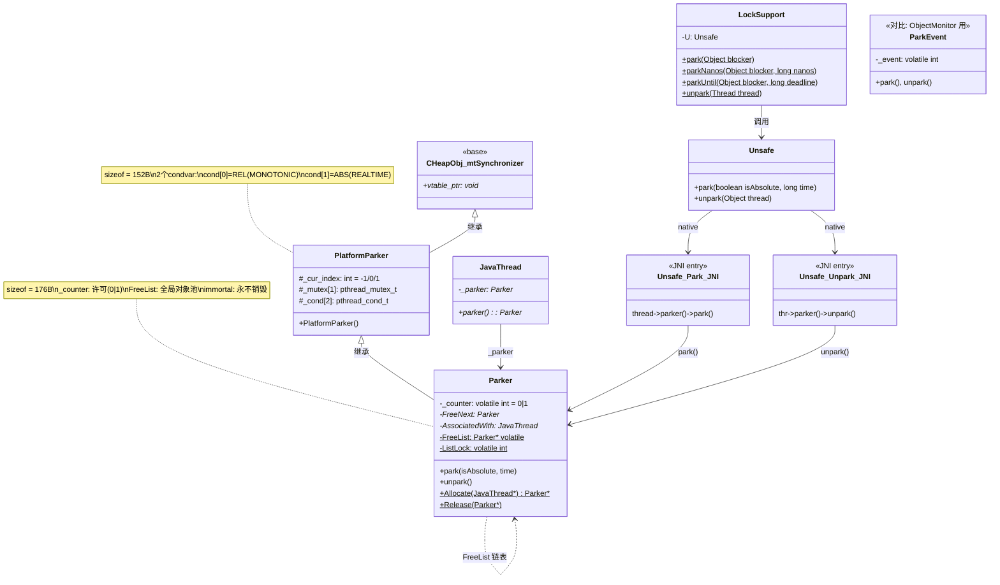

# Day 37：Parker / LockSupport.park/unpark 深度剖析

> 纯源码分析，基于 OpenJDK 11 slowdebug  
> 方法论：程序 = 数据结构 + 算法  
> 标准环境：`-Xms8g -Xmx8g -XX:+UseG1GC`，G1 Region = 4MB

---

## 第 0 部分：核心原理 ⭐

### 0.1 本质是什么？

本文深入分析 **Day 37：Parker / LockSupport.park/unpark 深度剖析**：从源码角度理解其设计原理、实现机制和关键细节。

### 0.2 为什么需要？

理解 JVM 内部实现是排查复杂问题、进行性能优化的基础。表面的 API 文档无法解释 JVM 的实际行为，只有深入源码才能建立精确的心智模型。

### 0.3 怎么解决？

结合源码阅读、数据结构分析和 GDB 运行时验证，从多个角度建立对该机制的完整理解。

### 0.4 为什么这样设计？

每个设计决策都有其权衡：性能 vs 正确性、简单性 vs 灵活性、内存占用 vs 查找速度。理解这些权衡是理解 JVM 设计的关键。

---


## 一、宏观理解

### 1.1 解决什么问题

`java.util.concurrent`（JUC）中的所有锁和同步工具（`ReentrantLock`、`Condition`、`CountDownLatch`、`Semaphore`、`CompletableFuture` 等）都需要一种 **线程阻塞/唤醒原语**。

传统的 `Object.wait()/notify()` 有两个硬伤：
1. **必须持有 monitor 锁**才能调用，API 约束太强
2. **notify 必须在 wait 之后**才有效，否则信号丢失（lost wakeup）

Doug Lea 在 JSR-166 中设计了 `LockSupport.park()/unpark()` 来解决这两个问题：
- **不需要持有任何锁**就能调用
- **unpark 可以在 park 之前调用**，许可不会丢失（因为有 `_counter` 许可计数器）
- **每个线程一个许可**（0 或 1，不累加），语义简单

底层实现就是 `Parker` 类 —— 每个 `JavaThread` 持有一个 `Parker` 实例（`_parker` 字段），用 POSIX 的 `pthread_mutex` + `pthread_cond` 实现阻塞/唤醒。

### 1.2 总体调用链



### 1.3 涉及的数据结构清单

| # | 数据结构 | 源码位置 | 核心作用 |
|---|---------|---------|---------|
| 1 | **PlatformParker** | `os_posix.hpp:205-220` | POSIX 平台基类：1 个 mutex + 2 个 condvar |
| 2 | **Parker** | `park.hpp:48-75` | 继承 PlatformParker，增加 `_counter` 许可 + FreeList 管理 |
| 3 | **LockSupport** | `LockSupport.java:139-431` | Java 层 API：park/unpark/parkNanos/parkUntil |
| 4 | **ParkEvent** (对比) | `park.hpp:118-164` | ObjectMonitor 用的阻塞原语（与 Parker 对比） |

---

## 二、数据结构全景

### 2.1 PlatformParker（POSIX 平台基类）

**源码**：`src/hotspot/os/posix/os_posix.hpp:205-220`

**解决什么问题**：提供平台相关的同步原语（mutex + condvar），Parker 继承它来实现跨平台阻塞。

```cpp
// os_posix.hpp:205-220
class PlatformParker : public CHeapObj<mtSynchronizer> {
 protected:
  enum {
    REL_INDEX = 0,    // 相对超时用的 condvar 索引
    ABS_INDEX = 1     // 绝对超时用的 condvar 索引
  };
  int _cur_index;             // 当前使用哪个 cond：-1=未使用, 0=REL, 1=ABS
  pthread_mutex_t _mutex[1];  // 互斥锁（数组写法是为了取地址方便）
  pthread_cond_t  _cond[2];   // ★ 两个条件变量！
                              //   _cond[0]：相对超时（关联 CLOCK_MONOTONIC）
                              //   _cond[1]：绝对超时（关联系统默认时钟）

 public:
  ~PlatformParker() { guarantee(false, "invariant"); }  // 析构 = 不可达

 public:
  PlatformParker();
};
```

**字段完整表**（GDB 验证 sizeof = 152B）：

| 偏移 | 字段 | 类型 | 大小 | 含义 |
|------|------|------|------|------|
| 0 | _vtable_ptr | void* | 8B | CHeapObj 虚表指针 |
| 8 | `_cur_index` | int | 4B | 当前使用的 condvar 索引：-1/0/1 |
| 12 | (padding) | - | 4B | 对齐到 8B |
| 16 | `_mutex[0]` | pthread_mutex_t | 40B | POSIX 互斥锁 |
| 56 | `_cond[0]` | pthread_cond_t | 48B | REL condvar（CLOCK_MONOTONIC） |
| 104 | `_cond[1]` | pthread_cond_t | 48B | ABS condvar（默认时钟） |
| **152** | | | | **总大小** |

**为什么需要两个 condvar**：

`pthread_cond_timedwait` 的超时参数是 **绝对时间**（`struct timespec`）。但绝对时间有两种时钟：
- **CLOCK_MONOTONIC**（单调时钟）：不受系统时间调整影响，适合 **相对超时**（如 `parkNanos(100ms)`）
- **默认时钟（CLOCK_REALTIME）**：系统时间，适合 **绝对超时**（如 `parkUntil(deadline)`）

condvar 在创建时就绑定了时钟类型（通过 `pthread_condattr_setclock`），不能运行时切换。因此需要两个 condvar。

**构造函数**（`os_posix.cpp:2141-2150`）：

```cpp
// os_posix.cpp:2141-2150
os::PlatformParker::PlatformParker() {
  int status;
  // _cond[0]：REL，绑定 CLOCK_MONOTONIC（通过全局 _condAttr）
  status = pthread_cond_init(&_cond[REL_INDEX], _condAttr);
  assert_status(status == 0, status, "cond_init rel");
  // _cond[1]：ABS，使用默认时钟（传 NULL）
  status = pthread_cond_init(&_cond[ABS_INDEX], NULL);
  assert_status(status == 0, status, "cond_init abs");
  // mutex 初始化，类型 PTHREAD_MUTEX_NORMAL（非递归）
  status = pthread_mutex_init(_mutex, _mutexAttr);
  assert_status(status == 0, status, "mutex_init");
  _cur_index = -1; // ★ -1 表示未使用
}
```

**`_condAttr` 全局配置**（`os_posix.cpp:1695-1831`）：

JVM 启动时在 `os::Posix::init()` 中配置 `_condAttr`：
1. 通过 `dlsym` 查找 `pthread_condattr_setclock` 函数
2. 如果支持，调用 `pthread_condattr_setclock(_condAttr, CLOCK_MONOTONIC)` 绑定单调时钟
3. 设置 `_use_clock_monotonic_condattr = true`

可通过 JVM 参数 `-Xlog:os` 查看：
```
[info][os] Use of CLOCK_MONOTONIC is supported
[info][os] Use of pthread_condattr_setclock is supported
[info][os] Relative timed-wait using pthread_cond_timedwait is associated with CLOCK_MONOTONIC
```

---

### 2.2 Parker（JSR166 许可管理器）

**源码**：`src/hotspot/share/runtime/park.hpp:48-75` + `park.cpp:122-166`

**解决什么问题**：在 PlatformParker 提供的 mutex+condvar 基础上，增加 **许可语义**（`_counter`）+ **对象池管理**（FreeList），供 `LockSupport.park/unpark` 使用。

```cpp
// park.hpp:48-75
class Parker : public os::PlatformParker {
private:
  volatile int _counter;       // ★ 许可计数器：0 = 无许可, 1 = 有许可
  Parker * FreeNext;           // FreeList 链表下一个节点
  JavaThread * AssociatedWith; // 当前关联的 JavaThread

public:
  Parker() : PlatformParker() {
    _counter       = 0;    // 初始无许可
    FreeNext       = NULL;
    AssociatedWith = NULL;
  }
protected:
  ~Parker() { ShouldNotReachHere(); } // ★ 析构不可达 → 对象不朽

public:
  void park(bool isAbsolute, jlong time);  // 阻塞
  void unpark();                            // 唤醒

  // 生命周期管理（对象池模式）
  static Parker * Allocate (JavaThread * t);
  static void Release (Parker * e);

private:
  static Parker * volatile FreeList;   // 全局空闲列表
  static volatile int ListLock;        // 保护 FreeList 的自旋锁
};
```

**字段完整表**（GDB 验证 sizeof = 176B）：

| 偏移 | 字段 | 类型 | 大小 | 含义 |
|------|------|------|------|------|
| 0-151 | (PlatformParker 基类) | - | 152B | vtable + _cur_index + _mutex + _cond[2] |
| 152 | `_counter` | volatile int | 4B | ★ 许可计数器（0 或 1） |
| 156 | (padding) | - | 4B | 对齐到 8B |
| 160 | `FreeNext` | Parker* | 8B | FreeList 链表指针 |
| 168 | `AssociatedWith` | JavaThread* | 8B | 关联的线程 |
| **176** | | | | **总大小** |

**静态字段**（`park.cpp:122-123`）：

| 字段 | 类型 | 初始值 | 含义 |
|------|------|-------|------|
| `FreeList` | `Parker * volatile` | NULL | 全局空闲 Parker 链表头 |
| `ListLock` | `volatile int` | 0 | 保护 FreeList 的自旋锁 |

**`_counter` 值域图**：

```
_counter 值域（只有两个有效值）：
┌────────────────────────────────────────────────┐
│  0：无许可 — park() 将阻塞                       │
│  1：有许可 — park() 将立即返回并消耗许可           │
│                                                │
│  ★ 关键设计：最多为 1，unpark 多次也不累加         │
│    → Atomic::xchg(0, &_counter) 原子交换          │
│    → 如果交换出 1，说明有许可，直接返回             │
│    → 如果交换出 0，说明无许可，需要 condvar wait   │
└────────────────────────────────────────────────┘
```

**`_cur_index` 值域图**：

```
_cur_index 值域（三种状态）：
┌────────────────────────────────────────────────┐
│  -1：线程未在等待                                │
│   0 (REL_INDEX)：线程在 _cond[0] 上等待（相对超时）│
│   1 (ABS_INDEX)：线程在 _cond[1] 上等待（绝对超时）│
│                                                │
│  ★ unpark 时检查 _cur_index：                    │
│    - 如果 == -1 → 线程没在等，只需设 _counter=1   │
│    - 如果 >= 0  → 线程在等，需要 signal 对应 cond │
└────────────────────────────────────────────────┘
```

**创建位置**：`JavaThread` 构造函数（`thread.cpp:1758`）

```cpp
// thread.cpp:1758
_parker = Parker::Allocate(this);  // 每个 JavaThread 构造时分配一个 Parker
```

**销毁位置**：`JavaThread` 析构函数（`thread.cpp:1876`）

```cpp
// thread.cpp:1876
Parker::Release(_parker);  // 归还到 FreeList，Parker 对象本身不销毁（immortal）
```

**生命周期**：

```
JavaThread 构造 → Parker::Allocate(this)
                   ├── 优先从 FreeList 回收已有 Parker
                   └── 不够则 new Parker()
                 → _parker 字段指向该 Parker
                 → AssociatedWith = this

JavaThread 使用 → thread->parker()->park() / unpark()

JavaThread 析构 → Parker::Release(_parker)
                   → AssociatedWith = NULL
                   → 放回 FreeList
                   → Parker 对象不销毁（type-stable / immortal）
```

**为什么 Parker 是不朽（immortal）的？**

源码注释（`park.hpp:35-40`）解释了关键原因：

> *To avoid errors where an os thread expires but the JavaThread still exists, Parkers are immortal (type-stable) and are recycled across new threads. Because park-unpark allow spurious wakeups it is harmless if an unpark call unparks a new thread using the old Parker reference.*

核心问题：`unpark(thread)` 获取 `Parker*` 后，目标线程可能已经退出、Parker 被销毁。如果 Parker 被释放了，访问已释放内存 = crash。

解决方案：Parker **永不销毁**，只是放回 FreeList 供新线程复用。即使旧引用指向了被其他线程复用的 Parker，最坏结果只是一次虚假唤醒（spurious wakeup），不会 crash。

---

### 2.3 LockSupport（Java 层 API）

**源码**：`src/java.base/share/classes/java/util/concurrent/locks/LockSupport.java`

**解决什么问题**：提供 Java 层面的线程阻塞/唤醒 API，是 JUC 的基石。

```java
// LockSupport.java:139-431
public class LockSupport {
    private LockSupport() {} // 不可实例化

    private static final Unsafe U = Unsafe.getUnsafe();
    private static final long PARKBLOCKER = U.objectFieldOffset(Thread.class, "parkBlocker");

    // ★ 核心方法 1：无限期阻塞（带 blocker 用于诊断）
    public static void park(Object blocker) {
        Thread t = Thread.currentThread();
        setBlocker(t, blocker);      // 设置 blocker（用于 jstack/JFR 显示）
        U.park(false, 0L);           // → Unsafe_Park → Parker::park(false, 0)
        setBlocker(t, null);         // 返回后清除 blocker
    }

    // ★ 核心方法 2：相对超时阻塞（纳秒）
    public static void parkNanos(Object blocker, long nanos) {
        if (nanos > 0) {
            Thread t = Thread.currentThread();
            setBlocker(t, blocker);
            U.park(false, nanos);    // isAbsolute=false, time=nanos
            setBlocker(t, null);
        }
    }

    // ★ 核心方法 3：绝对超时阻塞（毫秒，从 Epoch 算起）
    public static void parkUntil(Object blocker, long deadline) {
        Thread t = Thread.currentThread();
        setBlocker(t, blocker);
        U.park(true, deadline);      // isAbsolute=true, time=deadline(ms)
        setBlocker(t, null);
    }

    // ★ 核心方法 4：唤醒
    public static void unpark(Thread thread) {
        if (thread != null)
            U.unpark(thread);        // → Unsafe_Unpark → Parker::unpark()
    }

    // 无 blocker 版本（不推荐，诊断信息缺失）
    public static void park() {
        U.park(false, 0L);
    }

    // blocker 查询（jstack 用）
    public static Object getBlocker(Thread t) {
        if (t == null) throw new NullPointerException();
        return U.getObjectVolatile(t, PARKBLOCKER);
    }

    // blocker 设置（通过 Unsafe 直接写 Thread.parkBlocker 字段）
    private static void setBlocker(Thread t, Object arg) {
        U.putObject(t, PARKBLOCKER, arg);
    }
}
```

**API 参数解码表**：

| 方法 | isAbsolute | time | 含义 |
|------|-----------|------|------|
| `park()` / `park(blocker)` | false | 0 | 无限期阻塞 |
| `parkNanos(blocker, nanos)` | false | nanos | 相对超时（纳秒） |
| `parkUntil(blocker, deadline)` | true | deadline(ms) | 绝对超时（毫秒，Epoch） |

**blocker 字段**：

`Thread.parkBlocker` 是 `java.lang.Thread` 中的一个 `volatile Object` 字段，由 `LockSupport` 通过 `Unsafe.putObject` 直接写入（绕过 setter，避免同步开销）。诊断工具（`jstack`/`ThreadMXBean`/`JFR`）读取此字段来显示线程被谁阻塞。

---

### 2.4 ParkEvent vs Parker 对比

为理解 Parker 的设计定位，有必要与 ParkEvent 对比。

| 特性 | Parker | ParkEvent |
|------|--------|-----------|
| **用途** | JSR166 `LockSupport.park/unpark` | JVM 内部 `synchronized` / `ObjectMonitor` |
| **关联线程类型** | `JavaThread*` | `Thread*`（更通用） |
| **许可语义** | `_counter`（0/1），unpark 可先于 park | `_event`（-1/0/1），类似信号量 |
| **condvar 数量** | 2 个（REL + ABS） | 1 个 |
| **额外字段** | 无 | `ListNext`/`OnList`/`TState`/`Notified`（链表管理） |
| **sizeof** | 176B | 192B |
| **使用者** | `Unsafe_Park` / `Unsafe_Unpark` | `ObjectMonitor::enter/exit/wait/notify` |
| **源码注释态度** | "Eventually we'll merge these" | 更成熟，字段更多 |

两者有 **大量重复**（都是 mutex+condvar+FreeList+immortal），源码注释多次提到要合并，但到 JDK 11 仍未合并。

---

## 三、算法/流程分析

### 3.1 Parker::Allocate — 对象池分配

**解决什么问题**：每个 JavaThread 需要一个 Parker 实例。频繁 new/delete 有两个问题：(1) 性能差；(2) 并发安全问题（unpark 可能引用已删除对象）。对象池 + immortal 设计同时解决两个问题。

**源码**：`park.cpp:125-151`

```cpp
// park.cpp:125-151
Parker * Parker::Allocate (JavaThread * t) {
  guarantee (t != NULL, "invariant") ;   // ★ Parker 只给 JavaThread 用
  Parker * p ;

  // ★ 第一步：尝试从 FreeList 回收
  // 使用自旋锁而非 mutex，因为 Parker 本身就是 mutex 实现的一部分
  Thread::SpinAcquire(&ListLock, "ParkerFreeListAllocate");
  {
    p = FreeList;
    if (p != NULL) {
      FreeList = p->FreeNext;    // 摘下链表头
    }
  }
  Thread::SpinRelease(&ListLock);

  if (p != NULL) {
    guarantee (p->AssociatedWith == NULL, "invariant") ;  // 回收的必须已解除关联
  } else {
    // ★ 第二步：FreeList 空，创建新 Parker（C++ new，永不 delete）
    p = new Parker() ;
  }
  p->AssociatedWith = t ;     // 建立关联
  p->FreeNext       = NULL ;
  return p ;
}
```

**设计决策**：
- 用 `Thread::SpinAcquire`（CAS 自旋锁）而不是 `pthread_mutex_lock`，因为 Parker 自身就参与 mutex 的实现，不能循环依赖
- `new Parker()` 后永不 `delete`（析构函数是 `ShouldNotReachHere()`），这就是 **type-stable memory (TSM)** 设计

### 3.2 Parker::Release — 归还对象池

**源码**：`park.cpp:154-166`

```cpp
// park.cpp:154-166
void Parker::Release (Parker * p) {
  if (p == NULL) return ;
  guarantee (p->AssociatedWith != NULL, "invariant") ; // 必须有关联
  guarantee (p->FreeNext == NULL      , "invariant") ; // 不在 FreeList 上
  p->AssociatedWith = NULL ;   // ★ 解除关联

  // 放回 FreeList 头部
  Thread::SpinAcquire(&ListLock, "ParkerFreeListRelease");
  {
    p->FreeNext = FreeList;
    FreeList = p;              // 头插法
  }
  Thread::SpinRelease(&ListLock);
}
```

### 3.3 Parker::park — 核心阻塞算法 ⭐

**解决什么问题**：实现"如果有许可则消耗许可立即返回，否则阻塞等待唤醒/超时/中断"的语义。

**源码**：`os_posix.cpp:2158-2241`

**阶段划分**：

| 阶段 | 行号 | 核心逻辑 |
|------|------|---------|
| 1. 快速路径 | 2164 | `Atomic::xchg` 检查 `_counter` |
| 2. 中断检查 | 2172-2174 | 已中断则直接返回 |
| 3. 时间解码 | 2176-2183 | 解析 isAbsolute/time 参数 |
| 4. 进入安全点 | 2191 | `ThreadBlockInVM` 构造 |
| 5. 获取锁 | 2195-2198 | `pthread_mutex_trylock` |
| 6. 二次检查 | 2201-2208 | 持锁后再检 `_counter` |
| 7. 等待 | 2216-2227 | `pthread_cond_wait` / `timedwait` |
| 8. 唤醒后清理 | 2228-2240 | 重置状态 + 外部挂起检查 |

**完整源码 + 逐行注释**：

```cpp
// os_posix.cpp:2158-2241
void Parker::park(bool isAbsolute, jlong time) {

  // ===== 阶段 1：快速路径 =====
  // ★ 无锁检查：原子交换 _counter 为 0，如果之前是 1 说明有许可
  // Atomic::xchg 提供全屏障（full barrier），保证内存可见性
  if (Atomic::xchg(0, &_counter) > 0) return;   // 有许可，消耗并返回

  // ===== 阶段 2：中断检查 =====
  Thread* thread = Thread::current();
  assert(thread->is_Java_thread(), "Must be JavaThread");
  JavaThread *jt = (JavaThread *)thread;

  // ★ 优化：如果已中断，不值得进入 condvar wait（避免状态转换开销）
  // 注意 false = 不清除中断标志，由 Java 层决定是否清除
  if (Thread::is_interrupted(thread, false)) {
    return;
  }

  // ===== 阶段 3：时间参数解码 =====
  struct timespec absTime;
  if (time < 0 || (isAbsolute && time == 0)) { // 非法参数 → 不等
    return;
  }
  if (time > 0) {
    // ★ 将相对/绝对时间统一转为 abstime
    // 如果 isAbsolute=false 且支持 CLOCK_MONOTONIC，用单调时钟计算
    // 如果 isAbsolute=true，用系统时钟（毫秒 → timespec）
    to_abstime(&absTime, time, isAbsolute);
  }

  // ===== 阶段 4：进入安全点 =====
  // ★ ThreadBlockInVM 构造器将线程状态从 _thread_in_vm → _thread_blocked
  //   这让 VM 知道此线程"安全"了（不会访问 Java 堆），SafePoint 无需等它
  // 注意：必须在获取 Parker::_mutex 之前转换状态！
  //   否则 SafePoint 等待线程释放 _mutex → 线程等 SafePoint 完成 → 死锁
  ThreadBlockInVM tbivm(jt);

  // ===== 阶段 5：获取锁 =====
  // ★ 用 trylock 而不是 lock！
  //   如果 trylock 失败 → 说明有人正在 unpark（持有 _mutex 设置 _counter=1）
  //   → 不需要等了，直接返回（等价于"被唤醒了"）
  // 再次检查中断，因为阶段 4 的状态转换可能耗时
  if (Thread::is_interrupted(thread, false) ||
      pthread_mutex_trylock(_mutex) != 0) {
    return;
  }

  // ===== 阶段 6：持锁后二次检查 =====
  int status;
  if (_counter > 0)  { // ★ 在获取锁期间，可能有人 unpark 了
    _counter = 0;      // 消耗许可
    status = pthread_mutex_unlock(_mutex);
    assert_status(status == 0, status, "invariant");
    OrderAccess::fence();   // ★ 全屏障：保证 lock-free 路径和 locked 路径的内存可见性
    return;
  }

  // ===== 阶段 7：真正等待 =====
  // 设置 OSThread 状态为 CONDVAR_WAIT（用于诊断工具显示）
  OSThreadWaitState osts(thread->osthread(), false /* not Object.wait() */);
  // 设置挂起等价标记（用于外部挂起 suspend 机制）
  jt->set_suspend_equivalent();

  assert(_cur_index == -1, "invariant"); // 进入前必须是"未使用"
  if (time == 0) {
    // ★ 无限期等待：选择 REL condvar（任意选择，因为不需要超时）
    _cur_index = REL_INDEX; // 设为 0，unpark 通过此值知道在哪个 cond 上等
    status = pthread_cond_wait(&_cond[_cur_index], _mutex);
    assert_status(status == 0 MACOS_ONLY(|| status == ETIMEDOUT),
                  status, "cond_wait");
  }
  else {
    // ★ 超时等待：根据 isAbsolute 选择对应 condvar
    _cur_index = isAbsolute ? ABS_INDEX : REL_INDEX;
    status = pthread_cond_timedwait(&_cond[_cur_index], _mutex, &absTime);
    assert_status(status == 0 || status == ETIMEDOUT,
                  status, "cond_timedwait");
  }

  // ===== 阶段 8：唤醒后清理 =====
  _cur_index = -1;     // ★ 重置为"未使用"（必须在持锁时设置）

  _counter = 0;        // ★ 消耗许可（无论是被 unpark 唤醒还是超时）
  status = pthread_mutex_unlock(_mutex);
  assert_status(status == 0, status, "invariant");
  OrderAccess::fence();  // 全屏障

  // ★ 如果在等待期间被外部 suspend，需要自我挂起
  if (jt->handle_special_suspend_equivalent_condition()) {
    jt->java_suspend_self();
  }
}
```

**关键设计决策**：

1. **为什么用 `pthread_mutex_trylock` 而不是 `pthread_mutex_lock`？**
   - 如果 trylock 失败，说明 unpark 正在持有 _mutex → 意味着 `_counter` 即将被设为 1 → park 没必要等了
   - 避免在持有 Parker mutex 的情况下被 SafePoint 阻塞（死锁风险）

2. **为什么 `_counter` 在唤醒后也要清零？**
   - 无论唤醒原因（unpark/超时/虚假唤醒），许可都被"消耗"了
   - 保证下次 park 会重新阻塞（除非又有新的 unpark）

3. **为什么需要 `OrderAccess::fence()`？**
   - Parker 有两条路径访问 `_counter`：lock-free 快速路径（`Atomic::xchg`）和 locked 路径（`pthread_mutex` 保护下）
   - 两条路径必须互相可见，全屏障确保一致性

### 3.4 Parker::unpark — 唤醒算法

**解决什么问题**：发放许可（`_counter=1`），如果目标线程正在 park，唤醒它。

**源码**：`os_posix.cpp:2243-2266`

```cpp
// os_posix.cpp:2243-2266
void Parker::unpark() {
  // ★ 第一步：获取锁（注意是 lock 不是 trylock）
  int status = pthread_mutex_lock(_mutex);
  assert_status(status == 0, status, "invariant");

  // ★ 第二步：保存旧 _counter 值，设新值为 1
  const int s = _counter;
  _counter = 1;               // 发放许可

  // ★ 第三步：捕获 _cur_index（必须在 unlock 前）
  int index = _cur_index;

  // ★ 第四步：释放锁
  status = pthread_mutex_unlock(_mutex);
  assert_status(status == 0, status, "invariant");

  // ★ 第五步：在释放锁之后发信号
  // 为什么在 unlock 之后 signal？
  //   (a) 避免 "futile wakeup"：如果在 unlock 前 signal，被唤醒的线程
  //       立即尝试获取 _mutex 但 _mutex 还被持有 → 又被阻塞 → 白唤醒
  //   (b) Parker 对象是 immortal 的，unlock 后 Parker 不会被销毁
  //   (c) 最坏情况：unlock 后另一个线程获得了这个 Parker（重用）
  //       → signal 发给了错误的线程 → 只是一次虚假唤醒，无害
  if (s < 1 && index != -1) {
    // ★ s < 1：之前 _counter 为 0，说明线程可能在等
    // index != -1：线程确实在某个 cond 上等待
    status = pthread_cond_signal(&_cond[index]);
    assert_status(status == 0, status, "invariant");
  }
}
```

**关键设计决策**：

1. **为什么用 `pthread_mutex_lock` 而不是 `trylock`？**
   - unpark 必须保证 `_counter=1` 被设置成功
   - 如果 trylock 失败就放弃，许可就丢了 → 违反语义

2. **先 unlock 后 signal（signal-after-unlock）**：
   - 传统教科书建议 "先 signal 后 unlock"，但 JVM 选择相反
   - 原因是避免 **futile wakeup**（被唤醒的线程立即又阻塞在 mutex 上）
   - 这在不支持 **wait morphing** 的平台上特别有益
   - 代价是可能导致极罕见的虚假唤醒 → park 语义本身就允许虚假唤醒，无害

3. **`s < 1 && index != -1` 双重条件**：
   - `s < 1`：之前 `_counter` 为 0，说明不是重复 unpark
   - `index != -1`：线程确实在 condvar 上等待（而不是在快速路径上返回了）
   - 两个条件同时满足才发 signal，避免不必要的系统调用

### 3.5 Unsafe_Park / Unsafe_Unpark — JNI 入口

**解决什么问题**：连接 Java 层 `Unsafe.park()/unpark()` 和 C++ 层 `Parker::park()/unpark()`。

#### Unsafe_Park（`unsafe.cpp:939-958`）

```cpp
// unsafe.cpp:939-958
UNSAFE_ENTRY(void, Unsafe_Park(JNIEnv *env, jobject unsafe, jboolean isAbsolute, jlong time)) {
  // ★ DTRACE 探测点（可用于性能分析）
  HOTSPOT_THREAD_PARK_BEGIN((uintptr_t) thread->parker(), (int) isAbsolute, time);
  EventThreadPark event;   // JFR 事件对象

  // ★ 设置线程状态为 PARKED / PARKED_TIMED（供 jstack/ThreadMXBean 显示）
  JavaThreadParkedState jtps(thread, time != 0);

  // ★ 核心调用
  thread->parker()->park(isAbsolute != 0, time);

  // ★ 发送 JFR 事件（如果 JFR 开启）
  if (event.should_commit()) {
    const oop obj = thread->current_park_blocker();
    if (time == 0) {
      post_thread_park_event(&event, obj, min_jlong, min_jlong);
    } else {
      if (isAbsolute != 0) {
        post_thread_park_event(&event, obj, min_jlong, time);
      } else {
        post_thread_park_event(&event, obj, time, min_jlong);
      }
    }
  }
  HOTSPOT_THREAD_PARK_END((uintptr_t) thread->parker());
} UNSAFE_END
```

`JavaThreadParkedState` 是一个 RAII 对象（`threadService.hpp:506-521`），构造时将 Java 层线程状态设为 `PARKED` 或 `PARKED_TIMED`，析构时恢复原状。这就是 `jstack` 里看到 `WAITING (parking)` 或 `TIMED_WAITING (parking)` 的来源。

#### Unsafe_Unpark（`unsafe.cpp:960-983`）

```cpp
// unsafe.cpp:960-983
UNSAFE_ENTRY(void, Unsafe_Unpark(JNIEnv *env, jobject unsafe, jobject jthread)) {
  Parker* p = NULL;

  if (jthread != NULL) {
    // ★ 通过 ThreadsListHandle 安全地查找目标 JavaThread
    //   ThreadsListHandle 持有线程快照引用，防止线程在查找期间被销毁
    ThreadsListHandle tlh;
    JavaThread* thr = NULL;
    oop java_thread = NULL;
    (void) tlh.cv_internal_thread_to_JavaThread(jthread, &thr, &java_thread);
    if (java_thread != NULL) {
      if (thr != NULL) {
        p = thr->parker();     // ★ 获取目标线程的 Parker
      }
    }
  } // ★ ThreadsListHandle 在此销毁

  // 'p' 指向 type-stable-memory（不会被释放）
  // 即使目标线程在这里退出了，p 仍然有效（Parker immortal）
  // 新使用此 Parker 的线程只会收到一次虚假唤醒
  if (p != NULL) {
    HOTSPOT_THREAD_UNPARK((uintptr_t) p);
    p->unpark();
  }
} UNSAFE_END
```

**关键设计**：`ThreadsListHandle` 释放后，`p` 仍然可以安全使用，因为 Parker 是 immortal 的。

### 3.6 Thread.interrupt() 对 Parker 的影响

**源码**：`os_posix.cpp:755-765`

Day 36 已分析过 `os::interrupt()`，这里补充它与 Parker 的交互：

```cpp
// os_posix.cpp:755-765（摘取关键行）
void os::interrupt(Thread* thread) {
  // ...
  osthread->set_interrupted(true);
  OrderAccess::fence();

  ParkEvent * const slp = thread->_SleepEvent;
  if (slp != NULL) slp->unpark();

  if (thread->is_Java_thread())
    ((JavaThread*)thread)->parker()->unpark();   // ★ 唤醒 park 中的线程

  ParkEvent * ev = thread->_ParkEvent;
  if (ev != NULL) ev->unpark();
}
```

`Thread.interrupt()` 会同时唤醒三种可能的阻塞：
1. `_SleepEvent->unpark()` — 唤醒 `Thread.sleep()`
2. `parker()->unpark()` — **唤醒 `LockSupport.park()`** ⭐
3. `_ParkEvent->unpark()` — 唤醒 `synchronized` / `Object.wait()`

注意：`Parker::park()` 的阶段 2 和阶段 5 都检查了中断标志。如果已中断，park 直接返回而不阻塞。但 **park 不会清除中断标志** —— 这与 `Object.wait()`（会清除并抛 `InterruptedException`）不同。

---

## 四、GDB 验证

### 4.1 sizeof / offset 验证

**GDB 脚本**：`new-jvm-md/tmp-file/parker-locksupport/verify_sizeof.gdb`

| 数据结构 | 实际 sizeof | 说明 |
|---------|------------|------|
| **PlatformParker** | **152B** | vtable(8) + _cur_index(4) + pad(4) + mutex(40) + cond×2(96) |
| **Parker** | **176B** | PlatformParker(152) + _counter(4) + pad(4) + FreeNext(8) + AssociatedWith(8) |
| **ParkEvent** | **192B** | PlatformEvent(152) + FreeNext(8) + AssociatedWith(8) + ListNext(8) + OnList(8) + TState(4) + Notified(4) |
| pthread_mutex_t | 40B | NPTL 实现 |
| pthread_cond_t | 48B | NPTL 实现 |

**关键字段偏移**：

| 字段 | 偏移 | 验证 |
|------|------|------|
| PlatformParker::_cur_index | 8 | ✅ |
| PlatformParker::_mutex | 16 | ✅ |
| PlatformParker::_cond[0] | 56 | ✅ |
| PlatformParker::_cond[1] | 104 | ✅ |
| Parker::_counter | 152 | ✅ |
| JavaThread::_parker | 1872 | ✅ |

### 4.2 运行时断点验证

**GDB 脚本**：`new-jvm-md/tmp-file/parker-locksupport/verify_runtime.gdb`

**测试类**：`ParkerTest.java` — 创建子线程 park，主线程 unpark，然后主线程 timed park。

| # | 验证项 | 断点 | 预期 | 实际 | 结果 |
|---|--------|------|------|------|------|
| 1 | Parker::Allocate 调用次数 | `Parker::Allocate` | 每个 JavaThread 一次 | 7 次（7 个 JavaThread） | ✅ |
| 2 | park 时 _counter 初始值 | `Parker::park` | 0 | `_counter = 0` | ✅ |
| 3 | park 时 _cur_index 初始值 | `Parker::park` | -1 | `_cur_index = -1` | ✅ |
| 4 | 无限期 park 参数 | `Unsafe_Park` | isAbsolute=0, time=0 | `isAbsolute = 0, time = 0` | ✅ |
| 5 | unpark 时 _counter | `Parker::unpark` | 0（目标在等） | `_counter (before) = 0` | ✅ |
| 6 | unpark 时 _cur_index | `Parker::unpark` | 0（REL_INDEX） | `_cur_index = 0` | ✅ |
| 7 | park/unpark 同一个 Parker | 地址对比 | 相同 | `0x7ffff0f7edc0` → `0x7ffff0f7edc0` | ✅ |
| 8 | timed park 参数 | `Unsafe_Park` | isAbsolute=0, time=100000000 | `isAbsolute = 0, time = 100000000` | ✅ |
| 9 | timed park _counter | `Parker::park` | 0 | `_counter = 0, _cur_index = -1` | ✅ |
| 10 | 程序正常退出 | `before_exit` | 命中 | ✅ | ✅ |

**10/10 全部通过** ✅

### 4.3 测试类

```java
// demo/src/com/wjcoder/ParkerTest.java
package com.wjcoder;
import java.util.concurrent.locks.LockSupport;

public class ParkerTest {
    public static void main(String[] args) throws Exception {
        Thread t = new Thread(() -> {
            System.out.println("[child] before park");
            LockSupport.park();
            System.out.println("[child] after park, interrupted=" +
                Thread.currentThread().isInterrupted());
        }, "parker-test-thread");

        t.start();
        Thread.sleep(200);

        System.out.println("[main] calling unpark");
        LockSupport.unpark(t);
        t.join();

        // timed park test
        System.out.println("[main] timed park test");
        LockSupport.parkNanos(100_000_000L); // 100ms
        System.out.println("[main] timed park returned");
        System.out.println("[main] done");
    }
}
```

---

## 五、数据结构关系图



---

## 六、总结

### 6.1 数据结构层面

| 结构 | sizeof | 核心特征 |
|------|--------|---------|
| **PlatformParker** | 152B | 1 mutex + 2 condvar（REL=MONOTONIC, ABS=REALTIME），POSIX 平台基类 |
| **Parker** | 176B | 继承 PlatformParker，增加 `_counter`(0/1) 许可语义 + FreeList 对象池管理，immortal 不销毁 |
| **LockSupport** | Java 类 | 纯静态方法，通过 Unsafe 调用 Parker，附加 blocker 诊断信息 |

### 6.2 算法层面

| 算法 | 核心设计决策 |
|------|-------------|
| **park()** | 三层检查递进：(1) `Atomic::xchg` 无锁快速路径 → (2) 中断检查 → (3) `trylock`+condvar；用 `trylock` 而非 `lock` 避免死锁 |
| **unpark()** | `_counter=1` 在 mutex 保护下设置，但 `pthread_cond_signal` 在 unlock 后发送（signal-after-unlock 避免 futile wakeup） |
| **Allocate/Release** | 对象池模式 + immortal 设计：Parker 永不销毁，旧引用只导致虚假唤醒不导致 crash |
| **中断交互** | `os::interrupt()` 调用 `parker()->unpark()` 唤醒 park 中的线程；park 不清除中断标志（与 `Object.wait()` 不同） |

### 6.3 park/unpark vs wait/notify 对比

| 特性 | park/unpark | wait/notify |
|------|------------|-------------|
| 需要持锁 | ❌ 不需要 | ✅ 必须在 synchronized 块内 |
| 许可可提前发放 | ✅ unpark 可先于 park | ❌ notify 先于 wait = 信号丢失 |
| 唤醒精度 | ✅ unpark 指定具体线程 | ❌ notify 随机唤醒一个 / notifyAll 全部 |
| 响应中断 | park 返回（不抛异常，不清标志） | wait 抛 InterruptedException（清标志） |
| 底层实现 | Parker: mutex + 2×condvar | ObjectMonitor: mutex + condvar + WaitSet |
| 虚假唤醒 | 允许（语义明确） | 允许（但通常不期望） |
