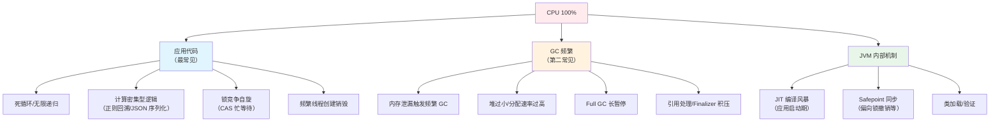
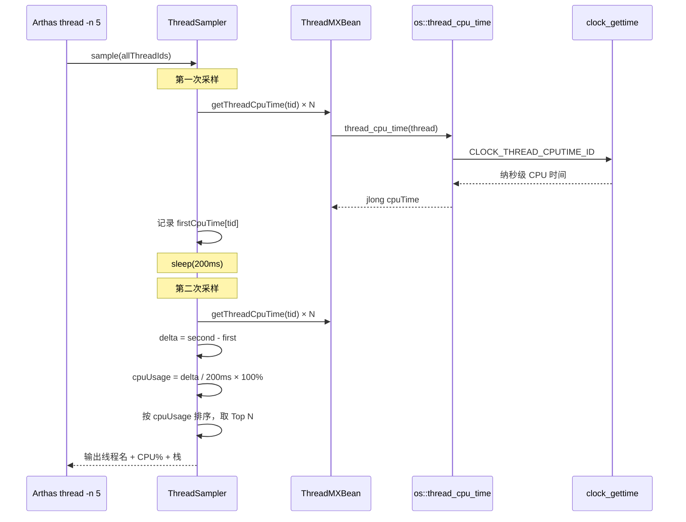
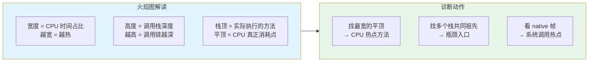
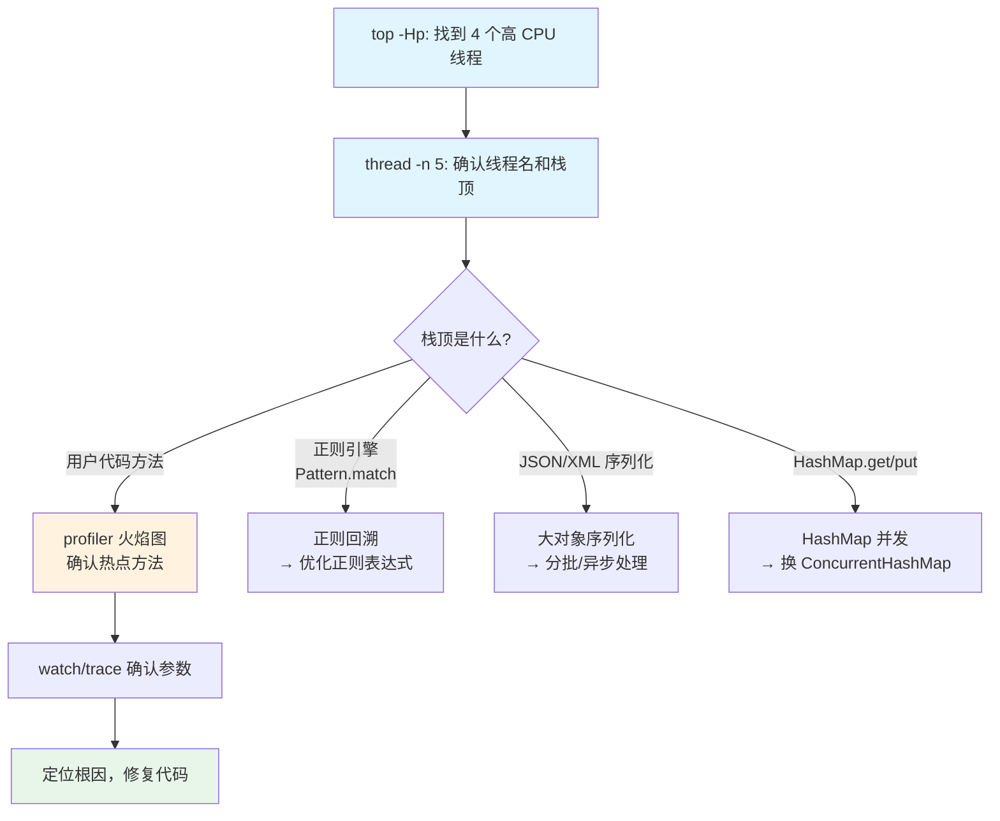
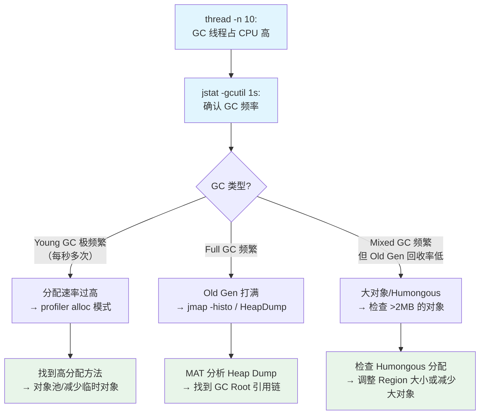
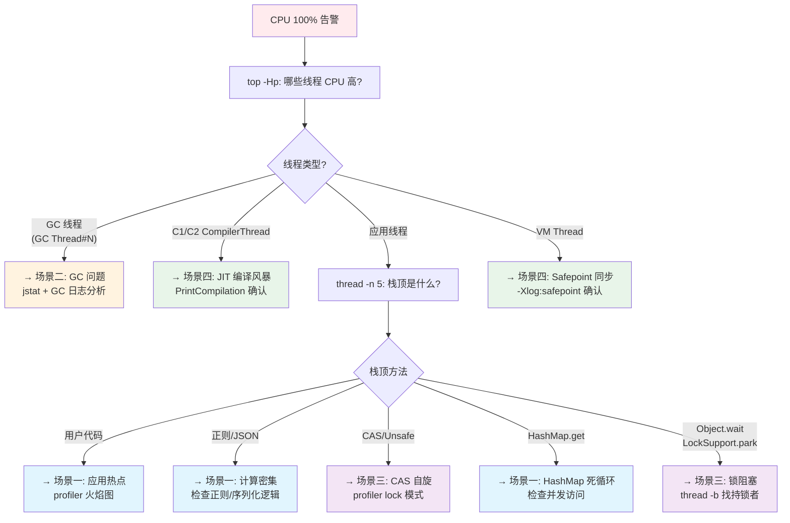

# CPU 100% 实战诊断案例

> 基于 OpenJDK 11 源码 + Arthas 4.1.2 + async-profiler 3.0
> 标准环境：-Xms8g -Xmx8g -XX:+UseG1GC, G1 Region = 4MB
> 源码路径：src/hotspot/share/
> 定位：从问题现象到源码级根因的完整诊断闭环

---

## 第 0 部分：核心原理 ⭐

### 0.1 本质是什么？

本文深入分析 **CPU 100% 实战诊断案例**：从源码角度理解其设计原理、实现机制和关键细节。

### 0.2 为什么需要？

理解 JVM 内部实现是排查复杂问题、进行性能优化的基础。表面的 API 文档无法解释 JVM 的实际行为，只有深入源码才能建立精确的心智模型。

### 0.3 怎么解决？

结合源码阅读、数据结构分析和 GDB 运行时验证，从多个角度建立对该机制的完整理解。

### 0.4 为什么这样设计？

每个设计决策都有其权衡：性能 vs 正确性、简单性 vs 灵活性、内存占用 vs 查找速度。理解这些权衡是理解 JVM 设计的关键。

---


## 0. 核心原理

### 0.1 本质是什么？

CPU 100% 意味着**所有 CPU 核心的计算资源被完全消耗**。对 Java 应用而言，本质只有三种可能：**应用线程在拼命算**、**GC 线程在拼命回收**、**JVM 内部机制在拼命工作**（JIT 编译、Safepoint 同步等）。

### 0.2 为什么需要源码级理解？

因为诊断工具本身就运行在 JVM 之上——不理解工具底层的采样原理，就可能选错工具、误读数据。例如：
- JFR 的 CPU 采样基于 Safepoint 偏差，CPU 密集场景误差可达 99.6%
- `jstack` 每次执行需要 Stop-the-World，高频使用反而加剧问题
- `top -Hp` 看到的线程 CPU 时间需要与 JVM 内部的 `thread_cpu_time` 对应，但 LWP ID 和 Java 线程名之间需要转换

### 0.3 怎么解决？

**分层递进诊断**：OS 级概览（`top`/`vmstat`）→ 线程级定位（Arthas `thread`）→ 方法级热点（async-profiler 火焰图）→ 源码级根因（HotSpot 源码 + GDB 验证）。每一层工具的选择都基于开销和精度的权衡。

---

## 1. CPU 100% 根因分类

在深入诊断之前，必须先建立**根因分类框架**——不同根因需要不同的诊断路径。



**根因与诊断工具的映射**：

| 根因类型 | 现象特征 | 首选诊断工具 | 依据 |
|---------|---------|-------------|------|
| 死循环 | 单线程 CPU 接近 100% | `thread -n 1` → 火焰图 | 单线程持续占用 |
| 计算密集 | 多线程均匀高 CPU | async-profiler CPU 模式 | 需要方法级热点 |
| CAS 自旋 | 多线程高 CPU + RUNNABLE | async-profiler + lock 模式 | 栈顶是 CAS 操作 |
| GC 频繁 | GC 线程占 CPU 高 | GC 日志 + `jstat -gcutil` | GC 线程 CPU 时间 |
| JIT 风暴 | 启动初期 CPU 高 | `-XX:+PrintCompilation` | C1/C2 编译线程 |
| Safepoint | 间歇性 CPU 高 + 延迟毛刺 | `-Xlog:safepoint` | 偏向锁撤销等 |

---

## 2. 诊断工具链：从 OS 到 JVM

### 2.1 第一层：OS 级概览（10 秒定性）

```bash
# 1. 确认是 Java 进程占 CPU
top -c | head -20
# 观察：%CPU 列，COMMAND 列确认是 java

# 2. 查看进程内哪些线程占 CPU
top -Hp <pid>
# 观察：找出 CPU 最高的线程 LWP ID

# 3. LWP ID 转十六进制（对应 jstack 中的 nid）
printf '%x\n' <lwp_id>
# 例如 LWP 12345 → 0x3039

# 4. 系统级概览
vmstat 1 5
# 关键列：us（用户态 CPU）、sy（内核态 CPU）、id（空闲）
# us 高 → 应用代码计算密集
# sy 高 → 系统调用频繁（大量 IO/锁/上下文切换）
```

**OS 级判断逻辑**：

| vmstat 指标 | 含义 | 诊断方向 |
|------------|------|---------|
| us 高 + sy 低 | 用户态计算密集 | 应用代码热点 → 火焰图 |
| us 低 + sy 高 | 内核态忙 | 大量系统调用 → `strace -c` 看系统调用分布 |
| us + sy 都高 | 混合 | 锁竞争（CAS 在用户态，futex 在内核态） |
| cs（上下文切换）高 | 线程频繁切换 | 线程过多/锁竞争 → `pidstat -w` |

### 2.2 第二层：Arthas thread（30 秒定位线程）

**为什么选 `thread` 而不是 `jstack`？**

`jstack` 的问题：
1. 每次执行需要 **Safepoint**（所有线程暂停），高 CPU 时 Safepoint 耗时更长
2. 只能看到**一个时间点**的栈，不知道哪个线程 CPU 高
3. 需要手动匹配 `top -Hp` 的 LWP ID 和 jstack 的 `nid`

Arthas `thread` 的优势：
1. 基于 JMX `ThreadMXBean.getThreadCpuTime()` **两次采样差值**计算 CPU 占用率
2. 底层调用 `os::thread_cpu_time()`（`runtime/os.hpp:863`），**零字节码增强**
3. 直接按 CPU 使用率排序输出，还包含栈顶代码行号

**底层原理——线程 CPU 时间获取**：

Arthas `thread -n 5` 最终调用的 HotSpot 源码路径：

```
ThreadMXBean.getThreadCpuTime(long id)
  → sun.management.ThreadImpl.getThreadCpuTime(id)
    → jmm_GetThreadCpuTimeWithKind()  [JMM 接口]
      → os::thread_cpu_time(Thread* t)  [os.hpp:863]
```

Linux 上的实现（`os/linux/os_linux.cpp:6437-6444`）：

```cpp
// 快速路径：直接用 clock_gettime 系统调用
jlong os::current_thread_cpu_time() {
  if (os::Linux::supports_fast_thread_cpu_time()) {
    return os::Linux::fast_thread_cpu_time(CLOCK_THREAD_CPUTIME_ID);
  } else {
    // 慢路径：读 /proc/self/task/<tid>/stat
    return slow_thread_cpu_time(Thread::current(), true);
  }
}
```

快速路径通过 `clock_gettime(CLOCK_THREAD_CPUTIME_ID)` 系统调用获取线程级 CPU 时间（纳秒精度），这是一个 vDSO 优化的调用，开销极低（~20ns）。

```bash
# Arthas 命令：查看 CPU 最高的 5 个线程
thread -n 5

# 典型输出：
# "cpu-hot-thread" Id=20 cpuUsage=4.84% deltaTime=12ms time=3762ms TIMED_WAITING
#     at java.lang.Thread.sleep(Native Method)
#     at com.wjcoder.ArthasDemo.sleep(ArthasDemo.java:174)
#     at com.wjcoder.ArthasDemo.lambda$main$1(ArthasDemo.java:209)
#
# 解读：
# - cpuUsage=4.84%：200ms 采样间隔内该线程的 CPU 占用率
# - deltaTime=12ms：间隔内实际消耗的 CPU 时间
# - time=3762ms：累计 CPU 时间
# - 栈顶行号精确到 ArthasDemo.java:209
```

**Arthas thread 的两次采样法**：



> **详细源码分析**：[Arthas-new/13-ThreadCommand-Deep-Dive.md](../Arthas-new/13-ThreadCommand-Deep-Dive.md) 第 2-3 章

### 2.3 第三层：async-profiler 火焰图（1-5 分钟深入分析）

**为什么不停留在 `thread` 层？**

`thread -n 5` 只能看到**采样瞬间**的栈顶，如果热点在多个方法间轮转，单次快照可能漏掉真正的 CPU 消费者。async-profiler 通过**持续采样 + 聚合**生成火焰图，展现方法级的 CPU 时间分布全景。

**async-profiler CPU 采样原理**：

不同于 JFR/hprof 的 Safepoint 采样，async-profiler 基于 Linux 内核的 `perf_event` 硬件计数器：

```
perf_event_open(PERF_TYPE_SOFTWARE, PERF_COUNT_SW_CPU_CLOCK)
  → 内核每 N 个 CPU 周期触发 SIGPROF
    → 信号处理器调用 AsyncGetCallTrace() 获取 Java 栈
      → 聚合采样结果生成火焰图
```

**关键设计决策**（为什么这样做比 Safepoint 采样好）：

| 对比维度 | Safepoint 采样（JFR/hprof） | perf_event 采样（async-profiler） |
|---------|---------------------------|--------------------------------|
| 采样时机 | 只在 Safepoint 时 | **任意时刻**（硬件中断） |
| 精度 | 存在 Safepoint bias（误差可达 99.6%） | 统计精确，误差 <1% |
| 开销 | 需要 STW | 不需要 STW，开销 <5% |
| 可见性 | 只看到 Java 栈 | **Java + Native + Kernel 混合栈** |
| 实现 | `JvmtiEnv::GetStackTrace()` | `perf_event_open()` + `AsyncGetCallTrace()` |

Safepoint bias 问题示例：一个 CPU 密集的 `while (true) { compute(); }` 循环，在循环体内没有 Safepoint，JFR 采样**永远看不到这个热点**——因为线程只有在进入 Safepoint 时才被采样。async-profiler 通过硬件中断在任意指令位置采样，不受 Safepoint 限制。

```bash
# 方式一：Arthas 集成 profiler
profiler start --event cpu --interval 10000000
# 采样一段时间后
profiler stop --format html --file /tmp/cpu-flame.html

# 方式二：独立使用 async-profiler
./asprof -d 30 -e cpu -f /tmp/flame.html <pid>
# -d 30：采样 30 秒
# -e cpu：CPU 事件
# -f：输出火焰图
```

**火焰图阅读技巧**：



> **perf_event 底层实现详解**：[AsyncProfiler/05-CPU-Profiling-PerfEvents-Deep-Dive.md](../AsyncProfiler/05-CPU-Profiling-PerfEvents-Deep-Dive.md)
> **Wall Clock 模式（锁竞争/IO 等待）**：[AsyncProfiler/12-WallClock-Profiling-Deep-Dive.md](../AsyncProfiler/12-WallClock-Profiling-Deep-Dive.md)

### 2.4 第四层：精确参数确认（按需使用）

当火焰图已定位到热点方法，需要确认**具体参数值**时：

```bash
# watch：观察方法入参、返回值、耗时
watch com.example.Service hotMethod '{params, returnObj, throwExp}' \
    '#cost > 100' -n 5

# trace：方法内部调用链耗时分解
trace com.example.Service hotMethod '#cost > 100' -n 3
```

**注意 watch/trace 的开销**：
- `watch`：字节码增强 + OGNL 求值，每次调用 50-250μs（OGNL 占 80%）
- `trace`：字节码增强 + 栈追踪，每次调用 100-300μs（栈追踪占 90%）
- 高频方法（>1000 QPS）**必须加条件过滤**

> **Arthas 性能开销详细分析**：[Arthas-new/27-Performance-Impact-Analysis.md](../Arthas-new/27-Performance-Impact-Analysis.md)
> **生产实战案例集**：[Arthas-new/29-Production-Cases.md](../Arthas-new/29-Production-Cases.md)

---

## 3. 场景一：死循环 / 计算密集

### 3.1 问题现象

```
# top 看到 java 进程 CPU 400%（4 核打满）
# top -Hp <pid> 看到 4 个线程各占 ~100%
# vmstat 1：us=95, sy=2, id=3
```

### 3.2 诊断流程



### 3.3 HotSpot 源码级分析：HashMap 死循环（经典案例）

**问题本质**：JDK 7 及以前的 `HashMap` 在多线程 `resize()` 时，头插法导致链表成环。一旦 `get()` 落入环形链表，就是死循环。

虽然 JDK 8+ 改用尾插法解决了链表成环问题，但**多线程操作 HashMap 仍然不安全**——可能丢数据、size 不准。JVM 层面看到的现象是：线程在 `HashMap.get()` 或 `HashMap.resize()` 中死循环，CPU 100%。

**JVM 如何帮助诊断**：

`jstack` 或 Arthas `thread` 看到的栈顶是 `java.util.HashMap.getNode()` 或 `java.util.HashMap.resize()`，线程状态 `RUNNABLE`。关键线索是**多个线程同时在同一个 HashMap 方法的栈上**。

### 3.4 HotSpot 源码级分析：正则回溯

**问题本质**：正则表达式的 NFA（非确定性有限自动机）回溯在某些 pattern + input 组合下呈**指数级时间复杂度**（ReDoS）。

JVM 层面看到的现象：线程在 `java.util.regex.Pattern$Node.match()` 的递归调用中，栈很深，CPU 100%。

**火焰图特征**：一个很高很窄的"火柱"——栈深度极大（递归），但只有一个方法在反复调用自己。

```bash
# 用 async-profiler 确认
./asprof -d 10 -e cpu -f /tmp/regex-flame.html <pid>
# 火焰图中会看到 Pattern$GroupHead.match → Pattern$Loop.match 的深度递归

# 用 Arthas 查看具体的正则表达式
watch java.util.regex.Pattern compile '{params[0]}' -n 5
# 输出：(a+)+$ 或类似有嵌套量词的正则
```

### 3.5 预防措施

| 根因 | 预防手段 |
|------|---------|
| HashMap 并发 | 使用 `ConcurrentHashMap`；Code Review 检查共享 Map |
| 正则回溯 | 避免嵌套量词 `(a+)+`；使用 `possessive quantifier` `a++`；设置超时 |
| 无限循环 | 循环体必须有明确退出条件；关键循环添加计数器上限 |
| 大对象序列化 | 分批处理；异步序列化；考虑更高效的序列化框架（Protobuf/Kryo） |

---

## 4. 场景二：GC 导致 CPU 100%

### 4.1 问题现象

```
# top -Hp 看到 GC 线程占 CPU 高
# 线程名类似 "GC Thread#0", "G1 Young RemSet Sampling"
# 或者 thread -n 5 显示的 CPU 最高线程是 JVM 内部线程
# GC 日志中看到频繁 Young GC 或 Full GC
```

### 4.2 诊断流程



### 4.3 HotSpot 源码：GC 原因枚举

每次 GC 都有一个原因（`GCCause`），这是诊断 GC 频繁的关键入口。

源码位置：`gc/shared/gcCause.hpp:43-96`

```cpp
class GCCause : public AllStatic {
 public:
  enum Cause {
    _java_lang_system_gc,          // System.gc() 调用
    _full_gc_alot,                 // 调试用
    _scavenge_alot,                // 调试用
    _allocation_profiler,          // 分配分析器触发
    _jvmti_force_gc,               // JVMTI 强制 GC
    _gc_locker,                    // GC Locker（JNI 临界区）触发
    _heap_inspection,              // jmap -histo 触发
    _heap_dump,                    // jmap -dump 触发
    
    // ... 省略 WhiteBox 测试相关 ...
    
    _no_gc,                        // 不允许 GC
    _no_cause_specified,           // 未指定原因
    _allocation_failure,           // ⭐ 分配失败（最常见的 Young GC 触发原因）
    
    _tenured_generation_full,      // 老年代满
    _metadata_GC_threshold,        // Metaspace 达到阈值
    _metadata_GC_clear_soft_refs,  // Metaspace 满，清理软引用
    
    // ... 省略 CMS 相关 ...
    
    _g1_inc_collection_pause,      // ⭐ G1 增量收集暂停
    _g1_humongous_allocation,      // ⭐ G1 大对象分配触发
    
    // ... 省略 Shenandoah/ZGC 相关枚举 ...
    
    _dcmd_gc_run,                  // jcmd GC.run 触发
    
    _last_gc_cause
  };
};
```

**GC 日志中看 GC 原因**（`-Xlog:gc*`）：

```
[gc,start] GC(1234) Pause Young (Normal) (G1 Evacuation Pause)
                                          ^^^^^^^^^^^^^^^^^^^^^^^^ GCCause
[gc,start] GC(1235) Pause Young (Concurrent Start) (G1 Humongous Allocation)
                                                    ^^^^^^^^^^^^^^^^^^^^^^^^^ 大对象触发
[gc,start] GC(1236) Pause Full (System.gc())
                                ^^^^^^^^^^^^ System.gc() 触发
```

**从 GC 原因到诊断方向**：

| GC 原因 | 含义 | 诊断方向 |
|--------|------|---------|
| `G1 Evacuation Pause` | 正常 Young GC | 如果频率 >5/s，查分配速率 |
| `G1 Humongous Allocation` | 大对象分配触发 | 查 >50% Region 的对象（>2MB） |
| `Allocation Failure` | 分配失败 | Eden 不够，查分配速率或增大堆 |
| `System.gc()` | 代码调用 System.gc() | 添加 `-XX:+DisableExplicitGC` |
| `Metadata GC Threshold` | Metaspace 满 | 类加载泄漏，查 ClassLoader |
| `GCLocker Initiated GC` | JNI 临界区触发 | 查 JNI GetPrimitiveArrayCritical |

### 4.4 async-profiler 分配采样

当 Young GC 极频繁时，需要找到**分配最多的方法**：

```bash
# 分配采样（async-profiler alloc 事件）
./asprof -d 30 -e alloc -f /tmp/alloc-flame.html <pid>

# 或通过 Arthas
profiler start --event alloc
profiler stop --format html --file /tmp/alloc-flame.html
```

alloc 火焰图展示的是**对象分配量**而非 CPU 时间——最宽的平顶方法就是分配最多的方法。

> **分配采样底层实现**：[AsyncProfiler/06-Allocation-Profiling-Deep-Dive.md](../AsyncProfiler/06-Allocation-Profiling-Deep-Dive.md)
> **G1 GC 调优指南**：[G1GC/19-GC-Troubleshooting-Deep-Dive.md](../G1GC/19-GC-Troubleshooting-Deep-Dive.md)
> **GC 日志实战分析**：[G1GC/18-GC-Log-Practice.md](../G1GC/18-GC-Log-Practice.md)

---

## 5. 场景三：锁竞争导致 CPU 高

### 5.1 问题现象

```
# 多个线程 CPU 高，但不是在计算
# thread -n 10 显示多个 RUNNABLE 线程，栈顶是 CAS 操作
# 或者多个 BLOCKED 线程在等同一把锁
# vmstat 显示 cs（上下文切换）很高
```

### 5.2 CAS 自旋 vs 锁阻塞

两种锁竞争在 CPU 层面表现不同：

| 竞争类型 | 线程状态 | CPU 消耗 | 栈特征 |
|---------|---------|---------|--------|
| CAS 自旋 | RUNNABLE | 高（忙等待） | 栈顶 `Unsafe.compareAndSwapXxx` |
| synchronized 阻塞 | BLOCKED | 低（线程挂起） | `waiting to lock <0x...>` |
| CAS + 自旋退化 | RUNNABLE → BLOCKED | 先高后低 | 先自旋后 `park()` |

**CAS 自旋为什么耗 CPU？**

CAS（Compare-and-Swap）失败后会**重试**（通常在循环中），如果竞争激烈，大量线程在 `while (!CAS成功)` 中空转，就是忙等待（busy-wait），表现为 RUNNABLE 状态但实际没有做有用功。

### 5.3 HotSpot 源码：ObjectMonitor 竞争路径

当 `synchronized` 锁竞争时，HotSpot 的 `ObjectMonitor` 会先自旋尝试，失败后挂起线程。

关键源码位置：`runtime/objectMonitor.cpp`（`enter()` 方法，第 230 行起）

```cpp
// ObjectMonitor::enter() — 锁竞争入口
void ObjectMonitor::enter(TRAPS) {
  Thread * const Self = THREAD;
  // ... 省略快速路径 ...
  
  // 自旋尝试（TrySpin）                 // objectMonitor.cpp:302
  if (Knob_SpinEarly && TrySpin(Self) > 0) {
    // 自旋成功，拿到锁
    return;
  }
  
  // 自旋失败，准备挂起线程
  // 把线程加入 _cxq 竞争队列
  for (;;) {
    node._next = nxt = _cxq;
    if (Atomic::cmpxchg(ObjectWaiter*, &_cxq, nxt, &node) == nxt) break;
    // CAS 失败则重试 ← 这里也是 CAS 自旋
  }
  
  // 调用 park() 挂起线程               // objectMonitor.cpp:563-573
  if (_Responsible == Self || (SyncFlags & 1)) {
    Self->_ParkEvent->park((jlong) recheckInterval);  // 有超时的 park
  } else {
    Self->_ParkEvent->park();        // 无超时，线程在此阻塞
  }
  // ... 被唤醒后重新竞争 ...
}
```

**JVMTI 锁竞争事件**：

当 JVMTI agent（如 async-profiler lock 模式）注册了 `MonitorContendedEnter` 事件时，JVM 在锁竞争时回调 agent：

源码位置：`prims/jvmtiExport.cpp:2404-2433`

```cpp
void JvmtiExport::post_monitor_contended_enter(JavaThread *thread, 
                                                  ObjectMonitor *obj_mntr) {
  // 获取线程的 JvmtiThreadState
  JvmtiThreadState *state = thread->jvmti_thread_state();
  // 遍历所有 JvmtiEnvThreadState，检查是否启用了此事件
  JvmtiEnvThreadStateIterator it(state);
  for (JvmtiEnvThreadState* ets = it.first(); ets != NULL; ets = it.next(ets)) {
    if (ets->is_enabled(JVMTI_EVENT_MONITOR_CONTENDED_ENTER)) {
      // 回调 agent 的处理函数
      JvmtiEnv *env = ets->get_env();
      JvmtiMonitorEventMark jem(thread, ...);
      env->callbacks()->MonitorContendedEnter(env, ...);
    }
  }
}
```

这就是 async-profiler `--event lock` 能捕获锁竞争的底层原理。

### 5.4 诊断命令

```bash
# 1. async-profiler lock 模式（推荐）
./asprof -d 30 -e lock -f /tmp/lock-flame.html <pid>
# 火焰图展示锁等待时间分布，最宽的 = 竞争最激烈的锁

# 2. Arthas thread -b（查找持锁线程）
thread -b
# 找到持有锁最久的线程 → 它就是瓶颈

# 3. JFR 锁竞争事件
# -XX:StartFlightRecording=settings=profile,duration=30s,filename=/tmp/jfr.jfr
# JMC 打开后查看 "Lock Instances" 页面
```

> **锁竞争源码级分析**：[Synchronization/2-Lock-Performance-Tuning-Real-Case.md](../Synchronization/2-Lock-Performance-Tuning-Real-Case.md)
> **ObjectMonitor 完整解析**：[Synchronization/3-ObjectMonitor-Enter-Exit-Deep-Dive.md](../Synchronization/3-ObjectMonitor-Enter-Exit-Deep-Dive.md)
> **async-profiler Lock 采样实现**：[AsyncProfiler/07-Lock-Profiling-Deep-Dive.md](../AsyncProfiler/07-Lock-Profiling-Deep-Dive.md)

---

## 6. 场景四：JVM 内部机制导致 CPU 高

### 6.1 JIT 编译风暴

**现象**：应用启动初期 CPU 飙高，稳定后恢复正常。

**原因**：大量方法达到编译阈值，C1/C2 编译线程并发编译。

```bash
# 确认 JIT 编译活动
-XX:+PrintCompilation
# 输出：
# 1234  678   4       com.example.Service::process (85 bytes)
# 第一列：时间戳(ms)  第三列：编译层级(1=C1, 4=C2)

# 或用 Arthas
thread -n 10
# 如果 "C1 CompilerThread" / "C2 CompilerThread" CPU 高 → JIT 风暴
```

**缓解手段**：
- `-XX:CICompilerCount=N`：控制编译线程数
- `-XX:+TieredCompilation -XX:TieredStopAtLevel=1`：只用 C1 编译（更快但优化程度低）
- JDK 11+ Ahead-of-Time (AOT) 或 Graal Native Image 消除启动编译

### 6.2 Safepoint 同步开销

**现象**：间歇性 CPU 高 + 应用延迟毛刺。

**原因**：JVM 需要所有线程到达 Safepoint 才能执行某些 VM 操作（如偏向锁撤销、GC、线程 dump）。如果某个线程迟迟不到达 Safepoint（如在 JNI 代码中、在热循环中），其他线程必须等待。

```bash
# 确认 Safepoint 情况
-Xlog:safepoint=info
# 输出：
# [safepoint] Safepoint "RevokeBias", Time since last: 4305 ns, Reaching safepoint: 15234 ns
#                        ^^^^^^^^^^^ 偏向锁撤销导致      ^^^^^^^^^^^^^^^^^^^^^^ 等待线程到达的时间

# 如果 "Reaching safepoint" 时间长（>10ms），说明有线程迟迟无法到达 Safepoint
```

**HotSpot 中触发 Safepoint 的 VM 操作**（`runtime/vmOperations.hpp`）：

| VM 操作 | 是否需要 Safepoint | 频率 |
|--------|-------------------|------|
| `VM_G1CollectForAllocation` | 是 | Young GC 时 |
| `VM_G1CollectFull` | 是 | Full GC 时 |
| `VM_RevokeBias` | 是 | 偏向锁撤销时 |
| `VM_PrintThreads` | 是 | jstack/thread dump |
| `VM_FindDeadlocks` | 是 | 死锁检测 |
| `VM_HeapDumper` | 是 | Heap Dump |
| `VM_DeoptimizeFrame` | 是 | 去优化 |
| `VM_HandshakeOneThread` | 否（Handshake） | Java 10+ |

> **Safepoint 深度解析**：参考 `new-jvm-md/Safepoint/` 系列文档

---

## 7. 完整诊断决策树



---

## 8. GDB 验证方案

以下 GDB 脚本用于验证 HotSpot 层面的线程 CPU 时间获取和死锁检测流程。

```bash
# GDB 脚本保存位置：jvm-md/tmp-file/RealWorld-CPU/gdb_cpu_verify.cmd
gdb -x jvm-md/tmp-file/RealWorld-CPU/gdb_cpu_verify.cmd
```

**GDB 验证点**：

| # | 断点 | 验证目标 |
|---|------|---------|
| 1 | `os::thread_cpu_time` | 确认 Arthas thread 命令最终调用此函数 |
| 2 | `ObjectMonitor::enter` | 确认锁竞争时的自旋 → 挂起路径 |
| 3 | `ThreadService::find_deadlocks_at_safepoint` | 确认死锁检测的 DFN 算法 |
| 4 | `Threads::print_on` | 确认 thread dump 输出流程 |
| 5 | `JvmtiExport::post_monitor_contended_enter` | 确认 JVMTI 锁竞争回调 |

---

## 9. 总结

### 9.1 核心诊断路径

```
OS 概览（10s）→ 线程定位（30s）→ 火焰图分析（1-5min）→ 参数确认（按需）
  top/vmstat       thread -n 5       profiler cpu        watch/trace
```

### 9.2 工具选择原则

| 原则 | 说明 |
|------|------|
| **最小侵入** | 先用零开销工具（thread），再用低开销工具（profiler），最后用有开销工具（watch） |
| **先概览后细节** | 先 OS 级定性（是 CPU 计算还是 IO？），再线程级定位，再方法级分析 |
| **基于原理选工具** | thread 基于 JMX 采样；profiler 基于 perf_event 硬件采样；watch 基于字节码增强 |
| **考虑采样偏差** | Safepoint 采样有偏差（JFR/hprof），perf_event 采样无偏差（async-profiler） |

### 9.3 面试话术模板

> **CPU 100% 排查**：
> 
> 我的排查路径是**四层递进**：OS 概览 → 线程定位 → 火焰图 → 参数确认。
> 
> 第一步 `top -Hp` 看是应用线程还是 GC 线程占 CPU。如果是 GC 线程，问题在内存，走 GC 排查路径。
> 
> 第二步 Arthas `thread -n 5` 快速定位热点线程。选它是因为底层用 `os::thread_cpu_time()` → `clock_gettime(CLOCK_THREAD_CPUTIME_ID)` 获取线程级 CPU 时间，零字节码增强，不给高负载系统加压。
> 
> 第三步 async-profiler 火焰图做方法级分析。它基于 `perf_event` 硬件计数器采样，不受 Safepoint 偏差影响（JFR 在 CPU 密集场景误差可达 99.6%），开销 <5%，能看到 Java + Native + Kernel 混合栈。
> 
> 第四步按需用 `watch`/`trace` 确认参数。但注意它们基于字节码增强，高频方法要加条件过滤。

### 9.4 关联文档

| 主题 | 文档 |
|------|------|
| Arthas thread 命令源码分析 | [13-ThreadCommand-Deep-Dive.md](../Arthas-new/13-ThreadCommand-Deep-Dive.md) |
| async-profiler CPU 采样原理 | [05-CPU-Profiling-PerfEvents-Deep-Dive.md](../AsyncProfiler/05-CPU-Profiling-PerfEvents-Deep-Dive.md) |
| async-profiler Wall Clock 模式 | [12-WallClock-Profiling-Deep-Dive.md](../AsyncProfiler/12-WallClock-Profiling-Deep-Dive.md) |
| async-profiler Lock 采样 | [07-Lock-Profiling-Deep-Dive.md](../AsyncProfiler/07-Lock-Profiling-Deep-Dive.md) |
| Arthas 生产实战案例 | [29-Production-Cases.md](../Arthas-new/29-Production-Cases.md) |
| Arthas 性能开销分析 | [27-Performance-Impact-Analysis.md](../Arthas-new/27-Performance-Impact-Analysis.md) |
| ObjectMonitor 锁竞争分析 | [3-ObjectMonitor-Enter-Exit-Deep-Dive.md](../Synchronization/3-ObjectMonitor-Enter-Exit-Deep-Dive.md) |
| 锁性能调优实战 | [2-Lock-Performance-Tuning-Real-Case.md](../Synchronization/2-Lock-Performance-Tuning-Real-Case.md) |
| G1 GC 故障排查 | [19-GC-Troubleshooting-Deep-Dive.md](../G1GC/19-GC-Troubleshooting-Deep-Dive.md) |
| GC 日志分析实战 | [18-GC-Log-Practice.md](../G1GC/18-GC-Log-Practice.md) |
| 性能分析面试指南 | [7-Performance-Troubleshooting-Interview-Guide.md](../Interview/7-Performance-Troubleshooting-Interview-Guide.md) |
