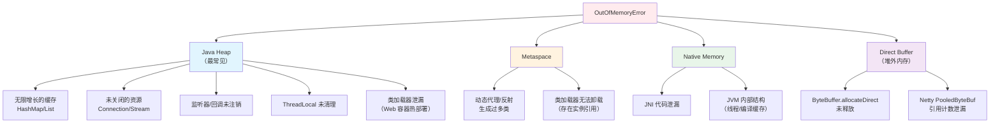
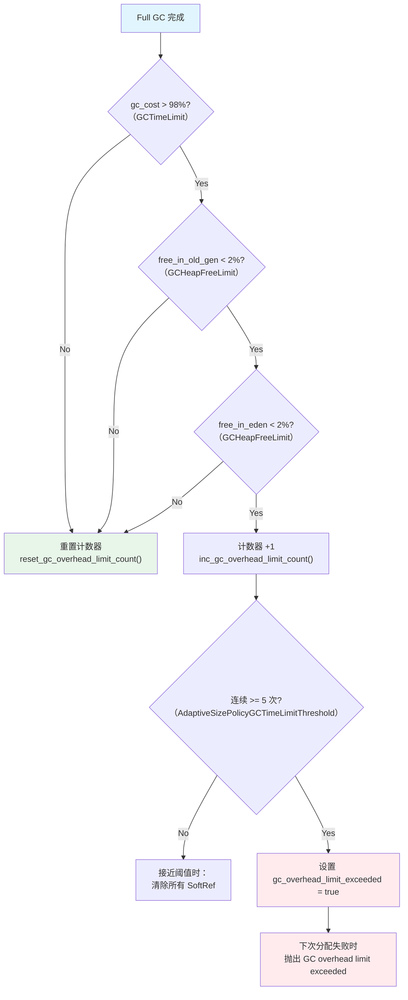
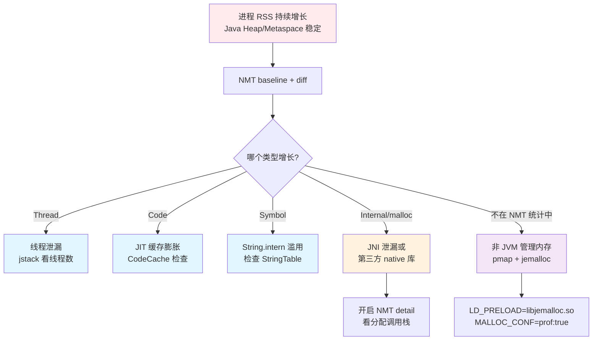
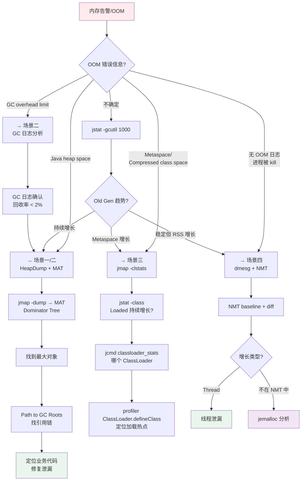

# 内存泄漏实战诊断案例

> 基于 OpenJDK 11 源码 + Arthas 4.1.2 + async-profiler 3.0
> 标准环境：-Xms8g -Xmx8g -XX:+UseG1GC, G1 Region = 4MB
> 源码路径：src/hotspot/share/
> 定位：从 OOM 现象到源码级根因的完整诊断闭环

---

## 第 0 部分：核心原理 ⭐

### 0.1 本质是什么？

本文深入分析 **内存泄漏实战诊断案例**：从源码角度理解其设计原理、实现机制和关键细节。

### 0.2 为什么需要？

理解 JVM 内部实现是排查复杂问题、进行性能优化的基础。表面的 API 文档无法解释 JVM 的实际行为，只有深入源码才能建立精确的心智模型。

### 0.3 怎么解决？

结合源码阅读、数据结构分析和 GDB 运行时验证，从多个角度建立对该机制的完整理解。

### 0.4 为什么这样设计？

每个设计决策都有其权衡：性能 vs 正确性、简单性 vs 灵活性、内存占用 vs 查找速度。理解这些权衡是理解 JVM 设计的关键。

---


## 0. 核心原理

### 0.1 本质是什么？

内存泄漏的本质是**对象已经不再被业务逻辑需要，但仍被 GC Root 直接或间接引用，无法被回收**。随着泄漏对象不断累积，可用堆空间持续缩减，最终触发 `java.lang.OutOfMemoryError`。

### 0.2 为什么需要源码级理解？

因为 JVM 的 OOM 处理不是简单地"内存不足就抛异常"——HotSpot 在启动时**预分配了 6 种 OOM 对象**（`universe.cpp:1228-1237`），OOM 发生时从预分配池取出对象抛出（避免 OOM 时还需要分配新对象的鸡生蛋问题）。不同内存区域的 OOM 走不同代码路径，产生不同的错误信息。不理解这些机制，就无法准确判断 OOM 的真实来源。

### 0.3 怎么解决？

**分层递进诊断**：GC 日志趋势分析（`jstat`/GC 日志）→ 内存快照分析（`jmap` HeapDump → MAT）→ 在线实例查询（Arthas `vmtool`）→ 分配追踪（async-profiler alloc 模式）→ Native 内存追踪（NMT）。每一层工具对应不同的诊断深度和开销。

---

## 1. 内存泄漏根因分类

在深入诊断之前，必须先建立**根因分类框架**——不同泄漏区域需要不同的诊断路径和工具。



**根因与 OOM 错误信息的映射**：

| OOM 错误信息 | 泄漏区域 | HotSpot 抛出位置 | 首选诊断工具 |
|-------------|---------|-----------------|-------------|
| `Java heap space` | Java 堆 | `memAllocator.cpp:125-132` | HeapDump + MAT |
| `GC overhead limit exceeded` | Java 堆（GC 回收效率过低） | `memAllocator.cpp:135-143` | GC 日志 + HeapDump |
| `Metaspace` | Metaspace | `metaspace.cpp:1604` | `jmap -clstats` |
| `Compressed class space` | 压缩类空间 | `metaspace.cpp:1602` | `jmap -clstats` |
| `Requested array size exceeds VM limit` | 单次分配过大 | `universe.cpp:1274` | 代码审查 |
| 进程被 OS kill（无 OOM 日志） | Native / Direct | 操作系统日志 | NMT / `pmap` |

---

## 2. HotSpot OOM 处理机制（源码级）

理解 JVM 如何处理 OOM 是诊断的基础。

### 2.1 预分配 OOM 对象

HotSpot 在 JVM 启动时预分配 6 种 OOM 异常对象，避免 OOM 发生时因无法分配新对象而陷入死循环。

**源码**：`memory/universe.cpp:1228-1237`

```cpp
// Setup preallocated OutOfMemoryError errors
Klass* k = SystemDictionary::resolve_or_fail(
    vmSymbols::java_lang_OutOfMemoryError(), true, CHECK_false);
InstanceKlass* ik = InstanceKlass::cast(k);
Universe::_out_of_memory_error_java_heap = ik->allocate_instance(CHECK_false);
Universe::_out_of_memory_error_metaspace = ik->allocate_instance(CHECK_false);
Universe::_out_of_memory_error_class_metaspace = ik->allocate_instance(CHECK_false);
Universe::_out_of_memory_error_array_size = ik->allocate_instance(CHECK_false);
Universe::_out_of_memory_error_gc_overhead_limit = ik->allocate_instance(CHECK_false);
Universe::_out_of_memory_error_realloc_objects = ik->allocate_instance(CHECK_false);
```

随后设置每个 OOM 对象的错误消息（`universe.cpp:1266-1281`）：

```cpp
Handle msg = java_lang_String::create_from_str("Java heap space", CHECK_false);
java_lang_Throwable::set_message(Universe::_out_of_memory_error_java_heap, msg());

msg = java_lang_String::create_from_str("Metaspace", CHECK_false);
java_lang_Throwable::set_message(Universe::_out_of_memory_error_metaspace, msg());

msg = java_lang_String::create_from_str("Compressed class space", CHECK_false);
java_lang_Throwable::set_message(Universe::_out_of_memory_error_class_metaspace, msg());
// ... 省略 array_size、gc_overhead_limit、realloc_objects ...
```

**关键设计**：还额外预分配了一个 OOM 对象数组（默认 4 个，由 `PreallocatedOutOfMemoryErrorCount` 控制），用于提供带堆栈跟踪的 OOM 异常。`gen_out_of_memory_error()` 函数（`universe.cpp:616-653`）通过原子减操作从预分配池中取出对象，用完后退化为返回不带堆栈的默认 OOM 对象。

### 2.2 OOM 报告处理链

当 OOM 发生时，HotSpot 执行 `report_java_out_of_memory()`（`utilities/debug.cpp:319-347`），这是一个**严格有序的 4 步处理链**：

```cpp
void report_java_out_of_memory(const char* message) {
  static int out_of_memory_reported = 0;

  // CAS 保证只执行一次：多线程同时 OOM 时，只有第一个线程执行后续处理
  if (Atomic::cmpxchg(1, &out_of_memory_reported, 0) == 0) {
    // 第 1 步：HeapDump（如果开启了 -XX:+HeapDumpOnOutOfMemoryError）
    if (HeapDumpOnOutOfMemoryError) {
      tty->print_cr("java.lang.OutOfMemoryError: %s", message);
      HeapDumper::dump_heap_from_oome();   // → heapDumper.cpp:2023
    }

    // 第 2 步：执行自定义命令（-XX:OnOutOfMemoryError="cmd"）
    if (OnOutOfMemoryError && OnOutOfMemoryError[0]) {
      VMError::report_java_out_of_memory(message);
    }

    // 第 3 步：直接崩溃（-XX:+CrashOnOutOfMemoryError）
    if (CrashOnOutOfMemoryError) {
      tty->print_cr("Aborting due to java.lang.OutOfMemoryError: %s", message);
      report_fatal(...);
    }

    // 第 4 步：直接退出（-XX:+ExitOnOutOfMemoryError）
    if (ExitOnOutOfMemoryError) {
      tty->print_cr("Terminating due to java.lang.OutOfMemoryError: %s", message);
      os::exit(3);
    }
  }
}
```

**设计要点**：

1. **CAS 单次保护**：`Atomic::cmpxchg(1, &out_of_memory_reported, 0)` 保证多线程同时 OOM 时，HeapDump 和命令执行只发生一次
2. **HeapDump 优先于命令执行**：先保留现场（HeapDump），再执行用户命令
3. **互斥关系**：`CrashOnOutOfMemoryError` 和 `ExitOnOutOfMemoryError` 不会同时生效——`Crash` 会触发 `report_fatal` 生成 hs_err 文件后 abort，`Exit` 直接调用 `os::exit(3)` 退出

**相关 JVM 参数**：

| 参数 | 默认值 | 作用 | 源码位置 |
|------|--------|------|---------|
| `-XX:+HeapDumpOnOutOfMemoryError` | `false` | OOM 时自动生成 HeapDump | `globals.hpp:657-658` |
| `-XX:HeapDumpPath=<path>` | 当前目录 `java_pid<pid>.hprof` | HeapDump 文件路径 | `globals.hpp:660-663` |
| `-XX:OnOutOfMemoryError="<cmd>"` | 无 | OOM 时执行自定义命令 | — |
| `-XX:+ExitOnOutOfMemoryError` | `false` | OOM 时直接退出（exit code=3） | — |
| `-XX:+CrashOnOutOfMemoryError` | `false` | OOM 时生成 crash dump 后退出 | — |

> **生产必备**：必须开启 `-XX:+HeapDumpOnOutOfMemoryError`，这是事后分析的唯一现场。

### 2.3 Heap Space OOM vs GC Overhead Limit

对象分配失败后，进入 `MemAllocator::Allocation::check_out_of_memory()`（`gc/shared/memAllocator.cpp:115-145`），根据 `_overhead_limit_exceeded` 标志分两条路径：

```cpp
bool MemAllocator::Allocation::check_out_of_memory() {
  if (obj() != NULL) {
    return false;  // 分配成功，无 OOM
  }

  if (!_overhead_limit_exceeded) {
    // 路径 1：真正的堆空间不足
    report_java_out_of_memory("Java heap space");
    // ... JVMTI 回调 ...
    THROW_OOP_(Universe::out_of_memory_error_java_heap(), true);
  } else {
    // 路径 2：GC 回收效率过低
    report_java_out_of_memory("GC overhead limit exceeded");
    // ... JVMTI 回调 ...
    THROW_OOP_(Universe::out_of_memory_error_gc_overhead_limit(), true);
  }
}
```

### 2.4 GC Overhead Limit 检测算法

`_overhead_limit_exceeded` 标志由 `AdaptiveSizePolicy::check_gc_overhead_limit()` 设置（`gc/shared/adaptiveSizePolicy.cpp:407-538`）。

**触发 "GC overhead limit exceeded" 需要同时满足 4 个条件**：

```cpp
// adaptiveSizePolicy.cpp:469-496（核心逻辑）
if (is_full_gc) {
  if (gc_cost() > gc_cost_limit &&                    // 条件 1：GC 时间占比 > 98%（GCTimeLimit）
      free_in_old_gen < (size_t) mem_free_old_limit && // 条件 2：Old Gen 空闲 < 2%（GCHeapFreeLimit）
      free_in_eden < (size_t) mem_free_eden_limit) {   // 条件 3：Eden 空闲 < 2%（GCHeapFreeLimit）
    inc_gc_overhead_limit_count();
    if (UseGCOverheadLimit) {
      if (gc_overhead_limit_count() >=
          AdaptiveSizePolicyGCTimeLimitThreshold) {     // 条件 4：连续 >= 5 次（默认值）
        set_gc_overhead_limit_exceeded(true);
        reset_gc_overhead_limit_count();
      }
    }
  }
}
```

**4 个条件的含义**：

| 条件 | 默认阈值 | JVM 参数 | 含义 |
|------|---------|---------|------|
| GC 时间占比 > 98% | `GCTimeLimit=98` | `-XX:GCTimeLimit=N` | 应用只有 2% 时间在做有用工作 |
| Old Gen 空闲 < 2% | `GCHeapFreeLimit=2` | `-XX:GCHeapFreeLimit=N` | 老年代几乎满了 |
| Eden 空闲 < 2% | `GCHeapFreeLimit=2` | 同上 | Eden 也几乎满了 |
| 连续 ≥ 5 次 Full GC | `AdaptiveSizePolicyGCTimeLimitThreshold=5` | — | 不是偶发，是持续恶化 |

**日志输出**（需要 `-Xlog:gc+ergo=trace`）：

```
[gc,ergo] GC is exceeding overhead limit of 98%
[gc,ergo] Nearing GC overhead limit, will be clearing all SoftReference
```

> **"GC overhead limit exceeded" 不是"内存用完了"，而是"GC 一直在回收但回收不了多少"** —— 这意味着堆中大部分对象都是可达的（被引用着），GC 无能为力。

---

## 3. 场景一：Java Heap 泄漏（无限增长的缓存）

**这是最常见的内存泄漏场景**。

### 3.1 典型案例

```java
public class OrderService {
    // 本意是缓存，但没有淘汰策略 → 随请求量增长无限膨胀
    private static final Map<Long, Order> cache = new HashMap<>();
    
    public Order getOrder(Long orderId) {
        if (!cache.containsKey(orderId)) {
            Order order = db.query(orderId);
            cache.put(orderId, order);  // 只进不出
        }
        return cache.get(orderId);
    }
}
```

### 3.2 诊断路径

#### 第一步：GC 日志趋势确认（10 秒定性）

```bash
# 实时观察 GC 情况
jstat -gcutil <pid> 1000
#  S0     S1     E      O      M     CCS    YGC     YGCT    FGC    FGCT     GCT
#  0.00  45.23  78.56  45.12  95.23  92.10    123   1.234     2   0.456   1.690
#  0.00  52.10  12.34  67.89  95.23  92.10    156   1.567     3   0.890   2.457
#  0.00  48.67  95.12  89.01  95.24  92.10    210   2.123     8   3.456   5.579
#                       ↑↑↑↑↑ O（Old Gen）持续增长 → 内存泄漏嫌疑
```

**判断标准**：如果 Old Gen 占用率在多次 Full GC 后**仍然持续增长**（不是回到低位），基本确认内存泄漏。

#### 第二步：HeapDump + MAT 分析

```bash
# 方式 1：手动触发 HeapDump（会触发 Full GC）
jmap -dump:format=b,file=heap.hprof <pid>

# 方式 2：OOM 时自动 HeapDump（推荐，生产必配）
-XX:+HeapDumpOnOutOfMemoryError -XX:HeapDumpPath=/data/dumps/

# 方式 3：jcmd（推荐，比 jmap 更安全）
jcmd <pid> GC.heap_dump /data/dumps/heap.hprof
```

**HeapDumper 工作流程**（`services/heapDumper.cpp:2023-2036`）：

```cpp
// OOM 触发路径
void HeapDumper::dump_heap_from_oome() {
  HeapDumper::dump_heap(true);  // oome=true
}

// 通用入口
void HeapDumper::dump_heap(bool oome) {
  static char base_path[JVM_MAXPATHLEN] = {'\0'};
  static uint dump_file_seq = 0;
  // 文件名默认为 java_pid<pid>.hprof
  // HeapDumpPath 可指定目录或完整文件名
  // dump_file_seq 递增确保多次 dump 不覆盖
  // ...
}
```

**`jcmd GC.heap_dump` 的底层实现**（`services/diagnosticCommand.hpp:328-355`）：

```cpp
class HeapDumpDCmd : public DCmdWithParser {
  DCmdArgument<char*> _filename;   // dump 文件路径
  DCmdArgument<bool>  _all;        // 是否包含不可达对象
  DCmdArgument<jlong> _gzip;       // gzip 压缩级别
  DCmdArgument<bool>  _overwrite;  // 是否覆盖已有文件
  // ...
  static const char* name() { return "GC.heap_dump"; }
  static const char* impact() {
    return "High: Depends on Java heap size and content. "
           "Request a full GC unless the '-all' option is specified.";
  }
};
```

> **注意**：不带 `-all` 参数时，HeapDump 前会先触发一次 Full GC（清除不可达对象），这在生产大堆场景下可能造成较长 STW。

**MAT 分析步骤**：
1. **Leak Suspects Report**：自动检测疑似泄漏点
2. **Dominator Tree**：按 Retained Size 排序，找出最大对象
3. **Path to GC Roots**：找到从 GC Root 到泄漏对象的引用链
4. **OQL 查询**：`SELECT * FROM java.util.HashMap WHERE size > 10000`

#### 第三步：Arthas vmtool 在线确认（无需 HeapDump）

当无法获取 HeapDump 或需要快速确认时，使用 Arthas `vmtool` 在线查询堆中实例：

```bash
# 查看 HashMap 实例数量和大小分布
vmtool --action getInstances --className java.util.HashMap --limit 10 \
  -x 1 --express 'instances.{#this.size()}'
# 输出：[@Integer[3200145], @Integer[256], @Integer[128], ...]
# 第一个 HashMap 有 320 万个 entry → 疑似泄漏

# 查看该 HashMap 的 key 类型（确认是什么业务缓存）
vmtool --action getInstances --className java.util.HashMap --limit 1 \
  -x 2 --express 'instances[0].keySet().iterator().next().getClass()'
```

> `vmtool` 底层使用 JVMTI `IterateOverInstancesOfClass` + Tag 机制遍历堆，不需要 Full GC，但大堆场景遍历时间较长。详见 [23-VmToolCommand-Deep-Dive.md](../Arthas-new/23-VmToolCommand-Deep-Dive.md)。

#### 第四步：async-profiler 分配追踪（找到分配热点）

如果需要找到**谁在不断往缓存里塞数据**，使用 async-profiler 的 alloc 模式：

```bash
# 采样对象分配热点（JDK 11+ 使用 JVMTI SampledObjectAlloc，开销 1-3%）
./profiler.sh -e alloc -d 60 -f alloc_flame.html <pid>

# 火焰图中找到 HashMap.put() 的调用栈 → 定位是哪个业务方法在持续写入
```

> async-profiler 分配追踪的两种机制：
> - **Trap/INT3 方式**（JDK 7-17）：篡改 TLAB 末尾触发陷阱，开销 5-10%
> - **JVMTI SampledObjectAlloc**（JDK 11+）：基于采样的分配回调，开销 1-3%
> 
> 详见 [06-Allocation-Profiling-Deep-Dive.md](../AsyncProfiler/06-Allocation-Profiling-Deep-Dive.md)。

### 3.3 修复方案

```java
// 方案 1：使用 LRU 缓存替代 HashMap
private static final Map<Long, Order> cache = 
    Collections.synchronizedMap(new LinkedHashMap<Long, Order>(1000, 0.75f, true) {
        @Override
        protected boolean removeEldestEntry(Map.Entry<Long, Order> eldest) {
            return size() > MAX_CACHE_SIZE;
        }
    });

// 方案 2：使用 Caffeine 等专业缓存库（推荐）
private static final Cache<Long, Order> cache = Caffeine.newBuilder()
    .maximumSize(10_000)
    .expireAfterWrite(Duration.ofMinutes(10))
    .build();
```

---

## 4. 场景二：GC Overhead Limit Exceeded

### 4.1 典型案例

```java
public class DataProcessor {
    public void process(List<RawData> rawList) {
        List<ProcessedData> results = new ArrayList<>();
        for (RawData raw : rawList) {
            // 每条原始数据展开成多条处理结果
            results.addAll(raw.expand());  // 数据膨胀
        }
        // rawList 有 100 万条，每条展开 50 倍 → 5000 万个对象
        // 在方法返回前，所有对象都是可达的
    }
}
```

### 4.2 诊断路径

**现象**：应用不断 Full GC，GC 日志显示回收量很少，最终抛出 `GC overhead limit exceeded`。

```bash
# GC 日志表现（-Xlog:gc*）
[gc] GC(456) Pause Full (Allocation Failure) 7864M->7821M(8192M) 12.345s
[gc] GC(457) Pause Full (Allocation Failure) 7845M->7830M(8192M) 13.567s
[gc] GC(458) Pause Full (Allocation Failure) 7850M->7842M(8192M) 14.890s
#                                              ^^^^    ^^^^
#                                              Full GC 前后只回收了几十 MB
#                                              → 堆中大部分对象都是可达的
```

**确认方式**：

```bash
jstat -gcutil <pid> 1000
# 观察 FGC（Full GC 次数）持续增长，FGCT（Full GC 总耗时）快速增加
# O（Old Gen 占用率）接近 100% 且不下降
```

### 4.3 GC Overhead 检测的详细流程



**关键细节**：
- 只在 Full GC 后检查（`is_full_gc == true`），Young GC 不检查
- 用户主动触发的 GC（`System.gc()`）和 Serviceability GC 被忽略（`adaptiveSizePolicy.cpp:419-421`）
- 接近阈值时会先清除所有 SoftReference（给最后一次机会），如果仍然不够才抛 OOM

### 4.4 修复方案

1. **增大堆内存**（治标）：`-Xms16g -Xmx16g`
2. **减少活跃对象**（治本）：分批处理数据，避免一次加载过多到内存
3. **关闭 GC Overhead Limit**（不推荐）：`-XX:-UseGCOverheadLimit`，这只是把 OOM 类型从 `GC overhead limit exceeded` 变成 `Java heap space`，不解决根因

---

## 5. 场景三：Metaspace 泄漏

### 5.1 典型案例

**Web 容器热部署**导致的类加载器泄漏。每次热部署创建新的 ClassLoader 加载新版本的类，但旧 ClassLoader 因为残留引用无法被卸载。

```java
// 动态代理不断生成新类
for (int i = 0; i < 1_000_000; i++) {
    Enhancer enhancer = new Enhancer();
    enhancer.setSuperclass(SomeClass.class);
    enhancer.setCallback((MethodInterceptor) (obj, method, args, proxy) -> proxy.invokeSuper(obj, args));
    enhancer.create();  // 每次生成一个新类，加载到 Metaspace
}
```

### 5.2 Metaspace OOM 源码路径

当 Metaspace 空间不足时，进入 `Metaspace::report_metadata_oome()`（`memory/metaspace.cpp:1585-1605`）：

```cpp
// metaspace.cpp:1585-1605
// 区分是 Compressed class space 还是 Metaspace
const char* space_string = out_of_compressed_class_space ?
  "Compressed class space" : "Metaspace";

report_java_out_of_memory(space_string);  // → 进入 OOM 处理链

if (out_of_compressed_class_space) {
  THROW_OOP(Universe::out_of_memory_error_class_metaspace());
} else {
  THROW_OOP(Universe::out_of_memory_error_metaspace());
}
```

**两种 Metaspace OOM 的区别**：
- **"Metaspace"**：非类元数据（方法、常量池等）空间不足
- **"Compressed class space"**：类指针压缩空间不足（默认 1GB，`-XX:CompressedClassSpaceSize`）

### 5.3 诊断路径

```bash
# 1. 确认 Metaspace 使用情况
jstat -gcutil <pid> 1000
# 关注 M（Metaspace 占用率）和 CCS（Compressed Class Space 占用率）

# 2. 查看类加载统计
jcmd <pid> VM.classloader_stats
# 或
jmap -clstats <pid>

# 3. 查看已加载类的数量趋势
jstat -class <pid> 1000
#  Loaded  Bytes  Unloaded  Bytes     Time
#   12345  24.5M       234   0.5M     3.456
#   15678  31.2M       234   0.5M     4.567   ← Loaded 持续增长，Unloaded 不动 → 泄漏

# 4. 火焰图定位类加载热点
./profiler.sh -e ClassLoader.defineClass -d 60 -f classload_flame.html <pid>
```

### 5.4 修复方案

- **动态代理**：使用 `ClassLoader` 缓存，避免重复生成相同的代理类
- **热部署**：确保旧 ClassLoader 的所有实例引用被清除
- **限制 Metaspace**：`-XX:MaxMetaspaceSize=512m`（默认无限），避免耗尽整个进程内存

> **Metaspace 类卸载机制**详见 [3-Class-Unloading-Mechanism.md](../Metaspace/3-Class-Unloading-Mechanism.md)。

---

## 6. 场景四：Native Memory 泄漏

### 6.1 问题特征

**进程 RSS 持续增长，但 Java 堆/Metaspace 稳定** → Native Memory 泄漏。

这类泄漏不会触发 Java 层的 OOM，而是进程被操作系统 OOM Killer 直接杀掉。

### 6.2 NMT（Native Memory Tracking）

NMT 是 HotSpot 内置的 Native 内存追踪工具，核心类是 `MemTracker`（`services/memTracker.hpp:115`）。

**启用 NMT**：

```bash
# 启动时开启（有 5-10% 性能开销）
-XX:NativeMemoryTracking=summary   # 按类型汇总
-XX:NativeMemoryTracking=detail    # 记录每次分配的调用栈
```

**使用 NMT 追踪变化**：

```bash
# 1. 建立基线
jcmd <pid> VM.native_memory baseline

# 2. 等待一段时间（如 1 小时）

# 3. 对比差异
jcmd <pid> VM.native_memory summary.diff scale=MB
```

**NMT 输出示例**：

```
Native Memory Tracking:
Total: reserved=10240MB, committed=8456MB (+234MB)
       malloc: 1234MB (+156MB) #23456 (+789)

-                 Java Heap (reserved=8192MB, committed=8192MB)
                            (mmap: reserved=8192MB, committed=8192MB)

-                     Class (reserved=1056MB, committed=45MB (+2MB))
                            (classes #8234 (+156))
                            (malloc=4MB (+1MB) #12345 (+678))
                            (mmap: reserved=1052MB, committed=41MB (+1MB))

-                    Thread (reserved=256MB, committed=256MB (+64MB))
                            (thread #245 (+60))
                            (stack: reserved=245MB, committed=245MB (+60MB))
                            ↑↑↑↑↑ 线程数增长 60 个，每个线程栈 1MB
                            → 检查是否有线程泄漏

-                      Code (reserved=245MB, committed=48MB (+12MB))
                            (malloc=15MB (+8MB) #5678 (+1234))
                            ↑↑↑↑↑ JIT 编译缓存增长
                            → 通常正常，除非持续增长

-                    Symbol (reserved=12MB, committed=12MB (+3MB))
                            (malloc=9MB (+2MB) #123456 (+34567))
                            ↑↑↑↑↑ Symbol 表增长
                            → 检查是否有大量字符串 intern
```

**NMT 的 MEMFLAGS 分类**（`memory/allocation.hpp:115-142`）：

JVM 内部的每次 `malloc`/`mmap` 都标记了类型（21 种 MEMFLAGS），NMT 据此分类统计：

```cpp
enum MemoryType {
  mtJavaHeap,       // Java 堆
  mtClass,          // 类元数据
  mtThread,         // 线程对象和线程栈
  mtCode,           // JIT 编译缓存
  mtGC,             // GC 数据结构
  mtCompiler,       // 编译器内部
  mtInternal,       // JVM 内部
  mtSymbol,         // 符号表
  mtNMT,            // NMT 自身开销
  // ... 省略 mtThreadStack, mtOther, mtClassShared, mtChunk, mtTest, mtTracing, mtLogging, mtArguments, mtModule ...
  mtSynchronizer,   // 同步原语（ObjectMonitor 等）
  mtSafepoint,      // Safepoint 支持
  mtNone,           // 未分类
  mt_number_of_types // 哨兵值（= 21）
};
```

**NMT DCmd 实现**（`services/nmtDCmd.hpp:38-74`）：

```cpp
class NMTDCmd: public DCmdWithParser {
  DCmdArgument<bool>  _summary;       // VM.native_memory summary
  DCmdArgument<bool>  _detail;        // VM.native_memory detail
  DCmdArgument<bool>  _baseline;      // VM.native_memory baseline
  DCmdArgument<bool>  _summary_diff;  // VM.native_memory summary.diff
  DCmdArgument<bool>  _detail_diff;   // VM.native_memory detail.diff
  DCmdArgument<bool>  _shutdown;      // VM.native_memory shutdown
  DCmdArgument<char*> _scale;         // scale=KB|MB|GB
  // ...
  static const char* name() { return "VM.native_memory"; }
};
```

### 6.3 诊断路径



### 6.4 常见 Native 泄漏根因

| 根因 | NMT 表现 | 诊断方法 |
|------|---------|---------|
| 线程泄漏 | Thread 类型持续增长 | `jstack` 看线程数和名称 |
| JNI 泄漏 | Internal 类型增长 | NMT detail 看调用栈 |
| DirectByteBuffer 泄漏 | Internal 类型增长 | `-XX:MaxDirectMemorySize` 限制 |
| gzip/deflater 未关闭 | Internal 类型增长 | `Deflater.end()` / `Inflater.end()` |
| 第三方 .so 泄漏 | 不在 NMT 统计中 | `jemalloc` 内存分析 |

---

## 7. 完整诊断决策树



---

## 8. GDB 验证方案

以下 GDB 脚本用于验证 HotSpot 层面的 OOM 处理链和内存分配失败流程。

```bash
# GDB 脚本保存位置：jvm-md/tmp-file/RealWorld-Memory/gdb_memory_verify.cmd
gdb -x jvm-md/tmp-file/RealWorld-Memory/gdb_memory_verify.cmd
```

**GDB 验证点**：

| # | 断点 | 验证目标 |
|---|------|---------|
| 1 | `report_java_out_of_memory` | 确认 OOM 处理链：CAS 保护 → HeapDump → 命令执行 → Crash/Exit |
| 2 | `HeapDumper::dump_heap_from_oome` | 确认 OOM 时自动 HeapDump 流程 |
| 3 | `MemAllocator::Allocation::check_out_of_memory` | 确认 heap space vs GC overhead 两条路径 |
| 4 | `AdaptiveSizePolicy::check_gc_overhead_limit` | 确认 GC Overhead 4 条件判断逻辑 |
| 5 | `Metaspace::report_metadata_oome` | 确认 Metaspace vs Compressed class space 分支 |

---

## 9. 总结

### 9.1 核心诊断路径

```
GC 趋势（10s）→ HeapDump 分析（5-30min）→ 在线实例查询（1-5min）→ 分配追踪（按需）
  jstat -gcutil    jmap + MAT             vmtool getInstances       profiler -e alloc
```

### 9.2 工具选择原则

| 原则 | 说明 |
|------|------|
| **先 GC 日志定性** | 确认是 Heap/Metaspace/Native 哪个区域的问题 |
| **HeapDump 是黄金证据** | OOM 时的 HeapDump 包含所有对象和引用关系，是最完整的现场 |
| **生产必配自动 HeapDump** | `-XX:+HeapDumpOnOutOfMemoryError` 不可缺少 |
| **NMT 用于 Native 问题** | Java 堆问题用 MAT，Native 问题用 NMT |
| **分配追踪找源头** | HeapDump 看到"是什么在泄漏"，分配追踪看到"谁在分配" |

### 9.3 生产环境 JVM 参数模板

```bash
# 内存泄漏防御参数
-XX:+HeapDumpOnOutOfMemoryError
-XX:HeapDumpPath=/data/dumps/
-XX:+ExitOnOutOfMemoryError           # OOM 后快速退出，让容器重启
-XX:NativeMemoryTracking=summary       # 开启 NMT（5-10% 开销）
-Xlog:gc*:file=/data/logs/gc.log:time,uptime,level,tags:filecount=5,filesize=100M
```

### 9.4 面试话术模板

> **内存泄漏排查**：
> 
> 我的排查路径是**四层递进**：GC 趋势确认 → HeapDump 分析 → 在线实例查询 → 分配追踪。
> 
> 第一步 `jstat -gcutil` 观察 Old Gen 趋势。如果多次 Full GC 后 Old Gen 占用率仍持续增长不下降，基本确认堆内存泄漏。
> 
> 第二步 HeapDump + MAT 分析。生产环境必配 `-XX:+HeapDumpOnOutOfMemoryError`，这是事后分析的唯一现场。HeapDump 的底层是 HotSpot 的 `HeapDumper::dump_heap_from_oome()`，OOM 报告链中 CAS 保证只 dump 一次。MAT 中看 Dominator Tree 找最大对象，Path to GC Roots 找引用链。
> 
> 第三步如果不方便 dump（大堆/生产敏感），用 Arthas `vmtool --action getInstances` 在线查询堆中特定类型的实例数量和内容，底层用 JVMTI Tag 机制遍历堆。
> 
> 第四步如果需要找"谁在分配"，用 async-profiler 的 alloc 模式做分配追踪，JDK 11+ 用 JVMTI SampledObjectAlloc 只有 1-3% 开销。
> 
> 如果是 Native 内存泄漏（RSS 增长但 Java Heap 稳定），用 NMT baseline+diff 定位。NMT 把 JVM 的每次 malloc 按 21 种 MEMFLAGS 分类统计，能看出是线程栈、JIT 缓存还是 JNI 调用在泄漏。

### 9.5 关联文档

| 主题 | 文档 |
|------|------|
| G1 GC 故障排查深度剖析 | [19-GC-Troubleshooting-Deep-Dive.md](../G1GC/19-GC-Troubleshooting-Deep-Dive.md) |
| GC 日志分析实战 | [18-GC-Log-Practice.md](../G1GC/18-GC-Log-Practice.md) |
| async-profiler 分配追踪 | [06-Allocation-Profiling-Deep-Dive.md](../AsyncProfiler/06-Allocation-Profiling-Deep-Dive.md) |
| Arthas vmtool 命令深度解析 | [23-VmToolCommand-Deep-Dive.md](../Arthas-new/23-VmToolCommand-Deep-Dive.md) |
| 对象内存布局分析 | [31-Object-Memory-Layout-Analysis.md](../Arthas-new/31-Object-Memory-Layout-Analysis.md) |
| Metaspace 类卸载机制 | [3-Class-Unloading-Mechanism.md](../Metaspace/3-Class-Unloading-Mechanism.md) |
| G1 内存泄漏案例（GC 视角） | [01-Memory-Leak-Case-Study.md](../G1GC/Troubleshooting-Series/01-Memory-Leak-Case-Study.md) |
| Arthas 生产实战案例 | [29-Production-Cases.md](../Arthas-new/29-Production-Cases.md) |
| Arthas 性能开销分析 | [27-Performance-Impact-Analysis.md](../Arthas-new/27-Performance-Impact-Analysis.md) |
| 性能分析面试指南 | [7-Performance-Troubleshooting-Interview-Guide.md](../Interview/7-Performance-Troubleshooting-Interview-Guide.md) |
