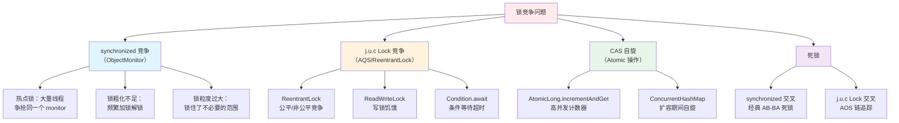
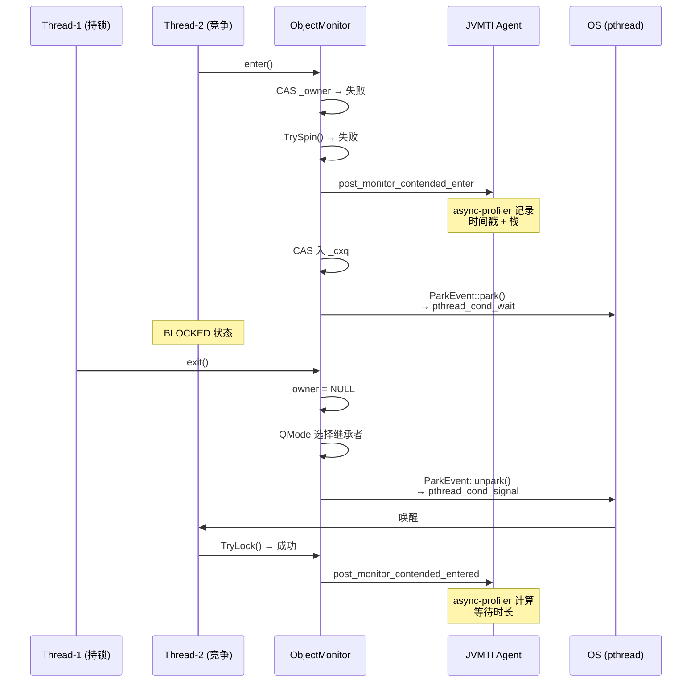
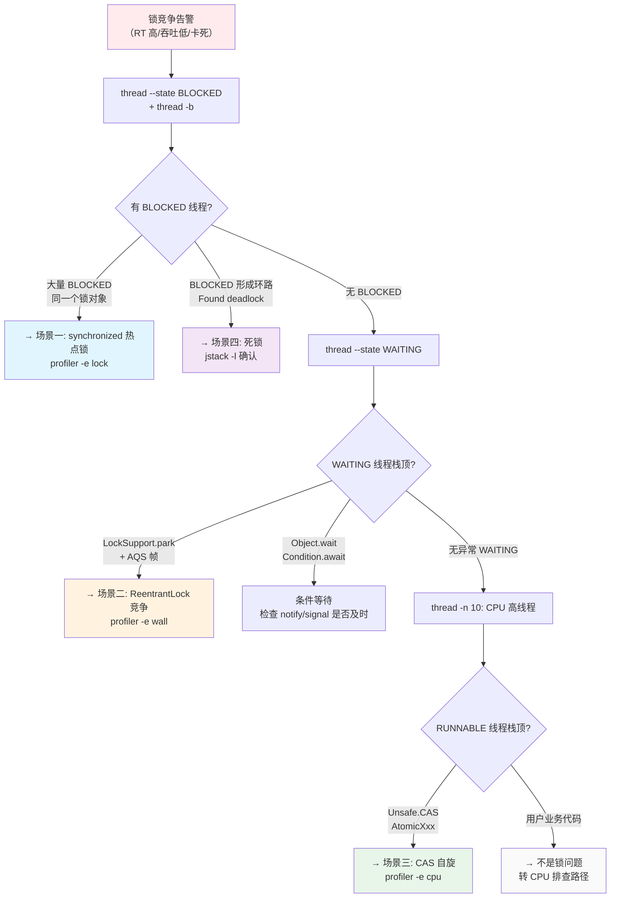

# 锁竞争实战诊断案例

> 基于 OpenJDK 11 源码 + Arthas 4.1.2 + async-profiler 3.0
> 标准环境：-Xms8g -Xmx8g -XX:+UseG1GC, G1 Region = 4MB
> 源码路径：src/hotspot/share/
> 定位：从锁竞争现象到源码级根因的完整诊断闭环

---

## 第 0 部分：核心原理 ⭐

### 0.1 本质是什么？

本文深入分析 **锁竞争实战诊断案例**：从源码角度理解其设计原理、实现机制和关键细节。

### 0.2 为什么需要？

理解 JVM 内部实现是排查复杂问题、进行性能优化的基础。表面的 API 文档无法解释 JVM 的实际行为，只有深入源码才能建立精确的心智模型。

### 0.3 怎么解决？

结合源码阅读、数据结构分析和 GDB 运行时验证，从多个角度建立对该机制的完整理解。

### 0.4 为什么这样设计？

每个设计决策都有其权衡：性能 vs 正确性、简单性 vs 灵活性、内存占用 vs 查找速度。理解这些权衡是理解 JVM 设计的关键。

---


## 0. 核心原理

### 0.1 本质是什么？

锁竞争的本质是**多个线程同时请求同一把锁，只有一个能获得，其余线程必须等待**。等待的代价取决于等待方式：自旋消耗 CPU 但延迟低，挂起不消耗 CPU 但需要上下文切换。锁竞争严重时，应用吞吐量下降、延迟飙高，是生产环境最常见的性能杀手之一。

### 0.2 为什么需要源码级理解？

因为 `synchronized` 和 `ReentrantLock` 在 HotSpot 中走**完全不同的代码路径**，诊断方法截然不同：
- `synchronized` 通过 `ObjectMonitor`（C++ 层）竞争，HotSpot 有完整的可观测性——JVMTI 事件回调 `MonitorContendedEnter`/`MonitorContendedEntered`、DTrace 探针、JFR `JavaMonitorEnter` 事件
- `ReentrantLock` 通过 `AbstractQueuedSynchronizer`（纯 Java 层）竞争，最终调用 `LockSupport.park()` → `Parker::park()`。HotSpot C++ 层**对 j.u.c 锁完全无感知**——在整个 `src/hotspot/` 源码树中搜索 `AbstractQueuedSynchronizer` 或 `ReentrantLock`，匹配数为 **0**

不理解这个根本差异，就无法选择正确的诊断工具。

### 0.3 怎么解决？

**分层递进诊断**：线程状态概览（Arthas `thread`）→ 持锁线程定位（`thread -b`）→ 锁竞争热点分析（async-profiler lock/wall 模式）→ 死锁检测（`thread --state BLOCKED`）→ 参数确认（`watch`/`trace`）→ 源码级根因（HotSpot 源码 + GDB 验证）。

---

## 1. 锁竞争根因分类



**根因与诊断工具的映射**：

| 根因类型 | 线程状态 | CPU 表现 | 首选诊断工具 | 依据 |
|---------|---------|---------|-------------|------|
| synchronized 热点锁 | BLOCKED | 低（线程挂起） | `thread -b` + profiler lock | JVMTI 可观测 |
| ReentrantLock 竞争 | WAITING/TIMED_WAITING | 低 | profiler wall + 栈分析 | 栈帧含 AQS |
| CAS 自旋 | RUNNABLE | 高（忙等待） | profiler cpu | 栈顶 Unsafe.CAS |
| 死锁 | BLOCKED/WAITING | 低（全卡住） | `thread -b` 或 `jstack` | 检测环 |

---

## 2. 诊断工具链：从现象到根因

### 2.1 第一层：Arthas thread（10 秒定性）

```bash
# 查看线程状态分布
thread --state BLOCKED
# 输出所有 BLOCKED 状态的线程 → synchronized 竞争
# 如果大量线程 BLOCKED 在同一个锁对象 → 热点锁

thread --state WAITING
# 输出所有 WAITING 状态的线程 → 可能是 j.u.c Lock 竞争
# 栈顶如果是 LockSupport.park → 检查 AQS 帧

# 查找持锁线程（synchronized 专用）
thread -b
# 底层调用 ThreadMXBean.findMonitorDeadlockedThreads()
# 找到持有锁最久且导致其他线程 BLOCKED 的线程
```

**`thread -b` 的底层原理**：

`thread -b` 遍历所有线程的 `ThreadInfo`，查找 `lockOwnerId != -1` 的 BLOCKED 线程，然后反向查找持锁线程。HotSpot 通过 `ObjectMonitor::_owner`（`objectMonitor.hpp:152`）记录持有者，`JavaThread::current_pending_monitor()`（`thread.cpp:333` 处设置）记录等待的 monitor。

### 2.2 第二层：async-profiler lock 模式（1-5 分钟深入）

**synchronized 竞争**——使用 lock 模式：

```bash
# async-profiler lock 事件采样
./asprof -d 30 -e lock -f /tmp/lock-flame.html <pid>

# 或通过 Arthas
profiler start --event lock
profiler stop --format html --file /tmp/lock-flame.html
```

**lock 模式的底层原理**：async-profiler 注册 JVMTI `MonitorContendedEnter` 和 `MonitorContendedEntered` 事件。当线程进入锁竞争时，HotSpot 在 `ObjectMonitor::enter()` 的第 336-337 行回调 `JvmtiExport::post_monitor_contended_enter()`，async-profiler 在回调中记录线程栈和时间戳；线程获得锁后在第 404-406 行回调 `post_monitor_contended_entered()`，计算等待时长。火焰图中**宽度 = 累计等待时间**，最宽的 = 竞争最激烈的锁。

**ReentrantLock 竞争**——使用 wall 模式：

```bash
# wall clock 模式：采样所有线程（包括阻塞中的）
./asprof -d 30 -e wall -f /tmp/wall-flame.html <pid>
```

因为 HotSpot 对 j.u.c 锁无感知，lock 模式**看不到** `ReentrantLock` 竞争。wall 模式按时间均匀采样所有线程的栈，能看到阻塞在 `LockSupport.park()` → `AbstractQueuedSynchronizer.acquireQueued()` 中的线程。

> **async-profiler Lock 采样完整实现**：[07-Lock-Profiling-Deep-Dive.md](../AsyncProfiler/07-Lock-Profiling-Deep-Dive.md)
> **Wall Clock 模式原理**：[12-WallClock-Profiling-Deep-Dive.md](../AsyncProfiler/12-WallClock-Profiling-Deep-Dive.md)

### 2.3 第三层：Thread Dump 深度分析（按需）

```bash
# jstack 输出完整线程 dump
jstack -l <pid> > /tmp/thread_dump.txt

# 或使用 Arthas
thread -all > /tmp/thread_dump.txt
```

**Thread Dump 的关键信息**（`thread.cpp:3178-3213` `JavaThread::print_on()`）：

```
"worker-thread-1" #20 daemon prio=5 os_prio=0 tid=0x00007f... nid=0x3039 
    waiting for monitor entry [0x00007f...]    ← BLOCKED 等锁
    java.lang.Thread.State: BLOCKED (on object monitor)
	at com.example.Service.process(Service.java:42)
	- waiting to lock <0x00000007bf123456> (a java.lang.Object)  ← 等待的锁对象
	at ...

"worker-thread-2" #21 daemon prio=5 os_prio=0 tid=0x00007f... nid=0x303a
    runnable [0x00007f...]
    java.lang.Thread.State: RUNNABLE
	at com.example.Service.process(Service.java:42)
	- locked <0x00000007bf123456> (a java.lang.Object)           ← 持有锁
	at ...
```

**关键线索**：
- `waiting to lock <0xXXX>` → 正在等待的锁对象地址
- `locked <0xXXX>` → 已持有的锁对象地址
- 多个线程 `waiting to lock` 同一个 `<0xXXX>` → 热点锁

对于 ReentrantLock，Thread Dump 中的表现不同：
```
"worker-thread-3" #22 daemon prio=5
    java.lang.Thread.State: WAITING (parking)           ← parking 而非 monitor
	at sun.misc.Unsafe.park(Native Method)
	- parking to wait for <0x00000007bf789abc>            ← park blocker 对象
	at java.util.concurrent.locks.LockSupport.park(LockSupport.java:175)
	at java.util.concurrent.locks.AbstractQueuedSynchronizer.parkAndCheckInterrupt(...)
	at java.util.concurrent.locks.AbstractQueuedSynchronizer.acquireQueued(...)
	at java.util.concurrent.locks.AbstractQueuedSynchronizer.acquire(...)
	at java.util.concurrent.locks.ReentrantLock$NonfairSync.lock(...)
	at java.util.concurrent.locks.ReentrantLock.lock(...)
	at com.example.Service.process(Service.java:55)
```

**判断规则**：栈帧中出现 `AbstractQueuedSynchronizer` → j.u.c Lock 竞争；出现 `waiting to lock <0x>` → synchronized 竞争。

### 2.4 第四层：精确参数确认（按需）

```bash
# 确认锁持有时长
watch java.util.concurrent.locks.ReentrantLock lock '{@Thread@currentThread().getName()}' \
    '#cost > 10' -n 5

# 追踪 synchronized 方法耗时
trace com.example.Service process '#cost > 100' -n 3
```

> **Arthas thread 命令源码分析**：[13-ThreadCommand-Deep-Dive.md](../Arthas-new/13-ThreadCommand-Deep-Dive.md)
> **Arthas 性能开销**：[27-Performance-Impact-Analysis.md](../Arthas-new/27-Performance-Impact-Analysis.md)

---

## 3. 场景一：synchronized 热点锁

### 3.1 问题现象

```
# thread -b 显示某线程持锁时间长
# thread --state BLOCKED 显示大量线程等待同一把锁
# vmstat 显示 cs（上下文切换）很高
# 应用吞吐量下降，RT 飙高
```

### 3.2 HotSpot 源码：ObjectMonitor 竞争全路径

当线程执行 `monitorenter` 遇到竞争时，进入 `ObjectMonitor::enter()`（`objectMonitor.cpp:265`）。整个竞争路径分 4 个阶段：

**阶段 1：快速 CAS 尝试**

源码位置：`objectMonitor.cpp:270-276`

```cpp
// 快速路径：CAS 将 _owner 从 NULL 设为 Self
void * cur = Atomic::cmpxchg(Self, &_owner, (void*)NULL);  // 270
if (cur == NULL) {
  // CAS 成功，无竞争，直接获锁返回
  return;
}
```

如果锁未被持有（`_owner == NULL`），一次 CAS 即可获锁。这是最常见的路径——**大多数锁操作在此完成，无需进入竞争路径**。

**阶段 2：自旋尝试（Adaptive Spinning）**

源码位置：`objectMonitor.cpp:302-308`

```cpp
// 入队前先自旋尝试（避免昂贵的 park/unpark 上下文切换）
if (Knob_SpinEarly && TrySpin(Self) > 0) {    // 302
  // 自旋成功，拿到锁
  return;
}
```

`TrySpin()`（`objectMonitor.cpp:1869-2086`）是 HotSpot 的**自适应自旋**实现，其核心设计思想是"用 CPU 时间换上下文切换开销"：

```cpp
int ObjectMonitor::TrySpin(Thread * Self) {        // 1869
  // PreSpin 阶段：快速尝试 Knob_PreSpin+1 次 TryLock
  for (int i = Knob_PreSpin + 1; --i >= 0; ) {    // 1880
    if (TryLock(Self) > 0) {
      // 提升 _SpinDuration（奖励 Knob_BonusB=100）
      int x = _SpinDuration;
      if (x < Knob_SpinLimit) {                    // 1886
        if (x < Knob_Poverty) x = Knob_Poverty;
        _SpinDuration = x + Knob_BonusB;           // 1889：自旋成功 → 下次多旋
      }
      return 1;
    }
  }
  
  // 准入控制
  int ctr = _SpinDuration;                          // 1909
  if (ctr <= 0) return 0;  // 之前自旋失败太多，放弃
  
  // 主自旋循环：while (--ctr >= 0) { ... }        // 1946
  while (--ctr >= 0) {
    // TATAS 探测 _owner
    if (TryLock(Self) > 0) {
      // CAS 成功 → 提升 _SpinDuration（奖励 Knob_Bonus=100）
      _SpinDuration = x + Knob_Bonus;              // 2017
      return 1;
    }
    // 每 256 次检查 safepoint                       // 1957
    // 指数退避 BackOff                              // 1982
    // owner 变化/不可运行 → 提前退出                  // 2039-2054
  }
  
  // 自旋失败 → 降低 _SpinDuration（惩罚 Knob_Penalty=200）
  _SpinDuration = x - Knob_Penalty;                // 2063
  if (_SpinDuration < 0) _SpinDuration = 0;
  return 0;
}
```

**自适应自旋的核心参数**：

| 参数 | 默认值 | 行号 | 作用 |
|------|--------|------|------|
| `Knob_SpinEarly` | 1 | 117 | 入队前先自旋（开关） |
| `Knob_PreSpin` | 10 | 130 | PreSpin 快速尝试次数 |
| `Knob_SpinLimit` | 5000 | 109 | 自旋持续时间上限 |
| `_SpinDuration` | 初始 0 | hpp:164 | **per-monitor** 自适应自旋持续时间 |
| `Knob_Bonus` | 100 | 121 | 自旋成功奖励（增加 SpinDuration） |
| `Knob_Penalty` | 200 | 123 | 自旋失败惩罚（减少 SpinDuration） |

**自适应机制的精妙之处**：`_SpinDuration` 是每个 `ObjectMonitor` 实例维护的字段，不是全局的。如果某把锁总是被短暂持有（自旋容易成功），`_SpinDuration` 会被持续提升；如果某把锁总是被长时间持有（自旋总是失败），`_SpinDuration` 会降到 0，之后直接跳过自旋进入 park——**每把锁有自己的"历史记忆"**。

**阶段 3：入队 + Park**

源码位置：`objectMonitor.cpp:442-628` `EnterI()` 方法

```cpp
void ObjectMonitor::EnterI(TRAPS) {                        // 442
  Thread * const Self = THREAD;
  
  // 入队前最后尝试一次
  if (TryLock(Self) > 0) { ... return; }                    // 448
  if (TrySpin(Self) > 0) { ... return; }                    // 464
  
  // 创建 ObjectWaiter 节点（栈上分配，作为线程在竞争队列中的代理）
  ObjectWaiter node(Self);                                   // 485
  node.TState = ObjectWaiter::TS_CXQ;                        // 488
  
  // CAS 将 node 推入 _cxq 头部（无锁链表，LIFO 顺序）
  for (;;) {                                                 // 495
    node._next = nxt = _cxq;
    if (Atomic::cmpxchg(&node, &_cxq, nxt) == nxt) break;  // 497
    // CAS 失败 → 重试（先试一次 TryLock）
    if (TryLock(Self) > 0) { ... return; }                   // 501
  }
  
  // 尝试承担 Responsible 角色（用 timed park 防止 stranding）
  if (_Responsible == NULL && ...) {                          // 532
    Atomic::replace_if_null(Self, &_Responsible);
  }
  
  // ===== 核心 Park 循环 =====
  for (;;) {                                                 // 553
    if (TryLock(Self) > 0) break;                            // 555
    
    // park（阻塞线程）
    if (_Responsible == Self || (SyncFlags & 1)) {
      Self->_ParkEvent->park((jlong) recheckInterval);       // 565: timed park
      // recheckInterval 按 8 倍指数增长，上限 1000ms
    } else {
      Self->_ParkEvent->park();                              // 573: 无限期 park
    }
    
    // 被唤醒后重新尝试
    if (TryLock(Self) > 0) break;                            // 576
    
    // 自旋回退（park 返回后再自旋）
    if ((Knob_SpinAfterFutile & 1) && TrySpin(Self) > 0) break; // 593
    
    // 继续循环...
  }
  
  // 获锁成功，从队列移除
  UnlinkAfterAcquire(Self, &node);                           // 621
}
```

**两种 park 模式的设计原因**：

- **Responsible 线程用 timed park**（第 565 行）：防止 "stranding" 问题——如果所有等待线程都在 indefinite park，且锁的持有者释放后没有正确唤醒（race condition），所有线程将永远沉睡。Responsible 线程定期醒来检查，是最后的安全网。
- **其他线程用 indefinite park**（第 573 行）：节省 CPU，依赖 `exit()` 中的 `unpark()` 唤醒。

**阶段 4：Exit 与继承者选择**

源码位置：`objectMonitor.cpp:905-1228` `exit()` 方法

```cpp
void ObjectMonitor::exit(bool not_suspended, TRAPS) {       // 905
  // 递归退出
  if (_recursions != 0) { _recursions--; return; }          // 932-936
  
  // 释放锁
  OrderAccess::release_store(&_owner, (void*)NULL);         // 962
  OrderAccess::storeload();  // 内存屏障                     // 963
  
  // 快速路径：无等待者 或 已有继承者 → 直接返回
  if (_EntryList == NULL && _cxq == NULL) return;            // 976
  if (_succ != NULL) return;                                 // 979
```

**Knob_QMode 继承者选择策略**（`objectMonitor.cpp:1050-1213`）：

| QMode | 行号 | 策略 | 公平性 |
|-------|------|------|--------|
| 0（默认）| 1202-1212 | `_cxq` 直接赋给 `_EntryList`，LIFO | 不公平（后到先得） |
| 1 | 1185-1201 | `_cxq` 反转后赋给 `_EntryList`，FIFO | 公平 |
| 2 | 1053-1062 | 直接从 `_cxq` 头部取线程唤醒 | 最不公平 |
| 3 | 1064-1102 | `_cxq` 转移到 `_EntryList` 尾部 | 最公平 |
| 4 | 1104-1137 | `_cxq` 转移到 `_EntryList` 头部 | 利于缓存局部性 |

唤醒最终调用 `ExitEpilog()`（第 1282 行）：

```cpp
void ObjectMonitor::ExitEpilog(Thread* Self, ObjectWaiter* Wakee) {
  _succ = Knob_SuccEnabled ? Wakee->_thread : NULL;       // 1291
  ParkEvent * Trigger = Wakee->_event;
  OrderAccess::release_store(&_owner, (void*)NULL);        // 释放锁
  OrderAccess::fence();
  Trigger->unpark();  // 唤醒继承者                          // 1308
}
```

### 3.3 PlatformEvent::park/unpark 的 POSIX 实现

`ObjectMonitor` 使用的 `ParkEvent` 最终委托到 `os::PlatformEvent`（`os_posix.cpp`）：

**park()** 无参版本（`os_posix.cpp:1996-2036`）：

```cpp
void os::PlatformEvent::park() {
  // _event 状态机：1 → 0（有 permit，直接返回）; 0 → -1（需要阻塞）
  int v;
  for (;;) {
    v = _event;
    if (Atomic::cmpxchg(v - 1, &_event, v) == v) break;    // 2009
  }
  if (v == 0) {
    // 需要真正阻塞
    pthread_mutex_lock(_mutex);                              // 2016
    while (_event < 0) {
      pthread_cond_wait(_cond, _mutex);  // OS 级阻塞         // 2022
    }
    _event = 0;
    pthread_mutex_unlock(_mutex);
  }
  OrderAccess::fence();                                      // 2033
}
```

**unpark()**（`os_posix.cpp:2098-2137`）：

```cpp
void os::PlatformEvent::unpark() {
  // 原子交换 _event = 1；如果之前 >= 0，说明没有 waiter，直接返回
  if (Atomic::xchg(1, &_event) >= 0) return;               // 2116: 快速路径
  
  // 之前 _event == -1，有线程在 park() 中等待
  pthread_mutex_lock(_mutex);
  int anyWaiters = _nParked;
  pthread_mutex_unlock(_mutex);
  
  if (anyWaiters != 0) {
    pthread_cond_signal(_cond);  // 唤醒等待线程               // 2133
  }
}
```

### 3.4 JVMTI 锁竞争事件（async-profiler 的底层钩子）

源码位置：`jvmtiExport.cpp:2404-2433`

```cpp
void JvmtiExport::post_monitor_contended_enter(
    JavaThread *thread, ObjectMonitor *obj_mntr) {           // 2404
  oop object = (oop)obj_mntr->object();                     // 获取锁对象
  JvmtiThreadState *state = thread->jvmti_thread_state();
  if (state == NULL) return;
  
  // 遍历所有注册了 MonitorContendedEnter 事件的 JVMTI 环境
  JvmtiEnvThreadStateIterator it(state);
  for (JvmtiEnvThreadState* ets = it.first(); ets != NULL; ets = it.next(ets)) {
    if (ets->is_enabled(JVMTI_EVENT_MONITOR_CONTENDED_ENTER)) {
      JvmtiEnv *env = ets->get_env();
      // 回调 agent 的处理函数（async-profiler 在此记录时间和栈）
      env->callbacks()->MonitorContendedEnter(env, ...);     // 2427-2429
    }
  }
}
```

这个回调发生在 `ObjectMonitor::enter()` 的第 336-337 行，即线程自旋失败、即将进入 park 之前。async-profiler 在 `MonitorContendedEnter` 回调中记录 TSC 时间戳和线程栈，在 `MonitorContendedEntered`（第 404-406 行）中计算等待时长并聚合到火焰图。

### 3.5 诊断实战



> **ObjectMonitor 完整解析**：[3-ObjectMonitor-Enter-Exit-Deep-Dive.md](../Synchronization/3-ObjectMonitor-Enter-Exit-Deep-Dive.md)
> **锁性能调优实战**：[2-Lock-Performance-Tuning-Real-Case.md](../Synchronization/2-Lock-Performance-Tuning-Real-Case.md)
> **同步机制深度分析**：[1-Synchronization-Mechanism-Deep-Dive.md](../Synchronization/1-Synchronization-Mechanism-Deep-Dive.md)

---

## 4. 场景二：ReentrantLock 竞争

### 4.1 问题特征

- Thread Dump 中看到大量 `WAITING (parking)` 线程
- 栈帧中出现 `AbstractQueuedSynchronizer.acquireQueued` → `LockSupport.park`
- **async-profiler lock 模式看不到这些竞争**（因为不走 JVMTI MonitorContended 事件）
- 只能通过 wall 模式或线程栈分析发现

### 4.2 AQS 竞争路径（Java 层）

源码位置：`java.base/.../locks/AbstractQueuedSynchronizer.java`

```java
// AQS.acquire() — 入口（行 1238-1242）
public final void acquire(int arg) {
    if (!tryAcquire(arg) &&                          // 子类实现的获锁逻辑
        acquireQueued(addWaiter(Node.EXCLUSIVE), arg)) // 入队 + 自旋/park
        selfInterrupt();
}

// addWaiter() — CAS 入 CLH 队列（行 650-665）
private Node addWaiter(Node mode) {
    Node node = new Node(mode);
    for (;;) {
        Node oldTail = tail;
        if (oldTail != null) {
            node.setPrevRelaxed(oldTail);
            if (compareAndSetTail(oldTail, node)) {   // CAS 设置尾节点
                oldTail.next = node;
                return node;
            }
        } else {
            initializeSyncQueue();                    // 懒初始化队列头
        }
    }
}

// acquireQueued() — 核心竞争循环（行 906-925）
final boolean acquireQueued(final Node node, int arg) {
    boolean interrupted = false;
    try {
        for (;;) {
            final Node p = node.predecessor();
            if (p == head && tryAcquire(arg)) {       // 只有前驱是 head 才尝试
                setHead(node);
                p.next = null; // help GC
                return interrupted;
            }
            if (shouldParkAfterFailedAcquire(p, node)) // 设置 SIGNAL 后才 park
                interrupted |= parkAndCheckInterrupt(); // 阻塞在此
        }
    } catch (Throwable t) {
        cancelAcquire(node);
        throw t;
    }
}
```

### 4.3 LockSupport.park → HotSpot Parker 路径

AQS 最终的阻塞点是 `LockSupport.park(this)`，其调用链：

```
LockSupport.park(blocker)                        // Java
  → Unsafe.park(false, 0L)                       // JNI
    → Unsafe_Park()                              // unsafe.cpp:939
      → thread->parker()->park(isAbsolute, time) // Parker::park()
        → pthread_cond_wait()                    // os_posix.cpp:2216
```

`Parker::park()`（`os_posix.cpp:2152-2241`）的关键设计：

```cpp
void Parker::park(bool isAbsolute, jlong time) {          // 2152
  // 快速路径：消费已有的 permit
  if (Atomic::xchg(0, &_counter) > 0) return;           // 2163: 无需阻塞
  
  // 进入阻塞
  ThreadBlockInVM tbivm(jt);                             // 2191: 允许 safepoint
  
  if (pthread_mutex_trylock(_mutex) != 0) return;        // 2196: 获取 mutex
  
  // 二次检查 permit
  if (_counter > 0) { _counter = 0; unlock; return; }   // 2201
  
  // 条件变量等待（真正的阻塞点）
  if (time == 0) {
    pthread_cond_wait(&_cond[_cur_index], _mutex);       // 2220: 无限期
  } else {
    pthread_cond_timedwait(&_cond[_cur_index], _mutex, &absTime); // 2222
  }
  
  _counter = 0;                                           // 2230: 清除 permit
  pthread_mutex_unlock(_mutex);                           // 2233
  OrderAccess::fence();                                   // 2235
}
```

**Parker vs ParkEvent 的区别**：

| 对比维度 | ParkEvent | Parker |
|---------|-----------|--------|
| 用途 | `synchronized` (ObjectMonitor) | `LockSupport.park` (j.u.c Lock) |
| 使用者 | `ObjectMonitor::EnterI()` | `Unsafe_Park()` |
| permit 模型 | `_event`: 1/0/-1 三态 | `_counter`: 0/1 二态 |
| 关联 | 每个 Thread 有 `_ParkEvent` | 每个 Thread 有 `_parker` |
| 可观测性 | JVMTI + DTrace + JFR | 仅 JFR `ThreadPark` 事件 |

### 4.4 synchronized vs ReentrantLock 可观测性对比

| 对比维度 | synchronized | ReentrantLock |
|---------|-------------|---------------|
| HotSpot 感知 | 完全感知（ObjectMonitor） | **完全不感知** |
| JVMTI 事件 | `MonitorContendedEnter/Entered` | 无 |
| DTrace 探针 | `contended__enter/__entered` | 无 |
| JFR 事件 | `JavaMonitorEnter` | `ThreadPark`（间接） |
| async-profiler lock | **可用** | **不可用** |
| Thread Dump 信息 | `waiting to lock <0x>` + 持有者 | `parking to wait for <0x>` |
| 死锁检测 | `ObjectMonitor` → `_owner` → 直接 | 需要 `AbstractOwnableSynchronizer` |

> **这是实战中最关键的认知**：遇到 ReentrantLock 竞争问题时，不能用 async-profiler lock 模式，必须用 wall 模式或线程栈分析。

---

## 5. 场景三：CAS 自旋导致 CPU 高

### 5.1 问题现象

```
# 多线程 CPU 高，线程状态全是 RUNNABLE（不是 BLOCKED）
# top -Hp 看到多个线程各占较高 CPU
# vmstat us 高 + sy 低（纯用户态计算）
# 但应用实际吞吐量并未提高
```

### 5.2 诊断方法

CAS 自旋不经过 `ObjectMonitor` 也不经过 `LockSupport.park`，线程一直处于 RUNNABLE 状态在用户态空转。

```bash
# 火焰图定位 CAS 热点
./asprof -d 30 -e cpu -f /tmp/cpu-flame.html <pid>

# 火焰图特征：
# 栈顶是 Unsafe.compareAndSwapLong/Int
# 或 AtomicLong.getAndIncrement → Unsafe.getAndAddLong
# 宽度大 = CPU 消耗多
```

### 5.3 典型案例：高并发 AtomicLong 计数器

```java
// 100 个线程同时 incrementAndGet 同一个 AtomicLong
private static final AtomicLong counter = new AtomicLong(0);

// 在高并发下，getAndAddLong 内部的 CAS 循环大量失败重试
// JDK 源码：
public final long getAndAddLong(Object o, long offset, long delta) {
    long v;
    do {
        v = getLongVolatile(o, offset);  // 读取当前值
    } while (!compareAndSwapLong(o, offset, v, v + delta));  // CAS 失败则重试
    return v;
}
```

**修复方案**：使用 `LongAdder` 替代 `AtomicLong`。`LongAdder` 采用分段计数（Cell 数组），不同线程更新不同的 Cell，大幅减少 CAS 竞争。

### 5.4 预防措施

| 场景 | 问题 | 解决方案 |
|------|------|---------|
| 高并发计数器 | AtomicLong CAS 自旋 | 使用 `LongAdder` |
| 高并发 Map | ConcurrentHashMap 扩容期 CAS | 预估初始容量，减少扩容 |
| 自定义自旋锁 | while(CAS) 忙等待 | 加退避 + 最大自旋次数限制 |

---

## 6. 场景四：死锁

### 6.1 问题现象

```
# 应用"卡住了"——部分功能完全无响应
# 线程 dump 中有多个 BLOCKED 线程形成环路
# CPU 很低（线程都在等待）
# 不会自愈，必须重启
```

### 6.2 HotSpot 死锁检测算法

`jstack -l` 和 Arthas `thread -b` 最终调用 `ThreadService::find_deadlocks_at_safepoint()`（`threadService.cpp:357`），使用**深度优先搜索（DFS）**检测等待图中的环：

```cpp
DeadlockCycle* ThreadService::find_deadlocks_at_safepoint(
    ThreadsList* t_list, bool concurrent_locks) {             // 357
  assert(SafepointSynchronize::is_at_safepoint(), "must be"); // 358
  
  int globalDfn = 0;
  
  // 初始化：所有线程 DFN = -1（未访问）
  JavaThreadIterator jti(t_list);
  for (JavaThread* jt = jti.first(); jt != NULL; jt = jti.next()) {
    jt->set_depth_first_number(-1);                           // 372
  }
  
  // 外层循环：遍历所有线程作为 DFS 起点
  for (JavaThread* jt = jti.first(); jt != NULL; jt = jti.next()) {
    if (jt->depth_first_number() >= 0) continue;  // 已访问
    
    int thisDfn = globalDfn;
    JavaThread* currentThread = jt;
    ObjectMonitor* waitingToLockMonitor;
    oop waitingToLockBlocker;
    
    // 内层循环：沿等待链追踪
    while (true) {
      // 获取当前线程在等待的 monitor（synchronized 设置此字段）
      waitingToLockMonitor = 
        (ObjectMonitor*)currentThread->current_pending_monitor(); // 393
      
      // 获取当前线程的 park blocker（j.u.c Lock 设置此字段）
      waitingToLockBlocker = 
        currentThread->current_park_blocker();                    // 395
      
      // 找到 monitor 的持有者线程
      if (waitingToLockMonitor != NULL) {
        address owner = (address)waitingToLockMonitor->owner();
        currentThread = Threads::owning_thread_from_monitor_owner(
            t_list, owner);                                      // 401
      }
      
      // 环检测
      if (currentThread->depth_first_number() < 0) {
        // 未访问 → 标记 DFN，继续追踪
        currentThread->set_depth_first_number(globalDfn++);      // 452
      } else if (currentThread->depth_first_number() < thisDfn) {
        // DFN < 当前路径起始 → 已访问但不在当前路径，非环
        break;
      } else {
        // DFN >= thisDfn → 在当前路径上发现环 → 死锁！
        // 创建 DeadlockCycle 对象，记录环上的所有线程                 // 458-465
        cycle->set_deadlock(true);
        break;
      }
    }
  }
}
```

**死锁检测支持两种锁**：
- **synchronized**：通过 `current_pending_monitor()` → `ObjectMonitor::_owner` 追踪
- **j.u.c Lock**：通过 `current_park_blocker()` → `AbstractOwnableSynchronizer::getExclusiveOwnerThread()` 追踪（需要 `concurrent_locks=true`，即 `jstack -l` 的 `-l` 参数）

### 6.3 经典死锁示例与诊断

```java
// AB-BA 死锁
Object lockA = new Object();
Object lockB = new Object();

// Thread-1
synchronized (lockA) {
    Thread.sleep(100);  // 给 Thread-2 机会拿到 lockB
    synchronized (lockB) { ... }  // 等 Thread-2 释放 lockB
}

// Thread-2
synchronized (lockB) {
    Thread.sleep(100);
    synchronized (lockA) { ... }  // 等 Thread-1 释放 lockA
}
```

**Thread Dump 输出**（`jstack -l` 或 `thread -b`）：

```
Found one Java-level deadlock:
=============================
"Thread-1":
  waiting to lock monitor 0x00007f...234 (object 0x000000076b...abc, a java.lang.Object),
  which is held by "Thread-2"
"Thread-2":
  waiting to lock monitor 0x00007f...567 (object 0x000000076b...def, a java.lang.Object),
  which is held by "Thread-1"

Java stack information for the threads listed above:
===================================================
"Thread-1":
        at com.example.DeadlockDemo.lambda$main$0(DeadlockDemo.java:15)
        - waiting to lock <0x000000076b...abc> (a java.lang.Object)
        - locked <0x000000076b...def> (a java.lang.Object)
"Thread-2":
        at com.example.DeadlockDemo.lambda$main$1(DeadlockDemo.java:23)
        - waiting to lock <0x000000076b...def> (a java.lang.Object)
        - locked <0x000000076b...abc> (a java.lang.Object)
```

### 6.4 预防措施

| 策略 | 说明 |
|------|------|
| **锁排序** | 所有线程按相同顺序获取锁（如按对象 hashCode 排序） |
| **超时机制** | 使用 `tryLock(timeout)` 替代 `lock()`，超时则释放已持有的锁 |
| **避免嵌套锁** | 缩小锁粒度，避免持有一把锁时请求另一把 |
| **Lock-Free 数据结构** | 使用 `ConcurrentHashMap`、`Atomic*` 等无锁替代 |

---

## 7. 完整诊断决策树



---

## 8. GDB 验证方案

以下 GDB 脚本用于验证 HotSpot 层面的锁竞争路径和死锁检测流程。

```bash
# GDB 脚本保存位置：jvm-md/tmp-file/RealWorld-Lock/gdb_lock_verify.cmd
gdb -x jvm-md/tmp-file/RealWorld-Lock/gdb_lock_verify.cmd
```

**GDB 验证点**：

| # | 断点 | 验证目标 |
|---|------|---------|
| 1 | `ObjectMonitor::enter` | 确认快速 CAS → 自旋 → 入队的竞争路径 |
| 2 | `ObjectMonitor::TryLock` | 确认返回值语义（1/0/-1）和 CAS 操作 |
| 3 | `ObjectMonitor::EnterI` | 确认 _cxq CAS 入队 + park 循环 |
| 4 | `ThreadService::find_deadlocks_at_safepoint` | 确认 DFS 遍历 + 环检测算法 |
| 5 | `JvmtiExport::post_monitor_contended_enter` | 确认 JVMTI 锁竞争回调（async-profiler 入口） |
| 6 | `Parker::park` | 确认 ReentrantLock 竞争时的 pthread_cond_wait 阻塞 |

**GDB 验证示例输出**：

```
[BP1] ObjectMonitor::enter: Self=0x7f1234..., _owner=0x7f5678..., _cxq=0x0, _EntryList=0x0
[BP2] TryLock: Self=0x7f1234..., _owner=0x7f5678...
  → 返回 0（已被持有）
[BP3] EnterI: Self=0x7f1234..., _owner=0x7f5678..., _SpinDuration=0
  → 首次竞争 _SpinDuration=0，跳过自旋，直接入队 park
[BP5] post_monitor_contended_enter: thread=0x7f1234..., obj_mntr=0x7f9abc...
  → JVMTI 回调触发
```

---

## 9. 总结

### 9.1 核心诊断路径

```
线程状态概览（10s）→ 持锁线程定位（10s）→ 锁竞争热点分析（1-5min）→ 根因确认
  thread --state       thread -b           profiler lock/wall        watch/trace
```

### 9.2 工具选择原则

| 原则 | 说明 |
|------|------|
| **先分清锁类型** | synchronized → lock 模式；ReentrantLock → wall 模式；CAS → cpu 模式 |
| **Thread Dump 是第一手信息** | `waiting to lock` = synchronized；`parking` + AQS 帧 = j.u.c Lock |
| **lock 模式只对 synchronized 有效** | 底层依赖 JVMTI MonitorContended 事件，j.u.c Lock 完全不触发 |
| **死锁必须 -l 参数** | `jstack -l` 的 `-l` 开启 j.u.c Lock 死锁检测（通过 AbstractOwnableSynchronizer） |

### 9.3 面试话术模板

> **锁竞争排查**：
> 
> 我首先会区分锁的类型——`synchronized` 还是 `ReentrantLock`，因为它们在 HotSpot 中走**完全不同的代码路径**，诊断方法也完全不同。
> 
> `synchronized` 通过 `ObjectMonitor` 竞争，HotSpot 有完整可观测性：竞争时回调 JVMTI `post_monitor_contended_enter`（`jvmtiExport.cpp:2404`），所以 async-profiler 的 lock 模式可以直接采集竞争热点。Thread Dump 中也有明确的 `waiting to lock <0x>` 标记。
> 
> `ReentrantLock` 通过 AQS 在纯 Java 层竞争，最终阻塞在 `LockSupport.park()` → `Parker::park()`（`os_posix.cpp:2152`），走 `pthread_cond_wait`。HotSpot C++ 层**对 j.u.c 锁完全无感知**，JVMTI MonitorContended 事件不会触发，所以 lock 模式看不到。必须用 wall 模式或分析线程栈中的 AQS 帧。
> 
> 实际竞争路径：`ObjectMonitor::enter()` 先做快速 CAS（无竞争一次搞定），失败后自适应自旋（`TrySpin()`，per-monitor 的 `_SpinDuration` 动态调整），再失败才 CAS 入 `_cxq` 队列并 `park()` 挂起线程。这个"CAS → 自旋 → park"三级降级设计平衡了延迟和 CPU 消耗。
> 
> 死锁检测用 `jstack -l`，底层是 `ThreadService::find_deadlocks_at_safepoint()` 的 DFS 遍历，通过 `current_pending_monitor()`（synchronized）和 `current_park_blocker()`（j.u.c Lock）追踪等待链检测环。

### 9.4 关联文档

| 主题 | 文档 |
|------|------|
| ObjectMonitor 完整解析 | [3-ObjectMonitor-Enter-Exit-Deep-Dive.md](../Synchronization/3-ObjectMonitor-Enter-Exit-Deep-Dive.md) |
| 锁性能调优实战 | [2-Lock-Performance-Tuning-Real-Case.md](../Synchronization/2-Lock-Performance-Tuning-Real-Case.md) |
| 同步机制深度分析 | [1-Synchronization-Mechanism-Deep-Dive.md](../Synchronization/1-Synchronization-Mechanism-Deep-Dive.md) |
| async-profiler Lock 采样 | [07-Lock-Profiling-Deep-Dive.md](../AsyncProfiler/07-Lock-Profiling-Deep-Dive.md) |
| async-profiler Wall Clock 模式 | [12-WallClock-Profiling-Deep-Dive.md](../AsyncProfiler/12-WallClock-Profiling-Deep-Dive.md) |
| async-profiler CPU 采样原理 | [05-CPU-Profiling-PerfEvents-Deep-Dive.md](../AsyncProfiler/05-CPU-Profiling-PerfEvents-Deep-Dive.md) |
| Arthas thread 命令源码分析 | [13-ThreadCommand-Deep-Dive.md](../Arthas-new/13-ThreadCommand-Deep-Dive.md) |
| Arthas 生产实战案例 | [29-Production-Cases.md](../Arthas-new/29-Production-Cases.md) |
| Arthas 性能开销分析 | [27-Performance-Impact-Analysis.md](../Arthas-new/27-Performance-Impact-Analysis.md) |
| G1 GC 故障排查 | [19-GC-Troubleshooting-Deep-Dive.md](../G1GC/19-GC-Troubleshooting-Deep-Dive.md) |
| 性能分析面试指南 | [7-Performance-Troubleshooting-Interview-Guide.md](../Interview/7-Performance-Troubleshooting-Interview-Guide.md) |
