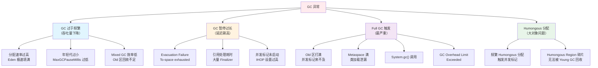
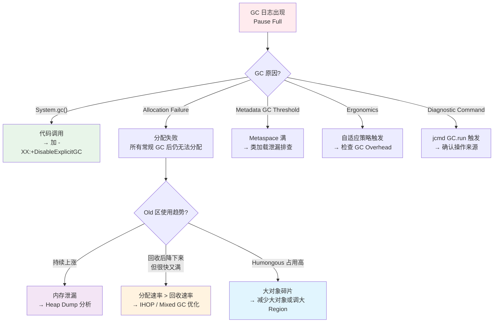
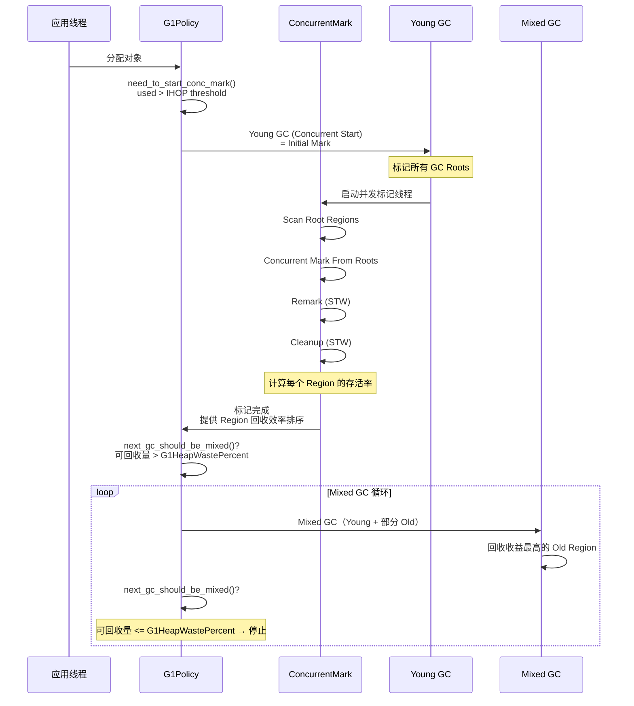
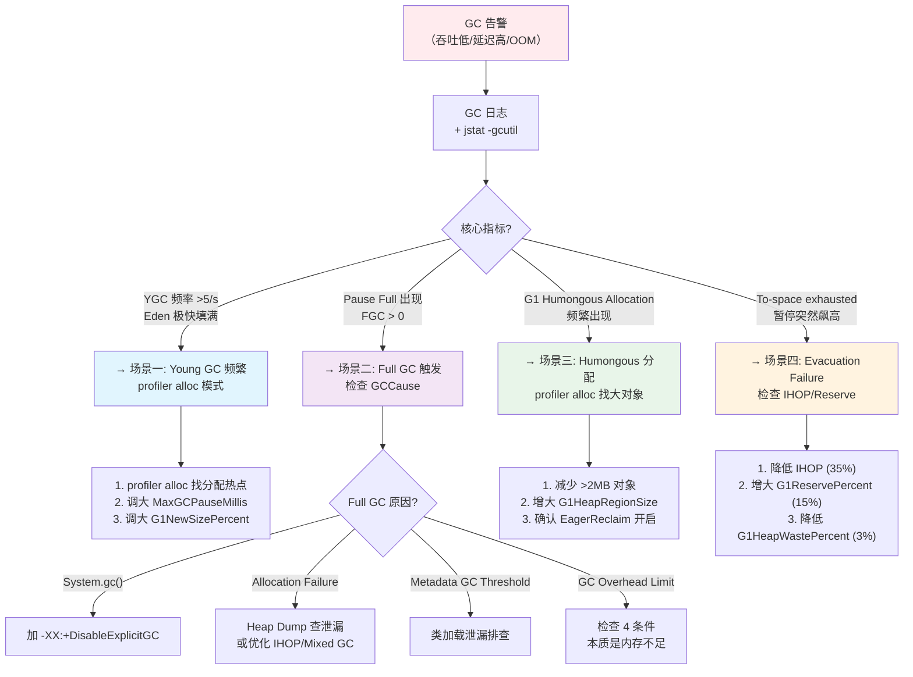

# GC 问题实战诊断案例

> 基于 OpenJDK 11 源码 + Arthas 4.1.2 + async-profiler 3.0
> 标准环境：-Xms8g -Xmx8g -XX:+UseG1GC, G1 Region = 4MB
> 源码路径：src/hotspot/share/
> 定位：从 GC 异常现象到源码级根因的完整诊断闭环

---

## 第 0 部分：核心原理 ⭐

### 0.1 本质是什么？

本文深入分析 **GC 问题实战诊断案例**：从源码角度理解其设计原理、实现机制和关键细节。

### 0.2 为什么需要？

理解 JVM 内部实现是排查复杂问题、进行性能优化的基础。表面的 API 文档无法解释 JVM 的实际行为，只有深入源码才能建立精确的心智模型。

### 0.3 怎么解决？

结合源码阅读、数据结构分析和 GDB 运行时验证，从多个角度建立对该机制的完整理解。

### 0.4 为什么这样设计？

每个设计决策都有其权衡：性能 vs 正确性、简单性 vs 灵活性、内存占用 vs 查找速度。理解这些权衡是理解 JVM 设计的关键。

---


## 0. 核心原理

### 0.1 本质是什么？

GC 问题的本质是**对象的产生速率与回收速率之间的平衡被打破**。当分配速率远高于回收速率时，GC 被迫频繁触发或长时间执行，导致应用吞吐量下降、延迟飙高，极端情况下触发 OOM。

### 0.2 为什么需要源码级理解？

因为 G1 的决策逻辑极其复杂——何时触发 Young GC、何时启动并发标记、何时转入 Mixed GC、何时退化为 Full GC，这些都由 `G1Policy`（`g1Policy.cpp`）中的**暂停时间预测模型**和 **IHOP 自适应阈值**控制。不理解这些决策机制，就无法判断 GC 异常是"配置不当"还是"应用行为导致"，调参也就失去方向。

例如：
- GC 日志中频繁出现 `G1 Humongous Allocation` → 需要理解 Humongous 阈值是 Region/2（`g1CollectedHeap.hpp:1253`），标准环境下是 **2MB**
- GC 日志中出现 `To-space exhausted` → 需要理解这是 Evacuation Failure（`g1CollectedHeap.cpp:3825`），意味着 Old 区已无空间容纳转移对象
- Mixed GC 只执行了 2 轮就停止 → 需要理解 `G1HeapWastePercent`（默认 5%）控制着 Mixed GC 的停止条件（`g1Policy.cpp:1142-1146`）

### 0.3 怎么解决？

**分层递进诊断**：GC 日志分析（GC 原因 + 暂停时间 + 堆变化趋势）→ 分配速率定位（async-profiler alloc 模式）→ GC 策略参数确认（`jinfo -flags`）→ 源码级根因（HotSpot 源码 + GDB 验证）。

---

## 1. GC 问题根因分类



**根因与诊断工具的映射**：

| 根因类型 | GC 日志特征 | 首选诊断工具 | 依据 |
|---------|------------|-------------|------|
| 分配速率过高 | Young GC 频率 >5/s，Eden 占用增长极快 | profiler alloc 模式 | 定位高分配方法 |
| Evacuation Failure | `To-space exhausted` | GC 日志 + Heap Dump | 转移失败根因 |
| Full GC | `Pause Full` | GC 日志 + `jstat -gcutil` | 触发原因分析 |
| Humongous | `G1 Humongous Allocation` | profiler alloc + `-XX:+PrintAdaptiveSizePolicy` | 大对象来源 |
| IHOP 不当 | Mixed GC 频率低/不触发 | `-Xlog:gc+ihop=debug` | 阈值偏高 |
| GC Overhead | `GC Overhead Limit Exceeded` | GC 日志时间占比 | 4 条件分析 |

---

## 2. 诊断工具链：从 GC 日志到根因

### 2.1 第一层：GC 日志分析（必做）

GC 日志是排查 GC 问题的**第一信息源**，生产环境必须开启。

```bash
# JDK 11 GC 日志参数（推荐配置）
-Xlog:gc*,gc+age=trace,gc+humongous=debug:file=/tmp/gc.log:time,uptime,level,tags:filecount=5,filesize=50m

# 关键日志标签：
# gc        — GC 事件概要
# gc+heap   — 堆使用变化
# gc+ergo   — 自适应策略决策（年轻代大小、IHOP 阈值）
# gc+ihop   — IHOP 阈值计算细节
# gc+humongous — 巨型对象分配/回收
# gc+phases — GC 各阶段耗时
```

**GC 日志核心信息解读**：

```
[2026-03-02T10:15:30.123+0800][gc,start] GC(1234) Pause Young (Normal) (G1 Evacuation Pause)
                                                    ^^^^^   ^^^^^^^^       ^^^^^^^^^^^^^^^^^^^^
                                                    类型    子类型          GCCause 枚举映射

[2026-03-02T10:15:30.145+0800][gc      ] GC(1234) Pause Young (Normal) (G1 Evacuation Pause) 22ms
                                                                                               ^^^^
                                                                                            暂停时间

[2026-03-02T10:15:30.145+0800][gc,heap ] GC(1234) Eden: 1024M(1024M)->0B(1024M) Survivors: 64M->72M Heap: 4096M(8192M)->3200M(8192M)
                                                         ^^^^^^^^^^^^^^^^^^^^      ^^^^^^^^^^^^^^^    ^^^^^^^^^^^^^^^^^^^^^^^^^^^^^^^
                                                         Eden 使用变化              Survivor 变化      总堆使用变化
```

**GC 原因到日志字符串的映射**（`gcCause.cpp`）：

| GCCause 枚举值 | GC 日志字符串 | 行号 | 触发含义 |
|----------------|-------------|------|---------|
| `_g1_inc_collection_pause` | `"G1 Evacuation Pause"` | 100-101 | 正常 Young/Mixed GC |
| `_g1_humongous_allocation` | `"G1 Humongous Allocation"` | 103-104 | 巨型对象分配触发 |
| `_allocation_failure` | `"Allocation Failure"` | 67-68 | 分配失败触发 |
| `_java_lang_system_gc` | `"System.gc()"` | 31-32 | 代码调用 System.gc() |
| `_metadata_GC_threshold` | `"Metadata GC Threshold"` | 73-74 | Metaspace 阈值触发 |
| `_gc_locker` | `"GCLocker Initiated GC"` | 46-47 | JNI 临界区触发 |
| `_adaptive_size_policy` | `"Ergonomics"` | 97-98 | 自适应策略触发 |
| `_dcmd_gc_run` | `"Diagnostic Command"` | 106-107 | jcmd GC.run 触发 |

### 2.2 第二层：jstat 实时监控（快速定性）

```bash
# 每秒输出一次 GC 统计
jstat -gcutil <pid> 1000

# 输出示例：
#   S0     S1     E      O      M     CCS    YGC     YGCT    FGC    FGCT     GCT
#   0.00  75.23  45.67  72.34  95.12  92.45   1234   15.678    3    2.345   18.023
#                        ^^^^^                                 ^    ^^^^^
#                        Old 区占比                           FGC 次数  FGC 总时间

# 关键指标判断：
# O > 80% 且持续上升 → Old 区泄漏或回收效率低
# YGC 频率 >5/s → 分配速率过高
# FGC > 0 且增长 → Full GC 触发，需要立即排查
# FGCT 单次 >1s → Full GC 暂停严重
```

### 2.3 第三层：async-profiler 分配采样（定位分配热点）

```bash
# 分配火焰图
./asprof -d 30 -e alloc -f /tmp/alloc-flame.html <pid>

# 或 Arthas
profiler start --event alloc
profiler stop --format html --file /tmp/alloc-flame.html
```

alloc 火焰图展示**对象分配量**，最宽的平顶方法 = 分配最多的方法。当 Young GC 频繁时，这是定位分配热点的最直接手段。

> **分配采样底层实现**：[06-Allocation-Profiling-Deep-Dive.md](../AsyncProfiler/06-Allocation-Profiling-Deep-Dive.md)

### 2.4 第四层：Heap Dump 深度分析（按需）

```bash
# 手动触发 Heap Dump
jmap -dump:format=b,file=/tmp/heapdump.hprof <pid>

# 或 JVM 参数自动转储（OOM 时）
-XX:+HeapDumpOnOutOfMemoryError -XX:HeapDumpPath=/tmp/
```

使用 Eclipse MAT 分析 Heap Dump，重点关注：
- **Dominator Tree**：按 retained size 排序，找占用最大的对象
- **Leak Suspects**：MAT 自动识别泄漏嫌疑
- **Path to GC Roots**：找到对象被引用的路径

> **GC 日志实战分析**：[18-GC-Log-Practice.md](../G1GC/18-GC-Log-Practice.md)
> **G1 GC 故障排查深度指南**：[19-GC-Troubleshooting-Deep-Dive.md](../G1GC/19-GC-Troubleshooting-Deep-Dive.md)

---

## 3. 场景一：Young GC 过于频繁

### 3.1 问题现象

```
# jstat -gcutil 1000 显示 YGC 频率 >5/s
# GC 日志中 Young GC 间隔 <200ms
# 应用吞吐量下降，但单次暂停时间不长（<50ms）
# Eden 区极速填满
```

### 3.2 HotSpot 源码：年轻代大小自适应机制

G1 的年轻代大小不是固定的——它由 `G1Policy` 根据 `MaxGCPauseMillis`（默认 200ms）目标**动态调整**。

源码位置：`g1Policy.cpp:326-426` `calculate_young_list_target_length()`

```cpp
void G1Policy::calculate_young_list_target_length(
    size_t rs_lengths) {                                        // 326
  // 获取目标暂停时间
  double target_pause_time_ms = _mmu_tracker->max_gc_time() 
      * 1000.0;                                                 // 349
  // 即 MaxGCPauseMillis（默认 200ms）
  
  // 计算最大/最小年轻代长度
  uint min_young_length = ...;
  uint max_young_length = ...;
  
  // 二分查找：在 [min, max] 中找满足暂停时间目标的最大值
  while (diff > 0) {                                            // 369-420
    uint mid = ...;
    if (predictor.will_fit(mid, ...)) {
      // 预测暂停时间 <= 目标 → 可以更大
      min_young_length = mid;
    } else {
      // 预测暂停时间 > 目标 → 需要更小
      max_young_length = mid;
    }
  }
}
```

**暂停时间预测模型**（`g1Policy.cpp:169-206` `G1YoungLengthPredictor::will_fit()`）：

```cpp
bool G1YoungLengthPredictor::will_fit(uint young_length, ...) {
  // 终止条件 1：空间不足
  if (young_length >= base_free_regions) return false;           // 170-172
  
  // 预测暂停时间 = RS 更新 + RS 扫描 + 对象拷贝 + 常量开销 + 每 Region 开销
  double pause_time_ms = 
      predict_rs_update_time_ms(...) +                           // 182-190
      predict_rs_scan_time_ms(...) + 
      predict_object_copy_time_ms(...) + 
      predict_constant_other_time_ms() + 
      predict_young_other_time_ms(young_length);
  
  // 终止条件 2：暂停时间超过目标
  if (pause_time_ms > target_pause_time_ms) return false;        // 182-184
  
  // 终止条件 3：复制所需空间超过可用空间
  // ...                                                         // 199-201
  return true;
}
```

**核心洞察**：如果 `MaxGCPauseMillis` 设得太低（如 50ms），G1 会将年轻代调得很小（因为年轻代越小，单次暂停越短），导致 Eden 极快填满，Young GC 极为频繁。

### 3.3 G1 关键调优参数

| 参数 | 默认值 | 行号 | 作用 |
|------|--------|------|------|
| `MaxGCPauseMillis` | 200 | g1Arguments.cpp:140 | 最大 GC 暂停目标（ms） |
| `G1NewSizePercent` | 5 | g1_globals.hpp:229 | 年轻代最小堆占比 |
| `G1MaxNewSizePercent` | 60 | g1_globals.hpp:223 | 年轻代最大堆占比 |
| `G1ReservePercent` | 10 | g1_globals.hpp:188 | 预留空间百分比（防转移失败） |
| `G1HeapWastePercent` | 5 | g1_globals.hpp:241 | Mixed GC 停止阈值 |
| `G1MixedGCCountTarget` | 8 | g1_globals.hpp:246 | 标记周期后目标 Mixed GC 次数 |
| `G1MixedGCLiveThresholdPercent` | 85 | g1_globals.hpp:235 | 存活率超过此值的 Region 不参与 Mixed GC |
| `G1OldCSetRegionThresholdPercent` | 10 | g1_globals.hpp:264 | 每次 Mixed GC 中 Old Region 数量上限 |
| `G1EagerReclaimHumongousObjects` | true | g1_globals.hpp:253 | 每次 Young GC 尝试回收死亡大对象 |
| `InitiatingHeapOccupancyPercent` | 45 | 全局 | IHOP 初始值 |

### 3.4 诊断实战

```bash
# 1. 确认 GC 频率和年轻代大小
jstat -gcutil <pid> 1000
# 如果 YGC 频率 >5/s → 年轻代可能过小

# 2. 查看当前 MaxGCPauseMillis
jinfo -flag MaxGCPauseMillis <pid>

# 3. 找到分配热点
./asprof -d 30 -e alloc -f /tmp/alloc-flame.html <pid>
# 最宽的平顶方法 = 分配最多

# 4. 解决方案
# 方案 A：适当放大暂停目标（允许更大的年轻代）
-XX:MaxGCPauseMillis=200  # 默认，通常不需要改
# 方案 B：显式设置年轻代下限
-XX:G1NewSizePercent=20   # 年轻代至少占堆 20%
# 方案 C：减少分配（治本）
# 根据 alloc 火焰图优化高分配方法：对象池、减少临时对象
```

---

## 4. 场景二：Full GC 触发

### 4.1 问题现象

```
# GC 日志出现 "Pause Full"
# jstat FGC 列 > 0 且增长
# 单次 Full GC 暂停数秒到数十秒
# 应用可能出现超长卡顿
```

### 4.2 HotSpot 源码：Full GC 触发路径

G1 的 Full GC 是**最后手段**——所有常规 GC 都无法满足分配请求时才触发。

**触发链**：分配失败 → `satisfy_failed_allocation()` → 三步重试 → Full GC

源码位置：`g1CollectedHeap.cpp:1273-1319`

```cpp
HeapWord* G1CollectedHeap::satisfy_failed_allocation(
    size_t word_size, bool* succeeded) {                        // 1273
  
  // 第一步：尝试分配 + Full GC（不清除软引用）
  result = satisfy_failed_allocation_helper(                     // 1278
      word_size, true/*do_gc*/, false/*clear_soft*/, ...);
  if (result != NULL) return result;
  
  // 第二步：尝试分配 + Full GC（清除所有软引用）
  result = satisfy_failed_allocation_helper(                     // 1290
      word_size, true/*do_gc*/, true/*clear_all_soft_refs*/, ...);
  if (result != NULL) return result;
  
  // 第三步：最后一次纯分配尝试（无 GC）
  result = satisfy_failed_allocation_helper(                     // 1301
      word_size, false/*do_gc*/, ...);
  if (result != NULL) return result;
  
  // 全部失败 → 返回 NULL → OOM
  *succeeded = false;
  return NULL;                                                   // 1318
}
```

每步 helper 内部的逻辑（`g1CollectedHeap.cpp:1241-1271`）：

```cpp
HeapWord* satisfy_failed_allocation_helper(...) {
  // 先尝试在 safepoint 直接分配
  result = attempt_allocation_at_safepoint(word_size, ...);      // 1248-1250
  if (result != NULL) return result;
  
  // 再尝试扩展堆后分配
  result = expand_and_allocate(word_size);                       // 1259
  if (result != NULL) return result;
  
  // 最后执行 Full GC
  if (do_gc) {
    do_full_collection(clear_all_soft_refs);                     // 1264-1267
  }
  return NULL;
}
```

**Full GC 四阶段实现**（`g1FullCollector.cpp:167-179`）：

```cpp
void G1FullCollector::collect() {                                // 167
  phase1_mark_live_objects();    // Phase 1：标记存活对象         // 168
  phase2_prepare_compaction();   // Phase 2：准备压缩             // 174
  phase3_adjust_pointers();      // Phase 3：调整指针             // 176
  phase4_do_compaction();        // Phase 4：执行压缩             // 178
}
```

**Full GC 与 Young/Mixed GC 的本质区别**：

| 对比维度 | Young/Mixed GC | Full GC |
|---------|---------------|---------|
| 算法 | **Evacuation**（拷贝存活对象到新 Region） | **Mark-Sweep-Compact**（标记→清除→压缩） |
| 范围 | CSet 中选定的 Region | **全堆所有 Region** |
| 并行度 | ParallelGCThreads 个线程并行 | 同样并行，但工作量大得多 |
| 暂停时间 | 通常 <200ms（受 MaxGCPauseMillis 约束） | **数秒到数十秒**（不受约束） |
| 并发标记 | 会被 Full GC 中止（`abort_concurrent_cycle()`） | Full GC 本身不涉及并发阶段 |

### 4.3 Full GC 触发原因分析



### 4.4 GC Overhead Limit Exceeded

当 GC 时间占总时间的比例持续过高时，JVM 会抛出 `java.lang.OutOfMemoryError: GC overhead limit exceeded`。

源码位置：`adaptiveSizePolicy.cpp:407-538`

```cpp
void AdaptiveSizePolicy::check_gc_overhead_limit(...) {          // 407
  // 计算阈值
  double gc_cost_limit = GCTimeLimit / 100.0;                    // 449
  // GCTimeLimit 默认 98 → gc_cost_limit = 0.98
  
  size_t mem_free_limit = total_mem * (GCHeapFreeLimit / 100.0); // 446
  // GCHeapFreeLimit 默认 2 → 空闲内存阈值 = 总内存 * 2%
  
  // 四个条件必须全部满足：
  if (is_full_gc &&                                              // 469
      gc_cost() > gc_cost_limit &&                               // 470：GC 时间占比 > 98%
      free_in_old_gen < mem_free_old_limit &&                    // 471：Old 空闲 < 2%
      free_in_eden < mem_free_eden_limit) {                      // 472：Eden 空闲 < 2%
    
    _gc_overhead_limit_count++;                                  // 493
    
    // 连续 5 次（AdaptiveSizePolicyGCTimeLimitThreshold）满足条件
    if (UseGCOverheadLimit && 
        _gc_overhead_limit_count >= threshold) {                 // 494-501
      set_gc_overhead_limit_exceeded(true);  // → OOM
    }
    
    // 接近阈值时先清理软引用
    soft_ref_policy->set_should_clear_all_soft_refs(true);       // 509-513
  }
}
```

**GC Overhead 判定的 4 个条件**：

| # | 条件 | 默认阈值 | 含义 |
|---|------|---------|------|
| 1 | `is_full_gc == true` | — | 必须是 Full GC |
| 2 | `gc_cost() > GCTimeLimit/100` | 98% | GC 时间占总时间超过 98% |
| 3 | `free_in_old_gen < total*GCHeapFreeLimit/100` | 2% | Old 区空闲不足 2% |
| 4 | `free_in_eden < total*GCHeapFreeLimit/100` | 2% | Eden 空闲不足 2% |

**连续满足 5 次（`AdaptiveSizePolicyGCTimeLimitThreshold`）才触发 OOM**，不是一次就报。

### 4.5 诊断命令

```bash
# 1. 确认 Full GC 触发原因
grep "Pause Full" /tmp/gc.log
# 看括号中的 GCCause

# 2. 如果是 System.gc()
jinfo -flag DisableExplicitGC <pid>
# 解决：添加 -XX:+DisableExplicitGC

# 3. 如果是 Allocation Failure — 分析 Old 区趋势
jstat -gcutil <pid> 1000
# O 列持续上涨 → 泄漏；波动但总体满 → IHOP/Mixed GC 问题

# 4. 如果是 Metadata GC Threshold
jstat -gcmetacapacity <pid> 1000
# 观察 Metaspace 使用增长 → 类加载泄漏
```

> **OOM 处理机制源码分析**：[02-Memory-Leak-Case-Study.md](02-Memory-Leak-Case-Study.md)
> **Full GC 完整源码分析**：[10-Full-GC.md](../G1GC/10-Full-GC.md)
> **GC 日志实战分析**：[18-GC-Log-Practice.md](../G1GC/18-GC-Log-Practice.md)

---

## 5. 场景三：Humongous 分配导致 GC 异常

### 5.1 问题现象

```
# GC 日志频繁出现 "G1 Humongous Allocation" 原因
# 或在 gc+humongous 标签中看到大量 Humongous 分配/回收日志
# Old 区使用率高，但大部分是 Humongous Region
# Mixed GC 效果不佳（Humongous 不参与常规回收）
```

### 5.2 HotSpot 源码：Humongous 分配路径

**Humongous 阈值定义**（`g1CollectedHeap.hpp:1248-1253`）：

```cpp
static bool is_humongous(size_t word_size) {
  return word_size > _humongous_object_threshold_in_words;      // 1248
}
static size_t humongous_threshold_for(size_t region_size) {
  return (region_size / 2);                                     // 1253: Region 大小的一半
}
```

**标准环境下**：Region = 4MB → Humongous 阈值 = 2MB。任何 >= 2MB 的对象都走 Humongous 分配路径。

**分配入口**（`g1CollectedHeap.cpp:407-416`）：

```cpp
HeapWord* G1CollectedHeap::mem_allocate(
    size_t word_size, bool* gc_overhead_limit_was_exceeded) {    // 407
  if (is_humongous(word_size)) {
    return attempt_allocation_humongous(word_size);              // 412
  }
  return attempt_allocation(word_size);                          // 415
}
```

**Humongous 分配核心逻辑**（`g1CollectedHeap.cpp:847-963`）：

```cpp
HeapWord* G1CollectedHeap::attempt_allocation_humongous(
    size_t word_size) {                                          // 847
  
  // 先检查 IHOP：大对象分配可能触发并发标记
  if (need_to_start_conc_mark(
      "concurrent humongous allocation", word_size)) {           // 870-872
    collect(GCCause::_g1_humongous_allocation);
    // → GC 日志中看到 "G1 Humongous Allocation" 原因
  }
  
  // 尝试在 free list 中分配连续 Region
  result = humongous_obj_allocate(word_size);                    // 891
  if (result != NULL) return result;
  
  // 失败 → 触发 Young GC 后重试
  result = do_collection_pause(..., 
      GCCause::_g1_humongous_allocation, ...);                   // 909-910
  // ...
}
```

**实际分配**（`g1CollectedHeap.cpp:327-395`）：

```cpp
HeapWord* G1CollectedHeap::humongous_obj_allocate(
    size_t word_size) {                                          // 327
  // 计算需要几个连续 Region
  uint num_regions = humongous_obj_size_in_regions(word_size);   // 333
  
  if (num_regions == 1) {
    // 快速路径：只需 1 个 Region
    hr = new_region(word_size, true/*is_old*/);                  // 335-342
  } else {
    // 多 Region：先找连续空闲区域
    first = _hrm.find_contiguous_only_empty(num_regions);        // 346
    if (first == G1_NO_HRM_INDEX) {
      // 找不到 → 找空闲+未提交区域，扩展堆
      first = _hrm.find_contiguous_empty_or_unavailable(         // 356
          num_regions);
      if (first != G1_NO_HRM_INDEX) expand(first, num_regions);
    }
  }
}
```

### 5.3 Humongous 的三个问题

**问题 1：Humongous 分配频繁触发并发标记**

每次 Humongous 分配都会检查 IHOP（`need_to_start_conc_mark()`），如果当前堆使用量超过阈值，就会触发 `collect(GCCause::_g1_humongous_allocation)`，可能导致 Young GC 或并发标记启动。频繁的 Humongous 分配 = 频繁的 GC 触发。

**问题 2：Humongous Region 的碎片化**

Humongous 对象独占整个 Region（甚至多个连续 Region），即使对象只用了 2.1MB，也要占用一整个 4MB Region，剩余 1.9MB 浪费。更严重的是，Humongous Region 不参与常规的 CSet 选择，只能通过：
- `G1EagerReclaimHumongousObjects`（默认 true）在 Young GC 时回收**已死亡**的 Humongous 对象
- Full GC 回收

**问题 3：连续 Region 需求导致分配失败**

大的 Humongous 对象需要多个连续 Region，如果堆碎片化严重（有很多 Old Region 夹杂其中），可能找不到连续空闲区域，导致分配失败 → Full GC。

### 5.4 诊断命令

```bash
# 1. 确认 Humongous 分配频率
grep -c "G1 Humongous Allocation" /tmp/gc.log
# 或查看 gc+humongous 标签
grep "gc,humongous" /tmp/gc.log

# GC 日志示例（gc+humongous=debug）：
# [gc,humongous] GC(1234) Live humongous region 456 object size 2621440 start 0x...
#                                                    ^^^^^^^^^^^^^^^^^ 字节数 = 2.5MB
# [gc,humongous] GC(1234) Dead humongous region 789 object size 3145728

# 2. 找到分配大对象的代码
./asprof -d 30 -e alloc -f /tmp/alloc-flame.html <pid>
# 火焰图中查找分配量 >2MB 的方法

# 3. 解决方案
# 方案 A：减少大对象（改用分块传输、ByteBuffer 池化）
# 方案 B：增大 Region（减少 Humongous 比例）
-XX:G1HeapRegionSize=8m  # Region=8MB, Humongous 阈值=4MB
# 方案 C：确保 Eager Reclaim 开启
-XX:+G1EagerReclaimHumongousObjects  # 默认已开启
```

> **Humongous 对象排查实战**：[04-Humongous-Object-Case-Study.md](../G1GC/Troubleshooting-Series/04-Humongous-Object-Case-Study.md)
> **HeapRegion 深度分析**：[1-HeapRegion-Deep-Dive.md](../G1GC/1-HeapRegion-Deep-Dive.md)
> **对象分配路径**：[3-Object-Allocation-Path.md](../G1GC/3-Object-Allocation-Path.md)

---

## 6. 场景四：并发标记不及时导致 Evacuation Failure

### 6.1 问题现象

```
# GC 日志出现 "To-space exhausted"
# GC 暂停时间突然飙高
# Old 区在 Young GC 后使用率反而上升（转移到 Old 失败）
# 可能伴随后续的 Full GC
```

### 6.2 HotSpot 源码：Evacuation Failure 与 To-space Exhausted

**Evacuation Failure** 发生在 Young/Mixed GC 期间——当 G1 试图将存活对象从 CSet 中的 Region 拷贝到 Survivor/Old Region 时，发现**没有足够的空闲 Region 容纳这些对象**。

**触发点**（`g1CollectedHeap.cpp:3891-3898`）：

```cpp
// 对象拷贝失败时调用
oop G1CollectedHeap::preserve_mark_during_evac_failure(...) {
  _evacuation_failed = true;                                     // 3893
  // 注册拷贝失败，保存 mark word
}
```

**日志输出**（`g1CollectedHeap.cpp:3824-3825`）：

```cpp
if (evacuation_failed()) {
  log_info(gc)("To-space exhausted");                            // 3825
}
```

**Evacuation Failure 的后果**：
- 无法拷贝的对象**原地留在 CSet Region 中**，这些 Region 从 Young/Old 变成了"self-forwarded"状态
- 需要执行 `restore_after_evac_failure()`（`g1CollectedHeap.cpp:3880-3889`）修复 mark word 和 RSet
- 本次 GC 的统计数据作废（`g1Policy.cpp:612`：`update_stats = !evacuation_failed()`）
- 极有可能触发后续的 Full GC

### 6.3 根因：并发标记启动太晚

**IHOP（Initiating Heap Occupancy Percent）** 控制着并发标记何时启动。如果 IHOP 设置过高，Old 区已经接近满了才启动并发标记，标记+清理还没完成，Old 区就完全填满了——没有空间容纳转移对象 → Evacuation Failure。

**IHOP 阈值计算**（`g1IHOPControl.cpp:123-144`）：

```cpp
size_t G1AdaptiveIHOPControl::get_conc_mark_start_threshold() {  // 123
  // 预测标记时间和晋升速率
  double pred_marking_time = 
      _predictor->get_new_prediction(&_marking_times_s);          // 125
  double pred_promotion_rate = 
      _predictor->get_new_prediction(&_allocation_rate_s);        // 126
  
  // 标记期间预计有多少数据晋升到 Old
  size_t predicted_needed = 
      (size_t)(pred_marking_time * pred_promotion_rate)            // 128-133
      + _last_unrestrained_young_size;
  
  // 阈值 = 实际目标 - 预计需要的空间
  size_t threshold = actual_target - predicted_needed;             // 136-138
  
  // 样本不足时回退到静态值
  if (!have_enough_data_for_prediction()) {                       // 142
    threshold = (size_t)(_initial_ihop_percent 
        * _target_occupancy / 100.0);
    // 即 InitiatingHeapOccupancyPercent * 堆容量 / 100
  }
  return threshold;
}
```

**并发标记启动判断**（`g1Policy.cpp:579-599`）：

```cpp
bool G1Policy::need_to_start_conc_mark(
    const char* source, size_t alloc_word_size) {                // 579
  // 如果即将进入 Mixed GC → 不启动
  if (about_to_start_mixed_phase()) return false;                // 580-582
  
  size_t threshold = 
      _ihop_control->get_conc_mark_start_threshold();            // 584
  
  size_t marking_request_bytes = 
      cur_used_bytes + alloc_byte_size;                          // 586-588
  
  // 当前使用量 > IHOP 阈值 → 触发并发标记
  return marking_request_bytes > threshold;                      // 591
}
```

### 6.4 并发标记 → Mixed GC 全链路



### 6.5 Mixed GC 停止条件

源码位置：`g1Policy.cpp:1132-1151`

```cpp
bool G1Policy::next_gc_should_be_mixed(
    const char* true_action_str, const char* false_action_str) { // 1132
  if (cset_chooser()->is_empty()) {                              // 1134-1137
    // 候选 Old Region 为空 → 不继续 Mixed
    return false;
  }
  double reclaimable_percent = ...;
  // 可回收百分比 <= G1HeapWastePercent（默认 5%）→ 停止
  if (reclaimable_percent <= G1HeapWastePercent) {               // 1142-1146
    return false;
  }
  return true;
}
```

**关键参数**：

| 参数 | 默认值 | 影响 |
|------|--------|------|
| `InitiatingHeapOccupancyPercent` | 45 | IHOP 初始值，自适应模式下会调整 |
| `G1UseAdaptiveIHOP` | true | 是否使用自适应 IHOP |
| `G1HeapWastePercent` | 5% | Mixed GC 停止条件（可回收量低于此值） |
| `G1MixedGCCountTarget` | 8 | 标记后目标 Mixed GC 次数 |
| `G1ReservePercent` | 10% | 预留空间（防止转移失败） |

### 6.6 诊断实战

```bash
# 1. 确认是否有 To-space exhausted
grep "To-space exhausted" /tmp/gc.log

# 2. 检查 IHOP 阈值（开启 debug 日志）
-Xlog:gc+ihop=debug
# 输出示例：
# [gc,ihop] Request concurrent cycle initiation (occupancy: 4294967296B > threshold: 3865470566B)

# 3. 解决方案
# 方案 A：降低 IHOP 初始值（更早启动并发标记）
-XX:InitiatingHeapOccupancyPercent=35  # 从 45 降到 35
# 方案 B：增大预留空间
-XX:G1ReservePercent=15  # 从 10 增到 15
# 方案 C：降低 Waste 阈值（让 Mixed GC 多执行几轮）
-XX:G1HeapWastePercent=3  # 从 5 降到 3
# 方案 D：限制每次 Mixed GC 的 Old Region 上限
-XX:G1OldCSetRegionThresholdPercent=15  # 从 10 增到 15
```

> **并发标记深度分析**：[8-Concurrent-Marking.md](../G1GC/8-Concurrent-Marking.md)
> **IHOP 控制分析**：[G1-IHOPControl-LineByLine.md](../G1GC/G1-IHOPControl-LineByLine.md)
> **GC 频繁排查实战**：[02-GC-Frequent-Case-Study.md](../G1GC/Troubleshooting-Series/02-GC-Frequent-Case-Study.md)
> **Full GC 排查实战**：[03-Full-GC-Case-Study.md](../G1GC/Troubleshooting-Series/03-Full-GC-Case-Study.md)

---

## 7. 完整诊断决策树



---

## 8. GDB 验证方案

以下 GDB 脚本用于验证 HotSpot 层面的 GC 决策路径。

```bash
# GDB 脚本保存位置：jvm-md/tmp-file/RealWorld-GC/gdb_gc_verify.cmd
gdb -x jvm-md/tmp-file/RealWorld-GC/gdb_gc_verify.cmd
```

**GDB 验证点**：

| # | 断点 | 验证目标 |
|---|------|---------|
| 1 | `do_collection_pause_at_safepoint` (3541) | 确认 Young/Mixed GC 入口、target_pause_time 参数 |
| 2 | `do_full_collection` (1132) | 确认 Full GC 触发条件 |
| 3 | `satisfy_failed_allocation` (1273) | 确认三步重试策略 |
| 4 | `attempt_allocation_humongous` (847) | 确认 Humongous 分配路径和 IHOP 检查 |
| 5 | `need_to_start_conc_mark` (579) | 确认 IHOP 阈值判断逻辑 |
| 6 | To-space exhausted 日志 (3825) | 确认 Evacuation Failure 触发 |
| 7 | `check_gc_overhead_limit` (407) | 确认 GC Overhead 4 条件 |

**GDB 验证示例输出**：

```
[BP1] do_collection_pause_at_safepoint: target_pause=200.00 ms
  _evacuation_failed=0, _old_marking_cycles_started=0
  → 正常 Young GC，目标暂停 200ms

[BP4] attempt_allocation_humongous: word_size=327680 (bytes=2621440)
  → 分配 2.5MB 对象，超过 Humongous 阈值（2MB）

[BP5] need_to_start_conc_mark: source="concurrent humongous allocation"
  → Humongous 分配触发 IHOP 检查

[BP6] To-space exhausted! _evacuation_failed=true
  → 转移失败，Old 区无法容纳存活对象
```

---

## 9. 总结

### 9.1 核心诊断路径

```
GC 日志（必做）→ jstat 实时监控（1min）→ 分配采样（5min）→ 策略参数调优
  GCCause + 暂停      gcutil 趋势        profiler alloc     jinfo -flags
```

### 9.2 工具选择原则

| 原则 | 说明 |
|------|------|
| **GC 日志是第一信息源** | 生产环境必须开启 GC 日志，所有诊断从 GC 日志开始 |
| **GCCause 决定诊断方向** | 不同的 GC 原因走完全不同的排查路径 |
| **暂停时间 vs 吞吐量权衡** | MaxGCPauseMillis 越低 → 年轻代越小 → GC 越频繁 → 吞吐量越低 |
| **IHOP 是并发标记的关键** | IHOP 过高 → 并发标记启动太晚 → Evacuation Failure → Full GC |
| **Humongous = Region/2** | 标准环境下 2MB，接近此阈值的对象要特别关注 |

### 9.3 面试话术模板

> **GC 问题排查**：
> 
> 我的排查路径是**先看 GC 日志，后定分配热点**。GC 日志告诉我"发生了什么"——GCCause 是 `G1 Evacuation Pause`（正常）还是 `G1 Humongous Allocation`（大对象触发）还是 `Allocation Failure`（分配失败），这些字符串直接来自 `gcCause.cpp` 的 `to_string()` 映射（如 `_g1_inc_collection_pause` → `"G1 Evacuation Pause"` 在第 100-101 行）。
> 
> 常见问题有四类：**Young GC 频繁**——本质是年轻代过小，G1 通过 `G1Policy::calculate_young_list_target_length()` 基于 `MaxGCPauseMillis`（默认 200ms）动态调整年轻代大小，暂停目标设太低就会导致年轻代极小；**Full GC**——触发链是 `satisfy_failed_allocation()`（`g1CollectedHeap.cpp:1273`）的三步重试，全部失败才 OOM；**Humongous 分配**——阈值是 Region/2（`g1CollectedHeap.hpp:1253`），标准环境 2MB，每次分配都会检查 IHOP；**Evacuation Failure**——GC 日志出现 `To-space exhausted`（`g1CollectedHeap.cpp:3825`），根因是 Old 区空间不足，需要降低 IHOP 或增大 G1ReservePercent。
> 
> 对于分配速率过高的问题，async-profiler alloc 模式是最直接的定位手段，它能精确到方法级别展示分配量分布。对于 IHOP 调优，需要理解 G1 的自适应 IHOP（`g1IHOPControl.cpp:123-144`）：它根据历史标记时间和晋升速率预测"需要预留多少空间给并发标记期间的晋升"，样本不足时回退到 `InitiatingHeapOccupancyPercent`（默认 45%）。

### 9.4 关联文档

| 主题 | 文档 |
|------|------|
| GC 日志实战分析 | [18-GC-Log-Practice.md](../G1GC/18-GC-Log-Practice.md) |
| GC 故障排查深度指南 | [19-GC-Troubleshooting-Deep-Dive.md](../G1GC/19-GC-Troubleshooting-Deep-Dive.md) |
| Full GC 完整源码分析 | [10-Full-GC.md](../G1GC/10-Full-GC.md) |
| 并发标记深度分析 | [8-Concurrent-Marking.md](../G1GC/8-Concurrent-Marking.md) |
| IHOP 控制分析 | [G1-IHOPControl-LineByLine.md](../G1GC/G1-IHOPControl-LineByLine.md) |
| HeapRegion 深度分析 | [1-HeapRegion-Deep-Dive.md](../G1GC/1-HeapRegion-Deep-Dive.md) |
| 对象分配路径 | [3-Object-Allocation-Path.md](../G1GC/3-Object-Allocation-Path.md) |
| G1 策略预测模型 | [7-G1Policy-Prediction-Model.md](../G1GC/7-G1Policy-Prediction-Model.md) |
| 内存泄漏排查 | [02-Memory-Leak-Case-Study.md](02-Memory-Leak-Case-Study.md) |
| Humongous 排查实战 | [04-Humongous-Object-Case-Study.md](../G1GC/Troubleshooting-Series/04-Humongous-Object-Case-Study.md) |
| GC 频繁排查实战 | [02-GC-Frequent-Case-Study.md](../G1GC/Troubleshooting-Series/02-GC-Frequent-Case-Study.md) |
| Full GC 排查实战 | [03-Full-GC-Case-Study.md](../G1GC/Troubleshooting-Series/03-Full-GC-Case-Study.md) |
| async-profiler 分配采样 | [06-Allocation-Profiling-Deep-Dive.md](../AsyncProfiler/06-Allocation-Profiling-Deep-Dive.md) |
| async-profiler CPU 采样 | [05-CPU-Profiling-PerfEvents-Deep-Dive.md](../AsyncProfiler/05-CPU-Profiling-PerfEvents-Deep-Dive.md) |
| Arthas 性能开销分析 | [27-Performance-Impact-Analysis.md](../Arthas-new/27-Performance-Impact-Analysis.md) |
| 性能分析面试指南 | [7-Performance-Troubleshooting-Interview-Guide.md](../Interview/7-Performance-Troubleshooting-Interview-Guide.md) |
