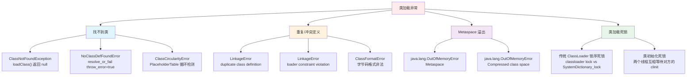
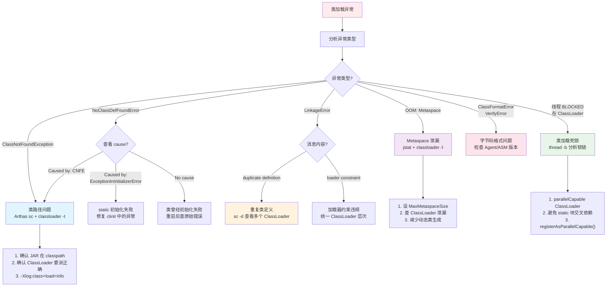

# 类加载问题实战诊断案例

> 基于 OpenJDK 11 源码 + Arthas 4.1.2
> 标准环境：-Xms8g -Xmx8g -XX:+UseG1GC, G1 Region = 4MB
> 源码路径：src/hotspot/share/
> 定位：从类加载异常现象到源码级根因的完整诊断闭环

---

## 第 0 部分：核心原理 ⭐

### 0.1 本质是什么？

本文深入分析 **类加载问题实战诊断案例**：从源码角度理解其设计原理、实现机制和关键细节。

### 0.2 为什么需要？

理解 JVM 内部实现是排查复杂问题、进行性能优化的基础。表面的 API 文档无法解释 JVM 的实际行为，只有深入源码才能建立精确的心智模型。

### 0.3 怎么解决？

结合源码阅读、数据结构分析和 GDB 运行时验证，从多个角度建立对该机制的完整理解。

### 0.4 为什么这样设计？

每个设计决策都有其权衡：性能 vs 正确性、简单性 vs 灵活性、内存占用 vs 查找速度。理解这些权衡是理解 JVM 设计的关键。

---


## 0. 核心原理

### 0.1 本质是什么？

类加载问题的本质是**类的查找、定义、链接三个阶段中的某个环节出错**。Java 的类是"懒加载"的——用到才加载，加载后放入 `SystemDictionary` 缓存。问题通常发生在：找不到类（ClassNotFoundException / NoClassDefFoundError）、重复定义（LinkageError）、循环依赖（ClassCircularityError）、Metaspace 溢出（OOM）。

### 0.2 为什么需要源码级理解？

因为 Java 层面只看到一个异常消息，但根因可能藏在 HotSpot 深处。例如：
- `NoClassDefFoundError` 和 `ClassNotFoundException` 的区别在 `systemDictionary.cpp:214-231` 的一个 `throw_error` 参数——`throw_error=true` 时抛 NCDFE 并包装原始 CNFE 作为 cause，`throw_error=false` 直接抛 CNFE
- 类加载死锁发生在 `double_lock_wait()`（`systemDictionary.cpp:514`）——传统类加载器依赖对象锁与 `SystemDictionary_lock` 之间的锁序问题
- Metaspace OOM 的触发点在 `metaspace.cpp:1545`——分配失败后调用 `report_metadata_oome()` 抛出预分配的 OOM 对象

### 0.3 怎么解决？

**分层递进诊断**：异常堆栈分析（异常类型 + 消息 + 触发点）→ 类加载器链路追踪（Arthas `classloader` / `sc`）→ JVM 日志（`-Xlog:class+load=info`）→ 源码级根因（HotSpot 源码 + GDB 验证）。

---

## 1. 类加载问题根因分类



**根因与诊断工具的映射**：

| 根因类型 | 异常/症状 | 首选诊断工具 | 依据 |
|---------|----------|-------------|------|
| 类路径缺失 | ClassNotFoundException | Arthas `classloader -a -t` + `sc` | 确认类加载器层次和搜索路径 |
| 初始化失败引发 NCDFE | NoClassDefFoundError | `-Xlog:class+load=info` + 异常 cause | cause 里有真正的初始化错误 |
| 类加载器冲突 | LinkageError: duplicate | Arthas `classloader -c <hash>` | 对比两个 ClassLoader 加载的同名类 |
| Metaspace 泄漏 | OOM: Metaspace | `jstat -gcmetacapacity` + Heap Dump | 定位泄漏的 ClassLoader |
| 类加载死锁 | 线程 BLOCKED 在 classloader | `jstack` / Arthas `thread -b` | 锁链分析 |
| 字节码增强失败 | ClassFormatError / VerifyError | `-Xlog:class+load=info` + agent 日志 | 字节码增强工具（ASM/ByteBuddy）的 bug |

---

## 2. HotSpot 类加载核心架构

### 2.1 类加载入口：SystemDictionary

`SystemDictionary` 是 HotSpot 中**所有类解析的唯一入口**。无论是 `new`、`checkcast`、`instanceof` 还是反射调用，最终都通过它来查找/加载类。

**解析入口链**（`systemDictionary.cpp`）：

```cpp
// 入口 1：解析失败时抛异常
Klass* SystemDictionary::resolve_or_fail(
    Symbol* class_name, Handle class_loader,
    Handle protection_domain,
    bool throw_error, TRAPS) {                           // 197
  
  Klass* klass = resolve_or_null(class_name, 
      class_loader, protection_domain, THREAD);          // 198
  
  // 异常转换的关键分支
  if (HAS_PENDING_EXCEPTION) {
    if (throw_error && PENDING_EXCEPTION->is_a(
        SystemDictionary::ClassNotFoundException_klass())) {
      // CNFE → 包装为 NCDFE（带 cause）
      THROW_MSG_CAUSE_NULL(
          vmSymbols::java_lang_NoClassDefFoundError(),
          class_name->as_C_string(), e);                 // 219
    }
    return NULL;                                         // 221
  }
  
  if (klass == NULL) {
    if (throw_error) {
      // 直接抛 NCDFE
      THROW_MSG_NULL(
          vmSymbols::java_lang_NoClassDefFoundError(),
          class_name->as_C_string());                    // 228
    } else {
      // 直接抛 CNFE
      THROW_MSG_NULL(
          vmSymbols::java_lang_ClassNotFoundException(),
          class_name->as_C_string());                    // 230
    }
  }
  return klass;
}
```

**核心洞察**：`throw_error` 参数决定了抛 NCDFE 还是 CNFE——**字节码指令**（`new`、`anewarray`、`checkcast`、`getfield` 等）走 `resolve_or_fail(throw_error=true)` → 抛 `NoClassDefFoundError`；**反射/Class.forName** 走 `resolve_or_fail(throw_error=false)` → 抛 `ClassNotFoundException`。

### 2.2 类解析核心函数：resolve_instance_class_or_null

源码位置：`systemDictionary.cpp:631-870+`

```cpp
Klass* SystemDictionary::resolve_instance_class_or_null(
    Symbol* name, Handle class_loader,
    Handle protection_domain, TRAPS) {                   // 631
  
  // Step 1: 快速查字典缓存
  ClassLoaderData* loader_data = register_loader(class_loader);
  Dictionary* dictionary = loader_data->dictionary();    // 645
  Klass* probe = dictionary->find(d_hash, name, 
      protection_domain);                                // 655
  if (probe != NULL) return probe;                       // 656
  
  // Step 2: 并行加载协调（4 种 case）
  // case 1: 传统 ClassLoader（依赖 classloader 对象锁）
  // case 2: 传统 ClassLoader（打破锁作为死锁规避）
  // case 3: Bootstrap ClassLoader
  // case 4: parallelCapable 用户 ClassLoader
  // → PlaceholderTable::LOAD_INSTANCE token 协调
  
  // Step 3: 循环依赖检测
  if (oldprobe->check_seen_thread(THREAD, 
      PlaceholderTable::LOAD_INSTANCE)) {
    throw_circularity_error = true;                      // 762
  }
  
  // Step 4: 实际加载
  k = load_instance_class(name, class_loader, THREAD);   // 821
  
  // Step 5: 定义到 SystemDictionary
  // → define_instance_class() 或 find_or_define_instance_class()
}
```

### 2.3 并行类加载四种 Case

源码位置：`systemDictionary.cpp:739-808`

| Case | 类加载器类型 | 锁机制 | 并行行为 |
|------|------------|--------|---------|
| 1 | 传统 ClassLoader | classloader 对象锁 | 完全串行，同一时刻只有一个线程加载 |
| 2 | 传统 ClassLoader（打破锁） | `double_lock_wait()` | 死锁规避模式，第一个线程完成后唤醒其他线程 |
| 3 | Bootstrap ClassLoader | `SystemDictionary_lock` | 同一类只加载一次，不同类可并行 |
| 4 | parallelCapable ClassLoader | `PlaceholderTable` token | 不同类完全并行，同名类由第一个定义者完成 |

**JDK 9+ 的 AppClassLoader 和 PlatformClassLoader 都是 parallelCapable（Case 4）**，所以现代 JDK 中类加载是高度并行的。

---

## 3. 场景一：ClassNotFoundException vs NoClassDefFoundError

### 3.1 问题现象

```
# 场景 A：Class.forName() 找不到类
java.lang.ClassNotFoundException: com.example.SomePlugin
    at java.net.URLClassLoader.findClass(URLClassLoader.java:471)
    at java.lang.ClassLoader.loadClass(ClassLoader.java:588)

# 场景 B：字节码指令触发的类加载失败
java.lang.NoClassDefFoundError: com/example/SomeService
    at com.example.App.init(App.java:42)
Caused by: java.lang.ClassNotFoundException: com.example.SomeService
```

### 3.2 HotSpot 源码：两个异常的本质区别

**ClassNotFoundException（CNFE）** 是**主动查找失败**——`Class.forName()` / `ClassLoader.loadClass()` 找不到类时抛出。在 HotSpot 中，当 `throw_error=false` 时触发（`systemDictionary.cpp:230`）。

**NoClassDefFoundError（NCDFE）** 是**被动解析失败**——JVM 在执行字节码指令时需要一个类，但找不到或初始化失败。有两个触发路径：

1. **类不存在**（`systemDictionary.cpp:228`）：`throw_error=true` 时直接抛 NCDFE
2. **CNFE 包装**（`systemDictionary.cpp:219`）：底层抛了 CNFE，但调用方需要 Error → CNFE 被包装为 NCDFE 的 cause

```
字节码指令 (new/checkcast/getfield...)
  → resolve_or_fail(throw_error=true)
    → resolve_or_null() → load_instance_class() → ClassLoader.loadClass()
      → loadClass 返回 null 或抛 CNFE
    → throw_error=true → 包装为 NoClassDefFoundError(cause=CNFE)

Class.forName() / ClassLoader.loadClass()
  → resolve_or_fail(throw_error=false)
    → 同上
    → throw_error=false → 直接抛 ClassNotFoundException
```

**NCDFE 的另一个常见原因：类初始化失败**

```java
// 如果 SomeClass 的 <clinit> 抛出异常（如 static 块中的 NPE）
// 第一次加载时抛 ExceptionInInitializerError
// 后续所有对 SomeClass 的使用都会抛 NoClassDefFoundError
```

这是因为 `instanceKlass.cpp:936-945` 在 `initialize_impl` 的 Step 5 中检测到类的初始化状态为 `initialization_error`，直接抛 `NoClassDefFoundError("Could not initialize class")`。

### 3.3 诊断实战

```bash
# 1. 分析异常 cause 链
# NCDFE 一定有 cause — 看 Caused by 部分
# 如果 cause 是 CNFE → 类路径问题
# 如果 cause 是 ExceptionInInitializerError → static 初始化问题

# 2. 确认类是否存在于 classpath
# Arthas
sc com.example.SomeService
# 如果返回空 → 类确实不在当前 ClassLoader 的搜索路径中

# 3. 查看类加载器层次
classloader -t
# 输出所有 ClassLoader 及其加载类数量
# 确认目标类应该由哪个 ClassLoader 加载

# 4. 查看类加载器搜索路径
classloader -c <hashcode> -r java/lang/String.class
# 查看特定 ClassLoader 能否找到指定资源

# 5. 开启类加载日志（JVM 参数）
-Xlog:class+load=info
# JDK 11 统一日志格式（替代旧的 -XX:+TraceClassLoading）
# 输出示例：
# [info][class,load] com.example.SomeService source: file:/app/lib/service.jar
```

**JDK 11 类加载日志标签**（替代旧的 `TraceClassLoading` 等标志）：

| JDK 11 日志参数 | 等价旧参数 | 作用 |
|----------------|-----------|------|
| `-Xlog:class+load=info` | `-XX:+TraceClassLoading` | 类加载事件 |
| `-Xlog:class+unload=info` | `-XX:+TraceClassUnloading` | 类卸载事件 |
| `-Xlog:class+preorder=debug` | `-XX:+TraceClassLoadingPreorder` | 加载顺序 |
| `-Xlog:class+resolve=debug` | `-XX:+TraceClassResolution` | 类解析 |
| `-Xlog:class+path=info` | `-XX:+TraceClassPaths` | 类路径 |
| `-Xlog:class+loader+constraints=info` | `-XX:+TraceLoaderConstraints` | 加载约束 |

> 旧标志在 `arguments.cpp:614-620` 中映射到新的 UL（Unified Logging）标签。

> **异常机制源码分析**：[02-Memory-Leak-Case-Study.md](02-Memory-Leak-Case-Study.md)

---

## 4. 场景二：LinkageError — 重复类定义与加载器约束违规

### 4.1 问题现象

```
# 场景 A：重复类定义
java.lang.LinkageError: loader app attempted duplicate class definition for com.example.SomeClass

# 场景 B：加载器约束违规
java.lang.LinkageError: loader constraint violation: loader app wants to load class com.example.SomeApi.
A different class with the same name was previously loaded by platform.
```

### 4.2 HotSpot 源码：check_constraints 两类检查

源码位置：`systemDictionary.cpp:2090-2152`

```cpp
void SystemDictionary::check_constraints(
    unsigned int d_hash, InstanceKlass* k,
    Handle class_loader, bool defining, TRAPS) {         // 2090
  
  MutexLocker mu(SystemDictionary_lock, THREAD);         // 2103
  
  // 检查 1：重复类定义
  InstanceKlass* check = find_class(d_hash, name, 
      loader_data->dictionary());                        // 2105
  if (check != NULL) {
    if ((defining == true) || (k != check)) {
      // 同名类已存在且不是同一个 InstanceKlass → 重复定义
      throwException = true;
      ss.print("loader %s attempted duplicate %s definition for %s.",
               loader_data->loader_name_and_id(),
               k->external_kind(), k->external_name()); // 2114-2118
    }
  }
  
  // 检查 2：加载器约束违规
  if (constraints()->check_or_update(k, class_loader, 
      name) == false) {                                  // 2130
    throwException = true;
    ss.print("loader constraint violation: loader %s wants to load %s %s.",
             loader_data->loader_name_and_id(),
             k->external_kind(), k->external_name());   // 2132-2134
    // 如果有之前被另一个 ClassLoader 加载的同名类，打印它
    Klass *existing_klass = constraints()->
        find_constrained_klass(name, class_loader);      // 2135
  }
  
  // 锁外抛异常（避免死锁）
  if (throwException == true) {
    THROW_MSG(vmSymbols::java_lang_LinkageError(), 
        ss.as_string());                                 // 2151
  }
}
```

**重复类定义的典型场景**：
- 自定义 ClassLoader 没有正确实现 `findClass()`，在 `loadClass()` 中调用了 `defineClass()` 两次
- 多个线程并行定义同一个类（非 parallelCapable ClassLoader）

**加载器约束违规的典型场景**：
- 两个不同的 ClassLoader 加载了同一个全限定名的类，但二进制表示不同
- 常见于 Web 容器（如 Tomcat 的 WebAppClassLoader）和 OSGi 环境

### 4.3 并行类定义：find_or_define_instance_class

对于 `parallelCapable` 的 ClassLoader，多线程可能同时尝试定义同名类。HotSpot 通过 **definer/waiter 模式** 解决：

源码位置：`systemDictionary.cpp:1646-1724`

```cpp
InstanceKlass* SystemDictionary::find_or_define_instance_class(
    Symbol* class_name, Handle class_loader,
    InstanceKlass* k, TRAPS) {                           // 1646
  
  MutexLocker mu(SystemDictionary_lock, THREAD);         // 1661
  
  // 已定义 → 直接返回
  if (is_parallelDefine(class_loader)) {
    InstanceKlass* check = find_class(d_hash, name_h, 
        dictionary);
    if (check != NULL) return check;                     // 1663-1667
  }
  
  // 获取 DEFINE_CLASS token
  probe = placeholders()->find_and_add(p_index, p_hash,
      name_h, loader_data, 
      PlaceholderTable::DEFINE_CLASS, NULL, THREAD);     // 1671
  
  // 等待其他定义者完成
  while (probe->definer() != NULL) {
    SystemDictionary_lock->wait();                       // 1676-1678
  }
  
  // 如果其他线程已经成功定义 → 用它的结果
  if (is_parallelDefine(class_loader) && 
      (probe->instance_klass() != NULL)) {
    return probe->instance_klass();                      // 1682-1689
  }
  
  // 本线程成为定义者
  probe->set_definer(THREAD);                            // 1692
  
  // 实际定义
  define_instance_class(k, THREAD);                      // 1696
  
  // 完成后通知所有等待者
  probe->set_instance_klass(k);                          // 1710
  probe->set_definer(NULL);                              // 1712
  SystemDictionary_lock->notify_all();                   // 1714
}
```

### 4.4 诊断实战

```bash
# 1. 确认是哪两个 ClassLoader 冲突
# LinkageError 消息中有 loader 名称

# 2. 用 Arthas 查看同名类被哪些 ClassLoader 加载
sc -d com.example.SomeClass
# 输出每个实例的 classLoaderHash — 如果有多个说明被多个 ClassLoader 加载

# 3. 反编译对比两个版本
jad --classLoaderClass sun.misc.Launcher$AppClassLoader com.example.SomeClass
jad --classLoaderClass org.apache.catalina.loader.WebappClassLoader com.example.SomeClass

# 4. 解决方案
# 方案 A：统一 ClassLoader — 把共享类放到 parent ClassLoader 的路径中
# 方案 B：修复 ClassLoader 委派 — 确保 parent-first 委派正确
# 方案 C：隔离部署 — 不同版本放在不同的 ClassLoader 下并避免跨 ClassLoader 引用
```

> **类加载完整流程**：[classloading_complete_flow.md](../ClassLoading/classloading_complete_flow.md)

---

## 5. 场景三：Metaspace 溢出

### 5.1 问题现象

```
# 场景 A：Metaspace 满
java.lang.OutOfMemoryError: Metaspace

# 场景 B：Compressed Class Space 满（64 位 JVM 特有）
java.lang.OutOfMemoryError: Compressed class space

# 监控观察：
# jstat -gcmetacapacity 显示 Metaspace 使用持续增长
# 即使 Full GC 后 Metaspace 也不下降（说明类无法卸载）
```

### 5.2 HotSpot 源码：Metaspace OOM 路径

**分配入口**（`metaspace.cpp:1490-1548`）：当 Metaspace 分配失败时：

```
Metaspace::allocate()
  → 尝试分配 → 失败
  → Universe::heap()->satisfy_failed_metadata_allocation()  // 1532: GC 回收后重试
  → 仍然失败
  → report_metadata_oome()                                  // 1545
```

**OOM 报告**（`metaspace.cpp:1556-1605`）：

```cpp
void Metaspace::report_metadata_oome(
    ClassLoaderData* loader_data, size_t word_size,
    MetaspaceObj::Type type, MetadataType mdtype, TRAPS) { // 1556
  
  // 上报 JFR 事件
  tracer()->report_metadata_oom(...);                       // 1557
  
  // 输出 OOM 报告到 GC 日志
  Log(gc, metaspace, freelist, oom) log;
  log.info("Metaspace (%s) allocation failed for size %zu",
           is_class_space_allocation(mdtype) ? "class" : "data",
           word_size);                                      // 1562
  MetaspaceUtils::print_basic_report(&ls, 0);              // 1573
  
  // 判断是 Metaspace 还是 Compressed Class Space 溢出
  out_of_compressed_class_space = 
    MetaspaceUtils::committed_bytes(Metaspace::ClassType) 
    + chunk_size > CompressedClassSpaceSize;                // 1577-1582
  
  // 输出 Heap Dump（如果配置了 HeapDumpOnOutOfMemoryError）
  report_java_out_of_memory(space_string);                  // 1589
  
  // 抛出异常
  if (out_of_compressed_class_space) {
    THROW_OOP(Universe::out_of_memory_error_class_metaspace()); // 1602
  } else {
    THROW_OOP(Universe::out_of_memory_error_metaspace());       // 1604
  }
}
```

### 5.3 Metaspace 扩展与收缩机制

`MetaspaceGC::compute_new_size()`（`metaspace.cpp:244-340+`）在每次 GC 后决定 Metaspace 水位：

```cpp
void MetaspaceGC::compute_new_size() {                      // 244
  const size_t used_after_gc = 
      MetaspaceUtils::committed_bytes();                    // 257
  
  // 基于 MinMetaspaceFreeRatio（默认 40%）计算最小期望容量
  minimum_desired_capacity = 
      (size_t)MIN2(used_after_gc / max_used_pct, 
                   (double)MaxMetaspaceSize);                // 264-265
  
  if (capacity_until_GC < minimum_desired_capacity) {
    // 需要扩展
    size_t expand_bytes = minimum_desired_capacity 
        - capacity_until_GC;
    MetaspaceGC::inc_capacity_until_GC(expand_bytes, ...);  // 277-285
  } else if (MaxMetaspaceFreeRatio < 100) {
    // 考虑收缩（渐进式）
    // ...                                                  // 300-340
  }
}
```

**关键参数**：

| 参数 | 默认值 | 行号 | 作用 |
|------|--------|------|------|
| `MaxMetaspaceSize` | max_uintx (无限) | globals.hpp:1818 | Metaspace 最大值 |
| `MetaspaceSize` | 约 21MB | — | 初始 Metaspace 高水位（首次 GC 触发阈值） |
| `MinMetaspaceFreeRatio` | 40 | — | GC 后最小空闲比例（低于则扩展） |
| `MaxMetaspaceFreeRatio` | 70 | — | GC 后最大空闲比例（高于则收缩） |
| `CompressedClassSpaceSize` | 1GB | — | Compressed Class Space 大小 |

### 5.4 类卸载条件

类能被卸载的**唯一条件**是：**加载它的 ClassLoader 变为不可达**。

- `ClassLoaderData` 维护了一个 `_is_alive` 标志
- 并发标记阶段，GC 判断 ClassLoaderData 的引用是否可达
- 如果不可达 → `ClassLoaderDataGraph::purge()` 卸载所有由该 ClassLoader 加载的类
- 类卸载时调用 `ClassLoadingService::notify_class_unloaded()`，输出 `log_info(class, unload)("unloading class %s ...")`（`classLoadingService.cpp:143`）

**类无法卸载的常见原因**：
- ClassLoader 本身被静态变量持有
- 被 ThreadLocal 间接引用
- 被 JNI GlobalRef 引用
- Bootstrap/App/Platform ClassLoader 加载的类永远不会卸载

### 5.5 诊断实战

```bash
# 1. 监控 Metaspace 增长
jstat -gcmetacapacity <pid> 1000
#  MCMN    MCMX      MC      CCSMN   CCSMX      CCSC    YGC  FGC   FGCT     GCT
#   0.0  1118208.0  67456.0   0.0  1048576.0   8192.0   24    2   0.516    2.033
#                    ^^^^^^ Metaspace 已用（KB）

# 2. 确认类数量增长
jstat -class <pid> 1000
#  Loaded  Bytes  Unloaded  Bytes     Time
#   12345  24690.5      0      0.0    15.678
#   ^^^^^ 加载类数     ^^^^^^^^ 卸载类数 — 如果 Loaded 持续增长而 Unloaded 为 0 → 泄漏

# 3. 开启类卸载日志
-Xlog:class+unload=info
# 如果 Full GC 后没有类卸载日志 → ClassLoader 泄漏

# 4. 用 Arthas 查看 ClassLoader 统计
classloader -t
# 查看每个 ClassLoader 加载的类数量
# 如果某个自定义 ClassLoader 实例数量异常多 → ClassLoader 泄漏

classloader -l
# 列出所有 ClassLoader 实例

# 5. Heap Dump 分析
jmap -dump:format=b,file=/tmp/meta-leak.hprof <pid>
# MAT 中查找：
# - ClassLoader 实例的 Retained Size
# - Duplicate Classes 报表
# - Path to GC Roots 追踪 ClassLoader 为什么不能被回收

# 6. 解决方案
# 方案 A：设置 MaxMetaspaceSize 限制上限（防止耗尽系统内存）
-XX:MaxMetaspaceSize=256m
# 方案 B：修复 ClassLoader 泄漏（确保 ClassLoader 可被 GC 回收）
# 方案 C：减少动态类生成（反射代理、Lambda、Groovy/动态语言）
```

**GC 日志查看 Metaspace 参数**：

```bash
# 查看 Metaspace 区域在 GC 前后的变化
-Xlog:gc+metaspace=info

# 输出示例：
# [gc,metaspace] GC(1234) Metaspace: 65536K(67456K)->65536K(67456K) NonClass: 57344K(58368K)->57344K(58368K) Class: 8192K(9088K)->8192K(9088K)
#                                     ^^^^ used  ^^^^ committed
```

> **Metaspace 架构分析**：[1-Metaspace-Architecture.md](../Metaspace/1-Metaspace-Architecture.md)
> **内存泄漏排查**：[02-Memory-Leak-Case-Study.md](02-Memory-Leak-Case-Study.md)

---

## 6. 场景四：类加载死锁

### 6.1 问题现象

```
# 应用启动卡住，或运行中突然所有请求超时
# jstack 看到多个线程 BLOCKED 在 ClassLoader 相关锁上
# 典型线程堆栈：
"Thread-1" BLOCKED on monitor 0x00007f... (a sun.misc.Launcher$AppClassLoader)
    at java.lang.ClassLoader.loadClass(ClassLoader.java:404)
    - waiting to lock <0x...> (a sun.misc.Launcher$AppClassLoader)

"Thread-2" BLOCKED on monitor 0x00007f... 
    at java.lang.ClassLoader.loadClass(ClassLoader.java:404)
    - waiting to lock <0x...> (a com.example.CustomClassLoader)
```

### 6.2 HotSpot 源码：类加载锁序问题

类加载涉及两把锁：
1. **ClassLoader 对象锁**：`synchronized(ClassLoader.getClassLoadingLock(name))`
2. **SystemDictionary_lock**：HotSpot 内部全局锁

锁序要求：**必须先获取 ClassLoader 对象锁，再获取 SystemDictionary_lock**。如果违反这个顺序，就会死锁。

`double_lock_wait()`（`systemDictionary.cpp:514-527`）就是为了处理锁序问题而设计的**死锁规避函数**：

```cpp
void SystemDictionary::double_lock_wait(
    Handle lockObject, TRAPS) {                          // 514
  // 注释（503-511）解释了设计：
  // 必须先释放 classloader 对象锁，让初始定义者完成
  // 再重新获取，避免死锁
  
  ObjectSynchronizer::notifyall(lockObject, THREAD);     // 521
  // 完全释放递归锁
  intptr_t recursions = ObjectSynchronizer::complete_exit(
      lockObject, THREAD);                               // 522
  // 等待 SystemDictionary_lock 通知
  SystemDictionary_lock->wait();                         // 523
  SystemDictionary_lock->unlock();                       // 524
  // 重新获取 ClassLoader 对象锁（恢复递归深度）
  ObjectSynchronizer::reenter(lockObject, 
      recursions, THREAD);                               // 525
  SystemDictionary_lock->lock();                         // 526
}
```

### 6.3 类初始化死锁

另一种常见死锁发生在类的 `<clinit>`（静态初始化块）中：

```java
// 线程 1 初始化 ClassA → ClassA.<clinit> 中引用 ClassB → 等待 ClassB 初始化
// 线程 2 初始化 ClassB → ClassB.<clinit> 中引用 ClassA → 等待 ClassA 初始化
// → 互相等待 → 死锁
```

这不是 HotSpot 的 bug，而是应用代码设计问题。检测方法：`instanceKlass.cpp` 中类的初始化状态为 `being_initialized` 且持有者是另一个等待中的线程。

### 6.4 诊断实战

```bash
# 1. 获取线程转储
jstack <pid>
# 或 Arthas
thread -b    # 直接找 blocked 线程和持有者

# 2. 分析锁链
# 找到 BLOCKED 线程等待的锁对象
# 找到持有该锁的线程
# 看持有者是否也在等待另一把锁 → 环 → 死锁

# 3. 解决方案
# 方案 A：使用 parallelCapable ClassLoader
#   → JDK 9+ 默认的 AppClassLoader 已是 parallelCapable
# 方案 B：避免在 static 块中触发其他类的加载
#   → 使用 lazy initialization 替代 eager static
# 方案 C：检查自定义 ClassLoader 是否正确调用了
#   ClassLoader.registerAsParallelCapable()
```

> **锁竞争排查**：[03-Lock-Contention-Case-Study.md](03-Lock-Contention-Case-Study.md)
> **ObjectMonitor Enter/Exit 分析**：[3-ObjectMonitor-Enter-Exit-Deep-Dive.md](../Synchronization/3-ObjectMonitor-Enter-Exit-Deep-Dive.md)

---

## 7. JVMTI 类加载钩子：Agent 字节码增强入口

理解 JVMTI 钩子对排查 Agent/字节码增强相关的类加载问题至关重要。

### 7.1 post_class_file_load_hook — 字节码修改入口

**调用点**（`klassFactory.cpp:110-163`）：

在 `KlassFactory::create_from_stream()` 解析类文件**之前**，调用 JVMTI 钩子允许 Agent 修改字节码流：

```
KlassFactory::create_from_stream()
  → check_class_file_load_hook()                    // klassFactory.cpp:119-160
    → JvmtiExport::post_class_file_load_hook()      // jvmtiExport.cpp:1015-1031
      → 遍历所有 JvmtiEnv，回调 agent 注册的 ClassFileLoadHook
      → agent 可以修改 data_ptr（字节码内容）
    → 如果字节码被修改 → 用新字节码流创建 ClassFileStream
  → ClassFileParser::parse_stream()                 // 用（可能被修改的）字节码解析
  → 创建 InstanceKlass
```

**这是 Arthas、SkyWalking、ByteBuddy 等 Java Agent 工具进行字节码增强的底层入口。**

### 7.2 post_class_load — 类加载完成通知

`define_instance_class()` 尾部（`systemDictionary.cpp:1618-1620`）调用 `JvmtiExport::post_class_load()`，通知所有注册了 `JVMTI_EVENT_CLASS_LOAD` 的 Agent。

### 7.3 字节码增强导致的类加载问题

```
# Agent 修改后的字节码不合法 → ClassFormatError / VerifyError
# 常见原因：
# 1. ASM 版本不匹配（ASM 7 处理 JDK 11 class file 格式）
# 2. 增强后的方法签名不一致
# 3. 增强后的 StackMapTable 不正确
```

诊断方法：
```bash
# 临时禁用 Agent 确认是否是 Agent 导致
# 开启 class 日志观察加载过程
-Xlog:class+load=info,class+resolve=debug

# 使用 -XX:-UseSplitVerifier 降级验证器（仅调试用，不建议生产使用）
```

---

## 8. 完整诊断决策树



---

## 9. GDB 验证方案

以下 GDB 脚本用于验证 HotSpot 层面的类加载决策路径。

```bash
# GDB 脚本保存位置：jvm-md/tmp-file/RealWorld-ClassLoading/gdb_classloading_verify.cmd
gdb -x jvm-md/tmp-file/RealWorld-ClassLoading/gdb_classloading_verify.cmd
```

**GDB 验证点**：

| # | 断点 | 验证目标 |
|---|------|---------|
| 1 | `SystemDictionary::resolve_or_fail` (197) | 确认 throw_error 参数决定 CNFE/NCDFE |
| 2 | `SystemDictionary::resolve_instance_class_or_null` (631) | 类解析主流程：字典查找→并行协调→实际加载 |
| 3 | `SystemDictionary::check_constraints` (2090) | 确认 LinkageError 两类检查（重复定义 + 约束违规） |
| 4 | `SystemDictionary::define_instance_class` (1555) | 类定义流程：约束检查→继承体系→JVMTI通知 |
| 5 | `Metaspace::report_metadata_oome` (1556) | Metaspace OOM 报告路径 |
| 6 | `SystemDictionary::double_lock_wait` (514) | 类加载锁序死锁规避 |

**GDB 验证示例输出**：

```
[BP1] resolve_or_fail: class_name="com/example/SomeClass" throw_error=1
  → 字节码指令触发，throw_error=true，失败时抛 NCDFE

[BP2] resolve_instance_class_or_null: name="com/example/SomeClass"
  dictionary->find() → NULL（缓存未命中）
  → 进入 load_instance_class() 实际加载

[BP3] check_constraints: defining=true, name="com/example/SomeClass"
  find_class() → existing InstanceKlass 0x7f...
  → throwException=true, "duplicate class definition"

[BP5] report_metadata_oome: word_size=256, mdtype=ClassType
  → CompressedClassSpace committed + chunk_size > CompressedClassSpaceSize
  → 抛 OOM: Compressed class space
```

---

## 10. 总结

### 10.1 核心诊断路径

```
异常类型判断（必做）→ 类加载器层次确认（1min）→ 类加载日志分析（5min）→ 源码级根因
  CNFE/NCDFE/LinkageError   Arthas classloader -t   -Xlog:class+load=info    HotSpot 源码
```

### 10.2 工具选择原则

| 原则 | 说明 |
|------|------|
| **异常 cause 是第一线索** | NCDFE 一定有 cause，cause 类型决定诊断方向 |
| **throw_error 决定异常类型** | 字节码指令→NCDFE，反射/forName→CNFE，源码在 `systemDictionary.cpp:214-231` |
| **ClassLoader 层次是根因** | 90% 的 LinkageError 都是 ClassLoader 委派层次问题 |
| **Metaspace 泄漏 = ClassLoader 泄漏** | 类不能单独卸载，只能随 ClassLoader 一起卸载 |
| **parallelCapable 防死锁** | JDK 9+ 默认 ClassLoader 已是 parallelCapable |

### 10.3 面试话术模板

> **类加载问题排查**：
> 
> 类加载问题我按异常类型分类处理：**ClassNotFoundException** 和 **NoClassDefFoundError** 的区别在 `systemDictionary.cpp:214-231` 的一个 `throw_error` 参数——字节码指令（`new`/`checkcast`）走 `resolve_or_fail(throw_error=true)` 抛 NCDFE，`Class.forName()` 走 `throw_error=false` 抛 CNFE。如果 NCDFE 的 cause 是 `ExceptionInInitializerError`，说明类的 `<clinit>` 初始化失败。
> 
> **LinkageError** 有两种：一是重复类定义（`check_constraints()` 在 `systemDictionary.cpp:2114` 检测到 Dictionary 中已有同名类），二是加载器约束违规（同名类被不同 ClassLoader 加载了不同版本，`systemDictionary.cpp:2130`）。
> 
> **Metaspace OOM** 的触发点在 `metaspace.cpp:1545`——分配失败后 `report_metadata_oome()` 区分是普通 Metaspace 还是 CompressedClassSpace 溢出。根因通常是 ClassLoader 泄漏——因为类只能随 ClassLoader 一起卸载，ClassLoader 被静态变量/ThreadLocal 持有就无法回收。
> 
> 排查工具链：Arthas `classloader -t`（看层次）→ `sc -d`（看同名类被哪些 ClassLoader 加载）→ `-Xlog:class+load=info`（JDK 11 统一日志替代 `TraceClassLoading`）→ Heap Dump 分析 ClassLoader 引用链。

### 10.4 关联文档

| 主题 | 文档 |
|------|------|
| 内存泄漏排查（含 OOM 机制） | [02-Memory-Leak-Case-Study.md](02-Memory-Leak-Case-Study.md) |
| 锁竞争排查 | [03-Lock-Contention-Case-Study.md](03-Lock-Contention-Case-Study.md) |
| GC 问题排查 | [04-GC-Troubleshooting-Case-Study.md](04-GC-Troubleshooting-Case-Study.md) |
| Metaspace 架构分析 | [1-Metaspace-Architecture.md](../Metaspace/1-Metaspace-Architecture.md) |
| 类加载完整流程 | [classloading_complete_flow.md](../ClassLoading/classloading_complete_flow.md) |
| Arthas classloader 命令 | [12-ClassLoaderCommand-Deep-Dive.md](../Arthas-new/12-ClassLoaderCommand-Deep-Dive.md) |
| Arthas 性能影响分析 | [27-Performance-Impact-Analysis.md](../Arthas-new/27-Performance-Impact-Analysis.md) |
| JVMTI 类加载钩子 | [15-RedefineRetransform-Deep-Dive.md](../Arthas-new/15-RedefineRetransform-Deep-Dive.md) |
| 类加载面试指南 | [5-ClassLoading-Metaspace-Interview-Guide.md](../Interview/5-ClassLoading-Metaspace-Interview-Guide.md) |
| 性能分析面试指南 | [7-Performance-Troubleshooting-Interview-Guide.md](../Interview/7-Performance-Troubleshooting-Interview-Guide.md) |
