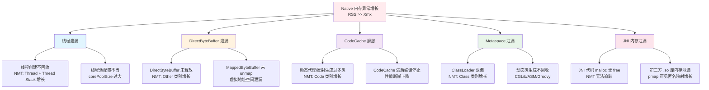
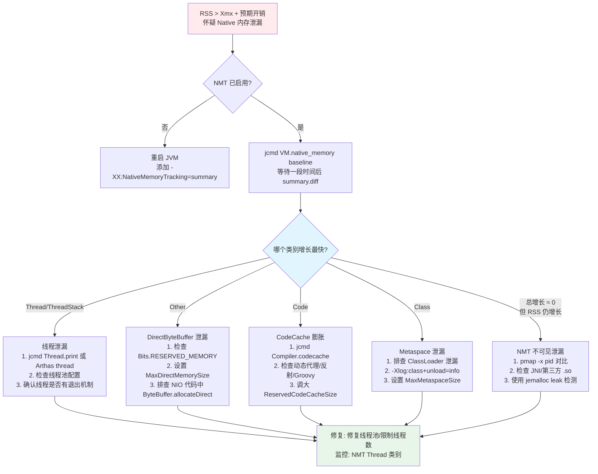

# Native 内存泄漏实战诊断案例

> 基于 OpenJDK 11 源码 + NMT + pmap
> 标准环境：-Xms8g -Xmx8g -XX:+UseG1GC, G1 Region = 4MB
> 源码路径：src/hotspot/share/
> 定位：从 RSS 持续增长现象到源码级根因的完整诊断闭环

---

## 第 0 部分：核心原理 ⭐

### 0.1 本质是什么？

本文深入分析 **Native 内存泄漏实战诊断案例**：从源码角度理解其设计原理、实现机制和关键细节。

### 0.2 为什么需要？

理解 JVM 内部实现是排查复杂问题、进行性能优化的基础。表面的 API 文档无法解释 JVM 的实际行为，只有深入源码才能建立精确的心智模型。

### 0.3 怎么解决？

结合源码阅读、数据结构分析和 GDB 运行时验证，从多个角度建立对该机制的完整理解。

### 0.4 为什么这样设计？

每个设计决策都有其权衡：性能 vs 正确性、简单性 vs 灵活性、内存占用 vs 查找速度。理解这些权衡是理解 JVM 设计的关键。

---


## 0. 核心原理

### 0.1 本质是什么？

Native 内存泄漏的本质是 **Java 堆以外的进程地址空间持续增长且不释放**。JVM 进程的 RSS（Resident Set Size）远大于 `-Xmx` 设定值，但 Java 堆使用率正常——内存泄漏在堆外。

### 0.2 为什么需要源码级理解？

因为 Java 堆外内存的分配分散在 HotSpot 的多个子系统中，每种分配路径不同、监控手段不同：
- 线程栈通过 `pthread_create` 分配，NMT 记录为 `mtThreadStack`（`thread.cpp:420-421`）
- DirectByteBuffer 通过 `Unsafe.allocateMemory` → `os::malloc(sz, mtOther)`（`unsafe.cpp:374`）
- CodeCache 通过 `CodeHeap::allocate` 从预留虚拟内存中分配（`codeCache.cpp:483`）
- Metaspace 通过 `Metaspace::allocate` 从 VirtualSpaceList 中分配

没有 NMT（Native Memory Tracking），这些分配是"黑箱"。NMT 在 `os::malloc` 和 `os::reserve_memory` 等关键路径上插入追踪钩子，将所有分配按 21 种 MEMFLAGS 类型分类统计。

### 0.3 怎么解决？

**核心诊断链**：`top` / `ps` 发现 RSS 异常 → `jcmd VM.native_memory summary` 定位哪个类别在增长 → `jcmd VM.native_memory summary.diff` 对比基线差异 → `pmap -x` 交叉验证匿名映射 → 源码级确认分配路径 → 修复或调参。

---

## 1. Native 内存泄漏根因分类



**根因与诊断工具的映射**：

| 根因类型 | NMT 类别 | 首选工具 | 源码入口 |
|----------|----------|----------|----------|
| 线程泄漏 | Thread + Thread Stack | `jcmd VM.native_memory` | `os_linux.cpp:935` `os::create_thread` |
| DirectByteBuffer | Other | `jcmd VM.native_memory` + `-XX:MaxDirectMemorySize` | `unsafe.cpp:370` `Unsafe_AllocateMemory0` |
| CodeCache 膨胀 | Code | `jcmd Compiler.codecache` | `codeCache.cpp:483` `CodeCache::allocate` |
| Metaspace 泄漏 | Class | `jcmd VM.metaspace` | `metaspace.cpp` |
| JNI 内存泄漏 | NMT 不可见 | `pmap -x` + `jemalloc`/`tcmalloc` | 第三方代码 |

---

## 2. NMT 架构——JVM 的内存追踪基础设施

### 2.1 解决什么问题？

JVM 进程的内存分配分散在数十个子系统中（GC、编译器、类加载、线程、NIO 等），操作系统只能看到总的 RSS，无法区分"哪个子系统用了多少内存"。NMT 通过在所有关键分配路径上插入追踪钩子，实现了 **21 种内存类型的分类统计**。

### 2.2 NMT 追踪级别

```c
// nmtCommon.hpp:35-41
enum NMT_TrackingLevel {
  NMT_unknown = 0xFF,
  NMT_off     = 0x00,   // 不追踪（默认）
  NMT_minimal = 0x01,   // 已关闭（shutdown 后的状态）
  NMT_summary = 0x02,   // 只统计总量（5-10% 性能开销）
  NMT_detail  = 0x03    // 记录每个分配的调用栈（额外开销）
};
```

**启用方式**：`-XX:NativeMemoryTracking=summary` 或 `detail`（`globals.hpp:671-672`）

> **关键**：NMT 只能在 JVM 启动时通过命令行参数启用，不能运行时动态开启。生产环境建议默认开启 `summary` 级别。

### 2.3 MEMFLAGS——21 种内存类型

```c
// allocation.hpp:115-142
enum MemoryType {
  mtJavaHeap,       // Java 堆
  mtClass,          // 类元数据（Metaspace）
  mtThread,         // 线程对象本身
  mtThreadStack,    // 线程栈
  mtCode,           // JIT 编译代码（CodeCache）
  mtGC,             // GC 数据结构（RSet、BitMap 等）
  mtCompiler,       // 编译器临时数据
  mtInternal,       // JVM 内部使用
  mtOther,          // 非 JVM 使用（DirectByteBuffer 归此类）
  mtSymbol,         // Symbol 表
  mtNMT,            // NMT 自身开销
  mtClassShared,    // CDS 共享类数据
  mtChunk,          // Arena Chunk
  mtTest,           // 测试用
  mtTracing,        // JFR 追踪
  mtLogging,        // 日志
  mtArguments,      // 参数处理
  mtModule,         // 模块系统
  mtSynchronizer,   // 同步原语
  mtSafepoint,      // Safepoint 支持
  mtNone,           // 未定义
  mt_number_of_types // 类型总数
};
```

### 2.4 MemTracker——NMT 中枢

```c
// memTracker.hpp:115
class MemTracker : AllStatic {
  // 所有方法都是 static，全局唯一
  
  // malloc 追踪入口（os::malloc 调用）
  static inline void* record_malloc(void* mem_base, size_t size, MEMFLAGS flag,
    const NativeCallStack& stack, NMT_TrackingLevel level) {
    if (level != NMT_off) {
      return MallocTracker::record_malloc(mem_base, size, flag, stack, level);
    }
    return mem_base;    // memTracker.hpp:157-163
  }
  
  // free 追踪入口（os::free 调用）
  static inline void* record_free(void* memblock, NMT_TrackingLevel level) {
    // ...              // memTracker.hpp:182-193
  }
  
  // 虚拟内存追踪入口
  static inline void record_virtual_memory_reserve(address addr, size_t size,
    const NativeCallStack& stack, MEMFLAGS flag = mtNone) {
    // ...
  }
};
```

### 2.5 os::malloc NMT 钩子——每次 malloc 的追踪路径

这是理解 NMT 追踪原理的核心。每次 `os::malloc` 调用都会：

```c
// os.cpp:693-749 —— os::malloc 完整流程
void* os::malloc(size_t size, MEMFLAGS memflags, const NativeCallStack& stack) {
  // 1. size=0 时改为 1，避免返回 NULL 被误判为 OOM
  if (size == 0) {
    size = 1;                            // os.cpp:702-706
  }

  // 2. 计算 NMT 头部大小
  NMT_TrackingLevel level = MemTracker::tracking_level();
  size_t nmt_header_size = MemTracker::malloc_header_size(level);
                                         // os.cpp:709-710

  // 3. 实际分配 = 用户请求 + NMT 头部
  const size_t alloc_size = size + nmt_header_size;
                                         // os.cpp:718

  // 4. 调用 glibc malloc
  u_char* ptr;
  ptr = (u_char*)::malloc(alloc_size);   // os.cpp:732

  // 5. 通过 MemTracker 记录此次分配
  return MemTracker::record_malloc((address)ptr, size, memflags, stack, level);
                                         // os.cpp:749
}
```

### 2.6 MallocHeader——16 字节追踪头

每个 `os::malloc` 分配的内存块前面都会被 NMT 加上一个 `MallocHeader`：

```c
// mallocTracker.hpp:246-302
class MallocHeader {
  // 64-bit 平台布局：
  size_t _size       : 64;    // 用户请求的大小
  size_t _flags      : 8;     // MEMFLAGS 类型（mtThread/mtCode/mtOther 等）
  size_t _pos_idx    : 16;    // detail 模式：桶内位置索引
  size_t _bucket_idx : 40;    // detail 模式：MallocSiteTable 桶索引
  // sizeof(MallocHeader) == 16 bytes (2 machine words on 64-bit)
};
```

**内存布局**：

```
┌──────────────────┬───────────────────────┐
│  MallocHeader    │   用户数据             │
│  (16 bytes)      │   (size bytes)        │
├──────────────────┼───────────────────────┤
│ _size(8B)        │                       │
│ _flags(1B)       │   返回给调用者的指针   │
│ _pos_idx(2B)     │   指向这里 ──────────→ │
│ _bucket_idx(5B)  │                       │
└──────────────────┴───────────────────────┘
      ↑ ::malloc 返回的指针
```

### 2.7 MallocTracker::record_malloc——构建追踪记录

```c
// mallocTracker.cpp:120-148
void* MallocTracker::record_malloc(void* malloc_base, size_t size, MEMFLAGS flags,
  const NativeCallStack& stack, NMT_TrackingLevel level) {
  assert(level != NMT_off, "precondition");
  
  if (malloc_base == NULL) {
    return NULL;                         // mallocTracker.cpp:126-128
  }

  // placement new 在 malloc_base 处构造 MallocHeader
  MallocHeader* header = ::new (malloc_base)MallocHeader(size, flags, stack, level);
                                         // mallocTracker.cpp:132
  
  // 用户数据起始 = malloc_base + sizeof(MallocHeader)
  void* memblock = (void*)((char*)malloc_base + sizeof(MallocHeader));
                                         // mallocTracker.cpp:133
  return memblock;
}
```

`MallocHeader` 构造函数内部会调用 `MallocMemorySummary::record_malloc(size, flags)` 更新全局统计：

```c
// mallocTracker.hpp:264-287 —— MallocHeader 构造函数
MallocHeader(size_t size, MEMFLAGS flags, const NativeCallStack& stack, NMT_TrackingLevel level) {
  if (level == NMT_minimal) {
    return;                              // mallocTracker.hpp:268-270
  }
  _flags = flags;
  set_size(size);
  if (level == NMT_detail) {
    // 记录分配调用栈到 MallocSiteTable
    record_malloc_site(stack, size, &bucket_idx, &pos_idx, flags);
                                         // mallocTracker.hpp:274-283
  }
  // 更新全局统计计数器
  MallocMemorySummary::record_malloc(size, flags);
  MallocMemorySummary::record_new_malloc_header(sizeof(MallocHeader));
                                         // mallocTracker.hpp:285-286
}
```

### 2.8 os::free NMT 钩子——释放时回读头部

```c
// os.cpp:809-829
void os::free(void *memblock) {
  // 通过 MemTracker::record_free 读取 MallocHeader，更新统计
  void* membase = MemTracker::record_free(memblock, MemTracker::tracking_level());
                                         // os.cpp:817 (ASSERT) / 826 (非ASSERT)
  // 释放完整内存块（包含 MallocHeader）
  ::free(membase);                       // os.cpp:824 / 827
}
```

`record_free` 内部调用 `MallocHeader::release()`，从全局统计中减去对应的 size 和 flags 计数。

### 2.9 虚拟内存追踪——reserve/commit/release

除了 malloc 之外，JVM 还通过 `mmap` 管理大块虚拟内存（堆、CodeCache、Metaspace）：

```c
// os.cpp:1772-1788 —— os::reserve_memory
char* os::reserve_memory(size_t bytes, char* addr, size_t alignment_hint, int file_desc) {
  char* result = pd_reserve_memory(bytes, addr, alignment_hint);
  if (result != NULL) {
    MemTracker::record_virtual_memory_reserve((address)result, bytes, CALLER_PC);
  }                                      // os.cpp:1785-1787
  return result;
}

// os.cpp:1827-1832 —— os::commit_memory
bool os::commit_memory(char* addr, size_t bytes, bool executable) {
  bool res = pd_commit_memory(addr, bytes, executable);
  if (res) {
    MemTracker::record_virtual_memory_commit((address)addr, bytes, CALLER_PC);
  }                                      // os.cpp:1829-1831
  return res;
}

// os.cpp:1873-1885 —— os::release_memory
bool os::release_memory(char* addr, size_t bytes) {
  if (MemTracker::tracking_level() > NMT_minimal) {
    Tracker tkr(Tracker::release);
    bool res = pd_release_memory(addr, bytes);
    if (res) { tkr.record((address)addr, bytes); }
  }                                      // os.cpp:1875-1880
}
```

`VirtualMemoryTracker` 类（`virtualMemoryTracker.hpp:391-418`）维护一个 `SortedLinkedList<ReservedMemoryRegion>`，记录所有 reserved 区域及其 committed 子区域。

---

## 3. 场景一：线程泄漏——Thread + Thread Stack 持续增长

### 3.1 问题现象

```bash
# RSS 持续增长，但 Java 堆使用正常
$ top -p <pid>
  PID  VIRT   RES   SHR  %MEM
  1234 25.6g 15.2g  12m  47.5    # RSS = 15.2G，但 -Xmx 只有 8G

# NMT 显示 Thread 类别异常
$ jcmd <pid> VM.native_memory summary
  Thread (reserved=5242880KB, committed=5242880KB)
         (thread #5120)            # <-- 5120 个线程！
         (stack: reserved=5242880KB, committed=5242880KB)
```

### 3.2 源码级根因

**线程创建路径**：`Thread.start()` → `os::create_thread`（`os_linux.cpp:935`）→ `pthread_create`（`os_linux.cpp:999`）

每个线程的栈空间在创建时分配：

```c
// os_linux.cpp:935-999
bool os::create_thread(Thread *thread, ThreadType thr_type, size_t req_stack_size) {
  // 1. 创建 OSThread 对象
  OSThread *osthread = new OSThread(NULL, NULL);
                                         // os_linux.cpp:941
  
  // 2. 计算栈大小（默认 ThreadStackSize=1024KB，即 1MB）
  size_t stack_size = os::Posix::get_initial_stack_size(thr_type, req_stack_size);
  size_t guard_size = os::Linux::default_guard_size(thr_type);
  stack_size += guard_size;              // os_linux.cpp:964-974
  
  // 3. 设置栈大小并创建线程
  pthread_attr_setstacksize(&attr, stack_size);
                                         // os_linux.cpp:978
  int ret = pthread_create(&tid, &attr, 
    (void *(*)(void *)) thread_native_entry, thread);
                                         // os_linux.cpp:999
}
```

**线程栈的 NMT 注册**——每个线程启动时自动向 NMT 报告：

```c
// thread.cpp:420-422
void Thread::register_thread_stack_with_NMT() {
  MemTracker::record_thread_stack(stack_end(), stack_size());
}
```

这个函数在 `Thread::call_run()` 中被调用（`thread.cpp:430`），即线程实际开始执行时立即注册。

**线程栈的 NMT 释放**——线程析构时取消注册：

```c
// thread.cpp:466-485
Thread::~Thread() {
  // ...
  #if INCLUDE_NMT
  if (_stack_base != NULL) {
    MemTracker::release_thread_stack(stack_end(), stack_size());
                                         // thread.cpp:480
  }
  #endif
  // ...
}
```

**泄漏根因**：如果应用不断创建新线程但不回收（典型如 `new Thread().start()` 无限循环，或 `Executors.newCachedThreadPool()` 无任务超时控制），线程对象和栈空间都不会释放。

### 3.3 诊断方法

```bash
# 1. 确认线程数
$ jcmd <pid> VM.native_memory summary | grep Thread
  Thread (reserved=5242880KB, committed=5242880KB)
         (thread #5120)

# 2. NMT 基线对比，观察增长
$ jcmd <pid> VM.native_memory baseline
Baseline succeeded
# 等待一段时间后
$ jcmd <pid> VM.native_memory summary.diff
  Thread (reserved=+102400KB, committed=+102400KB)
         (thread +100)         # <-- 100 个新线程出现

# 3. Arthas 确认线程创建来源
$ thread --all | wc -l         # 统计总线程数
$ thread --state RUNNABLE      # 查看活跃线程
```

### 3.4 关键 JVM 参数

| 参数 | 默认值 | 行号 | 作用 |
|------|--------|------|------|
| `ThreadStackSize` | 1024 (KB) | `globals.hpp:1904` | 线程栈大小 |
| `VMThreadStackSize` | 平台相关 | `globals.hpp:1908` | VM 内部线程栈大小 |

---

## 4. 场景二：DirectByteBuffer 泄漏——Other 类别持续增长

### 4.1 问题现象

```bash
$ jcmd <pid> VM.native_memory summary
  ...
  Other (reserved=2097152KB, committed=2097152KB)
                                # <-- 2GB 的 "Other" 内存
```

NMT 报告中 **"Other"** 类别异常增长，这通常指向 `Unsafe.allocateMemory`，即 DirectByteBuffer 的底层分配。

### 4.2 源码级根因

**DirectByteBuffer 分配路径**：`ByteBuffer.allocateDirect()` → `Unsafe.allocateMemory()` → `Unsafe_AllocateMemory0`

```c
// unsafe.cpp:370-377
UNSAFE_ENTRY(jlong, Unsafe_AllocateMemory0(JNIEnv *env, jobject unsafe, jlong size)) {
  size_t sz = (size_t)size;
  sz = align_up(sz, HeapWordSize);       // 对齐到 HeapWord (8 bytes)
  void* x = os::malloc(sz, mtOther);     // 关键：类型为 mtOther
                                         // unsafe.cpp:374
  return addr_to_java(x);
} UNSAFE_END
```

**释放路径**：`Unsafe.freeMemory()` → `Unsafe_FreeMemory0`

```c
// unsafe.cpp:389-393
UNSAFE_ENTRY(void, Unsafe_FreeMemory0(JNIEnv *env, jobject unsafe, jlong addr)) {
  void* p = addr_from_java(addr);
  os::free(p);                           // unsafe.cpp:392
} UNSAFE_END
```

**泄漏根因**：DirectByteBuffer 的 native 内存由 `Cleaner`（一种 PhantomReference）在 GC 回收 Java 对象时触发释放。如果 DirectByteBuffer 的 Java 包装对象被长期引用（如放入 static 集合），GC 无法回收，native 内存就永远不释放。

另一个常见原因是 `MaxDirectMemorySize` 设置过大（`globals.hpp:2399`），默认为 0 表示由 `-Xmx` 决定。当大量 DirectByteBuffer 分配且 GC 不频繁时，native 内存会快速积累。

### 4.3 诊断方法

```bash
# 1. NMT 确认 Other 增长
$ jcmd <pid> VM.native_memory summary.diff | grep Other
  Other (reserved=+524288KB, committed=+524288KB)

# 2. 通过反射获取 DirectByteBuffer 统计
# Java 代码或 Arthas ognl 表达式：
$ ognl '@java.nio.Bits@RESERVED_MEMORY'

# 3. 查看 -XX:MaxDirectMemorySize 设置
$ jcmd <pid> VM.flags | grep MaxDirectMemorySize
```

### 4.4 关键 JVM 参数

| 参数 | 默认值 | 行号 | 作用 |
|------|--------|------|------|
| `MaxDirectMemorySize` | 0（= Xmx） | `globals.hpp:2399` | 最大直接内存限制 |

---

## 5. 场景三：CodeCache 膨胀——Code 类别增长 / 编译停止

### 5.1 问题现象

```bash
# NMT 显示 Code 类别接近上限
$ jcmd <pid> VM.native_memory summary | grep Code
  Code (reserved=262144KB, committed=245760KB)    # 接近 256MB

# 或者 GC 日志出现 CodeCache full 警告
CodeCache is full. Compiler has been disabled.
```

### 5.2 源码级根因

**CodeCache 分配路径**：JIT 编译 → `CodeCache::allocate`

```c
// codeCache.cpp:483-536
CodeBlob* CodeCache::allocate(int size, int code_blob_type, int orig_code_blob_type) {
  NMethodSweeper::notify(code_blob_type);
                                         // codeCache.cpp:485 唤醒 Sweeper
  
  while (true) {
    cb = (CodeBlob*)heap->allocate(size);
    if (cb != NULL) break;               // codeCache.cpp:498-499
    
    // 扩展失败
    if (!heap->expand_by(CodeCacheExpansionSize)) {
                                         // codeCache.cpp:500
      if (SegmentedCodeCache) {
        // 尝试从其他类型的 CodeHeap 借空间
        // NonNMethod → MethodNonProfiled → MethodProfiled
                                         // codeCache.cpp:506-532
      }
      // 最终失败：触发 handle_full_code_cache
      CompileBroker::handle_full_code_cache(orig_code_blob_type);
      return NULL;                       // codeCache.cpp:535-536
    }
  }
}
```

**CodeCache 初始化**（`codeCache.cpp:1081-1110`）：

```c
void CodeCache::initialize() {
  if (SegmentedCodeCache) {
    initialize_heaps();                  // codeCache.cpp:1102 分三段
  } else {
    ReservedCodeSpace rs = reserve_heap_memory(ReservedCodeCacheSize);
    add_heap(rs, "CodeCache", CodeBlobType::All);
                                         // codeCache.cpp:1108-1109 单段
  }
}
```

**泄漏根因**：
- 动态代理（`Proxy.newProxyInstance`）、反射（`Method.invoke` 超过阈值生成 accessor）、Groovy/Scala 闭包会不断生成新类和 nmethod
- 老的 nmethod 不被回收（因为还在调用栈上或 OSR 编译未释放）
- `ReservedCodeCacheSize` 默认 240MB（`globals.hpp:1946`），对大型应用可能不够

### 5.3 诊断方法

```bash
# 1. NMT 查看 Code 类别
$ jcmd <pid> VM.native_memory summary | grep -A2 Code

# 2. 查看 CodeCache 使用率
$ jcmd <pid> Compiler.codecache

# 3. 统一日志查看编译活动
# -Xlog:codecache=debug
# 输出示例：
# [codecache] CodeCache: size=245760Kb used=240000Kb max_used=240100Kb free=5760Kb
```

### 5.4 关键 JVM 参数

| 参数 | 默认值 | 行号 | 作用 |
|------|--------|------|------|
| `ReservedCodeCacheSize` | 240MB | `globals.hpp:1946` | CodeCache 总大小上限 |
| `SegmentedCodeCache` | false | `globals.hpp:1943` | 是否启用分段 CodeCache |

---

## 6. NMT 诊断命令详解——jcmd VM.native_memory

### 6.1 NMTDCmd 实现

所有 `jcmd <pid> VM.native_memory` 命令的实现在 `NMTDCmd::execute`（`nmtDCmd.cpp:76`）。

**核心流程**：

```c
// nmtDCmd.cpp:76-149
void NMTDCmd::execute(DCmdSource source, TRAPS) {
  // 1. 检查 NMT 是否启用
  if (MemTracker::tracking_level() == NMT_off) {
    output()->print_cr("Native memory tracking is not enabled");
    return;                              // nmtDCmd.cpp:79-81
  }
  
  // 2. 序列化 NMT 查询（互斥锁保护）
  MutexLocker locker(MemTracker::query_lock());
                                         // nmtDCmd.cpp:117
  
  // 3. 根据子命令分发
  if (_summary.value()) {
    report(true, scale_unit);            // nmtDCmd.cpp:119-120 输出摘要
  } else if (_baseline.value()) {
    // 保存当前状态为基线
    MemBaseline& baseline = MemTracker::get_baseline();
    baseline.baseline(MemTracker::tracking_level() != NMT_detail);
                                         // nmtDCmd.cpp:127-128
  } else if (_summary_diff.value()) {
    // 与基线对比
    MemBaseline& baseline = MemTracker::get_baseline();
    if (baseline.baseline_type() >= MemBaseline::Summary_baselined) {
      report_diff(true, scale_unit);     // nmtDCmd.cpp:133-136
    }
  }
}
```

### 6.2 完整诊断流程

```bash
# Step 1: 启用 NMT（JVM 启动参数）
-XX:NativeMemoryTracking=summary

# Step 2: 获取当前内存快照
$ jcmd <pid> VM.native_memory summary
# 输出示例：
Native Memory Tracking:

Total: reserved=10485760KB, committed=9437184KB

-                 Java Heap (reserved=8388608KB, committed=8388608KB)
                            (mmap: reserved=8388608KB, committed=8388608KB)

-                     Class (reserved=1056768KB, committed=4736KB)
                            (classes #1234)
                            (malloc=128KB #2048)
                            (mmap: reserved=1056640KB, committed=4608KB)

-                    Thread (reserved=102400KB, committed=102400KB)
                            (thread #100)
                            (stack: reserved=102400KB, committed=102400KB)

-                      Code (reserved=245760KB, committed=12288KB)
                            (malloc=2048KB #8192)
                            (mmap: reserved=243712KB, committed=10240KB)

-                        GC (reserved=524288KB, committed=524288KB)
                            (malloc=32KB #512)
                            (mmap: reserved=524256KB, committed=524256KB)

-                  Internal (reserved=4096KB, committed=4096KB)
                            (malloc=4096KB #1024)

-                     Other (reserved=65536KB, committed=65536KB)
                            (malloc=65536KB #128)

-                    Symbol (reserved=8192KB, committed=8192KB)
                            (malloc=5120KB #50000)
                            (arena=3072KB #1)

# Step 3: 设置基线
$ jcmd <pid> VM.native_memory baseline
Baseline succeeded

# Step 4: 等待一段时间后对比
$ jcmd <pid> VM.native_memory summary.diff
# 输出示例（增量用 +/- 标注）：
Total: reserved=10747904KB +262144KB, committed=9699328KB +262144KB

-                    Thread (reserved=204800KB +102400KB, committed=204800KB +102400KB)
                            (thread #200 +100)
                            (stack: reserved=204800KB +102400KB, committed=204800KB +102400KB)

-                     Other (reserved=131072KB +65536KB, committed=131072KB +65536KB)
                            (malloc=131072KB +65536KB #256 +128)
```

> **JVM 参数**：`-XX:+PrintNMTStatistics`（`globals.hpp:674`）可以在 JVM 退出时自动打印 NMT 统计。

---

## 7. pmap + NMT 交叉分析——定位 NMT 看不到的泄漏

### 7.1 为什么需要 pmap？

NMT 只能追踪通过 `os::malloc` 和 `os::reserve_memory` 的分配。以下场景 NMT **无法追踪**：
- JNI 代码中直接调用 `malloc` / `mmap`
- 第三方 native 库（如 OpenSSL、zlib、数据库驱动的 .so）的内部分配
- `glibc` 的内存碎片（`malloc` 的 arena/bin 未归还 OS）

这些情况需要使用操作系统级工具 `pmap`。

### 7.2 交叉分析方法

```bash
# 1. 获取 NMT 总 committed
$ jcmd <pid> VM.native_memory summary | head -3
Total: reserved=10485760KB, committed=9437184KB
# NMT 认为 JVM committed = 9.0GB

# 2. 获取 OS 实际 RSS
$ ps -p <pid> -o rss=
10485760        # OS 看到 RSS = 10.0GB

# 3. 计算差值
# Delta = RSS - NMT committed = 10.0 - 9.0 = 1.0GB
# 这 1GB 就是 NMT 看不到的分配（JNI/第三方库/glibc碎片）

# 4. 用 pmap 定位异常匿名映射
$ pmap -x <pid> | sort -k2 -rn | head -20
# 找到不属于 JVM 已知区域的大块匿名映射

# 5. 对比 NMT detail 中的虚拟内存映射
$ jcmd <pid> VM.native_memory detail | grep -A1 "Virtual memory map"
```

### 7.3 Arena/Chunk 内存模型——NMT 的盲区

JVM 内部大量使用 `Arena` 作为快速内存分配器（`arena.hpp:92-239`）。Arena 基于 `Chunk` 链表实现 bump-pointer 分配：

```c
// arena.hpp:45-83
class Chunk: CHeapObj<mtChunk> {
  Chunk*       _next;     // 链表下一个
  const size_t _len;      // 本 Chunk 大小
  
  enum {
    tiny_size  =  256  - slack,    // 首块（tiny）
    init_size  =  1*K  - slack,    // 首块（normal）
    medium_size= 10*K  - slack,    // 中等块
    size       = 32*K  - slack,    // 默认后续块大小
  };                               // arena.hpp:55-69
};

// arena.hpp:92-239
class Arena : public CHeapObj<mtNone> {
  Chunk *_first;           // 第一个 Chunk
  Chunk *_chunk;           // 当前 Chunk
  char *_hwm, *_max;       // 当前 Chunk 的高水位和上限
  
  // 快速分配：指针碰撞
  void* Amalloc(size_t x) {
    x = ARENA_ALIGN(x);
    if (_hwm + x > _max) {
      return grow(x);      // 需要新 Chunk
    } else {
      char *old = _hwm;
      _hwm += x;
      return old;           // arena.hpp:145-159 快速路径
    }
  }
};
```

**NMT 限制**：NMT 只能在 Chunk 级别追踪分配（`Chunk` 继承 `CHeapObj<mtChunk>`，通过 `os::malloc` 分配），但 Arena 内部的子分配对 NMT 不可见。因此 NMT 报告中的 "Chunk" 类别（`mtChunk`）是 Arena 消耗的总量，但无法细分到具体用途。

---

## 8. 完整诊断决策树



---

## 9. GDB 验证方案

### 9.1 断点设计

| # | 断点函数 | 文件:行号 | 验证目的 |
|---|---------|-----------|---------|
| 1 | `os::malloc` | `os.cpp:693` | 观察每次 malloc 的 size 和 MEMFLAGS |
| 2 | `MallocTracker::record_malloc` | `mallocTracker.cpp:120` | 验证 MallocHeader 构造过程 |
| 3 | `Thread::register_thread_stack_with_NMT` | `thread.cpp:420` | 验证线程栈注册 |
| 4 | `Unsafe_AllocateMemory0` | `unsafe.cpp:370` | 捕获 DirectByteBuffer 分配 |
| 5 | `CodeCache::allocate` | `codeCache.cpp:483` | 观察 CodeCache 分配请求 |
| 6 | `NMTDCmd::execute` | `nmtDCmd.cpp:76` | 验证 jcmd 命令处理流程 |

### 9.2 GDB 脚本

```gdb
# 断点 1：os::malloc — 过滤大分配 (>1MB)
break os.cpp:693
commands
  silent
  if size > 1048576
    printf "os::malloc: size=%zu, flags=%d\n", size, memflags
    bt 5
  end
  continue
end

# 断点 2：MallocTracker::record_malloc
break mallocTracker.cpp:120
commands
  silent
  printf "MallocTracker::record_malloc: base=%p, size=%zu, flags=%d\n", malloc_base, size, flags
  continue
end

# 断点 3：线程栈注册
break thread.cpp:420
commands
  silent
  printf "Thread::register_thread_stack_with_NMT: stack_end=%p, stack_size=%zu\n", this->stack_end(), this->stack_size()
  continue
end

# 断点 4：DirectByteBuffer 分配
break unsafe.cpp:370
commands
  silent
  printf "Unsafe_AllocateMemory0: size=%lld\n", size
  bt 8
  continue
end

# 断点 5：CodeCache 分配
break codeCache.cpp:483
commands
  silent
  printf "CodeCache::allocate: size=%d, type=%d\n", size, code_blob_type
  continue
end

# 断点 6：NMT 诊断命令
break nmtDCmd.cpp:76
commands
  printf "NMTDCmd::execute invoked\n"
  continue
end
```

---

## 10. 总结

### 10.1 核心知识点

| 知识点 | 源码位置 | 关键洞察 |
|--------|----------|----------|
| NMT 追踪机制 | `os.cpp:693-749` | 每个 `os::malloc` 前置 16 字节 MallocHeader |
| MEMFLAGS 21 类型 | `allocation.hpp:115-142` | 所有内存分配必须声明用途 |
| 线程栈 NMT 注册 | `thread.cpp:420-422` | `call_run()` 时注册，`~Thread()` 时释放 |
| DirectByteBuffer | `unsafe.cpp:370-377` | 归类为 `mtOther`，Cleaner 释放 |
| CodeCache 分配 | `codeCache.cpp:483-536` | 满后尝试跨 Heap 借空间，失败则停止编译 |
| NMT 诊断命令 | `nmtDCmd.cpp:76-149` | baseline → summary.diff 是核心诊断手段 |
| 虚拟内存追踪 | `os.cpp:1772-1885` | reserve/commit/release 三个钩子 |

### 10.2 面试模板

**Q：生产环境发现 JVM 进程 RSS 持续增长，但 Java 堆使用率正常，怎么排查？**

**A**（分层递进）：

> **第一层**：确认堆外问题。`top` / `ps` 看 RSS 远超 `-Xmx` 设定。`jstat -gc` 确认 Java 堆使用正常，问题在堆外。
>
> **第二层**：NMT 定位类别。`jcmd VM.native_memory summary` 查看各类别内存。先 `baseline`，等一段时间后 `summary.diff`，找到持续增长的类别。
>
> **第三层**：按类别深入。
> - Thread/ThreadStack 增长 → 线程泄漏，检查线程池配置
> - Other 增长 → DirectByteBuffer 泄漏，检查 NIO 代码
> - Code 增长 → CodeCache 膨胀，检查动态代理/反射
> - Class 增长 → Metaspace 泄漏，检查 ClassLoader 生命周期
>
> **第四层**：如果 NMT 总量不增长但 RSS 增长，说明是 NMT 不可见的分配（JNI/第三方库），用 `pmap -x` 交叉对比。
>
> **源码层面**：NMT 的实现是在 `os::malloc`（`os.cpp:693`）每次分配时前置 16 字节 `MallocHeader`（`mallocTracker.hpp:246`），记录 size 和 MEMFLAGS 类型。DirectByteBuffer 通过 `Unsafe_AllocateMemory0`（`unsafe.cpp:370`）分配，类型为 `mtOther`。线程栈在 `Thread::call_run()` 时注册到 NMT（`thread.cpp:420`），`~Thread()` 析构时释放（`thread.cpp:480`）。

### 10.3 交叉引用

| 相关主题 | 文档 |
|----------|------|
| 线程创建完整路径 | [Integration/4-Thread-Creation-JVM-OS-View.md](../Integration/4-Thread-Creation-JVM-OS-View.md) |
| 内存泄漏（Java 堆） | [RealWorld-Cases/02-Memory-Leak-Case-Study.md](02-Memory-Leak-Case-Study.md) |
| GC 问题排查 | [RealWorld-Cases/04-GC-Troubleshooting-Case-Study.md](04-GC-Troubleshooting-Case-Study.md) |
| Metaspace 架构 | [Metaspace/1-Metaspace-Architecture.md](../Metaspace/1-Metaspace-Architecture.md) |
| 类加载问题 | [RealWorld-Cases/05-ClassLoading-Issue-Case-Study.md](05-ClassLoading-Issue-Case-Study.md) |
| Synchronization 深入 | [Synchronization/3-ObjectMonitor-Enter-Exit-Deep-Dive.md](../Synchronization/3-ObjectMonitor-Enter-Exit-Deep-Dive.md) |
| CPU 100% 排查 | [RealWorld-Cases/01-CPU-High-Case-Study.md](01-CPU-High-Case-Study.md) |
| 锁竞争排查 | [RealWorld-Cases/03-Lock-Contention-Case-Study.md](03-Lock-Contention-Case-Study.md) |
| 性能排查面试指南 | [Interview/7-Performance-Troubleshooting-Interview-Guide.md](../Interview/7-Performance-Troubleshooting-Interview-Guide.md) |
| ClassLoading 完整流程 | [ClassLoading/classloading_complete_flow.md](../ClassLoading/classloading_complete_flow.md) |
