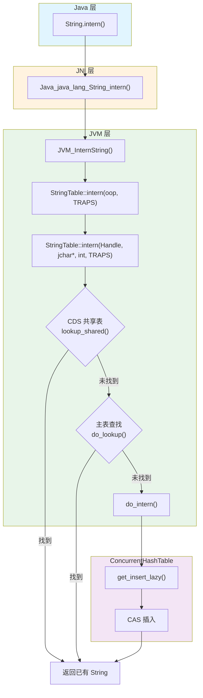
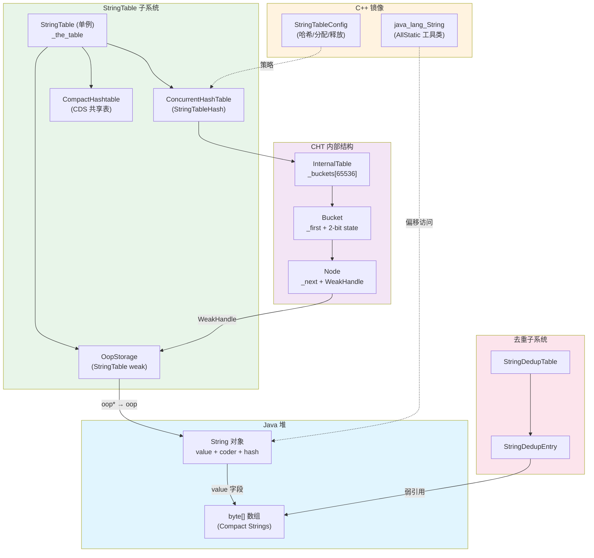

# String 与 StringTable 深度解析

> 基于 OpenJDK 11 源码分析
> 标准环境：-Xms8g -Xmx8g -XX:+UseG1GC, G1 Region = 4MB
> 核心源码：`classfile/stringTable.hpp|cpp`、`classfile/javaClasses.hpp|inline.hpp`、`utilities/concurrentHashTable.hpp`
> 已有关联文档：`ConcurrentHashTable/ConcurrentHashTable-Core-Algorithms.md`（CHT 算法细节不重复展开）

---

## 第 0 部分：核心原理

### 0.1 本质是什么？

StringTable 是 JVM 内部的**全局字符串常量池**——一张并发哈希表，保证相同内容的字符串在整个 JVM 生命周期内只存在一个 canonical 实例。

### 0.2 为什么需要？

Java 程序中存在大量重复字符串。一个典型的 Web 应用，类文件中的字符串常量（类名、方法名、字段名、SQL 片段、URL 路径）占据了可观的堆内存。如果每次遇到 `"hello"` 都创建一个新对象，内存浪费严重，而且无法用 `==` 快速比较。

更根本的问题在于：JVM 的类加载器在解析 class 文件时，会遇到大量 `CONSTANT_String` 条目。如果不做去重，同一个字面量 `"java/lang/Object"` 在几千个类中各创建一份 String 对象，O(N) 的内存浪费不可接受。

`String.intern()` 就是解决这个问题的接口：传入任意 String，如果池中已有相同内容的 String 则返回池中那个，否则把当前 String 放入池中。这样就保证了：**内容相同的 interned 字符串，引用也相同（可用 `==` 比较）**。

### 0.3 怎么解决？

核心思路：**用一张全局弱引用哈希表存储所有 interned 字符串**。

关键设计：
1. **ConcurrentHashTable**：wait-free 读、CAS 插入、per-bucket spinlock 删除，满足 `intern()` 的高并发需求
2. **WeakHandle + OopStorage**：表中持有的是弱引用，GC 可以回收不再被强引用的 interned 字符串，避免内存泄漏
3. **三级查找**：CDS 共享表（只读、零成本）→ ConcurrentHashTable 主表 → `do_intern()` 原子插入

### 0.4 为什么这样设计？

**为什么用弱引用而不是强引用？** 如果 StringTable 持有强引用，一旦字符串被 intern 就永远不会被 GC 回收——这在 JDK 6 时代就是著名的 `PermGen OutOfMemoryError` 的元凶之一。JDK 7+ 将 StringTable 移出永久代后改用弱引用，让 GC 能清理不再使用的 interned 字符串。

**为什么用 ConcurrentHashTable 而不是加锁的 Hashtable？** OpenJDK 11 之前（JDK 10）StringTable 确实是一个老式的 `Hashtable`（全局锁）。JDK 11 重写为 `ConcurrentHashTable`，原因是 `intern()` 是热路径——类加载、字节码常量池解析、用户代码都会调用。全局锁在多线程场景下成为严重瓶颈。

**为什么需要 CDS 共享表？** JVM 启动时需要 intern 大量基础字符串（`"java/lang/Object"` 等）。CDS（Class Data Sharing）将这些字符串预先存入归档文件，启动时直接内存映射，跳过哈希表插入，加速启动。

---

## 第 1 部分：数据结构全景

### 1.0 数据结构清单

| # | 结构名 | 角色 | 源码位置 |
|---|--------|------|----------|
| 1 | `java_lang_String` | C++ 侧访问 Java String 对象的静态工具类 | `javaClasses.hpp:93-211` |
| 2 | `StringTable` | 全局字符串常量池管理器（单例） | `stringTable.hpp:47-182` |
| 3 | `ConcurrentHashTable` | 底层并发哈希表（Node/Bucket/InternalTable） | `concurrentHashTable.hpp:36-180` |
| 4 | `WeakHandle<vm_string_table_data>` | 弱引用句柄，包装 OopStorage 中的 oop 指针 | `weakHandle.hpp:44-65` |
| 5 | `StringTableConfig` | CHT 配置类（哈希计算、节点分配/释放） | `stringTable.cpp:79-113` |
| 6 | `StringDedupEntry` / `StringDedupTable` | 字符串去重子系统（与 StringTable 独立） | `stringDedupTable.hpp:39-93` |

---

### 1.1 `java_lang_String` — C++ 访问 Java String 的桥梁

#### 问题推导

**问题**：HotSpot 是 C++ 写的，但 String 是 Java 对象。C++ 代码怎么读取 String 的 `value`、`hash`、`coder` 字段？

**需要什么信息？**
- Java String 对象在堆上是一块连续内存（对象头 + 字段）
- C++ 需要知道每个字段相对于对象起始地址的**偏移量**
- 但偏移量不是编译期常量——它取决于对象头大小（压缩指针开/关不同）

**推导出的结构**：需要一个静态工具类，在 VM 启动时**动态计算**各字段偏移，然后提供 `value(oop)`、`hash(oop)` 等访问器方法。

#### 真实数据结构

```cpp
// classfile/javaClasses.hpp:93-211
class java_lang_String : AllStatic {
 private:
  static int value_offset;   // ★ byte[] value 的偏移
  static int hash_offset;    // ★ int hash 的偏移
  static int coder_offset;   // ★ byte coder 的偏移
  static bool initialized;   // 是否已完成偏移计算

 public:
  enum Coder {
    CODER_LATIN1 = 0,  // ★ 单字节编码（ASCII/Latin1）
    CODER_UTF16  = 1   // ★ 双字节编码
  };

  // 启动时计算偏移量
  static void compute_offsets();

  // 内联访问器（见 javaClasses.inline.hpp）
  static inline typeArrayOop value(oop java_string);
  static inline unsigned int hash(oop java_string);
  static inline bool is_latin1(oop java_string);
  static inline int length(oop java_string);

  // ★ P(31) 哈希算法——必须与 Java 侧 String.hashCode() 一致
  static unsigned int hash_code(const jchar* s, int len) {
    unsigned int h = 0;
    while (len-- > 0) {
      h = 31*h + (unsigned int) *s;  // Kernighan & Ritchie P(31)
      s++;
    }
    return h;
  }
};
```

**推导 vs 实际**：完全吻合。`AllStatic` 表示不能实例化（纯工具类），三个 `static int` 偏移量在 `compute_offsets()` 中通过 `InstanceKlass::find_field()` 动态计算。

#### 内联访问器实现

```cpp
// classfile/javaClasses.inline.hpp:52-87
typeArrayOop java_lang_String::value(oop java_string) {
  return (typeArrayOop) java_string->obj_field(value_offset); // ★ 基地址 + 偏移 → 读取 oop 指针
}

bool java_lang_String::is_latin1(oop java_string) {
  jbyte coder = java_string->byte_field(coder_offset);  // ★ 读取 coder 字段
  return coder == CODER_LATIN1;                          // 0 = Latin1, 1 = UTF16
}

int java_lang_String::length(oop java_string) {
  typeArrayOop value = java_lang_String::value_no_keepalive(java_string);
  if (value == NULL) return 0;
  int arr_length = value->length();      // byte[] 数组长度
  if (!is_latin1(java_string)) {
    arr_length >>= 1;  // ★ UTF16 时，字节数 / 2 = 字符数
  }
  return arr_length;
}
```

#### Compact Strings 机制

**问题**：Java `char` 是 2 字节（UTF-16），但绝大多数字符串只包含 ASCII 字符。能不能省一半内存？

**推导**：如果能检测字符串是否全部 ≤ 0xFF，就用 `byte[]`（1 字节/字符）存储，同时加一个 `coder` 标记编码方式。

**真实实现（JDK 9+）**：

```java
// java/lang/String.java (简化)
public final class String {
    private final byte[] value;  // ★ 不是 char[]！JDK 9+ 改为 byte[]
    private final byte coder;    // ★ 0=LATIN1（1字节/字符）, 1=UTF16（2字节/字符）
    private int hash;            // ★ 缓存的哈希值，0 表示未计算

    static final boolean COMPACT_STRINGS;  // JVM 注入的标志
}
```

**CompactStrings 标志注入流程**：

```
globals.hpp:1414 定义 product_pd(bool, CompactStrings, ...)
  → cpu/x86/globals_x86.hpp:93 默认值 true
  → thread.cpp:3822 VM 启动时调用 java_lang_String::set_compact_strings(CompactStrings)
  → 注入到 Java 侧 String.COMPACT_STRINGS 静态字段
```

当 `COMPACT_STRINGS=true` 且字符串所有字符 ≤ 0xFF 时，String 使用 Latin1 编码：**一个典型的 "hello" 字符串，`value` 数组只有 5 字节，而非 10 字节**。这是 JDK 9 最重要的内存优化之一。

#### Java String 对象的堆内存布局

`java_lang_String` 是 C++ 侧的工具类（AllStatic，无实例），但它访问的目标——Java String 对象——在堆上有确定的内存布局。在标准环境（`UseCompressedOops=true`、`UseCompressedClassPointers=true`）下：

```
Java String 对象布局（标准压缩指针环境）
┌─────────────────────────────────────────┐ 偏移 0
│ markOop（对象头）          (8 bytes)     │  ← 锁状态 + 哈希 + GC 年龄
├─────────────────────────────────────────┤ 偏移 8
│ _klass（压缩类指针）       (4 bytes)     │  ← 指向 java.lang.String 的 InstanceKlass
├─────────────────────────────────────────┤ 偏移 12
│ value（压缩 oop）          (4 bytes)     │  ← ★ 指向 byte[] 数组（Compact Strings）
├─────────────────────────────────────────┤ 偏移 16
│ hash（int）                (4 bytes)     │  ← ★ 缓存的哈希值，0=未计算
├─────────────────────────────────────────┤ 偏移 20
│ coder（byte）              (1 byte)      │  ← ★ 0=LATIN1, 1=UTF16
├─────────────────────────────────────────┤ 偏移 21
│ [padding]                  (3 bytes)     │  ← 对齐到 8 字节边界
└─────────────────────────────────────────┘ 偏移 24 = sizeof = 24 bytes
```

**C++ 侧的偏移量**（在 `compute_offsets()` 中动态计算）：
- `value_offset` = 12（压缩 oop 环境）
- `hash_offset` = 16
- `coder_offset` = 20

**关键字段生命周期**：
| 字段 | 谁设置 | 何时设置 | 谁读取 |
|------|--------|---------|--------|
| `value_offset` | `java_lang_String::compute_offsets()` | VM 启动阶段 `Universe::genesis()` | 所有访问 String 的 C++ 代码 |
| `hash_offset` | 同上 | 同上 | `java_lang_String::hash()` |
| `coder_offset` | 同上 | 同上 | `java_lang_String::is_latin1()` |
| `initialized` | `compute_offsets()` 结尾 | 同上 | 用于 assert 检查 |

#### 设计决策

**为什么用动态偏移而不是硬编码？** 因为对象头大小取决于 `UseCompressedOops`（开启时 Klass 指针 4 字节，关闭时 8 字节）。硬编码偏移会在不同配置下出错。动态计算一劳永逸。

---

### 1.2 `StringTable` — 全局字符串常量池

#### 问题推导

**问题**：所有线程共享同一个字符串池，如何组织这个池？

**需要什么信息？**
- 需要**快速查找**（按内容查找已有字符串）→ 哈希表
- 需要**并发安全**（多线程同时 intern）→ 并发哈希表
- 需要**GC 友好**（不被强引用的 interned 字符串应该被回收）→ 弱引用
- 需要**启动加速**（CDS 预热常用字符串）→ 只读共享表

**推导出的结构**：单例管理器，内部持有一个并发哈希表 + 弱引用存储 + CDS 共享表。

#### 真实数据结构

```cpp
// classfile/stringTable.hpp:47-76
class StringTable : public CHeapObj<mtSymbol> {
 private:
  static StringTable* _the_table;                        // ★ 全局单例

  // CDS 共享表（只读，启动映射）
  static CompactHashtable<oop, char> _shared_table;      // CDS 预热字符串
  static bool _shared_string_mapped;                      // 共享表是否已映射
  static bool _alt_hash;                                  // ★ 是否启用备选哈希

  // 主哈希表
  StringTableHash* _local_table;                          // ★ ConcurrentHashTable 实例
  size_t _current_size;                                   // 当前桶数

  volatile bool _has_work;                                // ServiceThread 工作标志
  volatile bool _needs_rehashing;                         // 需要 rehash 标志

  // 弱引用存储
  OopStorage* _weak_handles;                              // ★ 弱引用管理器

  // 计数器（cache line 隔离避免伪共享）
  volatile size_t _items;                                 // ★ 活跃条目数
  DEFINE_PAD_MINUS_SIZE(1, DEFAULT_CACHE_LINE_SIZE, sizeof(volatile size_t));
  volatile size_t _uncleaned_items;                       // ★ 待清理的死条目数
  DEFINE_PAD_MINUS_SIZE(2, DEFAULT_CACHE_LINE_SIZE, sizeof(volatile size_t));
};
```

**推导 vs 实际**：完全吻合。`_the_table` 单例模式，`_local_table` 是并发哈希表，`_weak_handles` 是弱引用存储。额外发现：`_items` 和 `_uncleaned_items` 之间用 **cache line padding** 隔开，防止两个高频更新的计数器落在同一个 cache line 导致伪共享（False Sharing）。

#### sizeof 与内存布局

`DEFINE_PAD_MINUS_SIZE(id, alignment, size)` 宏（`memory/padded.hpp:86-87`）展开为 `char _pad_buf##id[(alignment) - (size)]`。`DEFAULT_CACHE_LINE_SIZE` = 64（`globalDefinitions.hpp:548`）。

```
StringTable 实例布局（x86-64, sizeof ≈ 160 字节）
┌─────────────────────────────────────────┐ 偏移 0
│ _local_table   (StringTableHash*)  8B   │  ← 指向 ConcurrentHashTable 实例
├─────────────────────────────────────────┤ 偏移 8
│ _current_size  (size_t)            8B   │  ← 当前桶数
├─────────────────────────────────────────┤ 偏移 16
│ _has_work      (volatile bool)     1B   │  ← ServiceThread 工作标志
├─────────────────────────────────────────┤ 偏移 17
│ _needs_rehashing (volatile bool)   1B   │  ← 需要 rehash 标志
├─────────────────────────────────────────┤ 偏移 18
│ [padding]                          6B   │  ← 对齐到 8 字节边界
├─────────────────────────────────────────┤ 偏移 24
│ _weak_handles  (OopStorage*)       8B   │  ← 弱引用管理器
├─────────────────────────────────────────┤ 偏移 32
│ _items         (volatile size_t)   8B   │  ← ★ 活跃条目数
├─────────────────────────────────────────┤ 偏移 40
│ _pad_buf1      (char[56])         56B   │  ← cache line 隔离
├─────────────────────────────────────────┤ 偏移 96
│ _uncleaned_items (volatile size_t) 8B   │  ← ★ 待清理的死条目数
├─────────────────────────────────────────┤ 偏移 104
│ _pad_buf2      (char[56])         56B   │  ← cache line 隔离
└─────────────────────────────────────────┘ 偏移 160 = sizeof
```

**padding 设计解读**：`_items`（偏移 32）+ `_pad_buf1`（56B）= 64B，恰好占满一个 cache line。`_uncleaned_items`（偏移 96）+ `_pad_buf2`（56B）= 同理。两个计数器分别独占 cache line，消除伪共享。

#### 关键状态字段生命周期

| 字段 | 初始值 | 谁设置为 true | 何时 | 谁设置为 false | 何时 | 谁读取 |
|------|--------|-------------|------|---------------|------|--------|
| `_has_work` | `false` | `trigger_concurrent_work()` | `check_concurrent_work()` 发现负载过高时（`stringTable.cpp:229-232`） | `concurrent_work()` 开头（`stringTable.cpp:544`） | ServiceThread 开始执行维护工作时 | `has_work()` 被 ServiceThread 轮询（`stringTable.hpp:113`） |
| `_needs_rehashing` | `false` | `do_lookup()` / `do_intern()` | CHT 的 `get()` / `get_insert_lazy()` 报告 `rehash_warning`（链长 > 100）时（`stringTable.cpp:277,383`） | `try_rehash_table()` 结尾（`stringTable.cpp:592,599,611`） | rehash 完成或决定用扩容替代时 | `needs_rehashing()` 在 safepoint 中被检查（`stringTable.hpp:162-163`） |
| `_alt_hash`（静态） | `false` | `do_rehash()` 成功时（`stringTable.cpp:569`） | rehash 切换到 HalfSipHash 时 | `do_rehash()` 失败回滚（`stringTable.cpp:571`） | 仅在迁移失败时回滚 | `hash_string()`（`stringTable.cpp:96`）和 `lookup/intern` 入口（`stringTable.cpp:249,322`） |

#### 核心常量

```cpp
// stringTable.cpp:57-63
#define PREF_AVG_LIST_LEN   2      // 期望平均链长 → 决定扩容时机
#define END_SIZE           24      // 最大容量 2^24 = 16,777,216 桶
#define REHASH_LEN         100     // 链长 > 100 → 触发 rehash（怀疑哈希攻击）
#define CLEAN_DEAD_HIGH_WATER_MARK 0.5  // 死条目占桶数 50% → 触发清理
```

#### 构造过程

```cpp
// stringTable.cpp:185-198
StringTable::StringTable() : _local_table(NULL), _current_size(0), _has_work(0),
  _needs_rehashing(false), _weak_handles(NULL), _items(0), _uncleaned_items(0) {
  // 1. 创建 OopStorage（用于存放弱引用 oop 指针）
  _weak_handles = new OopStorage("StringTable weak",
                                 StringTableWeakAlloc_lock,
                                 StringTableWeakActive_lock);
  // 2. 计算初始大小（默认 StringTableSize=65536 → log2=16）
  size_t start_size_log_2 = ceil_pow_2(StringTableSize);
  _current_size = ((size_t)1) << start_size_log_2;  // 2^16 = 65536 桶

  // 3. 创建 ConcurrentHashTable（初始=16, 最大=24, rehash 链长=100）
  _local_table = new StringTableHash(start_size_log_2, END_SIZE, REHASH_LEN);
}
```

**JVM 参数**：`-XX:StringTableSize=N` 可以自定义初始桶数（默认 65536）。

查看运行时 StringTable 统计：
```bash
# 方法 1：jcmd
jcmd <pid> VM.stringtable

# 方法 2：JVM 参数
-XX:+PrintStringTableStatistics  # VM 退出时打印统计

# 输出示例：
# StringTable statistics:
# Number of buckets       :     65536 =    524288 bytes, each 8
# Number of entries       :     25094
# Number of literals      :     25094 =   1498600 bytes, avg  59.000
```

#### 设计决策

**为什么 `_items` 和 `_uncleaned_items` 需要 cache line padding？** 这两个字段分别在 `intern()` 和 GC unlink 路径上被不同线程频繁更新。如果它们相邻（在同一个 64 字节 cache line 内），即使操作不同字段，CPU 也需要在核间同步整条 cache line——这就是**伪共享**。`DEFINE_PAD_MINUS_SIZE` 插入填充字节，保证每个计数器独占一个 cache line。

---

### 1.3 `ConcurrentHashTable` — 并发哈希表骨架

> **注意**：CHT 的完整算法分析见 `ConcurrentHashTable/ConcurrentHashTable-Core-Algorithms.md`。此处只介绍 StringTable 语境下必须知道的骨架。

#### 问题推导

**问题**：`intern()` 可能被任意 Java 线程随时调用（类加载、字节码执行、用户代码）。如何在不加全局锁的前提下保证并发安全？

**推导**：
- 读操作（lookup）频率远高于写操作（intern 新字符串）→ 读必须无锁
- 写冲突概率低（不同哈希值落入不同桶）→ 只需 per-bucket 锁
- 扩容时不能停止服务 → 需要渐进式扩容

**推导出的结构**：三层结构——Node（链表节点）、Bucket（桶，内嵌 2-bit 状态）、InternalTable（桶数组）。

#### 真实数据结构

```cpp
// concurrentHashTable.hpp:41-69
class Node {
  Node* volatile _next;  // ★ 链表下一个节点（volatile：多线程可见性）
  VALUE _value;           // ★ 对于 StringTable：WeakHandle<vm_string_table_data>
};

// concurrentHashTable.hpp:73-161
class Bucket {
  Node* volatile _first;  // ★ 链表头指针，低 2 位复用为状态位
  // bit 0 (0x1): LOCK_BIT     → 写锁（CAS spinlock）
  // bit 1 (0x2): REDIRECT_BIT → 扩容重定向（终态）
};

// concurrentHashTable.hpp:168-178
class InternalTable : public CHeapObj<F> {
  Bucket* _buckets;        // ★ 桶数组
  const size_t _log2_size; // 大小（log2 形式）
  const size_t _size;      // 桶数量
  const size_t _hash_mask; // 哈希掩码 = size - 1
};
```

**推导 vs 实际**：高度吻合。低 2 位状态编码是一个精巧的设计——因为 Node 至少 4 字节对齐（源码 assert 验证），所以指针的低 2 位永远为 0，可以安全地用来存储状态，避免额外的状态字段开销。

#### sizeof 汇总

在 StringTable 的实例化中（`VALUE = WeakHandle<vm_string_table_data>`，x86-64）：

| 结构 | sizeof | 字段明细 |
|------|--------|---------|
| `Node` | **16 字节** | `_next`(Node*, 8B) + `_value`(WeakHandle, 8B) |
| `Bucket` | **8 字节** | `_first`(Node*, 8B)，低 2 位复用为状态位 |
| `InternalTable` | **32 字节** | `_buckets`(Bucket*, 8B) + `_log2_size`(size_t, 8B) + `_size`(size_t, 8B) + `_hash_mask`(size_t, 8B) |

**桶数组内存开销**：默认 65536 个桶 × 8B/桶 = **512 KB**。这就是 `jcmd VM.stringtable` 输出中 `Number of buckets : 65536 = 524288 bytes, each 8` 的含义。

#### 并发控制总结

| 操作 | 锁策略 | 关键方法 |
|------|--------|----------|
| 读（lookup） | **wait-free**：直接遍历链表，遇到 REDIRECT 跟随到新表 | `get()` |
| 写（intern） | **CAS 插入**：`get_insert_lazy()` 先查后插，无锁竞争时一次 CAS 成功 | `do_intern()` |
| 删（GC unlink） | **per-bucket spinlock**：锁住桶再删除 | `BulkDeleteTask` |
| 扩容 | **渐进式**：每个桶标记 REDIRECT，读线程自动跟随 | `GrowTask` |

---

### 1.4 `WeakHandle<vm_string_table_data>` — GC 友好的弱引用

#### 问题推导

**问题**：StringTable 存储的是 Java String 对象的引用。如果一个 interned String 不再被任何强引用持有，GC 应该能回收它。但哈希表本身持有引用——怎么办？

**推导**：需要一种"弱引用"机制：
- 表中存的不是直接的 oop 指针，而是一个**间接层**
- GC 可以把这个间接层指向的 oop 置为 NULL，表示对象已死
- 查找时先检查是否为 NULL，再使用

**推导出的结构**：一个包装类，内部持有一个 `oop*`（指向 OopStorage 中的槽位），通过 `resolve()` 获取真实 oop。

#### 真实数据结构

```cpp
// weakHandle.hpp:44-65
enum WeakHandleType { vm_class_loader_data, vm_string, vm_string_table_data };

template <WeakHandleType T>
class WeakHandle {
 private:
  oop* _obj;  // ★ 指向 OopStorage 中的一个槽位

 public:
  // 创建：在 OopStorage 中分配一个槽位，写入 oop
  static WeakHandle create(Handle obj);

  // ★ resolve()：GC 会追踪这个引用，保持对象存活（本次 GC 周期内）
  inline oop resolve() const;

  // ★ peek()：只看不追踪——如果 oop 已被 GC 清除则返回 NULL
  inline oop peek() const;

  // 释放 OopStorage 中的槽位
  void release() const;
};
```

**推导 vs 实际**：完全吻合。关键区别：
- `peek()`：**不阻止 GC 回收**。适用于"只是看看还在不在"的场景（如 `StringTableConfig::get_hash()` 计算哈希时）
- `resolve()`：**告诉 GC"我在用这个对象，别回收"**。适用于"找到了要返回给调用者"的场景

#### sizeof

`sizeof(WeakHandle<vm_string_table_data>)` = **8 字节**（x86-64）。内部仅有一个 `oop* _obj` 字段。

这是一个极其轻量的包装——整个间接层只增加了 8 字节/条目的开销。真正的存储由 OopStorage 管理（每个槽位也是一个 `oop`，8 字节）。所以一个 interned 字符串在 StringTable 中的总开销 = Node(16B) 中的 WeakHandle(8B) + OopStorage 槽位(8B) = **24 字节（不含 Java String 对象本身）**。

**OopStorage 简述**：JDK 11 引入的统一弱引用存储管理器。StringTable 的 `_weak_handles` 就是一个 OopStorage 实例。GC 通过 `OopStorage::ParState` 并行遍历所有弱引用，将不可达的 oop 置 NULL。

---

### 1.5 `StringTableConfig` — 哈希与生命周期管理

#### 问题推导

**问题**：ConcurrentHashTable 是通用容器，不知道 VALUE 类型是什么。谁来告诉它"怎么算哈希"、"怎么分配/释放节点"？

**推导**：需要一个策略类（CONFIG），提供静态方法 `get_hash()`、`allocate_node()`、`free_node()`。

#### 真实数据结构

```cpp
// stringTable.cpp:79-113
class StringTableConfig : public StringTableHash::BaseConfig {
 public:
  // ★ 计算哈希值——从 WeakHandle 中 peek 出 oop，转为 jchar*，调用哈希函数
  static uintx get_hash(WeakHandle<vm_string_table_data> const& value,
                        bool* is_dead) {
    oop val_oop = value.peek();          // peek 不阻止 GC
    if (val_oop == NULL) {
      *is_dead = true;                    // ★ 已被 GC 回收
      return 0;
    }
    *is_dead = false;
    int length;
    jchar* chars = java_lang_String::as_unicode_string(val_oop, length, THREAD);
    return hash_string(chars, length, StringTable::_alt_hash);
  }

  // ★ 分配节点时递增 _items 计数
  static void* allocate_node(size_t size,
                             WeakHandle<vm_string_table_data> const& value) {
    StringTable::item_added();
    return StringTableHash::BaseConfig::allocate_node(size, value);
  }

  // ★ 释放节点时：先释放 WeakHandle（归还 OopStorage 槽位），再递减 _items
  static void free_node(void* memory,
                        WeakHandle<vm_string_table_data> const& value) {
    value.release();                      // 归还 OopStorage 槽位
    StringTableHash::BaseConfig::free_node(memory, value);
    StringTable::item_removed();
  }
};
```

**关键发现**：`get_hash()` 使用 `peek()` 而非 `resolve()`。这意味着计算哈希时**不会阻止 GC 回收该字符串**——如果字符串已死，直接标记 `is_dead=true`，CHT 会跳过或清理这个节点。这是一个精心设计的性能优化。

---

### 1.6 哈希函数

#### 问题推导

**问题**：String 的哈希怎么算？如果遇到哈希洪水攻击（大量字符串哈希冲突），怎么办？

**推导**：
- 默认哈希必须与 Java `String.hashCode()` 一致（否则同一个字符串在 Java 侧和 C++ 侧哈希不同）
- 需要一个备选哈希函数，在检测到攻击时切换

#### 真实实现

```cpp
// stringTable.cpp:73-77
uintx hash_string(const jchar* s, int len, bool useAlt) {
  return useAlt ?
    AltHashing::halfsiphash_32(_alt_hash_seed, s, len) :  // 备选：HalfSipHash（抗攻击）
    java_lang_String::hash_code(s, len);                    // 默认：P(31) 多项式哈希
}
```

| 哈希函数 | 使用场景 | 特点 |
|----------|---------|------|
| `java_lang_String::hash_code()` | 默认 | P(31) 多项式哈希，与 Java `String.hashCode()` 完全一致 |
| `AltHashing::halfsiphash_32()` | 链长 > 100 时启用 | 带密钥的 SipHash 变体，抗哈希洪水攻击 |

**切换触发条件**：当 CHT 发现某个桶的链长超过 `REHASH_LEN=100` 时，设置 `_needs_rehashing=true`。下次 `rehash_table()` 被调用时，切换到 HalfSipHash 并重建整张表。**注意：rehash 只执行一次**（`static bool rehashed = false`），如果切换后仍然存在长链，只是打日志警告。

---

### 1.7 `StringDedupEntry` / `StringDedupTable` — 字符串去重子系统

> **注意**：字符串去重（String Deduplication）与 StringTable 是**两个独立的子系统**。StringTable 去重的是 String **对象**，String Dedup 去重的是 String 内部的 **`byte[]` 数组**。

#### 问题推导

**问题**：即使不同的 String 对象没有被 intern，它们的 `value` 数组内容可能完全相同。能不能让它们共享同一个 `byte[]`？

**推导**：需要一张哈希表跟踪所有"已知的" `byte[]` 数组。GC 发现新的 String 时，检查其 `value` 是否已存在于表中，如果存在就替换 `String.value` 指向已有数组。

#### 真实数据结构

```cpp
// stringDedupTable.hpp:39-93
class StringDedupEntry : public CHeapObj<mtGC> {
  StringDedupEntry* _next;    // 链表下一个
  unsigned int      _hash;    // byte[] 内容的哈希值
  bool              _latin1;  // 编码方式
  typeArrayOop      _obj;     // ★ 弱引用指向 byte[] 数组
};
```

#### sizeof

```
StringDedupEntry 布局（x86-64, sizeof = 24 字节）
┌─────────────────────────────────────────┐ 偏移 0
│ _next    (StringDedupEntry*)       8B   │  ← 链表指针
├─────────────────────────────────────────┤ 偏移 8
│ _hash    (unsigned int)            4B   │  ← byte[] 内容哈希
├─────────────────────────────────────────┤ 偏移 12
│ _latin1  (bool)                    1B   │  ← 编码标记
├─────────────────────────────────────────┤ 偏移 13
│ [padding]                          3B   │  ← 对齐到 8 字节
├─────────────────────────────────────────┤ 偏移 16
│ _obj     (typeArrayOop)            8B   │  ← 指向 byte[] 数组（原始指针，非压缩 oop）
└─────────────────────────────────────────┘ 偏移 24 = sizeof
```

**注意**：`typeArrayOop` 是 `typeArrayOopDesc*`（`oopsHierarchy.hpp:51`），始终是 8 字节原始指针——StringDedupEntry 存的是 C++ 层的直接指针，不经过 OopStorage 间接层。GC 需要特殊处理来更新这些指针。

#### 去重时机

`do_intern()` 中有一个关键调用顺序：

```cpp
// stringTable.cpp:368-371
// ★ 先去重 value 数组，再注册到 StringTable
Universe::heap()->deduplicate_string(string_h());
```

**为什么 dedup 在 intern 之前？** 源码注释说得很清楚：

> "Deduplicate the string before it is interned. Note that we should never deduplicate a string after it has been interned. Doing so will counteract compiler optimizations done on e.g. interned string literals."

C2 编译器对 interned 字符串字面量做了优化（直接引用 `value` 数组地址）。如果 intern 之后再替换 `value`，编译器缓存的地址就失效了。所以必须先 dedup 再 intern。

#### 启用参数

```bash
-XX:+UseStringDeduplication   # 默认关闭，仅 G1 GC 支持
-XX:StringDeduplicationAgeThreshold=3  # 对象存活过 N 次 GC 后才考虑去重
```

---

## 第 2 部分：算法/流程分析

### 2.0 核心流程概览



### 2.1 `String.intern()` 完整调用链

#### 解决什么问题

用户在 Java 代码中调用 `"hello".intern()` 或 `new String("hello").intern()`，需要穿过 Java → JNI → JVM 三层，最终在 StringTable 中查找或插入。

#### 第一层：Java → JNI

```java
// java/lang/String.java
public native String intern();  // native 方法声明
```

```c
// src/java.base/share/native/libjava/String.c:30
JNIEXPORT jobject JNICALL
Java_java_lang_String_intern(JNIEnv *env, jobject this)
{
    return JVM_InternString(env, this);  // 直接委托给 JVM 入口
}
```

#### 第二层：JVM 入口

```cpp
// prims/jvm.cpp:3531-3538
JVM_ENTRY(jstring, JVM_InternString(JNIEnv *env, jstring str))
  JVMWrapper("JVM_InternString");
  JvmtiVMObjectAllocEventCollector oam;
  if (str == NULL) return NULL;
  oop string = JNIHandles::resolve_non_null(str);  // JNI handle → oop
  oop result = StringTable::intern(string, CHECK_NULL);  // ★ 核心入口
  return (jstring) JNIHandles::make_local(env, result);
JVM_END
```

#### 第三层：StringTable 三级查找

```cpp
// stringTable.cpp:315-331
oop StringTable::intern(Handle string_or_null_h, jchar* name, int len, TRAPS) {
  // Level 1: CDS 共享表（只读，O(1) 查找，零竞争）
  unsigned int hash = java_lang_String::hash_code(name, len);
  oop found_string = StringTable::the_table()->lookup_shared(name, len, hash);
  if (found_string != NULL) {
    return found_string;  // ★ 命中 CDS → 直接返回，最快路径
  }

  // Level 2: 主表查找（wait-free 读）
  if (StringTable::_alt_hash) {
    hash = hash_string(name, len, true);  // 如果已切换到备选哈希
  }
  found_string = StringTable::the_table()->do_lookup(name, len, hash);
  if (found_string != NULL) {
    return found_string;  // ★ 命中主表 → 返回已有 String
  }

  // Level 3: 未找到 → 插入新条目
  return StringTable::the_table()->do_intern(string_or_null_h, name, len,
                                             hash, THREAD);
}
```

#### 第四层：`do_intern()` — 原子插入

```cpp
// stringTable.cpp:357-385
oop StringTable::do_intern(Handle string_or_null_h, jchar* name,
                           int len, uintx hash, TRAPS) {
  HandleMark hm(THREAD);
  Handle string_h;

  // 1. 如果调用者没传入 String 对象，创建一个新的
  if (!string_or_null_h.is_null()) {
    string_h = string_or_null_h;
  } else {
    string_h = java_lang_String::create_from_unicode(name, len, CHECK_NULL);
  }

  // 2. ★ 先去重 value 数组（必须在 intern 之前！）
  Universe::heap()->deduplicate_string(string_h());

  // 3. 构造查找器和创建器
  StringTableLookupOop lookup(THREAD, hash, string_h);  // 用于比较
  StringTableCreateEntry stc(THREAD, string_h);          // 用于创建 WeakHandle

  // 4. ★ get_insert_lazy：先查找，未找到则调用 stc() 创建 WeakHandle 并 CAS 插入
  bool rehash_warning;
  _local_table->get_insert_lazy(THREAD, lookup, stc, stc, &rehash_warning);
  if (rehash_warning) {
    _needs_rehashing = true;  // 链过长，标记需要 rehash
  }
  return stc.get_return();
}
```

**`get_insert_lazy()` 的语义**：
1. 在 hash 对应的桶中遍历链表，对每个节点调用 `lookup.equals()` 比较
2. 如果找到匹配项：调用 `stc(false, &existing_value)` 通知调用者"找到了"
3. 如果没找到：调用 `stc()` 创建新 `WeakHandle`，然后 CAS 插入链表头部
4. 如果 CAS 失败（另一个线程刚插入了同样的字符串）：重试查找

这保证了**即使两个线程同时 intern 同一个字符串，最终也只有一个实例被注册**。

#### StringTableCreateEntry 详解

```cpp
// stringTable.cpp:333-355
class StringTableCreateEntry : public StackObj {
  Thread* _thread;
  Handle  _return;
  Handle  _store;

 public:
  // ★ 未找到时调用：创建 WeakHandle
  WeakHandle<vm_string_table_data> operator()() {
    return WeakHandle<vm_string_table_data>::create(_store);
    // create() 在 OopStorage 中分配一个槽位，存入 _store 指向的 oop
  }

  // ★ 找到已有 or 插入成功后调用：resolve 获取真实 oop
  void operator()(bool inserted, WeakHandle<vm_string_table_data>* val) {
    oop result = val->resolve();  // resolve：告诉 GC "我在用这个"
    _return = Handle(_thread, result);
  }
};
```

---

### 2.2 `do_lookup()` — 主表查找

```cpp
// stringTable.cpp:270-280
oop StringTable::do_lookup(jchar* name, int len, uintx hash) {
  Thread* thread = Thread::current();
  StringTableLookupJchar lookup(thread, hash, name, len);
  StringTableGet stg(thread);
  bool rehash_warning;
  _local_table->get(thread, lookup, stg, &rehash_warning);  // ★ CHT wait-free 读
  if (rehash_warning) {
    _needs_rehashing = true;  // 链过长
  }
  return stg.get_res_oop();
}
```

CHT 的 `get()` 方法：
1. 计算桶索引：`hash & _hash_mask`
2. 检查桶状态：如果 `REDIRECT_BIT` 被设置，跟随到新表重新查找
3. 遍历链表：对每个 Node，调用 `lookup.equals()` 比较字符串内容
4. `equals()` 中先 `peek()` 检查 WeakHandle 是否已死（返回 NULL → 标记 `is_dead`），再调用 `java_lang_String::equals()` 按字符比较

**整个读路径无锁、无 CAS**——这就是 "wait-free read"。

---

### 2.3 并发清理与扩容

#### 触发机制

StringTable 的并发维护工作由 **ServiceThread** 驱动（不是 GC 线程）：

```cpp
// stringTable.cpp:523-540
void StringTable::check_concurrent_work() {
  if (_has_work) return;

  double load_factor = get_load_factor();  // _items / _current_size
  double dead_factor = get_dead_factor();  // _uncleaned_items / _current_size

  // 三个触发条件（满足任一即触发）：
  if ((dead_factor > load_factor) ||              // 死条目比活条目多
      (load_factor > PREF_AVG_LIST_LEN) ||        // 负载因子 > 2（平均链长 > 2）
      (dead_factor > CLEAN_DEAD_HIGH_WATER_MARK)) // 死条目率 > 50%
  {
    trigger_concurrent_work();  // 唤醒 ServiceThread
  }
}
```

#### 工作优先级

```cpp
// stringTable.cpp:542-552
void StringTable::concurrent_work(JavaThread* jt) {
  _has_work = false;
  double load_factor = get_load_factor();
  // ★ 优先扩容（扩容过程中也会清理死条目）
  if (load_factor > PREF_AVG_LIST_LEN && !_local_table->is_max_size_reached()) {
    grow(jt);              // 扩容到 2 倍
  } else {
    clean_dead_entries(jt); // 只清理死条目
  }
}
```

**设计决策：为什么优先扩容而不是清理？** 扩容过程中会遍历所有桶并迁移节点到新表，这个过程天然会跳过死节点（不迁移它们）。所以一次扩容 = 扩容 + 清理，一举两得。

#### 扩容的 Safepoint 友好性

```cpp
// stringTable.cpp:458-477
void StringTable::grow(JavaThread* jt) {
  StringTableHash::GrowTask gt(_local_table);
  if (!gt.prepare(jt)) return;

  while (gt.do_task(jt)) {  // 每次处理一批桶
    gt.pause(jt);
    {
      ThreadBlockInVM tbivm(jt);  // ★ 让出 CPU，允许 safepoint 发生
    }
    gt.cont(jt);
  }
  gt.done(jt);
  _current_size = table_size(jt);
}
```

**关键点**：`ThreadBlockInVM` 让当前线程暂时进入 "blocked in VM" 状态。这允许 GC 在需要时发起 safepoint，而不会被 StringTable 扩容操作阻塞。扩容是**渐进式**的——每处理一批桶就检查是否需要让步。

---

### 2.4 Rehash 机制

#### 解决什么问题

当哈希函数质量差或遭遇哈希洪水攻击时，大量字符串落入同一个桶，链长暴增。`REHASH_LEN=100` 是检测阈值。

#### 完整流程

```cpp
// stringTable.cpp:582-611
void StringTable::try_rehash_table() {
  static bool rehashed = false;  // ★ 全局只 rehash 一次

  // 如果负载因子高且没到最大容量 → 优先扩容
  if (get_load_factor() > PREF_AVG_LIST_LEN &&
      !_local_table->is_max_size_reached()) {
    trigger_concurrent_work();  // 扩容比 rehash 更有效
    _needs_rehashing = false;
    return;
  }

  // 已经 rehash 过 → 只能靠扩容/清理了
  if (rehashed) {
    trigger_concurrent_work();
    _needs_rehashing = false;
    return;
  }

  // ★ 执行 rehash：切换到 HalfSipHash
  _alt_hash_seed = AltHashing::compute_seed();
  if (do_rehash()) {
    rehashed = true;  // 标记为已执行
  }
}

// stringTable.cpp:559-580
bool StringTable::do_rehash() {
  if (!_local_table->is_safepoint_safe()) return false;

  // 创建同样大小的新表
  size_t new_size = _local_table->get_size_log2(Thread::current());
  StringTableHash* new_table = new StringTableHash(new_size, END_SIZE, REHASH_LEN);

  _alt_hash = true;  // ★ 切换哈希函数标志

  // 迁移所有节点到新表（用新哈希函数重新分桶）
  if (!_local_table->try_move_nodes_to(Thread::current(), new_table)) {
    _alt_hash = false;
    delete new_table;
    return false;
  }

  delete _local_table;
  _local_table = new_table;
  return true;
}
```

**关键点**：
- Rehash 只在 safepoint 安全时执行（`is_safepoint_safe()`）
- 新表大小**不变**——只是换了哈希函数（从 P(31) 换成 HalfSipHash）
- 一旦切换，`_alt_hash` 永远为 `true`，后续所有 `hash_string()` 都用 HalfSipHash
- 全局只 rehash 一次（`static bool rehashed`），因为如果 HalfSipHash 也不行，说明是真实的数据特征而非攻击

---

### 2.5 G1 GC 与 StringTable 的交互

#### GC Root 扫描

StringTable 通过 OopStorage 注册为 GC root。在 G1 的并行 root 扫描阶段：

```
G1RootProcessor::process_java_roots()
  → _par_state_string (OopStorage::ParState)
  → 并行遍历 StringTable 中所有弱引用
```

`OopStorage::ParState` 将 OopStorage 的块（block）分配给不同的 GC 工作线程，实现无锁并行扫描。

#### 并行清理

GC 标记阶段结束后，不可达的 String 对象需要从 OopStorage 中清除：

```
G1CollectedHeap::partial_cleaning()
  → G1StringAndSymbolCleaningTask  （并行任务）
    → StringTable::possibly_parallel_unlink()
```

```cpp
// stringTable.cpp:432-447
void StringTable::possibly_parallel_unlink(
   OopStorage::ParState<false, false>* _par_state_string,
   BoolObjectClosure* cl, int* processed, int* removed) {
  DoNothingClosure dnc;                              // 不对 oop 做任何额外处理
  StringTableIsAliveCounter stiac(cl);               // 包装 is_alive 闭包，统计死亡/总数
  _par_state_string->weak_oops_do(&stiac, &dnc);    // ★ 并行遍历，计数死亡条目
  the_table()->add_items_to_clean(stiac._count);     // 累加到 _uncleaned_items
  // ★ 这里只是统计死亡数量，真正的删除在 ServiceThread 的 concurrent_work 中完成
}
```

**流程总结**：GC 标记 → 并行统计死亡条目 → 累加到 `_uncleaned_items` → `check_concurrent_work()` 发现 dead_factor 过高 → 唤醒 ServiceThread → `clean_dead_entries()` 批量删除死节点。

---

## 第 3 部分：数据结构关系图



---

## 第 4 部分：JVM 参数与诊断

### 4.1 核心参数

| 参数 | 默认值 | 说明 |
|------|--------|------|
| `-XX:StringTableSize=N` | 65536 | 初始桶数（建议 2 的幂） |
| `-XX:+CompactStrings` | true (x86) | 启用 Compact Strings（Latin1 优化） |
| `-XX:+UseStringDeduplication` | false | 启用 String 去重（仅 G1） |
| `-XX:StringDeduplicationAgeThreshold=N` | 3 | 去重年龄阈值 |
| `-XX:+PrintStringTableStatistics` | false | VM 退出时打印 StringTable 统计 |

### 4.2 日志参数

```bash
# 查看 StringTable 操作日志
-Xlog:stringtable=debug

# 输出示例：
# [stringtable] Start size: 65536 (16)
# [stringtable] Concurrent work triggered, live factor:2.5 dead factor:0.8
# [stringtable] Grown to size:131072
# [stringtable] Cleaned 1523 of 8421

# 查看 StringTable 性能日志
-Xlog:stringtable+perf=debug

# 输出示例：
# [stringtable,perf] Concurrent work, live factor: 1.8
# [stringtable,perf] Grow: 12.345ms
# [stringtable,perf] Clean: 3.456ms
```

### 4.3 诊断命令

```bash
# 打印 StringTable 统计
jcmd <pid> VM.stringtable

# 打印详细内容（所有 interned 字符串）
jcmd <pid> VM.stringtable -verbose
```

---

## 第 5 部分：总结

### 5.1 核心要点

1. **StringTable = ConcurrentHashTable + WeakHandle + OopStorage**：三者配合实现了高并发、GC 友好的全局字符串池
2. **三级查找**：CDS 共享表（只读零成本）→ CHT 主表（wait-free 读）→ `do_intern()`（CAS 插入）。绝大多数热字符串在前两级就命中
3. **Compact Strings（JDK 9+）**：`byte[] value` + `byte coder` 替代 `char[] value`，纯 ASCII 字符串内存减半
4. **先 dedup 后 intern**：`do_intern()` 先调用 `deduplicate_string()` 再注册到 StringTable，避免破坏 C2 编译器对 interned 字面量的优化
5. **并发维护由 ServiceThread 驱动**：扩容和清理都是渐进式的，通过 `ThreadBlockInVM` 让步给 safepoint

### 5.2 关联知识

| 主题 | 关联 | 推荐文档 |
|------|------|----------|
| ConcurrentHashTable 内部算法 | StringTable 的底层容器 | `ConcurrentHashTable/ConcurrentHashTable-Core-Algorithms.md` |
| OopStorage | 弱引用存储管理 | ServiceThread 文档 |
| Symbol / SymbolTable | 与 StringTable 平行的符号表（存方法名、类名） | ClassLoading 系列 |
| G1 GC Root 扫描 | StringTable 作为 GC root 的处理 | G1GC/Root-Processing |
| ServiceThread | 驱动 StringTable 并发维护的后台线程 | ServiceThread 文档 |

### 5.3 常见误解

1. **误解：StringTable 在永久代/方法区**
   - 纠正：JDK 7+ StringTable 在堆外（C heap）管理，但 String 对象本身在 Java 堆中。WeakHandle 存在 OopStorage（C heap），指向 Java 堆中的 String oop

2. **误解：`String.intern()` 一定会创建新对象**
   - 纠正：如果池中已有相同内容的字符串，直接返回已有实例，不创建任何新对象

3. **误解：所有字符串都会被 intern**
   - 纠正：只有字面量（class 文件中的 `CONSTANT_String`）和显式调用 `intern()` 的字符串才会进入 StringTable。`new String("hello")` 本身不会自动 intern

4. **误解：String Dedup 和 StringTable 是同一个东西**
   - 纠正：StringTable 去重的是 **String 对象**（同一内容只保留一个对象引用）；String Dedup 去重的是 **byte[] value 数组**（不同 String 对象可以共享同一个底层数组）。两者完全独立

---

> **源码引用索引**
>
> | 文件 | 行号 | 内容 |
> |------|------|------|
> | `classfile/javaClasses.hpp` | 93-211 | `java_lang_String` 完整定义 |
> | `classfile/javaClasses.inline.hpp` | 33-91 | 内联访问器实现 |
> | `classfile/stringTable.hpp` | 47-182 | `StringTable` 类定义 |
> | `classfile/stringTable.cpp` | 57-63 | 核心常量定义 |
> | `classfile/stringTable.cpp` | 73-77 | `hash_string()` 双哈希选择 |
> | `classfile/stringTable.cpp` | 79-113 | `StringTableConfig` |
> | `classfile/stringTable.cpp` | 185-198 | 构造函数 |
> | `classfile/stringTable.cpp` | 243-253 | `lookup()` 两级查找 |
> | `classfile/stringTable.cpp` | 270-280 | `do_lookup()` CHT 读 |
> | `classfile/stringTable.cpp` | 315-331 | `intern()` 三级查找 |
> | `classfile/stringTable.cpp` | 333-385 | `StringTableCreateEntry` + `do_intern()` |
> | `classfile/stringTable.cpp` | 458-477 | `grow()` 扩容 |
> | `classfile/stringTable.cpp` | 501-521 | `clean_dead_entries()` |
> | `classfile/stringTable.cpp` | 523-540 | `check_concurrent_work()` 触发条件 |
> | `classfile/stringTable.cpp` | 542-552 | `concurrent_work()` 优先级 |
> | `classfile/stringTable.cpp` | 559-611 | `do_rehash()` + `try_rehash_table()` |
> | `utilities/concurrentHashTable.hpp` | 41-178 | Node/Bucket/InternalTable |
> | `oops/weakHandle.hpp` | 44-65 | WeakHandle 定义 |
> | `gc/shared/stringdedup/stringDedupTable.hpp` | 39-93 | StringDedupEntry |
> | `runtime/globals.hpp` | 1414 | CompactStrings 参数定义 |
> | `cpu/x86/globals_x86.hpp` | 93 | CompactStrings 默认值 |
> | `runtime/thread.cpp` | 3822 | CompactStrings 注入 |
