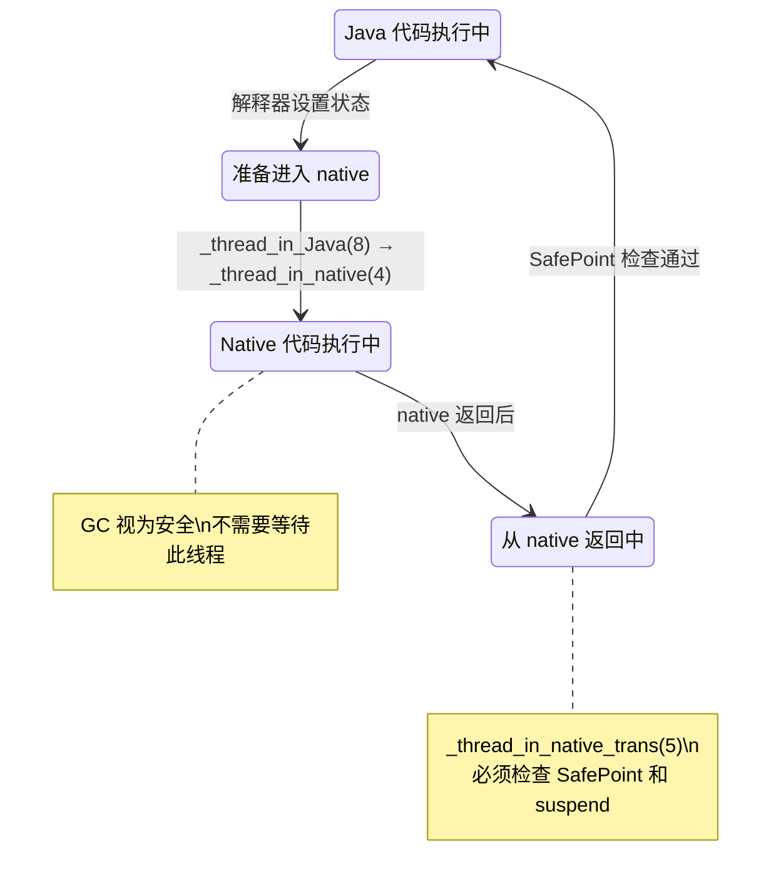
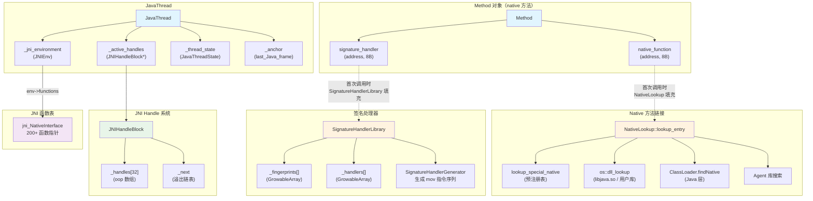

# Native 方法调用深度解析

> 基于 OpenJDK 11 源码分析
> 标准环境：-Xms8g -Xmx8g -XX:+UseG1GC, G1 Region = 4MB
> 源码路径：src/hotspot/share/prims/, src/hotspot/cpu/x86/

---

## 第 0 部分：核心原理

### 0.1 本质是什么？

Native 方法调用的本质问题是：**Java 和 C/C++ 是两个完全不同的世界——调用约定不同、内存管理不同、线程模型不同——如何在两个世界之间安全地来回穿越？**

### 0.2 为什么需要特殊处理？

Java 方法调用在 JVM 内部是完全受控的：参数在 Java 栈上按 JVM 规范排列，GC 随时能找到所有活跃的 oop（对象引用），线程状态始终是 `_thread_in_Java`，SafePoint 可以在任意字节码边界触发。

但 native 方法是一段 C/C++ 代码，它遵循的是 x86-64 System V ABI：参数通过 rdi/rsi/rdx/rcx/r8/r9 和 xmm0-xmm7 传递，不知道 Java 栈的存在，更不知道 GC 的存在。如果在 native 方法执行期间 GC 移动了对象，而 native 代码还持有旧地址，程序就会崩溃。

这意味着调用一个 native 方法不能像调用 Java 方法那样简单地跳转过去，必须做一系列准备和善后工作。

### 0.3 怎么解决？

核心思路：**在 Java 世界和 Native 世界之间建立一道"海关"，每次穿越时执行严格的转换协议。**

关键设计：
1. **参数转换（Signature Handler）**：把 Java 栈上的参数按照 C ABI 重新排列到寄存器和 C 栈上
2. **对象保护（JNI Handle）**：把裸 oop 包装成间接引用（jobject），GC 移动对象时只需更新 Handle 内部的指针，native 代码持有的 jobject 不变
3. **线程状态机（Thread State Transition）**：进入 native 前切换到 `_thread_in_native`，告诉 GC "这个线程不再持有裸 oop"，GC 无需等待此线程到达 SafePoint

### 0.4 为什么这样设计？

**为什么用间接引用（jobject）而不是直接让 native 代码持有 oop？** 因为 GC 会移动对象。如果 native 代码直接持有 oop，GC 就需要扫描所有 native 栈帧来更新指针，而 C 栈帧没有 OopMap，GC 无法知道哪些是 oop、哪些是普通整数。间接引用的代价是多一次解引用，但换来了 GC 完全不需要感知 native 栈。

**为什么切换线程状态而不是让 native 线程也停在 SafePoint？** 因为 native 代码可能执行很长时间（比如阻塞的 I/O），等它到达 SafePoint 会让整个 STW 暂停时间不可控。切换到 `_thread_in_native` 后，GC 视该线程为"安全的"，直接开始工作，极大降低了 native 调用对 GC 暂停时间的影响。

---

## 第 1 部分：数据结构全景

### 1.0 数据结构清单

| # | 结构名 | 角色 | 源码位置 |
|---|--------|------|---------|
| 1 | **Method 的 native 扩展字段** | 存储 native 函数地址和签名处理器 | `method.hpp:1007-1008` |
| 2 | **JNIHandleBlock** | 管理 native 调用期间的对象引用（Local Handle） | `jniHandles.hpp:132-205` |
| 3 | **JavaThreadState** | 线程状态枚举，控制 Java↔Native 转换 | `globalDefinitions.hpp:890-902` |
| 4 | **SignatureHandlerLibrary** | 缓存已生成的签名处理器，避免重复生成 | `interpreterRuntime.cpp:1486-1490` |
| 5 | **jni_NativeInterface** | JNI 函数表，native 代码调用 JVM 功能的入口 | `jni.cpp:3525` |
| 6 | **JNIEnv** | 每线程的 JNI 环境，嵌入在 JavaThread 中 | `thread.hpp:961` |

### 1.1 Method 的 native 扩展字段

#### 问题推导

**问题**：当解释器遇到一个 native 方法时，需要知道两件事——(1) 要跳转到哪个 C 函数？(2) 怎么把 Java 参数搬到 C ABI 寄存器？这两个信息存在哪？

**需要什么信息？**
- native 方法的 C 函数地址——一个 `address`（8 字节指针）
- 参数转换代码的地址（签名处理器）——也是一个 `address`（8 字节）
- 这两个字段只有 native 方法才需要，普通 Java 方法不需要

**推导出的结构**：需要在 Method 对象上附带两个额外的指针字段。由于只有 native 方法才需要，为了不浪费空间，可以把它们放在 Method 对象的尾部——只有 `is_native()` 为 true 时才分配这额外的 16 字节。

#### 真实数据结构

```cpp
// src/hotspot/share/oops/method.hpp:1004-1008
private:
  // Inlined elements
  address* native_function_addr() const {
    assert(is_native(), "must be native");     // 只有 native 方法才能访问
    return (address*) (this+1);                // ★ 紧跟在 Method 对象之后
  }
  address* signature_handler_addr() const {
    return native_function_addr() + 1;         // ★ 紧跟在 native_function 之后
  }
```

**推导 vs 实际**：完全一致。`(this+1)` 意味着紧跟在 Method 对象末尾，`native_function_addr() + 1` 意味着紧跟在 native_function 之后。两个字段共占 16 字节，仅 native 方法才分配。

#### 完整分析

| 字段 | 偏移 | 大小 | 含义 |
|------|------|------|------|
| ★ `native_function` | `sizeof(Method)` | 8 字节 | native 方法对应的 C 函数地址 |
| ★ `signature_handler` | `sizeof(Method)+8` | 8 字节 | 参数转换代码的入口地址 |

**内存布局（x86-64）**：

```
┌──────────────────────────────────┐ offset 0
│        Method 对象本体            │
│   (所有 Java/native 方法共有)     │
├──────────────────────────────────┤ offset = sizeof(Method)
│  native_function    (8 bytes)    │ ← C 函数地址（仅 native 方法）
├──────────────────────────────────┤ offset = sizeof(Method) + 8
│  signature_handler  (8 bytes)    │ ← 签名处理器地址（仅 native 方法）
└──────────────────────────────────┘ offset = sizeof(Method) + 16
```

**生命周期**：

| 阶段 | native_function 的值 | signature_handler 的值 |
|------|---------------------|----------------------|
| 方法创建时 | `SharedRuntime::native_method_throw_unsatisfied_link_error_entry()` | NULL |
| 首次调用（链接完成） | 真实 C 函数地址 | 生成的参数转换代码地址 |
| `RegisterNatives()` | 用户指定的 C 函数地址 | 不变 |
| `UnregisterNatives()` | 重置为抛 UnsatisfiedLinkError 的桩 | 不变 |

**关键源码 — `set_native_function()`**：

```cpp
// src/hotspot/share/oops/method.cpp:803-831
void Method::set_native_function(address function, bool post_event_flag) {
  assert(function != NULL, "use clear_native_function to unregister natives");
  address* native_function = native_function_addr();

  // 竞争检查：多个线程可能同时尝试设置同一个 native 函数
  // 如果已经是目标值，直接返回，避免不必要的 JVMTI 事件
  address current = *native_function;
  if (current == function) return;

  // JVMTI 支持：如果有 agent 监听 NativeMethodBind 事件，
  // 通知 agent，agent 甚至可以修改绑定的函数地址
  if (post_event_flag && JvmtiExport::should_post_native_method_bind() &&
      function != NULL) {
    JvmtiExport::post_native_method_bind(this, &function);  // agent 可修改 function
  }
  *native_function = function;  // ★ 直接写入 Method 尾部的内存

  // 如果该方法已经被 JIT 编译过，必须使编译结果失效
  // 因为编译结果中嵌入了旧的 native 函数地址
  CompiledMethod* nm = code();
  if (nm != NULL) {
    nm->make_not_entrant();     // ★ 使已编译的 native wrapper 失效
  }
}
```

**设计决策**：为什么 `set_native_function()` 要让编译结果失效？因为 C2 编译器生成的 native wrapper（`generate_native_wrapper()`）会把 native 函数地址硬编码到生成代码中。如果 `RegisterNatives()` 更换了 C 函数，但旧的编译结果还在用旧地址，就会调错函数。

---

### 1.2 JNIHandleBlock — Local Handle 管理器

#### 问题推导

**问题**：native 方法执行期间可能通过 JNI 函数（如 `NewObject()`、`GetObjectField()`）获取多个 Java 对象引用。这些引用不能是裸 oop（GC 会移动对象），那用什么形式保存？native 方法返回后，这些引用又该如何批量释放？

**需要什么信息？**
- 每个 native 调用需要一个 **容器** 来存放所有 Local Handle
- Handle 本质上是 oop 的间接引用：native 代码持有 `jobject`（指向容器中某个槽位的指针），槽位里存真实 oop
- 容器要支持快速分配（`allocate_handle()` 在 JNI 热路径上），native 返回时批量释放（不逐个 delete，直接重置）
- 一次 native 调用通常只用几个到十几个 Handle，但极端情况下可能用很多

**推导出的结构**：
- 固定大小的数组作为基本块——快速分配（`_top++`），批量释放（`_top = 0`）
- 如果不够用，链表串接多个块
- 数组大小不能太大（浪费内存）也不能太小（频繁扩展），32 是一个合理折中

#### 真实数据结构

```cpp
// src/hotspot/share/runtime/jniHandles.hpp:132-161
class JNIHandleBlock : public CHeapObj<mtInternal> {
 private:
  enum SomeConstants {
    block_size_in_oops  = 32              // ★ 每个 block 容纳 32 个 Handle
  };

  oop             _handles[block_size_in_oops]; // ★ oop 数组，就是 Handle 的存储区
  int             _top;                         // ★ 下一个空闲槽位的索引
  JNIHandleBlock* _next;                        // ★ 溢出时链接到下一个 block

  // 以下字段仅链表头节点使用
  JNIHandleBlock* _last;                        // 链表尾部（加速追加）
  JNIHandleBlock* _pop_frame_link;              // PushLocalFrame/PopLocalFrame 支持
  oop*            _free_list;                   // 空闲槽位链表（用于回收后重用）
  int             _allocate_before_rebuild;     // 在重建 free_list 前还能分配几个 block

  static JNIHandleBlock* _block_free_list;      // ★ 全局 block 回收池
  static int      _blocks_allocated;            // 统计：已分配 block 总数
};
```

**推导 vs 实际**：基本吻合。预期是固定数组+链表，实际正是如此。额外的 `_free_list` 和 `_allocate_before_rebuild` 是优化设计，用于在多次 native 调用之间复用已释放的槽位，而非简单的 `_top = 0` 重置。

#### 完整分析

**内存布局（x86-64）**：

```
JNIHandleBlock (sizeof ≈ 360 bytes)
┌────────────────────────────────────┐ offset 0
│ _handles[0]     (8 bytes = oop)    │ ← jobject 指向这里
│ _handles[1]                        │
│ ...                                │
│ _handles[31]                       │
├────────────────────────────────────┤ offset 256 (32 × 8)
│ _top            (4 bytes, int)     │ ← 下一个空闲槽位索引
│ [padding]       (4 bytes)          │
├────────────────────────────────────┤ offset 264
│ _next           (8 bytes, ptr)     │ ← 溢出链表
├────────────────────────────────────┤ offset 272
│ _last           (8 bytes, ptr)     │
│ _pop_frame_link (8 bytes, ptr)     │
│ _free_list      (8 bytes, ptr)     │
│ _allocate_before_rebuild (4, int)  │
│ _planned_capacity (8, size_t)      │
│ ...                                │
└────────────────────────────────────┘
```

**jobject 的本质**：

```
native 代码          JNIHandleBlock            Java 堆
                  ┌─────────────┐
jobject ───────── │ _handles[i] │ ──oop──→ [Java对象]
(就是 &_handles[i]) │             │
                  └─────────────┘
```

`jobject` 就是 `&_handles[i]` —— 指向 oop 数组某个槽位的指针。native 代码通过 `JNIHandles::resolve(jobject)` 读取槽位里的 oop 得到真实对象地址。GC 移动对象时，更新 `_handles[i]` 里的 oop 值即可，`jobject`（即槽位地址）不变。

**生命周期**：

| 阶段 | 动作 |
|------|------|
| 进入 native 方法前 | JavaThread 的 `_active_handles` 已指向一个 JNIHandleBlock |
| native 执行中 | 每次 JNI 调用（如 `NewObject()`）通过 `allocate_handle()` 分配一个槽位 |
| native 返回后 | 解释器重置 `_active_handles->_top = 0`（见 generate_native_entry:1166） |
| 如果有溢出 block | `release_block()` 把多余的 block 归还到全局 `_block_free_list` |

**关键代码 — 解释器中重置 Handle Block**：

```cpp
// src/hotspot/cpu/x86/templateInterpreterGenerator_x86.cpp:1165-1166
// native 方法返回后，重置 handle block 的 _top 为 0
__ movptr(t, Address(thread, JavaThread::active_handles_offset()));
__ movl(Address(t, JNIHandleBlock::top_offset_in_bytes()), (int32_t)NULL_WORD);
```

这两行汇编做了一件事：把 `_active_handles->_top` 设为 0。这是批量释放所有 Local Handle 的核心——不需要逐个释放，直接重置索引。下次分配会覆盖旧值。

**设计决策**：**为什么用固定大小数组+链表，而不是动态数组（类似 `std::vector`）？** 因为 JNIHandleBlock 可能在 GC 扫描期间被遍历（`oops_do()`），GC 需要遍历所有 Local Handle 来更新 oop。固定数组保证遍历时不会遇到 realloc 导致的悬垂指针。另外，`_block_free_list` 提供了全局复用池，避免频繁 malloc/free。

---

### 1.3 JavaThreadState — 线程状态机

#### 问题推导

**问题**：GC 需要在 SafePoint 暂停所有 Java 线程来安全地移动对象。但 native 方法可能长时间执行（比如阻塞 I/O），等它是不现实的。GC 如何知道哪些线程"安全"可以不等？

**需要什么信息？**
- 需要区分线程当前在做什么：执行 Java 代码、执行 native 代码、执行 VM 内部代码
- 执行 native 代码的线程不持有裸 oop（已全部转为 JNI Handle），GC 可以安全地不等它
- 状态切换必须对 GC 可见，否则会出现竞争：线程刚从 native 返回开始访问 oop，GC 却以为它还在 native 中

**推导出的结构**：一个枚举，表示线程当前所处的"世界"。切换时还需要过渡状态，让 GC 发现"这个线程正在切换中"。

#### 真实数据结构

```cpp
// src/hotspot/share/utilities/globalDefinitions.hpp:890-902
enum JavaThreadState {
  _thread_uninitialized     =  0,  // 未初始化（不应出现）
  _thread_new               =  2,  // 正在创建
  _thread_new_trans          =  3,  // （过渡态）
  _thread_in_native         =  4,  // ★ 正在执行 native 代码 → GC 安全
  _thread_in_native_trans    =  5,  // ★ 从 native 返回的过渡态
  _thread_in_vm             =  6,  // 在 VM 内部执行（如 JNI 函数实现内部）
  _thread_in_vm_trans        =  7,  // （过渡态）
  _thread_in_Java           =  8,  // ★ 在执行 Java 字节码/编译代码
  _thread_in_Java_trans      =  9,  // （过渡态）
  _thread_blocked           = 10,  // 被阻塞（如 wait/sleep）
  _thread_blocked_trans      = 11,  // （过渡态）
  _thread_max_state         = 12   // 边界值
};
```

**推导 vs 实际**：完全一致。编号设计很精妙：**每个稳定状态是偶数，对应的过渡状态 = 稳定状态 + 1（奇数）**。这意味着 GC 只需检查 `state & 1` 就知道线程是否在过渡中。

#### Native 调用相关的状态转换



**为什么需要过渡状态（`_trans`）？** 这是为了解决 GC 与线程之间的竞争。考虑这个场景：

1. 线程 T 正从 native 返回，设置 `state = _thread_in_Java`
2. 同一瞬间，VM Thread 发起 SafePoint，检查 T 的状态
3. 如果没有过渡状态，VM Thread 看到 `_thread_in_Java`，要求 T 停下来
4. 但 T 还没来得及检查 SafePoint 标志，继续执行，导致 GC 不安全

有了过渡状态：T 先设置 `state = _thread_in_native_trans`(5)，然后主动检查 SafePoint。VM Thread 看到奇数状态，知道"这个线程正在切换，会自己停下来"。

---

### 1.4 SignatureHandlerLibrary — 签名处理器缓存

#### 问题推导

**问题**：每个 native 方法的参数列表不同，需要不同的参数搬运代码（从 Java 栈 → C ABI 寄存器）。如果每次调用都动态生成这段代码，开销太大。怎么办？

**需要什么信息？**
- 参数搬运代码取决于方法签名——相同签名的方法可以共享同一份代码
- 需要一种"签名 → 生成代码地址"的缓存
- 签名可以用 fingerprint（一个 uint64_t）来压缩表示

**推导出的结构**：两个平行数组——`_fingerprints[i]` 对应 `_handlers[i]`。查找时遍历 fingerprints 匹配，命中则返回对应 handler。

#### 真实数据结构

```cpp
// src/hotspot/share/interpreter/interpreterRuntime.cpp:1486-1490
BufferBlob*              SignatureHandlerLibrary::_handler_blob = NULL;   // ★ 生成代码存放区
address                  SignatureHandlerLibrary::_handler      = NULL;   // 当前写入位置
GrowableArray<uint64_t>* SignatureHandlerLibrary::_fingerprints = NULL;   // ★ 签名指纹数组
GrowableArray<address>*  SignatureHandlerLibrary::_handlers     = NULL;   // ★ 处理器地址数组
address                  SignatureHandlerLibrary::_buffer       = NULL;   // 临时代码缓冲区
```

**推导 vs 实际**：完全一致。两个 `GrowableArray` 组成平行索引，`_handler_blob` 是一块 `BufferBlob`（CodeCache 中的一块内存），所有生成的签名处理器代码都写在这里。

**关键点：签名处理器是一段"自含"的机器码**。它由 `SignatureHandlerGenerator::generate()` 生成，内容是一系列 `mov` 指令，把 Java 参数从栈上搬到 C ABI 寄存器中。

#### JVM 参数

```bash
# 打印签名处理器的生成信息，包括反汇编
-XX:+PrintSignatureHandlers

# 输出示例：
# argument handler #0 for: static java.lang.System.identityHashCode(Ljava/lang/Object;)I
#   (fingerprint = 0x0000000000000061, 28 bytes generated)
#   0x00007f2a1c02e000: mov    -0x8(%r14),%rsi
#   ...
```

---

### 1.5 jni_NativeInterface — JNI 函数表

#### 问题推导

**问题**：native 代码需要调用 JVM 功能（如创建对象、调用方法、访问字段）。它不能直接调用 JVM 内部的 C++ 函数（地址不确定、接口不稳定），怎么办？

**推导**：提供一张函数指针表，native 代码通过固定偏移调用。这就是经典的虚函数表/vtable 模式——JNI 规范定义了表中每个槽位的含义。

#### 真实数据结构

```cpp
// src/hotspot/share/prims/jni.cpp:3524-3525
// Structure containing all jni functions
struct JNINativeInterface_ jni_NativeInterface = {
    NULL,                    // reserved0
    NULL,                    // reserved1
    NULL,                    // reserved2
    NULL,                    // reserved3
    jni_GetVersion,          // offset 4: GetVersion
    jni_DefineClass,         // offset 5: DefineClass
    jni_FindClass,           // offset 6: FindClass
    // ... 200+ 个函数指针
};
```

JNIEnv 就是指向这张表的指针的指针：`JNIEnv* env` → `env->functions` → `jni_NativeInterface`。native 代码调用 `(*env)->FindClass(env, "java/lang/String")` 时，实际是通过函数表索引跳转到 `jni_FindClass()`。

```cpp
// src/hotspot/share/prims/jni.cpp:3872-3878
struct JNINativeInterface_* jni_functions() {
#if INCLUDE_JNI_CHECK
  if (CheckJNICalls) return jni_functions_check();  // 调试模式返回带检查的版本
#endif
  return &jni_NativeInterface;                       // 正常模式返回标准表
}
```

**JVM 参数**：`-Xcheck:jni` 启用检查模式，每个 JNI 调用都会检查参数合法性（如 NULL 检查、类型检查），性能下降但有助于排查 JNI 错误。

---

### 1.6 JNIEnv — 嵌入 JavaThread 的 JNI 环境

#### 问题推导

**问题**：每个 JNI 函数的第一个参数都是 `JNIEnv* env`。native 代码拿到 env 后，如何快速找到当前线程的 JavaThread 对象？每次都调用 `Thread::current()`（TLS 查找）太慢。

**推导**：把 JNIEnv 直接嵌入到 JavaThread 对象中，这样通过简单的指针算术就能从 env 反推出 JavaThread*。

#### 真实数据结构

```cpp
// src/hotspot/share/runtime/thread.hpp:961
JNIEnv        _jni_environment;  // ★ 嵌入在 JavaThread 对象中

// src/hotspot/share/runtime/thread.hpp:1789-1799
static JavaThread* thread_from_jni_environment(JNIEnv* env) {
  // ★ 反向计算：env 地址 - _jni_environment 在 JavaThread 中的偏移 = JavaThread 起始地址
  JavaThread *thread_from_jni_env = (JavaThread*)((intptr_t)env - in_bytes(jni_environment_offset()));
  if (thread_from_jni_env->is_terminated()) {
    thread_from_jni_env->block_if_vm_exited();
    return NULL;
  } else {
    return thread_from_jni_env;
  }
}
```

这是一个经典的 **container_of** 模式（类似 Linux 内核的 `container_of` 宏）：已知结构体某个字段的地址和偏移量，反推结构体起始地址。

**设计决策**：这个设计消除了每次 JNI 调用中的 TLS 查找开销，只需一次减法运算。代价是 JNIEnv 必须固定在 JavaThread 中，不能被移动或释放。

---

## 第 2 部分：算法/流程分析

### 2.0 核心流程概览


### 2.1 Native 方法链接（NativeLookup::lookup_entry）

#### 解决什么问题

当一个 native 方法第一次被调用时，`native_function` 还指向 `SharedRuntime::native_method_throw_unsatisfied_link_error_entry()`。需要找到真正的 C 函数地址。JNI 规范定义了名称映射规则，JVM 按照 4 种格式依次搜索。

#### 真实源码

```cpp
// src/hotspot/share/prims/nativeLookup.cpp:327-367
address NativeLookup::lookup_entry(const methodHandle& method, bool& in_base_library, TRAPS) {
  address entry = NULL;
  in_base_library = false;

  // Step 1: 计算"纯 JNI 名称"，如 Java_com_example_MyClass_myMethod
  char* pure_name = pure_jni_name(method);
  if (pure_name == NULL) {
    return NULL;    // 名称映射失败（非法标识符），将抛 UnsatisfiedLinkError
  }

  // Step 2: 计算参数个数（用于 Windows 的 stdcall 修饰名）
  int args_size = 1                               // JNIEnv*
                + (method->is_static() ? 1 : 0)   // jclass（静态方法）或无（实例方法的 this 已在参数中）
                + method->size_of_parameters();    // Java 参数

  // Step 3: 尝试 4 种名称格式，依次搜索
  // ① 短名称 + OS 前后缀（如 Linux 不需要前后缀，Windows 需要 _XXX@N）
  entry = lookup_style(method, pure_name, "",        args_size, true,  in_base_library, CHECK_NULL);
  if (entry != NULL) return entry;

  // ② 长名称（含参数签名）+ OS 前后缀
  //    长名称用于区分重载方法，如 Java_com_example_MyClass_myMethod__II
  char* long_name = long_jni_name(method);
  if (long_name == NULL) return NULL;
  entry = lookup_style(method, pure_name, long_name, args_size, true,  in_base_library, CHECK_NULL);
  if (entry != NULL) return entry;

  // ③ 短名称，不加 OS 前后缀
  entry = lookup_style(method, pure_name, "",        args_size, false, in_base_library, CHECK_NULL);
  if (entry != NULL) return entry;

  // ④ 长名称，不加 OS 前后缀
  entry = lookup_style(method, pure_name, long_name, args_size, false, in_base_library, CHECK_NULL);

  return entry;  // NULL 表示未找到，最终将抛 UnsatisfiedLinkError
}
```

#### 设计决策

**为什么要 4 种格式？** 为了兼容不同平台的 C 函数命名约定。Linux 上没有前后缀（③④与①②相同），但 Windows 的 stdcall 约定会给函数名加 `_` 前缀和 `@N` 后缀。先尝试有前后缀（更精确），再尝试无前后缀（兼容手动编译的 native 库）。

**lookup_style 内部的搜索顺序**：

```cpp
// src/hotspot/share/prims/nativeLookup.cpp:253-301（核心逻辑简化）
address NativeLookup::lookup_style(/* ... */) {
  const char* jni_name = compute_complete_jni_name(pure_name, long_name, args_size, os_style);

  Handle loader(THREAD, method->method_holder()->class_loader());
  if (loader.is_null()) {
    // ★ Bootstrap ClassLoader 加载的类：先在特殊注册表中查找
    entry = lookup_special_native(jni_name);
    if (entry == NULL) {
      // 再在 libjava.so（核心 Java 库）中查找
      entry = (address) os::dll_lookup(os::native_java_library(), jni_name);
    }
    if (entry != NULL) {
      in_base_library = true;
      return entry;
    }
  }

  // ★ 调用 Java 层的 ClassLoader.findNative()
  // 这会搜索用户通过 System.loadLibrary() 加载的所有 native 库
  JavaCalls::call_static(&result, klass,
                         vmSymbols::findNative_name(),
                         vmSymbols::classloader_string_long_signature(),
                         loader, name_arg, CHECK_NULL);
  entry = (address)(intptr_t) result.get_jlong();

  if (entry == NULL) {
    // ★ 最后搜索 JVMTI agent 库（如 Arthas、async-profiler 的 agent）
    for (agent = Arguments::agents(); agent != NULL; agent = agent->next()) {
      entry = (address) os::dll_lookup(agent->os_lib(), jni_name);
      if (entry != NULL) return entry;
    }
  }

  return entry;
}
```

搜索优先级：**特殊注册表 → 核心库（libjava.so）→ 用户库（System.loadLibrary）→ Agent 库**。

**特殊注册表**用于处理引导问题：`ClassLoader.findNative()` 本身就是一个 native 方法，它的实现在 libjava.so 中。如果通过正常路径查找，就会递归调用自己。所以对 Bootstrap ClassLoader 加载的类，先直接在 libjava.so 中查找。

```cpp
// src/hotspot/share/prims/nativeLookup.cpp:228-240
// 预注册的特殊 native 方法（避免引导问题）
static JNINativeMethod lookup_special_native_methods[] = {
  { CC"Java_jdk_internal_misc_Unsafe_registerNatives",             NULL, FN_PTR(JVM_RegisterJDKInternalMiscUnsafeMethods) },
  { CC"Java_java_lang_invoke_MethodHandleNatives_registerNatives", NULL, FN_PTR(JVM_RegisterMethodHandleMethods) },
  { CC"Java_jdk_internal_perf_Perf_registerNatives",               NULL, FN_PTR(JVM_RegisterPerfMethods) },
  { CC"Java_sun_hotspot_WhiteBox_registerNatives",                 NULL, FN_PTR(JVM_RegisterWhiteBoxMethods) },
  // ...
};
```

#### JVM 参数

```bash
# 打印 native 方法链接过程
-XX:+PrintJNIResolving

# 输出示例：
# [Dynamic-linking native method java.lang.Object.hashCode ... JNI]
# [Registering JNI native method java.lang.System.registerNatives]
```

---

### 2.2 解释器的 Native 入口（generate_native_entry）

这是整个 native 调用的核心——解释器为 native 方法生成的专用入口点。所有通过解释器调用的 native 方法都走这段代码。

#### 解决什么问题

解释器需要一段"胶水代码"来完成 Java 世界到 Native 世界的完整转换：参数转换 → 对象保护 → 状态切换 → 调用 → 返回处理。

#### 真实源码（分阶段分析）

**阶段 1：获取并调用签名处理器**

```cpp
// src/hotspot/cpu/x86/templateInterpreterGenerator_x86.cpp:932-960
// --- 获取 signature handler ---
{
  Label L;
  // ★ 从 Method 对象读取 signature_handler 字段
  __ movptr(t, Address(method, Method::signature_handler_offset()));
  __ testptr(t, t);        // 检查是否为 NULL
  __ jcc(Assembler::notZero, L);  // 非 NULL → 直接使用

  // ★ NULL → 首次调用，需要准备（链接 + 生成 handler）
  __ call_VM(noreg,
             CAST_FROM_FN_PTR(address, InterpreterRuntime::prepare_native_call),
             method);
  __ get_method(method);   // call_VM 可能导致 GC，重新加载 method
  __ movptr(t, Address(method, Method::signature_handler_offset()));
  __ bind(L);
}

// ★ 调用签名处理器：把 Java 参数搬到 C ABI 寄存器
// 输入：rlocals 指向 Java 参数区域
// 输出：c_rarg1-c_rarg5 / xmm0-xmm7 装好了 C 参数
//        rax = result_handler（返回值类型处理器）
__ call(t);                // 调用 signature handler
__ get_method(method);     // handler 可能触发 GC（慢路径），重新加载
```

**阶段 2：设置 static 方法的 mirror handle + 获取 native 函数地址**

```cpp
// src/hotspot/cpu/x86/templateInterpreterGenerator_x86.cpp:969-1005
// --- 静态方法需要传递 Class 对象 ---
{
  Label L;
  __ movl(t, Address(method, Method::access_flags_offset()));
  __ testl(t, JVM_ACC_STATIC);
  __ jcc(Assembler::zero, L);    // 实例方法跳过

  // ★ 静态方法：第二个参数是 jclass（类的 mirror 对象的 handle）
  __ load_mirror(t, method, rax);
  // 把 mirror 存到栈帧的 oop_temp 位置（GC 可见）
  __ movptr(Address(rbp, frame::interpreter_frame_oop_temp_offset * wordSize), t);
  // c_rarg1 指向 oop_temp 的地址（这就是 jobject）
  __ lea(c_rarg1, Address(rbp, frame::interpreter_frame_oop_temp_offset * wordSize));
  __ bind(L);
}

// --- 获取 native 函数地址 ---
{
  Label L;
  __ movptr(rax, Address(method, Method::native_function_offset()));
  // ★ 检查是否仍是"未链接"桩
  ExternalAddress unsatisfied(SharedRuntime::native_method_throw_unsatisfied_link_error_entry());
  __ cmpptr(rax, unsatisfied.addr());
  __ jcc(Assembler::notEqual, L);  // 已链接 → 直接使用

  // 未链接 → 调用 prepare_native_call 进行延迟链接
  __ call_VM(noreg, CAST_FROM_FN_PTR(address, InterpreterRuntime::prepare_native_call), method);
  __ get_method(method);
  __ movptr(rax, Address(method, Method::native_function_offset()));
  __ bind(L);
}
```

**阶段 3：设置 JNIEnv + last_Java_frame + 线程状态切换 + 调用**

```cpp
// src/hotspot/cpu/x86/templateInterpreterGenerator_x86.cpp:1017-1043
// ★ c_rarg0 = JNIEnv*（native 函数的第一个参数）
__ lea(c_rarg0, Address(r15_thread, JavaThread::jni_environment_offset()));

// ★ set_last_Java_frame：记录当前 Java 栈帧信息
// 目的：native 执行期间如果发生异常/GC，VM 需要找到最后一个 Java 帧来回溯栈
__ set_last_Java_frame(rsp, rbp, (address) __ pc());

// ★ 切换线程状态：_thread_in_Java(8) → _thread_in_native(4)
// 此后 GC 认为该线程安全，不会等待它
__ movl(Address(thread, JavaThread::thread_state_offset()), _thread_in_native);

// ★★★ 调用 native 函数！ ★★★
// rax = native_function 地址（之前已加载）
// c_rarg0 = JNIEnv*, c_rarg1 = jclass/this, c_rarg2... = 参数
__ call(rax);
```

**阶段 4：Native 返回后的安全过渡**

```cpp
// src/hotspot/cpu/x86/templateInterpreterGenerator_x86.cpp:1081-1166
// 保存返回值（native 返回值在 rax 或 xmm0 中）
__ push(dtos);    // 保存 double/float 返回值（xmm0 → 栈）
__ push(ltos);    // 保存 long/int 返回值（rax → 栈）

// ★ 线程状态：_thread_in_native(4) → _thread_in_native_trans(5)
// 这是过渡状态，告诉 VM "我正在返回，马上检查 SafePoint"
__ movl(Address(thread, JavaThread::thread_state_offset()), _thread_in_native_trans);

// ★ 内存屏障：确保状态写入对其他 CPU 可见
if (os::is_MP()) {
  if (UseMembar) {
    __ membar(Assembler::Membar_mask_bits(
         Assembler::LoadLoad | Assembler::LoadStore |
         Assembler::StoreLoad | Assembler::StoreStore));
  } else {
    __ serialize_memory(thread, rcx);  // 写 serialization page
  }
}

// ★ SafePoint 检查：如果 GC 正在等待，则阻塞在这里直到 GC 完成
{
  Label Continue, slow_path;
  __ safepoint_poll(slow_path, r15_thread, rscratch1);

  // 检查是否有 suspend 请求（如 Thread.suspend()）
  __ cmpl(Address(thread, JavaThread::suspend_flags_offset()), 0);
  __ jcc(Assembler::equal, Continue);

  __ bind(slow_path);
  // ★ 进入慢路径：调用 check_special_condition_for_native_trans
  // 该函数会处理 SafePoint 同步和 suspend 请求
  __ mov(c_rarg0, r15_thread);
  __ call(RuntimeAddress(CAST_FROM_FN_PTR(address,
          JavaThread::check_special_condition_for_native_trans)));

  __ bind(Continue);
}

// ★ 线程状态：_thread_in_native_trans(5) → _thread_in_Java(8)
// 此后该线程重新被 GC 视为"不安全"，必须在 SafePoint 停下来
__ movl(Address(thread, JavaThread::thread_state_offset()), _thread_in_Java);

// ★ 清除 last_Java_frame
__ reset_last_Java_frame(thread, true);

// ★ 重置 JNI Handle Block（批量释放所有 Local Handle）
__ movptr(t, Address(thread, JavaThread::active_handles_offset()));
__ movl(Address(t, JNIHandleBlock::top_offset_in_bytes()), (int32_t)NULL_WORD);
```

这段代码的执行顺序严格不可调换。特别是：
- **必须在 `_thread_in_native_trans` 之后才能检查 SafePoint**：否则 GC 可能在检查前移动了对象
- **必须在切回 `_thread_in_Java` 之后才能重置 Handle Block**：否则 GC 可能正在扫描 Handle Block
- **内存屏障在状态写入后立即执行**：确保 VM Thread 能看到最新的线程状态

---

### 2.3 签名处理器生成（SignatureHandlerGenerator）

#### 解决什么问题

Java 方法的参数在 Java 栈上从高地址到低地址排列（第一个参数在最高地址），而 x86-64 System V ABI 要求前 6 个整数参数放在 rdi/rsi/rdx/rcx/r8/r9，前 8 个浮点参数放在 xmm0-xmm7，多余的放栈上。签名处理器就是把参数从 Java 布局搬到 C 布局的一段机器码。

#### 真实源码

以 `pass_int()` 为例（Linux x86-64，非 Windows）：

```cpp
// src/hotspot/cpu/x86/interpreterRT_x86_64.cpp:84-112
void InterpreterRuntime::SignatureHandlerGenerator::pass_int() {
  // src = Java 栈上参数的地址，from() = r14 = rlocals（Java 局部变量区基址）
  const Address src(from(), Interpreter::local_offset_in_bytes(offset()));

  // ★ _num_int_args 从 0 或 1 开始（static 方法从 1 开始，因为 c_rarg0 留给 JNIEnv*）
  switch (_num_int_args) {
  case 0:
    __ movl(c_rarg1, src);     // 第 1 个整数参数 → rsi (c_rarg1)
    _num_int_args++;
    break;
  case 1:
    __ movl(c_rarg2, src);     // 第 2 个 → rdx
    _num_int_args++;
    break;
  case 2:
    __ movl(c_rarg3, src);     // 第 3 个 → rcx
    _num_int_args++;
    break;
  case 3:
    __ movl(c_rarg4, src);     // 第 4 个 → r8
    _num_int_args++;
    break;
  case 4:
    __ movl(c_rarg5, src);     // 第 5 个 → r9
    _num_int_args++;
    break;
  default:
    __ movl(rax, src);                               // 超出寄存器范围 →
    __ movl(Address(to(), _stack_offset), rax);      // 放到 C 栈上
    _stack_offset += wordSize;
    break;
  }
}
```

**注意：c_rarg0 永远留给 JNIEnv***，所以 Java 的第一个参数从 c_rarg1 开始。对于实例方法，c_rarg1 = this（`jobject`）；对于静态方法，c_rarg1 = jclass。

以 `pass_object()` 为例（对象参数需要特殊处理）：

```cpp
// src/hotspot/cpu/x86/interpreterRT_x86_64.cpp:247-291（Linux 部分）
void InterpreterRuntime::SignatureHandlerGenerator::pass_object() {
  const Address src(from(), Interpreter::local_offset_in_bytes(offset()));

  switch (_num_int_args) {
  case 0:
    // ★ 第一个参数且是 receiver：直接取地址（receiver 不为 null）
    assert(offset() == 0, "argument register 1 can only be (non-null) receiver");
    __ lea(c_rarg1, src);    // c_rarg1 = &局部变量[0]（这就是 jobject）
    _num_int_args++;
    break;
  case 1:  // case 2, 3, 4 类似
    // ★ 非 receiver 的对象参数需要 null 检查
    __ lea(rax, src);                           // rax = 参数地址
    __ xorl(c_rarg2, c_rarg2);                  // c_rarg2 = 0（预设为 NULL）
    __ cmpptr(src, 0);                          // 检查参数值是否为 null
    __ cmov(Assembler::notEqual, c_rarg2, rax); // 非 null → c_rarg2 = 地址
    _num_int_args++;                            // null → c_rarg2 = 0
    break;
  // ...
  }
}
```

**关键洞察**：对象参数传递的是 **oop 在 Java 栈上的地址**（`&局部变量[i]`），而不是 oop 本身。这意味着 native 代码拿到的 `jobject` 指向的是 Java 栈上的一个 oop 槽位。这也是 "handlize" 的一种形式——解释器的局部变量区本身就充当了 Handle。但如果 oop 为 null，则传 NULL（不能传一个指向 0 的地址）。

最后是 `generate()` 方法，把所有参数处理串起来：

```cpp
// src/hotspot/cpu/x86/interpreterRT_x86_64.cpp:294-300
void InterpreterRuntime::SignatureHandlerGenerator::generate(uint64_t fingerprint) {
  iterate(fingerprint);  // ★ 遍历签名中的每个参数，调用 pass_int/pass_long/pass_float/pass_object

  // ★ 返回 result_handler 的地址（告诉调用者返回值是什么类型、如何处理）
  __ lea(rax, ExternalAddress(Interpreter::result_handler(method()->result_type())));
  __ ret(0);
}
```

---

### 2.4 prepare_native_call — 延迟链接的触发点

#### 解决什么问题

这是解释器在发现 native 方法尚未链接时调用的 VM 运行时函数。它完成两件事：查找 C 函数地址 + 生成签名处理器。

#### 真实源码

```cpp
// src/hotspot/share/interpreter/interpreterRuntime.cpp:1493-1507
IRT_ENTRY(void, InterpreterRuntime::prepare_native_call(JavaThread* thread, Method* method))
  methodHandle m(thread, method);
  assert(m->is_native(), "sanity check");

  // ★ 第一步：如果 native 函数尚未绑定，执行 JNI 名称查找
  bool in_base_library;
  if (!m->has_native_function()) {
    NativeLookup::lookup(m, in_base_library, CHECK);
  }

  // ★ 第二步：生成签名处理器（如果还没生成）
  // 注意：必须在链接成功后才生成，因为生成需要方法信息
  SignatureHandlerLibrary::add(m);

  // 设计要点：解释器先检查 signature_handler，再检查 native_function。
  // 所以这里必须最后设置 signature_handler，保证其他线程看到非 null 的
  // signature_handler 时，native_function 一定也已经设好了。
IRT_END
```

**设计决策**：注释中明确说明了**内存可见性问题**——多个线程可能同时调用同一个 native 方法的首次执行。解释器的代码先检查 `signature_handler`，如果非 null 就认为已准备好。所以 `prepare_native_call` 必须保证 `native_function` 在 `signature_handler` 之前写入。`SignatureHandlerLibrary::add()` 内部通过 `MutexLocker` 保证了有序性。

---

### 2.5 RegisterNatives — 显式注册 native 函数

#### 解决什么问题

除了 JNI 名称自动查找，Java 代码还可以通过 `RegisterNatives()` 显式指定 native 方法与 C 函数的映射关系。很多 JDK 核心类（如 `System`、`Object`、`Thread`）都在 `registerNatives()` 中注册。

#### 真实源码

```cpp
// src/hotspot/share/prims/jni.cpp:3013-3050
JNI_ENTRY(jint, jni_RegisterNatives(JNIEnv *env, jclass clazz,
                                    const JNINativeMethod *methods,
                                    jint nMethods))
  jint ret = 0;

  // ★ 从 jclass 解析出 Klass*
  Klass* k = java_lang_Class::as_Klass(JNIHandles::resolve_non_null(clazz));

  for (int index = 0; index < nMethods; index++) {
    const char* meth_name = methods[index].name;
    const char* meth_sig = methods[index].signature;

    // ★ 在 SymbolTable 中查找方法名和签名
    // 类已加载，所以 name 和 signature 一定已在 SymbolTable 中
    TempNewSymbol name = SymbolTable::probe(meth_name, (int)strlen(meth_name));
    TempNewSymbol signature = SymbolTable::probe(meth_sig, (int)strlen(meth_sig));

    if (name == NULL || signature == NULL) {
      // 方法不存在
      THROW_MSG_(vmSymbols::java_lang_NoSuchMethodError(), st.as_string(), -1);
    }

    // ★ 调用 register_native 执行注册
    bool res = register_native(k, name, signature,
                               (address) methods[index].fnPtr, THREAD);
    if (!res) { ret = -1; break; }
  }
  return ret;
JNI_END
```

```cpp
// src/hotspot/share/prims/jni.cpp:2972-3007（核心注册逻辑）
static bool register_native(Klass* k, Symbol* name, Symbol* signature, address entry, TRAPS) {
  Method* method = k->lookup_method(name, signature);
  if (method == NULL) {
    THROW_MSG_(vmSymbols::java_lang_NoSuchMethodError(), /* ... */, false);
  }
  if (!method->is_native()) {
    // 不是 native 方法，检查是否有 JVMTI prefix
    method = find_prefixed_native(k, name, signature, THREAD);
    if (method == NULL) {
      THROW_MSG_(vmSymbols::java_lang_NoSuchMethodError(),
                 "Method is not declared as native", false);
    }
  }

  if (entry != NULL) {
    // ★ 核心操作：设置 native 函数地址
    method->set_native_function(entry, Method::native_bind_event_is_interesting);
  } else {
    method->clear_native_function();  // entry==NULL → 取消注册
  }
  return true;
}
```

**JVM 参数**：

```bash
# 打印 RegisterNatives 调用
-XX:+PrintJNIResolving

# 输出示例：
# [Registering JNI native method java.lang.Object.hashCode]
# [Registering JNI native method java.lang.System.arraycopy]
```

---

### 2.6 JNI 函数中的线程状态恢复 — JNI_ENTRY 宏

#### 解决什么问题

当 native 代码调用 JNI 函数（如 `FindClass()`、`NewObject()`）时，需要重新回到 VM 内部执行。这意味着线程状态要从 `_thread_in_native` 切换到 `_thread_in_vm`，并且可能需要处理 SafePoint。JNI_ENTRY 宏封装了这个过程。

#### 真实源码

```cpp
// src/hotspot/share/runtime/interfaceSupport.inline.hpp:515-527
#define JNI_ENTRY(result_type, header)                               \
    JNI_ENTRY_NO_PRESERVE(result_type, header)                       \
    WeakPreserveExceptionMark __wem(thread);

#define JNI_ENTRY_NO_PRESERVE(result_type, header)                   \
extern "C" {                                                         \
  result_type JNICALL header {                                       \
    // ★ 从 JNIEnv* 反推 JavaThread*（指针算术，不需要 TLS 查找）
    JavaThread* thread=JavaThread::thread_from_jni_environment(env); \
    assert(!VerifyJNIEnvThread || (thread == Thread::current()), "JNIEnv is only valid in same thread"); \
    // ★ 线程状态：_thread_in_native → _thread_in_vm
    // 这个 RAII 对象在构造时切换到 vm，析构时切回 native
    ThreadInVMfromNative __tiv(thread);                              \
    debug_only(VMNativeEntryWrapper __vew;)                          \
    VM_ENTRY_BASE(result_type, header, thread)
```

**关键类 `ThreadInVMfromNative`**：

```cpp
// src/hotspot/share/runtime/interfaceSupport.inline.hpp:158-177（简化）
static inline void transition_from_native(JavaThread *thread, JavaThreadState to) {
  assert(thread->thread_state() == _thread_in_native, "coming from wrong thread state");

  // ★ 先设过渡状态
  thread->set_thread_state(_thread_in_native_trans);

  // ★ 内存屏障
  InterfaceSupport::serialize_thread_state_with_handler(thread);

  // ★ SafePoint 和 suspend 检查
  if (SafepointMechanism::poll(thread) || thread->is_suspend_after_native()) {
    JavaThread::check_safepoint_and_suspend_for_native_trans(thread);
  }

  // ★ 切换到目标状态（_thread_in_vm）
  thread->set_thread_state(to);
}
```

这与 `generate_native_entry` 中 native 返回后的状态切换完全对称：
- native 返回 → `_thread_in_native_trans` → SafePoint 检查 → `_thread_in_Java`
- JNI 函数入口 → `_thread_in_native_trans` → SafePoint 检查 → `_thread_in_vm`

每次穿越 native/vm 边界都必须经过过渡状态 + SafePoint 检查。

---

## 第 3 部分：数据结构关系图



---

## 第 4 部分：JVM 参数汇总

| 参数 | 作用 | 输出示例 |
|------|------|---------|
| `-XX:+PrintJNIResolving` | 打印 native 方法链接和注册过程 | `[Dynamic-linking native method java.lang.Object.hashCode ... JNI]` |
| `-XX:+PrintSignatureHandlers` | 打印签名处理器的生成，含反汇编 | `argument handler #0 for: static ... (28 bytes generated)` |
| `-Xcheck:jni` | 启用 JNI 调用检查（类型/NULL/线程检查） | JNI WARNING: ... |
| `-XX:+CheckJNICalls` | 使用带检查的 JNI 函数表 | 内部使用 |
| `-verbose:jni` | 打印 JNI 相关的动态链接信息 | 同 PrintJNIResolving |

---

## 第 5 部分：总结

### 5.1 核心要点

1. **native 方法的函数地址和签名处理器紧跟在 Method 对象尾部**（仅 native 方法额外 16 字节），采用延迟链接——首次调用时才查找和生成。

2. **JNI Handle 是裸 oop 的间接引用**——`jobject` 本质是指向 `JNIHandleBlock._handles[i]` 的指针。GC 移动对象时只需更新数组中的 oop，`jobject` 值不变。native 返回后通过 `_top = 0` 批量释放。

3. **线程状态机是 Java↔Native 安全穿越的核心**——`_thread_in_native` 状态下 GC 不需要等待该线程，因为所有 oop 都被 Handle 保护。返回时必须经过 `_thread_in_native_trans` 过渡态 + SafePoint 检查。

4. **签名处理器是一段生成的机器码**，把 Java 栈上的参数搬到 C ABI 寄存器。相同签名的方法共享同一份处理器（通过 fingerprint 缓存）。

5. **JNIEnv 嵌入在 JavaThread 中**，通过 `container_of` 指针算术反推 JavaThread*，避免 TLS 查找开销。

### 5.2 关联知识

- **generate_native_wrapper()**（`sharedRuntime_x86_64.cpp:1855-2574`）：C2 编译器为 native 方法生成的优化版本，原理类似但参数搬运更高效（Grand Shuffle）
- **Critical JNI**：跳过 JNI Handle 和线程状态切换，直接传裸指针，用于性能关键的简单 native 方法（限制：不能有对象参数、必须 static、不能同步）
- **SafePoint 机制**：native 返回时的 SafePoint 检查与全局 SafePoint 协议的关系
- **Method 对象布局**：`Method` 的完整字段分析（参考 ObjectModel 文档）

### 5.3 常见误解

| 误解 | 真相 |
|------|------|
| "native 方法比 Java 方法快" | 错。native 调用有额外开销（状态切换、Handle 管理、参数转换），简单方法反而比 JIT 编译的 Java 代码慢 |
| "jobject 就是 oop" | 错。jobject 是 oop 的间接引用（指向存放 oop 的位置），native 代码必须通过 JNI 函数解引用 |
| "native 方法执行时 GC 不能运行" | 恰恰相反。线程在 `_thread_in_native` 状态时 GC 可以正常运行，因为该线程的所有 oop 都已被 Handle 保护 |
| "RegisterNatives 后就不需要 System.loadLibrary 了" | 两者解决不同问题。RegisterNatives 指定方法→函数的映射，但函数代码仍需要加载到内存（通过 System.loadLibrary 加载 .so/.dll） |

---

> 本文档基于 OpenJDK 11 源码，核心文件：
> - `src/hotspot/share/oops/method.hpp` / `method.cpp`
> - `src/hotspot/share/prims/nativeLookup.cpp`
> - `src/hotspot/cpu/x86/templateInterpreterGenerator_x86.cpp`
> - `src/hotspot/cpu/x86/interpreterRT_x86_64.cpp`
> - `src/hotspot/share/runtime/jniHandles.hpp`
> - `src/hotspot/share/runtime/interfaceSupport.inline.hpp`
> - `src/hotspot/share/prims/jni.cpp`
> - `src/hotspot/share/interpreter/interpreterRuntime.cpp`
